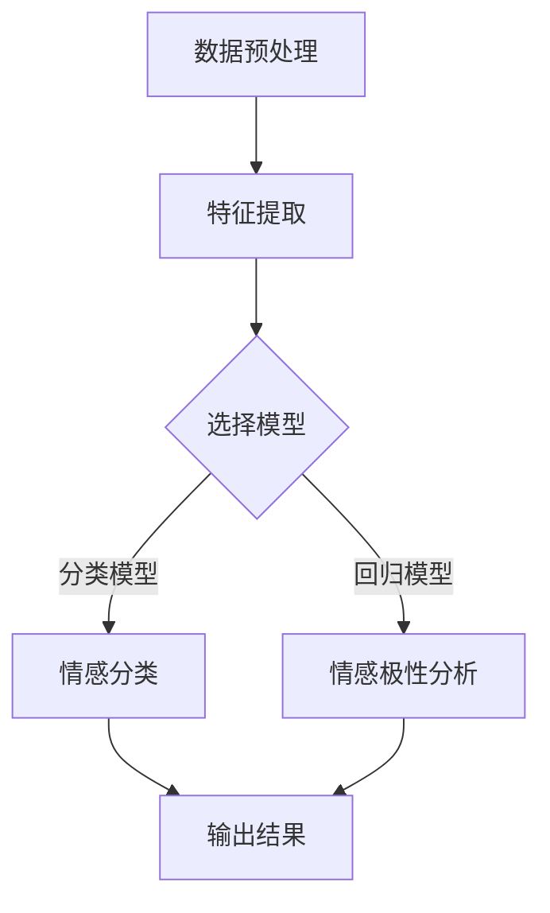

                 


### 智能情感分析：利用提示词深入理解用户反馈

关键词：智能情感分析、用户反馈、提示词、深度学习、自然语言处理、机器学习、情感分类、情感极性、情感强度、模型训练、模型评估

摘要：本文将探讨智能情感分析技术在处理用户反馈中的应用，通过介绍智能情感分析的基本概念、核心算法原理、数学模型，以及实际项目案例，帮助读者深入理解如何利用提示词进行用户情感分析，提升产品和服务质量。

---

#### 1. 引言

随着互联网和社交媒体的普及，用户生成的内容（User-Generated Content, UGC）成为企业和组织了解用户需求、优化产品和服务的重要途径。用户反馈作为UGC的一部分，包含了用户对产品、服务的态度、情感和意见。如何有效地分析这些反馈，提取有价值的信息，成为当前研究的热点。智能情感分析技术作为一种自然语言处理（Natural Language Processing, NLP）的高级应用，正逐渐成为解决这一问题的有力工具。

#### 2. 智能情感分析概述

2.1 定义

智能情感分析（Sentiment Analysis）是指使用自然语言处理（NLP）技术和机器学习（Machine Learning, ML）方法，自动识别和提取文本中的情感信息。情感信息通常包括情感极性（Polarity）、情感强度（Intensity）和情感类别（Category）。

2.2 重要性

用户反馈中的情感信息对企业的产品改进、市场营销策略制定和用户体验优化具有重要意义。通过智能情感分析，企业可以快速、准确地了解用户的真实感受，从而做出更加科学、有效的决策。

2.3 应用领域

智能情感分析广泛应用于客户服务、市场研究、社交媒体监控、金融预测等领域。例如，企业可以通过分析客户评价来识别产品问题，并通过社交媒体监控来了解公众对品牌和产品的态度。

#### 3. 核心概念与联系

3.1 情感分类

情感分类（Sentiment Classification）是情感分析中最基本的任务，旨在将文本分类为正面、负面或中性。情感分类通常使用机器学习算法，如支持向量机（SVM）、朴素贝叶斯（Naive Bayes, NB）和随机森林（Random Forest, RF）。

3.2 情感极性

情感极性（Sentiment Polarity）是指文本情感的倾向性，通常用正负数值表示。情感极性分析可以帮助识别文本的主要情感倾向。

3.3 情感强度

情感强度（Sentiment Intensity）是指情感表达的强烈程度。情感强度分析可以帮助识别文本情感的强度，为后续的决策提供更细致的信息。

3.4 Mermaid流程图

以下是一个简单的Mermaid流程图，展示了情感分析的基本流程：



#### 4. 核心算法原理讲解

4.1 支持向量机（SVM）

支持向量机（Support Vector Machine, SVM）是一种常用的情感分类算法。SVM的基本思想是找到一个最佳的超平面，将不同情感的文本数据分离。

```python
# SVM伪代码
def SVM(train_data, train_labels):
    # 训练SVM模型
    model = train_svm_model(train_data, train_labels)
    # 预测新数据
    predictions = model.predict(test_data)
    return predictions
```

4.2 朴素贝叶斯（NB）

朴素贝叶斯（Naive Bayes, NB）是一种基于贝叶斯定理的简单概率分类器。NB假设特征之间相互独立，这使得它适用于文本数据的情感分类。

```python
# NB伪代码
def NaiveBayes(train_data, train_labels):
    # 计算先验概率和条件概率
    probabilities = calculate_probabilities(train_data, train_labels)
    # 预测新数据
    predictions = predict_with_probabilities(test_data, probabilities)
    return predictions
```

4.3 随机森林（RF）

随机森林（Random Forest, RF）是一种基于决策树集合的集成学习方法。RF通过构建多个决策树，并取多数投票结果作为最终预测。

```python
# RF伪代码
def RandomForest(train_data, train_labels):
    # 训练随机森林模型
    model = train_rf_model(train_data, train_labels)
    # 预测新数据
    predictions = model.predict(test_data)
    return predictions
```

#### 5. 数学模型和数学公式

5.1 情感分类模型

情感分类模型通常使用逻辑回归（Logistic Regression, LR）或支持向量机（SVM）等算法实现。以下是一个简单的逻辑回归公式：

$$
P(Y=1) = \frac{1}{1 + e^{-(\beta_0 + \beta_1x_1 + \beta_2x_2 + ... + \beta_nx_n})}
$$

其中，\(Y\) 为情感类别，\(x_1, x_2, ..., x_n\) 为特征值，\(\beta_0, \beta_1, \beta_2, ..., \beta_n\) 为模型参数。

5.2 情感极性与强度模型

情感极性通常使用极性得分（Polarity Score）表示，情感强度使用强度得分（Intensity Score）表示。以下是一个简单的情感极性模型公式：

$$
Polarity = \frac{Positive \ Sentiments - Negative \ Sentiments}{Positive \ Sentiments + Negative \ Sentiments}
$$

情感强度模型可以使用以下公式：

$$
Intensity = \sum_{i=1}^{n} (Weight_i \times Intensity_i)
$$

其中，\(Weight_i\) 为特征权重，\(Intensity_i\) 为特征强度。

#### 6. 项目实战

6.1 项目背景

本案例以一个电商平台的产品评论分析项目为例，使用智能情感分析技术对用户评论进行情感分类和极性分析。

6.2 开发环境搭建

本案例使用的开发环境包括Python 3.8、Jupyter Notebook、scikit-learn、nltk等。

6.3 数据处理流程

6.3.1 数据收集

从电商平台的评论数据中收集1000条用户评论。

6.3.2 数据清洗

去除评论中的HTML标签、特殊字符和停用词。

6.3.3 数据预处理

将清洗后的评论数据转化为词向量表示，使用TF-IDF算法进行特征提取。

6.4 特征提取与模型选择

使用TF-IDF算法提取特征，并选择支持向量机（SVM）作为情感分类模型。

6.5 模型评估与优化

使用准确率、召回率、F1分数等指标评估模型性能，并进行模型优化。

#### 7. 情感分析工具与资源

7.1 常用情感分析工具

- NLTK：Python自然语言处理库，提供情感分析相关功能。
- TextBlob：Python情感分析库，基于NLTK，提供简单的情感分析接口。
- Stanford CoreNLP：Java自然语言处理工具包，提供情感分析、词性标注等功能。

7.2 情感分析开源库

- VADER：一个专门用于社交媒体文本的情感分析工具。
- AFINN：一个包含情感极性分数的单词列表。
- Sentiment140：一个包含情感极性的Twitter语料库。

#### 8. 情感分析未来发展趋势

8.1 情感分析的新方法

- 基于深度学习的情感分析：使用神经网络模型，如卷积神经网络（CNN）和循环神经网络（RNN），进行情感分析。
- 多模态情感分析：结合文本、语音、图像等多模态数据，进行情感分析。
- 跨语言情感分析：实现不同语言之间的情感分析。

8.2 情感分析在企业中的应用

- 客户服务：通过智能情感分析，快速识别客户投诉和反馈，提供个性化服务。
- 社交媒体分析：监控社交媒体上的品牌口碑，及时应对负面舆论。
- 产品评论分析：分析用户对产品的评价，优化产品设计和推广策略。

#### 9. 总结与展望

本文介绍了智能情感分析的基本概念、核心算法原理、数学模型，并通过实际项目案例展示了情感分析的应用。随着技术的不断发展，智能情感分析在未来将有更广泛的应用前景。

---

作者：AI天才研究院/AI Genius Institute & 禅与计算机程序设计艺术 /Zen And The Art of Computer Programming

