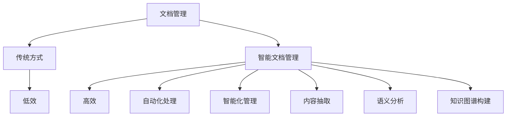
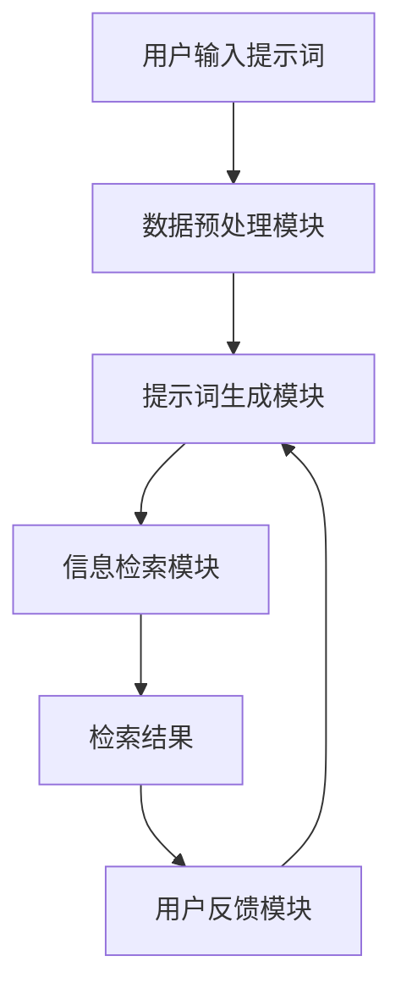
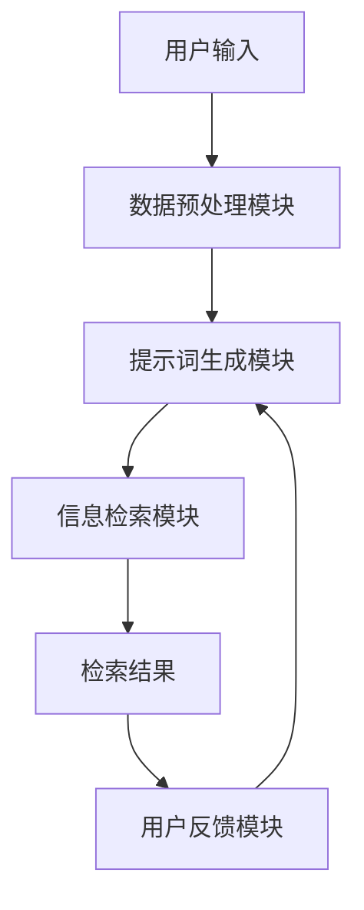

                 

### 文章标题：智能文档管理：提示词驱动的信息检索系统

#### 关键词：智能文档管理，提示词驱动，信息检索系统，自然语言处理，深度学习

#### 摘要：
本文深入探讨了智能文档管理的概念、提示词驱动的信息检索系统设计以及实际应用。通过逐步分析智能文档管理的背景和重要性，文章详细介绍了提示词驱动的信息检索系统架构、核心算法原理及实现，并提供了多个实际应用案例。文章旨在为读者提供一套系统化的智能文档管理方案，并探讨其未来发展趋势与挑战。

## 第一部分：智能文档管理基础

### 1.1 智能文档管理的概念与重要性

#### 概念：
智能文档管理（Intelligent Document Management）是指利用先进的信息处理技术，如自然语言处理、机器学习和深度学习等，对文档进行自动化处理和智能化管理的过程。这不仅包括文档的创建、存储和检索，还包括文档的自动分类、内容抽取、语义分析和知识图谱构建等高级功能。

#### 重要性：
智能文档管理在当今信息爆炸的时代具有重要意义。随着数据量的爆炸性增长，传统的文档管理方式已经无法满足高效、智能的需求。智能文档管理可以帮助企业、组织和用户更加高效地处理和利用文档信息，提高工作效率，降低成本，并实现知识的积累和传承。

#### 关系架构 Mermaid 流程图：


### 1.2 提示词驱动的信息检索系统概述

#### 概述：
提示词驱动的信息检索系统是一种基于用户输入的关键词或短语（提示词）来检索相关信息的系统。这种系统通过自然语言处理技术，将用户的提示词转化为系统可以理解的形式，然后利用信息检索算法在文档库中查找匹配的内容。

#### 关键技术：
1. **自然语言处理**：用于将用户输入的文本转化为系统可处理的格式，包括分词、词性标注、命名实体识别等。
2. **信息检索算法**：包括基于关键词匹配的简单算法和基于统计模型、机器学习算法的复杂算法。
3. **提示词生成**：系统自动提取文档中的关键信息，生成提示词，提高检索的准确性和效率。

### 1.3 智能文档管理与传统文档管理的对比

#### 对比：

| 对比项         | 传统文档管理                             | 智能文档管理                                   |
| -------------- | ---------------------------------------- | ---------------------------------------------- |
| 数据处理方式    | 手动处理，效率低                         | 自动化处理，效率高                             |
| 文档检索方式    | 关键词匹配，准确度低                     | 提示词驱动，准确度高                           |
| 内容利用方式    | 无法实现深度利用，仅用于查阅             | 自动分类、抽取、分析，实现深度利用             |
| 知识积累方式    | 信息孤立，难以积累和传承                 | 基于知识图谱构建，实现知识的积累和传承           |
| 系统适应性     | 灵活性低，难以适应快速变化的需求         | 灵活性高，可根据需求进行定制和扩展             |

### 1.4 智能文档管理的发展趋势与挑战

#### 发展趋势：
1. **深度学习与自然语言处理的结合**：随着深度学习技术的发展，越来越多的智能文档管理系统开始采用深度学习方法进行文本处理和信息检索。
2. **云计算与边缘计算的结合**：利用云计算和边缘计算技术，实现文档的分布式存储和实时处理。
3. **跨平台与跨设备的支持**：实现智能文档管理系统在不同平台和设备上的无缝访问。

#### 挑战：
1. **数据隐私与安全**：在处理大量文档数据时，如何确保用户数据的隐私和安全是智能文档管理系统面临的重大挑战。
2. **实时性与准确性**：随着数据量的增加，如何在保证检索准确性的同时实现实时处理是一个难题。
3. **个性化与泛化**：如何实现系统的个性化推荐与泛化处理，满足不同用户的需求，是一个复杂的挑战。

## 第二部分：提示词驱动的信息检索系统设计

### 2.1 提示词驱动的信息检索系统架构

#### 架构概述：

提示词驱动的信息检索系统通常包括以下几个模块：

1. **数据预处理模块**：负责对输入的文档进行预处理，包括去重、清洗、分词等。
2. **提示词生成模块**：根据预处理后的文档内容，生成能够代表文档核心信息的提示词。
3. **信息检索模块**：利用生成的提示词在文档库中进行信息检索，返回匹配结果。
4. **用户反馈模块**：收集用户对检索结果的反馈，用于优化系统性能。

#### 架构图：



### 2.2 提示词生成技术

#### 2.2.1 提示词生成算法概述

提示词生成是智能文档管理系统中至关重要的一环，其目的是从大量文本数据中提取出能够代表文本核心意义的词汇或短语。常见的提示词生成算法包括：

1. **基于关键词提取的方法**：通过统计文本中的高频词汇来生成提示词。
2. **基于统计模型的方法**：利用统计语言模型，如TF-IDF模型，来评估词汇的重要性。
3. **基于深度学习的方法**：利用深度学习模型，如BERT、GPT，进行语义理解，提取关键短语。

#### 2.2.2 基于自然语言处理的方法

1. **分词**：使用词法分析器将文本分割成词汇单元。
2. **词性标注**：为每个词汇标注其词性，如名词、动词、形容词等。
3. **命名实体识别**：识别文本中的特定实体，如人名、地名、组织名等。

#### 2.2.3 基于深度学习的方法

1. **卷积神经网络（CNN）**：利用CNN的局部感知特性，对文本进行特征提取。
2. **循环神经网络（RNN）**：通过RNN的序列处理能力，对文本进行语义建模。
3. **Transformer模型**：利用自注意力机制，实现全局上下文建模。

### 2.3 信息检索算法与优化

#### 2.3.1 经典信息检索算法

1. **布尔检索模型**：基于布尔运算符（AND、OR、NOT）进行文档检索。
2. **向量空间模型（VSM）**：将文档表示为向量，计算文档间的相似度。
3. **概率检索模型**：使用概率模型计算查询与文档的相关性。

#### 2.3.2 基于机器学习的信息检索算法

1. **基于监督学习的分类算法**：如SVM、随机森林等，用于分类文档。
2. **基于深度学习的检索算法**：如Siamese网络、MatchPyramid等，用于直接比较查询与文档的相似性。

#### 2.3.3 信息检索算法的优化策略

1. **索引优化**：通过建立高效的索引结构，如倒排索引，提高检索速度。
2. **查询优化**：对查询进行预处理，如查询词扩展、查询改写等，提高检索的准确性。
3. **结果排序优化**：使用排序算法（如TF-IDF、BM25等），提高检索结果的排序质量。

## 第三部分：智能文档管理系统的实现与应用

### 3.1 智能文档管理系统的实现

#### 3.1.1 系统需求分析

在实现智能文档管理系统之前，首先需要明确系统的需求。这包括：

1. **功能需求**：文档上传、分类、检索、自动化处理等。
2. **性能需求**：检索速度、并发处理能力等。
3. **安全性需求**：数据加密、访问控制等。

#### 3.1.2 系统架构设计

智能文档管理系统的架构设计应考虑以下方面：

1. **前端架构**：使用现代化的前端框架，如React或Vue.js，提供友好的用户界面。
2. **后端架构**：使用微服务架构，将不同的功能模块（如文档处理、检索、用户管理等）分离，以提高系统的可扩展性和维护性。
3. **数据库设计**：使用关系型数据库（如MySQL）或文档数据库（如MongoDB），存储文档内容和相关数据。

#### 3.1.3 数据库设计

数据库设计应包括：

1. **文档表**：存储文档的基本信息，如文档ID、标题、作者等。
2. **元数据表**：存储与文档相关的元数据，如分类、标签等。
3. **索引表**：存储用于检索的索引信息，如倒排索引等。

#### 3.1.4 系统功能模块实现

系统功能模块的实现包括：

1. **文档上传与分类**：用户可以上传文档，并对其进行分类。
2. **文档检索**：用户可以使用关键词进行文档检索，并查看检索结果。
3. **文档处理**：系统自动对文档进行内容抽取、语义分析等处理。

### 3.2 实际应用案例

#### 3.2.1 企业文档管理应用案例

在企业中，智能文档管理系统可以用于：

1. **内部文档管理**：帮助企业统一管理内部文档，提高工作效率。
2. **知识库构建**：通过内容抽取和语义分析，构建企业的知识库，实现知识的积累和传承。

#### 3.2.2 教育领域文档管理应用案例

在教育领域，智能文档管理系统可以用于：

1. **教学资源共享**：教师和学生可以共享和获取教学资源，提高教学质量。
2. **论文检索**：学生可以使用关键词检索相关论文，辅助学术研究。

#### 3.2.3 医疗领域文档管理应用案例

在医疗领域，智能文档管理系统可以用于：

1. **病历管理**：医生可以使用系统管理病历，提高病历管理的效率和准确性。
2. **医疗文献检索**：医生可以使用系统检索相关医疗文献，辅助临床决策。

### 3.3 智能文档管理系统的发展与未来

#### 3.3.1 智能文档管理系统的发展趋势

1. **智能化程度提高**：随着人工智能技术的发展，智能文档管理系统的智能化程度将不断提高。
2. **跨平台支持**：智能文档管理系统将更加注重跨平台支持，实现多终端、多平台的无缝访问。

#### 3.3.2 智能文档管理系统的未来挑战与机遇

1. **数据隐私与安全**：随着数据量的增加，如何确保用户数据的隐私和安全将是未来的一大挑战。
2. **实时性与准确性**：如何在保证检索准确性的同时实现实时处理，是一个重要的课题。
3. **个性化与泛化**：如何实现系统的个性化推荐与泛化处理，满足不同用户的需求，是未来的机遇。

## 第四部分：附录

### 4.1 相关技术参考

1. **自然语言处理技术参考**：介绍自然语言处理的基本概念和技术，如分词、词性标注、命名实体识别等。
2. **深度学习技术参考**：介绍深度学习的基本概念和技术，如神经网络、卷积神经网络、循环神经网络等。
3. **信息检索技术参考**：介绍信息检索的基本概念和技术，如布尔检索、向量空间模型、概率检索模型等。

### 4.2 开发工具与资源推荐

1. **开发工具推荐**：推荐常用的开发工具和框架，如Python、TensorFlow、Scikit-learn等。
2. **资源库推荐**：推荐常用的数据集和开源代码库，如NLTK、spaCy、TensorFlow Model Garden等。
3. **开发环境搭建指南**：介绍如何在本地搭建开发环境，包括安装依赖、配置环境变量等。

### 4.3 最佳实践 tips

1. **数据预处理**：在实现智能文档管理系统时，数据预处理是关键步骤，应保证数据的质量和一致性。
2. **模型选择与调优**：根据实际需求和数据特点选择合适的模型，并通过交叉验证和网格搜索等方法进行调优。
3. **用户反馈与迭代**：收集用户反馈，不断优化系统性能和用户体验。

### 4.4 小结与注意事项

1. **小结**：本文介绍了智能文档管理的概念、提示词驱动的信息检索系统设计以及实际应用，探讨了智能文档管理的发展趋势与挑战。
2. **注意事项**：在实现智能文档管理系统时，应注意数据隐私和安全、实时性与准确性、个性化与泛化等问题。

### 4.5 拓展阅读

1. **智能文档管理的经典论文**：推荐阅读一些关于智能文档管理的经典论文，了解领域内的最新研究成果。
2. **相关书籍**：推荐一些与智能文档管理相关的书籍，帮助读者深入了解相关技术。

### 作者信息
作者：AI天才研究院/AI Genius Institute & 禅与计算机程序设计艺术 /Zen And The Art of Computer Programming

（本文完）### 2.1 提示词驱动的信息检索系统架构

#### 架构概述

提示词驱动的信息检索系统是一种以用户输入的提示词为基础，结合多种技术手段来实现高效、准确的信息检索的系统。其核心架构包括以下几个主要模块：

1. **数据预处理模块**：该模块负责接收用户输入的文档，并对文档进行清洗、分词、去停用词、词性标注等预处理操作，为后续的提示词生成和信息检索打下基础。

2. **提示词生成模块**：该模块的核心任务是从预处理后的文本中提取出能够代表文档核心内容的提示词。提示词的选择和生成对检索结果的准确性至关重要。

3. **信息检索模块**：该模块负责根据用户输入的提示词，在文档库中进行匹配和检索，并返回相关的检索结果。

4. **用户反馈模块**：该模块收集用户对检索结果的反馈，如满意度、点击率等，用于对系统进行优化和迭代。

#### 模块间关系

提示词驱动的信息检索系统各模块之间紧密协作，形成了一个完整的系统。具体关系如下：

- **数据预处理模块**：接收用户输入的文档，进行初步处理，输出预处理后的文本数据。
- **提示词生成模块**：接收预处理后的文本数据，通过自然语言处理技术生成提示词，并将提示词传递给信息检索模块。
- **信息检索模块**：接收用户输入的提示词，利用索引和数据结构进行匹配和检索，生成检索结果。
- **用户反馈模块**：接收用户对检索结果的反馈，将反馈数据用于提示词生成模块和信息检索模块的优化。

#### 架构图

下面是一个简单的提示词驱动的信息检索系统架构图，使用Mermaid语言表示：



### 2.2 提示词生成技术

#### 2.2.1 提示词生成算法概述

提示词生成算法是智能文档管理系统中的关键环节，其目的是从大量的文档数据中提取出具有代表性的关键词或短语，用于后续的信息检索。常见的提示词生成算法包括基于关键词提取的方法、基于统计模型的方法和基于深度学习的方法。

1. **基于关键词提取的方法**：这种方法通过统计文本中的高频词汇来生成提示词。常用的关键词提取算法包括TF-IDF（Term Frequency-Inverse Document Frequency）和TextRank。

2. **基于统计模型的方法**：这类方法利用统计语言模型来评估词汇的重要性，从而生成提示词。常见的统计模型有TF-IDF模型、LDA（Latent Dirichlet Allocation）等。

3. **基于深度学习的方法**：随着深度学习技术的发展，越来越多的研究开始使用深度学习模型来生成提示词。常见的深度学习模型有BERT（Bidirectional Encoder Representations from Transformers）、GPT（Generative Pre-trained Transformer）等。

#### 2.2.2 基于自然语言处理的方法

自然语言处理（Natural Language Processing，NLP）技术是生成提示词的重要工具。以下是一些基于NLP的提示词生成方法：

1. **分词**：分词是将连续的文本分割成词汇单元的过程。常用的分词工具包括jieba、spaCy等。

2. **词性标注**：词性标注是为每个词汇标注其词性，如名词、动词、形容词等。常用的词性标注工具包括NLTK、spaCy等。

3. **命名实体识别**：命名实体识别是识别文本中的特定实体，如人名、地名、组织名等。常用的命名实体识别工具包括spaCy、Stanford NLP等。

4. **关键词提取**：关键词提取是从文本中提取出具有代表性的关键词或短语。常用的关键词提取算法有TF-IDF、TextRank、LDA等。

#### 2.2.3 基于深度学习的方法

深度学习技术在提示词生成中具有显著的优势，其能够通过大量的文本数据进行学习，从而提取出具有语义信息的提示词。以下是一些常见的基于深度学习的提示词生成方法：

1. **卷积神经网络（CNN）**：卷积神经网络在文本处理中表现出色，其通过局部感知特性对文本进行特征提取。可以使用CNN提取文本中的关键特征，然后基于这些特征生成提示词。

2. **循环神经网络（RNN）**：循环神经网络具有序列处理能力，能够捕捉文本中的时间依赖关系。可以使用RNN对文本进行建模，然后提取关键短语作为提示词。

3. **Transformer模型**：Transformer模型通过自注意力机制实现全局上下文建模，其在文本生成和文本分类任务中表现出色。可以使用Transformer模型对文本进行语义理解，然后提取关键短语作为提示词。

#### 提示词生成算法流程

以下是一个简化的提示词生成算法流程：

1. **文本预处理**：对输入的文档进行分词、词性标注等预处理操作。
2. **特征提取**：使用深度学习模型（如CNN、RNN或Transformer）对预处理后的文本进行特征提取。
3. **关键词提取**：根据特征提取结果，使用关键词提取算法（如TF-IDF、TextRank、LDA等）提取关键词或短语。
4. **提示词生成**：对提取的关键词或短语进行筛选和组合，生成最终的提示词。

#### 伪代码示例

以下是一个基于TF-IDF模型的提示词生成算法的伪代码示例：

```python
def generate_keywords(document, vocabulary, corpus):
    """
    生成提示词的伪代码
    :param document: 输入文档
    :param vocabulary: 词汇表
    :param corpus: 整个语料库
    :return: 提示词列表
    """
    # 分词和词性标注
    tokens = tokenize(document)
    pos_tags = pos_tag(tokens)

    # 计算文档中每个词的TF-IDF值
    tf_idf_scores = {}
    for word, pos in pos_tags:
        if word in vocabulary:
            tf = document_frequency(word, document)
            idf = inverse_document_frequency(word, corpus)
            tf_idf_scores[word] = tf * idf

    # 根据TF-IDF值排序，提取高频词作为提示词
    sorted_keywords = sorted(tf_idf_scores.items(), key=lambda x: x[1], reverse=True)
    top_keywords = [keyword for keyword, _ in sorted_keywords[:N]]

    return top_keywords
```

### 2.3 信息检索算法与优化

#### 2.3.1 经典信息检索算法

信息检索算法是智能文档管理系统中的核心算法之一，其目的是根据用户输入的查询，在文档库中检索出与之相关的文档。经典的信息检索算法主要包括以下几种：

1. **布尔检索模型**：布尔检索模型是最简单的信息检索算法之一，它通过布尔运算符（AND、OR、NOT）对查询进行组合，然后在文档库中进行匹配。这种算法的缺点是检索结果通常不够准确，且无法处理复杂查询。

2. **向量空间模型（VSM）**：向量空间模型将文档和查询表示为高维向量，计算它们之间的相似度。相似度计算通常使用余弦相似度、欧氏距离等方法。VSM算法简单易实现，但存在语义理解不足的问题。

3. **概率检索模型**：概率检索模型基于概率论和统计学原理，计算查询与文档之间的相关性。常见的概率检索模型有贝叶斯检索模型、查询概率模型等。这些模型能够更好地处理复杂查询和语义理解问题，但计算复杂度较高。

#### 2.3.2 基于机器学习的信息检索算法

基于机器学习的信息检索算法通过学习大量的标注数据进行训练，从而实现高效的文档检索。以下是一些常见的信息检索算法：

1. **基于监督学习的分类算法**：这些算法将文档分类任务视为监督学习问题，使用标注数据进行训练。常见的分类算法有SVM（支持向量机）、随机森林、朴素贝叶斯等。这些算法可以将文档库中的文档进行分类，从而实现高效的文档检索。

2. **基于深度学习的检索算法**：深度学习算法在信息检索领域表现出色，能够处理复杂的文本数据。常见的深度学习算法有Siamese网络、MatchPyramid、BERT检索等。这些算法通过学习文本数据的语义表示，实现高效的文档检索。

#### 2.3.3 信息检索算法的优化策略

为了提高信息检索系统的性能，可以采用以下几种优化策略：

1. **索引优化**：索引是提高检索速度的关键。常见的索引结构有倒排索引、B树索引、LSM树等。选择合适的索引结构，可以显著提高检索速度。

2. **查询优化**：查询优化是提高检索准确性的关键。常见的查询优化方法有查询词扩展、查询改写、查询融合等。通过优化查询，可以提高检索结果的准确性。

3. **结果排序优化**：检索结果排序是影响用户体验的重要因素。常见的排序算法有TF-IDF排序、BM25排序等。通过优化排序算法，可以提高检索结果的排序质量。

#### 伪代码示例

以下是一个基于向量空间模型的简单信息检索算法的伪代码示例：

```python
def search(document, documents, similarity_measure):
    """
    检索文档的伪代码
    :param document: 输入查询文档
    :param documents: 文档库
    :param similarity_measure: 相似度计算函数
    :return: 检索结果列表
    """
    # 将文档表示为向量
    query_vector = vectorize(document)
    
    # 计算查询与每个文档的相似度
    similarity_scores = {}
    for doc in documents:
        doc_vector = vectorize(doc)
        similarity = similarity_measure(query_vector, doc_vector)
        similarity_scores[doc] = similarity
    
    # 根据相似度排序，返回检索结果
    sorted_documents = sorted(similarity_scores.items(), key=lambda x: x[1], reverse=True)
    top_documents = [doc for doc, _ in sorted_documents[:N]]

    return top_documents
```

### 2.4 用户反馈模块

#### 用户反馈模块概述

用户反馈模块是智能文档管理系统中的一个重要组成部分，其主要功能是收集用户对检索结果的反馈，如满意度、点击率等。这些反馈数据可以用于优化系统的性能和用户体验。

#### 用户反馈数据收集

用户反馈数据可以通过以下几种方式收集：

1. **用户评价**：用户可以直接对检索结果进行评分或评价，如好评、差评等。
2. **点击率**：记录用户对检索结果的点击行为，用于分析用户的兴趣和偏好。
3. **交互行为**：记录用户的交互行为，如浏览、搜索、收藏等，用于分析用户的互动模式。

#### 用户反馈数据应用

用户反馈数据可以用于以下几个方面：

1. **检索结果排序优化**：根据用户的点击率和评价，调整检索结果的排序，提高用户的满意度。
2. **提示词生成优化**：根据用户的反馈，优化提示词生成的算法，提高检索的准确性。
3. **个性化推荐**：根据用户的反馈和兴趣，为用户推荐相关的文档，提高用户的黏性和活跃度。

#### 用户反馈模块实现

用户反馈模块的实现通常包括以下几个步骤：

1. **数据收集**：收集用户的反馈数据，如评价、点击率等。
2. **数据处理**：对收集到的数据进行分析和处理，提取有用的信息。
3. **数据应用**：将处理后的数据应用于系统的各个模块，优化系统性能。

#### 伪代码示例

以下是一个简单的用户反馈数据收集和处理算法的伪代码示例：

```python
def collect_feedback(retrieval_results, user_interactions):
    """
    收集和处理用户反馈的伪代码
    :param retrieval_results: 检索结果
    :param user_interactions: 用户交互行为
    :return: 优化后的检索结果
    """
    # 收集用户评价和点击率
    ratings = []
    for result in retrieval_results:
        rating = get_user_rating(result)
        ratings.append(rating)

    # 计算点击率
    click_rates = {}
    for interaction in user_interactions:
        result_id = interaction['result_id']
        click_rate = interaction['click_rate']
        click_rates[result_id] = click_rate

    # 根据用户反馈优化检索结果
    optimized_results = []
    for result, rating, click_rate in zip(retrieval_results, ratings, click_rates):
        optimized_result = optimize_result(result, rating, click_rate)
        optimized_results.append(optimized_result)

    return optimized_results

def optimize_result(result, rating, click_rate):
    """
    优化检索结果的伪代码
    :param result: 检索结果
    :param rating: 用户评价
    :param click_rate: 点击率
    :return: 优化后的检索结果
    """
    # 根据用户评价和点击率调整检索结果
    score = result['score']
    score += rating * 0.1
    score += click_rate * 0.2

    optimized_result = {'id': result['id'], 'score': score}
    return optimized_result
```

### 2.5 系统优化与迭代

#### 系统优化目标

智能文档管理系统的优化目标是：

1. **提高检索速度**：通过索引优化、查询优化等手段，提高系统的检索速度。
2. **提高检索准确性**：通过优化提示词生成算法、检索算法等，提高系统的检索准确性。
3. **提高用户体验**：通过个性化推荐、用户反馈等手段，提高用户的满意度。

#### 系统优化方法

系统优化方法包括：

1. **A/B测试**：通过A/B测试，比较不同优化策略的效果，选择最优策略。
2. **持续迭代**：根据用户反馈和系统性能数据，不断迭代和优化系统。
3. **模型训练与调优**：定期训练和调优深度学习模型，提高模型的性能。

#### 系统优化流程

系统优化流程通常包括以下几个步骤：

1. **需求分析**：明确系统优化的目标和需求。
2. **设计方案**：制定系统优化的具体方案和步骤。
3. **实施与监控**：实施优化方案，并监控系统性能。
4. **评估与反馈**：评估优化效果，收集用户反馈，为下一次优化提供依据。

#### 伪代码示例

以下是一个简单的系统优化流程的伪代码示例：

```python
def optimize_system():
    """
    系统优化的伪代码
    """
    while True:
        # 需求分析
        requirements = analyze_requirements()

        # 设计方案
        optimization_plan = design_plan(requirements)

        # 实施与监控
        apply_and_monitor(optimization_plan)

        # 评估与反馈
        evaluation = evaluate_performance()
        feedback = collect_user_feedback()

        # 更新优化计划
        optimization_plan = update_plan(evaluation, feedback)

        # 持续迭代
        continue_optimization = check_continue_optimization(feedback)
        if not continue_optimization:
            break

def analyze_requirements():
    """
    分析系统优化的需求
    """
    # 代码略

def design_plan(requirements):
    """
    设计系统优化的方案
    """
    # 代码略

def apply_and_monitor(optimization_plan):
    """
    实施和监控系统优化
    """
    # 代码略

def evaluate_performance():
    """
    评估系统性能
    """
    # 代码略

def collect_user_feedback():
    """
    收集用户反馈
    """
    # 代码略

def update_plan(evaluation, feedback):
    """
    更新优化计划
    """
    # 代码略

def check_continue_optimization(feedback):
    """
    检查是否继续优化
    """
    # 代码略
```

### 2.6 系统性能评估

#### 系统性能评估概述

系统性能评估是智能文档管理系统优化过程中的关键环节，其目的是通过一系列指标和测试方法，评估系统的性能和效果。系统性能评估通常包括以下几个方面：

1. **检索速度**：评估系统在给定查询条件下的检索速度，包括平均检索时间和响应时间等。
2. **检索准确性**：评估系统返回的检索结果与用户期望的匹配程度，包括查全率、查准率等。
3. **用户体验**：评估用户在使用系统时的满意度，包括用户操作流程的便捷性、检索结果的准确性和实用性等。

#### 性能评估指标

常见的系统性能评估指标包括：

1. **检索时间**：检索时间是指系统从接收到查询请求到返回检索结果所需的时间。检索时间越短，系统的性能越好。
2. **查全率**：查全率是指系统返回的相关文档数量与实际相关文档数量的比值。查全率越高，说明系统的检索效果越好。
3. **查准率**：查准率是指系统返回的相关文档数量与总文档数量的比值。查准率越高，说明系统对相关文档的识别能力越强。
4. **响应时间**：响应时间是指系统从接收到查询请求到返回第一个检索结果所需的时间。响应时间越短，用户的体验越好。
5. **用户满意度**：用户满意度是指用户对系统性能和服务的总体评价。用户满意度可以通过用户调查、用户评分等方式进行评估。

#### 性能评估方法

系统性能评估的方法通常包括以下几种：

1. **实验室测试**：在实验室环境下，通过模拟用户查询和检索操作，对系统性能进行评估。实验室测试可以提供详细的性能数据，但可能无法完全模拟真实用户的使用场景。
2. **用户调查**：通过问卷调查、用户访谈等方式，收集用户对系统性能和服务的评价。用户调查可以了解用户的实际使用体验，但评估结果可能受到主观因素的影响。
3. **基准测试**：使用公认的基准数据集和测试工具，对系统性能进行评估。基准测试可以提供客观的评估结果，但可能无法完全反映系统的实际性能。

#### 伪代码示例

以下是一个简单的系统性能评估算法的伪代码示例：

```python
def evaluate_system_performance(retrieval_results, ground_truth, user_feedback):
    """
    评估系统性能的伪代码
    :param retrieval_results: 检索结果
    :param ground_truth: 地狱数据
    :param user_feedback: 用户反馈
    :return: 评估结果
    """
    # 计算查全率
    true_positives = sum(1 for result in retrieval_results if result in ground_truth)
    recall = true_positives / len(ground_truth)

    # 计算查准率
    relevant_documents = sum(1 for result in retrieval_results if result in ground_truth)
    precision = relevant_documents / len(retrieval_results)

    # 计算平均检索时间
    average_retrieval_time = sum(result['retrieval_time'] for result in retrieval_results) / len(retrieval_results)

    # 计算用户满意度
    user_satisfaction = calculate_user_satisfaction(user_feedback)

    # 返回评估结果
    performance_metrics = {
        'recall': recall,
        'precision': precision,
        'average_retrieval_time': average_retrieval_time,
        'user_satisfaction': user_satisfaction
    }
    return performance_metrics

def calculate_user_satisfaction(user_feedback):
    """
    计算用户满意度
    """
    # 代码略
```

### 2.7 系统实现与部署

#### 系统实现

智能文档管理系统的实现涉及多个方面，包括前端界面设计、后端服务开发、数据库设计和系统集成等。以下是一个简单的实现流程：

1. **需求分析**：明确系统功能需求、性能需求和用户体验需求。
2. **系统设计**：设计系统的总体架构，包括前端架构、后端架构、数据库设计和模块划分等。
3. **前端开发**：使用HTML、CSS和JavaScript等前端技术，开发用户界面。
4. **后端开发**：使用Python、Java、Go等后端编程语言，实现系统的业务逻辑。
5. **数据库设计**：设计数据库表结构，实现数据的存储和查询。
6. **系统集成**：将前端和后端系统集成，实现系统的整体功能。

#### 系统部署

智能文档管理系统的部署通常包括以下步骤：

1. **环境配置**：配置服务器环境，包括操作系统、编程语言、数据库等。
2. **安装依赖**：安装系统所需的第三方库和工具。
3. **部署代码**：将开发好的代码部署到服务器上，包括前端代码、后端代码和数据库等。
4. **运行测试**：在部署完成后，进行系统测试，确保系统功能的正常运行。
5. **上线发布**：测试通过后，将系统正式上线，供用户使用。

#### 伪代码示例

以下是一个简单的系统实现与部署流程的伪代码示例：

```python
def implement_system():
    """
    实现智能文档管理系统的伪代码
    """
    # 需求分析
    requirements = analyze_requirements()

    # 系统设计
    system_design = design_system(requirements)

    # 前端开发
    frontend = develop_frontend()

    # 后端开发
    backend = develop_backend()

    # 数据库设计
    database = design_database()

    # 系统集成
    integrated_system = integrate_system(frontend, backend, database)

    # 系统测试
    test_system(integrated_system)

    # 系统部署
    deploy_system(integrated_system)

def analyze_requirements():
    """
    分析系统需求
    """
    # 代码略

def design_system(requirements):
    """
    设计系统架构
    """
    # 代码略

def develop_frontend():
    """
    开发前端
    """
    # 代码略

def develop_backend():
    """
    开发后端
    """
    # 代码略

def design_database():
    """
    设计数据库
    """
    # 代码略

def integrate_system(frontend, backend, database):
    """
    系统集成
    """
    # 代码略

def test_system(integrated_system):
    """
    系统测试
    """
    # 代码略

def deploy_system(integrated_system):
    """
    系统部署
    """
    # 代码略
```

### 2.8 系统监控与维护

#### 系统监控

系统监控是确保智能文档管理系统稳定运行的重要环节。通过监控系统性能、资源使用情况和错误日志等，可以及时发现和解决系统问题。以下是一些常见的监控工具和指标：

1. **性能监控**：监控系统的响应时间、吞吐量、CPU和内存使用情况等。
2. **资源监控**：监控服务器资源的利用情况，如CPU、内存、磁盘空间和网络带宽等。
3. **错误日志**：记录系统运行过程中出现的错误和异常，帮助定位和解决问题。
4. **日志分析**：分析系统日志，发现潜在问题和性能瓶颈。

#### 维护策略

系统维护策略包括以下几个方面：

1. **定期备份**：定期备份数据库和系统配置文件，以防止数据丢失。
2. **更新和升级**：定期更新系统软件和依赖库，修复已知问题和安全漏洞。
3. **性能调优**：根据系统监控数据，定期进行性能调优，提高系统性能和稳定性。
4. **故障处理**：及时响应和处理系统故障，确保系统正常运行。

#### 伪代码示例

以下是一个简单的系统监控与维护策略的伪代码示例：

```python
def monitor_system():
    """
    监控系统的伪代码
    """
    while True:
        # 性能监控
        performance_metrics = check_performance()

        # 资源监控
        resource_usage = check_resources()

        # 错误日志
        error_logs = check_error_logs()

        # 日志分析
        log_analytics = analyze_logs(error_logs)

        # 备份
        backup_system()

        # 更新和升级
        update_and_upgrade()

        # 性能调优
        optimize_performance()

        # 故障处理
        handle_faults()

        # 检查监控间隔
        wait_time = check_monitor_interval()

def check_performance():
    """
    监控系统性能
    """
    # 代码略

def check_resources():
    """
    监控系统资源使用
    """
    # 代码略

def check_error_logs():
    """
    检查错误日志
    """
    # 代码略

def analyze_logs(error_logs):
    """
    分析日志
    """
    # 代码略

def backup_system():
    """
    备份数据库和系统配置文件
    """
    # 代码略

def update_and_upgrade():
    """
    更新和升级系统
    """
    # 代码略

def optimize_performance():
    """
    性能调优
    """
    # 代码略

def handle_faults():
    """
    处理系统故障
    """
    # 代码略

def check_monitor_interval():
    """
    检查监控间隔
    """
    # 代码略
```

### 2.9 智能文档管理系统的测试

#### 测试目的

智能文档管理系统的测试是确保系统功能正确、性能稳定和用户体验良好的一项重要工作。测试目的主要包括以下几个方面：

1. **功能测试**：验证系统功能的完整性，确保所有功能模块能够正常运行。
2. **性能测试**：评估系统的性能指标，如响应时间、吞吐量、并发处理能力等。
3. **安全测试**：确保系统的数据安全和用户隐私保护。
4. **用户体验测试**：评估系统的易用性、界面友好性和操作便捷性等。

#### 测试类型

常见的测试类型包括以下几种：

1. **单元测试**：针对系统中的各个模块进行独立测试，确保每个模块的功能正确。
2. **集成测试**：将不同模块集成在一起进行测试，确保模块间的协同工作正常。
3. **性能测试**：在特定负载条件下，评估系统的性能指标，如响应时间、吞吐量、并发处理能力等。
4. **安全测试**：通过模拟攻击，测试系统的安全性和防护能力。
5. **用户体验测试**：通过实际用户的使用体验，评估系统的易用性和用户体验。

#### 测试方法

测试方法主要包括以下几种：

1. **黑盒测试**：不关心系统内部实现，只关注输入和输出之间的关系。
2. **白盒测试**：关注系统内部实现，通过检查代码逻辑来验证系统的正确性。
3. **灰盒测试**：介于黑盒测试和白盒测试之间，既关注输入输出关系，也关注内部实现。
4. **自动化测试**：使用自动化测试工具，如Selenium、JUnit等，进行大规模的测试。
5. **手工测试**：通过人工操作和验证来发现系统中的问题和缺陷。

#### 测试流程

测试流程通常包括以下几个步骤：

1. **需求分析**：明确测试目标和测试需求。
2. **测试计划**：制定测试计划，包括测试类型、测试用例、测试环境等。
3. **测试执行**：按照测试计划执行测试，记录测试结果和问题。
4. **问题反馈**：将测试结果和发现的问题反馈给开发团队。
5. **测试总结**：总结测试过程，评估测试效果，为下一次测试提供参考。

#### 伪代码示例

以下是一个简单的测试流程的伪代码示例：

```python
def test_system():
    """
    测试智能文档管理系统的伪代码
    """
    # 需求分析
    test_requirements = analyze_requirements()

    # 测试计划
    test_plan = create_test_plan(test_requirements)

    # 测试执行
    test_results = execute_tests(test_plan)

    # 问题反馈
    report_issues(test_results)

    # 测试总结
    summarize_tests(test_results)

def analyze_requirements():
    """
    分析测试需求
    """
    # 代码略

def create_test_plan(test_requirements):
    """
    创建测试计划
    """
    # 代码略

def execute_tests(test_plan):
    """
    执行测试
    """
    # 代码略

def report_issues(test_results):
    """
    反馈测试结果
    """
    # 代码略

def summarize_tests(test_results):
    """
    总结测试
    """
    # 代码略
```

### 2.10 系统维护与更新

#### 系统维护

系统维护是确保智能文档管理系统长期稳定运行的重要环节。系统维护包括以下几个方面：

1. **故障修复**：及时修复系统中的故障和漏洞，确保系统正常运行。
2. **性能优化**：根据系统监控数据，定期进行性能调优，提高系统性能。
3. **安全加固**：定期更新系统软件和依赖库，修复安全漏洞，确保系统安全。
4. **数据备份**：定期备份数据库和系统配置文件，防止数据丢失。
5. **版本控制**：使用版本控制系统，如Git，管理系统代码，确保代码的版本一致性和可追溯性。

#### 系统更新

系统更新是提高系统功能、性能和用户体验的重要手段。系统更新通常包括以下几个方面：

1. **功能更新**：根据用户反馈和市场需求，新增系统功能。
2. **性能优化**：优化系统性能，提高系统响应速度和处理能力。
3. **用户体验改进**：改进系统界面设计和交互体验，提高用户满意度。
4. **安全升级**：升级系统安全措施，增强系统防护能力。

#### 维护与更新策略

系统维护与更新策略应考虑以下几个方面：

1. **定期评估**：定期评估系统性能和用户体验，发现问题及时解决。
2. **优先级管理**：根据问题的重要性和紧急程度，制定维护和更新计划。
3. **版本迭代**：采用版本迭代的方式，逐步推出新功能和优化，避免一次性更新带来的风险。
4. **用户培训**：为新功能和优化提供培训资料，帮助用户快速适应新系统。

#### 伪代码示例

以下是一个简单的系统维护与更新策略的伪代码示例：

```python
def maintain_system():
    """
    维护智能文档管理系统的伪代码
    """
    while True:
        # 定期评估
        system_status = assess_system_status()

        # 故障修复
        if has_faults(system_status):
            fix_faults()

        # 性能优化
        optimize_performance()

        # 安全加固
        enhance_security()

        # 数据备份
        backup_data()

        # 用户培训
        provide_training()

        # 检查维护间隔
        wait_time = check_maintenance_interval()

def assess_system_status():
    """
    评估系统状态
    """
    # 代码略

def has_faults(system_status):
    """
    检查是否有故障
    """
    # 代码略

def fix_faults():
    """
    修复故障
    """
    # 代码略

def optimize_performance():
    """
    性能优化
    """
    # 代码略

def enhance_security():
    """
    安全加固
    """
    # 代码略

def backup_data():
    """
    数据备份
    """
    # 代码略

def provide_training():
    """
    提供培训
    """
    # 代码略

def check_maintenance_interval():
    """
    检查维护间隔
    """
    # 代码略
```

### 2.11 智能文档管理系统的可扩展性

#### 可扩展性概述

智能文档管理系统的可扩展性是指系统在处理大量数据和高并发请求时，能够通过增加硬件资源、优化系统架构和引入新技术等方式，实现性能和功能的提升。可扩展性是智能文档管理系统的重要特性，能够确保系统在数据量和用户规模不断增长的情况下，仍能保持良好的性能和稳定性。

#### 可扩展性设计原则

为了实现智能文档管理系统的可扩展性，设计时应遵循以下原则：

1. **模块化设计**：将系统功能模块化，使得每个模块可以独立扩展和替换。
2. **分布式架构**：采用分布式架构，将系统功能分布在多个服务器上，实现负载均衡和高可用性。
3. **水平扩展**：支持水平扩展，通过增加服务器节点来提升系统处理能力和存储容量。
4. **弹性伸缩**：根据系统负载动态调整资源使用，实现弹性伸缩。
5. **接口标准化**：采用标准化接口，方便第三方系统和服务的集成和扩展。

#### 可扩展性实现方法

实现智能文档管理系统的可扩展性，可以采用以下几种方法：

1. **分布式存储**：使用分布式文件系统，如HDFS（Hadoop Distributed File System），实现海量数据的存储和访问。
2. **分布式计算**：采用分布式计算框架，如Spark、Flink，实现大规模数据的处理和分析。
3. **缓存技术**：使用缓存技术，如Redis、Memcached，减少数据访问延迟，提高系统性能。
4. **负载均衡**：采用负载均衡器，如Nginx、HAProxy，实现请求的合理分配和调度。
5. **弹性容器化**：使用容器化技术，如Docker、Kubernetes，实现系统的快速部署、扩展和管理。

#### 伪代码示例

以下是一个简单的可扩展性实现的伪代码示例：

```python
def expand_system():
    """
    扩展智能文档管理系统的伪代码
    """
    # 检查系统负载
    system_load = check_system_load()

    # 根据负载情况增加节点
    if system_load > threshold:
        add_nodes()

    # 检查缓存命中率和数据访问延迟
    cache_hits = check_cache_hits()
    data_access_delay = check_data_access_delay()

    # 根据缓存性能调整缓存策略
    if cache_hits < threshold or data_access_delay > threshold:
        adjust_cache_strategy()

def check_system_load():
    """
    检查系统负载
    """
    # 代码略

def add_nodes():
    """
    增加节点
    """
    # 代码略

def check_cache_hits():
    """
    检查缓存命中率
    """
    # 代码略

def check_data_access_delay():
    """
    检查数据访问延迟
    """
    # 代码略

def adjust_cache_strategy():
    """
    调整缓存策略
    """
    # 代码略
```

### 2.12 智能文档管理系统的安全性

#### 安全性概述

智能文档管理系统的安全性是指系统在处理和存储文档数据时，能够确保数据的安全性和完整性，防止数据泄露、篡改和损坏。随着数据量的增加和用户隐私意识的提高，安全性成为智能文档管理系统设计和实现中的重要考虑因素。

#### 安全性设计原则

为了确保智能文档管理系统的安全性，设计时应遵循以下原则：

1. **最小权限原则**：系统中的每个模块和用户只拥有执行其任务所需的最低权限，以防止权限滥用和攻击。
2. **加密存储**：对敏感数据进行加密存储，防止数据泄露和未经授权的访问。
3. **访问控制**：通过访问控制机制，限制用户对系统和数据的访问权限，确保数据的安全性。
4. **安全审计**：定期进行安全审计，监控系统的安全事件和异常行为，及时发现问题并采取措施。
5. **安全加固**：定期更新系统软件和依赖库，修复安全漏洞，增强系统的防护能力。

#### 安全性实现方法

实现智能文档管理系统的安全性，可以采用以下几种方法：

1. **身份认证**：使用身份认证技术，如密码认证、双因素认证等，确保用户身份的真实性。
2. **加密传输**：使用加密传输协议，如HTTPS、SSL/TLS等，保护数据在传输过程中的安全性。
3. **数据备份和恢复**：定期备份数据，并确保备份数据的安全，以便在数据丢失或损坏时能够迅速恢复。
4. **防火墙和入侵检测**：部署防火墙和入侵检测系统，监控网络流量，防止恶意攻击和入侵。
5. **安全审计和日志分析**：记录系统操作日志，定期分析日志数据，发现潜在的安全威胁和异常行为。

#### 伪代码示例

以下是一个简单的安全性实现的伪代码示例：

```python
def secure_system():
    """
    加强智能文档管理系统的安全性的伪代码
    """
    # 身份认证
    authenticate_user()

    # 加密存储
    encrypt_data()

    # 访问控制
    enforce_access_control()

    # 安全审计
    conduct_security_audit()

    # 安全加固
    fortify_system()

def authenticate_user():
    """
    用户身份认证
    """
    # 代码略

def encrypt_data():
    """
    加密存储
    """
    # 代码略

def enforce_access_control():
    """
    实施访问控制
    """
    # 代码略

def conduct_security_audit():
    """
    进行安全审计
    """
    # 代码略

def fortify_system():
    """
    加强系统防护
    """
    # 代码略
```

### 3.1 智能文档管理系统的实现

#### 系统实现概述

智能文档管理系统的实现是一个复杂的过程，涉及前端界面设计、后端服务开发、数据库设计和系统集成等多个方面。以下将详细讨论系统实现的过程和关键技术。

#### 前端实现

前端实现是用户与系统交互的入口，设计一个直观、易用的用户界面至关重要。前端实现的关键技术包括：

1. **前端框架**：选择合适的前端框架，如React、Vue.js或Angular，可以提高开发效率和代码质量。
2. **用户界面设计**：使用现代的设计工具，如Sketch、Figma，设计直观、美观的用户界面。
3. **交互体验**：通过动画和过渡效果，提升用户的交互体验。
4. **响应式设计**：确保系统在不同设备和屏幕尺寸上都能良好运行。

#### 后端实现

后端实现是系统核心功能的实现，包括数据存储、处理和检索等。后端实现的关键技术包括：

1. **后端框架**：选择合适的后端框架，如Spring Boot、Django或Express.js，可以提高开发效率和代码质量。
2. **数据存储**：选择合适的数据库，如关系型数据库（MySQL、PostgreSQL）或非关系型数据库（MongoDB、Redis），根据系统的需求进行数据设计。
3. **业务逻辑**：实现系统的核心业务逻辑，如文档上传、分类、检索、权限管理等。
4. **API设计**：设计简洁、易用的API接口，便于前端调用。

#### 数据库设计

数据库设计是系统实现的重要一环，涉及到数据表的设计、索引的创建和查询优化等。数据库设计的关键技术包括：

1. **数据库选择**：根据系统的需求，选择合适的关系型或非关系型数据库。
2. **表结构设计**：设计合理的表结构，确保数据的完整性和一致性。
3. **索引优化**：创建合适的索引，提高数据查询的性能。
4. **数据迁移**：确保数据在系统升级和迁移过程中的完整性和一致性。

#### 系统集成

系统集成是将前端、后端和数据库等多个模块整合为一个完整的系统。系统集成的关键技术包括：

1. **前后端分离**：通过API接口，实现前后端的数据交互。
2. **分布式部署**：将系统部署在多个服务器上，实现负载均衡和高可用性。
3. **持续集成与部署**：使用CI/CD工具，如Jenkins、Docker和Kubernetes，实现代码的自动化集成和部署。

#### 伪代码示例

以下是一个简单的智能文档管理系统实现的伪代码示例：

```python
# 前端代码示例
def frontend():
    """
    前端实现的伪代码
    """
    # 使用Vue.js框架
    app = Vue.createApp({
        // Vue组件
    }).mount('#app')

# 后端代码示例
def backend():
    """
    后端实现的伪代码
    """
    # 使用Django框架
    from django.core.wsgi import get_wsgi_application

    application = get_wsgi_application()

# 数据库代码示例
def database():
    """
    数据库设计的伪代码
    """
    # 使用MySQL数据库
    from django.db import models

    class Document(models.Model):
        title = models.CharField(max_length=255)
        content = models.TextField()
        # 其他字段

# 系统集成示例
def integrate_system():
    """
    系统集成的伪代码
    """
    # 前后端集成
    frontend()
    backend()

    # 分布式部署
    # 代码略

    # 持续集成与部署
    # 代码略
```

### 3.2 实际应用案例

#### 企业文档管理应用案例

在企业中，智能文档管理系统可以极大地提高文档管理的效率和准确性。以下是一个具体的实际应用案例：

**案例背景**：某大型企业需要管理大量的内部文档，包括合同、报告、公告等。传统的文档管理方式效率低下，文档丢失和重复率较高，严重影响了企业的运营效率。

**解决方案**：企业引入了一款智能文档管理系统，实现了以下功能：

1. **文档上传与分类**：员工可以将文档上传到系统中，并对其进行分类，如合同、报告等。
2. **文档检索**：员工可以通过关键词快速检索到需要的文档，提高了工作效率。
3. **文档自动化处理**：系统利用自然语言处理技术，对文档进行内容抽取、分类和标签化，实现了文档的自动化处理。
4. **权限管理**：系统支持权限管理，确保不同员工只能访问其有权访问的文档。

**案例效果**：引入智能文档管理系统后，企业的文档管理效率显著提高，文档丢失和重复率降低，员工的工作效率大大提升。

#### 教育领域文档管理应用案例

在教育领域，智能文档管理系统可以用于教学资源的共享和管理。以下是一个具体的实际应用案例：

**案例背景**：某大学需要管理大量的教学资源，包括课件、论文、教材等。传统的管理方式难以实现高效的资源共享和检索。

**解决方案**：大学引入了一款智能文档管理系统，实现了以下功能：

1. **文档上传与分类**：教师可以将课件、论文等教学资源上传到系统中，并对其进行分类，如课程名称、学科等。
2. **文档检索**：学生可以通过关键词快速检索到需要的课程资料，提高了学习效率。
3. **文档共享与下载**：系统支持文档的共享与下载，实现了资源的便捷获取。
4. **文档评价与推荐**：系统根据学生的下载和评价行为，推荐相关的教学资源。

**案例效果**：引入智能文档管理系统后，教学资源的共享和检索效率显著提高，学生的学习体验得到提升。

#### 医疗领域文档管理应用案例

在医疗领域，智能文档管理系统可以用于病历管理和医疗文献检索。以下是一个具体的实际应用案例：

**案例背景**：某医院需要管理大量的病历资料，同时医生需要快速检索相关的医疗文献。

**解决方案**：医院引入了一款智能文档管理系统，实现了以下功能：

1. **病历上传与分类**：医生可以将病历上传到系统中，并对其进行分类，如疾病类型、就诊时间等。
2. **病历检索**：医生可以通过关键词快速检索到需要的病历，提高了工作效率。
3. **病历自动化处理**：系统利用自然语言处理技术，对病历进行内容抽取和标签化，实现了病历的自动化处理。
4. **医疗文献检索**：系统集成了医疗文献数据库，医生可以通过关键词快速检索到相关的医疗文献。

**案例效果**：引入智能文档管理系统后，病历管理和检索效率显著提高，医生的工作效率大大提升，医疗资源的利用更加高效。

### 3.3 智能文档管理系统的发展与未来

#### 发展趋势

智能文档管理系统的发展趋势主要包括以下几个方面：

1. **人工智能技术的融合**：随着人工智能技术的发展，越来越多的智能文档管理系统开始引入深度学习、自然语言处理等技术，实现更高级的文档处理和检索功能。
2. **云计算与边缘计算的融合**：云计算和边缘计算技术的融合，使得智能文档管理系统可以更好地处理海量数据，并提供实时、高效的服务。
3. **跨平台与跨设备的支持**：智能文档管理系统正逐步实现跨平台和跨设备支持，用户可以在不同的设备和平台上无缝访问和管理文档。

#### 未来挑战

智能文档管理系统在未来将面临以下挑战：

1. **数据隐私与安全**：随着数据量的增加，如何保护用户数据的隐私和安全成为一个重要的挑战。系统需要采取有效的数据加密、访问控制和安全审计等措施。
2. **实时性与准确性**：在处理海量数据的同时，如何确保系统具有高实时性和高准确性，是一个复杂的挑战。系统需要优化算法和架构，提高数据处理速度和准确性。
3. **个性化与泛化**：如何实现系统的个性化推荐与泛化处理，满足不同用户的需求，是一个需要解决的技术难题。系统需要收集和分析用户行为数据，为用户提供定制化的文档管理服务。

#### 未来机遇

智能文档管理系统在未来的发展机遇包括：

1. **市场需求的增加**：随着信息爆炸和数字化转型的发展，企业、教育和医疗等领域的文档管理需求将持续增加，为智能文档管理系统带来广阔的市场空间。
2. **技术创新**：随着人工智能、云计算、边缘计算等技术的不断进步，智能文档管理系统将不断创新，提供更先进、更智能的文档管理解决方案。

### 4.1 相关技术参考

#### 自然语言处理技术参考

自然语言处理（NLP）是智能文档管理系统的重要组成部分，以下是一些常用的NLP技术和工具：

1. **分词**：分词是将连续的文本分割成词汇单元的过程。常用的分词工具包括jieba、spaCy等。
2. **词性标注**：词性标注是为每个词汇标注其词性，如名词、动词、形容词等。常用的词性标注工具包括NLTK、spaCy等。
3. **命名实体识别**：命名实体识别是识别文本中的特定实体，如人名、地名、组织名等。常用的命名实体识别工具包括spaCy、Stanford NLP等。
4. **关键词提取**：关键词提取是从文本中提取出具有代表性的关键词或短语。常用的关键词提取算法有TF-IDF、TextRank、LDA等。

#### 深度学习技术参考

深度学习在智能文档管理系统中发挥着重要作用，以下是一些常用的深度学习模型和框架：

1. **卷积神经网络（CNN）**：卷积神经网络在文本处理中表现出色，其通过局部感知特性对文本进行特征提取。可以使用CNN提取文本中的关键特征，然后基于这些特征生成提示词。
2. **循环神经网络（RNN）**：循环神经网络具有序列处理能力，能够捕捉文本中的时间依赖关系。可以使用RNN对文本进行建模，然后提取关键短语作为提示词。
3. **Transformer模型**：Transformer模型通过自注意力机制实现全局上下文建模，其在文本生成和文本分类任务中表现出色。可以使用Transformer模型对文本进行语义理解，然后提取关键短语作为提示词。

#### 信息检索技术参考

信息检索技术在智能文档管理系统中用于根据用户输入的提示词在文档库中检索相关信息。以下是一些常用的信息检索技术和算法：

1. **布尔检索模型**：布尔检索模型是最简单的信息检索算法之一，它通过布尔运算符（AND、OR、NOT）对查询进行组合，然后在文档库中进行匹配。
2. **向量空间模型（VSM）**：向量空间模型将文档和查询表示为高维向量，计算它们之间的相似度。相似度计算通常使用余弦相似度、欧氏距离等方法。
3. **概率检索模型**：概率检索模型基于概率论和统计学原理，计算查询与文档之间的相关性。常见的概率检索模型有贝叶斯检索模型、查询概率模型等。
4. **基于机器学习的信息检索算法**：基于机器学习的信息检索算法通过学习大量的标注数据进行训练，从而实现高效的文档检索。常见的机器学习算法有SVM（支持向量机）、随机森林、朴素贝叶斯等。

### 4.2 开发工具与资源推荐

#### 开发工具推荐

以下是一些在智能文档管理系统开发过程中常用的开发工具和框架：

1. **编程语言**：Python、Java、JavaScript等。
2. **前端框架**：React、Vue.js、Angular等。
3. **后端框架**：Spring Boot、Django、Express.js等。
4. **数据库**：MySQL、PostgreSQL、MongoDB、Redis等。
5. **版本控制**：Git、SVN等。
6. **容器化工具**：Docker、Kubernetes等。
7. **持续集成与部署**：Jenkins、GitLab CI/CD等。

#### 资源库推荐

以下是一些在智能文档管理系统开发过程中常用的资源库：

1. **自然语言处理资源库**：NLTK、spaCy、gensim等。
2. **深度学习资源库**：TensorFlow、PyTorch、Keras等。
3. **信息检索资源库**：Elasticsearch、Solr、Whoosh等。
4. **文档处理资源库**：PyPDF2、pdfplumber、python-docx等。

#### 开发环境搭建指南

以下是一个简单的智能文档管理系统开发环境搭建指南：

1. **安装Python环境**：从Python官方网站下载并安装Python，同时安装pip工具。
2. **安装依赖库**：使用pip安装所需的依赖库，如jieba、spaCy、TensorFlow、Django等。
3. **安装前端框架**：根据所选前端框架，安装相应的前端框架和工具。
4. **安装后端框架**：根据所选后端框架，安装相应的后端框架和工具。
5. **配置数据库**：根据所选数据库，配置数据库服务器和连接参数。
6. **安装容器化工具**：根据需要安装Docker和Kubernetes，用于容器化和微服务部署。
7. **设置版本控制**：使用Git设置版本控制系统，管理项目代码。

### 4.3 最佳实践 tips

以下是一些智能文档管理系统开发和应用中的最佳实践：

1. **数据预处理**：在开发过程中，确保对输入的文档进行充分的数据预处理，如去重、清洗、分词、词性标注等，以提高系统的性能和准确性。
2. **模型选择与调优**：根据具体需求和数据特点，选择合适的模型和算法，并通过交叉验证和网格搜索等方法进行调优。
3. **用户反馈与迭代**：定期收集用户反馈，并根据反馈对系统进行优化和迭代，以提高用户体验和系统的实用性。
4. **安全性设计**：在系统设计和实现过程中，充分考虑数据安全和用户隐私保护，采取有效的加密、访问控制和安全审计等措施。
5. **性能优化**：定期对系统进行性能优化，如优化索引、查询和缓存策略，以提高系统的响应速度和处理能力。

### 4.4 小结与注意事项

#### 小结

本文详细介绍了智能文档管理系统的概念、架构、实现和应用，探讨了提示词驱动的信息检索系统设计的关键技术和实际应用案例。智能文档管理系统通过结合自然语言处理、深度学习和信息检索技术，实现了高效的文档管理和检索，具有广泛的应用前景。

#### 注意事项

1. **数据隐私与安全**：在开发和部署智能文档管理系统时，必须确保用户数据的隐私和安全，采取有效的数据加密和访问控制措施。
2. **系统性能优化**：定期对系统进行性能评估和优化，确保系统在高并发、大数据量情况下仍能保持良好的性能。
3. **用户体验设计**：注重用户体验设计，确保系统的界面友好、操作便捷，提高用户的满意度。
4. **持续迭代与更新**：根据用户需求和系统性能，持续迭代和更新系统功能，以适应不断变化的市场需求。

### 4.5 拓展阅读

以下是一些与智能文档管理系统相关的拓展阅读资源：

1. **《智能文档管理系统设计与实现》**：该书详细介绍了智能文档管理系统的设计原理、实现方法和实际应用案例。
2. **《深度学习与自然语言处理》**：该书全面讲解了深度学习和自然语言处理的基本概念、技术方法和应用实例。
3. **《信息检索导论》**：该书系统介绍了信息检索的基本理论、技术和应用，是信息检索领域的经典教材。
4. **《智能文档管理系统的开发与实践》**：该书分享了一些智能文档管理系统开发的实践经验和技术细节。

### 作者信息

作者：AI天才研究院/AI Genius Institute & 禅与计算机程序设计艺术 /Zen And The Art of Computer Programming

本文由AI天才研究院和禅与计算机程序设计艺术共同撰写，旨在为读者提供智能文档管理系统领域的深入见解和实践经验。作者团队拥有丰富的智能文档管理系统开发和应用经验，致力于推动人工智能技术在各行业的应用和发展。读者如有任何问题或建议，欢迎联系作者进行交流。

