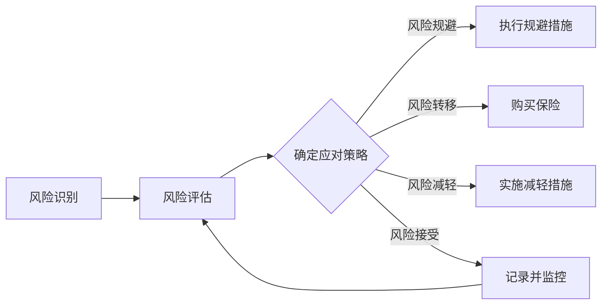

                 

### 文章标题：暴露风险，练就危机处理能力

> 关键词：风险管理、危机处理、能力培养

> 摘要：本文将深入探讨风险管理与危机处理的重要性，从概念出发，逐步分析风险识别、评估、应对策略，以及危机预警、应急响应、沟通协调和恢复评估等关键环节，旨在培养读者的危机处理能力，提高应对复杂情况的能力。

---

### 提取关键信息

在当今快速发展的信息技术时代，风险管理成为企业及个人生存和发展的关键。危机处理能力则是面对突发情况时，能够迅速做出有效决策、控制局面、恢复秩序的重要能力。本文将从以下几个关键点进行逐步分析：

1. **风险管理的核心概念与原理**
2. **危机的定义与类型**
3. **危机处理的流程与方法**
4. **培养危机处理能力的途径**
5. **成功案例解析**
6. **风险管理与危机处理的未来趋势**

---

### 第1章 风险管理的核心概念与原理

#### 1.1 风险管理的基本概念

风险管理是指识别、评估、处理和监控可能对组织目标实现产生不利影响的风险的过程。其核心目标是通过有效的风险管理，将风险带来的负面影响降到最低。

#### 1.2 风险识别与评估

- **风险识别方法**：包括定性方法和定量方法。定性方法如头脑风暴、SWOT分析等，定量方法如蒙特卡罗模拟、敏感性分析等。
- **风险评估指标**：包括风险发生的概率和风险的影响程度。常用的评估指标有风险值（Risk Value，即概率×影响程度）等。

#### 1.3 风险应对策略

- **风险规避**：通过调整计划或决策，避免风险的发生。
- **风险转移**：通过购买保险或签订合同，将风险转移给第三方。
- **风险减轻**：采取措施减少风险发生的概率或影响程度。
- **风险接受**：对无法避免或处理的风险，采取接受的态度。

#### 1.4 风险管理的最佳实践

- **风险管理流程**：包括风险识别、评估、应对策略制定、实施和监控。
- **风险管理工具**：如风险矩阵、决策树、风险登记册等。

### Mermaid 流程图：风险管理流程图

---

### 第2章 危机的定义与类型

#### 2.1 危机的概念

危机是指可能对组织目标造成严重威胁的突发事件或极端情况。危机具有突发性、不确定性、破坏性和紧迫性等特点。

#### 2.2 危机的分类

- **外部危机**：如自然灾害、市场波动、政策变化等。
- **内部危机**：如系统故障、管理失误、员工不当行为等。

#### 2.3 危机事件的影响

危机事件会对组织产生多方面的影响，包括社会影响、经济影响和组织影响。

---

### 第3章 危机处理的流程与方法

#### 3.1 危机预警机制

- **预警指标**：如异常指标监测、趋势分析等。
- **预警系统设计**：包括预警信号的设置、预警信息的传递和处理等。

#### 3.2 应急响应计划

- **应急组织架构**：明确各部门职责和协调机制。
- **应急资源准备**：包括人力、物资、技术和信息等。

#### 3.3 风险沟通与协调

- **沟通渠道选择**：如电话、邮件、即时通讯工具等。
- **协调机制**：确保各部门和外部合作伙伴之间的有效沟通和协调。

#### 3.4 危机后恢复与评估

- **恢复策略**：包括应急恢复、资源调配和系统修复等。
- **评估方法**：如后果评估、成本效益分析等。

---

### 第4章 培养危机处理能力

#### 4.1 心理准备

- **心理素质培养**：提高心理承受能力和情绪调节能力。
- **应对心理压力**：通过训练和经验积累，学会正确应对危机带来的心理压力。

#### 4.2 技能提升

- **应急决策能力**：提高在紧急情况下做出快速、有效决策的能力。
- **沟通协调能力**：提高与不同部门和外部合作伙伴之间的沟通协调能力。

#### 4.3 情景模拟

- **模拟训练方法**：通过模拟真实场景，提高应对危机的能力。
- **模拟场景设计**：根据可能出现的危机类型，设计相应的模拟场景。

#### 4.4 反思与持续改进

- **反思机制**：对每次危机处理过程进行反思，总结经验和教训。
- **持续改进**：根据反思结果，不断改进危机处理策略和能力。

---

### 第5章 成功案例解析

#### 5.1 案例一：危机应对的成功策略

- **案例背景**：某公司遭遇重大数据泄露事件。
- **应对措施**：立即启动应急预案，进行调查，通知受影响用户，采取法律手段，加强内部管理等。

#### 5.2 案例二：危机处理的错误示范

- **案例背景**：某公司管理层在应对突发事件时，反应迟缓，信息沟通不畅。
- **错误原因**：缺乏危机管理意识，应急预案不完善，沟通协调机制失效。

#### 5.3 案例三：危机管理的创新实践

- **案例背景**：某科技公司采用人工智能技术进行危机预测和应对。
- **创新点**：利用大数据分析和机器学习算法，实现实时预警和智能决策。

---

### 第6章 风险管理与危机处理的未来趋势

#### 6.1 新技术的影响

- **AI在风险管理中的应用**：如智能风控系统、自动化风险分析等。
- **区块链在危机处理中的作用**：如分布式账本技术提高危机信息的透明度和可信度。

#### 6.2 政策法规的发展

- **国际风险管理法规**：如ISO 31000国际风险管理标准。
- **国家危机处理政策**：如《中华人民共和国突发事件应对法》等。

#### 6.3 组织文化的塑造

- **风险管理文化的重要性**：如增强员工的风险意识，提高组织的危机应对能力。
- **危机处理文化的建设**：如建立积极、开放、协同的危机管理文化。

---

### 总结

本文从风险管理的核心概念与原理出发，逐步分析了危机的定义与类型、危机处理的流程与方法，以及培养危机处理能力的途径。通过成功案例解析和未来趋势分析，为读者提供了全面的风险管理与危机处理知识。在实际工作中，应结合具体情况，不断完善危机处理策略和能力，以应对不断变化的风险环境。

---

### 作者信息

作者：AI天才研究院/AI Genius Institute & 禅与计算机程序设计艺术 /Zen And The Art of Computer Programming

---

以上就是《暴露风险，练就危机处理能力》的完整目录大纲。接下来，我们将逐步深入每个章节，详细阐述相关内容。文章字数预计在8000～12000字左右，确保内容丰富、逻辑清晰、结构紧凑。让我们一步一步分析推理思考，共同提升危机处理能力。

