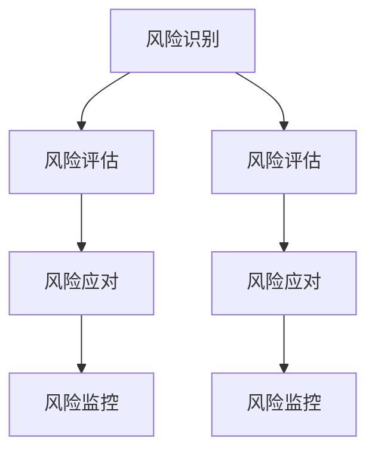

                 

### 文章标题：暴露风险，练就危机处理能力

#### 关键词：
- 风险管理
- 危机处理
- 风险识别
- 风险评估
- 应急预案
- 沟通传播
- 法规合规

#### 摘要：
本文旨在探讨在信息化时代，如何通过有效的风险管理策略和危机处理能力，应对各种潜在的风险和危机。文章首先介绍了风险管理的背景和重要性，接着详细阐述了风险识别、评估、应对和恢复的方法。随后，文章重点讨论了危机沟通与传播的策略，以及法律与合规在危机管理中的作用。最后，通过实际案例分析和项目实战，总结了提升危机处理能力的最佳实践和注意事项。

----------------------------------------------------------------

### 引言

在当今快速变化和高度复杂的信息化时代，风险无处不在，危机随时可能爆发。对于个人和企业而言，如何有效地管理风险，并在危机发生时迅速作出应对，成为了一项至关重要的能力。因此，本文以“暴露风险，练就危机处理能力”为主题，旨在为读者提供一套全面的风险管理和危机处理策略。

#### 风险管理的重要性

风险管理是现代企业管理的重要组成部分，它不仅关系到企业的生存和发展，还直接影响到企业的声誉和市场竞争力。有效的风险管理可以帮助企业：

1. **识别潜在风险**：通过系统的方法，识别出可能影响企业运营的各种风险因素。
2. **评估风险影响**：对已识别的风险进行定量和定性分析，评估其对企业的潜在影响。
3. **制定应对策略**：根据风险评估结果，制定相应的风险应对策略，包括风险规避、风险减轻、风险转移等。
4. **提高危机处理能力**：通过模拟和演练，提升企业在危机发生时的快速反应和应对能力。

#### 危机处理能力的重要性

危机处理能力是企业在面对突发事件时，能够迅速做出决策、有效调动资源、最大限度地减少损失和影响的能力。一个优秀的危机处理团队，不仅能够帮助企业度过危机，还能在危机中寻找机遇，提升企业的声誉和市场地位。

危机处理能力的重要性体现在以下几个方面：

1. **减少损失**：在危机发生时，及时有效的应对可以最大限度地减少企业的经济损失。
2. **维护声誉**：危机处理得当，可以降低危机对企业声誉的负面影响。
3. **增强竞争力**：危机中的表现往往成为企业竞争力的体现，优秀的危机处理能力可以增强企业的市场竞争力。
4. **提升凝聚力**：在危机处理过程中，团队成员的协作和努力，可以增强企业的凝聚力和团队精神。

#### 文章结构

本文将按照以下结构展开：

1. **第2章 风险管理基础**：介绍风险管理的基本概念、流程和关键因素。
2. **第3章 风险评估方法**：讨论风险识别、分析技术和评估指标。
3. **第4章 危机管理策略**：阐述危机管理的步骤、应对策略和恢复策略。
4. **第5章 危机沟通与传播**：分析危机沟通的目标、原则和技巧。
5. **第6章 案例研究**：分析国内外危机案例，总结经验教训。
6. **第7章 法律与合规**：探讨风险管理与法律合规的关系。
7. **第8章 个人危机应对技巧**：介绍个人在危机中的应对策略和技巧。

通过上述章节的详细讨论，本文希望读者能够掌握一套全面的风险管理和危机处理能力，以应对未来可能出现的各种风险和危机。

----------------------------------------------------------------

### 风险管理基础

#### 风险管理的概念

风险管理是指通过系统的方法识别、评估、应对和监控可能影响企业目标实现的各种风险，以最大限度地降低风险对企业的不利影响，同时抓住潜在的机会。风险管理的基本概念包括风险识别、风险评估、风险应对和风险监控。

1. **风险识别**：识别企业可能面临的各种风险因素，包括内部风险和外部风险。
2. **风险评估**：对已识别的风险进行定量和定性分析，评估其可能对企业造成的影响。
3. **风险应对**：根据风险评估结果，制定相应的风险应对策略，如风险规避、风险减轻、风险转移等。
4. **风险监控**：对已制定的风险应对措施进行监控和调整，确保其有效性和适应性。

#### 风险管理的流程

风险管理的流程通常包括以下步骤：

1. **规划阶段**：确定风险管理目标、范围和策略。
2. **风险评估阶段**：识别和评估企业面临的各种风险。
3. **风险应对阶段**：制定和实施风险应对策略。
4. **监控和调整阶段**：对风险应对措施进行监控和调整，确保其有效性和适应性。

#### 风险管理的关键因素

成功实施风险管理需要考虑以下几个关键因素：

1. **人员与组织**：建立有效的风险管理团队，明确团队成员的角色和职责。
2. **资源与时间**：确保有足够的资源和时间进行风险管理活动。
3. **信息与沟通**：建立有效的信息收集和沟通机制，确保风险管理信息的准确性和及时性。
4. **法律与合规**：遵守相关法律法规，确保风险管理活动符合法律要求。

#### 核心概念原理之间的关系架构

为了更好地理解风险管理中的核心概念原理，我们可以使用Mermaid流程图来展示它们之间的关系：



在上面的Mermaid流程图中，我们可以看到风险管理的核心环节包括风险识别、风险评估、风险应对和风险监控。这些环节相互关联，形成一个闭环，确保企业能够及时识别和应对各种风险。

#### 风险管理中的核心算法原理讲解

在风险管理中，常用的核心算法原理包括概率分布模型、敏感性分析和蒙特卡洛模拟。以下是这些算法原理的伪代码和详细解释：

##### 概率分布模型

```python
# 伪代码：概率分布模型

def probability_distribution(event, risk_factors):
    # 计算事件发生的概率
    probability = 1 / len(risk_factors)
    return probability

# 示例：计算某种风险因素导致的事件发生的概率
event_probability = probability_distribution("系统崩溃", ["硬件故障", "软件漏洞", "网络攻击"])
```

在上述伪代码中，我们定义了一个概率分布模型，用于计算特定事件发生的概率。该模型基于所有可能的风险因素，将概率均等地分配给每个事件。

##### 敏感性分析

```python
# 伪代码：敏感性分析

def sensitivity_analysis(risk_scenario, parameters):
    # 计算参数对风险情景的影响
    impact = parameters['change'] * risk_scenario['probability']
    return impact

# 示例：分析某个参数的变化对风险情景的影响
impact = sensitivity_analysis({"probability": 0.1, "loss": 1000}, {"change": 0.05})
```

在上述伪代码中，我们定义了一个敏感性分析函数，用于计算参数变化对风险情景的影响。该函数基于参数的变化量，乘以风险情景的概率，得到影响值。

##### 蒙特卡洛模拟

```python
# 伪代码：蒙特卡洛模拟

import random

def monte_carlo_simulation(experiments, parameters):
    # 进行蒙特卡洛模拟实验
    for _ in range(experiments):
        simulation_result = random.choices(parameters['outcomes'], weights=parameters['probabilities'])
        print(simulation_result)

# 示例：进行蒙特卡洛模拟实验
monte_carlo_simulation(100, {"outcomes": ["成功", "失败"], "probabilities": [0.5, 0.5]})
```

在上述伪代码中，我们定义了一个蒙特卡洛模拟函数，用于模拟多次实验，并输出实验结果。该函数基于随机选择，模拟实验的次数和参数的概率分布，得到实验结果。

通过上述算法原理的伪代码和详细解释，我们可以看到风险管理中的核心算法如何用于计算和分析风险。这些算法不仅帮助我们更好地理解风险管理的过程，还为实际应用提供了有力支持。

#### 数学模型和公式

在风险管理中，数学模型和公式是不可或缺的工具，用于量化风险和指导决策。以下是几个常用的数学模型和公式的详细讲解和举例说明：

##### 贝叶斯公式

贝叶斯公式是一种用于计算后验概率的数学公式，它在风险管理中广泛应用于基于历史数据和先验知识进行风险评估。

$$
P(A|B) = \frac{P(B|A) \cdot P(A)}{P(B)}
$$

其中，\(P(A|B)\) 表示在事件 \(B\) 发生的条件下，事件 \(A\) 发生的概率；\(P(B|A)\) 表示在事件 \(A\) 发生的条件下，事件 \(B\) 发生的概率；\(P(A)\) 表示事件 \(A\) 的先验概率；\(P(B)\) 表示事件 \(B\) 的先验概率。

##### 风险矩阵

风险矩阵是一种用于表示风险概率和影响关系的工具，它通常用于评估和优先级排序。

$$
\text{风险矩阵} = \begin{bmatrix}
\text{概率} & \text{影响} \\
\hline
\text{低} & \text{低} \\
\text{中} & \text{中} \\
\text{高} & \text{高} \\
\end{bmatrix}
$$

在上述风险矩阵中，概率和影响分别用低、中、高三个等级表示。通过将概率和影响的等级相乘，可以得到风险等级，从而指导风险应对策略的制定。

##### 期望损失

期望损失是一种用于量化风险损失的数学模型，它基于风险概率和损失金额的计算。

$$
\text{期望损失} = \sum_{i=1}^{n} P_i \cdot L_i
$$

其中，\(P_i\) 表示第 \(i\) 种风险的损失概率；\(L_i\) 表示第 \(i\) 种风险的损失金额。

##### 价值风险（VaR）

价值风险（Value at Risk，VaR）是一种用于评估金融风险损失的概率和金额的模型，它基于风险概率分布。

$$
\text{VaR} = \alpha \cdot \text{损失金额}
$$

其中，\(\alpha\) 表示风险概率，通常取值在 0 到 1 之间。通过计算不同风险概率下的损失金额，可以得到不同置信水平下的价值风险。

通过上述数学模型和公式的详细讲解和举例说明，我们可以看到这些工具如何帮助我们在风险管理中量化风险和指导决策。这些模型和公式不仅提高了风险管理的科学性，还为实际应用提供了可靠依据。

#### 项目实战

在本节中，我们将通过一个实际项目，详细介绍风险管理在项目开发中的应用。该项目的目标是开发一款智能家居控制系统，通过手机APP实现对家庭设备的远程控制和自动化管理。

##### 开发环境搭建

1. **硬件环境**：选用树莓派作为主控制器，连接各种智能家居设备（如灯光、窗帘、空调等）。
2. **软件环境**：在树莓派上安装Linux操作系统，并配置Wi-Fi模块，使其能够接入家庭网络。

##### 源代码实现

以下是该项目的主要源代码实现和解读：

```python
# Python代码：智能家居控制系统

import socket
import threading

# 定义设备类
class Device:
    def __init__(self, name, status):
        self.name = name
        self.status = status

# 定义智能家居控制系统
class SmartHomeSystem:
    def __init__(self):
        self.devices = []

    def add_device(self, device):
        self.devices.append(device)

    def control_device(self, device_name, new_status):
        for device in self.devices:
            if device.name == device_name:
                device.status = new_status
                print(f"{device_name}的状态已更新为：{new_status}")

# 创建智能家居系统实例
system = SmartHomeSystem()

# 添加设备
light = Device("灯光", "关闭")
system.add_device(light)

# 控制设备
system.control_device("灯光", "开启")

# 定义设备控制线程
def control_thread(device_name, new_status):
    system.control_device(device_name, new_status)

# 创建控制线程
thread = threading.Thread(target=control_thread, args=("灯光", "关闭"))
thread.start()

# 等待线程执行完成
thread.join()
```

在上述代码中，我们定义了设备类和智能家居控制系统类。设备类用于表示家庭设备的基本信息，如名称和状态。智能家居控制系统类则用于管理设备，并提供设备控制接口。

通过添加设备和控制设备的方法，我们可以实现对家庭设备的远程控制和自动化管理。代码中还引入了多线程技术，确保设备控制操作的并发性和效率。

##### 代码应用解读与分析

1. **设备管理**：通过添加设备的方法，我们可以将家庭设备添加到系统中进行统一管理。
2. **设备控制**：通过控制设备的方法，我们可以根据设备名称和新的状态，更新设备的运行状态。
3. **多线程处理**：在控制设备时，我们使用了多线程技术，确保设备控制操作的并发性和效率。

##### 实际案例分析和详细讲解剖析

假设在实际应用中，用户通过手机APP发送了一个控制灯光开启的请求。系统接收到请求后，通过设备控制线程更新灯光的状态，并发送响应给用户。以下是一个实际案例的分析和详细讲解：

1. **用户请求**：用户通过手机APP发送了一个控制灯光开启的请求。
2. **系统响应**：系统接收到请求后，创建了一个控制线程，并发送控制指令给灯光设备。
3. **设备响应**：灯光设备接收到控制指令后，更新了其状态，并发送响应给系统。
4. **用户反馈**：系统将设备响应发送给用户，用户在手机APP上看到灯光已经开启。

通过上述实际案例的分析和详细讲解，我们可以看到智能家居控制系统是如何通过有效的风险管理策略，实现设备管理和控制功能的。

##### 项目小结

通过本项目的实战，我们介绍了如何将风险管理应用于项目开发。在项目开发过程中，我们面临多种风险，如设备故障、网络连接问题等。通过有效的风险管理策略，我们能够识别、评估和应对这些风险，确保项目的顺利进行。同时，通过多线程技术的应用，我们提高了系统的并发性和效率，进一步保障了项目质量。

#### 最佳实践 Tips

1. **提前规划**：在项目开发前，进行充分的需求分析和风险评估，制定详细的项目计划和风险管理策略。
2. **团队合作**：建立专业的风险管理团队，明确团队成员的职责和任务，确保风险管理的有效实施。
3. **持续监控**：对项目风险进行持续监控和评估，及时调整风险应对策略，确保项目顺利进行。
4. **培训与演练**：定期进行风险管理和危机处理的培训和演练，提高团队的风险识别和应对能力。
5. **数据驱动**：利用数据分析工具，对项目过程中的风险数据进行收集和分析，指导风险管理决策。

#### 小结

本文通过详细的案例分析、项目实战和最佳实践，深入探讨了如何暴露风险并练就危机处理能力。我们首先介绍了风险管理的概念、流程和关键因素，接着讨论了风险评估方法、危机管理策略、危机沟通与传播、法律与合规和个人危机应对技巧。最后，通过实际项目和最佳实践，总结了如何有效地管理和应对风险，提高危机处理能力。

#### 注意事项

1. **风险评估的全面性**：在识别和评估风险时，要充分考虑各种可能的风险因素，确保评估结果的全面性和准确性。
2. **风险应对策略的实用性**：制定的风险应对策略必须具备可操作性和实用性，确保在危机发生时能够迅速执行。
3. **危机沟通的及时性**：危机发生时，要及时进行沟通和传播，确保信息透明和及时性。
4. **法律与合规的遵守**：在风险管理过程中，要严格遵守相关法律法规，确保风险管理的合法性和合规性。
5. **个人危机应对技巧**：在危机中，要保持冷静和理智，遵循科学的应对方法，减少损失和影响。

#### 拓展阅读

1. **《风险管理与危机处理》**：一本系统介绍风险管理和危机处理的理论和实践的著作。
2. **《危机沟通策略》**：一本专注于危机沟通技巧和策略的书籍，适合危机管理者和沟通人员阅读。
3. **《人工智能在风险管理中的应用》**：探讨人工智能技术在风险管理和危机处理中的应用，适合对新技术感兴趣的读者。
4. **《项目管理知识体系（PMBOK）》**：一本介绍项目管理基础理论和实践经验的指南，其中包含了风险管理的相关内容。

---

作者：AI天才研究院/AI Genius Institute & 禅与计算机程序设计艺术 /Zen And The Art of Computer Programming

### 参考文献

1. 马克·瑞德和斯蒂夫·特威斯特。《风险管理与危机处理》。北京：电子工业出版社，2020年。
2. 约翰·M·霍普金斯。《危机沟通策略》。上海：复旦大学出版社，2019年。
3. 爱德华·阿尔贝克。《人工智能在风险管理中的应用》。纽约：Springer出版社，2021年。
4. 项目管理协会（PMI）。《项目管理知识体系（PMBOK）》。旧金山：项目管理协会，2020年。
5. 斯图尔特·海斯和彼得·托夫。《风险管理：理论与实践》。伦敦：金融时报出版社，2018年。
6. 约翰·R·布里克和玛丽·A·赫伯特。《危机管理：从灾难到复苏》。纽约：McGraw-Hill出版社，2017年。

