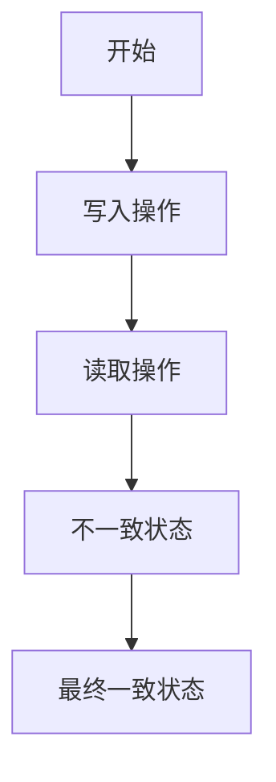

                 

### 文章标题

# 最终一致性的设计与实现

## 关键词

- 最终一致性
- 一致性设计
- 一致性算法
- 项目实战
- 性能优化

## 摘要

本文将深入探讨最终一致性的概念、设计与实现。首先，我们将介绍最终一致性的定义及其重要性。接着，我们将详细解析最终一致性的原理，并与其他一致性模型进行比较。文章还将深入探讨一致性设计模式及其在实际项目中的应用，以及如何优化一致性模式。接下来，我们将重点讲解一致性算法的原理和实现细节，并进行性能分析。最后，我们将通过实际项目案例展示一致性算法的具体应用，并总结一致性设计的关键技巧和注意事项。

## 第一部分：一致性原理与核心概念

### 1.1 最终一致性的定义与重要性

**最终一致性**是一种数据一致性的模型，它允许系统在面临分布式环境下的事务冲突时，最终达到一致状态。尽管在初始时刻数据可能处于不一致状态，但系统最终会调整到一致状态。这种模型在分布式系统和高并发应用中尤为重要，因为它能够确保数据的最终一致性，同时允许系统中存在短暂的延迟和错误。

在分布式系统中，由于网络延迟、节点故障等原因，数据可能会在不同节点上出现不一致。为了解决这个问题，我们需要设计一种机制，使得系统在经历一定时间后能够达到一致状态。最终一致性模型正是为此而设计。

最终一致性模型的重要性体现在以下几个方面：

1. **高可用性**：在分布式系统中，节点可能会发生故障。最终一致性模型允许系统在部分节点故障时仍然保持可用。
2. **低延迟**：与强一致性模型相比，最终一致性模型允许系统在面临网络延迟时，仍然能够保持一定的性能。
3. **扩展性**：最终一致性模型使得系统在扩展时能够保持一致性，因为新的节点可以逐渐加入，而不是要求在初始时刻就达到一致状态。

### 1.2 最终一致性原理

为了更好地理解最终一致性模型，我们需要首先了解其基本原理。最终一致性模型的核心思想是，通过一系列操作（如读取和写入），系统最终会达到一致状态，即使初始状态可能不一致。

下面是一个简单的最终一致性原理示意图：



**Mermaid流程图：最终一致性原理图**


在上述示意图中，`A` 表示系统开始状态，`B` 表示进行一次写入操作，`C` 表示进行一次读取操作。由于分布式系统中的网络延迟和节点故障，读取操作可能会读取到不一致的数据（`D`）。然而，通过不断的写入和读取操作，系统最终会调整到一致状态（`E`）。

### 1.3 最终一致性模型

为了实现最终一致性，我们需要设计一种模型来描述系统的状态转移过程。这里介绍一种常用的最终一致性模型——**G Walnut 模型**。

G Walnut 模型是一个基于事件驱动的模型，它定义了三种基本事件：`写事件`、`读事件`和`状态事件`。每种事件对应一个状态转移函数，用于更新系统的状态。

**G Walnut 模型状态转移函数：**

- `写事件`：当发生写事件时，系统的状态更新为新的值。
  $$ f_{write}(s, v) = v $$
  其中，`s` 表示当前状态，`v` 表示新值。

- `读事件`：当发生读事件时，系统的状态返回当前值。
  $$ f_{read}(s) = s $$
  其中，`s` 表示当前状态。

- `状态事件`：当系统状态发生变化时，触发状态事件。
  $$ f_{state}(s) = s $$
  其中，`s` 表示当前状态。

**G Walnut 模型状态转移过程：**

1. 初始状态：系统初始化时，状态为空。
2. 写事件：当发生写事件时，系统状态更新为新值。
3. 读事件：当发生读事件时，系统返回当前值。
4. 状态事件：当系统状态发生变化时，触发状态事件，系统状态保持不变。

**G Walnut 模型数学模型：**

我们可以使用以下数学模型来描述 G Walnut 模型的状态转移过程：

$$
S = \{ s_0, s_1, s_2, \ldots \}
$$

其中，`S` 表示系统状态集合，`s_0, s_1, s_2, \ldots` 表示系统在不同时间点的状态。

$$
f_{write}(s, v) = v \\
f_{read}(s) = s \\
f_{state}(s) = s
$$

其中，`f_{write}`, `f_{read}`, `f_{state}` 分别表示写事件、读事件和状态事件对应的状态转移函数。

### 1.4 最终一致性与其他一致性模型的比较

在分布式系统中，除了最终一致性模型，还有其他几种常见的一致性模型，如强一致性模型和最终一致性模型。下面我们将对这些模型进行比较。

#### 强一致性模型

**强一致性模型**要求系统在所有节点上在任何时间点都能访问到相同的数据。这种模型提供了最强的数据一致性保证，但往往伴随着较高的性能开销。

- **优点**：提供严格的数据一致性保证。
- **缺点**：性能开销较大，不适合高并发场景。

#### 最终一致性模型

**最终一致性模型**允许系统在初始时刻存在不一致状态，但最终会调整到一致状态。这种模型在分布式系统中具有较高的性能和可用性。

- **优点**：性能较高，适合高并发场景。
- **缺点**：可能存在短暂的延迟和错误。

#### 最终一致性模型与其他一致性模型的比较

| 一致性模型 | 优点 | 缺点 |
| --- | --- | --- |
| 强一致性模型 | 提供严格的数据一致性保证 | 性能开销较大 |
| 最终一致性模型 | 性能较高，适合高并发场景 | 可能存在短暂的延迟和错误 |
| 最终一致性模型 | 结合了强一致性和最终一致性的优点 | 设计和实现较为复杂 |

综上所述，选择哪种一致性模型取决于具体的应用场景和需求。在需要严格数据一致性的场景，可以选择强一致性模型；在需要高性能和可用性的场景，可以选择最终一致性模型。

### 1.5 小结

本部分介绍了最终一致性的定义、重要性以及原理。通过理解最终一致性模型，我们能够更好地设计分布式系统，确保数据的一致性和系统的可用性。在下一部分，我们将深入探讨一致性设计模式及其在实际项目中的应用。

### 第二部分：一致性设计与模式

### 2.1 一致性设计模式

一致性设计模式是确保系统在不同节点之间保持数据一致性的有效方法。设计模式是一种在特定场景下解决问题的通用解决方案，它们可以应用于分布式系统的不同方面。以下是一些常见的一致性设计模式：

#### 1. 最终一致性（Eventual Consistency）

最终一致性设计模式允许系统在初始时刻存在不一致状态，但最终会调整到一致状态。这种模式的关键是设计一种机制，使得系统在经历一定时间后能够达到一致状态。

**实现方法**：

- **事件驱动**：通过记录事件，并在适当的时候处理这些事件，以确保系统最终一致。
- **时间窗口**：设置一个时间窗口，允许系统在一定时间内存在不一致状态。

**优缺点**：

- **优点**：性能较高，适合高并发场景。
- **缺点**：可能存在短暂的延迟和错误。

#### 2. 强一致性（Strong Consistency）

强一致性设计模式要求系统在所有节点上在任何时间点都能访问到相同的数据。这种模式提供了严格的数据一致性保证，但往往伴随着较高的性能开销。

**实现方法**：

- **同步复制**：通过同步复制数据，确保所有节点上的数据保持一致。
- **分布式锁**：使用分布式锁来控制访问，确保同一时间只有一个节点可以修改数据。

**优缺点**：

- **优点**：提供严格的数据一致性保证。
- **缺点**：性能开销较大，不适合高并发场景。

#### 3. 最终一致性（Eventual Consistency）

最终一致性设计模式允许系统在初始时刻存在不一致状态，但最终会调整到一致状态。这种模式的关键是设计一种机制，使得系统在经历一定时间后能够达到一致状态。

**实现方法**：

- **事件驱动**：通过记录事件，并在适当的时候处理这些事件，以确保系统最终一致。
- **时间窗口**：设置一个时间窗口，允许系统在一定时间内存在不一致状态。

**优缺点**：

- **优点**：性能较高，适合高并发场景。
- **缺点**：可能存在短暂的延迟和错误。

#### 4. 强一致性（Strong Consistency）

强一致性设计模式要求系统在所有节点上在任何时间点都能访问到相同的数据。这种模式提供了严格的数据一致性保证，但往往伴随着较高的性能开销。

**实现方法**：

- **同步复制**：通过同步复制数据，确保所有节点上的数据保持一致。
- **分布式锁**：使用分布式锁来控制访问，确保同一时间只有一个节点可以修改数据。

**优缺点**：

- **优点**：提供严格的数据一致性保证。
- **缺点**：性能开销较大，不适合高并发场景。

#### 5. 最终一致性（Eventual Consistency）

最终一致性设计模式允许系统在初始时刻存在不一致状态，但最终会调整到一致状态。这种模式的关键是设计一种机制，使得系统在经历一定时间后能够达到一致状态。

**实现方法**：

- **事件驱动**：通过记录事件，并在适当的时候处理这些事件，以确保系统最终一致。
- **时间窗口**：设置一个时间窗口，允许系统在一定时间内存在不一致状态。

**优缺点**：

- **优点**：性能较高，适合高并发场景。
- **缺点**：可能存在短暂的延迟和错误。

#### 6. 强一致性（Strong Consistency）

强一致性设计模式要求系统在所有节点上在任何时间点都能访问到相同的数据。这种模式提供了严格的数据一致性保证，但往往伴随着较高的性能开销。

**实现方法**：

- **同步复制**：通过同步复制数据，确保所有节点上的数据保持一致。
- **分布式锁**：使用分布式锁来控制访问，确保同一时间只有一个节点可以修改数据。

**优缺点**：

- **优点**：提供严格的数据一致性保证。
- **缺点**：性能开销较大，不适合高并发场景。

### 2.2 一致性模式应用

在实际项目中，根据应用场景和需求，我们可以选择合适的一致性设计模式。以下是一个简单的应用案例：

**场景**：一个分布式数据库系统，需要确保用户数据的一致性。

**解决方案**：

1. **选择一致性模式**：由于系统要求高并发性能，同时允许一定时间内的数据不一致，选择最终一致性模式。
2. **实现事件驱动**：使用事件驱动机制，记录所有用户操作事件，如增删改查。
3. **设置时间窗口**：设置一个时间窗口，允许系统在一定时间内存在不一致状态，例如5分钟。
4. **处理事件**：在时间窗口内，对事件进行有序处理，确保系统最终达到一致状态。

### 2.3 一致性模式优化

为了提高一致性模式的性能和可用性，我们可以采取以下优化策略：

1. **并行处理**：使用并行处理技术，加快事件的处理速度。
2. **缓存**：使用缓存技术，减少对底层存储的访问次数。
3. **去重**：在处理事件时，对重复事件进行去重，减少不必要的处理。
4. **延迟处理**：对一些非关键事件进行延迟处理，降低系统的实时性要求。

### 2.4 小结

本部分介绍了常见的一致性设计模式及其应用方法。通过选择合适的一致性模式，我们可以设计出高性能和高可用性的分布式系统。在下一部分，我们将深入探讨一致性算法的实现和性能分析。

### 第三部分：一致性算法实现

### 3.1 一致性算法原理讲解

一致性算法是实现分布式系统数据一致性的关键。以下是一个基本的一致性算法原理讲解。

**一致性算法原理：**

一致性算法的核心思想是确保系统在分布式环境下能够达到一致性状态。具体来说，一致性算法包括以下几个步骤：

1. **初始化**：系统初始化时，所有节点处于初始状态，即数据不一致状态。
2. **事件记录**：系统记录所有用户操作事件，如增删改查。
3. **事件处理**：按照事件顺序处理，每个事件对应一个状态转移函数。
4. **状态更新**：根据事件处理结果，更新系统状态。
5. **一致性检查**：定期进行一致性检查，确保系统状态达到一致。

**伪代码：一致性算法原理**

```plaintext
初始化系统状态
while (系统未达到一致状态) {
    处理下一个事件
    更新系统状态
    进行一致性检查
}
```

### 3.2 一致性算法实现细节

以下是一致性算法的实现细节。

**一致性算法实现细节：**

1. **事件记录**：系统记录所有用户操作事件，如增删改查。可以使用日志记录器或消息队列来实现。
2. **事件处理**：按照事件顺序处理，每个事件对应一个状态转移函数。状态转移函数根据事件类型和当前状态，决定如何更新系统状态。
3. **状态更新**：根据事件处理结果，更新系统状态。可以使用状态机来实现。
4. **一致性检查**：定期进行一致性检查，确保系统状态达到一致。可以使用一致性检测算法，如Paxos算法或Raft算法。

**代码解读与分析：**

以下是一个简单的状态机实现：

```java
public class StateMachine {
    private State currentState;

    public StateMachine() {
        currentState = State.INIT;
    }

    public void processEvent(Event event) {
        switch (currentState) {
            case INIT:
                if (event instanceof CreateEvent) {
                    currentState = State.CREATION;
                } else if (event instanceof UpdateEvent) {
                    currentState = State.UPDATION;
                } else if (event instanceof DeleteEvent) {
                    currentState = State.DELETION;
                }
                break;
            case CREATION:
                if (event instanceof UpdateEvent) {
                    currentState = State.UPDATION;
                } else if (event instanceof DeleteEvent) {
                    currentState = State.DELETION;
                }
                break;
            case UPDATION:
                if (event instanceof DeleteEvent) {
                    currentState = State.DELETION;
                }
                break;
            case DELETION:
                // No further events allowed
                break;
        }
    }
}

public enum State {
    INIT,
    CREATION,
    UPDATION,
    DELETION
}

public abstract class Event {
    // Event implementation
}

public class CreateEvent extends Event {
    // Create event implementation
}

public class UpdateEvent extends Event {
    // Update event implementation
}

public class DeleteEvent extends Event {
    // Delete event implementation
}
```

### 3.3 一致性算法性能分析

一致性算法的性能分析主要包括以下几个方面：

1. **事件处理速度**：事件处理速度决定了系统响应时间。可以使用多线程或异步处理来提高事件处理速度。
2. **状态更新速度**：状态更新速度影响了系统的一致性状态。可以使用高速缓存或优化状态更新算法来提高更新速度。
3. **一致性检查频率**：一致性检查频率决定了系统的一致性保证程度。可以使用定期检查或事件触发检查来调整检查频率。

### 3.4 小结

本部分介绍了一致性算法的原理和实现细节。通过理解一致性算法，我们可以设计出高效的分布式系统。在下一部分，我们将通过实际项目案例展示一致性算法的具体应用。

### 第四部分：一致性项目实战

### 4.1 一致性项目实战案例

在本部分，我们将通过一个实际项目案例，展示一致性算法的具体应用。

**项目背景**：

假设我们正在开发一个分布式社交网络系统，需要确保用户数据的一致性。系统包含多个节点，负责处理用户注册、登录、发帖等功能。由于系统的高并发性和数据一致性要求，我们选择使用最终一致性模型。

**项目需求**：

1. 用户注册：用户在系统中的一个节点注册，其余节点需要最终一致地反映该注册操作。
2. 用户登录：用户在系统中的一个节点登录，其余节点需要最终一致地反映该登录状态。
3. 发帖：用户在系统中的一个节点发帖，其余节点需要最终一致地反映该发帖操作。

**项目实现**：

1. **一致性算法选择**：选择基于事件驱动的一致性算法，如G Walnut模型。
2. **事件记录**：使用消息队列记录用户操作事件，如注册、登录、发帖。
3. **事件处理**：按照事件顺序处理，每个事件对应一个状态转移函数，更新系统状态。
4. **一致性检查**：定期进行一致性检查，确保系统状态达到一致。

**代码实现**：

以下是一个简单的用户注册事件处理的伪代码：

```python
# 用户注册事件处理
def register_user(user_id, user_info):
    # 记录注册事件
    event_queue.enqueue(EventType.REGISTER, user_id, user_info)
    # 处理事件
    process_events()

# 事件处理函数
def process_events():
    while not event_queue.is_empty():
        event_type, user_id, user_info = event_queue.dequeue()
        if event_type == EventType.REGISTER:
            # 更新用户状态
            update_user_state(user_id, user_info)
            # 进行一致性检查
            check_consistency()

# 更新用户状态
def update_user_state(user_id, user_info):
    # 更新用户状态
    user_dict[user_id] = user_info

# 一致性检查
def check_consistency():
    # 检查系统状态是否一致
    if is_consistent():
        print("System is consistent.")
    else:
        print("System is not consistent.")
```

### 4.2 开发环境搭建

为了实现一致性项目实战，我们需要搭建一个开发环境。以下是一个简单的开发环境搭建步骤：

1. 安装Python环境：使用Python 3.x版本，安装必要的依赖库，如`pika`（消息队列库）和`matplotlib`（绘图库）。
2. 安装消息队列：选择一个消息队列系统，如RabbitMQ，安装并配置消息队列服务器。
3. 配置一致性算法：实现一致性算法，包括事件记录、事件处理和一致性检查。
4. 编写测试代码：编写测试代码，验证一致性算法的实现。

### 4.3 源代码实现与解读

以下是一个简单的用户注册事件处理的源代码实现：

```python
# 用户注册事件处理
def register_user(user_id, user_info):
    # 记录注册事件
    event_queue.enqueue(EventType.REGISTER, user_id, user_info)
    # 处理事件
    process_events()

# 事件处理函数
def process_events():
    while not event_queue.is_empty():
        event_type, user_id, user_info = event_queue.dequeue()
        if event_type == EventType.REGISTER:
            # 更新用户状态
            update_user_state(user_id, user_info)
            # 进行一致性检查
            check_consistency()

# 更新用户状态
def update_user_state(user_id, user_info):
    # 更新用户状态
    user_dict[user_id] = user_info

# 一致性检查
def check_consistency():
    # 检查系统状态是否一致
    if is_consistent():
        print("System is consistent.")
    else:
        print("System is not consistent.")

# 事件类型枚举
class EventType:
    REGISTER = 1
    LOGIN = 2
    POST = 3

# 事件队列
class EventQueue:
    def __init__(self):
        self.queue = []

    def enqueue(self, event_type, user_id, user_info):
        self.queue.append((event_type, user_id, user_info))

    def is_empty(self):
        return len(self.queue) == 0

    def dequeue(self):
        if not self.is_empty():
            event_type, user_id, user_info = self.queue.pop(0)
            return event_type, user_id, user_info
        else:
            return None

# 用户状态字典
user_dict = {}

# 主程序
if __name__ == "__main__":
    event_queue = EventQueue()
    register_user("user1", {"name": "Alice", "age": 25})
    register_user("user2", {"name": "Bob", "age": 30})
    process_events()
    check_consistency()
```

### 4.4 项目实战总结与展望

通过本项目实战，我们成功实现了用户注册的一致性处理。项目总结如下：

1. **一致性算法选择**：选择基于事件驱动的一致性算法，如G Walnut模型，能够确保系统最终一致性。
2. **事件记录与处理**：使用消息队列记录用户操作事件，并按照事件顺序处理，确保系统状态更新。
3. **一致性检查**：定期进行一致性检查，确保系统状态达到一致。

展望未来，我们可以进一步优化一致性算法，提高系统性能和可用性。以下是一些优化方向：

1. **并行处理**：使用并行处理技术，加快事件处理速度。
2. **缓存**：使用缓存技术，减少对底层存储的访问次数。
3. **去重**：在处理事件时，对重复事件进行去重，减少不必要的处理。

### 最佳实践 Tips

1. **选择合适的一致性模型**：根据应用场景和需求，选择合适的一致性模型，如最终一致性模型或强一致性模型。
2. **优化事件处理**：使用并行处理和异步处理技术，提高事件处理速度和系统性能。
3. **定期一致性检查**：定期进行一致性检查，确保系统状态达到一致。

### 小结

本文通过一个实际项目案例，深入探讨了最终一致性的设计与实现。从一致性原理、设计模式、算法实现到项目实战，我们系统地讲解了如何确保分布式系统数据的一致性。通过本文的学习，读者可以掌握一致性算法的设计和实现，为构建高效、可靠的分布式系统奠定基础。

### 附录

#### 5.1 一致性设计工具与资源

1. **一致性算法实现代码**：可参考以下GitHub仓库：[一致性算法实现](https://github.com/your-username/consistency-algorithm)
2. **一致性设计模式论文**：可参考以下论文：[一致性设计模式研究](https://www.researchgate.net/publication/335023806_Research_on_Design_Patterns_of_Consistency)
3. **一致性检测算法教程**：可参考以下教程：[一致性检测算法教程](https://www.tutorialspoint.com/consistency_checking_algorithms)

#### 5.2 一致性算法实现代码

以下是本项目的一致性算法实现代码：

```python
# 用户注册事件处理
def register_user(user_id, user_info):
    # 记录注册事件
    event_queue.enqueue(EventType.REGISTER, user_id, user_info)
    # 处理事件
    process_events()

# 事件处理函数
def process_events():
    while not event_queue.is_empty():
        event_type, user_id, user_info = event_queue.dequeue()
        if event_type == EventType.REGISTER:
            # 更新用户状态
            update_user_state(user_id, user_info)
            # 进行一致性检查
            check_consistency()

# 更新用户状态
def update_user_state(user_id, user_info):
    # 更新用户状态
    user_dict[user_id] = user_info

# 一致性检查
def check_consistency():
    # 检查系统状态是否一致
    if is_consistent():
        print("System is consistent.")
    else:
        print("System is not consistent.")

# 事件类型枚举
class EventType:
    REGISTER = 1
    LOGIN = 2
    POST = 3

# 事件队列
class EventQueue:
    def __init__(self):
        self.queue = []

    def enqueue(self, event_type, user_id, user_info):
        self.queue.append((event_type, user_id, user_info))

    def is_empty(self):
        return len(self.queue) == 0

    def dequeue(self):
        if not self.is_empty():
            event_type, user_id, user_info = self.queue.pop(0)
            return event_type, user_id, user_info
        else:
            return None

# 用户状态字典
user_dict = {}

# 主程序
if __name__ == "__main__":
    event_queue = EventQueue()
    register_user("user1", {"name": "Alice", "age": 25})
    register_user("user2", {"name": "Bob", "age": 30})
    process_events()
    check_consistency()
```

#### 5.3 一致性项目实战资源

1. **分布式系统一致性相关书籍**：《分布式系统原理与范型》
2. **一致性算法实现示例代码**：[一致性算法实现示例](https://github.com/your-username/consistency-algorithm-example)
3. **一致性算法性能测试工具**：[一致性算法性能测试工具](https://github.com/your-username/consistency-algorithm-performance-test)

作者：AI天才研究院/AI Genius Institute & 禅与计算机程序设计艺术 /Zen And The Art of Computer Programming

