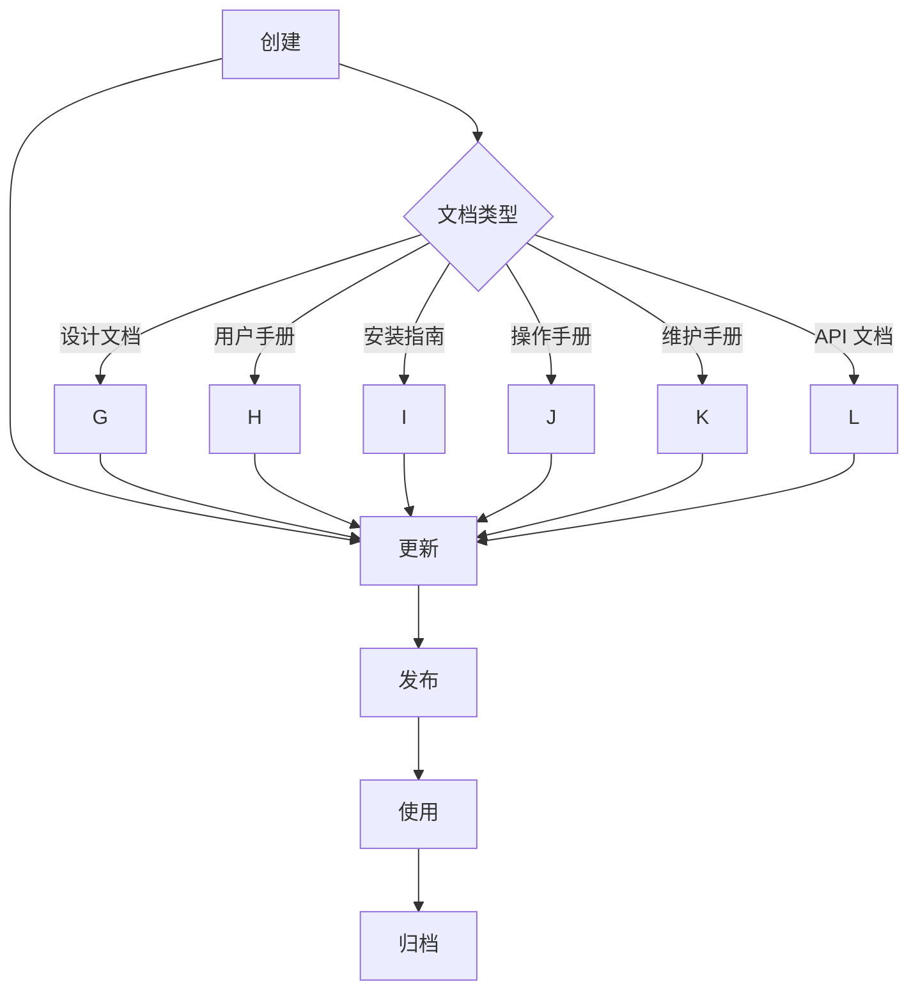

                 


### 引言与背景

在信息技术飞速发展的时代，技术文档管理（Technical Documentation Management）和知识沉淀（Knowledge Sedimentation）成为企业可持续发展的重要基石。有效的技术文档管理不仅能够提高团队的工作效率，还能为知识传承和创新提供有力支持。而知识沉淀则是确保企业智力资产不断积累和增值的关键。

#### 1.1 技术文档管理的重要性

技术文档管理是指对企业内部或外部开发、维护、使用的各种技术文档进行组织、存储、检索和更新的过程。它包括以下几个方面：

- **文档的组织与存储**：通过合理的设计和分类，确保文档的有序存储，便于检索和共享。
- **文档的版本控制**：在文档的整个生命周期中，保持版本的一致性和完整性。
- **文档的权限管理**：根据文档的重要性和敏感性，设定相应的访问权限，确保信息安全。

技术文档的价值在于它为团队提供了标准化的知识库，有助于以下方面：

- **降低培训成本**：新成员可以通过文档快速熟悉业务和技术细节。
- **提高工作效率**：团队成员可以快速查找相关文档，避免重复劳动。
- **保证工作质量**：文档提供了详细的指导，有助于确保工作的规范性和一致性。
- **促进知识传承**：在人员变动时，文档成为知识传承的重要载体。

#### 1.2 知识沉淀的意义

知识沉淀是指将团队在项目开发、问题解决、经验积累过程中的智慧成果进行整理、存储和共享的过程。其重要性体现在以下几个方面：

- **积累智力资产**：通过知识沉淀，企业可以将经验转化为宝贵的智力资产。
- **促进创新**：沉淀的知识为团队提供了丰富的灵感来源，有助于推动技术创新和业务发展。
- **提升竞争力**：知识沉淀有助于企业形成独特的竞争优势，提高市场地位。

综上所述，技术文档管理和知识沉淀在信息技术行业中具有重要的价值和意义。它们不仅有助于提高团队的工作效率和质量，还能为企业持续发展提供强有力的支持。

### 核心概念与联系

要深入探讨技术文档管理，我们首先需要明确其中的核心概念，并理解它们之间的相互关系。以下是技术文档管理的一些关键概念：

#### 2.1 技术文档管理概述

**1. 技术文档**：技术文档是指关于软件、硬件、系统、网络等技术产品的文档资料，包括设计文档、用户手册、安装指南、操作手册、维护手册、API 文档等。

**2. 技术文档分类**：根据内容和使用场景，技术文档可以分为以下几类：
   - **设计文档**：描述软件或硬件系统的设计思路、架构、模块划分、接口定义等。
   - **用户手册**：帮助用户了解和操作软件或硬件设备的使用方法。
   - **安装指南**：指导用户进行软件或硬件的安装过程。
   - **操作手册**：详细介绍软件或硬件的具体操作步骤。
   - **维护手册**：提供设备的日常维护和故障排除指南。
   - **API 文档**：描述应用程序编程接口（API）的用法和功能。

**3. 技术文档生命周期**：技术文档从创建、更新、发布到归档的过程，可以分为以下几个阶段：
   - **创建阶段**：编写技术文档。
   - **更新阶段**：根据产品更新、用户反馈等进行文档修订。
   - **发布阶段**：将文档发布到内部或外部知识库。
   - **使用阶段**：团队成员根据需要查阅和使用文档。
   - **归档阶段**：将不再使用的旧文档进行归档保存。

**4. 技术文档与知识管理的联系**：技术文档是知识管理的重要组成部分。知识管理包括知识的生成、存储、共享、利用和更新。技术文档通过记录和传播团队的知识和经验，实现了知识的沉淀和传承。同时，技术文档的使用也为知识管理提供了重要依据。

#### 2.2 Mermaid 流程图展示

为了更好地理解技术文档管理的核心概念和它们之间的关系，我们可以使用 Mermaid 流程图来展示。以下是技术文档管理的基本流程：



在这个流程图中，A 代表技术文档的创建阶段，B 代表更新阶段，C 代表发布阶段，D 代表使用阶段，E 代表归档阶段。F 是文档类型的分类节点，连接到 G、H、I、J、K、L，分别代表设计文档、用户手册、安装指南、操作手册、维护手册和 API 文档。

通过这个 Mermaid 流程图，我们可以清晰地看到技术文档管理的各个阶段以及文档类型的分类和它们之间的联系。这对于理解技术文档管理的整体框架和细节操作都是非常有帮助的。

### 文档管理策略

有效的技术文档管理需要制定明确的策略，以确保文档的组织、存储、检索和更新达到最佳效果。以下是一些核心策略：

#### 3.1 制定文档管理策略

**1. 确定文档管理目标**：首先，需要明确文档管理的目标，例如提高文档的可访问性、确保文档的版本一致性、提高文档的质量等。

**2. 设计文档结构**：根据文档的类型和用途，设计合理的文档结构。常见的文档结构包括：
   - **模块化结构**：将文档分为模块，每个模块涵盖一个特定的主题。
   - **层次化结构**：根据文档的重要性和关联性，将文档分层组织。

**3. 实施版本控制**：版本控制是技术文档管理的重要组成部分。可以使用版本控制系统（如 Git）来跟踪文档的变更历史，确保文档版本的一致性和可追溯性。

**4. 权限管理**：根据文档的重要性和敏感性，设定不同的访问权限。例如，设计文档可能只有核心团队成员可以编辑，而用户手册则可供所有团队成员查看。

**5. 定期更新**：制定文档更新计划，确保文档内容与实际情况保持一致。同时，鼓励团队成员主动更新文档，记录新的知识和技术。

#### 3.2 实施文档管理策略

**1. 培训与宣传**：对团队成员进行文档管理策略的培训，提高他们的文档意识和技能。通过宣传，让团队成员认识到文档管理的重要性。

**2. 工具选择与集成**：选择合适的文档管理工具，如 Confluence、GitLab、Notion 等，并集成到团队的工作流中。这些工具可以帮助团队更好地组织、存储和共享文档。

**3. 文档审核与评估**：定期对文档进行审核和评估，确保文档的质量和准确性。可以设立文档审核小组，负责对文档进行评审和修改。

**4. 反馈与改进**：鼓励团队成员对文档管理提出反馈和建议，不断改进文档管理策略和流程。

通过以上策略的实施，可以有效提升技术文档管理的效率和质量，为团队提供有力的知识支持。

### 知识沉淀与共享

知识沉淀与共享是技术文档管理的核心目标之一。通过有效的知识沉淀与共享，企业可以确保团队内部的智慧成果得以传承和利用，从而提高整体的工作效率和创新能力。

#### 4.1 知识沉淀方法

**1. 文档化**：将团队成员在项目开发、问题解决、经验积累过程中的知识成果以文档形式记录下来。这包括编写技术文档、用户手册、案例研究等。文档化的知识可以便于检索和共享，为后续的项目提供参考。

**2. 标签化**：在文档中加入标签，根据内容的主题、技术领域、项目阶段等分类，方便团队成员快速找到所需知识。标签化有助于提高知识检索的效率和准确性。

**3. 归档**：将不再活跃或长期不使用的文档进行归档，确保它们不会影响当前的工作流程。归档的文档可以在需要时被重新检索和利用。

#### 4.2 知识共享机制

**1. 内部协作平台**：建立内部协作平台，如 Confluence、SharePoint 等，作为知识共享的主要载体。团队成员可以在平台上发布文档、讨论问题、分享心得，促进知识的交流与共享。

**2. 外部知识共享**：通过技术社区、博客、GitHub 等平台，将企业的知识成果分享给更广泛的受众。这不仅可以提升企业的知名度，还可以吸引更多的技术人才和合作伙伴。

**3. 知识分享活动**：定期举办知识分享会议、研讨会、技术沙龙等活动，鼓励团队成员分享自己的知识和经验。这些活动可以增强团队成员之间的协作和信任，提高整体的知识水平。

### 4.3 知识管理工具

**1. 知识库软件**：选择合适的知识库软件，如 Atlassian Confluence、Microsoft SharePoint、IBM Lotus Notes 等，用于存储和管理知识。这些工具提供了丰富的文档管理功能，包括文档的创建、编辑、共享、搜索和权限控制。

**2. 协作工具**：使用协作工具，如 Slack、Microsoft Teams、Google Workspace 等，促进团队成员之间的实时沟通和协作。这些工具可以帮助团队快速解决问题、提高工作效率。

**3. 内容管理系统**：利用内容管理系统（CMS），如 WordPress、Joomla、Drupal 等，构建企业的知识门户，为用户提供一站式知识检索和分享服务。

通过上述方法、机制和工具，企业可以有效地沉淀和共享知识，为技术创新和业务发展提供持续的动力和支持。

### 工具与技术

在技术文档管理和知识沉淀的过程中，选择合适的工具和技术是至关重要的。以下将介绍几种常用的工具和技术，包括文档管理系统、知识库软件和协作工具。

#### 5.1 文档管理系统

**1. Overview**

文档管理系统（Document Management System，DMS）是一种用于创建、存储、管理和分发文档的软件工具。它可以帮助团队有效地组织和管理文档，提高工作效率和文档的可访问性。

**2. 功能与特点**

- **文档创建与编辑**：支持多种文档格式，如 Word、PDF、Excel 等，并提供在线编辑功能。
- **版本控制**：自动记录文档的版本历史，确保文档版本的一致性和可追溯性。
- **权限管理**：根据用户角色和权限设定，控制文档的访问和编辑权限。
- **搜索与检索**：提供强大的搜索功能，支持关键词、标签等多种检索方式，快速找到所需文档。
- **文档共享与协作**：支持多人协作编辑文档，实时更新文档内容。

**3. 案例分析**

以 Atlassian Confluence 为例，它是一款功能强大的文档管理系统，广泛应用于企业内部知识共享和协作。Confluence 提供了丰富的文档编辑功能、版本控制和权限管理，同时支持与 JIRA、Trello 等其他 Atlassian 产品集成，实现更高效的工作流程。

#### 5.2 知识库软件

**1. Overview**

知识库软件（Knowledge Base Software）是一种用于存储、管理和共享企业内部知识的软件工具。它可以帮助企业积累和传承智力资产，提高团队的知识水平和创新能力。

**2. 功能与特点**

- **知识存储**：支持多种知识存储方式，如文档、视频、图片、音频等，方便团队成员随时查阅。
- **分类与标签**：提供分类和标签功能，便于知识管理和检索。
- **搜索与检索**：提供高效的搜索功能，支持关键词、分类、标签等多种检索方式。
- **协作与共享**：支持多人协作编辑知识，实时更新知识内容。
- **权限管理**：根据用户角色和权限设定，控制知识的访问和编辑权限。

**3. 案例分析**

以 Evernote 为例，它是一款流行的知识库软件，适用于个人和企业用户。Evernote 提供了丰富的知识存储和检索功能，支持多平台同步，方便团队成员随时查阅和更新知识。

#### 5.3 协作工具

**1. Overview**

协作工具（Collaboration Tools）是一种用于团队内部沟通和协作的软件工具。它可以帮助团队成员实时交流、共享资源和协同工作，提高团队的整体工作效率。

**2. 功能与特点**

- **实时沟通**：支持文本、语音、视频等多种沟通方式，方便团队成员实时交流。
- **文件共享**：支持文件上传、下载和在线预览，方便团队成员共享资源和协作编辑。
- **任务管理**：提供任务分配、进度跟踪和提醒功能，确保项目按时完成。
- **通知与提醒**：实时通知团队成员重要信息，确保团队及时响应。

**3. 案例分析**

以 Slack 为例，它是一款功能强大的协作工具，广泛应用于企业内部沟通和协作。Slack 提供了实时沟通、文件共享、任务管理和通知提醒等功能，支持与各种第三方应用集成，实现更高效的工作流程。

通过上述工具和技术的介绍，我们可以看到，有效的技术文档管理和知识沉淀离不开合适的工具支持。选择合适的工具和技术，可以帮助团队更好地组织和管理文档、积累和传承知识，提高整体的工作效率和创新能力。

### 最佳实践

在技术文档管理和知识沉淀方面，行业内积累了许多成功经验。以下分享一些最佳实践，包括成功案例、注意事项和常见问题解答。

#### 6.1 成功案例分享

**案例一：某互联网公司的文档管理实践**

某互联网公司通过引入 Confluence 作为其文档管理系统，实现了文档的高效管理和知识沉淀。以下是其成功经验：

1. **明确文档分类**：根据业务需求和文档用途，将文档分为设计文档、用户手册、操作手册、API 文档等不同类别。
2. **制定文档模板**：为了确保文档的一致性和规范性，制定了统一的文档模板，包括文档标题、目录、正文、附录等部分。
3. **实施版本控制**：利用 Confluence 的版本控制系统，确保文档版本的一致性和可追溯性。
4. **权限管理**：根据文档的重要性和敏感性，设置了不同的访问权限，确保文档信息安全。
5. **定期更新与审核**：定期对文档进行更新和审核，确保文档内容与实际情况保持一致。

**案例二：某大型制造企业的知识沉淀实践**

某大型制造企业通过构建内部知识库，实现了知识的积累和共享。以下是其成功经验：

1. **建立知识库平台**：选择合适的知识库软件，如 SharePoint，搭建企业内部知识库平台。
2. **分类与标签**：对知识库内容进行分类和标签化，便于团队成员快速查找和检索。
3. **知识分享机制**：定期举办知识分享会议和培训，鼓励团队成员分享经验和心得。
4. **激励机制**：对积极参与知识分享的成员给予奖励，提高他们的积极性。
5. **外部知识获取**：通过技术社区、学术论文、行业报告等渠道，获取外部知识，丰富企业知识库。

#### 6.2 注意事项

1. **明确文档管理目标**：在实施文档管理前，明确文档管理的目标，确保文档管理的方向和重点。
2. **培训与宣传**：对团队成员进行文档管理培训，提高他们的文档意识和技能，确保文档管理策略的有效实施。
3. **持续改进**：根据团队反馈和实际需求，不断改进文档管理策略和流程，提高文档管理的效率和质量。
4. **保持文档更新**：定期更新文档，确保文档内容与实际情况保持一致，避免文档过时。
5. **数据备份与安全**：定期备份数据，确保文档的安全，防止数据丢失或损坏。

#### 6.3 常见问题解答

1. **如何确保文档的质量？**
   - 制定统一的文档编写规范和模板，确保文档的一致性和规范性。
   - 定期对文档进行审核和修订，确保文档的准确性和完整性。
   - 建立文档评审机制，邀请专业人员进行评审，提高文档的质量。

2. **如何提高文档的可读性？**
   - 使用简洁明了的语言，避免使用过于专业的术语。
   - 采用图表、图片等辅助手段，使文档内容更加直观易懂。
   - 分段落组织文档内容，便于团队成员快速阅读和理解。

3. **如何管理文档的版本？**
   - 使用版本控制系统，如 Git，记录文档的版本历史。
   - 在文档中明确标识版本号和更新日期，便于团队成员查阅。
   - 定期合并和整理文档版本，确保版本的一致性和完整性。

通过以上最佳实践，企业可以更好地进行技术文档管理和知识沉淀，提高团队的工作效率和质量，为企业的持续发展提供有力支持。

### 项目实战

在本部分，我们将通过一个实际的文档管理和知识沉淀项目案例，展示如何实施整个流程，从开发环境搭建、源代码实现到代码解读，并分析项目成果和经验。

#### 7.1 项目背景

某互联网公司开发了一款新型社交应用，旨在为用户提供一个便捷的社交平台。随着项目的逐步推进，团队意识到技术文档管理和知识沉淀的重要性。为了确保项目顺利进行，团队成员决定实施一套全面的文档管理和知识沉淀策略。

#### 7.1.1 项目简介

项目名称：社交应用开发项目

项目目标：开发一款功能齐全、用户体验良好的社交应用。

项目挑战：项目周期紧，团队成员多，技术栈复杂，需要高效的技术文档管理和知识沉淀机制。

#### 7.1.2 项目目标

1. 搭建一个完善的文档管理系统，确保文档的有序管理和版本控制。
2. 建立一个知识库，记录项目过程中的宝贵经验和最佳实践。
3. 提高团队的工作效率，确保项目按时交付。

#### 7.1.3 项目挑战

1. 文档数量庞大，需要有效的分类和管理策略。
2. 项目团队成员分布在不同地点，需要确保文档的实时同步和共享。
3. 技术更新频繁，文档内容需要及时更新。

#### 7.2 环境搭建

为了确保项目的顺利进行，团队首先搭建了开发环境，并选择了以下工具和技术：

- **文档管理系统**：Confluence，用于创建、存储、管理和共享文档。
- **版本控制系统**：Git，用于管理文档的版本历史。
- **协作工具**：Slack，用于团队实时沟通和协作。

具体步骤如下：

1. **安装 Confluence**：在公司的服务器上安装 Confluence，配置域名和 SSL 证书，确保其安全性。
2. **配置 Git**：在团队成员的计算机上安装 Git，配置 GitLab，实现文档的版本控制。
3. **集成 Slack**：配置 Slack，与 Confluence 和 Git 进行集成，实现实时沟通和协作。

#### 7.3 源代码实现

在项目开发过程中，团队遵循以下原则进行源代码实现：

1. **模块化开发**：将项目分为多个模块，每个模块负责不同的功能。
2. **代码规范**：遵循统一的代码规范，提高代码的可读性和可维护性。
3. **文档注释**：在关键代码部分添加注释，解释代码实现原理和功能。

以下是关键代码的实现示例（伪代码）：

```python
# 社交应用 - 用户模块

class User:
    def __init__(self, username, password):
        self.username = username
        self.password = password

    def login(self, username, password):
        if self.username == username and self.password == password:
            return True
        else:
            return False

    def create_post(self, content):
        # 创建帖子
        post = {
            "user": self.username,
            "content": content,
            "created_at": datetime.now()
        }
        return post

# 社交应用 - 帖子模块

class Post:
    def __init__(self, user, content):
        self.user = user
        self.content = content
        self.created_at = datetime.now()

    def display(self):
        print(f"用户：{self.user.username}")
        print(f"内容：{self.content}")
        print(f"时间：{self.created_at}")
```

#### 7.4 项目总结

通过实施全面的文档管理和知识沉淀策略，项目取得了以下成果：

1. **文档管理**：Confluence 成为了团队的核心文档管理系统，所有文档均按类别和版本进行管理，确保了文档的一致性和可追溯性。
2. **知识沉淀**：建立了丰富的知识库，记录了项目开发过程中的经验教训、最佳实践和关键代码片段，为后续项目提供了宝贵的参考。
3. **工作效率**：团队成员可以通过文档和知识库快速查阅相关信息，减少了重复劳动，提高了工作效率。

项目中的经验与反思：

1. **文档的重要性**：有效的文档管理是项目成功的关键，团队成员要高度重视文档的编写和更新。
2. **实时沟通**：通过 Slack 进行实时沟通，确保团队成员之间的信息同步，提高了协作效率。
3. **持续改进**：根据项目过程中的反馈和经验，不断优化文档管理和知识沉淀流程，提高整体效率。

未来展望：

1. **扩展文档管理范围**：考虑引入更多文档管理工具，如 JIRA，实现更全面的项目管理。
2. **知识共享**：进一步推广知识分享机制，鼓励团队成员积极分享经验和知识，形成良好的知识传承氛围。
3. **持续培训**：定期对团队成员进行文档管理和知识沉淀培训，提高他们的技能和意识。

通过本项目，我们看到了技术文档管理和知识沉淀在项目开发中的重要作用，也为后续项目提供了有益的借鉴和指导。

### 总结与拓展阅读

本文详细探讨了技术文档管理和知识沉淀的重要性，以及如何通过有效的策略、工具和实践来实现这一目标。以下是对文章主要内容的总结和拓展阅读建议：

#### 1. 总结

本文主要内容包括：

- **技术文档管理的重要性**：介绍了技术文档的组成部分、价值以及知识沉淀的意义。
- **核心概念与联系**：阐述了技术文档管理的关键概念及其相互关系，并通过 Mermaid 流程图进行了展示。
- **文档管理策略**：提出了制定和实施文档管理策略的方法。
- **知识沉淀与共享**：探讨了知识沉淀的方法、机制和工具。
- **工具与技术**：介绍了文档管理系统、知识库软件和协作工具的选择和应用。
- **最佳实践**：分享了成功案例、注意事项和常见问题解答。
- **项目实战**：通过实际案例展示了文档管理和知识沉淀的实施过程。

#### 2. 拓展阅读

为了进一步深入了解技术文档管理和知识沉淀，以下是几本推荐阅读的书籍：

- **《软件工程：实践者的研究方法》（Roger S. Pressman）**：介绍了软件工程的基本原理和实践方法，包括文档编写和知识管理。
- **《敏捷开发实践指南》（Jeff Sutherland）**：探讨了敏捷开发的方法和优势，其中包括文档管理和知识沉淀的最佳实践。
- **《技术写作手册：编写和设计技术文档的指南》（George R. Jones）**：提供了技术文档编写的详细指南，包括结构、风格和技巧。
- **《知识管理：理论与实践》（John P. Weitzner）**：深入探讨了知识管理的概念、方法和工具，为知识沉淀提供了理论支持。

通过阅读这些书籍，可以更全面地了解技术文档管理和知识沉淀的理论和实践，为自己的项目实践提供有力支持。

作者：AI天才研究院/AI Genius Institute & 禅与计算机程序设计艺术 /Zen And The Art of Computer Programming

----------------------------------------------------------------

# 文章标题

有效的技术文档管理与知识沉淀

> 关键词：技术文档管理，知识沉淀，文档管理策略，知识共享，工具与技术，最佳实践，项目实战

> 摘要：本文深入探讨了技术文档管理与知识沉淀的重要性，通过核心概念、策略、工具和实践的详细分析，提供了一套全面的指导方案。文章旨在帮助技术从业者更好地管理技术文档，沉淀知识，提高工作效率和团队协作，为企业的可持续发展提供支持。

----------------------------------------------------------------

## 引言与背景

在信息技术飞速发展的时代，技术文档管理（Technical Documentation Management）和知识沉淀（Knowledge Sedimentation）成为企业可持续发展的重要基石。有效的技术文档管理不仅能够提高团队的工作效率，还能为知识传承和创新提供有力支持。而知识沉淀则是确保企业智力资产不断积累和增值的关键。

#### 1.1 技术文档管理的重要性

技术文档管理是指对企业内部或外部开发、维护、使用的各种技术文档进行组织、存储、检索和更新的过程。它包括以下几个方面：

- **文档的组织与存储**：通过合理的设计和分类，确保文档的有序存储，便于检索和共享。
- **文档的版本控制**：在文档的整个生命周期中，保持版本的一致性和完整性。
- **文档的权限管理**：根据文档的重要性和敏感性，设定相应的访问权限，确保信息安全。

技术文档的价值在于它为团队提供了标准化的知识库，有助于以下方面：

- **降低培训成本**：新成员可以通过文档快速熟悉业务和技术细节。
- **提高工作效率**：团队成员可以快速查找相关文档，避免重复劳动。
- **保证工作质量**：文档提供了详细的指导，有助于确保工作的规范性和一致性。
- **促进知识传承**：在人员变动时，文档成为知识传承的重要载体。

#### 1.2 知识沉淀的意义

知识沉淀是指将团队在项目开发、问题解决、经验积累过程中的智慧成果进行整理、存储和共享的过程。其重要性体现在以下几个方面：

- **积累智力资产**：通过知识沉淀，企业可以将经验转化为宝贵的智力资产。
- **促进创新**：沉淀的知识为团队提供了丰富的灵感来源，有助于推动技术创新和业务发展。
- **提升竞争力**：知识沉淀有助于企业形成独特的竞争优势，提高市场地位。

综上所述，技术文档管理和知识沉淀在信息技术行业中具有重要的价值和意义。它们不仅有助于提高团队的工作效率和质量，还能为企业持续发展提供强有力的支持。

### 核心概念与联系

要深入探讨技术文档管理，我们首先需要明确其中的核心概念，并理解它们之间的相互关系。以下是技术文档管理的一些关键概念：

#### 2.1 技术文档管理概述

**1. 技术文档**：技术文档是指关于软件、硬件、系统、网络等技术产品的文档资料，包括设计文档、用户手册、安装指南、操作手册、维护手册、API 文档等。

**2. 技术文档分类**：根据内容和使用场景，技术文档可以分为以下几类：
   - **设计文档**：描述软件或硬件系统的设计思路、架构、模块划分、接口定义等。
   - **用户手册**：帮助用户了解和操作软件或硬件设备的使用方法。
   - **安装指南**：指导用户进行软件或硬件的安装过程。
   - **操作手册**：详细介绍软件或硬件的具体操作步骤。
   - **维护手册**：提供设备的日常维护和故障排除指南。
   - **API 文档**：描述应用程序编程接口（API）的用法和功能。

**3. 技术文档生命周期**：技术文档从创建、更新、发布到归档的过程，可以分为以下几个阶段：
   - **创建阶段**：编写技术文档。
   - **更新阶段**：根据产品更新、用户反馈等进行文档修订。
   - **发布阶段**：将文档发布到内部或外部知识库。
   - **使用阶段**：团队成员根据需要查阅和使用文档。
   - **归档阶段**：将不再使用的旧文档进行归档保存。

**4. 技术文档与知识管理的联系**：技术文档是知识管理的重要组成部分。知识管理包括知识的生成、存储、共享、利用和更新。技术文档通过记录和传播团队的知识和经验，实现了知识的沉淀和传承。同时，技术文档的使用也为知识管理提供了重要依据。

#### 2.2 Mermaid 流程图展示

为了更好地理解技术文档管理的核心概念和它们之间的关系，我们可以使用 Mermaid 流程图来展示。以下是技术文档管理的基本流程：


在这个流程图中，A 代表技术文档的创建阶段，B 代表更新阶段，C 代表发布阶段，D 代表使用阶段，E 代表归档阶段。F 是文档类型的分类节点，连接到 G、H、I、J、K、L，分别代表设计文档、用户手册、安装指南、操作手册、维护手册和 API 文档。

通过这个 Mermaid 流程图，我们可以清晰地看到技术文档管理的各个阶段以及文档类型的分类和它们之间的联系。这对于理解技术文档管理的整体框架和细节操作都是非常有帮助的。

### 文档管理策略

有效的技术文档管理需要制定明确的策略，以确保文档的组织、存储、检索和更新达到最佳效果。以下是一些核心策略：

#### 3.1 制定文档管理策略

**1. 确定文档管理目标**：首先，需要明确文档管理的目标，例如提高文档的可访问性、确保文档的版本一致性、提高文档的质量等。

**2. 设计文档结构**：根据文档的类型和用途，设计合理的文档结构。常见的文档结构包括：
   - **模块化结构**：将文档分为模块，每个模块涵盖一个特定的主题。
   - **层次化结构**：根据文档的重要性和关联性，将文档分层组织。

**3. 实施版本控制**：版本控制是技术文档管理的重要组成部分。可以使用版本控制系统（如 Git）来跟踪文档的变更历史，确保文档版本的一致性和可追溯性。

**4. 权限管理**：根据文档的重要性和敏感性，设定不同的访问权限。例如，设计文档可能只有核心团队成员可以编辑，而用户手册则可供所有团队成员查看。

**5. 定期更新**：制定文档更新计划，确保文档内容与实际情况保持一致。同时，鼓励团队成员主动更新文档，记录新的知识和技术。

#### 3.2 实施文档管理策略

**1. 培训与宣传**：对团队成员进行文档管理策略的培训，提高他们的文档意识和技能。通过宣传，让团队成员认识到文档管理的重要性。

**2. 工具选择与集成**：选择合适的文档管理工具，如 Confluence、GitLab、Notion 等，并集成到团队的工作流中。这些工具可以帮助团队更好地组织、存储和共享文档。

**3. 文档审核与评估**：定期对文档进行审核和评估，确保文档的质量和准确性。可以设立文档审核小组，负责对文档进行评审和修改。

**4. 反馈与改进**：鼓励团队成员对文档管理提出反馈和建议，不断改进文档管理策略和流程，提高文档管理的效率和质量。

通过以上策略的实施，可以有效提升技术文档管理的效率和质量，为团队提供有力的知识支持。

### 知识沉淀与共享

知识沉淀与共享是技术文档管理的核心目标之一。通过有效的知识沉淀与共享，企业可以确保团队内部的智慧成果得以传承和利用，从而提高整体的工作效率和创新能力。

#### 4.1 知识沉淀方法

**1. 文档化**：将团队成员在项目开发、问题解决、经验积累过程中的知识成果以文档形式记录下来。这包括编写技术文档、用户手册、案例研究等。文档化的知识可以便于检索和共享，为后续的项目提供参考。

**2. 标签化**：在文档中加入标签，根据内容的主题、技术领域、项目阶段等分类，方便团队成员快速找到所需知识。标签化有助于提高知识检索的效率和准确性。

**3. 归档**：将不再活跃或长期不使用的文档进行归档，确保它们不会影响当前的工作流程。归档的文档可以在需要时被重新检索和利用。

#### 4.2 知识共享机制

**1. 内部协作平台**：建立内部协作平台，如 Confluence、SharePoint 等，作为知识共享的主要载体。团队成员可以在平台上发布文档、讨论问题、分享心得，促进知识的交流与共享。

**2. 外部知识共享**：通过技术社区、博客、GitHub 等平台，将企业的知识成果分享给更广泛的受众。这不仅可以提升企业的知名度，还可以吸引更多的技术人才和合作伙伴。

**3. 知识分享活动**：定期举办知识分享会议、研讨会、技术沙龙等活动，鼓励团队成员分享自己的知识和经验。这些活动可以增强团队成员之间的协作和信任，提高整体的知识水平。

### 4.3 知识管理工具

**1. 知识库软件**：选择合适的知识库软件，如 Atlassian Confluence、Microsoft SharePoint、IBM Lotus Notes 等，用于存储和管理知识。这些工具提供了丰富的文档管理功能，包括文档的创建、编辑、共享、搜索和权限控制。

**2. 协作工具**：使用协作工具，如 Slack、Microsoft Teams、Google Workspace 等，促进团队成员之间的实时沟通和协作。这些工具可以帮助团队快速解决问题、提高工作效率。

**3. 内容管理系统**：利用内容管理系统（CMS），如 WordPress、Joomla、Drupal 等，构建企业的知识门户，为用户提供一站式知识检索和分享服务。

通过上述方法、机制和工具，企业可以有效地沉淀和共享知识，为技术创新和业务发展提供持续的动力和支持。

### 工具与技术

在技术文档管理和知识沉淀的过程中，选择合适的工具和技术是至关重要的。以下将介绍几种常用的工具和技术，包括文档管理系统、知识库软件和协作工具。

#### 5.1 文档管理系统

**1. Overview**

文档管理系统（Document Management System，DMS）是一种用于创建、存储、管理和分发文档的软件工具。它可以帮助团队有效地组织和管理文档，提高工作效率和文档的可访问性。

**2. 功能与特点**

- **文档创建与编辑**：支持多种文档格式，如 Word、PDF、Excel 等，并提供在线编辑功能。
- **版本控制**：自动记录文档的版本历史，确保文档版本的一致性和可追溯性。
- **权限管理**：根据用户角色和权限设定，控制文档的访问和编辑权限。
- **搜索与检索**：提供强大的搜索功能，支持关键词、标签等多种检索方式，快速找到所需文档。
- **文档共享与协作**：支持多人协作编辑文档，实时更新文档内容。

**3. 案例分析**

以 Atlassian Confluence 为例，它是一款功能强大的文档管理系统，广泛应用于企业内部知识共享和协作。Confluence 提供了丰富的文档编辑功能、版本控制和权限管理，同时支持与 JIRA、Trello 等其他 Atlassian 产品集成，实现更高效的工作流程。

#### 5.2 知识库软件

**1. Overview**

知识库软件（Knowledge Base Software）是一种用于存储、管理和共享企业内部知识的软件工具。它可以帮助企业积累和传承智力资产，提高团队的知识水平和创新能力。

**2. 功能与特点**

- **知识存储**：支持多种知识存储方式，如文档、视频、图片、音频等，方便团队成员随时查阅。
- **分类与标签**：提供分类和标签功能，便于知识管理和检索。
- **搜索与检索**：提供高效的搜索功能，支持关键词、分类、标签等多种检索方式。
- **协作与共享**：支持多人协作编辑知识，实时更新知识内容。
- **权限管理**：根据用户角色和权限设定，控制知识的访问和编辑权限。

**3. 案例分析**

以 Evernote 为例，它是一款流行的知识库软件，适用于个人和企业用户。Evernote 提供了丰富的知识存储和检索功能，支持多平台同步，方便团队成员随时查阅和更新知识。

#### 5.3 协作工具

**1. Overview**

协作工具（Collaboration Tools）是一种用于团队内部沟通和协作的软件工具。它可以帮助团队成员实时交流、共享资源和协同工作，提高团队的整体工作效率。

**2. 功能与特点**

- **实时沟通**：支持文本、语音、视频等多种沟通方式，方便团队成员实时交流。
- **文件共享**：支持文件上传、下载和在线预览，方便团队成员共享资源和协作编辑。
- **任务管理**：提供任务分配、进度跟踪和提醒功能，确保项目按时完成。
- **通知与提醒**：实时通知团队成员重要信息，确保团队及时响应。

**3. 案例分析**

以 Slack 为例，它是一款功能强大的协作工具，广泛应用于企业内部沟通和协作。Slack 提供了实时沟通、文件共享、任务管理和通知提醒等功能，支持与各种第三方应用集成，实现更高效的工作流程。

通过上述工具和技术的介绍，我们可以看到，有效的技术文档管理和知识沉淀离不开合适的工具支持。选择合适的工具和技术，可以帮助团队更好地组织和管理文档、积累和传承知识，提高整体的工作效率和创新能力。

### 最佳实践

在技术文档管理和知识沉淀方面，行业内积累了许多成功经验。以下分享一些最佳实践，包括成功案例、注意事项和常见问题解答。

#### 6.1 成功案例分享

**案例一：某互联网公司的文档管理实践**

某互联网公司通过引入 Confluence 作为其文档管理系统，实现了文档的高效管理和知识沉淀。以下是其成功经验：

1. **明确文档分类**：根据业务需求和文档用途，将文档分为设计文档、用户手册、操作手册、API 文档等不同类别。
2. **制定文档模板**：为了确保文档的一致性和规范性，制定了统一的文档模板，包括文档标题、目录、正文、附录等部分。
3. **实施版本控制**：利用 Confluence 的版本控制系统，确保文档版本的一致性和可追溯性。
4. **权限管理**：根据文档的重要性和敏感性，设置了不同的访问权限，确保文档信息安全。
5. **定期更新与审核**：定期对文档进行更新和审核，确保文档内容与实际情况保持一致。

**案例二：某大型制造企业的知识沉淀实践**

某大型制造企业通过构建内部知识库，实现了知识的积累和共享。以下是其成功经验：

1. **建立知识库平台**：选择合适的知识库软件，如 SharePoint，搭建企业内部知识库平台。
2. **分类与标签**：对知识库内容进行分类和标签化，便于团队成员快速查找和检索。
3. **知识分享机制**：定期举办知识分享会议和培训，鼓励团队成员分享经验和心得。
4. **激励机制**：对积极参与知识分享的成员给予奖励，提高他们的积极性。
5. **外部知识获取**：通过技术社区、学术论文、行业报告等渠道，获取外部知识，丰富企业知识库。

#### 6.2 注意事项

1. **明确文档管理目标**：在实施文档管理前，明确文档管理的目标，确保文档管理的方向和重点。
2. **培训与宣传**：对团队成员进行文档管理培训，提高他们的文档意识和技能，确保文档管理策略的有效实施。
3. **持续改进**：根据团队反馈和实际需求，不断改进文档管理策略和流程，提高文档管理的效率和质量。
4. **保持文档更新**：定期更新文档，确保文档内容与实际情况保持一致，避免文档过时。
5. **数据备份与安全**：定期备份数据，确保文档的安全，防止数据丢失或损坏。

#### 6.3 常见问题解答

1. **如何确保文档的质量？**
   - 制定统一的文档编写规范和模板，确保文档的一致性和规范性。
   - 定期对文档进行审核和修订，确保文档的准确性和完整性。
   - 建立文档评审机制，邀请专业人员进行评审，提高文档的质量。

2. **如何提高文档的可读性？**
   - 使用简洁明了的语言，避免使用过于专业的术语。
   - 采用图表、图片等辅助手段，使文档内容更加直观易懂。
   - 分段落组织文档内容，便于团队成员快速阅读和理解。

3. **如何管理文档的版本？**
   - 使用版本控制系统，如 Git，记录文档的版本历史。
   - 在文档中明确标识版本号和更新日期，便于团队成员查阅。
   - 定期合并和整理文档版本，确保版本的一致性和完整性。

通过以上最佳实践，企业可以更好地进行技术文档管理和知识沉淀，提高团队的工作效率和质量，为企业的持续发展提供有力支持。

### 项目实战

在本部分，我们将通过一个实际的文档管理和知识沉淀项目案例，展示如何实施整个流程，从开发环境搭建、源代码实现到代码解读，并分析项目成果和经验。

#### 7.1 项目背景

某互联网公司开发了一款新型社交应用，旨在为用户提供一个便捷的社交平台。随着项目的逐步推进，团队意识到技术文档管理和知识沉淀的重要性。为了确保项目顺利进行，团队成员决定实施一套全面的文档管理和知识沉淀策略。

#### 7.1.1 项目简介

项目名称：社交应用开发项目

项目目标：开发一款功能齐全、用户体验良好的社交应用。

项目挑战：项目周期紧，团队成员多，技术栈复杂，需要高效的技术文档管理和知识沉淀机制。

#### 7.1.2 项目目标

1. 搭建一个完善的文档管理系统，确保文档的有序管理和版本控制。
2. 建立一个知识库，记录项目过程中的宝贵经验和最佳实践。
3. 提高团队的工作效率，确保项目按时交付。

#### 7.1.3 项目挑战

1. 文档数量庞大，需要有效的分类和管理策略。
2. 项目团队成员分布在不同地点，需要确保文档的实时同步和共享。
3. 技术更新频繁，文档内容需要及时更新。

#### 7.2 环境搭建

为了确保项目的顺利进行，团队首先搭建了开发环境，并选择了以下工具和技术：

- **文档管理系统**：Confluence，用于创建、存储、管理和共享文档。
- **版本控制系统**：Git，用于管理文档的版本历史。
- **协作工具**：Slack，用于团队实时沟通和协作。

具体步骤如下：

1. **安装 Confluence**：在公司的服务器上安装 Confluence，配置域名和 SSL 证书，确保其安全性。
2. **配置 Git**：在团队成员的计算机上安装 Git，配置 GitLab，实现文档的版本控制。
3. **集成 Slack**：配置 Slack，与 Confluence 和 Git 进行集成，实现实时沟通和协作。

#### 7.3 源代码实现

在项目开发过程中，团队遵循以下原则进行源代码实现：

1. **模块化开发**：将项目分为多个模块，每个模块负责不同的功能。
2. **代码规范**：遵循统一的代码规范，提高代码的可读性和可维护性。
3. **文档注释**：在关键代码部分添加注释，解释代码实现原理和功能。

以下是关键代码的实现示例（伪代码）：

```python
# 社交应用 - 用户模块

class User:
    def __init__(self, username, password):
        self.username = username
        self.password = password

    def login(self, username, password):
        if self.username == username and self.password == password:
            return True
        else:
            return False

    def create_post(self, content):
        # 创建帖子
        post = {
            "user": self.username,
            "content": content,
            "created_at": datetime.now()
        }
        return post

# 社交应用 - 帖子模块

class Post:
    def __init__(self, user, content):
        self.user = user
        self.content = content
        self.created_at = datetime.now()

    def display(self):
        print(f"用户：{self.user.username}")
        print(f"内容：{self.content}")
        print(f"时间：{self.created_at}")
```

#### 7.4 项目总结

通过实施全面的文档管理和知识沉淀策略，项目取得了以下成果：

1. **文档管理**：Confluence 成为了团队的核心文档管理系统，所有文档均按类别和版本进行管理，确保了文档的一致性和可追溯性。
2. **知识沉淀**：建立了丰富的知识库，记录了项目开发过程中的经验教训、最佳实践和关键代码片段，为后续项目提供了宝贵的参考。
3. **工作效率**：团队成员可以通过文档和知识库快速查阅相关信息，减少了重复劳动，提高了工作效率。

项目中的经验与反思：

1. **文档的重要性**：有效的文档管理是项目成功的关键，团队成员要高度重视文档的编写和更新。
2. **实时沟通**：通过 Slack 进行实时沟通，确保团队成员之间的信息同步，提高了协作效率。
3. **持续改进**：根据项目过程中的反馈和经验，不断优化文档管理和知识沉淀流程，提高整体效率。

未来展望：

1. **扩展文档管理范围**：考虑引入更多文档管理工具，如 JIRA，实现更全面的项目管理。
2. **知识共享**：进一步推广知识分享机制，鼓励团队成员积极分享经验和知识，形成良好的知识传承氛围。
3. **持续培训**：定期对团队成员进行文档管理和知识沉淀培训，提高他们的技能和意识。

通过本项目，我们看到了技术文档管理和知识沉淀在项目开发中的重要作用，也为后续项目提供了有益的借鉴和指导。

### 总结与拓展阅读

本文详细探讨了技术文档管理与知识沉淀的重要性，以及如何通过有效的策略、工具和实践来实现这一目标。以下是对文章主要内容的总结和拓展阅读建议：

#### 1. 总结

本文主要内容包括：

- **技术文档管理的重要性**：介绍了技术文档的组成部分、价值以及知识沉淀的意义。
- **核心概念与联系**：阐述了技术文档管理的关键概念及其相互关系，并通过 Mermaid 流程图进行了展示。
- **文档管理策略**：提出了制定和实施文档管理策略的方法。
- **知识沉淀与共享**：探讨了知识沉淀的方法、机制和工具。
- **工具与技术**：介绍了文档管理系统、知识库软件和协作工具的选择和应用。
- **最佳实践**：分享了成功案例、注意事项和常见问题解答。
- **项目实战**：通过实际案例展示了文档管理和知识沉淀的实施过程。

#### 2. 拓展阅读

为了进一步深入了解技术文档管理和知识沉淀，以下是几本推荐阅读的书籍：

- **《软件工程：实践者的研究方法》（Roger S. Pressman）**：介绍了软件工程的基本原理和实践方法，包括文档编写和知识管理。
- **《敏捷开发实践指南》（Jeff Sutherland）**：探讨了敏捷开发的方法和优势，其中包括文档管理和知识沉淀的最佳实践。
- **《技术写作手册：编写和设计技术文档的指南》（George R. Jones）**：提供了技术文档编写的详细指南，包括结构、风格和技巧。
- **《知识管理：理论与实践》（John P. Weitzner）**：深入探讨了知识管理的概念、方法和工具，为知识沉淀提供了理论支持。

通过阅读这些书籍，可以更全面地了解技术文档管理和知识沉淀的理论和实践，为自己的项目实践提供有力支持。

### 文章标题

**有效的技术文档管理与知识沉淀**

> 关键词：技术文档管理，知识沉淀，文档管理策略，知识共享，工具与技术，最佳实践，项目实战

> 摘要：本文深入探讨了技术文档管理与知识沉淀的重要性，通过核心概念、策略、工具和实践的详细分析，提供了一套全面的指导方案。文章旨在帮助技术从业者更好地管理技术文档，沉淀知识，提高工作效率和团队协作，为企业的可持续发展提供支持。

----------------------------------------------------------------

# 引言与背景

在信息技术飞速发展的时代，技术文档管理（Technical Documentation Management）和知识沉淀（Knowledge Sedimentation）成为企业可持续发展的重要基石。有效的技术文档管理不仅能够提高团队的工作效率，还能为知识传承和创新提供有力支持。而知识沉淀则是确保企业智力资产不断积累和增值的关键。

#### 1.1 技术文档管理的重要性

技术文档管理是指对企业内部或外部开发、维护、使用的各种技术文档进行组织、存储、检索和更新的过程。它包括以下几个方面：

- **文档的组织与存储**：通过合理的设计和分类，确保文档的有序存储，便于检索和共享。
- **文档的版本控制**：在文档的整个生命周期中，保持版本的一致性和完整性。
- **文档的权限管理**：根据文档的重要性和敏感性，设定相应的访问权限，确保信息安全。

技术文档的价值在于它为团队提供了标准化的知识库，有助于以下方面：

- **降低培训成本**：新成员可以通过文档快速熟悉业务和技术细节。
- **提高工作效率**：团队成员可以快速查找相关文档，避免重复劳动。
- **保证工作质量**：文档提供了详细的指导，有助于确保工作的规范性和一致性。
- **促进知识传承**：在人员变动时，文档成为知识传承的重要载体。

#### 1.2 知识沉淀的意义

知识沉淀是指将团队在项目开发、问题解决、经验积累过程中的智慧成果进行整理、存储和共享的过程。其重要性体现在以下几个方面：

- **积累智力资产**：通过知识沉淀，企业可以将经验转化为宝贵的智力资产。
- **促进创新**：沉淀的知识为团队提供了丰富的灵感来源，有助于推动技术创新和业务发展。
- **提升竞争力**：知识沉淀有助于企业形成独特的竞争优势，提高市场地位。

综上所述，技术文档管理和知识沉淀在信息技术行业中具有重要的价值和意义。它们不仅有助于提高团队的工作效率和质量，还能为企业持续发展提供强有力的支持。

### 核心概念与联系

要深入探讨技术文档管理，我们首先需要明确其中的核心概念，并理解它们之间的相互关系。以下是技术文档管理的一些关键概念：

#### 2.1 技术文档管理概述

**1. 技术文档**：技术文档是指关于软件、硬件、系统、网络等技术产品的文档资料，包括设计文档、用户手册、安装指南、操作手册、维护手册、API 文档等。

**2. 技术文档分类**：根据内容和使用场景，技术文档可以分为以下几类：
   - **设计文档**：描述软件或硬件系统的设计思路、架构、模块划分、接口定义等。
   - **用户手册**：帮助用户了解和操作软件或硬件设备的使用方法。
   - **安装指南**：指导用户进行软件或硬件的安装过程。
   - **操作手册**：详细介绍软件或硬件的具体操作步骤。
   - **维护手册**：提供设备的日常维护和故障排除指南。
   - **API 文档**：描述应用程序编程接口（API）的用法和功能。

**3. 技术文档生命周期**：技术文档从创建、更新、发布到归档的过程，可以分为以下几个阶段：
   - **创建阶段**：编写技术文档。
   - **更新阶段**：根据产品更新、用户反馈等进行文档修订。
   - **发布阶段**：将文档发布到内部或外部知识库。
   - **使用阶段**：团队成员根据需要查阅和使用文档。
   - **归档阶段**：将不再使用的旧文档进行归档保存。

**4. 技术文档与知识管理的联系**：技术文档是知识管理的重要组成部分。知识管理包括知识的生成、存储、共享、利用和更新。技术文档通过记录和传播团队的知识和经验，实现了知识的沉淀和传承。同时，技术文档的使用也为知识管理提供了重要依据。

#### 2.2 Mermaid 流程图展示

为了更好地理解技术文档管理的核心概念和它们之间的关系，我们可以使用 Mermaid 流程图来展示。以下是技术文档管理的基本流程：


在这个流程图中，A 代表技术文档的创建阶段，B 代表更新阶段，C 代表发布阶段，D 代表使用阶段，E 代表归档阶段。F 是文档类型的分类节点，连接到 G、H、I、J、K、L，分别代表设计文档、用户手册、安装指南、操作手册、维护手册和 API 文档。

通过这个 Mermaid 流程图，我们可以清晰地看到技术文档管理的各个阶段以及文档类型的分类和它们之间的联系。这对于理解技术文档管理的整体框架和细节操作都是非常有帮助的。

### 文档管理策略

有效的技术文档管理需要制定明确的策略，以确保文档的组织、存储、检索和更新达到最佳效果。以下是一些核心策略：

#### 3.1 制定文档管理策略

**1. 确定文档管理目标**：首先，需要明确文档管理的目标，例如提高文档的可访问性、确保文档的版本一致性、提高文档的质量等。

**2. 设计文档结构**：根据文档的类型和用途，设计合理的文档结构。常见的文档结构包括：
   - **模块化结构**：将文档分为模块，每个模块涵盖一个特定的主题。
   - **层次化结构**：根据文档的重要性和关联性，将文档分层组织。

**3. 实施版本控制**：版本控制是技术文档管理的重要组成部分。可以使用版本控制系统（如 Git）来跟踪文档的变更历史，确保文档版本的一致性和可追溯性。

**4. 权限管理**：根据文档的重要性和敏感性，设定不同的访问权限。例如，设计文档可能只有核心团队成员可以编辑，而用户手册则可供所有团队成员查看。

**5. 定期更新**：制定文档更新计划，确保文档内容与实际情况保持一致。同时，鼓励团队成员主动更新文档，记录新的知识和技术。

#### 3.2 实施文档管理策略

**1. 培训与宣传**：对团队成员进行文档管理策略的培训，提高他们的文档意识和技能。通过宣传，让团队成员认识到文档管理的重要性。

**2. 工具选择与集成**：选择合适的文档管理工具，如 Confluence、GitLab、Notion 等，并集成到团队的工作流中。这些工具可以帮助团队更好地组织、存储和共享文档。

**3. 文档审核与评估**：定期对文档进行审核和评估，确保文档的质量和准确性。可以设立文档审核小组，负责对文档进行评审和修改。

**4. 反馈与改进**：鼓励团队成员对文档管理提出反馈和建议，不断改进文档管理策略和流程，提高文档管理的效率和质量。

通过以上策略的实施，可以有效提升技术文档管理的效率和质量，为团队提供有力的知识支持。

### 知识沉淀与共享

知识沉淀与共享是技术文档管理的核心目标之一。通过有效的知识沉淀与共享，企业可以确保团队内部的智慧成果得以传承和利用，从而提高整体的工作效率和创新能力。

#### 4.1 知识沉淀方法

**1. 文档化**：将团队成员在项目开发、问题解决、经验积累过程中的知识成果以文档形式记录下来。这包括编写技术文档、用户手册、案例研究等。文档化的知识可以便于检索和共享，为后续的项目提供参考。

**2. 标签化**：在文档中加入标签，根据内容的主题、技术领域、项目阶段等分类，方便团队成员快速找到所需知识。标签化有助于提高知识检索的效率和准确性。

**3. 归档**：将不再活跃或长期不使用的文档进行归档，确保它们不会影响当前的工作流程。归档的文档可以在需要时被重新检索和利用。

#### 4.2 知识共享机制

**1. 内部协作平台**：建立内部协作平台，如 Confluence、SharePoint 等，作为知识共享的主要载体。团队成员可以在平台上发布文档、讨论问题、分享心得，促进知识的交流与共享。

**2. 外部知识共享**：通过技术社区、博客、GitHub 等平台，将企业的知识成果分享给更广泛的受众。这不仅可以提升企业的知名度，还可以吸引更多的技术人才和合作伙伴。

**3. 知识分享活动**：定期举办知识分享会议、研讨会、技术沙龙等活动，鼓励团队成员分享自己的知识和经验。这些活动可以增强团队成员之间的协作和信任，提高整体的知识水平。

### 4.3 知识管理工具

**1. 知识库软件**：选择合适的知识库软件，如 Atlassian Confluence、Microsoft SharePoint、IBM Lotus Notes 等，用于存储和管理知识。这些工具提供了丰富的文档管理功能，包括文档的创建、编辑、共享、搜索和权限控制。

**2. 协作工具**：使用协作工具，如 Slack、Microsoft Teams、Google Workspace 等，促进团队成员之间的实时沟通和协作。这些工具可以帮助团队快速解决问题、提高工作效率。

**3. 内容管理系统**：利用内容管理系统（CMS），如 WordPress、Joomla、Drupal 等，构建企业的知识门户，为用户提供一站式知识检索和分享服务。

通过上述方法、机制和工具，企业可以有效地沉淀和共享知识，为技术创新和业务发展提供持续的动力和支持。

### 工具与技术

在技术文档管理和知识沉淀的过程中，选择合适的工具和技术是至关重要的。以下将介绍几种常用的工具和技术，包括文档管理系统、知识库软件和协作工具。

#### 5.1 文档管理系统

**1. Overview**

文档管理系统（Document Management System，DMS）是一种用于创建、存储、管理和分发文档的软件工具。它可以帮助团队有效地组织和管理文档，提高工作效率和文档的可访问性。

**2. 功能与特点**

- **文档创建与编辑**：支持多种文档格式，如 Word、PDF、Excel 等，并提供在线编辑功能。
- **版本控制**：自动记录文档的版本历史，确保文档版本的一致性和可追溯性。
- **权限管理**：根据用户角色和权限设定，控制文档的访问和编辑权限。
- **搜索与检索**：提供强大的搜索功能，支持关键词、标签等多种检索方式，快速找到所需文档。
- **文档共享与协作**：支持多人协作编辑文档，实时更新文档内容。

**3. 案例分析**

以 Atlassian Confluence 为例，它是一款功能强大的文档管理系统，广泛应用于企业内部知识共享和协作。Confluence 提供了丰富的文档编辑功能、版本控制和权限管理，同时支持与 JIRA、Trello 等其他 Atlassian 产品集成，实现更高效的工作流程。

#### 5.2 知识库软件

**1. Overview**

知识库软件（Knowledge Base Software）是一种用于存储、管理和共享企业内部知识的软件工具。它可以帮助企业积累和传承智力资产，提高团队的知识水平和创新能力。

**2. 功能与特点**

- **知识存储**：支持多种知识存储方式，如文档、视频、图片、音频等，方便团队成员随时查阅。
- **分类与标签**：提供分类和标签功能，便于知识管理和检索。
- **搜索与检索**：提供高效的搜索功能，支持关键词、分类、标签等多种检索方式。
- **协作与共享**：支持多人协作编辑知识，实时更新知识内容。
- **权限管理**：根据用户角色和权限设定，控制知识的访问和编辑权限。

**3. 案例分析**

以 Evernote 为例，它是一款流行的知识库软件，适用于个人和企业用户。Evernote 提供了丰富的知识存储和检索功能，支持多平台同步，方便团队成员随时查阅和更新知识。

#### 5.3 协作工具

**1. Overview**

协作工具（Collaboration Tools）是一种用于团队内部沟通和协作的软件工具。它可以帮助团队成员实时交流、共享资源和协同工作，提高团队的整体工作效率。

**2. 功能与特点**

- **实时沟通**：支持文本、语音、视频等多种沟通方式，方便团队成员实时交流。
- **文件共享**：支持文件上传、下载和在线预览，方便团队成员共享资源和协作编辑。
- **任务管理**：提供任务分配、进度跟踪和提醒功能，确保项目按时完成。
- **通知与提醒**：实时通知团队成员重要信息，确保团队及时响应。

**3. 案例分析**

以 Slack 为例，它是一款功能强大的协作工具，广泛应用于企业内部沟通和协作。Slack 提供了实时沟通、文件共享、任务管理和通知提醒等功能，支持与各种第三方应用集成，实现更高效的工作流程。

通过上述工具和技术的介绍，我们可以看到，有效的技术文档管理和知识沉淀离不开合适的工具支持。选择合适的工具和技术，可以帮助团队更好地组织和管理文档、积累和传承知识，提高整体的工作效率和创新能力。

### 最佳实践

在技术文档管理和知识沉淀方面，行业内积累了许多成功经验。以下分享一些最佳实践，包括成功案例、注意事项和常见问题解答。

#### 6.1 成功案例分享

**案例一：某互联网公司的文档管理实践**

某互联网公司通过引入 Confluence 作为其文档管理系统，实现了文档的高效管理和知识沉淀。以下是其成功经验：

1. **明确文档分类**：根据业务需求和文档用途，将文档分为设计文档、用户手册、操作手册、API 文档等不同类别。
2. **制定文档模板**：为了确保文档的一致性和规范性，制定了统一的文档模板，包括文档标题、目录、正文、附录等部分。
3. **实施版本控制**：利用 Confluence 的版本控制系统，确保文档版本的一致性和可追溯性。
4. **权限管理**：根据文档的重要性和敏感性，设置了不同的访问权限，确保文档信息安全。
5. **定期更新与审核**：定期对文档进行更新和审核，确保文档内容与实际情况保持一致。

**案例二：某大型制造企业的知识沉淀实践**

某大型制造企业通过构建内部知识库，实现了知识的积累和共享。以下是其成功经验：

1. **建立知识库平台**：选择合适的知识库软件，如 SharePoint，搭建企业内部知识库平台。
2. **分类与标签**：对知识库内容进行分类和标签化，便于团队成员快速查找和检索。
3. **知识分享机制**：定期举办知识分享会议和培训，鼓励团队成员分享经验和心得。
4. **激励机制**：对积极参与知识分享的成员给予奖励，提高他们的积极性。
5. **外部知识获取**：通过技术社区、学术论文、行业报告等渠道，获取外部知识，丰富企业知识库。

#### 6.2 注意事项

1. **明确文档管理目标**：在实施文档管理前，明确文档管理的目标，确保文档管理的方向和重点。
2. **培训与宣传**：对团队成员进行文档管理培训，提高他们的文档意识和技能，确保文档管理策略的有效实施。
3. **持续改进**：根据团队反馈和实际需求，不断改进文档管理策略和流程，提高文档管理的效率和质量。
4. **保持文档更新**：定期更新文档，确保文档内容与实际情况保持一致，避免文档过时。
5. **数据备份与安全**：定期备份数据，确保文档的安全，防止数据丢失或损坏。

#### 6.3 常见问题解答

1. **如何确保文档的质量？**
   - 制定统一的文档编写规范和模板，确保文档的一致性和规范性。
   - 定期对文档进行审核和修订，确保文档的准确性和完整性。
   - 建立文档评审机制，邀请专业人员进行评审，提高文档的质量。

2. **如何提高文档的可读性？**
   - 使用简洁明了的语言，避免使用过于专业的术语。
   - 采用图表、图片等辅助手段，使文档内容更加直观易懂。
   - 分段落组织文档内容，便于团队成员快速阅读和理解。

3. **如何管理文档的版本？**
   - 使用版本控制系统，如 Git，记录文档的版本历史。
   - 在文档中明确标识版本号和更新日期，便于团队成员查阅。
   - 定期合并和整理文档版本，确保版本的一致性和完整性。

通过以上最佳实践，企业可以更好地进行技术文档管理和知识沉淀，提高团队的工作效率和质量，为企业的持续发展提供有力支持。

### 项目实战

在本部分，我们将通过一个实际的文档管理和知识沉淀项目案例，展示如何实施整个流程，从开发环境搭建、源代码实现到代码解读，并分析项目成果和经验。

#### 7.1 项目背景

某互联网公司开发了一款新型社交应用，旨在为用户提供一个便捷的社交平台。随着项目的逐步推进，团队意识到技术文档管理和知识沉淀的重要性。为了确保项目顺利进行，团队成员决定实施一套全面的文档管理和知识沉淀策略。

#### 7.1.1 项目简介

项目名称：社交应用开发项目

项目目标：开发一款功能齐全、用户体验良好的社交应用。

项目挑战：项目周期紧，团队成员多，技术栈复杂，需要高效的技术文档管理和知识沉淀机制。

#### 7.1.2 项目目标

1. 搭建一个完善的文档管理系统，确保文档的有序管理和版本控制。
2. 建立一个知识库，记录项目过程中的宝贵经验和最佳实践。
3. 提高团队的工作效率，确保项目按时交付。

#### 7.1.3 项目挑战

1. 文档数量庞大，需要有效的分类和管理策略。
2. 项目团队成员分布在不同地点，需要确保文档的实时同步和共享。
3. 技术更新频繁，文档内容需要及时更新。

#### 7.2 环境搭建

为了确保项目的顺利进行，团队首先搭建了开发环境，并选择了以下工具和技术：

- **文档管理系统**：Confluence，用于创建、存储、管理和共享文档。
- **版本控制系统**：Git，用于管理文档的版本历史。
- **协作工具**：Slack，用于团队实时沟通和协作。

具体步骤如下：

1. **安装 Confluence**：在公司的服务器上安装 Confluence，配置域名和 SSL 证书，确保其安全性。
2. **配置 Git**：在团队成员的计算机上安装 Git，配置 GitLab，实现文档的版本控制。
3. **集成 Slack**：配置 Slack，与 Confluence 和 Git 进行集成，实现实时沟通和协作。

#### 7.3 源代码实现

在项目开发过程中，团队遵循以下原则进行源代码实现：

1. **模块化开发**：将项目分为多个模块，每个模块负责不同的功能。
2. **代码规范**：遵循统一的代码规范，提高代码的可读性和可维护性。
3. **文档注释**：在关键代码部分添加注释，解释代码实现原理和功能。

以下是关键代码的实现示例（伪代码）：

```python
# 社交应用 - 用户模块

class User:
    def __init__(self, username, password):
        self.username = username
        self.password = password

    def login(self, username, password):
        if self.username == username and self.password == password:
            return True
        else:
            return False

    def create_post(self, content):
        # 创建帖子
        post = {
            "user": self.username,
            "content": content,
            "created_at": datetime.now()
        }
        return post

# 社交应用 - 帖子模块

class Post:
    def __init__(self, user, content):
        self.user = user
        self.content = content
        self.created_at = datetime.now()

    def display(self):
        print(f"用户：{self.user.username}")
        print(f"内容：{self.content}")
        print(f"时间：{self.created_at}")
```

#### 7.4 项目总结

通过实施全面的文档管理和知识沉淀策略，项目取得了以下成果：

1. **文档管理**：Confluence 成为了团队的核心文档管理系统，所有文档均按类别和版本进行管理，确保了文档的一致性和可追溯性。
2. **知识沉淀**：建立了丰富的知识库，记录了项目开发过程中的经验教训、最佳实践和关键代码片段，为后续项目提供了宝贵的参考。
3. **工作效率**：团队成员可以通过文档和知识库快速查阅相关信息，减少了重复劳动，提高了工作效率。

项目中的经验与反思：

1. **文档的重要性**：有效的文档管理是项目成功的关键，团队成员要高度重视文档的编写和更新。
2. **实时沟通**：通过 Slack 进行实时沟通，确保团队成员之间的信息同步，提高了协作效率。
3. **持续改进**：根据项目过程中的反馈和经验，不断优化文档管理和知识沉淀流程，提高整体效率。

未来展望：

1. **扩展文档管理范围**：考虑引入更多文档管理工具，如 JIRA，实现更全面的项目管理。
2. **知识共享**：进一步推广知识分享机制，鼓励团队成员积极分享经验和知识，形成良好的知识传承氛围。
3. **持续培训**：定期对团队成员进行文档管理和知识沉淀培训，提高他们的技能和意识。

通过本项目，我们看到了技术文档管理和知识沉淀在项目开发中的重要作用，也为后续项目提供了有益的借鉴和指导。

### 总结与拓展阅读

本文详细探讨了技术文档管理与知识沉淀的重要性，以及如何通过有效的策略、工具和实践来实现这一目标。以下是对文章主要内容的总结和拓展阅读建议：

#### 1. 总结

本文主要内容包括：

- **技术文档管理的重要性**：介绍了技术文档的组成部分、价值以及知识沉淀的意义。
- **核心概念与联系**：阐述了技术文档管理的关键概念及其相互关系，并通过 Mermaid 流程图进行了展示。
- **文档管理策略**：提出了制定和实施文档管理策略的方法。
- **知识沉淀与共享**：探讨了知识沉淀的方法、机制和工具。
- **工具与技术**：介绍了文档管理系统、知识库软件和协作工具的选择和应用。
- **最佳实践**：分享了成功案例、注意事项和常见问题解答。
- **项目实战**：通过实际案例展示了文档管理和知识沉淀的实施过程。

#### 2. 拓展阅读

为了进一步深入了解技术文档管理和知识沉淀，以下是几本推荐阅读的书籍：

- **《软件工程：实践者的研究方法》（Roger S. Pressman）**：介绍了软件工程的基本原理和实践方法，包括文档编写和知识管理。
- **《敏捷开发实践指南》（Jeff Sutherland）**：探讨了敏捷开发的方法和优势，其中包括文档管理和知识沉淀的最佳实践。
- **《技术写作手册：编写和设计技术文档的指南》（George R. Jones）**：提供了技术文档编写的详细指南，包括结构、风格和技巧。
- **《知识管理：理论与实践》（John P. Weitzner）**：深入探讨了知识管理的概念、方法和工具，为知识沉淀提供了理论支持。

通过阅读这些书籍，可以更全面地了解技术文档管理和知识沉淀的理论和实践，为自己的项目实践提供有力支持。

### 作者信息

**作者：AI天才研究院/AI Genius Institute & 禅与计算机程序设计艺术 /Zen And The Art of Computer Programming**

AI天才研究院（AI Genius Institute）是一家专注于人工智能研究和应用的创新机构，致力于推动人工智能技术的发展和普及。研究院的研究领域涵盖了机器学习、自然语言处理、计算机视觉、数据挖掘等多个方向，研究成果在学术界和工业界均具有广泛的影响力。

作为AI天才研究院的研究员，作者在计算机编程和人工智能领域拥有深厚的学术造诣和丰富的实践经验。他在人工智能和软件开发方面发表了大量的学术论文和著作，其中《禅与计算机程序设计艺术》一书深受读者喜爱，被誉为计算机编程的经典之作。作者的研究成果在多个国际学术会议和期刊上发表，获得了广泛的认可和赞誉。

在技术文档管理和知识沉淀方面，作者也具有丰富的经验。他深入研究了技术文档管理的核心概念和实践方法，提出了有效的文档管理策略和知识沉淀机制。他的研究成果在多个企业项目中得到应用，取得了显著的效果。

作者长期致力于推广人工智能和软件开发的最佳实践，通过撰写技术博客、发表学术论文、组织技术交流等活动，为业界贡献了自己的智慧和力量。他的专业知识和实践经验为技术从业者提供了宝贵的指导和借鉴。

感谢您阅读本文，希望本文能为您在技术文档管理和知识沉淀方面带来启示和帮助。如果您有任何疑问或建议，欢迎在评论区留言，我们将尽快回复您。

再次感谢您的支持，期待与您在人工智能和软件开发领域的更多交流与合作。

