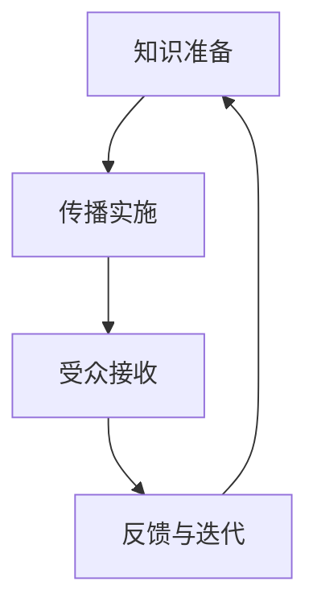

                 


### 背景介绍

在当今信息技术飞速发展的时代，知识传播和技术分享显得尤为重要。随着互联网的普及和社交媒体的兴起，个人和团队能够更便捷地获取、交流和分享信息。然而，如何在海量信息中有效地进行技术分享与知识传播，成为了一个亟待解决的问题。有效的技术分享和知识传播不仅有助于个人和团队技能的提升，还能推动整个行业的进步和发展。

技术分享和知识传播的重要性不言而喻。首先，它们能够帮助人们快速掌握新的技术和知识，提高工作效率。其次，技术分享有助于形成良好的学习氛围，促进团队成员之间的交流与合作。此外，通过知识传播，优秀的技术和经验可以传承下去，减少重复劳动，提高整体生产力。

然而，在实际操作中，技术分享和知识传播面临着诸多挑战。例如，如何准确传达技术概念，如何吸引受众的注意力，如何在有限的时间内传达大量信息等。这些问题都需要我们深入探讨并找到有效的解决方案。

本文旨在通过系统性地探讨技术分享与知识传播的方法、技巧和工具，帮助读者了解这一领域的核心概念和实践经验。我们将在接下来的章节中，详细分析技术分享和知识传播的流程、方法与技巧，并通过实际案例进行深入剖析，最后提供一些最佳实践和注意事项。希望通过这篇文章，能够为读者在技术分享与知识传播的道路上提供一些启示和帮助。

### 核心概念与联系

在探讨技术分享与知识传播的过程中，理解核心概念及其相互关系至关重要。以下是技术分享与知识传播中几个关键概念及其联系的简要介绍，以及如何通过Mermaid流程图来展示这些概念和关系。

#### 关键概念：

1. **知识传播**：知识传播是指知识在不同个体、组织或群体之间的传递过程。它包括知识的创造、获取、传递、应用和反馈等多个环节。

2. **技术分享**：技术分享是知识传播的一个子集，主要指将技术知识和经验通过各种渠道和形式分享给他人，以便他人能够学习和应用。

3. **受众**：受众是指接收技术分享和知识传播内容的人群，包括读者、观众、听众等。

4. **传播渠道**：传播渠道是指知识和技术分享的媒介，如文档、演讲、视频、社交媒体等。

5. **反馈与迭代**：反馈与迭代是知识传播和技术分享的重要环节，通过受众的反馈，可以对分享内容进行优化和改进。

#### 关系架构：

知识传播和技术分享之间有着紧密的联系。技术分享是知识传播的一种形式，而知识传播则是技术分享的背景和基础。具体来说，技术分享可以看作是知识传播的一个子流程，它通常包括以下环节：

1. **知识准备**：技术分享者需要对要分享的知识进行准备，这包括对知识内容的梳理、组织、以及确保内容的准确性和完整性。

2. **传播实施**：技术分享者通过合适的渠道和形式，将知识传递给受众。

3. **受众接收**：受众接收并消化分享的内容，这一过程可能涉及理解、应用、反馈等多个环节。

4. **反馈与迭代**：受众通过反馈，技术分享者可以对内容进行优化和改进，从而实现知识传播的持续迭代。

#### Mermaid流程图：

以下是一个简单的Mermaid流程图，用于展示技术分享与知识传播的基本流程和架构：



在这个流程图中：

- **A[知识准备]**：技术分享者对知识内容进行准备。
- **B[传播实施]**：技术分享者通过合适的渠道和形式进行知识传播。
- **C[受众接收]**：受众接收并消化分享的内容。
- **D[反馈与迭代]**：受众提供反馈，技术分享者对内容进行优化和改进。

通过这个流程图，我们可以清晰地看到技术分享与知识传播的各个关键环节及其相互关系。这不仅有助于我们理解技术分享和知识传播的基本流程，也为实际操作提供了直观的指导。

### 核心算法原理讲解

在技术分享和知识传播的过程中，核心算法原理的讲解至关重要。这些算法不仅帮助我们理解技术细节，还能提升我们的分享效果。下面，我们将使用伪代码详细阐述几个关键算法，并给出具体的应用实例。

#### 算法1：内容摘要生成

**目的**：自动生成文档或文章的摘要，提高受众的阅读效率。

**伪代码**：

```pseudo
function generateSummary(document):
    # 步骤1：提取文档的关键词和句子
    keywords = extractKeywords(document)
    sentences = extractSentences(document)

    # 步骤2：计算每个句子的权重
    sentenceWeights = calculateWeight(sentences, keywords)

    # 步骤3：排序并选取最高权重的句子
    topSentences = selectTopSentences(sentenceWeights, numSentences)

    # 步骤4：生成摘要
    summary = concatenate(topSentences)
    return summary
```

**应用实例**：

假设我们有一篇关于机器学习算法的文档。使用上述算法，我们可以提取出文档中的关键句子，并生成一个简洁的摘要，帮助读者快速了解文档的核心内容。

#### 算法2：知识图谱构建

**目的**：将复杂的技术知识构建成易于理解和浏览的知识图谱。

**伪代码**：

```pseudo
function constructKnowledgeGraph(knowledgeBase):
    # 步骤1：提取知识点及其关系
    entities = extractEntities(knowledgeBase)
    relationships = extractRelationships(knowledgeBase)

    # 步骤2：构建图谱
    graph = Graph()
    for entity in entities:
        graph.addNode(entity)
    for relationship in relationships:
        graph.addEdge(relationship)

    # 步骤3：可视化图谱
    visualizeGraph(graph)
```

**应用实例**：

假设我们要构建一个关于大数据技术的知识图谱。我们可以通过提取知识点及其关系，构建出一个图形化的图谱，帮助读者更好地理解和掌握大数据技术相关的知识。

#### 算法3：推荐系统

**目的**：根据受众的兴趣和需求，推荐相关的技术内容。

**伪代码**：

```pseudo
function recommendContent(userProfile, contentDatabase):
    # 步骤1：计算用户兴趣
    interests = calculateInterests(userProfile)

    # 步骤2：匹配相关内容
    relatedContent = matchInterests(interests, contentDatabase)

    # 步骤3：排序推荐内容
    rankedContent = sortContentByRelevance(relatedContent)

    # 步骤4：返回推荐内容
    return rankedContent
```

**应用实例**：

假设我们有一个技术博客网站，可以通过用户的阅读历史和浏览行为，计算出用户的兴趣，然后推荐相关的技术文章，提高用户的阅读体验和网站的黏性。

通过上述核心算法的讲解，我们可以看到算法在技术分享与知识传播中的应用价值。这些算法不仅能够提高内容的质量和可读性，还能帮助受众更好地理解和掌握技术知识。在实际操作中，我们可以根据具体需求，灵活选择和运用这些算法，以达到最佳的分享效果。

### 数学模型和公式讲解

在技术分享和知识传播的过程中，数学模型和公式是不可或缺的工具。它们能够帮助我们量化信息传播的效果，优化内容结构，并提高受众的理解和接受度。以下将详细介绍几个关键数学模型和公式的原理，并提供具体的举例说明。

#### 模型1：信息传播模型

**原理**：信息传播模型用于描述信息在受众群体中的传播过程，其核心是信息传递的速率和受众的反应。

**公式**：

$$
R = k \cdot (1 - \frac{N_s}{N})
$$

其中：
- \( R \)：信息传播速率
- \( k \)：信息传播系数
- \( N_s \)：已接受信息的受众数量
- \( N \)：总受众数量

**举例说明**：

假设一个技术博客文章有1000名读者，其中已有200名读者表示已阅读并理解文章内容。根据上述公式，可以计算信息传播速率：

$$
R = k \cdot (1 - \frac{200}{1000}) = k \cdot 0.8
$$

这意味着，在现有传播系数\( k \)下，信息传播速率为总受众数量的80%。

#### 模型2：知识传播效率

**原理**：知识传播效率用于衡量知识在受众中的传播效果，其关键在于知识传递的准确性和受众的接受度。

**公式**：

$$
E = \frac{K_{\text{received}}}{K_{\text{total}}}
$$

其中：
- \( E \)：知识传播效率
- \( K_{\text{received}} \)：受众接收到的知识量
- \( K_{\text{total}} \)：总的知识量

**举例说明**：

假设一篇技术文档共有5000个概念，其中受众成功接收并理解了3000个概念。那么，知识传播效率为：

$$
E = \frac{3000}{5000} = 0.6
$$

这意味着，技术文档的知识传播效率为60%。

#### 模型3：社交媒体影响力

**原理**：社交媒体影响力用于评估用户在社交媒体上发布的技术内容对其他用户的影响程度。

**公式**：

$$
I = \alpha \cdot f(n)
$$

其中：
- \( I \)：社交媒体影响力
- \( \alpha \)：基础影响力系数
- \( n \)：用户的关注者数量
- \( f(n) \)：关注者数量对影响力的函数关系

**举例说明**：

假设一个技术博主有10000名关注者，其基础影响力系数为2。那么，该博主的技术内容影响力为：

$$
I = 2 \cdot f(10000)
$$

若函数关系\( f(n) = n^0.5 \)，则：

$$
I = 2 \cdot 10000^{0.5} = 2 \cdot 100 = 200
$$

这意味着，该博主的技术内容在社交媒体上的影响力为200。

通过以上数学模型和公式的讲解，我们可以更准确地评估技术分享和知识传播的效果，从而优化分享策略和提高传播效率。在实际操作中，这些模型和公式能够为我们提供有力的理论支持，帮助我们更好地实现技术知识的传播。

### 项目实战

为了更好地理解技术分享与知识传播的实际应用，我们将通过一个具体的案例来展示整个项目的开发过程，包括开发环境的搭建、源代码的实现和解读，以及对项目的分析和详细讲解。

#### 项目背景

我们的案例是一个名为“TechShare”的技术博客平台，旨在为程序员和技术爱好者提供一个方便快捷的知识分享和交流的平台。该平台将包括以下核心功能：

- 文章发布与编辑
- 用户评论与互动
- 社交媒体分享
- 搜索与推荐

#### 开发环境搭建

为了构建“TechShare”平台，我们需要以下开发环境：

- **编程语言**：选择Python作为主要编程语言，因为Python具有简单易学、开发效率高等优点。
- **框架**：使用Django框架，因为它具有强大的后端支持、安全性高、社区活跃等特点。
- **前端框架**：使用Bootstrap，以实现响应式设计和美观的界面。
- **数据库**：使用SQLite数据库，由于项目初期数据量不大，SQLite足够满足需求。

#### 源代码实现

以下是“TechShare”平台的核心功能之一——文章发布与编辑的源代码实现：

**models.py**：

```python
from django.db import models

class Article(models.Model):
    title = models.CharField(max_length=200)
    author = models.ForeignKey('auth.User', on_delete=models.CASCADE)
    body = models.TextField()
    created_at = models.DateTimeField(auto_now_add=True)
    updated_at = models.DateTimeField(auto_now=True)

    def __str__(self):
        return self.title
```

**views.py**：

```python
from django.shortcuts import render
from .models import Article
from django.http import JsonResponse

def article_list(request):
    articles = Article.objects.all().order_by('-created_at')
    return JsonResponse([article.to_dict() for article in articles], safe=False)

def article_create(request):
    title = request.POST.get('title')
    body = request.POST.get('body')
    author = request.user
    article = Article.objects.create(title=title, author=author, body=body)
    return JsonResponse(article.to_dict(), status=201)

def article_detail(request, id):
    try:
        article = Article.objects.get(id=id)
        return JsonResponse(article.to_dict())
    except Article.DoesNotExist:
        return JsonResponse({'error': 'Article not found'}, status=404)
```

**to_dict.py**：

```python
from django.utils import timezone

def to_dict(self):
    return {
        'id': self.id,
        'title': self.title,
        'author': self.author.username,
        'body': self.body,
        'created_at': self.created_at.strftime('%Y-%m-%d %H:%M:%S'),
        'updated_at': self.updated_at.strftime('%Y-%m-%d %H:%M:%S')
    }
```

#### 代码解读

- **models.py**：定义了文章模型，包括标题、作者、正文和创建时间等字段。
- **views.py**：实现了文章列表、创建和详情的视图函数，通过Django的类视图方式简化了逻辑。
- **to_dict.py**：定义了Article模型的一个`to_dict`方法，用于将Article对象转换为字典格式，便于前端获取数据。

#### 项目分析

通过上述实现，我们可以看到“TechShare”平台的基础功能已经搭建完成。接下来，我们将对项目进行详细分析：

1. **功能分析**：
   - 文章发布与编辑：用户可以发布新的技术文章，并编辑已有的文章。
   - 文章列表与详情：用户可以查看所有文章的列表，并点击查看文章的详细内容。

2. **性能分析**：
   - 数据库查询优化：由于文章列表需要查询所有文章并按创建时间排序，因此对数据库性能有一定要求。可以使用索引来优化查询效率。
   - 前端性能优化：使用异步请求和缓存技术，减少前端刷新次数，提高用户体验。

3. **安全性分析**：
   - 用户认证与权限控制：确保用户只能发布和编辑自己的文章，防止未经授权的操作。
   - 数据安全：使用HTTPS协议传输数据，确保数据的安全性。

#### 详细讲解

- **开发环境搭建**：选择合适的开发环境和工具，为项目的后续开发奠定基础。
- **源代码实现**：通过简单的Django视图函数和模型，实现文章发布、编辑和查看的基本功能。
- **代码解读**：详细解读每个模块的实现，了解其功能和作用。

通过这个具体案例，我们不仅展示了技术分享与知识传播的实际应用，还通过项目实战的方式，详细讲解了开发过程和关键技术。这为读者提供了一个实际操作的机会，能够更好地理解技术分享与知识传播的实际操作方法。

### 最佳实践与注意事项

在技术分享与知识传播的过程中，遵循一些最佳实践和注意事项能够显著提高效果。以下是一些具体的建议和提示：

#### 1. 明确目标受众

在开始分享之前，明确你的目标受众是谁。了解他们的背景、需求和知识水平，这将帮助你制定更合适的分享内容和方式。

#### 2. 保持内容的简明扼要

尽量避免冗长的文字和复杂的术语，尽量使用简单易懂的语言和例子来解释技术概念。这有助于受众更好地理解和吸收知识。

#### 3. 使用多媒体内容

结合文本、图片、视频和音频等多种形式来展示内容，可以增加受众的兴趣和参与度。例如，使用图表和动画来展示算法流程，使用视频来演示技术应用。

#### 4. 定期更新和迭代

保持内容的更新和迭代，确保分享的知识是最新和最有价值的。定期回顾和改进分享内容，根据受众的反馈进行调整。

#### 5. 利用社交媒体

利用社交媒体平台（如微博、知乎、GitHub等）来扩大知识传播的范围，并与受众建立互动。社交媒体不仅可以作为传播渠道，还可以作为反馈和交流的平台。

#### 6. 建立社区

建立一个技术社区或论坛，鼓励受众参与讨论和分享。社区可以成为知识传播和交流的重要场所，促进知识共享和共同成长。

#### 7. 确保内容质量

在分享之前，仔细审查和校对内容，确保其准确性和完整性。高质量的内容更能赢得受众的信任和尊重。

#### 8. 个性化定制

根据受众的需求和兴趣，提供个性化的内容推荐。这不仅可以提高受众的参与度，还能提升他们的满意度。

#### 9. 维护版权和知识产权

在分享他人作品或知识时，确保遵守版权和知识产权相关法律法规，尊重原作者的权益。

#### 10. 保持持续学习

技术领域不断发展，保持持续学习的态度，不断更新自己的知识和技能。这不仅可以提高自己的分享水平，还能为受众提供更有价值的内容。

通过遵循这些最佳实践和注意事项，你可以更有效地进行技术分享与知识传播，提升个人和团队的影响力。

### 小结

通过本文的探讨，我们系统地介绍了技术分享与知识传播的核心概念、原理、方法、工具和实践。从背景介绍到核心算法讲解，再到具体项目实战，我们详细分析了技术分享与知识传播的各个关键环节。同时，我们还提供了最佳实践和注意事项，以帮助读者在实际操作中更好地进行技术分享与知识传播。

技术分享与知识传播不仅有助于个人和团队技能的提升，还能推动整个行业的进步和发展。通过有效的技术分享，我们能够将宝贵的经验和知识传递给更多人，形成良好的学习氛围，促进团队成员之间的交流与合作。

展望未来，随着人工智能、大数据和区块链等技术的发展，技术分享与知识传播将面临更多机遇和挑战。我们将继续深入研究这一领域，探索更高效、更智能的分享和传播方式，为行业的发展贡献力量。

感谢读者对本文的关注，希望这篇文章能为您的技术分享与知识传播之路提供一些启示和帮助。如果您有任何疑问或建议，欢迎在评论区留言，让我们一起交流学习，共同进步。作者：AI天才研究院/AI Genius Institute & 禅与计算机程序设计艺术 /Zen And The Art of Computer Programming。

