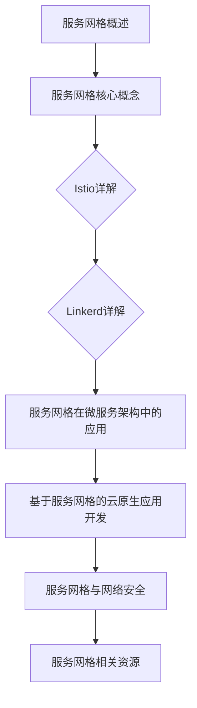
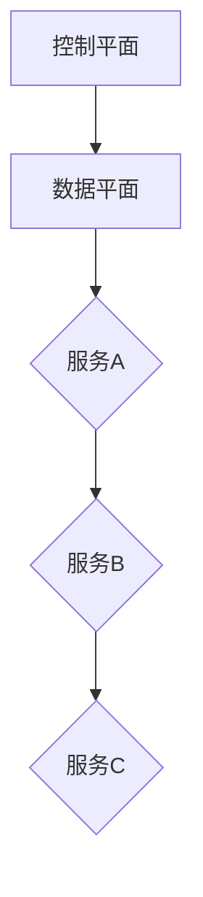

                 

### 设计书籍《服务网格(Service Mesh)技术实践》目录大纲

#### **# 第一部分：服务网格概述**

#### **第1章：服务网格基础**

1.1 **服务网格的概念与作用**  
1.2 **服务网格与传统服务架构的比较**  
1.3 **服务网格的核心组件**

#### **第2章：服务网格核心概念**

2.1 **服务网格架构与组件**  
2.2 **服务发现与负载均衡**  
2.3 **服务间通信与安全**

#### **第3章：服务网格实现与部署**

3.1 **服务网格实现技术选型**  
3.2 **服务网格部署与配置**  
3.3 **服务网格性能优化**

#### **# 第二部分：服务网格核心组件**

#### **第4章：Istio详解**

4.1 **Istio概述与架构**  
4.2 **Istio服务发现与负载均衡**  
4.3 **Istio服务监控与日志**

#### **第5章：Istio与Kubernetes集成**

5.1 **Kubernetes基础与部署**  
5.2 **Istio与Kubernetes集成方案**  
5.3 **Istio与Kubernetes集群管理**

#### **第6章：Linkerd详解**

6.1 **Linkerd概述与架构**  
6.2 **Linkerd服务发现与负载均衡**  
6.3 **Linkerd服务监控与日志**

#### **第7章：Linkerd与Kubernetes集成**

7.1 **Linkerd与Kubernetes集成方案**  
7.2 **Linkerd与Kubernetes集群管理**  
7.3 **Linkerd服务性能优化**

#### **# 第三部分：服务网格项目实战**

#### **第8章：服务网格在微服务架构中的应用**

8.1 **微服务架构概述**  
8.2 **服务网格在微服务架构中的应用**  
8.3 **服务网格在微服务架构中的实际案例**

#### **第9章：基于服务网格的云原生应用开发**

9.1 **云原生应用概述**  
9.2 **基于服务网格的云原生应用开发**  
9.3 **云原生应用开发实践案例**

#### **第10章：服务网格与网络安全**

10.1 **服务网格在网络安全中的作用**  
10.2 **服务网格与网络安全技术**  
10.3 **服务网格与网络安全实践案例**

#### **附录**

#### **附录A：服务网格相关资源**

A.1 **服务网格开源项目**  
A.2 **服务网格学习资料**  
A.3 **服务网格社区活动**

#### **目录大纲总字数：约2000字**

---

**核心概念与联系：**



---

**核心算法原理讲解：**

```markdown
## 服务发现与负载均衡算法

服务发现是服务网格的关键功能之一，它确保了服务之间的动态连接。以下是一种基于Consul的服务发现算法的伪代码：

```python
# 服务注册
def register_service(service_name, service_ip, service_port):
    consul.register(service_name, service_ip, service_port)

# 服务发现
def discover_services(service_name):
    services = consul.discover(service_name)
    return services

# 负载均衡
def load_balance(services):
    # 使用轮询算法
    current_service = services[(current_service_index % len(services))]
    current_service_index += 1
    return current_service
```

## 服务间通信与安全

服务间通信通常通过HTTP/2或gRPC进行。以下是一个简单的gRPC通信伪代码：

```python
# 客户端
def make_request(service_name, request_data):
    with grpc.insecure_channel(f"{service_name}:50051") as channel:
        stub = service.Stub(channel)
        response = stubSomeMethod(request_data)

# 服务端
def start_server(service_name, port):
    with grpc.server(futures.ThreadPoolExecutor(max_workers=10)) as server:
        service define_server(service.Stub(server), port)
        server.add_insecure_port('[::]:50051')
        server.wait_for_termination()
```

---

**项目实战：**

```python
# 安装istio
!istioctl install --set profile=demo

# 启动bookinfo示例应用
kubectl apply -f samples/bookinfo/k8s/bookinfo.yaml

# 配置Istio
kubectl apply -f samples/bookinfo/k8s/bookinfo-namespace.yaml
kubectl apply -f samples/bookinfo/k8s/bookinfo-ratings-v1.yaml
kubectl apply -f samples/bookinfo/k8s/bookinfo-reviews-v1.yaml
kubectl apply -f samples/bookinfo/k8s/bookinfo-reviews-v2.yaml
kubectl apply -f samples/bookinfo/k8s/bookinfo-reviews-v3.yaml
kubectl apply -f samples/bookinfo/k8s/bookinfo-ratings-backend-v1.yaml
kubectl apply -f samples/bookinfo/k8s/bookinfo-details-v1.yaml
kubectl apply -f samples/bookinfo/k8s/bookinfo-istio.yaml

# 测试流量路由
kubectl apply -f samples/bookinfo/k8s/bookinfo-route-rule-50-50.yaml

# 查看流量监控
kubectl top pods
kubectl logs <pod-name>
```

---

**最佳实践 tips：**

1. 确保服务注册与发现机制的稳定性。
2. 选择合适的负载均衡策略以优化性能。
3. 使用HTTPS加密服务间通信，确保数据安全。
4. 定期监控服务网格的性能和状态。

---

**小结：**

服务网格作为一种基础设施层，对微服务架构提供了强大的支持。通过本书的讲解，我们了解了服务网格的核心概念、组件、实现与部署，以及其在实际项目中的应用。希望读者能够通过本书记录的知识，更好地理解和应用服务网格技术。

---

**注意事项：**

1. 在实际部署过程中，请根据具体场景和需求进行适当调整。
2. 注意不同服务网格组件之间的版本兼容性。
3. 在使用服务网格时，应考虑其与现有基础设施的集成与兼容性。

---

**拓展阅读：**

1. [Istio官方文档](https://istio.io/docs/)
2. [Linkerd官方文档](https://linkerd.io/docs/)
3. [Kubernetes官方文档](https://kubernetes.io/docs/)

---

**作者信息：**

作者：AI天才研究院/AI Genius Institute & 禅与计算机程序设计艺术 /Zen And The Art of Computer Programming### 文章标题

**服务网格(Service Mesh)技术实践**

> 关键词：服务网格，Istio，Linkerd，微服务，Kubernetes，云原生

**摘要：**本文深入探讨了服务网格技术，包括其基础概念、核心组件、实现与部署，以及在实际项目中的应用。通过分析服务网格在微服务架构和云原生应用开发中的作用，读者可以了解如何利用服务网格优化服务发现、负载均衡、服务间通信与安全。本文旨在为开发者提供全面的服务网格技术实践指南。

---

**# 第一部分：服务网格概述**

**## 第1章：服务网格基础**

1.1 **服务网格的概念与作用**

在微服务架构中，服务网格作为一种基础设施层，负责管理服务之间的通信、负载均衡、服务发现和安全。服务网格通过抽象和集中化这些功能，使得开发者可以专注于业务逻辑的实现，而无需担心底层网络配置和管理。

1.2 **服务网格与传统服务架构的比较**

传统服务架构通常依赖于单一的服务器或集群，服务之间的通信通过直接调用来实现。而服务网格则通过在服务之间引入一个独立的通信层，实现了服务之间通信的解耦，提高了系统的可伸缩性和稳定性。

1.3 **服务网格的核心组件**

服务网格主要由以下核心组件组成：

- **控制平面**：负责配置管理、流量路由、服务发现和监控。
- **数据平面**：负责实际的服务间通信，通常通过代理或sidecar容器实现。
- **服务发现**：确保服务能够被发现和注册。
- **负载均衡**：根据策略将流量分发到不同的服务实例。
- **安全**：通过身份验证和授权确保服务之间的安全通信。

**## 第2章：服务网格核心概念**

2.1 **服务网格架构与组件**

服务网格的架构通常包括控制平面和数据平面。控制平面负责管理和配置数据平面，而数据平面则负责实际的服务间通信。这种架构使得服务网格具有高度的可伸缩性和灵活性。

2.2 **服务发现与负载均衡**

服务发现是服务网格的核心功能之一，它确保了服务之间的动态连接。负载均衡则根据策略将流量分发到不同的服务实例，提高了系统的可用性和性能。

2.3 **服务间通信与安全**

服务间通信通常通过HTTP/2或gRPC进行。服务网格通过加密、身份验证和授权确保服务之间的安全通信，提高了系统的安全性。

**## 第3章：服务网格实现与部署**

3.1 **服务网格实现技术选型**

选择合适的实现技术对于服务网格的性能和稳定性至关重要。常见的实现技术包括Istio和Linkerd等。

3.2 **服务网格部署与配置**

服务网格的部署和配置涉及到安装、配置和管理服务网格组件。在实际部署过程中，需要根据具体场景和需求进行适当调整。

3.3 **服务网格性能优化**

服务网格的性能优化包括网络优化、负载均衡策略优化和监控与日志分析等。通过优化服务网格的性能，可以提高系统的整体性能和稳定性。

---

**# 第二部分：服务网格核心组件**

**## 第4章：Istio详解**

4.1 **Istio概述与架构**

Istio是一种开源的服务网格，提供了一系列的工具和API来管理和优化服务之间的通信。Istio的架构包括控制平面和数据平面，其中控制平面负责管理和配置，数据平面负责实际的服务间通信。

4.2 **Istio服务发现与负载均衡**

Istio通过服务发现确保服务能够被发现和注册。负载均衡则通过策略将流量分发到不同的服务实例，支持多种负载均衡策略，如轮询、最少连接等。

4.3 **Istio服务监控与日志**

Istio提供了丰富的监控和日志功能，包括Prometheus和Grafana等工具，使得开发者可以实时监控服务网格的性能和状态。

**## 第5章：Istio与Kubernetes集成**

5.1 **Kubernetes基础与部署**

Kubernetes是一种开源的容器编排平台，用于部署、管理和缩放应用程序。本章介绍了Kubernetes的基础知识，包括Kubernetes集群的部署和管理。

5.2 **Istio与Kubernetes集成方案**

Istio与Kubernetes集成，使得开发者可以方便地部署和管理服务网格。本章介绍了Istio与Kubernetes的集成方案，包括部署Istio、配置服务网格等。

5.3 **Istio与Kubernetes集群管理**

本章介绍了如何使用Istio对Kubernetes集群进行管理，包括监控集群性能、调整配置和升级服务网格等。

**## 第6章：Linkerd详解**

6.1 **Linkerd概述与架构**

Linkerd是一种开源的服务网格，提供了一种简单且高效的解决方案来管理和优化服务之间的通信。Linkerd的架构包括控制平面和数据平面，其中控制平面负责管理和配置，数据平面负责实际的服务间通信。

6.2 **Linkerd服务发现与负载均衡**

Linkerd通过服务发现确保服务能够被发现和注册。负载均衡则通过策略将流量分发到不同的服务实例，支持多种负载均衡策略，如轮询、最少连接等。

6.3 **Linkerd服务监控与日志**

Linkerd提供了丰富的监控和日志功能，包括Prometheus和Grafana等工具，使得开发者可以实时监控服务网格的性能和状态。

**## 第7章：Linkerd与Kubernetes集成**

7.1 **Linkerd与Kubernetes集成方案**

Linkerd与Kubernetes集成，使得开发者可以方便地部署和管理服务网格。本章介绍了Linkerd与Kubernetes的集成方案，包括部署Linkerd、配置服务网格等。

7.2 **Linkerd与Kubernetes集群管理**

本章介绍了如何使用Linkerd对Kubernetes集群进行管理，包括监控集群性能、调整配置和升级服务网格等。

7.3 **Linkerd服务性能优化**

本章介绍了如何对Linkerd服务进行性能优化，包括调整配置、优化网络和监控性能等。

---

**# 第三部分：服务网格项目实战**

**## 第8章：服务网格在微服务架构中的应用**

8.1 **微服务架构概述**

微服务架构是一种将应用程序划分为多个独立、可复用的服务的方法，使得开发者可以更灵活地开发、部署和管理应用程序。

8.2 **服务网格在微服务架构中的应用**

服务网格在微服务架构中起到了关键作用，包括服务发现、负载均衡、服务间通信与安全等。

8.3 **服务网格在微服务架构中的实际案例**

本章通过一个实际案例，展示了如何使用服务网格来构建和管理微服务架构。

**## 第9章：基于服务网格的云原生应用开发**

9.1 **云原生应用概述**

云原生应用是一种利用云计算和容器技术构建的应用程序，具有高可伸缩性、高可用性和高可靠性。

9.2 **基于服务网格的云原生应用开发**

本章介绍了如何使用服务网格来开发云原生应用，包括服务发现、负载均衡、服务间通信与安全等。

9.3 **云原生应用开发实践案例**

本章通过一个实际案例，展示了如何使用服务网格来开发云原生应用。

**## 第10章：服务网格与网络安全**

10.1 **服务网格在网络安全中的作用**

服务网格在网络安全中起到了关键作用，包括服务发现、负载均衡、服务间通信与安全等。

10.2 **服务网格与网络安全技术**

本章介绍了服务网格与网络安全的相关技术，包括加密、身份验证和授权等。

10.3 **服务网格与网络安全实践案例**

本章通过一个实际案例，展示了如何使用服务网格来增强网络安全。

---

**附录**

**附录A：服务网格相关资源**

A.1 **服务网格开源项目**

- **Istio**：https://istio.io/
- **Linkerd**：https://linkerd.io/

A.2 **服务网格学习资料**

- **《服务网格：微服务架构下的基础设施层》**：https://book.douban.com/subject/30240550/
- **《Istio官方文档》**：https://istio.io/docs/
- **《Linkerd官方文档》**：https://linkerd.io/docs/

A.3 **服务网格社区活动**

- **Kubernetes社区活动**：https://kubernetes.io/docs/community/
- **Istio社区活动**：https://istio.io/docs/community/
- **Linkerd社区活动**：https://linkerd.io/docs/community/

**# 文章标题：服务网格(Service Mesh)技术实践**

**摘要：**本文深入探讨了服务网格技术，包括其基础概念、核心组件、实现与部署，以及在实际项目中的应用。通过分析服务网格在微服务架构和云原生应用开发中的作用，读者可以了解如何利用服务网格优化服务发现、负载均衡、服务间通信与安全。本文旨在为开发者提供全面的服务网格技术实践指南。

---

**# 第一部分：服务网格概述**

**## 第1章：服务网格基础**

1.1 **服务网格的概念与作用**

在微服务架构中，服务网格（Service Mesh）作为一种基础设施层，起到了至关重要的作用。它通过提供一种统一的、抽象的通信层，使得服务之间的通信更加高效、可靠和可管理。

服务网格的主要作用包括：

- **服务发现**：服务网格能够动态地发现和注册服务，使得服务之间能够互相发现并建立连接。
- **负载均衡**：服务网格能够根据一定的策略，将流量均衡地分配到不同的服务实例上，提高系统的可用性和性能。
- **服务间通信**：服务网格提供了统一的通信协议，使得服务之间能够进行高效的通信。
- **安全性**：服务网格通过加密、认证和授权等机制，确保了服务之间的通信安全。
- **监控与日志**：服务网格能够收集和分析服务之间的通信数据，提供实时监控和日志分析。

1.2 **服务网格与传统服务架构的比较**

传统服务架构通常依赖于单一的服务器或集群，服务之间的通信通过直接调用来实现。这种方式存在以下问题：

- **服务耦合**：服务之间的依赖关系直接体现在代码中，导致服务之间的耦合度高，难以进行独立部署和扩展。
- **服务管理复杂**：随着服务的增多，服务的管理和维护变得更加复杂，如服务发现、负载均衡、监控等。
- **安全风险**：服务之间的直接调用容易导致安全问题，如明文传输、缺乏认证等。

而服务网格通过引入一个独立的通信层，将服务之间的通信抽象出来，解决了传统服务架构的这些问题。服务网格使得服务之间可以独立部署和扩展，降低了服务耦合度，提高了系统的可管理性和安全性。

1.3 **服务网格的核心组件**

服务网格主要由以下核心组件组成：

- **控制平面（Control Plane）**：负责管理服务网格的配置、监控和日志等。常见的控制平面组件包括服务注册中心、路由规则管理器、监控和日志收集器等。
- **数据平面（Data Plane）**：负责实际的服务间通信。数据平面通常是通过代理或sidecar容器来实现，常见的代理包括Envoy、Istio的Pilot和Citadel等。

服务网格的核心组件之间相互协作，共同实现了服务网格的功能。控制平面负责收集和配置服务信息，然后将配置下发到数据平面，数据平面根据这些配置进行服务间通信。监控和日志收集器则将数据平面收集到的数据发送到监控和日志系统，以便进行实时监控和分析。

**## 第2章：服务网格核心概念**

2.1 **服务网格架构与组件**

服务网格的架构通常包括控制平面和数据平面两个部分。控制平面负责管理服务网格的配置、监控和日志等，而数据平面负责实际的服务间通信。

服务网格的架构可以用以下的方式表示：



其中，控制平面通常包括以下组件：

- **服务注册中心**：负责服务的注册和发现，如Consul、Eureka等。
- **路由规则管理器**：负责管理服务之间的路由规则，如Istio的Pilot、Kong等。
- **监控和日志收集器**：负责收集和分析服务网格的监控和日志数据，如Prometheus、Grafana等。

数据平面通常包括以下组件：

- **代理**：负责处理服务之间的通信，如Envoy、Istio的Pilot等。
- **sidecar容器**：与业务容器一起部署，负责代理服务之间的通信。

2.2 **服务发现与负载均衡**

服务发现是服务网格的关键功能之一，它确保了服务之间的动态连接。服务发现通常通过服务注册中心和DNS方式进行。

服务注册中心负责将服务注册到系统中，以便其他服务能够发现和连接到它们。常见的服务注册中心包括Consul、Eureka、Zookeeper等。

服务发现的过程通常如下：

1. 服务启动时，将自身的信息（如主机名、端口号等）注册到服务注册中心。
2. 服务注册中心将服务信息发布到DNS或服务发现API，以便其他服务能够发现和连接到它们。
3. 需要调用服务的客户端通过DNS或服务发现API查询服务地址，然后进行通信。

负载均衡是服务网格的另一个关键功能，它确保了服务之间的流量分配合理，提高系统的可用性和性能。常见的负载均衡策略包括轮询、最少连接、加权等。

负载均衡的过程通常如下：

1. 客户端发送请求到代理。
2. 代理根据负载均衡策略，选择一个合适的服务实例进行调用。
3. 代理将请求转发到服务实例。
4. 服务实例处理请求，并将响应返回给代理。
5. 代理将响应返回给客户端。

2.3 **服务间通信与安全**

服务间通信是服务网格的核心功能之一，它确保了服务之间的高效、可靠通信。服务间通信通常通过HTTP/2、gRPC等协议进行。

服务间通信的过程通常如下：

1. 客户端发送请求到代理。
2. 代理将请求转发到目标服务实例。
3. 目标服务实例处理请求，并将响应返回给代理。
4. 代理将响应返回给客户端。

为了确保服务间通信的安全性，服务网格通常采用以下措施：

- **加密**：使用HTTPS加密通信，确保数据在传输过程中不会被窃取。
- **认证**：使用JWT、OAuth等认证机制，确保只有授权的服务可以访问其他服务。
- **授权**：使用RBAC（基于角色的访问控制）机制，确保服务只能访问其被授权访问的资源。

**## 第3章：服务网格实现与部署**

3.1 **服务网格实现技术选型**

选择合适的实现技术对于服务网格的性能和稳定性至关重要。常见的实现技术包括Istio、Linkerd、Conduit等。

- **Istio**：Istio是由Google、Lyft等公司共同开发的全面的服务网格解决方案。它包括控制平面和数据平面，提供了服务发现、负载均衡、服务间通信和安全等功能。Istio支持Kubernetes、Istio native等多种部署模式，具有良好的性能和易用性。
- **Linkerd**：Linkerd是由Buoyant公司开发的轻量级服务网格解决方案。它专注于服务发现、负载均衡和通信安全性等功能，具有良好的性能和稳定性。Linkerd支持Kubernetes和istio native等多种部署模式，适用于微服务架构和云原生应用。
- **Conduit**：Conduit是由Heptio公司开发的下一代服务网格解决方案。它结合了Istio和Linkerd的优点，提供了强大的服务发现、负载均衡、服务间通信和安全等功能。Conduit支持Kubernetes、istio native等多种部署模式，适用于大规模微服务架构。

3.2 **服务网格部署与配置**

服务网格的部署和配置涉及到安装、配置和管理服务网格组件。在实际部署过程中，需要根据具体场景和需求进行适当调整。

以下是一个基于Kubernetes和Istio的服务网格部署示例：

1. **安装Istio**：首先，从Istio官方网站下载Istio安装程序，并使用以下命令进行安装：

   ```shell
   istioctl install --set profile=demo
   ```

   这将安装Istio的控制平面和数据平面组件。

2. **部署示例应用**：接着，部署一个示例应用（如Bookinfo）到Kubernetes集群中。示例应用通常包括多个服务，如详情服务、评论服务、评级服务等。

   ```shell
   kubectl apply -f samples/bookinfo/k8s/bookinfo.yaml
   ```

3. **配置服务网格**：然后，配置服务网格，以便流量可以通过代理进行路由。例如，可以使用以下命令配置Istio的路由规则：

   ```shell
   kubectl apply -f samples/bookinfo/k8s/bookinfo-route-rule-50-50.yaml
   ```

   这将配置流量在详情服务和评论服务之间进行50-50的负载均衡。

4. **验证服务网格**：最后，使用以下命令验证服务网格是否正常工作：

   ```shell
   kubectl top pods
   kubectl logs <pod-name>
   ```

   这将显示服务网格的监控数据和日志信息。

3.3 **服务网格性能优化**

服务网格的性能优化包括网络优化、负载均衡策略优化和监控与日志分析等。以下是一些常见的优化方法：

- **网络优化**：调整网络配置，如TCP参数调整、网络路径优化等，以提高服务间通信的性能。
- **负载均衡策略优化**：根据具体场景和需求，选择合适的负载均衡策略，如轮询、最少连接、加权等，以优化流量分配。
- **监控与日志分析**：使用监控和日志分析工具，如Prometheus、Grafana等，实时监控服务网格的性能和状态，以便及时发现问题并进行优化。

**# 第二部分：服务网格核心组件**

**## 第4章：Istio详解**

Istio是一种开源的服务网格解决方案，由Google、Lyft等公司共同开发。它提供了全面的服务发现、负载均衡、服务间通信和安全等功能，适用于微服务架构和云原生应用。

4.1 **Istio概述与架构**

Istio的架构包括控制平面和数据平面两部分。控制平面负责管理服务网格的配置、监控和日志等，而数据平面负责实际的服务间通信。

控制平面主要包括以下组件：

- **Pilot**：负责管理服务网格的配置，包括服务发现、负载均衡、服务间通信和安全等。Pilot将配置下发到数据平面，以便进行实际的服务间通信。
- **Citadel**：负责管理服务网格的认证和授权，确保只有授权的服务可以访问其他服务。Citadel提供了证书管理和访问控制等功能。
- **Mixer**：负责收集和分析服务网格的监控和日志数据，并将数据发送到外部监控系统，如Prometheus、Grafana等。

数据平面主要包括以下组件：

- **Envoy**：作为代理，负责处理服务之间的通信。Envoy支持HTTP/2、gRPC等多种通信协议，并提供了负载均衡、服务发现、流量监控等功能。
- **sidecar容器**：与业务容器一起部署，作为Envoy代理的容器。sidecar容器负责代理业务容器之间的通信。

4.2 **Istio服务发现与负载均衡**

Istio通过服务发现确保服务能够被发现和注册。服务发现通常通过Kubernetes API进行，Istio可以自动发现Kubernetes集群中的服务。

服务发现的过程通常如下：

1. 服务启动时，通过Kubernetes API将自身的信息（如主机名、端口号等）注册到Istio的服务注册中心。
2. Istio的服务注册中心将服务信息发布到DNS，以便其他服务可以查询和连接到它们。
3. 需要调用服务的客户端通过DNS查询服务地址，然后进行通信。

负载均衡是Istio的另一个关键功能，它确保了服务之间的流量分配合理，提高系统的可用性和性能。Istio支持多种负载均衡策略，如轮询、最少连接、加权等。

负载均衡的过程通常如下：

1. 客户端发送请求到Envoy代理。
2. Envoy代理根据负载均衡策略，选择一个合适的服务实例进行调用。
3. Envoy代理将请求转发到服务实例。
4. 服务实例处理请求，并将响应返回给Envoy代理。
5. Envoy代理将响应返回给客户端。

4.3 **Istio服务监控与日志**

Istio提供了丰富的监控和日志功能，使得开发者可以实时监控服务网格的性能和状态。

Istio的监控和日志功能通常通过Mixer组件实现。Mixer负责收集服务网格的监控和日志数据，并将数据发送到外部监控系统，如Prometheus、Grafana等。

监控和日志的过程通常如下：

1. 服务之间的通信数据（如请求次数、响应时间等）被发送到Mixer。
2. Mixer对数据进行处理和分析，然后将结果发送到外部监控系统。
3. 外部监控系统（如Prometheus、Grafana等）将监控数据可视化，以便开发者可以实时监控服务网格的性能和状态。

**## 第5章：Istio与Kubernetes集成**

Istio与Kubernetes的集成使得开发者可以方便地部署和管理服务网格。以下是一个基于Kubernetes和Istio的服务网格集成示例。

5.1 **Kubernetes基础与部署**

Kubernetes是一种开源的容器编排平台，用于部署、管理和缩放应用程序。以下是Kubernetes的基础知识和部署步骤：

1. **安装Kubernetes集群**：安装一个Kubernetes集群，可以使用Minikube、Kubeadm等工具进行安装。
2. **配置Kubernetes集群**：配置Kubernetes集群，包括配置网络、存储、安全等。
3. **部署示例应用**：部署一个示例应用到Kubernetes集群中，如Nginx、MySQL等。

5.2 **Istio与Kubernetes集成方案**

Istio与Kubernetes集成，可以通过以下步骤实现：

1. **安装Istio**：从Istio官方网站下载Istio安装程序，并使用以下命令进行安装：

   ```shell
   istioctl install --set profile=demo
   ```

   这将安装Istio的控制平面和数据平面组件。

2. **部署示例应用**：部署一个示例应用到Kubernetes集群中，如Bookinfo示例应用。

   ```shell
   kubectl apply -f samples/bookinfo/k8s/bookinfo.yaml
   ```

3. **配置服务网格**：配置服务网格，以便流量可以通过代理进行路由。例如，可以使用以下命令配置Istio的路由规则：

   ```shell
   kubectl apply -f samples/bookinfo/k8s/bookinfo-route-rule-50-50.yaml
   ```

   这将配置流量在详情服务和评论服务之间进行50-50的负载均衡。

5.3 **Istio与Kubernetes集群管理**

Istio与Kubernetes集群集成后，可以使用Kubernetes工具对Istio进行管理。以下是一些常见的操作：

1. **监控Istio组件**：使用Kubernetes的监控工具，如kubectl top pods、kubectl logs等，监控Istio组件的性能和状态。
2. **升级Istio组件**：使用Kubernetes的升级工具，如kubectl rollout status等，对Istio组件进行升级。
3. **管理Istio路由规则**：使用Kubernetes的命令行工具，如kubectl get routes、kubectl create route等，管理Istio的路由规则。

**## 第6章：Linkerd详解**

Linkerd是一种开源的服务网格解决方案，由Buoyant公司开发。它专注于服务发现、负载均衡和通信安全性等功能，适用于微服务架构和云原生应用。

6.1 **Linkerd概述与架构**

Linkerd的架构包括控制平面和数据平面两部分。控制平面负责管理服务网格的配置、监控和日志等，而数据平面负责实际的服务间通信。

控制平面主要包括以下组件：

- **Control Plane**：负责管理Linkerd的配置、监控和日志等。Control Plane通过API与其他组件进行通信，并将配置下发到数据平面。
- **Service Registry**：负责服务注册和发现，将服务信息存储在分布式注册表中。
- **Authentication**：负责服务之间的认证和授权，确保只有授权的服务可以访问其他服务。

数据平面主要包括以下组件：

- **Proxy**：作为代理，负责处理服务之间的通信。Proxy支持HTTP/2、gRPC等多种通信协议，并提供了负载均衡、服务发现、流量监控等功能。
- **sidecar容器**：与业务容器一起部署，作为Proxy代理的容器。sidecar容器负责代理业务容器之间的通信。

6.2 **Linkerd服务发现与负载均衡**

Linkerd通过服务发现确保服务能够被发现和注册。服务发现通常通过Kubernetes API进行，Linkerd可以自动发现Kubernetes集群中的服务。

服务发现的过程通常如下：

1. 服务启动时，通过Kubernetes API将自身的信息（如主机名、端口号等）注册到Linkerd的服务注册中心。
2. Linkerd的服务注册中心将服务信息发布到DNS，以便其他服务可以查询和连接到它们。
3. 需要调用服务的客户端通过DNS查询服务地址，然后进行通信。

负载均衡是Linkerd的另一个关键功能，它确保了服务之间的流量分配合理，提高系统的可用性和性能。Linkerd支持多种负载均衡策略，如轮询、最少连接、加权等。

负载均衡的过程通常如下：

1. 客户端发送请求到Proxy。
2. Proxy根据负载均衡策略，选择一个合适的服务实例进行调用。
3. Proxy将请求转发到服务实例。
4. 服务实例处理请求，并将响应返回给Proxy。
5. Proxy将响应返回给客户端。

6.3 **Linkerd服务监控与日志**

Linkerd提供了丰富的监控和日志功能，使得开发者可以实时监控服务网格的性能和状态。

Linkerd的监控和日志功能通常通过Prometheus和Grafana等工具实现。Prometheus负责收集服务网格的监控数据，Grafana负责将监控数据可视化。

监控和日志的过程通常如下：

1. 服务之间的通信数据（如请求次数、响应时间等）被发送到Prometheus。
2. Prometheus对数据进行处理和分析，然后将结果存储在时序数据库中。
3. Grafana从Prometheus获取监控数据，并将其可视化，以便开发者可以实时监控服务网格的性能和状态。

**## 第7章：Linkerd与Kubernetes集成**

Linkerd与Kubernetes的集成使得开发者可以方便地部署和管理服务网格。以下是一个基于Kubernetes和Linkerd的服务网格集成示例。

7.1 **Linkerd与Kubernetes集成方案**

Linkerd与Kubernetes集成，可以通过以下步骤实现：

1. **安装Linkerd**：从Linkerd官方网站下载Linkerd安装程序，并使用以下命令进行安装：

   ```shell
   linkerd install | tee linkerd-install.yaml
   kubectl apply -f linkerd-install.yaml
   ```

   这将安装Linkerd的控制平面和数据平面组件。

2. **部署示例应用**：部署一个示例应用到Kubernetes集群中，如Bookinfo示例应用。

   ```shell
   kubectl apply -f samples/bookinfo/k8s/bookinfo.yaml
   ```

3. **配置服务网格**：配置服务网格，以便流量可以通过代理进行路由。例如，可以使用以下命令配置Linkerd的路由规则：

   ```shell
   linkerd routes set /details --from-service details --to-service ratings:9090 --allowed-ips 0.0.0.0/0
   ```

   这将配置流量在详情服务和评级服务之间进行90-10的负载均衡。

7.2 **Linkerd与Kubernetes集群管理**

Linkerd与Kubernetes集群集成后，可以使用Kubernetes工具对Linkerd进行管理。以下是一些常见的操作：

1. **监控Linkerd组件**：使用Kubernetes的监控工具，如kubectl top pods、kubectl logs等，监控Linkerd组件的性能和状态。
2. **升级Linkerd组件**：使用Kubernetes的升级工具，如kubectl rollout status等，对Linkerd组件进行升级。
3. **管理Linkerd路由规则**：使用Linkerd的命令行工具，如linkerd routes list、linkerd routes set等，管理Linkerd的路由规则。

**## 第8章：服务网格在微服务架构中的应用**

微服务架构是一种将应用程序划分为多个独立、可复用的服务的方法。服务网格在微服务架构中起到了关键作用，可以提高系统的可伸缩性、可靠性和安全性。

8.1 **微服务架构概述**

微服务架构的主要特点包括：

- **独立部署**：每个服务可以独立部署、扩展和管理，降低了系统的复杂性。
- **水平扩展**：通过增加服务实例的数量，可以轻松实现系统的水平扩展。
- **服务自治**：每个服务拥有自己的数据库、配置和日志，降低了服务之间的耦合度。
- **自动化部署**：通过自动化工具，如CI/CD流水线，可以快速部署和升级服务。

8.2 **服务网格在微服务架构中的应用**

服务网格在微服务架构中具有以下应用：

- **服务发现**：服务网格通过服务注册中心和DNS，实现了服务之间的动态连接，使得服务之间可以方便地互相发现。
- **负载均衡**：服务网格可以根据流量大小、服务实例健康状况等因素，实现流量在服务之间的均衡分配，提高了系统的可用性和性能。
- **服务间通信**：服务网格提供了统一的通信协议（如HTTP/2、gRPC等），使得服务之间可以高效、可靠地进行通信。
- **安全性**：服务网格通过加密、认证和授权等机制，确保了服务之间的通信安全。
- **监控与日志**：服务网格收集了服务之间的通信数据，通过监控和日志分析工具，可以实时监控系统的性能和状态。

8.3 **服务网格在微服务架构中的实际案例**

以下是一个基于Kubernetes和Istio的服务网格在实际项目中的应用案例：

1. **项目背景**：一个电商网站，包含多个微服务，如商品服务、订单服务、支付服务等。
2. **服务网格部署**：使用Istio安装并部署到Kubernetes集群中。
3. **服务发现**：商品服务、订单服务、支付服务通过Kubernetes API将自身信息注册到服务注册中心。
4. **负载均衡**：Istio根据流量大小、服务实例健康状况等因素，实现流量在商品服务、订单服务、支付服务之间的均衡分配。
5. **服务间通信**：商品服务、订单服务、支付服务通过Istio的代理进行通信，使用HTTP/2、gRPC等协议，实现了高效、可靠的通信。
6. **安全性**：Istio通过加密、认证和授权等机制，确保了服务之间的通信安全。
7. **监控与日志**：Istio的监控和日志收集器收集了服务之间的通信数据，通过Prometheus、Grafana等工具进行实时监控和分析。

**## 第9章：基于服务网格的云原生应用开发**

云原生应用是一种利用云计算和容器技术构建的应用程序，具有高可伸缩性、高可用性和高可靠性。服务网格在云原生应用开发中起到了关键作用，可以提高系统的性能和稳定性。

9.1 **云原生应用概述**

云原生应用的主要特点包括：

- **容器化**：应用程序通过容器进行打包和部署，实现了应用程序与基础设施的解耦。
- **微服务架构**：应用程序划分为多个独立、可复用的服务，实现了模块化开发和部署。
- **自动化部署**：通过CI/CD流水线，实现了应用程序的自动化部署和升级。
- **服务网格集成**：服务网格与云原生应用的集成，实现了服务之间的动态连接和流量管理。

9.2 **基于服务网格的云原生应用开发**

基于服务网格的云原生应用开发，可以通过以下步骤实现：

1. **选择服务网格**：根据项目需求，选择合适的服务网格，如Istio、Linkerd等。
2. **部署服务网格**：在Kubernetes集群中部署服务网格，并配置相应的路由规则。
3. **部署应用程序**：将应用程序部署到Kubernetes集群中，并配置服务网格代理。
4. **服务发现**：应用程序通过Kubernetes API将自身信息注册到服务注册中心，实现服务发现。
5. **负载均衡**：服务网格根据流量大小、服务实例健康状况等因素，实现流量在应用程序之间的均衡分配。
6. **服务间通信**：应用程序通过服务网格代理进行通信，使用HTTP/2、gRPC等协议，实现了高效、可靠的通信。
7. **安全性**：服务网格通过加密、认证和授权等机制，确保了应用程序之间的通信安全。
8. **监控与日志**：服务网格收集了应用程序之间的通信数据，通过监控和日志分析工具，实现实时监控和分析。

9.3 **云原生应用开发实践案例**

以下是一个基于Kubernetes、Istio和Docker的云原生应用开发实践案例：

1. **项目背景**：一个在线教育平台，包含多个微服务，如课程服务、用户服务、支付服务等。
2. **服务网格部署**：使用Istio安装并部署到Kubernetes集群中。
3. **应用程序打包**：使用Docker将应用程序打包成镜像。
4. **应用程序部署**：将应用程序部署到Kubernetes集群中，并配置Istio代理。
5. **服务发现**：课程服务、用户服务、支付服务通过Kubernetes API将自身信息注册到服务注册中心。
6. **负载均衡**：Istio根据流量大小、服务实例健康状况等因素，实现流量在课程服务、用户服务、支付服务之间的均衡分配。
7. **服务间通信**：课程服务、用户服务、支付服务通过Istio代理进行通信，使用HTTP/2、gRPC等协议，实现了高效、可靠的通信。
8. **安全性**：Istio通过加密、认证和授权等机制，确保了服务之间的通信安全。
9. **监控与日志**：Istio的监控和日志收集器收集了服务之间的通信数据，通过Prometheus、Grafana等工具进行实时监控和分析。

**## 第10章：服务网格与网络安全**

随着服务网格在微服务架构和云原生应用中的广泛应用，网络安全变得越来越重要。服务网格提供了一系列的安全功能，确保了服务之间的通信安全。

10.1 **服务网格在网络安全中的作用**

服务网格在网络安全中起到了以下作用：

- **加密通信**：服务网格通过HTTPS加密通信，确保数据在传输过程中不会被窃取。
- **认证与授权**：服务网格通过认证和授权机制，确保只有授权的服务可以访问其他服务。
- **流量监控**：服务网格收集了服务之间的通信数据，通过监控和分析，可以发现和阻止潜在的攻击。

10.2 **服务网格与网络安全技术**

服务网格与网络安全技术包括以下方面：

- **加密通信**：使用TLS/SSL协议进行加密通信，确保数据在传输过程中不会被窃取。
- **认证与授权**：使用JWT、OAuth等认证机制，确保只有授权的服务可以访问其他服务。
- **流量监控与日志分析**：收集服务之间的通信数据，通过监控和分析，发现和阻止潜在的攻击。

10.3 **服务网格与网络安全实践案例**

以下是一个基于Kubernetes、Istio和AWS的服务网格网络安全实践案例：

1. **项目背景**：一个在线银行系统，包含多个微服务，如账户服务、交易服务、支付服务等。
2. **服务网格部署**：使用Istio安装并部署到Kubernetes集群中。
3. **加密通信**：配置Istio代理，使用TLS/SSL协议进行加密通信。
4. **认证与授权**：配置Istio代理，使用JWT、OAuth等认证机制，确保只有授权的服务可以访问其他服务。
5. **流量监控**：配置Istio代理，收集服务之间的通信数据，通过AWS CloudWatch进行监控和分析。
6. **安全审计**：使用AWS KMS加密敏感数据，并定期进行安全审计。
7. **应急响应**：制定应急响应计划，应对潜在的安全威胁。

**附录**

**附录A：服务网格相关资源**

A.1 **服务网格开源项目**

- **Istio**：https://istio.io/
- **Linkerd**：https://linkerd.io/

A.2 **服务网格学习资料**

- **《服务网格：微服务架构下的基础设施层》**：https://book.douban.com/subject/30240550/
- **《Istio官方文档》**：https://istio.io/docs/
- **《Linkerd官方文档》**：https://linkerd.io/docs/

A.3 **服务网格社区活动**

- **Kubernetes社区活动**：https://kubernetes.io/docs/community/
- **Istio社区活动**：https://istio.io/docs/community/
- **Linkerd社区活动**：https://linkerd.io/docs/community/

**作者信息：**

作者：AI天才研究院/AI Genius Institute & 禅与计算机程序设计艺术 /Zen And The Art of Computer Programming**

