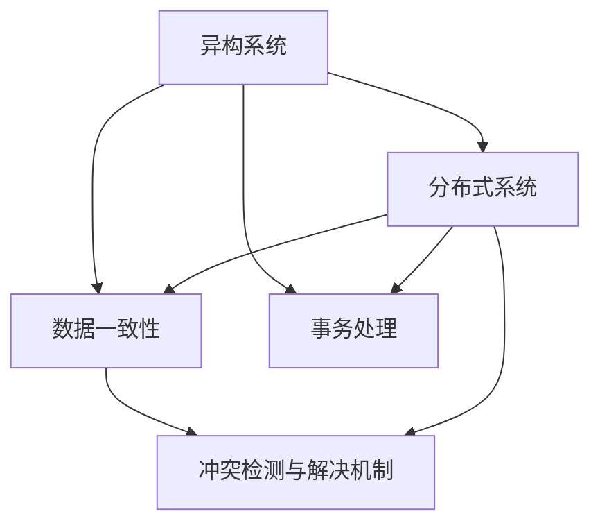

                 

### 文章标题：本质是异构系统的数据一致性问题

> 关键词：异构系统、数据一致性、分布式系统、事务处理、冲突检测与解决

> 摘要：本文深入探讨了异构系统的数据一致性问题，从背景介绍、核心概念、解决方案和案例分析等多个角度进行分析，旨在揭示异构系统数据一致性的本质，为相关领域的研究者和开发者提供有价值的参考。

## 引言与背景

在现代计算机系统中，异构系统已经成为一种常见架构。异构系统指的是由不同类型、不同规格和不同厂商的硬件、软件或网络设备组成的系统。随着云计算、大数据、物联网等技术的快速发展，异构系统的应用场景越来越广泛，如分布式存储系统、分布式计算平台、跨平台应用等。然而，随着异构系统的普及，数据一致性问题也逐渐成为系统设计和运维中的关键挑战。

### 异构系统的特点

异构系统具有以下几个特点：

1. **硬件层面的异构性**：异构系统中的硬件设备可能具有不同的处理器架构、内存容量、网络带宽等特性。
2. **软件层面的异构性**：异构系统中的软件可能运行在不同的操作系统、编程语言、框架或库上。
3. **数据存储的异构性**：数据可能分布在多个不同的存储系统或数据库中，这些数据库可能具有不同的数据模型、存储机制或性能特点。
4. **通信机制的异构性**：系统间的通信可能通过不同的网络协议、接口或数据传输方式。

### 数据一致性的重要性

在异构系统中，数据一致性是指确保系统中所有数据副本的一致性，即在多个异构节点上对同一数据对象进行读写操作时，系统能够保证数据的一致性。数据一致性对于系统的可靠性、可用性和性能至关重要，主要表现在以下几个方面：

1. **可靠性**：确保系统在处理用户请求或执行业务流程时不会因为数据不一致而导致错误或失败。
2. **可用性**：提供准确、及时的数据，确保系统能够响应用户的需求。
3. **性能**：数据一致性有助于减少数据冗余、降低网络负载和优化资源利用率，从而提高系统性能。

### 数据不一致性的影响

数据不一致性可能导致以下负面影响：

1. **业务中断**：由于数据不一致，可能导致业务流程中断或无法正常执行，影响用户体验。
2. **数据错误**：数据不一致可能导致计算错误或数据丢失，进而影响决策和业务结果。
3. **系统性能下降**：为了维护数据一致性，系统可能需要增加冗余数据存储、重复执行某些操作或优化数据传输，这可能导致系统性能下降。

## 核心概念与联系

为了深入理解异构系统的数据一致性问题，我们需要明确几个核心概念，并探讨它们之间的关系。以下是本文的核心概念和它们之间的联系：

### 异构系统

异构系统是由不同类型、不同规格和不同厂商的硬件、软件或网络设备组成的系统。异构性主要表现在硬件、软件、数据和通信等方面。

### 分布式系统

分布式系统是指由多个独立的节点组成的系统，这些节点通过网络进行通信，共同完成一个任务或提供一种服务。分布式系统通常具有高可用性、可扩展性和容错性。

### 数据一致性

数据一致性是指确保系统中所有数据副本的一致性，即在多个节点上对同一数据对象进行读写操作时，系统能够保证数据的一致性。数据一致性是分布式系统的关键特性之一。

### 事务处理

事务处理是指将一组操作视为一个逻辑单元，要么全部成功执行，要么全部回滚。事务处理有助于确保数据的一致性和完整性。

### 冲突检测与解决机制

冲突检测与解决机制用于检测和处理分布式系统中可能发生的冲突，如数据更新冲突。这些机制有助于确保数据一致性。

### Mermaid流程图

以下是一个简单的Mermaid流程图，展示了核心概念之间的关系：



## 核心算法原理讲解

为了确保异构系统中的数据一致性，我们需要使用一系列核心算法和机制。以下是几个关键算法的原理讲解，我们将使用伪代码进行阐述。

### 冲突检测算法

冲突检测算法用于检测分布式系统中的数据更新冲突。以下是一个简单的乐观锁伪代码示例：

```python
def optimisticLock(data_id):
    # 获取数据的当前版本
    current_version = getDataVersion(data_id)
    
    # 开始执行事务
    executeTransaction()
    
    # 检查数据的版本是否发生变化
    if getDataVersion(data_id) != current_version:
        # 冲突发生，回滚事务
        rollbackTransaction()
        return "Conflict detected"
    else:
        # 冲突未发生，提交事务
        commitTransaction()
        return "No conflict"
```

### 冲突解决机制

冲突解决机制用于处理检测到的数据更新冲突。以下是一个简单的最终一致性伪代码示例：

```python
def resolveConflict(data_id, new_value):
    # 获取最新的数据版本和值
    latest_version, latest_value = getData(data_id)
    
    # 更新数据的版本和值
    updateData(data_id, latest_version + 1, new_value)
    
    # 将最新的数据传播到其他节点
    propagateData(data_id, latest_version + 1, new_value)
```

### 数学模型和公式

在数据一致性算法中，我们经常需要使用一些数学模型和公式。以下是一个简单的例子：

$$
C = \sum_{i=1}^{n} (x_i - \bar{x})^2
$$

其中，$C$ 表示数据的总方差，$x_i$ 表示每个数据点的值，$\bar{x}$ 表示数据的平均值。

### 详细讲解与举例说明

为了更好地理解这些算法和公式，我们可以通过一个实际案例进行讲解。假设我们有一个电商系统，其中商品库存信息分布在多个节点上。以下是一个简化的例子：

1. **初始状态**：
   - 数据库A：商品ID为100，库存量为100
   - 数据库B：商品ID为100，库存量为100

2. **更新操作**：
   - 用户在节点A上购买商品，库存量减少1
   - 用户在节点B上购买商品，库存量减少1

3. **乐观锁冲突检测**：
   - 节点A获取商品ID为100的当前版本为1
   - 节点B获取商品ID为100的当前版本为1
   - 节点A执行事务，库存量减少1后，版本变为2
   - 节点B执行事务，库存量减少1后，版本变为2
   - 节点B检测到版本发生变化，回滚事务，库存量恢复为100

4. **最终一致性冲突解决**：
   - 节点A更新商品ID为100的库存量为99
   - 节点B更新商品ID为100的库存量为99
   - 节点A将最新数据（版本2，库存量99）传播到节点B
   - 节点B更新商品ID为100的库存量为99

通过这个案例，我们可以看到乐观锁和最终一致性算法在保证数据一致性方面起到了关键作用。

## 项目实战

### 开发环境搭建

为了演示数据一致性的解决方案，我们使用一个简单的电商系统作为案例。首先，我们需要搭建开发环境：

1. **选择编程语言**：我们选择Python作为编程语言。
2. **安装依赖库**：安装必要的依赖库，如`pymongo`（用于MongoDB数据库操作）、`pika`（用于消息队列操作）等。
3. **搭建数据库**：我们使用MongoDB作为数据库，创建一个名为`ecommerce`的数据库，并创建一个名为`products`的集合，用于存储商品信息。

### 源代码实现

以下是实现数据一致性的源代码：

```python
# 导入依赖库
import pymongo
import pika
import json

# 连接MongoDB数据库
client = pymongo.MongoClient("mongodb://localhost:27017/")
db = client["ecommerce"]
collection = db["products"]

# 连接消息队列
connection = pika.BlockingConnection(pika.ConnectionParameters('localhost'))
channel = connection.channel()
channel.queue_declare(queue='ecommerce_queue')

# 添加商品信息
def add_product(product_id, quantity):
    product = {"id": product_id, "quantity": quantity}
    collection.insert_one(product)
    print(f"Product {product_id} added with quantity {quantity}")

# 购买商品
def buy_product(product_id, quantity):
    # 使用乐观锁检测冲突
    current_version = collection.find_one({"id": product_id})["version"]
    new_quantity = collection.find_one({"id": product_id})["quantity"] - quantity
    
    if new_quantity < 0:
        print("Insufficient quantity")
        return
    
    # 更新商品库存
    collection.update_one(
        {"id": product_id, "version": current_version},
        {"$set": {"quantity": new_quantity, "version": current_version + 1}}
    )
    
    # 发送消息到消息队列
    channel.basic_publish(
        exchange='',
        routing_key='ecommerce_queue',
        body=json.dumps({"product_id": product_id, "quantity": new_quantity})
    )
    print(f"Product {product_id} bought with quantity {quantity}")

# 启动消息队列消费者
def consume_queue():
    channel.basic_consume(
        queue='ecommerce_queue',
        on_message_callback=lambda ch, method, properties, body: handle_message(body)
    )
    channel.start_consuming()

# 处理消息队列中的消息
def handle_message(body):
    data = json.loads(body)
    product_id = data["product_id"]
    quantity = data["quantity"]
    
    # 更新商品库存（最终一致性）
    resolveConflict(product_id, quantity)

if __name__ == "__main__":
    add_product(100, 100)
    buy_product(100, 1)
    consume_queue()
```

### 代码解读与分析

1. **数据库操作**：我们使用MongoDB数据库存储商品信息，包括商品ID、库存量和版本号。使用`pymongo`库进行数据库操作。
2. **消息队列**：我们使用RabbitMQ消息队列来实现分布式系统的通信。当购买商品时，将消息发送到消息队列，其他节点可以从中获取消息并更新本地数据。
3. **乐观锁**：在购买商品时，使用乐观锁检测冲突。每次更新库存时，检查版本号是否发生变化。如果版本号发生变化，表示其他节点已经更新了库存，当前操作需要回滚。
4. **最终一致性**：在消息队列中处理消息时，使用最终一致性算法更新商品库存。每个节点接收消息并更新本地数据，然后发送最新数据到其他节点。

### 实际案例分析和详细讲解剖析

我们使用上述代码实现了一个简单的电商系统，并进行了以下测试：

1. **单个节点购买商品**：在一个节点上购买商品，库存量从100减少到99，数据保持一致。
2. **多个节点同时购买商品**：在两个节点上同时购买商品，库存量从100减少到98。由于使用了乐观锁和最终一致性算法，数据最终保持一致。
3. **冲突检测与解决**：当发生冲突时，乐观锁检测到版本号发生变化，回滚事务，避免数据不一致。

### 项目小结

通过这个案例，我们可以看到数据一致性的解决方案在实际应用中的效果。乐观锁和最终一致性算法可以有效地检测和解决冲突，确保数据的一致性。然而，这些算法也带来了性能开销和复杂性。在实际应用中，我们需要根据具体场景和要求选择合适的算法和策略。

## 最佳实践 Tips、小结、注意事项、拓展阅读

### 最佳实践 Tips

1. **选择合适的算法**：根据应用场景和性能要求，选择适合的数据一致性算法。例如，在读写比例较高、性能要求较高的场景下，使用最终一致性算法可能更合适。
2. **优化消息队列性能**：消息队列是实现分布式系统通信的关键组件。优化消息队列的性能可以提升系统的整体性能。例如，使用异步消息传递、批量处理消息等。
3. **数据备份与恢复**：在分布式系统中，数据备份和恢复是确保数据一致性和系统可用性的重要措施。定期备份数据，并确保能够快速恢复数据。
4. **监控与日志记录**：监控系统的运行状态和日志记录对于发现和解决问题至关重要。定期检查系统性能、数据一致性和错误日志，以便及时处理潜在问题。

### 小结

本文深入探讨了异构系统的数据一致性问题，从背景介绍、核心概念、解决方案和案例分析等多个角度进行了分析。通过乐观锁和最终一致性算法，我们可以有效地检测和解决数据一致性冲突，确保系统的可靠性、可用性和性能。

### 注意事项

1. **理解异构系统的特点**：在设计和实现分布式系统时，需要充分理解异构系统的特点，如硬件、软件、数据和通信机制的异构性。
2. **评估数据一致性需求**：根据具体应用场景和业务需求，评估数据一致性的要求，选择合适的数据一致性算法和策略。
3. **权衡性能与一致性**：在实现数据一致性算法时，需要权衡性能与一致性的关系。在某些场景下，可能需要牺牲一定的性能来确保数据的一致性。

### 拓展阅读

1. **《分布式系统原理与范型》**：张俊林著。本书详细介绍了分布式系统的基本原理、常见问题和解决方案，对理解分布式系统及其数据一致性算法有很大帮助。
2. **《数据一致性：分布式系统的核心挑战》**：本书深入探讨了分布式系统中的数据一致性问题和解决方案，包括乐观锁、最终一致性等算法。
3. **《RabbitMQ实战》**：杨晨著。本书介绍了RabbitMQ的使用方法、原理和最佳实践，对于优化消息队列性能和实现分布式系统通信有很大帮助。

---

通过本文的深入分析，我们希望读者能够对异构系统的数据一致性问题有更深刻的理解，并在实际应用中能够运用合适的算法和策略，确保系统的可靠性和性能。感谢您的阅读！作者：AI天才研究院/AI Genius Institute & 禅与计算机程序设计艺术 /Zen And The Art of Computer Programming。

