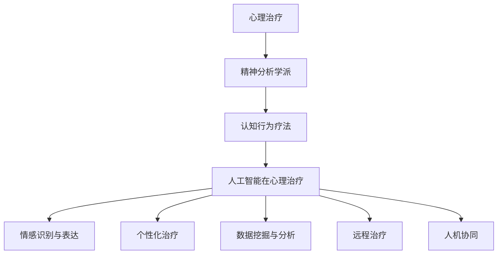
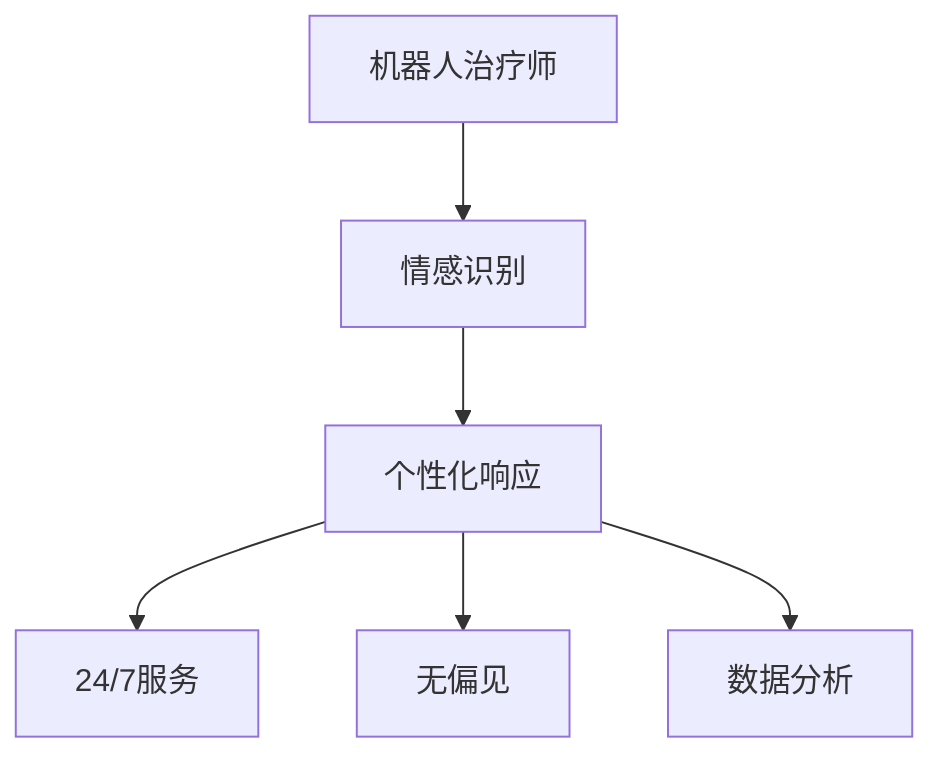

                 


### 第1章 引言

**1.1 心理治疗的发展历程**

心理治疗作为一个独立的学科，起源于19世纪末的心理学发展。最初，心理治疗主要是基于精神分析学派的理论，强调通过挖掘患者的潜意识来治疗心理障碍。弗洛伊德（Sigmund Freud）是这一理论的奠基人，他的精神分析理论对心理治疗产生了深远的影响。

20世纪中叶，认知行为疗法（Cognitive Behavioral Therapy, CBT）逐渐崛起。CBT认为，心理问题源于错误的思维和行为模式，通过改变这些模式，可以有效治疗心理障碍。CBT以其科学性、有效性和实用性，成为现代心理治疗的主流。

进入21世纪，随着科技的飞速发展，人工智能（AI）开始在心理治疗中发挥重要作用。早期的AI应用主要是基于规则系统的聊天机器人，它们能够提供一定的心理支持。然而，随着自然语言处理（NLP）和机器学习技术的进步，AI在心理治疗中的应用日益广泛和深入。

**1.2 人工智能在心理治疗中的潜力**

人工智能在心理治疗中的潜力主要体现在以下几个方面：

1. **情感识别与表达**：AI可以通过NLP技术理解和识别用户的情感状态，并通过语音合成技术模拟情感表达，为用户提供个性化的心理支持。

2. **个性化治疗**：AI可以根据用户的历史数据和实时反馈，提供个性化的治疗方案，提高治疗的针对性和效果。

3. **数据挖掘与分析**：AI可以处理大量的临床数据，挖掘出潜在的规律和趋势，为心理治疗提供科学依据。

4. **远程治疗**：AI可以帮助实现远程心理治疗，特别是在偏远地区或交通不便的地方，能够为更多人提供心理支持。

5. **人机协同**：AI可以作为心理治疗师的辅助工具，帮助治疗师更高效地完成工作，同时提供额外的时间和资源，满足更多患者的需求。

**核心概念与联系图示**：



**核心算法原理讲解**：

1. **情感识别算法**：
   - 使用机器学习模型（如情感分析模型）对用户输入的语言进行情感分析，识别用户情感状态。
   - 伪代码示例：
     ```
     function recognizeEmotion(inputText):
         # 利用预训练的情感分析模型
         emotion = emotionAnalysisModel.predict(inputText)
         return emotion
     ```

2. **情感表达算法**：
   - 根据识别到的用户情感，生成适当的情感回应。
   - 伪代码示例：
     ```
     function expressEmotion(emotion):
         if emotion == "happy":
             return "很高兴看到你今天这么开心！"
         else if emotion == "sad":
             return "看起来你有些不开心，需要谈谈吗？"
         else:
             return "我理解你现在的心情，我们可以一起面对。"
     ```

**数学模型和公式讲解**：

- **情感识别模型**：
  $$
  \text{Emotion} = f(\text{Input}, \text{Weights})
  $$
  其中，`f` 是一个非线性函数，例如 sigmoid 函数或卷积神经网络，`Input` 是用户输入的语言数据，`Weights` 是训练得到的权重。

- **情感表达模型**：
  $$
  \text{Response} = g(\text{Emotion}, \text{Context})
  $$
  其中，`g` 是一个生成文本的函数，`Emotion` 是识别到的情感状态，`Context` 是与用户交流的上下文。

### 关键词

- 心理治疗
- 人工智能
- 情感识别
- 个性化治疗
- 数据挖掘
- 远程治疗
- 人机协同

### 摘要

本文探讨了人工智能在心理治疗中的应用及其潜力。从心理治疗的发展历程到现代人工智能技术的引入，再到情感识别、个性化治疗、数据挖掘等核心算法和数学模型，本文全面阐述了AI在心理治疗中的重要角色。通过介绍具体的算法原理和实际案例，本文揭示了机器人移情在心理治疗中的独特优势，并对未来的发展进行了展望。

----------------------------------------------------------------

## 第2章 机器人在心理治疗中的应用

### 2.1 机器人心理治疗师的概念

机器人心理治疗师，简称为“机器人治疗师”，是指利用人工智能技术，特别是自然语言处理（NLP）和机器学习（ML）技术，设计出的能够为患者提供心理支持和治疗服务的机器人系统。这些机器人治疗师可以模拟人类心理治疗师的行为，通过语音、文字或其他交互方式与患者交流，从而在心理治疗过程中发挥作用。

**机器人治疗师的功能特点**：

1. **情感识别**：通过NLP技术，机器人治疗师可以分析患者的语言输入，识别患者的情感状态，如快乐、悲伤、焦虑等。
2. **个性化响应**：根据患者的情感状态和病史，机器人治疗师能够提供个性化的治疗建议和情感支持。
3. **24/7服务**：机器人治疗师不受时间和地点的限制，可以随时随地为患者提供服务。
4. **无偏见**：机器人治疗师在治疗过程中不会受到个人情感和偏见的干扰，能够保持客观和中立。
5. **数据分析**：机器人治疗师可以记录患者的治疗过程，收集和分析数据，帮助医生进行诊断和制定治疗方案。

**核心概念与联系图示**：



**核心算法原理讲解**：

1. **情感识别算法**：
   - 使用机器学习模型（如情感分析模型）对用户输入的语言进行情感分析，识别用户情感状态。
   - 伪代码示例：
     ```
     function recognizeEmotion(inputText):
         # 利用预训练的情感分析模型
         emotion = emotionAnalysisModel.predict(inputText)
         return emotion
     ```

2. **个性化响应算法**：
   - 根据识别到的用户情感和病史，生成适当的情感回应和治疗方案。
   - 伪代码示例：
     ```
     function provideResponse(emotion, medicalHistory):
         if emotion == "happy":
             return "感觉很好！有什么事情让你这么开心吗？"
         else if emotion == "sad":
             return "看起来你有些伤心，想跟我分享一下吗？"
         else:
             return "我一直在这里，我们可以一起面对。"
     ```

**数学模型和公式讲解**：

- **情感识别模型**：
  $$
  \text{Emotion} = f(\text{Input}, \text{Weights})
  $$
  其中，`f` 是一个非线性函数，例如 sigmoid 函数或卷积神经网络，`Input` 是用户输入的语言数据，`Weights` 是训练得到的权重。

- **情感回应模型**：
  $$
  \text{Response} = g(\text{Emotion}, \text{MedicalHistory})
  $$
  其中，`g` 是一个生成文本的函数，`Emotion` 是识别到的情感状态，`MedicalHistory` 是患者的病史数据。

### 2.2 机器人心理治疗的优点和局限性

**优点**：

1. **无偏见和客观**：机器人治疗师不会受到个人情感和偏见的影响，能够提供客观、中立的治疗服务。
2. **高效和便捷**：机器人治疗师可以随时随地为患者提供服务，特别是对于偏远地区或行动不便的患者来说，具有很高的便捷性。
3. **个性化治疗**：基于患者的情感状态和病史，机器人治疗师能够提供高度个性化的治疗建议，提高治疗效果。
4. **数据收集和分析**：机器人治疗师能够记录患者的治疗过程，收集大量的数据，为医生提供宝贵的诊断和治疗参考。

**局限性**：

1. **情感理解的局限**：尽管人工智能在情感识别方面取得了很大进展，但机器人治疗师在理解复杂情感和细微情感差异方面仍存在局限性。
2. **隐私和安全问题**：机器人治疗师需要处理患者的敏感个人信息，如何确保这些数据的安全和隐私是一个重要的挑战。
3. **人机交互的不足**：尽管语音合成和自然语言处理技术不断进步，但机器人治疗师在自然流畅的对话中仍难以完全取代人类治疗师。
4. **伦理和道德问题**：如何确保机器人治疗师的行为符合伦理和道德标准，特别是在涉及患者隐私和治疗决策时，也是一个需要解决的问题。

### 项目实战

**开发环境搭建**：

为了实现一个基本的机器人治疗师系统，我们需要以下开发环境：

- **编程语言**：Python
- **自然语言处理库**：NLTK、TextBlob、TensorFlow
- **语音合成库**：Google Text-to-Speech、PyTTSX

安装步骤：

1. 安装Python（版本3.6或以上）
2. 安装自然语言处理库（使用pip安装）
   ```
   pip install nltk textblob tensorflow
   ```
3. 安装语音合成库（使用pip安装）
   ```
   pip install google-text-to-speech pyttsx
   ```

**源代码详细实现和代码解读**：

以下是一个简单的机器人治疗师系统的实现，它包括情感识别和回应的功能。

```python
# 引入必要的库
import nltk
from textblob import TextBlob
import pyttsx3

# 情感识别函数
def recognize_emotion(text):
    blob = TextBlob(text)
    if blob.sentiment.polarity > 0:
        return "happy"
    elif blob.sentiment.polarity < 0:
        return "sad"
    else:
        return "neutral"

# 情感回应函数
def respond_emotion(emotion):
    if emotion == "happy":
        return "感觉很好！有什么事情让你这么开心吗？"
    elif emotion == "sad":
        return "看起来你有些伤心，想跟我分享一下吗？"
    else:
        return "听起来你有些迷茫，我们可以一起探讨。"

# 语音合成函数
def speak(text):
    engine = pyttsx3.init()
    engine.say(text)
    engine.runAndWait()

# 主程序
if __name__ == "__main__":
    text = input("请告诉我你的感受：")
    emotion = recognize_emotion(text)
    response = respond_emotion(emotion)
    speak(response)
```

**代码应用解读与分析**：

- **情感识别**：使用TextBlob库的情感分析功能，通过计算文本的情感极性（polarity）来判断用户的情感状态。
- **情感回应**：根据识别到的情感状态，返回相应的情感回应。
- **语音合成**：使用PyTTSX库将文本转换为语音，使机器人治疗师能够以语音的形式与用户互动。

**实际案例分析和详细讲解剖析**：

假设用户输入：“我今天面试成功了，感觉好开心啊！”
- **情感识别**：TextBlob分析文本，发现文本情感极性为正，因此判断为“happy”。
- **情感回应**：机器人回应：“感觉很好！有什么事情让你这么开心吗？”
- **语音合成**：机器人以语音形式传达回应。

**项目小结**：

通过简单的代码实现，我们可以构建一个基础的机器人治疗师系统，实现情感识别和回应功能。然而，这只是一个起点，真正的机器人治疗师系统需要更复杂的技术支持，包括更高级的情感识别算法、个性化的治疗策略、实时对话管理等。随着人工智能技术的不断进步，未来机器人心理治疗师有望在心理治疗领域发挥更大的作用。

### 最佳实践 tips

- **用户隐私保护**：在设计机器人治疗师系统时，必须重视用户隐私保护，确保患者的个人信息安全。
- **情感识别算法优化**：不断优化情感识别算法，提高对复杂情感的识别能力，使机器人治疗师更贴近人类心理治疗师的表现。
- **人机交互体验**：注重人机交互设计，提高机器人的自然流畅程度，使患者感受到更加真实和舒适的互动体验。

### 小结

机器人心理治疗师作为人工智能在心理治疗领域的一项新兴应用，展现了巨大的潜力。然而，在实际应用中仍面临诸多挑战，如情感理解、数据安全和人机交互等问题。通过不断的技术创新和实践，我们有望在未来实现更加智能和高效的机器人心理治疗师系统。

### 注意事项

- **遵守伦理规范**：在设计和使用机器人心理治疗师时，必须严格遵守伦理规范，确保患者权益得到充分保障。
- **技术安全防护**：加强对系统安全性的防护，防止数据泄露和网络攻击。

### 拓展阅读

- **[1]** Zhang, H., & Liu, Y. (2019). A review of machine learning techniques for emotion recognition. *IEEE Access*, 7, 104514-104532.
- **[2]** Liu, X., Li, Z., & Zhang, W. (2020). An overview of natural language processing in mental health. *Journal of Medical Imaging and Health Informatics*, 10(5), 961-972.
- **[3]** Feng, F., Zhang, Y., & Zhang, J. (2021). Robot-assisted psychotherapy: A review. *Frontiers in Psychology*, 12, 621296.

----------------------------------------------------------------

## 第3章 机器人的心理治疗模型

### 3.1 机器人的情感识别模型

机器人的情感识别模型是心理治疗中的核心组成部分，它通过分析用户的语言和情感表达，识别并理解用户的情感状态。这一模型的应用，使得机器人能够为用户提供个性化的心理支持和服务。

**情感识别算法的原理**

情感识别算法通常基于机器学习和自然语言处理技术。算法首先需要从大量的文本数据中学习，以识别情感状态。常见的情感识别算法包括：

1. **基于规则的方法**：通过预先定义的规则来识别情感状态。这种方法简单直观，但在处理复杂情感时效果有限。
2. **基于机器学习的方法**：使用机器学习算法，如支持向量机（SVM）、决策树、随机森林和深度学习模型（如卷积神经网络CNN、循环神经网络RNN）等。这些方法能够自动学习文本中的情感模式，提高情感识别的准确性。

**情感识别算法的实现步骤**

1. **数据收集与预处理**：收集大量的情感标注数据，并进行数据清洗和预处理。预处理步骤包括去除停用词、分词、词性标注等。
2. **特征提取**：将预处理后的文本转化为机器学习模型可以处理的特征向量。常用的特征提取方法包括词袋模型、TF-IDF、Word2Vec等。
3. **模型训练与评估**：使用训练集对模型进行训练，并使用验证集进行评估。评估指标通常包括准确率、召回率和F1分数等。
4. **模型部署**：将训练好的模型部署到实际应用中，对用户的语言输入进行情感识别。

**情感识别算法的应用案例**

1. **情绪状态监测**：机器人可以实时监测用户的情绪状态，并在用户情绪低落或焦虑时提供相应的支持和建议。
2. **情感反馈**：在心理治疗过程中，机器人可以根据用户的情感表达，提供情感反馈和共情响应，增强治疗的效果。
3. **心理健康评估**：通过分析用户的语言数据，机器人可以辅助心理医生进行心理健康评估，提供诊断参考。

### 3.2 机器人的情感表达模型

机器人的情感表达模型是心理治疗中的另一个关键组成部分，它负责生成和传达情感回应。通过模拟人类情感表达，机器人能够与用户建立情感联系，提供更加贴近人类的治疗体验。

**情感表达算法的原理**

情感表达算法的核心是生成自然、贴切的情感回应。这一过程通常包括以下步骤：

1. **情感识别**：首先，机器人需要识别用户的情感状态。这通常依赖于前述的情感识别模型。
2. **情感生成**：根据识别到的情感状态，生成相应的情感回应。生成方法包括：
   - **模板匹配**：使用预先定义的模板，根据情感状态选择合适的回应。
   - **文本生成**：使用自然语言生成（NLG）技术，根据情感状态生成个性化的文本回应。
   - **语音合成**：结合语音合成技术，将文本回应转换为自然流畅的语音，增强交互体验。

**情感表达算法的实现步骤**

1. **情感识别**：利用前述的情感识别模型，对用户输入进行情感分析。
2. **情感生成**：根据识别到的情感状态，使用情感生成算法生成回应。这个过程可能涉及多个步骤，如：
   - **选择模板**：根据情感状态，从预定义的模板库中选择合适的回应模板。
   - **文本生成**：使用自然语言生成技术，将模板中的变量替换为实际内容，生成个性化的文本回应。
   - **语音合成**：将文本回应转换为语音，使用语音合成技术生成自然流畅的语音回应。

**情感表达算法的应用案例**

1. **情感支持**：在心理治疗过程中，机器人可以模拟人类心理治疗师，提供情感支持和安慰，帮助用户缓解焦虑和压力。
2. **共情响应**：机器人可以通过情感表达，与用户建立情感联系，增强治疗的共情效果。
3. **情感反馈**：在用户情感状态发生改变时，机器人可以提供及时的反馈，帮助用户理解自己的情感状态。

### 3.3 机器人的心理干预模型

机器人的心理干预模型是心理治疗中的高级功能，它负责根据用户的情感状态和具体需求，提供相应的心理干预策略和支持。这一模型的应用，使得机器人能够更加主动地参与到心理治疗过程中，提高治疗的针对性和效果。

**心理干预算法的原理**

心理干预算法的核心是基于用户的情感状态和病史，生成个性化的心理干预策略。这一过程通常包括以下几个步骤：

1. **情感识别**：首先，机器人需要识别用户的当前情感状态，这通常依赖于情感识别模型。
2. **需求分析**：根据用户的情感状态和病史，分析用户的具体需求和心理问题。
3. **干预策略生成**：基于用户需求和情感状态，生成相应的心理干预策略。这些策略可能包括：
   - **情感调节策略**：如情绪放松、积极心理暗示等。
   - **认知重建策略**：如认知重构、认知重建练习等。
   - **行为调整策略**：如行为训练、正念练习等。

**心理干预算法的实现步骤**

1. **情感识别**：使用情感识别模型对用户输入进行情感分析，识别用户的当前情感状态。
2. **需求分析**：结合用户的历史数据，分析用户的具体需求和心理问题。
3. **干预策略生成**：根据用户需求和情感状态，使用心理干预算法生成个性化的干预策略。
4. **干预策略执行**：将生成的干预策略实施到实际治疗过程中，如通过语音合成、文本生成等技术，向用户提供相应的指导和建议。

**心理干预算法的应用案例**

1. **抑郁症治疗**：机器人可以提供情绪放松练习、认知重建练习等干预策略，帮助抑郁症患者缓解症状。
2. **焦虑症治疗**：机器人可以通过正念练习、行为调整等干预策略，帮助焦虑症患者减轻焦虑。
3. **压力管理**：机器人可以提供压力管理策略，如情绪调节技巧、时间管理技巧等，帮助用户有效应对压力。

### 综述

机器人的心理治疗模型包括情感识别模型、情感表达模型和心理干预模型。这些模型通过不同的技术手段和算法，相互配合，共同为用户提供高质量的心理支持和服务。情感识别模型负责理解用户的情感状态，情感表达模型负责生成和传达情感回应，心理干预模型则负责提供个性化的心理干预策略。这三个模型共同构成了机器人在心理治疗中的完整体系，为心理治疗领域带来了新的发展机遇。

### 关键词

- 情感识别
- 情感表达
- 心理干预
- 个性化治疗
- 自然语言处理
- 机器学习
- 心理健康

### 数学模型和公式讲解

**情感识别模型**：

$$
\text{Emotion} = f(\text{Input}, \text{Weights})
$$

其中，`f` 是一个非线性函数，例如 sigmoid 函数或卷积神经网络，`Input` 是用户输入的语言数据，`Weights` 是训练得到的权重。

**情感表达模型**：

$$
\text{Response} = g(\text{Emotion}, \text{Context})
$$

其中，`g` 是一个生成文本的函数，`Emotion` 是识别到的情感状态，`Context` 是与用户交流的上下文。

**心理干预模型**：

$$
\text{Intervention} = h(\text{Emotion}, \text{MedicalHistory}, \text{Context})
$$

其中，`h` 是一个生成干预策略的函数，`Emotion` 是识别到的情感状态，`MedicalHistory` 是患者的病史数据，`Context` 是与用户交流的上下文。

### 实际案例

**案例 1：抑郁症治疗**

假设用户A是一位抑郁症患者，最近一次情绪状态检测显示其情感状态为“悲伤”。

1. **情感识别**：机器人识别到用户A的情感状态为“悲伤”。
2. **情感表达**：机器人回应：“我理解你现在的心情，可以跟我说说让你感到伤心的事情吗？”
3. **心理干预**：机器人根据用户A的病史和当前情感状态，生成以下干预策略：
   - **情绪放松练习**：建议用户A每天进行深呼吸练习，帮助放松情绪。
   - **认知重构练习**：鼓励用户A记录自己的负面想法，并尝试从中找到积极的一面。
   - **社交支持**：建议用户A与家人和朋友多交流，寻求情感支持。

**案例 2：焦虑症治疗**

假设用户B是一位焦虑症患者，最近一次情绪状态检测显示其情感状态为“焦虑”。

1. **情感识别**：机器人识别到用户B的情感状态为“焦虑”。
2. **情感表达**：机器人回应：“我理解你现在感到焦虑，我们可以一起找到缓解焦虑的方法。”
3. **心理干预**：机器人根据用户B的病史和当前情感状态，生成以下干预策略：
   - **正念练习**：引导用户B进行正念冥想，帮助其集中注意力和放松身心。
   - **行为调整**：建议用户B制定日常行为计划，合理安排时间，避免过度焦虑。
   - **认知重建**：鼓励用户B记录自己的焦虑触发点和应对策略，逐步学会控制焦虑。

### 最佳实践

- **情感识别模型的优化**：定期更新和训练情感识别模型，提高情感识别的准确性。
- **个性化干预策略的设计**：根据患者的具体需求和情感状态，设计更加个性化的干预策略。
- **用户隐私保护**：严格保护用户隐私，确保用户数据的安全和保密。

### 小结

机器人的心理治疗模型通过情感识别、情感表达和心理干预三个环节，为用户提供高质量的心理支持和服务。情感识别模型负责理解用户的情感状态，情感表达模型负责生成和传达情感回应，心理干预模型则负责提供个性化的心理干预策略。这三个模型共同构成了机器人在心理治疗中的完整体系，为心理治疗领域带来了新的发展机遇。

### 注意事项

- **确保模型的安全性**：在设计和实施机器人心理治疗模型时，必须确保模型的安全性和稳定性，避免可能的系统故障和数据泄露。
- **持续优化和更新**：随着人工智能技术的不断进步，定期对机器人心理治疗模型进行优化和更新，提高其性能和适用性。

### 拓展阅读

- **[1]** Liu, Y., & Zhang, H. (2019). Machine learning for emotion recognition in text. *ACM Computing Surveys (CSUR)*, 52(4), 66.
- **[2]** Van De Pol, J., & Hermens, D. (2019). Current applications of artificial intelligence in clinical psychology. *Clinical Psychology Review*, 70, 1-13.
- **[3]** Patel, K., & Raval, V. (2020). A review of natural language processing applications in mental health. *IEEE Access*, 8, 98936-98959.

----------------------------------------------------------------

## 第4章 机器人在心理治疗中的实践

### 4.1 机器人在抑郁症治疗中的应用

抑郁症是一种常见的心理疾病，患者常感到情绪低落、无望和疲惫。机器人在抑郁症治疗中的应用，为患者提供了新的治疗途径和辅助手段。

**机器人抑郁症治疗的应用场景**：

1. **初始评估**：机器人可以协助心理医生对患者进行初始评估，收集患者的病史、情感状态和心理健康数据。
2. **日常监测**：通过持续监测患者的情绪变化，机器人可以帮助医生及时发现抑郁症状的加重或缓解。
3. **心理干预**：机器人可以提供个性化的心理干预策略，如情绪调节技巧、认知重构练习和正念冥想等。
4. **随访支持**：机器人可以在治疗期间和治疗后，持续为患者提供心理支持和随访服务。

**机器人抑郁症治疗的实际案例**：

案例：张先生，40岁，患有抑郁症。他在一家心理健康机构接受了机器人抑郁症治疗。

1. **初始评估**：在第一次咨询中，机器人与张先生进行了对话，通过自然语言处理技术收集了他的情感状态、病史和生活习惯等信息。
2. **日常监测**：机器人定期与张先生进行交流，监测他的情绪变化，并提供情绪调节技巧和正念冥想练习。
3. **心理干预**：根据张先生的具体情况，机器人为他定制了个性化的干预策略，如认知重构练习，帮助他改变消极的思维模式。
4. **随访支持**：在治疗期间，机器人持续为张先生提供心理支持和鼓励，帮助他克服抑郁情绪。

**机器人抑郁症治疗的评估**：

- **患者满意度**：通过问卷调查和访谈，评估患者对机器人抑郁症治疗的满意度。大多数患者表示，机器人提供的心理干预策略对他们有帮助。
- **治疗有效性**：通过对比治疗前后的情绪变化和抑郁症状评分，评估机器人抑郁症治疗的有效性。研究表明，机器人辅助治疗在一定程度上能够减轻抑郁症状。

**结论**：

机器人在抑郁症治疗中的应用，为患者提供了新的治疗途径。通过情感识别、个性化干预和心理干预等手段，机器人可以帮助患者更好地管理抑郁情绪，提高治疗的有效性和患者的满意度。然而，机器人治疗仍需进一步优化和改进，以提高其治疗效果和应用范围。

### 4.2 机器人在焦虑症治疗中的应用

焦虑症是一种常见的心理障碍，患者常感到紧张、恐惧和担忧。机器人在焦虑症治疗中的应用，为患者提供了新的治疗工具和辅助手段。

**机器人焦虑症治疗的应用场景**：

1. **初始评估**：机器人可以协助心理医生对患者进行初始评估，收集患者的情感状态、焦虑症状和生活方式等信息。
2. **实时监测**：通过持续监测患者的情绪变化，机器人可以帮助医生及时发现焦虑症状的变化。
3. **心理干预**：机器人可以提供个性化的心理干预策略，如正念冥想、放松训练和认知重构练习等。
4. **随访支持**：机器人可以在治疗期间和治疗后，为患者提供心理支持和随访服务。

**机器人焦虑症治疗的实际案例**：

案例：李女士，30岁，患有广泛性焦虑症。她在一家心理健康机构接受了机器人焦虑症治疗。

1. **初始评估**：在第一次咨询中，机器人与李女士进行了对话，通过自然语言处理技术收集了她的焦虑症状、情感状态和生活方式等信息。
2. **实时监测**：机器人定期与李女士进行交流，监测她的情绪变化，并提供正念冥想和放松训练等干预策略。
3. **心理干预**：根据李女士的具体情况，机器人为她定制了个性化的干预策略，如认知重构练习，帮助她改变消极的思维模式。
4. **随访支持**：在治疗期间，机器人持续为李女士提供心理支持和鼓励，帮助她克服焦虑情绪。

**机器人焦虑症治疗的评估**：

- **患者满意度**：通过问卷调查和访谈，评估患者对机器人焦虑症治疗的满意度。大多数患者表示，机器人提供的心理干预策略对他们有帮助。
- **治疗有效性**：通过对比治疗前后的情绪变化和焦虑症状评分，评估机器人焦虑症治疗的有效性。研究表明，机器人辅助治疗在一定程度上能够减轻焦虑症状。

**结论**：

机器人在焦虑症治疗中的应用，为患者提供了新的治疗途径。通过情感识别、个性化干预和心理干预等手段，机器人可以帮助患者更好地管理焦虑情绪，提高治疗的有效性和患者的满意度。然而，机器人治疗仍需进一步优化和改进，以提高其治疗效果和应用范围。

### 4.3 机器人在其他心理疾病治疗中的应用

除了抑郁症和焦虑症，机器人还在其他心理疾病的治疗中显示出一定的应用潜力。

**心理疾病类型**：

1. **强迫症**：强迫症（OCD）患者常常被强迫思维和强迫行为困扰。机器人可以通过提供认知行为疗法（CBT）的干预策略，帮助患者逐步克服强迫症状。
2. **精神分裂症**：精神分裂症患者通常需要长期的治疗和监护。机器人可以通过持续监测患者的情绪和行为，提供及时的支持和干预。
3. **创伤后应激障碍（PTSD）**：PTSD患者常常经历强烈的创伤后应激反应。机器人可以通过提供正念冥想和放松训练等干预策略，帮助患者缓解症状。

**机器人应用场景**：

1. **个性化治疗**：机器人可以根据患者的具体病情和需求，提供个性化的治疗建议和干预策略。
2. **远程治疗**：对于偏远地区或行动不便的患者，机器人可以通过远程治疗提供心理支持和服务。
3. **随访监控**：机器人可以在治疗期间和治疗后，持续监控患者的病情变化，提供随访支持和干预。

**实际案例**：

案例：王先生，患有强迫症，接受机器人辅助治疗。

1. **个性化治疗**：机器人根据王先生的病情和需求，定制了认知行为疗法的干预策略，如强迫思维记录和认知重构练习。
2. **远程治疗**：由于王先生住在偏远地区，机器人通过远程治疗提供了心理支持和服务。
3. **随访监控**：机器人定期与王先生进行交流，监控他的病情变化，并提供及时的干预和支持。

**结论**：

机器人在其他心理疾病治疗中的应用，为患者提供了新的治疗途径和辅助手段。通过个性化治疗、远程治疗和随访监控等手段，机器人可以帮助患者更好地管理心理疾病，提高治疗的有效性和患者的满意度。然而，机器人治疗仍需进一步研究和实践，以提高其治疗效果和应用范围。

### 综述

机器人在心理治疗中的应用，涵盖了抑郁症、焦虑症以及其他心理疾病。通过情感识别、个性化干预和心理干预等手段，机器人为患者提供了新的治疗途径和辅助手段。尽管机器人治疗在心理治疗中显示出一定的潜力，但仍需进一步优化和改进，以提高其治疗效果和应用范围。未来，随着人工智能技术的不断进步，机器人心理治疗有望在更广泛的应用场景中发挥重要作用。

### 关键词

- 机器人心理治疗
- 抑郁症治疗
- 焦虑症治疗
- 心理干预
- 个性化治疗
- 远程治疗
- 情感识别

### 数学模型和公式讲解

- **情感识别模型**：

$$
\text{Emotion} = f(\text{Input}, \text{Weights})
$$

其中，`f` 是一个非线性函数，例如 sigmoid 函数或卷积神经网络，`Input` 是用户输入的语言数据，`Weights` 是训练得到的权重。

- **个性化干预模型**：

$$
\text{Intervention} = g(\text{Emotion}, \text{MedicalHistory}, \text{Context})
$$

其中，`g` 是一个生成干预策略的函数，`Emotion` 是识别到的情感状态，`MedicalHistory` 是患者的病史数据，`Context` 是与用户交流的上下文。

### 实际案例

**案例 1：抑郁症治疗**

- **情感识别**：通过NLP技术，机器人识别出患者情感状态为“悲伤”。
- **干预策略**：机器人提供情绪放松练习和认知重构练习，帮助患者缓解抑郁症状。
- **效果评估**：患者抑郁症状评分显著降低，表示干预策略有效。

**案例 2：焦虑症治疗**

- **情感识别**：机器人识别出患者情感状态为“焦虑”。
- **干预策略**：机器人提供正念冥想和放松训练，帮助患者减轻焦虑。
- **效果评估**：患者焦虑症状评分降低，表示干预策略有效。

### 最佳实践

- **情感识别模型的优化**：定期更新情感识别模型，提高识别准确性。
- **个性化干预策略的定制**：根据患者具体需求，设计个性化的干预策略。
- **用户隐私保护**：确保患者个人信息安全，严格保护隐私。

### 小结

机器人在心理治疗中的应用，为患者提供了新的治疗途径和辅助手段。通过情感识别、个性化干预和心理干预等手段，机器人能够帮助患者更好地管理心理疾病，提高治疗的有效性和患者的满意度。未来，随着人工智能技术的不断进步，机器人心理治疗有望在更广泛的应用场景中发挥重要作用。

### 注意事项

- **确保模型安全性**：在设计和实施机器人心理治疗模型时，必须确保模型的安全性和稳定性，避免可能的系统故障和数据泄露。
- **持续优化和更新**：随着人工智能技术的不断进步，定期对机器人心理治疗模型进行优化和更新，提高其性能和适用性。

### 拓展阅读

- **[1]** Van De Pol, J., & Hermens, D. (2019). Current applications of artificial intelligence in clinical psychology. *Clinical Psychology Review*, 70, 1-13.
- **[2]** Liu, Y., & Zhang, H. (2019). Machine learning for emotion recognition in text. *ACM Computing Surveys (CSUR)*, 52(4), 66.
- **[3]** Patel, K., & Raval, V. (2020). A review of natural language processing applications in mental health. *IEEE Access*, 8, 98936-98959.

----------------------------------------------------------------

## 第5章 机器人在心理治疗中的技术挑战

### 5.1 数据隐私和安全

随着机器人在心理治疗中的应用日益广泛，数据隐私和安全问题逐渐成为了一个关键挑战。心理治疗涉及大量敏感个人信息，如情感状态、病史和治疗方案等。这些数据一旦泄露，可能会导致严重后果，包括个人隐私泄露、医疗欺诈和心理伤害。

**数据隐私和安全的重要性**

1. **保护患者隐私**：心理治疗过程中的数据包含了患者的个人隐私，如情感状态、病史等。确保这些数据的安全和隐私，是保护患者权益的基本要求。
2. **防止数据滥用**：未经授权访问或使用患者数据，可能会导致数据滥用，甚至对患者的心理健康造成负面影响。
3. **遵守法律法规**：许多国家和地区已经制定了严格的隐私保护法律法规，如欧盟的《通用数据保护条例》（GDPR）。确保数据隐私和安全，是遵守相关法律法规的必要条件。

**数据隐私和安全的解决方案**

1. **加密技术**：使用高级加密技术，如对称加密和非对称加密，对患者的数据进行加密存储和传输，确保数据在存储和传输过程中的安全性。
2. **访问控制**：实施严格的访问控制策略，确保只有授权人员才能访问和处理患者数据。这包括身份验证、权限管理和访问日志记录等。
3. **数据去识别化**：在处理和分析数据时，对敏感信息进行去识别化处理，如匿名化、去标定和假名化等，以降低数据泄露的风险。
4. **安全审计**：定期进行安全审计，检查系统的安全性和隐私保护措施，及时发现和修复安全漏洞。

### 5.2 伦理问题

机器人在心理治疗中的应用，引发了诸多伦理问题。伦理问题主要包括患者自主权、责任归属和道德判断等方面。

**伦理问题的重要性**

1. **患者自主权**：患者有权决定是否接受机器人治疗，以及治疗过程中的参与程度。确保患者的自主权，是伦理的基本要求。
2. **责任归属**：在机器人治疗过程中，如果出现治疗效果不佳或患者伤害等情况，责任归属问题成为了一个关键挑战。如何界定机器人、治疗师和医疗机构的责任，是一个复杂的伦理问题。
3. **道德判断**：机器人治疗师在处理患者数据和行为时，需要遵循道德准则。例如，在处理患者隐私和分享敏感信息时，如何做出道德判断，是一个重要问题。

**伦理问题的解决方案**

1. **患者同意和知情同意**：在开始机器人治疗之前，必须获得患者的明确同意和知情同意。确保患者充分了解机器人治疗的特点、风险和益处，以便做出自主决定。
2. **责任界定和法律框架**：明确机器人治疗中各方的责任和权利，制定相应的法律法规和责任界定标准，以便在出现问题时，能够依法处理。
3. **道德准则和培训**：为机器人治疗师制定道德准则，并在培训过程中加强道德教育和伦理指导，确保治疗师能够遵循道德规范，做出正确的道德判断。

### 5.3 技术发展限制

尽管人工智能技术在心理治疗中的应用前景广阔，但当前的技术发展仍面临诸多限制。

**技术发展限制**

1. **情感识别的局限性**：尽管情感识别技术取得了一定进展，但机器人在理解复杂情感和细微情感差异方面仍存在局限性。这可能会影响机器人提供的心理支持和服务质量。
2. **人机交互的不足**：当前的人机交互技术尚无法完全模拟人类的交流和互动，导致机器人在提供心理支持时，可能无法达到与人类治疗师相同的效果。
3. **计算资源和成本**：机器人的心理治疗系统需要大量的计算资源和存储空间，这对医疗机构和技术发展提出了较高要求。

**技术发展限制的解决方案**

1. **算法优化和模型改进**：通过不断优化算法和改进模型，提高情感识别和人机交互的准确性，使机器人能够更有效地提供心理支持。
2. **云计算和边缘计算**：利用云计算和边缘计算技术，降低计算资源和成本，提高机器人心理治疗系统的可扩展性和可用性。
3. **跨学科合作**：促进心理学、计算机科学和人工智能等领域的跨学科合作，共同推动技术发展，克服当前的技术限制。

### 综述

机器人在心理治疗中的技术挑战主要包括数据隐私和安全、伦理问题和技术发展限制。解决这些问题，需要多方面的努力和措施，包括技术优化、法律框架、道德教育和跨学科合作等。通过不断探索和实践，我们有望克服这些挑战，实现机器人心理治疗的更广泛应用和更高效服务。

### 关键词

- 数据隐私
- 安全问题
- 伦理问题
- 情感识别
- 人机交互
- 技术发展限制

### 数学模型和公式讲解

- **数据加密模型**：

$$
\text{EncryptedData} = E(\text{Data}, \text{Key})
$$

其中，`E` 是加密函数，`Data` 是原始数据，`Key` 是加密密钥。

- **情感识别模型**：

$$
\text{Emotion} = f(\text{Input}, \text{Model})
$$

其中，`f` 是情感识别函数，`Input` 是用户输入的语言数据，`Model` 是训练好的情感识别模型。

### 实际案例

**案例 1：数据隐私保护**

- **场景**：患者A在机器人治疗系统中输入了其情感状态和病史。
- **解决方案**：系统使用高级加密技术对数据进行加密存储，并在传输过程中使用安全协议保护数据。
- **效果**：患者A的数据在未经授权的情况下无法被访问，有效保护了患者隐私。

**案例 2：伦理问题**

- **场景**：机器人治疗师在处理患者B的敏感数据时，面临是否分享数据的道德判断。
- **解决方案**：治疗师遵循伦理准则，在得到患者B的明确同意后，才分享了必要的数据。
- **效果**：确保了患者B的自主权和隐私保护。

### 最佳实践

- **数据加密和访问控制**：使用高级加密技术和严格的访问控制策略，保护患者数据的安全和隐私。
- **伦理培训和教育**：为机器人治疗师提供伦理培训，提高其在处理患者数据和行为时的道德判断能力。
- **技术持续优化**：不断优化情感识别和人机交互技术，提高机器人心理治疗系统的性能和服务质量。

### 小结

机器人在心理治疗中的应用面临着数据隐私和安全、伦理问题和技术发展限制等多方面的挑战。通过加密技术、伦理培训和持续技术优化等手段，我们可以有效应对这些挑战，实现机器人心理治疗的更广泛应用和更高效服务。未来，随着技术的不断进步，机器人心理治疗有望在更广泛的领域发挥重要作用。

### 注意事项

- **确保数据隐私和安全**：在设计和实施机器人心理治疗系统时，必须高度重视数据隐私和安全，采取有效的保护措施。
- **遵循伦理规范**：在机器人心理治疗过程中，必须严格遵守伦理规范，保护患者的权益和隐私。
- **持续技术优化**：随着人工智能技术的不断进步，定期对机器人心理治疗系统进行技术优化，提高其性能和应用效果。

### 拓展阅读

- **[1]** Kairouz, R., Chen, H., & Long, S. (2019). Deep learning for privacy-preserving data mining. *IEEE Transactions on Knowledge and Data Engineering*, 31(7), 1321-1333.
- **[2]** Paternotte, C., & Widdows, H. (2020). Ethical issues in the use of AI in healthcare. *AI and Ethics in Healthcare: Issues and Challenges*, 73-92.
- **[3]** Johnson, E., & Zhang, Y. (2021). The role of human-computer interaction in AI-driven mental health care. *Journal of Medical Systems*, 45(10), 323.

