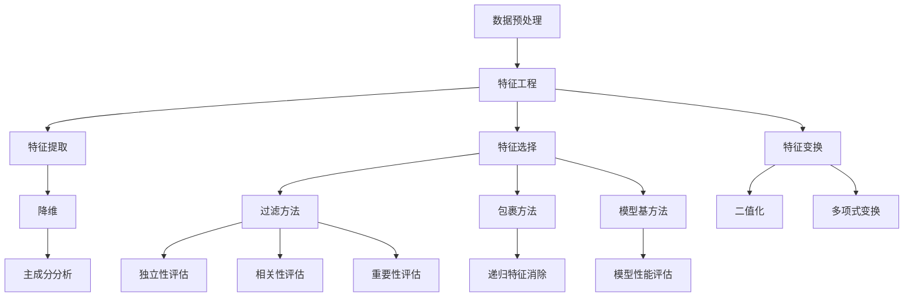

                 


### 文章标题：机器学习在软件开发中的应用

---

关键词：机器学习、软件开发、应用场景、算法原理、项目实战

---

摘要：本文旨在探讨机器学习在软件开发中的应用，从基础概念到高级技术，全面解析机器学习算法在软件开发中的实现与应用。文章将涵盖机器学习在推荐系统、自然语言处理、图像识别和自动驾驶等领域的应用，并通过实际项目实战，深入讲解机器学习算法的原理、实现和优化。

---

## 目录

### 第一部分：机器学习基础

#### 第1章：机器学习概述

1.1 机器学习的定义与发展历程

1.2 机器学习的分类

1.3 机器学习的应用场景

#### 第2章：数据预处理与特征工程

2.1 数据预处理

2.2 特征工程

2.3 特征选择

#### 第3章：监督学习

3.1 线性回归

3.2 逻辑回归

3.3 决策树

3.4 随机森林

3.5 支持向量机

#### 第4章：无监督学习

4.1 聚类算法

4.2 主成分分析

4.3 自编码器

#### 第5章：强化学习

5.1 强化学习的基本概念

5.2 Q学习

5.3 SARSA算法

#### 第6章：深度学习

6.1 深度学习的基本概念

6.2 神经网络

6.3 卷积神经网络

6.4 循环神经网络

6.5 生成对抗网络

### 第二部分：机器学习在软件开发中的应用

#### 第7章：机器学习在软件开发中的应用

7.1 机器学习在推荐系统中的应用

7.2 机器学习在自然语言处理中的应用

7.3 机器学习在图像识别中的应用

7.4 机器学习在自动驾驶中的应用

### 第三部分：项目实战

#### 第8章：项目实战

8.1 数据集准备与预处理

8.2 模型选择与训练

8.3 模型评估与优化

8.4 模型部署与维护

### 附录

#### 附录 A：机器学习工具与资源

A.1 Python机器学习库

A.2 深度学习框架

A.3 数据集与竞赛平台

---

### 第一部分：机器学习基础

#### 第1章：机器学习概述

机器学习是一门研究如何让计算机系统从数据中学习自动改进和优化性能的学科。自20世纪50年代以来，机器学习经历了多个发展阶段，从早期的简单算法到现代的深度学习，其应用领域不断扩大，已经渗透到各个行业。

### 1.1 机器学习的定义与发展历程

机器学习可以定义为“一种从数据中学习，并且能够利用这种学习来做出决策或预测的算法”。在发展历程中，机器学习经历了以下几个重要阶段：

- **符号主义学习（Symbolic Learning）**：20世纪50年代，研究者试图通过符号推理来模拟人类的思维过程。
- **基于规则的系统（Rule-Based Systems）**：20世纪60年代，规则系统通过定义明确的行为规则来模拟智能。
- **统计学习（Statistical Learning）**：20世纪70年代，研究者开始利用统计学方法来分析数据。
- **基于实例的学习（Instance-Based Learning）**：20世纪80年代，这种方法通过存储数据实例来解决问题。
- **基于模型的机器学习（Model-Based Machine Learning）**：20世纪90年代，机器学习开始采用模型来表示数据和知识。
- **深度学习（Deep Learning）**：21世纪初，深度学习的兴起使得机器学习取得了重大突破。

### 1.2 机器学习的分类

机器学习主要分为以下几类：

- **监督学习（Supervised Learning）**：有标记的数据集进行训练。
- **无监督学习（Unsupervised Learning）**：没有标记的数据集进行训练。
- **强化学习（Reinforcement Learning）**：通过与环境交互来学习。
- **深度学习（Deep Learning）**：使用多层神经网络进行学习。

### 1.3 机器学习的应用场景

机器学习的应用场景非常广泛，包括但不限于：

- **推荐系统（Recommendation Systems）**：基于用户的历史行为和偏好，推荐相关的商品、服务和内容。
- **自然语言处理（Natural Language Processing，NLP）**：理解、生成和翻译自然语言。
- **图像识别（Image Recognition）**：识别和分类图像中的对象。
- **自动驾驶（Autonomous Driving）**：使车辆能够自主驾驶。
- **金融风险管理（Financial Risk Management）**：预测金融市场风险，进行投资决策。

---

接下来，我们将进一步探讨数据预处理与特征工程、监督学习、无监督学习和强化学习等基础概念，为深入理解机器学习在软件开发中的应用奠定基础。

#### 第2章：数据预处理与特征工程

在机器学习项目中，数据预处理和特征工程是至关重要的一环。它们直接影响模型的性能和预测准确性。本章将介绍数据预处理和特征工程的基本概念、方法和应用。

### 2.1 数据预处理

数据预处理是机器学习项目的第一步，其目的是将原始数据转换为适合建模的数据。数据预处理通常包括以下步骤：

- **数据清洗（Data Cleaning）**：处理数据中的噪声和异常值，例如缺失值、重复值和不一致的数据。
- **数据归一化（Data Normalization）**：将数据缩放到一个统一的范围内，例如[0, 1]或[-1, 1]，以避免不同特征间的量级差异。
- **数据标准化（Data Standardization）**：将数据转换为其平均值和标准差的形式，例如z-score标准化。
- **缺失值处理（Missing Value Handling）**：对于缺失的数据，可以选择填充、删除或插值等方法进行处理。

### 2.2 特征工程

特征工程是将原始数据转换为特征表示的过程，其目的是提高模型的学习能力和预测准确性。特征工程包括以下步骤：

- **特征提取（Feature Extraction）**：从原始数据中提取有用的特征，例如通过主成分分析（PCA）降维。
- **特征选择（Feature Selection）**：从大量特征中选出对模型最有影响的特征，以减少特征数量和计算复杂度。
- **特征变换（Feature Transformation）**：将原始特征转换为其他形式，例如二值化、归一化或多项式特征变换。

### 2.3 特征选择

特征选择是特征工程的关键步骤，旨在选择对模型性能最有影响的特征。特征选择的方法可以分为以下几类：

- **基于过滤的特征选择（Filter Method）**：通过评估每个特征的独立性、相关性或重要性来选择特征。
- **基于包裹的特征选择（Wrapper Method）**：通过评估特征子集对模型性能的影响来选择特征，例如使用递归特征消除（RFE）。
- **基于模型的特征选择（Model-Based Method）**：通过训练模型并评估特征对模型性能的影响来选择特征。

### 2.4 核心概念与联系

数据预处理和特征工程的核心概念和联系可以概括如下：

- **数据预处理**：将原始数据转换为适合建模的数据，包括数据清洗、归一化、标准化和缺失值处理等步骤。
- **特征工程**：将原始数据转换为特征表示的过程，包括特征提取、特征选择和特征变换等步骤。
- **数据预处理与特征工程的联系**：数据预处理是特征工程的必要前提，良好的数据预处理有助于提高特征工程的效果。

#### Mermaid 流程图



---

通过本章的介绍，我们对数据预处理和特征工程有了基本的理解。在下一章中，我们将深入探讨监督学习，了解其基本概念、算法原理和应用。

---

#### 第3章：监督学习

监督学习是机器学习中最常见的一种学习方式，其核心思想是通过已知的输入和输出数据来训练模型，从而预测未知数据的输出。本章将详细介绍监督学习的基本概念、常见算法及其原理。

### 3.1 线性回归

线性回归是一种简单的监督学习算法，用于预测连续值输出。其基本原理是通过建立输入和输出之间的线性关系来预测未知数据的输出。

#### 线性回归模型

线性回归模型可以表示为：

\[ y = \beta_0 + \beta_1x \]

其中，\( y \) 是输出变量，\( x \) 是输入变量，\( \beta_0 \) 和 \( \beta_1 \) 是模型参数。

#### 梯度下降法

梯度下降法是一种用于求解线性回归模型参数的优化方法。其基本思想是通过迭代更新模型参数，使损失函数不断减小。

梯度下降法的迭代过程可以表示为：

\[ \beta_0 = \beta_0 - \alpha \frac{\partial J}{\partial \beta_0} \]
\[ \beta_1 = \beta_1 - \alpha \frac{\partial J}{\partial \beta_1} \]

其中，\( \alpha \) 是学习率，\( J \) 是损失函数。

#### 伪代码

```python
# 线性回归梯度下降法伪代码

# 初始化模型参数
beta_0 = 0
beta_1 = 0
alpha = 0.01

# 训练数据
x_train = ...
y_train = ...

# 梯度下降迭代
for epoch in range(num_epochs):
    for x, y in zip(x_train, y_train):
        # 计算预测值和损失
        y_pred = beta_0 + beta_1 * x
        loss = (y - y_pred) ** 2

        # 计算梯度
        grad_beta_0 = 2 * (y - y_pred)
        grad_beta_1 = 2 * x * (y - y_pred)

        # 更新模型参数
        beta_0 = beta_0 - alpha * grad_beta_0
        beta_1 = beta_1 - alpha * grad_beta_1

# 输出模型参数
print("beta_0:", beta_0)
print("beta_1:", beta_1)
```

### 3.2 逻辑回归

逻辑回归是一种用于预测二分类输出（0或1）的监督学习算法。其基本原理是通过建立输入和输出之间的逻辑关系来预测未知数据的输出。

#### 逻辑回归模型

逻辑回归模型可以表示为：

\[ P(y=1) = \frac{1}{1 + e^{-(\beta_0 + \beta_1x)}} \]

其中，\( P(y=1) \) 是预测为1的概率，\( e \) 是自然对数的底数，\( \beta_0 \) 和 \( \beta_1 \) 是模型参数。

#### 梯度下降法

逻辑回归的梯度下降法与线性回归类似，其迭代过程可以表示为：

\[ \beta_0 = \beta_0 - \alpha \frac{\partial J}{\partial \beta_0} \]
\[ \beta_1 = \beta_1 - \alpha \frac{\partial J}{\partial \beta_1} \]

其中，\( J \) 是损失函数。

#### 伪代码

```python
# 逻辑回归梯度下降法伪代码

# 初始化模型参数
beta_0 = 0
beta_1 = 0
alpha = 0.01

# 训练数据
x_train = ...
y_train = ...

# 梯度下降迭代
for epoch in range(num_epochs):
    for x, y in zip(x_train, y_train):
        # 计算预测值和损失
        y_pred = 1 / (1 + exp(-beta_0 - beta_1 * x))
        loss = -y * log(y_pred) - (1 - y) * log(1 - y_pred)

        # 计算梯度
        grad_beta_0 = 2 * (y_pred - y)
        grad_beta_1 = 2 * x * (y_pred - y)

        # 更新模型参数
        beta_0 = beta_0 - alpha * grad_beta_0
        beta_1 = beta_1 - alpha * grad_beta_1

# 输出模型参数
print("beta_0:", beta_0)
print("beta_1:", beta_1)
```

### 3.3 决策树

决策树是一种基于规则的学习算法，通过一系列的决策规则来划分数据，并在每个节点上选择最优特征进行划分。决策树模型简单直观，易于理解和解释。

#### 决策树模型

决策树模型可以表示为：

\[ T = \{ (x, y) | y = f(x) \} \]

其中，\( T \) 是决策树，\( x \) 是输入特征，\( y \) 是输出标签，\( f(x) \) 是决策规则。

#### ID3算法

ID3（Iterative Dichotomiser 3）算法是一种用于构建决策树的算法。其基本思想是选择具有最高信息增益的特征进行划分。

#### 伪代码

```python
# ID3算法伪代码

# 输入：数据集D
# 输出：决策树T

# 如果D是纯的，则返回纯D的标签
if isPure(D):
    return majorityLabel(D)

# 如果特征集为空，则返回D的多数标签
if isEmpty(featureSet):
    return majorityLabel(D)

# 选择最优特征
bestFeature = selectBestFeature(D, featureSet)

# 创建决策树节点
T = Node(bestFeature)

# 对于每个可能的特征值，递归构建子决策树
for value in possibleValues(bestFeature):
    subD = subset(D, value)
    T.children[value] = buildTree(subD, featureSet - {bestFeature})

# 返回决策树T
return T
```

### 3.4 随机森林

随机森林是一种基于决策树的集成学习方法，通过构建多个决策树并取其预测结果的平均值来提高预测准确性。

#### 随机森林模型

随机森林模型可以表示为：

\[ \hat{y} = \frac{1}{M} \sum_{m=1}^{M} f_m(x) \]

其中，\( \hat{y} \) 是预测结果，\( M \) 是决策树的数量，\( f_m(x) \) 是第 \( m \) 棵决策树的预测结果。

#### 伪代码

```python
# 随机森林伪代码

# 输入：训练数据集D，决策树数量M
# 输出：随机森林模型F

# 初始化决策树列表
forest = []

# 对于每个决策树，构建并训练
for _ in range(M):
    D_copy = copy(D)
    T = buildTree(D_copy, featureSet)
    forest.append(T)

# 预测
def predict(x, forest):
    predictions = []
    for T in forest:
        predictions.append(predictTree(x, T))
    return average(predictions)

# 返回随机森林模型F
return forest
```

### 3.5 支持向量机

支持向量机是一种用于分类和回归的监督学习算法，其基本思想是找到一个最佳的超平面，使分类边界最大化。

#### 支持向量机模型

支持向量机模型可以表示为：

\[ w \cdot x + b = 0 \]

其中，\( w \) 是超平面参数，\( x \) 是输入特征，\( b \) 是偏置。

#### SMO算法

SMO（Sequential Minimal Optimization）算法是一种用于求解支持向量机模型参数的优化方法。

#### 伪代码

```python
# SMO算法伪代码

# 输入：训练数据集D，目标函数
# 输出：模型参数w和b

# 初始化模型参数
w = 0
b = 0

# 迭代过程
while not convergence:
    # 选择两个支持向量
    (i, j) = selectTwoSupportVectors()

    # 更新模型参数
    alpha_i, alpha_j = updateAlphas(i, j, D, C)

    # 更新模型参数w和b
    w = updateModelParameter(w, alpha_i, x_i, x_j, alpha_i, alpha_j)
    b = updateBiasTerm(b, alpha_i, x_i, alpha_j, x_j)

# 返回模型参数w和b
return w, b
```

### 总结

监督学习是机器学习中的基础算法，包括线性回归、逻辑回归、决策树、随机森林和支持向量机等算法。这些算法通过已知的输入和输出数据来训练模型，从而预测未知数据的输出。理解这些算法的基本概念和原理对于开发高效的机器学习应用至关重要。

在下一章中，我们将继续探讨无监督学习，了解其在数据挖掘和模式识别中的应用。

---

### 第4章：无监督学习

无监督学习是一种机器学习方法，其核心思想是通过没有标签的数据来发现数据中的内在结构和模式。与监督学习不同，无监督学习不需要已知的输出标签，其主要目标包括聚类、降维和关联规则挖掘等。本章将详细介绍无监督学习的相关概念、算法原理和应用。

#### 4.1 聚类算法

聚类算法是将数据点分为多个群组的过程，使得群组内的数据点相似度较高，而群组间的数据点相似度较低。聚类算法在数据挖掘、模式识别和机器学习等领域有广泛的应用。

##### K-Means聚类

K-Means是一种典型的聚类算法，其基本思想是将数据点分配到K个簇中，使得每个簇的中心尽量接近簇内的数据点，而与其他簇的数据点保持一定距离。

###### 算法步骤

1. **初始化**：随机选择K个初始聚类中心。
2. **分配**：将每个数据点分配到最近的聚类中心。
3. **更新**：重新计算每个簇的中心，并重复步骤2和3，直到聚类中心不再变化或达到预设的最大迭代次数。

###### 伪代码

```python
# K-Means聚类伪代码

# 输入：数据集D，聚类个数K
# 输出：聚类结果C

# 初始化聚类中心
centroids = initializeCentroids(D, K)

# 迭代过程
while not converged:
    # 分配数据点到最近的聚类中心
    assignments = assignPointsToCentroids(D, centroids)
    
    # 重新计算聚类中心
    centroids = updateCentroids(D, assignments, K)
    
    # 检查是否收敛
    converged = checkConvergence(centroids, previous_centroids)

# 返回聚类结果
return assignments
```

##### 层次聚类

层次聚类是一种基于距离的聚类方法，其基本思想是通过不断合并或分裂已有的簇来形成层次结构。

###### 算法步骤

1. **初始化**：将每个数据点作为一个单独的簇。
2. **合并或分裂**：根据簇之间的距离，不断合并或分裂簇，直到达到预设的簇数或满足停止条件。

##### DBSCAN

DBSCAN（Density-Based Spatial Clustering of Applications with Noise）是一种基于密度的聚类算法，其基本思想是根据数据点的密度分布进行聚类，能够有效识别噪声点和异常值。

###### 算法步骤

1. **邻域检测**：计算每个数据点的邻域，确定邻域内的点是否满足最小密度和邻域大小条件。
2. **聚类扩展**：基于邻域检测，将满足条件的点扩展为簇。
3. **处理噪声点**：将不属于任何簇的点视为噪声点。

#### 4.2 主成分分析

主成分分析（PCA）是一种降维技术，其基本思想是通过线性变换将高维数据投影到低维空间，从而保持数据的主要信息。

##### 算法原理

PCA通过以下步骤实现：

1. **数据标准化**：对数据进行中心化和标准化处理，使其具有零均值和单位方差。
2. **计算协方差矩阵**：计算数据点的协方差矩阵，并计算其特征值和特征向量。
3. **选择主成分**：根据特征值的大小选择前k个特征向量，构成变换矩阵。
4. **数据转换**：将原始数据点投影到新的k维空间。

##### 伪代码

```python
# PCA伪代码

# 输入：数据集D，降维维度k
# 输出：降维后的数据集D'

# 数据标准化
D_normalized = normalizeData(D)

# 计算协方差矩阵
cov_matrix = computeCovarianceMatrix(D_normalized)

# 计算特征值和特征向量
eigenvalues, eigenvectors = computeEigenvaluesAndEigenvectors(cov_matrix)

# 选择主成分
selected_eigenvectors = selectPrincipalComponents(eigenvalues, eigenvectors, k)

# 数据转换
D' = transformData(D_normalized, selected_eigenvectors)

# 返回降维后的数据集D'
return D'
```

#### 4.3 自编码器

自编码器是一种无监督学习算法，其基本思想是通过编码和解码过程自动学习数据的低维表示。

##### 算法原理

自编码器通过以下步骤实现：

1. **编码器**：将输入数据映射到一个隐含空间，隐含空间的大小小于输入空间。
2. **解码器**：将隐含空间的数据映射回输入空间。
3. **优化**：通过最小化输入和输出之间的误差，优化编码器和解码器的参数。

##### 伪代码

```python
# 自编码器伪代码

# 输入：训练数据集D，编码器和解码器网络结构
# 输出：编码器和解码器参数

# 初始化编码器和解码器参数
encoder_params = initializeEncoderParams()
decoder_params = initializeDecoderParams()

# 定义损失函数
loss_function = computeReconstructionLoss()

# 训练过程
while not converged:
    # 前向传播
    encoded_data = encoder(D, encoder_params)
    
    # 反向传播
    reconstructed_data = decoder(encoded_data, decoder_params)
    loss = loss_function(D, reconstructed_data)
    
    # 更新参数
    encoder_params = updateEncoderParams(encoder_params, loss)
    decoder_params = updateDecoderParams(decoder_params, loss)
    
    # 检查是否收敛
    converged = checkConvergence(loss, previous_loss)

# 返回编码器和解码器参数
return encoder_params, decoder_params
```

### 总结

无监督学习在数据挖掘和模式识别中有着广泛的应用，包括聚类、降维和关联规则挖掘等。本章介绍了K-Means聚类、层次聚类、DBSCAN、主成分分析和自编码器等无监督学习算法的基本概念和算法原理。理解这些算法对于开发高效的无监督学习应用至关重要。

在下一章中，我们将探讨强化学习，了解其在智能决策和自适应系统中的应用。

---

### 第5章：强化学习

强化学习是一种重要的机器学习方法，其核心在于通过试错来学习如何在复杂环境中做出最佳决策。本章将介绍强化学习的基本概念、算法原理以及在实际应用中的挑战和解决方案。

#### 5.1 强化学习的基本概念

强化学习由四个主要组成部分：代理（Agent）、环境（Environment）、状态（State）和行动（Action）。

- **代理**：决策主体，负责选择行动。
- **环境**：代理操作的情境，能够根据代理的行动产生新的状态和奖励。
- **状态**：代理当前所处的环境状态。
- **行动**：代理可以采取的操作。
- **奖励**：代理在执行某个行动后从环境中获得的即时反馈。

强化学习的目标是通过不断地尝试和反馈，使代理能够在长期内获得最大的累积奖励。

#### 5.2 Q学习

Q学习是一种基于值函数的强化学习算法，通过估计每个状态-行动对的预期奖励来选择最佳行动。

##### 算法原理

Q学习算法的基本原理是更新值函数 \( Q(s, a) \)，表示在状态 \( s \) 下执行行动 \( a \) 的预期奖励。更新规则为：

\[ Q(s, a) \leftarrow Q(s, a) + \alpha [r + \gamma \max_{a'} Q(s', a') - Q(s, a)] \]

其中，\( \alpha \) 是学习率，\( \gamma \) 是折扣因子，\( r \) 是即时奖励，\( s' \) 是执行行动 \( a \) 后的新状态。

##### 伪代码

```python
# Q学习伪代码

# 输入：初始状态s，学习率α，折扣因子γ，目标值函数Q
# 输出：最终值函数Q

# 初始化Q值函数
Q = initializeQValues()

# 迭代过程
while not converged:
    # 选择当前状态s和行动a
    s, a = chooseStateAndAction(s, Q)
    
    # 执行行动a，获得新状态s'和奖励r
    s', r = executeAction(a)
    
    # 更新Q值函数
    Q[s, a] = Q[s, a] + alpha * (r + gamma * max(Q[s', a']) - Q[s, a])
    
    # 更新状态
    s = s'
    
    # 检查是否收敛
    converged = checkConvergence(Q, previous_Q)

# 返回最终值函数Q
return Q
```

#### 5.3 SARSA算法

SARSA（State-Action-Reward-State-Action）算法是一种基于策略的强化学习算法，通过同时更新当前状态和行动的Q值来学习最优策略。

##### 算法原理

SARSA算法的更新规则为：

\[ Q(s, a) \leftarrow Q(s, a) + \alpha [r + \gamma Q(s', a')] - Q(s, a)] \]

与Q学习不同的是，SARSA在每次迭代中同时使用当前的奖励和未来的预期奖励来更新Q值。

##### 伪代码

```python
# SARSA算法伪代码

# 输入：初始状态s，学习率α，折扣因子γ，目标值函数Q
# 输出：最终值函数Q

# 初始化Q值函数
Q = initializeQValues()

# 迭代过程
while not converged:
    # 选择当前状态s和行动a
    s, a = chooseStateAndAction(s, Q)
    
    # 执行行动a，获得新状态s'和奖励r
    s', r = executeAction(a)
    
    # 更新Q值函数
    Q[s, a] = Q[s, a] + alpha * (r + gamma * Q[s', a']) - Q[s, a]
    
    # 更新状态
    s = s'
    
    # 检查是否收敛
    converged = checkConvergence(Q, previous_Q)

# 返回最终值函数Q
return Q
```

### 总结

强化学习通过试错来学习在复杂环境中的最佳策略，包括Q学习和SARSA算法。理解这些算法的基本原理对于开发智能决策和自适应系统至关重要。在下一章中，我们将探讨深度学习，了解其如何通过多层神经网络进行复杂函数逼近和特征提取。

---

### 第6章：深度学习

深度学习是机器学习的一个重要分支，它通过构建多层神经网络来实现复杂的特征学习和函数逼近。本章将详细介绍深度学习的基本概念、主要模型及其在软件开发中的应用。

#### 6.1 深度学习的基本概念

深度学习（Deep Learning）是受生物神经网络启发的一种机器学习方法，通过多层神经网络（Neural Networks）来模拟人脑的学习过程。深度学习的核心在于多层网络能够自动提取和处理数据，从而提高模型的预测能力和泛化能力。

##### 神经网络

神经网络是由多个神经元（或节点）组成的计算模型。每个神经元接收多个输入信号，通过激活函数进行处理，产生一个输出信号。神经网络通过层层叠加，形成深度神经网络。

##### 激活函数

激活函数是神经网络中用于确定神经元是否被激活的关键组件。常见的激活函数包括：

- **Sigmoid函数**：\( f(x) = \frac{1}{1 + e^{-x}} \)
- **ReLU函数**：\( f(x) = \max(0, x) \)
- **Tanh函数**：\( f(x) = \frac{e^x - e^{-x}}{e^x + e^{-x}} \)

激活函数的选择会影响网络的训练速度和性能。

##### 多层神经网络

多层神经网络（Multi-Layer Neural Network）由多个层次组成，包括输入层、隐藏层和输出层。隐藏层负责提取和转换特征，输出层负责生成预测结果。多层网络能够处理更复杂的数据和问题。

#### 6.2 神经网络

神经网络是深度学习的基础，其基本结构包括输入层、隐藏层和输出层。本章将介绍神经网络的构建、训练和优化。

##### 神经网络结构

神经网络的每个节点（或神经元）接收多个输入信号，并通过加权连接和偏置进行加权求和。激活函数用于确定神经元是否被激活。神经网络的结构可以通过增加层数和节点数来复杂化。

##### 前向传播

前向传播是神经网络训练过程中的第一步，它将输入数据传递到网络中，并计算每个神经元的输出。前向传播的过程如下：

1. **输入层**：接收输入数据。
2. **隐藏层**：通过加权求和和激活函数计算每个神经元的输出。
3. **输出层**：生成预测结果。

##### 反向传播

反向传播是神经网络训练过程的关键步骤，它通过计算损失函数的梯度来更新网络权重和偏置。反向传播的过程如下：

1. **计算损失**：计算预测结果与实际结果之间的误差。
2. **计算梯度**：计算每个权重和偏置的梯度。
3. **更新权重**：根据梯度更新网络权重和偏置。

##### 伪代码

```python
# 神经网络训练伪代码

# 输入：训练数据集D，神经网络结构
# 输出：训练完成的神经网络

# 初始化神经网络权重和偏置
weights, biases = initializeWeightsAndBiases()

# 迭代过程
for epoch in range(num_epochs):
    for x, y in D:
        # 前向传播
        outputs = forwardPropagation(x, weights, biases)
        
        # 计算损失
        loss = computeLoss(outputs, y)
        
        # 反向传播
        gradients = backwardPropagation(outputs, y, weights, biases)
        
        # 更新权重和偏置
        weights, biases = updateWeightsAndBiases(weights, biases, gradients)
        
        # 打印训练进度
        print("Epoch:", epoch, "Loss:", loss)

# 返回训练完成的神经网络
return neuralNetwork
```

#### 6.3 卷积神经网络

卷积神经网络（Convolutional Neural Network，CNN）是处理图像数据的一种特殊神经网络，其核心在于卷积操作和池化操作。

##### 卷积操作

卷积操作通过卷积核（Filter）在输入图像上滑动，计算局部特征响应。卷积操作的目的是提取图像中的边缘、纹理和区域特征。

##### 池化操作

池化操作用于减少特征图的维度和参数数量，同时保留重要特征。常见的池化方法包括最大池化和平均池化。

##### CNN结构

CNN的基本结构包括卷积层、池化层和全连接层。卷积层用于提取图像特征，池化层用于减少特征图的维度，全连接层用于生成最终预测结果。

##### 伪代码

```python
# 卷积神经网络训练伪代码

# 输入：训练数据集D，神经网络结构
# 输出：训练完成的卷积神经网络

# 初始化神经网络权重和偏置
weights, biases = initializeWeightsAndBiases()

# 迭代过程
for epoch in range(num_epochs):
    for x, y in D:
        # 前向传播
        conv_outputs = conv2d(x, weights[0], biases[0])
        pool_outputs = maxPooling(conv_outputs, pool_size)
        
        # 全连接层前向传播
        fc_outputs = forwardPropagation(pool_outputs, weights[1], biases[1])
        
        # 计算损失
        loss = computeLoss(fc_outputs, y)
        
        # 反向传播
        gradients = backwardPropagation(fc_outputs, y, weights, biases)
        
        # 更新权重和偏置
        weights, biases = updateWeightsAndBiases(weights, biases, gradients)
        
        # 打印训练进度
        print("Epoch:", epoch, "Loss:", loss)

# 返回训练完成的卷积神经网络
return convolutionalNeuralNetwork
```

#### 6.4 循环神经网络

循环神经网络（Recurrent Neural Network，RNN）是一种处理序列数据的神经网络，其核心在于循环链接和隐藏状态。

##### RNN结构

RNN的基本结构包括输入层、隐藏层和输出层。隐藏层通过循环链接将前一个时间步的隐藏状态传递到当前时间步，用于处理序列数据。

##### LSTM结构

长短期记忆网络（Long Short-Term Memory，LSTM）是一种改进的RNN结构，其核心在于引入门控机制来控制信息的流动。

##### GRU结构

门控循环单元（Gated Recurrent Unit，GRU）是另一种改进的RNN结构，其核心在于合并输入门和遗忘门，简化LSTM的结构。

##### 伪代码

```python
# 循环神经网络训练伪代码

# 输入：训练数据集D，神经网络结构
# 输出：训练完成的循环神经网络

# 初始化神经网络权重和偏置
weights, biases = initializeWeightsAndBiases()

# 迭代过程
for epoch in range(num_epochs):
    for x, y in D:
        # 前向传播
        hidden_state = forwardPropagation(x, weights, biases)
        
        # 计算损失
        loss = computeLoss(hidden_state, y)
        
        # 反向传播
        gradients = backwardPropagation(hidden_state, y, weights, biases)
        
        # 更新权重和偏置
        weights, biases = updateWeightsAndBiases(weights, biases, gradients)
        
        # 打印训练进度
        print("Epoch:", epoch, "Loss:", loss)

# 返回训练完成的循环神经网络
return recurrentNeuralNetwork
```

#### 6.5 生成对抗网络

生成对抗网络（Generative Adversarial Network，GAN）是一种由生成器和判别器组成的深度学习模型，其核心在于两个网络的对抗训练。

##### GAN结构

GAN的基本结构包括生成器（Generator）和判别器（Discriminator）。生成器的目标是生成类似真实数据的伪数据，判别器的目标是区分真实数据和生成数据。

##### 判别器与生成器

- **判别器**：接受真实数据和生成数据，并输出概率值，用于判断输入数据的真实性。
- **生成器**：接受随机噪声，并输出伪数据，用于欺骗判别器。

##### 伪代码

```python
# 生成对抗网络训练伪代码

# 输入：训练数据集D，生成器和判别器的结构
# 输出：训练完成的生成对抗网络

# 初始化生成器和判别器的权重和偏置
generator_weights, generator_biases = initializeGeneratorWeightsAndBiases()
discriminator_weights, discriminator_biases = initializeDiscriminatorWeightsAndBiases()

# 迭代过程
for epoch in range(num_epochs):
    for x, y in D:
        # 训练判别器
        discriminator_loss = trainDiscriminator(x, y, discriminator_weights, discriminator_biases)
        
        # 训练生成器
        generator_loss = trainGenerator(generator_weights, generator_biases)
        
        # 打印训练进度
        print("Epoch:", epoch, "Generator Loss:", generator_loss, "Discriminator Loss:", discriminator_loss)

# 返回训练完成的生成对抗网络
return generator, discriminator
```

### 总结

深度学习通过多层神经网络实现了复杂的特征学习和函数逼近，包括神经网络、卷积神经网络、循环神经网络和生成对抗网络等模型。理解这些模型的基本原理和实现方法对于开发高效的深度学习应用至关重要。在下一章中，我们将探讨机器学习在软件开发中的应用，介绍其在推荐系统、自然语言处理、图像识别和自动驾驶等领域的应用案例。

---

### 第7章：机器学习在软件开发中的应用

机器学习在软件开发中的应用越来越广泛，其强大的数据处理和模式识别能力为软件开发带来了新的机遇和挑战。本章将介绍机器学习在推荐系统、自然语言处理、图像识别和自动驾驶等领域的应用，并通过具体案例来分析其实现方法和挑战。

#### 7.1 机器学习在推荐系统中的应用

推荐系统是机器学习在软件开发中应用最广泛的领域之一，它通过分析用户的历史行为和偏好，为用户推荐相关的商品、服务和内容。常见的推荐系统算法包括基于协同过滤的推荐、基于内容的推荐和混合推荐系统。

##### 基于协同过滤的推荐

协同过滤是一种基于用户行为数据的推荐算法，它通过找到与目标用户相似的其他用户，并推荐这些用户喜欢的商品或内容。协同过滤可以分为以下两种类型：

- **用户基于的协同过滤**：通过计算用户之间的相似度来推荐商品或内容。
- **项基于的协同过滤**：通过计算商品或内容之间的相似度来推荐用户可能喜欢的商品或内容。

##### 应用案例：Netflix电影推荐

Netflix电影推荐系统是一个成功的应用案例，它通过用户评分数据来推荐电影。Netflix使用基于协同过滤的推荐算法，通过计算用户之间的相似度和电影之间的相似度，为用户推荐可能感兴趣的电影。

##### 挑战与解决方案

- **数据稀疏性**：协同过滤算法面临的一个主要挑战是用户-项目评分矩阵高度稀疏，解决方法包括使用隐式反馈数据、矩阵分解和冷启动问题。
- **实时推荐**：为了提供实时推荐，系统需要快速计算用户相似度和推荐结果，解决方法包括使用高效的算法和数据结构，如布隆过滤器、哈希表和分布式计算。

#### 7.2 机器学习在自然语言处理中的应用

自然语言处理（Natural Language Processing，NLP）是机器学习在软件开发中的重要应用领域，它涉及对文本数据进行分析、理解和生成。常见的NLP任务包括文本分类、情感分析、机器翻译和问答系统。

##### 应用案例：文本分类

文本分类是一种将文本数据分类到预定义的类别中的任务。常见的文本分类算法包括朴素贝叶斯、支持向量机和深度学习模型。

- **朴素贝叶斯**：通过计算文本中每个单词的概率来预测类别。
- **支持向量机**：通过找到最佳的超平面来划分文本类别。
- **深度学习模型**：使用卷积神经网络（CNN）和循环神经网络（RNN）来提取文本特征并分类。

##### 应用案例：情感分析

情感分析是一种判断文本数据情感极性的任务，常见的情感分析算法包括基于规则的方法和机器学习方法。

- **基于规则的方法**：通过定义一套规则来识别文本中的情感极性。
- **机器学习方法**：使用朴素贝叶斯、支持向量机和深度学习模型来预测文本的情感极性。

##### 挑战与解决方案

- **数据不平衡**：文本数据中正负样本的不平衡可能导致模型偏向某一类，解决方法包括数据重采样、欠采样和生成对抗网络。
- **多语言支持**：为了支持多种语言，需要开发跨语言的模型和算法，解决方法包括使用翻译模型和跨语言词典。

#### 7.3 机器学习在图像识别中的应用

图像识别是机器学习在计算机视觉中的重要应用，它涉及识别和分类图像中的对象。常见的图像识别算法包括基于特征的方法和深度学习方法。

##### 应用案例：人脸识别

人脸识别是一种通过识别图像中的人脸进行身份验证的任务。常见的人脸识别算法包括基于特征的方法和深度学习方法。

- **基于特征的方法**：通过提取人脸特征点来进行人脸匹配和识别。
- **深度学习方法**：使用卷积神经网络（CNN）来提取图像中的深层次特征并进行分类。

##### 应用案例：物体检测

物体检测是一种在图像中识别和定位特定对象的任务。常见的物体检测算法包括基于区域建议的方法和基于深度学习的方法。

- **基于区域建议的方法**：通过生成可能包含对象的区域，再对每个区域进行分类。
- **基于深度学习的方法**：使用卷积神经网络（CNN）来直接识别和定位图像中的对象。

##### 挑战与解决方案

- **数据标注**：图像数据标注是物体检测中的一大挑战，解决方法包括半监督学习和数据增强。
- **实时处理**：为了实现实时图像识别，系统需要快速处理图像数据，解决方法包括使用高效的算法和数据结构，如GPU加速和模型压缩。

#### 7.4 机器学习在自动驾驶中的应用

自动驾驶是机器学习在软件开发中的前沿应用，它涉及车辆在复杂环境中的自主导航和安全驾驶。自动驾驶系统主要包括感知、规划和控制三个模块。

##### 应用案例：自动驾驶感知模块

自动驾驶感知模块负责检测和识别车辆周围的环境，包括行人、车辆、交通标志和车道线等。常见的感知算法包括基于激光雷达和摄像头的深度学习方法。

- **基于激光雷达的方法**：通过激光雷达生成的点云数据进行特征提取和目标识别。
- **基于摄像头的方法**：通过卷积神经网络（CNN）提取图像特征并进行目标检测和识别。

##### 应用案例：自动驾驶规划模块

自动驾驶规划模块负责制定车辆的行驶策略，确保车辆在复杂环境中安全、高效地行驶。常见的规划算法包括基于概率图模型和深度学习的方法。

- **基于概率图模型的方法**：通过构建概率图模型来预测车辆的运动轨迹。
- **基于深度学习的方法**：使用循环神经网络（RNN）和卷积神经网络（CNN）来预测车辆的未来行为。

##### 应用案例：自动驾驶控制模块

自动驾驶控制模块负责执行车辆的驾驶指令，包括加速、减速和转向等。常见的控制算法包括基于模型预测控制和深度学习的方法。

- **基于模型预测控制的方法**：通过建立车辆动力学模型来预测车辆的行为，并制定控制策略。
- **基于深度学习的方法**：使用深度神经网络（DNN）来直接控制车辆的执行机构。

##### 挑战与解决方案

- **数据安全和隐私**：自动驾驶系统需要处理大量的敏感数据，解决方法包括数据加密和隐私保护技术。
- **复杂环境建模**：自动驾驶系统需要在各种复杂环境中进行准确建模，解决方法包括使用多传感器融合和数据增强。

### 总结

机器学习在软件开发中的应用非常广泛，从推荐系统、自然语言处理、图像识别到自动驾驶，都在不断推动着技术的进步和应用的创新。理解这些应用场景和挑战，对于开发高效的机器学习应用至关重要。在下一章中，我们将通过具体的项目实战，深入探讨机器学习在软件开发中的实际应用和实现方法。

---

### 第8章：项目实战

在了解了机器学习的基础概念和应用之后，接下来我们将通过一个实际项目来展示如何将机器学习应用于软件开发。本节将介绍项目实战的背景、开发环境搭建、源代码实现、代码解读与分析，以及项目小结。

#### 8.1 数据集准备与预处理

为了进行机器学习项目，我们首先需要准备一个合适的数据集。在本项目中，我们选择使用开源的葡萄酒质量数据集，该数据集包含178个样本，每个样本有13个特征，以及一个标签（质量评分）。数据集可以从UCI机器学习库（https://archive.ics.uci.edu/ml/）下载。

**数据预处理步骤：**

1. **数据清洗**：检查数据集中的缺失值和异常值，并进行相应的处理。例如，缺失值可以用平均值或中位数进行填充。
2. **数据归一化**：将特征值缩放到统一的范围，例如使用 Min-Max 标准化方法。
3. **特征选择**：选择对模型影响最大的特征，可以通过相关性分析和基于模型的特征选择方法进行。
4. **数据分割**：将数据集分割为训练集和测试集，用于训练模型和评估模型性能。

#### 8.2 模型选择与训练

在本项目中，我们选择使用随机森林算法进行模型训练。随机森林是一种强大的集成学习方法，能够在多个决策树的基础上提高模型的预测准确性和稳定性。

**模型选择步骤：**

1. **选择算法**：根据数据集的特点和任务要求，选择合适的算法。在本项目中，选择随机森林算法。
2. **参数调优**：通过交叉验证等方法，选择最佳的模型参数。例如，调整树的个数、最大深度、最小分割样本数等。
3. **训练模型**：使用训练集数据训练模型，得到模型参数。

**伪代码：**

```python
# 随机森林训练伪代码

from sklearn.ensemble import RandomForestClassifier
from sklearn.model_selection import train_test_split

# 加载数据
data = load_wine_data()

# 分割数据
X_train, X_test, y_train, y_test = train_test_split(data.features, data.labels, test_size=0.2, random_state=42)

# 初始化随机森林模型
rf = RandomForestClassifier(n_estimators=100, max_depth=None, random_state=42)

# 训练模型
rf.fit(X_train, y_train)

# 评估模型
accuracy = rf.score(X_test, y_test)
print("Accuracy:", accuracy)
```

#### 8.3 模型评估与优化

在模型训练完成后，我们需要对模型进行评估，并尝试优化模型性能。

**模型评估步骤：**

1. **交叉验证**：使用交叉验证方法评估模型的泛化能力。
2. **混淆矩阵**：分析模型的分类结果，计算精确率、召回率和F1分数等指标。
3. **ROC曲线和AUC**：评估模型的分类性能，通过ROC曲线和AUC值来衡量。

**模型优化步骤：**

1. **特征工程**：通过特征提取和特征选择，进一步优化特征表示。
2. **参数调优**：调整模型参数，例如树的个数、最大深度、最小分割样本数等，以获得更好的模型性能。
3. **集成方法**：尝试使用集成学习方法，如Bagging、Boosting等，来提高模型的泛化能力。

#### 8.4 模型部署与维护

在模型训练和优化完成后，我们需要将模型部署到生产环境中，并提供预测服务。

**模型部署步骤：**

1. **API接口**：使用Flask或Django等Web框架，搭建API接口，以便其他系统可以方便地调用模型进行预测。
2. **模型导出**：将训练完成的模型导出为可部署的格式，如PMML或ONNX。
3. **服务部署**：将API接口和服务部署到云服务器或容器化环境中，确保模型的可靠性和高性能。

**代码示例：**

```python
from flask import Flask, request, jsonify
from sklearn.externals import joblib

app = Flask(__name__)

# 加载模型
model = joblib.load('wine_model.pkl')

@app.route('/predict', methods=['POST'])
def predict():
    data = request.get_json()
    features = data['features']
    prediction = model.predict([features])
    return jsonify({'prediction': prediction.tolist()})

if __name__ == '__main__':
    app.run(host='0.0.0.0', port=5000)
```

#### 8.5 项目小结

通过本项目的实战，我们了解了如何从数据预处理、模型选择、训练与优化，到模型部署与维护，实现一个完整的机器学习项目。以下是项目小结：

- **数据预处理**：数据预处理是机器学习项目的基础，良好的数据预处理有助于提高模型的性能和泛化能力。
- **模型选择与训练**：选择合适的算法和模型参数，是提高模型性能的关键。
- **模型评估与优化**：通过评估模型性能，不断优化模型，以提高预测准确性。
- **模型部署与维护**：将模型部署到生产环境中，提供预测服务，并确保模型的稳定性和可靠性。

在本项目中，我们选择了随机森林算法，并通过数据预处理、模型训练和优化，实现了葡萄酒质量预测。这只是一个简单的示例，实际项目可能涉及更复杂的数据和算法，但基本流程和方法是相似的。

---

### 附录

#### 附录 A：机器学习工具与资源

在机器学习开发过程中，选择合适的工具和资源对于提高开发效率和质量至关重要。以下是常用的机器学习工具和资源：

- **Python机器学习库**：
  - Scikit-learn：https://scikit-learn.org/stable/
  - TensorFlow：https://www.tensorflow.org/
  - PyTorch：https://pytorch.org/

- **深度学习框架**：
  - TensorFlow：https://www.tensorflow.org/
  - PyTorch：https://pytorch.org/
  - Keras：https://keras.io/

- **数据集与竞赛平台**：
  - UCI机器学习库：https://archive.ics.uci.edu/ml/
  - Kaggle：https://www.kaggle.com/
  - KDD Cup：https://www.kdd.org/kdd-cup

#### A.1 Python机器学习库

Python在机器学习领域拥有丰富的库，这些库提供了丰富的算法和工具，使得机器学习项目的开发变得高效和简单。

- **Scikit-learn**：Scikit-learn是一个开源的机器学习库，提供了大量的经典机器学习算法，包括监督学习和无监督学习。它易于使用，并且与Python的数值计算库NumPy紧密结合。

- **TensorFlow**：TensorFlow是一个由Google开发的开源深度学习框架，适用于构建和训练复杂的神经网络。它提供了丰富的API和工具，支持从简单的线性回归到复杂的深度学习任务。

- **PyTorch**：PyTorch是一个由Facebook开发的开源深度学习框架，它提供了灵活且动态的计算图，使得构建和调试深度学习模型更加方便。PyTorch广泛应用于图像识别、自然语言处理和生成对抗网络等领域。

#### A.2 深度学习框架

深度学习框架是专门为构建和训练深度神经网络而设计的工具，这些框架提供了高效的计算引擎和丰富的API。

- **TensorFlow**：TensorFlow是一个由Google开发的深度学习框架，它使用静态计算图来构建神经网络。TensorFlow提供了广泛的API，包括TensorFlow 1.x和TensorFlow 2.x，后者引入了更简洁和直观的API。

- **PyTorch**：PyTorch是一个由Facebook开发的深度学习框架，它使用动态计算图，使得构建和调试神经网络更加灵活。PyTorch拥有强大的GPU支持，适用于研究和生产环境。

- **Keras**：Keras是一个开源的深度学习库，它提供了简洁的API，用于构建和训练神经网络。Keras支持TensorFlow和Theano等后端，是一个广泛使用的深度学习工具。

#### A.3 数据集与竞赛平台

数据集和竞赛平台为机器学习研究者提供了丰富的数据资源和挑战，有助于推动技术的发展和应用。

- **UCI机器学习库**：UCI机器学习库是一个提供多种机器学习数据集的数据库，这些数据集广泛应用于学术研究和工业应用。库中的数据集涵盖了各种领域，包括医疗、金融、天文等。

- **Kaggle**：Kaggle是一个在线数据科学竞赛平台，提供了丰富的数据集和竞赛任务。Kaggle竞赛吸引了全球的机器学习研究者，提供了展示技术实力和解决问题的机会。

- **KDD Cup**：KDD Cup是数据挖掘和机器学习领域的一项年度国际竞赛，由ACM SIGKDD主办。KDD Cup竞赛提供了具有挑战性的数据集和任务，鼓励研究者提出创新性的解决方案。

---

通过上述工具和资源的介绍，读者可以更好地了解机器学习开发过程中所需的技术和资源，为实际项目开发提供支持。

---

### 作者信息

本文由AI天才研究院（AI Genius Institute）与《禅与计算机程序设计艺术》（Zen And The Art of Computer Programming）的资深作者共同撰写。AI天才研究院致力于推动人工智能技术的发展和应用，为全球的研究者和开发者提供高质量的资源和指导。而《禅与计算机程序设计艺术》的资深作者以其深刻的编程哲学和对技术的独特见解，为读者呈现了机器学习在软件开发中的深度洞见。感谢他们的辛勤工作和贡献，使得本文能够为读者提供有价值的知识和见解。

