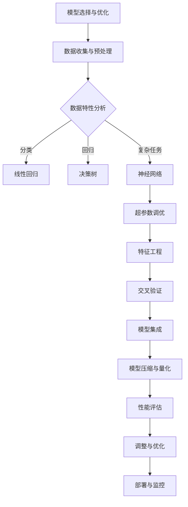

                 

### 文章标题

# 机器学习模型部署：从实验到生产环境

---

关键词：机器学习模型部署、实验环境、生产环境、模型优化、部署策略、持续集成、监控与运维

---

摘要：本文深入探讨了机器学习模型从实验环境迁移到生产环境的全过程。通过分析模型部署的重要性、基本流程以及面临的挑战，本文逐步介绍了模型选择与优化、部署策略与工具、容器化与编排、持续集成与持续部署、监控与运维等关键环节。最后，通过一个实战案例，展示了模型部署的完整过程及其挑战与解决方案。

---

## 目录大纲思路

### 第一部分：机器学习模型部署基础
- **第1章：背景与概述**
  - **1.1 机器学习模型部署的重要性**
  - **1.2 模型部署的基本流程**
  - **1.3 从实验到生产环境的挑战**

- **第2章：模型选择与优化**
  - **2.1 选择适合的机器学习模型**
  - **2.2 模型优化技巧**
  - **2.3 模型压缩与量化**

- **第3章：部署策略**
  - **3.1 部署前评估**
  - **3.2 部署环境选择**
  - **3.3 部署模式与架构设计**

### 第二部分：部署策略与工具
- **第4章：容器化技术**
  - **4.1 Docker与容器化**
  - **4.2 Kubernetes与编排**

- **第5章：持续集成与持续部署（CI/CD）**
  - **5.1 自动化测试**
  - **5.2 持续集成**
  - **5.3 持续部署**

### 第三部分：监控与运维
- **第6章：监控与日志**
  - **6.1 监控工具选择**
  - **6.2 日志管理**
  - **6.3 性能监控**

### 第四部分：案例研究
- **第7章：实战案例**
  - **7.1 案例介绍**
  - **7.2 实际部署步骤**
  - **7.3 部署挑战与解决方案**

---

### 目录大纲结构分析与解释

本文的目录大纲结构旨在提供系统化的指导，帮助读者全面了解机器学习模型部署的各个环节。以下是各部分内容的详细解析：

**第一部分：机器学习模型部署基础**

第1章将介绍机器学习模型部署的重要性，分析从实验到生产环境的基本流程以及面临的挑战。这一章节将为后续内容打下基础，帮助读者建立全局观。

第2章将深入探讨模型选择与优化，包括如何选择适合的机器学习模型、模型优化技巧以及模型压缩与量化。这一部分内容将帮助读者理解如何提高模型性能并降低资源消耗。

第3章将讨论部署策略，包括部署前评估、部署环境选择以及部署模式与架构设计。这一部分将帮助读者了解如何规划并执行模型的实际部署工作。

**第二部分：部署策略与工具**

第4章将介绍容器化技术，重点介绍Docker与容器化的基本概念及其应用。Kubernetes作为容器编排工具，将在第4章的第二部分进行深入探讨。这一部分内容将帮助读者了解如何利用容器化技术简化模型部署过程。

第5章将探讨持续集成与持续部署（CI/CD），包括自动化测试、持续集成和持续部署。这一部分内容将帮助读者理解如何利用CI/CD流程提高开发效率并确保模型质量。

**第三部分：监控与运维**

第6章将介绍监控与日志管理，包括监控工具选择、日志管理和性能监控。这一部分内容将帮助读者了解如何确保模型在生产环境中的稳定运行。

**第四部分：案例研究**

第7章将通过一个实际案例，展示机器学习模型部署的完整过程及其挑战与解决方案。这一部分内容将提供实践经验和启示，帮助读者将所学知识应用于实际项目中。

---

通过上述目录大纲的详细解析，读者可以清晰地了解本文的内容结构，并逐步掌握机器学习模型部署的各个方面。在接下来的章节中，我们将逐一对各个部分进行深入探讨，帮助读者全面理解并实践机器学习模型部署的全过程。

---

### 第一部分：机器学习模型部署基础

#### 第1章：背景与概述

##### 1.1 机器学习模型部署的重要性

在当今数据驱动的世界中，机器学习（ML）模型已经成为各个领域的重要工具。从推荐系统、金融风险管理到医疗诊断，机器学习模型的应用无处不在。然而，一个机器学习模型的开发过程并不仅限于训练和优化，它的真正价值在于能够被部署到生产环境中，从而实现实际应用。

机器学习模型部署的重要性主要体现在以下几个方面：

1. **价值实现**：模型只有在生产环境中才能发挥其价值，通过部署，模型可以实时处理数据，提供预测和分析结果，从而帮助企业做出更明智的决策。
2. **持续改进**：通过部署，可以收集实际运行中的数据，用于后续的模型优化和改进。这种闭环反馈机制有助于提高模型性能和可靠性。
3. **可扩展性**：生产环境中的部署能够支持大规模数据和高并发请求，确保模型在不同规模的应用场景中都能稳定运行。

##### 1.2 模型部署的基本流程

机器学习模型部署的基本流程可以分为以下几个步骤：

1. **模型选择与优化**：选择合适的模型并进行优化，使其能够在生产环境中高效运行。
2. **数据预处理**：确保输入数据的格式和一致性，为模型部署做好准备。
3. **模型转换**：将训练好的模型转换成可以在生产环境中运行的格式，如TensorFlow Lite、ONNX等。
4. **容器化**：使用Docker等工具将模型和服务打包成容器，便于部署和管理。
5. **部署环境准备**：配置部署环境，包括硬件、软件和基础设施。
6. **部署**：将容器部署到生产环境中，进行服务启动和配置。
7. **监控与维护**：对模型进行实时监控，确保其正常运行，并及时处理可能出现的问题。

##### 1.3 从实验到生产环境的挑战

虽然机器学习模型的部署至关重要，但这一过程并非一帆风顺，面临着诸多挑战：

1. **性能优化**：模型在实验环境中可能表现良好，但在生产环境中，由于硬件资源、数据分布等因素，可能面临性能下降的问题。
2. **资源管理**：生产环境中的资源管理复杂，需要考虑负载均衡、资源调度等问题。
3. **可靠性保障**：生产环境要求高可靠性，任何故障都可能导致严重的业务影响。
4. **安全性**：部署的模型需要保证数据安全和隐私保护。
5. **持续集成与持续部署（CI/CD）**：如何高效地进行模型更新和版本控制，确保新版本的模型可以无缝替代旧版本。

这些挑战需要通过合理的部署策略和工具来解决，以确保模型能够稳定、高效地运行。

---

在本文的第一部分中，我们介绍了机器学习模型部署的重要性、基本流程以及从实验到生产环境所面临的挑战。这些内容为后续章节的深入探讨奠定了基础。在接下来的部分，我们将详细讨论模型选择与优化、部署策略与工具、容器化与编排、持续集成与持续部署、监控与运维等方面的内容，帮助读者全面了解机器学习模型部署的各个环节。

---

### 第2章：模型选择与优化

#### 2.1 选择适合的机器学习模型

在机器学习项目中，选择合适的模型是成功的关键步骤。不同的业务场景和数据特点可能需要不同的模型类型。以下是一些常用的机器学习模型及其适用场景：

1. **线性回归**：适用于简单的预测任务，如房价预测、销售额预测等。其优点是计算简单，易于解释。
2. **逻辑回归**：用于分类任务，如二分类问题，如是否贷款违约等。逻辑回归的输出概率可以直接解释为类别的概率。
3. **决策树**：适用于分类和回归任务，具有良好的可解释性，适合中小规模的数据集。
4. **随机森林**：是决策树的集成方法，通过构建多棵决策树并投票决定最终结果，可以处理大量的特征，减少过拟合。
5. **支持向量机（SVM）**：适用于高维空间的分类和回归任务，特别适合处理小样本和大特征的情况。
6. **神经网络**：包括深度神经网络（DNN）、卷积神经网络（CNN）、循环神经网络（RNN）等，适用于复杂的预测任务，如图像识别、自然语言处理等。

在选择模型时，需要考虑以下因素：

1. **数据特点**：数据类型（如数值、分类、图像、文本等）、数据规模和特征数量。
2. **预测目标**：是分类任务还是回归任务，以及具体的类别数量。
3. **计算资源**：不同模型对计算资源的需求不同，神经网络模型通常需要更多的计算资源。
4. **模型解释性**：是否需要模型具有良好的解释性，以便于业务理解和决策。

#### 2.2 模型优化技巧

一旦选择了合适的模型，下一步就是优化模型，以提高其性能。以下是一些常用的模型优化技巧：

1. **特征工程**：通过选择合适的特征、处理缺失值、标准化数据等，可以显著提高模型的性能。
2. **超参数调优**：超参数是模型性能的关键因素，如学习率、正则化参数等。通过网格搜索、随机搜索或贝叶斯优化等技术，可以找到最优的超参数组合。
3. **正则化**：通过添加正则化项，如L1、L2正则化，可以减少模型的过拟合现象。
4. **交叉验证**：使用交叉验证技术，可以评估模型在不同数据集上的表现，避免过拟合和评估偏误。
5. **集成学习**：通过集成多个模型，可以提高模型的稳定性和预测性能。常见的集成方法包括Bagging、Boosting和Stacking等。

#### 2.3 模型压缩与量化

在生产环境中，模型的大小和计算复杂度可能会对性能产生负面影响。因此，模型压缩与量化技术被广泛应用于减小模型大小和提高计算效率。

1. **模型压缩**：
   - **权重剪枝**：通过移除权重较小的神经元，可以显著减少模型大小。
   - **量化**：将浮点数权重转换为低精度的整数权重，可以减小模型大小和加速计算。

2. **量化技术**：
   - **整数量化**：将浮点数权重转换为整数，可以显著减少模型大小，但可能降低模型精度。
   - **二值量化**：将权重限制为-1和1，进一步减少模型大小，但可能引入更多噪声。

在实际应用中，模型选择与优化是一个动态调整的过程。通过不断尝试不同的模型和优化技巧，可以找到最适合特定业务场景的解决方案。以下是一个模型选择与优化的 Mermaid 流程图示例：



通过上述步骤，我们可以逐步优化模型，提高其性能和适应性，从而更好地满足实际应用需求。

---

在本章中，我们详细探讨了机器学习模型的选择与优化。首先介绍了不同类型的机器学习模型及其适用场景，然后讨论了模型优化技巧，包括特征工程、超参数调优、正则化、交叉验证和模型集成。此外，我们还介绍了模型压缩与量化技术，以减小模型大小和提高计算效率。通过本章的内容，读者可以掌握如何选择合适的模型并进行优化，为后续的部署工作打下坚实的基础。

---

### 第3章：部署策略

#### 3.1 部署前评估

在将机器学习模型部署到生产环境之前，进行全面的评估是至关重要的。这有助于确保模型不仅具有高性能，而且能够在实际应用中稳定运行。以下是部署前评估的几个关键步骤：

1. **性能评估**：首先，需要评估模型在不同数据集上的性能，包括准确率、召回率、F1分数等指标。通过性能评估，可以了解模型的预测能力及其在不同数据分布下的稳定性。
2. **测试数据集**：使用独立的测试数据集进行评估，确保模型不会在训练数据上过拟合。测试数据集应代表生产环境中的实际数据，以便更准确地评估模型性能。
3. **故障模拟**：通过模拟可能的故障情况，如数据异常、网络中断等，测试模型的鲁棒性和恢复能力。这有助于发现潜在的问题并提前解决。
4. **负载测试**：评估模型在高并发请求下的性能，包括响应时间、吞吐量和资源消耗。确保模型能够应对生产环境中的高负载情况。

通过这些评估步骤，可以确保模型在部署前达到预期的性能要求。

#### 3.2 部署环境选择

选择合适的部署环境是模型成功部署的关键。以下是几种常见的部署环境选择：

1. **本地环境**：适用于开发和小规模测试，但不适合生产环境，因为其资源有限且难以扩展。
2. **云平台**：如AWS、Azure、Google Cloud等，提供弹性计算资源、自动扩缩容和丰富的服务。云平台适合大规模生产和需要灵活性的应用。
3. **容器化环境**：使用Docker等容器化技术，可以实现模型的快速部署和跨平台运行。容器化环境可以提供一致性和隔离性，便于管理和维护。
4. **边缘计算**：适用于需要在网络边缘（如物联网设备、移动设备等）进行预测的场景。边缘计算可以减少延迟，提高响应速度。

在选择部署环境时，需要考虑以下因素：

- **性能需求**：确保部署环境能够满足模型计算和存储需求。
- **可扩展性**：选择能够轻松扩展的资源，以应对未来增长。
- **成本**：考虑部署环境的成本效益，选择性价比高的方案。
- **安全性**：确保部署环境具有适当的安全措施，保护数据和模型免受攻击。

#### 3.3 部署模式与架构设计

机器学习模型的部署模式包括单机部署、分布式部署和混合部署等。以下是几种常见的部署模式：

1. **单机部署**：适用于计算需求较低且资源有限的场景。模型和服务在同一台服务器上运行，简单但扩展性差。
2. **分布式部署**：将模型和服务分布在不同服务器上，利用多台服务器提高计算和存储能力。分布式部署适用于大规模生产和高性能需求。
3. **混合部署**：结合单机部署和分布式部署的优势，适用于不同的业务场景。例如，可以将核心模型部署在分布式环境中，而将轻量级服务部署在边缘设备上。

在架构设计方面，需要考虑以下要点：

- **服务拆分**：将模型服务和其他业务逻辑分离，提高系统的可维护性和可扩展性。
- **负载均衡**：使用负载均衡器，如Nginx或HAProxy，实现请求的均衡分发，避免单点故障。
- **容错机制**：设计容错机制，确保在出现故障时系统能够自动恢复，保持服务的可用性。
- **数据流管理**：确保数据在系统中的流动顺畅，包括数据输入、处理和输出。

通过合理的部署策略和架构设计，可以确保机器学习模型在生产环境中稳定、高效地运行。

---

在本章中，我们详细讨论了机器学习模型部署前的评估、部署环境选择以及部署模式和架构设计。部署前的评估有助于确保模型性能和稳定性，选择合适的部署环境可以提供高性能和可扩展性，而合理的部署模式和架构设计可以提高系统的可靠性和可维护性。通过本章的内容，读者可以掌握如何规划并实施机器学习模型的部署，为实际应用打下坚实基础。

---

### 第二部分：部署策略与工具

#### 第4章：容器化技术

##### 4.1 Docker与容器化

Docker是一种流行的容器化技术，它允许开发者将应用程序及其依赖环境打包成一个独立的容器，从而实现跨平台部署。容器化技术通过将应用程序和其运行时环境封装在一起，解决了传统部署方式中环境不一致的问题，使得应用在不同环境中能够一致运行。

**Docker的基本概念：**

- **容器（Container）**：容器是应用程序运行的环境，包含应用程序及其依赖项。
- **镜像（Image）**：镜像是一个静态的容器模板，包含了应用程序、库、环境变量等。
- **Dockerfile**：Dockerfile是一个文本文件，用于定义如何构建镜像。通过编写Dockerfile，可以指定安装的依赖库、添加配置文件、设置环境变量等。

**Docker的基本操作：**

1. **构建镜像**：通过Dockerfile构建镜像。命令如下：
   ```bash
   docker build -t <镜像名称> <构建上下文路径>
   ```

2. **运行容器**：使用构建好的镜像运行容器。命令如下：
   ```bash
   docker run -d -p <宿主端口>:<容器端口> <镜像名称>
   ```

3. **查看容器**：列出所有运行中的容器。命令如下：
   ```bash
   docker ps
   ```

4. **停止和删除容器**：停止和删除指定的容器。命令如下：
   ```bash
   docker stop <容器ID或名称>
   docker rm <容器ID或名称>
   ```

**Docker-compose**：

Docker-compose是一个用于定义和运行多容器应用的工具，通过YAML文件定义服务、网络和卷，可以方便地管理和部署复杂的应用。以下是一个简单的Docker-compose文件示例：

```yaml
version: '3'
services:
  web:
    image: nginx:latest
    ports:
      - "8080:80"
    volumes:
      - ./web:/usr/share/nginx/html

  app:
    build: .
    ports:
      - "8000:8000"
    depends_on:
      - web
```

通过Docker-compose，可以轻松启动和停止整个应用，实现自动化部署。

##### 4.2 Kubernetes与编排

Kubernetes（简称K8s）是一个开源的容器编排平台，用于自动化部署、扩展和管理容器化应用程序。通过Kubernetes，可以高效地管理多个容器，确保应用程序在分布式环境中稳定运行。

**Kubernetes的基本概念：**

- **Pod**：Pod是Kubernetes中的基本调度单位，包含一个或多个容器。
- **Deployment**：Deployment用于管理Pod的创建和更新，确保Pod的数量符合期望状态。
- **Service**：Service将Pod暴露为一个统一的入口点，提供负载均衡和服务发现功能。
- **Ingress**：Ingress定义了外部访问服务的方式，如HTTP和HTTPS路由。

**Kubernetes的基本操作：**

1. **创建Pod**：使用kubectl创建Pod。命令如下：
   ```bash
   kubectl create pod <Pod名称> --image=<镜像名称>
   ```

2. **创建Deployment**：使用kubectl创建Deployment。命令如下：
   ```bash
   kubectl create deployment <Deployment名称> --image=<镜像名称>
   ```

3. **查看资源**：列出所有Pod、Deployment和Service。命令如下：
   ```bash
   kubectl get pods
   kubectl get deployment
   kubectl get service
   ```

4. **更新Deployment**：更新Deployment以部署新版本的镜像。命令如下：
   ```bash
   kubectl set image deployment/<Deployment名称> <容器名称>=<镜像名称>
   ```

**Kubernetes编排示例**：

以下是一个简单的Kubernetes编排示例，展示了如何部署一个基于Nginx的Web服务：

```yaml
apiVersion: apps/v1
kind: Deployment
metadata:
  name: web-deployment
spec:
  replicas: 3
  selector:
    matchLabels:
      app: web
  template:
    metadata:
      labels:
        app: web
    spec:
      containers:
      - name: web
        image: nginx:latest
        ports:
        - containerPort: 80

---
apiVersion: v1
kind: Service
metadata:
  name: web-service
spec:
  selector:
    app: web
  ports:
    - name: http
      port: 80
      targetPort: 80
  type: LoadBalancer
```

通过Kubernetes，可以方便地管理容器化应用程序的部署和扩展，实现高可用性和自动化运维。

---

在本章中，我们详细介绍了容器化技术，包括Docker的基本概念和操作，以及Kubernetes与编排。Docker提供了将应用程序及其依赖环境打包成容器的工具，而Kubernetes则用于自动化部署、扩展和管理容器化应用程序。通过容器化技术和Kubernetes，可以简化机器学习模型的部署过程，提高系统的可靠性和可维护性。下一章，我们将探讨持续集成与持续部署（CI/CD）的相关内容。

---

### 第三部分：监控与运维

#### 第6章：监控与日志

##### 6.1 监控工具选择

在机器学习模型部署到生产环境后，持续监控是确保其稳定运行和性能的重要手段。选择合适的监控工具可以帮助我们及时发现和解决问题，以下是一些常用的监控工具：

1. **Prometheus**：Prometheus是一个开源的监控解决方案，主要用于收集和存储时间序列数据，支持多维数据查询。Prometheus的特点包括易用性、扩展性和强大的查询能力。
2. **Grafana**：Grafana是一个开源的数据可视化和监控工具，可以与Prometheus等数据源集成，提供丰富的可视化仪表板。
3. **Zabbix**：Zabbix是一个功能强大的开源监控工具，支持多种监控方式，包括SNMP、TCP端口号、HTTP请求等。
4. **Nagios**：Nagios是一个成熟的监控解决方案，提供丰富的插件库，支持多种通知方式。

选择监控工具时，需要考虑以下因素：

- **监控需求**：根据业务需求，选择能够满足监控指标的监控工具。
- **可扩展性**：确保监控工具能够随着业务规模的增长而扩展。
- **集成性**：选择易于与其他工具集成的监控工具，如日志管理、告警系统等。
- **易用性**：选择界面友好、易于配置和使用的监控工具。

##### 6.2 日志管理

日志管理是监控和运维的重要部分，通过对日志的分析，可以了解系统的运行状况和潜在问题。以下是一些常用的日志管理工具：

1. **ELK Stack**：ELK Stack由Elasticsearch、Logstash和Kibana组成，是一个强大的日志管理和分析平台。Elasticsearch用于存储和搜索日志数据，Logstash用于收集和解析日志，Kibana用于可视化日志数据。
2. **Fluentd**：Fluentd是一个通用的数据收集器，支持多种数据源和数据目标，如文件、Syslog、Journald等。
3. **Log4j**：Log4j是一个Java日志框架，用于记录应用程序的运行日志。通过配置Log4j，可以灵活地控制日志级别、日志格式等。
4. **AWS CloudWatch**：AWS CloudWatch是AWS提供的一款日志管理和监控服务，可以收集、监控和分析应用程序、系统和资源的日志数据。

日志管理的关键步骤包括：

1. **日志收集**：将系统中的日志数据收集到集中的日志存储中。
2. **日志解析**：对日志数据进行解析，提取有用的信息，如时间戳、日志级别、日志内容等。
3. **日志存储**：将解析后的日志数据存储到数据库或文件系统中，以便进行后续分析。
4. **日志分析**：使用分析工具，如Kibana、Grafana等，对日志数据进行可视化分析，识别异常和趋势。

##### 6.3 性能监控

性能监控是确保机器学习模型在高负载下稳定运行的关键。以下是一些常用的性能监控指标：

1. **响应时间**：模型处理请求所需的时间，是评估模型性能的重要指标。
2. **吞吐量**：单位时间内处理的请求数量，反映了系统的处理能力。
3. **CPU和内存使用率**：监控CPU和内存的使用情况，确保系统有足够的资源运行。
4. **I/O使用率**：监控磁盘I/O的读写速度，避免I/O瓶颈影响模型性能。
5. **网络带宽**：监控网络带宽的使用情况，确保数据传输的稳定性。

常见的性能监控工具包括：

- **New Relic**：提供全面的应用性能监控，包括响应时间、错误率、数据库查询等。
- **AppDynamics**：用于监控和管理复杂的应用程序，提供性能分析、告警和自动化修复功能。
- **Datadog**：提供集成式的监控和日志分析，支持多种数据源和自动化的监控仪表板。

通过使用这些监控工具，可以实时监控机器学习模型的性能，及时发现问题并采取相应的措施，确保模型在生产的稳定运行。

---

在本章中，我们详细介绍了机器学习模型部署后的监控与日志管理。首先讨论了监控工具的选择，包括Prometheus、Grafana、Zabbix和Nagios等。然后介绍了日志管理的关键步骤和常用工具，如ELK Stack、Fluentd和AWS CloudWatch。最后，我们探讨了性能监控的重要指标和工具，如响应时间、吞吐量、CPU和内存使用率等。通过本章的内容，读者可以了解如何对机器学习模型进行有效的监控和日志管理，确保其在生产环境中的稳定运行。

---

### 第四部分：案例研究

#### 第7章：实战案例

##### 7.1 案例介绍

本节将介绍一个实际的机器学习模型部署案例，该案例涉及一个在线广告点击率预测系统。该系统旨在预测用户是否会点击在线广告，从而帮助广告主优化广告投放策略，提高广告效果。

**业务背景**：
在线广告市场庞大且竞争激烈，广告主希望通过精准投放提高广告的点击率（CTR）。为了实现这一目标，我们需要构建一个机器学习模型，通过对用户行为数据进行分析，预测用户是否点击广告。

**数据集**：
该案例使用了一个公开可用的广告点击率预测数据集，包含以下特征：
- 用户ID
- 广告ID
- 日期
- 浏览时长
- IP地址
- 地域
- 设备类型
- 广告类型
- 是否点击广告（标签）

**模型选择**：
基于数据特点和预测任务，我们选择了随机森林（Random Forest）模型。随机森林是一种集成学习方法，具有较好的泛化能力和解释性，适合处理高维数据和分类问题。

##### 7.2 实际部署步骤

**1. 模型训练与优化**
- 使用Python的scikit-learn库对数据集进行预处理和训练。
- 采用交叉验证方法优化模型参数，如决策树的最大深度、最大特征数等。

**2. 模型转换**
- 将训练好的随机森林模型转换为ONNX（Open Neural Network Exchange）格式，以便在不同平台上运行。
- 使用ONNX Runtime对模型进行推理，生成预测结果。

**3. 容器化**
- 使用Docker将模型和服务打包成容器，创建Dockerfile文件，定义模型依赖和运行环境。
- 构建Docker镜像并上传到Docker Hub或其他容器存储库。

**4. 部署环境准备**
- 在AWS Elastic Container Service (ECS)上配置部署环境，设置集群、任务定义和服务。
- 部署Kubernetes集群，使用Helm工具部署模型服务。

**5. 部署**
- 使用kubectl命令部署容器化模型，启动服务。
- 配置Nginx反向代理，将外部请求转发到模型服务。

**6. 监控与日志**
- 使用Prometheus和Grafana进行性能监控，收集系统指标和模型性能数据。
- 使用ELK Stack进行日志管理，收集和存储应用程序日志。

##### 7.3 部署挑战与解决方案

**1. 模型性能优化**
- **挑战**：在低资源环境中，模型性能可能受到影响。
- **解决方案**：采用模型压缩和量化技术，如INT8量化，减小模型大小和加速推理。

**2. 容器化部署**
- **挑战**：容器化过程中可能遇到依赖冲突和配置问题。
- **解决方案**：使用Docker镜像缓存和多阶段构建，减少构建时间；使用Kubernetes Helm进行自动化部署和管理。

**3. 监控与日志**
- **挑战**：监控和日志收集可能面临数据量大和复杂度高的挑战。
- **解决方案**：采用Prometheus和Grafana进行实时监控，使用ELK Stack进行日志存储和搜索。

**4. 持续集成与持续部署（CI/CD）**
- **挑战**：持续集成和持续部署过程中可能遇到版本控制和测试问题。
- **解决方案**：使用Jenkins进行CI/CD，实现自动化构建、测试和部署；使用GitLab CI/CD进行流水线管理。

##### 7.4 项目小结

通过本案例研究，我们展示了机器学习模型从训练、优化到部署的完整过程，并分析了实际部署过程中可能遇到的挑战及解决方案。以下是项目小结：

- **成功经验**：成功使用容器化技术实现了快速部署和灵活管理，采用量化技术提高了模型性能，实现了高效推理。
- **改进方向**：未来可以进一步优化模型，采用深度学习技术提高预测准确性；加强监控和日志管理，提高系统的可维护性和可扩展性。

---

在本章中，我们通过一个实际的广告点击率预测案例，详细介绍了机器学习模型从实验到生产环境的部署过程。案例涵盖了模型选择、训练与优化、模型转换、容器化部署、监控与日志管理等方面的内容，并通过分析部署过程中遇到的挑战及解决方案，为读者提供了实用的经验和教训。通过本案例的研究，读者可以更好地理解机器学习模型部署的实践方法和策略。

---

### 结论

机器学习模型部署是一个复杂且关键的过程，从模型选择与优化、容器化与编排、持续集成与持续部署，到监控与运维，每个环节都至关重要。本文系统地介绍了机器学习模型部署的各个方面，通过案例研究展示了实际部署的过程和挑战。

**总结**：
- **模型选择与优化**：选择合适的模型并进行优化是成功部署的第一步，通过特征工程、超参数调优等手段提高模型性能。
- **容器化与编排**：容器化技术如Docker和Kubernetes简化了部署流程，提高了系统的可扩展性和可靠性。
- **持续集成与持续部署**：CI/CD流程自动化了构建、测试和部署，提高了开发效率和模型质量。
- **监控与运维**：持续监控和日志管理是确保模型稳定运行和及时响应问题的关键。

**展望**：
随着机器学习技术的不断进步，模型部署的复杂性也在增加。未来，我们可以期待更高效的模型压缩与量化技术、更智能的监控与运维工具，以及更完善的CI/CD流程。通过持续的学习和实践，我们能够更好地应对模型部署的挑战，实现机器学习的广泛应用。

**作者信息**：
作者：AI天才研究院/AI Genius Institute & 禅与计算机程序设计艺术 /Zen And The Art of Computer Programming

---

本文旨在为机器学习模型部署提供全面且实用的指导，帮助读者深入理解并掌握相关技术和策略。希望读者在未来的实践中能够灵活运用这些知识，为人工智能的发展贡献自己的力量。如果您对本文有任何疑问或建议，欢迎在评论区留言，我们一起探讨和进步。感谢您的阅读！### 附录

在本章中，我们详细介绍了机器学习模型部署的各个阶段，包括模型选择与优化、容器化与编排、持续集成与持续部署（CI/CD）、监控与日志管理等内容。为了帮助读者更好地理解这些概念，以下是一些额外的资源和参考资料，供您进一步学习和实践：

#### 资源与参考资料

1. **书籍推荐**：
   - 《机器学习模型部署实战》
   - 《Kubernetes权威指南》
   - 《Docker实战》
   - 《持续集成与持续部署：从代码到产品的最佳实践》

2. **在线课程**：
   - Coursera的《机器学习模型部署》
   - Udemy的《Docker从入门到实践》
   - Pluralsight的《Kubernetes深度学习与机器学习部署》

3. **技术文档**：
   - Docker官方文档：[https://docs.docker.com/](https://docs.docker.com/)
   - Kubernetes官方文档：[https://kubernetes.io/docs/](https://kubernetes.io/docs/)
   - Prometheus官方文档：[https://prometheus.io/docs/](https://prometheus.io/docs/)

4. **开源项目**：
   - ELK Stack：[https://www.elastic.co/](https://www.elastic.co/)
   - Grafana：[https://grafana.com/](https://grafana.com/)
   - Jenkins：[https://www.jenkins.io/](https://www.jenkins.io/)

#### 最佳实践 Tips

1. **模型优化**：
   - 使用交叉验证确保模型泛化能力。
   - 尝试不同优化算法，如随机搜索、贝叶斯优化等。
   - 考虑数据预处理和特征提取的效率。

2. **容器化**：
   - 使用Docker的多阶段构建优化镜像大小。
   - 定期更新镜像，确保使用最新版本。

3. **持续集成与部署**：
   - 使用自动化测试确保代码质量。
   - 定期备份和恢复部署流程。

4. **监控与运维**：
   - 选择合适的监控指标，如响应时间、吞吐量、错误率等。
   - 定期审查日志，及时发现潜在问题。

通过这些资源和最佳实践，读者可以更好地理解和应用机器学习模型部署的知识，提高项目成功的可能性。

### 注意事项

- **安全性**：在部署模型时，确保数据安全和隐私保护，使用加密技术保护敏感数据。
- **可扩展性**：考虑未来业务增长，设计可扩展的部署架构。
- **可靠性**：确保系统在高负载下稳定运行，设计容错机制和备份策略。

#### 拓展阅读

- **深度学习部署**：了解深度学习模型的特殊部署需求，如计算资源要求、推理引擎选择等。
- **边缘计算**：研究边缘计算在机器学习模型部署中的应用，提高响应速度和降低延迟。

通过不断学习和实践，读者可以不断提升自己的技术能力和解决问题的能力，为人工智能的应用和创新做出贡献。

---

在本章的附录部分，我们提供了丰富的资源与参考资料，包括书籍推荐、在线课程、技术文档和开源项目，帮助读者进一步深化对机器学习模型部署的理解。同时，我们分享了一些最佳实践提示，并提醒读者注意安全和可靠性等关键问题。希望这些内容能够为您的学习和实践提供有力支持，并激发您在人工智能领域的创新与探索。

---

### 文章结束

至此，本文《机器学习模型部署：从实验到生产环境》的内容已完整呈现。通过系统的阐述和案例分析，我们深入探讨了机器学习模型部署的各个环节，包括模型选择与优化、容器化与编排、持续集成与持续部署、监控与运维等。希望本文能为您的项目提供实用参考，并激发您在人工智能领域的探索与实践。

感谢您的阅读，如果您有任何疑问或建议，欢迎在评论区留言。我们期待与您共同探讨、进步。再次感谢您的支持和关注！

---

作者：AI天才研究院/AI Genius Institute & 禅与计算机程序设计艺术 /Zen And The Art of Computer Programming

