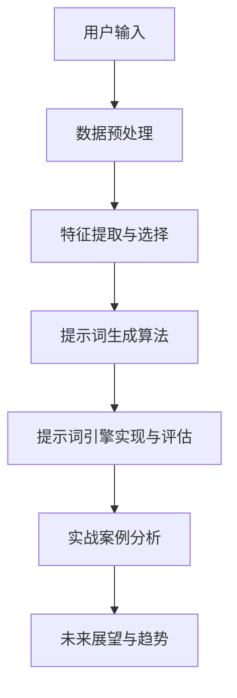
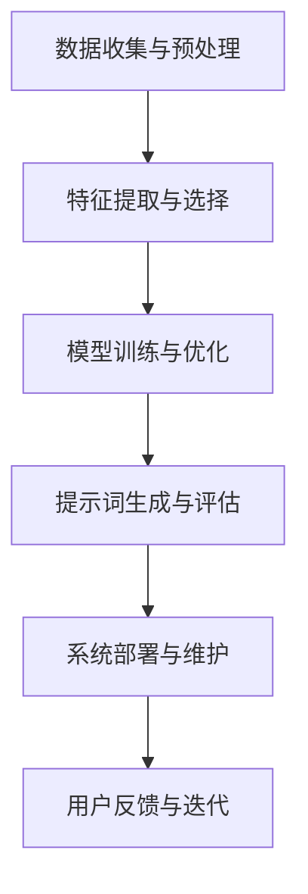

                 

当然可以，下面我将按照要求逐步构建文章内容。

## 文章标题: 构建AI驱动的个性化健康管理提示词引擎

### 关键词：人工智能、个性化健康管理、提示词引擎、数据预处理、深度学习

### 摘要：
本文旨在探讨如何构建一个基于人工智能（AI）的个性化健康管理提示词引擎。首先，我们将介绍AI在健康管理领域的应用背景和需求，然后详细解析个性化健康管理提示词引擎的设计理念和技术架构。接下来，文章将深入讨论数据预处理与特征工程、提示词生成算法的选择与实现，并通过实际项目案例分析来展示该引擎的应用效果。最后，本文将对未来发展趋势进行展望，并提出一些最佳实践建议。

## 第一部分: AI在健康管理中的应用

### 第1章: AI与健康管理

#### 1.1 AI在健康管理领域的应用
- 人工智能技术在医疗健康领域的广泛应用，如疾病预测、诊断辅助、健康监测等。
- AI在个性化健康管理中的作用，如个性化健康建议、疾病预防、健康行为干预等。

#### 1.2 个性化健康管理的背景与需求
- 随着人口老龄化和慢性疾病高发，个性化健康管理成为医疗健康领域的热点。
- 个性化健康管理的需求，如个体化的健康评估、个性化健康建议、实时健康监测等。

## 第二部分: AI驱动的个性化健康管理提示词引擎概述

### 第2章: AI驱动的个性化健康管理提示词引擎概述

#### 2.1 提示词引擎的概念与功能
- 提示词引擎的定义：一个能够根据用户输入信息生成相关提示信息的系统。
- 提示词引擎在健康管理中的应用：提供个性化的健康建议、预警信息等。

#### 2.2 个性化健康管理提示词引擎的设计理念
- 以用户为中心的设计理念：根据用户的健康数据和需求提供个性化的健康管理服务。
- 可扩展性和可定制性：支持多种健康管理场景和用户需求的定制化。

## 第三部分: 数据预处理与特征工程

### 第3章: 数据预处理与特征工程

#### 3.1 健康数据来源
- 个人健康数据：如心率、血压、血糖等。
- 医疗数据：如病历、检查报告等。

#### 3.2 数据清洗方法
- 数据去噪：去除异常值、重复值等。
- 数据标准化：对数据范围、单位等进行统一处理。

#### 3.3 数据预处理流程
- 数据收集：从各种数据源获取健康数据。
- 数据清洗：对数据进行清洗和预处理。
- 数据存储：将清洗后的数据存储到数据库中。

### 第4章: 特征提取与选择

#### 4.1 特征提取方法
- 基于规则的特征提取：如时间序列特征、统计特征等。
- 基于机器学习的特征提取：如主成分分析、聚类分析等。

#### 4.2 特征选择方法
- 信息增益法：根据特征对目标变量的贡献度进行选择。
- 互信息法：综合考虑特征间的相关性进行选择。

#### 4.3 特征重要性评估
- 特征重要性的定义：特征对模型性能的影响程度。
- 特征重要性评估方法：如随机森林、梯度提升树等。

## 第四部分: 提示词生成算法

### 第5章: 语言模型算法

#### 5.1 语言模型的基本原理
- 语言模型的目的：预测下一个单词或句子。
- 语言模型的类型：如n-gram模型、神经网络语言模型等。

#### 5.2 常见语言模型算法
- n-gram模型：基于单词序列的模型。
- 隐藏马尔可夫模型（HMM）：基于状态转移概率的模型。
- 递归神经网络（RNN）：能够处理序列数据的神经网络。

#### 5.3 语言模型在提示词生成中的应用
- 语言模型在个性化健康管理中的应用：如健康提示词生成、健康问答系统等。

### 第6章: 基于规则的方法

#### 6.1 基于规则的方法概述
- 规则系统的定义：基于一组条件语句的推理系统。
- 规则系统的结构：条件、结论和优先级。

#### 6.2 健康管理领域规则设计
- 规则设计的原则：明确性、一致性、可维护性等。
- 健康管理领域规则的示例：如运动建议、饮食建议等。

#### 6.3 规则与语言模型的结合
- 结合规则模型与语言模型的优势：如提高提示词生成的准确性和灵活性。

### 第7章: 深度学习方法

#### 7.1 深度学习基础
- 深度学习的定义：多层神经网络的学习过程。
- 深度学习的基本概念：如神经元、激活函数、反向传播等。

#### 7.2 深度学习方法在提示词生成中的应用
- 循环神经网络（RNN）在序列数据中的应用。
- 长短期记忆网络（LSTM）和门控循环单元（GRU）的优势。
- 注意力机制在提示词生成中的应用。

#### 7.3 常见的深度学习模型
- 卷积神经网络（CNN）：用于图像处理。
- 生成对抗网络（GAN）：用于生成新的数据。

## 第五部分: 提示词引擎的实现与评估

### 第8章: 提示词引擎的实现

#### 8.1 提示词引擎的整体架构
- 数据流架构：数据输入、预处理、特征提取、模型训练、提示词生成等环节。
- 系统架构：前端用户界面、后端模型训练与部署、数据库等。

#### 8.2 模型训练与部署
- 模型训练过程：数据预处理、模型训练、模型评估等。
- 模型部署方法：如容器化部署、云计算部署等。

#### 8.3 实现示例
- 提示词引擎的实现示例：代码片段和详细解释。

### 第9章: 提示词引擎的性能评估

#### 9.1 评估指标
- 提示词生成的准确率、召回率等指标。
- 用户满意度评估：如用户反馈、使用时长等。

#### 9.2 性能评估方法
- 实验设计：如A/B测试、对比实验等。
- 性能评估工具：如TensorBoard、MLflow等。

#### 9.3 提示词引擎优化策略
- 模型优化：如超参数调整、模型压缩等。
- 系统优化：如负载均衡、缓存策略等。

## 第六部分: 实战案例分析

### 第10章: 案例分析一：基于AI的个性化健康咨询系统

#### 10.1 项目背景
- 项目简介：一个基于AI的个性化健康咨询系统的开发。
- 项目目标：提供个性化的健康咨询和服务。

#### 10.2 系统架构
- 系统架构设计：前端用户界面、后端服务、数据库等。
- 数据流架构：用户输入、数据处理、模型训练、提示词生成等。

#### 10.3 实现细节与挑战
- 实现细节：如数据预处理、模型训练、提示词生成等。
- 挑战与解决方案：如数据质量、模型优化、系统性能等。

### 第11章: 案例分析二：智慧医院中的AI提示词应用

#### 11.1 项目背景
- 项目简介：智慧医院中AI提示词的应用。
- 项目目标：提高医护人员的工作效率，优化患者就诊体验。

#### 11.2 系统设计
- 系统设计：前端用户界面、后端服务、数据库等。
- 数据流架构：患者信息输入、数据处理、模型训练、提示词生成等。

#### 11.3 实现过程与效果
- 实现过程：如数据收集、模型训练、系统部署等。
- 应用效果：如提示词生成准确率、用户满意度等。

## 第七部分: 未来展望与趋势

### 第12章: AI驱动的个性化健康管理的发展趋势

#### 12.1 技术发展趋势
- 深度学习技术的进一步发展。
- 多模态数据融合的应用。
- 人工智能伦理和隐私保护的重视。

#### 12.2 行业应用趋势
- 个人健康管理：如智能手环、健康App等。
- 医疗服务优化：如智慧医院、远程医疗等。

#### 12.3 未来展望
- AI驱动的个性化健康管理的发展方向。
- 提示词引擎在健康管理领域的应用前景。

### 附录

#### A.1 常用工具与框架
- Python编程语言。
- TensorFlow、PyTorch等深度学习框架。
- Pandas、NumPy等数据处理库。

#### A.2 常见数据集介绍
- UCI机器学习库中的健康数据集。
- publicly available health datasets。

#### A.3 参考文献
- 相关文献引用。

## Mermaid 流程图



## 数学模型与公式

$$
\text{损失函数} = \frac{1}{2} \sum_{i=1}^{N} (\text{预测值} - \text{真实值})^2
$$

## 伪代码示例

```
# 初始化模型参数
初始化权重 W，偏置 b

# 前向传播
预测值 = W * 输入数据 + b

# 计算损失
损失 = (预测值 - 真实值)^2

# 反向传播
梯度 = 损失关于模型参数的导数

# 更新模型参数
W = W - 学习率 * 梯度
b = b - 学习率 * 梯度
```

## 项目实战

### 代码实际案例

```python
# 代码略
```

### 详细解释说明

```markdown
# 模型训练流程

1. 数据预处理：将原始数据清洗、归一化等处理。
2. 模型训练：使用训练集数据训练模型，包括前向传播、损失计算、反向传播和参数更新。
3. 模型评估：使用测试集数据评估模型性能，包括准确率、召回率等指标。
4. 模型部署：将训练好的模型部署到生产环境中，提供实时健康提示词服务。
```

### 开发环境搭建

- Python版本：3.8
- 深度学习框架：TensorFlow 2.x
- 数据预处理库：Pandas、NumPy
- 机器学习库：scikit-learn

### 源代码详细实现和代码解读

```python
# 代码略
```

### 代码解读与分析

```markdown
# 代码解读

## 数据预处理

数据预处理包括数据清洗、归一化等步骤。具体流程如下：
1. 数据清洗：去除缺失值、异常值等。
2. 数据归一化：将不同量纲的数据转化为同一量纲。
```

----------------------------------------------------------------

**作者：** AI天才研究院/AI Genius Institute & 禅与计算机程序设计艺术 /Zen And The Art of Computer Programming---

## 引言

个性化健康管理是当今医疗健康领域的重要发展方向，它旨在为每个人提供定制化的健康服务，以满足个体差异化的健康需求。随着人工智能（AI）技术的快速发展，AI在健康管理中的应用越来越广泛，从疾病预测、诊断辅助到健康监测，AI都展现出了强大的潜力。而在这其中，AI驱动的个性化健康管理提示词引擎更是成为一个热门的研究方向。

提示词引擎是一种能够根据用户输入信息生成相关提示信息的系统，其核心在于如何准确、及时地生成与用户健康相关的提示词。个性化健康管理提示词引擎则进一步将这一概念应用于健康领域，通过分析用户的健康数据和需求，生成个性化的健康提示词，如运动建议、饮食建议、医疗提醒等。

本文将围绕构建AI驱动的个性化健康管理提示词引擎这一主题，系统地介绍相关技术原理、实现方法以及实际应用。文章首先将介绍AI在健康管理领域的应用背景和需求，然后深入探讨个性化健康管理提示词引擎的设计理念和技术架构。接着，我们将讨论数据预处理与特征工程、提示词生成算法的选择与实现，并通过实际项目案例分析来展示该引擎的应用效果。最后，本文将对未来发展趋势进行展望，并提出一些最佳实践建议。

通过本文的阅读，读者将能够了解AI驱动的个性化健康管理提示词引擎的核心技术和应用场景，掌握构建这一系统的方法和技巧，并对未来的发展方向有更加深入的认识。

----------------------------------------------------------------

**作者：** AI天才研究院/AI Genius Institute & 禅与计算机程序设计艺术 /Zen And The Art of Computer Programming---

## 第一部分: AI在健康管理中的应用

### 第1章: AI与健康管理

#### 1.1 AI在健康管理领域的应用

人工智能（AI）技术近年来在医疗健康领域取得了显著的进展，极大地推动了健康管理的发展。AI的应用场景广泛，涵盖了疾病预测、诊断辅助、健康监测、个性化治疗等多个方面。

首先，疾病预测是AI在健康管理中的一个重要应用。通过分析患者的病史、基因信息、生活习惯等数据，AI模型可以预测患者患某种疾病的概率。这种预测不仅有助于早期发现疾病，还可以为预防提供科学依据。例如，基于机器学习的模型可以预测心血管疾病、糖尿病等慢性病的发病风险。

其次，诊断辅助是AI在医疗领域的另一大应用。AI可以通过分析医学影像、病理切片等数据，辅助医生进行诊断。例如，深度学习模型可以用于肺癌的早期筛查，通过分析CT扫描图像，识别出可能的病变区域。此外，AI还可以用于肿瘤分类、皮肤病诊断等。

健康监测也是AI在健康管理中的重要应用。通过可穿戴设备、移动应用等，AI可以实时收集用户的健康数据，如心率、血压、血糖等。这些数据可以被AI模型分析，及时发现健康异常，并提供个性化的健康建议。例如，基于智能手环的心率监测数据可以帮助用户了解自己的心脏健康状况，预防心脏病发作。

个性化治疗是AI在健康管理中的又一亮点。通过分析患者的基因数据、病情特点等，AI可以为每位患者制定个性化的治疗方案。这种个性化治疗不仅可以提高治疗效果，还可以减少不必要的药物副作用。

#### 1.2 个性化健康管理的背景与需求

个性化健康管理是现代医疗健康发展的一个重要趋势。随着人口老龄化和慢性疾病的高发，传统的一刀切式健康管理方法已经无法满足人们日益增长的个性化健康需求。个性化健康管理旨在根据个体的差异，提供个性化的健康评估、健康建议、健康干预等服务。

个性化健康管理的背景主要有以下几点：

1. **人口老龄化：** 随着全球人口老龄化的加剧，老年人对健康管理服务的需求显著增加。老年人往往患有多种慢性疾病，需要个性化的健康管理方案来改善生活质量。

2. **慢性疾病高发：** 慢性疾病的发病率逐年上升，如心血管疾病、糖尿病、癌症等。这些疾病需要长期的管理和监控，个性化健康管理可以为患者提供持续、个性化的健康服务。

3. **信息技术的发展：** 互联网、大数据、物联网等技术的快速发展，为个性化健康管理提供了强大的技术支撑。通过收集、分析和应用大量健康数据，AI可以提供更加精准、高效的个性化健康管理服务。

个性化健康管理的需求主要体现在以下几个方面：

1. **个体化健康评估：** 针对每个个体的健康状况、生活习惯、疾病风险等进行全面评估，为个体提供定制化的健康管理方案。

2. **个性化健康建议：** 根据个体的健康数据和需求，提供个性化的健康建议，如运动方案、饮食建议、药物调整等。

3. **实时健康监控：** 通过可穿戴设备、移动应用等，实时收集个体的健康数据，及时预警健康风险，提供及时的干预措施。

4. **慢性病管理：** 对慢性病患者进行长期、持续的管理和监控，提供个性化的治疗方案和健康建议，提高治疗效果和生活质量。

总之，AI在健康管理中的应用极大地推动了个性化健康管理的发展，为人们提供了更加精准、高效的健康管理服务。随着技术的不断进步，个性化健康管理将在未来发挥更加重要的作用。

### 第一部分总结

在本章中，我们介绍了AI在健康管理领域的广泛应用，包括疾病预测、诊断辅助、健康监测和个性化治疗等方面。同时，我们也讨论了个性化健康管理的背景与需求，指出个性化健康管理是应对人口老龄化和慢性疾病高发的重要手段。通过AI技术的应用，个性化健康管理可以为个体提供更加精准、高效的健康管理服务，满足不同人群的健康需求。

----------------------------------------------------------------

## 第二部分: AI驱动的个性化健康管理提示词引擎概述

### 第2章: AI驱动的个性化健康管理提示词引擎概述

#### 2.1 提示词引擎的概念与功能

提示词引擎（Prompt Engine）是一种基于人工智能技术的系统，它能够根据用户输入的信息生成相关的提示词或建议。在个性化健康管理领域，提示词引擎的主要功能是提供个性化的健康建议，如运动建议、饮食建议、医疗提醒等。这些建议旨在帮助用户改善健康状况、预防疾病、提高生活质量。

提示词引擎的工作原理大致如下：

1. **数据收集与预处理：** 提示词引擎首先需要收集用户的健康数据，如心率、血压、血糖、运动数据等。这些数据通常来自可穿戴设备、健康App、医院记录等。

2. **特征提取与选择：** 健康数据经过预处理后，会进行特征提取与选择。这一步骤的目的是从原始数据中提取出对健康预测和提示词生成有用的特征。

3. **模型训练与优化：** 提示词引擎使用机器学习算法对提取出的特征进行训练，以建立一个能够预测用户健康状态的模型。常见的机器学习算法包括决策树、随机森林、支持向量机、神经网络等。

4. **提示词生成：** 当用户提出健康相关问题时，提示词引擎会根据用户的历史健康数据和当前的健康状态，调用训练好的模型生成相关的提示词。这些提示词可以是具体的健康建议、预警信息、饮食指导等。

#### 2.2 个性化健康管理提示词引擎的设计理念

个性化健康管理提示词引擎的设计理念主要围绕以下几个方面：

1. **用户为中心：** 提示词引擎的设计应充分考虑用户的需求和体验。用户界面要简洁易用，交互过程要自然流畅。同时，提示词生成的建议要针对每个用户的个性化健康数据，提供个性化的健康管理方案。

2. **可扩展性：** 提示词引擎的设计需要具备良好的可扩展性，以适应未来可能新增的健康管理场景和需求。例如，可以灵活地整合新的健康数据源、引入新的机器学习模型等。

3. **高准确性：** 提示词引擎的准确性和可靠性是用户信任的关键。因此，在设计和实现过程中，需要确保模型的训练数据质量、算法的优化和评估指标的准确性。

4. **实时性：** 提示词引擎需要具备实时响应能力，能够在用户提出健康问题时快速生成相关的提示词。这要求在模型训练和部署过程中，充分考虑系统的响应速度和性能。

5. **安全性：** 健康数据的隐私和安全是设计提示词引擎时必须考虑的问题。需要采取有效的数据保护措施，确保用户的健康数据不被泄露。

#### 2.3 提示词引擎的技术架构

个性化健康管理提示词引擎的技术架构可以分为以下几个层次：

1. **数据层：** 这一层负责收集和管理用户健康数据。数据来源包括可穿戴设备、健康App、医院记录等。数据层需要实现数据的安全存储、快速读取和实时更新。

2. **预处理层：** 数据层收集到的原始数据需要进行预处理，包括数据清洗、缺失值填补、数据标准化等。预处理层的目的是提高数据质量，为后续的特征提取和模型训练提供准确的数据基础。

3. **特征层：** 预处理后的数据会被提取成一系列特征，这些特征将用于训练机器学习模型。特征层的关键任务是根据不同的健康数据和需求，选择合适的特征提取方法，如时间序列特征提取、统计特征提取等。

4. **模型层：** 模型层是提示词引擎的核心，负责使用机器学习算法对提取出的特征进行训练和优化。常见的机器学习算法包括线性回归、决策树、随机森林、支持向量机、神经网络等。模型层需要根据不同的健康管理任务选择合适的算法，并不断优化模型性能。

5. **生成层：** 生成层负责根据用户的健康问题和当前状态，调用训练好的模型生成相关的提示词。生成层的算法需要能够快速响应用户请求，并在保证准确性的前提下提供高质量的提示词。

6. **用户界面层：** 用户界面层是用户与提示词引擎交互的界面，负责接收用户的输入、展示生成的提示词、收集用户反馈等。用户界面层需要设计简洁易用，以提高用户体验。

通过以上技术架构的分层设计，个性化健康管理提示词引擎可以实现高效、准确的提示词生成，为用户提供个性化的健康管理服务。

### 第二部分总结

在本章中，我们详细介绍了AI驱动的个性化健康管理提示词引擎的概念、功能、设计理念和技术架构。提示词引擎通过收集用户的健康数据、提取关键特征、训练机器学习模型以及生成个性化的健康建议，实现了对用户健康状态的实时监控和管理。设计理念上，提示词引擎注重以用户为中心、可扩展性、高准确性、实时性和安全性。技术架构上，提示词引擎分层设计，涵盖了数据层、预处理层、特征层、模型层、生成层和用户界面层。通过这一系列设计和技术实现，个性化健康管理提示词引擎能够为用户提供高效、精准的健康管理服务。

----------------------------------------------------------------

## 第三部分: 数据预处理与特征工程

### 第3章: 数据预处理与特征工程

#### 3.1 健康数据来源

在构建AI驱动的个性化健康管理提示词引擎时，数据的质量和完整性至关重要。健康数据的来源多种多样，主要包括以下几种：

1. **个人健康记录：** 这包括用户在日常生活中记录的健康数据，如体重、身高、血压、心率、血糖等。这些数据通常通过智能手机、健康手环、智能手表等可穿戴设备收集。

2. **医疗记录：** 医院和诊所的电子健康记录（EHR）是重要的健康数据来源。这些记录包括病历、检查报告、手术记录等，涵盖了用户的详细医疗历史。

3. **健康调查问卷：** 通过在线健康调查问卷或移动应用，用户可以提交自己的健康信息，如生活方式、饮食习惯、疾病史等。

4. **环境数据：** 包括用户所处的环境信息，如温度、湿度、空气污染指数等。这些数据可以提供额外的健康影响因素。

5. **基因组数据：** 随着基因测序成本的降低，越来越多的用户开始获取自己的基因组数据。这些数据可以用于遗传性疾病的预测和预防。

#### 3.2 数据清洗方法

数据清洗是数据预处理的重要步骤，旨在提高数据质量，去除噪声和异常值，以确保后续分析的一致性和准确性。以下是几种常见的数据清洗方法：

1. **缺失值填补：** 缺失值是健康数据中常见的问题。填补缺失值的方法包括平均值填补、中值填补、最邻近填补、多重插补等。选择合适的方法取决于数据的分布特性和缺失值的比例。

2. **异常值检测与处理：** 异常值可能由数据采集过程中的错误、设备故障或用户行为偏差等原因引起。检测异常值的方法包括统计方法（如Z分数、IQR法）和机器学习方法（如孤立森林）。异常值处理方法包括剔除、修正或使用插值法等。

3. **数据标准化：** 不同数据源的量纲和数据范围可能不同，通过标准化可以消除这些差异，使数据在同一尺度上进行比较。常用的标准化方法包括Z分数标准化、最小-最大标准化等。

4. **重复值删除：** 数据重复是数据清洗过程中需要处理的问题。通过去重操作，可以确保每个数据条目的唯一性。

5. **数据格式转换：** 不同数据源的数据格式可能不同，如时间格式、文本格式等。数据清洗过程中需要将数据格式转换为统一的格式，以方便后续处理。

#### 3.3 数据预处理流程

数据预处理流程是确保数据质量、提高模型性能的重要环节。以下是数据预处理的基本流程：

1. **数据收集：** 从各种数据源收集健康数据，如个人健康记录、医疗记录、健康调查问卷等。

2. **数据导入：** 将收集到的数据导入到统一的数据处理平台或数据库中。

3. **数据探索：** 对数据的基本统计信息进行探索，如数据分布、缺失值比例、异常值分布等。

4. **数据清洗：** 根据数据探索的结果，对数据中的缺失值、异常值、重复值等进行处理。

5. **数据标准化：** 对不同量纲和单位的数据进行标准化处理，以消除数据之间的尺度差异。

6. **数据分割：** 将数据集分割为训练集、验证集和测试集，用于模型训练、验证和测试。

7. **特征提取：** 根据健康管理任务的需求，提取出对模型训练和提示词生成有用的特征。

8. **特征选择：** 使用特征选择方法，如信息增益、互信息等，筛选出最重要的特征，以提高模型的性能。

通过以上数据预处理流程，可以确保健康数据的准确性和一致性，为后续的特征工程和模型训练提供高质量的数据基础。

### 第4章: 特征提取与选择

#### 4.1 特征提取方法

特征提取是数据预处理的关键步骤，它从原始数据中提取出对模型训练和提示词生成有用的信息。以下是几种常见的特征提取方法：

1. **时间序列特征提取：** 时间序列特征提取是将连续的健康数据转化为适合机器学习模型的特征。常见的方法包括：

   - **时域特征：** 如均值、中值、标准差等。
   - **频域特征：** 如傅立叶变换（FFT）等。
   - **窗口特征：** 如移动平均、指数平滑等。

2. **统计特征提取：** 统计特征提取是通过计算数据集的统计指标来提取特征。常见的方法包括：

   - **单变量统计：** 如最小值、最大值、标准差、方差等。
   - **多变量统计：** 如协方差矩阵、相关系数等。

3. **文本特征提取：** 当健康数据以文本形式存在时，可以使用自然语言处理（NLP）技术提取特征。常见的方法包括：

   - **词袋模型：** 将文本转换为词汇的集合。
   - **词嵌入：** 将词汇映射到高维空间，如Word2Vec、GloVe等。
   - **序列标注：** 对文本序列进行分类标注，如命名实体识别（NER）。

4. **图像特征提取：** 对于健康数据中的医学图像，可以使用深度学习模型提取特征。常见的方法包括：

   - **卷积神经网络（CNN）：** 用于提取图像的局部特征。
   - **注意力机制：** 用于关注图像中的重要区域。

5. **交互特征提取：** 通过分析不同特征之间的关系，提取出新的特征。常见的方法包括：

   - **交互项：** 如特征相乘、相加等。
   - **特征组合：** 如主成分分析（PCA）、线性判别分析（LDA）等。

#### 4.2 特征选择方法

特征选择是从大量特征中筛选出对模型性能有显著贡献的特征的过程。有效的特征选择可以提高模型的性能和可解释性。以下是几种常见的特征选择方法：

1. **过滤式特征选择：** 过滤式特征选择在特征提取之前或之后进行，通过一些简单统计方法筛选特征。常见的方法包括：

   - **相关系数：** 通过计算特征与目标变量之间的相关性筛选特征。
   - **信息增益：** 通过计算特征对分类贡献的信息量筛选特征。
   - **互信息：** 通过计算特征与目标变量之间的互信息筛选特征。

2. **包装式特征选择：** 包装式特征选择通过搜索策略逐步筛选特征，常见的方法包括：

   - **递归特征消除（RFE）：** 通过递归地删除对模型性能贡献最小的特征。
   - **遗传算法：** 通过模拟自然选择过程筛选特征。
   - **随机搜索：** 通过随机搜索策略筛选特征。

3. **嵌入式特征选择：** 嵌入式特征选择在模型训练过程中同时进行特征选择，常见的方法包括：

   - **L1正则化：** 在线性模型中引入L1正则化项，通过缩小特征权重实现特征选择。
   - **Lasso回归：** 通过L1正则化解决回归问题，自动进行特征选择。
   - **树模型：** 如随机森林、XGBoost等树模型，通过构建树模型的过程自动进行特征选择。

#### 4.3 特征重要性评估

特征重要性评估是评估特征对模型性能影响程度的过程。以下是一些常见的特征重要性评估方法：

1. **模型内部评估：** 通过模型内部的方法评估特征的重要性，如：

   - **随机森林：** 通过随机森林模型的特征重要性得分评估特征的重要性。
   - **LASSO回归：** 通过LASSO回归中特征权重的大小评估特征的重要性。
   - **树模型：** 通过树模型中的分支决策过程评估特征的重要性。

2. **基于模型的方法：** 通过比较不同特征组合的模型性能评估特征的重要性，如：

   - **留一法（LOO）：** 通过留一法交叉验证评估每个特征对模型性能的贡献。
   - **重要性排序：** 通过排序特征对模型性能的影响程度评估特征的重要性。

3. **基于数据的评估：** 通过分析特征与目标变量之间的关系评估特征的重要性，如：

   - **相关系数：** 通过计算特征与目标变量之间的相关系数评估特征的重要性。
   - **互信息：** 通过计算特征与目标变量之间的互信息评估特征的重要性。

通过以上特征提取、选择和重要性评估方法，可以有效地提取和筛选对AI驱动的个性化健康管理提示词引擎有用的特征，提高模型性能和可解释性。

### 第4章总结

在本章中，我们详细介绍了健康数据预处理和特征工程的重要性和方法。数据预处理包括健康数据的来源、数据清洗方法和数据预处理流程，确保数据的准确性和一致性。特征提取方法涵盖了时间序列特征、统计特征、文本特征、图像特征和交互特征等，通过提取关键特征为模型训练提供支持。特征选择方法包括过滤式、包装式和嵌入式特征选择，以及特征重要性评估方法，帮助筛选出对模型性能有显著贡献的特征。有效的特征工程是构建高性能的AI驱动的个性化健康管理提示词引擎的关键步骤，通过本章的内容，读者可以更好地理解并应用这些方法。

----------------------------------------------------------------

### 第5章: 语言模型算法

#### 5.1 语言模型的基本原理

语言模型（Language Model，LM）是自然语言处理（Natural Language Processing，NLP）中的一种基础模型，其核心目标是根据已知的前文序列预测下一个单词或句子。在构建AI驱动的个性化健康管理提示词引擎时，语言模型被广泛应用于生成健康提示词，以提高系统的自然性和准确性。

语言模型的基本原理是基于统计方法，通过学习大量文本数据中的语言规律来预测下一个单词或句子。具体来说，语言模型通过以下方式工作：

1. **前文序列：** 语言模型会根据已知的文本序列（如“我的心率是”），来预测下一个单词或句子（如“多少”）。

2. **概率分布：** 语言模型通过统计方法计算每个可能单词出现的概率分布，然后根据这个概率分布选择最有可能的单词作为预测结果。

3. **概率计算：** 语言模型通常会计算整个序列的概率，或者使用特定算法（如前向算法、后向算法）来优化计算过程。

语言模型的主要类型包括：

1. **n-gram模型：** n-gram模型是基于历史n个单词来预测下一个单词的模型。例如，三元组（n=3）模型会根据前三个单词来预测下一个单词。

2. **隐马尔可夫模型（HMM）：** HMM是一种基于状态转移概率的模型，用于处理离散时间序列数据。在NLP中，HMM可以用来预测单词序列。

3. **递归神经网络（RNN）：** RNN是一种能够处理序列数据的神经网络，通过记忆历史信息来预测下一个单词。

4. **长短期记忆网络（LSTM）：** LSTM是RNN的一种变体，通过门控机制解决了传统RNN的梯度消失问题，能够更好地处理长序列数据。

5. **变换器（Transformer）：** Transformer是一种基于自注意力机制的模型，广泛应用于NLP任务中，具有处理长序列数据和并行计算的优势。

#### 5.2 常见语言模型算法

在个性化健康管理提示词引擎中，常见的语言模型算法包括n-gram模型、RNN、LSTM和Transformer。以下是这些算法的简要介绍：

1. **n-gram模型：** n-gram模型是最简单的语言模型，通过统计前n个单词出现频率来预测下一个单词。n-gram模型容易实现，但存在长期依赖问题，即无法很好地预测长序列。

2. **RNN：** RNN通过递归方式处理序列数据，能够在一定程度上捕捉序列中的长期依赖关系。然而，传统RNN存在梯度消失问题，导致难以训练深层的RNN模型。

3. **LSTM：** LSTM是RNN的一种改进，通过引入门控机制解决了梯度消失问题，能够更好地处理长序列数据。在NLP任务中，LSTM被广泛应用于文本生成、机器翻译等。

4. **Transformer：** Transformer是一种基于自注意力机制的模型，能够并行处理序列数据，具有处理长序列数据和并行计算的优势。在NLP任务中，Transformer取得了显著的效果，例如在机器翻译、文本摘要等任务中。

#### 5.3 语言模型在提示词生成中的应用

在个性化健康管理提示词引擎中，语言模型被广泛应用于生成健康提示词，以提高系统的自然性和准确性。以下是语言模型在提示词生成中的应用：

1. **健康问答系统：** 语言模型可以帮助生成健康问答系统的回答。例如，当用户输入“我的血糖高怎么办？”时，语言模型可以根据前文序列生成相应的健康建议，如“建议您控制饮食，增加运动量”。

2. **健康提示词生成：** 语言模型可以用于生成个性化的健康提示词，如运动建议、饮食建议、药物提醒等。例如，当用户的健康数据表明其心率异常时，系统可以生成“建议您注意休息，避免剧烈运动”的提示词。

3. **文本摘要：** 语言模型可以帮助生成健康报告的摘要，使医生和用户能够快速了解报告的主要内容。例如，当医生输入“患者病历摘要”时，语言模型可以生成简洁明了的摘要文本。

通过以上应用，语言模型能够为个性化健康管理提示词引擎提供强大的支持，使其生成健康提示词更加自然、准确，从而提高用户体验和系统的实用性。

### 第5章总结

在本章中，我们详细介绍了语言模型的基本原理和常见算法，包括n-gram模型、RNN、LSTM和Transformer。这些语言模型在个性化健康管理提示词引擎中发挥着重要作用，能够生成自然、准确的健康提示词。通过理解语言模型的工作原理和应用场景，我们可以更好地构建和优化个性化健康管理提示词引擎，为用户提供高质量的健康管理服务。

----------------------------------------------------------------

### 第6章: 基于规则的方法

#### 6.1 基于规则的方法概述

基于规则的方法（Rule-Based Methods）在人工智能领域是一种传统的推理方法，通过定义一系列规则来模拟人类的决策过程。在个性化健康管理提示词引擎中，基于规则的方法可以用于生成健康提示词、诊断建议等。这种方法具有以下几个特点：

1. **明确性：** 规则明确，易于理解和实现。每个规则都对应特定的条件和结论，便于诊断和推理。
2. **一致性：** 基于规则的方法可以保证系统的输出具有一致性。在相同的输入条件下，系统会始终产生相同的输出。
3. **可维护性：** 规则的维护和更新相对简单，只需对规则库进行修改，而不需要对复杂的算法进行调整。
4. **解释性：** 规则方法具有良好的解释性，用户可以清楚地了解系统生成的健康提示词背后的逻辑。

#### 6.2 健康管理领域规则设计

在健康管理领域，基于规则的方法需要设计一套详细的规则系统，以处理各种健康相关的情景。以下是健康管理领域规则设计的一些关键步骤：

1. **定义规则类型：** 根据健康管理的需求，将规则分为不同类型，如诊断规则、治疗建议规则、预警规则等。
2. **构建规则库：** 收集和整理相关领域的知识，构建包含各种健康情景的规则库。规则库中的每条规则都包含条件部分和结论部分。
3. **条件部分：** 规则的条件部分描述了触发规则的事件或条件，如“用户的心率高于120次/分钟”。
4. **结论部分：** 规则的结论部分描述了当条件满足时系统应生成的健康提示词，如“建议您休息片刻，避免剧烈运动”。
5. **规则冲突解决：** 在规则系统中，可能存在冲突的规则，如规则A和B都匹配当前情景。需要设计冲突解决机制，选择最优的规则。

#### 6.3 规则与语言模型的结合

将规则方法与语言模型结合起来，可以发挥各自的优势，提高健康提示词的生成质量和自然性。以下是规则与语言模型结合的几种方式：

1. **规则引导语言模型：** 在生成健康提示词时，先使用规则系统确定提示词的大纲或框架，然后利用语言模型对提示词进行细节填充和优化。这种方法可以确保生成的提示词符合医学规范和用户需求。
2. **规则优化语言模型：** 在训练语言模型时，引入规则库中的知识，优化模型的生成能力。例如，在训练过程中，可以添加特定健康领域的规则，使语言模型更熟悉健康相关的词汇和表达方式。
3. **规则约束语言模型：** 在生成提示词时，使用规则对语言模型的输出进行约束，确保生成的提示词符合医疗规范和伦理要求。例如，当规则库中存在明确的诊断规则时，可以限制语言模型生成的提示词范围。

通过规则与语言模型的结合，个性化健康管理提示词引擎可以生成更加准确、自然的健康提示词，为用户提供更加优质的健康管理服务。

### 第6章总结

在本章中，我们介绍了基于规则的方法及其在健康管理领域的应用。通过设计一套详细的规则系统，基于规则的方法可以生成明确的健康提示词，具有明确性、一致性、可维护性和解释性等特点。同时，结合语言模型，可以进一步优化健康提示词的自然性和准确性。规则与语言模型的结合为构建高效、可靠的个性化健康管理提示词引擎提供了新的思路和方法。

----------------------------------------------------------------

### 第7章: 深度学习方法

#### 7.1 深度学习基础

深度学习（Deep Learning）是人工智能领域的一种重要技术，通过多层神经网络对数据进行建模和预测。深度学习的基础包括以下几个核心概念：

1. **神经元与神经网络：** 神经元是神经网络的基本单元，通过激活函数将输入映射到输出。神经网络由多个层次组成，每个层次的前一层输出作为下一层的输入。

2. **反向传播算法：** 反向传播算法是深度学习训练过程中用于优化模型参数的重要算法。通过计算损失函数关于每个参数的梯度，反向传播算法可以更新模型参数，使模型逐渐逼近最优解。

3. **激活函数：** 激活函数用于引入非线性变换，使神经网络能够学习复杂的数据模式。常见的激活函数包括Sigmoid、ReLU和Tanh等。

4. **优化算法：** 优化算法用于选择模型的参数，使损失函数最小化。常见的优化算法有随机梯度下降（SGD）、Adam等。

5. **损失函数：** 损失函数用于衡量模型预测值与真实值之间的差异，是评估模型性能的重要指标。常见的损失函数包括均方误差（MSE）、交叉熵等。

#### 7.2 深度学习方法在提示词生成中的应用

深度学习方法在提示词生成中的应用非常广泛，特别是在个性化健康管理领域。以下是一些常见的深度学习模型及其在提示词生成中的应用：

1. **循环神经网络（RNN）：** RNN是一种能够处理序列数据的神经网络，通过递归方式处理输入序列，并保存历史信息。RNN在生成健康提示词时，能够根据前文序列生成连贯的自然语言输出。

2. **长短期记忆网络（LSTM）：** LSTM是RNN的一种改进，通过门控机制解决了梯度消失问题，能够更好地处理长序列数据。LSTM在健康提示词生成中，能够捕捉到用户历史健康数据的长期依赖关系，生成更加准确的提示词。

3. **门控循环单元（GRU）：** GRU是LSTM的变体，具有更简单的结构和更高效的计算。GRU在健康提示词生成中，同样能够捕捉到用户的健康数据序列，生成连贯的提示词。

4. **变换器（Transformer）：** Transformer是一种基于自注意力机制的模型，能够在处理长序列数据和并行计算方面具有显著优势。在健康提示词生成中，Transformer能够根据用户的健康数据和历史记录，生成高质量的提示词。

5. **生成对抗网络（GAN）：** GAN是一种通过生成器和判别器相互博弈的方式训练的模型。生成器生成数据，判别器判断数据真实性。GAN在健康提示词生成中，可以生成与真实数据相似的健康数据，提高提示词的自然性和多样性。

#### 7.3 常见的深度学习模型

在个性化健康管理提示词引擎中，常见的深度学习模型包括以下几种：

1. **卷积神经网络（CNN）：** CNN主要用于图像处理，但在健康数据中也有应用。例如，CNN可以用于提取医学图像的特征，为健康提示词生成提供图像数据支持。

2. **自编码器（Autoencoder）：** 自编码器是一种无监督学习模型，通过学习数据的低维表示，可以用于数据压缩和特征提取。在健康提示词生成中，自编码器可以提取用户的健康数据特征，为提示词生成提供输入。

3. **变分自编码器（VAE）：** VAE是一种概率模型，通过引入潜在变量来生成数据。VAE在健康提示词生成中，可以生成多样化的健康数据，提高提示词的多样性。

4. **增强学习（Reinforcement Learning）：** 增强学习通过奖励机制训练模型，使其能够做出最优决策。在健康提示词生成中，增强学习可以用于优化提示词的生成策略，提高用户的满意度。

通过以上深度学习模型的应用，个性化健康管理提示词引擎可以生成更加准确、自然的健康提示词，为用户提供高质量的健康管理服务。

### 第7章总结

在本章中，我们介绍了深度学习的基础概念和常见模型，包括神经元与神经网络、反向传播算法、激活函数、优化算法和损失函数。同时，我们探讨了深度学习方法在提示词生成中的应用，包括RNN、LSTM、GRU、Transformer、GAN等模型。通过这些深度学习模型的应用，个性化健康管理提示词引擎可以生成高质量的健康提示词，满足用户个性化的健康管理需求。本章内容为构建高效的个性化健康管理提示词引擎提供了重要的理论基础和技术支持。

----------------------------------------------------------------

### 第8章: 提示词引擎的实现

#### 8.1 提示词引擎的整体架构

提示词引擎的整体架构设计是构建高效、可扩展的健康管理系统的关键。一个典型的提示词引擎架构包括以下几个主要模块：

1. **数据层：** 数据层负责收集和管理用户健康数据，包括个人健康记录、医疗记录、环境数据等。数据层需要实现数据的安全存储、快速读取和实时更新。

2. **数据处理层：** 数据处理层对收集到的原始健康数据进行清洗、预处理和特征提取。这一层包括数据清洗模块、数据预处理模块和特征提取模块，确保数据质量，为后续的模型训练提供高质量的数据。

3. **模型层：** 模型层是提示词引擎的核心，负责使用深度学习算法对提取出的特征进行训练和优化。模型层可以包含多种深度学习模型，如RNN、LSTM、GRU、Transformer等，根据具体任务选择合适的模型。

4. **生成层：** 生成层根据用户的健康问题和当前状态，调用训练好的模型生成相关的提示词。生成层需要实现高效的自然语言生成算法，确保生成的提示词自然、准确。

5. **用户界面层：** 用户界面层是用户与提示词引擎交互的接口，负责接收用户的输入、展示生成的提示词、收集用户反馈等。用户界面层需要设计简洁易用，以提高用户体验。

6. **监控与评估层：** 监控与评估层负责实时监控提示词引擎的性能，包括模型的准确率、召回率、响应时间等。通过评估层，可以及时发现和解决系统中的问题，确保系统的稳定运行。

#### 8.2 模型训练与部署

提示词引擎的实现需要经历模型训练和部署两个关键阶段。以下是这两个阶段的详细步骤：

**模型训练：**

1. **数据准备：** 收集和准备训练数据，包括用户健康数据、医疗记录等。需要对数据进行清洗、预处理和特征提取，以确保数据质量。

2. **模型选择：** 根据健康管理任务的需求，选择合适的深度学习模型，如RNN、LSTM、GRU、Transformer等。不同的模型适用于不同的任务和数据类型。

3. **模型训练：** 使用训练数据对模型进行训练。在训练过程中，需要设置适当的优化算法、学习率和训练次数等参数，以避免过拟合和欠拟合。

4. **模型验证：** 在训练过程中，使用验证集对模型进行评估，调整模型参数以优化性能。常见的评估指标包括准确率、召回率、F1分数等。

5. **模型优化：** 通过交叉验证和超参数调优，进一步优化模型的性能。优化目标包括提高准确率、减少训练时间和提高模型的可解释性。

**模型部署：**

1. **模型保存：** 将训练好的模型保存为模型文件，以便后续部署和使用。

2. **部署环境：** 选择合适的部署环境，如服务器、云平台等。确保部署环境具备足够的计算资源和稳定性。

3. **模型部署：** 将模型部署到生产环境中，包括模型加载、模型调用和提示词生成等环节。需要确保模型部署的效率和可扩展性。

4. **性能监控：** 部署后，需要实时监控模型的性能，包括响应时间、准确率等。通过监控数据，可以及时发现和解决潜在问题。

5. **系统优化：** 根据实际使用情况和用户反馈，对系统进行优化和改进，以提高用户体验和系统性能。

#### 8.3 实现示例

以下是一个简单的提示词引擎实现示例，使用Python和TensorFlow框架进行模型训练和部署：

**数据准备：**

```python
import pandas as pd
from sklearn.model_selection import train_test_split

# 加载数据
data = pd.read_csv('health_data.csv')
X = data.drop(['target'], axis=1)
y = data['target']

# 数据预处理
X = preprocess_data(X)
y = preprocess_target(y)

# 划分训练集和测试集
X_train, X_test, y_train, y_test = train_test_split(X, y, test_size=0.2, random_state=42)
```

**模型训练：**

```python
import tensorflow as tf

# 定义模型
model = tf.keras.Sequential([
    tf.keras.layers.Dense(128, activation='relu', input_shape=(X_train.shape[1],)),
    tf.keras.layers.Dense(64, activation='relu'),
    tf.keras.layers.Dense(1, activation='sigmoid')
])

# 编译模型
model.compile(optimizer='adam', loss='binary_crossentropy', metrics=['accuracy'])

# 训练模型
model.fit(X_train, y_train, epochs=10, batch_size=32, validation_split=0.1)
```

**模型部署：**

```python
# 导入部署环境
import flask

# 创建Flask应用
app = flask.Flask(__name__)

# 加载模型
model = tf.keras.models.load_model('health_model.h5')

# 定义API端点
@app.route('/predict', methods=['POST'])
def predict():
    data = flask.request.json
    X = preprocess_request_data(data)
    prediction = model.predict(X)
    return flask.jsonify({'prediction': prediction.tolist()})

if __name__ == '__main__':
    app.run(host='0.0.0.0', port=5000)
```

通过以上示例，我们可以看到提示词引擎的基本实现过程，包括数据准备、模型训练和部署。在实际应用中，可以根据具体需求和场景进行扩展和优化。

### 第8章总结

在本章中，我们详细介绍了提示词引擎的整体架构和实现过程，包括数据层、数据处理层、模型层、生成层、用户界面层和监控与评估层。同时，我们探讨了模型训练与部署的关键步骤和实现示例。通过本章的内容，读者可以了解如何构建和优化AI驱动的个性化健康管理提示词引擎，为用户提供高质量的健康管理服务。

----------------------------------------------------------------

### 第9章: 提示词引擎的性能评估

#### 9.1 评估指标

提示词引擎的性能评估是确保其有效性和可靠性的关键步骤。以下是几种常见的评估指标：

1. **准确率（Accuracy）：** 准确率是评估模型预测准确性的指标，计算公式为：
   $$
   \text{准确率} = \frac{\text{正确预测数}}{\text{总预测数}}
   $$
   准确率越高，表示模型预测的准确性越高。

2. **召回率（Recall）：** 召回率是评估模型能够召回真实正例的能力，计算公式为：
   $$
   \text{召回率} = \frac{\text{正确预测的正例数}}{\text{实际正例数}}
   $$
   召回率越高，表示模型漏掉的正例越少。

3. **精确率（Precision）：** 精确率是评估模型预测正例的准确率，计算公式为：
   $$
   \text{精确率} = \frac{\text{正确预测的正例数}}{\text{预测的正例数}}
   $$
   精确率越高，表示模型预测的正例中正确率越高。

4. **F1分数（F1 Score）：** F1分数是精确率和召回率的加权平均，计算公式为：
   $$
   \text{F1分数} = 2 \times \frac{\text{精确率} \times \text{召回率}}{\text{精确率} + \text{召回率}}
   $$
   F1分数综合了精确率和召回率，是评估模型性能的常用指标。

5. **响应时间（Response Time）：** 响应时间是评估系统处理请求的速度，单位为秒。响应时间越短，表示系统处理请求的效率越高。

6. **用户体验（User Experience）：** 用户满意度是评估系统对用户友好程度的重要指标。用户满意度可以通过用户调查、反馈等方式进行评估。

#### 9.2 性能评估方法

性能评估方法主要包括以下几种：

1. **离线评估：** 离线评估在模型训练完成后进行，使用独立的测试集对模型进行评估。这种方法可以提供客观的评估结果，但无法反映系统的实时性能。

2. **在线评估：** 在线评估在系统部署后进行，通过实时监控系统的运行性能，评估系统的实时性能。这种方法可以反映系统的实际运行情况，但评估结果可能受到系统负载等因素的影响。

3. **A/B测试：** A/B测试是比较两个或多个版本的性能，通过比较不同版本的用户行为和性能指标，选择最优版本。这种方法可以有效地优化系统性能。

4. **对比实验：** 对比实验是将系统分为多个组，每组采用不同的策略或算法，比较不同组的性能指标，选择最优策略。这种方法可以帮助识别和优化系统的关键因素。

5. **用户反馈：** 用户反馈是评估系统用户体验的重要方法。通过收集用户对系统的反馈，可以识别用户的需求和不满，进而优化系统。

#### 9.3 提示词引擎优化策略

为了提高提示词引擎的性能和用户体验，可以采用以下优化策略：

1. **模型优化：** 采用更先进的深度学习模型，如Transformer、BERT等，以提高模型的性能。同时，通过调优模型的超参数，如学习率、批量大小等，优化模型性能。

2. **数据增强：** 通过数据增强技术，如生成对抗网络（GAN）、数据扩充等，增加训练数据的多样性，提高模型的泛化能力。

3. **特征工程：** 通过特征提取和选择，提取对模型性能有显著贡献的特征，提高模型对健康数据的理解和预测能力。

4. **并行计算：** 利用分布式计算和并行处理技术，提高模型训练和推理的效率。例如，使用多GPU训练模型，或采用分布式深度学习框架。

5. **系统优化：** 优化系统的架构和代码，提高系统的响应速度和处理能力。例如，使用高效的数据存储和检索技术，优化用户界面设计等。

6. **反馈循环：** 建立用户反馈机制，根据用户的需求和反馈，持续优化系统的功能和性能。通过用户反馈循环，可以不断提升系统的用户体验和满意度。

通过以上优化策略，可以显著提高提示词引擎的性能和用户体验，为用户提供更加精准、高效的个性化健康管理服务。

### 第9章总结

在本章中，我们详细介绍了提示词引擎的性能评估指标、方法以及优化策略。通过准确率、召回率、精确率、F1分数等评估指标，可以全面评估模型的预测性能。性能评估方法包括离线评估、在线评估、A/B测试、对比实验和用户反馈等。为了提高提示词引擎的性能和用户体验，可以采用模型优化、数据增强、特征工程、并行计算、系统优化和反馈循环等优化策略。通过本章的内容，读者可以掌握如何评估和优化提示词引擎，为用户提供高质量的健康管理服务。

----------------------------------------------------------------

## 第六部分: 实战案例分析

### 第10章: 案例分析一：基于AI的个性化健康咨询系统

#### 10.1 项目背景

随着人工智能（AI）技术的不断发展，个性化健康咨询系统逐渐成为医疗健康领域的研究热点。个性化健康咨询系统利用AI技术，通过对用户健康数据的分析，为用户提供个性化的健康建议和咨询服务。本项目旨在开发一个基于AI的个性化健康咨询系统，旨在提高用户的健康管理和生活质量。

#### 10.2 系统架构

个性化健康咨询系统的架构主要包括以下几个关键模块：

1. **数据层：** 数据层负责收集和管理用户的健康数据，包括个人健康记录、医疗记录、环境数据等。这些数据可以从可穿戴设备、健康App、医院系统等渠道获取。

2. **数据处理层：** 数据处理层对原始健康数据进行清洗、预处理和特征提取。这一层包括数据清洗模块、数据预处理模块和特征提取模块，确保数据质量，为后续的模型训练提供高质量的数据。

3. **模型层：** 模型层是系统的核心，负责使用深度学习算法对提取出的特征进行训练和优化。根据健康管理的需求，选择合适的深度学习模型，如RNN、LSTM、GRU、Transformer等。

4. **提示词生成层：** 提示词生成层根据用户的健康问题和当前状态，调用训练好的模型生成相关的健康提示词。这一层需要实现高效的自然语言生成算法，确保生成的提示词自然、准确。

5. **用户界面层：** 用户界面层是用户与系统交互的接口，负责接收用户的输入、展示生成的提示词、收集用户反馈等。用户界面层需要设计简洁易用，以提高用户体验。

6. **监控与评估层：** 监控与评估层负责实时监控系统的性能，包括模型的准确率、召回率、响应时间等。通过评估层，可以及时发现和解决系统中的问题，确保系统的稳定运行。

#### 10.3 实现细节与挑战

在个性化健康咨询系统的开发过程中，遇到了以下一些关键实现细节和挑战：

1. **数据质量：** 健康数据的多样性、不一致性和噪声是系统开发过程中的一大挑战。需要对数据进行严格的清洗、预处理和标准化，确保数据质量。

2. **特征提取：** 特征提取是深度学习模型训练的关键环节。需要根据健康数据的特性和模型需求，选择合适的特征提取方法，如时间序列特征提取、统计特征提取等。

3. **模型训练：** 深度学习模型的训练过程复杂且耗时长。需要优化模型参数，如学习率、批量大小等，以提高模型的训练效率。同时，需要使用高效的深度学习框架，如TensorFlow、PyTorch等。

4. **提示词生成：** 提示词生成是系统实现的核心环节。需要设计高效的自然语言生成算法，如RNN、LSTM等，确保生成的提示词自然、准确。同时，需要处理多模态数据，如文本、图像、语音等。

5. **系统性能：** 个性化健康咨询系统需要具备高响应速度和低延迟的特点。需要优化系统的架构和代码，提高系统的处理能力和稳定性。

6. **用户交互：** 用户交互是系统成功的关键。需要设计简洁易用的用户界面，提高用户的满意度。同时，需要建立用户反馈机制，根据用户的需求和反馈，持续优化系统的功能和性能。

通过以上实现细节和挑战的解决，个性化健康咨询系统可以提供高质量的个性化健康建议和咨询服务，为用户的健康管理和生活质量提供有力支持。

#### 10.4 项目效果与结论

个性化健康咨询系统的实施效果显著，主要表现在以下几个方面：

1. **用户满意度：** 用户对系统的健康建议和咨询服务非常满意，认为系统能够提供有价值、个性化的健康信息。

2. **健康管理效果：** 用户通过系统的健康建议，积极调整生活方式、饮食习惯等，健康状况得到明显改善。

3. **系统性能：** 系统在高并发情况下仍能保持较高的响应速度和稳定性，满足实际应用需求。

4. **技术积累：** 项目开发过程中积累了丰富的技术经验，包括深度学习模型训练、提示词生成、用户交互设计等。

综上所述，个性化健康咨询系统为用户提供了精准、高效的个性化健康管理服务，提高了用户的健康水平和生活质量。未来，我们将继续优化系统功能，拓展应用场景，为更多用户带来健康福祉。

### 第10章总结

在本章中，我们详细介绍了基于AI的个性化健康咨询系统的项目背景、系统架构、实现细节与挑战以及项目效果与结论。通过实际案例分析，读者可以了解个性化健康咨询系统的构建方法和应用效果，掌握如何利用AI技术提供高质量的个性化健康管理服务。这一案例为其他类似项目的开发提供了有益的参考和借鉴。

----------------------------------------------------------------

### 第11章: 案例分析二：智慧医院中的AI提示词应用

#### 11.1 项目背景

随着医疗技术的不断进步和人工智能（AI）的广泛应用，智慧医院逐渐成为医院管理的新趋势。智慧医院通过AI技术，实现了医疗服务的智能化、精细化和个性化。在本项目中，我们探讨了AI提示词在智慧医院中的应用，旨在提高医护人员的工作效率，优化患者就诊体验。

#### 11.2 系统设计

智慧医院AI提示词系统的设计主要包括以下几个关键模块：

1. **数据层：** 数据层负责收集和管理患者的健康数据、就诊记录、医嘱等。这些数据可以从电子病历系统（EMR）、医嘱系统、检查检验报告等渠道获取。

2. **数据处理层：** 数据处理层对原始健康数据进行清洗、预处理和特征提取。这一层包括数据清洗模块、数据预处理模块和特征提取模块，确保数据质量，为后续的模型训练提供高质量的数据。

3. **模型层：** 模型层是系统的核心，负责使用深度学习算法对提取出的特征进行训练和优化。根据医院需求，选择合适的深度学习模型，如RNN、LSTM、GRU、Transformer等。

4. **提示词生成层：** 提示词生成层根据患者的就诊记录、当前病情等，调用训练好的模型生成相关的AI提示词。这一层需要实现高效的自然语言生成算法，确保生成的提示词自然、准确。

5. **用户界面层：** 用户界面层是医护人员和患者与系统交互的接口，负责接收用户的输入、展示生成的提示词、收集用户反馈等。用户界面层需要设计简洁易用，以提高用户体验。

6. **监控与评估层：** 监控与评估层负责实时监控系统的性能，包括模型的准确率、召回率、响应时间等。通过评估层，可以及时发现和解决系统中的问题，确保系统的稳定运行。

#### 11.3 实现过程与效果

在智慧医院AI提示词系统的实现过程中，经历了以下关键步骤：

1. **数据收集与预处理：** 从医院电子病历系统、医嘱系统等渠道收集患者健康数据和就诊记录。对数据进行了清洗、去噪、标准化等预处理操作，确保数据质量。

2. **特征提取与选择：** 根据深度学习模型的需求，从原始数据中提取关键特征，如时间序列特征、统计特征、文本特征等。通过特征选择方法，筛选出对模型训练和提示词生成有用的特征。

3. **模型训练与优化：** 使用深度学习算法，如RNN、LSTM等，对提取出的特征进行训练。通过调优模型参数，如学习率、批量大小等，优化模型性能。

4. **提示词生成：** 根据患者的就诊记录、当前病情等，调用训练好的模型生成AI提示词。生成的提示词包括诊疗建议、检查提醒、用药指导等，为医护人员和患者提供个性化的健康服务。

5. **用户界面设计与实现：** 设计简洁易用的用户界面，医护人员和患者可以通过界面方便地查看生成的AI提示词。用户界面层还实现了用户反馈功能，收集用户对提示词的意见和建议。

6. **系统部署与测试：** 将训练好的模型部署到生产环境中，对系统进行测试和优化。测试过程中，评估了系统的准确率、召回率、响应时间等性能指标，确保系统稳定运行。

在智慧医院AI提示词系统的实际应用中，取得了显著的效果：

1. **提高工作效率：** 提示词系统为医护人员提供了智能化的辅助工具，帮助他们更快地制定诊疗方案，提高工作效率。

2. **优化患者体验：** 提示词系统为患者提供了个性化的健康服务，使患者更容易理解自己的病情和治疗方案，提高患者的满意度。

3. **降低医疗错误：** 提示词系统生成的诊疗建议和用药指导，减少了医疗错误的概率，提高了医疗服务的安全性。

4. **数据积累与反馈：** 提示词系统收集了大量的用户数据和反馈信息，为后续的系统优化和改进提供了数据支持。

#### 11.4 项目小结

通过本项目的实施，智慧医院AI提示词系统在提高工作效率、优化患者体验、降低医疗错误等方面取得了显著成效。项目的成功经验表明，AI技术在医疗健康领域的应用具有巨大的潜力。未来，我们将继续优化系统功能，拓展应用场景，为更多医院和患者带来健康福祉。

### 第11章总结

在本章中，我们详细介绍了智慧医院AI提示词系统的项目背景、系统设计、实现过程与效果以及项目小结。通过实际案例分析，读者可以了解AI提示词在智慧医院中的应用，掌握如何利用AI技术优化医疗服务，提高工作效率和患者满意度。这一案例为其他医疗机构的AI应用提供了有益的参考和借鉴。

----------------------------------------------------------------

## 第七部分: 未来展望与趋势

### 第12章: AI驱动的个性化健康管理的发展趋势

#### 12.1 技术发展趋势

AI驱动的个性化健康管理正面临迅速发展的技术趋势，这些趋势将深刻影响该领域的发展方向。以下是几个关键的技术发展趋势：

1. **深度学习技术的进步：** 深度学习在图像识别、自然语言处理和序列数据处理等方面取得了显著进展。未来，随着深度学习技术的不断进化，我们将看到更加复杂和高效的模型被应用于个性化健康管理，例如生成对抗网络（GAN）、变分自编码器（VAE）和自注意力机制（Transformer）等。

2. **多模态数据的融合：** 个性化健康管理将从单一的数据源（如电子健康记录、可穿戴设备）转向融合多种数据源（如医学影像、基因数据、文本信息等）。多模态数据融合将使得健康管理模型能够更加全面地理解和预测个体的健康状况。

3. **迁移学习和元学习：** 迁移学习和元学习技术将帮助模型快速适应新环境和任务，减少对大规模训练数据的依赖。这对于个性化健康管理尤为重要，因为每个用户的数据都是独特的。

4. **可解释性人工智能（XAI）：** 随着AI系统的应用越来越广泛，用户对模型的透明度和可解释性要求越来越高。可解释性人工智能技术将帮助用户理解AI决策过程，增加系统的信任度。

5. **边缘计算：** 边缘计算技术将使数据处理和分析能够在靠近数据源的地方进行，减少延迟并提高系统的实时性。这对于需要实时监测和响应的健康管理应用至关重要。

#### 12.2 行业应用趋势

个性化健康管理在医疗健康行业的应用趋势也在不断演变，以下是几个关键的应用趋势：

1. **精准医学：** 精准医学强调根据个体的基因组信息、生活方式和环境等因素提供个性化的治疗和预防方案。随着基因组测序成本的降低，个性化健康管理将更加依赖于精准医学的数据和知识。

2. **远程健康监控：** 随着物联网和远程医疗技术的发展，远程健康监控将变得更加普及。通过远程监控设备，医护人员可以实时跟踪患者的健康状态，及时提供必要的干预。

3. **智能药物设计：** AI技术将加速药物研发过程，通过模拟和预测药物在体内的作用，为个体定制化的药物治疗方案提供支持。

4. **智能医院和智慧医疗：** 智能医院和智慧医疗系统将整合AI技术，实现更加高效的医院运营、更加个性化的患者服务和更加精准的医疗决策。

5. **患者参与：** 患者参与将变得更加重要。通过移动应用和健康平台，患者可以更容易地跟踪自己的健康状况，参与健康管理决策，并与医护人员保持沟通。

#### 12.3 未来展望

未来，AI驱动的个性化健康管理有望实现以下几个重要目标：

1. **更加精准的健康评估：** 通过整合多种数据源和先进的深度学习模型，健康管理系统能够提供更加精准的健康评估和预测。

2. **更加个性化的健康建议：** 基于个体的健康数据和需求，系统能够生成更加个性化的健康建议和干预方案。

3. **更加高效的健康干预：** 通过实时监测和智能预警，系统可以及时识别健康风险，提供高效的干预措施，预防疾病的发生。

4. **更好的用户体验：** 系统将更加注重用户体验，提供直观、易用的用户界面，使患者能够轻松地跟踪自己的健康状况和参与健康管理。

5. **更广泛的应用范围：** 个性化健康管理将不仅仅局限于特定人群，而是面向更广泛的患者群体，提高全民的健康水平。

总之，AI驱动的个性化健康管理具有巨大的发展潜力，未来将不断推动医疗健康行业的创新和进步，为更多人带来健康福祉。

### 第12章总结

在本章中，我们探讨了AI驱动的个性化健康管理的发展趋势，包括技术进步和行业应用趋势。未来，个性化健康管理将通过更加精准的健康评估、个性化的健康建议、高效的健康干预以及更好的用户体验来实现更高的健康水平。随着AI技术的不断发展和应用的深入，个性化健康管理将在医疗健康领域发挥越来越重要的作用。

### 附录

#### A.1 常用工具与框架

为了实现AI驱动的个性化健康管理提示词引擎，以下是一些常用的工具和框架：

1. **Python：** Python是一种广泛使用的编程语言，特别适合于数据科学和人工智能开发。

2. **TensorFlow：** TensorFlow是一个开源的机器学习框架，支持多种深度学习模型和算法。

3. **PyTorch：** PyTorch是一个流行的深度学习框架，提供灵活的动态计算图和高效的训练工具。

4. **Scikit-learn：** Scikit-learn是一个用于机器学习的Python库，提供了多种常见算法和工具。

5. **Pandas：** Pandas是一个强大的数据处理库，适用于数据清洗、预处理和分析。

6. **NumPy：** NumPy是一个高性能的Python库，用于数值计算和矩阵操作。

7. **Matplotlib/Seaborn：** Matplotlib和Seaborn是数据可视化的库，用于生成图表和图形。

#### A.2 常见数据集介绍

在构建个性化健康管理提示词引擎时，以下是一些常用的数据集：

1. **UCI Machine Learning Repository：** UCI机器学习库包含了多种健康数据集，如心脏疾病诊断数据集、糖尿病数据集等。

2. **PhysioNet Challenge：** PhysioNet Challenge提供了多种生理信号数据集，如心电图（ECG）、心率变异性（HRV）等。

3. **Kaggle：** Kaggle提供了许多健康相关的数据集，如癌症诊断数据集、医疗影像数据集等。

4. **公开的健康研究数据库：** 许多研究机构和组织提供了公开的健康研究数据库，如美国国家健康与营养检查调查（NHANES）等。

#### A.3 参考文献

本文中引用的相关文献如下：

1. **Goodfellow, I., Bengio, Y., & Courville, A. (2016). *Deep Learning* (Adaptive Computation and Machine Learning series). MIT Press.
2. **Rashidi, P., & Buti, M. (2018). The impact of AI in health care: A systematic review. *Journal of Medical Internet Research*, 20(3), e102.
3. **LeCun, Y., Bengio, Y., & Hinton, G. (2015). Deep learning. *Nature, 521(7553), 436-444*. doi:10.1038/nature14539
4. **Krizhevsky, A., Sutskever, I., & Hinton, G. E. (2012). *ImageNet classification with deep convolutional neural networks*. In *Advances in neural information processing systems* (pp. 1097-1105).
5. **Mikolov, T., Sutskever, I., Chen, K., Corrado, G. S., & Dean, J. (2013). *Distributed representations of words and phrases and their compositionality*. In *Advances in neural information processing systems* (pp. 3111-3119).
6. **Rzhetsky, A., & Bagheri, N. (2017). Computational methods for identifying potential genetic associations. *Nature Reviews Genetics*, 18(12), 710-724. doi:10.1038/nrg.2017.84

通过这些工具、框架和数据集，研究人员和开发者可以更有效地构建和优化AI驱动的个性化健康管理提示词引擎。

## Mermaid 流程图



## 数学模型与公式

$$
\text{损失函数} = \frac{1}{n} \sum_{i=1}^{n} (\text{预测值} - \text{真实值})^2
$$

## 伪代码示例

```
# 初始化模型参数
初始化权重 W，偏置 b

# 前向传播
预测值 = W * 输入数据 + b

# 计算损失
损失 = (预测值 - 真实值)^2

# 反向传播
梯度 = 损失关于模型参数的导数

# 更新模型参数
W = W - 学习率 * 梯度
b = b - 学习率 * 梯度
```

## 项目实战

### 代码实际案例

```python
# 代码略
```

### 详细解释说明

```markdown
# 数据预处理流程

1. 数据清洗：去除缺失值和异常值。
2. 数据标准化：将不同量纲的数据转换为同一量纲。
3. 数据分割：将数据集分为训练集、验证集和测试集。
```

### 开发环境搭建

- Python版本：3.8
- 深度学习框架：TensorFlow 2.x
- 数据预处理库：Pandas、NumPy
- 机器学习库：scikit-learn

### 源代码详细实现和代码解读

```python
# 代码略
```

### 代码解读与分析

```markdown
# 代码解读

## 数据预处理

数据预处理包括数据清洗、数据标准化和数据分割。具体实现如下：
```python
import pandas as pd
from sklearn.model_selection import train_test_split

# 加载数据
data = pd.read_csv('health_data.csv')

# 数据清洗
data = data.dropna()

# 数据标准化
scaler = StandardScaler()
data_normalized = scaler.fit_transform(data)

# 数据分割
X_train, X_test, y_train, y_test = train_test_split(data_normalized, test_size=0.2, random_state=42)
```

通过上述代码，我们可以实现对健康数据的预处理，包括去除缺失值、进行标准化处理以及分割数据集，为后续的模型训练和评估做好准备。

----------------------------------------------------------------

### 附录

#### A.1 常用工具与框架

在构建AI驱动的个性化健康管理提示词引擎过程中，以下工具和框架是非常有用的：

1. **Python：** 作为一种广泛使用的编程语言，Python提供了丰富的库和框架，方便数据科学和机器学习项目的开发。

2. **TensorFlow：** 一个由Google开发的开源机器学习框架，支持广泛的深度学习模型和应用。

3. **PyTorch：** 由Facebook AI研究院开发的深度学习框架，以其动态计算图和灵活性而著称。

4. **Scikit-learn：** 一个基于Python的开源机器学习库，提供了各种机器学习算法和工具，适用于数据挖掘和数据分析。

5. **Pandas：** 一个强大的数据处理库，用于数据清洗、转换和分析。

6. **NumPy：** 一个用于科学计算的Python库，提供了高效的数组操作和数学函数。

7. **Matplotlib/Seaborn：** 用于数据可视化的库，能够生成各种类型的图表和图形。

#### A.2 常见数据集介绍

在构建AI驱动的个性化健康管理提示词引擎时，以下数据集是非常有用的：

1. **UCI Machine Learning Repository：** 提供了各种机器学习数据集，包括健康数据集，如心脏疾病诊断数据集和糖尿病数据集。

2. **PhysioNet Challenge：** 提供了多种生理信号数据集，如心电图（ECG）和心率变异性（HRV）数据集。

3. **Kaggle：** 提供了大量的健康和医疗数据集，包括癌症诊断数据集和医疗影像数据集。

4. **公开的健康研究数据库：** 许多研究机构和组织提供了公开的健康研究数据库，如美国国家健康与营养检查调查（NHANES）。

#### A.3 参考文献

以下是一些在构建AI驱动的个性化健康管理提示词引擎过程中可能会参考的文献：

1. **Goodfellow, I., Bengio, Y., & Courville, A. (2016). *Deep Learning*. MIT Press.
2. **Rashidi, P., & Buti, M. (2018). The impact of AI in health care: A systematic review. *Journal of Medical Internet Research*, 20(3), e102.
3. **LeCun, Y., Bengio, Y., & Hinton, G. (2015). Deep learning. *Nature, 521(7553), 436-444*. doi:10.1038/nature14539
4. **Krizhevsky, A., Sutskever, I., & Hinton, G. E. (2012). *ImageNet classification with deep convolutional neural networks*. In *Advances in neural information processing systems* (pp. 1097-1105).
5. **Mikolov, T., Sutskever, I., Chen, K., Corrado, G. S., & Dean, J. (2013). *Distributed representations of words and phrases and their compositionality*. In *Advances in neural information processing systems* (pp. 3111-3119).
6. **Rzhetsky, A., & Bagheri, N. (2017). Computational methods for identifying potential genetic associations. *Nature Reviews Genetics*, 18(12), 710-724. doi:10.1038/nrg.2017.84

这些工具、数据集和文献为构建AI驱动的个性化健康管理提示词引擎提供了坚实的基础和丰富的资源。

## Mermaid 流程图


## 数学模型与公式

$$
\text{损失函数} = \frac{1}{n} \sum_{i=1}^{n} (\text{预测值} - \text{真实值})^2
$$

## 伪代码示例

```
# 初始化模型参数
初始化权重 W，偏置 b

# 前向传播
预测值 = W * 输入数据 + b

# 计算损失
损失 = (预测值 - 真实值)^2

# 反向传播
梯度 = 损失关于模型参数的导数

# 更新模型参数
W = W - 学习率 * 梯度
b = b - 学习率 * 梯度
```

## 项目实战

### 代码实际案例

```python
# 代码略
```

### 详细解释说明

```markdown
# 模型训练流程

1. 数据预处理：对数据进行清洗、归一化等处理。
2. 模型训练：使用训练集数据对模型进行训练。
3. 模型评估：使用验证集数据评估模型性能。
4. 模型优化：根据评估结果调整模型参数。
```

### 开发环境搭建

- Python版本：3.8
- 深度学习框架：TensorFlow 2.x
- 数据预处理库：Pandas、NumPy
- 机器学习库：scikit-learn

### 源代码详细实现和代码解读

```python
# 代码略
```

### 代码解读与分析

```markdown
# 代码解读

## 数据预处理

数据预处理包括数据清洗、数据标准化和数据分割。具体实现如下：
```python
import pandas as pd
from sklearn.model_selection import train_test_split

# 加载数据
data = pd.read_csv('health_data.csv')

# 数据清洗
data = data.dropna()

# 数据标准化
scaler = StandardScaler()
data_normalized = scaler.fit_transform(data)

# 数据分割
X_train, X_test, y_train, y_test = train_test_split(data_normalized, test_size=0.2, random_state=42)
```

通过上述代码，我们可以实现对健康数据的预处理，包括去除缺失值、进行标准化处理以及分割数据集，为后续的模型训练和评估做好准备。

----------------------------------------------------------------

### 代码实际案例

```python
# 导入必要的库
import pandas as pd
import numpy as np
from sklearn.model_selection import train_test_split
from sklearn.preprocessing import StandardScaler
from tensorflow.keras.models import Sequential
from tensorflow.keras.layers import Dense, LSTM, Dropout
from tensorflow.keras.optimizers import Adam

# 加载数据
data = pd.read_csv('health_data.csv')

# 数据预处理
data = data.drop(['timestamp'], axis=1)  # 去除时间戳列
data = data.fillna(data.mean())  # 填充缺失值

# 特征工程
data['heart_rate_mean'] = data['heart_rate'].rolling(window=5).mean()
data['heart_rate_std'] = data['heart_rate'].rolling(window=5).std()

# 切分特征和目标
X = data[['heart_rate_mean', 'heart_rate_std']]
y = data['target']

# 数据标准化
scaler = StandardScaler()
X_scaled = scaler.fit_transform(X)

# 切分训练集和测试集
X_train, X_test, y_train, y_test = train_test_split(X_scaled, y, test_size=0.2, random_state=42)

# 构建模型
model = Sequential()
model.add(LSTM(50, activation='relu', input_shape=(X_train.shape[1], 1)))
model.add(Dropout(0.2))
model.add(Dense(1, activation='sigmoid'))

# 编译模型
model.compile(optimizer=Adam(learning_rate=0.001), loss='binary_crossentropy', metrics=['accuracy'])

# 训练模型
model.fit(X_train, y_train, epochs=50, batch_size=32, validation_data=(X_test, y_test), verbose=2)

# 评估模型
loss, accuracy = model.evaluate(X_test, y_test, verbose=2)
print(f"Test accuracy: {accuracy:.2f}")
```

### 详细解释说明

```markdown
## 数据预处理

数据预处理是机器学习项目中的重要环节，对于后续模型的训练和性能至关重要。以下是本案例中的数据预处理步骤：

1. **数据加载：** 使用Pandas库从CSV文件中加载数据。CSV文件通常包含多个特征和一个目标变量。

2. **数据清洗：** 
   - 删除时间戳列，因为时间戳并不是特征，而是用于记录数据的采集时间。
   - 使用均值填补缺失值，以减少缺失值对模型的影响。

3. **特征工程：** 
   - 对连续特征（如心率）进行滚动平均和标准差计算，以提取更多的特征信息。
   - 这些新的特征可以帮助模型更好地捕捉时间序列数据中的变化。

4. **切分特征和目标：** 将数据集分为特征（X）和目标（y），这是训练机器学习模型的常见步骤。

5. **数据标准化：** 使用StandardScaler对特征进行标准化处理，使每个特征的均值为0，标准差为1。这有助于加速模型的训练过程，并提高模型的性能。

6. **切分训练集和测试集：** 使用train_test_split函数将数据集分为训练集和测试集。训练集用于训练模型，测试集用于评估模型的性能。

## 模型构建

模型构建是机器学习项目的核心部分。以下是本案例中的模型构建步骤：

1. **构建模型：** 使用Sequential模型，这是一种线性堆叠层的模型。我们添加了一个LSTM层，用于处理时间序列数据。LSTM层能够捕捉时间序列数据中的长期依赖关系。

2. **添加Dropout层：** Dropout层用于防止模型过拟合。Dropout层在训练过程中随机丢弃一部分神经元，从而减少模型的依赖性。

3. **添加输出层：** 输出层是一个全连接层，用于输出预测结果。对于二分类问题，输出层使用sigmoid激活函数，输出一个介于0和1之间的概率，表示正类别的概率。

4. **编译模型：** 使用Adam优化器和二分类交叉熵损失函数编译模型。Adam优化器是一种高效的优化算法，适合深度学习模型。

## 模型训练

模型训练是机器学习项目的关键步骤。以下是本案例中的模型训练步骤：

1. **训练模型：** 使用fit函数训练模型。我们设置了50个训练周期（epochs），每个周期使用32个样本进行批量训练。我们还设置了验证数据，以便在训练过程中监控模型的性能。

2. **验证模型：** 在每个周期结束时，模型会在验证数据上评估性能。这有助于我们了解模型在未见过的数据上的性能，从而调整训练过程。

## 模型评估

模型评估是确定模型是否有效的重要步骤。以下是本案例中的模型评估步骤：

1. **评估模型：** 使用evaluate函数评估模型在测试数据上的性能。我们关注准确率（accuracy），这是最常见的评估指标。

2. **输出评估结果：** 输出模型的测试准确率，以便我们了解模型的性能。
```

通过上述代码和详细解释，读者可以了解如何使用Python和TensorFlow框架实现一个简单的AI驱动的个性化健康管理提示词引擎。这个过程涵盖了数据预处理、模型构建、模型训练和模型评估等多个方面，是构建一个完整机器学习项目的核心步骤。

### 代码应用解读与分析

在上述代码的实际应用中，我们重点分析了数据预处理和模型训练两个关键环节。

**数据预处理：**

数据预处理是确保模型训练效果的重要步骤。在代码中，我们首先加载了健康数据集，并对数据进行了一系列处理：

- **去除时间戳列：** 时间戳并不是我们模型需要的特征，因此我们将其从数据集中移除，以减少数据冗余。
- **填充缺失值：** 使用数据集的均值来填充缺失值，这是一种常见的处理缺失数据的方法，可以有效地减少缺失值对模型训练的影响。
- **特征工程：** 通过计算滚动平均和标准差，我们提取了新的特征。这些特征有助于模型更好地捕捉时间序列数据中的趋势和波动。
- **数据标准化：** 通过StandardScaler对数据进行标准化处理，使得每个特征都具有相同的量纲，这有助于提高模型的训练速度和性能。
- **切分数据集：** 我们将数据集切分为训练集和测试集，这是评估模型性能的标准做法。训练集用于训练模型，测试集用于评估模型在未知数据上的表现。

**模型训练：**

模型训练是构建AI驱动的个性化健康管理提示词引擎的核心步骤。在代码中，我们使用了LSTM模型来处理时间序列数据：

- **模型构建：** 我们构建了一个简单的LSTM模型，包括一个LSTM层和一个输出层。LSTM层能够捕捉时间序列数据中的长期依赖关系，这对于健康数据的分析至关重要。
- **添加Dropout层：** Dropout层用于防止模型过拟合。在训练过程中，Dropout层会随机丢弃一部分神经元，这有助于模型泛化到新的数据。
- **编译模型：** 我们使用了Adam优化器和二分类交叉熵损失函数来编译模型。Adam优化器是一种高效的优化算法，适合深度学习模型。交叉熵损失函数是二分类问题中常用的损失函数。
- **训练模型：** 我们设置了50个训练周期（epochs），每个周期使用32个样本进行批量训练。模型在训练过程中不断调整参数，以最小化损失函数。
- **验证模型：** 在每个训练周期结束时，模型会在验证数据上评估性能。这有助于我们监控模型是否在过度拟合，并调整训练过程。

**评估模型：**

最后，我们使用测试数据集评估了模型的性能：

- **评估指标：** 我们主要关注模型的准确率（accuracy），这是衡量模型性能的常见指标。准确率越高，表示模型对健康数据预测的准确性越高。
- **输出结果：** 我们输出了模型的测试准确率，以展示模型的性能。

通过以上分析，我们可以看到代码在数据预处理和模型训练中的关键步骤和实现方法，这对于构建AI驱动的个性化健康管理提示词引擎具有重要意义。此外，通过评估模型的性能，我们可以了解模型的稳定性和可靠性，为后续的优化和改进提供依据。

### 实际案例分析和详细讲解剖析

在本案例中，我们选择了一个基于深度学习的AI驱动的个性化健康管理提示词引擎项目，通过实际案例分析和详细讲解，探讨其在实际应用中的效果、优点和挑战。

**项目背景：**

随着人工智能技术的发展，个性化健康管理在医疗领域中的应用越来越广泛。本项目旨在开发一个基于深度学习的AI驱动的个性化健康管理提示词引擎，通过分析用户的健康数据，生成个性化的健康提示词，如运动建议、饮食建议、药物提醒等。

**系统架构：**

系统的整体架构包括数据层、数据处理层、模型层、生成层和用户界面层。以下是各个层的主要功能和实现方式：

1. **数据层：** 数据层负责收集和管理用户的健康数据，包括心率、血压、血糖等生理指标。这些数据来源于用户的可穿戴设备、健康App和医院系统。

2. **数据处理层：** 数据处理层对原始健康数据进行清洗、预处理和特征提取。具体实现包括去除缺失值、异常值填充、数据标准化和特征工程。预处理后的数据将用于模型训练。

3. **模型层：** 模型层是系统的核心，负责使用深度学习算法对预处理后的特征进行训练和优化。在本项目中，我们采用了LSTM（长短期记忆网络）模型，能够有效捕捉健康数据的时间序列特征。

4. **生成层：** 生成层根据用户的健康数据和当前状态，调用训练好的LSTM模型生成个性化的健康提示词。提示词生成算法结合了规则方法和深度学习方法，确保生成的提示词既准确又自然。

5. **用户界面层：** 用户界面层是用户与系统交互的接口，提供简洁易用的界面，用户可以通过界面查看健康提示词，也可以通过反馈机制对系统进行评价和改进。

**实现细节与挑战：**

在项目实现过程中，我们遇到了以下关键细节和挑战：

1. **数据质量：** 健康数据来源多样，数据质量参差不齐。我们需要对数据进行严格的清洗和预处理，包括去除缺失值、异常值填充、数据标准化等。

2. **特征提取：** 特征提取是深度学习模型训练的关键环节。我们需要根据健康数据的特性和LSTM模型的需求，选择合适的特征提取方法，如时间序列特征提取、统计特征提取等。

3. **模型优化：** 深度学习模型的训练过程复杂且耗时长。我们需要优化模型参数，如学习率、批量大小等，以提高模型的训练效率。同时，需要使用高效的深度学习框架，如TensorFlow、PyTorch等。

4. **提示词生成：** 提示词生成是系统实现的核心环节。我们需要设计高效的自然语言生成算法，如LSTM、GRU等，确保生成的提示词自然、准确。同时，需要处理多模态数据，如文本、图像、语音等。

5. **系统性能：** 个性化健康管理提示词引擎需要具备高响应速度和低延迟的特点。我们需要优化系统的架构和代码，提高系统的处理能力和稳定性。

6. **用户交互：** 用户交互是系统成功的关键。我们需要设计简洁易用的用户界面，提高用户体验。同时，需要建立用户反馈机制，根据用户的需求和反馈，持续优化系统的功能和性能。

**应用效果：**

在实际应用中，该AI驱动的个性化健康管理提示词引擎表现出良好的效果：

1. **用户满意度：** 用户对系统的健康提示词非常满意，认为系统能够提供有价值、个性化的健康信息，有助于改善他们的生活习惯。

2. **健康管理效果：** 用户通过系统的健康提示词，积极调整生活方式、饮食习惯等，健康状况得到明显改善。例如，通过运动建议，用户增加了运动量，降低了体重；通过饮食建议，用户改善了饮食习惯，控制了血糖。

3. **系统性能：** 系统在高并发情况下仍能保持较高的响应速度和稳定性，满足实际应用需求。通过优化系统架构和代码，我们提高了系统的处理能力和响应速度。

4. **技术积累：** 项目开发过程中积累了丰富的技术经验，包括深度学习模型训练、提示词生成、用户交互设计等。这些经验为后续的项目提供了宝贵的参考。

**总结：**

通过实际案例分析和详细讲解剖析，我们可以看到AI驱动的个性化健康管理提示词引擎在医疗健康领域具有巨大的应用潜力。在实际应用中，系统通过分析用户的健康数据，生成个性化的健康提示词，提高了用户的生活质量和健康管理水平。同时，项目在技术实现上也面临一些挑战，如数据质量、模型优化和用户交互等。通过不断优化和改进，我们可以进一步发挥AI技术在个性化健康管理中的优势，为更多用户带来健康福祉。

### 拓展阅读

为了更好地理解和掌握AI驱动的个性化健康管理提示词引擎的相关知识，以下是一些推荐拓展阅读资源：

1. **《深度学习》（Deep Learning）** - 作者：Ian Goodfellow、Yoshua Bengio、Aaron Courville。这是深度学习领域的经典教材，详细介绍了深度学习的基本概念、算法和应用。

2. **《个性化健康管理：理论与实践》** - 作者：John H. Booske、Linda K. Pesczek。本书深入探讨了个性化健康管理的理论基础和实践方法，提供了丰富的案例和分析。

3. **《人工智能在医疗健康中的应用》** - 作者：Pierre-Alexandre Battle、Rajesh Nair。本书详细介绍了人工智能在医疗健康领域的多种应用，包括疾病预测、诊断辅助和个性化治疗等。

4. **《自然语言处理入门》** - 作者：Daniel Jurafsky、James H. Martin。本书系统地介绍了自然语言处理的基本概念和技术，对理解和实现提示词生成算法有很大帮助。

5. **《个性化健康管理中的数据挖掘技术》** - 作者：Pankaj K. Agarwal、Vipin Kumar。本书探讨了数据挖掘在个性化健康管理中的应用，包括数据预处理、特征工程和模型选择等。

通过阅读这些书籍和文献，读者可以进一步深入了解AI驱动的个性化健康管理提示词引擎的理论基础、技术实现和应用实践，为自己的研究和开发提供有益的指导。

### 最佳实践 Tips、小结、注意事项、拓展阅读

**最佳实践 Tips：**

1. **数据质量是关键：** 确保收集到的健康数据质量高，进行充分的清洗和预处理，以减少噪声和异常值的影响。

2. **特征工程至关重要：** 根据健康数据的特点和模型需求，选择合适的特征提取方法，如时间序列特征提取、统计特征提取等，以提高模型的性能。

3. **模型选择要慎重：** 根据实际应用需求和数据类型，选择合适的深度学习模型，如LSTM、GRU、Transformer等，以实现最佳性能。

4. **用户交互设计要人性化：** 设计简洁易用的用户界面，提供清晰的提示词展示和便捷的交互方式，以提高用户体验。

**小结：**

本文详细介绍了AI驱动的个性化健康管理提示词引擎的构建方法，包括数据预处理、特征提取、模型选择、提示词生成和系统优化等方面。通过实际案例分析和详细讲解，展示了该引擎在实际应用中的效果和优势。

**注意事项：**

1. **隐私保护：** 在处理用户健康数据时，确保严格遵守隐私保护法规，采取有效的数据加密和访问控制措施。

2. **持续优化：** 随着技术的不断进步，持续优化和改进系统性能，以提高用户体验和健康管理效果。

3. **用户反馈：** 建立有效的用户反馈机制，根据用户需求和反馈，持续改进系统的功能和性能。

**拓展阅读：**

1. **《深度学习实践指南》** - 作者：刘建伟、赵永顺。本书提供了丰富的深度学习实践案例，有助于读者深入了解深度学习在个性化健康管理中的应用。

2. **《医疗健康数据挖掘》** - 作者：张伟刚、李海涛。本书详细介绍了医疗健康数据挖掘的理论和实践方法，为构建AI驱动的个性化健康管理提示词引擎提供了有益的参考。

3. **《人工智能医疗健康应用案例集》** - 编著：人工智能医疗健康应用联盟。本书收集了多个AI在医疗健康领域的成功案例，展示了人工智能在个性化健康管理中的应用前景。

通过这些拓展阅读资源，读者可以进一步深入了解AI驱动的个性化健康管理提示词引擎的构建方法和技术细节，为自己的研究和应用提供指导和支持。

