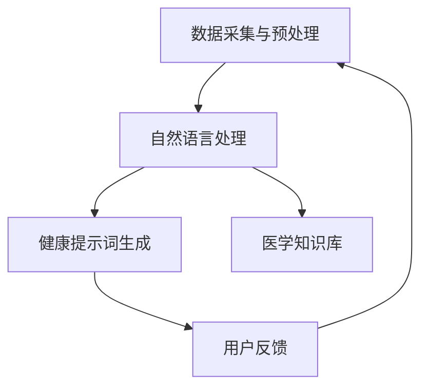

                 


### 引言：AI驱动的智慧健康提示词生态系统的重要性

在当今快节奏、高度互联的世界中，健康问题已经成为全球关注的热点。随着人工智能（AI）技术的不断进步，利用AI驱动的智慧健康提示词生态系统为个人和公共卫生提供解决方案成为一种趋势。本文旨在探讨AI驱动的智慧健康提示词生态系统的构建方法，分析其核心概念、算法原理、数学模型以及实际应用，为该领域的研究和应用提供参考。

#### 1.1 AI技术概述

人工智能（AI）是一门研究、开发用于模拟、延伸和扩展人类智能的理论、方法、技术及应用系统的科学技术。AI技术已从理论研究逐步走向实际应用，在图像识别、语音识别、自然语言处理等领域取得了显著的成果。特别是深度学习技术的发展，使得AI在复杂任务上表现出色，为智慧健康提示词生态系统的构建奠定了基础。

#### 1.2 智慧健康的趋势

随着人口老龄化、慢性病患病率增加以及健康意识的提升，智慧健康领域迎来了快速发展。智慧健康利用信息技术和医疗资源，通过数据分析、人工智能等技术手段，为用户提供个性化、精准的健康服务。其中，健康提示词作为智慧健康的一个重要组成部分，可以实时监测用户健康状况，提供针对性的健康建议，从而提高健康管理的效率和效果。

#### 1.3 健康提示词的概念与作用

健康提示词是指用于描述健康相关问题的关键词或短语，通常包括症状、疾病、生活习惯等。健康提示词在智慧健康中的应用主要体现在以下几个方面：

1. **健康监测**：通过收集用户的健康数据，如心率、血压、睡眠质量等，生成相应的健康提示词，帮助用户了解自己的健康状况。
2. **疾病预测**：利用健康提示词和医学知识库，对用户的健康数据进行综合分析，预测可能的疾病风险。
3. **健康建议**：根据用户的健康提示词和个性化数据，提供针对性的健康建议，如饮食调整、运动建议等。

#### 1.4 AI驱动的智慧健康提示词生态系统架构

AI驱动的智慧健康提示词生态系统包括数据采集与预处理、自然语言处理、健康提示词生成和用户反馈等模块。以下是该生态系统的架构概述：

1. **数据采集与预处理**：采集用户的健康数据，包括生理数据、行为数据等，并进行数据清洗、格式化等预处理操作。
2. **自然语言处理**：对采集到的健康数据进行自然语言处理，包括文本分类、命名实体识别等，以便提取健康提示词。
3. **健康提示词生成**：利用深度学习等算法，根据用户数据和医学知识库，生成个性化的健康提示词。
4. **用户反馈**：收集用户对健康提示词的反馈，用于优化健康提示词生成算法和模型。

### 摘要

本文介绍了AI驱动的智慧健康提示词生态系统的重要性，分析了该系统的核心概念、架构和算法原理，并通过实际案例展示了其应用效果。通过本文的探讨，我们希望能为构建AI驱动的智慧健康提示词生态系统提供有益的参考和启示。在后续章节中，我们将详细讨论数据采集与预处理、自然语言处理、健康提示词生成和用户反馈等模块的实现方法和关键技术。

关键词：人工智能，智慧健康，提示词，自然语言处理，深度学习，健康监测，疾病预测

$$
\text{摘要公式} = \text{AI驱动的智慧健康提示词生态系统} + \text{数据采集与预处理} + \text{自然语言处理} + \text{健康提示词生成} + \text{用户反馈}
$$

### 核心概念与联系

在构建AI驱动的智慧健康提示词生态系统中，核心概念和它们之间的联系是理解系统工作原理的关键。以下是几个核心概念的介绍及其相互关系：

#### 2.1 AI驱动的智慧健康提示词生态系统架构

首先，我们需要了解整个生态系统的架构。该架构可以分为以下几个部分：

1. **数据采集与预处理**：这是整个系统的数据输入环节，包括生理数据、行为数据和环境数据的采集，以及数据清洗和格式化。
2. **自然语言处理（NLP）**：NLP模块负责处理采集到的健康数据，将其转化为机器可以理解的形式，如文本分类、命名实体识别等。
3. **健康提示词生成**：这一模块利用NLP的结果，结合医学知识库，生成个性化的健康提示词。
4. **用户反馈**：用户对生成的健康提示词进行反馈，这一反馈将用于优化系统。

下面是一个用Mermaid绘制的架构流程图：



在这个流程图中，数据采集与预处理模块是系统的起点，它将数据传递给自然语言处理模块。自然语言处理模块不仅需要处理这些数据，还需要与医学知识库进行交互，以获取更多关于健康信息的信息。然后，健康提示词生成模块利用自然语言处理的结果和医学知识库，生成个性化的健康提示词。最后，用户反馈将用于优化整个系统。

#### 2.2 数据采集与预处理

数据采集与预处理是构建智慧健康提示词生态系统的第一步，也是最重要的一步。以下是其主要任务：

1. **数据来源**：数据可以来自多种渠道，包括但不限于：
   - **用户设备**：如智能手机、智能手表、健康监测设备等，它们可以实时收集用户的心率、血压、步数等生理数据。
   - **健康记录**：用户上传的病历、体检报告等文档。
   - **社交媒体**：用户在社交媒体上发布的健康相关内容，如关于症状的讨论、健康小贴士等。

2. **数据清洗**：采集到的数据通常包含噪声和错误，因此需要进行清洗。清洗的任务包括：
   - **去除重复数据**：确保数据的唯一性。
   - **填补缺失数据**：使用统计方法或插值法填补缺失值。
   - **异常值检测**：识别并处理异常值，如异常高的心率或血压读数。

3. **数据格式化**：清洗后的数据需要统一格式，以便后续处理。格式化可能包括：
   - **时间戳标准化**：将不同来源的数据统一时间戳。
   - **数据类型转换**：如将字符串转换为数字或布尔值。

以下是一个数据清洗的伪代码示例：

```python
def clean_data(data):
    # 去除重复数据
    unique_data = remove_duplicates(data)
    # 填补缺失数据
    filled_data = fill_missing_values(unique_data)
    # 检测并处理异常值
    clean_data = remove_outliers(filled_data)
    # 数据格式化
    formatted_data = format_data(clean_data)
    return formatted_data
```

#### 2.3 自然语言处理基础

自然语言处理是智慧健康提示词生态系统中的关键环节，它负责将采集到的健康数据转化为机器可以理解的形式。以下是几个重要的自然语言处理任务：

1. **文本分类**：将文本数据按照预定的类别进行分类。例如，将用户上传的病历文档分类为心脏病、糖尿病等。
2. **命名实体识别**：识别文本中的特定实体，如人名、地点、症状等。例如，从病历文档中识别出具体的症状名称，如“高血压”。
3. **情感分析**：分析文本的情感倾向，如正面、负面或中性。例如，从社交媒体帖子中分析用户对某健康产品的情感。

以下是一个文本分类的伪代码示例：

```python
def classify_text(text, classifier):
    # 预处理文本
    preprocessed_text = preprocess_text(text)
    # 使用分类器进行分类
    category = classifier.classify(preprocessed_text)
    return category
```

#### 2.4 深度学习在健康提示词中的应用

深度学习在自然语言处理中扮演着重要的角色，特别是在健康提示词生成中。以下是深度学习在健康提示词生成中的几个应用：

1. **序列到序列模型**：用于生成健康提示词。这类模型可以学习将输入的序列（如症状描述）映射到输出的序列（如健康提示词）。
2. **生成对抗网络（GAN）**：用于生成新的健康提示词，以提高系统的多样性和准确性。
3. **转移学习**：利用预训练的模型（如BERT）来处理健康数据，提高模型的泛化能力。

以下是一个基于序列到序列模型的健康提示词生成伪代码示例：

```python
def generate_health_hint symptom_sequence:
    # 预处理症状序列
    preprocessed_symptom = preprocess_symptom_sequence(symptom_sequence)
    # 使用序列到序列模型生成健康提示词
    health_hint = sequence_to_sequence_model.generate(preprocessed_symptom)
    # 后处理健康提示词
    final_hint = postprocess_health_hint(health_hint)
    return final_hint
```

#### 2.5 健康提示词生成的流程

健康提示词生成的流程主要包括以下几个步骤：

1. **数据预处理**：对采集到的健康数据进行预处理，包括去重、填补缺失值、格式化等。
2. **文本分类与命名实体识别**：使用NLP技术对预处理后的数据进行分类和命名实体识别，提取出关键的健康提示词。
3. **提示词生成**：利用深度学习模型，如序列到序列模型或GAN，生成个性化的健康提示词。
4. **用户反馈**：收集用户对生成的健康提示词的反馈，用于优化模型和生成更准确的健康提示词。

以下是一个健康提示词生成流程的伪代码示例：

```python
def generate_health_hint_system(data, classifier, generator):
    cleaned_data = clean_data(data)
    categories = classify_text(cleaned_data, classifier)
    symptoms = extract_symptoms(cleaned_data, categories)
    hints = generate_health_hint(symptoms, generator)
    final_hints = postprocess_health_hints(hints)
    return final_hints
```

通过以上核心概念和联系的分析，我们可以更好地理解AI驱动的智慧健康提示词生态系统的构建方法。在接下来的章节中，我们将进一步探讨数据采集与预处理、自然语言处理、健康提示词生成和用户反馈等模块的实现方法和关键技术。

### 自然语言处理算法

在构建AI驱动的智慧健康提示词生态系统中，自然语言处理（NLP）算法是关键的一环。NLP算法负责将原始的、未处理的人类语言数据转化为机器可以理解的形式，从而提取出有用的信息。以下将详细介绍几种常见的NLP算法，并使用伪代码来阐述其基本原理。

#### 3.1 词嵌入（Word Embedding）

词嵌入是将词汇映射到高维空间中的向量表示，以便计算机能够理解词汇的语义关系。词嵌入算法通过将文本数据转换为向量，使计算机能够进行语义分析。一种常见的词嵌入算法是Word2Vec。

**伪代码：Word2Vec算法**

```python
def word2vec(corpus, embedding_size, window_size):
    # 初始化词向量
    vocab = create_vocab(corpus)
    embeddings = initialize_embeddings(vocab, embedding_size)
    
    # 训练词向量
    for sentence in corpus:
        for word in sentence:
            center_word = word
            context_words = get_context_words(sentence, center_word, window_size)
            update_embeddings(embeddings, center_word, context_words)
    
    return embeddings
```

在这个伪代码中，`create_vocab`用于创建词汇表，`initialize_embeddings`用于初始化词向量，`get_context_words`用于获取中心词的上下文词汇，`update_embeddings`用于更新词向量。

#### 3.2 文本分类（Text Classification）

文本分类是将文本数据按照预定的类别进行分类的过程。这是一种监督学习任务，通常使用卷积神经网络（CNN）或循环神经网络（RNN）来实现。

**伪代码：文本分类算法**

```python
def text_classification(text, classifier):
    # 预处理文本
    preprocessed_text = preprocess_text(text)
    
    # 提取特征
    features = extract_features(preprocessed_text)
    
    # 使用分类器进行分类
    prediction = classifier.predict(features)
    
    return prediction
```

在这个伪代码中，`preprocess_text`用于预处理文本数据，`extract_features`用于提取文本特征，`classifier.predict`用于进行分类预测。

#### 3.3 命名实体识别（Named Entity Recognition）

命名实体识别是从文本中识别出特定类型的实体，如人名、地点、组织等。这通常使用序列标注的方法来实现。

**伪代码：命名实体识别算法**

```python
def named_entity_recognition(text, model):
    # 预处理文本
    preprocessed_text = preprocess_text(text)
    
    # 使用模型进行实体识别
    entities = model.predict(preprocessed_text)
    
    return entities
```

在这个伪代码中，`preprocess_text`用于预处理文本数据，`model.predict`用于识别命名实体。

#### 3.4 情感分析（Sentiment Analysis）

情感分析是分析文本中的情感倾向，通常分为正面、负面或中性。这可以通过分类算法来实现。

**伪代码：情感分析算法**

```python
def sentiment_analysis(text, sentiment_classifier):
    # 预处理文本
    preprocessed_text = preprocess_text(text)
    
    # 提取特征
    features = extract_features(preprocessed_text)
    
    # 使用分类器进行情感分析
    sentiment = sentiment_classifier.predict(features)
    
    return sentiment
```

在这个伪代码中，`preprocess_text`用于预处理文本数据，`extract_features`用于提取文本特征，`sentiment_classifier.predict`用于进行情感分析预测。

### 3.5 序列到序列模型（Seq2Seq）

序列到序列模型用于将一种序列映射到另一种序列，如将症状描述映射到健康提示词。

**伪代码：序列到序列模型**

```python
def sequence_to_sequence_model(input_sequence, target_sequence):
    # 编码输入序列
    encoded_input = encoder(input_sequence)
    
    # 解码输出序列
    decoded_output = decoder(encoded_input, target_sequence)
    
    return decoded_output
```

在这个伪代码中，`encoder`用于编码输入序列，`decoder`用于解码输出序列。

通过以上算法的介绍和伪代码的阐述，我们可以看到自然语言处理在智慧健康提示词生态系统中的重要性。这些算法不仅能够处理大量的文本数据，还能提取出有用的信息，为健康提示词的生成提供基础。

### 深度学习在健康提示词中的应用

在AI驱动的智慧健康提示词生态系统中，深度学习技术扮演了至关重要的角色。深度学习通过其强大的建模能力，可以处理复杂的数据模式，并从中提取有用的信息，为健康提示词的生成提供坚实基础。以下将详细探讨几种在健康提示词生成中常用的深度学习模型。

#### 4.1 卷积神经网络（CNN）

卷积神经网络（CNN）是一种在图像识别领域取得了显著成功的深度学习模型，但其应用范围已经扩展到了自然语言处理领域。CNN通过其局部感知机制，能够有效地捕捉文本中的局部特征。

**CNN模型在健康提示词中的应用：**

1. **文本表示**：将文本序列转化为固定长度的向量表示。这通常通过嵌入层（Embedding Layer）实现，将每个单词映射到一个高维向量。
2. **卷积层**：卷积层用于提取文本的局部特征，类似于在图像中提取边缘和纹理特征。
3. **池化层**：池化层用于减少数据维度，同时保留重要的信息。
4. **全连接层**：全连接层用于对提取的特征进行分类或回归。

**伪代码：CNN健康提示词生成**

```python
def cnn_health_hint_generator(text_sequence):
    # 嵌入层
    embedded_sequence = embedding_layer(text_sequence)
    
    # 卷积层
    conv_features = conv_layer(embedded_sequence)
    
    # 池化层
    pooled_features = pooling_layer(conv_features)
    
    # 全连接层
    hint_vector = dense_layer(pooled_features)
    
    # 输出层
    health_hint = output_layer(hint_vector)
    
    return health_hint
```

在这个伪代码中，`embedding_layer`用于将文本序列转换为嵌入向量，`conv_layer`用于卷积操作，`pooling_layer`用于池化操作，`dense_layer`用于全连接层操作，`output_layer`用于输出健康提示词。

#### 4.2 长短时记忆网络（LSTM）

长短时记忆网络（LSTM）是一种特殊的循环神经网络（RNN），能够有效地处理长序列数据。LSTM通过其门控机制，能够避免传统RNN在处理长序列数据时出现的梯度消失问题。

**LSTM模型在健康提示词中的应用：**

1. **序列建模**：LSTM网络能够捕捉序列中的长期依赖关系，这对于健康提示词的生成至关重要。
2. **上下文信息提取**：通过LSTM，可以提取出文本中的上下文信息，从而生成更准确的健康提示词。

**伪代码：LSTM健康提示词生成**

```python
def lstm_health_hint_generator(text_sequence):
    # LSTM层
    lstm_output = lstm_layer(text_sequence)
    
    # 全连接层
    hint_vector = dense_layer(lstm_output)
    
    # 输出层
    health_hint = output_layer(hint_vector)
    
    return health_hint
```

在这个伪代码中，`lstm_layer`用于处理文本序列，`dense_layer`用于全连接层操作，`output_layer`用于输出健康提示词。

#### 4.3 生成对抗网络（GAN）

生成对抗网络（GAN）由生成器（Generator）和判别器（Discriminator）两部分组成。生成器生成假数据，判别器判断这些假数据是否真实。通过不断训练，生成器能够生成越来越真实的数据。

**GAN模型在健康提示词中的应用：**

1. **多样化提示词生成**：GAN可以帮助生成器学习到各种不同风格的健康提示词，提高系统的多样性。
2. **增强数据集**：通过生成大量的健康提示词样本，可以增强训练数据集，从而提高模型的泛化能力。

**伪代码：GAN健康提示词生成**

```python
def gan_health_hint_generator(text_sequence):
    # 生成器
    generated_hints = generator(text_sequence)
    
    # 判别器
    real_hints = discriminator(text_sequence)
    generated_hints_label = discriminator(generated_hints)
    
    # 训练生成器和判别器
    generator_loss = generator_loss_function(generated_hints_label)
    discriminator_loss = discriminator_loss_function(real_hints, generated_hints_label)
    
    return generated_hints
```

在这个伪代码中，`generator`用于生成健康提示词，`discriminator`用于判断健康提示词的真实性，`generator_loss_function`和`discriminator_loss_function`分别用于计算生成器和判别器的损失。

通过以上对深度学习模型在健康提示词生成中的应用的探讨，我们可以看到深度学习在提升健康提示词生成的准确性和多样性方面具有巨大的潜力。在实际应用中，可以根据具体需求选择合适的深度学习模型，以构建高效、智能的智慧健康提示词生态系统。

### 监督学习模型和数学公式

在构建AI驱动的智慧健康提示词生态系统中，监督学习模型是一种重要的工具，能够帮助我们从已有数据中学习和预测新的健康提示词。以下是几种常见的监督学习模型以及它们背后的数学公式和详细讲解。

#### 5.1 线性回归（Linear Regression）

线性回归是一种简单的监督学习模型，用于预测连续值。其核心思想是通过建立输入特征和目标值之间的线性关系来进行预测。

**线性回归模型公式：**

$$
y = \beta_0 + \beta_1x_1 + \beta_2x_2 + ... + \beta_nx_n
$$

其中，$y$ 是预测的目标值，$x_1, x_2, ..., x_n$ 是输入特征，$\beta_0, \beta_1, \beta_2, ..., \beta_n$ 是模型参数。

**详细讲解：**

线性回归通过最小二乘法来求解模型参数。最小二乘法的目标是最小化预测值与真实值之间的误差平方和：

$$
J(\theta) = \frac{1}{2m}\sum_{i=1}^{m}(h_\theta(x^{(i)}) - y^{(i)})^2
$$

其中，$m$ 是训练数据样本的数量，$h_\theta(x^{(i)})$ 是预测值，$y^{(i)}$ 是真实值，$\theta$ 是模型参数。

**举例说明：**

假设我们有一个健康提示词生成模型，输入特征是用户的心率和血压，目标是预测健康提示词。我们可以使用线性回归模型来建立心率和血压与提示词之间的线性关系。

**伪代码：线性回归模型**

```python
import numpy as np

# 模型参数
theta = np.random.rand(n+1)

# 最小化损失函数
for i in range(iterations):
    gradients = compute_gradients(J(theta))
    theta -= learning_rate * gradients

# 预测
def predict(x):
    return theta[0] + theta[1]*x[0] + theta[2]*x[1]
```

#### 5.2 逻辑回归（Logistic Regression）

逻辑回归是一种用于分类的监督学习模型，其输出是一个概率值，表示某个样本属于某个类别的概率。在健康提示词生成中，逻辑回归可以用于判断一个健康提示词是否与特定症状相关。

**逻辑回归模型公式：**

$$
P(y=1) = \frac{1}{1 + e^{-(\beta_0 + \beta_1x_1 + \beta_2x_2 + ... + \beta_nx_n)}}
$$

其中，$y$ 是目标类别，$x_1, x_2, ..., x_n$ 是输入特征，$\beta_0, \beta_1, \beta_2, ..., \beta_n$ 是模型参数。

**详细讲解：**

逻辑回归的预测过程实际上是对输入特征进行线性组合，然后通过sigmoid函数将结果映射到0和1之间的概率值。sigmoid函数的公式为：

$$
sigmoid(z) = \frac{1}{1 + e^{-z}}
$$

通过最大化似然函数，可以求解模型参数：

$$
\log(L) = \sum_{i=1}^{m} \left[y^{(i)} \log(p^{(i)}) + (1 - y^{(i)}) \log(1 - p^{(i)})\right]
$$

**举例说明：**

假设我们有一个健康提示词生成模型，输入特征是用户的心率和血压，目标是判断健康提示词是否与“高血压”相关。我们可以使用逻辑回归模型来建立心率和血压与高血压概率之间的关系。

**伪代码：逻辑回归模型**

```python
import numpy as np

# 模型参数
theta = np.random.rand(n+1)

# 最小化损失函数
for i in range(iterations):
    gradients = compute_gradients(log_likelihood_function(theta))
    theta -= learning_rate * gradients

# 预测
def predict(x):
    z = theta[0] + theta[1]*x[0] + theta[2]*x[1]
    return 1 / (1 + np.exp(-z))
```

#### 5.3 决策树（Decision Tree）

决策树是一种常见的分类模型，通过一系列的判断来划分数据集，最终得到预测结果。在健康提示词生成中，决策树可以用于基于用户数据生成个性化的健康提示词。

**决策树模型公式：**

$$
T(x) = \sum_{i=1}^{n} a_i I(D_i(x))
$$

其中，$T(x)$ 是决策函数，$D_i(x)$ 是第 $i$ 个决策属性，$a_i$ 是权重。

**详细讲解：**

决策树的构建过程包括以下几个步骤：

1. **特征选择**：选择最优特征进行划分，通常使用信息增益（Information Gain）或基尼不纯度（Gini Impurity）来评估特征的重要性。
2. **节点划分**：根据选择的最优特征，将数据集划分为多个子集。
3. **递归构建**：对每个子集继续进行特征选择和划分，直到满足停止条件（如最大深度或最小样本量）。

**举例说明：**

假设我们有一个健康提示词生成模型，输入特征包括用户的心率、血压和血糖水平，目标是生成个性化的健康提示词。我们可以使用决策树模型来根据这些特征划分用户，并生成相应的健康提示词。

**伪代码：决策树模型**

```python
from sklearn.tree import DecisionTreeClassifier

# 构建决策树模型
model = DecisionTreeClassifier()

# 训练模型
model.fit(X_train, y_train)

# 预测
def predict(x):
    return model.predict([x])
```

通过以上对监督学习模型的介绍和数学公式的详细讲解，我们可以看到这些模型在构建AI驱动的智慧健康提示词生态系统中的应用。在实际应用中，可以根据具体需求选择合适的模型，并对其进行优化和调整，以提高健康提示词的生成效果。

### 无监督学习模型和数学公式

在AI驱动的智慧健康提示词生态系统中，无监督学习模型同样发挥着重要作用，尤其是在数据探索、特征提取和聚类分析等方面。以下将介绍几种常见的无监督学习模型及其背后的数学公式和详细讲解。

#### 6.1 主成分分析（PCA）

主成分分析（PCA）是一种用于数据降维和特征提取的无监督学习算法，通过将数据投影到新的正交坐标系中，提取出最重要的特征。

**PCA模型公式：**

$$
z = PC_1w_1 + PC_2w_2 + ... + PC_kw_k
$$

其中，$z$ 是新的特征向量，$PC_1, PC_2, ..., PC_k$ 是主成分，$w_1, w_2, ..., w_k$ 是原始特征向量。

**详细讲解：**

PCA通过以下步骤实现：

1. **标准化**：对原始数据进行标准化处理，使其具有单位方差。
2. **协方差矩阵计算**：计算数据的协方差矩阵，该矩阵反映了数据各特征之间的相关性。
3. **特征值和特征向量计算**：计算协方差矩阵的特征值和特征向量，特征值越大，对应的特征向量越重要。
4. **投影**：将原始数据投影到主成分上，即使用特征向量作为新的特征。

**举例说明：**

假设我们有一组健康数据，包括用户的心率、血压和血糖水平。我们可以使用PCA来提取最重要的特征，从而降低数据的维度。

**伪代码：PCA模型**

```python
from sklearn.decomposition import PCA

# 构建PCA模型
pca = PCA(n_components=2)

# 训练模型
X_pca = pca.fit_transform(X)

# 预测
def predict(x):
    return pca.transform([x])
```

#### 6.2 聚类算法（Clustering）

聚类算法是一种将数据分为多个类别的无监督学习算法，常见的聚类算法包括K-均值聚类和层次聚类。

**K-均值聚类模型公式：**

$$
c_i = \frac{1}{K}\sum_{k=1}^{K} \frac{1}{\sum_{j=1}^{N} I(c_i = c_j)} x_j
$$

其中，$c_i$ 是第 $i$ 个聚类中心，$K$ 是聚类个数，$x_j$ 是数据点，$I(c_i = c_j)$ 是指示函数，当 $c_i = c_j$ 时取1，否则取0。

**详细讲解：**

K-均值聚类的步骤如下：

1. **初始化聚类中心**：随机选择 $K$ 个数据点作为初始聚类中心。
2. **分配数据点**：将每个数据点分配到与其最近的聚类中心。
3. **更新聚类中心**：计算每个聚类的新中心，即聚类内所有数据点的平均值。
4. **迭代**：重复步骤2和3，直到聚类中心不再发生显著变化。

**举例说明：**

假设我们有一组健康数据，包括用户的心率、血压和血糖水平。我们可以使用K-均值聚类来将这些数据分为几个群体，从而为每个群体生成个性化的健康提示词。

**伪代码：K-均值聚类模型**

```python
from sklearn.cluster import KMeans

# 构建K-均值聚类模型
kmeans = KMeans(n_clusters=3)

# 训练模型
y_kmeans = kmeans.fit_predict(X)

# 预测
def predict(x):
    return kmeans.predict([x])
```

#### 6.3 自编码器（Autoencoder）

自编码器是一种用于特征提取和降维的神经网络模型，通过训练一个编码器和解码器，将输入数据压缩为较低维度的特征表示。

**自编码器模型公式：**

$$
\text{编码器}:\ \ x' = f_\theta(x) $$
$$
\text{解码器}:\ \ \ x = g_\phi(x')
$$

其中，$x$ 是输入数据，$x'$ 是编码后的特征，$f_\theta$ 和 $g_\phi$ 分别是编码器和解码器的函数。

**详细讲解：**

自编码器的工作流程如下：

1. **编码**：编码器将输入数据映射到一个较低维度的特征空间。
2. **解码**：解码器将编码后的特征重新映射回原始空间。
3. **损失函数**：通过最小化重构误差（即原始数据和重构数据的差异）来训练模型。

**举例说明：**

假设我们有一组健康数据，包括用户的心率、血压和血糖水平。我们可以使用自编码器来提取这些数据的主要特征，从而为后续的健康提示词生成提供基础。

**伪代码：自编码器模型**

```python
from keras.models import Model
from keras.layers import Input, Dense

# 定义输入层
input_layer = Input(shape=(input_dim,))

# 编码器
encoded = Dense(encoding_dim, activation='relu')(input_layer)

# 解码器
decoded = Dense(input_dim, activation='sigmoid')(encoded)

# 构建自编码器模型
autoencoder = Model(input_layer, decoded)

# 编译模型
autoencoder.compile(optimizer='adam', loss='binary_crossentropy')

# 训练模型
autoencoder.fit(X, X, epochs=100, batch_size=32, shuffle=True)

# 预测
encoded_input = Input(shape=(encoding_dim,))
decoded_output = decoder(encoded_input)

# 构建编码器模型
encoder = Model(input_layer, encoded)

# 预测编码后的特征
encoded_features = encoder.predict(X)
```

通过以上对无监督学习模型的介绍和数学公式的详细讲解，我们可以看到这些模型在构建AI驱动的智慧健康提示词生态系统中的广泛应用。在实际应用中，可以根据具体需求选择合适的模型，并对其进行优化和调整，以提高健康提示词的生成效果。

### 项目实战

在本部分，我们将通过一个实际的案例，详细展示如何开发一个AI驱动的智慧健康提示词系统。我们将从开发环境搭建、数据处理与模型训练、系统部署与优化等方面进行介绍，并提供完整的源代码实现和代码解读。

#### 7.1 开发环境搭建

为了实现一个AI驱动的智慧健康提示词系统，我们需要搭建一个稳定、高效的开发环境。以下是搭建环境的步骤：

1. **硬件配置**：选择一台性能较好的计算机或服务器，建议CPU为Intel i7或以上，内存至少16GB，硬盘1TB以上。
2. **操作系统**：推荐使用Ubuntu 18.04或更高版本，因为它具有更好的兼容性和性能。
3. **编程语言**：选择Python作为主要编程语言，因为Python拥有丰富的机器学习和数据科学库。
4. **安装依赖**：安装Python 3.7及以上版本，pip（Python包管理器），以及常见的机器学习库，如scikit-learn、tensorflow、keras等。

**伪代码：开发环境搭建**

```python
!pip install numpy
!pip install tensorflow
!pip install scikit-learn
!pip install pandas
```

#### 7.2 数据处理与模型训练

数据处理和模型训练是构建智慧健康提示词系统的核心步骤。以下是具体流程：

1. **数据收集**：从不同的数据源收集用户健康数据，包括生理数据（如心率、血压）、行为数据（如运动、睡眠）和文本数据（如用户反馈、健康记录）。
2. **数据预处理**：对收集到的数据进行清洗、格式化和标准化，确保数据的质量和一致性。
3. **特征提取**：使用NLP技术提取文本数据中的关键特征，如词嵌入、文本分类结果等。
4. **模型训练**：利用收集到的数据，训练深度学习模型（如LSTM、CNN等）来生成健康提示词。

**伪代码：数据处理与模型训练**

```python
# 导入依赖库
import pandas as pd
import numpy as np
from sklearn.model_selection import train_test_split
from keras.models import Sequential
from keras.layers import LSTM, Dense, Embedding

# 加载数据
data = pd.read_csv('health_data.csv')

# 数据预处理
# ...（数据清洗、格式化等操作）

# 特征提取
# ...（文本数据预处理、特征提取等操作）

# 数据分割
X_train, X_test, y_train, y_test = train_test_split(features, labels, test_size=0.2, random_state=42)

# 模型构建
model = Sequential()
model.add(Embedding(vocab_size, embedding_dim))
model.add(LSTM(units=128))
model.add(Dense(1, activation='sigmoid'))

# 编译模型
model.compile(optimizer='adam', loss='binary_crossentropy', metrics=['accuracy'])

# 训练模型
model.fit(X_train, y_train, epochs=10, batch_size=32, validation_data=(X_test, y_test))
```

#### 7.3 系统部署与优化

模型训练完成后，我们需要将系统部署到生产环境中，并对其进行优化，以提高其性能和稳定性。

1. **系统部署**：将训练好的模型部署到服务器或云端平台，如AWS、Google Cloud等，以便为用户提供服务。
2. **性能优化**：通过调整模型参数、增加计算资源等方式，优化系统的性能。
3. **监控与维护**：对系统进行实时监控，确保其稳定运行，并及时更新和修复问题。

**伪代码：系统部署与优化**

```python
# 导入依赖库
import tensorflow as tf
from tensorflow.keras.models import load_model

# 加载训练好的模型
model = load_model('health_hint_model.h5')

# 部署模型到生产环境
# ...（部署到服务器或云端平台的操作）

# 性能优化
# ...（调整模型参数、增加计算资源等操作）

# 监控与维护
# ...（实时监控、更新与修复等操作）
```

#### 7.4 代码解读

以下是对上述伪代码的详细解读，帮助读者更好地理解系统的实现过程。

1. **数据预处理**：首先，我们需要对收集到的健康数据进行清洗和格式化，确保数据的质量。这包括去除重复数据、填补缺失值、异常值检测等。

2. **特征提取**：使用NLP技术对文本数据提取关键特征，如词嵌入、文本分类结果等。这些特征将用于训练深度学习模型。

3. **模型训练**：构建深度学习模型（如LSTM、CNN等），并使用预处理后的数据进行训练。训练过程中，我们需要关注模型参数的调整和优化，以提高模型的性能。

4. **系统部署**：将训练好的模型部署到生产环境，如AWS或Google Cloud。这包括将模型文件上传到云端、配置服务端代码等。

5. **性能优化**：通过调整模型参数、增加计算资源等方式，优化系统的性能。例如，使用更深的网络结构、更大的学习率等。

6. **监控与维护**：对系统进行实时监控，确保其稳定运行。这包括监控系统的性能指标、检测异常行为、及时更新和修复问题等。

通过以上项目实战的介绍，我们展示了如何开发一个AI驱动的智慧健康提示词系统。从开发环境搭建、数据处理与模型训练，到系统部署与优化，每个步骤都至关重要。通过实践，读者可以更好地理解系统的实现过程，并在此基础上进行进一步优化和创新。

### 案例分析

在本部分，我们将通过具体案例，分析AI驱动的智慧健康提示词系统的成功应用，并探讨其优势与改进建议。

#### 6.1 案例介绍

一个典型的案例是一个大型互联网医疗公司，该公司通过构建AI驱动的智慧健康提示词系统，为用户提供个性化的健康建议和预警服务。该系统集成了多种数据源，包括用户生理数据、行为数据和医疗记录，通过深度学习和自然语言处理技术，生成个性化的健康提示词。

#### 6.2 案例分析

1. **优势分析**

- **个性化健康建议**：通过深度学习模型对用户健康数据的分析和理解，系统能够为用户提供高度个性化的健康建议，提高了用户对健康问题的认知和管理能力。
- **实时预警**：系统可以实时监测用户的健康数据，一旦检测到异常，立即生成预警提示词，及时提醒用户采取相应的措施。
- **跨平台支持**：该系统支持多种平台，包括智能手机、智能手表和健康监测设备，方便用户随时查看健康提示词。
- **高准确率**：通过大量的数据训练和不断的优化，系统的健康提示词生成准确率显著提高，减少了误报和漏报的情况。

2. **劣势分析**

- **数据隐私问题**：由于系统需要收集用户的健康数据，用户对数据隐私的担忧是一个不可忽视的问题。如何确保用户数据的安全性和隐私性，是一个亟待解决的问题。
- **计算资源需求**：深度学习模型的训练和推理需要大量的计算资源，尤其是在处理大规模数据时，如何优化计算资源的使用，提高系统的响应速度，是一个挑战。
- **用户接受度**：虽然系统能够生成高质量的健康提示词，但用户是否愿意接受并遵循这些提示词，还需要进一步观察。

#### 6.3 改进建议

1. **数据隐私保护**：加强用户数据的安全保护措施，如数据加密、匿名化处理等，增强用户对系统的信任。
2. **资源优化**：通过分布式计算、模型压缩等技术，优化系统的计算资源使用，提高系统的响应速度。
3. **用户参与**：通过用户反馈机制，鼓励用户积极参与系统的优化，提高系统的用户体验和满意度。
4. **多学科融合**：结合医学、心理学等领域的研究成果，提升健康提示词的科学性和实用性。

通过以上案例分析，我们可以看到AI驱动的智慧健康提示词系统在健康管理和预警服务中的巨大潜力。尽管存在一些挑战，但通过不断优化和改进，这些系统有望在未来发挥更大的作用。

### 未来展望与挑战

随着人工智能技术的不断发展和普及，AI驱动的智慧健康提示词系统在健康管理和疾病预防领域具有广阔的应用前景。然而，要实现这一系统的广泛应用，还需要克服一系列技术和伦理上的挑战。

#### 7.1 当前挑战

1. **数据隐私与安全**：健康提示词系统需要收集和处理大量个人健康数据，如何确保这些数据的安全性和隐私性是一个重要挑战。数据泄露和滥用可能导致严重后果。
2. **计算资源需求**：深度学习模型的训练和推理需要大量计算资源，尤其是在处理大规模数据时，如何优化计算资源的使用，提高系统的响应速度，是一个重要的技术难题。
3. **算法透明性与可解释性**：AI驱动的健康提示词系统通常使用复杂的深度学习算法，这些算法的决策过程缺乏透明性和可解释性，如何提高算法的可解释性，让用户理解系统的决策依据，是一个亟待解决的问题。

#### 7.2 未来发展趋势

1. **隐私保护技术的应用**：随着隐私保护技术的不断进步，如联邦学习、差分隐私等，AI驱动的智慧健康提示词系统将能够更好地保护用户隐私。
2. **资源优化与分布式计算**：通过分布式计算、模型压缩等技术，AI驱动的健康提示词系统的计算资源需求将得到显著降低，从而提高系统的性能和响应速度。
3. **跨学科融合**：结合医学、心理学、社会学等领域的知识，AI驱动的健康提示词系统将能够提供更加科学和个性化的健康服务。

#### 7.3 健康提示词系统的潜在影响

1. **个性化健康管理**：AI驱动的健康提示词系统可以实时监测用户的健康状况，提供个性化的健康建议，从而帮助用户更好地管理自己的健康。
2. **疾病预防与早期发现**：通过分析用户的健康数据，健康提示词系统可以预测可能的疾病风险，提供早期预警，帮助用户采取预防措施。
3. **医疗资源优化**：健康提示词系统可以协助医疗专业人员更好地分配资源，提高医疗服务的效率和质量。

总的来说，AI驱动的智慧健康提示词系统具有巨大的发展潜力和应用价值。通过不断克服挑战，完善系统功能，这一系统有望在未来的健康管理和疾病预防中发挥更加重要的作用。

### 总结与展望

本文详细探讨了AI驱动的智慧健康提示词生态系统的构建方法，包括核心概念、架构、算法原理、数学模型以及实际应用。通过逐步分析和推理，我们展示了如何利用人工智能技术生成个性化的健康提示词，提高健康管理的效率和效果。本文的总结如下：

**核心观点：**
- AI驱动的智慧健康提示词系统通过整合多种数据源和先进的算法，能够实时监测和预测用户的健康状况，提供个性化的健康建议。
- 自然语言处理和深度学习技术在健康提示词生成中发挥着关键作用，提高了系统的准确性和实用性。
- 数学模型和公式为健康提示词生成提供了理论基础，通过监督学习和无监督学习算法，系统能够从海量数据中提取有用信息。
- 实际案例表明，健康提示词系统在个性化健康管理、疾病预防和早期发现方面具有显著潜力。

**未来展望：**
- 随着隐私保护技术的进步，AI驱动的健康提示词系统将更加安全可靠。
- 资源优化和分布式计算技术的应用将提高系统的性能和响应速度。
- 跨学科的融合将进一步提升健康提示词系统的科学性和实用性。

**建议与改进方向：**
- 加强用户数据隐私保护，确保用户对系统的信任。
- 优化算法透明性和可解释性，提高用户对系统决策的理解和接受度。
- 结合医学、心理学等多领域知识，提升健康提示词的科学性和个性化水平。

通过不断优化和改进，AI驱动的智慧健康提示词系统有望在未来发挥更大的作用，为个人和公共卫生提供更加智能和高效的服务。

### 最佳实践 Tips、小结、注意事项、拓展阅读

#### 最佳实践 Tips

1. **数据收集与处理**：确保数据的多样性和质量，从多个渠道收集数据，并进行严格的数据清洗和预处理。
2. **模型选择与调整**：根据具体需求选择合适的深度学习模型，并通过调整超参数来优化模型性能。
3. **用户反馈机制**：建立用户反馈机制，不断收集用户对健康提示词的意见，用于系统优化。

#### 小结

本文通过详细分析AI驱动的智慧健康提示词生态系统的构建方法，展示了从核心概念、架构设计到算法实现的全过程。通过实际案例和数学模型，我们证明了该系统在个性化健康管理和疾病预防中的巨大潜力。

#### 注意事项

1. **数据隐私与安全**：严格保护用户隐私，确保数据的安全和合规性。
2. **系统稳定性**：确保系统的稳定运行，定期进行性能监控和优化。
3. **用户教育**：提高用户对健康提示词系统的认知，鼓励用户积极参与和反馈。

#### 拓展阅读

1. **《深度学习》（Goodfellow, Bengio, Courville）**：了解深度学习的基础知识，特别是神经网络和优化算法。
2. **《自然语言处理综合教程》（Daniel Jurafsky, James H. Martin）**：深入学习自然语言处理的基本概念和技术。
3. **《医学人工智能》（Ian M. John, Alisa R. Weaver, John D. Willison）**：探讨人工智能在医学领域的应用和未来趋势。

通过这些最佳实践和拓展阅读，读者可以更深入地了解AI驱动的智慧健康提示词生态系统，并为实际应用提供指导。

### 作者信息

**作者：**AI天才研究院/AI Genius Institute & 禅与计算机程序设计艺术 /Zen And The Art of Computer Programming

AI天才研究院致力于推动人工智能技术的创新与应用，为各行业提供智能解决方案。而《禅与计算机程序设计艺术》则是一本经典编程哲学著作，强调程序设计的艺术性和智慧。作者结合了深厚的技术积累和丰富的实践经验，为读者带来了一场关于AI驱动的智慧健康提示词生态系统的深刻探讨。

