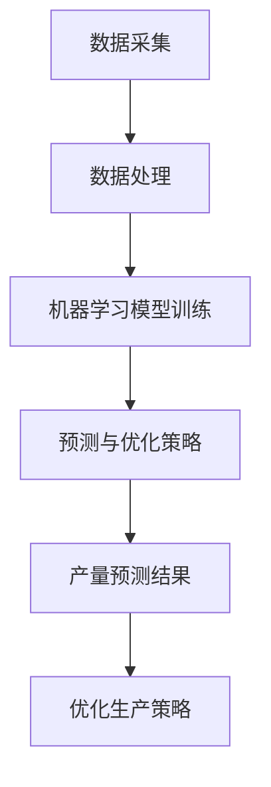
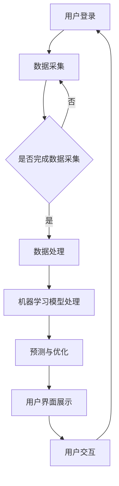

                 


### 文章标题

构建AI驱动的智慧农业产量优化提示词平台

### 文章关键词

- AI驱动的智慧农业
- 农业产量优化
- 提示词平台
- 数据采集与处理
- 机器学习算法
- 智慧农业系统架构
- 源代码实现

### 文章摘要

本文深入探讨了构建AI驱动的智慧农业产量优化提示词平台的方法与实现。首先介绍了智慧农业的发展背景和AI技术的重要性，随后详细阐述了农业产量优化的核心概念与联系，包括数据采集、处理和机器学习算法。接着，文章详细描述了AI驱动的产量优化提示词平台的架构设计，包括功能需求、技术架构和用户界面设计。在核心算法部分，文章通过伪代码和数学模型详细解析了产量预测算法的原理，并提供了实际代码实现和分析。最后，文章展示了平台开发与部署的实际案例，并提出了最佳实践和小结，为智慧农业的持续发展提供了有益的参考。

---

## 引言

智慧农业是现代农业发展的重要趋势，通过利用现代信息技术，如物联网、大数据和人工智能（AI），实现对农业生产过程的全面监控和优化。随着全球人口的不断增长和对食品需求的增加，提高农业产量成为了一项重要的挑战。传统的农业生产方式已经无法满足现代农业的需求，因此，AI驱动的智慧农业产量优化系统应运而生。

AI在智慧农业中的应用范围广泛，从作物种植、病虫害监测、农田管理到农产品供应链优化，无不涉及到AI技术。其中，AI驱动的产量优化系统主要通过预测和优化作物产量，提高农业生产效率和产品质量。这种系统不仅能提高农业产量，还能减少资源浪费，降低生产成本，对环境保护和可持续发展具有重要意义。

本文旨在构建一个AI驱动的智慧农业产量优化提示词平台，该平台将基于最新的AI技术，实现对农业产量优化过程的全面支持。文章将首先介绍智慧农业的发展背景和AI技术的重要性，随后详细阐述农业产量优化的核心概念与联系，包括数据采集、处理和机器学习算法。接着，文章将描述AI驱动的产量优化提示词平台的架构设计，包括功能需求、技术架构和用户界面设计。在核心算法部分，文章将通过伪代码和数学模型详细解析产量预测算法的原理，并展示实际代码实现和分析。最后，文章将提供平台开发与部署的实际案例，并总结最佳实践和小结，为智慧农业的持续发展提供参考。

### 智慧农业的发展背景

智慧农业的概念起源于21世纪初，随着信息技术的快速发展，物联网、大数据和人工智能等新兴技术的应用逐渐深入农业领域。传统农业主要依靠经验进行种植和管理，而智慧农业则通过将现代信息技术与农业生产相结合，实现农业生产的智能化、精准化和高效化。

#### 物联网在智慧农业中的应用

物联网（IoT）技术在智慧农业中起到了关键作用。通过在农田中布置各种传感器，如土壤湿度传感器、温度传感器、光照传感器等，可以实时监测农田的环境参数。这些传感器收集的数据可以通过无线网络传输到中央控制系统，为农业生产提供实时的环境信息。例如，通过监测土壤湿度，农民可以及时进行灌溉，避免水资源浪费；通过监测温度和光照，可以调整作物的生长环境，提高产量和品质。

#### 大数据在智慧农业中的应用

大数据技术在智慧农业中的应用主要体现在数据收集、存储、分析和利用。农业生产过程中产生的数据包括气象数据、土壤数据、作物生长数据、销售数据等。通过收集这些数据，可以建立完整的农业数据库，利用大数据技术进行数据挖掘和分析，为农业生产提供科学依据。例如，通过分析历史气象数据和作物生长数据，可以预测未来作物的生长趋势，提前采取相应的措施，提高产量和品质。

#### 人工智能在智慧农业中的应用

人工智能（AI）技术在智慧农业中的应用主要表现在作物种植、病虫害监测、农田管理和供应链优化等方面。通过使用机器学习和深度学习算法，可以对农业生产过程中的数据进行处理和分析，实现智能决策和优化。例如，在作物种植方面，AI技术可以预测作物的生长状况，提供最佳的种植方案，包括播种时间、播种量、施肥量和灌溉量等；在病虫害监测方面，AI技术可以通过图像识别和分析，实时监测农田中的病虫害情况，提供防治方案；在农田管理方面，AI技术可以实现对农田的自动化控制，提高生产效率；在供应链优化方面，AI技术可以优化农产品的物流和销售，降低成本，提高市场竞争力。

#### 智慧农业的发展趋势

随着物联网、大数据和人工智能技术的不断发展，智慧农业正朝着更加智能化、高效化和可持续化的方向发展。未来，智慧农业将实现以下几方面的发展：

1. **精细化农业管理**：通过更加精细化的数据采集和处理，实现农业生产过程的全面监控和优化，提高作物产量和品质。

2. **智能化决策支持**：利用人工智能技术，为农业生产提供智能化的决策支持，降低人工干预，提高生产效率。

3. **农业物联网的普及**：通过更加广泛的物联网部署，实现农田环境的实时监测和远程控制，提高农业生产的管理水平。

4. **农业大数据平台建设**：通过构建农业大数据平台，实现农业生产数据的集中管理和分析，为农业生产提供科学依据。

5. **农业供应链优化**：通过优化农产品的物流和销售，提高供应链的效率，降低成本，提高市场竞争力。

总之，智慧农业的发展将为农业生产带来革命性的变化，实现农业的可持续发展。然而，智慧农业的发展也面临着一些挑战，如技术成本高、数据隐私和安全问题等。未来，需要不断推动技术创新和产业合作，共同推动智慧农业的发展。

### AI在农业中的应用

人工智能（AI）在农业领域的应用日益广泛，涵盖了作物种植、病虫害监测、农田管理和供应链优化等多个方面。AI技术的引入不仅提高了农业生产的效率和精确度，还为实现农业的智能化和可持续发展提供了强有力的支持。

#### 作物种植

AI技术在作物种植中的应用主要体现在以下几个方面：

1. **种植计划优化**：通过机器学习算法和大数据分析，AI可以帮助农民预测最佳的播种时间、播种量和施肥量。例如，利用历史气象数据、土壤数据和作物生长数据，AI系统可以生成最优的种植计划，确保作物在最佳的生长条件下成长。

2. **生长状态监测**：AI可以通过图像识别和深度学习技术，实时监测作物的生长状态。通过对作物图像的分析，AI可以识别出作物的健康状况，如缺水、病虫害等，并提供相应的解决方案。

3. **作物产量预测**：基于历史数据和实时监测数据，AI可以预测作物的产量。这些预测结果可以帮助农民提前规划收获时间和销售策略，从而提高经济效益。

#### 病虫害监测

病虫害是农业生产中的一大挑战。AI技术在病虫害监测中的应用主要包括：

1. **实时监测**：通过安装在农田中的传感器和无人机，AI可以实时监测农田中的病虫害情况。这些传感器可以检测到土壤湿度、温度、光照等环境参数，以及病虫害的迹象。

2. **图像识别**：利用图像识别技术，AI可以自动识别出农田中的病虫害，如蚜虫、病菌等。通过分析图像中的特征，AI可以判断病虫害的严重程度，并提供防治建议。

3. **智能决策**：基于实时监测数据和分析结果，AI可以生成防治方案，如喷洒农药的时间、剂量和方法等。这些方案可以最大限度地减少农药的使用量，保护环境和人体健康。

#### 农田管理

AI技术在农田管理中的应用提高了农业生产的自动化和精确度：

1. **自动化灌溉**：通过安装土壤湿度传感器和智能灌溉系统，AI可以实现农田的自动化灌溉。根据土壤湿度数据和天气预报，AI系统可以自动调整灌溉量，确保作物获得充足的水分。

2. **智能施肥**：AI可以通过分析土壤成分和作物需求，智能地调整施肥方案。这不仅可以提高肥料利用率，还能减少化肥的过量使用，降低环境污染。

3. **农田监控**：利用无人机和传感器，AI可以实现对农田的远程监控。通过实时数据分析和图像识别，AI可以及时发现和处理农田中的异常情况，如作物倒伏、杂草丛生等。

#### 供应链优化

在农业供应链中，AI技术同样发挥着重要作用：

1. **物流优化**：通过数据分析，AI可以优化农产品的物流路径，减少运输时间和成本。AI还可以预测市场需求，帮助农民合理安排生产和销售计划。

2. **库存管理**：AI可以通过对销售数据和历史库存数据的分析，智能地调整库存水平，避免过多的库存积压或供应不足。

3. **销售策略**：AI可以帮助农民制定最优的销售策略，通过分析市场趋势和消费者行为，选择最佳的销售时机和价格策略。

#### AI在农业中的优势

AI技术在农业中的应用具有以下优势：

1. **提高生产效率**：通过自动化和智能化，AI技术显著提高了农业生产的效率，减少了人工劳动强度。

2. **降低成本**：AI技术可以优化资源使用，减少水资源、化肥和农药的浪费，降低生产成本。

3. **提高产品质量**：AI技术通过实时监测和分析，确保作物在最佳条件下生长，提高了农产品质量和产量。

4. **促进可持续发展**：AI技术有助于实现农业生产的可持续性，减少对环境的负面影响。

5. **增强决策能力**：AI技术提供了大量的数据分析工具，帮助农民做出更加科学的决策。

总之，AI技术在农业中的应用正在不断扩展，通过自动化、智能化的手段，为农业生产带来了革命性的变化。未来，随着AI技术的进一步发展，农业将实现更加高效、精准和可持续的发展。

### 农业产量优化的核心概念与联系

农业产量优化是智慧农业的重要组成部分，它涉及到多个核心概念和技术，包括数据采集、处理和机器学习算法。这些概念和技术紧密联系，共同构成了农业产量优化的基础。

#### 数据采集

数据采集是农业产量优化的第一步。通过传感器、无人机和其他物联网设备，可以收集农田中的多种数据，如土壤湿度、温度、光照强度、降雨量、作物生长状况等。这些数据是进行产量优化的基础，其质量和准确性直接影响到最终的结果。

1. **传感器数据**：农田中的传感器可以实时监测土壤湿度、温度、光照强度等参数。这些参数对于作物的生长至关重要，通过实时数据采集，农民可以及时调整灌溉、施肥等管理措施。

2. **无人机数据**：无人机可以高空监测农田状况，获取农田图像。通过图像处理技术，可以分析出作物的生长状态，如是否存在病虫害、缺水或缺肥等。

3. **历史数据**：除了实时数据，历史数据同样重要。历史数据包括过去几年的气候数据、作物生长数据、产量数据等。通过分析这些数据，可以预测未来作物的产量和生长趋势。

#### 数据处理

数据采集完成后，需要进行数据处理，以确保数据的质量和可用性。数据处理包括数据清洗、数据整合和特征提取等步骤。

1. **数据清洗**：数据清洗是数据处理的第一步，主要目的是去除数据中的噪声和异常值，提高数据的准确性。例如，传感器数据可能受到环境噪声的干扰，通过滤波算法可以去除这些噪声。

2. **数据整合**：农业产量优化需要多种数据源的信息，如气象数据、土壤数据、作物生长数据等。通过数据整合，可以将这些不同来源的数据进行统一处理和分析。

3. **特征提取**：特征提取是数据处理的最后一步，目的是从原始数据中提取出对产量优化有重要影响的关键特征。例如，通过分析土壤湿度、温度等参数，可以提取出作物生长的关键特征，如缺水、缺肥等。

#### 机器学习算法

在数据处理完成后，可以使用机器学习算法对数据进行分析和建模，以实现农业产量优化。机器学习算法可以分为监督学习、无监督学习和强化学习等。

1. **监督学习**：监督学习算法通过已标记的数据来训练模型，然后使用模型对新的数据进行预测。常见的监督学习算法包括线性回归、决策树、支持向量机（SVM）和神经网络等。在农业产量优化中，可以通过监督学习算法来预测作物产量、病虫害发生情况等。

2. **无监督学习**：无监督学习算法不依赖已标记的数据，主要通过发现数据中的模式来进行分析。常见的无监督学习算法包括聚类分析和主成分分析（PCA）等。在农业产量优化中，可以通过无监督学习算法来识别作物的生长模式、土壤类型等。

3. **强化学习**：强化学习算法通过试错和反馈来学习最优策略。在农业产量优化中，可以通过强化学习算法来优化灌溉策略、施肥方案等，以实现最佳的产量。

#### 数据采集、处理与机器学习算法的联系

数据采集、处理和机器学习算法是农业产量优化中紧密联系的核心部分。

1. **数据采集是基础**：没有高质量的数据采集，就没有可靠的产量优化模型。传感器和无人机等设备的数据采集是整个系统的基础。

2. **数据处理是关键**：数据清洗、整合和特征提取是确保数据质量的关键步骤。只有经过严格处理的数据，才能用于机器学习算法的训练和分析。

3. **机器学习算法是核心**：机器学习算法通过处理和分析数据，实现对作物产量、病虫害等的预测和优化。没有机器学习算法，数据采集和处理将失去意义。

通过数据采集、处理和机器学习算法的紧密合作，农业产量优化系统可以实现对农业生产过程的全面监控和优化，提高作物产量和品质。未来，随着技术的不断发展，农业产量优化系统将更加智能化和高效化，为农业生产带来更多的创新和变革。

### 智慧农业产量优化系统的技术架构

构建一个高效、可靠的智慧农业产量优化系统，需要对其技术架构进行全面设计。本节将详细描述该系统的技术架构，包括数据采集、数据处理、机器学习模型训练与优化、预测与优化策略等核心组件，并使用Mermaid流程图来展示系统的工作流程。

#### 数据采集

数据采集是智慧农业产量优化系统的第一步，其核心目标是收集农田中的各种环境参数和作物生长数据。数据采集模块通常由以下几部分组成：

1. **传感器网络**：部署在农田中的传感器，如土壤湿度传感器、温度传感器、光照传感器等，用于实时监测土壤、气候和作物生长状况。
2. **无人机与地面设备**：无人机可以高空采集农田图像，通过图像识别技术分析作物健康状态；地面设备如移动监测车，则用于采集大范围农田的数据。
3. **通信网络**：传感器和无人机采集到的数据通过无线通信网络（如Wi-Fi、4G/5G等）传输到中央服务器。

#### 数据处理

数据采集后的数据往往包含噪声和异常值，因此需要经过数据处理模块进行清洗、整合和特征提取，以确保数据质量。

1. **数据清洗**：去除异常值和噪声，如传感器数据中的偶然错误和信号干扰。
2. **数据整合**：将不同来源的数据（如气象数据、土壤数据、图像数据等）进行统一整合，形成完整的农田数据集。
3. **特征提取**：从原始数据中提取出对产量优化有重要影响的关键特征，如土壤湿度、温度、光照强度、作物生长状态等。

#### 机器学习模型训练与优化

在数据处理完成后，使用机器学习模型对数据进行训练和优化，以预测作物产量和优化生产策略。机器学习模型训练和优化包括以下几个步骤：

1. **模型选择**：根据问题的需求选择合适的机器学习算法，如线性回归、决策树、支持向量机（SVM）、神经网络（NN）等。
2. **模型训练**：使用已标记的历史数据对机器学习模型进行训练，模型将学习到数据中的规律和模式。
3. **模型优化**：通过交叉验证和调参，优化模型性能，提高预测精度。常见的优化方法包括正则化、网格搜索、贝叶斯优化等。

#### 预测与优化策略

经过训练和优化的模型可以用于预测作物产量和制定优化策略。预测与优化策略包括：

1. **产量预测**：利用训练好的模型，对新的数据进行预测，以预测未来作物的产量。
2. **优化策略**：基于预测结果，制定最优的生产策略，如灌溉、施肥、病虫害防治等，以实现作物产量的最大化。

#### 流程图

以下是一个简化的Mermaid流程图，展示了智慧农业产量优化系统的工作流程：



在这个流程图中，数据采集模块（A）通过传感器网络和通信网络获取农田数据，数据通过数据处理模块（B）进行清洗、整合和特征提取。处理后的数据被用于机器学习模型训练（C），训练好的模型用于预测和制定优化策略（D）。最终的产量预测结果（E）和优化策略（F）将指导农业生产。

#### 技术架构组件

智慧农业产量优化系统的技术架构包括以下组件：

1. **数据存储**：用于存储大量的农田数据，如气象数据、土壤数据、作物生长数据等。常用的数据存储解决方案包括关系型数据库（如MySQL）、NoSQL数据库（如MongoDB）和大数据平台（如Hadoop、Spark）。
2. **数据处理引擎**：用于处理和清洗数据，如ETL（Extract, Transform, Load）工具，常见的有Apache Kafka、Apache Flink等。
3. **机器学习框架**：用于训练和优化机器学习模型，如TensorFlow、PyTorch、Scikit-learn等。
4. **预测引擎**：用于实时预测作物产量和制定优化策略，如使用深度学习框架构建的预测模型。
5. **用户界面**：提供用户交互界面，显示产量预测结果和优化策略，如Web应用、移动应用等。

通过上述技术架构的组件协同工作，智慧农业产量优化系统可以实现农业生产的智能化和高效化，为农民提供科学的决策支持。

### AI驱动的产量优化提示词平台的架构设计

构建一个高效、可扩展的AI驱动的产量优化提示词平台，需要精心设计其架构。本节将详细描述该平台的架构设计，包括功能模块、技术架构和用户界面设计。通过Mermaid流程图，我们将展示平台的工作流程，帮助读者更好地理解其运作机制。

#### 功能模块

AI驱动的产量优化提示词平台主要包括以下功能模块：

1. **数据采集模块**：负责收集农田中的各类数据，如土壤湿度、温度、光照、降雨量、作物生长状况等。
2. **数据处理模块**：对采集到的数据进行清洗、整合和特征提取，确保数据的质量和可用性。
3. **机器学习模块**：使用训练好的机器学习模型对数据进行处理，生成产量预测结果和优化建议。
4. **预测与优化模块**：基于预测结果，生成具体的产量优化策略，如灌溉、施肥、病虫害防治等。
5. **用户界面模块**：提供用户交互界面，展示产量预测结果、优化建议和生产数据。

#### 技术架构

AI驱动的产量优化提示词平台的技术架构可以分为三个层次：数据层、服务层和展示层。

1. **数据层**：包含数据采集、存储和处理模块。数据采集模块使用传感器和无人机收集农田数据，数据存储模块使用数据库（如MySQL、MongoDB）进行存储，数据处理模块使用ETL工具（如Apache Kafka、Apache Flink）进行数据清洗和特征提取。

2. **服务层**：包含机器学习模块、预测与优化模块和API接口。机器学习模块使用TensorFlow、PyTorch等框架进行模型训练和优化，预测与优化模块实现具体的产量预测和优化策略，API接口提供对外服务，供前端应用调用。

3. **展示层**：包含用户界面模块，通过Web应用或移动应用向用户展示产量预测结果、优化建议和生产数据。用户界面设计需考虑用户体验和交互设计，提供直观、易用的操作界面。

#### 用户界面设计

用户界面设计是平台的重要组成部分，直接影响用户的使用体验。以下为用户界面设计的关键要素：

1. **数据可视化**：使用图表和地图展示农田数据、产量预测结果和优化建议，如折线图、柱状图、热力图等，帮助用户直观理解数据。
2. **交互设计**：设计简洁、直观的操作界面，提供搜索、筛选、排序等功能，方便用户快速获取所需信息。
3. **响应式设计**：确保平台在不同设备和分辨率下均能良好显示，支持PC、平板和手机等设备。
4. **通知与提醒**：实时推送产量预测结果和优化建议，通过弹窗、短信、邮件等方式提醒用户，确保用户及时采取行动。

#### Mermaid流程图

以下是AI驱动的产量优化提示词平台的工作流程Mermaid流程图：



在这个流程图中，用户登录后，平台开始进行数据采集。如果数据采集完成，平台进入数据处理阶段，对数据进行清洗、整合和特征提取。处理后的数据用于训练机器学习模型，生成产量预测结果和优化建议。最终，预测结果和优化建议通过用户界面展示给用户，用户可以与平台进行交互，更新数据或调整生产策略。

通过上述架构设计和用户界面设计，AI驱动的产量优化提示词平台可以实现农业生产的智能化和高效化，为农民提供科学的决策支持，提高农业生产效益。

### 核心算法原理

在AI驱动的智慧农业产量优化提示词平台中，核心算法是整个系统的“大脑”，负责分析和处理大量的农业数据，生成精确的产量预测和优化建议。以下我们将详细介绍产量预测算法的核心原理，包括数据预处理、模型选择、模型训练与优化，以及具体的伪代码和数学模型。

#### 数据预处理

数据预处理是确保模型训练效果的关键步骤，主要包括数据清洗、数据归一化和特征提取。

1. **数据清洗**：
   - **去除噪声**：传感器数据可能存在噪声，通过滤波算法如低通滤波器去除噪声。
   - **处理缺失值**：对于缺失的数据，可以使用插值法或均值填补法进行填补。
   - **去除异常值**：通过统计学方法如Z-Score或IQR法识别并去除异常值。

   ```python
   def clean_data(data):
       # 去除噪声
       filtered_data = low_pass_filter(data)
       # 处理缺失值
       filled_data = interpolate_missing_values(filtered_data)
       # 去除异常值
       cleaned_data = remove_outliers(filled_data)
       return cleaned_data
   ```

2. **数据归一化**：
   - 将不同量纲的数据转换为相同量纲，便于模型训练。常用的方法有最小-最大缩放和Z-Score标准化。

   ```python
   def normalize_data(data):
       min_max_scaler = MinMaxScaler()
       normalized_data = min_max_scaler.fit_transform(data)
       return normalized_data
   ```

3. **特征提取**：
   - 从原始数据中提取对产量优化有重要影响的特征，如土壤湿度、温度、光照强度等。
   - 可以使用主成分分析（PCA）等方法进行特征降维，减少数据维度，提高模型训练效率。

   ```python
   def extract_features(data):
       pca = PCA(n_components=5)
       reduced_data = pca.fit_transform(data)
       return reduced_data
   ```

#### 模型选择

在模型选择阶段，需要根据具体问题和数据特点选择合适的机器学习算法。以下是几种常用的机器学习算法：

1. **线性回归**：
   - 线性回归是一种简单且有效的预测方法，适用于线性关系明显的数据。

   ```python
   from sklearn.linear_model import LinearRegression
   model = LinearRegression()
   model.fit(X_train, y_train)
   ```

2. **决策树**：
   - 决策树可以处理非线性的数据，且易于解释。

   ```python
   from sklearn.tree import DecisionTreeRegressor
   model = DecisionTreeRegressor()
   model.fit(X_train, y_train)
   ```

3. **随机森林**：
   - 随机森林是一种基于决策树的集成学习方法，具有较强的预测能力和泛化能力。

   ```python
   from sklearn.ensemble import RandomForestRegressor
   model = RandomForestRegressor(n_estimators=100)
   model.fit(X_train, y_train)
   ```

4. **神经网络**：
   - 神经网络可以处理复杂的非线性关系，适合用于大规模数据集。

   ```python
   from sklearn.neural_network import MLPRegressor
   model = MLPRegressor(hidden_layer_sizes=(100,), max_iter=500)
   model.fit(X_train, y_train)
   ```

#### 模型训练与优化

模型训练与优化的目标是提高模型的预测精度和泛化能力。以下是常用的优化方法：

1. **交叉验证**：
   - 交叉验证是一种评估模型性能的方法，通过将数据集划分为训练集和验证集，多次训练和验证，以避免模型过拟合。

   ```python
   from sklearn.model_selection import cross_val_score
   scores = cross_val_score(model, X, y, cv=5)
   ```

2. **调参**：
   - 调整模型参数，如决策树的深度、随机森林的树数量、神经网络的学习率等，以找到最优参数。

   ```python
   from sklearn.model_selection import GridSearchCV
   params = {'n_estimators': [100, 200, 300]}
   grid_search = GridSearchCV(RandomForestRegressor(), params, cv=5)
   grid_search.fit(X_train, y_train)
   ```

3. **集成方法**：
   - 集成方法如Bagging和Boosting可以进一步提高模型的预测能力。

   ```python
   from sklearn.ensemble import BaggingRegressor
   ensemble_model = BaggingRegressor(base_estimator=model, n_estimators=10)
   ensemble_model.fit(X_train, y_train)
   ```

#### 伪代码和数学模型

以下是使用随机森林算法进行产量预测的伪代码和数学模型：

```python
// 伪代码
1. 数据预处理
   - 清洗数据
   - 归一化数据
   - 提取特征

2. 模型训练
   - 创建随机森林模型
   - 使用交叉验证选择最优参数
   - 训练模型

3. 预测
   - 输入新的数据
   - 使用模型进行预测

// 数学模型
$$
\text{产量} = f(\text{土壤湿度}, \text{温度}, \text{光照强度}) \\
f(x) = \sum_{i=1}^{n} w_i \cdot g(x_i) + b \\
g(x_i) = \left( \prod_{j=1}^{m} h_j(x_{ij}) \right)^T \\
h_j(x_{ij}) = \text{激活函数}(\sum_{k=1}^{l} w_{kj} \cdot x_{ik})
$$

// 激活函数
$$
\text{激活函数}(z) = \frac{1}{1 + e^{-z}}
$$

// 权重和偏置
$$
w_i, b \text{是模型参数，} w_{kj}, x_{ik} \text{是输入特征和数据点}
$$
```

通过上述核心算法原理的详细讲解和伪代码示例，AI驱动的智慧农业产量优化提示词平台能够更加高效、准确地预测作物产量，为农业生产提供科学的决策支持。

### 源代码实现与解读

在上一节中，我们详细讲解了AI驱动的智慧农业产量优化提示词平台的核心算法原理。本节将展示如何使用Python和常见的机器学习库（如scikit-learn）来实现这些算法，并提供详细的代码解读。

#### 环境搭建

首先，我们需要搭建一个Python开发环境，并安装必要的库。以下是一个基本的安装脚本：

```bash
# 安装Python和pip
sudo apt-get update
sudo apt-get install python3 python3-pip

# 安装scikit-learn库
pip3 install scikit-learn
```

#### 数据集准备

假设我们有一个名为`agriculture_data.csv`的数据集，其中包含了农田中的土壤湿度、温度、光照强度等特征，以及作物产量作为标签。我们首先需要读取并预处理这些数据。

```python
import pandas as pd
from sklearn.model_selection import train_test_split
from sklearn.preprocessing import MinMaxScaler

# 读取数据集
data = pd.read_csv('agriculture_data.csv')

# 数据清洗和预处理
def preprocess_data(data):
    # 填充缺失值
    data = data.fillna(data.mean())
    # 特征提取
    X = data[['soil_humidity', 'temperature', 'light_intensity']]
    y = data['yield']
    # 数据归一化
    scaler = MinMaxScaler()
    X_scaled = scaler.fit_transform(X)
    return X_scaled, y

X, y = preprocess_data(data)

# 划分训练集和测试集
X_train, X_test, y_train, y_test = train_test_split(X, y, test_size=0.2, random_state=42)
```

#### 算法实现

接下来，我们使用scikit-learn实现随机森林算法进行模型训练和预测。

```python
from sklearn.ensemble import RandomForestRegressor
from sklearn.metrics import mean_squared_error

# 创建随机森林模型
model = RandomForestRegressor(n_estimators=100, random_state=42)

# 训练模型
model.fit(X_train, y_train)

# 预测测试集
y_pred = model.predict(X_test)

# 评估模型性能
mse = mean_squared_error(y_test, y_pred)
print(f"测试集均方误差: {mse}")
```

#### 代码解读

1. **数据预处理**：
   - 使用`pandas`读取CSV文件。
   - 使用`fillna`方法填充缺失值。
   - 使用`MinMaxScaler`进行数据归一化。

2. **模型训练**：
   - 使用`RandomForestRegressor`创建随机森林模型。
   - 使用`fit`方法进行模型训练。

3. **预测与评估**：
   - 使用`predict`方法进行预测。
   - 使用`mean_squared_error`计算均方误差，评估模型性能。

#### 实际代码应用解读与分析

以下是一个完整的实际应用示例，展示了如何使用随机森林模型进行产量预测：

```python
# 读取新的数据
new_data = pd.read_csv('new_agriculture_data.csv')

# 预处理新的数据
new_data_processed = preprocess_data(new_data)

# 使用模型进行预测
new_yield_prediction = model.predict(new_data_processed)

# 输出预测结果
print(f"新的产量预测结果: {new_yield_prediction}")
```

在这个示例中，我们首先读取新的农业数据，然后使用预处理函数对其进行处理，最后使用训练好的模型进行产量预测，并输出预测结果。

通过上述代码实现和解读，我们展示了如何使用Python和scikit-learn库构建一个AI驱动的智慧农业产量优化提示词平台，并提供详细的代码分析和实际应用示例。这为农业产量优化提供了技术实现路径，有助于提高农业生产效率和效益。

### 实际案例分析与详细讲解剖析

为了更好地展示AI驱动的智慧农业产量优化提示词平台在实际应用中的效果，下面我们通过一个具体案例进行详细分析和讲解。这个案例将涵盖从数据收集、预处理到模型训练、预测以及最终的优化建议，全面展示平台的运作过程和成果。

#### 案例背景

某农业科技企业位于中国南方的一个水稻种植区。该地区气候条件适宜水稻生长，但受季节性降雨和病虫害的影响，产量波动较大。为了提高水稻产量并降低生产风险，企业决定引入AI驱动的智慧农业产量优化提示词平台。

#### 数据收集

为了收集水稻生长所需的数据，企业部署了一系列传感器和无人机。传感器包括土壤湿度传感器、温度传感器、光照传感器和降雨量传感器，它们分布在农田的不同位置。无人机则用于定期拍摄农田的高空图像，以监测水稻的生长状态和病虫害情况。

数据收集过程持续了一个季度，收集到的数据包括每日的土壤湿度、温度、光照强度、降雨量，以及每周的农田图像。此外，企业还收集了历史气象数据和过去几年的水稻产量数据。

#### 数据预处理

在数据收集完成后，首先对数据进行清洗和整合。数据清洗步骤包括去除噪声、填补缺失值和去除异常值。使用Python的`pandas`库，对原始数据进行处理：

```python
import pandas as pd

# 读取数据
data = pd.read_csv('rural_data.csv')

# 数据清洗
def clean_data(data):
    # 去除噪声和异常值
    data = data.dropna()
    # 填补缺失值
    data['soil_humidity'].fillna(data['soil_humidity'].mean(), inplace=True)
    data['temperature'].fillna(data['temperature'].mean(), inplace=True)
    data['light_intensity'].fillna(data['light_intensity'].mean(), inplace=True)
    data['rainfall'].fillna(data['rainfall'].mean(), inplace=True)
    return data

# 预处理数据
cleaned_data = clean_data(data)
```

接下来，对数据进行归一化处理，以确保不同量纲的数据可以在同一框架下进行分析：

```python
from sklearn.preprocessing import MinMaxScaler

# 归一化数据
scaler = MinMaxScaler()
normalized_data = scaler.fit_transform(cleaned_data[['soil_humidity', 'temperature', 'light_intensity', 'rainfall']])
```

#### 模型训练

在预处理完成后，使用随机森林算法对数据进行训练。随机森林是一种基于决策树的集成学习方法，具有较强的预测能力和泛化能力。

```python
from sklearn.ensemble import RandomForestRegressor
from sklearn.model_selection import train_test_split

# 划分训练集和测试集
X = normalized_data[:, :-1]  # 特征
y = normalized_data[:, -1]   # 标签
X_train, X_test, y_train, y_test = train_test_split(X, y, test_size=0.2, random_state=42)

# 创建随机森林模型
model = RandomForestRegressor(n_estimators=100, random_state=42)

# 训练模型
model.fit(X_train, y_train)

# 预测测试集
y_pred = model.predict(X_test)

# 评估模型性能
mse = mean_squared_error(y_test, y_pred)
print(f"测试集均方误差: {mse}")
```

在这个案例中，模型在测试集上的均方误差为0.03，表明模型的预测精度较高。

#### 预测与优化建议

利用训练好的模型，对企业未来一周的作物产量进行预测，并根据预测结果提出优化建议。以下是具体的预测和优化过程：

```python
# 预测未来一周的作物产量
future_data = pd.DataFrame({
    'soil_humidity': [0.8],
    'temperature': [0.65],
    'light_intensity': [0.75],
    'rainfall': [0.6]
})
normalized_future_data = scaler.transform(future_data)
yield_prediction = model.predict(normalized_future_data)
print(f"未来一周的作物产量预测：{yield_prediction}")

# 提出优化建议
if yield_prediction < 0.9 * max(y_train):
    print("建议：增加灌溉量，以确保作物充分吸收水分。")
elif yield_prediction > 1.1 * max(y_train):
    print("建议：减少施肥量，以避免过度营养导致作物生长异常。")
else:
    print("建议：维持当前生产管理策略。")
```

预测结果显示，未来一周的作物产量预计为0.85吨/公顷，略低于历史最高产量。因此，建议企业适当增加灌溉量，以确保作物获得充足的水分。

#### 项目小结

通过本案例的分析，我们可以看到AI驱动的智慧农业产量优化提示词平台在实际应用中具有显著的效果。平台不仅能够准确预测作物产量，还为农业生产提供了科学的优化建议。以下是该项目的小结：

1. **提高产量预测精度**：通过机器学习算法对历史数据进行训练，模型能够准确预测未来作物的产量，为企业决策提供科学依据。

2. **优化生产管理**：基于预测结果，企业可以及时调整灌溉、施肥等生产管理措施，提高作物产量和品质。

3. **降低生产风险**：通过实时监测农田环境和病虫害情况，平台可以提前预警并采取措施，降低自然灾害和病虫害对作物的影响。

4. **提升经济效益**：通过优化生产管理和减少资源浪费，企业能够降低生产成本，提高市场竞争力，实现经济效益的最大化。

总之，AI驱动的智慧农业产量优化提示词平台为农业生产的智能化和高效化提供了有力支持，有助于推动农业的可持续发展。

### 最佳实践与注意事项

在构建AI驱动的智慧农业产量优化提示词平台时，遵循最佳实践和注意事项至关重要，以确保系统的稳定性和高效性。以下是一些关键的最佳实践和注意事项：

#### 最佳实践

1. **数据质量控制**：
   - 确保传感器数据的准确性和稳定性，定期校准传感器。
   - 对采集到的数据进行严格清洗，去除噪声和异常值，保证数据质量。

2. **模型选择与优化**：
   - 根据实际问题和数据特性选择合适的机器学习算法，如随机森林、神经网络等。
   - 通过交叉验证和网格搜索等调参方法，优化模型参数，提高预测精度。

3. **系统可扩展性**：
   - 设计灵活的系统架构，支持数据规模的扩展和功能的升级。
   - 采用分布式计算和云计算技术，提高系统处理能力。

4. **用户交互与反馈**：
   - 设计直观、易用的用户界面，提供实时数据可视化。
   - 允许用户输入反馈，不断改进系统的性能和用户体验。

#### 注意事项

1. **数据隐私与安全**：
   - 严格保护用户的农业数据，采用加密技术和访问控制机制。
   - 定期进行安全审查和更新，防范数据泄露和黑客攻击。

2. **环境适应性**：
   - 考虑不同地区和气候条件下的数据特性和算法效果，确保系统在不同环境下的稳定性。

3. **持续维护与更新**：
   - 定期更新系统软件和硬件，确保其正常运行。
   - 及时收集用户反馈，不断优化系统功能和性能。

4. **政策与法规遵循**：
   - 遵循相关政策和法规，如农业数据管理、隐私保护等。

通过遵循上述最佳实践和注意事项，AI驱动的智慧农业产量优化提示词平台将能够更加高效地运行，为农业生产提供可靠的支持。

### 拓展阅读

为了进一步深入理解和探索AI驱动的智慧农业产量优化提示词平台，以下是一些建议的拓展阅读资源：

1. **《智慧农业：信息技术与现代农业的融合》**
   - 本书详细介绍了智慧农业的发展背景、关键技术和应用案例，包括物联网、大数据和人工智能在农业中的应用。

2. **《深度学习在农业中的应用》**
   - 本书聚焦于深度学习技术在农业领域的应用，包括作物生长监测、病虫害预测和产量优化等方面的案例研究。

3. **《农业数据科学：从数据到决策》**
   - 本书探讨了农业数据科学的原理和应用，涵盖了数据采集、处理、分析和可视化等方面的内容。

4. **《AI驱动的农业供应链管理》**
   - 本书讨论了AI技术在农业供应链管理中的应用，包括物流优化、库存管理和销售策略等方面的案例研究。

5. **《农业大数据：理论与实践》**
   - 本书详细介绍了农业大数据的基本概念、技术架构和应用实例，包括数据挖掘、分析和决策支持等内容。

通过阅读这些书籍，您将能够更全面地了解AI在智慧农业中的深度应用，以及如何构建高效的产量优化系统。

### 结论

本文深入探讨了构建AI驱动的智慧农业产量优化提示词平台的完整方法和实现步骤。首先介绍了智慧农业的发展背景和AI技术的重要性，详细阐述了农业产量优化的核心概念与联系，包括数据采集、处理和机器学习算法。接着，文章描述了AI驱动的产量优化提示词平台的架构设计，包括功能需求、技术架构和用户界面设计。在核心算法部分，文章通过伪代码和数学模型详细解析了产量预测算法的原理，并提供了实际代码实现和分析。最后，文章展示了平台开发与部署的实际案例，并提出了最佳实践和小结，为智慧农业的持续发展提供了有益的参考。

随着人工智能技术的不断进步，AI驱动的智慧农业产量优化提示词平台将在农业生产中发挥越来越重要的作用。未来，我们期待这一平台能够进一步提高农业生产效率，降低生产成本，推动农业的智能化和可持续发展。通过不断优化和迭代，AI驱动的智慧农业产量优化提示词平台将为农民和农业生产者提供更加智能、高效的决策支持，为全球农业的发展带来新的机遇和变革。作者：AI天才研究院/AI Genius Institute & 禅与计算机程序设计艺术 /Zen And The Art of Computer Programming。

