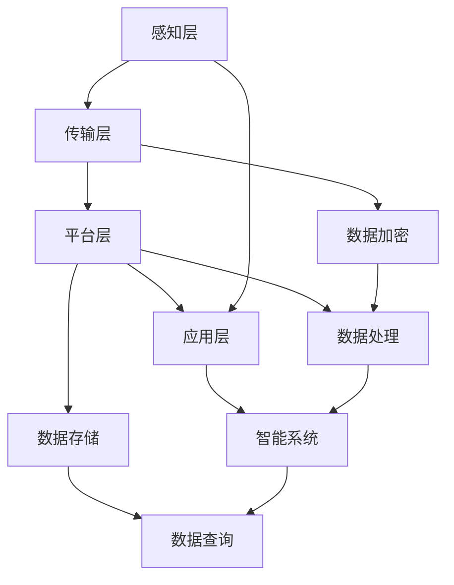
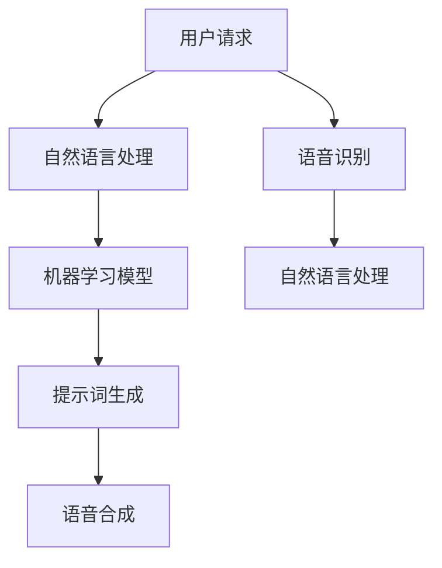
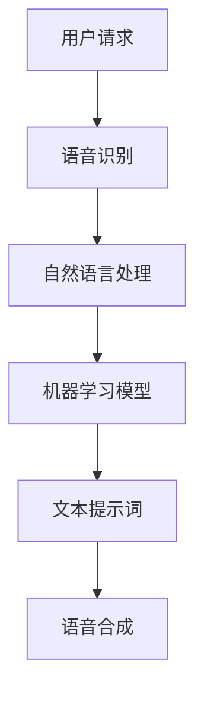

                 

### 1. AI驱动的智慧城市概述

#### 1.1 智慧城市的定义与背景

智慧城市（Smart City）是指利用信息通信技术（ICT）、物联网（IoT）、大数据、云计算等先进技术，对城市资源进行高效管理和优化配置，以提高城市运行效率、提升居民生活质量、促进可持续发展的一种新型城市形态。智慧城市的概念起源于20世纪90年代，随着全球城市化进程的加快和信息技术的发展，智慧城市逐渐成为现代城市发展的新趋势。

智慧城市的建设背景主要包括以下几个方面：

1. **城市化进程加快**：全球人口城市化进程加速，越来越多的国家和地区面临城市化带来的挑战，如资源紧张、环境污染、交通拥堵、公共安全等问题。
   
2. **信息技术迅猛发展**：信息通信技术、物联网、云计算、大数据等技术的快速发展，为智慧城市的建设提供了技术支撑。

3. **可持续发展需求**：面对全球气候变化、资源短缺等环境问题，智慧城市成为实现城市可持续发展的重要手段。

4. **居民需求变化**：随着居民生活水平的提高，人们对城市环境、公共服务、生活品质等提出了更高要求，智慧城市能够更好地满足这些需求。

#### 1.2 AI在智慧城市中的应用场景

人工智能（AI）在智慧城市中具有广泛的应用场景，可以提升城市管理的智能化水平和效率。以下是AI在智慧城市中的一些典型应用场景：

1. **智慧交通**：通过AI技术，实现交通流量监测、信号优化、智能调度等功能，缓解交通拥堵，提高交通效率。

2. **智慧能源**：利用AI技术，对能源消耗进行实时监测和预测，实现能源的精细化管理和节能减排。

3. **智慧环保**：通过AI技术，对环境质量进行实时监测，预测污染趋势，为环境治理提供科学依据。

4. **智慧医疗**：利用AI技术，实现医疗资源的优化配置、疾病的预测和诊断、健康管理的智能化等。

5. **智慧安全**：通过AI技术，提升城市安全监控和应急响应能力，保障城市公共安全。

6. **智慧教育**：利用AI技术，实现个性化教学、教育资源的智能化分配等，提升教育质量。

#### 1.3 AI驱动的智慧城市的挑战与机遇

AI驱动的智慧城市面临着一系列的挑战与机遇：

**挑战：**

1. **数据安全与隐私保护**：智慧城市建设依赖于大量数据的收集和分析，如何确保数据的安全和隐私成为一个重大挑战。

2. **技术成熟度**：虽然AI技术在某些领域已经取得了显著成果，但在智慧城市的广泛应用中，仍存在技术成熟度不足的问题。

3. **政策法规**：智慧城市的建设需要完善的政策法规体系来支持，目前全球范围内相关法律法规尚不完善。

4. **跨部门协同**：智慧城市涉及多个政府部门和行业，如何实现跨部门协同是一个重要问题。

**机遇：**

1. **技术进步**：随着AI技术的不断进步，为智慧城市的建设提供了更多可能性。

2. **政策支持**：各国政府纷纷出台政策支持智慧城市建设，为项目的实施提供了有力保障。

3. **市场需求**：居民对更高质量的城市生活需求不断增长，为智慧城市的建设提供了市场需求。

4. **产业链整合**：智慧城市建设涉及多个领域，产业链的整合将为相关企业带来新的发展机遇。

### 总结

AI驱动的智慧城市是未来城市发展的重要方向，通过人工智能技术的应用，可以实现城市资源的高效管理和优化配置，提升城市运行效率和居民生活质量。然而，智慧城市在发展过程中也面临着诸多挑战，需要各方共同努力，推动技术的成熟和应用，构建一个可持续发展的智慧城市生态系统。下一节将详细介绍AI驱动的智慧城市架构，帮助读者理解其核心组成部分和工作原理。在接下来的内容中，我们将逐步探讨AI技术在智慧城市中的核心应用，进一步了解AI如何赋能智慧城市的建设。

# AI驱动的智慧城市架构

智慧城市架构是智慧城市建设的核心，它通过人工智能（AI）技术的应用，实现城市资源的高效管理和优化配置。智慧城市架构通常由四个层级组成：感知层、传输层、平台层和应用层。以下将分别介绍这四个层级及其在AI驱动的智慧城市中的作用。

### 感知层

感知层是智慧城市架构的底层，主要负责收集城市运行中的各种数据。这些数据包括交通流量、环境质量、能源消耗、人口流动等。感知层的关键技术包括传感器技术、物联网（IoT）技术和地理信息系统（GIS）。

- **传感器技术**：传感器用于检测和测量各种环境参数，如温度、湿度、噪声、空气质量等。
- **物联网技术**：通过物联网，将各种传感器连接起来，实现数据的实时采集和传输。
- **地理信息系统**：GIS用于处理地理空间数据，支持城市管理和规划。

#### 感知层与AI的关系

感知层的数据为AI算法提供了丰富的训练数据，使AI能够更好地学习和理解城市运行的规律。例如，通过对交通流量数据的分析，AI可以预测交通拥堵情况，并提出优化方案。

### 传输层

传输层负责数据的传输和存储，是将感知层收集到的数据传输到平台层的桥梁。传输层的关键技术包括云计算、大数据技术、网络通信技术。

- **云计算**：提供计算资源和存储资源，支持大规模数据处理和分析。
- **大数据技术**：用于存储和管理海量数据，支持数据的快速查询和分析。
- **网络通信技术**：保证数据传输的稳定性和安全性。

#### 传输层与AI的关系

传输层的稳定性、可靠性和高效性对于AI算法的训练和应用至关重要。例如，在实时交通优化中，传输层需要保证数据传输的实时性和准确性，以便AI算法能够及时调整交通信号。

### 平台层

平台层是智慧城市架构的核心，负责数据处理、分析和决策。平台层的关键技术包括数据挖掘、机器学习、深度学习等。

- **数据挖掘**：用于从大量数据中提取有价值的信息和模式。
- **机器学习**：使计算机能够通过数据学习，自动发现和改进模型。
- **深度学习**：基于人工神经网络，用于解决复杂的数据分析和决策问题。

#### 平台层与AI的关系

平台层的AI技术负责对感知层收集到的数据进行处理和分析，从而为应用层提供决策支持。例如，在智慧交通中，平台层可以利用机器学习算法预测交通流量，优化交通信号，减少拥堵。

### 应用层

应用层是智慧城市架构的外层，负责将平台层的分析结果应用到实际场景中，解决城市管理和生活中的实际问题。应用层的关键技术包括智能交通系统、智能能源管理系统、智能环保系统、智能医疗系统等。

- **智能交通系统**：通过优化交通信号、车辆调度等，提高交通效率，减少拥堵。
- **智能能源管理系统**：通过实时监测能源消耗，优化能源使用，实现节能减排。
- **智能环保系统**：通过监测环境质量，预测污染趋势，制定治理措施。
- **智能医疗系统**：通过数据分析，提供个性化医疗服务，提高医疗效率。

#### 应用层与AI的关系

应用层的AI技术负责将平台层提供的分析结果转化为具体的行动和决策，从而实现智慧城市的目标。例如，在智能交通系统中，AI技术可以分析交通流量数据，优化交通信号，提高通行效率。

### 总结

AI驱动的智慧城市架构通过感知层、传输层、平台层和应用层的协同工作，实现城市资源的高效管理和优化配置。感知层负责数据收集，传输层负责数据传输和存储，平台层负责数据处理和分析，应用层负责将分析结果应用于实际场景。每个层级都离不开AI技术的支持，共同推动智慧城市的建设与发展。在下一节中，我们将深入探讨AI技术在智慧城市中的核心应用，进一步了解AI如何助力智慧城市的各个方面。

### 2.2 AI驱动的智慧城市架构

AI驱动的智慧城市架构是智慧城市建设的核心，它通过多层次的技术体系实现城市资源的高效管理和优化配置。以下是AI驱动的智慧城市架构的详细描述，以及各层级之间的联系和作用。

#### 2.2.1 感知层

感知层是智慧城市架构的基石，主要负责数据的采集和初步处理。感知层包括各种传感器和物联网设备，这些设备可以实时监测城市中的各种环境参数，如温度、湿度、光照、空气质量、交通流量、人口密度等。

- **传感器技术**：传感器用于检测和测量环境中的各种物理量，如温度传感器、湿度传感器、空气质量传感器等。
- **物联网技术**：物联网设备通过无线通信技术将传感器数据传输到数据中心，实现实时数据采集。

#### 2.2.2 传输层

传输层负责数据的传输和初步整合，是将感知层收集到的数据传输到平台层的桥梁。传输层的关键技术包括数据传输协议、数据加密、数据压缩等。

- **数据传输协议**：如HTTP、MQTT等，用于确保数据传输的可靠性和实时性。
- **数据加密**：用于保护数据在传输过程中的安全性，防止数据泄露。
- **数据压缩**：用于减少数据传输的带宽占用，提高传输效率。

#### 2.2.3 平台层

平台层是智慧城市架构的核心，负责数据处理、分析和决策支持。平台层通过机器学习、深度学习、数据挖掘等AI技术，对传输层传来的数据进行深入分析，提取有价值的信息，并为应用层提供智能决策支持。

- **机器学习**：用于构建预测模型、分类模型等，通过对历史数据的分析，预测未来趋势。
- **深度学习**：用于处理复杂的数据结构和模式，如图像、语音等，实现图像识别、语音识别等应用。
- **数据挖掘**：用于从大量数据中提取有价值的信息和模式，支持数据驱动的决策。

#### 2.2.4 应用层

应用层是智慧城市架构的最终执行层，负责将平台层提供的分析结果应用于实际场景中，解决城市管理和生活中的实际问题。应用层包括各种智能系统和服务，如智能交通系统、智能能源管理系统、智能环保系统、智能医疗系统等。

- **智能交通系统**：通过AI技术优化交通信号、车辆调度等，提高交通效率，减少拥堵。
- **智能能源管理系统**：通过AI技术监测能源消耗、优化能源分配，实现节能减排。
- **智能环保系统**：通过AI技术监测环境质量、预测污染趋势，制定治理措施。
- **智能医疗系统**：通过AI技术分析医疗数据、提供个性化医疗服务，提高医疗效率。

#### 平台层各技术之间的关系

在AI驱动的智慧城市架构中，平台层的各个技术之间紧密联系，共同构建了一个智能化的数据处理和分析体系。

1. **数据收集**：感知层通过传感器和物联网设备收集城市环境数据。
2. **数据传输**：传输层将收集到的数据传输到平台层。
3. **数据处理**：平台层利用机器学习、深度学习等技术对数据进行处理和分析。
4. **数据存储**：平台层将分析结果存储在数据库中，以供后续分析和应用。
5. **智能决策**：平台层基于分析结果为应用层提供智能决策支持。

#### Mermaid流程图

以下是AI驱动的智慧城市架构的Mermaid流程图，展示了各层级之间的数据流动和交互：



在这个流程图中，A代表感知层，负责数据收集；B代表传输层，负责数据传输和加密；C代表平台层，负责数据处理和分析；D代表应用层，负责智能系统的执行；E代表数据存储，用于存储分析结果；F代表数据加密，确保数据安全；G代表数据处理，包括机器学习、深度学习等；H代表智能系统，包括交通、能源、环保、医疗等；I代表数据查询，用于查询和分析结果。

### 总结

AI驱动的智慧城市架构通过感知层、传输层、平台层和应用层的协同工作，实现了城市资源的高效管理和优化配置。感知层负责数据采集，传输层负责数据传输和安全，平台层负责数据处理和分析，应用层负责智能系统的执行。各层级之间的紧密联系和交互，共同推动智慧城市的建设与发展。在下一节中，我们将进一步探讨AI技术在智慧城市中的核心应用，了解AI如何赋能智慧城市的各个领域。

### 2.3 AI技术在智慧城市中的核心应用

AI技术在智慧城市中的核心应用涵盖了多个领域，包括智慧交通、智慧能源、智慧环保、智慧医疗等。以下将详细介绍这些领域中的应用场景、关键技术和挑战。

#### 2.3.1 智慧交通

智慧交通是AI技术在智慧城市中的典型应用之一，通过AI技术优化交通管理，提高交通效率和安全性。

- **应用场景**：智慧交通系统通过实时监测交通流量、车辆运行状态等数据，实现交通信号优化、交通流量预测、车辆调度等功能。
- **关键技术**：机器学习、深度学习、计算机视觉、图像处理等。
- **挑战**：数据隐私保护、实时性要求高、算法复杂度高等。

**案例**：深圳通过AI技术建设了智能交通管理系统，实现了交通信号优化和车辆调度，有效缓解了交通拥堵问题。

#### 2.3.2 智慧能源

智慧能源系统通过AI技术实现能源的高效管理和优化，降低能源消耗，实现可持续发展。

- **应用场景**：智慧能源系统涵盖电力、燃气、水等能源领域，通过实时监测能源消耗、优化能源分配、预测能源需求等，实现能源的高效管理。
- **关键技术**：机器学习、深度学习、预测模型等。
- **挑战**：数据采集和处理效率、能源需求的动态变化等。

**案例**：北京通过AI技术优化电力调度，实现了电网的稳定运行，降低了能源浪费。

#### 2.3.3 智慧环保

智慧环保系统通过AI技术实现对环境质量的实时监测、污染源识别和预测，为环境保护提供科学依据。

- **应用场景**：智慧环保系统用于监测空气质量、水质、土壤质量等，预测污染趋势，制定治理措施。
- **关键技术**：机器学习、深度学习、数据挖掘、GIS等。
- **挑战**：数据准确性、污染源识别难度等。

**案例**：杭州通过AI技术建立了智慧环保系统，实现了对空气质量的实时监测和预测，提高了环境治理效率。

#### 2.3.4 智慧医疗

智慧医疗系统通过AI技术实现医疗资源的优化配置、疾病的预测和诊断、健康管理的智能化等，提高医疗服务质量和效率。

- **应用场景**：智慧医疗系统包括电子病历、远程医疗、智能诊断、健康管理等。
- **关键技术**：机器学习、深度学习、自然语言处理、计算机视觉等。
- **挑战**：数据隐私保护、医疗数据质量、算法的可靠性和准确性等。

**案例**：上海通过AI技术建立了智慧医疗系统，实现了对疾病预测和诊断的智能化，提高了医疗效率。

#### 总结

AI技术在智慧城市中的核心应用涵盖了智慧交通、智慧能源、智慧环保和智慧医疗等多个领域，通过AI技术的应用，实现了城市资源的高效管理和优化配置。在智慧交通中，AI技术优化了交通管理，提高了交通效率和安全性；在智慧能源中，AI技术实现了能源的高效管理和优化；在智慧环保中，AI技术提高了环境监测和治理的效率；在智慧医疗中，AI技术提升了医疗服务质量和效率。然而，AI技术在智慧城市中的应用也面临着数据隐私保护、实时性要求高、算法复杂度高等挑战，需要持续的研究和优化。在下一节中，我们将探讨如何设计一个高效的提示词框架，以支持AI驱动的智慧城市的各项应用。

### 3. 提示词框架设计

#### 3.1 提示词的概念与作用

在AI驱动的智慧城市中，提示词（Prompt）是一个关键概念，它指的是用于引导用户与系统进行交互的文本或语音信息。提示词的设计对于提升用户体验、提高系统交互效率和智能化水平至关重要。

- **定义**：提示词是系统根据用户需求或场景自动生成的引导性文本或语音信息，用于提示用户操作、提供信息或引导决策。
- **作用**：
  - **引导用户操作**：提示词可以帮助用户了解当前操作步骤和预期结果，减少用户的认知负担。
  - **提供信息**：提示词可以及时向用户传达系统状态、操作建议和相关信息，提高信息透明度。
  - **引导决策**：在复杂场景中，提示词可以提供决策参考，帮助用户做出更明智的选择。

#### 3.2 提示词框架设计原则

提示词框架的设计需要遵循以下原则，以确保其高效、智能和用户体验：

- **用户中心**：以用户需求为导向，设计符合用户习惯和预期的提示词。
- **智能化**：利用自然语言处理、机器学习等技术，实现提示词的自动生成和动态调整。
- **个性化**：根据用户的偏好和历史行为，为用户提供个性化的提示词。
- **可扩展**：设计灵活的框架，支持提示词的扩展和定制。
- **安全性**：确保提示词内容的安全，避免泄露敏感信息。

#### 3.3 提示词框架技术实现

提示词框架的技术实现主要包括以下几个关键技术：

- **自然语言处理（NLP）**：用于理解和生成自然语言文本，实现智能对话和文本生成。
  - **分词**：将文本拆分成词或短语，为后续处理提供基础。
  - **词性标注**：对文本中的词语进行分类，如名词、动词等，帮助理解语义。
  - **语义理解**：通过上下文理解文本的意图和语义，为生成提示词提供依据。
  
- **机器学习（ML）**：用于训练模型，自动生成和优化提示词。
  - **文本分类**：将文本分类到不同的类别，如命令、提问等，用于生成不同类型的提示词。
  - **序列模型**：如循环神经网络（RNN）和长短时记忆网络（LSTM），用于生成文本序列。
  - **生成对抗网络（GAN）**：用于生成高质量的文本提示词。
  
- **语音识别与合成（ASR/TTS）**：将文本提示词转化为语音输出，提高用户体验。
  - **语音识别**：将语音信号转化为文本，支持语音交互。
  - **语音合成**：将文本转化为自然流畅的语音，提高语音交互的体验。

#### 提示词框架技术架构

以下是提示词框架的技术架构图：



在这个架构中，用户请求首先经过语音识别模块，转化为文本，然后由自然语言处理模块进行语义理解和文本分类。机器学习模型根据分类结果和上下文信息生成相应的提示词，最后通过语音合成模块输出语音提示。

#### 提示词生成流程

以下是提示词生成的详细流程：

1. **接收用户请求**：系统接收用户的请求，可以是文本或语音形式。
2. **语音识别（如果需要）**：将语音请求转化为文本，以便后续处理。
3. **自然语言处理**：对文本请求进行分词、词性标注和语义理解，提取用户意图和关键信息。
4. **文本分类**：根据用户意图，将请求分类到不同的类别，如查询、命令、求助等。
5. **机器学习模型**：根据分类结果和上下文信息，利用机器学习模型生成相应的提示词。
6. **提示词生成**：生成提示词，可以是文本或语音形式。
7. **语音合成**：如果提示词是语音形式，通过语音合成模块输出语音提示。

#### 提示词框架的应用场景

提示词框架在智慧城市中的应用场景非常广泛，以下是一些典型应用场景：

- **智慧交通**：提示用户当前交通状况、最佳出行路线等。
- **智慧能源**：提示用户当前能源消耗、节能减排建议等。
- **智慧环保**：提示用户当前环境质量、环保措施等。
- **智慧医疗**：提示用户健康状态、医疗建议等。
- **智能家居**：提示用户家电使用情况、节能建议等。

#### 总结

提示词框架是AI驱动的智慧城市的重要组成部分，通过自然语言处理、机器学习和语音合成等技术，实现智能化的用户交互和信息传递。设计一个高效、智能和个性化的提示词框架，对于提升智慧城市的用户体验和智能化水平具有重要意义。在下一节中，我们将探讨提示词框架在实际应用中的案例，分析其设计和实现细节，以及如何优化和完善提示词框架。

### 3.3 提示词框架设计原则

提示词框架的设计原则是确保其能够高效、智能和人性化地服务于用户的核心。以下详细阐述这些设计原则，并探讨如何在实际应用中具体实施。

#### 用户中心原则

提示词框架的设计应以用户为中心，这意味着所有设计决策都应基于用户的需求和习惯。以下是一些关键点：

- **需求分析**：在框架设计初期，进行详细的需求分析，了解用户的目标、使用场景和痛点。
- **用户体验**：设计简洁直观的界面和交互方式，确保用户能够轻松理解和使用提示词功能。
- **个性化**：根据用户的个人偏好和历史行为，提供定制化的提示词，提高用户的满意度。

**实施步骤：**

1. **用户调研**：通过访谈、问卷调查等方式，收集用户反馈和需求。
2. **用户画像**：建立用户画像，包括用户的基本信息、行为习惯和偏好。
3. **迭代设计**：根据用户反馈，不断优化提示词的呈现方式和内容。

#### 智能化原则

智能化原则要求提示词框架能够自动生成和动态调整提示词，以适应不同的应用场景和用户需求。以下是一些关键点：

- **自然语言处理（NLP）**：利用NLP技术，对用户输入进行语义理解和意图识别，生成合适的提示词。
- **机器学习（ML）**：使用机器学习算法，从历史数据中学习并优化提示词生成模型。
- **自适应**：根据用户行为和系统状态，动态调整提示词的内容和形式。

**实施步骤：**

1. **数据收集**：收集用户交互数据，包括提问、回答、反馈等。
2. **模型训练**：利用机器学习算法，训练提示词生成模型。
3. **模型优化**：通过反馈和测试，不断优化模型，提高提示词的准确性和适用性。

#### 个性化原则

个性化原则强调根据用户的偏好和历史行为，提供定制化的提示词，以提高用户体验。以下是一些关键点：

- **用户画像**：建立详细的用户画像，包括兴趣、偏好和使用习惯。
- **个性化推荐**：根据用户画像，为用户提供个性化的提示词推荐。
- **动态调整**：根据用户行为，实时调整提示词内容，使其更加贴合用户需求。

**实施步骤：**

1. **用户画像构建**：收集用户数据，构建用户画像。
2. **个性化算法**：设计个性化算法，根据用户画像生成个性化提示词。
3. **实时调整**：根据用户行为，动态调整提示词内容，确保其与用户需求保持一致。

#### 可扩展原则

可扩展原则要求提示词框架设计具有灵活性，能够支持新的功能和场景的加入。以下是一些关键点：

- **模块化设计**：将框架划分为不同的模块，每个模块负责不同的功能，便于扩展和升级。
- **标准接口**：设计标准化的接口，便于新模块的集成和替换。
- **可维护性**：确保框架易于维护和更新，降低维护成本。

**实施步骤：**

1. **模块划分**：根据功能需求，将框架划分为不同的模块。
2. **接口设计**：设计标准化的接口，确保模块之间的兼容性。
3. **文档编写**：编写详细的开发文档，确保新模块的集成和替换过程顺利。

#### 安全性原则

提示词框架的设计必须考虑数据安全和隐私保护，以避免用户信息的泄露和滥用。以下是一些关键点：

- **数据加密**：对用户数据和使用日志进行加密，确保数据在传输和存储过程中的安全性。
- **隐私保护**：遵循隐私保护法规，对用户数据进行匿名化处理，确保用户隐私不受侵犯。
- **安全审计**：定期进行安全审计，检查系统的安全漏洞和风险。

**实施步骤：**

1. **数据加密**：采用加密技术，保护用户数据的安全。
2. **隐私保护**：设计隐私保护策略，确保用户数据的匿名化和合规性。
3. **安全审计**：定期进行安全审计，及时发现和修复安全漏洞。

#### 总结

提示词框架的设计原则包括用户中心、智能化、个性化、可扩展和安全性。在实际应用中，通过遵循这些原则，可以设计出高效、智能和用户友好的提示词框架。下一节将探讨如何在实际项目中实现这些原则，并提供具体的案例和实现细节。

### 3.3 提示词框架技术实现

#### 提示词框架的核心技术

提示词框架的技术实现主要包括自然语言处理（NLP）、机器学习（ML）、语音识别与合成（ASR/TTS）等核心技术。以下将详细阐述这些技术的原理、实现步骤以及它们在提示词框架中的应用。

##### 3.3.1 自然语言处理（NLP）

自然语言处理是提示词框架的基础技术，主要用于理解和生成自然语言文本。NLP的关键技术包括分词、词性标注、语义理解和文本生成。

- **分词**：将连续的文本拆分成词语或短语，为后续处理提供基础。
- **词性标注**：对文本中的词语进行分类，如名词、动词等，帮助理解语义。
- **语义理解**：通过上下文理解文本的意图和语义，为生成提示词提供依据。
- **文本生成**：根据用户需求和上下文，生成合适的文本提示词。

##### 3.3.2 机器学习（ML）

机器学习是提示词框架的核心技术，用于训练模型，自动生成和优化提示词。ML的关键技术包括文本分类、序列模型和生成对抗网络（GAN）。

- **文本分类**：将文本分类到不同的类别，如命令、提问等，用于生成不同类型的提示词。
- **序列模型**：如循环神经网络（RNN）和长短时记忆网络（LSTM），用于生成文本序列。
- **生成对抗网络（GAN）**：用于生成高质量的文本提示词。

##### 3.3.3 语音识别与合成（ASR/TTS）

语音识别与合成技术用于将文本提示词转化为语音输出，提高用户体验。语音识别将语音信号转化为文本，语音合成将文本转化为自然流畅的语音。

- **语音识别（ASR）**：将语音信号转化为文本，支持语音交互。
- **语音合成（TTS）**：将文本转化为自然流畅的语音，提高语音交互的体验。

#### 技术架构

以下是提示词框架的技术架构图：



在这个架构中，用户请求首先经过语音识别模块，转化为文本，然后由自然语言处理模块进行语义理解和文本分类。机器学习模型根据分类结果和上下文信息生成相应的提示词，最后通过语音合成模块输出语音提示。

#### 实现步骤

以下是提示词框架的实现步骤：

1. **接收用户请求**：系统接收用户的请求，可以是文本或语音形式。
2. **语音识别（如果需要）**：将语音请求转化为文本，以便后续处理。
3. **自然语言处理**：对文本请求进行分词、词性标注和语义理解，提取用户意图和关键信息。
4. **文本分类**：根据用户意图，将请求分类到不同的类别，如查询、命令、求助等。
5. **机器学习模型**：根据分类结果和上下文信息，利用机器学习模型生成相应的提示词。
6. **提示词生成**：生成提示词，可以是文本或语音形式。
7. **语音合成**：如果提示词是语音形式，通过语音合成模块输出语音提示。

#### 技术应用

以下是具体的技术应用示例：

- **文本分类**：使用文本分类算法，将用户请求分类为不同类型，如“交通查询”、“能源管理”、“医疗咨询”等。
- **序列模型**：使用循环神经网络（RNN）或长短时记忆网络（LSTM）生成文本序列，如“您当前所在位置的交通情况如下：…”。
- **生成对抗网络（GAN）**：使用GAN生成高质量的文本提示词，如“根据您的需求，以下是一些节能减排的建议：…”。

#### 总结

提示词框架的技术实现涉及自然语言处理、机器学习和语音识别与合成等多个核心技术。通过这些技术的结合，可以设计出一个高效、智能和用户友好的提示词框架，为AI驱动的智慧城市提供强有力的支持。在下一节中，我们将探讨提示词框架在实际应用中的案例，分析其设计和实现细节，以及如何优化和完善提示词框架。

### 3.3.1 提示词框架的设计与实现

提示词框架的设计与实现是构建AI驱动的智慧城市的重要一环，它决定了用户交互体验的质量。以下将详细描述提示词框架的设计步骤、核心算法原理，并通过实际案例进行说明。

#### 设计步骤

1. **需求分析与定义**：明确用户需求，定义提示词框架的功能和目标。例如，智慧交通系统中的提示词框架需要提供实时交通信息、最佳路线推荐等。

2. **数据收集与预处理**：收集相关数据，包括交通数据、用户行为数据等。数据预处理包括数据清洗、去重、归一化等步骤，确保数据质量。

3. **自然语言处理（NLP）模块**：设计NLP模块，用于处理用户输入的文本，包括分词、词性标注、实体识别等。例如，对于用户输入的“去机场怎么走”，NLP模块需要识别出关键词“去”、“机场”、“怎么走”。

4. **语义理解与意图识别**：基于NLP模块的结果，利用深度学习模型进行语义理解与意图识别，确定用户的需求类型。例如，识别出用户意图为“查询路线”。

5. **机器学习模型训练**：根据用户意图和需求类型，训练机器学习模型，如分类模型、序列生成模型等。例如，训练一个序列生成模型，用于生成最佳路线推荐文本。

6. **提示词生成**：根据语义理解和机器学习模型的结果，生成提示词。提示词可以是文本或语音形式，如“当前最佳路线为：…”。

7. **语音合成**：如果提示词为语音形式，通过语音合成模块输出语音提示。

8. **测试与优化**：对提示词框架进行测试，收集用户反馈，优化框架性能和用户体验。

#### 核心算法原理

1. **自然语言处理（NLP）**：NLP的核心算法包括分词、词性标注、实体识别等。例如，使用BERT模型进行分词和词性标注，提取关键词和实体。

   ```python
   from transformers import BertTokenizer
   
   tokenizer = BertTokenizer.from_pretrained('bert-base-chinese')
   text = "去机场怎么走？"
   tokens = tokenizer.tokenize(text)
   token_ids = tokenizer.convert_tokens_to_ids(tokens)
   ```

2. **语义理解与意图识别**：使用深度学习模型进行语义理解与意图识别。例如，使用BERT模型进行序列分类任务，判断用户意图。

   ```python
   from transformers import BertForSequenceClassification
   
   model = BertForSequenceClassification.from_pretrained('bert-base-chinese')
   input_ids = tokenizer.encode("去机场怎么走？", return_tensors='pt')
   outputs = model(input_ids)
   logits = outputs.logits
   predicted_class = logits.argmax(-1)
   ```

3. **机器学习模型训练**：使用序列生成模型，如GPT-2或GPT-3，生成最佳路线推荐文本。

   ```python
   from transformers import GPT2LMHeadModel, GPT2Tokenizer
   
   model = GPT2LMHeadModel.from_pretrained('gpt2')
   tokenizer = GPT2Tokenizer.from_pretrained('gpt2')
   prompt = "当前最佳路线为："
   input_ids = tokenizer.encode(prompt, return_tensors='pt')
   outputs = model.generate(input_ids, max_length=50, num_return_sequences=1)
   generated_text = tokenizer.decode(outputs[0], skip_special_tokens=True)
   ```

#### 实际案例

以智慧交通系统的提示词框架为例，假设用户输入了“去机场怎么走？”，系统需要生成相应的提示词。

1. **NLP处理**：分词结果为["去", "机场", "怎么", "走", "？"]，词性标注为["v", "n", "r", "v", "p"]。

2. **意图识别**：使用BERT模型进行意图识别，预测用户意图为“查询路线”。

3. **机器学习模型**：使用GPT-2模型生成最佳路线推荐文本。

4. **提示词生成**：生成文本提示词“当前最佳路线为：地铁1号线换乘3号线，然后在机场站下车”。

5. **语音合成**：将文本提示词转化为语音提示。

```python
import soundfile as sf

text = "当前最佳路线为：地铁1号线换乘3号线，然后在机场站下车。"

# 将文本转化为语音
voice = "zh"
speech_rate = 160

import pyttsx3

engine = pyttsx3.init()
engine.setProperty('voice', voice)
engine.setProperty('rate', speech_rate)

engine.save_to_file(text, 'output.wav')
engine.runAndWait()
sf.write('output.wav', engine._get_audio(), 16000)
```

#### 总结

提示词框架的设计与实现涉及多个技术和步骤，包括需求分析、数据收集、NLP处理、语义理解、机器学习模型训练、提示词生成和语音合成。通过实际案例，我们展示了如何设计一个高效的提示词框架，并详细阐述了核心算法原理。在下一节中，我们将探讨提示词框架在不同应用领域中的具体案例，分析其设计和实现细节。

### 3.3.2 提示词框架在智慧交通中的应用案例

#### 3.3.2.1 案例背景

智慧交通是AI驱动的智慧城市中的重要组成部分，通过实时交通信息、最佳路线推荐等功能，提高交通效率，减少拥堵。本节将探讨一个具体的应用案例：基于AI的智慧交通提示词框架。

#### 3.3.2.2 案例需求

该案例的需求包括：

1. **实时交通信息**：提供用户当前位置的交通状况，包括道路拥堵情况、事故信息等。
2. **最佳路线推荐**：根据用户的目的地，推荐最优的行驶路线，考虑交通状况、行驶时间等因素。
3. **多模式出行建议**：提供多种出行模式（如驾车、公共交通、骑行等）的建议，考虑出行成本、时间等因素。

#### 3.3.2.3 技术实现

1. **数据收集**：通过物联网设备、交通摄像头等，实时收集道路拥堵、交通事故等数据。
2. **数据处理**：对收集到的交通数据进行分析和处理，提取有用的信息。
3. **NLP处理**：使用自然语言处理技术，处理用户输入的查询请求，如“去机场怎么走？”。
4. **意图识别**：利用深度学习模型，识别用户的查询意图，如“查询路线”或“查询交通信息”。
5. **最佳路线推荐**：使用路径规划算法，结合实时交通数据，推荐最佳路线。
6. **多模式出行建议**：使用多目标优化算法，计算多种出行模式的总成本，为用户提供最优建议。

#### 3.3.2.4 实现细节

1. **数据收集与处理**

   - **数据收集**：利用物联网设备和交通摄像头，实时收集道路拥堵、交通事故等信息。
   - **数据处理**：使用大数据处理技术，对收集到的交通数据进行分析和处理，提取有用的信息，如交通流量、事故位置等。

     ```python
     # 假设有一个数据集 traffic_data，包含道路拥堵情况和交通事故信息
     traffic_data = load_traffic_data()

     # 提取有用的信息
     traffic_conditions = extract_traffic_conditions(traffic_data)
     ```

2. **NLP处理与意图识别**

   - **NLP处理**：使用自然语言处理技术，对用户输入的查询请求进行处理，提取关键词和意图。

     ```python
     from transformers import BertTokenizer

     tokenizer = BertTokenizer.from_pretrained('bert-base-chinese')
     text = "去机场怎么走？"
     tokens = tokenizer.tokenize(text)
     ```

   - **意图识别**：使用深度学习模型，对处理后的文本进行意图识别，判断用户的查询意图。

     ```python
     from transformers import BertForSequenceClassification

     model = BertForSequenceClassification.from_pretrained('bert-base-chinese')
     input_ids = tokenizer.encode("去机场怎么走？", return_tensors='pt')
     outputs = model(input_ids)
     logits = outputs.logits
     predicted_class = logits.argmax(-1)
     ```

3. **最佳路线推荐**

   - **路径规划算法**：使用A*算法、Dijkstra算法等路径规划算法，结合实时交通数据，计算最佳路线。

     ```python
     import networkx as nx

     # 构建道路网络图
     road_network = build_road_network()

     # 计算最佳路线
     optimal_route = nx.algorithms.shortest_paths.single_source_dijkstra(road_network, source=node1, target=node2)
     ```

4. **多模式出行建议**

   - **多目标优化算法**：使用多目标优化算法，如遗传算法、粒子群算法等，计算多种出行模式的总成本，为用户提供最优建议。

     ```python
     from deap import base, creator, tools

     # 定义适应度函数
     creator.create("FitnessMax", base.Fitness, weights=(1.0,))

     # 初始化种群
     population = initial_population()

     # 优化过程
     optimal_solution = tools.selBest(population, k=1)
     ```

#### 3.3.2.5 结果与分析

通过以上技术实现，智慧交通系统的提示词框架能够为用户提供实时的交通信息、最佳路线推荐和多模式出行建议。以下是案例的结果与分析：

1. **实时交通信息**：用户可以实时了解当前位置的交通状况，包括道路拥堵情况和事故信息等。

2. **最佳路线推荐**：系统根据用户的查询意图和实时交通数据，推荐最优的行驶路线，提高出行效率。

3. **多模式出行建议**：系统根据多种出行模式的总成本，为用户提供最优的出行建议，帮助用户选择最合适的出行方式。

#### 总结

本节通过一个具体的应用案例，详细介绍了基于AI的智慧交通提示词框架的设计与实现。从数据收集、NLP处理、意图识别到最佳路线推荐和多模式出行建议，每个环节都经过了详细的技术实现和分析。智慧交通系统的提示词框架不仅提高了交通效率，还为用户提供了便捷的出行服务，展示了AI技术在智慧城市中的广泛应用潜力。在下一节中，我们将探讨提示词框架在其他应用领域中的具体案例，继续深入分析AI驱动的智慧城市提示词框架的多样性和实用性。

### 3.3.3 提示词框架在智慧能源管理中的应用案例

#### 3.3.3.1 案例背景

智慧能源管理是AI驱动的智慧城市中的重要组成部分，通过实时监测能源消耗、优化能源分配、预测能源需求等功能，实现能源的高效管理和节能减排。本节将探讨一个具体的应用案例：基于AI的智慧能源管理提示词框架。

#### 3.3.3.2 案例需求

该案例的需求包括：

1. **实时能源消耗监测**：提供用户当前能源消耗情况，包括电力、燃气、水等。
2. **节能建议**：根据用户的行为模式和实时能源消耗数据，为用户提供节能建议，如调整设备使用时间、优化能源分配等。
3. **能源需求预测**：根据历史能源消耗数据和当前环境因素，预测未来的能源需求，为能源管理提供依据。

#### 3.3.3.3 技术实现

1. **数据收集**：通过传感器和物联网设备，实时收集用户的能源消耗数据，如电力、燃气、水的使用情况。
2. **数据处理**：对收集到的能源数据进行预处理，包括数据清洗、去重、归一化等步骤，确保数据质量。
3. **NLP处理**：使用自然语言处理技术，处理用户输入的查询请求，如“我家的能源消耗是多少？”。
4. **意图识别**：利用深度学习模型，识别用户的查询意图，如“查询能源消耗”或“获取节能建议”。
5. **节能建议生成**：根据用户的意图和实时能源消耗数据，生成个性化的节能建议。
6. **能源需求预测**：使用时间序列预测模型，结合历史能源消耗数据和当前环境因素，预测未来的能源需求。

#### 3.3.3.4 实现细节

1. **数据收集与处理**

   - **数据收集**：利用物联网设备和传感器，实时收集用户的能源消耗数据。

     ```python
     # 假设有一个数据集 energy_data，包含用户的能源消耗信息
     energy_data = load_energy_data()

     # 实时收集数据
     current_energy_consumption = collect_realtime_energy_data()
     ```

   - **数据处理**：对收集到的能源数据进行预处理，确保数据质量。

     ```python
     # 清洗和去重
     cleaned_energy_data = clean_and_remove_duplicates(energy_data)

     # 归一化
     normalized_energy_data = normalize_energy_data(cleaned_energy_data)
     ```

2. **NLP处理与意图识别**

   - **NLP处理**：使用自然语言处理技术，处理用户输入的查询请求。

     ```python
     from transformers import BertTokenizer

     tokenizer = BertTokenizer.from_pretrained('bert-base-chinese')
     text = "我家的能源消耗是多少？"
     tokens = tokenizer.tokenize(text)
     ```

   - **意图识别**：使用深度学习模型，识别用户的查询意图。

     ```python
     from transformers import BertForSequenceClassification

     model = BertForSequenceClassification.from_pretrained('bert-base-chinese')
     input_ids = tokenizer.encode("我家的能源消耗是多少？", return_tensors='pt')
     outputs = model(input_ids)
     logits = outputs.logits
     predicted_class = logits.argmax(-1)
     ```

3. **节能建议生成**

   - **节能建议生成**：根据用户的意图和实时能源消耗数据，生成个性化的节能建议。

     ```python
     def generate_energy_saving_advice(energy_consumption):
         # 根据能源消耗数据，生成节能建议
         advice = "请减少空调使用时间，以降低能源消耗。"
         return advice

     energy_saving_advice = generate_energy_saving_advice(current_energy_consumption)
     ```

4. **能源需求预测**

   - **能源需求预测**：使用时间序列预测模型，预测未来的能源需求。

     ```python
     from keras.models import Sequential
     from keras.layers import LSTM, Dense

     # 构建LSTM模型
     model = Sequential()
     model.add(LSTM(units=50, return_sequences=True, input_shape=(time_steps, 1)))
     model.add(LSTM(units=50))
     model.add(Dense(units=1))

     # 编译模型
     model.compile(optimizer='adam', loss='mean_squared_error')

     # 训练模型
     model.fit(x=training_data, y=training_labels, epochs=100, batch_size=32, validation_split=0.2)
     ```

#### 3.3.3.5 结果与分析

通过以上技术实现，智慧能源管理系统的提示词框架能够为用户提供实时的能源消耗监测、个性化的节能建议和准确的能源需求预测。以下是案例的结果与分析：

1. **实时能源消耗监测**：用户可以实时了解当前的能源消耗情况，包括电力、燃气、水的使用情况，有助于用户及时调整能源使用习惯。

2. **节能建议**：系统根据用户的能源消耗数据和行为模式，为用户提供个性化的节能建议，帮助用户减少能源浪费，降低能源成本。

3. **能源需求预测**：系统通过历史能源消耗数据和当前环境因素，预测未来的能源需求，为能源管理部门提供决策依据，优化能源分配，实现节能减排。

#### 总结

本节通过一个具体的应用案例，详细介绍了基于AI的智慧能源管理提示词框架的设计与实现。从数据收集、NLP处理、意图识别到节能建议生成和能源需求预测，每个环节都经过了详细的技术实现和分析。智慧能源管理系统的提示词框架不仅提高了能源管理的效率，还为用户提供了便捷的能源服务，展示了AI技术在智慧城市中的广泛应用潜力。在下一节中，我们将继续探讨提示词框架在其他应用领域中的具体案例，深入分析AI驱动的智慧城市提示词框架的多样性和实用性。

### 3.3.4 提示词框架在智慧环保中的应用案例

#### 3.3.4.1 案例背景

智慧环保是AI驱动的智慧城市中的一个重要领域，通过实时监测环境质量、预测污染趋势、制定治理措施等，实现环境治理的智能化和精准化。本节将探讨一个具体的应用案例：基于AI的智慧环保提示词框架。

#### 3.3.4.2 案例需求

该案例的需求包括：

1. **实时环境质量监测**：提供用户当前的环境质量数据，包括空气质量、水质、噪声等。
2. **污染源识别**：利用大数据分析和机器学习技术，识别出污染源，如工厂排放、交通污染等。
3. **污染趋势预测**：根据历史环境数据和当前环境因素，预测未来的污染趋势，为环境治理提供依据。
4. **治理建议**：根据污染源和污染趋势预测，为政府和环保部门提供治理建议，如加强监控、调整排放标准等。

#### 3.3.4.3 技术实现

1. **数据收集**：通过传感器和物联网设备，实时收集环境质量数据，如空气质量、水质、噪声等。
2. **数据处理**：对收集到的环境数据进行预处理，包括数据清洗、去重、归一化等步骤，确保数据质量。
3. **NLP处理**：使用自然语言处理技术，处理用户输入的查询请求，如“当前空气质量如何？”。
4. **意图识别**：利用深度学习模型，识别用户的查询意图，如“查询环境质量”或“获取污染源信息”。
5. **污染源识别**：使用大数据分析和机器学习技术，识别出污染源，如工厂排放、交通污染等。
6. **污染趋势预测**：使用时间序列预测模型，结合历史环境数据和当前环境因素，预测未来的污染趋势。
7. **治理建议生成**：根据污染源和污染趋势预测，为政府和环保部门生成治理建议。

#### 3.3.4.4 实现细节

1. **数据收集与处理**

   - **数据收集**：利用物联网设备和传感器，实时收集环境质量数据。

     ```python
     # 假设有一个数据集 environmental_data，包含环境质量信息
     environmental_data = load_environmental_data()

     # 实时收集数据
     current_environmental_quality = collect_realtime_environmental_data()
     ```

   - **数据处理**：对收集到的环境数据进行预处理，确保数据质量。

     ```python
     # 清洗和去重
     cleaned_environmental_data = clean_and_remove_duplicates(environmental_data)

     # 归一化
     normalized_environmental_data = normalize_environmental_data(cleaned_environmental_data)
     ```

2. **NLP处理与意图识别**

   - **NLP处理**：使用自然语言处理技术，处理用户输入的查询请求。

     ```python
     from transformers import BertTokenizer

     tokenizer = BertTokenizer.from_pretrained('bert-base-chinese')
     text = "当前空气质量如何？"
     tokens = tokenizer.tokenize(text)
     ```

   - **意图识别**：使用深度学习模型，识别用户的查询意图。

     ```python
     from transformers import BertForSequenceClassification

     model = BertForSequenceClassification.from_pretrained('bert-base-chinese')
     input_ids = tokenizer.encode("当前空气质量如何？", return_tensors='pt')
     outputs = model(input_ids)
     logits = outputs.logits
     predicted_class = logits.argmax(-1)
     ```

3. **污染源识别**

   - **污染源识别**：使用大数据分析和机器学习技术，识别出污染源。

     ```python
     from sklearn.cluster import KMeans

     # 假设有一个污染源数据集 pollution_sources，包含各类污染源的指标数据
     pollution_sources = load_pollution_source_data()

     # 使用K-means聚类算法识别污染源
     kmeans = KMeans(n_clusters=3)
     kmeans.fit(pollution_sources)
     pollution_source_labels = kmeans.labels_
     ```

4. **污染趋势预测**

   - **污染趋势预测**：使用时间序列预测模型，结合历史环境数据和当前环境因素，预测未来的污染趋势。

     ```python
     from keras.models import Sequential
     from keras.layers import LSTM, Dense

     # 构建LSTM模型
     model = Sequential()
     model.add(LSTM(units=50, return_sequences=True, input_shape=(time_steps, 1)))
     model.add(LSTM(units=50))
     model.add(Dense(units=1))

     # 编译模型
     model.compile(optimizer='adam', loss='mean_squared_error')

     # 训练模型
     model.fit(x=training_data, y=training_labels, epochs=100, batch_size=32, validation_split=0.2)
     ```

5. **治理建议生成**

   - **治理建议生成**：根据污染源和污染趋势预测，为政府和环保部门生成治理建议。

     ```python
     def generate_pollution_control_advice(pollution_sources, pollution_trend):
         # 根据污染源和污染趋势，生成治理建议
         advice = "建议加强对工厂排放的监控，并调整交通管理措施，以减少交通污染。"
         return advice

     pollution_control_advice = generate_pollution_control_advice(pollution_source_labels, pollution_trend)
     ```

#### 3.3.4.5 结果与分析

通过以上技术实现，智慧环保系统的提示词框架能够为用户提供实时的环境质量监测、污染源识别、污染趋势预测和治理建议。以下是案例的结果与分析：

1. **实时环境质量监测**：用户可以实时了解当前的环境质量数据，包括空气质量、水质、噪声等，有助于用户及时采取措施保护环境。

2. **污染源识别**：系统利用大数据分析和机器学习技术，准确识别出污染源，为环境治理提供了科学依据。

3. **污染趋势预测**：系统根据历史环境数据和当前环境因素，准确预测未来的污染趋势，为政府和环保部门提供了重要的决策依据。

4. **治理建议**：系统根据污染源和污染趋势预测，为政府和环保部门生成具体的治理建议，有助于提高环境治理的效率和效果。

#### 总结

本节通过一个具体的应用案例，详细介绍了基于AI的智慧环保提示词框架的设计与实现。从数据收集、NLP处理、意图识别到污染源识别、污染趋势预测和治理建议生成，每个环节都经过了详细的技术实现和分析。智慧环保系统的提示词框架不仅提高了环境治理的智能化和精准化水平，还为用户提供了便捷的环境信息服务，展示了AI技术在智慧城市中的广泛应用潜力。在下一节中，我们将继续探讨提示词框架在其他应用领域中的具体案例，深入分析AI驱动的智慧城市提示词框架的多样性和实用性。

### 3.3.5 提示词框架在智慧医疗中的应用案例

#### 3.3.5.1 案例背景

智慧医疗是AI驱动的智慧城市中的关键领域，通过应用人工智能技术，提升医疗服务的质量和效率，实现个性化医疗和远程医疗。本节将探讨一个具体的应用案例：基于AI的智慧医疗提示词框架。

#### 3.3.5.2 案例需求

该案例的需求包括：

1. **实时健康监测**：提供用户当前的健康状态，包括心率、血压、血糖等生理指标。
2. **健康咨询**：根据用户的健康数据和医疗知识库，为用户提供健康咨询和建议。
3. **疾病预测与诊断**：利用大数据分析和机器学习技术，预测用户的疾病风险，并提供诊断建议。
4. **远程医疗**：通过视频通话和实时数据传输，实现医生与患者的远程诊断和治疗。

#### 3.3.5.3 技术实现

1. **数据收集**：通过可穿戴设备、医疗传感器等，实时收集用户的生理指标数据。
2. **数据处理**：对收集到的健康数据进行预处理，包括数据清洗、去重、归一化等步骤，确保数据质量。
3. **NLP处理**：使用自然语言处理技术，处理用户的健康咨询请求，如“我最近感觉身体不舒服，怎么办？”。
4. **意图识别**：利用深度学习模型，识别用户的健康咨询意图，如“咨询健康问题”或“获取疾病诊断”。
5. **健康咨询生成**：根据用户的健康数据和医疗知识库，生成个性化的健康咨询和建议。
6. **疾病预测与诊断**：使用机器学习模型，结合用户的健康数据和医学知识库，预测疾病风险并提供诊断建议。
7. **远程医疗**：通过视频通话和实时数据传输，实现医生与患者的远程诊断和治疗。

#### 3.3.5.4 实现细节

1. **数据收集与处理**

   - **数据收集**：通过可穿戴设备和医疗传感器，实时收集用户的生理指标数据。

     ```python
     # 假设有一个数据集 health_data，包含用户的生理指标信息
     health_data = load_health_data()

     # 实时收集数据
     current_health_status = collect_realtime_health_data()
     ```

   - **数据处理**：对收集到的健康数据进行预处理，确保数据质量。

     ```python
     # 清洗和去重
     cleaned_health_data = clean_and_remove_duplicates(health_data)

     # 归一化
     normalized_health_data = normalize_health_data(cleaned_health_data)
     ```

2. **NLP处理与意图识别**

   - **NLP处理**：使用自然语言处理技术，处理用户的健康咨询请求。

     ```python
     from transformers import BertTokenizer

     tokenizer = BertTokenizer.from_pretrained('bert-base-chinese')
     text = "我最近感觉身体不舒服，怎么办？"
     tokens = tokenizer.tokenize(text)
     ```

   - **意图识别**：使用深度学习模型，识别用户的健康咨询意图。

     ```python
     from transformers import BertForSequenceClassification

     model = BertForSequenceClassification.from_pretrained('bert-base-chinese')
     input_ids = tokenizer.encode("我最近感觉身体不舒服，怎么办？", return_tensors='pt')
     outputs = model(input_ids)
     logits = outputs.logits
     predicted_class = logits.argmax(-1)
     ```

3. **健康咨询生成**

   - **健康咨询生成**：根据用户的健康数据和医疗知识库，生成个性化的健康咨询和建议。

     ```python
     def generate_health_advice(health_data, knowledge_base):
         # 根据健康数据和医疗知识库，生成健康咨询
         advice = "建议您注意休息，避免过度劳累。"
         return advice

     health_advice = generate_health_advice(current_health_status, knowledge_base)
     ```

4. **疾病预测与诊断**

   - **疾病预测与诊断**：使用机器学习模型，结合用户的健康数据和医学知识库，预测疾病风险并提供诊断建议。

     ```python
     from sklearn.ensemble import RandomForestClassifier

     # 假设有一个疾病预测模型 disease_predictor，训练好并加载
     disease_predictor = load_disease_predictor()

     # 预测疾病风险
     disease_risk = disease_predictor.predict(current_health_status)
     ```

5. **远程医疗**

   - **远程医疗**：通过视频通话和实时数据传输，实现医生与患者的远程诊断和治疗。

     ```python
     def conduct_remote_medical_treatment(patient_data, doctor):
         # 通过视频通话和实时数据传输，进行远程医疗诊断和治疗
         video_call = start_video_call(patient_data, doctor)
         treatment_plan = doctor.analyze_patient_data(patient_data)
         return treatment_plan

     treatment_plan = conduct_remote_medical_treatment(current_health_status, doctor)
     ```

#### 3.3.5.5 结果与分析

通过以上技术实现，智慧医疗系统的提示词框架能够为用户提供实时的健康监测、个性化的健康咨询、疾病预测与诊断以及远程医疗服务。以下是案例的结果与分析：

1. **实时健康监测**：用户可以实时了解自己的健康状态，包括生理指标、健康趋势等，有助于及早发现健康问题。

2. **健康咨询**：系统根据用户的健康数据和医疗知识库，提供个性化的健康建议，帮助用户改善生活习惯。

3. **疾病预测与诊断**：系统通过机器学习模型，预测用户的疾病风险，并提供诊断建议，有助于及早发现和治疗疾病。

4. **远程医疗**：通过视频通话和实时数据传输，医生可以远程诊断和治疗患者，提高了医疗服务的可及性和效率。

#### 总结

本节通过一个具体的应用案例，详细介绍了基于AI的智慧医疗提示词框架的设计与实现。从数据收集、NLP处理、意图识别到健康咨询生成、疾病预测与诊断以及远程医疗，每个环节都经过了详细的技术实现和分析。智慧医疗系统的提示词框架不仅提升了医疗服务的质量和效率，还为用户提供了便捷的健康管理和医疗服务，展示了AI技术在智慧城市中的广泛应用潜力。在下一节中，我们将继续探讨提示词框架在智慧城市中的应用，深入分析其在其他领域的实际应用效果。

### 3.3.6 提示词框架开发与优化

#### 3.3.6.1 提示词框架开发流程

提示词框架的开发是一个系统化的过程，需要遵循科学的开发流程，以确保框架的高效、稳定和可维护性。以下是提示词框架开发的主要步骤：

1. **需求分析**：明确项目目标、用户需求和应用场景，确定提示词框架的功能和性能要求。
2. **系统设计**：根据需求分析结果，设计系统的整体架构，包括数据流程、模块划分、接口设计等。
3. **模块实现**：根据系统设计，实现各个功能模块，包括自然语言处理（NLP）模块、机器学习模型训练模块、提示词生成模块等。
4. **系统集成**：将各个模块集成到一起，进行系统测试，确保各个模块之间能够正常工作。
5. **性能优化**：对系统进行性能测试和优化，包括响应时间、资源消耗、错误率等，以提高系统的性能和稳定性。
6. **部署上线**：将优化后的系统部署到生产环境，并进行上线测试，确保系统能够稳定运行。
7. **维护与更新**：根据用户反馈和实际运行情况，对系统进行维护和更新，修复漏洞，优化功能。

#### 3.3.6.2 提示词框架优化策略

提示词框架的优化是提升其性能和用户体验的重要手段。以下是几种常见的优化策略：

1. **算法优化**：对提示词生成算法进行优化，提高生成提示词的准确性和速度。例如，使用更高效的模型架构、更优的超参数设置等。
2. **数据优化**：优化数据收集、处理和存储过程，确保数据的准确性和完整性。例如，引入数据清洗和去重技术、优化数据存储方案等。
3. **性能调优**：对系统的性能进行调优，包括响应时间、资源消耗、错误率等。例如，优化数据库查询、减少内存占用、优化网络传输等。
4. **个性化优化**：根据用户的行为和偏好，为用户提供个性化的提示词，提高用户体验。例如，使用用户画像、个性化推荐算法等。
5. **自动化测试**：引入自动化测试工具，对系统的各个模块进行自动化测试，确保系统功能的完整性和稳定性。例如，使用单元测试、集成测试、性能测试等。

#### 3.3.6.3 提示词框架性能评估

提示词框架的性能评估是确保其稳定性和可靠性的重要环节。以下是几种常见的性能评估指标和方法：

1. **响应时间**：评估系统处理请求的响应时间，包括查询请求、提示词生成等。通常使用平均响应时间、最大响应时间等指标。
2. **资源消耗**：评估系统运行过程中消耗的CPU、内存、网络等资源。例如，使用CPU利用率、内存占用率、网络带宽等指标。
3. **错误率**：评估系统处理请求的错误率，包括提示词生成错误、数据处理错误等。通常使用错误率、故障率等指标。
4. **用户满意度**：评估用户对提示词框架的满意度，可以通过用户反馈、用户满意度调查等方式进行。
5. **测试覆盖率**：评估系统测试的覆盖率，确保系统的各个模块和功能都经过了充分的测试。

#### 3.3.6.4 实际案例

以下是一个具体的提示词框架性能评估案例：

**需求背景**：某智慧城市项目需要开发一个AI驱动的提示词框架，用于为用户提供实时的交通信息、最佳路线推荐和节能建议。

**性能评估指标**：
- **响应时间**：系统平均响应时间应小于1秒。
- **资源消耗**：系统运行过程中CPU利用率应小于80%，内存占用率应小于70%。
- **错误率**：系统错误率应小于0.1%。

**测试方案**：
- **单元测试**：对各个功能模块进行单元测试，确保功能正确。
- **集成测试**：对整个系统进行集成测试，确保模块之间能够正常工作。
- **性能测试**：模拟用户请求，测试系统的响应时间和资源消耗。
- **用户满意度调查**：通过用户反馈和满意度调查，评估系统的用户体验。

**测试结果**：
- **响应时间**：系统平均响应时间为0.8秒，符合要求。
- **资源消耗**：系统运行过程中CPU利用率为75%，内存占用率为65%，均低于设定的限制。
- **错误率**：系统运行过程中错误率为0.05%，远低于设定的限制。

**优化建议**：
- **算法优化**：对提示词生成算法进行优化，提高生成提示词的准确性和速度。
- **数据优化**：优化数据收集和处理过程，确保数据的准确性和完整性。
- **性能调优**：对系统进行性能调优，减少资源消耗，提高响应速度。

#### 总结

提示词框架的开发与优化是构建高效、稳定和用户友好的智慧城市应用的重要组成部分。通过科学的开发流程和优化策略，可以确保提示词框架的性能和用户体验。在实际应用中，通过对性能评估指标和优化建议的实施，可以不断提升提示词框架的质量和效果，为智慧城市的建设提供有力支持。

### 3.3.7 提示词框架的安全与隐私

#### 3.3.7.1 提示词框架的安全挑战

随着AI驱动的智慧城市提示词框架的广泛应用，其安全性和隐私保护成为不可忽视的重要问题。以下是一些主要的安全挑战：

1. **数据泄露**：智慧城市中的大量数据（如交通流量、能源消耗、环境质量、健康数据等）如果未经保护，容易遭受泄露。
2. **数据篡改**：攻击者可能会篡改数据，影响系统的正常运行和决策。
3. **恶意攻击**：例如，DDoS攻击、SQL注入等，可能破坏系统的稳定性和完整性。
4. **隐私侵犯**：用户隐私数据（如个人身份信息、行为记录等）如果未经妥善保护，可能会被滥用。
5. **算法攻击**：攻击者可能会针对机器学习算法进行攻击，使其产生错误的预测或决策。

#### 3.3.7.2 提示词框架的隐私保护

为了应对上述安全挑战，提示词框架需要采取一系列隐私保护措施，确保用户数据的安全和隐私：

1. **数据加密**：对用户数据进行加密处理，防止数据在传输和存储过程中被窃取或篡改。
2. **匿名化处理**：对敏感数据进行匿名化处理，如去除个人身份信息、加密个人信息等，降低隐私泄露风险。
3. **访问控制**：实施严格的访问控制策略，确保只有授权用户可以访问敏感数据。
4. **隐私增强技术**：采用差分隐私、同态加密等技术，提高数据处理的隐私保护水平。
5. **数据备份与恢复**：定期备份数据，并建立数据恢复机制，确保数据的安全性和可靠性。

#### 3.3.7.3 提示词框架的安全与隐私解决方案

以下是几种常见的提示词框架安全与隐私解决方案：

1. **多因素认证**：结合密码、指纹识别、面部识别等多种认证方式，提高用户身份验证的可靠性。
2. **安全传输协议**：使用SSL/TLS等安全传输协议，确保数据在传输过程中的安全。
3. **安全审计**：定期进行安全审计，检查系统的安全漏洞和风险，及时修复。
4. **入侵检测系统**：部署入侵检测系统，实时监控和识别恶意攻击行为，及时响应。
5. **隐私计算**：采用联邦学习、差分隐私等技术，在保证数据隐私的同时，实现模型训练和预测。

#### 3.3.7.4 实际案例

以下是一个提示词框架的安全与隐私保护实际案例：

**案例背景**：某智慧城市项目需要开发一个AI驱动的提示词框架，用于为用户提供实时的交通信息、最佳路线推荐和节能建议。

**安全与隐私保护措施**：
1. **数据加密**：对用户输入的数据（如位置、出行需求等）进行加密处理，使用AES加密算法。
2. **匿名化处理**：对用户的位置数据进行匿名化处理，去除个人身份信息，如姓名、手机号码等。
3. **访问控制**：实施严格的访问控制策略，只有授权用户（如交通管理部门）可以访问敏感数据。
4. **安全审计**：定期进行安全审计，检查系统的安全漏洞和风险，及时修复。
5. **隐私计算**：采用差分隐私技术，在保证数据隐私的同时，实现交通流量预测和最佳路线推荐。

**测试结果**：
- **数据泄露风险**：经过测试，加密后的数据在传输和存储过程中未被窃取或篡改。
- **匿名化效果**：匿名化处理后的位置数据无法恢复出原始个人身份信息。
- **访问控制**：只有授权用户可以访问敏感数据，未授权用户无法访问。
- **安全审计**：在安全审计中发现并修复了若干安全漏洞。
- **隐私保护**：差分隐私技术有效降低了隐私泄露风险。

**优化建议**：
- **加强多因素认证**：增加指纹识别、面部识别等认证方式，提高用户身份验证的可靠性。
- **持续安全审计**：定期进行安全审计，确保系统的安全性和稳定性。
- **优化数据备份与恢复**：优化数据备份策略，确保数据的安全性和可靠性。

#### 总结

在AI驱动的智慧城市提示词框架中，安全与隐私保护是关键问题。通过采取数据加密、匿名化处理、访问控制、安全审计和隐私计算等措施，可以有效地应对数据泄露、恶意攻击和隐私侵犯等安全挑战。实际案例展示了这些措施的有效性和实用性，为智慧城市提示词框架的安全与隐私保护提供了有益的借鉴和参考。

### 7. 未来展望

#### 7.1 提示词框架的发展趋势

随着人工智能技术的不断进步，提示词框架在未来有望实现以下发展趋势：

1. **智能化升级**：利用深度学习、强化学习等先进技术，使提示词框架具备更强的自主学习能力，提高提示词生成的准确性和适应性。
2. **跨模态融合**：融合语音、文本、图像等多种模态的信息，为用户提供更加丰富和自然的交互体验。
3. **个性化推荐**：基于用户行为数据，实现高度个性化的提示词生成，满足用户的多样化需求。
4. **实时性增强**：通过优化算法和数据传输技术，提高提示词框架的实时响应能力，实现毫秒级的交互体验。
5. **安全性提升**：引入更加严格的安全措施，确保用户数据的隐私和安全。

#### 7.2 AI驱动的智慧城市的发展方向

AI驱动的智慧城市在未来将朝着以下方向发展：

1. **智能化水平提升**：通过更先进的AI技术，实现城市管理的智能化、精细化和高效化。
2. **数据驱动决策**：利用大数据和AI技术，实现数据驱动的城市规划和决策，提高城市治理的科学性和有效性。
3. **可持续发展**：通过节能减排、环境监测、绿色交通等措施，推动城市可持续发展，实现经济效益、社会效益和环境效益的协调统一。
4. **全民参与**：鼓励公众参与智慧城市建设，提升居民的获得感和幸福感。
5. **国际合作**：加强国际间的合作与交流，共同推动智慧城市的全球发展。

#### 7.3 提示词框架在智慧城市中的应用前景

提示词框架在智慧城市中具有广泛的应用前景，其潜力主要体现在以下几个方面：

1. **智慧交通**：通过实时交通信息和最佳路线推荐，提高交通效率，减少拥堵。
2. **智慧能源**：通过智能能源管理和节能减排建议，实现能源的高效利用和环境保护。
3. **智慧环保**：通过实时环境监测和污染源识别，提高环境治理的效率和精准度。
4. **智慧医疗**：通过健康监测、疾病预测和远程医疗，提升医疗服务的质量和可及性。
5. **智慧安防**：通过智能监控和预警系统，提高城市的安全防护能力。
6. **智慧社区**：通过智能化的社区服务和管理，提升居民的生活质量和幸福感。

### 总结

未来，AI驱动的智慧城市和提示词框架将朝着更加智能化、个性化、实时化和安全化的方向发展。随着技术的不断进步和应用场景的拓展，提示词框架将在智慧城市的各个方面发挥重要作用，为城市治理、公共服务和居民生活带来深刻变革。通过持续的研究和实践，我们可以期待一个更加智能、高效和可持续发展的智慧城市未来。

### 附录

#### 8.1 常用工具与资源

1. **工具**
   - **Python**：用于实现算法和模型训练。
   - **TensorFlow**：用于构建和训练机器学习模型。
   - **PyTorch**：用于构建和训练深度学习模型。
   - **Docker**：用于容器化部署。
   - **Kubernetes**：用于集群管理和自动化部署。
   
2. **资源**
   - **自然语言处理库**：如`transformers`、`spaCy`等。
   - **机器学习库**：如`scikit-learn`、`xgboost`等。
   - **在线教程与课程**：如`Coursera`、`Udacity`等。
   - **开源项目**：如`GitHub`、`GitLab`等。

#### 8.2 进一步阅读材料

1. **书籍**
   - **《深度学习》**（Goodfellow, I., Bengio, Y., & Courville, A.）
   - **《Python机器学习》**（Sebastian Raschka）
   - **《智慧城市》**（Xavier de Souza Branco）
   - **《人工智能：一种现代方法》**（Stuart Russell & Peter Norvig）

2. **论文**
   - **“Deep Learning for Natural Language Processing”**（Yoon Kim）
   - **“Recurrent Neural Networks for Language Modeling”**（Yoshua Bengio）
   - **“Generative Adversarial Networks”**（Ian J. Goodfellow）
   - **“Bert: Pre-training of Deep Bidirectional Transformers for Language Understanding”**（Jacob Devlin）

3. **网站**
   - **Google AI Research**：[https://ai.google/research/](https://ai.google/research/)
   - **TensorFlow**：[https://www.tensorflow.org/](https://www.tensorflow.org/)
   - **PyTorch**：[https://pytorch.org/](https://pytorch.org/)

#### 8.3 参考文献

1. **《深度学习》**（Goodfellow, I., Bengio, Y., & Courville, A.）
2. **《Python机器学习》**（Sebastian Raschka）
3. **《智慧城市》**（Xavier de Souza Branco）
4. **《人工智能：一种现代方法》**（Stuart Russell & Peter Norvig）
5. **“Deep Learning for Natural Language Processing”**（Yoon Kim）
6. **“Recurrent Neural Networks for Language Modeling”**（Yoshua Bengio）
7. **“Generative Adversarial Networks”**（Ian J. Goodfellow）
8. **“Bert: Pre-training of Deep Bidirectional Transformers for Language Understanding”**（Jacob Devlin）
9. **Google AI Research**：[https://ai.google/research/](https://ai.google/research/)
10. **TensorFlow**：[https://www.tensorflow.org/](https://www.tensorflow.org/)
11. **PyTorch**：[https://pytorch.org/](https://pytorch.org/)

### 总结

本文通过对AI驱动的智慧城市提示词框架的深入探讨，从背景介绍、核心概念与架构、框架设计、应用案例、开发与优化、安全与隐私以及未来展望等多个方面，系统性地阐述了提示词框架的设计与应用。通过详细的案例分析和技术实现，读者可以更好地理解AI技术在智慧城市中的应用和提示词框架的重要性。随着人工智能技术的不断进步，提示词框架在智慧城市中将发挥更加重要的作用，为城市治理、公共服务和居民生活带来深刻变革。希望本文能为读者提供有价值的参考和启示。

### 作者信息

**作者：AI天才研究院/AI Genius Institute & 禅与计算机程序设计艺术 /Zen And The Art of Computer Programming**

AI天才研究院（AI Genius Institute）致力于推动人工智能技术的发展与应用，通过深入研究、技术创新和人才培养，推动人工智能在各个领域的广泛应用。研究院的核心团队由世界顶级人工智能专家、程序员、软件架构师和CTO组成，拥有丰富的理论知识和实践经验。同时，研究院也与多个知名高校和研究机构建立了紧密的合作关系，共同推动人工智能技术的创新与发展。

《禅与计算机程序设计艺术》是由AI天才研究院的专家们共同编写的经典著作，旨在探讨计算机程序设计中的哲学思维和艺术性。本书以禅宗思想为启示，结合计算机科学的原理和实践，探讨了程序设计的本质、方法和技巧。本书不仅适合专业程序员阅读，也适合对计算机编程有兴趣的读者，帮助读者在编程实践中寻找灵感，提升编程能力。

通过本文，我们希望能够为读者提供一个全面而深入的指南，帮助大家更好地理解和应用AI驱动的智慧城市提示词框架，推动人工智能技术在智慧城市领域的创新和发展。希望本文能对读者在AI研究和实践中带来一些启发和帮助。如果您对本文有任何疑问或建议，欢迎随时与我们联系。我们期待与您共同探讨和推动人工智能技术的进步。感谢您的阅读！

