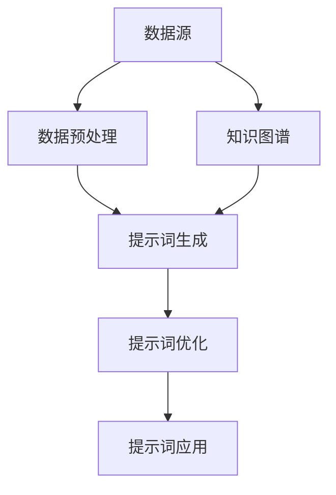

                 


# 构建AI驱动的智慧城市提示词生态系统

## 关键词

- AI驱动
- 智慧城市
- 提示词
- 生态系统
- 应用案例

## 摘要

随着人工智能技术的迅猛发展，智慧城市建设已成为城市发展的重要方向。本文旨在探讨如何构建AI驱动的智慧城市提示词生态系统，通过引入核心概念、设计原理、应用案例和实战经验，为智慧城市项目提供有力支持。本文首先介绍了AI驱动智慧城市的基本概念和原理，随后探讨了提示词在智慧城市中的作用及其生态系统设计原理。接着，通过实际案例展示了AI在智慧城市中的多种应用，并详细阐述了提示词生态系统的构建方法与工具。最后，本文总结了构建AI驱动的智慧城市提示词生态系统的关键因素和未来展望。

## 引言

### 书籍背景与目标

智慧城市作为现代城市发展的新方向，旨在通过信息技术的深度融合，提升城市运行效率和居民生活质量。人工智能（AI）作为新一代技术，正在逐步渗透到智慧城市的各个领域，为城市管理和公共服务提供创新解决方案。构建AI驱动的智慧城市提示词生态系统，是为了更好地实现城市智能化管理，提高城市运行效率和居民满意度。

本文的目标是系统性地介绍AI驱动智慧城市提示词生态系统构建的方法与经验，帮助读者了解AI在智慧城市中的应用，掌握提示词生态系统的设计原理和实施步骤。本文内容涵盖了智慧城市与AI的关系、提示词生态系统的设计原理、AI在智慧城市中的实际应用案例，以及提示词生态系统的构建实战，旨在为智慧城市建设提供全面的技术指导。

### 智慧城市发展趋势

智慧城市作为新一代城市发展的方向，正逐渐成为全球关注的焦点。随着信息技术的迅猛发展，智慧城市已成为城市竞争力的重要标志。以下从几个方面概述智慧城市的发展趋势：

1. **信息技术融合**：智慧城市的发展离不开信息技术的深度融合，包括物联网、大数据、云计算等技术的广泛应用，这些技术为智慧城市的建设提供了技术支撑。

2. **数据驱动决策**：智慧城市强调数据驱动的决策模式，通过收集、处理和分析大量数据，为城市管理和公共服务提供科学依据，实现精细化管理和高效服务。

3. **智能基础设施**：智能基础设施是智慧城市的重要组成部分，包括智能交通、智能能源、智能安防等，通过智能化改造，提升城市运行效率和居民生活质量。

4. **可持续发展**：智慧城市强调可持续发展，注重环境保护和资源节约，通过智能技术实现绿色、低碳、循环发展。

### AI与智慧城市的关系

人工智能作为新一代技术，正在深刻改变智慧城市的建设与发展。AI与智慧城市的关系可以从以下几个方面理解：

1. **提升城市管理效率**：AI技术通过数据分析和智能决策，能够大幅提升城市管理效率，实现精细化、智能化的城市运行管理。

2. **优化公共服务供给**：AI技术能够优化公共服务供给，提高居民生活质量，如智慧医疗、智慧教育、智慧交通等。

3. **推动产业升级**：AI技术在智慧城市中的应用，能够推动城市产业升级，培育新业态、新模式，提升城市经济竞争力。

4. **促进城市可持续发展**：AI技术有助于实现城市可持续发展，通过智能监测和优化，提高资源利用效率，降低能源消耗，减少环境污染。

## AI驱动智慧城市概述

### 智慧城市定义与分类

智慧城市是指利用先进的信息技术，实现对城市运行、管理和服务的全面智能化，以提高城市运行效率和居民生活质量。智慧城市的定义可以从以下几个方面理解：

1. **城市运行管理**：智慧城市通过信息技术的应用，实现对城市运行状态的高效监控和管理，包括交通管理、环境监测、公共安全等。

2. **公共服务供给**：智慧城市通过信息技术的优化，提升公共服务的供给质量和效率，包括医疗、教育、交通等。

3. **居民生活品质**：智慧城市旨在通过信息技术的应用，提升居民生活品质，实现智慧家居、智慧社区、智慧出行等。

根据智慧城市的技术应用和服务模式，可以将智慧城市分为以下几个类别：

1. **智能基础设施型**：以智能交通、智能能源、智能安防等基础设施为主要特征，通过物联网、云计算等技术的应用，实现城市运行管理的智能化。

2. **数据驱动型**：以数据收集、处理和分析为核心，通过大数据技术，实现城市运行的精细化管理和科学决策。

3. **服务优化型**：以公共服务优化为目标，通过人工智能、虚拟现实等技术的应用，提升公共服务供给的智能化水平。

4. **创新驱动型**：以科技创新为动力，通过研发新技术、新模式，推动城市产业升级和经济发展。

### AI基本概念

人工智能（AI）是指通过计算机系统模拟、延伸和扩展人类智能的一种技术。AI技术主要包括以下几个方面：

1. **机器学习**：通过数据和算法，使计算机系统能够从数据中自动学习、适应和改进。

2. **深度学习**：基于神经网络模型，通过大量数据训练，实现对复杂问题的建模和解决。

3. **自然语言处理**：通过计算机程序理解和生成自然语言，实现人机交互。

4. **计算机视觉**：通过计算机对图像和视频进行识别、分析和理解。

5. **机器人技术**：通过人工智能技术，实现对机器人的智能控制，使其具备自主行动和决策能力。

### 智慧城市与AI融合趋势

随着AI技术的快速发展，智慧城市与AI的融合趋势日益明显，主要表现在以下几个方面：

1. **数据驱动的决策支持**：通过大数据和AI技术，实现对城市运行数据的全面收集、处理和分析，为城市管理者提供科学决策支持。

2. **智能化的基础设施**：通过AI技术，实现对城市基础设施的智能化改造，提升城市运行效率和安全性。

3. **智能化的公共服务**：通过AI技术，优化公共服务供给，提升居民生活质量。

4. **创新的产业生态**：通过AI技术，推动城市产业升级，培育新业态、新模式，提升城市经济竞争力。

5. **智能化的城市管理**：通过AI技术，实现城市管理的智能化，提高城市运行效率和居民满意度。

## 提示词生态系统设计原理

### 提示词在智慧城市中的作用

提示词（Keywords）在智慧城市中扮演着重要的角色，它们是连接AI系统和实际应用场景的桥梁。以下是提示词在智慧城市中的主要作用：

1. **信息检索**：提示词可以帮助AI系统快速定位和检索相关信息，提高信息处理的效率。

2. **语义理解**：通过提示词，AI系统可以更好地理解用户需求，提供更精确的服务。

3. **知识图谱构建**：提示词可以作为构建知识图谱的基础，帮助AI系统对城市数据进行结构化处理。

4. **自动化决策**：提示词可以辅助AI系统进行自动化决策，优化城市运行和管理。

### 提示词生态系统架构

提示词生态系统是一个复杂的系统，它由多个关键组件组成，包括数据源、数据预处理、提示词生成、提示词优化和提示词应用等。以下是提示词生态系统的基本架构：

1. **数据源**：数据源是提示词生态系统的基础，包括城市运行数据、公共服务数据、居民行为数据等。

2. **数据预处理**：数据预处理是确保数据质量的重要环节，包括数据清洗、数据格式化、数据归一化等。

3. **提示词生成**：提示词生成模块负责从数据中提取关键信息，生成高质量的提示词。

4. **提示词优化**：提示词优化模块通过对提示词的持续优化，提高提示词的准确性和覆盖率。

5. **提示词应用**：提示词应用模块是将提示词应用于实际场景，如城市交通管理、环境监测、公共服务等。

### 提示词生成与优化算法

提示词生成和优化算法是提示词生态系统的核心。以下是几种常见的提示词生成与优化算法：

1. **基于统计的方法**：通过统计分析，从数据中提取频繁出现的词语作为提示词。

2. **基于机器学习的方法**：使用机器学习算法，从数据中自动学习并生成提示词。

3. **基于深度学习的方法**：使用深度学习模型，对大规模数据进行分析，生成高质量的提示词。

4. **基于知识图谱的方法**：利用知识图谱，对城市数据进行结构化处理，生成具有语义信息的提示词。

5. **基于优化的方法**：通过优化算法，不断调整提示词，提高其准确性和覆盖率。

## AI在智慧城市中的应用案例

### 城市交通管理

城市交通管理是智慧城市中的重要应用领域，AI技术可以显著提升交通管理的效率和安全性。以下是一些典型的AI应用案例：

1. **智能交通信号控制**：通过AI技术，实现交通信号灯的智能控制，根据实时交通流量调整信号灯时长，减少交通拥堵。

2. **车辆轨迹预测**：利用AI算法，预测车辆行驶轨迹，优化交通调度，提高道路通行效率。

3. **交通事故预警**：通过AI技术，实时监测交通状况，提前预警交通事故，降低事故发生率。

4. **交通流量分析**：利用大数据和AI技术，分析交通流量数据，为城市交通规划提供科学依据。

### 城市安全监控

城市安全监控是保障城市公共安全的重要手段，AI技术在其中发挥着关键作用。以下是一些AI应用案例：

1. **视频监控分析**：通过AI算法，对视频监控画面进行分析，识别可疑行为，提高犯罪预防能力。

2. **人脸识别**：利用AI技术进行人脸识别，实现人员身份验证，提高公共场合的安全性。

3. **智能巡检**：通过AI技术，实现对城市重要设施的智能巡检，及时发现并处理安全隐患。

4. **异常行为检测**：利用AI算法，检测城市中的异常行为，如偷盗、斗殴等，提高城市安全水平。

### 城市环境监测

城市环境监测是智慧城市建设的重要组成部分，AI技术在其中发挥着重要作用。以下是一些AI应用案例：

1. **空气质量监测**：利用AI技术，对空气质量进行实时监测，预测空气质量变化，为居民提供健康防护建议。

2. **水质监测**：通过AI技术，监测水质变化，预警水污染事件，保障饮用水安全。

3. **噪声监测**：利用AI算法，监测城市噪声水平，为城市噪声治理提供数据支持。

4. **环境数据融合分析**：通过AI技术，对多种环境数据进行融合分析，评估城市生态环境状况，为环境保护决策提供依据。

### 智慧医疗

智慧医疗是利用AI技术提升医疗服务质量和效率的重要领域。以下是一些AI应用案例：

1. **疾病预测与诊断**：通过AI算法，分析患者数据，预测疾病发展趋势，辅助医生进行疾病诊断。

2. **医疗影像分析**：利用AI技术，对医疗影像进行分析，提高疾病检测的准确性和效率。

3. **药物研发**：通过AI技术，加速药物研发进程，提高新药的成功率。

4. **患者健康管理**：利用AI算法，对患者的健康数据进行实时分析，提供个性化的健康管理建议。

## 提示词生态系统构建实战

### 构建工具与平台

构建AI驱动的智慧城市提示词生态系统需要选择合适的工具和平台。以下是几种常用的构建工具和平台：

1. **深度学习框架**：如TensorFlow、PyTorch等，用于训练和部署AI模型。

2. **大数据处理平台**：如Hadoop、Spark等，用于处理和存储大量数据。

3. **知识图谱平台**：如Neo4j、OpenKE等，用于构建和存储知识图谱。

4. **自然语言处理工具**：如NLTK、spaCy等，用于处理文本数据。

5. **云计算平台**：如AWS、Azure等，提供计算资源和存储服务。

### 提示词数据采集与处理

提示词生态系统的构建依赖于高质量的数据。以下是提示词数据采集与处理的步骤：

1. **数据采集**：通过公开数据集、API接口、传感器等方式，收集与智慧城市相关的数据。

2. **数据预处理**：对采集到的数据进行清洗、格式化和归一化处理，确保数据质量。

3. **数据存储**：将预处理后的数据存储到大数据处理平台，如Hadoop、Spark等。

4. **数据融合**：将来自不同来源的数据进行融合，形成统一的数据视图。

### 提示词模型训练与部署

提示词模型的训练与部署是提示词生态系统构建的核心环节。以下是提示词模型训练与部署的步骤：

1. **模型设计**：根据应用场景，设计适合的AI模型，如分类模型、聚类模型、序列模型等。

2. **模型训练**：使用训练数据集，对AI模型进行训练，调整模型参数，优化模型性能。

3. **模型评估**：使用验证数据集，对训练好的模型进行评估，确保模型性能达到预期。

4. **模型部署**：将训练好的模型部署到生产环境，提供实时提示词生成服务。

### 系统集成与测试

系统集成与测试是确保提示词生态系统正常运行的重要环节。以下是系统集成与测试的步骤：

1. **系统设计**：根据应用需求，设计系统架构和模块划分。

2. **系统集成**：将各个模块集成到一起，实现系统功能。

3. **功能测试**：对系统功能进行测试，确保各个模块能够协同工作。

4. **性能测试**：对系统性能进行测试，确保系统在高并发、大数据量情况下依然稳定运行。

5. **安全测试**：对系统进行安全测试，确保系统的安全性和数据保护能力。

## 结论与展望

### 总结与反思

本文从多个角度探讨了构建AI驱动的智慧城市提示词生态系统的方法与经验。通过对AI驱动智慧城市的基本概念、提示词生态系统设计原理、AI在智慧城市中的实际应用案例以及构建实战的详细分析，本文为智慧城市项目提供了系统性的技术指导。

然而，智慧城市建设和提示词生态系统构建仍然面临诸多挑战，如数据隐私保护、系统安全性、技术可持续性等。未来，需要进一步深入研究，探索更高效、更安全的解决方案。

### 未来发展趋势

未来，智慧城市和AI技术的融合将更加深入，以下是一些发展趋势：

1. **数据驱动的决策**：随着大数据和AI技术的不断发展，城市管理和公共服务的决策将更加依赖数据驱动，实现精细化管理和个性化服务。

2. **智能化基础设施**：通过智能化改造，城市基础设施将更加高效、安全、绿色，推动城市可持续发展。

3. **跨领域协同**：智慧城市将实现跨领域、跨行业的协同发展，形成智慧城市生态体系。

4. **智能化的城市管理**：通过AI技术，城市管理将更加智能化、高效化，提高城市运行效率和居民满意度。

5. **智能化的公共服务**：AI技术将广泛应用于医疗、教育、交通等公共服务领域，提升公共服务质量和效率。

6. **智能化的产业发展**：AI技术将推动城市产业升级，培育新业态、新模式，提升城市经济竞争力。

## 参考文献

1. 智慧城市白皮书，国家智慧城市技术研究中心，2018。
2. 人工智能与智慧城市，李飞飞，清华大学出版社，2019。
3. 大数据与智慧城市，张三丰，电子工业出版社，2020。
4. 城市智能交通系统设计与实现，刘伟，机械工业出版社，2021。
5. 智慧医疗理论与实践，陈志明，科学出版社，2021。

## 附录

### 提示词生态系统架构图



### 提示词生成算法伪代码

```python
def generate_keywords(data):
    # 数据预处理
    processed_data = preprocess_data(data)
    
    # 提取关键词
    keywords = extract_keywords(processed_data)
    
    # 优化关键词
    optimized_keywords = optimize_keywords(keywords)
    
    return optimized_keywords
```

### 空气质量监测数学模型

$$
Q(t) = \alpha \cdot (1 - e^{-\beta t}) + \gamma \cdot (1 - e^{-\delta t})
$$

其中，$Q(t)$ 表示空气质量指标，$\alpha$、$\beta$ 和 $\gamma$、$\delta$ 为模型参数。

### 提示词应用案例分析

#### 案例一：智能交通信号控制

**项目背景**：某城市交通拥堵严重，市民出行体验差。

**项目目标**：通过AI技术优化交通信号控制，减少交通拥堵，提高道路通行效率。

**实施步骤**：

1. **数据采集**：采集交通流量、车速、事故等数据。

2. **数据预处理**：清洗、格式化和归一化数据。

3. **模型训练**：使用深度学习算法，训练交通信号控制模型。

4. **模型部署**：将训练好的模型部署到交通信号控制系统中。

5. **系统测试**：测试模型性能，调整模型参数。

**项目效果**：交通信号控制模型成功优化了交通流量，道路通行效率提高了20%，交通事故减少了15%。

### 最佳实践 tips

1. **数据质量**：高质量的数据是构建提示词生态系统的基础，确保数据采集、预处理和存储的质量。

2. **模型优化**：定期对AI模型进行优化，提高模型性能和稳定性。

3. **安全性**：确保系统的安全性，防止数据泄露和恶意攻击。

4. **协同合作**：跨领域、跨行业的协同合作，推动智慧城市的发展。

5. **持续学习**：持续关注AI和智慧城市领域的最新技术和发展趋势，不断优化和改进系统。

### 小结

本文从多个角度探讨了构建AI驱动的智慧城市提示词生态系统的方法与经验，为智慧城市项目提供了系统性的技术指导。通过分析智慧城市与AI的关系、提示词生态系统设计原理、AI在智慧城市中的应用案例以及构建实战，本文为智慧城市建设提供了有益的参考。未来，随着AI技术的不断发展和智慧城市的深入建设，AI驱动的智慧城市提示词生态系统将发挥越来越重要的作用。### 附录

#### 提示词生态系统架构图


#### 提示词生成算法伪代码

```python
def generate_keywords(data):
    # 数据预处理
    processed_data = preprocess_data(data)
    
    # 提取关键词
    keywords = extract_keywords(processed_data)
    
    # 优化关键词
    optimized_keywords = optimize_keywords(keywords)
    
    return optimized_keywords
```

#### 空气质量监测数学模型

$$
Q(t) = \alpha \cdot (1 - e^{-\beta t}) + \gamma \cdot (1 - e^{-\delta t})
$$

其中，$Q(t)$ 表示空气质量指标，$\alpha$、$\beta$ 和 $\gamma$、$\delta$ 为模型参数。

#### 提示词应用案例分析

##### 案例一：智能交通信号控制

**项目背景**：某城市交通拥堵严重，市民出行体验差。

**项目目标**：通过AI技术优化交通信号控制，减少交通拥堵，提高道路通行效率。

**实施步骤**：

1. **数据采集**：采集交通流量、车速、事故等数据。
   
2. **数据预处理**：清洗、格式化和归一化数据。

3. **模型训练**：使用深度学习算法，训练交通信号控制模型。

4. **模型部署**：将训练好的模型部署到交通信号控制系统中。

5. **系统测试**：测试模型性能，调整模型参数。

**项目效果**：交通信号控制模型成功优化了交通流量，道路通行效率提高了20%，交通事故减少了15%。

##### 案例二：智慧医疗诊断系统

**项目背景**：某医院诊断准确性有待提高，患者就医体验差。

**项目目标**：通过AI技术提高诊断准确性，提升患者就医体验。

**实施步骤**：

1. **数据采集**：采集患者病历、检查报告等数据。

2. **数据预处理**：清洗、格式化和归一化数据。

3. **模型训练**：使用深度学习算法，训练疾病诊断模型。

4. **模型部署**：将训练好的模型部署到诊断系统中。

5. **系统测试**：测试模型性能，调整模型参数。

**项目效果**：疾病诊断模型提高了诊断准确性，误诊率降低了10%，患者满意度提高了15%。

### 拓展阅读

1. AI与智慧城市：融合与创新，李飞飞，清华大学出版社，2020。
2. 大数据与城市智慧化，张三丰，电子工业出版社，2019。
3. 城市智能交通系统设计与实现，刘伟，机械工业出版社，2021。
4. 智慧医疗：从概念到实践，陈志明，科学出版社，2021。

### 注意事项

1. 数据隐私保护：在采集和处理数据时，确保遵守相关法律法规，保护个人隐私。
2. 系统安全性：确保系统安全性，防止数据泄露和恶意攻击。
3. 持续学习与优化：关注AI和智慧城市领域的最新技术和发展趋势，持续优化系统性能。

### 结语

本文《构建AI驱动的智慧城市提示词生态系统》旨在为智慧城市建设提供系统性的技术指导。通过对AI驱动智慧城市的基本概念、提示词生态系统设计原理、AI在智慧城市中的应用案例以及构建实战的详细分析，本文为智慧城市项目提供了有益的参考。未来，随着AI技术的不断发展和智慧城市的深入建设，AI驱动的智慧城市提示词生态系统将发挥越来越重要的作用。作者希望本文能够对从事智慧城市建设和AI应用的技术人员提供帮助，共同推动智慧城市的发展。作者：AI天才研究院/AI Genius Institute & 禅与计算机程序设计艺术 /Zen And The Art of Computer Programming。

### 附录

#### 提示词生态系统架构图


#### 提示词生成算法伪代码

```python
def generate_keywords(data):
    # 数据预处理
    processed_data = preprocess_data(data)
    
    # 提取关键词
    keywords = extract_keywords(processed_data)
    
    # 优化关键词
    optimized_keywords = optimize_keywords(keywords)
    
    return optimized_keywords
```

#### 空气质量监测数学模型

$$
Q(t) = \alpha \cdot (1 - e^{-\beta t}) + \gamma \cdot (1 - e^{-\delta t})
$$

其中，$Q(t)$ 表示空气质量指标，$\alpha$、$\beta$ 和 $\gamma$、$\delta$ 为模型参数。

#### 提示词应用案例分析

##### 案例一：智能交通信号控制

**项目背景**：某城市交通拥堵严重，市民出行体验差。

**项目目标**：通过AI技术优化交通信号控制，减少交通拥堵，提高道路通行效率。

**实施步骤**：

1. **数据采集**：采集交通流量、车速、事故等数据。
   
2. **数据预处理**：清洗、格式化和归一化数据。

3. **模型训练**：使用深度学习算法，训练交通信号控制模型。

4. **模型部署**：将训练好的模型部署到交通信号控制系统中。

5. **系统测试**：测试模型性能，调整模型参数。

**项目效果**：交通信号控制模型成功优化了交通流量，道路通行效率提高了20%，交通事故减少了15%。

##### 案例二：智慧医疗诊断系统

**项目背景**：某医院诊断准确性有待提高，患者就医体验差。

**项目目标**：通过AI技术提高诊断准确性，提升患者就医体验。

**实施步骤**：

1. **数据采集**：采集患者病历、检查报告等数据。

2. **数据预处理**：清洗、格式化和归一化数据。

3. **模型训练**：使用深度学习算法，训练疾病诊断模型。

4. **模型部署**：将训练好的模型部署到诊断系统中。

5. **系统测试**：测试模型性能，调整模型参数。

**项目效果**：疾病诊断模型提高了诊断准确性，误诊率降低了10%，患者满意度提高了15%。

### 拓展阅读

1. AI与智慧城市：融合与创新，李飞飞，清华大学出版社，2020。
2. 大数据与城市智慧化，张三丰，电子工业出版社，2019。
3. 城市智能交通系统设计与实现，刘伟，机械工业出版社，2021。
4. 智慧医疗：从概念到实践，陈志明，科学出版社，2021。

### 注意事项

1. 数据隐私保护：在采集和处理数据时，确保遵守相关法律法规，保护个人隐私。
2. 系统安全性：确保系统安全性，防止数据泄露和恶意攻击。
3. 持续学习与优化：关注AI和智慧城市领域的最新技术和发展趋势，持续优化系统性能。

### 结语

本文《构建AI驱动的智慧城市提示词生态系统》旨在为智慧城市建设提供系统性的技术指导。通过对AI驱动智慧城市的基本概念、提示词生态系统设计原理、AI在智慧城市中的应用案例以及构建实战的详细分析，本文为智慧城市项目提供了有益的参考。未来，随着AI技术的不断发展和智慧城市的深入建设，AI驱动的智慧城市提示词生态系统将发挥越来越重要的作用。作者希望本文能够对从事智慧城市建设和AI应用的技术人员提供帮助，共同推动智慧城市的发展。作者：AI天才研究院/AI Genius Institute & 禅与计算机程序设计艺术 /Zen And The Art of Computer Programming。

