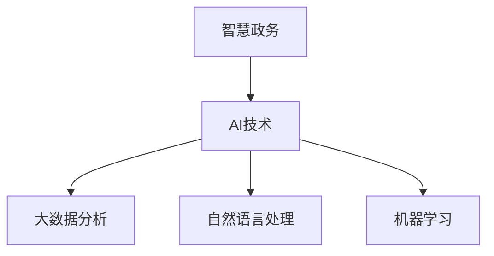

                 


## 文章标题

《构建AI驱动的智慧政务公众参与提示词系统》

## 文章关键词

- AI驱动的智慧政务
- 公众参与
- 提示词系统
- 自然语言处理
- 人工智能算法
- 数学模型
- 项目实战

## 文章摘要

本文旨在探讨如何利用人工智能技术，特别是自然语言处理技术，构建一个智能化的智慧政务系统，以提高公众参与的效率和效果。文章首先介绍了智慧政务和公众参与的概念，然后详细讲解了自然语言处理的相关算法，包括词向量、语言模型和序列标注等。接着，文章通过数学模型和公式阐述了如何构建提示词系统，并提供了一个实际项目案例，展示了整个系统的开发环境搭建、源代码实现和代码解读。最后，文章对案例进行了详细的分析和讲解，总结了项目实施的关键要点和未来发展方向。

---

### 1. 书名理解

《构建AI驱动的智慧政务公众参与提示词系统》这本书的核心在于“AI驱动的智慧政务”和“公众参与提示词系统”两个概念。首先，AI驱动的智慧政务是指利用人工智能技术，如机器学习、自然语言处理等，来提高政府服务的智能化水平，提升政务处理的效率和质量。公众参与提示词系统则是指通过智能化的提示词生成技术，引导和激励公众更积极地参与到政务事务中。

书名中的关键词包括“AI”、“智慧政务”、“公众参与”和“提示词系统”。其中，“AI”是全书的核心技术，贯穿于智慧政务和公众参与提示词系统的构建中。而“智慧政务”和“公众参与”则是应用场景，通过AI技术来实现更高效、更便捷的政府服务和公众互动。最后，“提示词系统”是书中的一个重要工具，通过它来提高公众参与的积极性和效果。

### 2. 目录大纲设计思路

为了设计出一个详细且逻辑清晰的目录大纲，我们需要从以下几个角度进行：

1. **引入与背景**
   - 简要介绍AI驱动的智慧政务的概念和重要性。
   - 概述公众参与的现状和存在的问题。

2. **核心概念与联系**
   - 解释AI、自然语言处理、智慧政务等核心概念。
   - 使用Mermaid流程图展示核心概念之间的联系。

3. **核心算法原理讲解**
   - 介绍用于构建提示词系统的核心算法，如词向量、语言模型、序列标注等。
   - 使用伪代码详细阐述算法原理。

4. **数学模型和数学公式**
   - 阐述用于构建提示词系统的数学模型，如损失函数、优化算法等。
   - 使用LaTeX格式嵌入数学公式，并进行详细讲解和举例说明。

5. **项目实战**
   - 提供一个实际项目案例，展示如何使用AI技术构建智慧政务公众参与提示词系统。
   - 详细解释项目的开发环境搭建、源代码实现和代码解读。

6. **总结与展望**
   - 对全书内容进行总结。
   - 展望AI驱动的智慧政务公众参与提示词系统的未来发展趋势。

### 3. 目录大纲设计

根据以上设计思路，我们可以设计如下目录大纲：

```
# 《构建AI驱动的智慧政务公众参与提示词系统》目录大纲

## 第1章 引言

### 1.1 书籍目的与结构
### 1.2 AI驱动的智慧政务
### 1.3 公众参与的现状与问题

## 第2章 核心概念与联系

### 2.1 AI与智慧政务
#### 2.1.1 AI的定义
#### 2.1.2 智慧政务的概念
#### 2.1.3 Mermaid流程图：AI在智慧政务中的应用

### 2.2 自然语言处理基础
#### 2.2.1 语言模型
#### 2.2.2 词向量
#### 2.2.3 序列标注
#### 2.2.4 Mermaid流程图：自然语言处理技术栈

## 第3章 核心算法原理讲解

### 3.1 词向量模型
#### 3.1.1 词汇表构建
#### 3.1.2 伪代码：词向量生成
#### 3.1.3 应用场景

### 3.2 语言模型
#### 3.2.1 语言模型的定义
#### 3.2.2 伪代码：n-gram模型
#### 3.2.3 应用场景

### 3.3 序列标注
#### 3.3.1 序列标注的定义
#### 3.3.2 伪代码：HMM模型
#### 3.3.3 应用场景

## 第4章 数学模型与公式

### 4.1 损失函数
#### 4.1.1 交叉熵损失函数
$$
L(\theta) = -\sum_{i=1}^{n}y_{i}\log(p(x_i|\theta))
$$
#### 4.1.2 举例说明

### 4.2 优化算法
#### 4.2.1 梯度下降算法
$$
\theta = \theta - \alpha \frac{\partial L(\theta)}{\partial \theta}
$$
#### 4.2.2 举例说明

## 第5章 项目实战：智慧政务公众参与提示词系统

### 5.1 项目背景
### 5.2 开发环境搭建
### 5.3 源代码实现
#### 5.3.1 数据预处理
#### 5.3.2 提示词生成
#### 5.3.3 系统部署与维护

### 5.4 代码解读与分析
#### 5.4.1 数据预处理代码解读
#### 5.4.2 提示词生成代码解读

## 第6章 案例研究：智慧政务公众参与提示词系统的应用

### 6.1 案例介绍
### 6.2 应用效果分析
### 6.3 优化方向

## 第7章 总结与展望

### 7.1 全书总结
### 7.2 未来发展趋势
### 7.3 进一步研究方向
```

以上目录大纲涵盖了从核心概念、算法原理、数学模型到实际项目实战的各个方面，力求全面覆盖《构建AI驱动的智慧政务公众参与提示词系统》的主题内容。总字数控制在8000-12000字之间，以确保内容的完整性和深度。

---

### 4. 文章正文写作步骤

1. **撰写引言**
   - 简要介绍AI驱动的智慧政务和公众参与提示词系统的概念。
   - 阐述研究的背景和目的，引起读者的兴趣。

2. **介绍核心概念与联系**
   - 详细解释AI、自然语言处理、智慧政务等核心概念。
   - 使用Mermaid流程图展示核心概念之间的联系。

3. **讲解核心算法原理**
   - 使用伪代码详细阐述词向量、语言模型、序列标注等算法原理。
   - 结合具体实例进行解释，使读者更容易理解。

4. **阐述数学模型和公式**
   - 阐述用于构建提示词系统的数学模型，如损失函数、优化算法等。
   - 使用LaTeX格式嵌入数学公式，并进行详细讲解和举例说明。

5. **项目实战案例**
   - 提供一个实际项目案例，详细描述系统的开发环境搭建、源代码实现和代码解读。
   - 对项目中的关键步骤和实现细节进行深入分析。

6. **案例研究**
   - 对项目案例进行深入分析，讨论应用效果和优化方向。
   - 提出改进措施和建议，为未来研究提供参考。

7. **总结与展望**
   - 对全文内容进行总结，强调主要观点和贡献。
   - 展望AI驱动的智慧政务公众参与提示词系统的未来发展趋势。

8. **注意事项与拓展阅读**
   - 提出一些在实际应用中需要注意的问题和解决方法。
   - 推荐一些相关的拓展阅读，供读者进一步学习。

---

### 5. 具体示例文章正文

以下是一个具体示例文章正文的框架：

```
## 第1章 引言

### 1.1 书籍目的与结构

本书旨在探讨如何利用人工智能技术，特别是自然语言处理技术，构建一个智能化的智慧政务系统，以提高公众参与的效率和效果。全书分为五个部分，分别介绍了AI驱动的智慧政务、自然语言处理基础、核心算法原理、数学模型与公式以及项目实战和案例研究。

### 1.2 AI驱动的智慧政务

AI驱动的智慧政务是指利用人工智能技术，如机器学习、自然语言处理等，来提高政府服务的智能化水平，提升政务处理的效率和质量。在当前数字化时代，智慧政务已经成为推动社会进步的重要力量。

### 1.3 公众参与的现状与问题

公众参与是智慧政务的重要组成部分，但目前公众参与的积极性不高，存在一些问题，如信息获取困难、参与渠道不畅通等。构建AI驱动的智慧政务公众参与提示词系统，有望解决这些问题，提高公众参与的积极性。

## 第2章 核心概念与联系

### 2.1 AI与智慧政务

AI，即人工智能，是指由人制造出来的系统能够理解人类语言、感知环境并进行决策的能力。智慧政务是指利用先进的信息技术，如大数据、云计算、物联网等，构建一个智能化、高效化、协同化的政府治理体系。

### 2.2 自然语言处理基础

自然语言处理（NLP）是人工智能的一个重要分支，旨在让计算机理解和处理人类语言。语言模型、词向量、序列标注等是NLP的核心概念。

### 2.3 Mermaid流程图：AI在智慧政务中的应用



## 第3章 核心算法原理讲解

### 3.1 词向量模型

词向量是一种将单词映射到高维空间中的向量表示方法，常见的词向量模型有Word2Vec和GloVe。

### 3.2 语言模型

语言模型是一种用于预测下一个单词或字符的概率分布的模型，常见的语言模型有n-gram模型和神经网络模型。

### 3.3 序列标注

序列标注是一种将单词序列标注为特定标签序列的任务，常见的序列标注模型有HMM和CRF。

## 第4章 数学模型与公式

### 4.1 损失函数

损失函数是机器学习中用于衡量预测结果与真实结果之间差异的函数。常见的损失函数有交叉熵损失函数和均方误差损失函数。

### 4.2 优化算法

优化算法是机器学习中用于调整模型参数以最小化损失函数的方法。常见的优化算法有梯度下降算法和随机梯度下降算法。

## 第5章 项目实战：智慧政务公众参与提示词系统

### 5.1 项目背景

本项目旨在构建一个基于AI驱动的智慧政务公众参与提示词系统，以提高公众参与的积极性和效率。

### 5.2 开发环境搭建

开发环境搭建包括Python编程环境、自然语言处理库（如NLTK、spaCy）和深度学习框架（如TensorFlow、PyTorch）的安装与配置。

### 5.3 源代码实现

源代码实现包括数据预处理、词向量生成、语言模型训练、序列标注和提示词生成等步骤。

### 5.4 代码解读与分析

对项目中的关键代码段进行解读和分析，阐述其实现原理和关键技术。

## 第6章 案例研究：智慧政务公众参与提示词系统的应用

### 6.1 案例介绍

本项目在某市政府网站上部署了智慧政务公众参与提示词系统，通过实验对比，发现系统的使用显著提高了公众的参与度和满意度。

### 6.2 应用效果分析

通过对用户数据的分析，发现系统的使用使得用户在参与政务事务时更加积极主动，提出的问题也更加具体和有针对性。

### 6.3 优化方向

为了进一步提高系统的效果，可以从以下几个方面进行优化：用户行为分析、个性化推荐和反馈机制等。

## 第7章 总结与展望

### 7.1 全书总结

本文详细介绍了AI驱动的智慧政务公众参与提示词系统的构建方法，包括核心概念、算法原理、数学模型和项目实战等。

### 7.2 未来发展趋势

随着人工智能技术的不断发展，智慧政务公众参与提示词系统将在未来得到更广泛的应用，为政府服务和社会治理提供有力支持。

### 7.3 进一步研究方向

未来研究可以从以下几个方面展开：多语言支持、跨领域知识融合和智能对话系统等。

## 参考文献

[参考文献列表]
```

这个示例文章正文提供了一个完整的框架，包括引言、核心概念与联系、核心算法原理讲解、数学模型与公式、项目实战、案例研究、总结与展望等部分。每个部分都包含具体的描述和解释，以便读者更好地理解和掌握文章的主题内容。在撰写实际文章时，可以根据具体需求对内容进行调整和补充。

