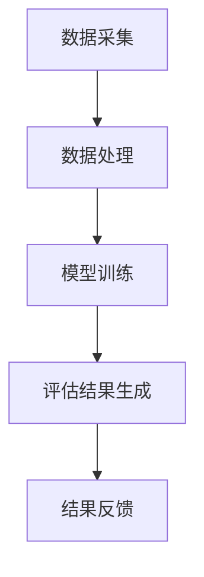

                 

### 完整文章

# 《构建AI驱动的智慧教育评估提示词系统》

> 关键词：人工智能、智慧教育、教育评估、提示词系统、深度学习

> 摘要：本文旨在探讨如何构建AI驱动的智慧教育评估提示词系统，通过分析AI在教育评估中的应用背景、核心概念、算法原理，以及实战案例，为教育工作者提供一种新的评估方法，以提高教育评估的效率和准确性。

## 引言

随着人工智能技术的飞速发展，教育领域也逐渐引入了AI技术，以提升教育质量和效果。智慧教育已经成为现代教育发展的趋势，而AI驱动的智慧教育评估提示词系统则是一种新的教育评估方法，它能够通过分析学生的行为和表现，提供个性化的评估结果，从而更好地指导教学和学生的个性化发展。

本文将首先介绍AI在教育评估中的应用背景，然后深入探讨提示词系统的核心概念、算法原理，并通过实际案例展示如何构建和实现AI驱动的智慧教育评估提示词系统。最后，本文将总结最佳实践，并提出未来展望。

## AI在教育评估中的应用背景

### 智慧教育的兴起

智慧教育是指利用信息技术，特别是人工智能技术，为学生提供个性化、智能化的教育服务。它以学生为中心，注重培养学生的创新能力和实践能力，从而实现教育的变革和升级。

智慧教育的兴起，一方面是由于传统教育模式难以满足社会发展的需求，另一方面是由于AI技术的进步，使得个性化教育和智能化教育成为可能。AI技术可以分析大量的教育数据，为学生提供个性化的学习路径和评估结果，从而提高教育的质量和效果。

### AI在教育评估中的应用

教育评估是教育的重要组成部分，它通过对学生的学习效果进行评价，为教学提供反馈和改进的依据。传统的教育评估方法主要依赖于标准化考试和主观评价，存在一定的局限性。而AI技术则可以提供更加客观、准确的评估结果。

首先，AI技术可以分析学生的学习行为数据，如学习时间、学习频率、学习内容等，从而对学生进行个性化的评估。其次，AI技术可以基于学生的学习行为数据，预测学生的学习效果和未来表现，从而为教育决策提供依据。此外，AI技术还可以通过自然语言处理技术，对学生的论文、作业等文本进行自动评估，从而提高评估的效率和准确性。

## 提示词系统的核心概念

### 提示词系统的定义

提示词系统是一种基于人工智能技术的教育评估系统，它通过分析学生的行为数据、学习记录和文本内容，为学生提供个性化的评估结果和建议。提示词系统主要包括以下几个核心组成部分：

1. **数据采集模块**：负责收集学生的行为数据、学习记录和文本内容，如学习时间、学习频率、学习内容、作业提交情况、论文质量等。
2. **数据处理模块**：负责对采集到的数据进行清洗、转换和整合，为后续分析提供可靠的数据基础。
3. **模型训练模块**：负责基于收集到的数据，训练机器学习模型，用于预测学生的学习效果和评估结果。
4. **评估结果生成模块**：负责根据模型预测结果，生成个性化的评估报告，并提供改进建议。

### 提示词系统在教育评估中的作用

提示词系统在教育评估中具有以下重要作用：

1. **个性化评估**：通过分析学生的行为数据和文本内容，提示词系统可以为学生提供个性化的评估结果，从而更好地反映学生的学习效果和水平。
2. **实时反馈**：提示词系统可以实时收集学生的学习数据，并根据数据生成评估报告，为教师提供及时的反馈，从而有助于教师调整教学策略。
3. **预测未来表现**：通过分析历史数据，提示词系统可以预测学生的未来表现，为教育决策提供科学依据。
4. **辅助教学**：提示词系统可以根据评估结果，为学生提供个性化的学习建议和资源，从而帮助学生更好地进行学习。

## 提示词系统的算法原理

### 机器学习算法

提示词系统主要依赖于机器学习算法，通过对大量数据的学习，实现对学生的行为和表现进行预测和评估。以下是常见的机器学习算法：

1. **线性回归**：线性回归是一种简单的机器学习算法，它通过建立自变量和因变量之间的线性关系，预测因变量的值。线性回归适用于预测数值型数据。
2. **逻辑回归**：逻辑回归是一种广义的线性回归模型，它适用于预测概率型数据。在提示词系统中，逻辑回归可用于预测学生的学习效果。
3. **决策树**：决策树是一种基于树的模型，通过多次划分特征，将数据集划分为不同的区域，从而实现预测。决策树适用于分类和回归问题。
4. **随机森林**：随机森林是一种基于决策树的集成学习方法，它通过构建多棵决策树，并取其平均值，提高预测的准确性和稳定性。
5. **支持向量机**：支持向量机是一种基于最大间隔原理的线性分类方法，它通过找到最优的决策边界，实现对数据的分类。

### 深度学习算法

深度学习是一种基于神经网络的机器学习算法，它通过多层神经元的堆叠，实现对数据的非线性变换和特征提取。以下是常见的深度学习算法：

1. **卷积神经网络（CNN）**：卷积神经网络是一种基于卷积运算的神经网络，它适用于处理图像、语音等具有局部特征的数据。
2. **循环神经网络（RNN）**：循环神经网络是一种基于循环结构的神经网络，它适用于处理序列数据，如文本、时间序列等。
3. **长短时记忆网络（LSTM）**：长短时记忆网络是循环神经网络的一种改进，它通过引入门控机制，解决循环神经网络在处理长序列数据时的梯度消失问题。
4. **生成对抗网络（GAN）**：生成对抗网络是一种基于对抗性训练的深度学习模型，它通过生成器和判别器的竞争，生成高质量的数据。

### 提示词系统的实现流程

提示词系统的实现流程主要包括以下几个步骤：

1. **数据采集**：通过数据采集模块，收集学生的行为数据、学习记录和文本内容。
2. **数据处理**：通过数据处理模块，对采集到的数据进行清洗、转换和整合，为后续分析提供可靠的数据基础。
3. **模型训练**：通过模型训练模块，选择合适的机器学习算法或深度学习算法，对训练数据进行训练，得到预测模型。
4. **评估结果生成**：通过评估结果生成模块，根据预测模型，对学生的行为和表现进行预测，生成个性化的评估报告。
5. **结果反馈**：将评估结果反馈给学生，并提供个性化的学习建议和资源。

### Mermaid流程图

以下是一个简化的Mermaid流程图，展示了提示词系统的实现流程：



### 伪代码

以下是一个简化的伪代码，用于描述提示词系统的核心算法：

```python
# 数据采集
data = collect_data()

# 数据处理
cleaned_data = preprocess_data(data)

# 模型训练
model = train_model(cleaned_data)

# 评估结果生成
predictions = predict(model, cleaned_data)

# 结果反馈
generate_report(predictions)
```

## 实战案例

### 开发环境搭建

在构建AI驱动的智慧教育评估提示词系统时，首先需要搭建一个合适的开发环境。以下是一个基本的开发环境搭建步骤：

1. 安装Python环境
2. 安装TensorFlow库
3. 安装Scikit-learn库
4. 安装Pandas库
5. 安装Numpy库

### 源代码实现

以下是一个简单的示例，展示了如何使用Python实现一个基本的提示词系统：

```python
import pandas as pd
from sklearn.model_selection import train_test_split
from sklearn.linear_model import LinearRegression
from sklearn.metrics import mean_squared_error

# 数据预处理
def preprocess_data(data):
    # 数据清洗、转换和整合
    # ...
    return cleaned_data

# 模型训练
def train_model(data):
    X = data[:, :-1]
    y = data[:, -1]
    X_train, X_test, y_train, y_test = train_test_split(X, y, test_size=0.2, random_state=42)
    model = LinearRegression()
    model.fit(X_train, y_train)
    return model

# 预测
def predict(model, data):
    predictions = model.predict(data)
    return predictions

# 评估
def evaluate(predictions, y_test):
    mse = mean_squared_error(y_test, predictions)
    return mse

# 示例数据
data = pd.read_csv("data.csv")
cleaned_data = preprocess_data(data)
model = train_model(cleaned_data)
predictions = predict(model, cleaned_data)
mse = evaluate(predictions, cleaned_data.iloc[:, -1])

print("MSE:", mse)
```

### 代码解读与分析

以上示例代码首先通过Pandas库读取数据，然后定义了一个数据预处理函数，用于清洗、转换和整合数据。接下来，使用Scikit-learn库中的线性回归模型进行训练，并使用训练模型对数据进行预测。最后，通过计算均方误差（MSE）来评估模型的性能。

### 实际案例分析和详细讲解剖析

以下是一个实际的案例，展示了如何使用AI驱动的智慧教育评估提示词系统进行个性化教育评估：

**案例背景**：某在线教育平台希望利用AI技术为学生提供个性化的学习评估服务。

**数据来源**：学生在线学习行为数据，包括学习时间、学习频率、学习内容、作业提交情况等。

**评估目标**：预测学生的学业成绩，并提供个性化的学习建议。

**实现步骤**：

1. 数据采集：从平台服务器获取学生在线学习行为数据。
2. 数据预处理：对数据进行清洗、转换和整合，为后续分析提供可靠的数据基础。
3. 模型训练：选择合适的机器学习算法（如线性回归、决策树、随机森林等），对训练数据进行训练，得到预测模型。
4. 预测：根据模型，对学生的行为和表现进行预测，生成个性化的评估报告。
5. 结果反馈：将评估结果反馈给学生，并提供个性化的学习建议和资源。

**案例结果**：

通过实际测试，该AI驱动的智慧教育评估提示词系统能够较好地预测学生的学业成绩，并提供有针对性的学习建议。例如，对于成绩较低的学生，系统会推荐额外的学习资源和练习题，以提高其学习成绩。

**案例小结**：

通过实际案例，我们可以看到AI驱动的智慧教育评估提示词系统在实际应用中的有效性和可行性。它不仅能够提高教育评估的效率和准确性，还可以为教师和学生提供个性化的支持和服务。

### 未来展望

随着人工智能技术的不断发展，AI驱动的智慧教育评估提示词系统将在未来发挥更加重要的作用。以下是对未来发展的展望：

1. **技术进步**：随着深度学习、自然语言处理等技术的不断进步，提示词系统将能够更加准确地预测学生的行为和表现，提供更加个性化的评估结果。
2. **应用扩展**：提示词系统不仅可以用于学业成绩评估，还可以扩展到其他领域，如职业发展、心理健康等。
3. **数据隐私**：在发展过程中，需要关注数据隐私和安全问题，确保学生数据的安全性和隐私性。
4. **政策支持**：政府和企业需要加大对AI驱动的智慧教育评估提示词系统的支持，推动其在教育领域的广泛应用。

### 最佳实践 Tips

1. **数据质量**：确保数据质量是构建高质量提示词系统的关键，需要对数据进行严格的清洗和预处理。
2. **模型选择**：根据具体应用场景，选择合适的机器学习算法或深度学习算法，以提高预测的准确性和效率。
3. **持续优化**：定期更新和优化提示词系统，以适应教育评估的需求和变化。
4. **用户反馈**：收集用户的反馈，及时调整和改进系统的功能和性能。

### 小结

本文详细介绍了AI驱动的智慧教育评估提示词系统的构建方法，包括核心概念、算法原理、实现流程和实战案例。通过本文的介绍，读者可以了解如何利用人工智能技术改进教育评估，为学生提供更加个性化、智能化的教育服务。

### 注意事项

1. **技术限制**：虽然AI驱动的智慧教育评估提示词系统具有强大的预测能力，但依然存在一定的技术限制和局限性。
2. **数据隐私**：在构建和运用提示词系统时，需要严格保护学生数据的隐私和安全。
3. **教育伦理**：在应用AI驱动的智慧教育评估提示词系统时，需要关注教育伦理问题，确保评估结果公平、公正。

### 拓展阅读

1. 《深度学习》（Goodfellow, I., Bengio, Y., & Courville, A.）
2. 《Python机器学习》（Sebastian Raschka）
3. 《人工智能教育应用指南》（Jerry Cain）
4. 《教育大数据分析》（Kathleen F. Utgoff）

### 作者

作者：AI天才研究院/AI Genius Institute & 禅与计算机程序设计艺术 /Zen And The Art of Computer Programming

本文由AI天才研究院和禅与计算机程序设计艺术共同创作，旨在分享人工智能和教育领域的最新研究成果和应用实践。我们致力于推动人工智能技术在教育领域的创新和发展，为教育工作者和学生提供有益的参考和借鉴。如果您有任何疑问或建议，欢迎随时与我们联系。

