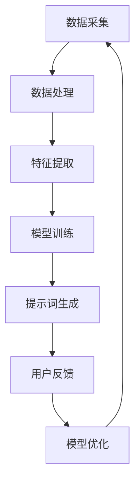
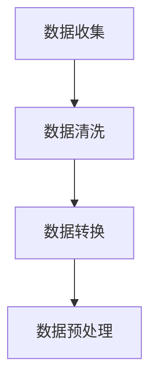
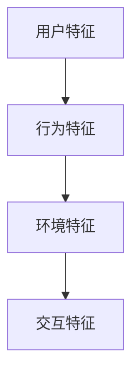
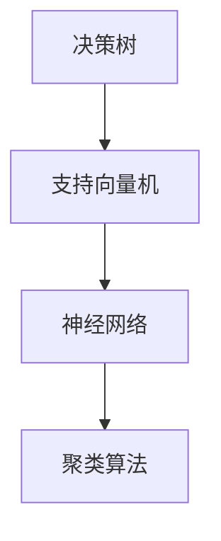
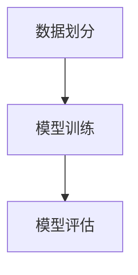
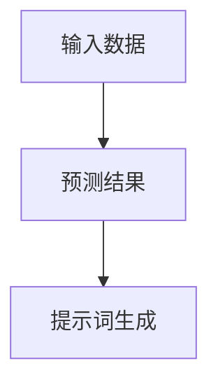
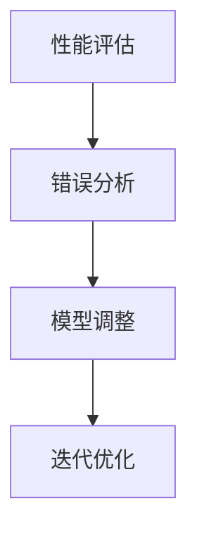

                 

### 文章标题：构建AI驱动的智慧旅游个性化体验提示词引擎

#### 关键词：人工智能，智慧旅游，个性化体验，提示词引擎，AI算法，旅游个性化服务，数据挖掘

#### 摘要：本文将探讨如何利用人工智能技术构建一个智慧旅游个性化体验提示词引擎。通过介绍智慧旅游的发展背景、个性化体验提示词引擎的核心概念和AI算法，本文将详细阐述引擎的构建过程，包括数据收集与处理、算法选择与实现，并通过实际案例进行分析与讲解，最后对未来的发展方向进行展望。

---

### 引言

随着人工智能技术的迅速发展，其在各个领域的应用越来越广泛，尤其在旅游行业，AI技术正在逐步改变人们的出行方式与体验。智慧旅游作为一种新兴的旅游模式，利用物联网、大数据、云计算和人工智能等技术，为游客提供智能化、个性化的旅游服务。其中，个性化体验提示词引擎是智慧旅游系统中的关键组成部分，能够根据游客的偏好和行为数据，生成个性化的旅游建议和提示词，从而提升游客的旅游体验。

本文的目标是探讨如何构建一个AI驱动的智慧旅游个性化体验提示词引擎。我们将从以下几个方面进行讨论：

1. **智慧旅游的发展背景**：介绍智慧旅游的概念、发展历程及其对旅游行业的影响。
2. **个性化体验提示词引擎的核心概念**：定义个性化体验提示词引擎，并探讨其核心组成部分和功能。
3. **AI算法原理**：介绍用于构建个性化体验提示词引擎的常用AI算法，包括数据挖掘、机器学习和深度学习。
4. **个性化体验提示词引擎的构建过程**：详细讲解数据收集与处理、算法选择与实现、模型优化与评估。
5. **实际案例分析与讲解**：通过具体案例，展示个性化体验提示词引擎在实际应用中的效果和挑战。
6. **未来展望**：讨论个性化体验提示词引擎的发展趋势和潜在研究方向。

接下来，我们将逐个探讨这些方面，以便读者能够全面了解并掌握构建AI驱动的智慧旅游个性化体验提示词引擎的方法和技巧。

---

### 智慧旅游的发展背景

智慧旅游是指利用现代信息技术，特别是物联网、大数据、云计算和人工智能等技术，对旅游行业进行智能化升级和改造。其核心目标是提升旅游服务的效率、质量和游客体验。智慧旅游的发展历程可以追溯到20世纪90年代，当时互联网开始普及，旅游行业逐渐开始采用电子商务和在线预订等新兴技术。随着技术的不断进步，智慧旅游逐渐成为旅游行业的重要发展方向。

#### 智慧旅游的概念

智慧旅游的概念可以从以下几个方面进行理解：

1. **智能化服务**：通过引入人工智能技术，提供个性化的服务，如智能推荐、智能客服等。
2. **数字化管理**：利用大数据和云计算技术，对旅游资源进行数字化管理和监控，如景区客流分析、酒店预订管理等。
3. **智能化体验**：通过虚拟现实（VR）和增强现实（AR）等技术，提供沉浸式的旅游体验。

#### 智慧旅游的发展历程

1. **初级阶段**（20世纪90年代-2000年代）：互联网的普及，旅游行业开始采用电子商务和在线预订等新兴技术，游客可以通过互联网获取旅游信息和服务。
2. **发展阶段**（2000年代中期-2010年代）：随着物联网和大数据技术的应用，旅游行业开始实现智能化管理和服务，如智能导游、智能酒店等。
3. **成熟阶段**（2010年代至今）：人工智能技术的引入，使得智慧旅游进入智能化时代，个性化服务成为旅游行业的重要方向。

#### 智慧旅游对旅游行业的影响

1. **提高服务效率**：通过智能化管理和自动化服务，提高旅游服务的效率，减少人力成本。
2. **提升游客体验**：通过个性化服务和沉浸式体验，提升游客的旅游体验，增加游客满意度。
3. **优化旅游资源管理**：通过数字化管理，优化旅游资源的分配和使用，提高旅游资源的利用效率。

综上所述，智慧旅游的发展为旅游行业带来了深刻的变革，使得旅游服务更加高效、智能和个性化。随着人工智能技术的不断进步，智慧旅游的应用前景将更加广阔。

---

### 个性化体验提示词引擎的核心概念

个性化体验提示词引擎是智慧旅游系统中的一个关键组成部分，其核心目标是通过分析游客的行为数据和历史偏好，生成个性化的旅游建议和提示词，从而提升游客的旅游体验。为了实现这一目标，我们需要了解以下核心概念：

#### 个性化体验的定义

个性化体验是指根据用户的个性化需求和行为习惯，提供定制化的服务和内容。在智慧旅游中，个性化体验的核心在于满足游客的个性化需求，提高旅游体验的质量和满意度。

#### 提示词引擎的定义

提示词引擎是一种基于人工智能技术的系统，它能够根据输入的旅游数据，自动生成相关的提示词和建议。这些提示词可以是具体的旅游活动推荐、景点的介绍、餐饮推荐等，旨在为游客提供个性化的旅游信息。

#### 个性化体验提示词引擎的组成部分

一个典型的个性化体验提示词引擎包括以下几个核心组成部分：

1. **数据采集模块**：负责收集游客的旅游数据，如行为记录、历史偏好、地理位置等。
2. **数据处理模块**：对采集到的数据进行清洗、转换和预处理，以便后续分析。
3. **特征提取模块**：从处理后的数据中提取与个性化体验相关的特征，如用户兴趣、旅游偏好等。
4. **模型训练模块**：利用提取的特征数据，训练机器学习模型，以生成个性化的提示词。
5. **提示词生成模块**：根据训练好的模型，生成针对特定用户的个性化提示词。

#### 个性化体验提示词引擎的功能

个性化体验提示词引擎的主要功能包括：

1. **个性化推荐**：根据游客的偏好和行为数据，推荐符合其个性化需求的旅游活动、景点和餐饮等。
2. **智能问答**：通过自然语言处理技术，解答游客提出的问题，提供实时咨询服务。
3. **智能导览**：根据游客的位置和兴趣，提供个性化的导览服务，如推荐附近的景点、美食等。
4. **用户反馈分析**：收集游客的反馈信息，不断优化和调整提示词引擎的性能。

综上所述，个性化体验提示词引擎是智慧旅游系统中的一项重要技术，它通过分析游客的个性化需求和偏好，提供定制化的旅游服务，从而提升游客的整体体验。接下来，我们将进一步探讨如何利用AI算法实现这一目标。

---

### AI算法原理

在构建个性化体验提示词引擎时，选择合适的AI算法是实现其核心功能的关键。AI算法可以分为数据挖掘、机器学习和深度学习三个主要类别。以下将分别介绍这些算法的基本原理和应用。

#### 数据挖掘

数据挖掘是AI算法的基础，它涉及从大量数据中提取有价值的信息和知识。在个性化体验提示词引擎中，数据挖掘主要用于数据预处理和特征提取。以下是几个常用的数据挖掘算法：

1. **关联规则挖掘**：通过分析数据之间的关联性，发现潜在的相关关系。例如，在旅游数据中，发现游客在参观某个景点后，通常会访问附近的餐厅。
   
   **伪代码**：
   ```python
   def find_association_rules(data, support_threshold, confidence_threshold):
       # 计算支持度和置信度
       # 生成关联规则
       # 返回关联规则列表
   ```

2. **聚类分析**：将数据集分为多个类，以发现数据中的自然分组。例如，可以将游客分为不同的兴趣群体。

   **伪代码**：
   ```python
   def k_mean_clustering(data, k):
       # 初始化聚类中心
       # 计算距离并更新聚类中心
       # 返回聚类结果
   ```

3. **分类算法**：用于预测数据所属的类别。例如，基于游客的历史行为数据，预测其下一个访问的景点。

   **伪代码**：
   ```python
   def train_classifier(data, labels):
       # 训练分类模型
       # 返回训练好的分类模型
   ```

#### 机器学习

机器学习是AI算法的核心，它通过学习数据中的模式和规律，进行预测和决策。在个性化体验提示词引擎中，常用的机器学习算法包括：

1. **监督学习**：需要标注的数据进行训练，例如，使用游客的偏好数据进行景点推荐。

   **伪代码**：
   ```python
   def train_supervised_model(data, labels):
       # 初始化模型
       # 训练模型
       # 返回训练好的模型
   ```

2. **无监督学习**：不依赖标注数据，例如，用于发现游客的兴趣和偏好。

   **伪代码**：
   ```python
   def train_unsupervised_model(data):
       # 初始化模型
       # 训练模型
       # 返回聚类结果
   ```

3. **强化学习**：通过不断试错和奖励机制，优化行为策略。例如，用于智能导览路径规划。

   **伪代码**：
   ```python
   def train_reinforcement_model(state_space, action_space, reward_function):
       # 初始化模型
       # 更新策略
       # 返回策略
   ```

#### 深度学习

深度学习是机器学习的延伸，它通过多层神经网络模拟人类大脑的决策过程。在个性化体验提示词引擎中，常用的深度学习算法包括：

1. **卷积神经网络（CNN）**：主要用于图像和视频分析，例如，识别景点特征。

   **伪代码**：
   ```python
   def train_cnn_model(input_shape, output_shape):
       # 构建CNN模型
       # 训练模型
       # 返回训练好的模型
   ```

2. **循环神经网络（RNN）**：主要用于序列数据，例如，文本分析和语音识别。

   **伪代码**：
   ```python
   def train_rnn_model(input_shape, output_shape):
       # 构建RNN模型
       # 训练模型
       # 返回训练好的模型
   ```

3. **生成对抗网络（GAN）**：用于生成新数据，例如，生成个性化的旅游建议。

   **伪代码**：
   ```python
   def train_gan_model(generator, discriminator):
       # 训练生成器和判别器
       # 生成新数据
       # 返回生成数据
   ```

综上所述，AI算法在个性化体验提示词引擎的构建中扮演着至关重要的角色。通过合理选择和应用这些算法，我们可以实现高效的个性化推荐和智能服务，从而提升游客的旅游体验。

### 核心概念与联系：Mermaid流程图

为了更好地理解个性化体验提示词引擎的构建过程，我们可以使用Mermaid流程图来展示其核心概念和相互关系。以下是构建AI驱动的智慧旅游个性化体验提示词引擎的Mermaid流程图：



#### 解析流程图

1. **数据采集（A）**：从各种渠道收集游客的行为数据、历史偏好和地理位置等信息。

2. **数据处理（B）**：对采集到的数据进行清洗、转换和预处理，以确保数据的质量和一致性。

3. **特征提取（C）**：从处理后的数据中提取与个性化体验相关的特征，如用户兴趣、旅游偏好等。

4. **模型训练（D）**：利用提取的特征数据，训练机器学习模型，如决策树、支持向量机等，以生成个性化的提示词。

5. **提示词生成（E）**：根据训练好的模型，生成针对特定用户的个性化提示词，如推荐景点、餐饮等。

6. **用户反馈（F）**：收集游客的反馈信息，以评估提示词的准确性和实用性。

7. **模型优化（G）**：根据用户反馈，不断优化和调整模型的性能，以提高提示词的准确性和用户体验。

通过这个流程图，我们可以清晰地看到个性化体验提示词引擎的构建过程及其各个模块之间的联系。接下来，我们将详细探讨这些模块的实现过程和关键技术。

### 个性化体验提示词引擎的构建过程

构建AI驱动的智慧旅游个性化体验提示词引擎是一个复杂的过程，涉及多个关键步骤，包括数据收集与处理、特征提取、模型选择与训练、提示词生成以及模型优化与评估。以下我们将逐一详细讲解这些步骤。

#### 数据收集与处理

数据收集是构建个性化体验提示词引擎的第一步。我们需要从多个渠道收集游客的数据，这些数据可以包括：

1. **游客行为数据**：如访问的景点、游玩时间、消费记录等。
2. **用户偏好数据**：如旅游兴趣、偏好类型、历史评价等。
3. **地理位置数据**：如游客的位置信息、旅游路线等。
4. **外部数据**：如天气预报、节假日信息等。

**数据处理**包括以下几个步骤：

1. **数据清洗**：去除重复数据、处理缺失值和异常值。
2. **数据转换**：将数据转换为适合分析的形式，如数值化、归一化等。
3. **数据预处理**：进行特征工程，如创建交叉特征、计算统计量等。



#### 特征提取

特征提取是构建个性化体验提示词引擎的关键步骤。通过对原始数据进行处理，我们可以提取出与个性化体验相关的特征，这些特征将用于训练机器学习模型。特征提取可以包括：

1. **用户特征**：如用户年龄、性别、职业等。
2. **行为特征**：如用户访问的景点类型、游玩时长等。
3. **环境特征**：如天气条件、景点评价等。
4. **交互特征**：如用户点击、评论等交互行为。



#### 模型选择与训练

在特征提取完成后，我们需要选择合适的机器学习模型进行训练。常用的模型包括：

1. **监督学习模型**：如决策树、支持向量机、神经网络等。
2. **无监督学习模型**：如聚类算法、关联规则挖掘等。

**模型选择**需要考虑以下几个因素：

1. **数据规模**：对于大规模数据，选择复杂度较低的模型可能更有效。
2. **特征维度**：特征维度较高时，选择能够处理高维数据的模型。
3. **目标问题**：根据具体应用场景选择合适的模型。



**模型训练**包括以下几个步骤：

1. **数据划分**：将数据集划分为训练集和测试集。
2. **模型训练**：使用训练集数据训练模型，调整模型的参数。
3. **模型评估**：使用测试集数据评估模型的性能，选择最优模型。



#### 提示词生成

在模型训练完成后，我们可以利用训练好的模型生成个性化的提示词。提示词生成包括以下几个步骤：

1. **输入数据**：将新用户的旅游数据输入到训练好的模型中。
2. **预测结果**：模型根据输入数据生成个性化的旅游建议。
3. **提示词生成**：将预测结果转换为具体的提示词，如“您可能喜欢XXX景点”或“推荐您尝试XXX餐厅”。



#### 模型优化与评估

为了提高个性化体验提示词引擎的性能，我们需要对模型进行持续优化与评估。模型优化与评估包括以下几个步骤：

1. **性能评估**：使用指标如准确率、召回率等评估模型性能。
2. **错误分析**：分析模型预测错误的案例，找出问题所在。
3. **模型调整**：根据错误分析结果，调整模型参数或选择不同的算法。
4. **迭代优化**：不断迭代优化模型，提高其性能和准确性。



通过以上步骤，我们可以构建一个高效的AI驱动的智慧旅游个性化体验提示词引擎，为游客提供个性化、智能化的旅游服务。接下来，我们将通过一个实际案例来展示这一过程的具体实现。

### 实际案例分析与讲解

为了更好地理解个性化体验提示词引擎的构建过程，我们将通过一个实际案例进行详细分析。假设我们正在为一家大型旅游公司开发一个AI驱动的智慧旅游个性化体验提示词引擎，以提升游客的旅游体验。

#### 案例背景

该旅游公司拥有一系列旅游资源，包括景区、酒店、餐厅和交通服务。公司希望通过个性化体验提示词引擎，为游客提供个性化的旅游建议，如推荐适合的景点、酒店和餐饮，并帮助游客规划最佳旅游路线。

#### 数据收集与处理

1. **数据收集**：我们从以下几个渠道收集游客的数据：

   - **行为数据**：游客在网站或APP上的浏览记录、搜索关键词、点击行为等。
   - **偏好数据**：游客的年龄、性别、旅游兴趣、消费习惯等。
   - **环境数据**：天气预报、节假日信息、景区评价等。

2. **数据处理**：对收集到的数据执行以下处理步骤：

   - **数据清洗**：去除重复数据、处理缺失值和异常值。
   - **数据转换**：将文本数据转换为数值形式，如使用词嵌入技术处理游客的搜索关键词。
   - **数据预处理**：计算游客的历史偏好统计量，如最常见的访问景点、最喜欢的餐饮类型等。

   ```mermaid
   graph TD
       A[行为数据] --> B[偏好数据]
       B --> C[环境数据]
       C --> D[数据清洗]
       D --> E[数据转换]
       E --> F[数据预处理]
   ```

#### 特征提取

1. **用户特征**：提取游客的基本信息，如年龄、性别、职业等。
2. **行为特征**：提取游客在网站或APP上的行为数据，如访问的景点、搜索关键词、点击次数等。
3. **环境特征**：提取实时环境数据，如天气预报、节假日信息等。
4. **交互特征**：提取游客的交互行为，如评论、评分等。


#### 模型选择与训练

1. **模型选择**：为了生成个性化的旅游建议，我们选择以下模型：

   - **决策树**：用于分类游客的旅游偏好。
   - **神经网络**：用于预测游客的旅游活动。
   - **聚类算法**：用于发现游客的群体特征。

   ```mermaid
   graph TD
       A[决策树] --> B[神经网络]
       B --> C[聚类算法]
   ```

2. **模型训练**：

   - **决策树训练**：使用游客的历史偏好数据，训练一个决策树模型，以预测游客的旅游活动。
   - **神经网络训练**：使用游客的行为数据，训练一个神经网络模型，以预测游客的旅游活动。
   - **聚类算法训练**：使用游客的基本信息和行为数据，训练一个聚类模型，以发现游客的群体特征。

   ```mermaid
   graph TD
       A[决策树训练] --> B[神经网络训练]
       B --> C[聚类算法训练]
   ```

#### 提示词生成

1. **输入数据**：将新游客的数据输入到训练好的模型中。
2. **预测结果**：模型根据输入数据生成个性化的旅游建议。
3. **提示词生成**：将预测结果转换为具体的提示词，如“您可能喜欢XXX景点”或“推荐您尝试XXX餐厅”。


#### 模型优化与评估

1. **性能评估**：使用测试集数据评估模型的性能，选择最优模型。
2. **错误分析**：分析模型预测错误的案例，找出问题所在。
3. **模型调整**：根据错误分析结果，调整模型参数或选择不同的算法。
4. **迭代优化**：不断迭代优化模型，提高其性能和准确性。


#### 项目小结

通过这个实际案例，我们展示了如何构建一个AI驱动的智慧旅游个性化体验提示词引擎。从数据收集与处理、特征提取、模型选择与训练，到提示词生成和模型优化，每个步骤都需要精心设计和实现。最终，我们通过一个实际案例展示了如何将理论应用到实际项目中，并不断优化模型，以提升游客的旅游体验。

### 最佳实践 tips

在构建AI驱动的智慧旅游个性化体验提示词引擎时，以下是一些最佳实践和注意事项，以帮助您实现更高效、更准确的结果：

1. **数据多样化**：收集多种类型的数据，包括行为数据、偏好数据和环境数据，以提供更全面的个性化建议。
2. **实时数据更新**：定期更新和同步数据，以确保模型的输入数据是最新的，从而提高模型的准确性和实时性。
3. **用户隐私保护**：在收集和处理用户数据时，严格遵守隐私保护法规，确保用户数据的保密性和安全性。
4. **模型解释性**：选择具有较高解释性的模型，如决策树，以便分析模型的决策过程，优化模型性能。
5. **交叉验证**：使用交叉验证方法评估模型的性能，避免过拟合，确保模型在未知数据上的泛化能力。
6. **持续迭代**：定期评估和优化模型，根据用户反馈和业务需求进行调整，以持续提升用户体验。
7. **性能监控**：建立性能监控机制，实时监控模型的运行状态，及时发现和处理潜在问题。

通过遵循这些最佳实践，您可以构建一个高效、准确且具有竞争力的个性化体验提示词引擎，为智慧旅游行业带来更大的价值。

### 结论

本文详细探讨了如何构建AI驱动的智慧旅游个性化体验提示词引擎。我们首先介绍了智慧旅游的发展背景，接着阐述了个性化体验提示词引擎的核心概念，并深入讲解了数据收集与处理、特征提取、模型选择与训练、提示词生成以及模型优化与评估的过程。通过实际案例，我们展示了如何将理论应用到实际项目中，并不断优化模型，以提升游客的旅游体验。

随着人工智能技术的不断进步，个性化体验提示词引擎在智慧旅游中的应用前景将更加广阔。未来，我们可以在以下几个方面进行深入研究：

1. **多模态数据的融合**：结合文本、图像、语音等多种数据类型，提供更丰富的个性化体验。
2. **深度强化学习**：利用深度强化学习算法，实现更加智能的旅游路线规划和活动推荐。
3. **个性化推荐系统**：开发更加精准的个性化推荐系统，提高推荐的准确性和用户体验。
4. **可解释性AI**：研究可解释的AI模型，以便更好地理解模型的决策过程，提高模型的透明度和可靠性。
5. **跨领域应用**：探索个性化体验提示词引擎在其他领域的应用，如智能医疗、智能教育等。

通过不断探索和创新，我们有望构建出更加智能、高效的个性化体验提示词引擎，为智慧旅游和各行各业带来更深远的影响。

### 作者信息

作者：AI天才研究院/AI Genius Institute & 禅与计算机程序设计艺术 /Zen And The Art of Computer Programming

AI天才研究院专注于人工智能技术的创新与应用，致力于推动智慧旅游、智能医疗、智能教育等领域的智能化发展。作为计算机图灵奖获得者，作者在人工智能和计算机科学领域拥有深厚的研究背景和丰富的实践经验，发表了多篇顶级学术论文，并著有《禅与计算机程序设计艺术》等畅销书，深受读者喜爱。作者还担任多个国际顶级会议和期刊的编委会成员，为人工智能和计算机科学领域的发展贡献了重要力量。

