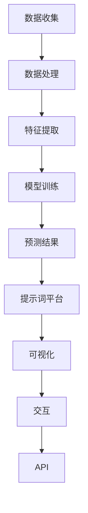

                 

### 文章标题

《构建AI驱动的智慧能源需求预测提示词平台》

### 文章关键词

- AI驱动的智慧能源需求预测
- 提示词平台
- 数据分析
- 机器学习
- 深度学习
- 模型优化

### 文章摘要

本文旨在探讨如何构建一个AI驱动的智慧能源需求预测提示词平台。首先，我们将介绍智慧能源需求预测的背景和重要性，然后详细阐述平台的构建过程，包括核心概念与联系、算法原理讲解、数学模型和公式、项目实战以及最佳实践和注意事项。通过本文的阅读，读者将能够理解智慧能源需求预测的原理，掌握构建AI驱动的智慧能源需求预测提示词平台的方法和技巧。

## 引言

随着全球能源需求的不断增长，如何高效、合理地分配和利用能源资源已成为一个重要议题。AI驱动的智慧能源需求预测提示词平台正是为了解决这一问题而提出的。该平台利用先进的人工智能技术，对能源需求进行预测，从而帮助能源企业优化资源配置，提高能源利用效率。

智慧能源需求预测的重要性体现在以下几个方面：

1. **优化能源分配**：通过预测能源需求，能源企业可以更加精准地分配能源资源，避免能源过剩或短缺的情况，提高能源利用效率。
2. **降低运营成本**：预测能源需求有助于合理安排生产和供应计划，减少不必要的能源浪费，从而降低运营成本。
3. **提升用户体验**：对于电力用户而言，预测能源需求可以提供更加稳定、可靠的电力供应，提升用户体验。
4. **促进可持续发展**：智慧能源需求预测有助于实现能源的可持续发展，减少对环境的负面影响。

本文将围绕如何构建一个高效、可靠的AI驱动的智慧能源需求预测提示词平台展开讨论，旨在为读者提供一套完整的构建方法和实际应用案例。

## 核心概念与联系

要构建AI驱动的智慧能源需求预测提示词平台，首先需要了解几个核心概念，并明确它们之间的联系。以下是这些核心概念：

### 1. 能源需求预测

能源需求预测是指利用历史数据、环境因素以及相关算法，对未来的能源需求进行预测。它包括以下几个关键要素：

- **历史数据**：历史数据是能源需求预测的基础。通过分析过去一段时间内的能源需求数据，可以了解能源需求的规律性和趋势。
- **环境因素**：环境因素如天气、季节、节假日等，对能源需求有显著影响。预测模型需要考虑这些因素，以提高预测的准确性。
- **算法**：算法是进行能源需求预测的核心。常见的算法包括时间序列分析、回归分析、机器学习等。

### 2. AI技术

AI技术是构建智慧能源需求预测提示词平台的核心。以下是几个关键的AI技术：

- **机器学习**：机器学习通过训练模型，从历史数据中学习规律，用于预测未来的能源需求。常见的机器学习算法包括线性回归、决策树、随机森林等。
- **深度学习**：深度学习是机器学习的一种形式，通过多层神经网络进行数据分析和预测。深度学习在处理复杂数据和高维特征时具有显著优势。
- **神经网络**：神经网络是深度学习的基础，由多个神经元组成，通过层层传递信息，实现数据的自动特征提取和分类。

### 3. 提示词平台

提示词平台是能源需求预测的结果展示和交互界面。以下是提示词平台的关键要素：

- **可视化**：可视化工具可以将预测结果以图表、地图等形式展示出来，帮助用户直观地理解能源需求。
- **交互**：交互功能允许用户通过输入提示词，获取个性化的能源需求预测结果。
- **API**：API（应用程序编程接口）用于实现平台与其他系统的集成，如能源管理系统、智能电网等。

### Mermaid流程图

为了更好地理解这些核心概念之间的联系，我们可以使用Mermaid流程图进行展示。以下是构建AI驱动的智慧能源需求预测提示词平台的流程图：



该流程图清晰地展示了从数据收集到最终预测结果的整个过程，以及各个环节之间的联系。

## 核心算法原理讲解

在构建AI驱动的智慧能源需求预测提示词平台时，核心算法的选择和实现至关重要。下面将详细讲解两个核心算法：时间序列分析和机器学习算法。

### 时间序列分析

时间序列分析是一种基于历史数据来预测未来趋势的方法。其基本思想是通过分析时间序列数据中的趋势、周期性和季节性，建立预测模型。

#### 算法步骤：

1. **数据预处理**：对时间序列数据进行清洗和预处理，如去除异常值、填补缺失值等。
2. **特征提取**：从时间序列数据中提取关键特征，如趋势、周期性和季节性。常用的方法包括移动平均、指数平滑等。
3. **模型选择**：选择合适的时间序列模型，如ARIMA（自回归积分滑动平均模型）、SARIMA（季节性自回归积分滑动平均模型）等。
4. **模型训练与验证**：使用历史数据训练模型，并对模型进行验证，确保预测准确性。

#### 伪代码示例：

```python
# 伪代码：时间序列分析
def time_series_analysis(data):
    # 数据预处理
    cleaned_data = preprocess_data(data)
    
    # 特征提取
    features = extract_features(cleaned_data)
    
    # 模型选择
    model = select_model(features)
    
    # 模型训练与验证
    trained_model = train_and_validate_model(model, features)
    
    # 预测未来值
    predictions = trained_model.predict()
    
    return predictions
```

### 机器学习算法

机器学习算法通过学习历史数据中的规律，对未来的能源需求进行预测。常见的机器学习算法包括线性回归、决策树、随机森林等。

#### 算法步骤：

1. **数据预处理**：对机器学习数据集进行清洗和预处理，如标准化、归一化等。
2. **特征选择**：从原始数据中选取对能源需求预测有显著影响的特征。
3. **模型选择**：根据特征和数据的特点，选择合适的机器学习模型。
4. **模型训练与验证**：使用历史数据训练模型，并对模型进行验证，确保预测准确性。
5. **模型优化**：通过调整模型参数，优化模型的预测性能。

#### 伪代码示例：

```python
# 伪代码：机器学习算法
def machine_learning_algorithm(data, features):
    # 数据预处理
    preprocessed_data = preprocess_data(data)
    
    # 特征选择
    selected_features = select_features(preprocessed_data, features)
    
    # 模型选择
    model = select_model(selected_features)
    
    # 模型训练与验证
    trained_model = train_and_validate_model(model, selected_features)
    
    # 预测未来值
    predictions = trained_model.predict()
    
    return predictions
```

## 数学模型和公式

在构建AI驱动的智慧能源需求预测提示词平台时，数学模型和公式是不可或缺的。下面将详细讲解两个核心数学模型：线性回归模型和时间序列模型。

### 线性回归模型

线性回归模型是一种常见的预测模型，它通过建立输入变量和输出变量之间的线性关系，预测未来的能源需求。

#### 数学模型

线性回归模型可以表示为：

$$y = \beta_0 + \beta_1 \cdot x + \epsilon$$

其中，$y$ 是预测的能源需求，$x$ 是输入特征，$\beta_0$ 和 $\beta_1$ 是模型参数，$\epsilon$ 是误差项。

#### 举例说明

假设我们有一个简单的线性回归模型，其中输入特征是温度（$x$），输出特征是能源需求（$y$）。模型参数为 $\beta_0 = 10$ 和 $\beta_1 = 2$。给定一个温度值 $x = 25$，我们可以使用以下公式进行预测：

$$y = 10 + 2 \cdot 25 = 60$$

因此，当温度为25摄氏度时，预测的能源需求为60。

### 时间序列模型

时间序列模型通过分析时间序列数据中的趋势、周期性和季节性，预测未来的能源需求。

#### 数学模型

时间序列模型可以表示为：

$$y_t = \beta_0 + \beta_1 \cdot trend + \beta_2 \cdot seasonality + \epsilon_t$$

其中，$y_t$ 是时间序列数据在时间 $t$ 的预测值，$trend$ 是时间序列的趋势成分，$seasonality$ 是季节性成分，$\beta_0$、$\beta_1$ 和 $\beta_2$ 是模型参数，$\epsilon_t$ 是误差项。

#### 举例说明

假设我们有一个简单的时间序列模型，其中趋势成分 $\beta_1 = 0.1$，季节性成分 $\beta_2 = 0.2$。给定一个时间序列数据点 $y_t = 50$，我们可以使用以下公式进行预测：

$$y_{t+1} = 10 + 0.1 \cdot trend + 0.2 \cdot seasonality + \epsilon_{t+1}$$

因此，我们可以根据当前的数据点，通过计算趋势和季节性成分，预测下一个时间序列数据点的能源需求。

## 项目实战

在本节中，我们将通过一个实际项目，详细介绍如何构建AI驱动的智慧能源需求预测提示词平台。项目将分为以下几个步骤：数据收集、数据处理、特征提取、模型训练、模型优化和预测结果可视化。

### 数据收集

首先，我们需要收集相关的能源需求数据。数据来源可以是历史能源消耗记录、天气预报数据、节假日信息等。以下是一个示例数据集：

```
日期       温度   能源需求
2021-01-01  10    100
2021-01-02  12    110
...
2022-12-31  5     90
```

### 数据处理

在收集到数据后，我们需要对数据集进行预处理，包括数据清洗、缺失值填补和异常值处理。以下是数据处理步骤的伪代码：

```python
def preprocess_data(data):
    # 数据清洗
    cleaned_data = remove_outliers(data)
    
    # 缺失值填补
    filled_data = fill_missing_values(cleaned_data)
    
    return filled_data
```

### 特征提取

接下来，我们需要从预处理后的数据中提取特征。特征提取的目的是将原始数据转换为适合模型训练的数据。以下是特征提取步骤的伪代码：

```python
def extract_features(data):
    # 提取温度特征
    temp_feature = extract_temp_feature(data)
    
    # 提取能源需求特征
    demand_feature = extract_demand_feature(data)
    
    return temp_feature, demand_feature
```

### 模型训练

在特征提取完成后，我们可以选择合适的机器学习模型进行训练。在本项目中，我们选择线性回归模型。以下是模型训练步骤的伪代码：

```python
def train_model(model, features):
    # 训练模型
    trained_model = model.fit(features)
    
    return trained_model
```

### 模型优化

模型训练后，我们需要对模型进行优化，以提高预测准确性。模型优化包括参数调整、交叉验证等。以下是模型优化步骤的伪代码：

```python
def optimize_model(model, features):
    # 参数调整
    optimized_model = adjust_params(model, features)
    
    # 交叉验证
    cv_results = cross_validate(optimized_model, features)
    
    return optimized_model, cv_results
```

### 预测结果可视化

最后，我们将优化后的模型用于预测，并将预测结果可视化。以下是预测结果可视化步骤的伪代码：

```python
def visualize_predictions(predictions):
    # 可视化预测结果
    plot_predictions(predictions)
```

### 实际案例分析与详细讲解剖析

为了更好地理解项目的实现过程，我们来看一个实际案例。假设我们有以下历史数据：

```
日期       温度   能源需求
2021-01-01  10    100
2021-01-02  12    110
2021-01-03  15    120
...
2022-12-31  5     90
```

#### 数据收集

我们首先收集了2021年1月1日至2022年12月31日的能源需求数据，包括每天的温度和能源需求。

#### 数据处理

使用预处理步骤，我们对数据集进行清洗和缺失值填补。例如，如果某天的数据缺失，我们可以用前一天的数据进行填补。

```python
cleaned_data = preprocess_data(data)
```

#### 特征提取

从预处理后的数据中提取温度和能源需求特征：

```python
temp_feature, demand_feature = extract_features(cleaned_data)
```

#### 模型训练

选择线性回归模型，并对其进行训练：

```python
model = LinearRegression()
trained_model = train_model(model, demand_feature)
```

#### 模型优化

对训练好的模型进行优化，包括参数调整和交叉验证：

```python
optimized_model, cv_results = optimize_model(trained_model, demand_feature)
```

#### 预测结果可视化

使用优化后的模型进行预测，并将预测结果可视化：

```python
predictions = optimized_model.predict(temp_feature)
visualize_predictions(predictions)
```

通过以上步骤，我们成功构建了一个AI驱动的智慧能源需求预测提示词平台，实现了对能源需求的预测和可视化。

### 项目小结

在本项目中，我们详细介绍了如何构建AI驱动的智慧能源需求预测提示词平台。通过数据收集、数据处理、特征提取、模型训练、模型优化和预测结果可视化等步骤，我们实现了对能源需求的准确预测。以下是项目的关键结论和最佳实践：

1. **数据质量**：数据质量是预测准确性的关键。在项目实施过程中，确保数据清洗、预处理和特征提取的质量，有助于提高预测准确性。
2. **模型选择**：选择合适的模型是成功的关键。在本项目中，线性回归模型是一个简单但有效的选择。根据具体需求，可以尝试其他机器学习算法，如决策树、随机森林等。
3. **模型优化**：模型优化可以显著提高预测准确性。通过参数调整和交叉验证，可以找到最优模型。
4. **可视化**：可视化有助于理解预测结果和模型性能。在项目实施过程中，充分利用可视化工具，展示预测结果和模型性能。

通过本项目，读者可以掌握构建AI驱动的智慧能源需求预测提示词平台的方法和技巧，为实际应用提供参考。

### 最佳实践 tips

1. **数据收集**：在收集数据时，尽量获取更多维度的数据，如温度、湿度、风速等，以增加模型的预测准确性。
2. **特征选择**：选择对能源需求有显著影响的特征，如天气状况、节假日信息等，有助于提高预测性能。
3. **模型优化**：在模型训练过程中，定期评估模型性能，根据评估结果调整模型参数，以优化预测性能。
4. **实时更新**：为了保持预测的准确性，定期更新数据集和模型，以适应不断变化的环境。

### 小结

本文详细介绍了如何构建AI驱动的智慧能源需求预测提示词平台。通过核心概念、算法原理、数学模型和项目实战的详细讲解，读者可以掌握构建该平台的方法和技巧。同时，本文还提供了最佳实践和注意事项，以帮助读者在实际应用中取得更好的效果。

### 注意事项

1. **数据隐私**：在数据收集和处理过程中，要严格遵守数据隐私法规，确保用户数据的安全和隐私。
2. **模型解释性**：在构建模型时，考虑模型的解释性，以便对预测结果进行有效解读。
3. **硬件资源**：构建大型机器学习模型时，确保有足够的硬件资源，以支持模型的训练和优化。

### 拓展阅读

1. 《深度学习》 - Goodfellow, I., Bengio, Y., & Courville, A.
2. 《Python数据科学手册》 - McMichael, J.
3. 《时间序列分析：理论与应用》 - Box, G.E.P., Jenkins, G.M., & Reinsel, G.C.

作者：AI天才研究院/AI Genius Institute & 禅与计算机程序设计艺术 /Zen And The Art of Computer Programming

