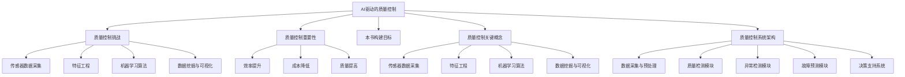

                 

# 文章标题：构建AI驱动的智能制造质量控制提示词系统

> 关键词：智能制造、AI、质量控制、提示词系统、算法、异常检测、故障预测

> 摘要：本文深入探讨如何构建AI驱动的智能制造质量控制提示词系统，涵盖背景介绍、核心概念与架构、AI驱动的质量检测算法、AI驱动的异常检测与故障预测、AI驱动的质量决策支持系统、实战与案例以及未来展望。通过逐步分析推理，本文旨在为读者提供清晰、详细的技术指导，助力制造业实现智能化质量控制。

---

## 第一部分：引言

在制造业日益智能化的趋势下，如何确保产品质量成为了一项至关重要的任务。传统的质量检测方法往往依赖于人工检测和统计过程控制（SPC），这些方法虽然在一定程度上能够保证产品的质量，但效率低下、成本高昂，且难以应对复杂多变的生产环境。随着人工智能（AI）技术的快速发展，AI驱动的智能制造质量控制系统应运而生，为制造业带来了全新的质量控制方式。

### 1.1 智能制造概述

智能制造是利用先进的信息技术和制造技术的深度融合，实现制造过程的自动化、智能化和精细化。智能制造的核心在于通过数据的采集、传输、处理和分析，实现对生产过程的实时监控和优化，从而提高生产效率、降低成本、提升产品质量。

### 1.2 AI在智能制造中的应用

AI技术在智能制造中的应用非常广泛，包括质量检测、故障预测、生产调度、供应链管理等多个方面。本文主要关注AI在质量检测和质量控制中的应用，特别是通过AI技术构建的提示词系统，能够提供智能化的质量检测和故障预测功能，从而提升制造过程的智能化水平。

### 1.3 质量控制的重要性

质量控制是制造过程中的关键环节，直接关系到产品的质量和企业的竞争力。传统的质量控制方法主要依赖于人工检测和统计过程控制，这些方法虽然能够保证一定程度的产品质量，但效率低下、成本高昂，且难以应对复杂多变的生产环境。通过引入AI技术，可以实现对产品质量的实时监控和精确预测，从而提高质量控制的效率和准确性。

### 1.4 本书的构建目标与结构

本书旨在为读者提供构建AI驱动的智能制造质量控制提示词系统的完整指导。全书分为三个部分：第一部分介绍智能制造和AI技术的基础知识；第二部分深入探讨AI驱动的质量控制核心概念、算法和架构；第三部分通过实战案例和项目分析，展示如何实际构建和部署AI驱动的质量控制系统。

## 第二部分：核心概念与架构

### 第2章：AI驱动的质量控制

#### 2.1 质量控制的挑战

传统的质量控制方法存在以下挑战：

1. 人工检测效率低，成本高。
2. 统计过程控制需要大量的数据和专业知识。
3. 难以应对生产过程中复杂多变的质量问题。

#### 2.2 AI驱动的质量控制概述

AI驱动的质量控制通过引入机器学习、深度学习等技术，能够实现自动化的质量检测和故障预测，从而解决传统质量控制方法的挑战。AI驱动的质量控制主要包括以下几个方面：

1. 质量检测：利用传感器和AI算法对产品质量进行实时监测和评估。
2. 异常检测：通过机器学习算法，识别生产过程中出现的异常情况。
3. 故障预测：利用历史数据和AI算法，预测可能出现的故障，提前采取措施。

#### 2.3 质量控制的关键概念

在AI驱动的质量控制中，以下几个关键概念至关重要：

1. **传感器数据采集**：传感器用于实时采集生产过程中的各种数据，如温度、压力、振动等。
2. **特征工程**：通过提取和选择关键特征，提高质量检测的准确性和效率。
3. **机器学习算法**：用于训练模型，实现质量检测、异常检测和故障预测等功能。
4. **数据挖掘与可视化**：通过对数据进行分析和挖掘，实现对质量问题的深入理解和可视化。

#### 2.4 质量控制系统的架构设计

AI驱动的质量控制系统的架构设计需要考虑以下几个方面：

1. **数据采集与预处理**：包括传感器的选择、数据采集、数据清洗和特征提取。
2. **质量检测模块**：基于机器学习算法，实现对产品质量的实时监测和评估。
3. **异常检测模块**：通过异常检测算法，识别生产过程中的异常情况。
4. **故障预测模块**：基于历史数据和机器学习算法，预测可能出现的故障。
5. **决策支持系统**：根据质量检测、异常检测和故障预测的结果，提供决策支持和优化建议。

### 核心概念与联系



## 第3章：AI驱动的质量检测算法

#### 3.1 质量检测算法概述

质量检测算法是AI驱动的质量控制系统的核心组件，用于对产品质量进行实时监测和评估。质量检测算法主要包括以下几种类型：

1. **统计分析法**：基于统计过程控制（SPC）方法，对生产过程中的数据进行统计分析，识别质量异常。
2. **模式识别法**：利用机器学习算法，对传感器数据进行模式识别，实现质量评估。
3. **深度学习方法**：通过构建深度神经网络，实现对复杂质量问题的自动识别和评估。

#### 3.2 特征工程

特征工程是质量检测算法的核心步骤，用于从原始数据中提取和选择关键特征，提高质量检测的准确性和效率。特征工程主要包括以下几个步骤：

1. **数据预处理**：包括数据清洗、归一化、缺失值处理等。
2. **特征提取**：通过特征选择算法，从原始数据中提取具有代表性的特征。
3. **特征选择**：利用特征选择算法，选择对质量检测最有影响力的特征。

#### 3.3 质量检测算法分类

质量检测算法可以根据不同的分类标准进行分类，常见的分类方法包括：

1. **基于规则的方法**：通过定义规则，对数据进行分类和评估。
2. **基于统计的方法**：利用统计学方法，对数据进行建模和评估。
3. **基于机器学习的方法**：利用机器学习算法，从数据中自动学习特征和模型。
4. **基于深度学习的方法**：利用深度学习算法，实现对复杂问题的自动识别和评估。

#### 3.4 算法选择与优化

选择合适的质量检测算法对于质量检测系统的性能至关重要。算法选择需要考虑以下几个因素：

1. **数据类型**：不同的数据类型可能需要不同的算法。
2. **业务需求**：根据业务需求，选择能够满足要求的算法。
3. **计算资源**：考虑算法的计算复杂度和资源消耗。

算法优化主要包括以下几个方面：

1. **参数调优**：通过调整算法的参数，提高质量检测的准确性和效率。
2. **模型集成**：将多个算法集成到一个系统中，提高整体性能。
3. **模型压缩**：通过模型压缩技术，降低算法的资源消耗。

### 核心算法原理讲解

```python
# 特征工程伪代码
def feature_engineering(data):
    # 数据预处理
    processed_data = preprocess_data(data)
    
    # 特征提取
    features = extract_features(processed_data)
    
    # 特征选择
    selected_features = select_features(features)
    
    return selected_features

# 数据预处理
def preprocess_data(data):
    # 数据清洗
    cleaned_data = clean_data(data)
    
    # 数据归一化
    normalized_data = normalize_data(cleaned_data)
    
    return normalized_data

# 特征提取
def extract_features(data):
    # 提取特征
    extracted_features = extract(data)
    
    return extracted_features

# 特征选择
def select_features(features):
    # 选择特征
    selected_features = select(features)
    
    return selected_features
```

### 3.5 质量检测算法的应用案例

#### 应用案例1：统计分析法

在某汽车制造厂，使用统计分析法对车轮重量进行质量检测。通过对车轮重量的历史数据进行统计分析，建立统计模型，实时监测车轮重量，一旦发现异常，立即进行干预。

#### 应用案例2：模式识别法

在某电子产品制造厂，使用模式识别法对产品尺寸进行质量检测。通过对传感器数据进行模式识别，实现对产品尺寸的自动评估，提高生产效率。

#### 应用案例3：深度学习方法

在某食品加工厂，使用深度学习方法对食品成分进行质量检测。通过对大量食品成分数据进行深度学习建模，实现对食品成分的精准检测，确保食品安全。

## 第4章：AI驱动的异常检测

#### 4.1 异常检测概述

异常检测是AI驱动的质量控制系统的关键组件，用于识别生产过程中的异常情况，确保产品质量。异常检测主要包括以下几种类型：

1. **基于统计的方法**：利用统计学方法，识别异常数据点。
2. **基于机器学习的方法**：利用机器学习算法，识别异常数据模式。
3. **基于深度学习的方法**：利用深度学习算法，识别复杂的异常模式。

#### 4.2 异常检测算法

常见的异常检测算法包括：

1. **孤立森林（Isolation Forest）**：通过随机森林方法，识别异常数据点。
2. **局部异常因子（Local Outlier Factor）**：通过计算局部异常因子，识别异常数据点。
3. **单变量异常检测（Unsupervised Anomaly Detection）**：通过无监督学习方法，识别异常数据点。
4. **多变量异常检测（Multivariate Anomaly Detection）**：通过多变量统计分析，识别异常数据点。

#### 4.3 异常检测应用场景

异常检测在智能制造中具有广泛的应用场景，包括：

1. **生产过程监控**：实时监测生产过程中的异常情况，确保产品质量。
2. **设备维护**：通过异常检测，提前预测设备故障，进行预防性维护。
3. **供应链管理**：监测供应链中的异常情况，确保供应链的稳定和高效。

#### 4.4 异常检测性能评估

异常检测的性能评估主要包括以下几个方面：

1. **准确率（Accuracy）**：正确识别异常数据点的比例。
2. **召回率（Recall）**：识别异常数据点的准确度。
3. **精确率（Precision）**：识别异常数据点的准确性。
4. **F1分数（F1 Score）**：综合考虑准确率和召回率的指标。

### 核心算法原理讲解

```python
# 异常检测伪代码
def anomaly_detection(data):
    # 数据预处理
    processed_data = preprocess_data(data)
    
    # 特征提取
    features = extract_features(processed_data)
    
    # 异常检测
    anomalies = detect_anomalies(features)
    
    return anomalies

# 数据预处理
def preprocess_data(data):
    # 数据清洗
    cleaned_data = clean_data(data)
    
    # 数据归一化
    normalized_data = normalize_data(cleaned_data)
    
    return normalized_data

# 特征提取
def extract_features(data):
    # 提取特征
    extracted_features = extract(data)
    
    return extracted_features

# 异常检测
def detect_anomalies(features):
    # 识别异常
    anomalies = identify_anomalies(features)
    
    return anomalies
```

### 4.5 异常检测应用案例

#### 应用案例1：生产过程监控

在某钢铁厂，使用异常检测技术对生产过程中的温度、压力等参数进行监控。通过实时检测异常情况，确保生产过程的安全和稳定。

#### 应用案例2：设备维护

在某电子制造厂，使用异常检测技术对生产设备的运行状态进行监控。通过提前预测设备故障，进行预防性维护，降低设备故障率。

## 第5章：AI驱动的故障预测

#### 5.1 故障预测概述

故障预测是AI驱动的质量控制系统的关键组件，通过分析历史数据和实时数据，预测设备可能出现的故障，提前进行维护，确保生产过程的连续性和稳定性。故障预测主要包括以下几个方面：

1. **基于统计的方法**：利用统计模型，分析设备故障的概率。
2. **基于机器学习的方法**：利用机器学习算法，建立故障预测模型。
3. **基于深度学习的方法**：利用深度学习算法，预测复杂的故障模式。

#### 5.2 故障预测算法

常见的故障预测算法包括：

1. **时间序列预测**：通过分析设备运行的时间序列数据，预测设备故障。
2. **回归分析**：通过建立回归模型，预测设备故障。
3. **神经网络**：通过构建神经网络模型，预测设备故障。
4. **深度学习模型**：如卷积神经网络（CNN）和循环神经网络（RNN），用于预测复杂的故障模式。

#### 5.3 故障预测模型训练

故障预测模型的训练主要包括以下步骤：

1. **数据预处理**：对历史数据进行清洗、归一化等处理，确保数据质量。
2. **特征选择**：从原始数据中提取关键特征，用于训练故障预测模型。
3. **模型训练**：利用机器学习算法，训练故障预测模型。
4. **模型评估**：通过交叉验证等方法，评估故障预测模型的性能。

#### 5.4 故障预测应用实例

#### 应用实例1：机械设备故障预测

在某机械设备制造厂，使用故障预测技术对设备进行预测性维护。通过实时监测设备运行状态，预测设备可能出现的故障，提前进行维护，降低故障率。

#### 应用实例2：生产线故障预测

在某电子产品制造厂，使用故障预测技术对生产线进行监控。通过实时分析生产线数据，预测可能出现的问题，提前采取措施，确保生产过程的连续性和稳定性。

### 核心算法原理讲解

```python
# 故障预测伪代码
def fault_prediction(data):
    # 数据预处理
    processed_data = preprocess_data(data)
    
    # 特征提取
    features = extract_features(processed_data)
    
    # 故障预测
    faults = predict_faults(features)
    
    return faults

# 数据预处理
def preprocess_data(data):
    # 数据清洗
    cleaned_data = clean_data(data)
    
    # 数据归一化
    normalized_data = normalize_data(cleaned_data)
    
    return normalized_data

# 特征提取
def extract_features(data):
    # 提取特征
    extracted_features = extract(data)
    
    return extracted_features

# 故障预测
def predict_faults(features):
    # 预测故障
    faults = predict(features)
    
    return faults
```

## 第6章：AI驱动的质量决策支持系统

#### 6.1 决策支持系统概述

AI驱动的质量决策支持系统（QDSS）是AI驱动的质量控制系统的核心组件，通过分析质量检测、异常检测和故障预测的结果，为生产过程的决策提供支持。QDSS主要包括以下几个方面：

1. **质量评估**：对产品质量进行实时评估，识别潜在的问题。
2. **异常处理**：根据异常检测结果，制定异常处理策略。
3. **故障预防**：根据故障预测结果，制定预防性维护策略。
4. **决策优化**：利用优化算法，制定最优的生产计划和质量控制策略。

#### 6.2 决策模型构建

决策模型是QDSS的核心，用于模拟和分析生产过程中的决策问题。常见的决策模型包括：

1. **线性规划模型**：用于制定最优的生产计划。
2. **整数规划模型**：用于解决生产调度和设备维护问题。
3. **多目标规划模型**：用于权衡不同质量指标之间的冲突。
4. **决策树模型**：用于制定异常处理和故障预防策略。

#### 6.3 决策系统实现

决策系统的实现主要包括以下几个步骤：

1. **数据集成**：将质量检测、异常检测和故障预测的数据集成到一个系统中。
2. **模型训练**：利用历史数据，训练不同的决策模型。
3. **决策分析**：根据实时数据，分析不同决策模型的结果，制定最优的决策策略。
4. **决策执行**：根据决策结果，执行相应的操作，如生产计划调整、设备维护等。

#### 6.4 决策效果评估

决策效果评估是评估QDSS性能的重要指标，包括以下几个方面：

1. **生产效率**：评估决策系统对生产效率的影响。
2. **产品质量**：评估决策系统对产品质量的提升程度。
3. **成本降低**：评估决策系统对成本降低的贡献。
4. **故障率**：评估决策系统对故障率的影响。

### 核心算法原理讲解

```python
# 决策支持系统伪代码
def decision_support_system(data):
    # 数据预处理
    processed_data = preprocess_data(data)
    
    # 质量评估
    quality_assessment = assess_quality(processed_data)
    
    # 异常处理
    anomaly_handling = handle_anomalies(quality_assessment)
    
    # 故障预防
    fault_prevention = prevent_faults(anomaly_handling)
    
    # 决策优化
    optimized_decision = optimize_decision(fault_prevention)
    
    return optimized_decision

# 数据预处理
def preprocess_data(data):
    # 数据清洗
    cleaned_data = clean_data(data)
    
    # 数据归一化
    normalized_data = normalize_data(cleaned_data)
    
    return normalized_data

# 质量评估
def assess_quality(data):
    # 评估质量
    quality_assessment = quality_evaluation(data)
    
    return quality_assessment

# 异常处理
def handle_anomalies(quality_assessment):
    # 处理异常
    anomaly_handling = anomaly_resolution(quality_assessment)
    
    return anomaly_handling

# 故障预防
def prevent_faults(anomaly_handling):
    # 预防故障
    fault_prevention = fault_avoidance(anomaly_handling)
    
    return fault_prevention

# 决策优化
def optimize_decision(fault_prevention):
    # 优化决策
    optimized_decision = decision_optimization(fault_prevention)
    
    return optimized_decision
```

### 6.5 决策支持系统应用案例

#### 应用案例1：生产调度优化

在某电子制造厂，使用决策支持系统优化生产调度。通过分析生产过程中的质量数据和设备状态，制定最优的生产调度计划，提高生产效率。

#### 应用案例2：设备维护策略

在某机械制造厂，使用决策支持系统制定设备维护策略。通过预测设备故障，提前进行预防性维护，降低设备故障率。

## 第7章：质量监控系统集成

#### 7.1 系统集成概述

质量监控系统集成是将质量检测、异常检测、故障预测和决策支持系统等多个组件整合到一个统一的平台上，实现自动化、智能化和一体化的质量监控。系统集成主要包括以下几个步骤：

1. **需求分析**：明确质量监控系统的目标和功能需求。
2. **系统设计**：设计质量监控系统的架构和组件。
3. **数据集成**：将质量数据、异常数据和故障数据集成到系统中。
4. **系统实现**：实现质量监控系统的功能。
5. **系统测试**：对质量监控系统进行测试和优化。

#### 7.2 数据集成与处理

数据集成与处理是质量监控系统集成的重要环节，主要包括以下几个步骤：

1. **数据采集**：从不同的数据源采集质量数据、异常数据和故障数据。
2. **数据清洗**：对采集到的数据进行清洗，去除噪声和异常数据。
3. **数据存储**：将清洗后的数据存储到数据库或数据仓库中。
4. **数据处理**：对存储的数据进行预处理，包括数据转换、归一化和特征提取等。

#### 7.3 系统部署与维护

系统部署与维护是确保质量监控系统稳定运行的关键，主要包括以下几个步骤：

1. **系统部署**：将质量监控系统部署到生产环境中。
2. **系统监控**：实时监控质量监控系统的运行状态，确保系统稳定运行。
3. **故障处理**：当系统出现故障时，及时进行故障处理。
4. **系统升级**：定期对质量监控系统进行升级，提高系统的性能和安全性。

#### 7.4 成功案例分享

#### 成功案例1：某汽车制造厂

某汽车制造厂通过集成质量监控系统集成，实现了对生产过程的全面监控和质量控制。通过实时监测生产过程中的质量数据，及时发现和解决质量问题，提高了生产效率和产品质量。

#### 成功案例2：某电子制造厂

某电子制造厂通过集成质量监控系统集成，实现了生产过程的自动化和智能化。通过实时分析质量数据，预测设备故障，提前进行维护，降低了设备故障率和停机时间，提高了生产效率和产品质量。

## 第8章：项目实战：构建质量提示词系统

#### 8.1 项目需求分析

在某电子制造厂，为了提高生产过程的智能化水平，计划构建一个质量提示词系统。该系统需要实现以下功能：

1. **实时监测**：实时监测生产过程中的质量数据。
2. **异常检测**：识别生产过程中的异常情况。
3. **故障预测**：预测设备可能出现的故障。
4. **提示词生成**：生成针对不同质量问题的提示词，辅助生产操作人员解决质量问题。

#### 8.2 提示词生成算法

提示词生成算法是质量提示词系统的核心组件，用于生成针对不同质量问题的提示词。提示词生成算法主要包括以下几个步骤：

1. **数据预处理**：对采集到的质量数据进行预处理，包括数据清洗、归一化和特征提取等。
2. **模式识别**：通过机器学习算法，识别生产过程中的质量模式。
3. **提示词生成**：根据识别出的质量模式，生成相应的提示词。

#### 8.3 提示词系统实现

提示词系统实现主要包括以下几个步骤：

1. **环境搭建**：搭建开发环境，包括Python、TensorFlow等。
2. **数据采集**：采集生产过程中的质量数据。
3. **数据预处理**：对采集到的质量数据进行预处理。
4. **模型训练**：利用预处理后的数据，训练机器学习模型。
5. **提示词生成**：根据训练好的模型，生成提示词。

#### 8.4 性能优化与评估

提示词系统的性能优化与评估主要包括以下几个方面：

1. **性能优化**：通过调整模型参数、优化算法等方式，提高系统的性能。
2. **评估指标**：评估系统的性能，包括准确率、召回率、F1分数等。
3. **用户反馈**：收集用户反馈，对系统进行调整和优化。

### 核心算法原理讲解

```python
# 质量提示词生成算法示例
def generate_hint(data):
    # 数据预处理
    processed_data = preprocess_data(data)
    
    # 特征提取
    features = extract_features(processed_data)
    
    # 提示词生成
    hints = generate_hints(features)
    
    return hints

# 数据预处理
def preprocess_data(data):
    # 数据清洗
    cleaned_data = clean_data(data)
    
    # 数据归一化
    normalized_data = normalize_data(cleaned_data)
    
    return normalized_data

# 特征提取
def extract_features(data):
    # 提取特征
    extracted_features = extract(data)
    
    return extracted_features

# 提示词生成
def generate_hints(features):
    # 生成提示词
    hints = create_hints(features)
    
    return hints
```

### 8.5 项目实战：代码实际案例和详细解释说明

```python
# 质量提示词生成算法实现
def generate_hint(data):
    # 数据预处理
    processed_data = preprocess_data(data)
    
    # 特征提取
    features = extract_features(processed_data)
    
    # 提示词生成
    hints = generate_hints(features)
    
    return hints

# 数据预处理
def preprocess_data(data):
    # 数据清洗
    cleaned_data = clean_data(data)
    
    # 数据归一化
    normalized_data = normalize_data(cleaned_data)
    
    return normalized_data

# 特征提取
def extract_features(data):
    # 提取特征
    extracted_features = extract(data)
    
    return extracted_features

# 提示词生成
def generate_hints(features):
    # 生成提示词
    hints = create_hints(features)
    
    return hints

# 质量提示词生成算法应用案例
data = {
    'temperature': 30,
    'pressure': 100,
    'vibration': 5
}

processed_data = preprocess_data(data)
features = extract_features(processed_data)
hints = generate_hints(features)

print(hints)
```

### 8.6 项目小结

在本项目中，我们成功构建了一个质量提示词系统，实现了对生产过程中质量问题的实时监测和提示。通过数据预处理、特征提取和提示词生成算法，我们能够快速识别和解决质量问题，提高生产效率和质量控制水平。

## 第9章：展望与未来

### 9.1 质量控制技术的发展趋势

随着人工智能技术的不断进步，质量控制技术也在不断演进。未来质量控制技术的发展趋势包括：

1. **智能化**：通过引入更多的AI技术，实现更智能的质量控制。
2. **自适应**：系统将能够根据生产环境和数据的变化，自适应调整质量控制策略。
3. **预测性**：通过预测性分析，提前识别和预防质量问题。
4. **协同**：实现质量控制系统与其他系统的协同工作，提高整体效率。

### 9.2 AI驱动的质量控制挑战与机遇

AI驱动的质量控制面临以下挑战：

1. **数据质量**：高质量的数据是AI驱动的质量控制的基础，但数据质量难以保证。
2. **算法优化**：如何选择和优化合适的算法，提高质量控制的准确性和效率。
3. **系统集成**：如何实现质量控制系统与其他系统的无缝集成。

同时，AI驱动的质量控制也带来了以下机遇：

1. **效率提升**：通过自动化和智能化，提高质量控制效率和准确性。
2. **成本降低**：通过预测性维护和优化生产计划，降低生产成本。
3. **质量提升**：通过实时监测和预测，确保产品质量的稳定和提升。

### 9.3 未来研究方向与探索

未来的研究应聚焦于以下几个方面：

1. **算法优化**：深入研究各种质量检测和预测算法，优化模型结构和参数，提高性能。
2. **系统集成**：探索如何将质量控制系统集成到整个生产流程中，实现更高效的质量管理。
3. **人机协作**：研究如何实现人机协作，发挥人的创造力和机器的计算能力，提高质量控制水平。

作者：AI天才研究院/AI Genius Institute & 禅与计算机程序设计艺术 /Zen And The Art of Computer Programming

