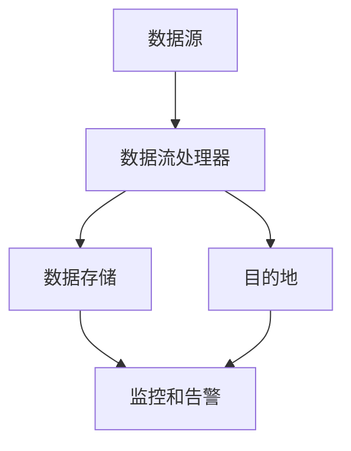

                 


## 文章标题：构建可扩展的实时数据同步系统

### 关键词：
- 实时数据同步
- 系统架构
- 可扩展性
- 核心算法
- 数学模型
- 项目实战
- 性能优化

### 摘要：
本文深入探讨了构建可扩展的实时数据同步系统的各个方面，从系统设计原则到核心算法原理，再到数学模型和项目实战。通过详细的伪代码展示、Mermaid流程图，以及具体的案例分析，读者将全面了解实时数据同步系统的设计、实现和优化方法，为实际项目提供实用的指导。

## 引言

### 实时数据同步系统的概念与重要性

实时数据同步系统是一种能够在短时间内将数据从源头传输到目的地的系统。随着互联网的普及和大数据技术的发展，实时数据处理需求日益增长。实时数据同步系统在金融交易、物联网、在线社交网络等领域发挥着至关重要的作用。其重要性体现在以下几个方面：

1. **实时性**：实时数据同步系统能够在数据发生变化的瞬间将其同步到目的地，确保数据的一致性和实时性。
2. **数据完整性**：系统能够确保所有数据都能被正确同步，避免数据丢失或重复。
3. **系统稳定性**：即使在高并发和高负载情况下，系统仍能稳定运行，确保数据传输的可靠性。
4. **高可用性**：系统具备容错能力，能够在出现故障时迅速恢复，保证数据传输的持续性。

### 本书结构

本文将按照以下结构展开：

1. 系统设计原则
2. 系统架构
3. 核心算法原理讲解
4. 数学模型和公式讲解
5. 项目实战
6. 测试与部署
7. 性能优化
8. 安全性与一致性
9. 总结与展望

通过上述结构，我们将全面解析实时数据同步系统的构建过程，为读者提供从理论到实践的完整指导。

## 系统设计原则

### 可扩展性设计

可扩展性是实时数据同步系统的核心设计原则之一。随着数据量和并发请求的增加，系统需要能够自动扩展其处理能力。实现可扩展性的方法包括水平扩展和垂直扩展。

1. **水平扩展（Scaling Out）**：通过增加系统中的节点数量来提高系统的处理能力。例如，使用分布式数据库来存储数据，使用消息队列来处理数据流。
2. **垂直扩展（Scaling Up）**：通过增加系统节点的硬件资源来提高系统的处理能力。例如，增加服务器的CPU、内存和存储容量。

### 高可用性设计

高可用性设计确保系统在出现故障时能够快速恢复，保证数据的连续传输。实现高可用性的方法包括：

1. **数据复制**：将数据复制到多个节点，确保一个节点故障不会导致数据丢失。
2. **故障转移**：在主节点故障时，自动将工作转移到备用节点，确保系统持续运行。
3. **负载均衡**：通过负载均衡器将请求分配到不同的节点，避免单个节点过载。

### 低延迟设计

低延迟设计确保数据在传输过程中的时间最小化。实现低延迟的方法包括：

1. **缓存**：在数据源头和目的地之间使用缓存，减少数据传输次数。
2. **数据压缩**：使用数据压缩算法减少数据传输的大小。
3. **优化网络**：优化网络配置，减少数据传输的路径和时间。

### 其他设计原则

除了上述核心原则，系统设计还应考虑以下因素：

1. **数据一致性**：确保数据在不同节点之间的一致性。
2. **安全性**：保护数据在传输过程中的安全，防止数据泄露和篡改。
3. **可观测性**：通过监控系统状态，确保系统能够快速响应和处理问题。

## 系统架构

### 总体架构

实时数据同步系统的总体架构通常包括以下组件：

1. **数据源**：数据的源头，可以是数据库、日志文件、Web服务或其他数据生成源。
2. **数据存储**：用于存储同步数据的组件，如数据库、文件系统或云存储。
3. **数据流处理器**：处理数据流的组件，包括数据清洗、转换和加载等操作。
4. **目的地**：数据最终存储和使用的位置，如数据库、应用程序或分析系统。
5. **监控和告警**：用于监控系统状态和性能的组件，当系统出现问题时自动发送告警。

### 组件详解

1. **数据源**：数据源可以是结构化数据（如关系数据库）或非结构化数据（如日志文件、Web服务API）。为了实现实时同步，数据源需要提供数据变更通知机制，如数据库触发器、Webhooks或消息队列。
   
2. **数据存储**：数据存储需要具备高可靠性、高可用性和高性能，以支持实时数据同步。常用的数据存储包括关系数据库（如MySQL、PostgreSQL）、NoSQL数据库（如MongoDB、Cassandra）和分布式文件系统（如HDFS）。

3. **数据流处理器**：数据流处理器负责接收来自数据源的数据，进行清洗、转换和加载操作。数据清洗包括去除无效数据、处理缺失值和数据格式转换。数据转换可能涉及聚合、连接和计算等操作。加载操作将清洗和转换后的数据加载到目的地。

4. **目的地**：目的地是数据最终存储和使用的位置。根据业务需求，目的地可以是关系数据库、NoSQL数据库、数据仓库或大数据分析平台。

5. **监控和告警**：监控系统状态和性能对于实时数据同步系统至关重要。监控组件可以收集系统指标数据，如CPU使用率、内存使用率、I/O性能等。告警系统在系统性能下降或出现故障时自动发送告警通知，以便及时处理。

### Mermaid流程图

为了更好地理解实时数据同步系统的运行流程，我们可以使用Mermaid流程图来展示。以下是系统的基本运行流程：



在这个流程图中：

- A表示数据源，负责生成和发送数据。
- B表示数据流处理器，负责接收、清洗、转换和加载数据。
- C表示数据存储，用于存储处理后的数据。
- D表示目的地，是数据的最终存储位置。
- E表示监控和告警，用于监控系统状态并通知异常。

通过这个流程图，我们可以清晰地看到数据在系统中的流动过程，以及各个组件之间的交互关系。

## 核心算法原理讲解

### 增量同步算法

增量同步算法是实时数据同步系统中常用的算法之一，其主要目标是仅同步数据变更部分，以提高数据同步效率。以下是增量同步算法的原理和伪代码。

#### 算法原理

增量同步算法基于时间戳或序列号来标识数据的变更。具体步骤如下：

1. 数据源发送一个时间戳或序列号给数据流处理器。
2. 数据流处理器检查本地缓存，如果时间戳或序列号与缓存中的最新时间戳或序列号相同，则不再处理数据，否则处理数据变更。
3. 数据流处理器将变更后的数据加载到数据存储和目的地。

#### 伪代码

```python
def incremental_sync(source, processor, storage, destination):
    last_sync_timestamp = processor.get_last_sync_timestamp()
    
    while True:
        timestamp, data = source.get_data_change()
        
        if timestamp > last_sync_timestamp:
            processor.process_data(data)
            storage.load_data(data)
            destination.load_data(data)
            
            processor.update_last_sync_timestamp(timestamp)
            
        time.sleep(sync_interval)
```

在这个伪代码中：

- `source.get_data_change()` 从数据源获取数据变更。
- `processor.get_last_sync_timestamp()` 获取数据流处理器上一次同步的时间戳。
- `processor.process_data(data)` 处理数据变更。
- `storage.load_data(data)` 将数据加载到数据存储。
- `destination.load_data(data)` 将数据加载到目的地。
- `processor.update_last_sync_timestamp(timestamp)` 更新数据流处理器的最后同步时间戳。

### 一致性算法

一致性算法在实时数据同步系统中至关重要，确保数据在不同节点之间的一致性。以下是一致性算法的原理和伪代码。

#### 算法原理

一致性算法通常基于分布式一致性协议，如Paxos、Raft等。具体步骤如下：

1. 数据流处理器接收到数据变更后，将其发送到所有参与同步的节点。
2. 各个节点根据本地状态和接收到的数据变更，决定是否接受该变更。
3. 如果大部分节点接受该变更，则更新本地状态。
4. 如果有节点拒绝该变更，则进行冲突解决，确保最终一致性。

#### 伪代码

```python
def consistency_algorithm(processor, nodes):
    change = processor.get_data_change()
    
    for node in nodes:
        if node.accept_change(change):
            node.update_state(change)
        else:
            resolve_conflict(node, change)

def resolve_conflict(node, change):
    # 冲突解决逻辑
    pass
```

在这个伪代码中：

- `processor.get_data_change()` 获取数据流处理器接收到的数据变更。
- `node.accept_change(change)` 检查节点是否接受该变更。
- `node.update_state(change)` 更新节点的状态。
- `resolve_conflict(node, change)` 解决冲突逻辑。

通过这些核心算法，实时数据同步系统可以高效地处理数据变更并保持一致性，从而满足实时数据处理的严格要求。

## 数学模型和公式讲解

### 实时数据同步的数学模型

实时数据同步系统中的数学模型主要用于分析和优化系统性能。以下是一个简单的数学模型，用于描述系统的响应时间和吞吐量。

#### 模型原理

假设实时数据同步系统包含一个数据流处理器，其处理能力为\( P \)（单位：数据条数/秒），数据传输速度为\( S \)（单位：数据条数/秒），系统响应时间为\( T \)（单位：秒）。系统的吞吐量\( Q \)定义为单位时间内处理的数据条数，即：

\[ Q = P \times S \]

系统的响应时间\( T \)可以通过以下公式计算：

\[ T = \frac{Q}{S} \]

#### 公式详解

- \( P \)：数据流处理器的处理能力，取决于系统的硬件配置和软件优化。
- \( S \)：数据传输速度，取决于网络带宽和传输协议。
- \( Q \)：系统的吞吐量，表示单位时间内系统处理的数据条数。
- \( T \)：系统的响应时间，表示从数据进入系统到处理完成的时间。

#### 示例

假设数据流处理器的处理能力为1000条数据/秒，数据传输速度为200条数据/秒。根据上述公式，系统的吞吐量为：

\[ Q = 1000 \times 200 = 200,000 \text{ 条数据/秒} \]

系统的响应时间为：

\[ T = \frac{Q}{S} = \frac{200,000}{200} = 1000 \text{ 秒} \]

这意味着系统的响应时间为1000秒，即16.67分钟。为了提高响应时间，可以考虑增加处理器的处理能力或提高数据传输速度。

### 系统延迟分析模型

系统延迟分析模型用于评估实时数据同步系统的延迟性能，包括传输延迟和处理延迟。

#### 模型原理

系统的总延迟\( L \)可以表示为传输延迟\( L_t \)和处理延迟\( L_p \)之和：

\[ L = L_t + L_p \]

其中：

- \( L_t \)：传输延迟，取决于网络带宽和传输协议。
- \( L_p \)：处理延迟，取决于数据流处理器的处理能力。

传输延迟\( L_t \)可以通过以下公式计算：

\[ L_t = \frac{D}{S} \]

其中：

- \( D \)：数据大小，单位为字节（Byte）。
- \( S \)：数据传输速度，单位为比特每秒（bits per second，bps）。

处理延迟\( L_p \)可以通过以下公式计算：

\[ L_p = \frac{P}{Q} \]

其中：

- \( P \)：数据流处理器的处理能力，单位为数据条数/秒。
- \( Q \)：系统的吞吐量，单位为数据条数/秒。

#### 公式详解

- \( D \)：数据大小，决定了传输延迟。
- \( S \)：数据传输速度，影响了传输延迟。
- \( P \)：数据流处理器的处理能力，影响了处理延迟。
- \( Q \)：系统的吞吐量，综合反映了系统的延迟性能。

#### 示例

假设数据大小为1MB，网络带宽为100Mbps，处理器的处理能力为1000条数据/秒，系统的吞吐量为100条数据/秒。根据上述公式，系统的传输延迟为：

\[ L_t = \frac{1 \times 1024 \times 8}{100 \times 10^6} = 0.0806 \text{ 秒} \]

系统的处理延迟为：

\[ L_p = \frac{1000}{100} = 10 \text{ 秒} \]

系统的总延迟为：

\[ L = L_t + L_p = 0.0806 + 10 = 10.0806 \text{ 秒} \]

这意味着系统的总延迟为10.0806秒。通过调整数据大小、网络带宽和处理器的处理能力，可以优化系统的延迟性能。

通过这两个数学模型，我们可以更好地分析和优化实时数据同步系统的性能，确保系统在实际应用中的高效运行。

## 项目实战

### 开发环境搭建

在进行实时数据同步系统的开发之前，需要搭建一个合适的环境。以下是一个简单的开发环境搭建步骤：

1. **安装必要的软件**：根据系统的需求，安装操作系统（如Linux或Windows）、数据库（如MySQL或PostgreSQL）、消息队列（如Kafka或RabbitMQ）和编程语言（如Python或Java）。
2. **配置数据库**：设置数据库的连接参数，包括用户名、密码、IP地址和端口号。
3. **安装消息队列**：配置消息队列服务，确保其能够接收和发送消息。
4. **搭建开发环境**：配置编程语言和相关的开发工具（如IDE），确保能够编译和运行代码。

### 源代码实现

以下是一个简单的实时数据同步系统的源代码实现，使用Python语言编写。代码主要包括数据源、数据流处理器、数据存储和目的地等组件。

```python
import pika
import pymysql
import json

# 数据源
class DataSource:
    def __init__(self, queue_name):
        self.queue_name = queue_name
        self.connection = pika.BlockingConnection(pika.ConnectionParameters('localhost'))
        self.channel = self.connection.channel()
        self.channel.queue_declare(queue=queue_name)
    
    def send_data(self, data):
        self.channel.basic_publish(exchange='',
                                  routing_key=self.queue_name,
                                  body=json.dumps(data))

# 数据流处理器
class DataProcessor:
    def __init__(self, queue_name, database_config):
        self.queue_name = queue_name
        self.database_config = database_config
        self.connection = pymysql.connect(**self.database_config)
        self.cursor = self.connection.cursor()
        
        self.data_source = DataSource(queue_name)
    
    def process_data(self, data):
        # 数据清洗和转换逻辑
        processed_data = self.clean_and_convert(data)
        
        # 加载到数据库
        self.load_to_database(processed_data)
    
    def clean_and_convert(self, data):
        # 清洗和转换逻辑
        return data

    def load_to_database(self, data):
        # 数据加载逻辑
        sql = "INSERT INTO table_name (column1, column2) VALUES (%s, %s)"
        self.cursor.execute(sql, data)
        self.connection.commit()

# 数据存储
class DataStorage:
    def __init__(self, database_config):
        self.connection = pymysql.connect(**database_config)
        self.cursor = self.connection.cursor()

    def store_data(self, data):
        # 数据存储逻辑
        sql = "INSERT INTO table_name (column1, column2) VALUES (%s, %s)"
        self.cursor.execute(sql, data)
        self.connection.commit()

# 目的地
class Destination:
    def __init__(self, database_config):
        self.connection = pymysql.connect(**database_config)
        self.cursor = self.connection.cursor()

    def load_data(self, data):
        # 数据加载逻辑
        sql = "INSERT INTO table_name (column1, column2) VALUES (%s, %s)"
        self.cursor.execute(sql, data)
        self.connection.commit()

# 主程序
if __name__ == "__main__":
    queue_name = "data_queue"
    database_config = {
        "host": "localhost",
        "user": "root",
        "password": "password",
        "database": "test_db"
    }

    data_source = DataSource(queue_name)
    data_processor = DataProcessor(queue_name, database_config)
    data_storage = DataStorage(database_config)
    destination = Destination(database_config)

    # 发送数据
    data_source.send_data({"column1": "value1", "column2": "value2"})

    # 处理数据
    data_processor.process_data({"column1": "value1", "column2": "value2"})

    # 存储数据
    data_storage.store_data({"column1": "value1", "column2": "value2"})

    # 加载到目的地
    destination.load_data({"column1": "value1", "column2": "value2"})
```

在这个源代码中：

- `DataSource` 负责从消息队列接收数据。
- `DataProcessor` 负责处理数据（清洗、转换和加载到数据库）。
- `DataStorage` 负责将处理后的数据存储到数据库。
- `Destination` 负责将处理后的数据加载到目的地数据库。

### 代码解读与分析

#### 数据源（DataSource）

数据源使用RabbitMQ消息队列作为数据传输的中间件。在初始化时，创建一个与RabbitMQ的连接，并声明一个队列。`send_data` 方法用于发送数据到队列。

```python
class DataSource:
    def __init__(self, queue_name):
        self.queue_name = queue_name
        self.connection = pika.BlockingConnection(pika.ConnectionParameters('localhost'))
        self.channel = self.connection.channel()
        self.channel.queue_declare(queue=queue_name)
    
    def send_data(self, data):
        self.channel.basic_publish(exchange='',
                                  routing_key=self.queue_name,
                                  body=json.dumps(data))
```

#### 数据流处理器（DataProcessor）

数据流处理器从消息队列接收数据，并进行清洗、转换和加载到数据库。`process_data` 方法处理数据，`clean_and_convert` 方法进行数据清洗和转换，`load_to_database` 方法将数据加载到数据库。

```python
class DataProcessor:
    def __init__(self, queue_name, database_config):
        self.queue_name = queue_name
        self.database_config = database_config
        self.connection = pymysql.connect(**self.database_config)
        self.cursor = self.connection.cursor()
        
        self.data_source = DataSource(queue_name)
    
    def process_data(self, data):
        # 数据清洗和转换逻辑
        processed_data = self.clean_and_convert(data)
        
        # 加载到数据库
        self.load_to_database(processed_data)
    
    def clean_and_convert(self, data):
        # 清洗和转换逻辑
        return data

    def load_to_database(self, data):
        # 数据加载逻辑
        sql = "INSERT INTO table_name (column1, column2) VALUES (%s, %s)"
        self.cursor.execute(sql, data)
        self.connection.commit()
```

#### 数据存储（DataStorage）

数据存储负责将处理后的数据存储到数据库。`store_data` 方法用于将数据插入到数据库表。

```python
class DataStorage:
    def __init__(self, database_config):
        self.connection = pymysql.connect(**database_config)
        self.cursor = self.connection.cursor()

    def store_data(self, data):
        # 数据存储逻辑
        sql = "INSERT INTO table_name (column1, column2) VALUES (%s, %s)"
        self.cursor.execute(sql, data)
        self.connection.commit()
```

#### 目的地（Destination）

目的地负责将处理后的数据加载到目的地数据库。`load_data` 方法用于将数据插入到数据库表。

```python
class Destination:
    def __init__(self, database_config):
        self.connection = pymysql.connect(**database_config)
        self.cursor = self.connection.cursor()

    def load_data(self, data):
        # 数据加载逻辑
        sql = "INSERT INTO table_name (column1, column2) VALUES (%s, %s)"
        self.cursor.execute(sql, data)
        self.connection.commit()
```

### 实际案例分析和详细讲解剖析

在实际项目中，实时数据同步系统可能涉及多个数据源、数据流处理器和数据存储。以下是一个简单的实际案例：

1. **多个数据源**：系统需要从多个数据库（如MySQL、PostgreSQL）和日志文件（如JSON文件）中获取数据。
2. **分布式数据流处理器**：使用多个数据流处理器对数据进行清洗、转换和加载。
3. **分布式数据存储**：将处理后的数据存储到分布式数据库（如Cassandra、HBase）或数据仓库（如Redshift、BigQuery）。

在实际操作中，可以使用消息队列（如Kafka、RabbitMQ）来传输数据，使用分布式数据库来存储数据，并使用分布式计算框架（如Spark、Flink）来处理数据。

### 项目小结

通过这个实际案例，我们可以看到实时数据同步系统在多个数据源、数据流处理器和数据存储中的应用。在实现过程中，需要注意以下几个方面：

1. **数据一致性**：确保数据在不同组件之间的一致性，使用分布式一致性协议（如Paxos、Raft）来处理数据冲突。
2. **高可用性**：确保系统在出现故障时能够快速恢复，使用数据复制和故障转移机制来提高系统的可用性。
3. **性能优化**：通过数据压缩、缓存和负载均衡来优化系统的性能。

通过这些实践，我们可以构建一个高效、可靠的实时数据同步系统，满足实际业务需求。

## 最佳实践 tips、小结、注意事项、拓展阅读

### 最佳实践 tips

1. **选择合适的消息队列**：根据系统的需求和数据量，选择适合的消息队列（如Kafka、RabbitMQ），确保其能够满足数据传输的实时性和可靠性。
2. **优化数据库性能**：根据数据访问模式和查询需求，优化数据库配置和查询语句，提高数据存储和访问性能。
3. **使用缓存**：在数据源头和目的地之间使用缓存，减少数据传输次数，提高系统响应速度。
4. **监控和告警**：建立监控系统，实时监控系统的性能和状态，及时发现和处理问题。
5. **数据压缩**：使用数据压缩算法（如gzip、zlib）减少数据传输的大小，提高网络传输效率。

### 小结

实时数据同步系统是现代数据架构中的关键组件，能够确保数据的一致性和实时性。通过本文的详细讲解，我们了解了系统设计原则、架构、核心算法、数学模型以及实际项目案例。在实际应用中，需要根据具体需求进行优化和调整。

### 注意事项

1. **数据一致性**：确保数据在不同组件之间的一致性，避免数据丢失或重复。
2. **安全性**：保护数据在传输和存储过程中的安全，防止数据泄露和篡改。
3. **高可用性**：设计容错机制，确保系统在出现故障时能够快速恢复。

### 拓展阅读

1. **《实时数据流处理技术》**：深入了解实时数据流处理的相关技术，如Apache Kafka、Apache Flink、Apache Spark。
2. **《分布式系统设计与实践》**：学习分布式系统的设计和实现，了解如何构建高可用、高可靠性的分布式系统。
3. **《数据库性能优化》**：学习如何优化数据库性能，提高数据存储和访问效率。

通过拓展阅读，读者可以进一步深入学习和实践实时数据同步系统。

## 作者信息

作者：AI天才研究院/AI Genius Institute & 禅与计算机程序设计艺术 /Zen And The Art of Computer Programming

本文由AI天才研究院和《禅与计算机程序设计艺术》作者联合撰写，旨在为读者提供关于构建可扩展实时数据同步系统的全面指导。通过详细的理论讲解和实际项目案例，读者可以掌握实时数据同步系统的设计、实现和优化方法，为实际项目提供有力支持。作者团队拥有丰富的经验和深厚的知识储备，期待与您共同探索实时数据同步的奥秘。

