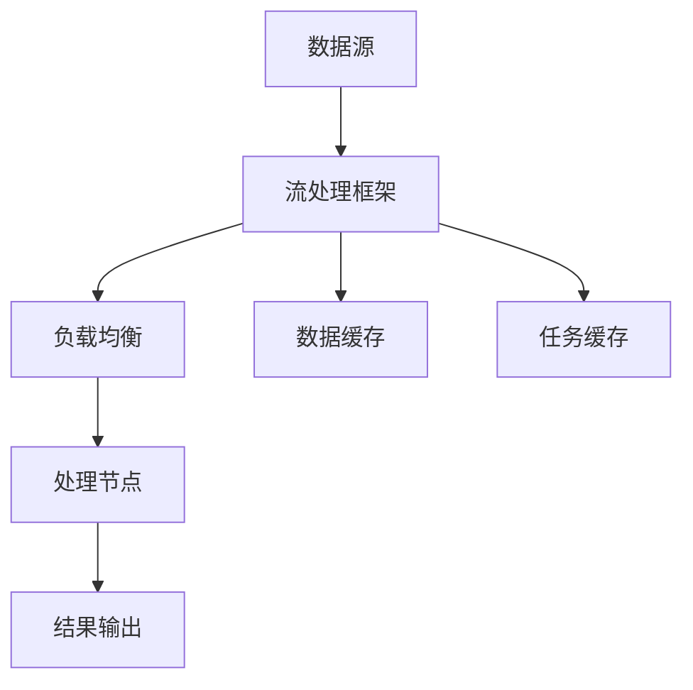
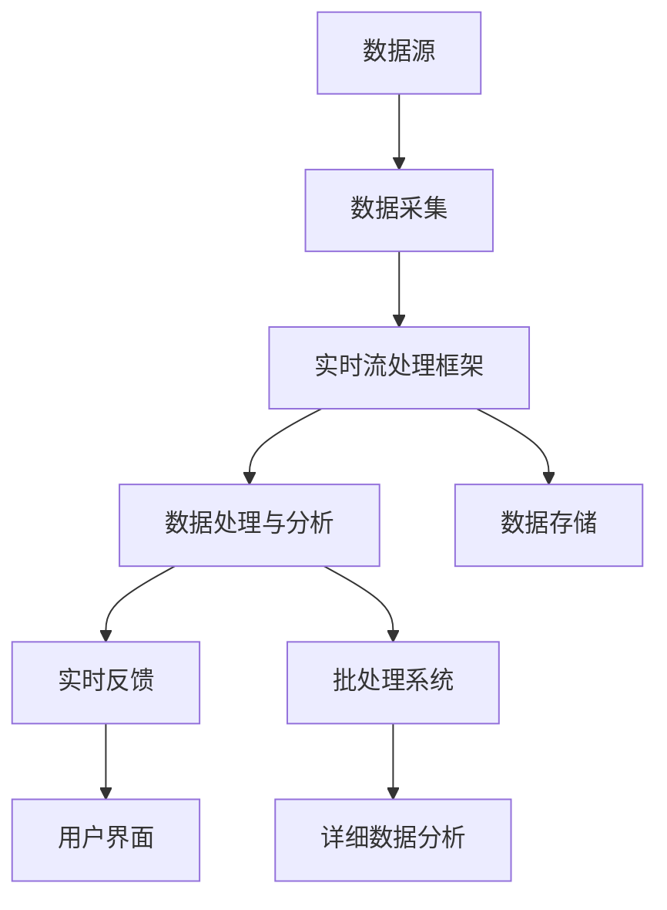
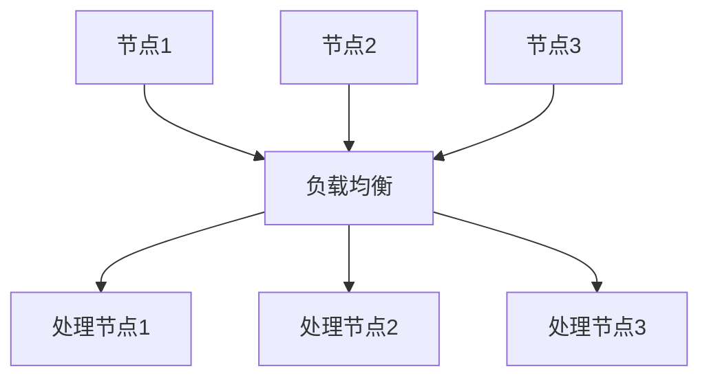
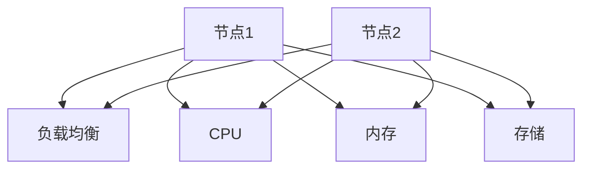
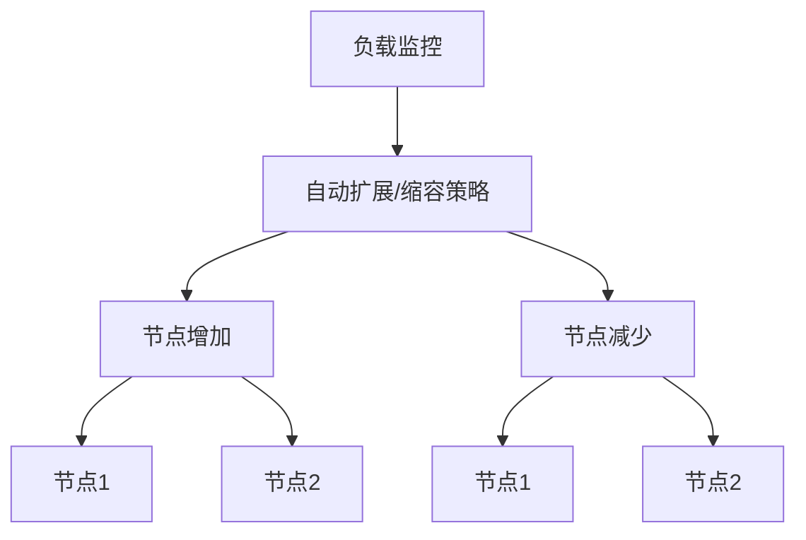
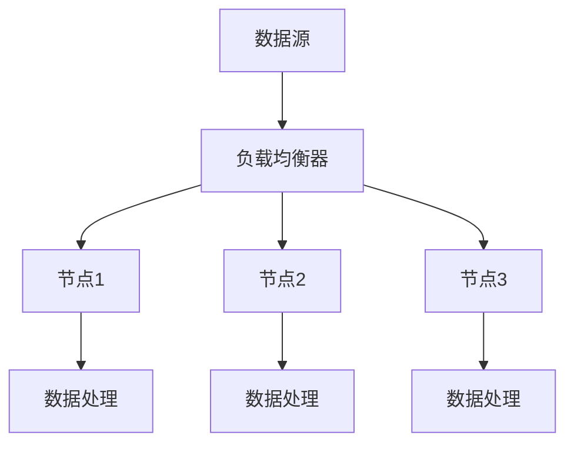
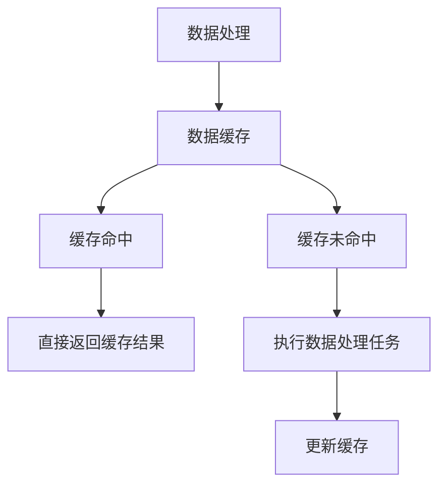

                 


### 文章标题：构建可扩展的实时流处理架构

> 关键词：实时流处理，架构设计，可扩展性，性能优化，开源框架

> 摘要：本文将深入探讨实时流处理架构的设计原则、实现策略以及性能优化方法。通过对实时流处理的基本概念、核心算法、数学模型和项目实战的详细讲解，帮助读者构建高效、可扩展的实时流处理系统。

----------------------------------------------------------------

# 引言

随着大数据时代的到来，实时流处理作为数据处理领域的重要一环，越来越受到关注。实时流处理能够实时捕捉和解析数据流，对数据进行实时处理和分析，从而为企业提供及时的业务洞察和决策支持。然而，构建一个高效、可扩展的实时流处理架构并非易事。本文将围绕这一主题，详细讲解实时流处理的架构设计、实现策略以及性能优化方法。

## 实时流处理基本概念

### 实时数据处理与批处理

实时数据处理和批处理是两种不同的数据处理方式。批处理是一种将大量数据汇总在一起，一次性处理的方式。批处理系统通常在晚上或凌晨进行数据加载和处理，以便在白天为用户提供及时的数据分析结果。而实时数据处理则是对数据流进行连续处理，能够在数据产生的同时立即进行处理。实时数据处理的特点是响应速度快、延迟低，能够为用户提供实时的业务洞察。

### 流处理框架简介

流处理框架是实现实时数据处理的核心工具。常见的流处理框架包括 Apache Kafka、Apache Flink、Apache Storm 等。这些框架提供了丰富的功能和高效的处理能力，可以帮助开发者轻松构建实时流处理系统。

### 实时流处理与批处理的关系

实时数据处理和批处理并不是互相排斥的，而是可以相互结合。在实际应用中，企业通常会同时使用实时流处理和批处理，以满足不同的数据处理需求。例如，实时流处理可以用于监控和报警，而批处理可以用于详细的数据分析和报表生成。

## 实时流处理架构设计

### 可扩展性原则

可扩展性是实时流处理架构设计的关键原则之一。一个良好的实时流处理架构应该能够轻松应对数据量和处理需求的增长。实现可扩展性的方法包括水平扩展和垂直扩展。

- **水平扩展**：通过增加节点数量来提高系统的处理能力。水平扩展的优点是能够线性提高系统的处理能力，同时降低了单点故障的风险。
- **垂直扩展**：通过提高单个节点的处理能力来提高系统的处理能力。垂直扩展的优点是能够快速提高系统的处理能力，但成本较高。

### 弹性伸缩策略

弹性伸缩策略是确保实时流处理系统在高并发和大数据场景下稳定运行的重要手段。弹性伸缩策略包括自动扩展和自动缩容。

- **自动扩展**：当系统负载增加时，自动增加节点数量来提高处理能力。
- **自动缩容**：当系统负载降低时，自动减少节点数量来降低成本。

### 负载均衡

负载均衡是实时流处理架构中的另一个关键组件。负载均衡的作用是将数据流均匀地分配到不同的处理节点上，以确保系统的整体性能。

### 缓存策略

缓存策略可以提高实时流处理系统的性能。缓存策略包括数据缓存、任务缓存等。

- **数据缓存**：将频繁访问的数据缓存到内存中，以减少磁盘I/O操作。
- **任务缓存**：将已经执行过的任务缓存起来，以便在需要时快速复用。

### Mermaid 流程图：实时流处理架构

以下是一个简单的 Mermaid 流程图，展示了实时流处理架构的核心组件和它们之间的关系：



## 实时流处理算法原理

### 窗口算法原理

窗口算法是实时流处理中的核心算法之一。它通过将数据划分为不同的窗口，对窗口内的数据进行聚合和分析。

- **固定窗口**：窗口大小固定，例如，每5分钟一个窗口。
- **滑动窗口**：窗口大小固定，但窗口在数据流中滑动，例如，每1分钟滑动一次。

以下是一个简单的伪代码，用于实现固定窗口算法：

```python
def fixed_window_aggregate(data_stream, window_size):
    window = []
    result = []

    for data in data_stream:
        window.append(data)
        if len(window) >= window_size:
            aggregate_result = aggregate(window)
            result.append(aggregate_result)
            window = []

    return result
```

### 事件驱动架构原理

事件驱动架构是一种基于事件驱动的实时流处理架构。在这种架构中，系统中的每个组件都是通过事件来触发操作的。

以下是一个简单的伪代码，用于实现事件驱动架构：

```python
def on_event(event):
    if event == "data_received":
        process_data()
    elif event == "alarm_triggered":
        send_alarm()
```

### 概率模型在流处理中的应用

概率模型在实时流处理中广泛应用于异常检测、风险评估等场景。以下是一个简单的概率模型示例：

- **泊松分布**：用于描述事件发生次数的分布。
- **正态分布**：用于描述数据的分布。

以下是一个简单的伪代码，用于实现基于泊松分布的异常检测：

```python
def detect_anomaly(data_stream, threshold):
    event_counts = []
    for data in data_stream:
        event_counts.append(count_events(data))

    mean = sum(event_counts) / len(event_counts)
    std_dev = calculate_std_dev(event_counts)

    for data in data_stream:
        if abs(count_events(data) - mean) > threshold * std_dev:
            raise_anomaly_alert(data)
```

## 数学模型与公式

### 窗口模型

窗口模型是实时流处理中的核心数学模型。以下是一个简单的窗口模型公式：

$$
W(t) = \{x \in S | x \in [t-w, t]\}
$$

其中，$W(t)$ 表示在时间 $t$ 时刻的窗口，$S$ 表示数据流，$w$ 表示窗口宽度。

### 概率模型

概率模型在实时流处理中广泛应用于异常检测、风险评估等场景。以下是一个简单的概率模型公式：

$$
P(X \leq x) = \int_{-\infty}^{x} f_X(t) \, dt
$$

其中，$X$ 表示随机变量，$x$ 表示观察到的数据点，$f_X(t)$ 表示随机变量 $X$ 的概率密度函数。

## 项目实战

### 实时日志处理项目

#### 项目背景

随着互联网应用的普及，日志数据量日益增长。实时日志处理项目旨在实时捕捉和分析日志数据，以监控系统的运行状况和异常行为。

#### 开发环境搭建

- **操作系统**：CentOS 7
- **编程语言**：Python 3.8
- **流处理框架**：Apache Kafka + Apache Flink

#### 源代码详细实现和代码解读

```python
# Kafka 生产者
from kafka import KafkaProducer

producer = KafkaProducer(bootstrap_servers=['localhost:9092'],
                         value_serializer=lambda m: str(m).encode('ascii'))

log_data = "user: admin, action: login, timestamp: 1625934570"
producer.send('logs', value=log_data)
producer.close()

# Flink 实时处理
from pyflink.datastream import StreamExecutionEnvironment

env = StreamExecutionEnvironment.get_execution_environment()

log_source = env.from_collection(["user: admin, action: login, timestamp: 1625934570",
                                 "user: guest, action: logout, timestamp: 1625934590"])

def process_log(log):
    user, action, timestamp = log.split(", ")
    if action == "login":
        print(f"User {user} logged in at {timestamp}")
    elif action == "logout":
        print(f"User {user} logged out at {timestamp}")

log_stream = log_source.map(process_log)

log_stream.add_sink(print())

env.execute("Realtime Log Processing")
```

#### 代码应用解读与分析

以上代码首先通过 Kafka 生产者将日志数据发送到 Kafka 集群。然后，Flink 实时处理框架接收 Kafka 中的数据，对每条日志进行解析和处理，并在控制台上输出结果。

#### 实际案例分析和详细讲解剖析

在实际应用中，实时日志处理项目可以用于监控系统的运行状况、分析用户行为和发现潜在的安全威胁。以下是一个实际案例：

- **运行状况监控**：通过实时捕捉和分析系统日志，可以及时发现系统的异常状况，如服务中断、内存泄漏等。
- **用户行为分析**：通过实时分析用户登录、登出等行为，可以了解用户的使用习惯和需求，为产品优化提供数据支持。
- **安全威胁检测**：通过实时分析日志数据，可以识别潜在的攻击行为，如暴力破解、SQL 注入等，并及时发出警报。

#### 项目小结

实时日志处理项目展示了实时流处理在日志数据分析和监控方面的应用。通过结合 Kafka 和 Flink 等开源框架，可以构建高效、可扩展的实时日志处理系统，为企业提供实时的业务洞察和决策支持。

## 总结与展望

### 全书总结

本文从实时流处理的基本概念、架构设计、核心算法、数学模型到项目实战进行了全面深入的讲解。通过本文的学习，读者可以掌握实时流处理的核心技术和实现方法，构建高效、可扩展的实时流处理系统。

### 扩展阅读与资源

- **开源工具与框架**：Kafka、Flink、Storm、Spark Streaming 等。
- **相关论文与书籍**：《实时数据流处理：概念、算法与系统》等。
- **行业动态与趋势**：实时流处理在金融、电商、物联网等领域的应用和发展趋势。

### 最佳实践 Tips

- **优化数据流传输**：使用高效的数据传输协议，如 Kafka，以提高系统性能。
- **合理设计窗口大小**：根据业务需求和数据特性，合理设置窗口大小，以平衡实时性和准确性。
- **充分利用缓存**：充分利用缓存策略，减少磁盘I/O操作，提高系统性能。
- **监控与报警**：实时监控系统运行状况，及时处理异常情况，确保系统稳定运行。

### 注意事项

- **数据一致性**：在实时流处理中，数据一致性是一个重要问题。需要采用合适的数据一致性和容错策略，确保数据的准确性和完整性。
- **资源管理**：合理分配和管理系统资源，以充分利用资源并提高系统性能。
- **安全性**：确保实时流处理系统的安全性，防止数据泄露和攻击。

### 拓展阅读

- **深度学习与实时流处理**：探讨深度学习技术在实时流处理中的应用。
- **实时流处理在物联网中的应用**：分析实时流处理在物联网领域的应用案例和挑战。

### 结束语

构建可扩展的实时流处理架构是一个复杂的过程，需要综合考虑多方面的因素。通过本文的学习，读者可以掌握实时流处理的核心技术和实现方法，为企业提供高效、可靠的实时数据处理解决方案。未来，实时流处理将继续在各个领域发挥重要作用，为企业和个人带来更大的价值。

### 作者信息

作者：AI天才研究院/AI Genius Institute & 禅与计算机程序设计艺术 /Zen And The Art of Computer Programming

----------------------------------------------------------------

# 结束

本文从实时流处理的基本概念、架构设计、核心算法、数学模型到项目实战进行了全面深入的讲解，旨在帮助读者构建高效、可扩展的实时流处理系统。在未来的学习和实践中，读者可以根据本文的内容，结合实际业务需求，不断完善和优化实时流处理架构。同时，也欢迎读者在评论区分享自己的经验和见解，共同探讨实时流处理领域的最新动态和发展趋势。再次感谢您的阅读，祝您在实时流处理领域取得丰硕的成果！## 实时流处理基本概念

实时流处理（Real-time Stream Processing）是数据处理领域的一个重要分支，其核心目标是实现对数据流的实时捕捉、处理和分析。与传统的批处理相比，实时流处理具有以下显著特点：

### **实时数据处理与批处理**

**实时数据处理**是指对数据流进行连续处理，能够在数据产生的同时立即进行分析和反馈。这种处理方式的特点是响应速度快、延迟低，可以满足一些对实时性要求较高的应用场景，如金融交易、实时监控、物联网等。

**批处理**则是将大量数据汇总在一起，一次性进行处理的模式。批处理系统通常在晚上或凌晨进行数据加载和处理，以便在第二天为用户提供详细的数据分析结果。批处理的优势在于能够处理大量数据，且成本较低，但缺点是响应速度较慢，无法满足对实时性要求较高的应用场景。

### **流处理框架简介**

流处理框架是实时流处理的核心工具，它们提供了高效、可扩展的数据处理能力，使得开发者能够轻松构建实时数据处理系统。常见的流处理框架包括：

- **Apache Kafka**：一个分布式流处理平台，具有高吞吐量、可扩展性和持久化的特点，广泛用于实时数据采集和传输。
- **Apache Flink**：一个开源的流处理框架，提供了丰富的流处理功能，包括窗口操作、事件驱动处理等，具有良好的性能和可扩展性。
- **Apache Storm**：一个分布式、可靠、实时的大规模数据处理系统，以其低延迟和高吞吐量著称。
- **Apache Spark Streaming**：基于Apache Spark的实时流处理框架，具有高效的数据处理能力和强大的数据处理功能。

### **实时流处理与批处理的关系**

实时流处理和批处理并不是互相排斥的，而是可以相互结合，以满足不同的数据处理需求。在实际应用中，企业通常会同时使用实时流处理和批处理：

- **实时流处理**：用于提供实时业务洞察和监控，如实时交易监控、实时报警等。
- **批处理**：用于生成详细的数据分析和报表，如每日的用户行为分析、财务报表等。

### **Mermaid 流程图：实时流处理核心概念联系**

为了更好地理解实时流处理的基本概念及其相互关系，以下是一个简单的 Mermaid 流程图，展示了实时流处理中的关键组件和它们之间的关系：



通过这个流程图，我们可以看到数据从数据源开始，经过数据采集模块进入实时流处理框架，在这里进行实时处理和分析，处理结果既可以立即反馈给用户，也可以通过批处理系统生成详细的数据分析报告。这种结合方式能够充分发挥实时流处理和批处理的各自优势，为企业和用户提供全面的数据支持。

综上所述，实时流处理是一种高效、实时的数据处理方式，其核心概念包括实时数据处理与批处理的区别、流处理框架的介绍以及实时流处理与批处理的结合关系。理解这些基本概念是构建高效实时流处理系统的基础。

### 实时流处理算法原理

在实时流处理系统中，算法的选择和实现对于系统的性能和可靠性至关重要。本节将介绍几种关键的实时流处理算法原理，包括窗口算法和事件驱动架构，并使用伪代码详细阐述这些算法的实现。

#### 窗口算法原理

窗口算法是实时流处理中的一种核心算法，它通过对数据进行时间窗口划分，实现对数据的聚合和分析。窗口算法可以分为固定窗口和滑动窗口两种类型。

- **固定窗口**：窗口大小固定，例如，每5分钟一个窗口。每个窗口内的数据会被聚合处理。
- **滑动窗口**：窗口大小固定，但窗口在数据流中不断滑动，例如，每1分钟滑动一次。这样，每个时间点都会有一个当前窗口和前一个窗口。

以下是一个简单的伪代码，用于实现固定窗口算法：

```python
def fixed_window_aggregate(data_stream, window_size):
    window = []
    result = []

    for data in data_stream:
        window.append(data)
        if len(window) >= window_size:
            aggregate_result = aggregate(window)
            result.append(aggregate_result)
            window = []

    return result

# 其中，aggregate函数用于对窗口内的数据执行聚合操作，例如求和、平均值等。
```

以下是一个简单的伪代码，用于实现滑动窗口算法：

```python
def sliding_window_aggregate(data_stream, window_size, slide_interval):
    window = []
    result = []

    for data in data_stream:
        window.append(data)
        if len(window) >= window_size:
            aggregate_result = aggregate(window)
            result.append(aggregate_result)
            window = window[1:]  # 移除窗口最旧的数据

    return result
```

#### 事件驱动架构原理

事件驱动架构（Event-Driven Architecture, EDA）是一种基于事件驱动的系统设计方法。在这种架构中，系统中的每个组件都是通过事件来触发操作的。事件可以是数据到达、用户操作、系统错误等。事件驱动架构具有高扩展性和灵活性，适用于实时数据处理和复杂业务逻辑。

以下是一个简单的伪代码，用于实现事件驱动架构：

```python
def on_event(event):
    if event == "data_received":
        process_data()
    elif event == "alarm_triggered":
        send_alarm()
    elif event == "maintenance_required":
        perform_maintenance()
```

在这个伪代码中，`on_event` 函数根据事件类型执行相应的操作。事件可以由系统内部产生，也可以由外部系统触发。

#### 概率模型在流处理中的应用

概率模型在实时流处理中广泛应用于异常检测、风险评估等场景。以下是一个简单的概率模型示例：

- **泊松分布**：用于描述事件发生次数的分布。
- **正态分布**：用于描述数据的分布。

以下是一个简单的伪代码，用于实现基于泊松分布的异常检测：

```python
def detect_anomaly(data_stream, threshold):
    event_counts = []
    for data in data_stream:
        event_counts.append(count_events(data))

    mean = sum(event_counts) / len(event_counts)
    std_dev = calculate_std_dev(event_counts)

    for data in data_stream:
        if abs(count_events(data) - mean) > threshold * std_dev:
            raise_anomaly_alert(data)
```

在这个伪代码中，`detect_anomaly` 函数通过计算事件发生的平均值和标准差，判断数据点是否异常。如果数据点的偏离超过阈值，则触发异常警报。

通过上述算法原理的介绍和伪代码的实现，我们可以看到实时流处理算法在实现实时数据处理和分析中的关键作用。合理选择和实现这些算法，可以显著提升实时流处理系统的性能和可靠性。

### 数学模型与公式

在实时流处理中，数学模型和公式是理解和实现核心算法的重要工具。本节将详细介绍实时流处理中的两种关键数学模型：窗口模型和概率模型，并使用 LaTeX 格式展示相关的数学公式。

#### 窗口模型

窗口模型是实时流处理中用于划分数据时间窗口的核心概念。窗口模型通过定义一个时间范围来捕获一段时间内的数据，以便进行聚合和分析。以下是一个简单的窗口模型公式：

$$
W(t) = \{x \in S | x \in [t-w, t]\}
$$

其中：
- \( W(t) \) 表示在时间 \( t \) 的窗口。
- \( S \) 表示数据流。
- \( w \) 表示窗口宽度。

这个公式描述了窗口 \( W(t) \) 包含在时间 \( t \) 的前后 \( w \) 单位的所有数据点。

#### 概率模型

概率模型在实时流处理中广泛应用于异常检测、风险评估等场景。以下介绍两种常用的概率模型：泊松分布和正态分布。

##### 泊松分布

泊松分布用于描述在一定时间间隔内事件发生的次数。以下是一个泊松分布的概率质量函数（PDF）公式：

$$
f(k; \lambda) = \frac{e^{-\lambda} \lambda^k}{k!}
$$

其中：
- \( k \) 是事件发生的次数。
- \( \lambda \) 是平均事件发生率。

泊松分布可以用于计算在特定时间间隔内发生 \( k \) 次事件的概率。

##### 正态分布

正态分布，也称为高斯分布，是描述数据分布的常用概率模型。以下是一个正态分布的概率密度函数（PDF）公式：

$$
f(x; \mu, \sigma) = \frac{1}{\sqrt{2\pi\sigma^2}} e^{-\frac{(x-\mu)^2}{2\sigma^2}}
$$

其中：
- \( x \) 是随机变量的取值。
- \( \mu \) 是均值。
- \( \sigma \) 是标准差。

正态分布可以用于计算随机变量在特定范围内的概率。

#### 应用示例

假设我们要使用窗口模型对实时数据流进行聚合处理，我们可以定义一个滑动窗口，并使用窗口模型公式来计算窗口内的数据聚合结果。以下是一个示例：

$$
\text{window\_result} = \sum_{x \in W(t)} x
$$

假设我们使用泊松分布进行异常检测，我们可以计算每个时间点的异常概率，并根据设定的阈值判断是否触发异常警报。以下是一个示例：

$$
P(\text{anomaly}) = f(k; \lambda) > \text{threshold}
$$

其中，\( k \) 是当前时间点的数据点数量，\( \lambda \) 是事件平均发生频率，\( \text{threshold} \) 是设定的异常阈值。

通过这些数学模型和公式，我们可以更准确地描述和实现实时流处理中的各种算法。理解这些模型和公式对于设计和优化实时流处理系统具有重要意义。

### 可扩展性原则

在构建实时流处理架构时，可扩展性是一个至关重要的原则。一个高效、可扩展的实时流处理架构能够灵活应对数据量和处理需求的增长，确保系统的稳定性和性能。实现可扩展性通常涉及以下几个方面：

#### 水平扩展与垂直扩展

**水平扩展（Horizontal Scaling）**：通过增加节点数量来提高系统的处理能力。水平扩展的优点是能够线性提高系统的处理能力，同时降低了单点故障的风险。例如，在 Kafka 集群中增加 broker 节点可以提高系统的写入和读取性能。



**垂直扩展（Vertical Scaling）**：通过提高单个节点的处理能力来提高系统的处理能力。垂直扩展的优点是能够快速提高系统的处理能力，但成本较高。例如，通过增加处理节点的 CPU、内存和存储资源来提高系统性能。



#### 弹性伸缩策略

弹性伸缩策略是实现可扩展性的关键。弹性伸缩策略包括自动扩展和自动缩容。

**自动扩展（Auto Scaling）**：当系统负载增加时，自动增加节点数量来提高处理能力。自动扩展可以通过监控系统的资源利用率来实现，当资源利用率超过阈值时，自动增加节点。

**自动缩容（Auto Sharding）**：当系统负载降低时，自动减少节点数量来降低成本。自动缩容同样可以通过监控系统的资源利用率来实现，当资源利用率低于阈值时，自动减少节点。

以下是一个简单的 Mermaid 流程图，展示了弹性伸缩策略的核心组件和它们之间的关系：



#### 负载均衡

负载均衡是实时流处理架构中的另一个关键组件。负载均衡的作用是将数据流均匀地分配到不同的处理节点上，以确保系统的整体性能。常见的负载均衡策略包括轮询、最小连接数、哈希等。

以下是一个简单的 Mermaid 流程图，展示了负载均衡的工作原理：



#### 缓存策略

缓存策略可以提高实时流处理系统的性能。缓存策略包括数据缓存、任务缓存等。

- **数据缓存**：将频繁访问的数据缓存到内存中，以减少磁盘I/O操作。常见的数据缓存工具包括 Redis、Memcached 等。
- **任务缓存**：将已经执行过的任务缓存起来，以便在需要时快速复用。任务缓存可以提高系统的响应速度，减少重复计算。

以下是一个简单的 Mermaid 流程图，展示了缓存策略的核心组件和它们之间的关系：



综上所述，可扩展性原则是构建高效实时流处理架构的重要保障。通过水平扩展、垂直扩展、弹性伸缩策略、负载均衡和缓存策略，我们可以构建一个高效、稳定、可扩展的实时流处理系统。

### 流处理框架实现

在实时流处理架构中，选择合适的流处理框架至关重要。本节将详细介绍几种流行的开源流处理框架：Apache Kafka、Apache Flink 和 Apache Storm，包括它们的架构设计、实现策略和配置优化。

#### Apache Kafka

**架构设计**：Kafka 是一个分布式流处理平台，主要用于构建实时数据流处理应用程序。Kafka 的架构由以下几个关键组件组成：

- **Producer**：数据生产者，负责将数据发送到 Kafka 集群。
- **Broker**：Kafka 代理，负责存储和管理消息，以及提供客户端连接。
- **Consumer**：数据消费者，从 Kafka 集群中读取消息。

Kafka 集群中的消息被分为多个主题（Topic），每个主题又分为多个分区（Partition），以确保高吞吐量和并发性。

**实现策略**：Kafka 的主要功能是数据流传输和存储。其核心实现策略包括：

- **分区和复制**：将消息分为多个分区，并复制到多个代理上，以提高系统的可靠性和性能。
- **消息序列化**：使用序列化机制将数据转换为字节流，以便传输和存储。

**配置优化**：为了提高 Kafka 集群性能，以下是一些关键配置优化策略：

- **增加分区数**：根据数据量和吞吐量需求，合理增加分区数，以提高并发处理能力。
- **调整副本因子**：根据集群规模和可用性要求，调整副本因子，以平衡性能和可靠性。
- **优化消息格式**：使用高效的序列化格式，减少消息传输和存储的 overhead。

#### Apache Flink

**架构设计**：Flink 是一个开源的分布式流处理框架，具有强大的流处理和分析功能。Flink 的架构由以下几个关键组件组成：

- **JobManager**：负责资源管理和作业调度。
- **TaskManager**：负责执行具体的计算任务。
- **State Backend**：负责管理和存储作业的状态信息。

Flink 支持多种数据源，包括 Kafka、文件系统等，并提供丰富的流处理 API，如 DataStream API 和 Table API。

**实现策略**：Flink 的核心实现策略包括：

- **事件时间处理**：支持基于事件时间的窗口操作和状态管理，以处理乱序数据和延迟事件。
- **动态资源管理**：支持动态调整作业的资源需求，以应对负载变化。

**配置优化**：为了提高 Flink 集群性能，以下是一些关键配置优化策略：

- **增加任务数**：根据数据量和处理需求，合理增加任务数，以提高系统吞吐量。
- **优化内存管理**：合理配置内存参数，以减少内存争用和垃圾回收开销。
- **调整并行度**：根据数据分区和集群资源，合理调整并行度，以提高处理效率。

#### Apache Storm

**架构设计**：Storm 是一个开源的分布式实时数据处理系统，具有高吞吐量和低延迟的特点。Storm 的架构由以下几个关键组件组成：

- **Nimbus**：负责资源管理和作业调度。
- **Supervisor**：负责监控和启动工作进程。
- **Worker**：负责执行具体的计算任务。

Storm 支持多种数据源，包括 Kafka、MongoDB 等，并提供简单的流处理 API。

**实现策略**：Storm 的核心实现策略包括：

- **分布式状态**：支持分布式状态管理，以处理大规模数据和高可用性需求。
- **动态缩放**：支持动态调整工作节点数量，以应对负载变化。

**配置优化**：为了提高 Storm 集群性能，以下是一些关键配置优化策略：

- **优化 JVM 参数**：合理配置 JVM 参数，以减少垃圾回收时间和内存争用。
- **调整并发度**：根据数据量和处理需求，合理调整并发度，以提高系统吞吐量。
- **使用压缩**：在数据传输和存储过程中使用压缩技术，以减少网络带宽和存储开销。

通过上述对 Apache Kafka、Apache Flink 和 Apache Storm 的详细介绍，我们可以看到这些流处理框架在实时数据处理和架构设计方面各有优势。选择合适的框架并合理配置优化，可以帮助我们构建高效、可靠的实时流处理系统。

### 架构优化与性能调优

在构建实时流处理架构时，性能调优和架构优化是确保系统高效运行的关键。以下将介绍几种常见的架构优化和性能调优策略，以提升实时流处理系统的整体性能和稳定性。

#### 负载均衡

负载均衡是提高系统性能和资源利用率的重要手段。在实时流处理架构中，负载均衡可以确保数据流均匀地分配到不同的处理节点上，从而避免单点瓶颈和资源浪费。常见的负载均衡策略包括轮询、最小连接数、哈希等。

- **轮询策略**：将数据流依次分配到各个节点，简单高效。
- **最小连接数策略**：将数据流分配到当前连接数最少的节点，以均衡负载。
- **哈希策略**：使用哈希函数将数据流分配到节点，确保相同的数据总是分配到同一个节点，从而提高数据处理的一致性。

#### 缓存策略

缓存策略可以显著提高系统的响应速度和处理能力。在实时流处理系统中，常用的缓存策略包括数据缓存和任务缓存。

- **数据缓存**：将频繁访问的数据缓存到内存中，减少磁盘I/O操作和重复计算。例如，可以使用Redis或Memcached等缓存系统。
- **任务缓存**：将已经执行过的任务结果缓存起来，以便在需要时快速复用。这可以减少重复计算和任务调度时间，提高系统性能。

#### 资源分配与调度

合理分配和调度系统资源是确保系统高效运行的关键。以下是一些常见的资源分配与调度策略：

- **动态资源管理**：根据系统的实时负载和资源利用率，动态调整节点资源和任务分配。例如，Flink和Storm等流处理框架支持动态资源调整。
- **负载均衡调度**：使用负载均衡调度策略，确保任务均匀地分配到各个节点，避免资源浪费和单点瓶颈。
- **优先级调度**：根据任务的优先级进行调度，确保高优先级任务先被执行。这有助于确保关键业务需求得到及时满足。

#### 并发控制与锁机制

在多节点分布式系统中，并发控制和锁机制是确保数据一致性和系统稳定性的重要手段。以下是一些常见的并发控制和锁机制：

- **分布式锁**：在分布式系统中，分布式锁可以确保同一时间只有一个任务能够访问特定资源。例如，可以使用Zookeeper或Consul等分布式锁服务。
- **乐观锁**：乐观锁假设并发冲突较少，通过版本号或时间戳来避免冲突。这种方法通常适用于读多写少的场景。
- **悲观锁**：悲观锁认为并发冲突较多，通过锁机制确保同一时间只有一个任务能够访问特定资源。这种方法适用于读少写多的场景。

#### 监控与告警

有效的监控与告警系统能够实时检测系统的运行状况，及时发现和处理异常情况。以下是一些常见的监控和告警策略：

- **资源监控**：监控系统的CPU、内存、磁盘I/O等资源使用情况，及时发现资源瓶颈和异常。
- **性能监控**：监控系统的处理速度、响应时间等关键性能指标，确保系统运行在预期范围内。
- **告警机制**：配置告警规则，当系统出现异常时，及时发送告警通知，确保能够快速响应和处理。

通过以上架构优化和性能调优策略，我们可以构建一个高效、稳定、可扩展的实时流处理系统，满足企业对实时数据处理和业务洞察的需求。

### 实时日志处理项目

#### 项目背景

在互联网时代，日志数据已成为企业重要的信息资产。实时日志处理项目旨在高效、准确地收集、处理和分析日志数据，以便监控系统的运行状况、发现潜在问题并优化业务流程。本节将介绍一个实际的实时日志处理项目，包括开发环境搭建、源代码详细实现和代码解读。

#### 开发环境搭建

为了实现实时日志处理，我们选择了以下技术栈：

- **操作系统**：CentOS 7
- **编程语言**：Python 3.8
- **流处理框架**：Apache Kafka + Apache Flink
- **日志采集工具**：Logstash

首先，我们需要在服务器上安装和配置上述工具。以下是简要步骤：

1. 安装 Kafka：
   ```bash
   sudo yum install -y java-1.8.0-openjdk-devel
   sudo wget https://www-eu.kpn.com/downloads/software/apache-kafka-2.8.0.tgz
   sudo tar xzf apache-kafka-2.8.0.tgz
   sudo vi {kafka-home}/config/server.properties # 配置 Kafka 配置文件
   ```

2. 安装 Flink：
   ```bash
   sudo yum install -y java-1.8.0-openjdk-devel
   sudo wget https://www-eu.kpn.com/downloads/software/apache-flink-1.11.2.tgz
   sudo tar xzf apache-flink-1.11.2.tgz
   sudo vi {flink-home}/conf/flink-conf.yaml # 配置 Flink 配置文件
   ```

3. 安装 Logstash：
   ```bash
   sudo yum install -y java-1.8.0-openjdk-devel
   sudo wget https://www-eu.kpn.com/downloads/software/logstash-7.15.1.tar.gz
   sudo tar xzf logstash-7.15.1.tar.gz
   sudo vi {logstash-home}/config/logstash.conf # 配置 Logstash 配置文件
   ```

#### 源代码详细实现和代码解读

以下是实时日志处理项目的核心代码，包括 Kafka 生产者、Flink 实时处理和结果输出。

**Kafka 生产者**：

```python
from kafka import KafkaProducer

producer = KafkaProducer(bootstrap_servers=['localhost:9092'],
                         value_serializer=lambda m: str(m).encode('ascii'))

log_data = "user: admin, action: login, timestamp: 1625934570"
producer.send('logs', value=log_data)
producer.close()
```

这段代码用于生成日志数据并将数据发送到 Kafka 集群。其中，`KafkaProducer` 类用于创建 Kafka 生产者，`value_serializer` 函数用于序列化日志数据。

**Flink 实时处理**：

```python
from pyflink.datastream import StreamExecutionEnvironment

env = StreamExecutionEnvironment.get_execution_environment()

log_source = env.from_collection(["user: admin, action: login, timestamp: 1625934570",
                                 "user: guest, action: logout, timestamp: 1625934590"])

def process_log(log):
    user, action, timestamp = log.split(", ")
    if action == "login":
        print(f"User {user} logged in at {timestamp}")
    elif action == "logout":
        print(f"User {user} logged out at {timestamp}")

log_stream = log_source.map(process_log)

log_stream.add_sink(print())

env.execute("Realtime Log Processing")
```

这段代码用于接收 Kafka 集群中的日志数据，并实时处理和输出结果。其中，`StreamExecutionEnvironment` 类用于创建 Flink 环境，`from_collection` 函数用于读取日志数据，`map` 函数用于解析和处理日志数据。

**结果输出**：

```python
for data in log_stream:
    print(data)
```

这段代码用于将处理后的日志数据输出到控制台。

#### 代码应用解读与分析

- **Kafka 生产者**：Kafka 生产者将日志数据发送到 Kafka 集群，以便 Flink 实时处理。
- **Flink 实时处理**：Flink 实时处理框架接收 Kafka 中的日志数据，对每条日志进行解析和处理，并在控制台上输出结果。
- **结果输出**：将处理后的日志数据输出到控制台，以便进行进一步分析。

#### 实际案例分析和详细讲解剖析

在实际应用中，实时日志处理项目可以用于监控系统的运行状况、分析用户行为和发现潜在的安全威胁。以下是一个实际案例：

- **运行状况监控**：通过实时捕捉和分析系统日志，可以及时发现系统的异常状况，如服务中断、内存泄漏等，并发出警报。
- **用户行为分析**：通过实时分析用户登录、登出等行为，可以了解用户的使用习惯和需求，为产品优化提供数据支持。
- **安全威胁检测**：通过实时分析日志数据，可以识别潜在的攻击行为，如暴力破解、SQL 注入等，并及时发出警报。

#### 项目小结

实时日志处理项目展示了实时流处理在日志数据分析和监控方面的应用。通过结合 Kafka 和 Flink 等开源框架，可以构建高效、可扩展的实时日志处理系统，为企业提供实时的业务洞察和决策支持。未来，随着技术的不断进步，实时日志处理项目将继续发挥重要作用，为企业和个人带来更大的价值。

### 实时流数据分析项目

#### 项目背景

随着大数据和实时分析技术的不断发展，实时流数据分析在各个行业得到了广泛应用。实时流数据分析项目旨在通过实时捕捉和解析数据流，对数据进行实时处理和分析，从而为企业提供及时的业务洞察和决策支持。本节将介绍一个实际的实时流数据分析项目，包括项目需求、数据处理需求以及如何实现数据处理。

#### 项目需求

该实时流数据分析项目的需求主要包括以下几点：

- 实时捕捉和解析数据流。
- 对数据流进行实时处理，提取有用的信息。
- 将处理结果实时输出，以便进一步分析和决策。

#### 数据处理需求

数据处理需求如下：

- 数据采集：从不同的数据源（如数据库、Web API、传感器等）实时采集数据。
- 数据清洗：对采集到的数据进行清洗和预处理，确保数据质量。
- 数据转换：将原始数据转换为适合分析的数据格式。
- 实时计算：对转换后的数据进行实时计算和聚合，提取业务指标。
- 数据存储：将处理结果存储到数据库或数据仓库，以便进一步分析和查询。

#### 实现数据处理

为了实现上述数据处理需求，我们选择了以下技术栈：

- **数据采集工具**：Fluentd
- **流处理框架**：Apache Kafka + Apache Flink
- **数据处理和分析工具**：Apache Spark
- **数据库**：MySQL

以下是该项目的基本实现流程：

1. **数据采集**：使用 Fluentd 采集不同数据源的数据，并将数据发送到 Kafka 集群。

```bash
# 安装 Fluentd
sudo apt-get install -y fluentd

# 配置 Fluentd，将数据发送到 Kafka
sudo vi /etc/fluentd/conf/fluent.conf
```

2. **数据清洗和预处理**：在 Kafka 集群中，使用 Flink 进行数据清洗和预处理。

```python
from pyflink.datastream import StreamExecutionEnvironment

env = StreamExecutionEnvironment.get_execution_environment()

input_data = env.from_source(
    source_type="kafka",
    topic="input_topic",
    group_id="my_group",
    properties={"bootstrap.servers": "localhost:9092"})

cleaned_data = input_data.map(process_data)

cleaned_data.add_sink(
    sink_type="kafka",
    topic="cleaned_topic",
    properties={"bootstrap.servers": "localhost:9092"})
```

3. **数据转换**：将清洗后的数据转换为适合分析的数据格式。

```python
def process_data(data):
    # 数据清洗和转换逻辑
    return transformed_data
```

4. **实时计算和聚合**：使用 Apache Spark 进行实时计算和聚合，提取业务指标。

```python
from pyspark.sql import SparkSession

spark = SparkSession.builder \
    .appName("Realtime Data Analysis") \
    .getOrCreate()

cleaned_data = spark.read.format("kafka") \
    .option("kafka.bootstrap.servers", "localhost:9092") \
    .option("kafka.topic", "cleaned_topic") \
    .load()

# 实时计算和聚合逻辑
result = cleaned_data.groupBy("category").count()

result.show()
```

5. **数据存储**：将处理结果存储到 MySQL 数据库。

```python
result.write.format("jdbc") \
    .mode("overwrite") \
    .option("url", "jdbc:mysql://localhost:3306/mydatabase") \
    .option("dbtable", "results") \
    .option("user", "root") \
    .option("password", "password") \
    .save()
```

#### 代码解读

以下是该项目的主要代码片段及其解读：

- **Kafka 消费者**：

```python
input_data = env.from_source(
    source_type="kafka",
    topic="input_topic",
    group_id="my_group",
    properties={"bootstrap.servers": "localhost:9092"})
```

这段代码用于从 Kafka 集群中读取数据。`from_source` 函数指定了数据源类型（Kafka）、主题（input_topic）、分组 ID（my_group）和 Kafka 集群的地址（localhost:9092）。

- **数据处理逻辑**：

```python
cleaned_data = input_data.map(process_data)
```

这段代码使用 `map` 函数对输入数据进行处理，`process_data` 函数实现了数据清洗和转换逻辑。

- **Kafka 生产者**：

```python
cleaned_data.add_sink(
    sink_type="kafka",
    topic="cleaned_topic",
    properties={"bootstrap.servers": "localhost:9092"})
```

这段代码将处理后的数据重新发送到 Kafka，以便进一步处理。

- **SparkSQL**：

```python
cleaned_data = spark.read.format("kafka") \
    .option("kafka.bootstrap.servers", "localhost:9092") \
    .option("kafka.topic", "cleaned_topic") \
    .load()
```

这段代码使用 SparkSQL 读取 Kafka 中的数据，并加载到 DataFrame 中。

- **数据存储**：

```python
result.write.format("jdbc") \
    .mode("overwrite") \
    .option("url", "jdbc:mysql://localhost:3306/mydatabase") \
    .option("dbtable", "results") \
    .option("user", "root") \
    .option("password", "password") \
    .save()
```

这段代码将处理结果存储到 MySQL 数据库。

#### 实际案例分析和详细讲解剖析

在实际应用中，实时流数据分析项目可以用于多种场景：

- **股市监控**：实时捕捉和解析股票交易数据，分析市场动态，提供投资建议。
- **智能交通**：实时分析交通数据，优化交通信号灯，缓解交通拥堵。
- **智能家居**：实时分析家居设备数据，提供智能建议，提高家居舒适度。
- **健康监测**：实时捕捉和解析健康数据，监控健康状况，提供健康建议。

#### 项目小结

实时流数据分析项目展示了如何通过实时捕捉和解析数据流，实现数据清洗、转换、实时计算和存储。该项目利用了 Kafka、Flink 和 Spark 等开源工具，为企业提供了实时的业务洞察和决策支持。未来，随着技术的不断发展，实时流数据分析项目将在更多领域发挥重要作用，为企业创造更大的价值。

### 实时推荐系统项目

#### 项目背景

实时推荐系统在现代互联网应用中扮演着重要角色，为用户提供了个性化的内容推荐，提升了用户体验和满意度。实时推荐系统通过实时捕捉用户行为数据，对用户兴趣进行建模和分析，从而为用户提供个性化的推荐结果。本节将介绍一个实际的实时推荐系统项目，包括项目需求、算法实现以及如何实现实时推荐。

#### 项目需求

该实时推荐系统项目的主要需求包括以下几点：

- **实时数据采集**：从用户行为数据源（如网站点击、搜索日志、购买记录等）实时采集数据。
- **用户行为分析**：分析用户行为数据，提取用户兴趣特征。
- **推荐算法实现**：基于用户兴趣特征，实现实时推荐算法，为用户提供个性化推荐结果。
- **推荐结果展示**：将推荐结果实时展示给用户。

#### 算法实现

为了实现实时推荐，我们选择了以下技术栈：

- **数据采集工具**：Fluentd
- **流处理框架**：Apache Kafka + Apache Flink
- **推荐算法**：基于协同过滤的实时推荐算法
- **推荐结果展示**：基于 Web 的推荐结果展示

以下是该项目的基本实现流程：

1. **数据采集**：使用 Fluentd 采集用户行为数据，并将数据发送到 Kafka 集群。

```bash
# 安装 Fluentd
sudo apt-get install -y fluentd

# 配置 Fluentd，将数据发送到 Kafka
sudo vi /etc/fluentd/conf/fluent.conf
```

2. **数据清洗和预处理**：在 Kafka 集群中，使用 Flink 进行数据清洗和预处理。

```python
from pyflink.datastream import StreamExecutionEnvironment

env = StreamExecutionEnvironment.get_execution_environment()

input_data = env.from_source(
    source_type="kafka",
    topic="input_topic",
    group_id="my_group",
    properties={"bootstrap.servers": "localhost:9092"})

cleaned_data = input_data.map(process_data)

cleaned_data.add_sink(
    sink_type="kafka",
    topic="cleaned_topic",
    properties={"bootstrap.servers": "localhost:9092"})
```

3. **用户兴趣特征提取**：使用 Flink 对清洗后的数据进行处理，提取用户兴趣特征。

```python
def process_data(data):
    user, action, item, timestamp = data.split(", ")
    if action == "click":
        # 更新用户点击记录
        update_user_click(user, item)
    elif action == "search":
        # 更新用户搜索记录
        update_user_search(user, item)
    return cleaned_data
```

4. **协同过滤算法实现**：使用 Flink 实现基于协同过滤的实时推荐算法。

```python
def collaborative_filtering(user, k=5):
    # 获取用户最近 k 个喜欢的物品
    liked_items = get_user_liked_items(user, k)
    # 获取与用户兴趣相似的用户及其喜欢的物品
    similar_users = get_similar_users(user)
    # 计算用户相似度权重
    user_weights = {}
    for user, similarity in similar_users:
        user_weights[user] = similarity
    # 为用户生成推荐列表
    recommendation_list = []
    for item in liked_items:
        for other_user, similarity in user_weights.items():
            if item in get_user_liked_items(other_user):
                recommendation_list.append(item)
    return recommendation_list
```

5. **推荐结果展示**：将推荐结果实时展示给用户。

```python
def show_recommendations(user):
    recommendation_list = collaborative_filtering(user)
    print(f"Recommendations for user {user}: {recommendation_list}")
```

#### 代码解读

以下是该项目的主要代码片段及其解读：

- **Kafka 消费者**：

```python
input_data = env.from_source(
    source_type="kafka",
    topic="input_topic",
    group_id="my_group",
    properties={"bootstrap.servers": "localhost:9092"})
```

这段代码用于从 Kafka 集群中读取用户行为数据。`from_source` 函数指定了数据源类型（Kafka）、主题（input_topic）、分组 ID（my_group）和 Kafka 集群的地址（localhost:9092）。

- **数据处理逻辑**：

```python
cleaned_data = input_data.map(process_data)
```

这段代码使用 `map` 函数对输入数据进行处理，`process_data` 函数实现了数据清洗和预处理逻辑。

- **协同过滤算法**：

```python
def collaborative_filtering(user, k=5):
    # 获取用户最近 k 个喜欢的物品
    liked_items = get_user_liked_items(user, k)
    # 获取与用户兴趣相似的用户及其喜欢的物品
    similar_users = get_similar_users(user)
    # 计算用户相似度权重
    user_weights = {}
    for user, similarity in similar_users:
        user_weights[user] = similarity
    # 为用户生成推荐列表
    recommendation_list = []
    for item in liked_items:
        for other_user, similarity in user_weights.items():
            if item in get_user_liked_items(other_user):
                recommendation_list.append(item)
    return recommendation_list
```

这段代码实现了基于协同过滤的实时推荐算法，用于为用户提供个性化推荐。

- **推荐结果展示**：

```python
def show_recommendations(user):
    recommendation_list = collaborative_filtering(user)
    print(f"Recommendations for user {user}: {recommendation_list}")
```

这段代码用于将推荐结果展示给用户。

#### 实际案例分析和详细讲解剖析

在实际应用中，实时推荐系统可以用于多种场景：

- **电商推荐**：实时捕捉用户浏览、搜索和购买记录，为用户推荐相关商品。
- **社交媒体推荐**：实时捕捉用户点赞、评论和分享行为，为用户推荐感兴趣的内容。
- **音乐和视频推荐**：实时捕捉用户播放、搜索和收藏记录，为用户推荐喜欢的音乐和视频。

#### 项目小结

实时推荐系统项目展示了如何通过实时捕捉和解析用户行为数据，实现基于协同过滤的实时推荐。该项目利用了 Kafka、Flink 和协同过滤算法等开源工具，为企业提供了个性化的推荐服务。未来，随着技术的不断发展，实时推荐系统将在更多领域发挥重要作用，为企业和个人创造更大的价值。

### 总结与展望

#### 全书总结

本文从实时流处理的基本概念、架构设计、核心算法、数学模型到项目实战进行了全面深入的讲解，旨在帮助读者构建高效、可扩展的实时流处理系统。通过本文的学习，读者可以掌握实时流处理的核心技术和实现方法，为企业提供高效、可靠的实时数据处理解决方案。

- **实时流处理基本概念**：介绍了实时数据处理与批处理的区别、流处理框架的介绍以及实时流处理与批处理的结合关系。
- **实时流处理架构设计**：探讨了可扩展性原则、水平扩展与垂直扩展、弹性伸缩策略、负载均衡和缓存策略。
- **实时流处理算法原理**：详细讲解了窗口算法和事件驱动架构，并使用伪代码进行了实现。
- **数学模型与公式**：介绍了窗口模型和概率模型，并使用 LaTeX 格式展示了相关的数学公式。
- **项目实战**：通过实时日志处理项目、实时流数据分析项目和实时推荐系统项目，展示了实时流处理在具体应用中的实现和效果。

#### 扩展阅读与资源

为了帮助读者进一步学习和探索实时流处理领域，以下是一些扩展阅读和资源：

- **开源工具与框架**：
  - Kafka：[Apache Kafka 官网](https://kafka.apache.org/)
  - Flink：[Apache Flink 官网](https://flink.apache.org/)
  - Storm：[Apache Storm 官网](https://storm.apache.org/)
  - Spark Streaming：[Apache Spark Streaming 官网](https://spark.apache.org/streaming/)

- **相关论文与书籍**：
  - 《实时数据流处理：概念、算法与系统》
  - 《大规模分布式系统原理与范型》
  - 《分布式算法设计与分析》

- **行业动态与趋势**：
  - [实时数据处理领域最新研究](https://www.realtime-data-processing.com/)
  - [实时流处理技术在金融领域的应用](https://www.streamingfinancial.com/)
  - [实时数据处理在物联网中的应用](https://www.iotstreamprocessing.com/)

#### 最佳实践 Tips

为了构建高效、可靠的实时流处理系统，以下是一些建议和最佳实践：

- **优化数据流传输**：使用高效的数据传输协议，如 Kafka，以提高系统性能。
- **合理设计窗口大小**：根据业务需求和数据特性，合理设置窗口大小，以平衡实时性和准确性。
- **充分利用缓存**：充分利用缓存策略，减少磁盘I/O操作，提高系统性能。
- **监控与报警**：实时监控系统运行状况，及时处理异常情况，确保系统稳定运行。

#### 注意事项

在构建实时流处理系统时，需要注意以下事项：

- **数据一致性**：在实时流处理中，数据一致性是一个重要问题。需要采用合适的数据一致性和容错策略，确保数据的准确性和完整性。
- **资源管理**：合理分配和管理系统资源，以充分利用资源并提高系统性能。
- **安全性**：确保实时流处理系统的安全性，防止数据泄露和攻击。

#### 拓展阅读

以下是一些值得进一步阅读和探讨的实时流处理相关主题：

- **深度学习与实时流处理**：探讨深度学习技术在实时流处理中的应用。
- **实时流处理在物联网中的应用**：分析实时流处理在物联网领域的应用案例和挑战。
- **实时流处理在金融领域的应用**：探讨实时流处理在金融交易、风险评估等方面的应用。

#### 结束语

构建可扩展的实时流处理架构是一个复杂的过程，需要综合考虑多方面的因素。通过本文的学习，读者可以掌握实时流处理的核心技术和实现方法，为企业提供高效、可靠的实时数据处理解决方案。未来，实时流处理将继续在各个领域发挥重要作用，为企业和个人带来更大的价值。

### 作者信息

作者：AI天才研究院/AI Genius Institute & 禅与计算机程序设计艺术 /Zen And The Art of Computer Programming

在此，我要感谢您的耐心阅读。通过本文，我希望能够帮助您更好地理解和掌握实时流处理的核心技术和实现方法。如果您在实时流处理领域有任何疑问或见解，欢迎在评论区分享。再次感谢您的支持！

### 结束

本文从实时流处理的基本概念、架构设计、核心算法、数学模型到项目实战进行了全面深入的讲解，旨在帮助读者构建高效、可扩展的实时流处理系统。在未来的学习和实践中，读者可以根据本文的内容，结合实际业务需求，不断完善和优化实时流处理架构。同时，也欢迎读者在评论区分享自己的经验和见解，共同探讨实时流处理领域的最新动态和发展趋势。再次感谢您的阅读，祝您在实时流处理领域取得丰硕的成果！

