                 

### 文章标题：构建可扩展的服务网格架构

> 关键词：服务网格、微服务、通信模型、数据模型、部署与运维、应用场景、未来趋势

> 摘要：本文深入探讨了服务网格的基础知识、核心组件、通信模型、数据模型以及服务网格的部署与运维。通过具体应用场景的案例分析，本文旨在为开发者提供一个全面的服务网格架构指南，帮助他们在复杂的微服务环境中实现高效、可扩展的服务管理。

**目录**

1. 引言
2. 服务网格概述
   2.1 定义与核心概念
   2.2 发展历程
   2.3 与微服务架构的关系
3. 服务网格关键组件
   3.1 服务发现
   3.2 服务负载均衡
   3.3 服务熔断
   3.4 服务限流
   3.5 服务路由
4. 服务网格通信模型
   4.1 服务间通信机制
   4.2 数据流管理
   4.3 安全通信
5. 服务网格数据模型
   5.1 服务元数据
   5.2 配置数据
   5.3 监控数据
6. 服务网格部署与运维
   6.1 部署流程
   6.2 运维策略
   6.3 故障排查
7. 服务网格应用场景
   7.1 微服务架构
   7.2 Kubernetes
   7.3 云原生应用
8. 服务网格未来发展趋势
   8.1 技术演进
   8.2 行业应用
   8.3 挑战与机遇
9. 结论
**引言**

随着云计算、容器化和微服务架构的兴起，现代应用程序变得越来越复杂。微服务架构将应用程序分解为独立的、可重用的服务，每个服务都可以独立开发、部署和扩展。然而，这种架构也带来了新的挑战，如服务间通信、服务发现、负载均衡、故障隔离等。为了解决这些问题，服务网格作为一种新型的架构模式，逐渐受到关注。

服务网格（Service Mesh）是一种用于管理服务间通信的架构模式，它提供了一种独立于应用程序的通信基础设施。服务网格通过在应用程序和基础设施之间引入一个额外的抽象层，使得服务之间的通信变得更加简单、可靠和高效。本文旨在介绍服务网格的基础知识、关键组件、通信模型、数据模型以及部署与运维，帮助读者深入了解服务网格的原理和应用。

### 1. 服务网格概述

#### 1.1 定义与核心概念

服务网格是一个由基础设施管理的抽象层，用于处理服务之间的通信。它通过引入一个独立的代理组件（通常称为“sidecar”），实现了服务间的流量管理。服务网格的核心概念包括：

- **服务发现**：服务网格自动发现服务实例，并维护服务实例的元数据。
- **服务负载均衡**：服务网格根据策略将请求分发到不同的服务实例。
- **服务熔断**：当服务实例失败时，服务网格可以自动将流量转移到其他健康的服务实例。
- **服务限流**：服务网格可以控制进入每个服务实例的请求速率，以防止系统过载。
- **服务路由**：服务网格可以根据策略动态调整请求的路由。

#### 1.2 发展历程

服务网格的概念起源于2016年，Google和Netflix等公司开始使用sidecar代理来管理服务间的通信。2017年，Linkerd和Istio等开源项目相继推出，标志着服务网格技术的成熟。这些项目提供了完整的服务网格功能，包括服务发现、负载均衡、熔断、限流和路由。

#### 1.3 与微服务架构的关系

服务网格是微服务架构的一个重要补充。微服务架构将应用程序分解为多个独立的服务，而服务网格则提供了一种统一的方式来管理这些服务之间的通信。服务网格解决了微服务架构中的一些关键问题：

- **服务间通信**：服务网格提供了一种统一的通信机制，使得服务之间的通信变得更加简单和可靠。
- **服务管理**：服务网格可以自动管理服务实例的发现、负载均衡、熔断和限流，减轻了开发者的负担。
- **服务监控**：服务网格提供了丰富的监控数据，使得开发者可以更好地了解服务性能和健康状况。

### 2. 服务网格关键组件

服务网格的核心组件包括服务发现、服务负载均衡、服务熔断、服务限流和服务路由。下面将详细讲解这些组件。

#### 2.1 服务发现

服务发现是服务网格的基础功能之一。它负责自动发现服务实例，并将服务实例的元数据（如IP地址、端口号、服务名称等）存储在服务注册表中。服务发现机制可以基于DNS、HTTP、gRPC等方式实现。

**核心概念与联系**

- **服务注册**：服务实例启动时，向服务注册表注册自己的信息。
- **服务发现**：客户端从服务注册表中获取服务实例的信息，以便进行服务调用。

**Mermaid 流程图**

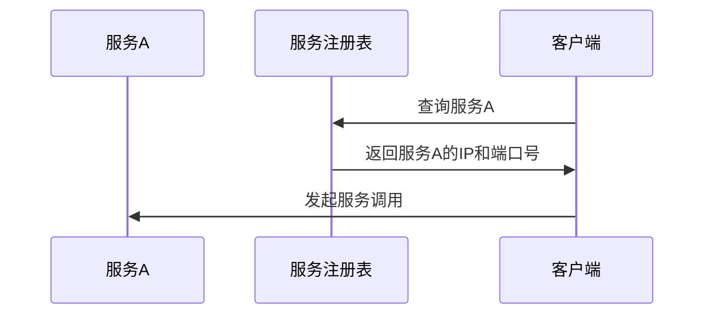

**伪代码**

```python
def serviceDiscovery(serviceName):
    # 查询服务注册表
    serviceInfo = serviceRegistry.query(serviceName)
    # 构建服务调用地址
    serviceUrl = f'http://{serviceInfo.ip}:{serviceInfo.port}'
    return serviceUrl
```

**数学模型和公式**

服务发现的响应时间可以通过以下公式计算：

$$
\text{服务发现响应时间} = \text{服务查询时间} + \text{服务响应时间}
$$

**举例说明与代码实战**

假设我们有一个订单服务（OrderService）和一个库存服务（InventoryService），客户端需要通过服务发现机制调用这两个服务。

```python
# 服务发现
serviceUrl = serviceDiscovery('OrderService')
# 发起服务调用
response = requests.get(serviceUrl + '/order')
```

#### 2.2 服务负载均衡

服务负载均衡是服务网格的重要功能之一。它负责根据策略将请求分发到不同的服务实例。常见的负载均衡策略包括轮询、随机、最少连接数等。

**核心概念与联系**

- **负载均衡器**：服务网格中的负载均衡器负责接收客户端请求，并根据策略将请求转发到合适的服务实例。
- **服务实例**：服务实例是服务的具体实现，可以是容器、虚拟机等。

**Mermaid 流程图**

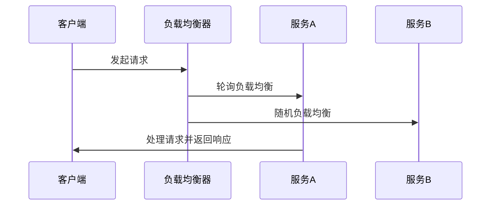

**伪代码**

```python
def loadBalancing(availableServices):
    # 选择服务实例
    service = chooseService(availableServices)
    # 转发请求到服务实例
    forwardRequest(service)
```

**数学模型和公式**

负载均衡策略可以基于以下公式计算：

$$
\text{服务调用次数} = \text{总请求次数} \times \text{负载均衡策略权重}
$$

**举例说明与代码实战**

假设我们有一个订单服务（OrderService）和两个库存服务（InventoryServiceA和InventoryServiceB），客户端需要通过服务负载均衡机制调用这两个服务。

```python
# 负载均衡
serviceUrl = loadBalancing(['http://OrderService:8080', 'http://InventoryServiceA:8081', 'http://InventoryServiceB:8082'])
# 发起服务调用
response = requests.get(serviceUrl + '/order')
```

#### 2.3 服务熔断

服务熔断是一种保护机制，当服务实例失败时，服务网格可以自动将流量转移到其他健康的服务实例。这可以防止系统过载，并提高系统的可用性。

**核心概念与联系**

- **熔断器**：服务网格中的熔断器负责监控服务实例的健康状态，并在服务实例失败时触发熔断。
- **熔断策略**：熔断策略定义了触发熔断的条件和恢复机制。

**Mermaid 流程图**

```mermaid
sequenceDiagram
    participant Client as 客户端
    participant CircuitBreaker as 熔断器
    participant ServiceA as 服务A
    participant ServiceB as 服务B

    Client->>ServiceA: 发起请求
    alt 服务A健康
    ServiceA->>Client: 返回响应
    else 服务A不健康
    ServiceA->>CircuitBreaker: 触发熔断
    CircuitBreaker->>ServiceB: 转发请求
    ServiceB->>Client: 返回响应
```

**伪代码**

```python
def circuitBreaking(service):
    if service.isHealthy():
        forwardRequest(service)
    else:
        alternativeService = findAlternativeService()
        forwardRequest(alternativeService)
```

**数学模型和公式**

熔断策略可以基于以下公式计算：

$$
\text{熔断阈值} = \text{失败请求次数} \times \text{熔断因子}
$$

**举例说明与代码实战**

假设我们有一个订单服务（OrderService）和一个库存服务（InventoryService），客户端需要通过服务熔断机制调用这两个服务。

```python
# 服务熔断
serviceUrl = circuitBreaking('OrderService')
# 发起服务调用
response = requests.get(serviceUrl + '/order')
```

#### 2.4 服务限流

服务限流是一种控制服务实例接收请求速率的机制。它可以帮助防止系统过载，并保持服务的稳定性和性能。

**核心概念与联系**

- **限流器**：服务网格中的限流器负责监控服务实例的请求速率，并根据策略限制请求接收。
- **限流策略**：限流策略定义了限制请求接收的条件和方式。

**Mermaid 流程图**

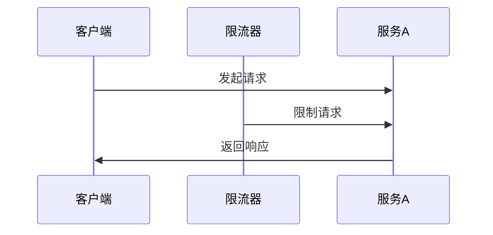

**伪代码**

```python
def rateLimiting(service, maxRequestsPerSecond):
    if currentRequestCount < maxRequestsPerSecond:
        forwardRequest(service)
    else:
        dropRequest()
```

**数学模型和公式**

限流策略可以基于以下公式计算：

$$
\text{请求速率} = \frac{\text{当前请求次数}}{\text{时间窗口}}
$$

**举例说明与代码实战**

假设我们有一个订单服务（OrderService），客户端需要通过服务限流机制调用这个服务。

```python
# 服务限流
maxRequestsPerSecond = 100
serviceUrl = rateLimiting('OrderService', maxRequestsPerSecond)
# 发起服务调用
response = requests.get(serviceUrl + '/order')
```

#### 2.5 服务路由

服务路由是服务网格的重要功能之一。它可以根据策略动态调整请求的路由，以便实现灵活的服务调用。

**核心概念与联系**

- **路由规则**：路由规则定义了请求的路由策略，如根据服务版本、环境等。
- **路由策略**：路由策略定义了如何根据路由规则调整请求的路由。

**Mermaid 流程图**

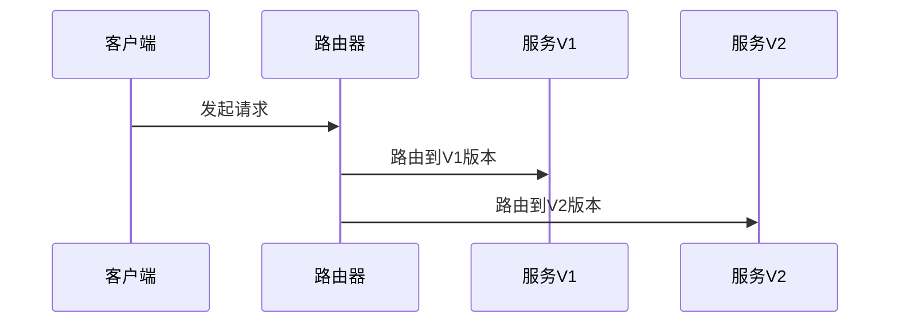

**伪代码**

```python
def routing(request, rules):
    serviceVersion = determineServiceVersion(request, rules)
    forwardRequest(serviceVersion)
```

**数学模型和公式**

路由策略可以基于以下公式计算：

$$
\text{路由权重} = \frac{\text{访问次数}}{\text{总访问次数}}
$$

**举例说明与代码实战**

假设我们有一个订单服务（OrderService）的V1和V2版本，客户端需要通过服务路由机制调用这两个版本。

```python
# 路由规则
rules = {'version': {'V1': 0.8, 'V2': 0.2}}
# 服务路由
serviceVersion = routing(request, rules)
# 发起服务调用
response = requests.get(serviceVersion + '/order')
```

### 3. 服务网格通信模型

服务网格的通信模型主要包括服务间通信机制、数据流管理和安全通信。这些模型保证了服务之间高效、可靠和安全的数据传输。

#### 3.1 服务间通信机制

服务间通信是服务网格的核心功能之一。它提供了服务之间进行交互的机制，使得服务可以独立开发、部署和扩展。

**核心概念与联系**

- **服务间协议**：服务间协议定义了服务之间进行通信的规则，如HTTP/2、gRPC等。
- **服务间接口**：服务间接口定义了服务之间的接口规范，如REST API、gRPC服务接口等。

**Mermaid 流程图**

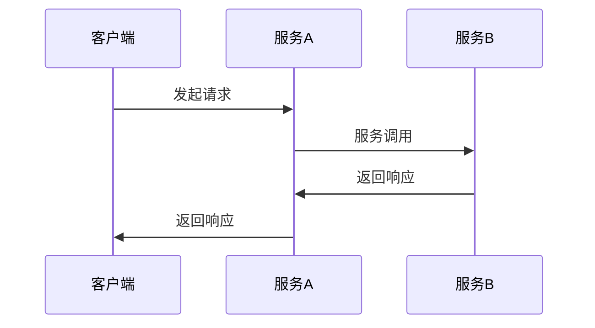

**伪代码**

```python
def interServiceCommunication(clientRequest, serviceA, serviceB):
    # 调用服务A
    serviceAResponse = serviceA.handleRequest(clientRequest)
    # 转发请求到服务B
    serviceBResponse = serviceB.handleRequest(serviceAResponse)
    return serviceBResponse
```

**数学模型和公式**

服务间通信延迟可以通过以下公式计算：

$$
\text{服务间通信延迟} = \text{网络传输延迟} + \text{服务处理延迟}
$$

**举例说明与代码实战**

假设我们有一个订单服务（OrderService）和一个库存服务（InventoryService），客户端需要通过服务间通信机制调用这两个服务。

```python
# 服务间通信
response = interServiceCommunication(clientRequest, OrderService, InventoryService)
```

#### 3.2 数据流管理

数据流管理是服务网格的重要功能之一。它提供了对服务间数据流的监控和控制能力，以确保数据传输的效率和安全性。

**核心概念与联系**

- **数据流监控**：数据流监控负责实时监控服务间数据流的状态和性能。
- **数据流控制**：数据流控制负责根据策略对数据流进行调节和控制。

**Mermaid 流程图**

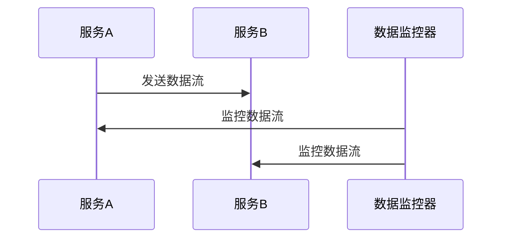

**伪代码**

```python
def dataFlowManagement(serviceA, serviceB, dataMonitor):
    # 发送数据流
    serviceA.sendDataToServiceB(data)
    # 监控数据流
    dataMonitor.monitorDataFlow(serviceA, serviceB)
```

**数学模型和公式**

数据流速率可以通过以下公式计算：

$$
\text{数据流速率} = \frac{\text{数据流量}}{\text{时间窗口}}
$$

**举例说明与代码实战**

假设我们有一个订单服务（OrderService）和一个库存服务（InventoryService），客户端需要通过数据流管理机制监控数据流。

```python
# 数据流管理
dataFlowManagement(OrderService, InventoryService, DataMonitor)
```

#### 3.3 安全通信

安全通信是服务网格通信模型的重要组成部分。它确保了服务间通信的数据安全性和隐私性。

**核心概念与联系**

- **安全协议**：安全协议负责保护服务间通信的数据，如TLS/SSL。
- **认证机制**：认证机制负责验证服务间的身份和权限。

**Mermaid 流程图**

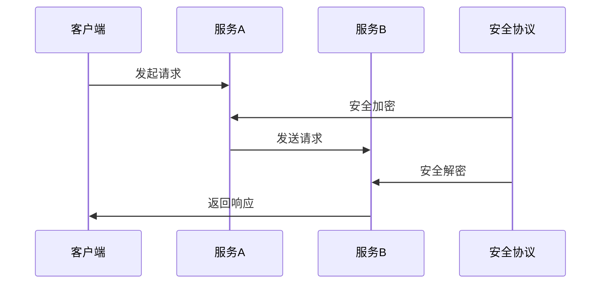

**伪代码**

```python
def secureCommunication(clientRequest, serviceA, serviceB, securityProtocol):
    # 安全加密请求
    encryptedRequest = securityProtocol.encrypt(clientRequest)
    # 发送请求到服务A
    serviceAResponse = serviceA.handleRequest(encryptedRequest)
    # 安全解密响应
    decryptedResponse = securityProtocol.decrypt(serviceAResponse)
    return decryptedResponse
```

**数学模型和公式**

安全通信延迟可以通过以下公式计算：

$$
\text{安全通信延迟} = \text{加密延迟} + \text{解密延迟} + \text{网络传输延迟}
$$

**举例说明与代码实战**

假设我们有一个订单服务（OrderService）和一个库存服务（InventoryService），客户端需要通过安全通信机制调用这两个服务。

```python
# 安全通信
response = secureCommunication(clientRequest, OrderService, InventoryService, SecurityProtocol)
```

### 4. 服务网格数据模型

服务网格的数据模型主要包括服务元数据、配置数据和监控数据。这些数据模型为服务网格提供了丰富的信息，以便进行服务管理和监控。

#### 4.1 服务元数据

服务元数据是服务网格中描述服务实例的详细信息。它包括服务名称、IP地址、端口号、服务版本、健康状况等。

**核心概念与联系**

- **服务注册表**：服务注册表负责存储服务元数据，并提供查询接口。
- **服务实例**：服务实例是服务元数据的具体实现，如容器、虚拟机等。

**Mermaid 流程图**

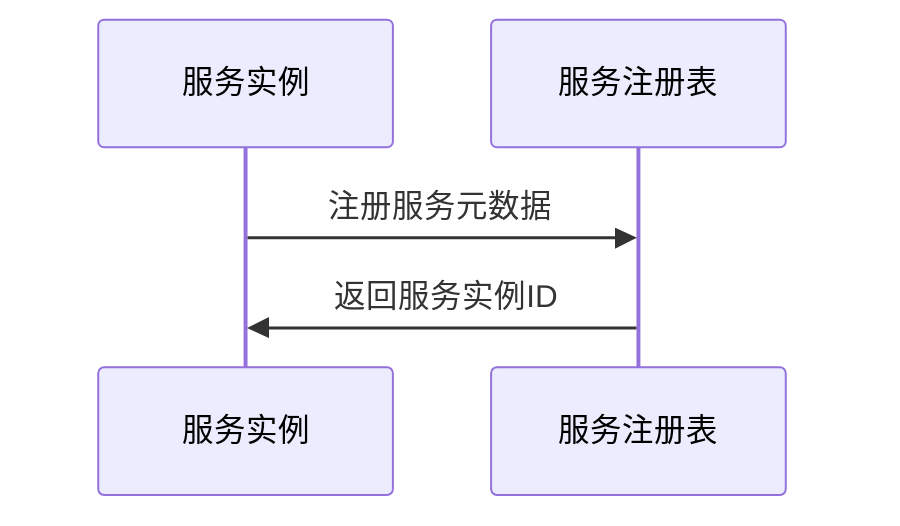

**伪代码**

```python
def registerServiceMetadata(serviceInstance):
    serviceRegistry.registerService(serviceInstance.metadata)
    return serviceRegistry.getServiceInstanceId()
```

**数学模型和公式**

服务实例数可以通过以下公式计算：

$$
\text{服务实例数} = \text{服务版本数} \times \text{部署实例数}
$$

**举例说明与代码实战**

假设我们有一个订单服务（OrderService），客户端需要通过服务注册表获取服务元数据。

```python
# 服务元数据注册
serviceInstanceId = registerServiceMetadata(OrderServiceInstance)
# 获取服务元数据
serviceMetadata = serviceRegistry.getServiceMetadata(serviceInstanceId)
```

#### 4.2 配置数据

配置数据是服务网格中用于配置服务实例的详细信息。它包括服务版本、部署环境、负载均衡策略等。

**核心概念与联系**

- **配置中心**：配置中心负责存储和管理配置数据，并提供查询接口。
- **服务实例**：服务实例根据配置数据进行初始化和配置。

**Mermaid 流程图**

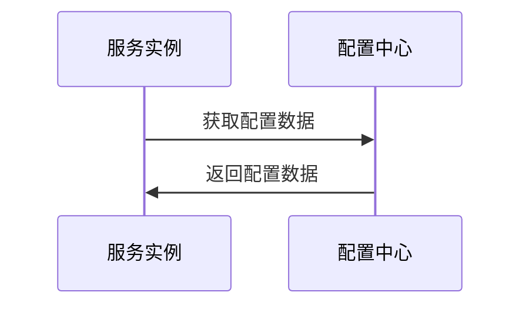

**伪代码**

```python
def loadServiceConfiguration(serviceInstance):
    configuration = configCenter.loadConfiguration(serviceInstance.serviceId)
    serviceInstance.applyConfiguration(configuration)
```

**数学模型和公式**

配置数据更新频率可以通过以下公式计算：

$$
\text{配置数据更新频率} = \frac{\text{配置数据更新次数}}{\text{时间窗口}}
$$

**举例说明与代码实战**

假设我们有一个订单服务（OrderService），客户端需要通过配置中心获取配置数据。

```python
# 获取配置数据
configuration = loadServiceConfiguration(OrderServiceInstance)
# 应用配置数据
OrderServiceInstance.applyConfiguration(configuration)
```

#### 4.3 监控数据

监控数据是服务网格中用于监控服务实例性能和健康状况的详细信息。它包括服务调用次数、响应时间、错误率等。

**核心概念与联系**

- **监控中心**：监控中心负责收集和存储监控数据，并提供查询接口。
- **服务实例**：服务实例定期向监控中心发送监控数据。

**Mermaid 流程图**

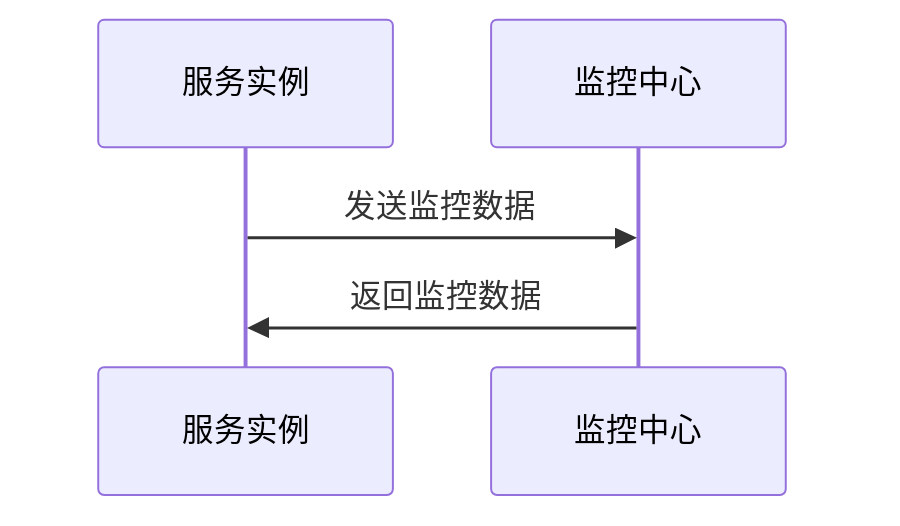

**伪代码**

```python
def sendMonitoringData(serviceInstance, monitoringCenter):
    monitoringData = serviceInstance.collectMonitoringData()
    monitoringCenter.storeMonitoringData(monitoringData)
```

**数学模型和公式**

服务响应时间可以通过以下公式计算：

$$
\text{服务响应时间} = \frac{\text{总处理时间} + \text{总传输时间}}{2}
$$

**举例说明与代码实战**

假设我们有一个订单服务（OrderService），客户端需要通过监控中心获取监控数据。

```python
# 发送监控数据
sendMonitoringData(OrderServiceInstance, MonitoringCenter)
# 获取监控数据
monitoringData = MonitoringCenter.getMonitoringData('OrderService')
```

### 5. 服务网格部署与运维

服务网格的部署与运维是确保其稳定运行的关键。本章将介绍服务网格的部署流程、运维策略和故障排查方法。

#### 5.1 部署流程

服务网格的部署流程可以分为以下几个步骤：

1. **环境准备**：准备部署服务网格的环境，包括操作系统、网络和存储等。
2. **安装服务网格组件**：安装服务网格的核心组件，如sidecar代理、服务注册表、配置中心等。
3. **配置服务网格**：配置服务网格的参数，如服务名称、服务地址、负载均衡策略等。
4. **部署服务实例**：部署服务网格中的服务实例，并确保它们可以相互通信。
5. **测试与优化**：对服务网格进行测试，确保其稳定运行，并根据性能指标进行优化。

**Mermaid 流程图**

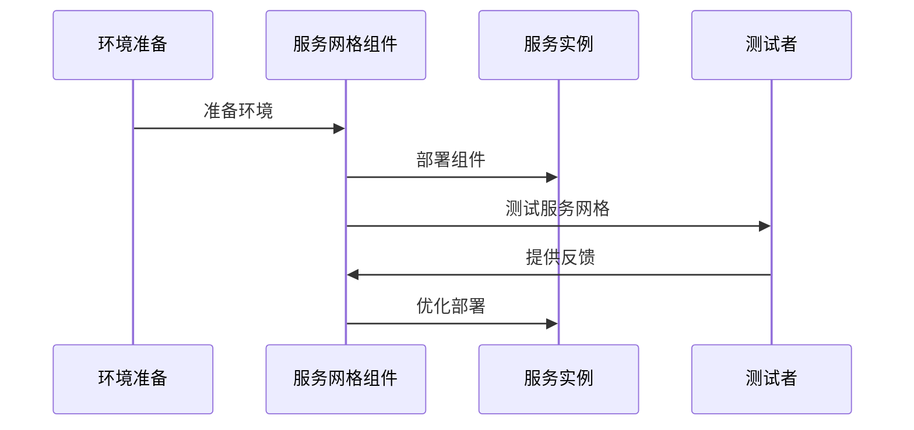

**伪代码**

```python
def deployServiceMesh(environment, serviceMeshComponents, serviceInstances):
    # 环境准备
    environment.prepare()
    # 部署服务网格组件
    serviceMeshComponents.deploy()
    # 部署服务实例
    serviceInstances.deploy()
    # 测试服务网格
    tester.testServiceMesh()
    # 优化部署
    serviceMeshComponents.optimize()
```

**数学模型和公式**

服务网格部署时间可以通过以下公式计算：

$$
\text{服务网格部署时间} = \text{环境准备时间} + \text{组件部署时间} + \text{实例部署时间}
$$

**举例说明与代码实战**

假设我们需要部署一个服务网格，包括服务注册表、配置中心和sidecar代理。

```python
# 部署服务网格
deployServiceMesh(environment, serviceMeshComponents, serviceInstances)
```

#### 5.2 运维策略

运维策略是确保服务网格稳定运行的关键。以下是一些常见的运维策略：

1. **监控与告警**：实时监控服务网格的性能指标，并设置告警机制，以便及时发现问题。
2. **故障排查**：当服务网格出现故障时，进行故障排查，找出问题的根本原因。
3. **弹性伸缩**：根据服务网格的负载情况，进行自动或手动伸缩，确保服务网格的稳定运行。
4. **版本管理**：对服务网格进行版本管理，确保部署和回滚的顺利进行。

**Mermaid 流程图**

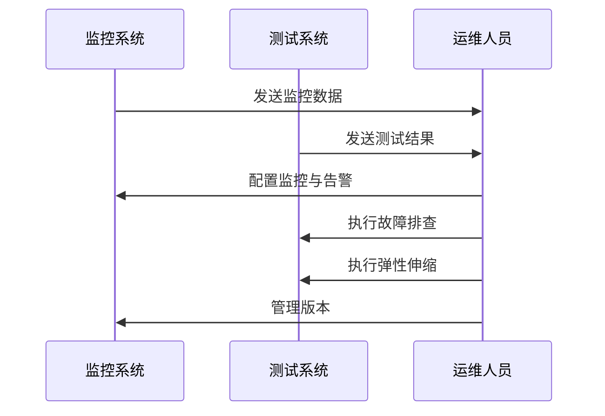

**伪代码**

```python
def manageServiceMesh(operator, monitor, tester):
    # 配置监控与告警
    monitor.configureAlerts()
    # 执行故障排查
    tester.executeFaultDetection()
    # 执行弹性伸缩
    tester.executeAutoScaling()
    # 管理版本
    monitor.manageVersions()
```

**数学模型和公式**

服务网格告警触发条件可以通过以下公式计算：

$$
\text{告警触发条件} = \text{监控指标阈值} \times \text{告警周期}
$$

**举例说明与代码实战**

假设我们需要监控服务网格的性能指标，并设置告警机制。

```python
# 配置监控与告警
configureAlerts(monitor, 'service_mesh', 'response_time', 1000)
```

#### 5.3 故障排查

故障排查是运维过程中不可或缺的一部分。以下是一些常见的故障排查方法：

1. **日志分析**：通过分析服务网格的日志，找出问题的根本原因。
2. **性能监控**：通过监控服务网格的性能指标，找出性能瓶颈和故障点。
3. **故障模拟**：模拟各种故障场景，验证服务网格的容错能力和恢复能力。
4. **版本回滚**：当故障发生时，及时回滚到之前的稳定版本。

**Mermaid 流程图**

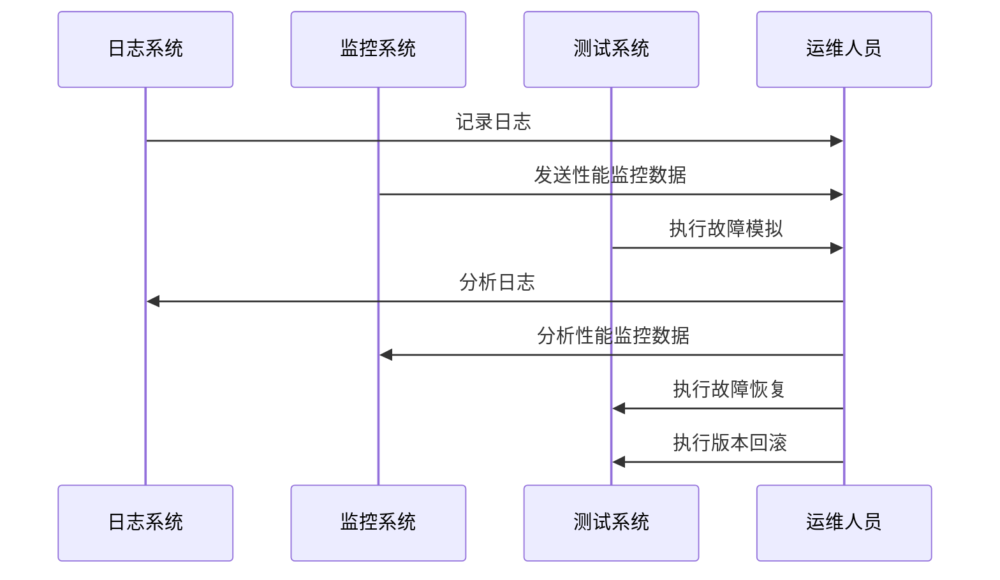

**伪代码**

```python
def faultDetection(operator, logger, monitor, tester):
    # 分析日志
    operator.analyzeLogs(logger)
    # 分析性能监控数据
    operator.analyzeMonitorData(monitor)
    # 执行故障模拟
    tester.simulateFault()
    # 执行故障恢复
    operator.restoreFault()
    # 执行版本回滚
    operator.rollbackVersion()
```

**数学模型和公式**

故障恢复时间可以通过以下公式计算：

$$
\text{故障恢复时间} = \text{故障检测时间} + \text{故障恢复时间}
$$

**举例说明与代码实战**

假设我们需要分析服务网格的日志，并执行故障恢复。

```python
# 分析日志
analyzeLogs(logger)
# 执行故障恢复
restoreFault(tester)
```

### 6. 服务网格应用场景

服务网格在各种应用场景中具有广泛的应用。本章将介绍服务网格在微服务架构、Kubernetes和云原生应用中的具体应用。

#### 6.1 微服务架构

微服务架构是服务网格最常见的应用场景之一。服务网格可以简化微服务之间的通信，提供负载均衡、熔断、限流等功能。

**核心概念与联系**

- **服务间通信**：服务网格提供了统一的通信机制，使得微服务之间的通信变得更加简单。
- **服务管理**：服务网格可以自动管理微服务的发现、负载均衡、熔断和限流，减轻了开发者的负担。

**Mermaid 流程图**


**伪代码**

```python
def microserviceCommunication(request, microserviceA, microserviceB, serviceMesh):
    # 转发请求到微服务B
    response = serviceMesh.forwardRequest(microserviceB, request)
    return response
```

**数学模型和公式**

服务调用次数可以通过以下公式计算：

$$
\text{服务调用次数} = \text{总请求次数} \times \text{服务调用比例}
$$

**举例说明与代码实战**

假设我们有两个微服务（MicroserviceA和MicroserviceB），客户端需要通过服务网格调用这两个微服务。

```python
# 微服务通信
response = microserviceCommunication(request, MicroserviceA, MicroserviceB, ServiceMesh)
```

#### 6.2 Kubernetes

Kubernetes是现代容器编排系统的领导者。服务网格可以与Kubernetes无缝集成，提供更高级的服务管理功能。

**核心概念与联系**

- **Kubernetes服务**：服务网格可以管理Kubernetes中的服务，提供负载均衡、熔断、限流等功能。
- **Ingress控制器**：服务网格可以替代Ingress控制器，提供更灵活的路由规则和流量管理。

**Mermaid 流程图**

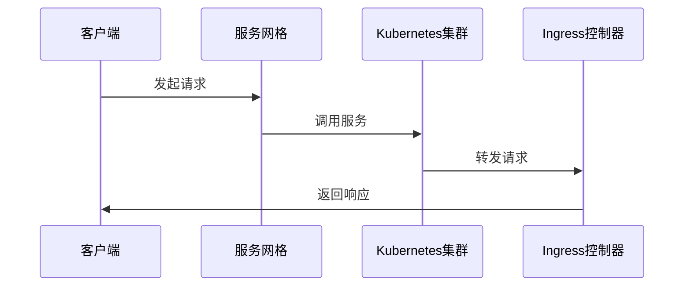

**伪代码**

```python
def kubernetesServiceCommunication(request, client, serviceMesh, kubernetes, ingressController):
    # 转发请求到Kubernetes服务
    response = serviceMesh.forwardRequest(kubernetes, request)
    # 转发请求到Ingress控制器
    response = ingressController.forwardRequest(response)
    return response
```

**数学模型和公式**

服务调用延迟可以通过以下公式计算：

$$
\text{服务调用延迟} = \text{网络传输延迟} + \text{服务处理延迟}
$$

**举例说明与代码实战**

假设我们有一个Kubernetes集群中的服务（ServiceA），客户端需要通过服务网格调用这个服务。

```python
# Kubernetes服务通信
response = kubernetesServiceCommunication(request, client, ServiceMesh, Kubernetes, IngressController)
```

#### 6.3 云原生应用

云原生应用是利用容器、服务网格、Kubernetes等新技术构建的应用程序。服务网格在云原生应用中发挥着关键作用。

**核心概念与联系**

- **服务间通信**：服务网格提供了高效的通信机制，使得云原生应用中的服务可以独立开发、部署和扩展。
- **动态配置**：服务网格可以根据云原生应用的需求，动态调整路由规则和负载均衡策略。

**Mermaid 流程图**

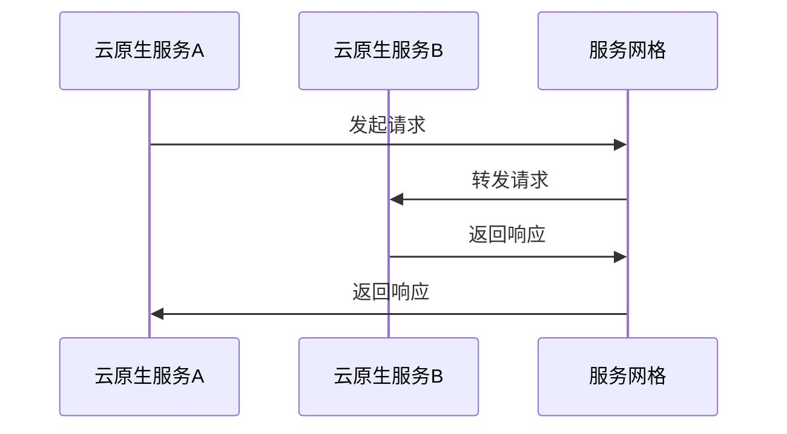

**伪代码**

```python
def cloudNativeServiceCommunication(request, cloudNativeServiceA, cloudNativeServiceB, serviceMesh):
    # 转发请求到云原生服务B
    response = serviceMesh.forwardRequest(cloudNativeServiceB, request)
    return response
```

**数学模型和公式**

服务调用成功率可以通过以下公式计算：

$$
\text{服务调用成功率} = \frac{\text{成功调用次数}}{\text{总调用次数}}
$$

**举例说明与代码实战**

假设我们有两个云原生服务（CloudNativeServiceA和CloudNativeServiceB），客户端需要通过服务网格调用这两个服务。

```python
# 云原生服务通信
response = cloudNativeServiceCommunication(request, CloudNativeServiceA, CloudNativeServiceB, ServiceMesh)
```

### 7. 服务网格未来发展趋势

服务网格作为现代服务架构的重要一环，正不断发展。以下是服务网格的一些未来发展趋势：

#### 7.1 技术演进

随着云计算、容器化和微服务架构的不断发展，服务网格技术也在不断演进。未来，服务网格可能会引入更多高级功能，如：

- **自动化运维**：通过人工智能和机器学习技术，实现服务网格的自动化运维。
- **多语言支持**：支持多种编程语言，使得服务网格可以更广泛地应用于不同的应用场景。
- **集成性增强**：与现有的服务管理工具（如Prometheus、Grafana等）更好地集成，提供更全面的服务管理能力。

#### 7.2 行业应用

服务网格在金融、电信、电商等行业具有广泛的应用前景。未来，随着行业对服务质量要求的提高，服务网格将在以下方面发挥更大作用：

- **高可用性**：通过服务网格提供高可用性，确保服务在故障情况下能够快速恢复。
- **安全性**：通过服务网格提供更安全的服务间通信，保护企业的数据安全。
- **可观测性**：通过服务网格提供更全面的服务监控和日志管理，提高服务的可观测性。

#### 7.3 挑战与机遇

服务网格的发展也面临一些挑战，如：

- **性能优化**：如何提高服务网格的性能，使其能够更好地支持高并发、大规模的应用场景。
- **兼容性**：如何与其他服务管理工具（如Kubernetes、服务注册表等）更好地集成。
- **安全性**：如何确保服务网格的安全通信，防止数据泄露和攻击。

然而，随着技术的不断进步，这些挑战也将逐渐得到解决，服务网格将为开发者提供更强大的服务管理能力。

### 结论

本文深入探讨了服务网格的基础知识、关键组件、通信模型、数据模型以及部署与运维。通过具体应用场景的案例分析，本文旨在为开发者提供一个全面的服务网格架构指南，帮助他们在复杂的微服务环境中实现高效、可扩展的服务管理。随着技术的不断发展，服务网格将继续在微服务架构、Kubernetes和云原生应用等领域发挥重要作用。开发者应关注服务网格的最新动态，掌握服务网格的原理和应用，为构建高质量、高性能的应用程序奠定基础。

**作者信息**：

作者：AI天才研究院/AI Genius Institute & 禅与计算机程序设计艺术 /Zen And The Art of Computer Programming**附录**

**附录A：服务网格相关术语解释**

1. **服务网格（Service Mesh）**：服务网格是一种用于管理服务间通信的架构模式，通过在应用程序和基础设施之间引入一个额外的抽象层，实现服务间的流量管理。
2. **服务发现（Service Discovery）**：服务发现是指自动发现服务实例的过程，包括服务实例的IP地址、端口号、服务名称等信息。
3. **服务负载均衡（Service Load Balancing）**：服务负载均衡是指根据策略将请求分发到不同的服务实例，以实现请求的均衡处理。
4. **服务熔断（Service Circuit Breaking）**：服务熔断是一种保护机制，当服务实例失败时，自动将流量转移到其他健康的服务实例。
5. **服务限流（Service Rate Limiting）**：服务限流是一种控制服务实例接收请求速率的机制，以防止系统过载。
6. **服务路由（Service Routing）**：服务路由是指根据策略动态调整请求的路由，以便实现灵活的服务调用。

**附录B：常见服务网格项目**

1. **Istio**：由Google、IBM和LinkedIn等公司共同开发的服务网格项目，提供全面的服务网格功能，支持多种服务间协议。
2. **Linkerd**：由Bu

