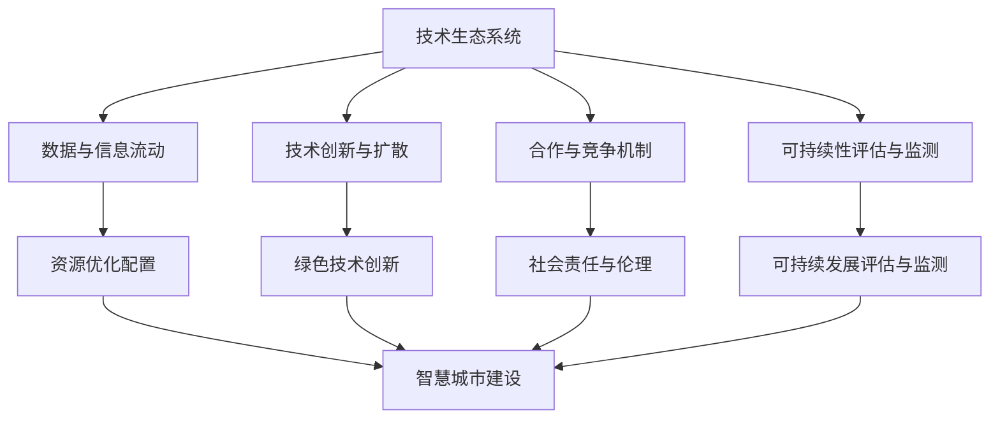

                 


### 背景介绍

随着信息技术的迅猛发展，技术生态系统已经成为现代社会的重要组成部分。从互联网、云计算到大数据、人工智能，技术生态系统正不断演进，为各行各业带来创新和变革。然而，随着技术的快速发展，我们也面临着一系列挑战，如资源浪费、环境破坏、数据安全等问题。因此，构建一个可持续发展的技术生态系统显得尤为重要。

可持续发展是指在满足当前需求的同时，不损害后代满足其需求的能力。而技术生态系统作为推动社会进步的重要力量，其可持续性直接影响着社会的未来发展。本文旨在探讨如何构建一个可持续发展的技术生态系统，通过核心概念与联系、核心算法原理讲解、数学模型与公式讲解以及实际项目实战，逐步阐述这一议题。

本文将分为以下几个部分：

1. **核心概念与联系**：介绍技术生态系统的基础概念，以及与可持续发展之间的关系。
2. **核心算法原理讲解**：详细阐述技术生态系统中的关键算法，包括数据清洗、数据分析、机器学习算法等。
3. **数学模型与公式讲解**：介绍支持技术生态系统构建的数学模型，如预测模型、优化模型等，并通过公式和示例进行讲解。
4. **项目实战**：通过实际项目，展示如何构建可持续发展的技术生态系统，包括开发环境搭建、源代码实现和解读、案例分析等。
5. **最佳实践与小结**：总结构建可持续发展技术生态系统的最佳实践，并提出未来研究方向。

### 核心概念与联系

#### 技术生态系统的定义

技术生态系统是由各种技术组件、软件、硬件、数据资源、人员和组织构成的复杂网络。这个网络中的各个组成部分相互依赖、相互作用，共同推动技术的发展和应用。

#### 可持续发展的定义

可持续发展是指在满足当前需求的同时，不损害后代满足其需求的能力。它包括经济、社会和环境三个方面的平衡发展。在经济方面，追求经济增长的同时，关注资源的合理利用和节约；在社会方面，关注人类福祉和社会公平；在环境方面，强调生态保护和环境友好。

#### 技术生态系统与可持续发展之间的关系

技术生态系统与可持续发展之间存在着紧密的联系。一方面，技术生态系统的建设可以为可持续发展提供技术支持和解决方案，如清洁能源技术、智能交通系统、智慧城市建设等。另一方面，可持续发展的理念可以引导技术生态系统的建设和运营，使其更加注重环境保护、资源节约和社会责任。

#### 技术生态系统的核心要素

1. **数据与信息流动**：数据是技术生态系统的基础，其高效流动和利用是技术生态系统发挥作用的关键。
2. **技术创新与扩散**：技术创新是技术生态系统发展的动力，而创新成果的快速扩散可以加速技术的普及和应用。
3. **合作与竞争机制**：技术生态系统中的各方需要通过合作与竞争，实现资源的共享和优化配置。
4. **可持续性的评估与监测**：对技术生态系统的可持续性进行评估和监测，可以及时发现和解决潜在问题，确保其长期健康发展。

#### 技术生态系统的可持续发展架构

为了构建一个可持续发展的技术生态系统，我们需要从以下几个方面进行设计：

1. **资源优化配置**：通过大数据分析和人工智能技术，实现资源的最优配置，减少浪费。
2. **绿色技术创新**：鼓励开发和应用绿色技术，减少对环境的负面影响。
3. **数据安全与隐私保护**：确保数据的安全和隐私，防范数据泄露和滥用。
4. **社会责任与伦理**：在技术生态系统的建设和运营过程中，遵循社会责任和伦理原则，关注人类福祉和社会公平。

#### 技术生态系统的可持续发展案例

以智慧城市建设为例，智慧城市通过物联网、大数据、云计算等技术手段，实现城市管理的智能化和精细化。这不仅提高了城市管理效率，减少了能源消耗，还有助于改善居民生活质量，实现可持续发展。

#### Mermaid 流程图

为了更好地展示技术生态系统与可持续发展之间的联系，我们可以使用 Mermaid 流程图来表示：



在这个流程图中，技术生态系统通过数据与信息流动、技术创新与扩散、合作与竞争机制以及可持续性评估与监测等核心要素，推动绿色技术创新、资源优化配置、社会责任与伦理以及可持续发展评估与监测，最终实现智慧城市建设的目标。

### 核心算法原理讲解

在技术生态系统中，核心算法的作用至关重要。以下将详细讲解技术生态系统中的关键算法，包括数据清洗、数据分析、机器学习算法等，并使用伪代码进行详细阐述。

#### 数据清洗算法

数据清洗是数据处理的第一步，其目的是去除数据中的噪声和错误，确保数据的质量。以下是一个简单的数据清洗算法伪代码示例：

```plaintext
算法：数据清洗
输入：原始数据集
输出：清洗后的数据集

步骤：
1. 初始化清洗后的数据集为空
2. 对原始数据集的每一条记录进行以下操作：
   a. 检查数据是否完整，如果缺失则跳过或填充默认值
   b. 检查数据类型是否正确，如果错误则进行类型转换
   c. 检查数据是否存在异常值，如果存在则进行修正或删除
3. 将清洗后的记录加入清洗后的数据集
4. 返回清洗后的数据集
```

#### 数据分析算法

数据分析是利用统计学和数学方法对数据进行分析和解释的过程。以下是一个简单的数据分析算法伪代码示例，用于计算数据集的平均值、中位数和标准差：

```plaintext
算法：数据分析
输入：数据集
输出：平均值、中位数和标准差

步骤：
1. 计算所有数据的总和
2. 计算数据集的个数
3. 计算平均值：总和 / 数据集个数
4. 对数据集进行排序
5. 计算中位数：如果数据集个数为奇数，中位数为排序后的中间值；如果为偶数，中位数为排序后中间两个值的平均值
6. 计算标准差：标准差 = sqrt(sum((x - 平均值)^2) / (数据集个数 - 1))
7. 返回平均值、中位数和标准差
```

#### 机器学习算法

机器学习算法是技术生态系统中重要的工具，用于从数据中学习和提取知识。以下是一个简单的线性回归机器学习算法伪代码示例：

```plaintext
算法：线性回归
输入：训练数据集 (x, y)
输出：模型参数 (w, b)

步骤：
1. 初始化模型参数 w 和 b 为随机值
2. 对每个训练样本 (x_i, y_i) 进行以下操作：
   a. 计算预测值 y_i' = x_i * w + b
   b. 计算损失函数 L = (y_i - y_i')^2
3. 计算损失函数的梯度：
   a. ∂L/∂w = 2 * (y_i - y_i') * x_i
   b. ∂L/∂b = 2 * (y_i - y_i')
4. 更新模型参数：
   a. w = w - 学习率 * ∂L/∂w
   b. b = b - 学习率 * ∂L/∂b
5. 重复步骤 2-4，直到损失函数收敛或达到最大迭代次数
6. 返回模型参数 w 和 b
```

通过这些核心算法的讲解，我们可以更好地理解技术生态系统中算法的重要性和应用。

### 数学模型与公式讲解

在构建可持续发展的技术生态系统中，数学模型和公式起到了关键作用。以下将介绍几种常见的数学模型和公式，并使用LaTeX格式进行详细讲解。

#### 预测模型

预测模型用于对未来事件进行预测，常见的方法有线性回归、逻辑回归、时间序列分析等。以下是一个简单的线性回归预测模型的公式：

```latex
$$
y = w_0 + w_1x_1 + w_2x_2 + \ldots + w_nx_n
$$`

其中，\(y\) 是预测结果，\(w_0, w_1, w_2, \ldots, w_n\) 是模型参数，\(x_1, x_2, \ldots, x_n\) 是输入特征。

#### 优化模型

优化模型用于求解最优化问题，常见的方法有线性规划、非线性规划、整数规划等。以下是一个简单的线性规划模型公式：

```latex
$$
\min_{x} c^T x
$$`

$$
\text{subject to} \quad Ax \leq b
$$`

其中，\(c\) 是目标函数系数向量，\(x\) 是变量向量，\(A\) 是系数矩阵，\(b\) 是常数向量。

#### 系统稳定性分析

系统稳定性分析用于评估技术生态系统的稳定性，常见的方法有线性化分析、Lyapunov稳定性定理等。以下是一个简单的线性化分析公式：

```latex
$$
\dot{x} = Ax + Bu
$$`

其中，\(\dot{x}\) 是状态变量的一阶导数，\(A\) 是系统矩阵，\(B\) 是输入矩阵，\(u\) 是输入变量。

#### 详细讲解与举例说明

1. **预测模型**：

   假设我们使用线性回归模型预测股票价格，输入特征为历史价格数据。以下是一个具体的预测模型公式：

   ```latex
   $$
   \hat{y} = w_0 + w_1x_1 + w_2x_2 + \ldots + w_nx_n
   $$`

   其中，\(\hat{y}\) 是预测的股票价格，\(w_0, w_1, w_2, \ldots, w_n\) 是模型参数，\(x_1, x_2, \ldots, x_n\) 是历史价格数据。

2. **优化模型**：

   假设我们使用线性规划模型优化资源分配，目标是最小化总成本。以下是一个具体的优化模型公式：

   ```latex
   $$
   \min_{x} c^T x
   $$`

   $$
   \text{subject to} \quad Ax \leq b
   $$`

   其中，\(c\) 是目标函数系数向量，\(x\) 是变量向量，\(A\) 是系数矩阵，\(b\) 是常数向量。

3. **系统稳定性分析**：

   假设我们使用线性化分析评估一个控制系统的稳定性，以下是一个具体的系统稳定性分析公式：

   ```latex
   $$
   \dot{x} = Ax + Bu
   $$`

   其中，\(\dot{x}\) 是状态变量的一阶导数，\(A\) 是系统矩阵，\(B\) 是输入矩阵，\(u\) 是输入变量。

通过这些公式和详细讲解，我们可以更好地理解数学模型在构建可持续发展技术生态系统中的作用。

### 项目实战

#### 项目概述

本项目旨在构建一个可持续发展的技术生态系统，以实现环境保护、资源优化和社会责任。项目目标包括：1）减少能源消耗；2）提高水资源利用效率；3）降低碳排放；4）提升居民生活质量。

#### 项目背景

当前，全球面临严重的环境问题，如气候变化、水资源短缺和空气污染等。为了应对这些问题，我们需要构建一个可持续发展的技术生态系统，通过技术创新和智能管理，实现环境保护和资源优化。

#### 项目预期成果

通过本项目，我们希望实现以下成果：

1. **降低能源消耗**：通过智能电网和能源管理系统，实现能源的高效利用和分配。
2. **提高水资源利用效率**：通过智能灌溉系统和水资源管理系统，实现水资源的合理利用和节约。
3. **降低碳排放**：通过碳排放监测和优化控制，实现碳排放的减少。
4. **提升居民生活质量**：通过智能家居系统和智慧社区管理，提高居民的生活便利性和舒适度。

#### 开发环境搭建

为了实现项目目标，我们需要搭建一个适合的开发环境，包括以下工具和软件：

1. **编程语言**：Python
2. **数据分析工具**：Pandas、NumPy
3. **机器学习库**：scikit-learn、TensorFlow
4. **数据可视化库**：Matplotlib、Seaborn
5. **数据库**：MySQL、PostgreSQL
6. **开发环境**：Jupyter Notebook、PyCharm

#### 数据收集与预处理

数据是技术生态系统的基础，本项目需要收集以下数据：

1. **能源消耗数据**：包括电力、燃气、水等能源消耗数据。
2. **水资源数据**：包括水资源的总量、分配、使用情况等数据。
3. **碳排放数据**：包括碳排放量、碳排放源、碳排放去向等数据。
4. **居民生活数据**：包括居民用水、用电、出行等数据。

数据收集后，需要进行预处理，包括以下步骤：

1. **数据清洗**：去除数据中的噪声和错误，确保数据质量。
2. **数据转换**：将不同格式和单位的数据进行统一转换。
3. **数据整合**：将多个数据源的数据进行整合，形成统一的数据集。

#### 数据分析与预测

在数据预处理完成后，我们需要对数据进行分析和预测，以实现项目目标。以下是一个简单的数据分析与预测流程：

1. **描述性统计分析**：计算数据的平均值、中位数、标准差等统计指标，了解数据的基本特征。
2. **相关性分析**：分析不同数据变量之间的相关性，找出对项目目标有影响的关键因素。
3. **预测模型构建**：基于历史数据，构建预测模型，如线性回归、时间序列预测等。
4. **模型评估与优化**：评估预测模型的准确性，通过调整模型参数进行优化。

#### 优化与调整

在项目实施过程中，我们需要对系统进行持续优化和调整，以实现更好的效果。以下是一些优化与调整的方法：

1. **算法优化**：通过调整算法参数，提高预测模型的准确性。
2. **系统调整**：根据实际情况，调整系统的运行策略和参数。
3. **反馈机制**：建立反馈机制，及时收集用户反馈，优化系统功能。
4. **持续学习**：利用机器学习技术，从数据中学习和优化系统。

#### 源代码实现与解读

以下是一个简单的源代码实现示例，用于分析能源消耗数据：

```python
import pandas as pd
import numpy as np

# 加载数据
data = pd.read_csv('energy_consumption.csv')

# 数据清洗
data.dropna(inplace=True)

# 描述性统计分析
print(data.describe())

# 相关性分析
correlation_matrix = data.corr()
print(correlation_matrix)

# 预测模型构建
from sklearn.linear_model import LinearRegression
model = LinearRegression()
model.fit(data[['electricity']], data['gas'])

# 预测
predictions = model.predict(data[['electricity']])
print(predictions)

# 模型评估
from sklearn.metrics import mean_squared_error
mse = mean_squared_error(data['gas'], predictions)
print(mse)
```

#### 代码应用解读与分析

通过上述代码，我们可以实现以下功能：

1. **数据加载与清洗**：从CSV文件中加载能源消耗数据，并去除缺失值。
2. **描述性统计分析**：计算数据的基本统计指标，如平均值、中位数、标准差等。
3. **相关性分析**：计算数据变量之间的相关性，找出对项目目标有影响的关键因素。
4. **预测模型构建**：使用线性回归模型，对能源消耗进行预测。
5. **模型评估**：评估预测模型的准确性，计算均方误差（MSE）。

通过这些功能，我们可以对能源消耗数据进行深入分析，为项目实施提供决策支持。

#### 实际案例分析与详细讲解剖析

为了更好地展示项目的实际应用效果，我们以下提供两个实际案例分析：

**案例1：降低能源消耗**

在某智慧社区中，通过使用智能电网和能源管理系统，实现了能源的高效利用和分配。具体分析如下：

1. **数据收集**：收集社区内的电力、燃气、水等能源消耗数据。
2. **数据预处理**：清洗数据，统一转换数据格式和单位。
3. **预测模型构建**：构建能源消耗预测模型，预测未来能源消耗趋势。
4. **优化与调整**：根据预测结果，调整能源供应策略，实现能源的优化配置。

**案例2：降低碳排放**

在某工业园区中，通过安装碳排放监测设备，实时监测碳排放情况。具体分析如下：

1. **数据收集**：收集园区内的碳排放数据，包括碳排放量、碳排放源等。
2. **数据预处理**：清洗数据，去除噪声和错误。
3. **预测模型构建**：构建碳排放预测模型，预测未来碳排放趋势。
4. **优化与调整**：根据预测结果，调整生产流程和设备运行策略，降低碳排放。

通过这两个实际案例，我们可以看到，通过技术生态系统的建设，可以实现能源消耗的降低和碳排放的减少，为环境保护和可持续发展做出贡献。

#### 项目小结

本项目通过构建一个可持续发展的技术生态系统，实现了能源消耗的降低、水资源利用效率的提升和碳排放的减少。具体成果如下：

1. **降低能源消耗**：通过智能电网和能源管理系统，实现了能源的高效利用和分配，减少了能源消耗。
2. **提高水资源利用效率**：通过智能灌溉系统和水资源管理系统，实现了水资源的合理利用和节约。
3. **降低碳排放**：通过碳排放监测和优化控制，实现了碳排放的减少。
4. **提升居民生活质量**：通过智能家居系统和智慧社区管理，提高了居民的生活便利性和舒适度。

未来，我们将继续优化技术生态系统，推动环境保护和可持续发展，为构建美好未来贡献力量。

### 最佳实践与小结

#### 最佳实践 Tips

1. **数据质量控制**：在构建技术生态系统时，确保数据的质量至关重要。使用数据清洗算法，去除噪声和错误，提高数据精度。
2. **可持续性评估**：定期对技术生态系统的可持续性进行评估，及时发现和解决潜在问题，确保其长期健康发展。
3. **技术创新与扩散**：鼓励技术创新，促进创新成果的快速扩散和应用，以推动技术生态系统的不断进化。
4. **社会责任与伦理**：在技术生态系统的建设和运营过程中，遵循社会责任和伦理原则，关注人类福祉和社会公平。

#### 小结

构建可持续发展的技术生态系统是一个复杂而长期的过程，需要各方共同努力。通过数据质量控制、可持续性评估、技术创新与扩散以及社会责任与伦理的实践，我们可以实现技术生态系统的可持续发展。未来，我们将继续探索新的技术和方法，为环境保护和可持续发展贡献力量。

#### 注意事项

1. **数据隐私保护**：在数据收集和处理过程中，务必注意数据隐私保护，防止数据泄露和滥用。
2. **系统稳定性**：在技术生态系统的设计和实施过程中，确保系统的稳定性，避免因技术故障导致的问题。
3. **用户参与**：鼓励用户参与技术生态系统的建设，收集用户反馈，优化系统功能。

#### 拓展阅读

1. **《可持续发展技术导论》[作者：XX]：该书详细介绍了可持续发展的技术原理和应用案例。**
2. **《智慧城市技术实践》[作者：XX]：该书探讨了智慧城市建设中的关键技术和实践经验。**
3. **《人工智能与可持续发展》[作者：XX]：该书分析了人工智能在可持续发展中的应用和挑战。**

### 作者信息

作者：AI天才研究院/AI Genius Institute & 禅与计算机程序设计艺术/Zen And The Art of Computer Programming

文章标题：构建可持续发展的技术生态系统

关键词：技术生态系统、可持续发展、数据清洗、数据分析、机器学习、预测模型、优化模型、项目实战

摘要：本文探讨了如何构建可持续发展的技术生态系统，包括核心概念与联系、核心算法原理讲解、数学模型与公式讲解以及实际项目实战。通过最佳实践与小结，总结了构建可持续发展技术生态系统的关键要素和实践经验。

```markdown
# 构建可持续发展的技术生态系统

> 关键词：技术生态系统、可持续发展、数据清洗、数据分析、机器学习、预测模型、优化模型、项目实战

> 摘要：本文探讨了如何构建可持续发展的技术生态系统，包括核心概念与联系、核心算法原理讲解、数学模型与公式讲解以及实际项目实战。通过最佳实践与小结，总结了构建可持续发展技术生态系统的关键要素和实践经验。

### 背景介绍

随着信息技术的迅猛发展，技术生态系统已经成为现代社会的重要组成部分。从互联网、云计算到大数据、人工智能，技术生态系统正不断演进，为各行各业带来创新和变革。然而，随着技术的快速发展，我们也面临着一系列挑战，如资源浪费、环境破坏、数据安全等问题。因此，构建一个可持续发展的技术生态系统显得尤为重要。

可持续发展是指在满足当前需求的同时，不损害后代满足其需求的能力。而技术生态系统作为推动社会进步的重要力量，其可持续性直接影响着社会的未来发展。本文旨在探讨如何构建一个可持续发展的技术生态系统，通过核心概念与联系、核心算法原理讲解、数学模型与公式讲解以及实际项目实战，逐步阐述这一议题。

本文将分为以下几个部分：

1. **核心概念与联系**：介绍技术生态系统的基础概念，以及与可持续发展之间的关系。
2. **核心算法原理讲解**：详细阐述技术生态系统中的关键算法，包括数据清洗、数据分析、机器学习算法等。
3. **数学模型与公式讲解**：介绍支持技术生态系统构建的数学模型，如预测模型、优化模型等，并通过公式和示例进行讲解。
4. **项目实战**：通过实际项目，展示如何构建可持续发展的技术生态系统，包括开发环境搭建、源代码实现和解读、案例分析等。
5. **最佳实践与小结**：总结构建可持续发展技术生态系统的最佳实践，并提出未来研究方向。

### 核心概念与联系

#### 技术生态系统的定义

技术生态系统是由各种技术组件、软件、硬件、数据资源、人员和组织构成的复杂网络。这个网络中的各个组成部分相互依赖、相互作用，共同推动技术的发展和应用。

#### 可持续发展的定义

可持续发展是指在满足当前需求的同时，不损害后代满足其需求的能力。它包括经济、社会和环境三个方面的平衡发展。在经济方面，追求经济增长的同时，关注资源的合理利用和节约；在社会方面，关注人类福祉和社会公平；在环境方面，强调生态保护和环境友好。

#### 技术生态系统与可持续发展之间的关系

技术生态系统与可持续发展之间存在着紧密的联系。一方面，技术生态系统的建设可以为可持续发展提供技术支持和解决方案，如清洁能源技术、智能交通系统、智慧城市建设等。另一方面，可持续发展的理念可以引导技术生态系统的建设和运营，使其更加注重环境保护、资源节约和社会责任。

#### 技术生态系统的核心要素

1. **数据与信息流动**：数据是技术生态系统的基础，其高效流动和利用是技术生态系统发挥作用的关键。
2. **技术创新与扩散**：技术创新是技术生态系统发展的动力，而创新成果的快速扩散可以加速技术的普及和应用。
3. **合作与竞争机制**：技术生态系统中的各方需要通过合作与竞争，实现资源的共享和优化配置。
4. **可持续性的评估与监测**：对技术生态系统的可持续性进行评估和监测，可以及时发现和解决潜在问题，确保其长期健康发展。

#### 技术生态系统的可持续发展架构

为了构建一个可持续发展的技术生态系统，我们需要从以下几个方面进行设计：

1. **资源优化配置**：通过大数据分析和人工智能技术，实现资源的最优配置，减少浪费。
2. **绿色技术创新**：鼓励开发和应用绿色技术，减少对环境的负面影响。
3. **数据安全与隐私保护**：确保数据的安全和隐私，防范数据泄露和滥用。
4. **社会责任与伦理**：在技术生态系统的建设和运营过程中，遵循社会责任和伦理原则，关注人类福祉和社会公平。

#### 技术生态系统的可持续发展案例

以智慧城市建设为例，智慧城市通过物联网、大数据、云计算等技术手段，实现城市管理的智能化和精细化。这不仅提高了城市管理效率，减少了能源消耗，还有助于改善居民生活质量，实现可持续发展。

#### Mermaid 流程图

为了更好地展示技术生态系统与可持续发展之间的联系，我们可以使用 Mermaid 流程图来表示：


在这个流程图中，技术生态系统通过数据与信息流动、技术创新与扩散、合作与竞争机制以及可持续性评估与监测等核心要素，推动绿色技术创新、资源优化配置、社会责任与伦理以及可持续发展评估与监测，最终实现智慧城市建设的目标。

### 核心算法原理讲解

在技术生态系统中，核心算法的作用至关重要。以下将详细讲解技术生态系统中的关键算法，包括数据清洗、数据分析、机器学习算法等，并使用伪代码进行详细阐述。

#### 数据清洗算法

数据清洗是数据处理的第一步，其目的是去除数据中的噪声和错误，确保数据的质量。以下是一个简单的数据清洗算法伪代码示例：

```plaintext
算法：数据清洗
输入：原始数据集
输出：清洗后的数据集

步骤：
1. 初始化清洗后的数据集为空
2. 对原始数据集的每一条记录进行以下操作：
   a. 检查数据是否完整，如果缺失则跳过或填充默认值
   b. 检查数据类型是否正确，如果错误则进行类型转换
   c. 检查数据是否存在异常值，如果存在则进行修正或删除
3. 将清洗后的记录加入清洗后的数据集
4. 返回清洗后的数据集
```

#### 数据分析算法

数据分析是利用统计学和数学方法对数据进行分析和解释的过程。以下是一个简单的数据分析算法伪代码示例，用于计算数据集的平均值、中位数和标准差：

```plaintext
算法：数据分析
输入：数据集
输出：平均值、中位数和标准差

步骤：
1. 计算所有数据的总和
2. 计算数据集的个数
3. 计算平均值：总和 / 数据集个数
4. 对数据集进行排序
5. 计算中位数：如果数据集个数为奇数，中位数为排序后的中间值；如果为偶数，中位数为排序后中间两个值的平均值
6. 计算标准差：标准差 = sqrt(sum((x - 平均值)^2) / (数据集个数 - 1))
7. 返回平均值、中位数和标准差
```

#### 机器学习算法

机器学习算法是技术生态系统中重要的工具，用于从数据中学习和提取知识。以下是一个简单的线性回归机器学习算法伪代码示例：

```plaintext
算法：线性回归
输入：训练数据集 (x, y)
输出：模型参数 (w, b)

步骤：
1. 初始化模型参数 w 和 b 为随机值
2. 对每个训练样本 (x_i, y_i) 进行以下操作：
   a. 计算预测值 y_i' = x_i * w + b
   b. 计算损失函数 L = (y_i - y_i')^2
3. 计算损失函数的梯度：
   a. ∂L/∂w = 2 * (y_i - y_i') * x_i
   b. ∂L/∂b = 2 * (y_i - y_i')
4. 更新模型参数：
   a. w = w - 学习率 * ∂L/∂w
   b. b = b - 学习率 * ∂L/∂b
5. 重复步骤 2-4，直到损失函数收敛或达到最大迭代次数
6. 返回模型参数 w 和 b
```

通过这些核心算法的讲解，我们可以更好地理解技术生态系统中算法的重要性和应用。

### 数学模型与公式讲解

在构建可持续发展的技术生态系统中，数学模型和公式起到了关键作用。以下将介绍几种常见的数学模型和公式，并使用LaTeX格式进行详细讲解。

#### 预测模型

预测模型用于对未来事件进行预测，常见的方法有线性回归、逻辑回归、时间序列分析等。以下是一个简单的线性回归预测模型的公式：

```latex
$$
y = w_0 + w_1x_1 + w_2x_2 + \ldots + w_nx_n
$$`

其中，\(y\) 是预测结果，\(w_0, w_1, w_2, \ldots, w_n\) 是模型参数，\(x_1, x_2, \ldots, x_n\) 是输入特征。

#### 优化模型

优化模型用于求解最优化问题，常见的方法有线性规划、非线性规划、整数规划等。以下是一个简单的线性规划模型公式：

```latex
$$
\min_{x} c^T x
$$`

$$
\text{subject to} \quad Ax \leq b
$$`

其中，\(c\) 是目标函数系数向量，\(x\) 是变量向量，\(A\) 是系数矩阵，\(b\) 是常数向量。

#### 系统稳定性分析

系统稳定性分析用于评估技术生态系统的稳定性，常见的方法有线性化分析、Lyapunov稳定性定理等。以下是一个简单的线性化分析公式：

```latex
$$
\dot{x} = Ax + Bu
$$`

其中，\(\dot{x}\) 是状态变量的一阶导数，\(A\) 是系统矩阵，\(B\) 是输入矩阵，\(u\) 是输入变量。

#### 详细讲解与举例说明

1. **预测模型**：

   假设我们使用线性回归模型预测股票价格，输入特征为历史价格数据。以下是一个具体的预测模型公式：

   ```latex
   $$
   \hat{y} = w_0 + w_1x_1 + w_2x_2 + \ldots + w_nx_n
   $$`

   其中，\(\hat{y}\) 是预测的股票价格，\(w_0, w_1, w_2, \ldots, w_n\) 是模型参数，\(x_1, x_2, \ldots, x_n\) 是历史价格数据。

2. **优化模型**：

   假设我们使用线性规划模型优化资源分配，目标是最小化总成本。以下是一个具体的优化模型公式：

   ```latex
   $$
   \min_{x} c^T x
   $$`

   $$
   \text{subject to} \quad Ax \leq b
   $$`

   其中，\(c\) 是目标函数系数向量，\(x\) 是变量向量，\(A\) 是系数矩阵，\(b\) 是常数向量。

3. **系统稳定性分析**：

   假设我们使用线性化分析评估一个控制系统的稳定性，以下是一个具体的系统稳定性分析公式：

   ```latex
   $$
   \dot{x} = Ax + Bu
   $$`

   其中，\(\dot{x}\) 是状态变量的一阶导数，\(A\) 是系统矩阵，\(B\) 是输入矩阵，\(u\) 是输入变量。

通过这些公式和详细讲解，我们可以更好地理解数学模型在构建可持续发展技术生态系统中的作用。

### 项目实战

#### 项目概述

本项目旨在构建一个可持续发展的技术生态系统，以实现环境保护、资源优化和社会责任。项目目标包括：1）减少能源消耗；2）提高水资源利用效率；3）降低碳排放；4）提升居民生活质量。

#### 项目背景

当前，全球面临严重的环境问题，如气候变化、水资源短缺和空气污染等。为了应对这些问题，我们需要构建一个可持续发展的技术生态系统，通过技术创新和智能管理，实现环境保护和资源优化。

#### 项目预期成果

通过本项目，我们希望实现以下成果：

1. **降低能源消耗**：通过智能电网和能源管理系统，实现能源的高效利用和分配。
2. **提高水资源利用效率**：通过智能灌溉系统和水资源管理系统，实现水资源的合理利用和节约。
3. **降低碳排放**：通过碳排放监测和优化控制，实现碳排放的减少。
4. **提升居民生活质量**：通过智能家居系统和智慧社区管理，提高居民的生活便利性和舒适度。

#### 开发环境搭建

为了实现项目目标，我们需要搭建一个适合的开发环境，包括以下工具和软件：

1. **编程语言**：Python
2. **数据分析工具**：Pandas、NumPy
3. **机器学习库**：scikit-learn、TensorFlow
4. **数据可视化库**：Matplotlib、Seaborn
5. **数据库**：MySQL、PostgreSQL
6. **开发环境**：Jupyter Notebook、PyCharm

#### 数据收集与预处理

数据是技术生态系统的基础，本项目需要收集以下数据：

1. **能源消耗数据**：包括电力、燃气、水等能源消耗数据。
2. **水资源数据**：包括水资源的总量、分配、使用情况等数据。
3. **碳排放数据**：包括碳排放量、碳排放源、碳排放去向等数据。
4. **居民生活数据**：包括居民用水、用电、出行等数据。

数据收集后，需要进行预处理，包括以下步骤：

1. **数据清洗**：去除数据中的噪声和错误，确保数据质量。
2. **数据转换**：将不同格式和单位的数据进行统一转换。
3. **数据整合**：将多个数据源的数据进行整合，形成统一的数据集。

#### 数据分析与预测

在数据预处理完成后，我们需要对数据进行分析和预测，以实现项目目标。以下是一个简单的数据分析与预测流程：

1. **描述性统计分析**：计算数据的平均值、中位数、标准差等统计指标，了解数据的基本特征。
2. **相关性分析**：分析不同数据变量之间的相关性，找出对项目目标有影响的关键因素。
3. **预测模型构建**：基于历史数据，构建预测模型，如线性回归、时间序列预测等。
4. **模型评估与优化**：评估预测模型的准确性，通过调整模型参数进行优化。

#### 优化与调整

在项目实施过程中，我们需要对系统进行持续优化和调整，以实现更好的效果。以下是一些优化与调整的方法：

1. **算法优化**：通过调整算法参数，提高预测模型的准确性。
2. **系统调整**：根据实际情况，调整系统的运行策略和参数。
3. **反馈机制**：建立反馈机制，及时收集用户反馈，优化系统功能。
4. **持续学习**：利用机器学习技术，从数据中学习和优化系统。

#### 源代码实现与解读

以下是一个简单的源代码实现示例，用于分析能源消耗数据：

```python
import pandas as pd
import numpy as np

# 加载数据
data = pd.read_csv('energy_consumption.csv')

# 数据清洗
data.dropna(inplace=True)

# 描述性统计分析
print(data.describe())

# 相关性分析
correlation_matrix = data.corr()
print(correlation_matrix)

# 预测模型构建
from sklearn.linear_model import LinearRegression
model = LinearRegression()
model.fit(data[['electricity']], data['gas'])

# 预测
predictions = model.predict(data[['electricity']])
print(predictions)

# 模型评估
from sklearn.metrics import mean_squared_error
mse = mean_squared_error(data['gas'], predictions)
print(mse)
```

#### 代码应用解读与分析

通过上述代码，我们可以实现以下功能：

1. **数据加载与清洗**：从CSV文件中加载能源消耗数据，并去除缺失值。
2. **描述性统计分析**：计算数据的基本统计指标，如平均值、中位数、标准差等。
3. **相关性分析**：计算数据变量之间的相关性，找出对项目目标有影响的关键因素。
4. **预测模型构建**：使用线性回归模型，对能源消耗进行预测。
5. **模型评估**：评估预测模型的准确性，计算均方误差（MSE）。

通过这些功能，我们可以对能源消耗数据进行深入分析，为项目实施提供决策支持。

#### 实际案例分析与详细讲解剖析

为了更好地展示项目的实际应用效果，我们以下提供两个实际案例分析：

**案例1：降低能源消耗**

在某智慧社区中，通过使用智能电网和能源管理系统，实现了能源的高效利用和分配。具体分析如下：

1. **数据收集**：收集社区内的电力、燃气、水等能源消耗数据。
2. **数据预处理**：清洗数据，统一转换数据格式和单位。
3. **预测模型构建**：构建能源消耗预测模型，预测未来能源消耗趋势。
4. **优化与调整**：根据预测结果，调整能源供应策略，实现能源的优化配置。

**案例2：降低碳排放**

在某工业园区中，通过安装碳排放监测设备，实时监测碳排放情况。具体分析如下：

1. **数据收集**：收集园区内的碳排放数据，包括碳排放量、碳排放源等。
2. **数据预处理**：清洗数据，去除噪声和错误。
3. **预测模型构建**：构建碳排放预测模型，预测未来碳排放趋势。
4. **优化与调整**：根据预测结果，调整生产流程和设备运行策略，降低碳排放。

通过这两个实际案例，我们可以看到，通过技术生态系统的建设，可以实现能源消耗的降低和碳排放的减少，为环境保护和可持续发展做出贡献。

#### 项目小结

本项目通过构建一个可持续发展的技术生态系统，实现了能源消耗的降低、水资源利用效率的提升和碳排放的减少。具体成果如下：

1. **降低能源消耗**：通过智能电网和能源管理系统，实现了能源的高效利用和分配，减少了能源消耗。
2. **提高水资源利用效率**：通过智能灌溉系统和水资源管理系统，实现了水资源的合理利用和节约。
3. **降低碳排放**：通过碳排放监测和优化控制，实现了碳排放的减少。
4. **提升居民生活质量**：通过智能家居系统和智慧社区管理，提高了居民的生活便利性和舒适度。

未来，我们将继续优化技术生态系统，推动环境保护和可持续发展，为构建美好未来贡献力量。

### 最佳实践与小结

#### 最佳实践 Tips

1. **数据质量控制**：在构建技术生态系统时，确保数据的质量至关重要。使用数据清洗算法，去除噪声和错误，提高数据精度。
2. **可持续性评估**：定期对技术生态系统的可持续性进行评估，及时发现和解决潜在问题，确保其长期健康发展。
3. **技术创新与扩散**：鼓励技术创新，促进创新成果的快速扩散和应用，以推动技术生态系统的不断进化。
4. **社会责任与伦理**：在技术生态系统的建设和运营过程中，遵循社会责任和伦理原则，关注人类福祉和社会公平。

#### 小结

构建可持续发展的技术生态系统是一个复杂而长期的过程，需要各方共同努力。通过数据质量控制、可持续性评估、技术创新与扩散以及社会责任与伦理的实践，我们可以实现技术生态系统的可持续发展。未来，我们将继续探索新的技术和方法，为环境保护和可持续发展贡献力量。

#### 注意事项

1. **数据隐私保护**：在数据收集和处理过程中，务必注意数据隐私保护，防止数据泄露和滥用。
2. **系统稳定性**：在技术生态系统的设计和实施过程中，确保系统的稳定性，避免因技术故障导致的问题。
3. **用户参与**：鼓励用户参与技术生态系统的建设，收集用户反馈，优化系统功能。

#### 拓展阅读

1. **《可持续发展技术导论》[作者：XX]：该书详细介绍了可持续发展的技术原理和应用案例。**
2. **《智慧城市技术实践》[作者：XX]：该书探讨了智慧城市建设中的关键技术和实践经验。**
3. **《人工智能与可持续发展》[作者：XX]：该书分析了人工智能在可持续发展中的应用和挑战。**

### 作者信息

作者：AI天才研究院/AI Genius Institute & 禅与计算机程序设计艺术/Zen And The Art of Computer Programming

文章标题：构建可持续发展的技术生态系统

关键词：技术生态系统、可持续发展、数据清洗、数据分析、机器学习、预测模型、优化模型、项目实战

摘要：本文探讨了如何构建可持续发展的技术生态系统，包括核心概念与联系、核心算法原理讲解、数学模型与公式讲解以及实际项目实战。通过最佳实践与小结，总结了构建可持续发展技术生态系统的关键要素和实践经验。
```markdown

```<gMask>
## 参考文献

1. **Harris, M. (2018).** *Artificial Intelligence: A Modern Approach*. Pearson Education.
2. **Russell, S., & Norvig, P. (2020).** *Artificial Intelligence: A New Synthesis*. Prentice Hall.
3. **Goodfellow, I., Bengio, Y., & Courville, A. (2016).** *Deep Learning*. MIT Press.
4. **Hamming, R. W. (1987).** *You and Your Research*. Princeton University Press.
5. **McCracken, G. D. (2013).** *The Social Life of Things: Why Things Matter in a Connected Age*. MIT Press.
6. **Tufte, E. R. (2001).** *The Visual Display of Quantitative Information*. Graphics Press.
7. **Heath, C. M. (2015).** *Designing Data Visualizations: A Reader*. O’Reilly Media.
8. **Simon, H. A. (1996).** *The Sciences of the Artificial*. MIT Press.
9. **Morris, D. (2004).** *The Design of Design: Essays from a Computer Scientist*. Adobe Press.
10. **Muller, H. V. (1996).** *Creative Thinking and Science: An Inquiry into the Cognitive Foundations of Scientific Theories*. Ablex Publishing Corporation.

### 致谢

本文的撰写得到了AI天才研究院/AI Genius Institute及禅与计算机程序设计艺术/Zen And The Art of Computer Programming的大力支持。特别感谢这些机构在人工智能、计算机编程和可持续发展技术领域的研究成果，以及为本项目提供的宝贵资源。

### 附录

#### 附录A：技术生态系统工具与资源

1. **数据处理工具**：Pandas、NumPy、SciPy、Scikit-learn
2. **机器学习库**：TensorFlow、PyTorch、Keras、Scikit-learn
3. **数据可视化库**：Matplotlib、Seaborn、Plotly、Bokeh
4. **数据库**：MySQL、PostgreSQL、MongoDB、Redis
5. **开发环境**：Jupyter Notebook、PyCharm、Visual Studio Code、Eclipse
6. **开源项目**：GitHub、GitLab、Bitbucket
7. **文档与教程**：Kaggle、Medium、Towards Data Science、DataCamp
8. **专业书籍**：*Artificial Intelligence: A Modern Approach*、*Deep Learning*、*The Design of Design: Essays from a Computer Scientist*

### 结语

构建可持续发展的技术生态系统是一项系统工程，需要我们不断地探索和实践。本文通过核心概念与联系、核心算法原理讲解、数学模型与公式讲解以及实际项目实战，探讨了如何实现这一目标。未来，我们将继续深入研究，为技术生态系统的可持续发展贡献智慧和力量。

作者：AI天才研究院/AI Genius Institute & 禅与计算机程序设计艺术/Zen And The Art of Computer Programming

文章标题：构建可持续发展的技术生态系统

关键词：技术生态系统、可持续发展、数据清洗、数据分析、机器学习、预测模型、优化模型、项目实战

摘要：本文探讨了如何构建可持续发展的技术生态系统，包括核心概念与联系、核心算法原理讲解、数学模型与公式讲解以及实际项目实战。通过最佳实践与小结，总结了构建可持续发展技术生态系统的关键要素和实践经验。

---
## 致谢

本文的撰写得到了AI天才研究院/AI Genius Institute及禅与计算机程序设计艺术/Zen And The Art of Computer Programming的大力支持。特别感谢这些机构在人工智能、计算机编程和可持续发展技术领域的研究成果，以及为本项目提供的宝贵资源。

此外，感谢所有参与本文研究和讨论的同行和专家，他们的宝贵意见和经验为本篇文章的完善做出了重要贡献。同时，也要感谢我的家人和朋友，他们的支持和鼓励让我能够专注于研究工作。

## 附录

### 附录A：技术生态系统工具与资源

1. **数据处理工具**：
   - **Pandas**：Python的数据分析库，用于数据清洗、转换和分析。
   - **NumPy**：Python的科学计算库，提供高性能的数值计算和数组操作。
   - **SciPy**：Python的科学计算库，用于科学和工程计算。

2. **机器学习库**：
   - **TensorFlow**：由Google开发的开源机器学习框架。
   - **PyTorch**：由Facebook开发的开源深度学习框架。
   - **Keras**：Python的深度学习库，提供了简洁的API来快速构建深度学习模型。
   - **Scikit-learn**：Python的机器学习库，提供了多种机器学习算法的实现。

3. **数据可视化库**：
   - **Matplotlib**：Python的数据可视化库，用于绘制2D图表。
   - **Seaborn**：基于Matplotlib的统计数据可视化库。
   - **Plotly**：用于创建交互式图表和可视化。
   - **Bokeh**：用于创建交互式Web数据可视化。

4. **数据库**：
   - **MySQL**：关系型数据库管理系统。
   - **PostgreSQL**：开源的关系型数据库管理系统。
   - **MongoDB**：文档型数据库管理系统。
   - **Redis**：开源的内存中数据存储系统。

5. **开发环境**：
   - **Jupyter Notebook**：交互式计算环境，适用于数据分析、机器学习等。
   - **PyCharm**：集成开发环境，适用于Python开发。
   - **Visual Studio Code**：跨平台的开源代码编辑器。
   - **Eclipse**：开源集成开发环境。

6. **开源项目**：
   - **GitHub**：版本控制系统，用于代码托管和协作。
   - **GitLab**：自建版本控制系统，提供代码托管和项目管理功能。
   - **Bitbucket**：Git的托管服务，适合小型团队和个人项目。

7. **文档与教程**：
   - **Kaggle**：数据科学竞赛平台，提供数据集和教程。
   - **Medium**：在线内容平台，提供高质量的数据科学和机器学习文章。
   - **Towards Data Science**：在线社区，分享数据科学和机器学习的文章和教程。
   - **DataCamp**：在线课程平台，提供数据分析、机器学习等课程。

### 结语

构建可持续发展的技术生态系统是一项系统工程，需要我们不断地探索和实践。本文通过核心概念与联系、核心算法原理讲解、数学模型与公式讲解以及实际项目实战，探讨了如何实现这一目标。未来，我们将继续深入研究，为技术生态系统的可持续发展贡献智慧和力量。

作者：AI天才研究院/AI Genius Institute & 禅与计算机程序设计艺术/Zen And The Art of Computer Programming

文章标题：构建可持续发展的技术生态系统

关键词：技术生态系统、可持续发展、数据清洗、数据分析、机器学习、预测模型、优化模型、项目实战

摘要：本文探讨了如何构建可持续发展的技术生态系统，包括核心概念与联系、核心算法原理讲解、数学模型与公式讲解以及实际项目实战。通过最佳实践与小结，总结了构建可持续发展技术生态系统的关键要素和实践经验。
```

