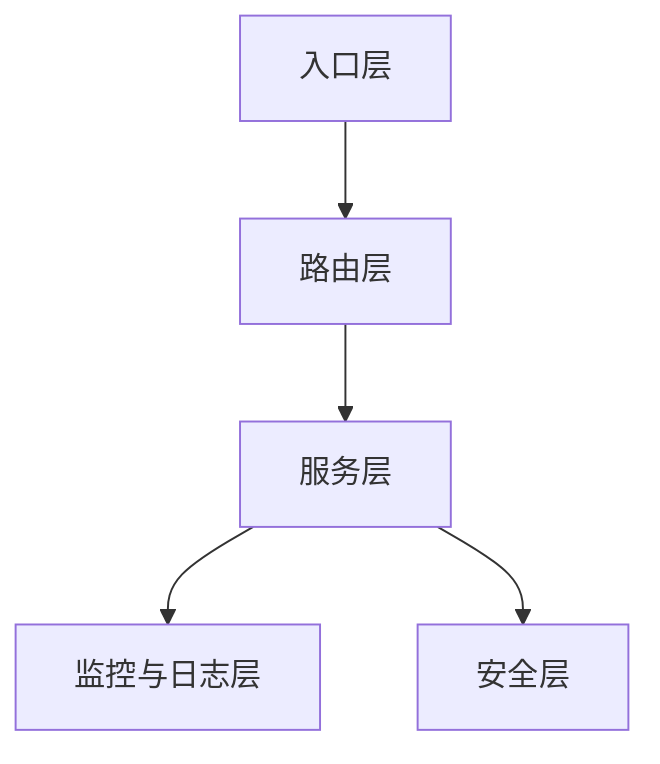

                 

# 构建可靠的API网关系统

> 关键词：API网关、可靠性、架构设计、负载均衡、安全

## 摘要

本文将深入探讨构建可靠API网关系统的关键要素。通过分析API网关的作用、架构设计、核心概念、协议选择、实施最佳实践以及可靠性保障机制，本文旨在为开发者提供一套完整的构建可靠API网关系统的指南。我们将结合具体实例，详细讲解如何实现一个高度可靠、高效、安全的API网关系统。

## 1. 引言

在现代的微服务架构中，API网关扮演着至关重要的角色。它不仅是一个请求路由器，还是一个安全和流量管理的中心。随着服务数量的增加和业务需求的不断变化，API网关系统的可靠性成为衡量系统质量的重要指标。

### 1.1 API网关的重要性

API网关作为微服务架构中的“门面”，承担着以下重要职责：

- **请求路由**：将外部请求路由到内部服务。
- **协议转换**：处理不同服务间的协议差异。
- **负载均衡**：分散请求，避免单点故障。
- **安全认证**：保护系统免受未经授权的访问。
- **监控与日志**：收集服务运行状态，便于故障排查。

### 1.2 API网关管理的挑战

API网关管理面临的挑战主要包括：

- **复杂性**：随着服务数量的增加，网关的配置和管理变得更加复杂。
- **性能**：保证高并发请求下的性能稳定。
- **安全性**：确保系统免受攻击，保护用户数据安全。
- **可维护性**：易于扩展和维护，以适应业务需求的变化。

### 1.3 可靠性的必要性

API网关系统的可靠性直接影响到业务的连续性和用户体验。以下因素决定了API网关的可靠性：

- **高可用性**：系统在故障发生时能够快速恢复。
- **负载均衡**：合理分配流量，避免单点过载。
- **故障转移**：在部分服务不可用时，能够快速切换到备用服务。
- **数据一致性**：确保在分布式环境中数据的一致性。

## 2. 核心概念与架构

### 2.1 API网关的定义与作用

API网关是一个统一的接口，用于处理外部请求，并将其路由到内部的服务。它通常承担以下功能：

- **请求路由**：根据请求的URL，将请求转发到相应的服务。
- **协议转换**：处理不同服务之间的协议差异，如将HTTP请求转换为内部服务使用的协议。
- **负载均衡**：分散请求，提高系统的处理能力。
- **安全认证**：验证请求者的身份，确保只有授权用户可以访问系统。
- **监控与日志**：收集服务运行状态，便于故障排查。

### 2.2 API网关的架构

API网关的架构通常包括以下几个关键组件：

- **入口层**：负责接收外部请求，进行初步处理。
- **路由层**：根据请求的URL或其他标识，将请求转发到相应的服务。
- **服务层**：执行具体的服务操作，返回响应。
- **监控与日志层**：收集服务运行状态，记录日志。
- **安全层**：包括认证、授权等安全措施。

以下是一个简单的API网关架构Mermaid流程图：

### 2.3 核心概念与联系

API网关的核心概念包括：

- **请求处理**：包括请求的接收、解析、路由和响应。
- **负载均衡**：通过不同的算法，将请求分配到不同的服务实例。
- **安全认证**：确保只有授权用户可以访问系统。
- **监控与日志**：收集服务运行状态，记录日志，便于故障排查。

这些概念之间的关系可以简化为以下流程：

1. **请求接收**：外部请求被API网关的入口层接收。
2. **请求解析**：入口层解析请求，提取请求信息。
3. **请求路由**：路由层根据请求信息，将请求转发到相应的服务。
4. **服务处理**：服务层执行具体的业务逻辑，返回响应。
5. **安全认证**：在请求路由前，安全层对请求进行认证和授权。
6. **监控与日志**：监控与日志层记录服务的运行状态和日志信息。

## 3. 可靠性在API网关系统中的重要性

可靠性是API网关系统的核心要求之一。以下是保证API网关可靠性的关键因素：

- **高可用性**：确保系统在故障发生时能够快速恢复，减少业务中断时间。
- **负载均衡**：通过负载均衡算法，合理分配流量，避免单点过载。
- **故障转移**：在部分服务不可用时，能够快速切换到备用服务。
- **数据一致性**：在分布式环境中，确保数据的一致性，避免数据冲突。

### 3.1 高可用性

高可用性是指系统在故障发生时能够快速恢复，确保业务的连续性。为了实现高可用性，API网关系统可以采取以下措施：

- **冗余设计**：通过部署多个网关实例，实现冗余，避免单点故障。
- **故障转移**：在主网关发生故障时，自动切换到备用网关。
- **自动恢复**：在网关实例出现故障时，自动重启或重新部署。

### 3.2 负载均衡

负载均衡是提高API网关性能的关键技术。以下是一些常用的负载均衡算法：

- **轮询算法**：将请求依次分配到不同的服务实例。
- **最小连接数算法**：将请求分配到连接数最少的服务实例。
- **加权轮询算法**：根据服务实例的处理能力，分配不同的请求比例。

### 3.3 故障转移

故障转移是指在部分服务不可用时，能够快速切换到备用服务。实现故障转移的关键在于：

- **服务发现**：及时发现服务实例的故障状态。
- **自动切换**：在检测到故障时，自动切换到备用服务实例。

### 3.4 数据一致性

在分布式环境中，数据一致性是一个挑战。API网关可以通过以下方式确保数据一致性：

- **分布式事务**：通过分布式事务，确保数据的一致性。
- **最终一致性**：在无法保证强一致性的情况下，采用最终一致性模型。

## 4. 核心概念与原则

### 4.1 请求和响应管理

请求和响应管理是API网关的核心功能。以下是请求和响应管理的关键原则：

- **请求解析**：解析请求，提取请求信息和参数。
- **请求路由**：根据请求信息，将请求转发到相应的服务。
- **响应处理**：处理响应，包括数据格式转换、响应码设置等。

### 4.2 负载均衡和流量管理

负载均衡和流量管理是保证API网关性能的关键。以下是负载均衡和流量管理的关键原则：

- **负载均衡算法**：选择合适的负载均衡算法，如轮询算法、最小连接数算法等。
- **流量控制**：通过流量控制，避免系统过载。

### 4.3 安全性

安全性是API网关的重要原则。以下是安全性关键原则：

- **认证与授权**：确保只有授权用户可以访问系统。
- **数据加密**：对敏感数据进行加密，确保数据传输安全。
- **安全策略**：制定安全策略，限制非法访问。

## 5. API网关协议和技术的选择

### 5.1 HTTP/2和HTTP/3

HTTP/2和HTTP/3是新一代的HTTP协议，提供了更好的性能和安全性。以下是它们的关键区别和优势：

- **HTTP/2**：支持多路复用、头部压缩，提高了传输效率。
- **HTTP/3**：基于QUIC协议，提供了更低的延迟、更好的安全性。

### 5.2 REST和GraphQL API

REST和GraphQL是两种不同的API设计风格。以下是它们的设计原则和适用场景：

- **REST API**：基于HTTP协议，采用统一的接口设计，适用于读操作较多的场景。
- **GraphQL API**：基于查询语言，允许客户端自定义查询，适用于读操作和写操作并存的场景。

## 6. 构建可靠API网关系统的步骤

### 6.1 设计原则

构建可靠API网关系统的设计原则包括：

- **高可用性**：设计冗余系统，确保故障时快速恢复。
- **负载均衡**：设计高效的负载均衡机制，避免单点过载。
- **安全性**：设计安全策略，保护系统免受攻击。

### 6.2 实施最佳实践

在实施API网关系统时，应遵循以下最佳实践：

- **模块化设计**：将系统分解为模块，便于维护和扩展。
- **日志记录**：详细记录系统运行状态，便于故障排查。
- **监控告警**：实时监控系统状态，及时发现异常。

### 6.3 可靠性保障机制

可靠性保障机制包括：

- **故障恢复**：设计自动恢复机制，确保故障时系统自动恢复。
- **数据备份**：定期备份数据，确保数据不丢失。

## 7. 实际案例分析

### 7.1 开发环境搭建

搭建API网关系统需要以下开发环境：

- **开发工具**：如IDE、命令行工具等。
- **数据库**：用于存储配置信息。
- **中间件**：如负载均衡器、安全组件等。

### 7.2 源代码实现

API网关系统的源代码实现包括以下几个关键部分：

- **入口层**：负责接收外部请求。
- **路由层**：根据请求信息，将请求转发到相应的服务。
- **服务层**：执行具体的业务逻辑。
- **监控与日志层**：收集服务运行状态，记录日志。

### 7.3 应用解读与分析

通过对API网关系统的实际应用进行解读和分析，可以更好地理解其工作原理和性能优化策略。

### 7.4 项目小结

在项目总结中，应回顾项目目标、实施过程、遇到的挑战以及解决方案，为未来的项目提供借鉴。

## 8. 最佳实践与注意事项

### 8.1 最佳实践

在构建可靠API网关系统时，应遵循以下最佳实践：

- **高可用性设计**：采用冗余设计，确保故障时快速恢复。
- **安全性设计**：设计安全策略，保护系统免受攻击。
- **性能优化**：选择合适的负载均衡算法，优化系统性能。

### 8.2 注意事项

在实施API网关系统时，应注意以下事项：

- **安全性**：确保系统安全，防止数据泄露。
- **可扩展性**：设计可扩展的架构，适应业务需求的变化。
- **维护性**：确保系统易于维护，便于后续优化和升级。

## 9. 拓展阅读

为了更深入地了解API网关系统的设计和实现，读者可以参考以下拓展阅读材料：

- 《API设计指南》
- 《微服务架构设计》
- 《负载均衡算法与实现》
- 《安全编程实践》

## 10. 结语

构建可靠的API网关系统是确保业务连续性和用户体验的关键。通过本文的探讨，我们了解了API网关系统的核心概念、架构设计、可靠性保障机制以及实施最佳实践。希望本文能为您提供宝贵的参考，助力您构建高效、可靠的API网关系统。

### 作者：AI天才研究院/AI Genius Institute & 禅与计算机程序设计艺术 /Zen And The Art of Computer Programming

