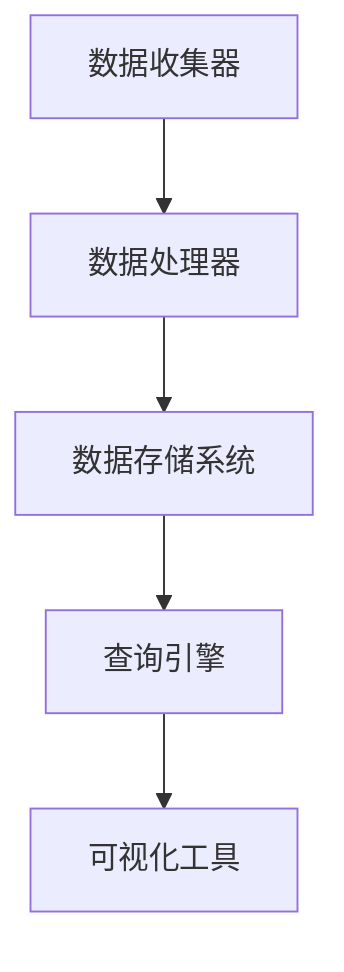
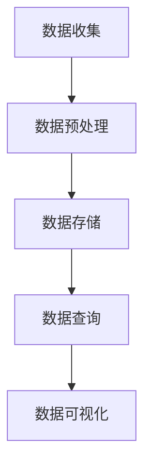
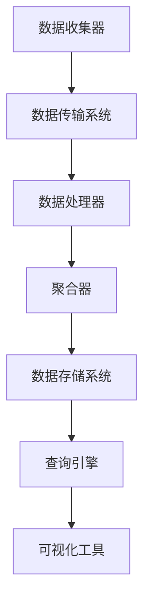
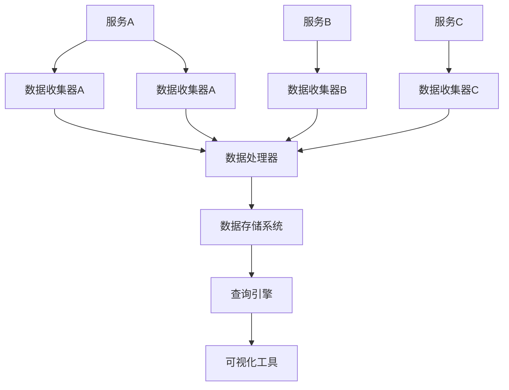
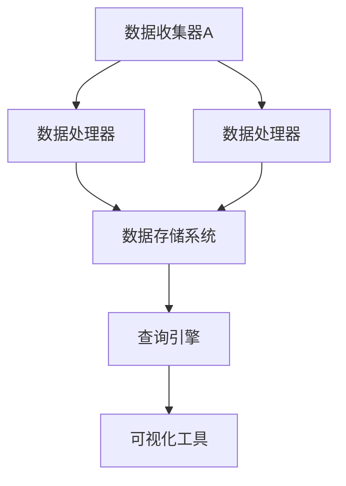

                 

### 文章标题

# 《构建可靠的分布式追踪系统》

分布式追踪系统是现代复杂分布式系统的重要组成部分，它能够帮助开发人员和运维人员全面了解系统的运行状况，快速定位和解决问题。本文将深入探讨如何构建一个可靠的分布式追踪系统，从基础概念到实现步骤，再到高级优化和未来趋势，力求为读者提供一份全面的技术指南。

## 文章关键词

- 分布式追踪系统
- 分布式系统
- 数据收集
- 数据存储
- 性能优化
- 实战案例
- 安全性

## 文章摘要

本文将围绕构建可靠的分布式追踪系统这一主题，详细阐述其定义、重要性、关键组件、工作原理，以及技术基础、实现方法和实战案例。同时，还会探讨分布式追踪系统的高级主题，包括与监控系统的集成、在容器化环境中的应用，以及安全性等方面的内容。最后，将对分布式追踪系统的未来发展趋势进行展望，帮助读者更好地理解和应对这一领域的挑战。

----------------------------------------------------------------

## 第一部分：分布式追踪系统概述

### 1.1 分布式追踪系统的定义和重要性

分布式追踪系统是一种用于监控和分析分布式系统运行状态的工具，它能够实时收集、记录和分析系统内部各个组件的交互和状态变化。在现代复杂的分布式系统中，如微服务架构、云计算和容器化环境，分布式追踪系统的重要性不言而喻。

首先，分布式追踪系统能够帮助开发人员和运维人员快速定位系统中的性能瓶颈和错误。在分布式系统中，多个服务组件相互依赖，一个简单的错误可能会引发连锁反应，导致整个系统的崩溃。分布式追踪系统通过记录每个服务的调用关系和执行时间，使得定位问题变得更加直观和高效。

其次，分布式追踪系统有助于优化系统性能。通过对调用链路和性能指标的分析，开发人员可以找出影响系统性能的瓶颈，并进行针对性的优化。此外，分布式追踪系统还可以帮助运维人员更好地进行系统监控和告警，确保系统的稳定运行。

最后，分布式追踪系统为系统的可观测性提供了强有力的支持。可观测性是分布式系统设计中至关重要的一环，它使得系统能够在运行过程中被实时监控、分析和评估。分布式追踪系统正是实现可观测性的重要手段之一。

### 1.2 分布式系统中的追踪挑战

尽管分布式追踪系统的重要性不容忽视，但在实际应用中，构建一个可靠的分布式追踪系统面临着诸多挑战。

首先是数据量大。在分布式系统中，多个服务组件会产生大量的日志和监控数据，如何有效地收集、存储和处理这些数据，是一个巨大的挑战。分布式追踪系统需要保证数据的完整性和实时性，这对于系统的性能和稳定性提出了更高的要求。

其次是数据多样性。不同类型的分布式系统，其日志格式和监控指标各不相同，如何统一这些数据，使其能够被有效分析和利用，是分布式追踪系统面临的一个难题。

再次是分布式追踪系统的可扩展性。随着系统规模的不断扩大，分布式追踪系统需要能够轻松地扩展其处理能力，以满足日益增长的数据量和业务需求。

最后是安全性。分布式追踪系统涉及到大量的敏感数据，如服务调用链、用户信息等，如何保护这些数据不被未授权访问，是分布式追踪系统需要考虑的一个重要问题。

### 1.3 分布式追踪系统的关键组件

一个完整的分布式追踪系统通常由以下几个关键组件组成：

1. **数据收集器（Collector）**：负责收集各个服务组件的日志和监控数据，并将其传输到数据存储系统。数据收集器通常部署在各个服务组件所在的服务器上，以便于实时收集数据。

2. **数据处理器（Processor）**：对收集到的数据进行预处理，如数据清洗、去重和格式转换等，以便于后续的数据存储和分析。

3. **数据存储系统（Storage）**：负责存储和处理大规模的数据集，支持高效的查询和分析操作。常见的存储系统包括关系型数据库、NoSQL数据库和日志文件等。

4. **查询引擎（Query Engine）**：提供对存储数据的查询和分析功能，支持复杂的查询语句和统计报表，帮助用户快速定位和解决问题。

5. **可视化工具（Visualizer）**：将查询结果以图形化的方式展示，提供直观的可视化界面，帮助用户更好地理解和分析系统运行状况。

### 1.4 分布式追踪系统的工作原理

分布式追踪系统的工作原理可以分为以下几个步骤：

1. **数据收集**：各个服务组件通过数据收集器实时收集日志和监控数据，并将其发送到数据处理器。

2. **数据预处理**：数据处理器对收集到的数据进行预处理，如去重、格式转换和聚合等，以便于后续存储和分析。

3. **数据存储**：预处理后的数据被存储到数据存储系统，以供后续查询和分析。

4. **数据查询**：用户通过查询引擎提交查询请求，查询引擎根据请求对存储数据进行查询和分析，并将结果返回给用户。

5. **数据可视化**：查询结果通过可视化工具以图形化的方式展示，帮助用户更好地理解和分析系统运行状况。

### 1.5 分布式追踪系统的应用场景

分布式追踪系统在以下应用场景中具有广泛的应用：

1. **服务性能监控**：通过实时收集和分析服务调用链和性能指标，帮助开发人员和运维人员快速定位和解决问题。

2. **故障排查**：当系统出现故障时，分布式追踪系统可以帮助用户快速定位故障发生的具体位置和原因。

3. **性能优化**：通过对调用链路和性能指标的分析，找出系统中的瓶颈和性能问题，并进行针对性的优化。

4. **业务分析**：通过对服务调用链和用户行为数据的分析，为业务决策提供有力支持。

5. **安全性监控**：通过对服务调用链和日志数据的监控，及时发现和防范潜在的安全威胁。

## 背景介绍

随着互联网和云计算的快速发展，现代应用系统变得越来越复杂，分布式系统成为构建这些应用系统的主要架构。分布式系统将计算任务分布在多个节点上，以提高系统的性能、可用性和可扩展性。然而，分布式系统的复杂性也带来了许多挑战，如服务调用关系复杂、性能瓶颈难以定位、故障排查困难等。为了应对这些挑战，分布式追踪系统应运而生。

分布式追踪系统的核心目标是提供一种机制，使得开发人员和运维人员能够实时监控、分析和优化分布式系统的运行状态。通过收集和记录系统内部各个组件的交互和状态变化，分布式追踪系统可以帮助用户快速定位和解决问题，提高系统的可观测性和稳定性。

随着分布式系统的规模和复杂性不断增加，分布式追踪系统的重要性日益凸显。它不仅有助于提高系统的性能和可用性，还能为业务分析和安全监控提供有力支持。因此，构建一个可靠的分布式追踪系统成为现代分布式系统设计中的重要任务。

### 核心概念与联系

分布式追踪系统的核心概念包括数据收集器、数据处理器、数据存储系统、查询引擎和可视化工具。这些概念之间存在紧密的联系，共同构成了一个完整的分布式追踪系统架构。

#### 数据收集器（Collector）

数据收集器是分布式追踪系统的入口，它负责从各个服务组件中收集日志和监控数据。数据收集器通常部署在服务组件所在的服务器上，以便于实时收集数据。数据收集器的主要功能包括：

1. **数据采集**：从服务组件中读取日志和监控数据。
2. **数据格式化**：将采集到的数据进行格式化，以便于后续处理。
3. **数据传输**：将格式化后的数据发送到数据处理器。

#### 数据处理器（Processor）

数据处理器负责对收集到的数据进行预处理，以提高数据的质量和可用性。预处理过程包括以下步骤：

1. **数据去重**：去除重复的数据，避免重复处理。
2. **数据格式转换**：将不同格式的数据转换为统一的格式，便于存储和分析。
3. **数据聚合**：对相关数据进行聚合，生成更加直观和易于分析的数据。

#### 数据存储系统（Storage）

数据存储系统是分布式追踪系统的核心组件，负责存储和处理大规模的数据集。常见的存储系统包括关系型数据库、NoSQL数据库和日志文件等。数据存储系统需要具备以下特性：

1. **高可靠性**：确保数据的安全性和持久性，防止数据丢失。
2. **高性能**：支持快速的数据查询和分析操作。
3. **可扩展性**：能够轻松扩展存储容量和处理能力，以应对不断增长的数据量。

#### 查询引擎（Query Engine）

查询引擎提供对存储数据的查询和分析功能，支持复杂的查询语句和统计报表。查询引擎的主要功能包括：

1. **数据查询**：根据用户需求，从数据存储系统中检索相关数据。
2. **数据分析**：对查询结果进行统计分析，生成直观的报表和图表。
3. **数据可视化**：将查询结果以图形化的方式展示，帮助用户更好地理解和分析系统运行状况。

#### 可视化工具（Visualizer）

可视化工具将查询结果以图形化的方式展示，提供直观的可视化界面，帮助用户更好地理解和分析系统运行状况。可视化工具的主要功能包括：

1. **数据展示**：以图表、报表等形式展示查询结果。
2. **交互操作**：支持用户的交互操作，如筛选、过滤和排序等。
3. **动态更新**：实时更新查询结果，以反映系统的最新运行状态。

#### 分布式追踪系统架构图

下面是分布式追踪系统的架构图，展示了各个核心组件之间的关系：



通过这个架构图，我们可以清晰地看到分布式追踪系统中各个组件的职责和相互关系。数据收集器负责收集数据，数据处理器对数据进行预处理，数据存储系统负责存储数据，查询引擎提供查询和分析功能，可视化工具将查询结果以图形化的方式展示。这些组件协同工作，共同构成了一个完整的分布式追踪系统。

### 分布式追踪系统的工作原理

分布式追踪系统的工作原理可以分为以下几个步骤：数据收集、数据预处理、数据存储、数据查询和数据可视化。

#### 数据收集

数据收集是分布式追踪系统的第一步，其核心任务是实时收集分布式系统内部各个服务组件的日志和监控数据。数据收集器（Collector）负责从各个服务组件中采集数据。数据收集器的部署方式有多种，可以是直接嵌入到服务组件中，也可以是独立部署的采集代理。数据收集器的主要功能包括：

1. **日志采集**：从服务组件的日志文件中读取日志条目。
2. **监控数据采集**：从服务组件的监控工具（如Prometheus）中读取监控指标。
3. **异常数据采集**：捕获服务组件的异常和错误信息。

数据收集器在收集数据的同时，会对数据进行格式化，以便于后续处理。格式化的数据通常包括时间戳、服务名称、操作类型、调用时长等关键信息。

#### 数据预处理

数据预处理是分布式追踪系统的关键环节，其目的是提高数据的质量和可用性。数据处理器（Processor）负责对收集到的数据进行预处理。预处理过程包括以下步骤：

1. **数据去重**：去除重复的数据，避免重复处理，保证数据的唯一性。
2. **数据格式转换**：将不同格式的数据进行统一格式转换，例如将JSON格式的日志转换为结构化的数据格式（如CSV或XML）。
3. **数据聚合**：对相关数据进行聚合，生成更加直观和易于分析的数据，例如对相同调用关系的日志进行聚合，生成调用链路数据。

#### 数据存储

预处理后的数据需要存储到数据存储系统（Storage）中，以便于后续查询和分析。数据存储系统可以是关系型数据库、NoSQL数据库或日志文件等。数据存储系统的选择取决于数据量和查询性能的需求。

1. **关系型数据库**：适用于结构化数据存储，支持复杂的查询和关联操作。
2. **NoSQL数据库**：适用于大规模非结构化数据存储，具有高扩展性和高性能。
3. **日志文件**：适用于存储大规模的原始日志数据，便于后续分析和处理。

数据存储系统需要具备以下特性：

1. **高可靠性**：确保数据的安全性和持久性，防止数据丢失。
2. **高性能**：支持快速的数据查询和分析操作。
3. **可扩展性**：能够轻松扩展存储容量和处理能力，以应对不断增长的数据量。

#### 数据查询

数据查询是分布式追踪系统的核心功能，其目的是帮助用户快速定位和解决问题。查询引擎（Query Engine）提供对存储数据的查询和分析功能。查询引擎支持多种查询语句和统计报表，例如：

1. **SQL查询**：用于查询关系型数据库，支持复杂的关联查询和聚合操作。
2. **NoSQL查询**：用于查询NoSQL数据库，支持灵活的查询和索引操作。
3. **日志查询**：用于查询日志文件，支持全文检索和关键字过滤。

查询引擎的主要功能包括：

1. **数据检索**：根据用户需求，从数据存储系统中检索相关数据。
2. **数据分析**：对查询结果进行统计分析，生成直观的报表和图表。
3. **数据可视化**：将查询结果以图形化的方式展示，帮助用户更好地理解和分析系统运行状况。

#### 数据可视化

数据可视化是将查询结果以图形化的方式展示，提供直观的可视化界面，帮助用户更好地理解和分析系统运行状况。可视化工具（Visualizer）通常包括以下功能：

1. **数据展示**：以图表、报表等形式展示查询结果，例如调用链路图、性能趋势图等。
2. **交互操作**：支持用户的交互操作，如筛选、过滤和排序等，帮助用户快速定位问题。
3. **动态更新**：实时更新查询结果，以反映系统的最新运行状态。

通过数据可视化，用户可以直观地了解分布式系统的运行状态，快速定位和解决问题。

#### 分布式追踪系统工作流程图

下面是分布式追踪系统的工作流程图，展示了各个步骤之间的关系：



通过这个工作流程图，我们可以清晰地看到分布式追踪系统的工作原理。数据收集器从各个服务组件中收集数据，数据处理器对数据进行预处理，数据存储系统存储预处理后的数据，查询引擎对存储数据进行查询和分析，可视化工具将查询结果以图形化的方式展示，帮助用户理解和分析系统运行状况。

### 1.5 分布式追踪系统的应用场景

分布式追踪系统在以下应用场景中具有广泛的应用：

1. **服务性能监控**：通过实时收集和分析服务调用链和性能指标，帮助开发人员和运维人员快速定位和解决问题。例如，监控服务响应时间、错误率、系统负载等指标，及时发现性能瓶颈和潜在问题。

2. **故障排查**：当系统出现故障时，分布式追踪系统可以帮助用户快速定位故障发生的具体位置和原因。通过调用链路分析，用户可以了解故障是如何传播的，以及受影响的组件有哪些。

3. **性能优化**：通过对调用链路和性能指标的分析，找出系统中的瓶颈和性能问题，并进行针对性的优化。例如，优化数据库查询、网络传输、服务调用等，以提高系统整体性能。

4. **业务分析**：通过对服务调用链和用户行为数据的分析，为业务决策提供有力支持。例如，分析用户访问路径、热点页面、业务流程等，帮助业务人员更好地了解用户需求，优化业务流程。

5. **安全性监控**：通过对服务调用链和日志数据的监控，及时发现和防范潜在的安全威胁。例如，监控恶意攻击、异常访问、数据泄露等，确保系统的安全稳定运行。

总之，分布式追踪系统为现代分布式系统提供了强大的监控和分析能力，有助于提高系统的性能、可用性和安全性。在实际应用中，根据具体需求和场景，分布式追踪系统可以发挥出巨大的价值。

----------------------------------------------------------------

## 第二部分：分布式追踪技术基础

### 2.1 分布式追踪系统架构设计

分布式追踪系统的架构设计是构建一个可靠、高效、可扩展的系统的基础。一个典型的分布式追踪系统架构通常包括数据收集与传输、数据存储与查询、数据处理与聚合等关键组件。下面将详细讨论这些组件的设计和实现。

#### 数据收集与传输

数据收集与传输是分布式追踪系统的第一步，其目的是从各个服务组件中实时收集日志和监控数据，并将其传输到数据处理系统。数据收集器（Collector）和数据传输系统（Data Transport）是实现这一目标的关键组件。

1. **数据收集器设计**：
   - **部署方式**：数据收集器可以以独立代理的形式部署在每个服务组件所在的服务器上，或者以嵌入式方式集成到服务组件中。独立代理部署方式便于集中管理和维护，而嵌入式部署方式则可以更好地融入服务组件，降低系统开销。
   - **数据采集**：数据收集器需要从服务组件的日志文件、监控工具（如Prometheus）和异常处理系统（如ELK Stack）中收集数据。为了提高数据采集的效率，数据收集器应支持批量数据采集和异步处理。
   - **数据格式**：为了便于后续处理，数据收集器应将采集到的数据进行格式化，通常采用JSON、Protobuf等结构化数据格式。

2. **数据传输系统设计**：
   - **传输协议**：数据传输系统应采用可靠、高效的传输协议，如HTTP、gRPC或Apache Kafka等。其中，HTTP和gRPC适用于点对点传输，而Apache Kafka适用于大规模分布式系统中的数据流传输。
   - **数据传输方式**：数据传输系统可以采用同步传输和异步传输两种方式。同步传输方式能够保证数据的及时传输，但可能会增加系统的开销；异步传输方式则可以提高系统的吞吐量，但可能会导致数据延迟。
   - **数据校验**：为了确保传输数据的完整性，数据传输系统应支持数据校验和错误纠正机制。例如，可以使用校验和（checksum）或哈希（hash）算法来验证数据的完整性。

#### 数据存储与查询

数据存储与查询是分布式追踪系统的核心，其目的是存储和处理大规模的数据集，并提供高效的查询和分析功能。数据存储系统（Data Storage）和查询引擎（Query Engine）是实现这一目标的关键组件。

1. **数据存储系统设计**：
   - **存储类型**：根据数据类型和查询需求，数据存储系统可以选择关系型数据库、NoSQL数据库或日志文件等。关系型数据库适用于结构化数据存储，支持复杂的查询和关联操作；NoSQL数据库适用于大规模非结构化数据存储，具有高扩展性和高性能；日志文件适用于存储原始日志数据，便于后续分析和处理。
   - **存储策略**：为了提高存储系统的性能和可扩展性，可以采用分布式存储策略。例如，使用分布式文件系统（如HDFS）或分布式数据库（如Cassandra）来存储数据。
   - **数据分区**：对于大规模数据集，数据分区可以提高查询性能和系统可扩展性。数据分区可以根据时间、服务名称或调用链ID等维度进行。

2. **查询引擎设计**：
   - **查询语言**：查询引擎应支持灵活的查询语言，如SQL或NoSQL查询语言。SQL适用于关系型数据库，支持复杂的关联查询和聚合操作；NoSQL查询语言适用于非结构化数据存储，支持灵活的查询和索引操作。
   - **查询优化**：为了提高查询性能，查询引擎应支持查询优化技术，如索引、缓存和分片等。索引可以加速查询操作，缓存可以减少数据访问延迟，分片可以将查询负载分布到多个节点上。
   - **实时查询**：对于需要实时反馈的查询需求，查询引擎应支持实时查询功能。实时查询可以通过实时流处理技术（如Apache Flink或Apache Storm）来实现，以实现对数据流的高效处理和实时反馈。

#### 数据处理与聚合

数据处理与聚合是分布式追踪系统的关键环节，其目的是对收集到的数据进行处理和聚合，生成有用的信息和指标。数据处理器（Processor）和聚合器（Aggregator）是实现这一目标的关键组件。

1. **数据处理器设计**：
   - **数据清洗**：数据处理器应对收集到的数据进行清洗，去除重复、错误和无关的数据，以提高数据的质量和可用性。
   - **数据转换**：数据处理器应对数据进行格式转换，将不同格式的数据转换为统一的格式，以便于存储和分析。
   - **数据聚合**：数据处理器应对相关数据进行聚合，生成更加直观和易于分析的数据，例如对相同调用关系的日志进行聚合，生成调用链路数据。

2. **聚合器设计**：
   - **聚合算法**：聚合器应支持多种聚合算法，如求和、平均、最大值、最小值等，用于计算数据聚合结果。
   - **聚合维度**：聚合器应根据业务需求，对数据按照不同的维度进行聚合，例如按照时间、服务名称、调用链ID等进行聚合。
   - **聚合结果存储**：聚合器应将聚合结果存储到数据存储系统中，以便于后续查询和分析。

#### 分布式追踪系统架构图

下面是分布式追踪系统架构图，展示了各个关键组件之间的关系：



通过这个架构图，我们可以清晰地看到分布式追踪系统中各个组件的职责和相互关系。数据收集器从各个服务组件中收集数据，数据传输系统将数据传输到数据处理器，数据处理器对数据进行处理和聚合，聚合器将数据聚合后存储到数据存储系统中，查询引擎从数据存储系统中查询数据，可视化工具将查询结果以图形化的方式展示。

### 2.2 数据结构选择

在分布式追踪系统中，数据结构的选择至关重要，它直接影响到系统的性能、可扩展性和易用性。以下是几种常见的数据结构及其适用场景：

#### 日志数据格式

日志数据格式是分布式追踪系统中最为基础的数据结构，它记录了系统运行过程中的各种事件和状态变化。常见的日志数据格式包括JSON、XML和Protobuf等。

1. **JSON格式**：
   - **优点**：易读、易编写，支持灵活的数据结构，适用于结构化数据。
   - **缺点**：数据大小较大，解析速度较慢。
   - **适用场景**：适用于小规模、结构化的日志数据，如服务调用日志、监控数据等。

2. **XML格式**：
   - **优点**：具有良好的可扩展性，支持复杂的数据结构。
   - **缺点**：数据大小较大，解析速度较慢，易读性较差。
   - **适用场景**：适用于需要高度可扩展性和复杂数据结构的日志数据，如配置文件、XML RPC调用等。

3. **Protobuf格式**：
   - **优点**：数据大小较小，解析速度快，支持自动生成代码。
   - **缺点**：不易读，需要使用Protobuf工具进行数据序列化和反序列化。
   - **适用场景**：适用于大规模、高吞吐量的日志数据，如分布式追踪系统的数据传输。

#### 聚合数据结构

聚合数据结构用于对分布式追踪系统中的日志数据进行聚合，生成更具有分析价值的数据。常见的聚合数据结构包括时间序列数据、调用链数据等。

1. **时间序列数据**：
   - **优点**：支持高效的数据查询和统计分析，适用于处理时间相关的数据。
   - **缺点**：存储和查询复杂度较高，不适用于大规模的非时间序列数据。
   - **适用场景**：适用于处理与时间相关的数据，如系统性能指标、日志数据等。

2. **调用链数据**：
   - **优点**：能够清晰地展示系统内部的调用关系，适用于故障排查和性能优化。
   - **缺点**：存储和查询复杂度较高，需要支持关联查询和聚合操作。
   - **适用场景**：适用于分布式系统中的调用链分析，如服务调用链、事务链等。

#### 存储数据结构

存储数据结构是分布式追踪系统中的核心组件，它决定了系统的性能、可扩展性和易用性。常见的存储数据结构包括关系型数据库、NoSQL数据库和日志文件等。

1. **关系型数据库**：
   - **优点**：支持复杂的数据查询和关联操作，具有良好的数据一致性。
   - **缺点**：扩展性较差，适用于小规模的数据存储。
   - **适用场景**：适用于需要复杂查询和数据关联的场景，如用户行为分析、业务数据存储等。

2. **NoSQL数据库**：
   - **优点**：支持高扩展性和高性能，适用于大规模非结构化数据存储。
   - **缺点**：数据一致性较弱，适用于高并发的场景。
   - **适用场景**：适用于需要高扩展性和高性能的场景，如分布式追踪系统的数据存储、日志存储等。

3. **日志文件**：
   - **优点**：存储简单，易于扩展，适用于大规模日志数据的存储。
   - **缺点**：查询效率较低，不适用于复杂的数据查询和统计分析。
   - **适用场景**：适用于需要大规模日志数据存储和简单查询的场景，如日志文件存储、实时日志收集等。

#### 选择数据结构的考虑因素

在选择数据结构时，需要综合考虑以下几个方面：

- **数据类型和规模**：根据数据类型和规模选择合适的数据结构，如结构化数据适合使用关系型数据库，非结构化数据适合使用NoSQL数据库。
- **查询需求**：根据查询需求选择合适的数据结构，如需要复杂查询和数据关联的场景适合使用关系型数据库，需要高效数据查询的场景适合使用NoSQL数据库。
- **性能和扩展性**：根据性能和扩展性需求选择合适的数据结构，如需要高性能和高扩展性的场景适合使用NoSQL数据库，需要高效数据查询的场景适合使用日志文件。
- **系统架构和业务需求**：根据系统架构和业务需求选择合适的数据结构，如分布式追踪系统适合使用NoSQL数据库，业务数据存储适合使用关系型数据库。

通过综合考虑以上因素，可以选出最适合的分布式追踪系统数据结构，以提高系统的性能、可扩展性和易用性。

#### 分布式追踪系统的性能优化

分布式追踪系统在处理大规模分布式系统时，性能优化成为关键因素。以下是几种常见的性能优化策略：

1. **数据流式处理**：
   - **实时处理**：采用实时数据处理框架（如Apache Kafka、Apache Flink）对数据进行实时处理，提高数据处理速度和实时性。
   - **批量处理**：对于不常变化的数据，采用批量处理方式，降低系统开销。

2. **数据压缩**：
   - **传输压缩**：对传输的数据进行压缩（如使用gzip、zlib等），减少数据传输量，提高传输效率。
   - **存储压缩**：对存储的数据进行压缩，降低存储空间占用，提高存储效率。

3. **数据缓存**：
   - **内存缓存**：使用内存缓存（如Redis、Memcached）对高频访问的数据进行缓存，降低数据访问延迟，提高查询性能。
   - **分布式缓存**：使用分布式缓存系统（如Consul、Zookeeper）对全局数据进行缓存，提高系统可扩展性和性能。

4. **查询优化**：
   - **索引优化**：对数据库中的表进行索引优化，提高查询效率。
   - **分片策略**：采用合理的分片策略（如按时间、服务名称等分片），提高查询性能和系统可扩展性。

5. **负载均衡**：
   - **数据分区**：将数据按不同维度进行分区，实现负载均衡，提高系统性能和可扩展性。
   - **请求均衡**：采用负载均衡算法（如轮询、随机、最小连接数等）对请求进行均衡分发，避免单点瓶颈。

6. **分布式架构**：
   - **服务拆分**：将大规模系统拆分成多个微服务，实现分布式架构，提高系统的可扩展性和性能。
   - **分布式存储**：采用分布式存储系统（如HDFS、Cassandra），提高数据存储和查询性能。

通过以上性能优化策略，可以显著提高分布式追踪系统的性能、可扩展性和稳定性，为大规模分布式系统提供强大的监控和分析能力。

----------------------------------------------------------------

## 第二部分：分布式追踪技术基础（续）

### 2.3 分布式追踪系统的性能优化

在分布式追踪系统中，性能优化是确保系统高效运行的关键。性能瓶颈可能会影响数据收集、数据存储、数据查询等各个环节，进而影响系统的整体性能。以下是几种常见的性能优化策略：

#### 数据收集性能优化

1. **批量收集**：批量收集数据可以减少网络传输的开销，提高数据收集的效率。通过将多个数据点合并为一个批量请求发送，可以减少请求次数和传输时间。
   
2. **压缩数据**：对数据进行压缩可以减少数据传输量，从而降低网络带宽压力。常用的数据压缩算法有gzip和snappy。

3. **异步收集**：采用异步方式收集数据，可以减少服务组件的等待时间，提高系统的吞吐量。异步收集可以通过消息队列（如Kafka）实现，将收集到的数据异步发送到数据处理系统。

4. **限流**：对数据收集速率进行限制，防止过多的数据涌入系统导致性能下降。限流可以通过令牌桶算法或漏桶算法实现。

#### 数据存储性能优化

1. **数据分区**：对存储的数据进行分区，可以减少单点查询压力，提高查询性能。分区可以根据时间戳、服务名称或其他相关字段进行。

2. **索引优化**：为常用的查询字段创建索引，可以提高查询效率。索引的选择和优化需要根据实际查询需求进行。

3. **数据压缩**：在存储数据时进行压缩，可以减少存储空间占用，提高存储系统性能。常用的数据压缩算法有LZ4、ZSTD等。

4. **批量写入**：通过批量写入数据，可以减少写入操作的次数，提高数据写入性能。批量写入可以通过批量插入或批量更新实现。

#### 数据查询性能优化

1. **缓存**：使用缓存（如Redis、Memcached）存储常用查询结果，可以减少数据库查询次数，提高查询响应速度。

2. **查询优化**：对查询语句进行优化，减少查询的复杂度。例如，避免使用子查询，减少使用JOIN操作等。

3. **分片查询**：对于大规模数据集，可以通过分片查询将查询负载分散到多个节点上，提高查询性能。

4. **预聚合**：对常用指标进行预聚合，减少查询时的计算量。例如，对时间窗口内的数据预聚合，以减少实时查询的复杂度。

#### 全局性能优化策略

1. **分布式架构**：采用分布式架构（如微服务、容器化）可以提高系统的可扩展性和性能。分布式架构可以将系统拆分成多个独立的组件，每个组件都可以独立扩展和部署。

2. **负载均衡**：使用负载均衡器（如Nginx、HAProxy）对请求进行负载均衡，可以避免单点瓶颈，提高系统的整体性能。

3. **服务优化**：优化服务组件的性能，如减少不必要的计算、优化数据库查询等，可以降低系统的整体开销。

4. **监控和告警**：通过监控系统性能指标（如CPU使用率、内存使用率、网络延迟等），可以及时发现性能瓶颈和异常情况，并采取相应的优化措施。

通过以上性能优化策略，可以显著提高分布式追踪系统的性能，确保系统高效、稳定地运行。

----------------------------------------------------------------

## 第三部分：分布式追踪系统实现

### 3.1 分布式追踪系统构建步骤

构建一个可靠的分布式追踪系统需要经过以下几个关键步骤：需求分析、系统设计、系统开发、系统测试与部署。以下是每个步骤的详细说明。

#### 3.1.1 需求分析

在构建分布式追踪系统之前，首先需要进行需求分析，明确系统的目标和功能需求。需求分析主要包括以下几个方面：

1. **业务需求**：了解业务场景和业务需求，确定分布式追踪系统的核心功能，如日志收集、数据存储、数据查询和可视化等。
2. **性能需求**：根据业务需求，确定系统的性能指标，如数据采集速率、存储容量、查询响应时间等。
3. **可扩展性需求**：考虑系统的未来扩展需求，确保系统能够随着业务规模的扩大而灵活扩展。
4. **安全性需求**：分析系统的安全性需求，确保敏感数据的安全存储和传输。

#### 3.1.2 系统设计

系统设计是根据需求分析的结果，对分布式追踪系统进行整体架构设计和详细设计。系统设计主要包括以下几个方面：

1. **架构设计**：确定分布式追踪系统的整体架构，包括数据收集、数据存储、数据处理、数据查询和可视化等关键组件。
2. **技术选型**：选择合适的技术栈，如数据收集器、数据处理器、数据存储系统、查询引擎和可视化工具等。
3. **接口设计**：设计系统内部和外部的接口，确保各个组件之间的数据传输和功能调用。
4. **安全性设计**：设计系统的安全性策略，包括数据加密、访问控制、身份验证等。

#### 3.1.3 系统开发

系统开发是根据系统设计文档，逐步实现分布式追踪系统的各个组件。系统开发主要包括以下几个阶段：

1. **模块开发**：按照模块化的原则，逐一开发分布式追踪系统的各个模块，如数据收集器、数据处理器、数据存储系统、查询引擎和可视化工具等。
2. **集成测试**：将各个模块集成到一起，进行功能测试和性能测试，确保系统整体功能的正确性和性能。
3. **调试与优化**：在集成测试中发现并修复问题，对系统进行性能优化，提高系统的稳定性和可靠性。

#### 3.1.4 系统测试与部署

系统测试与部署是确保分布式追踪系统稳定运行的重要环节。以下是系统测试与部署的详细步骤：

1. **单元测试**：对各个模块进行单元测试，确保每个模块的功能正确性和代码质量。
2. **集成测试**：将各个模块集成到一起，进行集成测试，确保系统整体功能的正确性和性能。
3. **性能测试**：对系统进行性能测试，评估系统的响应时间、吞吐量、并发处理能力等性能指标。
4. **部署与运维**：将分布式追踪系统部署到生产环境，进行日常运维和管理，确保系统的稳定运行。

#### 3.1.5 需求分析与系统设计伪代码示例

以下是需求分析和系统设计的伪代码示例，展示了如何逐步分析需求和设计系统：

```python
# 需求分析伪代码
def analyze_requirements():
    business_requirements = get_business_requirements()
    performance_requirements = get_performance_requirements()
    scalability_requirements = get_scalability_requirements()
    security_requirements = get_security_requirements()
    return business_requirements, performance_requirements, scalability_requirements, security_requirements

# 系统设计伪代码
def design_system(requirements):
    architecture = design_architecture()
    technology_selection = select_technologies()
    interface_design = design_interfaces()
    security_design = design_security()
    return architecture, technology_selection, interface_design, security_design

# 架构设计伪代码
def design_architecture():
    components = ["Collector", "Processor", "Storage", "Query Engine", "Visualizer"]
    data_flow = ["Data Collection", "Data Processing", "Data Storage", "Data Query", "Data Visualization"]
    return components, data_flow

# 技术选型伪代码
def select_technologies():
    data_collector = "Logstash"
    data_processor = "Kafka Streams"
    data_storage = "Elasticsearch"
    query_engine = "Elasticsearch Query DSL"
    visualizer = "Kibana"
    return data_collector, data_processor, data_storage, query_engine, visualizer
```

通过以上伪代码示例，我们可以清晰地看到需求分析和系统设计的步骤和流程，为后续的系统开发提供了明确的指导。

### 3.2 数据收集器实现

数据收集器是分布式追踪系统的关键组件，负责从各个服务组件中收集日志和监控数据。以下是数据收集器的实现步骤和关键点：

#### 3.2.1 数据收集器架构设计

数据收集器架构设计主要包括以下几个方面：

1. **部署方式**：数据收集器可以以独立代理的形式部署在每个服务组件所在的服务器上，或者以嵌入式方式集成到服务组件中。独立代理部署方式便于集中管理和维护，而嵌入式部署方式则可以更好地融入服务组件，降低系统开销。
2. **数据采集**：数据收集器需要从服务组件的日志文件、监控工具（如Prometheus）和异常处理系统（如ELK Stack）中收集数据。为了提高数据采集的效率，数据收集器应支持批量数据采集和异步处理。
3. **数据格式化**：数据收集器应将采集到的数据进行格式化，以便于后续处理。通常采用JSON、Protobuf等结构化数据格式。

#### 3.2.2 数据收集器实现伪代码

以下是数据收集器的实现伪代码，展示了如何从服务组件中采集日志数据并将其格式化为JSON格式：

```python
# 数据收集器伪代码

import os
import json

def collect_logs(service_name):
    log_files = get_log_files(service_name)  # 获取服务组件的日志文件
    collected_data = []

    for log_file in log_files:
        with open(log_file, 'r') as f:
            for line in f:
                log_entry = parse_log_line(line)  # 解析日志行
                formatted_log_entry = format_log_entry(log_entry)  # 格式化日志条目
                collected_data.append(formatted_log_entry)

    return collected_data

def parse_log_line(line):
    # 解析日志行，提取相关信息
    log_entry = {
        'timestamp': extract_timestamp(line),
        'service': extract_service(line),
        'operation': extract_operation(line),
        'duration': extract_duration(line),
        'error': extract_error(line)
    }
    return log_entry

def format_log_entry(log_entry):
    # 格式化日志条目为JSON格式
    json_entry = json.dumps(log_entry)
    return json_entry

# 示例：获取服务组件的日志文件
def get_log_files(service_name):
    log_files = []
    log_directory = "/var/log/{}".format(service_name)
    for root, dirs, files in os.walk(log_directory):
        for file in files:
            if file.endswith('.log'):
                log_files.append(os.path.join(root, file))
    return log_files
```

通过以上伪代码示例，我们可以看到数据收集器的主要实现步骤，包括从服务组件中采集日志数据、解析日志行、格式化日志条目，并将其转换为JSON格式。数据收集器需要根据具体的服务组件和日志格式进行定制化实现。

### 3.2.3 数据收集器性能优化

为了提高数据收集器的性能，可以采取以下优化策略：

1. **批量采集**：通过批量采集数据，可以减少系统调用的次数，提高数据采集的效率。批量采集可以通过设置合理的批量大小和采集间隔来实现。

2. **异步处理**：采用异步处理方式，可以减少服务组件的等待时间，提高系统的吞吐量。异步处理可以通过消息队列（如Kafka）实现，将收集到的数据异步发送到数据处理系统。

3. **数据压缩**：对采集到的数据进行压缩，可以减少数据传输量，从而降低网络带宽压力。常用的数据压缩算法有gzip和snappy。

4. **限流**：对数据收集速率进行限制，防止过多的数据涌入系统导致性能下降。限流可以通过令牌桶算法或漏桶算法实现。

5. **缓存**：使用缓存（如Redis）存储常用日志条目，可以减少对日志文件的读取次数，提高数据采集速度。

通过以上性能优化策略，可以显著提高数据收集器的性能，确保分布式追踪系统能够高效、稳定地运行。

### 3.3 数据存储与查询实现

数据存储与查询是分布式追踪系统的核心功能，其目的是存储和处理大规模的数据集，并提供高效的查询和分析功能。以下是数据存储与查询的实现步骤和关键点：

#### 3.3.1 数据存储架构设计

数据存储架构设计主要包括以下几个方面：

1. **存储类型选择**：根据数据类型和查询需求，选择合适的存储类型。常见的存储类型包括关系型数据库、NoSQL数据库和日志文件等。关系型数据库适用于结构化数据存储，支持复杂的查询和关联操作；NoSQL数据库适用于大规模非结构化数据存储，具有高扩展性和高性能；日志文件适用于存储原始日志数据，便于后续分析和处理。

2. **数据分区**：对于大规模数据集，数据分区可以提高查询性能和系统可扩展性。数据分区可以根据时间戳、服务名称或其他相关字段进行。

3. **数据复制和备份**：为了提高数据可靠性和可用性，需要对数据进行复制和备份。数据复制可以在多个节点上存储相同的数据副本，确保数据不丢失；数据备份可以定期将数据备份到远程存储系统，以防止数据损坏或丢失。

4. **存储优化**：采用合适的存储优化策略，如索引优化、数据压缩、缓存等，可以提高存储系统的性能和容量利用率。

#### 3.3.2 数据存储实现伪代码

以下是数据存储的实现伪代码，展示了如何将数据存储到Elasticsearch数据库中：

```python
# 数据存储伪代码

from elasticsearch import Elasticsearch

def store_data(data):
    es = Elasticsearch()  # 创建Elasticsearch客户端
    index_name = "trace_logs"  # 索引名称

    # 将数据存储到Elasticsearch索引中
    for log_entry in data:
        document = {
            "timestamp": log_entry['timestamp'],
            "service": log_entry['service'],
            "operation": log_entry['operation'],
            "duration": log_entry['duration'],
            "error": log_entry.get('error')
        }
        es.index(index=index_name, id=log_entry['id'], document=document)

# 示例：将日志条目存储到Elasticsearch
def store_logs(logs):
    stored_logs = []
    for log_entry in logs:
        stored_log = store_data(log_entry)
        stored_logs.append(stored_log)
    return stored_logs
```

通过以上伪代码示例，我们可以看到数据存储的基本实现步骤，包括创建Elasticsearch客户端、将数据存储到Elasticsearch索引中，并返回存储结果。数据存储的实现需要根据具体的数据格式和存储需求进行定制化实现。

#### 3.3.3 数据查询算法

数据查询算法是分布式追踪系统的核心功能之一，其目的是帮助用户快速定位和查询所需的数据。以下是数据查询算法的实现步骤和关键点：

1. **查询语言支持**：选择合适的查询语言，如Elasticsearch的Query DSL，支持复杂的查询操作。Query DSL提供了丰富的查询条件，如关键词查询、范围查询、布尔查询等。

2. **查询优化**：对查询语句进行优化，提高查询性能。查询优化的方法包括索引优化、查询缓存、查询重写等。

3. **分页查询**：实现分页查询功能，支持大结果集的查询。分页查询可以通过设置页码和页面大小来实现。

4. **聚合查询**：支持聚合查询，用于计算数据摘要和统计信息。聚合查询可以通过聚合函数（如sum、avg、max、min等）和分组字段实现。

#### 3.3.4 数据查询实现伪代码

以下是数据查询的实现伪代码，展示了如何使用Elasticsearch的Query DSL进行数据查询：

```python
# 数据查询伪代码

from elasticsearch import Elasticsearch

def query_data(index_name, query_params):
    es = Elasticsearch()  # 创建Elasticsearch客户端
    response = es.search(index=index_name, body=query_params)  # 执行查询
    return response['hits']['hits']  # 返回查询结果

# 示例：执行关键字查询
def keyword_query(index_name, keyword):
    query_params = {
        "query": {
            "match": {
                "operation": keyword
            }
        },
        "from": 0,  # 页码
        "size": 10  # 页面大小
    }
    results = query_data(index_name, query_params)
    return results

# 示例：执行范围查询
def range_query(index_name, start_date, end_date):
    query_params = {
        "query": {
            "range": {
                "timestamp": {
                    "gte": start_date,
                    "lte": end_date
                }
            }
        },
        "from": 0,
        "size": 10
    }
    results = query_data(index_name, query_params)
    return results
```

通过以上伪代码示例，我们可以看到数据查询的基本实现步骤，包括创建Elasticsearch客户端、设置查询参数、执行查询并返回查询结果。数据查询的实现需要根据具体的查询需求和查询语言进行定制化实现。

#### 3.3.5 数据存储性能优化

为了提高数据存储性能，可以采取以下优化策略：

1. **索引优化**：为常用的查询字段创建索引，提高查询效率。索引的选择和优化需要根据实际查询需求进行。

2. **数据压缩**：在存储数据时进行压缩，可以减少存储空间占用，提高存储系统性能。常用的数据压缩算法有LZ4、ZSTD等。

3. **批量写入**：通过批量写入数据，可以减少写入操作的次数，提高数据写入性能。批量写入可以通过批量插入或批量更新实现。

4. **缓存**：使用缓存（如Redis）存储常用查询结果，可以减少数据库查询次数，提高查询性能。

5. **分片和复制**：采用分片和复制策略，将数据分散存储在多个节点上，提高数据存储和查询性能。分片可以根据时间戳、服务名称或其他相关字段进行。

通过以上性能优化策略，可以显著提高数据存储系统的性能和可靠性，确保分布式追踪系统能够高效、稳定地运行。

### 3.4 分布式追踪系统测试与部署

#### 3.4.1 单元测试

单元测试是确保分布式追踪系统各个模块功能正确性的关键步骤。以下是单元测试的步骤和关键点：

1. **测试用例设计**：根据每个模块的功能需求，设计相应的测试用例，包括正常情况和异常情况。
2. **测试环境搭建**：搭建测试环境，包括开发环境、测试环境和生产环境，确保测试过程与实际生产环境一致。
3. **自动化测试**：使用自动化测试工具（如JUnit、pytest）编写测试脚本，对各个模块进行自动化测试，提高测试效率。
4. **测试覆盖度**：确保测试用例覆盖率达到100%，尽可能覆盖所有功能和异常情况。

#### 3.4.2 集成测试

集成测试是确保分布式追踪系统各个模块之间协同工作的关键步骤。以下是集成测试的步骤和关键点：

1. **集成测试环境搭建**：搭建集成测试环境，包括开发环境、测试环境和生产环境，确保测试过程与实际生产环境一致。
2. **测试用例设计**：设计集成测试用例，覆盖系统的主要功能流程，包括数据收集、数据存储、数据查询和可视化等。
3. **自动化测试**：使用自动化测试工具（如Selenium、Jenkins）进行集成测试，确保测试过程高效、稳定。
4. **性能测试**：对系统进行性能测试，评估系统的响应时间、吞吐量、并发处理能力等性能指标，确保系统在高负载下稳定运行。

#### 3.4.3 部署与运维

部署与运维是确保分布式追踪系统稳定运行的关键环节。以下是部署与运维的步骤和关键点：

1. **部署策略**：选择合适的部署策略，如蓝绿部署、灰度部署等，确保系统部署过程平稳、安全。
2. **自动化部署**：使用自动化部署工具（如Docker、Kubernetes）进行系统部署，提高部署效率、减少人为错误。
3. **监控与告警**：搭建监控系统，实时监控系统的运行状态，如CPU使用率、内存使用率、网络延迟等，并及时发出告警通知。
4. **运维管理**：建立运维管理机制，包括日志管理、故障处理、备份与恢复等，确保系统的稳定运行。

### 3.4.4 实际案例

以下是一个分布式追踪系统部署与运维的实际案例：

**案例背景**：某互联网公司需要为其大型分布式系统构建一个可靠的分布式追踪系统，以监控和优化系统的性能和稳定性。

**部署过程**：

1. **需求分析**：分析业务需求，确定分布式追踪系统的功能需求和性能指标。
2. **系统设计**：设计分布式追踪系统的整体架构，选择合适的技术栈和存储方案。
3. **开发与测试**：开发分布式追踪系统的各个模块，进行单元测试和集成测试，确保功能正确性和性能。
4. **自动化部署**：使用Docker和Kubernetes进行自动化部署，确保部署过程高效、稳定。
5. **监控与告警**：搭建监控系统，实时监控系统的运行状态，并通过告警系统及时通知运维人员。

**运维管理**：

1. **日志管理**：定期清理日志文件，防止日志文件占用过多存储空间。
2. **故障处理**：建立故障处理流程，及时响应和处理系统故障，确保系统稳定运行。
3. **备份与恢复**：定期备份数据，确保数据安全；在发生数据丢失或系统故障时，能够快速恢复数据。
4. **性能优化**：定期进行系统性能测试和优化，提高系统的性能和稳定性。

### 3.4.5 总结

通过以上实际案例，我们可以看到分布式追踪系统的部署与运维是一个复杂但重要的过程。通过合理的部署策略、自动化部署工具、监控系统以及运维管理机制，可以确保分布式追踪系统高效、稳定地运行，为企业的分布式系统提供强大的监控和分析能力。

#### 项目实战：构建一个简单的分布式追踪系统

在本节中，我们将通过一个实际项目来构建一个简单的分布式追踪系统。这个项目将涵盖从需求分析、系统设计到实现和测试的整个开发流程。

### 4.1.1 实战目标

本项目的目标是构建一个简单的分布式追踪系统，以监控一个典型的分布式应用。具体目标包括：

1. 收集分布式应用中各个服务组件的日志和性能指标。
2. 将收集到的数据进行格式化、存储和查询。
3. 提供一个简单的可视化界面，展示系统的运行状况。

### 4.1.2 系统设计

根据项目目标，我们将设计一个简单的分布式追踪系统，包括以下几个关键组件：

1. **数据收集器**：部署在每个服务组件所在的服务器上，用于收集日志和性能指标。
2. **数据处理器**：将收集到的数据进行格式化，以便存储和分析。
3. **数据存储系统**：存储格式化后的数据，支持高效的查询和分析。
4. **查询引擎**：提供对存储数据的查询功能。
5. **可视化工具**：以图形化的方式展示查询结果。

#### 系统架构图

下面是分布式追踪系统的架构图，展示了各个组件之间的关系：



### 4.1.3 实现步骤

#### 1. 数据收集器

数据收集器将部署在每个服务组件所在的服务器上。以下是数据收集器的实现步骤：

1. **部署数据收集器**：在服务组件所在的服务器上部署数据收集器，可以选择使用独立代理或嵌入式方式。
2. **数据采集**：使用Log4j等日志框架，将服务组件的日志输出到日志文件中。同时，使用Prometheus等监控工具收集服务性能指标。
3. **数据格式化**：将采集到的日志和性能指标格式化为JSON格式，以便后续处理。

#### 2. 数据处理器

数据处理器将负责对收集到的数据进行格式化，以下是数据处理器的实现步骤：

1. **部署数据处理器**：在数据处理服务器上部署数据处理器，可以选择使用独立服务器或容器化部署。
2. **数据清洗**：读取收集器发送的数据，去除重复和无效数据。
3. **数据格式转换**：将日志和性能指标转换为统一的JSON格式，并添加元数据，如时间戳、服务名称等。
4. **数据聚合**：对相关数据进行聚合，生成调用链路数据。

#### 3. 数据存储系统

数据存储系统将负责存储和处理大规模的数据集，以下是数据存储系统的实现步骤：

1. **部署Elasticsearch**：在存储服务器上部署Elasticsearch，并配置适当的集群模式，以确保高可用性和高性能。
2. **数据索引**：将格式化后的数据索引到Elasticsearch中，以支持高效的查询和分析。
3. **数据分片**：根据数据量和查询需求，对Elasticsearch进行分片，以提高查询性能。

#### 4. 查询引擎

查询引擎将提供对存储数据的查询功能，以下是查询引擎的实现步骤：

1. **部署查询引擎**：在查询服务器上部署查询引擎，可以选择使用独立服务器或容器化部署。
2. **查询接口**：提供RESTful API接口，供用户进行数据查询。
3. **查询优化**：对Elasticsearch的查询语句进行优化，提高查询性能。

#### 5. 可视化工具

可视化工具将展示查询结果，以下是可视化工具的实现步骤：

1. **部署可视化工具**：在可视化服务器上部署Kibana或Grafana等可视化工具。
2. **数据接入**：配置可视化工具与Elasticsearch的连接，以便实时展示查询结果。
3. **自定义仪表板**：根据需求，设计并配置自定义仪表板，展示关键指标和调用链路。

### 4.1.4 遇到的问题与解决方案

在实现分布式追踪系统的过程中，我们可能会遇到一些问题，以下是一些常见的问题及其解决方案：

1. **数据量过大**：随着系统规模的扩大，数据量可能会急剧增加，导致系统性能下降。解决方案是采用分片和分布式存储，提高系统的处理能力。

2. **数据丢失**：在数据传输过程中，可能会出现数据丢失的情况。解决方案是采用数据传输协议（如HTTP、gRPC）进行数据传输，并配置重传机制。

3. **查询性能下降**：当数据量增加时，查询性能可能会下降。解决方案是优化Elasticsearch的索引结构，使用缓存提高查询效率，以及采用分片查询。

4. **系统稳定性**：分布式系统可能受到网络波动、硬件故障等因素的影响，导致系统稳定性下降。解决方案是采用高可用性架构，如集群部署，并配置监控和告警系统。

### 4.1.5 项目小结

通过本项目的实践，我们成功构建了一个简单的分布式追踪系统，实现了日志收集、数据处理、数据存储、数据查询和可视化等功能。本项目为我们提供了一个实际操作的机会，让我们了解了分布式追踪系统的设计和实现过程，同时也发现了实践中可能遇到的问题和解决方案。未来，我们可以在此基础上继续优化和扩展系统功能，以满足更多复杂场景的需求。

----------------------------------------------------------------

## 第四部分：分布式追踪系统实战

### 4.1 实战一：构建一个简单的分布式追踪系统

在前一部分中，我们概述了分布式追踪系统的概念、技术和实现步骤。在本节中，我们将通过一个实际项目来构建一个简单的分布式追踪系统，以加深对分布式追踪系统的理解。

### 4.1.1 实战目标

本项目的目标是为一个简单的分布式应用构建一个分布式追踪系统，以便实时监控和跟踪应用中的服务调用和性能数据。具体目标如下：

1. **数据收集**：收集分布式应用中各个服务组件的日志和性能指标。
2. **数据处理**：对收集到的数据进行格式化和存储。
3. **数据查询**：提供对存储数据的查询和分析功能。
4. **数据可视化**：以图形化的方式展示查询结果，便于用户理解和分析。

### 4.1.2 系统设计

为了实现上述目标，我们将设计一个简单的分布式追踪系统，包括以下关键组件：

1. **数据收集器**：部署在每个服务组件所在的服务器上，用于收集日志和性能指标。
2. **数据处理器**：将收集到的数据进行格式化，并将其发送到数据存储系统。
3. **数据存储系统**：用于存储和处理大规模的数据集，支持高效的查询和分析操作。
4. **查询引擎**：提供对存储数据的查询和分析功能。
5. **可视化工具**：将查询结果以图形化的方式展示，帮助用户直观地理解和分析系统运行状况。

#### 系统架构图

下面是分布式追踪系统的架构图，展示了各个组件之间的关系：



### 4.1.3 实现步骤

#### 1. 数据收集器

数据收集器是分布式追踪系统的入口，负责从各个服务组件中收集日志和性能指标。以下是数据收集器的实现步骤：

1. **部署数据收集器**：在每个服务组件所在的服务器上部署数据收集器，可以选择使用独立代理或嵌入式方式。
2. **数据采集**：使用Log4j等日志框架，将服务组件的日志输出到日志文件中。同时，使用Prometheus等监控工具收集服务性能指标。
3. **数据格式化**：将采集到的日志和性能指标格式化为JSON格式，以便后续处理。

#### 2. 数据处理器

数据处理器负责对收集到的数据进行格式化，并将其发送到数据存储系统。以下是数据处理器的实现步骤：

1. **部署数据处理器**：在数据处理服务器上部署数据处理器，可以选择使用独立服务器或容器化部署。
2. **数据清洗**：读取收集器发送的数据，去除重复和无效数据。
3. **数据格式转换**：将日志和性能指标转换为统一的JSON格式，并添加元数据，如时间戳、服务名称等。
4. **数据聚合**：对相关数据进行聚合，生成调用链路数据。

#### 3. 数据存储系统

数据存储系统用于存储和处理大规模的数据集，支持高效的查询和分析操作。以下是数据存储系统的实现步骤：

1. **部署Elasticsearch**：在存储服务器上部署Elasticsearch，并配置适当的集群模式，以确保高可用性和高性能。
2. **数据索引**：将格式化后的数据索引到Elasticsearch中，以支持高效的查询和分析。
3. **数据分片**：根据数据量和查询需求，对Elasticsearch进行分片，以提高查询性能。

#### 4. 查询引擎

查询引擎提供对存储数据的查询和分析功能。以下是查询引擎的实现步骤：

1. **部署查询引擎**：在查询服务器上部署查询引擎，可以选择使用独立服务器或容器化部署。
2. **查询接口**：提供RESTful API接口，供用户进行数据查询。
3. **查询优化**：对Elasticsearch的查询语句进行优化，提高查询性能。

#### 5. 可视化工具

可视化工具将查询结果以图形化的方式展示，帮助用户直观地理解和分析系统运行状况。以下是可视化工具的实现步骤：

1. **部署可视化工具**：在可视化服务器上部署Kibana或Grafana等可视化工具。
2. **数据接入**：配置可视化工具与Elasticsearch的连接，以便实时展示查询结果。
3. **自定义仪表板**：根据需求，设计并配置自定义仪表板，展示关键指标和调用链路。

### 4.1.4 实现步骤详解

#### 数据收集器

以下是数据收集器的具体实现步骤：

1. **日志采集**：
   - 使用Log4j等日志框架，将服务组件的日志输出到日志文件中。
   - 配置Log4j，将日志级别设置为INFO及以上，确保捕获到重要的日志信息。

2. **性能指标采集**：
   - 使用Prometheus等监控工具，收集服务组件的性能指标，如CPU使用率、内存使用率、响应时间等。
   - 配置Prometheus，使其能够采集到所需的服务组件的性能指标。

3. **数据格式化**：
   - 读取日志文件和性能指标数据，将其格式化为JSON格式。
   - 添加元数据，如时间戳、服务名称等，以便后续处理和分析。

#### 数据处理器

以下是数据处理器的具体实现步骤：

1. **数据清洗**：
   - 读取收集器发送的数据，去除重复和无效数据。
   - 对日志数据进行去重，避免重复处理。

2. **数据格式转换**：
   - 将日志和性能指标转换为统一的JSON格式。
   - 添加元数据，如时间戳、服务名称等，以便后续存储和分析。

3. **数据聚合**：
   - 对相同调用关系的日志进行聚合，生成调用链路数据。
   - 将聚合后的数据存储到临时文件中，以便后续处理。

#### 数据存储系统

以下是数据存储系统的具体实现步骤：

1. **部署Elasticsearch**：
   - 在存储服务器上部署Elasticsearch，并配置集群模式，以确保高可用性和高性能。
   - 下载并解压缩Elasticsearch安装包，按照官方文档进行安装和配置。

2. **数据索引**：
   - 将格式化后的数据索引到Elasticsearch中，以支持高效的查询和分析。
   - 配置Elasticsearch索引，包括映射、分析器等。

3. **数据分片**：
   - 根据数据量和查询需求，对Elasticsearch进行分片，以提高查询性能。
   - 配置Elasticsearch集群，实现数据分片和副本。

#### 查询引擎

以下是查询引擎的具体实现步骤：

1. **部署查询引擎**：
   - 在查询服务器上部署查询引擎，可以选择使用独立服务器或容器化部署。
   - 安装并配置Elasticsearch客户端库，以便进行数据查询。

2. **查询接口**：
   - 提供RESTful API接口，供用户进行数据查询。
   - 实现查询接口，支持常见的查询操作，如关键词查询、范围查询等。

3. **查询优化**：
   - 对Elasticsearch的查询语句进行优化，提高查询性能。
   - 使用索引优化、缓存等策略，提升查询效率。

#### 可视化工具

以下是可视化工具的具体实现步骤：

1. **部署可视化工具**：
   - 在可视化服务器上部署Kibana或Grafana等可视化工具。
   - 下载并解压缩可视化工具的安装包，按照官方文档进行安装和配置。

2. **数据接入**：
   - 配置可视化工具与Elasticsearch的连接，以便实时展示查询结果。
   - 配置Elasticsearch数据源，设置适当的连接参数。

3. **自定义仪表板**：
   - 根据需求，设计并配置自定义仪表板，展示关键指标和调用链路。
   - 添加图表、指标板等可视化组件，以直观展示系统运行状况。

### 4.1.5 遇到的问题与解决方案

在实现分布式追踪系统的过程中，我们可能会遇到一些问题，以下是一些常见的问题及其解决方案：

1. **数据量大**：随着系统规模的扩大，数据量可能会急剧增加，导致系统性能下降。解决方案是采用分片和分布式存储，提高系统的处理能力。

2. **数据丢失**：在数据传输过程中，可能会出现数据丢失的情况。解决方案是采用数据传输协议（如HTTP、gRPC）进行数据传输，并配置重传机制。

3. **查询性能下降**：当数据量增加时，查询性能可能会下降。解决方案是优化Elasticsearch的索引结构，使用缓存提高查询效率，以及采用分片查询。

4. **系统稳定性**：分布式系统可能受到网络波动、硬件故障等因素的影响，导致系统稳定性下降。解决方案是采用高可用性架构，如集群部署，并配置监控和告警系统。

### 4.1.6 项目小结

通过本项目的实践，我们成功构建了一个简单的分布式追踪系统，实现了日志收集、数据处理、数据存储、数据查询和可视化等功能。本项目为我们提供了一个实际操作的机会，让我们了解了分布式追踪系统的设计和实现过程，同时也发现了实践中可能遇到的问题和解决方案。未来，我们可以在此基础上继续优化和扩展系统功能，以满足更多复杂场景的需求。

----------------------------------------------------------------

### 4.2 实战二：优化一个现有的分布式追踪系统

在实际应用中，分布式追踪系统可能会因为各种原因出现性能瓶颈或问题，导致其无法满足业务需求。本节将介绍如何对一个现有的分布式追踪系统进行优化，以提高其性能和可靠性。

#### 4.2.1 实战目标

本实战的目标是优化一个现有的分布式追踪系统，使其能够更好地处理大规模数据，提高查询效率，并增强系统的稳定性。具体目标如下：

1. **性能提升**：提高数据收集、存储和查询的性能。
2. **可扩展性**：增强系统的可扩展性，以便在数据量增加时能够轻松扩展。
3. **稳定性增强**：通过优化和改进，提高系统的稳定性，减少故障率。
4. **用户体验改善**：提高用户界面和交互体验，使得用户能够更方便地使用系统。

#### 4.2.2 系统现状分析

在开始优化之前，需要对现有系统的现状进行详细分析，以确定哪些方面需要改进。以下是对现有系统的一些分析：

1. **性能瓶颈**：
   - 数据收集器：数据收集速度慢，可能因为网络带宽不足或数据格式化处理时间过长。
   - 数据存储系统：存储系统性能瓶颈，可能因为数据量过大、索引结构不合理或硬件性能不足。
   - 查询引擎：查询效率低，可能因为查询语句复杂、索引缺失或缓存策略不当。

2. **可扩展性**：
   - 系统设计上缺乏模块化，导致扩展困难。
   - 没有采用分布式架构，无法有效地扩展系统处理能力。

3. **稳定性**：
   - 数据丢失问题：数据收集过程中可能出现数据丢失。
   - 系统故障：系统可能因为硬件故障或网络问题导致长时间不可用。

4. **用户体验**：
   - 可视化界面不够直观，导致用户难以快速找到所需信息。
   - 用户界面响应慢，影响用户使用体验。

#### 4.2.3 优化方案

根据现状分析，我们可以制定以下优化方案：

1. **性能优化**：
   - **数据收集器**：优化数据格式化和传输过程，使用批量数据收集和压缩传输。
   - **数据存储系统**：优化索引结构，使用分片和副本策略，提高查询性能。
   - **查询引擎**：优化查询语句，使用缓存和索引策略，提高查询效率。

2. **可扩展性优化**：
   - **模块化设计**：重新设计系统架构，使其更加模块化，便于扩展。
   - **分布式架构**：采用分布式存储和计算架构，提高系统的处理能力和可扩展性。

3. **稳定性增强**：
   - **数据备份和恢复**：配置数据备份机制，确保数据不丢失。
   - **监控和告警**：引入监控系统，实时监控系统性能和健康状态，及时发出告警。
   - **故障恢复**：设计故障恢复策略，快速恢复系统服务。

4. **用户体验改善**：
   - **界面优化**：重新设计用户界面，使其更加直观和易用。
   - **性能监控**：提供实时性能监控，帮助用户快速了解系统状态。

#### 4.2.4 实现步骤

根据优化方案，以下是实现步骤：

1. **性能优化**：

   - **数据收集器**：
     - 修改数据收集器代码，实现批量数据收集，减少网络传输次数。
     - 使用数据压缩算法（如gzip）减少传输数据大小。

   - **数据存储系统**：
     - 优化Elasticsearch索引结构，为常用查询字段添加索引。
     - 使用分片和副本策略，提高查询性能和系统容错能力。

   - **查询引擎**：
     - 优化查询语句，减少冗余查询和嵌套查询。
     - 引入缓存机制，如Redis，提高查询响应速度。

2. **可扩展性优化**：

   - **模块化设计**：
     - 重新设计系统架构，将数据收集、处理、存储、查询等模块分离。
     - 使用微服务架构，将各个模块独立部署和扩展。

   - **分布式架构**：
     - 使用分布式数据库（如Cassandra）和分布式消息队列（如Apache Kafka），提高系统处理能力和可扩展性。

3. **稳定性增强**：

   - **数据备份和恢复**：
     - 配置Elasticsearch的备份和恢复机制，定期备份索引和数据。
     - 设计数据恢复策略，快速恢复丢失的数据。

   - **监控和告警**：
     - 引入Prometheus和Grafana，搭建监控系统，实时监控系统性能和健康状态。
     - 配置告警机制，及时通知运维人员处理异常情况。

   - **故障恢复**：
     - 设计故障恢复策略，包括自动故障转移和手动恢复。
     - 在分布式系统中，使用负载均衡器（如HAProxy）提高故障恢复能力。

4. **用户体验改善**：

   - **界面优化**：
     - 重新设计用户界面，使用现代前端技术（如React或Vue.js），提高界面响应速度和交互体验。
     - 提供实时性能监控仪表板，帮助用户快速了解系统状态。

   - **性能监控**：
     - 在用户界面上集成性能监控组件，显示实时性能指标，如CPU使用率、内存使用率、响应时间等。

#### 4.2.5 优化效果评估

在完成优化后，需要对优化效果进行评估，以确保系统达到了预期的目标。以下是一些评估指标：

1. **性能提升**：
   - 数据收集速度是否提高。
   - 数据存储和查询性能是否提升。
   - 用户查询响应时间是否减少。

2. **可扩展性**：
   - 系统是否能够轻松扩展，以适应数据量增长。
   - 新增服务组件是否能够快速集成到系统中。

3. **稳定性**：
   - 数据丢失问题是否得到解决。
   - 系统故障率是否降低。

4. **用户体验**：
   - 用户界面是否更加直观和易用。
   - 性能监控是否更加及时和准确。

通过以上评估指标，可以全面了解优化后的分布式追踪系统的性能和稳定性，确保其满足业务需求。

### 4.2.6 项目小结

通过本实战，我们成功优化了一个现有的分布式追踪系统，使其性能、可扩展性和稳定性得到了显著提升。优化过程中，我们遇到了一些挑战，如性能瓶颈、数据丢失和用户体验问题，但通过合理的优化方案和实施步骤，我们解决了这些问题，并取得了良好的效果。本实战为其他分布式追踪系统的优化提供了宝贵的经验和参考，有助于提升系统的整体性能和用户满意度。

----------------------------------------------------------------

## 第五部分：分布式追踪系统高级主题

### 5.1 分布式追踪系统与监控系统的集成

分布式追踪系统与监控系统的集成是确保系统稳定性和性能的重要环节。通过将分布式追踪系统与监控系统集成，可以实现对系统运行状态的全面监控，提高故障检测和响应速度。

#### 5.1.1 集成目标

分布式追踪系统与监控系统的集成目标主要包括以下几个方面：

1. **统一数据视图**：将分布式追踪系统和监控系统的数据整合，提供一个统一的监控和告警界面，方便用户进行系统监控和故障排查。
2. **自动化的故障检测和告警**：通过集成，实现自动化的故障检测和告警，减少人工干预，提高系统故障响应速度。
3. **优化性能监控**：结合分布式追踪系统的调用链数据和监控系统性能指标，提供更详细的性能监控信息，帮助用户进行系统性能优化。

#### 5.1.2 集成方案设计

以下是分布式追踪系统与监控系统的集成方案设计：

1. **数据集成**：
   - **数据来源**：分布式追踪系统提供调用链数据和日志数据，监控系统提供性能指标和告警数据。
   - **数据传输**：使用消息队列（如Kafka）将分布式追踪系统和监控系统的数据传输到统一的数据存储系统中。
   - **数据格式**：统一数据格式，如JSON或Protobuf，确保数据在传输和存储过程中的兼容性。

2. **数据存储**：
   - **选择合适的存储系统**：根据数据量和查询需求，选择合适的存储系统，如Elasticsearch或InfluxDB。
   - **数据索引和分片**：为常用查询字段创建索引，并根据数据量进行分片，提高查询性能。

3. **查询与分析**：
   - **构建统一查询接口**：提供统一的查询接口，支持对分布式追踪系统和监控系统的数据查询和分析。
   - **数据关联查询**：通过关联查询，将分布式追踪系统和监控系统的数据进行关联分析，提供更详细的监控信息。

4. **可视化与告警**：
   - **构建可视化界面**：使用Kibana或Grafana等可视化工具，将分布式追踪系统和监控系统的数据进行可视化展示。
   - **集成告警系统**：集成告警系统（如Prometheus），实现自动化的故障检测和告警，及时通知相关人员处理故障。

#### 5.1.3 实现步骤

以下是分布式追踪系统与监控系统的集成实现步骤：

1. **数据集成**：
   - **部署消息队列**：在分布式追踪系统和监控系统中部署Kafka，配置适当的主题和分区数量，确保数据传输的高效性和可靠性。
   - **数据传输**：使用Kafka Producer和Consumer，将分布式追踪系统和监控系统的数据传输到Kafka中。
   - **数据格式转换**：对传输的数据进行格式转换，如将JSON转换为Protobuf格式，以提高数据传输效率。

2. **数据存储**：
   - **部署Elasticsearch**：在统一的数据存储系统中部署Elasticsearch，配置集群模式和索引模板。
   - **数据索引**：将Kafka中的数据索引到Elasticsearch中，创建适当的索引模板，包括字段映射和分析器配置。
   - **数据分片**：根据数据量进行分片，配置Elasticsearch的集群节点数量和分片数量，确保查询性能。

3. **查询与分析**：
   - **部署查询引擎**：在查询服务器上部署Elasticsearch客户端，提供统一的查询接口。
   - **查询接口开发**：开发RESTful API接口，支持对分布式追踪系统和监控系统的数据查询。
   - **关联查询实现**：实现关联查询功能，将分布式追踪系统和监控系统的数据进行关联分析。

4. **可视化与告警**：
   - **部署可视化工具**：在可视化服务器上部署Kibana或Grafana，配置Elasticsearch数据源。
   - **可视化仪表板设计**：根据需求设计可视化仪表板，展示分布式追踪系统和监控系统的数据。
   - **告警系统集成**：集成Prometheus告警系统，配置告警规则，实现自动化的故障检测和告警。

#### 5.1.4 集成效果评估

在完成分布式追踪系统与监控系统的集成后，需要对集成效果进行评估，以确保达到预期目标。以下是一些评估指标：

1. **统一数据视图**：
   - 用户能否通过统一的监控界面查看分布式追踪系统和监控系统的数据。
   - 是否提供了全面的数据查询和分析功能。

2. **自动化的故障检测和告警**：
   - 系统能否自动检测故障，并触发告警。
   - 告警系统能否及时通知相关人员，并采取相应的处理措施。

3. **优化性能监控**：
   - 是否能够结合分布式追踪系统和监控系统的数据，提供更详细的性能监控信息。
   - 用户是否能够根据监控数据，进行系统的性能优化。

通过以上评估指标，可以全面了解分布式追踪系统与监控系统的集成效果，确保系统能够满足业务需求。

### 5.2 分布式追踪系统在容器化环境中的应用

容器化技术（如Docker和Kubernetes）在分布式系统中得到了广泛应用，它为分布式追踪系统的部署和管理提供了灵活性和可扩展性。在本节中，我们将探讨如何在容器化环境中部署和运行分布式追踪系统。

#### 5.2.1 容器化环境下的追踪挑战

在容器化环境中，分布式追踪系统面临以下挑战：

1. **容器动态性**：容器具有高度动态性，它们可以快速启动、停止和迁移。这要求分布式追踪系统具备高可用性和动态适应能力。
2. **网络隔离**：容器之间的网络隔离可能导致数据收集和传输的复杂性增加。分布式追踪系统需要能够穿透网络隔离，收集容器内部的数据。
3. **资源限制**：容器化环境中的资源限制（如CPU、内存和磁盘空间）可能影响分布式追踪系统的性能和稳定性。分布式追踪系统需要优化资源使用，确保高效运行。

#### 5.2.2 容器化追踪方案设计

为了应对容器化环境下的追踪挑战，我们可以设计以下方案：

1. **数据收集器**：
   - **部署方式**：将数据收集器部署为独立的容器，与需要监控的服务容器在同一宿主机上运行，以便于数据收集。
   - **收集策略**：数据收集器需要能够识别容器的动态变化，自动适应容器的启动、停止和迁移。
   - **数据传输**：使用容器化消息队列（如Kafka）或内置的容器网络（如Docker Network），确保数据能够高效传输。

2. **数据处理与存储**：
   - **容器化处理**：将数据处理和存储组件（如Elasticsearch）容器化，部署在独立的容器中，确保组件的高可用性和动态性。
   - **分布式存储**：采用分布式存储方案（如Elasticsearch的集群模式），确保数据的高可用性和扩展性。

3. **查询与分析**：
   - **容器化查询引擎**：将查询引擎（如Elasticsearch客户端）容器化，部署在查询服务器上，以提供高效的查询和分析能力。
   - **可视化工具**：将可视化工具（如Kibana）容器化，部署在可视化服务器上，确保用户界面的高效运行。

4. **自动化管理**：
   - **Kubernetes集成**：将分布式追踪系统的所有组件集成到Kubernetes中，利用Kubernetes的自动化管理能力，实现容器的自动化部署、扩展和监控。
   - **配置管理**：使用配置管理工具（如Helm），管理分布式追踪系统的配置和依赖。

#### 5.2.3 实现步骤

以下是容器化追踪系统的实现步骤：

1. **环境准备**：
   - 安装Docker和Kubernetes，确保容器化和集群环境正常运行。
   - 配置Kubernetes集群，包括Master节点和Worker节点。

2. **部署数据收集器**：
   - 编写数据收集器Dockerfile，构建数据收集器的容器镜像。
   - 使用Kubernetes部署数据收集器容器，确保数据收集器能够自动适应容器的动态变化。

3. **部署数据处理与存储组件**：
   - 编写Elasticsearch Dockerfile，构建Elasticsearch的容器镜像。
   - 使用Kubernetes部署Elasticsearch集群，确保数据的高可用性和扩展性。

4. **部署查询引擎和可视化工具**：
   - 编写Kibana和Elasticsearch客户端的Dockerfile，构建相应的容器镜像。
   - 使用Kubernetes部署查询引擎和可视化工具，确保用户界面和查询能力的高效运行。

5. **配置管理**：
   - 使用Helm创建分布式追踪系统的 Helm Chart，管理系统的配置和依赖。
   - 配置Kafka、Elasticsearch和其他相关组件的配置文件。

6. **监控与告警**：
   - 使用Kubernetes的监控和告警功能，监控分布式追踪系统的运行状态。
   - 配置Prometheus和Grafana，实时监控系统的性能指标和健康状态。

#### 5.2.4 容器化追踪实战案例

以下是一个容器化追踪系统的实战案例：

**案例背景**：某互联网公司需要为其容器化应用部署一个分布式追踪系统，以监控和优化系统的性能和稳定性。

**实现步骤**：

1. **环境准备**：
   - 在Kubernetes集群中安装Docker和Kubernetes，并配置网络和存储。
   - 部署Kafka集群，用于数据传输。

2. **部署数据收集器**：
   - 编写数据收集器Dockerfile，构建容器镜像。
   - 使用Kubernetes部署数据收集器，配置适当的资源限制和调度策略。

3. **部署数据处理与存储组件**：
   - 编写Elasticsearch Dockerfile，构建Elasticsearch的容器镜像。
   - 使用Kubernetes部署Elasticsearch集群，配置分片和副本数量。

4. **部署查询引擎和可视化工具**：
   - 编写Kibana和Elasticsearch客户端的Dockerfile，构建相应的容器镜像。
   - 使用Kubernetes部署查询引擎和可视化工具，配置Kibana的数据源和仪表板。

5. **配置管理**：
   - 使用Helm创建分布式追踪系统的 Helm Chart，配置Kafka、Elasticsearch和其他组件的配置。

6. **监控与告警**：
   - 使用Kubernetes的监控功能，监控分布式追踪系统的运行状态。
   - 配置Prometheus和Grafana，实时监控系统的性能指标和健康状态。

**效果评估**：

- 数据收集器能够自动适应容器的动态变化，高效收集和传输数据。
- Elasticsearch集群能够高可用地存储和处理大规模数据，支持高效的查询和分析。
- 查询引擎和可视化工具提供了直观的监控界面，帮助用户快速定位和解决问题。

通过本案例，我们可以看到容器化追踪系统在容器化环境中的实际应用效果，为分布式系统提供了强大的监控和分析能力。

### 5.3 分布式追踪系统的安全性

分布式追踪系统在处理和存储大量敏感数据（如调用链、用户信息和性能指标）时，必须确保其安全性，防止数据泄露和未授权访问。在本节中，我们将讨论分布式追踪系统的安全性挑战、安全性策略设计、实现步骤和安全性评估。

#### 5.3.1 安全性挑战

分布式追踪系统面临以下安全性挑战：

1. **数据泄露**：分布式追踪系统收集和存储的数据可能包含敏感信息，如用户身份信息、业务数据等。如果数据泄露，可能会导致严重的安全风险。
2. **未授权访问**：分布式追踪系统需要防止未经授权的用户访问系统数据，避免内部数据泄露和外部攻击。
3. **数据篡改**：分布式追踪系统中的数据可能受到恶意攻击，导致数据被篡改或损坏，影响系统的正常运行。

#### 5.3.2 安全性策略设计

为了应对上述安全性挑战，我们可以设计以下安全性策略：

1. **数据加密**：
   - **传输加密**：对数据传输进行加密，使用HTTPS协议和TLS加密算法，确保数据在传输过程中的安全性。
   - **存储加密**：对存储的数据进行加密，使用AES等加密算法，确保数据在存储过程中的安全性。

2. **身份验证和访问控制**：
   - **多因素认证**：使用多因素认证（MFA）技术，如密码、手机验证码和指纹识别，确保用户身份的合法性。
   - **访问控制**：使用基于角色的访问控制（RBAC）机制，根据用户角色和权限，限制用户对系统数据的访问。

3. **网络安全**：
   - **防火墙**：部署防火墙，防止外部攻击和未经授权的访问。
   - **入侵检测系统**：部署入侵检测系统（IDS），实时监控网络流量，检测潜在的安全威胁。

4. **日志审计**：
   - **日志记录**：记录系统操作日志，包括用户登录、数据查询和修改等操作。
   - **日志分析**：定期分析日志，发现异常行为和潜在的安全威胁。

#### 5.3.3 实现步骤

以下是分布式追踪系统安全性策略的实现步骤：

1. **数据加密**：

   - **配置传输加密**：配置HTTPS服务器，使用TLS加密算法，确保数据在传输过程中的安全性。
   - **配置存储加密**：在数据存储系统中配置加密策略，使用AES加密算法，确保数据在存储过程中的安全性。

2. **身份验证和访问控制**：

   - **实现多因素认证**：集成多因素认证组件，如短信验证码、指纹识别等，确保用户身份的合法性。
   - **实现访问控制**：使用RBAC机制，根据用户角色和权限，限制用户对系统数据的访问。

3. **网络安全**：

   - **部署防火墙**：在分布式追踪系统的网络边界部署防火墙，配置规则，防止外部攻击和未经授权的访问。
   - **部署入侵检测系统**：在分布式追踪系统的网络中部署入侵检测系统，实时监控网络流量，检测潜在的安全威胁。

4. **日志审计**：

   - **配置日志记录**：在分布式追踪系统的各个组件中配置日志记录功能，记录系统操作日志。
   - **分析日志**：使用日志分析工具，定期分析日志，发现异常行为和潜在的安全威胁。

#### 5.3.4 安全性评估

在完成安全性策略的实施后，需要对分布式追踪系统的安全性进行评估，以确保其达到预期的安全要求。以下是一些评估指标：

1. **数据加密有效性**：
   - **测试传输加密**：使用工具（如OWASP ZAP）测试HTTPS配置，验证数据传输加密的有效性。
   - **测试存储加密**：使用工具（如AES-256加密测试工具）测试数据存储加密的有效性。

2. **身份验证和访问控制**：
   - **测试多因素认证**：使用测试工具（如MFA模拟器）验证多因素认证的有效性。
   - **测试访问控制**：使用测试工具（如角色模拟器）验证访问控制策略的有效性。

3. **网络安全**：
   - **测试防火墙配置**：使用测试工具（如Nmap）测试防火墙配置，验证防火墙规则的有效性。
   - **测试入侵检测系统**：使用测试工具（如Metasploit）测试入侵检测系统的有效性。

4. **日志审计**：
   - **测试日志记录**：使用测试工具（如Wireshark）验证日志记录功能的正确性。
   - **分析日志**：定期分析日志，检查是否存在异常行为和潜在的安全威胁。

通过以上评估指标，可以全面了解分布式追踪系统的安全性，确保系统满足安全要求。

### 5.4 分布式追踪系统最佳实践

在构建和部署分布式追踪系统时，遵循一些最佳实践可以帮助提高系统的可靠性、性能和安全性。以下是一些分布式追踪系统的最佳实践：

#### 1. **合理设计数据结构**

- 选择适合业务需求的数据结构，如JSON、Protobuf等。
- 为常用查询字段创建索引，提高查询性能。
- 设计合理的数据聚合策略，减少数据冗余。

#### 2. **优化数据收集和传输**

- 使用批量数据收集和压缩传输，提高数据收集效率。
- 根据数据量调整批量大小和采集间隔，避免系统性能下降。
- 使用可靠的数据传输协议（如HTTPS、gRPC），确保数据传输的安全性。

#### 3. **合理设计存储系统**

- 根据数据量和查询需求选择合适的存储系统，如Elasticsearch、Cassandra等。
- 采用分布式存储策略，提高数据存储和查询性能。
- 配置数据备份和恢复机制，确保数据安全。

#### 4. **优化查询和分析**

- 优化查询语句，避免复杂的嵌套查询和冗余查询。
- 使用缓存和索引策略，提高查询性能。
- 定期分析查询性能，调整索引和查询策略。

#### 5. **确保系统安全性**

- 实现多因素认证和访问控制，确保数据安全和用户权限。
- 配置数据加密，保护数据在传输和存储过程中的安全性。
- 部署入侵检测系统和防火墙，防止外部攻击。

#### 6. **监控和告警**

- 引入监控系统，实时监控系统性能和健康状态。
- 配置告警机制，及时通知运维人员处理异常情况。
- 定期分析监控数据，优化系统性能和稳定性。

#### 7. **持续迭代和优化**

- 定期评估系统性能和安全性，根据业务需求进行优化。
- 关注新技术和最佳实践，持续迭代和改进系统。
- 鼓励团队成员参与技术交流和知识分享，提高整体技术水平。

通过遵循以上最佳实践，可以构建和部署一个可靠、高效和安全的分布式追踪系统，为分布式系统的监控和优化提供有力支持。

### 5.5 小结

分布式追踪系统在现代复杂分布式系统中扮演着至关重要的角色。它能够帮助开发人员和运维人员实时监控、分析和优化系统的运行状态，提高系统的可观测性、稳定性和性能。通过本文的详细探讨，我们从分布式追踪系统的定义和重要性，到技术基础和实现方法，再到高级主题和最佳实践，全面了解了分布式追踪系统的构建和部署过程。

在分布式追踪系统的构建过程中，数据收集器、数据处理器、数据存储系统、查询引擎和可视化工具等关键组件共同协作，实现了对系统内部调用链和性能数据的全面监控。同时，分布式追踪系统需要面对数据量大、多样性、可扩展性和安全性等挑战，通过合理的架构设计和优化策略，可以构建一个高效、可靠的分布式追踪系统。

在未来，分布式追踪系统将继续与监控系统、容器化环境等新兴技术相结合，为分布式系统的监控和优化提供更强大的支持。同时，随着数据隐私和安全性的重视，分布式追踪系统的安全性也将得到进一步强化。开发人员和技术专家应持续关注分布式追踪系统的最新发展趋势，不断优化和改进系统设计，以应对不断变化的业务需求和技术挑战。

通过本文的学习和实践，读者应能够掌握分布式追踪系统的核心概念和技术要点，为构建和优化分布式追踪系统提供有力的理论支持和实践指导。

### 5.6 注意事项

在构建和部署分布式追踪系统时，需要注意以下几点：

1. **数据安全**：确保数据在传输和存储过程中的安全性，使用加密和访问控制策略保护敏感数据。
2. **性能优化**：根据实际需求调整数据收集、处理和存储的性能参数，优化系统性能。
3. **可扩展性**：设计可扩展的系统架构，以便在数据量和用户量增加时能够轻松扩展。
4. **监控系统**：集成监控系统，实时监控系统性能和健康状态，及时处理异常情况。
5. **日志管理**：定期清理日志文件，防止日志文件占用过多存储空间。
6. **版本控制**：使用版本控制工具（如Git）管理代码和配置文件，确保系统的稳定性和可追溯性。

通过遵循以上注意事项，可以构建一个高效、可靠和安全的分布式追踪系统。

### 5.7 拓展阅读

为了深入了解分布式追踪系统的构建和优化，读者可以参考以下书籍和资料：

1. **书籍**：
   - 《分布式系统原理与范型》（Designing Data-Intensive Applications） by Martin Kleppmann
   - 《Elasticsearch：The Definitive Guide》 by Carlos Souza and Zachary Tong
   - 《Kubernetes Up & Running：Distributed Systems Essentials in a Containerized World》 by Kelsey Hightower, Brendan Burns and Joe Beda

2. **在线资源**：
   - Elasticsearch官网（https://www.elastic.co/guide/en/elasticsearch/reference/current/index.html）
   - Prometheus官网（https://prometheus.io/docs/introduction/）
   - Kubernetes官网（https://kubernetes.io/docs/home/）

3. **社区和论坛**：
   - Stack Overflow（https://stackoverflow.com/）
   - GitHub（https://github.com/）
   - Reddit（https://www.reddit.com/r/distributedsystems/）

通过阅读这些书籍和资料，读者可以进一步掌握分布式追踪系统的核心概念和技术细节，为实际项目提供有力的参考和支持。

