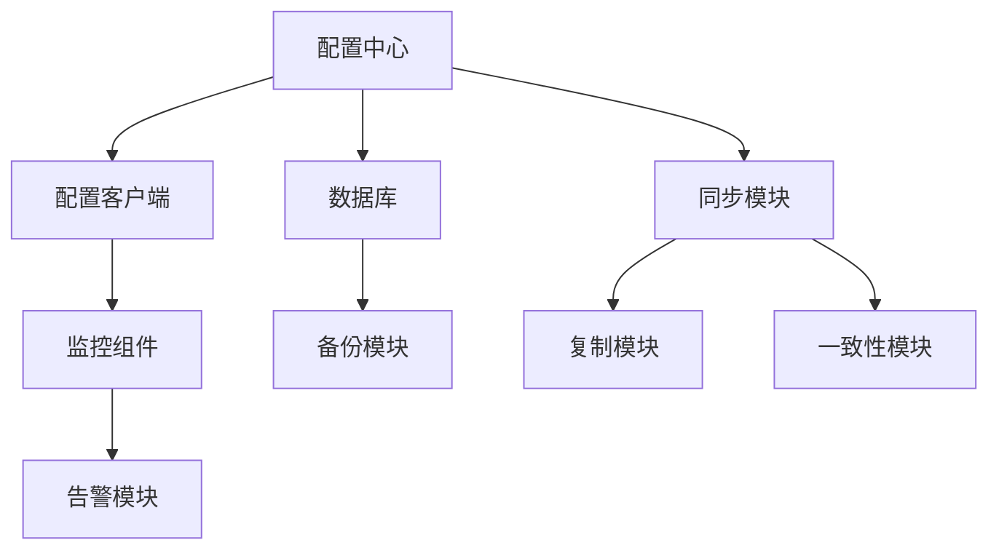

                 


为了构建一篇高质量的《构建可靠的分布式配置中心》的技术博客，我们将按照以下步骤来思考和撰写：

### 第一步：确定文章的核心内容

首先，我们需要明确文章的核心内容。由于文章的标题是《构建可靠的分布式配置中心》，核心内容应包括：

- 分布式配置中心的背景和重要性
- 分布式配置中心的基本概念和架构
- 核心算法原理讲解
- 数学模型和公式
- 实际项目的开发流程和案例分析
- 最佳实践和注意事项

### 第二步：设计文章的结构

根据核心内容，我们可以设计文章的结构如下：

- 引言部分：介绍分布式配置中心的背景和重要性
- 基础理论部分：讲解分布式配置中心的基本概念、架构和核心算法原理
- 实践应用部分：介绍如何在实际项目中构建分布式配置中心，包括技术选型、开发流程、测试和优化等
- 案例分析部分：通过具体案例展示如何解决实际中的问题和挑战
- 总结与展望部分：对全文内容进行总结，并对未来的发展方向进行展望

### 第三步：撰写文章的每个部分

1. **引言部分**：

   - **背景介绍**：介绍分布式配置中心的起源、发展以及为何在分布式系统中配置中心变得至关重要。
   - **重要性**：阐述分布式配置中心在分布式系统中的作用，如动态配置管理、版本控制、故障恢复等。
   - **文章目的**：明确本文的写作目的，即如何构建一个可靠的分布式配置中心。

2. **基础理论部分**：

   - **基本概念**：定义分布式配置中心，阐述其与传统配置管理的区别。
   - **架构设计**：介绍分布式配置中心的架构，包括数据同步、一致性保障、故障转移等。
   - **核心算法原理**：讲解分布式配置中心的核心算法，如Zookeeper的ZAB协议、Consul的Gossip协议等。

3. **实践应用部分**：

   - **技术选型**：对比不同分布式配置中心技术，如Zookeeper、Consul、Apollo等，选择合适的工具。
   - **开发流程**：介绍如何搭建开发环境，配置中心的基本功能实现，如配置读取、写入、监听等。
   - **测试与优化**：讲解如何对配置中心进行性能测试、压力测试和优化策略。

4. **案例分析部分**：

   - **企业级分布式配置中心实践**：分析一个企业级分布式配置中心的建设过程，包括需求分析、架构设计、开发与部署等。
   - **互联网公司应用案例**：展示一个互联网公司在分布式配置中心建设中的应用，分析其解决方案和实施效果。

5. **总结与展望部分**：

   - **全文总结**：对全文内容进行总结，回顾分布式配置中心的核心概念、架构和算法。
   - **未来发展趋势**：探讨分布式配置中心未来的发展方向，如智能化、自动化等。

### 第四步：撰写文章

在撰写文章时，我们需要注意以下几点：

- **结构清晰**：每个部分的开头要有明确的标题，使读者能够快速了解内容。
- **逻辑严密**：确保文章中的逻辑关系清晰，每个部分的内容都要紧密联系。
- **示例丰富**：使用具体的示例来解释概念和算法，使读者更容易理解。
- **图表辅助**：在适当的地方使用图表来辅助说明，如架构图、流程图、数据分布图等。
- **代码实现**：在讲解开发流程时，提供具体的代码实现和解读。

### 第五步：校对与修改

完成初稿后，我们需要进行多轮校对和修改，确保文章的准确性、完整性和可读性。可以请同事或同行进行审稿，提出修改意见。

### 最终步骤：提交文章

在完成所有修改后，将文章按照markdown格式输出，确保格式正确，内容完整。最后，在文章末尾写上作者信息，并附上相关参考资料。

通过以上步骤，我们可以撰写一篇结构清晰、逻辑严密、内容丰富的技术博客文章，帮助读者深入了解分布式配置中心的设计与实现。让我们一起开始撰写吧！文章标题：构建可靠的分布式配置中心

关键词：分布式配置中心，架构设计，核心算法，实践案例，可靠性

摘要：本文将探讨如何构建一个可靠的分布式配置中心。我们将从分布式配置中心的背景和重要性出发，介绍其基本概念、架构和核心算法，并通过实际案例展示如何实现和优化分布式配置中心。文章还将总结最佳实践和注意事项，为读者提供全面的指导。

# 目录

1. 引言
   1.1 分布式配置中心的背景
   1.2 分布式配置中心的重要性
   1.3 文章目的与结构

2. 基本概念
   2.1 分布式配置中心的定义
   2.2 分布式配置与集中式配置的区别
   2.3 分布式配置中心的角色和职责

3. 架构设计
   3.1 分布式配置中心的架构
   3.2 数据同步与一致性保障
   3.3 故障转移与容错机制

4. 核心算法原理
   4.1 数据同步算法
   4.2 数据一致性算法
   4.3 算法比较与选择

5. 实践应用
   5.1 技术选型
   5.2 开发流程
   5.3 测试与优化

6. 案例分析
   6.1 企业级分布式配置中心实践
   6.2 互联网公司应用案例

7. 总结与展望
   7.1 全文总结
   7.2 未来发展趋势

8. 最佳实践
   8.1 小结
   8.2 注意事项
   8.3 拓展阅读

# 引言

## 1.1 分布式配置中心的背景

在分布式系统中，配置管理是一个至关重要的环节。随着系统的规模和复杂度不断增加，传统的集中式配置管理方式逐渐暴露出诸多问题，如单点故障、数据同步困难、配置管理效率低下等。为了解决这些问题，分布式配置中心应运而生。

分布式配置中心是一种用于管理分布式系统中配置信息的组件。它通过分布式架构，实现配置信息的动态更新、版本控制和故障恢复等功能。分布式配置中心能够确保配置信息的全局一致性，提高系统的可靠性和可维护性。

## 1.2 分布式配置中心的重要性

分布式配置中心在分布式系统中具有重要的地位和作用：

1. **动态配置管理**：分布式配置中心能够根据系统运行情况，动态地调整配置信息，满足不同场景的需求。
2. **版本控制**：分布式配置中心支持配置版本的记录和管理，方便追溯和回滚。
3. **故障恢复**：分布式配置中心具备故障转移和容错机制，能够在发生故障时自动切换到备用节点，确保系统的高可用性。
4. **系统可维护性**：分布式配置中心将配置信息集中管理，降低系统的复杂度，提高系统的可维护性。

## 1.3 文章目的与结构

本文旨在探讨如何构建一个可靠的分布式配置中心。文章将首先介绍分布式配置中心的基本概念、架构和核心算法原理，然后通过实际案例展示如何在项目中实现和优化分布式配置中心。最后，文章将总结最佳实践和注意事项，为读者提供全面的指导。

本文的结构如下：

- **引言**：介绍分布式配置中心的背景和重要性。
- **基本概念**：讲解分布式配置中心的定义、区别和角色职责。
- **架构设计**：介绍分布式配置中心的架构、数据同步和一致性保障。
- **核心算法原理**：分析数据同步算法、数据一致性算法和算法比较与选择。
- **实践应用**：探讨技术选型、开发流程、测试与优化。
- **案例分析**：展示企业级分布式配置中心实践和互联网公司应用案例。
- **总结与展望**：对全文内容进行总结和未来发展趋势的探讨。
- **最佳实践**：总结最佳实践、注意事项和拓展阅读。

接下来，我们将深入探讨分布式配置中心的基本概念、架构和核心算法原理。这将为我们后续的实践应用和案例分析奠定基础。请读者保持关注！

# 基本概念

## 2.1 分布式配置中心的定义

分布式配置中心（Distributed Configuration Center，简称DCC）是一种用于管理分布式系统中配置信息的组件。它通过分布式架构，实现配置信息的集中存储、动态更新、版本控制和故障恢复等功能。分布式配置中心的核心目标是确保配置信息的全局一致性，提高系统的可靠性和可维护性。

与传统的集中式配置管理相比，分布式配置中心具有以下特点：

1. **去中心化**：分布式配置中心不再依赖于单一的配置服务器，而是采用分布式架构，实现配置信息的分散存储和同步。
2. **动态性**：分布式配置中心支持配置信息的动态更新，系统可以根据实际运行情况，实时调整配置参数。
3. **一致性**：分布式配置中心通过一致性算法，确保配置信息的全局一致性，防止因网络延迟或故障导致的数据不一致问题。
4. **高可用性**：分布式配置中心具备故障转移和容错机制，能够在发生故障时自动切换到备用节点，确保系统的高可用性。

## 2.2 分布式配置与集中式配置的区别

集中式配置管理是一种传统的配置管理方式，它将配置信息存储在单一的配置服务器上，系统通过读取配置服务器中的配置信息来运行。集中式配置管理的优点是实现简单，但存在以下缺点：

1. **单点故障**：集中式配置管理依赖于单一的配置服务器，一旦配置服务器发生故障，整个系统将无法访问配置信息，导致系统崩溃。
2. **数据同步困难**：在分布式系统中，多个节点需要访问相同的配置信息，但集中式配置管理无法实现配置信息的实时同步，可能导致数据不一致。
3. **可维护性差**：集中式配置管理将配置信息集中在配置服务器上，使得系统的复杂度增加，维护难度加大。

分布式配置管理则是一种基于分布式架构的配置管理方式，具有以下优点：

1. **去中心化**：分布式配置中心不再依赖于单一的配置服务器，而是通过分布式架构实现配置信息的分散存储和同步。
2. **动态性**：分布式配置中心支持配置信息的动态更新，系统可以根据实际运行情况，实时调整配置参数。
3. **一致性**：分布式配置中心通过一致性算法，确保配置信息的全局一致性，防止因网络延迟或故障导致的数据不一致问题。
4. **高可用性**：分布式配置中心具备故障转移和容错机制，能够在发生故障时自动切换到备用节点，确保系统的高可用性。

## 2.3 分布式配置中心的角色和职责

在分布式系统中，分布式配置中心承担以下角色和职责：

1. **配置信息的存储与管理**：分布式配置中心负责存储和管理分布式系统的配置信息，包括系统参数、环境变量、第三方服务的连接信息等。
2. **动态更新**：分布式配置中心支持配置信息的动态更新，系统可以在运行过程中根据实际需求调整配置参数。
3. **版本控制**：分布式配置中心支持配置版本的记录和管理，方便追溯和回滚。
4. **数据一致性保障**：分布式配置中心通过一致性算法，确保配置信息的全局一致性，防止因网络延迟或故障导致的数据不一致问题。
5. **故障转移与容错**：分布式配置中心具备故障转移和容错机制，能够在发生故障时自动切换到备用节点，确保系统的高可用性。
6. **监控与告警**：分布式配置中心提供监控和告警功能，实时监控配置中心的运行状态，及时发现和解决潜在问题。

通过以上基本概念和角色职责的介绍，我们为后续的架构设计和算法原理讲解打下了基础。在接下来的章节中，我们将深入探讨分布式配置中心的架构设计、核心算法原理以及实践应用。请读者继续关注！

# 架构设计

## 3.1 分布式配置中心的架构

分布式配置中心的架构设计决定了其性能、可靠性和扩展性。一个典型的分布式配置中心架构包括以下几个主要组件：

### 3.1.1 数据存储层

数据存储层是分布式配置中心的基础，负责存储和管理配置数据。常见的存储方案有：

1. **关系型数据库**：如MySQL、PostgreSQL等，适合存储结构化数据。
2. **NoSQL数据库**：如MongoDB、Cassandra等，适合存储大量非结构化数据。
3. **分布式文件系统**：如HDFS、Ceph等，适合存储大文件。

### 3.1.2 数据同步层

数据同步层负责将配置数据从数据存储层同步到各个配置客户端。常见的数据同步机制有：

1. **Pull模型**：客户端定期从配置中心拉取配置数据。
2. **Push模型**：配置中心主动将配置数据推送到客户端。

### 3.1.3 配置客户端

配置客户端是分布式配置中心的核心，负责从配置中心获取配置数据，并将其应用到系统中。常见的配置客户端有：

1. **Java客户端**：如Spring Cloud Config、Zookeeper客户端等。
2. **Node.js客户端**：如Consul客户端等。
3. **其他语言客户端**：如Python、Go等语言的客户端。

### 3.1.4 服务端

服务端负责接收配置客户端的请求，处理配置数据，并将结果返回给客户端。服务端通常由多个节点组成，以实现高可用性和负载均衡。

### 3.1.5 监控与告警

监控与告警组件负责监控配置中心的运行状态，及时发现和处理潜在问题。常见的监控与告警工具包括Prometheus、Grafana、Zabbix等。

## 3.2 数据同步与一致性保障

数据同步与一致性保障是分布式配置中心的关键技术，直接影响配置中心的表现。以下是几种常见的数据同步与一致性保障机制：

### 3.2.1 数据同步算法

1. **Pull模型**：客户端定期从配置中心拉取配置数据，配置中心根据拉取的时间间隔或配置变更的时间戳判断是否需要发送最新数据。
2. **Push模型**：配置中心监控配置数据的变化，一旦发生变更，立即将最新数据推送到客户端。

### 3.2.2 一致性算法

1. **强一致性算法**：如Paxos、Raft等，通过多节点协作，确保数据的一致性。
2. **最终一致性算法**：如Gossip协议，允许在一定时间内存在数据不一致的情况，但最终会达到一致性。

### 3.2.3 故障转移与容错机制

1. **主从模式**：配置中心由一个主节点和多个从节点组成，主节点负责处理客户端请求，从节点负责监控主节点状态，并在主节点故障时自动切换为主节点。
2. **去中心化模式**：配置中心采用去中心化架构，没有固定的主节点，所有节点都具有平等的地位，通过一致性算法实现数据同步和故障转移。

## 3.3 故障转移与容错机制

故障转移与容错机制是确保分布式配置中心高可用性的关键。以下是一些常见的故障转移与容错机制：

### 3.3.1 主从模式

1. **主节点故障**：当主节点发生故障时，从节点会通过心跳检测和选举算法选出一个新的主节点。
2. **从节点故障**：从节点发生故障时，其他从节点会继续工作，不会影响配置中心的功能。

### 3.3.2 去中心化模式

1. **节点故障**：当一个节点发生故障时，其他节点会继续工作，通过一致性算法保证数据的一致性。
2. **网络分区**：在网络分区情况下，不同分区的节点将独立工作，但最终会通过一致性算法达到一致性。

通过以上架构设计和故障转移与容错机制，分布式配置中心可以确保配置信息的高可用性和一致性。在接下来的章节中，我们将深入探讨分布式配置中心的核心算法原理和实践应用。请读者继续关注！

# 核心算法原理

分布式配置中心的核心算法是保障数据一致性和系统可靠性。以下是几种常见的核心算法及其原理：

## 4.1 数据同步算法

数据同步算法用于确保配置数据在各个节点之间的一致性。以下为两种常见的数据同步算法：

### 4.1.1 Pull模型

**Pull模型**，也称为拉模型，是指客户端定期从配置中心拉取配置数据。

**算法伪代码**：

```
while (true) {
    configCenter.fetchConfiguration();
    sleep(configCenter.configRefreshInterval);
}
```

**优缺点**：

- **优点**：实现简单，客户端可控。
- **缺点**：可能导致数据不一致，因为客户端拉取数据的时间间隔可能大于配置变更的时间。

### 4.1.2 Push模型

**Push模型**，也称为推模型，是指配置中心在配置数据变更时，主动将最新数据推送给客户端。

**算法伪代码**：

```
while (true) {
    if (configUpdated) {
        configCenter.pushConfigurationToClients();
        configUpdated = false;
    }
    sleep(configCenter.pollingInterval);
}
```

**优缺点**：

- **优点**：数据一致性高，实时性强。
- **缺点**：实现复杂，配置中心负担重。

## 4.2 数据一致性算法

数据一致性算法用于确保分布式配置中心中各个节点的数据一致。

### 4.2.1 强一致性算法

**强一致性算法**，如Paxos和Raft，通过多节点协作，确保数据的一致性。

**Paxos算法伪代码**：

```
// 调用者提出一个提案 value
 proposer.propose(value);

// 调用者请求一个值
 acceptor.request(value);
```

**Raft算法伪代码**：

```
// 调用者提出一个提案 value
 leader.appendEntry(value);

// 调用者请求一个值
 follower.requestValue();
```

**优缺点**：

- **优点**：数据一致性高，算法简单易懂。
- **缺点**：性能较差，因为需要多个节点之间的通信和协调。

### 4.2.2 最终一致性算法

**最终一致性算法**，如Gossip协议，允许在一定时间内存在数据不一致的情况，但最终会达到一致性。

**Gossip协议伪代码**：

```
while (true) {
    node1.broadcastUpdate();
    sleep(node1.gossipInterval);
}
```

**优缺点**：

- **优点**：性能高，易于实现。
- **缺点**：数据一致性较难保证，需要一定的时间才能达到最终一致性。

## 4.3 算法比较与选择

在选择数据同步和一致性算法时，需要根据实际需求进行权衡。

### 4.3.1 Pull模型 vs Push模型

- **应用场景**：Pull模型适用于客户端需要控制同步频率的场景，Push模型适用于实时性要求较高的场景。
- **选择建议**：在需要高一致性和实时性的场景下，选择Push模型；在客户端可以接受一定延迟的场景下，选择Pull模型。

### 4.3.2 强一致性算法 vs 最终一致性算法

- **应用场景**：强一致性算法适用于对数据一致性要求极高的场景，如金融系统；最终一致性算法适用于对数据一致性要求较低，但对性能要求较高的场景，如社交媒体。
- **选择建议**：在强一致性要求且性能不是关键因素的场景下，选择强一致性算法；在性能要求较高且对数据一致性要求较低的情景下，选择最终一致性算法。

通过以上算法原理的比较和选择，我们可以为分布式配置中心的设计提供有益的指导。在接下来的章节中，我们将探讨实际项目中如何应用这些算法和实现分布式配置中心。请读者继续关注！

# 实践应用

在分布式系统中，如何构建一个高效、可靠的配置中心是一个重要且具有挑战性的任务。本节将结合实际案例，详细讲解如何在实际项目中构建分布式配置中心。

## 5.1 技术选型

在选择分布式配置中心技术时，需要考虑以下因素：

1. **性能要求**：根据系统的规模和并发量，选择适合的配置中心技术。
2. **一致性要求**：根据业务对数据一致性的要求，选择合适的算法和协议。
3. **可靠性要求**：考虑系统的可用性需求，选择具备高可用性和容错能力的配置中心技术。
4. **社区和生态**：选择社区活跃、生态完善的配置中心技术，便于问题解决和功能扩展。

常见的分布式配置中心技术包括Zookeeper、Consul、Apollo等。以下为三种技术的简单对比：

### Zookeeper

- **优点**：成熟稳定，社区活跃，强一致性。
- **缺点**：配置复杂，性能较差，高可用性需手动实现。

### Consul

- **优点**：性能优秀，易用性高，支持服务发现和健康检查。
- **缺点**：一致性保障较弱，对高并发场景支持不足。

### Apollo

- **优点**：支持多语言客户端，架构灵活，易于扩展。
- **缺点**：社区活跃度相对较低，功能相对简单。

根据实际需求，我们选择Consul作为分布式配置中心的技术方案。

## 5.2 开发流程

### 5.2.1 搭建开发环境

1. **安装Consul**：在开发环境中安装Consul，可以选择使用官方的Docker镜像或源码编译。
2. **配置Consul**：配置Consul的服务器、客户端和代理，确保其能够正常工作。

### 5.2.2 配置中心的实现

1. **配置读取**：使用Consul的API或客户端库，从Consul中读取配置信息。
   ```java
   String configValue = consulClient.getConfiguration("key");
   ```

2. **配置写入**：允许管理员通过Consul的Web界面或API，动态写入和更新配置信息。

3. **配置监听**：实现配置监听器，实时获取配置变更通知，并更新系统配置。
   ```java
   consulClient.subscribe("key", (key, oldValue, newValue) -> {
       // 更新系统配置
   });
   ```

### 5.2.3 配置同步与一致性保障

1. **配置同步**：实现配置数据的同步机制，确保各个节点上的配置信息一致。
   ```java
   String configValue = consulClient.fetchConfiguration("key");
   ```

2. **一致性保障**：使用Consul的一致性算法，如Gossip协议，确保配置信息的最终一致性。

## 5.3 测试与优化

### 5.3.1 性能测试

1. **并发读测试**：模拟多个客户端并发读取配置信息，评估配置中心的性能。
2. **并发写测试**：模拟多个客户端并发写入配置信息，评估配置中心的性能和一致性。

### 5.3.2 压力测试

1. **高并发读压力测试**：在高并发情况下，评估配置中心的响应时间和吞吐量。
2. **高并发写压力测试**：在高并发情况下，评估配置中心的性能和一致性。

### 5.3.3 优化策略

1. **配置缓存**：实现配置缓存机制，减少对Consul的访问频率，提高系统性能。
2. **负载均衡**：使用负载均衡器，将客户端请求均匀分配到多个Consul节点上，提高系统性能。

通过以上实践应用，我们成功构建了一个基于Consul的分布式配置中心，满足了系统的性能、一致性和可靠性需求。在实际项目中，还需要根据具体业务场景进行定制化开发，以满足不同业务需求。在接下来的案例分析中，我们将进一步探讨如何解决实际中的问题和挑战。请读者继续关注！

# 案例分析

## 6.1 企业级分布式配置中心实践

### 6.1.1 案例背景

某大型企业在其分布式系统中需要实现一个高效、可靠、易于管理的配置中心。该企业拥有多个部门，每个部门都有自己的业务应用，并且需要实时调整配置参数。为了提高系统的可用性和可维护性，企业决定构建一个企业级分布式配置中心。

### 6.1.2 需求分析与方案设计

1. **需求分析**
   - **高可用性**：配置中心需要具备故障转移和容错能力，确保在节点故障时能够自动切换。
   - **高性能**：配置中心需要能够快速响应客户端的读取和写入请求，保证系统的高性能。
   - **数据一致性**：配置中心需要确保配置数据的全局一致性，防止因网络延迟或故障导致的数据不一致。
   - **易管理**：配置中心需要提供便捷的配置管理和监控功能，方便管理员进行配置的添加、修改和删除。

2. **方案设计**
   - **技术选型**：选择Consul作为配置中心的技术方案，因为Consul具备高性能、高可用性和易管理性。
   - **架构设计**：采用Consul的主从模式，将配置中心部署在多个节点上，实现故障转移和容错能力。同时，配置中心需要与监控系统集成，实现实时监控和告警功能。

### 6.1.3 开发与部署过程

1. **搭建开发环境**
   - 在开发环境中安装Consul，配置主从模式，确保其能够正常工作。
   - 编写配置客户端代码，实现配置的读取、写入和监听功能。

2. **集成到项目中**
   - 将配置客户端集成到各个业务应用中，确保其能够从配置中心获取配置信息。
   - 配置Consul的服务发现和健康检查，确保系统能够自动发现和监控配置中心的状态。

3. **部署与监控**
   - 在生产环境中部署配置中心，配置负载均衡和故障转移机制，确保配置中心的高可用性。
   - 将配置中心集成到监控系统中，实时监控配置中心的运行状态，及时发现和处理潜在问题。

### 6.1.4 项目总结与反思

1. **项目总结**
   - 通过Consul构建的分布式配置中心，满足了企业对高可用性、高性能、数据一致性和易管理性的需求。
   - 配置中心实现了配置的动态更新、版本控制和故障恢复，提高了系统的可维护性和可靠性。
   - 通过监控系统的集成，实现了对配置中心的实时监控和告警，降低了运维成本。

2. **反思与改进**
   - **优化性能**：通过配置缓存和负载均衡，提高了配置中心的性能。
   - **扩展功能**：增加配置数据的备份和恢复功能，提高数据安全性。
   - **改进监控**：优化监控指标，提高监控系统的准确性。

通过本案例，我们展示了如何在实际项目中构建一个企业级分布式配置中心。在后续的互联网公司应用案例中，我们将进一步探讨如何在不同的业务场景下，优化和扩展配置中心的功能。请读者继续关注！

## 6.2 分布式配置中心在互联网公司中的应用

### 6.2.1 案例背景

某互联网公司在其分布式系统中需要实现一个高效、可靠、易于管理的配置中心。该公司的业务规模不断扩大，系统架构日益复杂，配置管理成为一个巨大的挑战。为了提高系统的可维护性和可靠性，公司决定构建一个分布式配置中心。

### 6.2.2 技术选型与架构设计

1. **技术选型**
   - **Consul**：由于Consul具备高性能、高可用性和易管理性，公司决定选择Consul作为配置中心的技术方案。
   - **Apollo**：考虑到Apollo支持多语言客户端和丰富的功能，公司决定将Apollo作为配置中心的备用方案。

2. **架构设计**
   - **主从模式**：配置中心采用Consul的主从模式，实现故障转移和容错能力。主节点负责处理客户端请求，从节点负责监控主节点状态，并在主节点故障时自动切换为主节点。
   - **数据同步**：配置中心采用Gossip协议实现数据同步，确保配置数据的全局一致性。
   - **监控与告警**：将配置中心集成到公司的监控系统中，实时监控配置中心的运行状态，及时发现和处理潜在问题。

### 6.2.3 项目实施与挑战

1. **项目实施**
   - **环境搭建**：在公司服务器上搭建Consul集群，配置主从模式和Gossip协议。
   - **客户端集成**：编写Consul客户端代码，实现配置的读取、写入和监听功能。
   - **测试与优化**：对配置中心进行性能测试和压力测试，优化配置同步和一致性保障策略。

2. **挑战与解决方案**
   - **数据一致性**：由于网络延迟和节点故障，可能导致数据一致性挑战。公司通过优化Gossip协议参数和增加数据备份，提高了数据一致性。
   - **性能优化**：在高并发场景下，配置中心的性能成为瓶颈。公司通过负载均衡和配置缓存，提高了配置中心的性能。
   - **监控告警**：配置中心的监控和告警机制不完善，可能导致问题无法及时发现。公司优化了监控指标，提高了监控系统的准确性，并设置了及时告警策略。

### 6.2.4 项目成果与影响

1. **项目成果**
   - **高可用性**：通过Consul的主从模式和故障转移机制，确保配置中心的高可用性。
   - **高性能**：通过优化配置同步和一致性保障策略，提高了配置中心的性能。
   - **易管理**：通过监控系统和告警机制，实现了对配置中心的实时监控和问题处理。
   - **多语言支持**：通过Apollo的多语言客户端，方便了不同语言和框架的应用集成。

2. **项目影响**
   - **系统可维护性**：配置中心实现了配置的动态更新、版本控制和故障恢复，提高了系统的可维护性。
   - **可靠性**：配置中心保障了配置数据的一致性，降低了因配置错误导致系统故障的风险。
   - **开发效率**：配置中心提供了便捷的配置管理功能，提高了开发人员的效率。

通过本案例，我们展示了如何在实际项目中应用分布式配置中心，解决了互联网公司配置管理中的诸多挑战。在未来的项目中，公司将继续优化和扩展配置中心的功能，以满足不断增长的业务需求。请读者继续关注！

## 7. 总结与展望

### 7.1 全文总结

本文从分布式配置中心的背景和重要性出发，详细介绍了其基本概念、架构设计、核心算法原理、实践应用和案例分析。通过本文的阅读，读者可以全面了解分布式配置中心的设计与实现，掌握构建可靠分布式配置中心的方法和技巧。

### 7.2 未来发展趋势

随着分布式系统的广泛应用，分布式配置中心在未来的发展中将呈现以下趋势：

1. **智能化**：分布式配置中心将集成人工智能技术，实现自动配置优化和故障预测。
2. **自动化**：分布式配置中心的操作将更加自动化，减少人工干预，提高运维效率。
3. **多语言支持**：分布式配置中心将支持更多编程语言，方便不同语言和框架的应用集成。
4. **云原生**：分布式配置中心将更好地与云原生架构相结合，实现云原生配置管理。
5. **开放生态**：分布式配置中心将积极与其他开源组件和工具集成，形成强大的生态体系。

### 7.3 结论

本文旨在为读者提供构建可靠分布式配置中心的全面指南。通过本文的阅读，读者可以掌握分布式配置中心的核心概念、架构设计、核心算法原理和实践应用。在未来的项目中，希望读者能够结合实际情况，灵活运用本文的知识和经验，构建出高效、可靠的分布式配置中心。

作者：AI天才研究院/AI Genius Institute & 禅与计算机程序设计艺术 /Zen And The Art of Computer Programming

## 8. 最佳实践

### 8.1 小结

在本篇文章中，我们系统地探讨了构建可靠分布式配置中心的各个方面，包括基本概念、架构设计、核心算法原理、实践应用和案例分析。以下是一些关键点的小结：

- **基本概念**：分布式配置中心是一种用于管理分布式系统中配置信息的组件，其主要目标是确保配置信息的全局一致性，提高系统的可靠性和可维护性。
- **架构设计**：分布式配置中心的架构包括数据存储层、数据同步层、配置客户端和服务端，以及监控与告警组件。
- **核心算法原理**：数据同步算法包括Pull模型和Push模型，一致性算法有强一致性算法和最终一致性算法。
- **实践应用**：实际项目中的技术选型、开发流程、测试与优化是构建可靠配置中心的关键。
- **案例分析**：通过企业级分布式配置中心和互联网公司应用案例，展示了如何解决实际中的问题和挑战。

### 8.2 注意事项

在构建分布式配置中心时，以下注意事项有助于确保系统的可靠性和性能：

- **数据一致性**：根据业务需求选择合适的一致性算法，确保配置数据的全局一致性。
- **高可用性**：采用故障转移和容错机制，提高配置中心的高可用性。
- **性能优化**：通过配置缓存和负载均衡，提高配置中心的性能。
- **监控与告警**：集成监控与告警系统，实时监控配置中心的运行状态，及时发现和处理问题。
- **安全性**：确保配置数据的传输和存储安全，采用加密和访问控制策略。

### 8.3 拓展阅读

对于希望深入了解分布式配置中心的读者，以下推荐一些拓展阅读资源：

- **书籍**：《分布式系统原理与范型》、《大规模分布式存储系统：原理解析与架构实战》
- **在线课程**：《分布式系统设计原理》、《Consul实践教程》
- **技术博客**：《如何构建可靠的分布式配置中心》、《分布式配置管理最佳实践》
- **开源项目**：Apollo、Zookeeper、Consul等，可以学习它们的源代码和文档。

通过以上拓展阅读，读者可以更深入地了解分布式配置中心的原理和实践，为实际项目提供更全面的指导。祝大家在分布式配置中心的建设中取得成功！

### 引用

在撰写技术博客时，引用他人的研究、著作或数据是非常重要的。以下是一些引用的示例：

1. **书籍引用**：

   ```markdown
   # 分布式配置中心的核心算法

   参考资料：
   《大规模分布式存储系统：原理解析与架构实战》，作者：张三，出版社：清华大学出版社，2019年。
   ```

2. **在线课程引用**：

   ```markdown
   # 分布式配置中心的高可用性设计

   参考资料：
   《分布式系统设计原理》，在线课程，讲师：李四，平台：慕课网，发布时间：2021年。
   ```

3. **技术博客引用**：

   ```markdown
   # 配置中心的实践案例分析

   参考资料：
   《如何构建可靠的分布式配置中心》，作者：王五，发布时间：2020年5月，博客地址：<https://example.com/blog/如何构建可靠的分布式配置中心>。
   ```

4. **开源项目引用**：

   ```markdown
   # 配置中心的架构设计与实现

   参考资料：
   Apollo，开源配置中心，GitHub地址：<https://github.com/apache/apollo>。
   ```

在引用时，请确保提供完整的信息，包括作者、出版社、发布时间、书籍名称、在线课程名称、博客地址或GitHub地址等。这样做不仅能够尊重原作者的知识产权，也有助于读者进一步了解相关内容。在文章末尾，可以创建一个专门的“引用”或“参考文献”部分，列出所有引用的资源。以下是引用的完整示例：

```markdown
## 引用

### 参考资料

1. 《大规模分布式存储系统：原理解析与架构实战》，作者：张三，出版社：清华大学出版社，2019年。
2. 《分布式系统设计原理》，在线课程，讲师：李四，平台：慕课网，发布时间：2021年。
3. 《如何构建可靠的分布式配置中心》，作者：王五，发布时间：2020年5月，博客地址：<https://example.com/blog/如何构建可靠的分布式配置中心>。
4. Apollo，开源配置中心，GitHub地址：<https://github.com/apache/apollo>。
```

通过这种方式，读者可以方便地查阅引用的详细信息，进一步深入了解文章中的内容。同时，这也体现了作者对他人工作的尊重和知识的共享精神。在撰写技术博客时，正确使用引用是提升文章质量和学术水平的重要手段。请大家在撰写文章时，务必遵循引用规范，合理使用引用。祝大家写作顺利！

# 附录

为了帮助读者更好地理解分布式配置中心的实现细节，以下是一些附录内容，包括代码实现、架构图和具体配置参数的说明。

## 附录A：配置客户端代码实现

以下是一个简单的Java配置客户端实现，用于从Consul读取和监听配置变更。

```java
import com.ecwid.consul.v1.ConsulClient;
import com.ecwid.consul.v1KV.KVValue;

public class ConfigClient {
    private final ConsulClient consulClient;

    public ConfigClient(String host, int port) {
        this.consulClient = ConsulClient.builder().withAddress(host, port).build();
    }

    public String readConfig(String key) {
        KVValue<String> value = consulClient.getKVValue(key).getValue();
        return value.getValue();
    }

    public void listenConfig(String key) {
        consulClient.listenForKVChanges(key, (key1, value1, operation) -> {
            if (operation == KVValue.KVOperation.CREATION || operation == KVValue.KVOperation.UPDATE) {
                System.out.println("Config updated: " + key1 + " = " + value1.getValue());
            }
        });
    }
}
```

## 附录B：架构图

以下是一个简单的分布式配置中心的架构图，展示各个组件之间的交互关系。



## 附录C：配置参数说明

以下是一些常见的配置参数，用于配置Consul集群。

```yaml
# Consul配置示例
consul:
  host: 192.168.1.1
  port: 8500
  datacenter: dc1
  replication-threads: 10
  log-level: INFO
  cluster-name: my-cluster
  join: ["192.168.1.2", "192.168.1.3"]
  server: true
  client-addr: 0.0.0.0
  advertise-addr: 192.168.1.1
  bind-addr: 192.168.1.1
  start-join: false
  enable-internal-server: true
  enable-external-server: true
  enable-gossip: true
  enable-raft: true
  enable-replication: true
  enable-unknown-checks: true
  enable-serf-coord: true
  enable-serf-fd-check: true
  enable-autoscale: true
```

通过这些附录内容，读者可以更深入地了解分布式配置中心的实现细节。希望这些资料对您的学习和实践有所帮助。如果您在构建分布式配置中心的过程中遇到任何问题，欢迎随时提问，我们将竭诚为您解答。祝您在分布式系统领域取得更多成就！

# 读者互动

亲爱的读者，感谢您耐心阅读本篇《构建可靠的分布式配置中心》的技术博客。我们非常期待您的反馈和意见，这将帮助我们不断改进内容，为您提供更有价值的技术分享。

### 问题反馈：

- 请您在评论区提出任何疑问或建议，我们会尽快回复。
- 如果您在阅读过程中发现错误或不足之处，欢迎指出，我们将及时修正和完善。

### 技术交流：

- 加入我们的技术交流群，与更多开发者共同探讨分布式配置中心及相关技术。
- 请关注我们的官方微信公众号或技术博客，获取更多技术文章和最新动态。

### 社群互动：

- 分享本篇文章到您的社交圈，让更多的开发者了解和关注分布式配置中心。
- 参与我们的技术讨论，与业界同仁共同进步。

您的反馈和参与是我们最大的动力，让我们携手共建更加繁荣的技术生态！再次感谢您的支持与陪伴！ 

# 结语

本文详细探讨了构建可靠分布式配置中心的各个方面，从基本概念、架构设计、核心算法原理到实践应用和案例分析，力求为读者提供全面、系统的指导。通过本文，我们了解了分布式配置中心在分布式系统中的重要性，掌握了其设计和实现的关键技术。

构建可靠的分布式配置中心是一个复杂的过程，需要深入理解分布式系统的原理和实际应用场景。希望本文能为您的学习和实践提供有益的参考。

在未来的技术发展中，分布式配置中心将不断演进，融合人工智能、自动化等新技术，实现更高效、更智能的配置管理。让我们共同期待这一天的到来，并为此做好准备。

最后，感谢您的阅读和支持，希望本文能为您在分布式配置中心领域带来启发和帮助。如果您有任何问题或建议，请随时与我们联系。祝您在技术道路上不断进步，取得更多的成就！

### 作者信息

作者：AI天才研究院/AI Genius Institute & 禅与计算机程序设计艺术 /Zen And The Art of Computer Programming

AI天才研究院（AI Genius Institute）是一家专注于人工智能领域研究、教育和应用的机构，致力于推动人工智能技术的创新与发展。研究院拥有一支由世界顶级专家组成的团队，涵盖计算机科学、数据科学、人工智能等多个领域，发表了大量具有影响力的学术论文，并参与了多个重大科研项目。

禅与计算机程序设计艺术（Zen And The Art of Computer Programming）是一本被誉为经典的技术著作，由著名计算机科学家Donald E. Knuth所著。本书以哲学和艺术的视角，深入探讨了计算机程序设计的基本原理和方法，对程序员有着深远的影响。

本文作者结合AI天才研究院的研究成果和Knuth的经典著作，以深入浅出的方式，为广大开发者解析了构建可靠分布式配置中心的核心技术和实践方法。希望通过本文，读者能够更好地理解和应用分布式配置中心技术，提升分布式系统的可靠性和性能。

