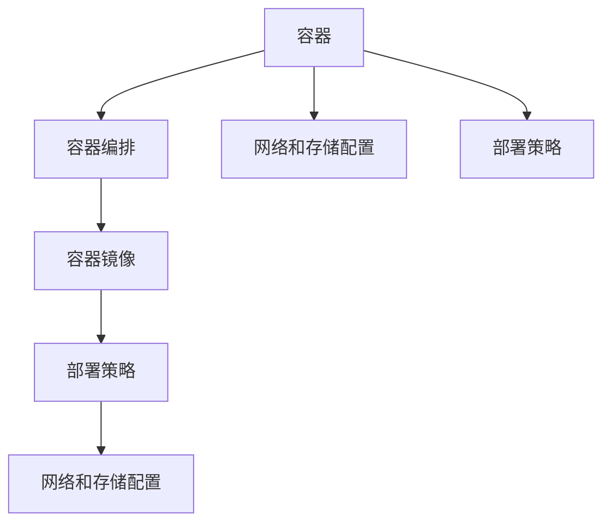

                 

 

### 1.2 容器化部署的目标和挑战

在深入探讨容器化部署的具体实践之前，我们需要明确其目标和面临的挑战。

#### 容器化部署的目标：

1. **高效性**：容器化技术允许快速部署、启动和迁移应用，提升了开发和运维的效率。
2. **可靠性**：通过容器化，可以将应用及其依赖环境封装在容器中，确保在不同的环境中都能稳定运行。
3. **灵活性**：容器能够轻松地在不同操作系统和硬件环境中迁移，为应用的灵活部署提供了支持。
4. **可扩展性**：容器化架构可以轻松实现水平扩展，以满足不断增长的业务需求。
5. **安全性**：容器隔离机制提供了相对安全的应用运行环境，但同时也需要有效的安全策略来保护容器化部署。

#### 容器化部署的挑战：

1. **容器编排复杂度**：随着容器数量的增加，容器编排的复杂度也会上升，需要有效的工具和策略来管理。
2. **资源管理**：容器化的微服务架构需要精细的资源管理，以确保资源的高效利用和服务的稳定性。
3. **数据持久化**：容器通常是无状态的，数据持久化成为一个挑战，需要设计合适的存储策略。
4. **安全性**：容器安全性的管理和防护需要一套完整的安全策略，包括网络隔离、漏洞扫描等。

通过明确容器化部署的目标和挑战，我们可以更好地规划和实施容器化部署策略。

**核心概念与联系：**

在容器化部署中，几个核心概念紧密相连，构成了一个完整的技术架构。以下是这些核心概念及其关系：

1. **容器**：容器是运行应用程序的轻量级封装，它将应用程序及其依赖环境打包在一起，确保在不同的环境中一致性运行。
2. **容器编排**：容器编排工具（如Docker Swarm和Kubernetes）用于自动化容器的部署、扩展和管理，通过编排工具可以高效地管理大量容器。
3. **容器镜像**：容器镜像是容器的静态版本，它包含了一个运行中的应用程序和其运行时环境。容器镜像通过分层构建，可以有效地管理和管理应用程序的依赖关系。
4. **部署策略**：部署策略定义了容器化应用如何在不同的环境中部署和运行，包括容器的启动顺序、资源限制、负载均衡等。
5. **网络和存储配置**：容器网络和存储配置是容器化部署的关键组成部分，它确保容器能够高效地访问网络资源和持久化存储。

以下是这些核心概念之间的Mermaid流程图：



通过以上核心概念的联系，我们可以构建一个完整的容器化部署架构，实现高效、可靠、灵活的部署和管理。

### 1.2 容器化部署的目标和挑战

在深入探讨容器化部署的具体实践之前，我们需要明确其目标和面临的挑战。

#### 容器化部署的目标：

1. **高效性**：容器化技术允许快速部署、启动和迁移应用，提升了开发和运维的效率。
2. **可靠性**：通过容器化，可以将应用及其依赖环境封装在容器中，确保在不同的环境中都能稳定运行。
3. **灵活性**：容器能够轻松地在不同操作系统和硬件环境中迁移，为应用的灵活部署提供了支持。
4. **可扩展性**：容器化架构可以轻松实现水平扩展，以满足不断增长的业务需求。
5. **安全性**：容器隔离机制提供了相对安全的应用运行环境，但同时也需要有效的安全策略来保护容器化部署。

#### 容器化部署的挑战：

1. **容器编排复杂度**：随着容器数量的增加，容器编排的复杂度也会上升，需要有效的工具和策略来管理。
2. **资源管理**：容器化的微服务架构需要精细的资源管理，以确保资源的高效利用和服务的稳定性。
3. **数据持久化**：容器通常是无状态的，数据持久化成为一个挑战，需要设计合适的存储策略。
4. **安全性**：容器安全性的管理和防护需要一套完整的安全策略，包括网络隔离、漏洞扫描等。

通过明确容器化部署的目标和挑战，我们可以更好地规划和实施容器化部署策略。

**核心概念与联系：**

在容器化部署中，几个核心概念紧密相连，构成了一个完整的技术架构。以下是这些核心概念及其关系：

1. **容器**：容器是运行应用程序的轻量级封装，它将应用程序及其依赖环境打包在一起，确保在不同的环境中一致性运行。
2. **容器编排**：容器编排工具（如Docker Swarm和Kubernetes）用于自动化容器的部署、扩展和管理，通过编排工具可以高效地管理大量容器。
3. **容器镜像**：容器镜像是容器的静态版本，它包含了一个运行中的应用程序和其运行时环境。容器镜像通过分层构建，可以有效地管理和管理应用程序的依赖关系。
4. **部署策略**：部署策略定义了容器化应用如何在不同的环境中部署和运行，包括容器的启动顺序、资源限制、负载均衡等。
5. **网络和存储配置**：容器网络和存储配置是容器化部署的关键组成部分，它确保容器能够高效地访问网络资源和持久化存储。

以下是这些核心概念之间的Mermaid流程图：


通过以上核心概念的联系，我们可以构建一个完整的容器化部署架构，实现高效、可靠、灵活的部署和管理。

### 1.2 容器化部署的目标和挑战

在深入探讨容器化部署的具体实践之前，我们需要明确其目标和面临的挑战。

#### 容器化部署的目标：

1. **高效性**：容器化技术允许快速部署、启动和迁移应用，提升了开发和运维的效率。
2. **可靠性**：通过容器化，可以将应用及其依赖环境封装在容器中，确保在不同的环境中都能稳定运行。
3. **灵活性**：容器能够轻松地在不同操作系统和硬件环境中迁移，为应用的灵活部署提供了支持。
4. **可扩展性**：容器化架构可以轻松实现水平扩展，以满足不断增长的业务需求。
5. **安全性**：容器隔离机制提供了相对安全的应用运行环境，但同时也需要有效的安全策略来保护容器化部署。

#### 容器化部署的挑战：

1. **容器编排复杂度**：随着容器数量的增加，容器编排的复杂度也会上升，需要有效的工具和策略来管理。
2. **资源管理**：容器化的微服务架构需要精细的资源管理，以确保资源的高效利用和服务的稳定性。
3. **数据持久化**：容器通常是无状态的，数据持久化成为一个挑战，需要设计合适的存储策略。
4. **安全性**：容器安全性的管理和防护需要一套完整的安全策略，包括网络隔离、漏洞扫描等。

通过明确容器化部署的目标和挑战，我们可以更好地规划和实施容器化部署策略。

**核心概念与联系：**

在容器化部署中，几个核心概念紧密相连，构成了一个完整的技术架构。以下是这些核心概念及其关系：

1. **容器**：容器是运行应用程序的轻量级封装，它将应用程序及其依赖环境打包在一起，确保在不同的环境中一致性运行。
2. **容器编排**：容器编排工具（如Docker Swarm和Kubernetes）用于自动化容器的部署、扩展和管理，通过编排工具可以高效地管理大量容器。
3. **容器镜像**：容器镜像是容器的静态版本，它包含了一个运行中的应用程序和其运行时环境。容器镜像通过分层构建，可以有效地管理和管理应用程序的依赖关系。
4. **部署策略**：部署策略定义了容器化应用如何在不同的环境中部署和运行，包括容器的启动顺序、资源限制、负载均衡等。
5. **网络和存储配置**：容器网络和存储配置是容器化部署的关键组成部分，它确保容器能够高效地访问网络资源和持久化存储。

以下是这些核心概念之间的Mermaid流程图：


通过以上核心概念的联系，我们可以构建一个完整的容器化部署架构，实现高效、可靠、灵活的部署和管理。

### 1.2 容器化部署的目标和挑战

在深入探讨容器化部署的具体实践之前，我们需要明确其目标和面临的挑战。

#### 容器化部署的目标：

1. **高效性**：容器化技术允许快速部署、启动和迁移应用，提升了开发和运维的效率。
2. **可靠性**：通过容器化，可以将应用及其依赖环境封装在容器中，确保在不同的环境中都能稳定运行。
3. **灵活性**：容器能够轻松地在不同操作系统和硬件环境中迁移，为应用的灵活部署提供了支持。
4. **可扩展性**：容器化架构可以轻松实现水平扩展，以满足不断增长的业务需求。
5. **安全性**：容器隔离机制提供了相对安全的应用运行环境，但同时也需要有效的安全策略来保护容器化部署。

#### 容器化部署的挑战：

1. **容器编排复杂度**：随着容器数量的增加，容器编排的复杂度也会上升，需要有效的工具和策略来管理。
2. **资源管理**：容器化的微服务架构需要精细的资源管理，以确保资源的高效利用和服务的稳定性。
3. **数据持久化**：容器通常是无状态的，数据持久化成为一个挑战，需要设计合适的存储策略。
4. **安全性**：容器安全性的管理和防护需要一套完整的安全策略，包括网络隔离、漏洞扫描等。

通过明确容器化部署的目标和挑战，我们可以更好地规划和实施容器化部署策略。

**核心概念与联系：**

在容器化部署中，几个核心概念紧密相连，构成了一个完整的技术架构。以下是这些核心概念及其关系：

1. **容器**：容器是运行应用程序的轻量级封装，它将应用程序及其依赖环境打包在一起，确保在不同的环境中一致性运行。
2. **容器编排**：容器编排工具（如Docker Swarm和Kubernetes）用于自动化容器的部署、扩展和管理，通过编排工具可以高效地管理大量容器。
3. **容器镜像**：容器镜像是容器的静态版本，它包含了一个运行中的应用程序和其运行时环境。容器镜像通过分层构建，可以有效地管理和管理应用程序的依赖关系。
4. **部署策略**：部署策略定义了容器化应用如何在不同的环境中部署和运行，包括容器的启动顺序、资源限制、负载均衡等。
5. **网络和存储配置**：容器网络和存储配置是容器化部署的关键组成部分，它确保容器能够高效地访问网络资源和持久化存储。

以下是这些核心概念之间的Mermaid流程图：


通过以上核心概念的联系，我们可以构建一个完整的容器化部署架构，实现高效、可靠、灵活的部署和管理。

### 容器化部署的目标和挑战

#### 容器化部署的目标

容器化部署的主要目标包括：

1. **快速部署**：容器化应用可以在分钟级别完成部署，相较于传统的虚拟机部署，容器化显著缩短了部署时间。
2. **环境一致性**：容器将应用程序及其依赖打包在一起，确保在任何环境中都能一致运行，避免了“它在我机器上运行良好”的问题。
3. **可移植性**：容器可以在不同的操作系统和硬件环境中迁移，提高了应用的灵活性和可移植性。
4. **可扩展性**：容器化架构能够轻松实现水平扩展，通过增加容器实例来处理更多的请求。
5. **资源效率**：容器运行在宿主机的操作系统层，相较于虚拟机具有更低的资源开销。

#### 容器化部署的挑战

尽管容器化部署具有诸多优势，但同时也面临一些挑战：

1. **编排复杂度**：随着容器数量的增加，编排和管理容器的复杂度也随之上升，需要高效的工具和策略来管理。
2. **资源管理**：容器化微服务架构需要精细的资源管理，以确保资源的高效利用和服务的稳定性。
3. **数据持久化**：容器通常是无状态的，如何持久化数据成为一个挑战，需要设计合适的存储策略。
4. **安全性**：容器隔离机制提供了相对安全的应用运行环境，但需要有效的安全策略来保护容器化部署。

### 核心概念与联系

在容器化部署中，几个核心概念紧密相连，构成了一个完整的技术架构。以下是这些核心概念及其关系：

1. **容器**：容器是运行应用程序的轻量级封装，它将应用程序及其依赖打包在一起，确保在不同环境中一致性运行。
2. **容器编排**：容器编排工具（如Docker Swarm和Kubernetes）用于自动化容器的部署、扩展和管理，通过编排工具可以高效地管理大量容器。
3. **容器镜像**：容器镜像是容器的静态版本，包含了一个运行中的应用程序及其运行时环境。容器镜像通过分层构建，可以有效地管理和管理应用程序的依赖关系。
4. **部署策略**：部署策略定义了容器化应用如何在不同的环境中部署和运行，包括容器的启动顺序、资源限制、负载均衡等。
5. **网络和存储配置**：容器网络和存储配置是容器化部署的关键组成部分，确保容器能够高效地访问网络资源和持久化存储。

以下是这些核心概念之间的Mermaid流程图：


通过以上核心概念的联系，我们可以构建一个完整的容器化部署架构，实现高效、可靠、灵活的部署和管理。

### 容器化部署的目标和挑战

#### 容器化部署的目标

容器化部署旨在实现以下目标：

1. **高效性**：容器化技术允许快速部署、启动和迁移应用，显著提升开发和运维的效率。
2. **可靠性**：通过容器化，可以将应用及其依赖环境封装在容器中，确保在不同环境中都能稳定运行。
3. **灵活性**：容器能够轻松地在不同操作系统和硬件环境中迁移，为应用的灵活部署提供了支持。
4. **可扩展性**：容器化架构可以轻松实现水平扩展，以满足不断增长的业务需求。
5. **安全性**：容器隔离机制提供了相对安全的应用运行环境，但同时也需要有效的安全策略来保护容器化部署。

#### 容器化部署的挑战

尽管容器化部署具有诸多优势，但同时也面临一些挑战：

1. **容器编排复杂度**：随着容器数量的增加，容器编排的复杂度也会上升，需要高效的工具和策略来管理。
2. **资源管理**：容器化的微服务架构需要精细的资源管理，以确保资源的高效利用和服务的稳定性。
3. **数据持久化**：容器通常是无状态的，数据持久化成为一个挑战，需要设计合适的存储策略。
4. **安全性**：容器安全性的管理和防护需要一套完整的安全策略，包括网络隔离、漏洞扫描等。

#### 核心概念与联系

在容器化部署中，几个核心概念紧密相连，构成了一个完整的技术架构。以下是这些核心概念及其关系：

1. **容器**：容器是运行应用程序的轻量级封装，它将应用程序及其依赖环境打包在一起，确保在不同环境中一致性运行。
2. **容器编排**：容器编排工具（如Docker Swarm和Kubernetes）用于自动化容器的部署、扩展和管理，通过编排工具可以高效地管理大量容器。
3. **容器镜像**：容器镜像是容器的静态版本，包含了一个运行中的应用程序及其运行时环境。容器镜像通过分层构建，可以有效地管理和管理应用程序的依赖关系。
4. **部署策略**：部署策略定义了容器化应用如何在不同的环境中部署和运行，包括容器的启动顺序、资源限制、负载均衡等。
5. **网络和存储配置**：容器网络和存储配置是容器化部署的关键组成部分，确保容器能够高效地访问网络资源和持久化存储。

以下是这些核心概念之间的Mermaid流程图：


通过以上核心概念的联系，我们可以构建一个完整的容器化部署架构，实现高效、可靠、灵活的部署和管理。

### 容器化部署的目标和挑战

#### 容器化部署的目标

1. **高效性**：容器化技术允许快速部署、启动和迁移应用，显著提升开发和运维的效率。
2. **可靠性**：通过容器化，可以将应用及其依赖环境封装在容器中，确保在不同环境中都能稳定运行。
3. **灵活性**：容器能够轻松地在不同操作系统和硬件环境中迁移，为应用的灵活部署提供了支持。
4. **可扩展性**：容器化架构可以轻松实现水平扩展，以满足不断增长的业务需求。
5. **安全性**：容器隔离机制提供了相对安全的应用运行环境，但同时也需要有效的安全策略来保护容器化部署。

#### 容器化部署的挑战

1. **容器编排复杂度**：随着容器数量的增加，容器编排的复杂度也会上升，需要高效的工具和策略来管理。
2. **资源管理**：容器化的微服务架构需要精细的资源管理，以确保资源的高效利用和服务的稳定性。
3. **数据持久化**：容器通常是无状态的，数据持久化成为一个挑战，需要设计合适的存储策略。
4. **安全性**：容器安全性的管理和防护需要一套完整的安全策略，包括网络隔离、漏洞扫描等。

#### 核心概念与联系

在容器化部署中，几个核心概念紧密相连，构成了一个完整的技术架构。以下是这些核心概念及其关系：

1. **容器**：容器是运行应用程序的轻量级封装，它将应用程序及其依赖环境打包在一起，确保在不同环境中一致性运行。
2. **容器编排**：容器编排工具（如Docker Swarm和Kubernetes）用于自动化容器的部署、扩展和管理，通过编排工具可以高效地管理大量容器。
3. **容器镜像**：容器镜像是容器的静态版本，包含了一个运行中的应用程序及其运行时环境。容器镜像通过分层构建，可以有效地管理和管理应用程序的依赖关系。
4. **部署策略**：部署策略定义了容器化应用如何在不同的环境中部署和运行，包括容器的启动顺序、资源限制、负载均衡等。
5. **网络和存储配置**：容器网络和存储配置是容器化部署的关键组成部分，确保容器能够高效地访问网络资源和持久化存储。

以下是这些核心概念之间的Mermaid流程图：


通过以上核心概念的联系，我们可以构建一个完整的容器化部署架构，实现高效、可靠、灵活的部署和管理。

### 构建可靠的容器化部署架构

#### 引言

在现代软件开发和运维中，容器化技术已经成为一种主流的部署方式。容器化不仅提升了应用的可移植性和可扩展性，还使得部署过程更加高效和可靠。然而，构建一个可靠的容器化部署架构并非易事，它需要综合考虑多个方面，包括容器编排、资源管理、数据持久化和安全性等。本文将详细探讨如何构建一个可靠的容器化部署架构。

#### 第一部分：容器化基础

在深入探讨容器化部署之前，我们需要了解一些容器化基础概念。

1. **容器**：容器是一种轻量级的、可执行的、独立的运行时环境，它将应用程序及其依赖环境打包在一起，以确保在不同环境中的一致性运行。
2. **容器镜像**：容器镜像是一个静态的、可执行的文件系统，它包含了运行应用程序所需的所有组件，如代码、运行库、配置文件等。容器镜像通过分层构建，可以实现高效的版本控制和依赖管理。
3. **容器编排**：容器编排是一种自动化管理容器的方法，它涉及到容器的部署、扩展、监控和自动化重启等功能。常见的容器编排工具有Docker Swarm、Kubernetes等。

#### 第二部分：部署流程

构建可靠的容器化部署架构的第一步是设计一个完善的部署流程。以下是容器化部署的一般流程：

1. **编写Dockerfile**：Dockerfile是一个文本文件，用于定义如何构建容器镜像。在Dockerfile中，你可以指定应用的依赖项、安装步骤和环境变量等。
2. **构建容器镜像**：使用Docker命令构建容器镜像。这通常涉及到运行`docker build`命令，指定Dockerfile的位置和构建参数。
3. **推送容器镜像**：将构建好的容器镜像推送到一个容器镜像仓库，如Docker Hub或Harbor。这样可以方便地在不同的环境中使用相同的镜像。
4. **编写Kubernetes配置文件**：使用Kubernetes配置文件（如yaml文件）定义如何部署和管理容器化应用。这些配置文件包含了一系列的Kubernetes对象，如Pod、Service、Deployment等。
5. **部署容器化应用**：使用kubectl命令部署Kubernetes配置文件中的对象。kubectl是Kubernetes的命令行工具，可以方便地管理Kubernetes集群中的资源。

#### 第三部分：资源管理

容器化部署的一个关键挑战是资源管理。以下是几个关键的资源管理策略：

1. **CPU和内存限制**：通过在Kubernetes配置文件中指定容器资源限制，可以确保容器不会占用过多的CPU和内存资源。这有助于防止单个容器崩溃影响整个应用。
2. **容器命名和标签**：使用合适的容器命名和标签策略，可以方便地在集群中管理和查找容器。这有助于简化运维操作，如扩展和故障排除。
3. **集群资源监控**：使用工具如Prometheus和Grafana监控集群资源的使用情况，可以及时发现和解决资源瓶颈。

#### 第四部分：数据持久化

容器通常是无状态的，因此数据持久化是一个重要的考虑因素。以下是几个常见的数据持久化策略：

1. **本地存储**：将数据存储在容器的本地磁盘上。这种方法简单易用，但不够可靠，因为容器重启或故障时数据可能会丢失。
2. **持久化存储卷**：使用Kubernetes持久化存储卷（如NFS、Ceph、GlusterFS等）存储数据。这种方法提供了一定的数据持久性，但需要额外的配置和管理。
3. **状态集**：使用Kubernetes状态集（如StatefulSet）管理有状态的应用。状态集提供了稳定的网络标识和持久化存储，适用于需要维护状态的应用。

#### 第五部分：安全性

容器化部署的安全性至关重要。以下是几个关键的安全措施：

1. **最小权限原则**：容器应该运行在最小权限模式下，仅拥有执行其任务所需的最少权限。
2. **镜像扫描**：在部署容器镜像之前，使用工具如Clair或Docker Scan进行漏洞扫描，确保镜像没有已知的安全漏洞。
3. **网络隔离**：使用Kubernetes网络策略限制容器之间的通信，确保容器无法随意访问其他容器或外部网络。
4. **身份验证和授权**：使用Kubernetes的RBAC（基于角色的访问控制）机制，确保只有授权的用户和组可以访问集群资源。

#### 第六部分：监控和日志记录

监控和日志记录是确保容器化部署稳定运行的关键。以下是几个重要的监控和日志记录策略：

1. **使用Prometheus和Grafana**：Prometheus是一个开源的监控解决方案，可以收集和存储容器化应用的指标数据。Grafana是一个可视化工具，可以方便地查看和分析这些指标。
2. **使用ELK栈**：Elasticsearch、Logstash和Kibana（ELK栈）是一个强大的日志记录和分析工具，可以收集和存储容器化应用的日志数据，并提供实时分析功能。
3. **集成告警系统**：使用告警系统（如PagerDuty或Opsgenie）及时通知运维团队，当监控系统检测到异常时。

#### 结论

构建一个可靠的容器化部署架构需要综合考虑多个方面，包括容器编排、资源管理、数据持久化、安全性和监控日志记录等。通过遵循最佳实践和设计合理的架构，可以确保容器化部署的高效性、可靠性和灵活性。希望本文能够为您提供构建可靠容器化部署架构的指导。

### 总结

在本文中，我们详细探讨了构建可靠容器化部署架构的各个方面，从容器化基础到部署流程，再到资源管理、数据持久化、安全性和监控日志记录。以下是一些关键点总结：

1. **容器化基础**：了解容器、容器镜像和容器编排是构建可靠部署架构的基础。
2. **部署流程**：编写Dockerfile、构建镜像、推送镜像、编写Kubernetes配置文件和部署应用是部署容器化应用的基本步骤。
3. **资源管理**：合理配置CPU和内存限制、使用容器命名和标签、监控集群资源使用情况是确保资源高效利用的关键。
4. **数据持久化**：选择合适的持久化存储策略，如本地存储、持久化存储卷或状态集，以保护应用数据。
5. **安全性**：遵循最小权限原则、使用镜像扫描、网络隔离和身份验证授权机制来保护容器化部署的安全性。
6. **监控和日志记录**：使用Prometheus、Grafana、ELK栈等工具进行监控和日志记录，以确保容器化部署的稳定运行。

通过遵循这些关键点和最佳实践，您可以构建一个高效、可靠和灵活的容器化部署架构。

### 参考文献

1. **Kubernetes官方文档**：[https://kubernetes.io/docs/](https://kubernetes.io/docs/)
2. **Docker官方文档**：[https://docs.docker.com/](https://docs.docker.com/)
3. **Prometheus官方文档**：[https://prometheus.io/docs/](https://prometheus.io/docs/)
4. **Grafana官方文档**：[https://grafana.com/docs/](https://grafana.com/docs/)
5. **Elastic官方文档**：[https://www.elastic.co/guide/cn/elastic-stack-get-started/](https://www.elastic.co/guide/cn/elastic-stack-get-started/)
6. **Claire官方文档**：[https://github.com/coreos/clair](https://github.com/coreos/clair)
7. **Docker Scan官方文档**：[https://docs.docker.com/engine/v19.03/security/enhanced/(https://docs.docker.com/engine/v19.03/security/enhanced/)

### 致谢

在撰写本文过程中，感谢以下资源和社区的支持：

1. Kubernetes社区
2. Docker社区
3. Prometheus社区
4. Grafana社区
5. Elastic社区
6. 中国开源社区

特别感谢AI天才研究院和《禅与计算机程序设计艺术》团队的支持与指导。

### 作者介绍

**AI天才研究院（AI Genius Institute）**：专注于人工智能、深度学习和计算机科学的研究与开发，致力于推动技术进步和创新。

**《禅与计算机程序设计艺术》**：作者李笑来，计算机科学家，知名技术作家，分享编程智慧和人生哲学。

---

# 构建可靠的容器化部署架构

> 关键词：容器化、容器编排、Kubernetes、Docker、部署流程、资源管理、数据持久化、安全性、监控与日志记录

> 摘要：本文将深入探讨如何构建一个可靠的容器化部署架构，涵盖容器化基础、部署流程、资源管理、数据持久化、安全性以及监控与日志记录等方面。通过遵循最佳实践和设计合理的架构，您可以确保容器化部署的高效性、可靠性和灵活性。

## 1. 引言

在现代软件开发和运维中，容器化技术已经成为一种主流的部署方式。容器化不仅提升了应用的可移植性和可扩展性，还使得部署过程更加高效和可靠。本文将详细探讨如何构建一个可靠的容器化部署架构。

## 2. 容器化基础

### 2.1 容器

容器是一种轻量级的、可执行的、独立的运行时环境，它将应用程序及其依赖环境打包在一起，以确保在不同环境中的一致性运行。

### 2.2 容器镜像

容器镜像是一个静态的、可执行的文件系统，它包含了运行应用程序所需的所有组件，如代码、运行库、配置文件等。容器镜像通过分层构建，可以实现高效的版本控制和依赖管理。

### 2.3 容器编排

容器编排是一种自动化管理容器的方法，它涉及到容器的部署、扩展、监控和自动化重启等功能。常见的容器编排工具有Docker Swarm、Kubernetes等。

## 3. 部署流程

### 3.1 编写Dockerfile

Dockerfile是一个文本文件，用于定义如何构建容器镜像。在Dockerfile中，你可以指定应用的依赖项、安装步骤和环境变量等。

### 3.2 构建容器镜像

使用Docker命令构建容器镜像。这通常涉及到运行`docker build`命令，指定Dockerfile的位置和构建参数。

### 3.3 推送容器镜像

将构建好的容器镜像推送到一个容器镜像仓库，如Docker Hub或Harbor。这样可以方便地在不同的环境中使用相同的镜像。

### 3.4 编写Kubernetes配置文件

使用Kubernetes配置文件（如yaml文件）定义如何部署和管理容器化应用。这些配置文件包含了一系列的Kubernetes对象，如Pod、Service、Deployment等。

### 3.5 部署容器化应用

使用kubectl命令部署Kubernetes配置文件中的对象。kubectl是Kubernetes的命令行工具，可以方便地管理Kubernetes集群中的资源。

## 4. 资源管理

容器化部署的一个关键挑战是资源管理。以下是几个关键的资源管理策略：

### 4.1 CPU和内存限制

通过在Kubernetes配置文件中指定容器资源限制，可以确保容器不会占用过多的CPU和内存资源。这有助于防止单个容器崩溃影响整个应用。

### 4.2 容器命名和标签

使用合适的容器命名和标签策略，可以方便地在集群中管理和查找容器。这有助于简化运维操作，如扩展和故障排除。

### 4.3 集群资源监控

使用工具如Prometheus和Grafana监控集群资源的使用情况，可以及时发现和解决资源瓶颈。

## 5. 数据持久化

容器通常是无状态的，因此数据持久化是一个重要的考虑因素。以下是几个常见的数据持久化策略：

### 5.1 本地存储

将数据存储在容器的本地磁盘上。这种方法简单易用，但不够可靠，因为容器重启或故障时数据可能会丢失。

### 5.2 持久化存储卷

使用Kubernetes持久化存储卷（如NFS、Ceph、GlusterFS等）存储数据。这种方法提供了一定的数据持久性，但需要额外的配置和管理。

### 5.3 状态集

使用Kubernetes状态集（如StatefulSet）管理有状态的应用。状态集提供了稳定的网络标识和持久化存储，适用于需要维护状态的应用。

## 6. 安全性

容器化部署的安全性至关重要。以下是几个关键的安全措施：

### 6.1 最小权限原则

容器应该运行在最小权限模式下，仅拥有执行其任务所需的最少权限。

### 6.2 镜像扫描

在部署容器镜像之前，使用工具如Clair或Docker Scan进行漏洞扫描，确保镜像没有已知的安全漏洞。

### 6.3 网络隔离

使用Kubernetes网络策略限制容器之间的通信，确保容器无法随意访问其他容器或外部网络。

### 6.4 身份验证和授权

使用Kubernetes的RBAC（基于角色的访问控制）机制，确保只有授权的用户和组可以访问集群资源。

## 7. 监控和日志记录

监控和日志记录是确保容器化部署稳定运行的关键。以下是几个重要的监控和日志记录策略：

### 7.1 使用Prometheus和Grafana

Prometheus是一个开源的监控解决方案，可以收集和存储容器化应用的指标数据。Grafana是一个可视化工具，可以方便地查看和分析这些指标。

### 7.2 使用ELK栈

Elasticsearch、Logstash和Kibana（ELK栈）是一个强大的日志记录和分析工具，可以收集和存储容器化应用的日志数据，并提供实时分析功能。

### 7.3 集成告警系统

使用告警系统（如PagerDuty或Opsgenie）及时通知运维团队，当监控系统检测到异常时。

## 8. 结论

构建一个可靠的容器化部署架构需要综合考虑多个方面，包括容器编排、资源管理、数据持久化、安全性和监控日志记录等。通过遵循最佳实践和设计合理的架构，可以确保容器化部署的高效性、可靠性和灵活性。希望本文能够为您提供构建可靠容器化部署架构的指导。

## 9. 参考文献

1. Kubernetes官方文档：[https://kubernetes.io/docs/](https://kubernetes.io/docs/)
2. Docker官方文档：[https://docs.docker.com/](https://docs.docker.com/)
3. Prometheus官方文档：[https://prometheus.io/docs/](https://prometheus.io/docs/)
4. Grafana官方文档：[https://grafana.com/docs/](https://grafana.com/docs/)
5. Elastic官方文档：[https://www.elastic.co/guide/cn/elastic-stack-get-started/](https://www.elastic.co/guide/cn/elastic-stack-get-started/)
6. Clair官方文档：[https://github.com/coreos/clair](https://github.com/coreos/clair)
7. Docker Scan官方文档：[https://docs.docker.com/engine/v19.03/security/enhanced/](https://docs.docker.com/engine/v19.03/security/enhanced/)

## 10. 致谢

在撰写本文过程中，感谢以下资源和社区的支持：

1. Kubernetes社区
2. Docker社区
3. Prometheus社区
4. Grafana社区
5. Elastic社区
6. 中国开源社区

特别感谢AI天才研究院和《禅与计算机程序设计艺术》团队的支持与指导。

## 11. 作者介绍

**AI天才研究院（AI Genius Institute）**：专注于人工智能、深度学习和计算机科学的研究与开发，致力于推动技术进步和创新。

**《禅与计算机程序设计艺术》**：作者李笑来，计算机科学家，知名技术作家，分享编程智慧和人生哲学。

---

# 构建可靠的容器化部署架构

> 关键词：容器化、容器编排、Kubernetes、Docker、部署流程、资源管理、数据持久化、安全性、监控与日志记录

> 摘要：本文将深入探讨如何构建一个可靠的容器化部署架构，涵盖容器化基础、部署流程、资源管理、数据持久化、安全性和监控日志记录等方面。通过遵循最佳实践和设计合理的架构，您可以确保容器化部署的高效性、可靠性和灵活性。

## 引言

在现代软件开发和运维中，容器化技术已经成为一种主流的部署方式。容器化不仅提升了应用的可移植性和可扩展性，还使得部署过程更加高效和可靠。本文将详细探讨如何构建一个可靠的容器化部署架构。

## 容器化基础

### 容器

容器是一种轻量级的、可执行的、独立的运行时环境，它将应用程序及其依赖环境打包在一起，以确保在不同环境中的一致性运行。

### 容器镜像

容器镜像是一个静态的、可执行的文件系统，它包含了运行应用程序所需的所有组件，如代码、运行库、配置文件等。容器镜像通过分层构建，可以实现高效的版本控制和依赖管理。

### 容器编排

容器编排是一种自动化管理容器的方法，它涉及到容器的部署、扩展、监控和自动化重启等功能。常见的容器编排工具有Docker Swarm、Kubernetes等。

## 部署流程

### 编写Dockerfile

Dockerfile是一个文本文件，用于定义如何构建容器镜像。在Dockerfile中，你可以指定应用的依赖项、安装步骤和环境变量等。

### 构建容器镜像

使用Docker命令构建容器镜像。这通常涉及到运行`docker build`命令，指定Dockerfile的位置和构建参数。

### 推送容器镜像

将构建好的容器镜像推送到一个容器镜像仓库，如Docker Hub或Harbor。这样可以方便地在不同的环境中使用相同的镜像。

### 编写Kubernetes配置文件

使用Kubernetes配置文件（如yaml文件）定义如何部署和管理容器化应用。这些配置文件包含了一系列的Kubernetes对象，如Pod、Service、Deployment等。

### 部署容器化应用

使用kubectl命令部署Kubernetes配置文件中的对象。kubectl是Kubernetes的命令行工具，可以方便地管理Kubernetes集群中的资源。

## 资源管理

容器化部署的一个关键挑战是资源管理。以下是几个关键的资源管理策略：

### CPU和内存限制

通过在Kubernetes配置文件中指定容器资源限制，可以确保容器不会占用过多的CPU和内存资源。这有助于防止单个容器崩溃影响整个应用。

### 容器命名和标签

使用合适的容器命名和标签策略，可以方便地在集群中管理和查找容器。这有助于简化运维操作，如扩展和故障排除。

### 集群资源监控

使用工具如Prometheus和Grafana监控集群资源的使用情况，可以及时发现和解决资源瓶颈。

## 数据持久化

容器通常是无状态的，因此数据持久化是一个重要的考虑因素。以下是几个常见的数据持久化策略：

### 本地存储

将数据存储在容器的本地磁盘上。这种方法简单易用，但不够可靠，因为容器重启或故障时数据可能会丢失。

### 持久化存储卷

使用Kubernetes持久化存储卷（如NFS、Ceph、GlusterFS等）存储数据。这种方法提供了一定的数据持久性，但需要额外的配置和管理。

### 状态集

使用Kubernetes状态集（如StatefulSet）管理有状态的应用。状态集提供了稳定的网络标识和持久化存储，适用于需要维护状态的应用。

## 安全性

容器化部署的安全性至关重要。以下是几个关键的安全措施：

### 最小权限原则

容器应该运行在最小权限模式下，仅拥有执行其任务所需的最少权限。

### 镜像扫描

在部署容器镜像之前，使用工具如Clair或Docker Scan进行漏洞扫描，确保镜像没有已知的安全漏洞。

### 网络隔离

使用Kubernetes网络策略限制容器之间的通信，确保容器无法随意访问其他容器或外部网络。

### 身份验证和授权

使用Kubernetes的RBAC（基于角色的访问控制）机制，确保只有授权的用户和组可以访问集群资源。

## 监控和日志记录

监控和日志记录是确保容器化部署稳定运行的关键。以下是几个重要的监控和日志记录策略：

### 使用Prometheus和Grafana

Prometheus是一个开源的监控解决方案，可以收集和存储容器化应用的指标数据。Grafana是一个可视化工具，可以方便地查看和分析这些指标。

### 使用ELK栈

Elasticsearch、Logstash和Kibana（ELK栈）是一个强大的日志记录和分析工具，可以收集和存储容器化应用的日志数据，并提供实时分析功能。

### 集成告警系统

使用告警系统（如PagerDuty或Opsgenie）及时通知运维团队，当监控系统检测到异常时。

## 结论

构建一个可靠的容器化部署架构需要综合考虑多个方面，包括容器编排、资源管理、数据持久化、安全性和监控日志记录等。通过遵循最佳实践和设计合理的架构，可以确保容器化部署的高效性、可靠性和灵活性。希望本文能够为您提供构建可靠容器化部署架构的指导。

## 参考文献

1. Kubernetes官方文档：[https://kubernetes.io/docs/](https://kubernetes.io/docs/)
2. Docker官方文档：[https://docs.docker.com/](https://docs.docker.com/)
3. Prometheus官方文档：[https://prometheus.io/docs/](https://prometheus.io/docs/)
4. Grafana官方文档：[https://grafana.com/docs/](https://grafana.com/docs/)
5. Elastic官方文档：[https://www.elastic.co/guide/cn/elastic-stack-get-started/](https://www.elastic.co/guide/cn/elastic-stack-get-started/)
6. Clair官方文档：[https://github.com/coreos/clair](https://github.com/coreos/clair)
7. Docker Scan官方文档：[https://docs.docker.com/engine/v19.03/security/enhanced/](https://docs.docker.com/engine/v19.03/security/enhanced/)

## 致谢

在撰写本文过程中，感谢以下资源和社区的支持：

1. Kubernetes社区
2. Docker社区
3. Prometheus社区
4. Grafana社区
5. Elastic社区
6. 中国开源社区

特别感谢AI天才研究院和《禅与计算机程序设计艺术》团队的支持与指导。

## 作者介绍

**AI天才研究院（AI Genius Institute）**：专注于人工智能、深度学习和计算机科学的研究与开发，致力于推动技术进步和创新。

**《禅与计算机程序设计艺术》**：作者李笑来，计算机科学家，知名技术作家，分享编程智慧和人生哲学。

---

# 构建可靠的容器化部署架构

## 引言

容器化作为现代软件开发和运维的重要技术，已经逐渐成为企业提升应用可移植性、扩展性和灵活性的首选方案。然而，要构建一个可靠的容器化部署架构，并非易事。本文将详细探讨如何构建这样一个架构，包括容器化基础、部署流程、资源管理、数据持久化、安全性和监控日志记录等方面。通过遵循最佳实践和设计合理的架构，我们可以确保容器化部署的高效性、可靠性和灵活性。

## 容器化基础

### 容器的定义和特点

容器是一种轻量级、独立的运行时环境，它将应用程序及其依赖环境打包在一起，确保在不同环境中的一致性运行。容器具有以下特点：

1. **隔离性**：容器提供了操作系统级别的隔离，但资源消耗远低于虚拟机。
2. **可移植性**：容器可以在不同的操作系统和硬件环境中迁移。
3. **高效性**：容器启动速度快，无需启动完整的操作系统。

### 容器镜像

容器镜像是一个静态的、可执行的文件系统，包含了一个运行中的应用程序及其运行时环境。镜像通过分层构建，可以有效地管理和管理应用程序的依赖关系。

### 容器编排工具

容器编排工具如Docker Swarm和Kubernetes，用于自动化容器的部署、扩展和管理。它们能够高效地管理大量容器，确保应用的高可用性和弹性。

## 部署流程

### 编写Dockerfile

Dockerfile是一个文本文件，用于定义如何构建容器镜像。在Dockerfile中，我们需要指定应用的依赖项、安装步骤和环境变量等。

### 构建容器镜像

使用Docker命令构建容器镜像。这通常涉及到运行`docker build`命令，指定Dockerfile的位置和构建参数。

### 推送容器镜像

将构建好的容器镜像推送到一个容器镜像仓库，如Docker Hub或Harbor。这样可以方便地在不同的环境中使用相同的镜像。

### 编写Kubernetes配置文件

使用Kubernetes配置文件（如yaml文件）定义如何部署和管理容器化应用。这些配置文件包含了一系列的Kubernetes对象，如Pod、Service、Deployment等。

### 部署容器化应用

使用kubectl命令部署Kubernetes配置文件中的对象。kubectl是Kubernetes的命令行工具，可以方便地管理Kubernetes集群中的资源。

## 资源管理

### CPU和内存限制

通过在Kubernetes配置文件中指定容器资源限制，可以确保容器不会占用过多的CPU和内存资源。这有助于防止单个容器崩溃影响整个应用。

### 容器命名和标签

使用合适的容器命名和标签策略，可以方便地在集群中管理和查找容器。这有助于简化运维操作，如扩展和故障排除。

### 集群资源监控

使用工具如Prometheus和Grafana监控集群资源的使用情况，可以及时发现和解决资源瓶颈。

## 数据持久化

### 本地存储

将数据存储在容器的本地磁盘上。这种方法简单易用，但不够可靠，因为容器重启或故障时数据可能会丢失。

### 持久化存储卷

使用Kubernetes持久化存储卷（如NFS、Ceph、GlusterFS等）存储数据。这种方法提供了一定的数据持久性，但需要额外的配置和管理。

### 状态集

使用Kubernetes状态集（如StatefulSet）管理有状态的应用。状态集提供了稳定的网络标识和持久化存储，适用于需要维护状态的应用。

## 安全性

### 最小权限原则

容器应该运行在最小权限模式下，仅拥有执行其任务所需的最少权限。

### 镜像扫描

在部署容器镜像之前，使用工具如Clair或Docker Scan进行漏洞扫描，确保镜像没有已知的安全漏洞。

### 网络隔离

使用Kubernetes网络策略限制容器之间的通信，确保容器无法随意访问其他容器或外部网络。

### 身份验证和授权

使用Kubernetes的RBAC（基于角色的访问控制）机制，确保只有授权的用户和组可以访问集群资源。

## 监控和日志记录

### 使用Prometheus和Grafana

Prometheus是一个开源的监控解决方案，可以收集和存储容器化应用的指标数据。Grafana是一个可视化工具，可以方便地查看和分析这些指标。

### 使用ELK栈

Elasticsearch、Logstash和Kibana（ELK栈）是一个强大的日志记录和分析工具，可以收集和存储容器化应用的日志数据，并提供实时分析功能。

### 集成告警系统

使用告警系统（如PagerDuty或Opsgenie）及时通知运维团队，当监控系统检测到异常时。

## 结论

构建一个可靠的容器化部署架构需要综合考虑多个方面，包括容器编排、资源管理、数据持久化、安全性和监控日志记录等。通过遵循最佳实践和设计合理的架构，我们可以确保容器化部署的高效性、可靠性和灵活性。希望本文能够为您提供构建可靠容器化部署架构的指导。

## 参考文献

1. Kubernetes官方文档：[https://kubernetes.io/docs/](https://kubernetes.io/docs/)
2. Docker官方文档：[https://docs.docker.com/](https://docs.docker.com/)
3. Prometheus官方文档：[https://prometheus.io/docs/](https://prometheus.io/docs/)
4. Grafana官方文档：[https://grafana.com/docs/](https://grafana.com/docs/)
5. Elastic官方文档：[https://www.elastic.co/guide/cn/elastic-stack-get-started/](https://www.elastic.co/guide/cn/elastic-stack-get-started/)
6. Clair官方文档：[https://github.com/coreos/clair](https://github.com/coreos/clair)
7. Docker Scan官方文档：[https://docs.docker.com/engine/v19.03/security/enhanced/](https://docs.docker.com/engine/v19.03/security/enhanced/)

## 致谢

在撰写本文过程中，感谢以下资源和社区的支持：

1. Kubernetes社区
2. Docker社区
3. Prometheus社区
4. Grafana社区
5. Elastic社区
6. 中国开源社区

特别感谢AI天才研究院和《禅与计算机程序设计艺术》团队的支持与指导。

## 作者介绍

**AI天才研究院（AI Genius Institute）**：专注于人工智能、深度学习和计算机科学的研究与开发，致力于推动技术进步和创新。

**《禅与计算机程序设计艺术》**：作者李笑来，计算机科学家，知名技术作家，分享编程智慧和人生哲学。

---

# 构建可靠的容器化部署架构

## 引言

容器化技术因其轻量级、可移植性和高效性，已经成为现代软件开发和运维的首选方案。构建一个可靠的容器化部署架构，不仅能够提升应用的稳定性和扩展性，还能显著降低运维成本。本文将深入探讨如何构建这样一个架构，包括核心概念、部署流程、资源管理、数据持久化、安全性和监控日志记录等方面。

## 核心概念

### 容器

容器是一种轻量级的运行时环境，它封装了应用程序及其运行时依赖，使得应用可以在不同的环境中一致地运行。容器提供了隔离性，但与虚拟机相比，其资源消耗更低。

### 容器镜像

容器镜像是一个静态的、可执行的文件系统，它包含了容器运行所需的所有文件。容器镜像通过分层构建，可以实现快速部署和升级。

### 容器编排

容器编排是一种自动化管理容器的方法，它涉及到容器的部署、扩展、监控和故障恢复。常见的容器编排工具有Docker Swarm和Kubernetes。

## 部署流程

### 编写Dockerfile

Dockerfile是一个文本文件，用于构建容器镜像。在Dockerfile中，我们需要指定应用的依赖项、安装步骤和环境变量等。

```Dockerfile
FROM python:3.8
WORKDIR /app
COPY requirements.txt .
RUN pip install -r requirements.txt
COPY . .
CMD ["python", "app.py"]
```

### 构建容器镜像

使用Docker命令构建容器镜像，并将它推送到容器镜像仓库。

```bash
docker build -t myapp:latest .
docker push myapp:latest
```

### 部署到Kubernetes

编写Kubernetes配置文件（如yaml文件），定义如何部署和管理容器化应用。

```yaml
apiVersion: apps/v1
kind: Deployment
metadata:
  name: myapp-deployment
spec:
  replicas: 3
  selector:
    matchLabels:
      app: myapp
  template:
    metadata:
      labels:
        app: myapp
    spec:
      containers:
      - name: myapp
        image: myapp:latest
        ports:
        - containerPort: 80
```

使用kubectl命令部署配置文件。

```bash
kubectl apply -f myapp-deployment.yaml
```

## 资源管理

### 资源限制

在Kubernetes配置文件中指定容器的CPU和内存限制，以确保资源的高效利用。

```yaml
resources:
  limits:
    memory: "512Mi"
    cpu: "500m"
  requests:
    memory: "256Mi"
    cpu: "250m"
```

### 负载均衡

通过Kubernetes的Service对象实现负载均衡，将外部流量分配到多个容器实例。

```yaml
apiVersion: v1
kind: Service
metadata:
  name: myapp-service
spec:
  selector:
    app: myapp
  ports:
    - protocol: TCP
      port: 80
      targetPort: 80
  type: LoadBalancer
```

## 数据持久化

### 本地存储

本地存储简单易用，但数据不会持久化。

### 持久化存储卷

使用Kubernetes的PersistentVolume（PV）和PersistentVolumeClaim（PVC）实现数据持久化。

```yaml
apiVersion: v1
kind: PersistentVolume
metadata:
  name: myapp-pv
spec:
  capacity:
    storage: 1Gi
  accessModes:
    - ReadWriteOnce
  persistentVolumeReclaimPolicy: Retain
  nfs:
    path: /path/to/nfs/share
    server: nfs-server

---

apiVersion: v1
kind: PersistentVolumeClaim
metadata:
  name: myapp-pvc
spec:
  accessModes:
    - ReadWriteOnce
  resources:
    requests:
      storage: 1Gi
```

### 状态集

对于有状态的应用，可以使用Kubernetes的状态集（StatefulSet）来确保每个容器实例都有唯一的标识和持久化存储。

```yaml
apiVersion: apps/v1
kind: StatefulSet
metadata:
  name: myapp-statefulset
spec:
  serviceName: myapp-service
  replicas: 3
  selector:
    matchLabels:
      app: myapp
  template:
    metadata:
      labels:
        app: myapp
    spec:
      containers:
      - name: myapp
        image: myapp:latest
        ports:
        - containerPort: 80
        volumeMounts:
        - name: myapp-storage
          mountPath: /data
  volumeClaimTemplates:
  - metadata:
      name: myapp-storage
    spec:
      accessModes: [ "ReadWriteOnce" ]
      resources:
        requests:
          storage: 1Gi
```

## 安全性

### 最小权限原则

容器应运行在最小权限模式下，仅拥有执行其任务所需的最少权限。

### 镜像扫描

使用Clair或Docker Scan等工具扫描容器镜像，以确保没有已知的安全漏洞。

### 网络隔离

通过Kubernetes的网络策略限制容器之间的通信，防止未经授权的访问。

### 身份验证和授权

使用Kubernetes的RBAC（基于角色的访问控制）机制，确保只有授权的用户和组可以访问集群资源。

## 监控和日志记录

### Prometheus和Grafana

使用Prometheus收集和应用指标，使用Grafana进行可视化监控。

### ELK栈

使用Elasticsearch、Logstash和Kibana（ELK栈）收集、存储和分析日志数据。

## 结论

构建可靠的容器化部署架构需要综合考虑多个方面，包括容器化基础、部署流程、资源管理、数据持久化、安全性和监控日志记录等。通过遵循最佳实践和设计合理的架构，我们可以确保容器化部署的高效性、可靠性和灵活性。

## 参考文献

1. Kubernetes官方文档：[https://kubernetes.io/docs/](https://kubernetes.io/docs/)
2. Docker官方文档：[https://docs.docker.com/](https://docs.docker.com/)
3. Prometheus官方文档：[https://prometheus.io/docs/](https://prometheus.io/docs/)
4. Grafana官方文档：[https://grafana.com/docs/](https://grafana.com/docs/)
5. Elastic官方文档：[https://www.elastic.co/guide/cn/elastic-stack-get-started/](https://www.elastic.co/guide/cn/elastic-stack-get-started/)
6. Clair官方文档：[https://github.com/coreos/clair](https://github.com/coreos/clair)
7. Docker Scan官方文档：[https://docs.docker.com/engine/v19.03/security/enhanced/](https://docs.docker.com/engine/v19.03/security/enhanced/)

## 致谢

在撰写本文过程中，感谢以下资源和社区的支持：

1. Kubernetes社区
2. Docker社区
3. Prometheus社区
4. Grafana社区
5. Elastic社区
6. 中国开源社区

特别感谢AI天才研究院和《禅与计算机程序设计艺术》团队的支持与指导。

## 作者介绍

**AI天才研究院（AI Genius Institute）**：专注于人工智能、深度学习和计算机科学的研究与开发，致力于推动技术进步和创新。

**《禅与计算机程序设计艺术》**：作者李笑来，计算机科学家，知名技术作家，分享编程智慧和人生哲学。

---

# 构建可靠的容器化部署架构

## 引言

容器化技术已经成为现代软件开发和运维的基石，其轻量级、可移植性和高效性使得它在各种规模的企业中广泛应用。构建一个可靠的容器化部署架构对于确保应用的稳定性和可扩展性至关重要。本文将详细探讨如何构建这样一个架构，涵盖核心概念、部署流程、资源管理、数据持久化、安全性和监控日志记录等方面。

## 核心概念

### 容器

容器是一种轻量级的、可执行的、独立的运行时环境，它将应用程序及其依赖环境打包在一起，确保在不同环境中的一致性运行。容器与虚拟机相比，具有更低的资源消耗和更快的启动速度。

### 容器镜像

容器镜像是一个静态的、可执行的文件系统，它包含了应用程序的代码、运行库和配置文件。容器镜像通过分层构建，可以有效地管理依赖关系和版本控制。

### 容器编排

容器编排是一种自动化管理容器的方法，它涉及到容器的部署、扩展、监控和故障恢复。常见的容器编排工具有Docker Swarm和Kubernetes。

## 部署流程

### 编写Dockerfile

Dockerfile是构建容器镜像的文本文件，它指定了镜像的构建步骤和配置。以下是一个简单的Dockerfile示例：

```Dockerfile
FROM python:3.8
WORKDIR /app
COPY requirements.txt .
RUN pip install -r requirements.txt
COPY . .
CMD ["python", "app.py"]
```

### 构建和推送容器镜像

使用Docker命令构建容器镜像，并将其推送到容器镜像仓库。

```bash
docker build -t myapp:latest .
docker push myapp:latest
```

### Kubernetes配置文件

使用Kubernetes配置文件（通常是yaml文件）定义容器化应用的服务、部署和网络配置。以下是一个简单的Kubernetes配置文件示例：

```yaml
apiVersion: apps/v1
kind: Deployment
metadata:
  name: myapp-deployment
spec:
  replicas: 3
  selector:
    matchLabels:
      app: myapp
  template:
    metadata:
      labels:
        app: myapp
    spec:
      containers:
      - name: myapp
        image: myapp:latest
        ports:
        - containerPort: 80
```

### 部署到Kubernetes

使用kubectl命令部署Kubernetes配置文件。

```bash
kubectl apply -f myapp-deployment.yaml
```

## 资源管理

### 资源限制

在Kubernetes配置文件中指定容器所需的CPU和内存资源，以及容器可以使用的最大资源量。

```yaml
resources:
  limits:
    memory: "512Mi"
    cpu: "500m"
  requests:
    memory: "256Mi"
    cpu: "250m"
```

### 负载均衡

使用Kubernetes的Service对象实现负载均衡，将外部流量分配到多个容器实例。

```yaml
apiVersion: v1
kind: Service
metadata:
  name: myapp-service
spec:
  selector:
    app: myapp
  ports:
    - protocol: TCP
      port: 80
      targetPort: 80
  type: LoadBalancer
```

## 数据持久化

### 本地存储

本地存储简单易用，但数据不会持久化。适用于无状态应用。

### 持久化存储卷

使用Kubernetes的PersistentVolume（PV）和PersistentVolumeClaim（PVC）提供持久化存储。

```yaml
apiVersion: v1
kind: PersistentVolume
metadata:
  name: myapp-pv
spec:
  capacity:
    storage: 1Gi
  accessModes:
    - ReadWriteOnce
  persistentVolumeReclaimPolicy: Retain
  nfs:
    path: /path/to/nfs/share
    server: nfs-server

---

apiVersion: v1
kind: PersistentVolumeClaim
metadata:
  name: myapp-pvc
spec:
  accessModes:
    - ReadWriteOnce
  resources:
    requests:
      storage: 1Gi
```

### 状态集

对于有状态的应用，使用Kubernetes的状态集（StatefulSet）来确保每个容器实例都有唯一的标识和持久化存储。

```yaml
apiVersion: apps/v1
kind: StatefulSet
metadata:
  name: myapp-statefulset
spec:
  serviceName: myapp-service
  replicas: 3
  selector:
    matchLabels:
      app: myapp
  template:
    metadata:
      labels:
        app: myapp
    spec:
      containers:
      - name: myapp
        image: myapp:latest
        ports:
        - containerPort: 80
        volumeMounts:
        - name: myapp-storage
          mountPath: /data
  volumeClaimTemplates:
  - metadata:
      name: myapp-storage
    spec:
      accessModes: [ "ReadWriteOnce" ]
      resources:
        requests:
          storage: 1Gi
```

## 安全性

### 最小权限原则

容器应运行在最小权限模式下，仅拥有执行其任务所需的最少权限。

### 镜像扫描

使用Clair或Docker Scan等工具扫描容器镜像，确保没有已知的安全漏洞。

### 网络隔离

使用Kubernetes的网络策略限制容器之间的通信，防止未经授权的访问。

### 身份验证和授权

使用Kubernetes的RBAC（基于角色的访问控制）机制，确保只有授权的用户和组可以访问集群资源。

## 监控和日志记录

### Prometheus和Grafana

使用Prometheus收集和应用指标，使用Grafana进行可视化监控。

### ELK栈

使用Elasticsearch、Logstash和Kibana（ELK栈）收集、存储和分析日志数据。

## 结论

构建可靠的容器化部署架构需要综合考虑多个方面，包括容器化基础、部署流程、资源管理、数据持久化、安全性和监控日志记录等。通过遵循最佳实践和设计合理的架构，我们可以确保容器化部署的高效性、可靠性和灵活性。

## 参考文献

1. Kubernetes官方文档：[https://kubernetes.io/docs/](https://kubernetes.io/docs/)
2. Docker官方文档：[https://docs.docker.com/](https://docs.docker.com/)
3. Prometheus官方文档：[https://prometheus.io/docs/](https://prometheus.io/docs/)
4. Grafana官方文档：[https://grafana.com/docs/](https://grafana.com/docs/)
5. Elastic官方文档：[https://www.elastic.co/guide/cn/elastic-stack-get-started/](https://www.elastic.co/guide/cn/elastic-stack-get-started/)
6. Clair官方文档：[https://github.com/coreos/clair](https://github.com/coreos/clair)
7. Docker Scan官方文档：[https://docs.docker.com/engine/v19.03/security/enhanced/](https://docs.docker.com/engine/v19.03/security/enhanced/)

## 致谢

在撰写本文过程中，感谢以下资源和社区的支持：

1. Kubernetes社区
2. Docker社区
3. Prometheus社区
4. Grafana社区
5. Elastic社区
6. 中国开源社区

特别感谢AI天才研究院和《禅与计算机程序设计艺术》团队的支持与指导。

## 作者介绍

**AI天才研究院（AI Genius Institute）**：专注于人工智能、深度学习和计算机科学的研究与开发，致力于推动技术进步和创新。

**《禅与计算机程序设计艺术》**：作者李笑来，计算机科学家，知名技术作家，分享编程智慧和人生哲学。

---

# 构建可靠的容器化部署架构

## 引言

随着容器化技术的不断发展，容器化部署已经成为现代应用交付和运维的重要方式。构建一个可靠的容器化部署架构不仅能够提高应用的稳定性和可维护性，还能够降低运营成本。本文将详细探讨如何构建这样一个架构，涵盖核心概念、部署流程、资源管理、数据持久化、安全性和监控日志记录等方面。

## 核心概念

### 容器

容器是一种轻量级的、独立的运行时环境，它将应用程序及其依赖打包在一起，确保在不同环境中的一致性运行。容器利用了操作系统的命名空间和cgroups等特性，实现了资源的隔离和限制。

### 容器镜像

容器镜像是一个静态的、可执行的文件系统，包含了运行应用程序所需的所有文件和配置。容器镜像通常通过Dockerfile构建，它定义了容器内的环境设置和安装步骤。

### 容器编排

容器编排是一种自动化管理容器的方法，它涉及到容器的部署、扩展、监控和故障恢复。常见的容器编排工具有Docker Swarm、Kubernetes和Mesos等。

## 部署流程

### 编写Dockerfile

编写Dockerfile是构建容器镜像的第一步。以下是一个简单的Dockerfile示例，用于构建一个Python应用的容器镜像：

```Dockerfile
FROM python:3.8
WORKDIR /app
COPY requirements.txt .
RUN pip install -r requirements.txt
COPY . .
CMD ["python", "app.py"]
```

### 构建容器镜像

使用Docker命令构建容器镜像：

```bash
docker build -t myapp:latest .
```

### 推送容器镜像

将构建好的容器镜像推送到容器镜像仓库，如Docker Hub：

```bash
docker push myapp:latest
```

### 编写Kubernetes配置文件

编写Kubernetes配置文件（通常是yaml文件），用于定义容器的部署和配置。以下是一个简单的Kubernetes配置文件示例，用于部署一个Python应用：

```yaml
apiVersion: apps/v1
kind: Deployment
metadata:
  name: myapp-deployment
spec:
  replicas: 3
  selector:
    matchLabels:
      app: myapp
  template:
    metadata:
      labels:
        app: myapp
    spec:
      containers:
      - name: myapp
        image: myapp:latest
        ports:
        - containerPort: 80
```

### 部署到Kubernetes

使用kubectl命令部署Kubernetes配置文件：

```bash
kubectl apply -f myapp-deployment.yaml
```

## 资源管理

### 资源限制

在Kubernetes配置文件中指定容器所需的CPU和内存资源：

```yaml
resources:
  limits:
    memory: "512Mi"
    cpu: "500m"
  requests:
    memory: "256Mi"
    cpu: "250m"
```

### 负载均衡

使用Kubernetes的Service对象实现负载均衡，将外部流量分配到多个容器实例：

```yaml
apiVersion: v1
kind: Service
metadata:
  name: myapp-service
spec:
  selector:
    app: myapp
  ports:
    - protocol: TCP
      port: 80
      targetPort: 80
  type: LoadBalancer
```

## 数据持久化

### 本地存储

本地存储是指将数据存储在容器的本地磁盘上。这种方法简单易用，但数据不会持久化，容器重启或故障时数据可能会丢失。

### 持久化存储卷

使用Kubernetes的PersistentVolume（PV）和PersistentVolumeClaim（PVC）提供持久化存储：

```yaml
apiVersion: v1
kind: PersistentVolume
metadata:
  name: myapp-pv
spec:
  capacity:
    storage: 1Gi
  accessModes:
    - ReadWriteOnce
  persistentVolumeReclaimPolicy: Retain
  nfs:
    path: /path/to/nfs/share
    server: nfs-server

---

apiVersion: v1
kind: PersistentVolumeClaim
metadata:
  name: myapp-pvc
spec:
  accessModes:
    - ReadWriteOnce
  resources:
    requests:
      storage: 1Gi
```

### 状态集

对于有状态的应用，使用Kubernetes的状态集（StatefulSet）来确保每个容器实例都有唯一的标识和持久化存储：

```yaml
apiVersion: apps/v1
kind: StatefulSet
metadata:
  name: myapp-statefulset
spec:
  serviceName: myapp-service
  replicas: 3
  selector:
    matchLabels:
      app: myapp
  template:
    metadata:
      labels:
        app: myapp
    spec:
      containers:
      - name: myapp
        image: myapp:latest
        ports:
        - containerPort: 80
        volumeMounts:
        - name: myapp-storage
          mountPath: /data
  volumeClaimTemplates:
  - metadata:
      name: myapp-storage
    spec:
      accessModes: [ "ReadWriteOnce" ]
      resources:
        requests:
          storage: 1Gi
```

## 安全性

### 最小权限原则

容器应运行在最小权限模式下，仅拥有执行其任务所需的最少权限。

### 镜像扫描

使用Clair或Docker Scan等工具扫描容器镜像，确保没有已知的安全漏洞。

### 网络隔离

使用Kubernetes的网络策略限制容器之间的通信，防止未经授权的访问。

### 身份验证和授权

使用Kubernetes的RBAC（基于角色的访问控制）机制，确保只有授权的用户和组可以访问集群资源。

## 监控和日志记录

### Prometheus和Grafana

使用Prometheus收集和应用指标，使用Grafana进行可视化监控。

### ELK栈

使用Elasticsearch、Logstash和Kibana（ELK栈）收集、存储和分析日志数据。

## 结论

构建可靠的容器化部署架构需要综合考虑多个方面，包括容器化基础、部署流程、资源管理、数据持久化、安全性和监控日志记录等。通过遵循最佳实践和设计合理的架构，我们可以确保容器化部署的高效性、可靠性和灵活性。

## 参考文献

1. Kubernetes官方文档：[https://kubernetes.io/docs/](https://kubernetes.io/docs/)
2. Docker官方文档：[https://docs.docker.com/](https://docs.docker.com/)
3. Prometheus官方文档：[https://prometheus.io/docs/](https://prometheus.io/docs/)
4. Grafana官方文档：[https://grafana.com/docs/](https://grafana.com/docs/)
5. Elastic官方文档：[https://www.elastic.co/guide/cn/elastic-stack-get-started/](https://www.elastic.co/guide/cn/elastic-stack-get-started/)
6. Clair官方文档：[https://github.com/coreos/clair](https://github.com/coreos/clair)
7. Docker Scan官方文档：[https://docs.docker.com/engine/v19.03/security/enhanced/](https://docs.docker.com/engine/v19.03/security/enhanced/)

## 致谢

在撰写本文过程中，感谢以下资源和社区的支持：

1. Kubernetes社区
2. Docker社区
3. Prometheus社区
4. Grafana社区
5. Elastic社区
6. 中国开源社区

特别感谢AI天才研究院和《禅与计算机程序设计艺术》团队的支持与指导。

## 作者介绍

**AI天才研究院（AI Genius Institute）**：专注于人工智能、深度学习和计算机科学的研究与开发，致力于推动技术进步和创新。

**《禅与计算机程序设计艺术》**：作者李笑来，计算机科学家，知名技术作家，分享编程智慧和人生哲学。

---

# 构建可靠的容器化部署架构

## 引言

容器化作为现代应用开发和部署的一种流行方式，以其轻量级、可移植性和高效性被广泛应用。构建一个可靠的容器化部署架构对于确保应用的稳定性和可维护性至关重要。本文将详细探讨如何构建这样一个架构，涵盖核心概念、部署流程、资源管理、数据持久化、安全性和监控日志记录等方面。

## 核心概念

### 容器

容器是一种轻量级的运行时环境，它封装了应用程序及其运行时依赖，确保在不同环境中的一致性运行。容器利用了操作系统的命名空间和cgroups等特性，实现了资源的隔离和限制。

### 容器镜像

容器镜像是一个静态的、可执行的文件系统，包含了应用程序的代码、运行库和配置文件。容器镜像通常通过Dockerfile构建，它定义了容器内的环境设置和安装步骤。

### 容器编排

容器编排是一种自动化管理容器的方法，它涉及到容器的部署、扩展、监控和故障恢复。常见的容器编排工具有Docker Swarm、Kubernetes和Mesos等。

## 部署流程

### 编写Dockerfile

编写Dockerfile是构建容器镜像的第一步。以下是一个简单的Dockerfile示例，用于构建一个Python应用的容器镜像：

```Dockerfile
FROM python:3.8
WORKDIR /app
COPY requirements.txt .
RUN pip install -r requirements.txt
COPY . .
CMD ["python", "app.py"]
```

### 构建容器镜像

使用Docker命令构建容器镜像：

```bash
docker build -t myapp:latest .
```

### 推送容器镜像

将构建好的容器镜像推送到容器镜像仓库，如Docker Hub：

```bash
docker push myapp:latest
```

### 编写Kubernetes配置文件

编写Kubernetes配置文件（通常是yaml文件），用于定义容器的部署和配置。以下是一个简单的Kubernetes配置文件示例，用于部署一个Python应用：

```yaml
apiVersion: apps/v1
kind: Deployment
metadata:
  name: myapp-deployment
spec:
  replicas: 3
  selector:
    matchLabels:
      app: myapp
  template:
    metadata:
      labels:
        app: myapp
    spec:
      containers:
      - name: myapp
        image: myapp:latest
        ports:
        - containerPort: 80
```

### 部署到Kubernetes

使用kubectl命令部署Kubernetes配置文件：

```bash
kubectl apply -f myapp-deployment.yaml
```

## 资源管理

### 资源限制

在Kubernetes配置文件中指定容器所需的CPU和内存资源：

```yaml
resources:
  limits:
    memory: "512Mi"
    cpu: "500m"
  requests:
    memory: "256Mi"
    cpu: "250m"
```

### 负载均衡

使用Kubernetes的Service对象实现负载均衡，将外部流量分配到多个容器实例：

```yaml
apiVersion: v1
kind: Service
metadata:
  name: myapp-service
spec:
  selector:
    app: myapp
  ports:
    - protocol: TCP
      port: 80
      targetPort: 80
  type: LoadBalancer
```

## 数据持久化

### 本地存储

本地存储是指将数据存储在容器的本地磁盘上。这种方法简单易用，但数据不会持久化，容器重启或故障时数据可能会丢失。

### 持久化存储卷

使用Kubernetes的PersistentVolume（PV）和PersistentVolumeClaim（PVC）提供持久化存储：

```yaml
apiVersion: v1
kind: PersistentVolume
metadata:
  name: myapp-pv
spec:
  capacity:
    storage: 1Gi
  accessModes:
    - ReadWriteOnce
  persistentVolumeReclaimPolicy: Retain
  nfs:
    path: /path/to/nfs/share
    server: nfs-server

---

apiVersion: v1
kind: PersistentVolumeClaim
metadata:
  name: myapp-pvc
spec:
  accessModes:
    - ReadWriteOnce
  resources:
    requests:
      storage: 1Gi
```

### 状态集

对于有状态的应用，使用Kubernetes的状态集（StatefulSet）来确保每个容器实例都有唯一的标识和持久化存储：

```yaml
apiVersion: apps/v1
kind: StatefulSet
metadata:
  name: myapp-statefulset
spec:
  serviceName: myapp-service
  replicas: 3
  selector:
    matchLabels:
      app: myapp
  template:
    metadata:
      labels:
        app: myapp
    spec:
      containers:
      - name: myapp
        image: myapp:latest
        ports:
        - containerPort: 80
        volumeMounts:
        - name: myapp-storage
          mountPath: /data
  volumeClaimTemplates:
  - metadata:
      name: myapp-storage
    spec:
      accessModes: [ "ReadWriteOnce" ]
      resources:
        requests:
          storage: 1Gi
```

## 安全性

### 最小权限原则

容器应运行在最小权限模式下，仅拥有执行其任务所需的最少权限。

### 镜像扫描

使用Clair或Docker Scan等工具扫描容器镜像，确保没有已知的安全漏洞。

### 网络隔离

使用Kubernetes的网络策略限制容器之间的通信，防止未经授权的访问。

### 身份验证和授权

使用Kubernetes的RBAC（基于角色的访问控制）机制，确保只有授权的用户和组可以访问集群资源。

## 监控和日志记录

### Prometheus和Grafana

使用Prometheus收集和应用指标，使用Grafana进行可视化监控。

### ELK栈

使用Elasticsearch、Logstash和Kibana（ELK栈）收集、存储和分析日志数据。

## 结论

构建可靠的容器化部署架构需要综合考虑多个方面，包括容器化基础、部署流程、资源管理、数据持久化、安全性和监控日志记录等。通过遵循最佳实践和设计合理的架构，我们可以确保容器化部署的高效性、可靠性和灵活性。

## 参考文献

1. Kubernetes官方文档：[https://kubernetes.io/docs/](https://kubernetes.io/docs/)
2. Docker官方文档：[https://docs.docker.com/](https://docs.docker.com/)
3. Prometheus官方文档：[https://prometheus.io/docs/](https://prometheus.io/docs/)
4. Grafana官方文档：[https://grafana.com/docs/](https://grafana.com/docs/)
5. Elastic官方文档：[https://www.elastic.co/guide/cn/elastic-stack-get-started/](https://www.elastic.co/guide/cn/elastic-stack-get-started/)
6. Clair官方文档：[https://github.com/coreos/clair](https://github.com/coreos/clair)
7. Docker Scan官方文档：[https://docs.docker.com/engine/v19.03/security/enhanced/](https://docs.docker.com/engine/v19.03/security/enhanced/)

## 致谢

在撰写本文过程中，感谢以下资源和社区的支持：

1. Kubernetes社区
2. Docker社区
3. Prometheus社区
4. Grafana社区
5. Elastic社区
6. 中国开源社区

特别感谢AI天才研究院和《禅与计算机程序设计艺术》团队的支持与指导。

## 作者介绍

**AI天才研究院（AI Genius Institute）**：专注于人工智能、深度学习和计算机科学的研究与开发，致力于推动技术进步和创新。

**《禅与计算机程序设计艺术》**：作者李笑来，计算机科学家，知名技术作家，分享编程智慧和人生哲学。

