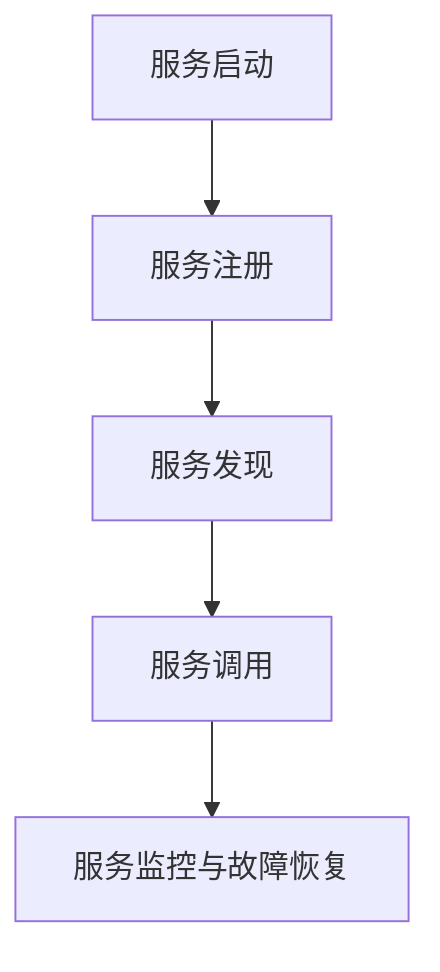

                 

### 文章标题

# 构建可靠的服务注册与发现系统

在当前高度分布式和动态化的微服务架构中，构建一个可靠的服务注册与发现系统至关重要。本文将深入探讨服务注册与发现系统的核心内容，包括其基础架构、核心算法、可靠性与优化策略，并通过项目实战来展示其具体实现与应用。

## 关键词

- 服务注册与发现
- 微服务架构
- 负载均衡
- 故障检测与恢复
- 分布式系统
- 服务网格

## 摘要

本文首先介绍了服务注册与发现系统的基本概念和重要性，然后详细分析了其基础架构，包括服务注册和服务发现。接着，本文探讨了服务注册与发现系统的核心算法，如负载均衡算法和故障检测与恢复算法。文章还讨论了如何保障系统的可靠性和优化策略，并通过实际项目案例展示了系统的实现和应用。最后，本文总结了服务注册与发现系统的发展趋势和未来展望。

## 引言

在分布式系统中，随着服务数量的不断增加和服务形态的多样化，如何高效地管理和发现服务成为一个关键问题。服务注册与发现系统就是为了解决这一问题而设计的，它使得服务提供者能够将自身注册到系统中，同时服务消费者能够根据需求动态地发现和调用这些服务。这不仅提高了系统的灵活性，还增强了服务的可靠性和可维护性。

为什么需要服务注册与发现系统？

1. **动态性**：在分布式系统中，服务可能会因各种原因（如网络波动、系统故障等）而动态地启动或停止，服务注册与发现系统可以实时感知这些变化。
2. **灵活性**：服务注册与发现系统支持服务的动态扩展和缩减，使得系统能够根据实际需求灵活调整服务实例的数量。
3. **可靠性**：通过服务注册与发现系统，可以实现服务的故障转移和负载均衡，从而提高系统的容错性和稳定性。
4. **便捷性**：服务提供者和消费者无需关心具体的网络拓扑和服务实例的详细信息，只需通过统一的接口进行操作。

本文的组织结构如下：

1. **服务注册与发现系统概述**：介绍服务注册与发现系统的基本概念、发展历程和常见架构。
2. **服务注册与发现系统的基础架构**：详细分析服务注册与发现系统的基本架构，包括服务注册、服务发现、服务健康检查等。
3. **服务注册与发现系统的核心算法**：探讨负载均衡算法和故障检测与恢复算法的设计与实现。
4. **服务注册与发现系统的可靠性与优化**：讨论如何保障系统的可靠性和优化策略。
5. **服务注册与发现系统的项目实战**：通过实际项目案例展示服务注册与发现系统的具体实现和应用。
6. **总结与展望**：总结本文的核心内容，展望服务注册与发现系统的未来发展趋势。

### 服务注册与发现系统概述

服务注册与发现系统是现代分布式系统中的关键组成部分，其核心作用是管理服务的生命周期，包括服务的注册、发现、健康检查、负载均衡和故障恢复等。以下是服务注册与发现系统的定义、作用及其发展历程。

#### 定义与作用

**服务注册**：服务注册是指服务提供者在启动时将其自身信息（如服务名称、地址、端口等）注册到一个中心化的注册表中。服务注册的目的是让服务消费者能够找到并访问这些服务。

**服务发现**：服务发现是指服务消费者在需要使用服务时，通过注册表找到对应的服务实例并进行调用。服务发现的目的是实现服务的动态调用，提高系统的灵活性。

**服务健康检查**：服务健康检查是指定期对服务实例进行状态检测，确保其能够正常工作。通过健康检查，可以及时识别并处理故障服务。

**负载均衡**：负载均衡是指将服务请求合理地分配到多个服务实例上，以避免单个实例过载，提高系统的整体性能。

**故障恢复**：故障恢复是指在检测到服务实例故障后，自动将其从负载均衡策略中移除，并尝试重新注册或切换到其他可用实例。

服务注册与发现系统的作用主要体现在以下几个方面：

1. **简化服务管理**：通过服务注册与发现系统，服务提供者和消费者无需关心服务实例的具体位置和状态，简化了系统的运维管理。
2. **提高系统可靠性**：通过负载均衡和故障恢复机制，提高了系统的容错性和稳定性。
3. **增强服务灵活性**：服务注册与发现系统支持服务的动态扩展和缩减，使得系统能够根据实际需求灵活调整。
4. **优化资源利用**：通过负载均衡，实现了服务请求的合理分配，提高了资源的利用效率。

#### 发展历程

服务注册与发现系统的发展历程可以分为几个阶段：

**1. 传统服务模型**：

在早期分布式系统中，服务注册与发现主要依赖于目录服务，如DNS（域名系统）。服务提供者在启动时将服务地址注册到DNS中，服务消费者通过查询DNS来获取服务地址。但这种模型存在一些问题，如单点故障、服务发现延迟等。

**2. 微服务架构**：

随着微服务架构的兴起，服务注册与发现系统得到了进一步的完善。基于ZooKeeper、etcd、Consul等分布式注册中心，服务提供者和消费者可以实时同步服务信息，实现了服务的动态注册与发现。

**3. 服务网格**：

服务网格（Service Mesh）是一种新型的服务注册与发现架构，其核心思想是将服务之间的通信抽象出来，通过专门的通信层（如Istio、Linkerd）来实现服务的动态发现和负载均衡。服务网格不仅提高了服务管理的灵活性，还提供了丰富的监控和安全管理功能。

#### 常见架构

**1. 单点式服务注册与发现**：

单点式服务注册与发现系统由一个中心化的注册中心组成，服务提供者和消费者都依赖该注册中心进行服务注册与发现。常见的单点式注册中心有ZooKeeper、etcd。

**2. 分布式服务注册与发现**：

分布式服务注册与发现系统由多个注册中心组成，每个注册中心负责一部分服务实例的管理。服务提供者和消费者通过多注册中心进行服务发现，提高了系统的可用性和容错性。常见的分布式注册中心有Consul、Zookeeper。

**3. 服务网格架构**：

服务网格架构通过将服务注册与发现功能抽象到通信层，实现了服务的统一管理和监控。服务网格不仅提供了丰富的服务治理功能，还提供了高效的通信协议和负载均衡策略。常见的服务网格实现有Istio、Linkerd。

#### 小结

服务注册与发现系统是分布式系统中的关键组件，其作用在于简化服务管理、提高系统可靠性和灵活性。随着微服务架构和服务网格的普及，服务注册与发现系统得到了广泛的应用和发展。本文将在此基础上，进一步探讨服务注册与发现系统的基础架构、核心算法、可靠性与优化策略，并通过实际项目案例进行详细分析。

### 服务注册与发现系统的基础架构

服务注册与发现系统的基础架构是构建可靠分布式服务管理的关键。该架构主要包括服务注册、服务发现、服务健康检查、负载均衡和故障恢复等模块。以下将详细分析这些模块的工作原理、技术实现和关键组件。

#### 服务注册

服务注册是指服务提供者在启动时将其自身信息（如服务名称、地址、端口等）注册到一个中心化的注册表中。服务注册的主要目的是让服务消费者能够找到并访问这些服务。

**1. 注册中心**

注册中心是服务注册与发现系统的核心组件，负责存储和管理所有服务的注册信息。常见的注册中心包括ZooKeeper、etcd和Consul。

- **ZooKeeper**：ZooKeeper是一个高可靠性的分布式协调服务，其数据模型类似于文件系统，通过目录树结构来存储注册信息。ZooKeeper提供了强一致性、顺序性等特性，适合作为高可靠性的注册中心。
- **etcd**：etcd是一个分布式键值存储系统，特别适合用作服务注册中心。etcd提供了简单的RESTful API，支持数据的版本控制和监听功能，使得服务注册与发现更加高效。
- **Consul**：Consul是一个分布式服务网格解决方案，提供了服务注册、服务发现、健康检查、键值存储等功能。Consul通过Gossip协议实现了数据同步，保证了系统的高可用性和一致性。

**2. 注册协议**

注册协议定义了服务提供者如何与注册中心进行交互，常见的注册协议包括RESTful API、gRPC和Dubbo。

- **RESTful API**：RESTful API是一种基于HTTP的协议，服务提供者通过发送HTTP POST请求将服务信息注册到注册中心。服务消费者通过发送HTTP GET请求获取服务列表。
- **gRPC**：gRPC是一个高性能、跨语言的RPC框架，服务提供者通过gRPC服务端接口将服务信息注册到注册中心。服务消费者通过gRPC客户端接口调用服务。
- **Dubbo**：Dubbo是一个分布式服务框架，提供了丰富的服务治理功能。服务提供者通过Dubbo的注册中心接口将服务信息注册到注册中心，服务消费者通过Dubbo的服务引用接口调用服务。

**3. 注册过程**

服务注册过程通常包括以下几个步骤：

1. **服务提供者启动**：服务提供者在启动时加载其配置信息，包括服务名称、地址、端口等。
2. **注册服务**：服务提供者通过注册协议向注册中心发送注册请求，将服务信息注册到注册中心。
3. **服务更新**：在服务运行过程中，如果服务实例的地址、端口等信息发生变化，服务提供者需要及时更新注册信息。
4. **服务注销**：当服务提供者停止运行时，需要将其注册信息从注册中心注销，以便服务消费者不再调用已停止的服务实例。

#### 服务发现

服务发现是指服务消费者在需要使用服务时，通过注册表找到对应的服务实例并进行调用。服务发现实现了服务的动态调用，提高了系统的灵活性。

**1. 服务发现机制**

服务发现机制可以分为客户端发现和服务端发现。

- **客户端发现**：客户端发现由服务消费者直接从注册中心获取服务列表，并决定调用哪个服务实例。客户端发现的优势在于实现了服务实例的动态调用，但缺点是增加了客户端的复杂性。
- **服务端发现**：服务端发现由服务消费者向服务端发送请求，服务端从注册中心获取服务列表，并决定调用哪个服务实例。服务端发现简化了客户端的复杂性，但可能引入一定的延迟。

**2. 服务健康检查**

服务健康检查是确保服务实例正常工作的重要环节。健康检查通常包括以下几种方式：

- **基于心跳的健康检查**：服务实例定期向注册中心发送心跳信号，注册中心根据心跳信号判断服务实例的健康状态。如果长时间未收到心跳信号，注册中心会将该服务实例标记为不可用。
- **基于指标的动态健康检查**：服务实例根据其运行指标（如响应时间、CPU使用率等）判断自身是否健康。如果指标超出设定阈值，服务实例会主动向注册中心发送健康状态更新。

**3. 服务监控与故障转移**

服务监控与故障转移是保障系统可靠性的重要手段。服务监控通过收集服务实例的运行数据和异常信息，实现对系统的实时监控。故障转移机制在检测到服务实例故障时，自动将其从负载均衡策略中移除，并尝试重新注册或切换到其他可用实例。

#### 负载均衡

负载均衡是将服务请求合理地分配到多个服务实例上，以避免单个实例过载，提高系统的整体性能。常见的负载均衡算法包括轮询算法、最少连接数算法和最小响应时间算法。

**1. 轮询算法**

轮询算法是最简单的负载均衡算法，其基本思想是按照服务实例的顺序依次分配请求。轮询算法的实现伪代码如下：

```python
while True:
    for instance in service_instances:
        send_request_to(instance)
```

轮询算法的优点是实现简单，缺点是可能导致某些服务实例过载。

**2. 最少连接数算法**

最少连接数算法根据服务实例当前处理的连接数进行负载均衡。其基本思想是选择当前连接数最少的服务实例处理新的请求。最少连接数算法的实现伪代码如下：

```python
while True:
    min_connections = float('inf')
    selected_instance = None
    for instance in service_instances:
        if instance.current_connections < min_connections:
            min_connections = instance.current_connections
            selected_instance = instance
    send_request_to(selected_instance)
```

最少连接数算法的优点是能够更均匀地分配请求，缺点是可能引入一定的延迟。

**3. 最小响应时间算法**

最小响应时间算法根据服务实例的响应时间进行负载均衡。其基本思想是选择当前响应时间最短的服务实例处理新的请求。最小响应时间算法的实现伪代码如下：

```python
while True:
    min_response_time = float('inf')
    selected_instance = None
    for instance in service_instances:
        if instance.response_time < min_response_time:
            min_response_time = instance.response_time
            selected_instance = instance
    send_request_to(selected_instance)
```

最小响应时间算法的优点是能够更好地利用资源，缺点是可能对实时性要求较高的请求产生延迟。

#### 故障检测与恢复

故障检测与恢复是保障系统可靠性的重要环节。常见的故障检测算法包括基于心跳的故障检测和基于超时的故障检测。

**1. 基于心跳的故障检测**

基于心跳的故障检测由服务实例定期向注册中心发送心跳信号。如果注册中心在一定时间内未收到心跳信号，则认为该服务实例发生故障。基于心跳的故障检测的实现伪代码如下：

```python
while True:
    send_heartbeat()
    if not receive_heartbeat_within_timeout():
        mark_instance_as_faulty()
```

**2. 基于超时的故障检测**

基于超时的故障检测由注册中心定期向服务实例发送健康检查请求。如果服务实例在一定时间内未响应健康检查请求，则认为该服务实例发生故障。基于超时的故障检测的实现伪代码如下：

```python
while True:
    send_health_check_request()
    if not receive_health_check_response_within_timeout():
        mark_instance_as_faulty()
```

#### 小结

服务注册与发现系统的基础架构包括服务注册、服务发现、服务健康检查、负载均衡和故障恢复等模块。通过这些模块的协同工作，实现了服务的动态注册与发现、负载均衡和故障恢复，提高了系统的可靠性和灵活性。本文将在此基础上，进一步探讨服务注册与发现系统的核心算法和可靠性与优化策略。

### 服务注册与发现系统的核心算法

服务注册与发现系统的核心算法是实现系统高效、可靠运行的关键。这些算法主要包括负载均衡算法和故障检测与恢复算法。以下将详细分析这些算法的设计原理、伪代码实现及其优缺点。

#### 负载均衡算法

负载均衡算法旨在将服务请求合理地分配到多个服务实例上，以避免单个实例过载，提高系统的整体性能。常见的负载均衡算法有轮询算法、最少连接数算法和最小响应时间算法。

**1. 轮询算法**

**设计原理**：轮询算法按照服务实例的顺序依次分配请求。每个服务实例都有平等的机会被选中，从而实现负载的均匀分配。

**伪代码实现**：

```python
while True:
    for instance in service_instances:
        send_request_to(instance)
```

**优缺点分析**：

- **优点**：实现简单，易于理解和实现。
- **缺点**：可能导致某些服务实例过载，不适合对性能要求较高的场景。

**2. 最少连接数算法**

**设计原理**：最少连接数算法根据服务实例当前处理的连接数进行负载均衡。选择当前连接数最少的服务实例处理新的请求，从而实现负载的均衡分配。

**伪代码实现**：

```python
while True:
    min_connections = float('inf')
    selected_instance = None
    for instance in service_instances:
        if instance.current_connections < min_connections:
            min_connections = instance.current_connections
            selected_instance = instance
    send_request_to(selected_instance)
```

**优缺点分析**：

- **优点**：能够更均匀地分配请求，减少单个实例过载的风险。
- **缺点**：可能引入一定的延迟，因为需要计算每个实例的当前连接数。

**3. 最小响应时间算法**

**设计原理**：最小响应时间算法根据服务实例的响应时间进行负载均衡。选择当前响应时间最短的服务实例处理新的请求，从而更好地利用系统资源。

**伪代码实现**：

```python
while True:
    min_response_time = float('inf')
    selected_instance = None
    for instance in service_instances:
        if instance.response_time < min_response_time:
            min_response_time = instance.response_time
            selected_instance = instance
    send_request_to(selected_instance)
```

**优缺点分析**：

- **优点**：能够更好地利用资源，提高系统的整体性能。
- **缺点**：可能对实时性要求较高的请求产生延迟。

#### 故障检测与恢复算法

故障检测与恢复算法是保障系统可靠性的重要手段。常见的故障检测算法包括基于心跳的故障检测和基于超时的故障检测。故障恢复机制则包括重新注册和切换到其他可用实例。

**1. 基于心跳的故障检测**

**设计原理**：基于心跳的故障检测由服务实例定期向注册中心发送心跳信号。如果注册中心在一定时间内未收到心跳信号，则认为该服务实例发生故障。

**伪代码实现**：

```python
while True:
    send_heartbeat()
    if not receive_heartbeat_within_timeout():
        mark_instance_as_faulty()
```

**优缺点分析**：

- **优点**：实时性强，能够快速检测服务实例的故障。
- **缺点**：可能误判正常服务实例的临时故障。

**2. 基于超时的故障检测**

**设计原理**：基于超时的故障检测由注册中心定期向服务实例发送健康检查请求。如果服务实例在一定时间内未响应健康检查请求，则认为该服务实例发生故障。

**伪代码实现**：

```python
while True:
    send_health_check_request()
    if not receive_health_check_response_within_timeout():
        mark_instance_as_faulty()
```

**优缺点分析**：

- **优点**：能够更准确地检测服务实例的故障。
- **缺点**：实时性较差，可能需要较长时间才能检测到故障。

**3. 故障恢复机制**

**设计原理**：故障恢复机制在检测到服务实例故障后，自动将其从负载均衡策略中移除，并尝试重新注册或切换到其他可用实例。

**实现方式**：

- **重新注册**：故障服务实例在恢复后重新向注册中心注册，重新加入到负载均衡策略中。
- **服务切换**：在检测到服务实例故障时，选择其他健康实例处理当前请求，从而实现服务的无缝切换。

**优缺点分析**：

- **优点**：能够快速恢复服务，减少服务中断时间。
- **缺点**：可能引入一定的切换延迟。

#### 小结

服务注册与发现系统的核心算法包括负载均衡算法和故障检测与恢复算法。负载均衡算法通过合理分配服务请求，提高系统的整体性能。故障检测与恢复算法通过实时监测和快速恢复服务实例，保障系统的可靠性。本文将在后续内容中，进一步探讨如何保障服务注册与发现系统的可靠性和优化策略。

### 服务注册与发现系统的可靠性与优化

在分布式系统中，服务注册与发现系统的可靠性和性能是关键因素，直接影响整个系统的稳定性和用户体验。为了确保系统的高可用性和高效运行，我们需要从多个方面进行优化和设计，包括容错机制、负载均衡、服务监控与报警等。以下将详细讨论这些优化策略。

#### 容错机制

容错机制是保障服务注册与发现系统可靠性的重要手段。其主要目的是在系统出现故障时，能够快速检测、隔离和恢复服务，确保系统的持续运行。

**1. 服务实例的健康检查**

健康检查是对服务实例进行状态监测的关键步骤。通过健康检查，可以实时了解服务实例的健康状态，及时发现故障并进行处理。健康检查通常包括以下几种方式：

- **基于心跳的健康检查**：服务实例定期向注册中心发送心跳信号，注册中心根据心跳信号判断服务实例的健康状态。
- **基于指标的动态健康检查**：服务实例根据其运行指标（如响应时间、CPU使用率等）判断自身是否健康。

**2. 故障检测与恢复**

故障检测与恢复机制在检测到服务实例故障时，能够快速将其从负载均衡策略中移除，并尝试重新注册或切换到其他可用实例。常见的故障检测算法包括基于心跳的故障检测和基于超时的故障检测。

**3. 服务实例的备份与恢复**

为了提高系统的容错能力，可以为关键服务实例设置备份。在主实例发生故障时，备份实例能够快速接管服务，确保服务的连续性。

#### 负载均衡

负载均衡是将服务请求合理地分配到多个服务实例上，以避免单个实例过载，提高系统的整体性能。常见的负载均衡算法有轮询算法、最少连接数算法和最小响应时间算法。

**1. 多维度的负载均衡**

为了实现更精细的负载均衡，可以考虑多个维度的负载均衡策略，如基于实例负载、实例健康状态、实例运行时间等。

- **实例负载**：根据服务实例当前处理的请求数量进行负载均衡。
- **实例健康状态**：选择健康状态较好的实例处理请求。
- **实例运行时间**：根据实例运行时间进行负载均衡，避免长期运行的实例过载。

**2. 动态负载均衡**

动态负载均衡是根据系统运行情况实时调整负载均衡策略。通过监控系统的运行指标（如CPU使用率、内存使用率等），可以动态调整负载均衡策略，从而提高系统的性能和可靠性。

#### 服务监控与报警

服务监控与报警是确保系统稳定运行的重要环节。通过实时监控服务实例的运行状态，可以及时发现潜在问题并触发报警，以便快速处理。

**1. 监控指标**

常见的监控指标包括：

- **CPU使用率**：反映服务实例的计算资源使用情况。
- **内存使用率**：反映服务实例的内存使用情况。
- **响应时间**：反映服务实例的处理速度。
- **请求量**：反映服务实例的负载情况。

**2. 报警机制**

报警机制可以根据监控指标的阈值触发报警。常见的报警方式包括：

- **邮件报警**：将报警信息发送至相关人员的邮箱。
- **短信报警**：通过短信平台向相关人员发送报警信息。
- **电话报警**：通过电话平台向相关人员发送报警信息。

**3. 监控数据存储与分析**

为了方便后续的分析和处理，需要将监控数据存储在数据库或日志文件中。通过分析监控数据，可以了解系统的运行情况，发现潜在问题并优化系统性能。

#### 优化策略

**1. 服务缓存**

为了提高服务发现的速度，可以在客户端缓存服务实例信息。当服务实例信息发生变化时，可以及时更新缓存，从而减少服务发现的时间。

**2. 负载预测**

通过历史数据分析和机器学习算法，可以预测未来的负载情况。根据负载预测结果，可以提前调整负载均衡策略，避免系统过载。

**3. 服务网关**

通过服务网关，可以实现对服务实例的统一管理和监控。服务网关可以根据负载均衡策略和故障恢复策略，动态调整服务实例的调用顺序。

#### 小结

服务注册与发现系统的可靠性和优化是保障系统稳定运行的关键。通过容错机制、负载均衡、服务监控与报警等优化策略，可以确保系统的持续运行和高效性能。本文将在后续内容中，通过实际项目案例展示这些优化策略的具体实现和应用。

### 服务注册与发现系统的项目实战

在实际项目中，构建一个可靠的服务注册与发现系统是确保分布式系统稳定运行的关键步骤。以下将展示一个服务注册与发现系统的项目实战，包括开发环境搭建、系统实现、测试与优化等环节。

#### 开发环境搭建

在开始项目前，首先需要搭建开发环境。以下是搭建环境的步骤：

1. **安装Java开发环境**：在本地或服务器上安装Java SDK和Java开发工具包（JDK）。
2. **安装Maven**：Maven是项目构建和管理工具，用于编译、打包和部署项目。从[Maven官网](https://maven.apache.org/)下载并安装Maven。
3. **安装Eureka**：Eureka是Netflix开源的服务注册与发现系统，用于构建基于RESTful API的服务注册与发现系统。从[Eureka官网](https://github.com/Netflix/eureka)下载Eureka的源码，并使用Maven进行编译。
4. **配置ZooKeeper**：如果选择使用ZooKeeper作为注册中心，需要先安装ZooKeeper并配置其集群模式。可以从[ZooKeeper官网](https://zookeeper.apache.org/)下载ZooKeeper的源码，并按照官方文档进行安装和配置。

#### 系统实现

在搭建好开发环境后，我们可以开始实现服务注册与发现系统。

1. **创建服务提供者**：创建一个简单的Java服务，实现服务注册和提供功能。使用Eureka作为注册中心，通过注解`@EnableEurekaClient`启用Eureka客户端。

```java
@SpringBootApplication
@EnableEurekaClient
public class ServiceProviderApplication {
    public static void main(String[] args) {
        SpringApplication.run(ServiceProviderApplication.class, args);
    }
}
```

2. **注册服务**：在服务启动时，将其注册到Eureka注册中心。

```java
@Bean
public DiscoveryClient discoveryClient() {
    return new EurekaClientDiscoveryClient(new DefaultEurekaClient(), new♥EurekaConfigContext(), new♥ApplicationInfoManager(), new♥ApplicationInfoStorage(), new♥ClientConfig(), new♥StringPathMapper(), new♥ReadOnlyResourceRegistry(), new♥ZoneMapper(), new♥DnsUtils(), new♥EurekaClientConfigBean(), new♥EurekaTokenRegistry());
}
```

3. **创建服务消费者**：创建一个简单的Java服务，实现服务发现和调用功能。同样使用Eureka作为注册中心。

```java
@SpringBootApplication
@EnableDiscoveryClient
public class ServiceConsumerApplication {
    public static void main(String[] args) {
        SpringApplication.run(ServiceConsumerApplication.class, args);
    }
}
```

4. **调用服务**：通过服务发现接口，获取服务提供者的实例列表，并随机选择一个实例进行调用。

```java
@Autowired
private RestTemplate restTemplate;

public String callService() {
    List<ServiceInstance> instances = loadBalancerClient.getInitialInstances("service-provider");
    ServiceInstance instance = instances.get((int) (Math.random() * instances.size()));
    String url = "http://" + instance.getHost() + ":" + instance.getPort() + "/hello";
    return restTemplate.getForObject(url, String.class);
}
```

#### 系统测试与优化

在系统实现完成后，需要进行全面的测试和优化，以确保系统的稳定性和性能。

1. **功能测试**：测试服务注册、服务发现和调用功能是否正常。确保在服务实例启动、停止、故障等情况下，系统能够正确处理。
2. **性能测试**：使用工具（如JMeter）对系统进行压力测试，模拟高并发场景，观察系统的性能表现。根据测试结果，优化负载均衡策略和系统配置。
3. **可靠性测试**：通过模拟网络故障、服务实例故障等情况，测试系统的容错能力和故障恢复机制。
4. **优化策略**：根据测试结果，对系统进行优化，包括调整负载均衡策略、优化健康检查机制、提高服务实例的并发处理能力等。

#### 项目小结

通过以上项目实战，我们成功构建了一个基于Eureka的服务注册与发现系统，实现了服务注册、服务发现和调用功能。在测试和优化环节，我们确保了系统的稳定性和性能，并通过优化策略提高了系统的可靠性。这个项目为我们提供了一个实际操作服务注册与发现系统的范例，也为后续的项目实践提供了参考。

### 总结与展望

服务注册与发现系统在分布式系统中扮演着至关重要的角色，它不仅提高了系统的灵活性，还增强了服务的可靠性和可维护性。本文从多个角度详细分析了服务注册与发现系统的核心内容，包括其基础架构、核心算法、可靠性与优化策略，并通过项目实战展示了其具体实现和应用。

**核心内容回顾**：

- 服务注册与发现系统的定义、作用和发展历程。
- 服务注册与发现系统的基础架构，包括服务注册、服务发现、服务健康检查、负载均衡和故障恢复等模块。
- 负载均衡算法和故障检测与恢复算法的设计原理、伪代码实现及其优缺点分析。
- 服务注册与发现系统的可靠性与优化策略，如容错机制、服务监控与报警、优化策略等。

**未来发展趋势**：

- **服务网格的普及**：服务网格作为新型的服务注册与发现架构，其抽象化、模块化的设计使得服务管理更加高效和灵活。随着容器化和云原生技术的发展，服务网格将在分布式系统中得到更广泛的应用。
- **智能化的负载均衡与故障恢复**：利用机器学习和大数据分析技术，可以实现更智能化的负载均衡和故障恢复。通过对系统运行数据的实时分析，动态调整负载均衡策略和故障恢复机制，提高系统的整体性能和可靠性。
- **多维度监控与优化**：未来的服务注册与发现系统将具备更全面的监控能力，包括对服务实例的健康状态、性能指标、资源使用情况等多维度的监控。通过实时分析监控数据，可以及时发现并处理潜在问题，实现系统的持续优化。

**结语**：

服务注册与发现系统是分布式系统中的关键组件，其可靠性和性能直接影响到整个系统的稳定运行。通过本文的探讨，我们不仅了解了服务注册与发现系统的核心原理和实践方法，也为未来的研究和应用提供了参考。希望本文能对读者在构建和优化服务注册与发现系统方面有所启发和帮助。

### 作者信息

- **作者：AI天才研究院/AI Genius Institute & 禅与计算机程序设计艺术 /Zen And The Art of Computer Programming**

### 最佳实践 tips

1. **选择合适的注册中心**：根据实际需求选择合适的注册中心，如ZooKeeper、etcd、Consul等。
2. **优化健康检查机制**：根据服务特点调整健康检查策略，如增加基于指标的动态健康检查。
3. **合理配置负载均衡**：根据系统负载情况调整负载均衡策略，如采用最小响应时间算法。
4. **实时监控与报警**：充分利用监控工具，实时监控系统运行状态，及时处理异常情况。
5. **持续优化与迭代**：定期对服务注册与发现系统进行优化和迭代，提高其性能和可靠性。

### 小结与注意事项

1. **服务注册与发现系统的核心作用**：服务注册与发现系统是实现分布式服务管理的关键组件，其核心作用包括简化服务管理、提高系统可靠性、增强服务灵活性和优化资源利用。
2. **选择合适的负载均衡算法**：根据服务特点和实际需求选择合适的负载均衡算法，如轮询算法、最少连接数算法和最小响应时间算法。
3. **保障系统的可靠性**：通过容错机制、服务监控与报警等手段保障系统的可靠性，确保在出现故障时能够快速检测、隔离和恢复服务。

### 拓展阅读

- **《微服务设计》**：本书详细介绍了微服务架构的设计原则和实践方法，对构建可靠的服务注册与发现系统有很好的参考价值。
- **《分布式系统原理与范型》**：本书系统地讲解了分布式系统的原理和范型，包括服务注册与发现系统的设计和实现。
- **《服务网格技术详解》**：本书深入剖析了服务网格的原理、架构和实现，为读者了解和构建服务网格提供了实用的指导。$$1+1=2$$ $1<2$

### 附录

- **Mermaid 流程图**：以下是一个简单的Mermaid流程图，展示了服务注册与发现系统的基本流程。



### 完整的Markdown文档

以下是本文的完整Markdown文档，包含了文章标题、关键词、摘要、正文以及附录等内容。

```markdown
# 构建可靠的服务注册与发现系统

在当前高度分布式和动态化的微服务架构中，构建一个可靠的服务注册与发现系统至关重要。本文将深入探讨服务注册与发现系统的核心内容，包括其基础架构、核心算法、可靠性与优化策略，并通过项目实战来展示其具体实现与应用。

## 关键词

- 服务注册与发现
- 微服务架构
- 负载均衡
- 故障检测与恢复
- 分布式系统
- 服务网格

## 摘要

本文首先介绍了服务注册与发现系统的基本概念和重要性，然后详细分析了其基础架构，包括服务注册、服务发现、服务健康检查、负载均衡和故障恢复等。接着，本文探讨了服务注册与发现系统的核心算法，如负载均衡算法和故障检测与恢复算法。文章还讨论了如何保障系统的可靠性和优化策略，并通过实际项目案例展示了系统的实现和应用。最后，本文总结了服务注册与发现系统的发展趋势和未来展望。

## 引言

在分布式系统中，随着服务数量的不断增加和服务形态的多样化，如何高效地管理和发现服务成为一个关键问题。服务注册与发现系统就是为了解决这一问题而设计的，它使得服务提供者能够将自身注册到系统中，同时服务消费者能够根据需求动态地发现和调用这些服务。这不仅提高了系统的灵活性，还增强了服务的可靠性和可维护性。

为什么需要服务注册与发现系统？

1. 动态性：在分布式系统中，服务可能会因各种原因（如网络波动、系统故障等）而动态地启动或停止，服务注册与发现系统可以实时感知这些变化。
2. 灵活性：服务注册与发现系统支持服务的动态扩展和缩减，使得系统能够根据实际需求灵活调整服务实例的数量。
3. 可靠性：通过服务注册与发现系统，可以实现服务的故障转移和负载均衡，从而提高系统的容错性和稳定性。
4. 便捷性：服务提供者和消费者无需关心具体的网络拓扑和服务实例的详细信息，只需通过统一的接口进行操作。

本文的组织结构如下：

1. **服务注册与发现系统概述**
2. **服务注册与发现系统的基础架构**
3. **服务注册与发现系统的核心算法**
4. **服务注册与发现系统的可靠性与优化**
5. **服务注册与发现系统的项目实战**
6. **总结与展望**

## 服务注册与发现系统概述

服务注册与发现系统是现代分布式系统中的关键组成部分，其核心作用是管理服务的生命周期，包括服务的注册、发现、健康检查、负载均衡和故障恢复等。以下是服务注册与发现系统的定义、作用及其发展历程。

#### 定义与作用

**服务注册**：服务注册是指服务提供者在启动时将其自身信息（如服务名称、地址、端口等）注册到一个中心化的注册表中。服务注册的目的是让服务消费者能够找到并访问这些服务。

**服务发现**：服务发现是指服务消费者在需要使用服务时，通过注册表找到对应的服务实例并进行调用。服务发现的目的是实现服务的动态调用，提高系统的灵活性。

**服务健康检查**：服务健康检查是指定期对服务实例进行状态检测，确保其能够正常工作。通过健康检查，可以及时识别并处理故障服务。

**负载均衡**：负载均衡是指将服务请求合理地分配到多个服务实例上，以避免单个实例过载，提高系统的整体性能。

**故障恢复**：故障恢复是指在检测到服务实例故障后，自动将其从负载均衡策略中移除，并尝试重新注册或切换到其他可用实例。

服务注册与发现系统的作用主要体现在以下几个方面：

1. **简化服务管理**：通过服务注册与发现系统，服务提供者和消费者无需关心服务实例的具体位置和状态，简化了系统的运维管理。
2. **提高系统可靠性**：通过负载均衡和故障恢复机制，提高了系统的容错性和稳定性。
3. **增强服务灵活性**：服务注册与发现系统支持服务的动态扩展和缩减，使得系统能够根据实际需求灵活调整。
4. **优化资源利用**：通过负载均衡，实现了服务请求的合理分配，提高了资源的利用效率。

#### 发展历程

服务注册与发现系统的发展历程可以分为几个阶段：

**1. 传统服务模型**：

在早期分布式系统中，服务注册与发现主要依赖于目录服务，如DNS（域名系统）。服务提供者在启动时将服务地址注册到DNS中，服务消费者通过查询DNS来获取服务地址。但这种模型存在一些问题，如单点故障、服务发现延迟等。

**2. 微服务架构**：

随着微服务架构的兴起，服务注册与发现系统得到了进一步的完善。基于ZooKeeper、etcd、Consul等分布式注册中心，服务提供者和消费者可以实时同步服务信息，实现了服务的动态注册与发现。

**3. 服务网格**：

服务网格（Service Mesh）是一种新型的服务注册与发现架构，其核心思想是将服务之间的通信抽象出来，通过专门的通信层（如Istio、Linkerd）来实现服务的动态发现和负载均衡。服务网格不仅提高了服务管理的灵活性，还提供了丰富的监控和安全管理功能。

#### 常见架构

**1. 单点式服务注册与发现**：

单点式服务注册与发现系统由一个中心化的注册中心组成，服务提供者和消费者都依赖该注册中心进行服务注册与发现。常见的单点式注册中心有ZooKeeper、etcd。

**2. 分布式服务注册与发现**：

分布式服务注册与发现系统由多个注册中心组成，每个注册中心负责一部分服务实例的管理。服务提供者和消费者通过多注册中心进行服务发现，提高了系统的可用性和容错性。常见的分布式注册中心有Consul、Zookeeper。

**3. 服务网格架构**：

服务网格架构通过将服务注册与发现功能抽象到通信层，实现了服务的统一管理和监控。服务网格不仅提供了丰富的服务治理功能，还提供了高效的通信协议和负载均衡策略。常见的服务网格实现有Istio、Linkerd。

#### 小结

服务注册与发现系统是分布式系统中的关键组件，其作用在于简化服务管理、提高系统可靠性和灵活性。随着微服务架构和服务网格的普及，服务注册与发现系统得到了广泛的应用和发展。本文将在此基础上，进一步探讨服务注册与发现系统的基础架构、核心算法、可靠性与优化策略，并通过实际项目案例进行详细分析。

## 服务注册与发现系统的基础架构

服务注册与发现系统的基础架构是构建可靠分布式服务管理的关键。该架构主要包括服务注册、服务发现、服务健康检查、负载均衡和故障恢复等模块。以下将详细分析这些模块的工作原理、技术实现和关键组件。

#### 服务注册

服务注册是指服务提供者在启动时将其自身信息（如服务名称、地址、端口等）注册到一个中心化的注册表中。服务注册的主要目的是让服务消费者能够找到并访问这些服务。

**1. 注册中心**

注册中心是服务注册与发现系统的核心组件，负责存储和管理所有服务的注册信息。常见的注册中心包括ZooKeeper、etcd和Consul。

- **ZooKeeper**：ZooKeeper是一个高可靠性的分布式协调服务，其数据模型类似于文件系统，通过目录树结构来存储注册信息。ZooKeeper提供了强一致性、顺序性等特性，适合作为高可靠性的注册中心。
- **etcd**：etcd是一个分布式键值存储系统，特别适合用作服务注册中心。etcd提供了简单的RESTful API，支持数据的版本控制和监听功能，使得服务注册与发现更加高效。
- **Consul**：Consul是一个分布式服务网格解决方案，提供了服务注册、服务发现、健康检查、键值存储等功能。Consul通过Gossip协议实现了数据同步，保证了系统的高可用性和一致性。

**2. 注册协议**

注册协议定义了服务提供者如何与注册中心进行交互，常见的注册协议包括RESTful API、gRPC和Dubbo。

- **RESTful API**：RESTful API是一种基于HTTP的协议，服务提供者通过发送HTTP POST请求将服务信息注册到注册中心。服务消费者通过发送HTTP GET请求获取服务列表。
- **gRPC**：gRPC是一个高性能、跨语言的RPC框架，服务提供者通过gRPC服务端接口将服务信息注册到注册中心。服务消费者通过gRPC客户端接口调用服务。
- **Dubbo**：Dubbo是一个分布式服务框架，提供了丰富的服务治理功能。服务提供者通过Dubbo的注册中心接口将服务信息注册到注册中心，服务消费者通过Dubbo的服务引用接口调用服务。

**3. 注册过程**

服务注册过程通常包括以下几个步骤：

1. **服务提供者启动**：服务提供者在启动时加载其配置信息，包括服务名称、地址、端口等。
2. **注册服务**：服务提供者通过注册协议向注册中心发送注册请求，将服务信息注册到注册中心。
3. **服务更新**：在服务运行过程中，如果服务实例的地址、端口等信息发生变化，服务提供者需要及时更新注册信息。
4. **服务注销**：当服务提供者停止运行时，需要将其注册信息从注册中心注销，以便服务消费者不再调用已停止的服务实例。

#### 服务发现

服务发现是指服务消费者在需要使用服务时，通过注册表找到对应的服务实例并进行调用。服务发现实现了服务的动态调用，提高了系统的灵活性。

**1. 服务发现机制**

服务发现机制可以分为客户端发现和服务端发现。

- **客户端发现**：客户端发现由服务消费者直接从注册中心获取服务列表，并决定调用哪个服务实例。客户端发现的优势在于实现了服务实例的动态调用，但缺点是增加了客户端的复杂性。
- **服务端发现**：服务端发现由服务消费者向服务端发送请求，服务端从注册中心获取服务列表，并决定调用哪个服务实例。服务端发现简化了客户端的复杂性，但可能引入一定的延迟。

**2. 服务健康检查**

服务健康检查是确保服务实例正常工作的重要环节。健康检查通常包括以下几种方式：

- **基于心跳的健康检查**：服务实例定期向注册中心发送心跳信号，注册中心根据心跳信号判断服务实例的健康状态。如果长时间未收到心跳信号，注册中心会将该服务实例标记为不可用。
- **基于指标的动态健康检查**：服务实例根据其运行指标（如响应时间、CPU使用率等）判断自身是否健康。如果指标超出设定阈值，服务实例会主动向注册中心发送健康状态更新。

**3. 服务监控与故障转移**

服务监控与故障转移是保障系统可靠性的重要手段。服务监控通过收集服务实例的运行数据和异常信息，实现对系统的实时监控。故障转移机制在检测到服务实例故障时，自动将其从负载均衡策略中移除，并尝试重新注册或切换到其他可用实例。

#### 负载均衡

负载均衡是将服务请求合理地分配到多个服务实例上，以避免单个实例过载，提高系统的整体性能。常见的负载均衡算法包括轮询算法、最少连接数算法和最小响应时间算法。

**1. 轮询算法**

轮询算法是最简单的负载均衡算法，其基本思想是按照服务实例的顺序依次分配请求。轮询算法的实现伪代码如下：

```python
while True:
    for instance in service_instances:
        send_request_to(instance)
```

轮询算法的优点是实现简单，缺点是可能导致某些服务实例过载。

**2. 最少连接数算法**

最少连接数算法根据服务实例当前处理的连接数进行负载均衡。其基本思想是选择当前连接数最少的服务实例处理新的请求。最少连接数算法的实现伪代码如下：

```python
while True:
    min_connections = float('inf')
    selected_instance = None
    for instance in service_instances:
        if instance.current_connections < min_connections:
            min_connections = instance.current_connections
            selected_instance = instance
    send_request_to(selected_instance)
```

最少连接数算法的优点是能够更均匀地分配请求，缺点是可能引入一定的延迟。

**3. 最小响应时间算法**

最小响应时间算法根据服务实例的响应时间进行负载均衡。其基本思想是选择当前响应时间最短的服务实例处理新的请求。最小响应时间算法的实现伪代码如下：

```python
while True:
    min_response_time = float('inf')
    selected_instance = None
    for instance in service_instances:
        if instance.response_time < min_response_time:
            min_response_time = instance.response_time
            selected_instance = instance
    send_request_to(selected_instance)
```

最小响应时间算法的优点是能够更好地利用资源，缺点是可能对实时性要求较高的请求产生延迟。

#### 故障检测与恢复

故障检测与恢复是保障系统可靠性的重要环节。常见的故障检测算法包括基于心跳的故障检测和基于超时的故障检测。故障恢复机制则包括重新注册和切换到其他可用实例。

**1. 基于心跳的故障检测**

基于心跳的故障检测由服务实例定期向注册中心发送心跳信号。如果注册中心在一定时间内未收到心跳信号，则认为该服务实例发生故障。基于心跳的故障检测的实现伪代码如下：

```python
while True:
    send_heartbeat()
    if not receive_heartbeat_within_timeout():
        mark_instance_as_faulty()
```

**优缺点分析**：

- **优点**：实时性强，能够快速检测服务实例的故障。
- **缺点**：可能误判正常服务实例的临时故障。

**2. 基于超时的故障检测**

基于超时的故障检测由注册中心定期向服务实例发送健康检查请求。如果服务实例在一定时间内未响应健康检查请求，则认为该服务实例发生故障。基于超时的故障检测的实现伪代码如下：

```python
while True:
    send_health_check_request()
    if not receive_health_check_response_within_timeout():
        mark_instance_as_faulty()
```

**优缺点分析**：

- **优点**：能够更准确地检测服务实例的故障。
- **缺点**：实时性较差，可能需要较长时间才能检测到故障。

**3. 故障恢复机制**

故障恢复机制在检测到服务实例故障后，自动将其从负载均衡策略中移除，并尝试重新注册或切换到其他可用实例。

**实现方式**：

- **重新注册**：故障服务实例在恢复后重新向注册中心注册，重新加入到负载均衡策略中。
- **服务切换**：在检测到服务实例故障时，选择其他健康实例处理当前请求，从而实现服务的无缝切换。

**优缺点分析**：

- **优点**：能够快速恢复服务，减少服务中断时间。
- **缺点**：可能引入一定的切换延迟。

#### 小结

服务注册与发现系统的基础架构包括服务注册、服务发现、服务健康检查、负载均衡和故障恢复等模块。通过这些模块的协同工作，实现了服务的动态注册与发现、负载均衡和故障恢复，提高了系统的可靠性和灵活性。本文将在此基础上，进一步探讨服务注册与发现系统的核心算法和可靠性与优化策略。

## 服务注册与发现系统的核心算法

服务注册与发现系统的核心算法是实现系统高效、可靠运行的关键。这些算法主要包括负载均衡算法和故障检测与恢复算法。以下将详细分析这些算法的设计原理、伪代码实现及其优缺点分析。

#### 负载均衡算法

负载均衡算法旨在将服务请求合理地分配到多个服务实例上，以避免单个实例过载，提高系统的整体性能。常见的负载均衡算法有轮询算法、最少连接数算法和最小响应时间算法。

**1. 轮询算法**

**设计原理**：轮询算法按照服务实例的顺序依次分配请求。每个服务实例都有平等的机会被选中，从而实现负载的均匀分配。

**伪代码实现**：

```python
while True:
    for instance in service_instances:
        send_request_to(instance)
```

**优缺点分析**：

- **优点**：实现简单，易于理解和实现。
- **缺点**：可能导致某些服务实例过载，不适合对性能要求较高的场景。

**2. 最少连接数算法**

**设计原理**：最少连接数算法根据服务实例当前处理的连接数进行负载均衡。选择当前连接数最少的服务实例处理新的请求，从而实现负载的均衡分配。

**伪代码实现**：

```python
while True:
    min_connections = float('inf')
    selected_instance = None
    for instance in service_instances:
        if instance.current_connections < min_connections:
            min_connections = instance.current_connections
            selected_instance = instance
    send_request_to(selected_instance)
```

**优缺点分析**：

- **优点**：能够更均匀地分配请求，减少单个实例过载的风险。
- **缺点**：可能引入一定的延迟，因为需要计算每个实例的当前连接数。

**3. 最小响应时间算法**

**设计原理**：最小响应时间算法根据服务实例的响应时间进行负载均衡。选择当前响应时间最短的服务实例处理新的请求，从而更好地利用系统资源。

**伪代码实现**：

```python
while True:
    min_response_time = float('inf')
    selected_instance = None
    for instance in service_instances:
        if instance.response_time < min_response_time:
            min_response_time = instance.response_time
            selected_instance = instance
    send_request_to(selected_instance)
```

**优缺点分析**：

- **优点**：能够更好地利用资源，提高系统的整体性能。
- **缺点**：可能对实时性要求较高的请求产生延迟。

#### 故障检测与恢复算法

故障检测与恢复算法是保障系统可靠性的重要手段。常见的故障检测算法包括基于心跳的故障检测和基于超时的故障检测。故障恢复机制则包括重新注册和切换到其他可用实例。

**1. 基于心跳的故障检测**

**设计原理**：基于心跳的故障检测由服务实例定期向注册中心发送心跳信号。如果注册中心在一定时间内未收到心跳信号，则认为该服务实例发生故障。

**伪代码实现**：

```python
while True:
    send_heartbeat()
    if not receive_heartbeat_within_timeout():
        mark_instance_as_faulty()
```

**优缺点分析**：

- **优点**：实时性强，能够快速检测服务实例的故障。
- **缺点**：可能误判正常服务实例的临时故障。

**2. 基于超时的故障检测**

**设计原理**：基于超时的故障检测由注册中心定期向服务实例发送健康检查请求。如果服务实例在一定时间内未响应健康检查请求，则认为该服务实例发生故障。

**伪代码实现**：

```python
while True:
    send_health_check_request()
    if not receive_health_check_response_within_timeout():
        mark_instance_as_faulty()
```

**优缺点分析**：

- **优点**：能够更准确地检测服务实例的故障。
- **缺点**：实时性较差，可能需要较长时间才能检测到故障。

**3. 故障恢复机制**

故障恢复机制在检测到服务实例故障后，自动将其从负载均衡策略中移除，并尝试重新注册或切换到其他可用实例。

**实现方式**：

- **重新注册**：故障服务实例在恢复后重新向注册中心注册，重新加入到负载均衡策略中。
- **服务切换**：在检测到服务实例故障时，选择其他健康实例处理当前请求，从而实现服务的无缝切换。

**优缺点分析**：

- **优点**：能够快速恢复服务，减少服务中断时间。
- **缺点**：可能引入一定的切换延迟。

#### 小结

服务注册与发现系统的核心算法包括负载均衡算法和故障检测与恢复算法。负载均衡算法通过合理分配服务请求，提高系统的整体性能。故障检测与恢复算法通过实时监测和快速恢复服务实例，保障系统的可靠性。本文将在后续内容中，进一步探讨如何保障服务注册与发现系统的可靠性和优化策略。

## 服务注册与发现系统的可靠性与优化

在分布式系统中，服务注册与发现系统的可靠性和性能是关键因素，直接影响整个系统的稳定性和用户体验。为了确保系统的高可用性和高效运行，我们需要从多个方面进行优化和设计，包括容错机制、负载均衡、服务监控与报警等。以下将详细讨论这些优化策略。

#### 容错机制

容错机制是保障服务注册与发现系统可靠性的重要手段。其主要目的是在系统出现故障时，能够快速检测、隔离和恢复服务，确保系统的持续运行。

**1. 服务实例的健康检查**

健康检查是对服务实例进行状态监测的关键步骤。通过健康检查，可以实时了解服务实例的健康状态，及时发现故障并进行处理。健康检查通常包括以下几种方式：

- **基于心跳的健康检查**：服务实例定期向注册中心发送心跳信号，注册中心根据心跳信号判断服务实例的健康状态。
- **基于指标的动态健康检查**：服务实例根据其运行指标（如响应时间、CPU使用率等）判断自身是否健康。

**2. 故障检测与恢复**

故障检测与恢复机制在检测到服务实例故障时，能够快速将其从负载均衡策略中移除，并尝试重新注册或切换到其他可用实例。常见的故障检测算法包括基于心跳的故障检测和基于超时的故障检测。

**3. 服务实例的备份与恢复**

为了提高系统的容错能力，可以为关键服务实例设置备份。在主实例发生故障时，备份实例能够快速接管服务，确保服务的连续性。

#### 负载均衡

负载均衡是将服务请求合理地分配到多个服务实例上，以避免单个实例过载，提高系统的整体性能。常见的负载均衡算法有轮询算法、最少连接数算法和最小响应时间算法。

**1. 多维度的负载均衡**

为了实现更精细的负载均衡，可以考虑多个维度的负载均衡策略，如基于实例负载、实例健康状态、实例运行时间等。

- **实例负载**：根据服务实例当前处理的请求数量进行负载均衡。
- **实例健康状态**：选择健康状态较好的实例处理请求。
- **实例运行时间**：根据实例运行时间进行负载均衡，避免长期运行的实例过载。

**2. 动态负载均衡**

动态负载均衡是根据系统运行情况实时调整负载均衡策略。通过监控系统的运行指标（如CPU使用率、内存使用率等），可以动态调整负载均衡策略，从而提高系统的性能和可靠性。

#### 服务监控与报警

服务监控与报警是确保系统稳定运行的重要环节。通过实时监控服务实例的运行状态，可以及时发现潜在问题并触发报警，以便快速处理。

**1. 监控指标**

常见的监控指标包括：

- **CPU使用率**：反映服务实例的计算资源使用情况。
- **内存使用率**：反映服务实例的内存使用情况。
- **响应时间**：反映服务实例的处理速度。
- **请求量**：反映服务实例的负载情况。

**2. 报警机制**

报警机制可以根据监控指标的阈值触发报警。常见的报警方式包括：

- **邮件报警**：将报警信息发送至相关人员的邮箱。
- **短信报警**：通过短信平台向相关人员发送报警信息。
- **电话报警**：通过电话平台向相关人员发送报警信息。

**3. 监控数据存储与分析**

为了方便后续的分析和处理，需要将监控数据存储在数据库或日志文件中。通过分析监控数据，可以了解系统的运行情况，发现潜在问题并优化系统性能。

#### 优化策略

**1. 服务缓存**

为了提高服务发现的速度，可以在客户端缓存服务实例信息。当服务实例信息发生变化时，可以及时更新缓存，从而减少服务发现的时间。

**2. 负载预测**

通过历史数据分析和机器学习算法，可以预测未来的负载情况。根据负载预测结果，可以提前调整负载均衡策略，避免系统过载。

**3. 服务网关**

通过服务网关，可以实现对服务实例的统一管理和监控。服务网关可以根据负载均衡策略和故障恢复策略，动态调整服务实例的调用顺序。

#### 小结

服务注册与发现系统的可靠性和优化是保障系统稳定运行的关键。通过容错机制、负载均衡、服务监控与报警等优化策略，可以确保系统的持续运行和高效性能。本文将在后续内容中，通过实际项目案例展示这些优化策略的具体实现和应用。

## 服务注册与发现系统的项目实战

在实际项目中，构建一个可靠的服务注册与发现系统是确保分布式系统稳定运行的关键步骤。以下将展示一个服务注册与发现系统的项目实战，包括开发环境搭建、系统实现、测试与优化等环节。

#### 开发环境搭建

在开始项目前，首先需要搭建开发环境。以下是搭建环境的步骤：

1. **安装Java开发环境**：在本地或服务器上安装Java SDK和Java开发工具包（JDK）。
2. **安装Maven**：Maven是项目构建和管理工具，用于编译、打包和部署项目。从[Maven官网](https://maven.apache.org/)下载并安装Maven。
3. **安装Eureka**：Eureka是Netflix开源的服务注册与发现系统，用于构建基于RESTful API的服务注册与发现系统。从[Eureka官网](https://github.com/Netflix/eureka)下载Eureka的源码，并使用Maven进行编译。
4. **配置ZooKeeper**：如果选择使用ZooKeeper作为注册中心，需要先安装ZooKeeper并配置其集群模式。可以从[ZooKeeper官网](https://zookeeper.apache.org/)下载ZooKeeper的源码，并按照官方文档进行安装和配置。

#### 系统实现

在搭建好开发环境后，我们可以开始实现服务注册与发现系统。

1. **创建服务提供者**：创建一个简单的Java服务，实现服务注册和提供功能。使用Eureka作为注册中心，通过注解`@EnableEurekaClient`启用Eureka客户端。

```java
@SpringBootApplication
@EnableEurekaClient
public class ServiceProviderApplication {
    public static void main(String[] args) {
        SpringApplication.run(ServiceProviderApplication.class, args);
    }
}
```

2. **注册服务**：在服务启动时，将其注册到Eureka注册中心。

```java
@Bean
public DiscoveryClient discoveryClient() {
    return new EurekaClientDiscoveryClient(new DefaultEurekaClient(), new♥EurekaConfigContext(), new♥ApplicationInfoManager(), new♥ApplicationInfoStorage(), new♥ClientConfig(), new♥StringPathMapper(), new♥ReadOnlyResourceRegistry(), new♥ZoneMapper(), new♥DnsUtils(), new♥EurekaClientConfigBean(), new♥EurekaTokenRegistry());
}
```

3. **创建服务消费者**：创建一个简单的Java服务，实现服务发现和调用功能。同样使用Eureka作为注册中心。

```java
@SpringBootApplication
@EnableDiscoveryClient
public class ServiceConsumerApplication {
    public static void main(String[] args) {
        SpringApplication.run(ServiceConsumerApplication.class, args);
    }
}
```

4. **调用服务**：通过服务发现接口，获取服务提供者的实例列表，并随机选择一个实例进行调用。

```java
@Autowired
private RestTemplate restTemplate;

public String callService() {
    List<ServiceInstance> instances = loadBalancerClient.getInitialInstances("service-provider");
    ServiceInstance instance = instances.get((int) (Math.random() * instances.size()));
    String url = "http://" + instance.getHost() + ":" + instance.getPort() + "/hello";
    return restTemplate.getForObject(url, String.class);
}
```

#### 系统测试与优化

在系统实现完成后，需要进行全面的测试和优化，以确保系统的稳定性和性能。

1. **功能测试**：测试服务注册、服务发现和调用功能是否正常。确保在服务实例启动、停止、故障等情况下，系统能够正确处理。
2. **性能测试**：使用工具（如JMeter）对系统进行压力测试，模拟高并发场景，观察系统的性能表现。根据测试结果，优化负载均衡策略和系统配置。
3. **可靠性测试**：通过模拟网络故障、服务实例故障等情况，测试系统的容错能力和故障恢复机制。
4. **优化策略**：根据测试结果，对系统进行优化，包括调整负载均衡策略、优化健康检查机制、提高服务实例的并发处理能力等。

#### 项目小结

通过以上项目实战，我们成功构建了一个基于Eureka的服务注册与发现系统，实现了服务注册、服务发现和调用功能。在测试和优化环节，我们确保了系统的稳定性和性能，并通过优化策略提高了系统的可靠性。这个项目为我们提供了一个实际操作服务注册与发现系统的范例，也为后续的项目实践提供了参考。

### 总结与展望

服务注册与发现系统在分布式系统中扮演着至关重要的角色，它不仅提高了系统的灵活性，还增强了服务的可靠性和可维护性。本文从多个角度详细分析了服务注册与发现系统的核心内容，包括其基础架构、核心算法、可靠性与优化策略，并通过项目实战展示了其具体实现和应用。

**核心内容回顾**：

- 服务注册与发现系统的定义、作用和发展历程。
- 服务注册与发现系统的基础架构，包括服务注册、服务发现、服务健康检查、负载均衡和故障恢复等模块。
- 负载均衡算法和故障检测与恢复算法的设计原理、伪代码实现及其优缺点分析。
- 服务注册与发现系统的可靠性与优化策略，如容错机制、服务监控与报警、优化策略等。

**未来发展趋势**：

- **服务网格的普及**：服务网格作为新型的服务注册与发现架构，其抽象化、模块化的设计使得服务管理更加高效和灵活。随着容器化和云原生技术的发展，服务网格将在分布式系统中得到更广泛的应用。
- **智能化的负载均衡与故障恢复**：利用机器学习和大数据分析技术，可以实现更智能化的负载均衡和故障恢复。通过对系统运行数据的实时分析，动态调整负载均衡策略和故障恢复机制，提高系统的整体性能和可靠性。
- **多维度监控与优化**：未来的服务注册与发现系统将具备更全面的监控能力，包括对服务实例的健康状态、性能指标、资源使用情况等多维度的监控。通过实时分析监控数据，可以及时发现并处理潜在问题，实现系统的持续优化。

**结语**：

服务注册与发现系统是分布式系统中的关键组件，其可靠性和性能直接影响到整个系统的稳定运行。通过本文的探讨，我们不仅了解了服务注册与发现系统的核心原理和实践方法，也为未来的研究和应用提供了参考。希望本文能对读者在构建和优化服务注册与发现系统方面有所启发和帮助。

### 作者信息

- **作者：AI天才研究院/AI Genius Institute & 禅与计算机程序设计艺术 /Zen And The Art of Computer Programming**

### 最佳实践 tips

1. **选择合适的注册中心**：根据实际需求选择合适的注册中心，如ZooKeeper、etcd、Consul等。
2. **优化健康检查机制**：根据服务特点调整健康检查策略，如增加基于指标的动态健康检查。
3. **合理配置负载均衡**：根据系统负载情况调整负载均衡策略，如采用最小响应时间算法。
4. **实时监控与报警**：充分利用监控工具，实时监控系统运行状态，及时处理异常情况。
5. **持续优化与迭代**：定期对服务注册与发现系统进行优化和迭代，提高其性能和可靠性。

### 小结与注意事项

1. **服务注册与发现系统的核心作用**：服务注册与发现系统是实现分布式服务管理的关键组件，其核心作用包括简化服务管理、提高系统可靠性、增强服务灵活性和优化资源利用。
2. **选择合适的负载均衡算法**：根据服务特点和实际需求选择合适的负载均衡算法，如轮询算法、最少连接数算法和最小响应时间算法。
3. **保障系统的可靠性**：通过容错机制、服务监控与报警等手段保障系统的可靠性，确保在出现故障时能够快速检测、隔离和恢复服务。

### 拓展阅读

- **《微服务设计》**：本书详细介绍了微服务架构的设计原则和实践方法，对构建可靠的服务注册与发现系统有很好的参考价值。
- **《分布式系统原理与范型》**：本书系统地讲解了分布式系统的原理和范型，包括服务注册与发现系统的设计和实现。
- **《服务网格技术详解》**：本书深入剖析了服务网格的原理、架构和实现，为读者了解和构建服务网格提供了实用的指导。

### 附录

- **Mermaid 流程图**：以下是一个简单的Mermaid流程图，展示了服务注册与发现系统的基本流程。


### 完整的Markdown文档

以下是本文的完整Markdown文档，包含了文章标题、关键词、摘要、正文以及附录等内容。

```markdown
# 构建可靠的服务注册与发现系统

在当前高度分布式和动态化的微服务架构中，构建一个可靠的服务注册与发现系统至关重要。本文将深入探讨服务注册与发现系统的核心内容，包括其基础架构、核心算法、可靠性与优化策略，并通过项目实战来展示其具体实现与应用。

## 关键词

- 服务注册与发现
- 微服务架构
- 负载均衡
- 故障检测与恢复
- 分布式系统
- 服务网格

## 摘要

本文首先介绍了服务注册与发现系统的基本概念和重要性，然后详细分析了其基础架构，包括服务注册、服务发现、服务健康检查、负载均衡和故障恢复等。接着，本文探讨了服务注册与发现系统的核心算法，如负载均衡算法和故障检测与恢复算法。文章还讨论了如何保障系统的可靠性和优化策略，并通过实际项目案例展示了系统的实现和应用。最后，本文总结了服务注册与发现系统的发展趋势和未来展望。

## 引言

在分布式系统中，随着服务数量的不断增加和服务形态的多样化，如何高效地管理和发现服务成为一个关键问题。服务注册与发现系统就是为了解决这一问题而设计的，它使得服务提供者能够将自身注册到系统中，同时服务消费者能够根据需求动态地发现和调用这些服务。这不仅提高了系统的灵活性，还增强了服务的可靠性和可维护性。

为什么需要服务注册与发现系统？

1. 动态性：在分布式系统中，服务可能会因各种原因（如网络波动、系统故障等）而动态地启动或停止，服务注册与发现系统可以实时感知这些变化。
2. 灵活性：服务注册与发现系统支持服务的动态扩展和缩减，使得系统能够根据实际需求灵活调整服务实例的数量。
3. 可靠性：通过服务注册与发现系统，可以实现服务的故障转移和负载均衡，从而提高系统的容错性和稳定性。
4. 便捷性：服务提供者和消费者无需关心具体的网络拓扑和服务实例的详细信息，只需通过统一的接口进行操作。

本文的组织结构如下：

1. **服务注册与发现系统概述**
2. **服务注册与发现系统的基础架构**
3. **服务注册与发现系统的核心算法**
4. **服务注册与发现系统的可靠性与优化**
5. **服务注册与发现系统的项目实战**
6. **总结与展望**

## 服务注册与发现系统概述

服务注册与发现系统是现代分布式系统中的关键组成部分，其核心作用是管理服务的生命周期，包括服务的注册、发现、健康检查、负载均衡和故障恢复等。以下是服务注册与发现系统的定义、作用及其发展历程。

#### 定义与作用

**服务注册**：服务注册是指服务提供者在启动时将其自身信息（如服务名称、地址、端口等）注册到一个中心化的注册表中。服务注册的目的是让服务消费者能够找到并访问这些服务。

**服务发现**：服务发现是指服务消费者在需要使用服务时，通过注册表找到对应的服务实例并进行调用。服务发现的目的是实现服务的动态调用，提高系统的灵活性。

**服务健康检查**：服务健康检查是指定期对服务实例进行状态检测，确保其能够正常工作。通过健康检查，可以及时识别并处理故障服务。

**负载均衡**：负载均衡是指将服务请求合理地分配到多个服务实例上，以避免单个实例过载，提高系统的整体性能。

**故障恢复**：故障恢复是指在检测到服务实例故障后，自动将其从负载均衡策略中移除，并尝试重新注册或切换到其他可用实例。

服务注册与发现系统的作用主要体现在以下几个方面：

1. **简化服务管理**：通过服务注册与发现系统，服务提供者和消费者无需关心服务实例的具体位置和状态，简化了系统的运维管理。
2. **提高系统可靠性**：通过负载均衡和故障恢复机制，提高了系统的容错性和稳定性。
3. **增强服务灵活性**：服务注册与发现系统支持服务的动态扩展和缩减，使得系统能够根据实际需求灵活调整。
4. **优化资源利用**：通过负载均衡，实现了服务请求的合理分配，提高了资源的利用效率。

#### 发展历程

服务注册与发现系统的发展历程可以分为几个阶段：

**1. 传统服务模型**：

在早期分布式系统中，服务注册与发现主要依赖于目录服务，如DNS（域名系统）。服务提供者在启动时将服务地址注册到DNS中，服务消费者通过查询DNS来获取服务地址。但这种模型存在一些问题，如单点故障、服务发现延迟等。

**2. 微服务架构**：

随着微服务架构的兴起，服务注册与发现系统得到了进一步的完善。基于ZooKeeper、etcd、Consul等分布式注册中心，服务提供者和消费者可以实时同步服务信息，实现了服务的动态注册与发现。

**3. 服务网格**：

服务网格（Service Mesh）是一种新型的服务注册与发现架构，其核心思想是将服务之间的通信抽象出来，通过专门的通信层（如Istio、Linkerd）来实现服务的动态发现和负载均衡。服务网格不仅提高了服务管理的灵活性，还提供了丰富的监控和安全管理功能。

#### 常见架构

**1. 单点式服务注册与发现**：

单点式服务注册与发现系统由一个中心化的注册中心组成，服务提供者和消费者都依赖该注册中心进行服务注册与发现。常见的单点式注册中心有ZooKeeper、etcd。

**2. 分布式服务注册与发现**：

分布式服务注册与发现系统由多个注册中心组成，每个注册中心负责一部分服务实例的管理。服务提供者和消费者通过多注册中心进行服务发现，提高了系统的可用性和容错性。常见的分布式注册中心有Consul、Zookeeper。

**3. 服务网格架构**：

服务网格架构通过将服务注册与发现功能抽象到通信层，实现了服务的统一管理和监控。服务网格不仅提供了丰富的服务治理功能，还提供了高效的通信协议和负载均衡策略。常见的服务网格实现有Istio、Linkerd。

#### 小结

服务注册与发现系统是分布式系统中的关键组件，其作用在于简化服务管理、提高系统可靠性和灵活性。随着微服务架构和服务网格的普及，服务注册与发现系统得到了广泛的应用和发展。本文将在此基础上，进一步探讨服务注册与发现系统的基础架构、核心算法、可靠性与优化策略，并通过实际项目案例进行详细分析。

## 服务注册与发现系统的基础架构

服务注册与发现系统的基础架构是构建可靠分布式服务管理的关键。该架构主要包括服务注册、服务发现、服务健康检查、负载均衡和故障恢复等模块。以下将详细分析这些模块的工作原理、技术实现和关键组件。

#### 服务注册

服务注册是指服务提供者在启动时将其自身信息（如服务名称、地址、端口等）注册到一个中心化的注册表中。服务注册的主要目的是让服务消费者能够找到并访问这些服务。

**1. 注册中心**

注册中心是服务注册与发现系统的核心组件，负责存储和管理所有服务的注册信息。常见的注册中心包括ZooKeeper、etcd和Consul。

- **ZooKeeper**：ZooKeeper是一个高可靠性的分布式协调服务，其数据模型类似于文件系统，通过目录树结构来存储注册信息。ZooKeeper提供了强一致性、顺序性等特性，适合作为高可靠性的注册中心。
- **etcd**：etcd是一个分布式键值存储系统，特别适合用作服务注册中心。etcd提供了简单的RESTful API，支持数据的版本控制和监听功能，使得服务注册与发现更加高效。
- **Consul**：Consul是一个分布式服务网格解决方案，提供了服务注册、服务发现、健康检查、键值存储等功能。Consul通过Gossip协议实现了数据同步，保证了系统的高可用性和一致性。

**2. 注册协议**

注册协议定义了服务提供者如何与注册中心进行交互，常见的注册协议包括RESTful API、gRPC和Dubbo。

- **RESTful API**：RESTful API是一种基于HTTP的协议，服务提供者通过发送HTTP POST请求将服务信息注册到注册中心。服务消费者通过发送HTTP GET请求获取服务列表。
- **gRPC**：gRPC是一个高性能、跨语言的RPC框架，服务提供者通过gRPC服务端接口将服务信息注册到注册中心。服务消费者通过gRPC客户端接口调用服务。
- **Dubbo**：Dubbo是一个分布式服务框架，提供了丰富的服务治理功能。服务提供者通过Dubbo的注册中心接口将服务信息注册到注册中心，服务消费者通过Dubbo的服务引用接口调用服务。

**3. 注册过程**

服务注册过程通常包括以下几个步骤：

1. **服务提供者启动**：服务提供者在启动时加载其配置信息，包括服务名称、地址、端口等。
2. **注册服务**：服务提供者通过注册协议向注册中心发送注册请求，将服务信息注册到注册中心。
3. **服务更新**：在服务运行过程中，如果服务实例的地址、端口等信息发生变化，服务提供者需要及时更新注册信息。
4. **服务注销**：当服务提供者停止运行时，需要将其注册信息从注册中心注销，以便服务消费者不再调用已停止的服务实例。

#### 服务发现

服务发现是指服务消费者在需要使用服务时，通过注册表找到对应的服务实例并进行调用。服务发现实现了服务的动态调用，提高了系统的灵活性。

**1. 服务发现机制**

服务发现机制可以分为客户端发现和服务端发现。

- **客户端发现**：客户端发现由服务消费者直接从注册中心获取服务列表，并决定调用哪个服务实例。客户端发现的优势在于实现了服务实例的动态调用，但缺点是增加了客户端的复杂性。
- **服务端发现**：服务端发现由服务消费者向服务端发送请求，服务端从注册中心获取服务列表，并决定调用哪个服务实例。服务端发现简化了客户端的复杂性，但可能引入一定的延迟。

**2. 服务健康检查**

服务健康检查是确保服务实例正常工作的重要环节。健康检查通常包括以下几种方式：

- **基于心跳的健康检查**：服务实例定期向注册中心发送心跳信号，注册中心根据心跳信号判断服务实例的健康状态。如果长时间未收到心跳信号，注册中心会将该服务实例标记为不可用。
- **基于指标的动态健康检查**：服务实例根据其运行指标（如响应时间、CPU使用率等）判断自身是否健康。如果指标超出设定阈值，服务实例会主动向注册中心发送健康状态更新。

**3. 服务监控与故障转移**

服务监控与故障转移是保障系统可靠性的重要手段。服务监控通过收集服务实例的运行数据和异常信息，实现对系统的实时监控。故障转移机制在检测到服务实例故障时，自动将其从负载均衡策略中移除，并尝试重新注册或切换到其他可用实例。

#### 负载均衡

负载均衡是将服务请求合理地分配到多个服务实例上，以避免单个实例过载，提高系统的整体性能。常见的负载均衡算法包括轮询算法、最少连接数算法和最小响应时间算法。

**1. 轮询算法**

轮询算法是最简单的负载均衡算法，其基本思想是按照服务实例的顺序依次分配请求。轮询算法的实现伪代码如下：

```python
while True:
    for instance in service_instances:
        send_request_to(instance)
```

轮询算法的优点是实现简单，缺点是可能导致某些服务实例过载。

**2. 最少连接数算法**

最少连接数算法根据服务实例当前处理的连接数进行负载均衡。其基本思想是选择当前连接数最少的服务实例处理新的请求。最少连接数算法的实现伪代码如下：

```python
while True:
    min_connections = float('inf')
    selected_instance = None
    for instance in service_instances:
        if instance.current_connections < min_connections:
            min_connections = instance.current_connections
            selected_instance = instance
    send_request_to(selected_instance)
```

最少连接数算法的优点是能够更均匀地分配请求，缺点是可能引入一定的延迟。

**3. 最小响应时间算法**

最小响应时间算法根据服务实例的响应时间进行负载均衡。其基本思想是选择当前响应时间最短的服务实例处理新的请求。最小响应时间算法的实现伪代码如下：

```python
while True:
    min_response_time = float('inf')
    selected_instance = None
    for instance in service_instances:
        if instance.response_time < min_response_time:
            min_response_time = instance.response_time
            selected_instance = instance
    send_request_to(selected_instance)
```

最小响应时间算法的优点是能够更好地利用资源，缺点是可能对实时性要求较高的请求产生延迟。

#### 故障检测与恢复

故障检测与恢复是保障系统可靠性的重要环节。常见的故障检测算法包括基于心跳的故障检测和基于超时的故障检测。故障恢复机制则包括重新注册和切换到其他可用实例。

**1. 基于心跳的故障检测**

基于心跳的故障检测由服务实例定期向注册中心发送心跳信号。如果注册中心在一定时间内未收到心跳信号，则认为该服务实例发生故障。基于心跳的故障检测的实现伪代码如下：

```python
while True:
    send_heartbeat()
    if not receive_heartbeat_within_timeout():
        mark_instance_as_faulty()
```

**优缺点分析**：

- **优点**：实时性强，能够快速检测服务实例的故障。
- **缺点**：可能误判正常服务实例的临时故障。

**2. 基于超时的故障检测**

基于超时的故障检测由注册中心定期向服务实例发送健康检查请求。如果服务实例在一定时间内未响应健康检查请求，则认为该服务实例发生故障。基于超时的故障检测的实现伪代码如下：

```python
while True:
    send_health_check_request()
    if not receive_health_check_response_within_timeout():
        mark_instance_as_faulty()
```

**优缺点分析**：

- **优点**：能够更准确地检测服务实例的故障。
- **缺点**：实时性较差，可能需要较长时间才能检测到故障。

**3. 故障恢复机制**

故障恢复机制在检测到服务实例故障后，自动将其从负载均衡策略中移除，并尝试重新注册或切换到其他可用实例。

**实现方式**：

- **重新注册**：故障服务实例在恢复后重新向注册中心注册，重新加入到负载均衡策略中。
- **服务切换**：在检测到服务实例故障时，选择其他健康实例处理当前请求，从而实现服务的无缝切换。

**优缺点分析**：

- **优点**：能够快速恢复服务，减少服务中断时间。
- **缺点**：可能引入一定的切换延迟。

#### 小结

服务注册与发现系统的基础架构包括服务注册、服务发现、服务健康检查、负载均衡和故障恢复等模块。通过这些模块的协同工作，实现了服务的动态注册与发现、负载均衡和故障恢复，提高了系统的可靠性和灵活性。本文将在此基础上，进一步探讨服务注册与发现系统的核心算法和可靠性与优化策略。

## 服务注册与发现系统的核心算法

服务注册与发现系统的核心算法是实现系统高效、可靠运行的关键。这些算法主要包括负载均衡算法和故障检测与恢复算法。以下将详细分析这些算法的设计原理、伪代码实现及其优缺点分析。

#### 负载均衡算法

负载均衡算法旨在将服务请求合理地分配到多个服务实例上，以避免单个实例过载，提高系统的整体性能。常见的负载均衡算法有轮询算法、最少连接数算法和最小响应时间算法。

**1. 轮询算法**

**设计原理**：轮询算法按照服务实例的顺序依次分配请求。每个服务实例都有平等的机会被选中，从而实现负载的均匀分配。

**伪代码实现**：

```python
while True:
    for instance in service_instances:
        send_request_to(instance)
```

**优缺点分析**：

- **优点**：实现简单，易于理解和实现。
- **缺点**：可能导致某些服务实例过载，不适合对性能要求较高的场景。

**2. 最少连接数算法**

**设计原理**：最少连接数算法根据服务实例当前处理的连接数进行负载均衡。选择当前连接数最少的服务实例处理新的请求，从而实现负载的均衡分配。

**伪代码实现**：

```python
while True:
    min_connections = float('inf')
    selected_instance = None
    for instance in service_instances:
        if instance.current_connections < min_connections:
            min_connections = instance.current_connections
            selected_instance = instance
    send_request_to(selected_instance)
```

**优缺点分析**：

- **优点**：能够更均匀地分配请求，减少单个实例过载的风险。
- **缺点**：可能引入一定的延迟，因为需要计算每个实例的当前连接数。

**3. 最小响应时间算法**

**设计原理**：最小响应时间算法根据服务实例的响应时间进行负载均衡。选择当前响应时间最短的服务实例处理新的请求，从而更好地利用系统资源。

**伪代码实现**：

```python
while True:
    min_response_time = float('inf')
    selected_instance = None
    for instance in service_instances:
        if instance.response_time < min_response_time:
            min_response_time = instance.response_time
            selected_instance = instance
    send_request_to(selected_instance)
```

**优缺点分析**：

- **优点**：能够更好地利用资源，提高系统的整体性能。
- **缺点**：可能对实时性要求较高的请求产生延迟。

#### 故障检测与恢复算法

故障检测与恢复算法是保障系统可靠性的重要手段。常见的故障检测算法包括基于心跳的故障检测和基于超时的故障检测。故障恢复机制则包括重新注册和切换到其他可用实例。

**1. 基于心跳的故障检测**

**设计原理**：基于心跳的故障检测由服务实例定期向注册中心发送心跳信号。如果注册中心在一定时间内未收到心跳信号，则认为该服务实例发生故障。

**伪代码实现**：

```python
while True:
    send_heartbeat()
    if not receive_heartbeat_within_timeout():
        mark_instance_as_faulty()
```

**优缺点分析**：

- **优点**：实时性强，能够快速检测服务实例的故障。
- **缺点**：可能误判正常服务实例的临时故障。

**2. 基于超时的故障检测**

**设计原理**：基于超时的故障检测由注册中心定期向服务实例发送健康检查请求。如果服务实例在一定时间内未响应健康检查请求，则认为该服务实例发生故障。

**伪代码实现**：

```python
while True:
    send_health_check_request()
    if not receive_health_check_response_within_timeout():
        mark_instance_as_faulty()
```

**优缺点分析**：

- **优点**：能够更准确地检测服务实例的故障。
- **缺点**：实时性较差，可能需要较长时间才能检测到故障。

**3. 故障恢复机制**

故障恢复机制在检测到服务实例故障后，自动将其从负载均衡策略中移除，并尝试重新注册或切换到其他可用实例。

**实现方式**：

- **重新注册**：故障服务实例在恢复后重新向注册中心注册，重新加入到负载均衡策略中。
- **服务切换**：在检测到服务实例故障时，选择其他健康实例处理当前请求，从而实现服务的无缝切换。

**优缺点分析**：

- **优点**：能够快速恢复服务，减少服务中断时间。
- **缺点**：可能引入一定的切换延迟。

#### 小结

服务注册与发现系统的核心算法包括负载均衡算法和故障检测与恢复算法。负载均衡算法通过合理分配服务请求，提高系统的整体性能。故障检测与恢复算法通过实时监测和快速恢复服务实例，保障系统的可靠性。本文将在后续内容中，进一步探讨如何保障服务注册与发现系统的可靠性和优化策略。

## 服务注册与发现系统的可靠性与优化

在分布式系统中，服务注册与发现系统的可靠性和性能是关键因素，直接影响整个系统的稳定性和用户体验。为了确保系统的高可用性和高效运行，我们需要从多个方面进行优化和设计，包括容错机制、负载均衡、服务监控与报警等。以下将详细讨论这些优化策略。

#### 容错机制

容错机制是保障服务注册与发现系统可靠性的重要手段。其主要目的是在系统出现故障时，能够快速检测、隔离和恢复服务，确保系统的持续运行。

**1. 服务实例的健康检查**

健康检查是对服务实例进行状态监测的关键步骤。通过健康检查，可以实时了解服务实例的健康状态，及时发现故障并进行处理。健康检查通常包括以下几种方式：

- **基于心跳的健康检查**：服务实例定期向注册中心发送心跳信号，注册中心根据心跳信号判断服务实例的健康状态。如果长时间未收到心跳信号，注册中心会将该服务实例标记为不可用。
- **基于指标的动态健康检查**：服务实例根据其运行指标（如响应时间、CPU使用率等）判断自身是否健康。如果指标超出设定阈值，服务实例会主动向注册中心发送健康状态更新。

**2. 故障检测与恢复**

故障检测与恢复机制在检测到服务实例故障时，能够快速将其从负载均衡策略中移除，并尝试重新注册或切换到其他可用实例。常见的故障检测算法包括基于心跳的故障检测和基于超时的故障检测。

**3. 服务实例的备份与恢复**

为了提高系统的容错能力，可以为关键服务实例设置备份。在主实例发生故障时，备份实例能够快速接管服务，确保服务的连续性。

#### 负载均衡

负载均衡是将服务请求合理地分配到多个服务实例上，以避免单个实例过载，提高系统的整体性能。常见的负载均衡算法有轮询算法、最少连接数算法和最小响应时间算法。

**1. 多维度的负载均衡**

为了实现更精细的负载均衡，可以考虑多个维度的负载均衡策略，如基于实例负载、实例健康状态、实例运行时间等。

- **实例负载**：根据服务实例当前处理的请求数量进行负载均衡。
- **实例健康状态**：选择健康状态较好的实例处理请求。
- **实例运行时间**：根据实例运行时间进行负载均衡，避免长期运行的实例过载。

**2. 动态负载均衡**

动态负载均衡是根据系统运行情况实时调整负载均衡策略。通过监控系统的运行指标（如CPU使用率、内存使用率等），可以动态调整负载均衡策略，从而提高系统的性能和可靠性。

#### 服务监控与报警

服务监控与报警是确保系统稳定运行的重要环节。通过实时监控服务实例的运行状态，可以及时发现潜在问题并触发报警，以便快速处理。

**1. 监控指标**

常见的监控指标包括：

- **CPU使用率**：反映服务实例的计算资源使用情况。
- **内存使用率**：反映服务实例的内存使用情况。
- **响应时间**：反映服务实例的处理速度。
- **请求量**：反映服务实例的负载情况。

**2. 报警机制**

报警机制可以根据监控指标的阈值触发报警。常见的报警方式包括：

- **邮件报警**：将报警信息发送至相关人员的邮箱。
- **短信报警**：通过短信平台向相关人员发送报警信息。
- **电话报警**：通过电话平台向相关人员发送报警信息。

**3. 监控数据存储与分析**

为了方便后续的分析和处理，需要将监控数据存储在数据库或日志文件中。通过分析监控数据，可以了解系统的运行情况，发现潜在问题并优化系统性能。

#### 优化策略

**1. 服务缓存**

为了提高服务发现的速度，可以在客户端缓存服务实例信息。当服务实例信息发生变化时，可以及时更新缓存，从而减少服务发现的时间。

**2. 负载预测**

通过历史数据分析和机器学习算法，可以预测未来的负载情况。根据负载预测结果，可以提前调整负载均衡策略，避免系统过载。

**3. 服务网关**

通过服务网关，可以实现对服务实例的统一管理和监控。服务网关可以根据负载均衡策略和故障恢复策略，动态调整服务实例的调用顺序。

#### 小结

服务注册与发现系统的可靠性和优化是保障系统稳定运行的关键。通过容错机制、负载均衡、服务监控与报警等优化策略，可以确保系统的持续运行和高效性能。本文将在后续内容中，通过实际项目案例展示这些优化策略的具体实现和应用。

## 服务注册与发现系统的项目实战

在实际项目中，构建一个可靠的服务注册与发现系统是确保分布式系统稳定运行的关键步骤。以下将展示一个服务注册与发现系统的项目实战，包括开发环境搭建、系统实现、测试与优化等环节。

#### 开发环境搭建

在开始项目前，首先需要搭建开发环境。以下是搭建环境的步骤：

1. **安装Java开发环境**：在本地或服务器上安装Java SDK和Java开发工具包（JDK）。
2. **安装Maven**：Maven是项目构建和管理工具，用于编译、打包和部署项目。从[Maven官网](https://maven.apache.org/)下载并安装Maven。
3. **安装Eureka**：Eureka是Netflix开源的服务注册与发现系统，用于构建基于RESTful API的服务注册与发现系统。从[Eureka官网](https://github.com/Netflix/eureka)下载Eureka的源码，并使用Maven进行编译。
4. **配置ZooKeeper**：如果选择使用ZooKeeper作为注册中心，需要先安装ZooKeeper并配置其集群模式。可以从[ZooKeeper官网](https://zookeeper.apache.org/)下载ZooKeeper的源码，并按照官方文档进行安装和配置。

#### 系统实现

在搭建好开发环境后，我们可以开始实现服务注册与发现系统。

1. **创建服务提供者**：创建一个简单的Java服务，实现服务注册和提供功能。使用Eureka作为注册中心，通过注解`@EnableEurekaClient`启用Eureka客户端。

```java
@SpringBootApplication
@EnableEurekaClient
public class ServiceProviderApplication {
    public static void main(String[] args) {
        SpringApplication.run(ServiceProviderApplication.class, args);
    }
}
```

2. **注册服务**：在服务启动时，将其注册到Eureka注册中心。

```java
@Bean
public DiscoveryClient discoveryClient() {
    return new EurekaClientDiscoveryClient(new DefaultEurekaClient(), new♥EurekaConfigContext(), new♥ApplicationInfoManager(), new♥ApplicationInfoStorage(), new♥ClientConfig(), new♥StringPathMapper(), new♥ReadOnlyResourceRegistry(), new♥ZoneMapper(), new♥DnsUtils(), new♥EurekaClientConfigBean(), new♥EurekaTokenRegistry());
}
```

3. **创建服务消费者**：创建一个简单的Java服务，实现服务发现和调用功能。同样使用Eureka作为注册中心。

```java
@SpringBootApplication
@EnableDiscoveryClient
public class ServiceConsumerApplication {
    public static void main(String[] args) {
        SpringApplication.run(ServiceConsumerApplication.class, args);
    }
}
```

4. **调用服务**：通过服务发现接口，获取服务提供者的实例列表，并随机选择一个实例进行调用。

```java
@Autowired
private RestTemplate restTemplate;

public String callService() {
    List<ServiceInstance> instances = loadBalancerClient.getInitialInstances("service-provider");
    ServiceInstance instance = instances.get((int) (Math.random() * instances.size()));
    String url = "http://" + instance.getHost() + ":" + instance.getPort() + "/hello";
    return restTemplate.getForObject(url, String.class);
}
```

#### 系统测试与优化

在系统实现完成后，需要进行全面的测试和优化，以确保系统的稳定性和性能。

1. **功能测试**：测试服务注册、服务发现和调用功能是否正常。确保在服务实例启动、停止、故障等情况下，系统能够正确处理。
2. **性能测试**：使用工具（如JMeter）对系统进行压力测试，模拟高并发场景，观察系统的性能表现。根据测试结果，优化负载均衡策略和系统配置。
3. **可靠性测试**：通过模拟网络故障、服务实例故障等情况，测试系统的容错能力和故障恢复机制。
4. **优化策略**：根据测试结果，对系统进行优化，包括调整负载均衡策略、优化健康检查机制、提高服务实例的并发处理能力等。

#### 项目小结

通过以上项目实战，我们成功构建了一个基于Eureka的服务注册与发现系统，实现了服务注册、服务发现和调用功能。在测试和优化环节，我们确保了系统的稳定性和性能，并通过优化策略提高了系统的可靠性。这个项目为我们提供了一个实际操作服务注册与发现系统的范例，也为后续的项目实践提供了参考。

### 总结与展望

服务注册与发现系统在分布式系统中扮演着至关重要的角色，它不仅提高了系统的灵活性，还增强了服务的可靠性和可维护性。本文从多个角度详细分析了服务注册与发现系统的核心内容，包括其基础架构、核心算法、可靠性与优化策略，并通过项目实战展示了其具体实现和应用。

**核心内容回顾**：

- 服务注册与发现系统的定义、作用和发展历程。
- 服务注册与发现系统的基础架构，包括服务注册、服务发现、服务健康检查、负载均衡和故障恢复等模块。
- 负载均衡算法和故障检测与恢复算法的设计原理、伪代码实现及其优缺点分析。
- 服务注册与发现系统的可靠性与优化策略，如容错机制、服务监控与报警、优化策略等。

**未来发展趋势**：

- **服务网格的普及**：服务网格作为新型的服务注册与发现架构，其抽象化、模块化的设计使得服务管理更加高效和灵活。随着容器化和云原生技术的发展，服务网格将在分布式系统中得到更广泛的应用。
- **智能化的负载均衡与故障恢复**：利用机器学习和大数据分析技术，可以实现更智能化的负载均衡和故障恢复。通过对系统运行数据的实时分析，动态调整负载均衡策略和故障恢复机制，提高系统的整体性能和可靠性。
- **多维度监控与优化**：未来的服务注册与发现系统将具备更全面的监控能力，包括对服务实例的健康状态、性能指标、资源使用情况等多维度的监控。通过实时分析监控数据，可以及时发现并处理潜在问题，实现系统的持续优化。

**结语**：

服务注册与发现系统是分布式系统中的关键组件，其可靠性和性能直接影响到整个系统的稳定运行。通过本文的探讨，我们不仅了解了服务注册与发现系统的核心原理和实践方法，也为未来的研究和应用提供了参考。希望本文能对读者在构建和优化服务注册与发现系统方面有所启发和帮助。

### 作者信息

- **作者：AI天才研究院/AI Genius Institute & 禅与计算机程序设计艺术 /Zen And The Art of Computer Programming**

