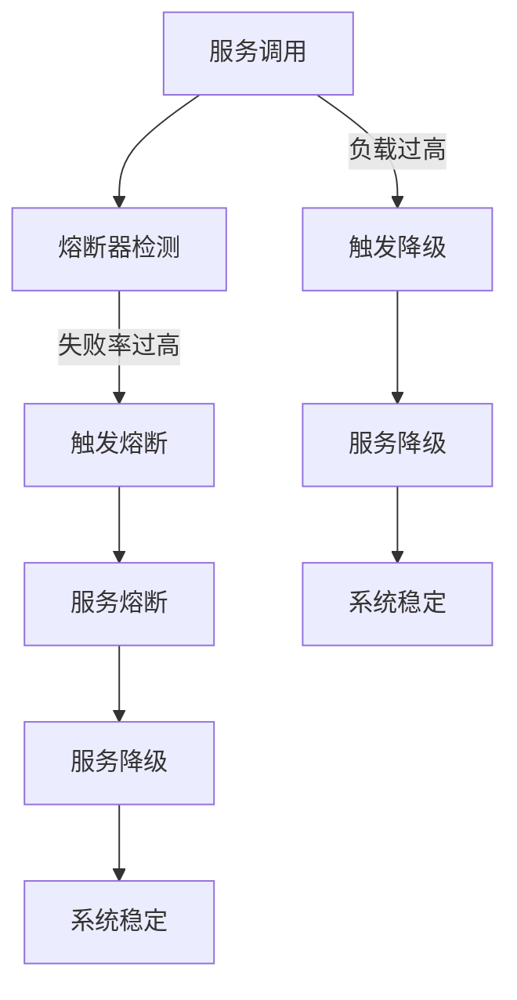

                 

# 《构建可靠的服务熔断与降级系统》

> 关键词：服务熔断、服务降级、系统可靠性、系统架构、算法原理、数学模型、项目实战

> 摘要：本文旨在深入探讨服务熔断与降级系统的构建过程，详细解释其核心概念、架构设计、算法原理、数学模型以及项目实战。通过理论与实践相结合，为读者提供一套全面、可靠的服务熔断与降级系统构建指南。

## 引言

在现代软件开发中，服务的可靠性变得越来越重要。随着微服务架构的广泛应用，分布式系统的复杂性日益增加，系统中的某个服务故障可能会引发整个系统的雪崩，导致业务中断。为了应对这种情况，服务熔断与降级系统应运而生。本文将详细介绍如何构建一个可靠的服务熔断与降级系统，包括其核心概念、架构设计、算法原理、数学模型以及项目实战。

## 核心概念与联系

### 服务熔断

服务熔断是一种安全措施，旨在防止系统因调用失败而导致进一步的故障。当某个服务在一段时间内出现调用失败率过高时，熔断器会自动切断对该服务的调用，以保护系统免受故障服务的连锁反应。

### 服务降级

服务降级是在资源受限或系统压力过大时，有选择性地降低某些服务的响应时间或功能，以保证核心服务的正常运行。通过降级，系统可以将有限的资源集中在关键业务上，从而提高系统的整体稳定性。

### 熔断与降级的关系

熔断与降级是服务可靠性保障的两大利器，它们之间存在密切的联系。熔断器通常用于监测服务调用失败率，当达到某个阈值时，触发熔断，切断对故障服务的调用。而降级器则根据系统负载情况，动态调整服务的响应策略，降低非关键服务的质量。

### 架构 Mermaid 流程图



## 架构概述

一个可靠的服务熔断与降级系统通常包括熔断器、降级器和监控器三个核心组件。

### 熔断器

熔断器负责监测服务的调用情况，当调用失败率超过预设阈值时，自动触发熔断。熔断器通常基于计数器或滑动窗口算法实现。

### 降级器

降级器负责根据系统负载情况，动态调整服务的响应策略。当系统负载过高时，降级器可以选择性地降低某些服务的质量或功能，以保证核心服务的正常运行。

### 监控器

监控器负责收集系统的健康状态信息，包括服务调用成功率、系统负载度等。通过监控器，我们可以实时了解系统的运行状况，并做出相应的调整。

## 核心算法原理

### 熔断算法

熔断算法通常基于计数器或滑动窗口算法实现。以下是一个简单的计数器算法伪代码：

```pseudo
function CountingAlgorithm(failures, threshold):
    if failures > threshold:
        triggerCircuitBreaker()
    else:
        resetCircuitBreaker()

function triggerCircuitBreaker():
    // 切断对服务的调用
    // 记录熔断时间
    // 清空调用计数

function resetCircuitBreaker():
    // 重置熔断器状态
    // 清空熔断时间
```

### 降级算法

降级算法通常基于动态阈值算法实现。以下是一个简单的动态阈值算法伪代码：

```pseudo
function DynamicThresholdAlgorithm(currentLoad, maxLoad, threshold):
    if currentLoad > maxLoad * threshold:
        triggerDegradation()
    else:
        resetDegradation()

function triggerDegradation():
    // 降低非关键服务的质量
    // 更新降级阈值

function resetDegradation():
    // 恢复服务的正常质量
    // 重置降级阈值
```

## 数学模型和公式

### 服务成功率

服务成功率是衡量服务稳定性的重要指标。其计算公式如下：

$$
成功率 = \frac{成功调用次数}{总调用次数}
$$

### 系统负载度

系统负载度是衡量系统资源利用率的指标。其计算公式如下：

$$
系统负载度 = \frac{当前服务调用次数}{系统最大服务能力}
$$

## 项目实战

### 环境搭建

在搭建服务熔断与降级系统的开发环境时，我们需要选择合适的工具和依赖。以下是一个简单的环境搭建步骤：

1. 安装Java开发工具包（JDK）
2. 安装IDE（例如 IntelliJ IDEA 或 Eclipse）
3. 安装Maven或Gradle等构建工具
4. 添加必要的依赖项，例如Hystrix、Resilience4j等

### 代码实现

以下是一个简单的服务熔断器实现：

```java
@HystrixCommand(fallbackMethod = "fallback")
public String doSomething() {
    // 调用外部服务
    return externalService.doSomething();
}

public String fallback() {
    // 熔断时的 fallback 方法
    return "服务熔断，当前无法提供服务";
}
```

### 代码解读与分析

在上述代码中，`@HystrixCommand` 注解用于标记一个方法为熔断方法。当外部服务调用失败时，会自动触发 fallback 方法，返回预设的熔断信息。

### 实际案例分析和详细讲解剖析

#### 案例一：电商系统中的服务熔断与降级

在电商系统中，服务熔断与降级主要用于应对订单处理高峰期。以下是一个实际案例：

1. 在订单处理过程中，当调用库存服务时，如果库存服务响应时间过长，会触发熔断，切断对库存服务的调用。
2. 当系统负载过高时，会触发服务降级，降低订单查询服务的响应时间，以保证订单处理的顺利进行。

通过以上案例，我们可以看到服务熔断与降级在电商系统中的应用，以及如何根据实际情况进行具体实现和调整。

### 项目小结

在本项目中，我们深入探讨了服务熔断与降级系统的构建过程，包括核心概念、架构设计、算法原理、数学模型和项目实战。通过理论与实践的结合，我们了解到如何构建一个可靠的服务熔断与降级系统，以应对分布式系统中的各种挑战。

### 最佳实践 tips、小结、注意事项、拓展阅读等内容

1. **最佳实践 tips**：在实际项目中，建议根据业务需求和系统特点，合理设置熔断和降级的阈值，以平衡系统稳定性和用户体验。

2. **小结**：服务熔断与降级系统是保障分布式系统可靠性的重要手段。通过合理的设计和实现，可以有效提高系统的稳定性，降低故障对业务的影响。

3. **注意事项**：在搭建服务熔断与降级系统时，需要充分考虑系统的实际负载情况，避免过度熔断或降级导致业务中断。

4. **拓展阅读**：读者可以进一步学习相关技术文档和书籍，如《大规模分布式系统设计》等，以深入了解服务熔断与降级系统的设计和实现。

### 作者

作者：AI天才研究院/AI Genius Institute & 禅与计算机程序设计艺术 /Zen And The Art of Computer Programming

本文内容版权归AI天才研究院/AI Genius Institute所有，如需转载，请务必注明出处。感谢您的阅读！

