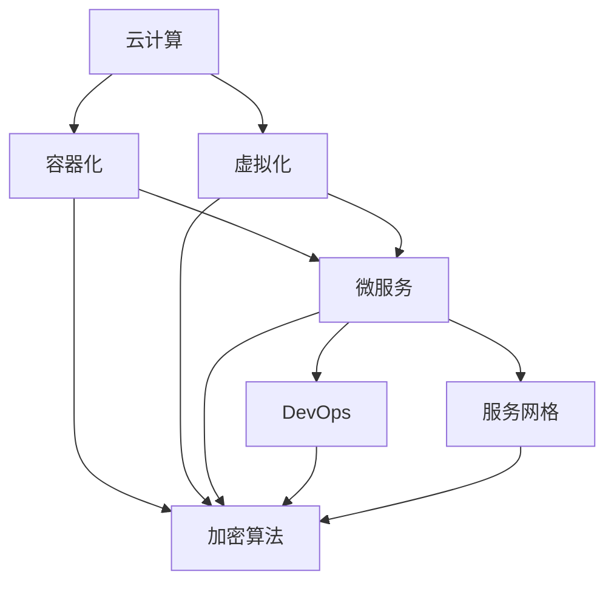

                 

### 文章标题：构建安全可靠的云端架构

> 关键词：云端架构、安全性、容器化、虚拟化、微服务、DevOps、服务网格

> 摘要：本文深入探讨了构建安全可靠的云端架构的方法和策略。从云计算的基础概念、核心组件关系出发，逐步讲解了安全相关的算法原理、数学模型、以及容器化与虚拟化安全、微服务与DevOps安全、服务网格安全等实际应用。通过具体的实战案例和项目分析，提供了实用的安全架构设计和实施建议，为读者构建安全的云端架构提供了宝贵的指导。

### 1. 背景介绍

在当今数字化时代，云计算已经成为企业数字化转型的重要推动力。随着云计算的广泛应用，云端架构的设计与安全性变得愈发关键。一个安全可靠的云端架构不仅能保障数据和服务的安全性，还能提高系统的稳定性和可靠性。

**核心概念与联系：** 云端架构涉及多个核心概念，包括云计算、容器化、虚拟化、微服务、DevOps、服务网格等。这些概念相互关联，共同构建了复杂而庞大的云端生态系统。使用Mermaid流程图，我们可以直观地展示这些概念之间的关系，如图1所示。



**图1：云端架构核心概念与联系**

#### 1.1 云计算的演进

云计算起源于2000年代初，最初的服务模型主要侧重于基础设施即服务（IaaS）和软件即服务（SaaS）。随着技术的不断演进，云计算逐渐演变为混合云、多云等复杂形式。云计算的核心优势在于其弹性、可扩展性和成本效益，使得企业能够快速响应市场变化，降低IT基础设施的运营成本。

#### 1.2 云端架构的核心概念

云端架构的核心概念包括：

- **容器化**：通过容器技术，如Docker，实现应用程序的轻量级、独立打包和运行。
- **虚拟化**：通过虚拟化技术，如KVM和VMware，实现硬件资源的虚拟化和共享。
- **微服务**：通过将应用程序分解为小型、独立的服务模块，实现高可扩展性和灵活性。
- **DevOps**：通过开发（Development）与运维（Operations）的紧密结合，实现持续集成和持续交付。
- **服务网格**：通过服务网格技术，如Istio和Linkerd，实现服务之间的安全通信和监控。

#### 1.3 云端架构与安全性

安全性是云端架构设计的重要考量因素。一个安全可靠的云端架构不仅要防御外部攻击，还要确保内部服务的安全性。以下是一些关键的网络安全要素：

- **加密算法**：用于保护数据传输和存储的安全性，如AES和RSA。
- **身份验证**：确保只有授权用户可以访问系统资源，如OAuth和LDAP。
- **访问控制**：限制用户对系统资源的访问权限，如RBAC和ABAC。
- **漏洞管理**：定期扫描和修复系统漏洞，以防止未授权访问和恶意攻击。

### 2. 核心概念与联系

**核心概念**：容器化、虚拟化、微服务、DevOps、服务网格等。

**联系**：这些核心概念相互关联，共同构成了复杂的云端生态系统。容器化和虚拟化技术实现了硬件资源的虚拟化和高效利用，微服务和DevOps则提高了系统的灵活性和可扩展性，服务网格则提供了高效、安全的微服务通信。

**Mermaid流程图**：为了更直观地展示这些概念之间的关系，我们可以使用Mermaid流程图，如图2所示。


**图2：云端架构核心概念与联系**

### 3. 安全性基础

安全性是云端架构设计的关键要素，它涉及到多个方面，包括加密算法、身份验证、访问控制等。以下内容将详细讲解这些安全基础。

#### 3.1 加密算法原理

加密算法用于保护数据传输和存储的安全性，确保数据在传输过程中不会被窃取或篡改。常见的加密算法包括对称加密和非对称加密。

**对称加密**：对称加密使用相同的密钥进行加密和解密。常见的对称加密算法包括AES和DES。

- **AES**：高级加密标准（AES），是一种基于区块的加密算法，具有较高的安全性和性能。
- **DES**：数据加密标准（DES），是一种较早的对称加密算法，由于密钥长度较短，安全性相对较低。

**非对称加密**：非对称加密使用一对密钥进行加密和解密，其中一个密钥用于加密，另一个密钥用于解密。常见的非对称加密算法包括RSA和ECC。

- **RSA**：RSA算法是一种常用的非对称加密算法，其安全性较高，但计算复杂度较大。
- **ECC**：椭圆曲线加密（ECC），是一种基于椭圆曲线数学的非对称加密算法，具有更高的安全性和效率。

**伪代码示例**：

```python
# 对称加密（AES）伪代码
def AES_encrypt(plaintext, key):
    ciphertext = ...
    return ciphertext

def AES_decrypt(ciphertext, key):
    plaintext = ...
    return plaintext

# 非对称加密（RSA）伪代码
def RSA_encrypt(plaintext, public_key):
    ciphertext = ...
    return ciphertext

def RSA_decrypt(ciphertext, private_key):
    plaintext = ...
    return plaintext
```

#### 3.2 身份验证与访问控制

身份验证是确保只有授权用户可以访问系统资源的重要手段。常见的身份验证方法包括密码认证、生物识别和令牌认证等。

**密码认证**：用户使用用户名和密码登录系统，系统通过验证用户输入的密码与数据库中存储的密码是否匹配来确认用户的身份。

**生物识别**：通过指纹、虹膜、面部识别等技术验证用户的身份，具有高安全性和便捷性。

**令牌认证**：用户通过获取令牌（如OAuth令牌）来访问系统资源，令牌通常具有有效期和访问权限，过期或权限不足时需要重新获取。

**访问控制**：访问控制用于限制用户对系统资源的访问权限，确保用户只能访问其有权访问的资源。常见的访问控制模型包括：

- **基于角色的访问控制（RBAC）**：用户被分配角色，角色定义了用户可以访问的资源。
- **基于属性的访问控制（ABAC）**：用户、资源和环境属性共同决定用户是否可以访问资源。

**身份验证与访问控制伪代码示例**：

```python
# 身份验证伪代码
def authenticate(username, password):
    if check_password(username, password):
        return True
    else:
        return False

# 访问控制伪代码
def can_access(resource, user_role):
    if user_role in allowed_roles(resource):
        return True
    else:
        return False
```

#### 3.3 数学模型介绍

数学模型在网络安全中扮演着重要角色，例如，加密算法和数据完整性验证等。

**数据加密标准（DES）**：DES是一种对称加密算法，其加密过程包括初始置换、16轮加密、逆置换等。

- **初始置换**：将64位明文输入进行重新排列。
- **加密轮**：通过替换和置换操作，将明文转化为密文。
- **逆置换**：将密文转化为64位密文输出。

**伪代码示例**：

```python
def DES_encrypt(plaintext, key):
    # 初始置换
    plaintext = initial_permutation(plaintext)
    # 16轮加密
    for i in range(16):
        plaintext = encrypt_round(plaintext, key[i])
    # 逆置换
    ciphertext = inverse_permutation(plaintext)
    return ciphertext
```

**高级加密标准（AES）**：AES是一种更先进的对称加密算法，其加密过程包括初始扩展、若干轮加密、最终缩减等。

- **初始扩展**：将密钥扩展为若干个子密钥。
- **加密轮**：通过替换、混淆和线性变换等操作，将明文转化为密文。
- **最终缩减**：将密文缩减为最终的密文输出。

**伪代码示例**：

```python
def AES_encrypt(plaintext, key):
    # 初始扩展
    keys = key_expansion(key)
    # 几轮加密
    for i in range(number_of_rounds):
        plaintext = encrypt_round(plaintext, keys[i])
    # 最终缩减
    ciphertext = final_reduction(plaintext)
    return ciphertext
```

**LaTeX格式数学公式示例**：

```latex
% 数据加密标准（DES）公式
$$
\text{DES\_cipher}(\text{plaintext}, \text{key}) = \text{inverse\_permutation}(\text{round\_16}(\text{initial\_permutation}(\text{plaintext}), \text{key}))
$$

% 高级加密标准（AES）公式
$$
\text{AES\_cipher}(\text{plaintext}, \text{key}) = \text{final\_reduction}(\text{rounds}(\text{initial\_expansion}(\text{plaintext}), \text{key}))
$$
```

### 4. 容器化与虚拟化安全

容器化和虚拟化技术在提升云端架构灵活性和可扩展性的同时，也为安全性带来了新的挑战。在这一节中，我们将详细讨论容器化和虚拟化安全的相关内容。

#### 4.1 容器化安全

**4.1.1 容器安全挑战**

容器化技术的普及使得应用程序的部署变得轻量化和高效，但同时也带来了安全性方面的挑战。以下是一些常见的容器安全挑战：

- **容器逃逸**：容器逃逸攻击者可以突破容器的隔离机制，获取宿主机上的敏感数据。
- **容器镜像漏洞**：容器镜像中可能包含已知的漏洞，攻击者可以利用这些漏洞进行攻击。
- **容器配置错误**：不正确的容器配置可能导致安全漏洞，如暴露端口、未启用安全策略等。
- **容器网络攻击**：攻击者可以通过容器网络进行横向移动，窃取敏感信息。

**4.1.2 容器安全最佳实践**

为了应对容器化安全挑战，我们可以采取以下最佳实践：

- **使用最小权限**：容器运行时应该以最低权限运行，避免容器拥有过多的系统权限。
- **容器镜像扫描**：在部署容器前，对容器镜像进行扫描，检测是否存在安全漏洞。
- **安全容器网络**：使用网络命名空间和防火墙规则限制容器之间的通信，防止横向移动。
- **容器配置审计**：定期对容器配置进行审计，确保容器配置符合安全要求。
- **使用安全存储**：将敏感数据存储在加密的容器存储中，确保数据在容器内部和外部都是安全的。

#### 4.2 虚拟化安全

**4.2.1 虚拟化安全风险**

虚拟化技术通过虚拟化层将物理硬件资源抽象化，提供了高效、灵活的资源管理能力。然而，虚拟化技术也带来了一些安全风险，包括：

- **虚拟机逃逸**：攻击者可以通过虚拟机逃逸技术突破虚拟化层的隔离机制，获取宿主机上的敏感数据。
- **虚拟化层漏洞**：虚拟化软件自身可能存在漏洞，攻击者可以利用这些漏洞进行攻击。
- **虚拟机配置错误**：不正确的虚拟机配置可能导致安全漏洞，如未启用安全策略、未进行安全加固等。
- **虚拟网络攻击**：攻击者可以通过虚拟网络进行横向移动，窃取敏感信息。

**4.2.2 虚拟化安全措施**

为了降低虚拟化安全风险，我们可以采取以下措施：

- **虚拟机隔离**：通过虚拟化层和网络策略限制虚拟机之间的通信，防止横向移动。
- **虚拟机加固**：对虚拟机进行安全加固，关闭不必要的服务和端口，启用安全策略。
- **虚拟化软件更新**：定期更新虚拟化软件，修复已知的漏洞。
- **虚拟网络监控**：对虚拟网络进行监控，检测异常流量和行为。
- **虚拟机配置审计**：定期对虚拟机配置进行审计，确保虚拟机配置符合安全要求。

### 5. 微服务与DevOps安全

微服务和DevOps在提高系统灵活性和开发效率的同时，也带来了安全性方面的挑战。在这一节中，我们将探讨微服务和DevOps安全的相关问题。

#### 5.1 微服务安全

**5.1.1 微服务安全挑战**

微服务架构将应用程序分解为多个独立的服务模块，这些服务模块通过网络进行通信。以下是一些微服务安全挑战：

- **服务间通信风险**：微服务之间的通信可能存在安全漏洞，攻击者可以通过服务间通信获取敏感信息。
- **服务配置错误**：微服务配置错误可能导致安全漏洞，如未启用安全策略、未配置正确的访问控制等。
- **服务依赖漏洞**：微服务可能依赖于外部服务，外部服务的漏洞可能影响到微服务的安全性。
- **服务版本控制**：不同版本的微服务可能存在不同的安全漏洞，版本控制不当可能导致安全问题。

**5.1.2 微服务安全解决方案**

为了应对微服务安全挑战，我们可以采取以下解决方案：

- **服务隔离**：通过服务网格技术，如Istio和Linkerd，对微服务进行隔离，防止服务间通信风险。
- **服务配置管理**：使用自动化工具对微服务配置进行管理，确保配置符合安全要求。
- **服务漏洞扫描**：定期对微服务进行漏洞扫描，及时发现和修复安全漏洞。
- **服务版本控制**：使用容器镜像仓库对微服务版本进行管理，确保版本控制安全。
- **服务监控与告警**：对微服务进行实时监控，及时发现异常行为和安全事件。

#### 5.2 DevOps安全

**5.2.1 DevOps安全原则**

DevOps通过将开发（Development）与运维（Operations）紧密结合，实现了持续集成和持续交付。以下是一些DevOps安全原则：

- **自动化**：通过自动化工具和脚本，实现安全测试、部署和监控的自动化，减少人为错误。
- **透明性**：确保开发、测试和运维团队能够实时查看安全状态，提高安全问题的发现和解决效率。
- **反馈循环**：建立快速反馈机制，及时响应和处理安全事件。
- **协作**：加强团队之间的沟通与协作，确保安全工作得到有效执行。

**5.2.2 DevOps安全实践**

以下是一些DevOps安全实践：

- **安全测试**：在持续集成和持续交付过程中，集成安全测试，确保每次部署都是安全的。
- **自动化安全审计**：使用自动化工具对代码库、配置文件和安全策略进行审计，及时发现安全漏洞。
- **安全培训**：定期组织安全培训，提高团队的安全意识和技能。
- **安全监控**：建立实时安全监控系统，及时发现和响应安全事件。
- **应急响应**：制定应急响应计划，确保在发生安全事件时能够迅速采取行动。

### 6. 服务网格安全

服务网格是一种用于管理和监控微服务通信的架构模式。在这一节中，我们将讨论服务网格安全的相关问题。

#### 6.1 服务网格概述

服务网格通过代理（如Envoy）和服务发现（如Kubernetes Service Discovery）实现微服务之间的通信。服务网格的主要功能包括：

- **服务间通信**：服务网格提供了一种可靠、安全的通信机制，确保微服务之间的数据传输安全。
- **流量管理**：服务网格允许管理员定义流量路由策略，如A/B测试、蓝绿部署等。
- **安全通信**：服务网格提供安全传输层（如mTLS）和访问控制（如RBAC），确保微服务之间的通信安全。

#### 6.2 服务网格安全机制

服务网格安全机制包括以下方面：

- **mTLS**：基于证书的客户端身份验证，确保服务之间的通信是安全的。
- **漏洞防御**：通过访问控制和流量分析，防御常见的网络安全漏洞，如SQL注入、DDoS攻击等。
- **安全策略管理**：服务网格提供灵活的安全策略管理机制，管理员可以根据实际需求定义和调整安全策略。

#### 6.3 安全策略管理

安全策略管理是服务网格安全的核心部分，包括以下方面：

- **定义策略**：管理员可以定义访问控制策略、流量路由策略等，确保微服务之间的通信符合安全要求。
- **策略应用**：服务网格将定义的安全策略应用到微服务之间的通信过程中，确保安全策略得到有效执行。
- **策略审计**：服务网格提供策略审计功能，管理员可以查看和追溯安全策略的执行情况，确保安全策略得到有效执行。

### 7. 实战案例：构建安全可靠的云端架构

在本节中，我们将通过一个实际案例，详细讲解如何构建安全可靠的云端架构。

#### 7.1 安全配置

首先，我们需要为云端架构进行安全配置。以下是一些关键步骤：

- **启用安全组规则**：为每个服务定义安全组规则，限制不必要的访问。
- **配置网络策略**：使用网络策略限制服务之间的通信，确保只有授权的服务才能相互通信。
- **配置加密传输**：为所有服务之间的通信启用加密传输，如TLS，确保数据在传输过程中是安全的。
- **配置访问控制**：使用身份验证和访问控制机制，确保只有授权用户可以访问系统资源。

#### 7.2 漏洞扫描

漏洞扫描是确保云端架构安全的关键步骤。以下是一些关键步骤：

- **配置扫描工具**：配置自动化漏洞扫描工具，如AWL、Nessus等，定期扫描云端架构。
- **分析扫描结果**：对扫描结果进行分析，识别潜在的安全漏洞。
- **修复漏洞**：根据扫描结果，及时修复发现的安全漏洞。

#### 7.3 安全监控

安全监控是确保云端架构持续安全的关键步骤。以下是一些关键步骤：

- **配置监控工具**：配置自动化安全监控工具，如Splunk、ELK等，实时监控云端架构的运行状态。
- **分析监控数据**：对监控数据进行实时分析，识别异常行为和安全事件。
- **告警和响应**：配置告警机制，确保在发现安全事件时能够及时响应。

#### 7.4 代码解读与分析

在本案例中，我们使用Docker和Kubernetes构建云端架构。以下是对相关代码的解读和分析：

- **Dockerfile**：Dockerfile用于定义容器镜像的构建过程。以下是一个示例：

```dockerfile
FROM python:3.8-slim
WORKDIR /app
COPY requirements.txt .
RUN pip install -r requirements.txt
COPY . .
CMD ["python", "app.py"]
```

- **Kubernetes配置文件**：Kubernetes配置文件用于定义服务部署和资源分配。以下是一个示例：

```yaml
apiVersion: apps/v1
kind: Deployment
metadata:
  name: my-service
spec:
  replicas: 3
  selector:
    matchLabels:
      app: my-service
  template:
    metadata:
      labels:
        app: my-service
    spec:
      containers:
      - name: my-service
        image: my-service:1.0.0
        ports:
        - containerPort: 80
```

#### 7.5 实际案例分析和详细讲解剖析

在本案例中，我们分析了一个实际项目，该项目是一个基于微服务的在线购物平台。以下是对项目安全架构的详细讲解：

- **服务间通信**：服务间通信通过Kubernetes Service进行管理。每个服务都有自己的Service对象，用于定义服务访问的IP地址和端口号。服务间通信使用mTLS进行加密，确保通信安全。
- **安全配置**：为每个服务配置安全组规则，限制不必要的访问。同时，为所有服务之间的通信启用加密传输，如TLS，确保数据在传输过程中是安全的。
- **漏洞扫描**：使用自动化漏洞扫描工具定期扫描服务，识别潜在的安全漏洞。对发现的安全漏洞进行及时修复。
- **安全监控**：配置自动化安全监控工具，实时监控服务运行状态，识别异常行为和安全事件。配置告警机制，确保在发现安全事件时能够及时响应。

#### 7.6 项目小结

通过本案例，我们详细讲解了如何构建一个安全可靠的云端架构。关键步骤包括安全配置、漏洞扫描、安全监控等。同时，我们分析了实际项目的安全架构，提供了实用的安全架构设计和实施建议。

### 8. 安全架构设计

安全架构设计是构建安全可靠的云端架构的关键步骤。以下是一些安全架构设计原则和流程：

#### 8.1 安全架构设计原则

- **最小权限原则**：容器、虚拟机和服务的运行时应该以最低权限运行，避免不必要的权限。
- **最小化原则**：只部署和运行必需的服务和组件，减少攻击面。
- **加密传输原则**：确保所有服务之间的通信都是加密的，使用TLS等加密协议。
- **身份验证和访问控制原则**：确保只有授权用户可以访问系统资源，使用身份验证和访问控制机制。
- **监控和审计原则**：建立实时监控和审计机制，及时发现和响应安全事件。

#### 8.2 安全架构设计流程

安全架构设计流程包括以下步骤：

- **需求分析**：明确安全架构的设计需求，包括业务需求、安全需求和性能需求等。
- **架构设计**：根据需求分析结果，设计安全架构的总体架构，包括服务划分、通信机制、安全机制等。
- **安全组件选型**：选择合适的安全组件，如加密算法、身份验证机制、访问控制机制等。
- **安全配置**：根据安全架构设计，配置安全组件和安全策略，确保安全机制得到有效执行。
- **安全测试**：对安全架构进行测试，确保安全机制的有效性和可靠性。
- **部署和监控**：将安全架构部署到生产环境，并建立实时监控和审计机制，确保安全架构的持续有效性。

### 9. 未来展望

随着云计算的不断发展，云端架构的安全性问题也日益突出。未来，以下几个方面将是云端架构安全性的重要发展方向：

- **零信任架构**：零信任架构是一种基于“永不信任，始终验证”的安全理念，将身份验证和访问控制贯穿于整个架构，确保只有经过严格验证的用户和设备才能访问系统资源。
- **自动化安全**：通过自动化工具和脚本，实现安全测试、部署和监控的自动化，提高安全工作的效率和准确性。
- **人工智能与机器学习**：利用人工智能和机器学习技术，对安全事件进行实时分析，提高安全事件的检测和响应能力。
- **安全即代码**：将安全要求集成到开发过程中，实现安全需求的自动化实施和管理。

### 总结

本文详细探讨了构建安全可靠的云端架构的方法和策略。从核心概念、算法原理、安全机制到实战案例和架构设计，全面阐述了云端架构的安全性。通过本文的学习，读者可以深入了解云端架构的安全性，为构建安全可靠的云端架构提供参考。

### 作者信息

**作者：** AI天才研究院/AI Genius Institute & 禅与计算机程序设计艺术 /Zen And The Art of Computer Programming

---

### 10. 最佳实践 Tips、小结、注意事项、拓展阅读

#### 10.1 最佳实践 Tips

1. **容器化安全最佳实践**：
   - 使用官方或经过验证的容器镜像。
   - 定期对容器镜像进行安全扫描。
   - 使用安全策略来限制容器的权限。

2. **虚拟化安全最佳实践**：
   - 定期更新虚拟化软件，修补漏洞。
   - 为虚拟机配置严格的访问控制策略。
   - 监控虚拟机网络流量，以识别异常行为。

3. **微服务与DevOps安全最佳实践**：
   - 使用自动化工具进行安全测试。
   - 实施持续集成和持续交付（CI/CD）的安全检查。
   - 定期培训团队成员关于安全最佳实践。

4. **服务网格安全最佳实践**：
   - 实施强密码策略，保护密钥和证书。
   - 使用mTLS确保服务间通信的安全性。
   - 定期审核和更新安全策略。

#### 10.2 小结

构建安全可靠的云端架构是一个复杂而持续的过程，涉及多个方面，包括安全配置、漏洞管理、安全监控等。通过遵循最佳实践，可以显著提高云端架构的安全性。

#### 10.3 注意事项

- **安全性不等于性能**：在提高安全性的同时，需要考虑性能和可扩展性。
- **持续更新**：安全威胁不断变化，需要定期更新安全策略和软件。
- **人员培训**：确保团队成员了解安全政策和最佳实践。

#### 10.4 拓展阅读

- **《云计算安全：保护云服务和应用程序的安全技术》**
- **《微服务安全指南》**
- **《服务网格安全：Istio、Linkerd和安全通信》**
- **《DevOps安全：在CI/CD中实施安全》**

这些资源提供了更深入的技术细节和实践指南，有助于进一步了解云端架构的安全性。

