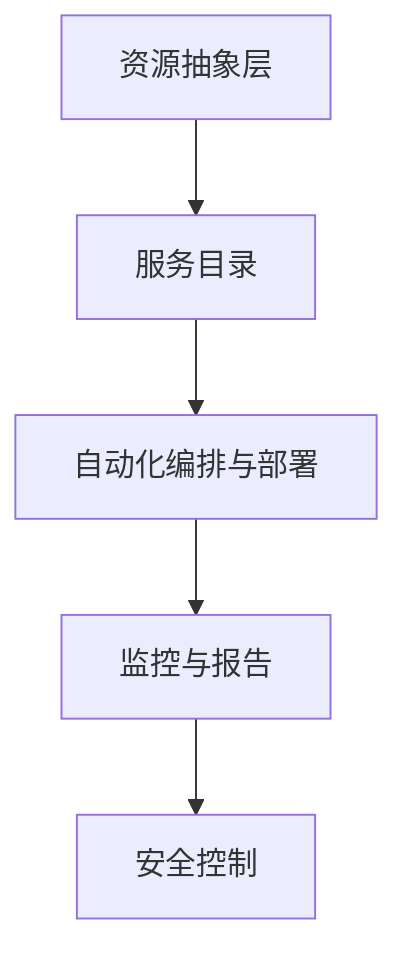

                 

### 构建安全可靠的多云管理平台

在当今数字化转型的浪潮中，企业越来越多地采用多云架构以获得更高的灵活性、可靠性和成本效益。多云管理平台作为企业整合和管理多个云环境的核心工具，其安全性、可靠性和效率直接影响企业的业务连续性和数据完整性。因此，构建一个安全可靠的多云管理平台是每个企业都需要认真考虑的问题。

#### 关键词：
- 多云管理平台
- 安全性
- 可靠性
- 资源整合
- 自动化
- 最佳实践

#### 摘要：
本文将探讨构建安全可靠的多云管理平台的关键要素。首先，我们将了解多云管理的背景和重要性，然后深入探讨多云管理平台的核心概念、架构和安全特性。接着，我们将分析构建多云管理平台所需的技术，包括安全性保障、可靠性增强和成本优化策略。随后，通过案例研究，我们将展示如何将理论付诸实践。最后，本文将总结最佳实践，提供未来展望，并鼓励读者持续学习和创新。

---

### 1. 多云管理平台的核心概念与架构

#### 1.1 多云管理平台的定义

多云管理平台是一种集成的工具和框架，用于管理企业分布在多个云服务提供商（CSP）上的资源和应用程序。它旨在简化多云环境的复杂度，提供统一的视图和操作界面，从而提高管理效率和资源利用率。

#### 1.2 多云管理平台的架构

一个典型的多云管理平台通常包括以下几个关键组件：

1. **资源抽象层**：将底层云基础设施的细节抽象出来，提供统一的资源接口，方便上层应用进行操作。
2. **服务目录**：列出企业可用的各种云服务和资源，包括IaaS、PaaS和SaaS等。
3. **自动化编排与部署**：通过自动化脚本和工具，实现资源的快速部署和配置。
4. **监控与报告**：实时监控资源的使用情况，生成详细的报告，帮助企业进行决策。
5. **安全控制**：提供身份验证、访问控制和数据加密等安全措施，确保数据的安全性和合规性。

下面是一个多云管理平台的基本架构的Mermaid流程图：

#### 1.3 多云管理的挑战与解决方案

1. **安全性挑战**：在多云环境中，数据的安全性和合规性是一个重大挑战。解决方案包括：

   - **多因素身份验证（MFA）**：通过多种验证方式，提高登录安全性。
   - **数据加密**：对敏感数据进行加密，确保数据在传输和存储过程中的安全。
   - **访问控制**：使用访问控制列表（ACL）和角色基础访问控制（RBAC）来管理用户权限。

2. **可靠性挑战**：确保服务的高可用性和灾难恢复能力是多云管理的另一大挑战。解决方案包括：

   - **服务级别协议（SLA）**：与企业选择的云服务提供商签订明确的SLA，确保服务质量和性能。
   - **异地备份和灾难恢复**：在地理位置上分离备份，确保在发生灾难时能够快速恢复服务。

3. **成本效益挑战**：多云管理需要考虑到资源的成本优化。解决方案包括：

   - **资源监控和优化**：定期监控资源使用情况，自动调整资源配置，以降低成本。
   - **按需计费**：根据实际使用情况灵活调整资源配置，避免不必要的浪费。

---

通过以上对多云管理平台核心概念和架构的探讨，我们可以看到，构建一个安全可靠的多云管理平台需要综合考虑多个方面，包括安全性、可靠性和成本效益。接下来，我们将进一步探讨如何实现这些目标，以及相关技术的具体应用。

---

### 2. 多云管理平台的技术实现

构建一个安全可靠的多云管理平台，需要综合运用多种技术和策略，以确保平台的性能、安全性和成本效益。以下将详细分析这些技术实现，并提供具体的算法原理和数学模型。

#### 2.1 安全性保障技术

在多云环境中，安全性是至关重要的一环。以下是一些关键的安全保障技术：

1. **身份认证与访问控制**：
   - **多因素身份认证（MFA）**：通过结合密码、手机验证码、生物识别等多重认证方式，增强用户身份验证的安全性。
   - **访问控制列表（ACL）**：定义谁可以访问哪些资源，实现细粒度的权限控制。
   - **角色基础访问控制（RBAC）**：将用户分配到不同的角色，每个角色对应一组权限，简化权限管理。

2. **数据加密与隐私保护**：
   - **传输加密**：使用TLS/SSL等协议，确保数据在传输过程中的安全性。
   - **存储加密**：对存储在云上的数据进行加密，防止数据泄露。

3. **安全监控与应急响应**：
   - **入侵检测系统（IDS）**：实时监控网络流量，检测潜在的攻击行为。
   - **安全信息和事件管理（SIEM）**：集成多种安全工具的数据，实现统一的安全事件管理和响应。

#### 2.2 可靠性增强技术

为了确保多云管理平台的高可用性和可靠性，以下技术至关重要：

1. **服务级别协议（SLA）**：
   - **定义明确的SLA**：与云服务提供商签订明确的SLA，明确服务的质量指标和责任。
   - **监控和报告**：定期监控平台性能，确保SLA的达成。

2. **异地备份和灾难恢复**：
   - **数据备份**：定期对关键数据进行备份，确保在数据丢失或损坏时能够快速恢复。
   - **异地容灾**：在地理位置上分离备份，确保在发生灾难时能够迅速切换到备用系统。

3. **弹性伸缩与负载均衡**：
   - **自动伸缩**：根据实际负载自动调整资源规模，确保平台在高并发情况下仍能稳定运行。
   - **负载均衡**：将流量均匀分配到多个服务器，避免单点过载。

#### 2.3 成本优化策略

为了最大化成本效益，以下策略可以显著降低运营成本：

1. **资源监控和优化**：
   - **定期评估**：定期评估资源使用情况，优化资源配置，避免浪费。
   - **自动化优化**：使用自动化工具，根据实际需求动态调整资源。

2. **按需计费**：
   - **灵活调整**：根据业务需求，灵活调整资源配置，避免长期固定成本。
   - **预留实例**：对于长期运行的任务，选择预留实例，以降低成本。

3. **混合云策略**：
   - **利用成本差异**：将非关键任务迁移到成本更低的云服务提供商，优化整体成本结构。

#### 2.4 算法原理和数学模型

1. **资源调度算法**：
   - **最小化成本算法**：基于资源使用率和成本，选择最优的云资源进行调度。
   - **贪心算法**：每次调度选择当前最优的资源，逐步优化整体资源利用率。

2. **负载均衡算法**：
   - **轮询算法**：将请求轮流分配到各个服务器。
   - **最小连接数算法**：选择当前连接数最少的服务器进行调度。

3. **成本优化模型**：
   - **线性规划**：建立线性模型，最小化总成本，同时满足资源使用和性能约束。
   - **动态规划**：将问题划分为子问题，逐步求解，优化整体成本。

通过以上技术实现，我们可以构建一个安全可靠的多云管理平台。接下来，我们将通过实际案例来展示这些技术的应用。

---

通过以上对多云管理平台技术实现的详细探讨，我们可以看到，构建一个安全可靠的多云管理平台需要综合考虑安全性、可靠性和成本效益。这些技术不仅提供了理论支持，也为实际操作提供了具体指导。接下来，我们将通过实际案例，展示如何将上述技术应用到多云管理平台的建设中。

---

### 3. 多云管理平台案例研究

#### 3.1 企业C的多云管理实践

企业C是一家大型零售公司，面对激烈的市场竞争，他们决定采用多云管理平台来提高业务的灵活性和效率。以下是企业C在构建多云管理平台过程中的一些关键步骤和成果。

#### 3.1.1 需求分析

企业C的业务需求包括：

- **高可用性**：确保关键业务系统在故障情况下能够快速恢复。
- **灵活性**：支持业务快速部署和调整，以应对市场变化。
- **成本控制**：优化资源使用，降低运营成本。
- **数据安全**：确保敏感数据的安全和合规性。

#### 3.1.2 平台设计与实施

1. **资源抽象层**：
   - 企业C选择了A云和B云作为主要云服务提供商，通过多云管理平台将两个云环境进行统一管理。
   - 开发了资源抽象层，屏蔽底层云基础设施的差异，提供统一的资源接口。

2. **服务目录**：
   - 列出了企业C可用的云服务和资源，包括计算、存储、数据库、网络等。
   - 为不同部门和业务团队提供了灵活的选择，满足个性化需求。

3. **自动化编排与部署**：
   - 使用自动化工具，根据业务需求快速部署和配置资源。
   - 通过脚本化操作，实现了资源的自动化调整和优化。

4. **监控与报告**：
   - 实时监控资源使用情况，生成详细的报告，帮助管理层进行决策。
   - 定期评估平台性能，确保SLA的达成。

5. **安全控制**：
   - 实施多因素身份认证，确保用户身份的准确性。
   - 对敏感数据进行加密存储和传输。
   - 设立了严格的访问控制策略，确保数据安全。

#### 3.1.3 实施效果与经验教训

1. **实施效果**：
   - 平台上线后，企业C的业务连续性和可靠性得到了显著提高。
   - 资源利用率大幅提升，运营成本得到有效控制。
   - 通过自动化和智能化管理，提高了运营效率。

2. **经验教训**：
   - 在实施过程中，企业C发现云服务提供商的选择和SLA的制定至关重要。
   - 强调了跨部门协作和沟通的重要性，确保各方利益一致。
   - 需要对员工进行培训，提升团队对多云管理的理解和技能。

#### 3.2 政府D的多云架构转型

政府D在信息化建设过程中，面临着数据安全、合规性和成本优化等多重挑战。他们决定采用多云管理平台来实现数字化转型。

#### 3.2.1 挑战与目标

- **数据安全**：确保敏感数据的安全和合规性。
- **合规性**：满足国家和地方政府的法规要求。
- **成本优化**：通过资源优化降低运营成本。

#### 3.2.2 转型策略与实践

1. **合规性管理**：
   - 建立了详细的合规性检查清单，确保云服务提供商符合相关法规要求。
   - 使用加密技术保护数据传输和存储。

2. **安全性保障**：
   - 实施了多因素身份认证和严格的访问控制策略。
   - 定期进行安全审计和漏洞扫描。

3. **成本优化**：
   - 使用自动化工具监控和优化资源使用。
   - 通过混合云策略，将非关键任务迁移到成本更低的云服务提供商。

#### 3.2.3 转型成果与影响

1. **成果**：
   - 成功实现了多云架构转型，提升了业务的灵活性和可靠性。
   - 通过成本优化，实现了运营成本的显著降低。

2. **影响**：
   - 提高了政府信息化服务的质量和效率。
   - 为其他政府部门提供了有益的借鉴和经验。

通过这些案例研究，我们可以看到，多云管理平台在实际应用中的成功关键在于对需求的分析、合理的设计、严格的实施和持续的优化。这些经验对于其他企业和政府机构构建自己的多云管理平台具有重要的参考价值。

---

通过实际案例的探讨，我们可以看到多云管理平台在提高企业业务连续性、灵活性和成本效益方面的显著优势。接下来，我们将总结构建多云管理平台的一些最佳实践，帮助读者更好地规划和实施自己的多云战略。

---

### 4. 多云管理平台最佳实践

在构建安全可靠的多云管理平台过程中，总结和遵循最佳实践对于确保项目的成功至关重要。以下是一些关键的最佳实践：

#### 4.1 规划与设计最佳实践

1. **需求分析**：在项目启动前，进行全面的需求分析，确保了解企业当前的IT环境、业务需求和未来规划。

2. **架构设计**：根据业务需求，设计灵活、可扩展的架构，确保能够支持未来的增长和变化。

3. **安全性规划**：在架构设计阶段，充分考虑安全性需求，制定详细的安全策略和措施。

4. **合规性要求**：确保多云管理平台符合相关法规和行业标准，特别是在数据保护和隐私方面。

#### 4.2 运营与管理最佳实践

1. **自动化管理**：利用自动化工具和脚本，减少手动操作，提高效率，减少错误。

2. **监控与报告**：实时监控资源使用情况，定期生成报告，以便进行性能优化和成本控制。

3. **服务级别管理**：与云服务提供商签订明确的SLA，确保服务质量，并定期评估SLA的执行情况。

4. **故障处理与应急预案**：制定详细的故障处理和应急预案，确保在发生故障时能够迅速响应和恢复。

#### 4.3 成本管理与优化

1. **资源监控与优化**：定期评估资源使用情况，自动调整资源配置，以降低成本。

2. **按需计费**：根据业务需求灵活调整资源配置，避免长期固定成本。

3. **混合云策略**：利用不同云服务提供商的成本差异，优化整体成本结构。

#### 4.4 培训与团队建设

1. **员工培训**：为员工提供多云管理的培训，提高团队的技术能力和管理水平。

2. **知识共享**：建立知识共享平台，促进团队成员之间的经验交流和知识积累。

3. **持续学习**：鼓励团队成员不断学习新技术和新理念，保持团队的竞争力和创新能力。

#### 4.5 最佳实践总结

- **全面需求分析**：确保了解业务需求和未来规划。
- **灵活的架构设计**：支持未来增长和变化。
- **严格的安全控制**：确保数据安全和合规性。
- **高效的运营管理**：利用自动化工具提高效率。
- **优化的成本控制**：降低运营成本。
- **强大的团队协作**：促进知识共享和持续学习。

通过遵循这些最佳实践，企业和组织可以构建一个高效、安全可靠的多云管理平台，为业务的持续发展提供强有力的支持。

---

通过总结最佳实践，我们可以看到，构建安全可靠的多云管理平台需要综合考虑多个方面，包括规划与设计、运营与管理、成本管理以及团队建设。这些实践不仅有助于确保项目的成功，也为未来的发展提供了坚实基础。接下来，我们将探讨多云管理平台的发展趋势和未来可能的技术创新。

---

### 5. 多云管理平台未来展望

随着云计算技术的不断演进，多云管理平台正逐渐成为企业数字化转型的核心基础设施。以下是对多云管理平台未来发展的展望，包括技术趋势、行业应用场景以及面临的创新与挑战。

#### 5.1 技术发展趋势

1. **云原生技术与容器化**：
   - **Kubernetes和Docker**：云原生技术的兴起使得容器化应用在多云环境中更加普及，Kubernetes和Docker成为构建多云管理平台的重要工具。
   - **服务网格（Service Mesh）**：服务网格技术如Istio和Linkerd，帮助实现微服务管理的统一视图，提高多云环境下服务调用的透明度和安全性。

2. **自动化与智能化**：
   - **AI和机器学习**：利用AI和机器学习技术，实现自动化资源调度、性能优化和异常检测，提高多云管理平台的智能化水平。
   - **自动化编排工具**：自动化编排工具如Ansible和Terraform，使得云资源的配置和管理更加高效和灵活。

3. **混合云与边缘计算**：
   - **混合云策略**：混合云策略的普及，使得企业可以在多云和边缘计算环境中实现资源的优化配置，满足不同业务场景的需求。
   - **边缘计算**：随着物联网和5G技术的发展，边缘计算将成为多云管理平台的重要组成部分，提高实时数据处理和响应能力。

#### 5.2 行业应用场景

1. **企业级应用**：
   - **数字化转型**：企业通过多云管理平台实现业务系统的快速部署和调整，加速数字化转型。
   - **云计算资源优化**：多云管理平台帮助企业优化云资源使用，降低运营成本。

2. **政府与公共部门**：
   - **数据安全与合规性**：政府机构通过多云管理平台实现数据的安全存储和管理，确保符合法律法规要求。
   - **公共服务交付**：多云管理平台支持政府提供高效、可靠的公共服务。

3. **教育与科研**：
   - **实验室虚拟化**：教育机构利用多云管理平台实现实验室资源的虚拟化和自动化管理。
   - **科研计算**：科研机构通过多云管理平台实现大规模数据分析和计算任务的调度和优化。

#### 5.3 创新与挑战

1. **技术创新趋势**：
   - **区块链与多云**：区块链技术的应用，为多云环境中的数据安全和隐私保护提供了新的解决方案。
   - **5G与边缘计算**：5G网络和边缘计算的结合，将推动多云管理平台在实时数据处理和低延迟通信方面的创新。

2. **法律法规与政策影响**：
   - **数据主权与监管**：不同国家和地区的数据主权和监管政策，将对多云管理平台的设计和运营产生影响。
   - **合规性要求**：随着数据隐私法规的不断完善，多云管理平台需要不断适应新的合规性要求。

3. **人才培养与技能需求**：
   - **多学科融合**：多云管理平台的发展，需要跨学科的人才，包括云计算、网络安全、数据科学等领域。
   - **持续学习与培训**：企业和机构需要不断投入资源，提升员工的技术能力和创新意识。

通过以上展望，我们可以看到，未来的多云管理平台将更加智能化、自动化和高效，为企业的数字化转型和创新发展提供强有力的支持。同时，面对技术创新和法规变化的挑战，企业和机构需要持续关注行业动态，不断优化和调整自己的多云管理策略。

---

### 结语

构建安全可靠的多云管理平台是每个企业数字化转型过程中必须面对的重要任务。通过本文的探讨，我们了解了多云管理平台的核心概念、技术实现、实际案例以及最佳实践。从安全性、可靠性和成本效益的角度出发，多云管理平台为企业提供了高效的资源管理和业务连续性保障。

未来的云计算技术将不断演进，多云管理平台将变得更加智能化和自动化。我们鼓励读者持续关注行业动态，不断学习和实践，以适应快速变化的云计算环境。同时，通过分享经验、知识和技术，我们可以共同推动多云管理技术的发展，为企业创造更多的价值。

作者：AI天才研究院/AI Genius Institute & 禅与计算机程序设计艺术 /Zen And The Art of Computer Programming

---

### 附录

#### 附录A：技术术语解释

- **云服务提供商（CSP）**：提供云计算资源和服务的企业，如亚马逊AWS、微软Azure、谷歌云等。
- **服务目录**：列出企业可用的云服务和资源，包括计算、存储、数据库、网络等。
- **自动化编排与部署**：使用脚本和工具自动配置和部署云资源。
- **服务级别协议（SLA）**：企业与云服务提供商之间签订的服务质量保障协议。

#### 附录B：进一步阅读资源

- 《云计算与分布式系统：设计与应用》（M. Brameld，J. M. Mellor，J. C. Mogul著）
- 《容器化与微服务：云原生应用架构》（Serdar Yegulalp著）
- 《多云管理：战略、工具与实践》（Michael L. Martin著）

通过阅读这些资源，读者可以深入了解多云管理平台的更多细节和技术实现。

---

通过本文，我们不仅了解了多云管理平台的核心概念和技术实现，还探讨了其在实际应用中的最佳实践和未来趋势。希望本文能为读者提供有价值的参考和启示，助力企业在多云时代取得成功。

