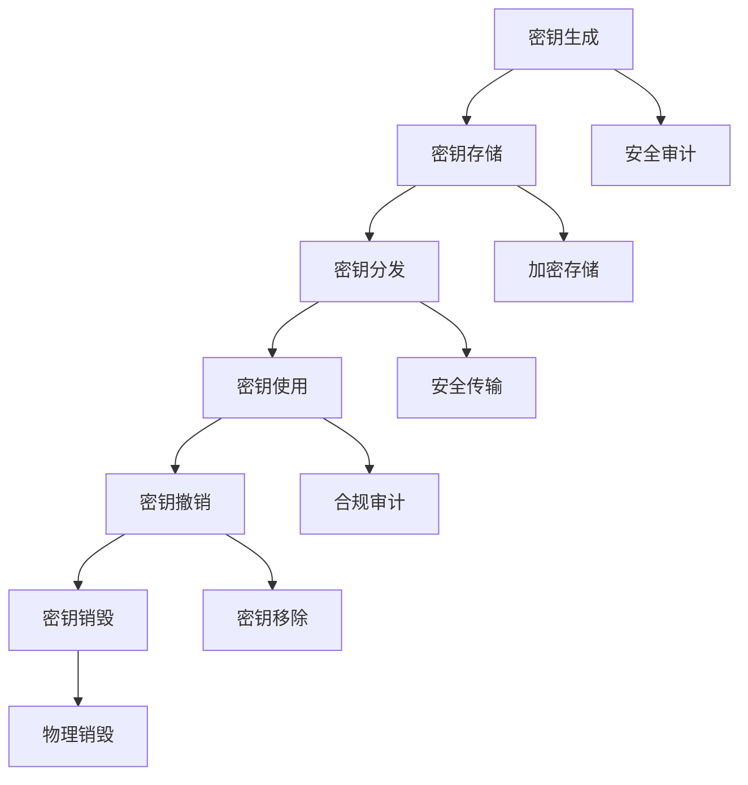

                 

## 文章标题：构建安全可靠的密钥管理系统

### 关键词：
- 密钥管理
- 安全性
- 系统架构
- 加密算法
- 数学模型
- 实际案例

### 摘要：
本文旨在深入探讨如何构建一个既安全又可靠的密钥管理系统。首先，我们将回顾密钥管理的核心概念及其重要性。接着，分析安全性需求，明确系统应达到的安全目标。随后，详细介绍密钥管理系统的架构设计，从密钥生成与存储、分发与共享、注销与备份等方面进行讲解。文章还将探讨实现与部署的细节，并提供实际案例研究以展示密钥管理的应用。最后，介绍相关数学模型和算法，以及总结和展望未来的研究方向。希望通过本文，读者能够对密钥管理系统有一个全面、深入的理解。

## 第1章 密钥管理基础

### 1.1 密钥管理的核心概念

密钥管理是指对密钥的生命周期进行全面的控制和管理，包括密钥的生成、存储、分发、使用、撤销和销毁等各个环节。密钥管理的核心概念主要包括以下几个方面：

1. **密钥分类**：根据用途和生成方式，密钥可以分为对称密钥和非对称密钥。对称密钥（如AES）使用相同的密钥进行加密和解密，而非对称密钥（如RSA）则使用一对密钥，其中一个用于加密，另一个用于解密。

2. **密钥生命周期管理**：密钥生命周期管理包括密钥生成、分发、存储、使用、撤销和销毁等环节。每个环节都需要严格的安全措施来确保密钥的安全。

3. **密钥存储**：密钥需要安全地存储，以防止未经授权的访问。常见的密钥存储方式包括硬件安全模块（HSM）、加密文件存储等。

4. **密钥分发**：密钥分发是指将密钥从密钥管理机构传输到需要使用密钥的实体。密钥分发过程中需要确保密钥的完整性和保密性。

5. **密钥使用**：密钥使用是指在实际应用中，根据需要使用密钥进行加密或解密操作。密钥使用过程中需要遵循安全策略，确保密钥不被泄露。

6. **密钥撤销**：当密钥可能被泄露或不再安全时，需要及时撤销该密钥，防止其被非法使用。

7. **密钥销毁**：密钥销毁是指将密钥从系统中彻底移除，防止其被恢复或非法使用。

### 1.2 密钥分类与管理需求

密钥分类是密钥管理的基础，不同的密钥类型有不同的管理需求：

1. **对称密钥管理需求**：
   - **密钥生成**：需要使用安全的随机数生成器生成密钥。
   - **密钥存储**：密钥需要安全存储，防止泄露。
   - **密钥分发**：确保密钥在传输过程中不被窃取。
   - **密钥使用**：遵循安全策略，确保密钥不被滥用。
   - **密钥撤销**：及时发现并撤销可能被泄露的密钥。
   - **密钥销毁**：确保密钥在生命周期结束后被安全销毁。

2. **非对称密钥管理需求**：
   - **密钥生成**：需要使用安全的随机数生成器生成密钥对。
   - **密钥存储**：私钥需要安全存储，防止泄露；公钥可以公开。
   - **密钥分发**：私钥的分发需要确保保密性，防止泄露；公钥的分发需要确保真实性，防止篡改。
   - **密钥使用**：私钥用于签名和加密，公钥用于验证和解密。
   - **密钥撤销**：私钥需要及时撤销，防止被非法使用。
   - **密钥销毁**：私钥和公钥在生命周期结束后都需要被安全销毁。

### 1.3 密钥生命周期管理

密钥生命周期管理是确保密钥安全的关键，其管理过程可以分为以下几个阶段：

1. **生成阶段**：
   - 使用安全的随机数生成器生成密钥。
   - 对密钥进行编码，转换为便于传输和存储的格式。

2. **存储阶段**：
   - 将密钥存储在安全的存储设备中，如HSM或加密文件存储。
   - 对密钥进行加密，以防止未经授权的访问。

3. **分发阶段**：
   - 确保密钥在传输过程中不被窃取，可以使用安全的传输协议，如TLS。
   - 对密钥进行签名，以确保其真实性。

4. **使用阶段**：
   - 根据安全策略使用密钥进行加密或解密操作。
   - 对密钥的使用进行审计，确保其符合安全要求。

5. **撤销阶段**：
   - 当密钥可能被泄露或不再安全时，及时撤销该密钥。
   - 将被撤销的密钥从系统中彻底移除。

6. **销毁阶段**：
   - 将密钥从系统中彻底移除，防止其被恢复或非法使用。
   - 对密钥进行物理销毁，如焚烧、碾压等。

通过以上密钥生命周期管理，可以确保密钥在整个生命周期中处于安全状态，防止密钥被非法访问和使用。

## Mermaid 流程图



## 第2章 安全性需求分析

### 2.1 安全性目标与原则

在构建密钥管理系统时，安全性目标是确保密钥在整个生命周期中不被非法访问、泄露或滥用。为了实现这一目标，我们需要遵循以下安全性原则：

1. **保密性**：确保密钥在存储、传输和使用过程中不被未授权的实体访问。

2. **完整性**：确保密钥在传输过程中不被篡改，确保密钥的真实性。

3. **可用性**：确保密钥管理系统在需要时能够正常工作，防止因系统故障而导致密钥无法访问。

4. **可控性**：确保对密钥的访问和使用受到严格的控制，防止未授权的访问和使用。

5. **可审查性**：对密钥的生成、存储、传输和使用进行审计，确保在出现安全事件时可以追溯。

### 2.2 密钥安全威胁分析

密钥管理系统面临多种安全威胁，以下是一些常见的安全威胁和相应的防护措施：

1. **密钥泄露**：密钥泄露是密钥管理系统面临的主要威胁之一。为了防止密钥泄露，可以采取以下措施：
   - **加密存储**：将密钥存储在加密的存储设备中，如HSM或加密文件存储。
   - **访问控制**：对访问密钥的管理系统设置严格的访问控制策略，仅允许授权用户访问。
   - **加密传输**：在传输密钥时使用安全的传输协议，如TLS。

2. **密钥篡改**：密钥在传输过程中可能被篡改，为了防止密钥篡改，可以采取以下措施：
   - **数字签名**：对密钥进行数字签名，以确保其真实性。
   - **加密传输**：使用安全的传输协议，如TLS，确保传输过程中的密钥不被篡改。

3. **密钥滥用**：密钥滥用是指未授权用户使用密钥进行非法操作。为了防止密钥滥用，可以采取以下措施：
   - **访问控制**：对密钥的使用设置严格的访问控制策略，确保只有授权用户可以使用密钥。
   - **审计**：对密钥的使用进行审计，确保其符合安全要求。

4. **系统故障**：系统故障可能导致密钥管理系统无法正常工作，为了防止系统故障，可以采取以下措施：
   - **备份和恢复**：定期备份密钥管理系统，确保在系统故障时可以快速恢复。
   - **高可用性**：设计高可用性的系统架构，确保在系统故障时系统可以快速切换到备用系统。

5. **恶意软件攻击**：恶意软件攻击可能导致密钥管理系统被攻破，为了防止恶意软件攻击，可以采取以下措施：
   - **防病毒软件**：使用防病毒软件检测和阻止恶意软件的入侵。
   - **入侵检测系统**：部署入侵检测系统，及时发现并响应恶意攻击。

### 2.3 安全性需求建模

为了确保密钥管理系统的安全性，我们可以使用安全需求建模方法，对系统的安全性需求进行建模。以下是一个简单的安全性需求模型：

```mermaid
graph TD
    A[保密性] --> B[加密存储]
    A --> C[加密传输]
    A --> D[访问控制]
    A --> E[审计]
    B --> F[硬件安全模块(HSM)]
    C --> G[TLS]
    D --> H[身份验证]
    D --> I[授权]
    E --> J[日志记录]
    E --> K[异常检测]
    B --> L[完整性保护]
    C --> M[完整性验证]
    A --> N[可用性]
    A --> O[高可用性]
    A --> P[备份与恢复]
    A --> Q[抗攻击性]
```

通过上述安全性需求建模，我们可以清晰地了解系统的安全需求，并针对每个需求设计相应的安全措施，从而确保密钥管理系统的安全性。

## 第3章 密钥管理系统架构设计

### 3.1 密钥管理系统总体架构

密钥管理系统的总体架构需要确保密钥在整个生命周期中的安全性、可用性和可靠性。以下是一个典型的密钥管理系统总体架构：

1. **密钥生成模块**：负责生成各种类型的密钥，包括对称密钥和非对称密钥。密钥生成模块应使用安全的随机数生成器，确保生成的密钥具有强安全性。

2. **密钥存储模块**：负责存储生成的密钥，包括对称密钥和非对称密钥的私钥和公钥。密钥存储模块应使用硬件安全模块（HSM）或加密文件存储，确保密钥的安全性。

3. **密钥分发模块**：负责将密钥从密钥生成模块分发到需要使用密钥的实体。密钥分发模块应使用安全的传输协议，如TLS，确保传输过程中的密钥不被窃取。

4. **密钥使用模块**：负责根据安全策略，在应用中正确使用密钥进行加密和解密操作。密钥使用模块应遵循最小权限原则，确保密钥不被滥用。

5. **密钥撤销模块**：负责在密钥可能被泄露或不再安全时，及时撤销密钥。密钥撤销模块应确保被撤销的密钥在系统中无法继续使用。

6. **密钥销毁模块**：负责将不再使用的密钥从系统中彻底移除，防止密钥被非法恢复或使用。密钥销毁模块应确保密钥被物理销毁，如焚烧、碾压等。

7. **审计模块**：负责对密钥的生成、存储、分发、使用和撤销过程进行审计，确保系统的合规性。审计模块应记录所有相关操作，并在出现安全事件时提供审计报告。

### 3.2 密钥生成与存储

密钥生成与存储是密钥管理的核心环节，以下是具体设计：

1. **密钥生成**：
   - **随机数生成**：使用安全的随机数生成器，如密码学随机数生成器（CSPRNG），确保生成的密钥具有强安全性。
   - **密钥长度**：根据安全需求，选择合适的密钥长度，如AES-256或RSA-2048。

2. **密钥存储**：
   - **硬件安全模块（HSM）**：使用HSM存储密钥，确保密钥在硬件层面得到保护。
   - **加密文件存储**：将密钥存储在加密的文件中，使用AES等加密算法对密钥进行加密，防止密钥被非法访问。

3. **密钥存储策略**：
   - **分级存储**：根据密钥的重要性和使用频率，将密钥存储在不同的存储介质上，如SSD、磁盘阵列等。
   - **多因素认证**：在访问密钥存储时，使用多因素认证，确保只有授权用户才能访问密钥。

### 3.3 密钥分发与共享

密钥分发与共享是确保密钥在系统中有效传递的关键环节，以下是具体设计：

1. **密钥分发**：
   - **安全的传输协议**：使用TLS等安全的传输协议，确保在传输过程中密钥不被窃取。
   - **数字签名**：对密钥进行数字签名，确保密钥的真实性和完整性。

2. **密钥共享**：
   - **密钥共享协议**：设计安全的密钥共享协议，确保在多个实体之间共享密钥时，密钥的保密性和完整性得到保障。
   - **密钥交换**：使用密钥交换协议，如Diffie-Hellman密钥交换，确保实体之间可以安全地交换密钥。

3. **密钥分发策略**：
   - **权限控制**：对密钥的分发设置严格的权限控制，确保只有授权用户才能分发密钥。
   - **审计**：对密钥的分发过程进行审计，确保密钥的分发符合安全要求。

### 3.4 密钥注销与备份

密钥注销与备份是确保密钥生命周期管理的关键环节，以下是具体设计：

1. **密钥注销**：
   - **撤销机制**：设计撤销机制，确保在密钥可能被泄露或不再安全时，可以及时撤销密钥。
   - **注销记录**：对密钥的注销过程进行记录，确保在出现安全事件时可以追溯。

2. **密钥备份**：
   - **备份策略**：设计合理的备份策略，确保在系统故障或灾难发生时，可以快速恢复密钥。
   - **多备份位置**：将密钥备份存储在不同的位置，如云存储、本地存储等，确保备份的安全性和可靠性。

3. **备份与恢复流程**：
   - **定期备份**：定期对密钥进行备份，确保备份的及时性和完整性。
   - **恢复流程**：设计简明的恢复流程，确保在需要恢复时可以快速恢复密钥。

### 3.5 密钥管理系统的安全性和可靠性设计

密钥管理系统的安全性和可靠性是系统设计的关键，以下是具体设计：

1. **安全性设计**：
   - **加密算法**：选择安全的加密算法，如AES、RSA等，确保密钥的安全性。
   - **访问控制**：设计严格的访问控制策略，确保只有授权用户才能访问密钥。
   - **审计与监控**：对密钥的生成、存储、分发、使用、撤销等过程进行审计和监控，确保系统的安全运行。

2. **可靠性设计**：
   - **冗余设计**：设计冗余的系统架构，确保在系统故障时，可以快速切换到备用系统，确保系统的可用性。
   - **故障恢复**：设计故障恢复机制，确保在系统故障时，可以快速恢复系统运行。

3. **安全性评估**：
   - **安全测试**：定期对系统进行安全测试，包括漏洞扫描、渗透测试等，确保系统的安全性。
   - **风险评估**：对系统进行风险评估，识别潜在的安全威胁，并采取相应的防护措施。

通过以上设计，可以构建一个安全可靠的密钥管理系统，确保密钥在整个生命周期中的安全性、可用性和可靠性。

## 第4章 实现与部署

### 4.1 系统设计原则

在实现和部署密钥管理系统时，需要遵循以下设计原则，以确保系统的安全性、可靠性和可扩展性：

1. **最小权限原则**：系统中的每个组件和用户都应遵循最小权限原则，仅获得执行其任务所需的最低权限，以减少潜在的安全风险。

2. **模块化设计**：系统应采用模块化设计，将不同的功能模块分离，以便于维护和升级。

3. **高可用性**：设计高可用性系统，确保在发生故障时系统能够快速恢复，减少停机时间。

4. **安全性优先**：在整个系统设计过程中，安全性始终是首要考虑的因素，确保密钥在整个生命周期中处于安全状态。

5. **可扩展性**：系统设计应考虑未来的扩展需求，确保在业务规模扩大时，系统能够轻松扩展。

### 4.2 系统开发工具与框架

在实现密钥管理系统时，选择合适的开发工具和框架至关重要。以下是一些常用的工具和框架：

1. **编程语言**：
   - **Python**：Python是一种广泛使用的编程语言，具有丰富的加密库和框架，适合开发密钥管理系统。
   - **Java**：Java是一种强类型的编程语言，具有强大的安全性特性，适用于企业级应用。

2. **加密库**：
   - **OpenSSL**：OpenSSL是一个广泛使用的加密库，提供各种加密算法和协议，适合用于开发加密相关的应用。
   - **PyCryptoDome**：PyCryptoDome是一个Python加密库，提供各种加密算法和协议，适合用于开发Python加密应用。

3. **框架**：
   - **Spring Boot**：Spring Boot是一个Java框架，提供快速开发和部署微服务的功能，适合开发企业级应用。
   - **Flask**：Flask是一个轻量级的Python Web框架，适合开发简单的Web应用。

### 4.3 部署流程与策略

密钥管理系统的部署需要经过以下几个关键步骤：

1. **环境准备**：
   - 安装操作系统和必要的软件，如Java、Python等。
   - 配置网络环境，确保系统可以访问所需的资源。

2. **安装依赖**：
   - 安装所需的开发工具和加密库，如OpenSSL、PyCryptoDome等。
   - 配置系统的环境变量，确保开发工具和加密库能够正常使用。

3. **代码部署**：
   - 将开发好的代码上传到服务器，可以使用Git等版本控制工具进行管理。
   - 使用自动化部署工具，如Jenkins、Docker等，确保部署过程的稳定性和高效性。

4. **配置管理**：
   - 配置系统参数，如数据库连接、加密算法等。
   - 配置访问控制策略，确保系统的安全性和合规性。

5. **测试**：
   - 对系统进行功能测试、性能测试和安全测试，确保系统正常运行。
   - 修复测试中发现的问题，确保系统的稳定性和安全性。

6. **上线**：
   - 将系统部署到生产环境，确保系统的可用性和可靠性。
   - 监控系统的运行状态，确保系统在上线后能够稳定运行。

### 4.4 故障处理与维护

在密钥管理系统的运行过程中，可能会遇到各种故障，以下是一些常见的故障处理和维护策略：

1. **故障处理**：
   - **监控与报警**：使用监控工具，如Zabbix、Prometheus等，实时监控系统的运行状态，并在出现故障时发出报警。
   - **故障定位**：根据报警信息和日志，快速定位故障原因，并采取相应的处理措施。
   - **故障恢复**：根据故障类型，采取相应的故障恢复策略，如重启服务、切换到备用系统等。

2. **系统维护**：
   - **定期检查**：定期对系统进行全面的检查，包括硬件、软件和网络等方面。
   - **更新与升级**：定期更新和升级系统的软件和硬件，确保系统的安全性和稳定性。
   - **备份与恢复**：定期备份数据，确保在系统故障时能够快速恢复。

通过遵循上述设计原则、选择合适的工具和框架、制定合理的部署流程和维护策略，可以构建一个安全可靠、高效稳定的密钥管理系统。

## 第5章 实际案例研究

### 5.1 案例一：企业级密钥管理系统

#### 项目背景

某大型企业在数字化转型过程中，意识到密钥管理的重要性，决定构建一个企业级的密钥管理系统，以保障企业数据的安全性和合规性。该系统需要支持多种类型的密钥管理，包括对称密钥和非对称密钥，同时要满足高可用性和安全性要求。

#### 项目需求

1. **密钥生成与存储**：系统应支持生成和存储多种类型的密钥，包括AES、RSA等，密钥存储应使用HSM，确保密钥的安全。

2. **密钥分发与共享**：系统应提供安全的密钥分发机制，支持密钥在不同实体之间的共享，确保传输过程中不被窃取。

3. **密钥使用与审计**：系统应提供安全可靠的密钥使用机制，同时支持对密钥使用进行审计，确保符合合规要求。

4. **高可用性与可靠性**：系统应设计为高可用性架构，确保在故障发生时能够快速恢复。

#### 项目实现

1. **系统架构**：
   - **密钥生成模块**：使用Python编写，基于PyCryptoDome库实现，支持生成AES和RSA密钥。
   - **密钥存储模块**：使用HSM，将生成的密钥存储在HSM中，确保密钥的安全。
   - **密钥分发模块**：使用Spring Boot框架实现，基于TLS协议进行传输，确保传输过程中不被窃取。
   - **密钥使用模块**：基于Spring Security框架实现，确保只有授权用户可以使用密钥。
   - **审计模块**：使用Log4j记录系统日志，支持日志审计。

2. **代码实现**：

```python
# 密钥生成（Python）
from Crypto.PublicKey import RSA
from Crypto.Random import get_random_bytes

# 生成RSA密钥对
private_key = RSA.generate(2048)
public_key = private_key.publickey()

# 生成AES密钥
aes_key = get_random_bytes(32)

# 密钥存储（HSM）
# 这里以KeySecure HSM为例
hsm = KeySecureHSM()
hsm.import_key(aes_key, "AES_KEY")
hsm.import_key(public_key, "RSA_PUBLIC_KEY")
```

```java
// 密钥分发（Java）
import org.springframework.boot.SpringApplication;
import org.springframework.boot.autoconfigure.SpringBootApplication;
import org.springframework.web.bind.annotation.*;

@SpringBootApplication
@RestController
public class KeyDistributionApplication {

    @PostMapping("/key/distribute")
    public String distributeKey(@RequestParam("recipient") String recipient) {
        // 使用TLS传输密钥
        String encrypted_key = encryptKeyWithTLS(aes_key, recipient);
        return encrypted_key;
    }

    // 省略其他代码...
}
```

3. **系统部署**：
   - 使用Docker容器化部署，确保系统的高可用性和易维护性。
   - 使用Jenkins实现自动化部署，确保部署过程的稳定性和高效性。

#### 项目小结

该项目成功构建了一个企业级的密钥管理系统，满足了企业对密钥管理的高安全性、高可用性和合规性要求。通过使用HSM和TLS等安全机制，确保了密钥在生成、存储和传输过程中的安全性。同时，通过Spring Boot和Docker等现代开发工具，实现了高效、易维护的系统架构。

### 5.2 案例二：云环境下的密钥管理

#### 项目背景

某互联网公司在云环境下运营，面临数据安全保护的需求，决定在云平台上构建一个密钥管理系统，以保障数据的安全性和合规性。该系统需要支持云环境特有的安全特性，如多租户、弹性扩展等。

#### 项目需求

1. **密钥生成与存储**：系统应支持在云环境中生成和存储密钥，密钥存储应支持云存储服务，如AWS S3。

2. **密钥分发与共享**：系统应支持在云环境中安全的密钥分发机制，支持多租户之间的密钥共享。

3. **密钥使用与审计**：系统应支持在云环境中安全可靠的密钥使用机制，同时支持对密钥使用进行审计。

4. **弹性扩展与高可用性**：系统应支持云环境下的弹性扩展，确保在业务规模扩大时能够轻松扩展。

#### 项目实现

1. **系统架构**：
   - **密钥生成模块**：使用AWS KMS生成和存储密钥。
   - **密钥分发模块**：使用AWS SSM（System Manager）实现，支持多租户之间的密钥共享。
   - **密钥使用模块**：使用AWS KMS SDK实现，确保只有授权用户可以使用密钥。
   - **审计模块**：使用AWS CloudTrail记录系统操作，支持日志审计。

2. **代码实现**：

```python
# 密钥生成（Python）
import boto3

# 创建AWS KMS客户端
kms = boto3.client('kms')

# 生成AES密钥
response = kms.generate_key(KeyUsage='ENCRYPT_DECRYPT')
aes_key_id = response['KeyMetadata']['Arn']

# 生成RSA密钥
response = kms.generate_key(KeyUsage='SIGN_VERIFY')
rsa_key_id = response['KeyMetadata']['Arn']

# 密钥存储（AWS S3）
s3 = boto3.client('s3')

# 将密钥存储在S3中
s3.put_object(Body=aes_key.encode('utf-8'), Bucket='my-secure-bucket', Key='AES_KEY')
s3.put_object(Body=rsa_key.encode('utf-8'), Bucket='my-secure-bucket', Key='RSA_KEY')
```

```java
// 密钥分发（Java）
import com.amazonaws.auth.AWSStaticCredentialsProvider;
import com.amazonaws.auth.BasicAWSCredentials;
import com.amazonaws.services.kms.AWSKMS;
import com.amazonaws.services.kms.AWSKMSClientBuilder;

public class KeyDistribution {

    public static void main(String[] args) {
        // 创建AWS KMS客户端
        BasicAWSCredentials awsCreds = new BasicAWSCredentials("ACCESS_KEY", "SECRET_KEY");
        AWSKMS km

