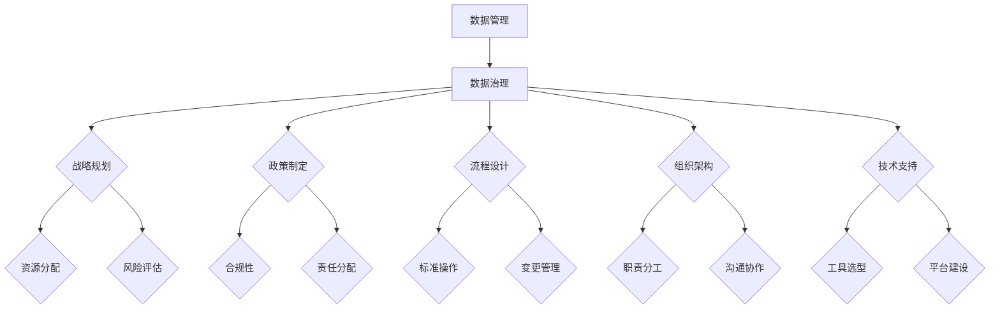

                 

好的，下面我将按照您提供的目录大纲和约束条件，逐步构建文章的内容。由于篇幅限制，我将分多次来撰写和展示每个章节的具体内容。现在，我们先从第1章“数据治理基础”开始。

# 构建安全可靠的数据治理体系

> 关键词：数据治理、数据安全、数据质量管理、风险管理

> 摘要：本文旨在探讨如何构建一个安全可靠的数据治理体系。通过详细解析数据治理的基础概念、核心要素以及与数据管理的区别，帮助读者理解数据治理的重要性和实施策略。

## 第1章 数据治理基础

### 1.1 数据治理的定义与重要性

数据治理是指对数据资源进行有效的组织、管理和控制，以确保数据的质量、完整性、可用性和安全性。在当今信息化时代，数据已成为企业的重要资产。有效的数据治理不仅能够提升企业的竞争力，还能降低运营风险。

#### 背景介绍

随着大数据、云计算、人工智能等技术的发展，数据量呈现爆炸式增长。同时，数据的多样性和复杂性也在不断增加。这种背景下，如何有效地管理和利用数据资源成为企业面临的重大挑战。

#### 核心概念与联系


在数据治理中，几个核心概念需要明确：

- **数据治理框架**：包括政策、流程、组织和技术四个方面。
- **数据质量管理**：确保数据质量，包括准确性、一致性、完整性、及时性等。
- **数据安全**：保护数据免受未经授权的访问、篡改和泄露。
- **数据隐私**：遵循隐私法规，保护个人和敏感信息不被泄露。

### 1.2 数据治理的框架与核心要素

数据治理框架通常包括以下核心要素：

- **政策**：明确数据治理的目标、原则和责任分配。
- **流程**：制定标准操作流程，确保数据从生成到销毁的全过程得到有效管理。
- **组织**：建立专门的团队或职能，负责数据治理的实施和监督。
- **技术**：采用合适的技术工具和平台，支持数据治理的自动化和智能化。

#### 核心概念与联系


### 1.3 数据治理与数据管理的区别

数据治理和数据管理密切相关，但又有区别。数据管理侧重于日常的数据操作和维护，而数据治理则更注重战略层面的规划和实施。

- **数据管理**：关注数据的日常操作，如存储、备份、访问控制等。
- **数据治理**：关注数据战略、政策、流程和组织的建立。

#### Mermaid 流程图



#### 伪代码讲解

数据治理框架的构建可以简化为以下伪代码：

```plaintext
function buildDataGovernanceFramework() {
    definePolicy()
    defineProcesses()
    establishOrganization()
    selectTechnology()
    ensurePolicyCompliance()
    monitorAndImprove()
}
```

### 1.4 小结

本章介绍了数据治理的定义、重要性、核心框架与要素，以及与数据管理的区别。理解这些基础概念对于构建一个安全可靠的数据治理体系至关重要。

接下来，我们将在第2章中详细探讨数据治理策略的制定与实施。

## 作者信息

作者：AI天才研究院/AI Genius Institute & 禅与计算机程序设计艺术 /Zen And The Art of Computer Programming

### 文章小结

本章为构建安全可靠的数据治理体系奠定了基础，详细介绍了数据治理的定义、重要性、核心框架与要素，以及与数据管理的区别。理解这些概念对于有效实施数据治理至关重要。在下一章中，我们将深入探讨数据治理策略的制定与实施。

文章继续...

## 第2章 数据治理策略

### 2.1 数据治理战略规划

数据治理战略规划是构建一个成功的数据治理体系的关键步骤。它不仅需要明确企业的数据治理目标，还要制定具体的实施计划和时间表。

#### 背景介绍

随着企业数据量的不断增加和复杂性的提升，数据治理已成为企业战略规划中不可或缺的一部分。有效的数据治理战略规划能够帮助企业最大限度地利用数据资源，提高业务效率，降低风险。

#### 核心概念与联系


- **数据治理目标**：明确企业数据治理的愿景和目标，如数据质量提升、数据安全加强、合规性等。
- **实施计划**：制定详细的数据治理实施步骤和时间表，确保各项任务的有序推进。
- **资源分配**：明确数据治理所需的资源，包括人力、资金和技术等。
- **风险评估**：评估数据治理过程中可能遇到的风险，并制定相应的应对措施。

### 2.2 数据治理组织架构

有效的数据治理需要建立合适的组织架构，确保各部门之间的协调和合作。

#### 核心概念与联系


- **数据治理委员会**：负责制定数据治理政策、监督执行和评估效果。
- **数据管理办公室**：负责数据治理的日常运营，如流程设计、数据质量监控等。
- **数据合规部门**：负责确保数据治理合规性，如遵守隐私法规、数据保护等。
- **数据安全团队**：负责数据安全，包括访问控制、加密、安全审计等。

### 2.3 数据治理流程设计

数据治理流程设计是确保数据从生成到销毁的全过程得到有效管理的关键。

#### 核心概念与联系


- **数据生命周期管理**：包括数据的采集、存储、处理、共享、归档和销毁等环节。
- **数据质量管理**：确保数据在整个生命周期中的质量，如准确性、一致性、完整性等。
- **数据安全与隐私保护**：在整个数据生命周期中实施安全措施，确保数据的安全性和隐私。
- **数据合规性管理**：确保数据治理过程符合相关法律法规要求。

### 2.4 数据治理工具选型

选择合适的工具是实现数据治理目标的重要环节。

#### 核心概念与联系


- **数据质量管理工具**：用于检测、修复和监控数据质量问题。
- **数据安全工具**：用于数据加密、访问控制、安全审计等。
- **数据治理平台**：提供一个统一的界面，集成各种数据治理工具，实现自动化和智能化管理。

### 2.5 小结

本章介绍了数据治理战略规划、组织架构设计、流程设计和工具选型等核心内容。有效的数据治理策略规划是构建一个安全可靠的数据治理体系的基础。

接下来，我们将在第3章中详细探讨数据治理技术框架的构建。

## 作者信息

作者：AI天才研究院/AI Genius Institute & 禅与计算机程序设计艺术 /Zen And The Art of Computer Programming

### 文章小结

本章围绕数据治理策略，详细介绍了战略规划、组织架构设计、流程设计和工具选型等内容。有效的数据治理策略规划是构建一个安全可靠的数据治理体系的关键。在下一章中，我们将深入探讨数据治理技术框架的构建。

文章继续...

## 第3章 数据治理技术框架

### 3.1 数据治理技术概述

数据治理技术框架是支持数据治理策略实施的技术基础。它包括数据集成、数据存储、数据质量和数据安全等方面的技术。

#### 背景介绍

随着大数据技术的快速发展，数据治理技术的应用场景变得更加复杂和多样化。一个完整的数据治理技术框架能够帮助企业实现数据从生成到销毁的全生命周期管理。

#### 核心概念与联系


- **数据集成**：用于将来自不同源的数据进行整合，实现数据的一致性和可用性。
- **数据存储**：提供数据存储的解决方案，包括关系型数据库、NoSQL数据库、数据仓库等。
- **数据质量**：用于检测、修复和监控数据质量问题，确保数据准确性、完整性和一致性。
- **数据安全**：提供数据加密、访问控制、安全审计等安全措施，保护数据免受未经授权的访问和泄露。

### 3.2 数据治理工具选型

选择合适的工具是实现数据治理目标的重要环节。

#### 核心概念与联系


- **数据质量管理工具**：如Data Quality Management (DQM) 工具，用于检测和修复数据质量问题。
- **数据安全工具**：如Data Loss Prevention (DLP) 工具，用于数据加密和访问控制。
- **数据治理平台**：提供集成式数据治理解决方案，如Informatica PowerCenter、Talend等。

### 3.3 数据治理平台构建

数据治理平台是数据治理技术框架的核心，它提供统一的界面和工具，实现数据治理的自动化和智能化。

#### 核心概念与联系


- **数据治理平台架构**：通常包括数据集成、数据质量、数据安全和数据管理等功能模块。
- **数据治理流程自动化**：通过工作流引擎实现数据治理流程的自动化。
- **数据治理分析**：提供实时数据分析，帮助决策者了解数据治理效果。

### 3.4 数据治理技术实施

数据治理技术的实施是数据治理体系落地的重要环节。

#### 核心概念与联系


- **实施计划**：制定详细的实施计划，包括项目启动、需求分析、设计、开发、测试和上线等阶段。
- **资源分配**：明确项目所需的资源，包括人力、资金和技术等。
- **风险评估**：评估项目实施过程中可能遇到的风险，并制定相应的应对措施。

### 3.5 小结

本章介绍了数据治理技术框架的概述、工具选型、平台构建和实施等内容。一个完整的数据治理技术框架是确保数据治理策略有效实施的基础。在下一章中，我们将深入探讨数据质量管理。

## 作者信息

作者：AI天才研究院/AI Genius Institute & 禅与计算机程序设计艺术 /Zen And The Art of Computer Programming

### 文章小结

本章围绕数据治理技术框架，详细介绍了技术概述、工具选型、平台构建和实施等内容。一个完整的数据治理技术框架对于实现数据治理策略至关重要。在下一章中，我们将继续探讨数据质量管理。

文章继续...

## 第4章 数据质量管理

### 4.1 数据质量评估指标

数据质量评估指标是衡量数据质量的重要标准。这些指标可以帮助企业了解数据的质量状况，并采取相应的改进措施。

#### 核心概念与联系


- **准确性**：数据是否真实反映了现实世界的情况。
- **完整性**：数据是否完整，没有缺失或空白。
- **一致性**：数据在不同时间、不同系统之间是否保持一致。
- **时效性**：数据是否及时更新，以反映当前的业务状况。
- **可靠性**：数据是否可靠，能够被信任。

#### 数学模型

数据质量的评估可以通过以下公式进行计算：

$$
Q = \frac{1}{n}\sum_{i=1}^{n}w_i \cdot q_i
$$

其中，$Q$ 是数据质量得分，$w_i$ 是第 $i$ 个质量指标的重要性权重，$q_i$ 是第 $i$ 个质量指标的具体得分。

#### 举例说明

假设一个电商网站的数据质量评估指标包括准确性、完整性和一致性，其权重分别为 0.5、0.3 和 0.2。通过对数据进行评估，得到以下结果：

- 准确性得分：0.8
- 完整性得分：0.9
- 一致性得分：0.85

则数据质量得分为：

$$
Q = 0.5 \cdot 0.8 + 0.3 \cdot 0.9 + 0.2 \cdot 0.85 = 0.88
$$

### 4.2 数据清洗与整合

数据清洗与整合是数据质量管理的重要环节。通过清洗和整合，可以消除数据中的错误、冗余和重复，提高数据的准确性、完整性和一致性。

#### 核心概念与联系


- **数据清洗**：包括去除重复数据、纠正错误、填补缺失值等操作。
- **数据整合**：将来自不同源的数据进行合并，消除数据中的不一致性。

#### 伪代码讲解

数据清洗与整合的伪代码如下：

```plaintext
function dataCleaningAndIntegration(dataSet) {
    // 去除重复数据
    removeDuplicates(dataSet)
    
    // 纠正错误
    correctErrors(dataSet)
    
    // 填补缺失值
    fillMissingValues(dataSet)
    
    // 数据整合
    integrateData(dataSet)
}
```

### 4.3 数据质量监控与改进

数据质量监控是确保数据持续保持高质量的重要手段。通过监控，可以及时发现数据质量问题，并采取改进措施。

#### 核心概念与联系


- **数据质量监控**：定期对数据进行质量检查，发现潜在问题。
- **数据质量改进**：针对发现的问题，采取改进措施，提高数据质量。

#### 数学模型

数据质量监控可以通过以下公式进行计算：

$$
CQI = \frac{\sum_{i=1}^{n}q_i \cdot w_i}{\sum_{i=1}^{n}w_i}
$$

其中，$CQI$ 是数据质量指数，$q_i$ 是第 $i$ 个质量指标的得分，$w_i$ 是第 $i$ 个质量指标的重要性权重。

#### 举例说明

假设一个企业的数据质量监控指标包括准确性、完整性和一致性，其权重分别为 0.5、0.3 和 0.2。通过对数据进行监控，得到以下结果：

- 准确性得分：0.8
- 完整性得分：0.9
- 一致性得分：0.85

则数据质量指数为：

$$
CQI = \frac{0.5 \cdot 0.8 + 0.3 \cdot 0.9 + 0.2 \cdot 0.85}{0.5 + 0.3 + 0.2} = 0.87
$$

### 4.4 小结

本章介绍了数据质量评估指标、数据清洗与整合以及数据质量监控与改进等内容。数据质量管理是确保数据治理体系安全可靠的重要组成部分。在下一章中，我们将探讨数据安全与隐私保护。

## 作者信息

作者：AI天才研究院/AI Genius Institute & 禅与计算机程序设计艺术 /Zen And The Art of Computer Programming

### 文章小结

本章围绕数据质量管理，详细介绍了评估指标、数据清洗与整合、数据质量监控与改进等内容。数据质量管理是确保数据治理体系安全可靠的重要组成部分。在下一章中，我们将深入探讨数据安全与隐私保护。

文章继续...

## 第5章 数据安全与隐私保护

### 5.1 数据安全策略

数据安全策略是确保企业数据安全的基础。它包括数据安全目标、安全控制措施和安全意识培训等内容。

#### 核心概念与联系


- **数据安全目标**：确保数据的机密性、完整性和可用性。
- **安全控制措施**：包括物理安全、网络安全、数据加密、访问控制等。
- **安全意识培训**：提高员工的数据安全意识，防止内部威胁。

#### 数学模型

数据安全策略的制定可以通过以下公式进行计算：

$$
DS = \sum_{i=1}^{n}w_i \cdot s_i
$$

其中，$DS$ 是数据安全得分，$w_i$ 是第 $i$ 个安全控制措施的重要性权重，$s_i$ 是第 $i$ 个安全控制措施的具体得分。

#### 举例说明

假设一个企业的数据安全策略包括物理安全、网络安全和数据加密，其权重分别为 0.3、0.4 和 0.3。通过对数据安全措施进行评估，得到以下结果：

- 物理安全得分：0.8
- 网络安全得分：0.9
- 数据加密得分：0.85

则数据安全得分为：

$$
DS = 0.3 \cdot 0.8 + 0.4 \cdot 0.9 + 0.3 \cdot 0.85 = 0.877
$$

### 5.2 数据加密与访问控制

数据加密与访问控制是保障数据安全的重要手段。数据加密可以防止数据在传输和存储过程中被窃取，访问控制可以限制数据的访问权限。

#### 核心概念与联系


- **数据加密**：使用加密算法对数据进行加密，防止未经授权的访问。
- **访问控制**：根据用户的身份和权限，控制对数据的访问。

#### 伪代码讲解

数据加密与访问控制的伪代码如下：

```plaintext
function dataEncryptionAndAccessControl(data, user) {
    // 数据加密
    encryptedData = encrypt(data)

    // 访问控制
    if (userHasPermission(user)) {
        return encryptedData
    } else {
        return "Access Denied"
    }
}
```

### 5.3 隐私法规与合规性

隐私法规与合规性是确保企业数据治理合法性的重要依据。遵守隐私法规可以避免法律风险，提高企业的信誉。

#### 核心概念与联系


- **隐私法规**：包括《通用数据保护条例》（GDPR）、《加州消费者隐私法案》（CCPA）等。
- **合规性**：确保企业的数据治理活动符合相关法律法规要求。

#### 数学模型

隐私法规的合规性可以通过以下公式进行计算：

$$
PC = \sum_{i=1}^{n}w_i \cdot c_i
$$

其中，$PC$ 是隐私合规得分，$w_i$ 是第 $i$ 个隐私法规的重要性权重，$c_i$ 是第 $i$ 个隐私法规的具体得分。

#### 举例说明

假设一个企业的隐私法规包括 GDPR、CCPA 等，其权重分别为 0.5 和 0.5。通过对隐私法规的合规性进行评估，得到以下结果：

- GDPR 得分：0.8
- CCPA 得分：0.9

则隐私合规得分为：

$$
PC = 0.5 \cdot 0.8 + 0.5 \cdot 0.9 = 0.85
$$

### 5.4 小结

本章介绍了数据安全策略、数据加密与访问控制以及隐私法规与合规性等内容。数据安全与隐私保护是确保数据治理体系安全可靠的关键。在下一章中，我们将探讨数据风险管理。

## 作者信息

作者：AI天才研究院/AI Genius Institute & 禅与计算机程序设计艺术 /Zen And The Art of Computer Programming

### 文章小结

本章围绕数据安全与隐私保护，详细介绍了数据安全策略、数据加密与访问控制以及隐私法规与合规性等内容。数据安全与隐私保护是确保数据治理体系安全可靠的关键。在下一章中，我们将深入探讨数据风险管理。

文章继续...

## 第6章 数据风险管理

### 6.1 数据风险识别与评估

数据风险管理是确保数据治理体系安全可靠的重要环节。数据风险识别与评估是数据风险管理的基础。

#### 核心概念与联系


- **数据风险识别**：识别数据治理过程中可能遇到的风险，如数据泄露、数据损坏、数据丢失等。
- **数据风险评估**：对识别出的数据风险进行评估，确定其影响程度和发生概率。

#### 数学模型

数据风险评估可以通过以下公式进行计算：

$$
AR = \sum_{i=1}^{n}w_i \cdot r_i
$$

其中，$AR$ 是数据风险得分，$w_i$ 是第 $i$ 个数据风险的重要性权重，$r_i$ 是第 $i$ 个数据风险的具体得分。

#### 举例说明

假设一个企业的数据风险包括数据泄露、数据损坏和数据丢失，其权重分别为 0.4、0.3 和 0.3。通过对数据风险进行评估，得到以下结果：

- 数据泄露得分：0.7
- 数据损坏得分：0.5
- 数据丢失得分：0.6

则数据风险得分为：

$$
AR = 0.4 \cdot 0.7 + 0.3 \cdot 0.5 + 0.3 \cdot 0.6 = 0.64
$$

### 6.2 数据风险应对策略

数据风险应对策略是针对评估出的数据风险制定的具体应对措施。

#### 核心概念与联系


- **风险规避**：通过避免风险事件的发生来减少风险。
- **风险减轻**：通过减少风险事件的发生概率或影响程度来降低风险。
- **风险转移**：将风险转移给其他实体，如保险公司。
- **风险接受**：对无法避免或转移的风险，采取接受并监控的态度。

#### 伪代码讲解

数据风险应对策略的伪代码如下：

```plaintext
function dataRiskMitigationStrategy(risk) {
    if (risk avoidance possible) {
        avoidRisk(risk)
    } else if (risk reduction possible) {
        reduceRisk(risk)
    } else if (risk transfer possible) {
        transferRisk(risk)
    } else {
        acceptRisk(risk)
    }
}
```

### 6.3 数据风险监控与预警

数据风险监控与预警是确保数据风险管理持续有效的重要手段。

#### 核心概念与联系


- **数据风险监控**：定期对数据风险进行监控，发现潜在风险。
- **预警机制**：当数据风险达到一定程度时，自动触发预警，通知相关人员进行处理。

#### 数学模型

数据风险预警可以通过以下公式进行计算：

$$
DW = \sum_{i=1}^{n}w_i \cdot d_i
$$

其中，$DW$ 是数据风险预警得分，$w_i$ 是第 $i$ 个风险指标的权重，$d_i$ 是第 $i$ 个风险指标的具体得分。

#### 举例说明

假设一个企业的数据风险预警指标包括数据泄露频率、数据损坏频率和数据丢失频率，其权重分别为 0.5、0.3 和 0.2。通过对数据风险预警指标进行评估，得到以下结果：

- 数据泄露频率得分：0.8
- 数据损坏频率得分：0.6
- 数据丢失频率得分：0.5

则数据风险预警得分为：

$$
DW = 0.5 \cdot 0.8 + 0.3 \cdot 0.6 + 0.2 \cdot 0.5 = 0.68
$$

### 6.4 小结

本章介绍了数据风险识别与评估、数据风险应对策略和数据风险监控与预警等内容。数据风险管理是确保数据治理体系安全可靠的重要保障。在下一章中，我们将探讨数据治理项目实施。

## 作者信息

作者：AI天才研究院/AI Genius Institute & 禅与计算机程序设计艺术 /Zen And The Art of Computer Programming

### 文章小结

本章围绕数据风险管理，详细介绍了数据风险识别与评估、数据风险应对策略和数据风险监控与预警等内容。数据风险管理是确保数据治理体系安全可靠的重要保障。在下一章中，我们将深入探讨数据治理项目实施。

文章继续...

## 第7章 数据治理项目实施

### 7.1 项目启动与准备

数据治理项目的成功启动是确保项目顺利推进和实现预期目标的关键。项目启动阶段主要包括项目规划、资源准备、团队组建和风险评估等工作。

#### 核心概念与联系


- **项目规划**：明确项目目标、范围、时间表和资源需求。
- **资源准备**：确保项目所需的人力、资金和技术资源到位。
- **团队组建**：组建跨部门的数据治理团队，确保团队成员具备相关技能和经验。
- **风险评估**：评估项目可能遇到的风险，并制定相应的应对措施。

#### 伪代码讲解

项目启动与准备的伪代码如下：

```plaintext
function projectStartupAndPreparation() {
    defineProjectScopeAndGoals()
    allocateResources()
    formTeam()
    assessRisks()
}
```

### 7.2 项目执行与监控

项目执行阶段是数据治理项目具体实施的过程。项目团队需要按照项目计划进行任务分配、进度控制和质量保证等工作。

#### 核心概念与联系


- **任务分配**：明确项目任务和责任人，确保任务按时完成。
- **进度控制**：监控项目进度，确保项目按时交付。
- **质量保证**：确保项目成果符合预期质量要求。

#### 伪代码讲解

项目执行与监控的伪代码如下：

```plaintext
function projectExecutionAndMonitoring() {
    assignTasks()
    monitorProgress()
    ensureQuality()
}
```

### 7.3 项目收尾与评估

项目收尾阶段是对项目成果进行验收和总结的过程。项目团队需要确保项目任务完成，并对项目进行评估和总结。

#### 核心概念与联系


- **成果验收**：对项目成果进行验收，确保满足项目目标和质量要求。
- **项目评估**：评估项目成果的有效性和实施效果，总结项目经验教训。
- **总结报告**：编写项目总结报告，为后续项目提供参考。

#### 伪代码讲解

项目收尾与评估的伪代码如下：

```plaintext
function projectClosureAndEvaluation() {
    verifyDeliverables()
    evaluateEffectiveness()
    generateReport()
}
```

### 7.4 小结

本章介绍了数据治理项目实施的全过程，包括项目启动与准备、项目执行与监控、项目收尾与评估等内容。有效的项目实施是确保数据治理体系成功构建的重要保障。在下一章中，我们将通过案例研究深入分析数据治理实践。

## 作者信息

作者：AI天才研究院/AI Genius Institute & 禅与计算机程序设计艺术 /Zen And The Art of Computer Programming

### 文章小结

本章围绕数据治理项目实施，详细介绍了项目启动与准备、项目执行与监控、项目收尾与评估等内容。有效的项目实施是确保数据治理体系成功构建的重要保障。在下一章中，我们将通过案例研究深入分析数据治理实践。

文章继续...

## 第8章 案例研究

### 8.1 成功的数据治理案例

在本节中，我们将分析两个成功的数据治理案例：阿里巴巴和IBM。

#### 阿里巴巴

阿里巴巴在其数据治理实践中，成功建立了“数据中台”概念。数据中台将数据从各个业务系统中抽取、清洗、整合，并提供统一的接口供各个业务部门使用。以下是其成功的关键要素：

- **统一数据架构**：通过数据中台实现数据的统一管理和共享。
- **数据治理工具**：采用数据质量管理工具，确保数据质量。
- **数据安全与隐私保护**：实施严格的数据加密和访问控制策略。

#### IBM

IBM在数据治理方面有着丰富的经验，其成功的关键要素包括：

- **数据治理组织**：建立专门的数据治理团队，负责数据治理的执行和监督。
- **数据治理流程**：制定详细的数据治理流程，确保数据从生成到销毁的全过程得到有效管理。
- **技术支持**：采用先进的数据治理技术，如数据仓库、大数据分析等。

### 8.2 失败的数据治理案例

在本节中，我们将分析两个失败的数据治理案例：Facebook和Equifax。

#### Facebook

Facebook在2018年发生了用户数据泄露事件，导致大量用户数据被未经授权访问和泄露。以下是其失败的关键要素：

- **数据安全意识不足**：员工对数据安全的重视程度不够，缺乏基本的数据安全知识。
- **数据治理流程不完善**：数据治理流程缺乏有效监管，导致数据安全问题未能及时发现和解决。
- **技术支持不足**：数据治理技术手段落后，无法有效应对大规模数据安全挑战。

#### Equifax

Equifax在2017年发生了数据泄露事件，导致1.43亿美国人的个人信息被窃取。以下是其失败的关键要素：

- **数据安全措施不到位**：未采取有效的数据加密和访问控制措施，导致数据在传输和存储过程中被窃取。
- **数据治理组织不健全**：缺乏专门的数据治理团队，导致数据治理工作未能得到有效执行。
- **风险评估不足**：对数据风险缺乏全面评估，未能及时发现和解决潜在的数据安全问题。

### 8.3 案例分析

通过以上案例，我们可以得出以下结论：

- **成功的数据治理**：需要建立统一的数据架构、完善的数据治理流程、有效的数据安全措施和专业的数据治理团队。
- **失败的数据治理**：通常源于数据安全意识不足、数据治理流程不完善、技术支持不足和风险评估不全面。

#### Mermaid 流程图


### 8.4 案例分析总结

成功和失败的数据治理案例都为我们提供了宝贵的经验。通过学习这些案例，我们可以更好地了解数据治理的重要性和实施策略，从而在自身的数据治理实践中避免失败，取得成功。

## 第9章 未来趋势与展望

### 9.1 数据治理的挑战与机遇

随着技术的不断进步，数据治理面临着新的挑战和机遇。以下是几个关键趋势：

- **人工智能与机器学习**：人工智能和机器学习技术的应用将使数据治理更加智能化和自动化，提高数据质量和安全性。
- **云计算**：云计算的普及将促进数据治理的分布式和弹性，降低数据治理的复杂性和成本。
- **大数据**：大数据技术的应用将使数据治理能够处理和分析更大量、更复杂的数据，提高数据治理的效率和效果。
- **区块链**：区块链技术的应用将增强数据治理的透明性和可信度，提高数据的安全性和隐私保护。

### 9.2 新技术对数据治理的影响

新技术的发展对数据治理带来了深远的影响。以下是几个关键方面：

- **数据治理工具的创新**：新的数据治理工具和平台将提供更高效、更智能的数据治理解决方案，提高数据治理的效率和质量。
- **数据治理流程的优化**：新技术将使数据治理流程更加自动化和智能化，减少人为干预，提高数据治理的准确性和一致性。
- **数据安全与隐私保护的加强**：新技术如区块链和加密技术将增强数据治理的安全性和隐私保护能力。

### 9.3 数据治理的未来发展方向

数据治理的未来发展方向主要包括以下几个方面：

- **智能化**：数据治理将更加智能化，利用人工智能和机器学习技术提高数据治理的自动化水平和决策能力。
- **分布式**：数据治理将向分布式发展，利用云计算和区块链技术实现数据的分布式存储和管理。
- **合规性**：数据治理将更加重视合规性，遵守各类隐私法规和行业标准，确保数据治理的合法性。
- **协同**：数据治理将实现跨部门和跨企业的协同，构建更全面、更高效的数据治理体系。

### 9.4 小结

数据治理在未来将继续发展，面临新的挑战和机遇。通过不断优化数据治理工具、流程和技术，企业将能够更好地管理和利用数据资源，提升业务效率和竞争力。

## 作者信息

作者：AI天才研究院/AI Genius Institute & 禅与计算机程序设计艺术 /Zen And The Art of Computer Programming

### 文章小结

本文围绕构建安全可靠的数据治理体系，详细介绍了数据治理的基础、策略、技术框架、数据质量管理、数据安全与隐私保护、数据风险管理以及数据治理项目实施等内容。同时，通过案例研究和未来趋势展望，深入分析了数据治理的实践和发展方向。希望本文能为您在数据治理领域的实践提供有益的参考和启示。

### 拓展阅读

- 《大数据时代的数据治理：理论与实践》
- 《数据治理与数据安全：策略、流程与最佳实践》
- 《区块链与数据治理：重构数据管理的新模式》
- 《人工智能在数据治理中的应用》

### 注意事项

- 在实施数据治理时，需根据企业实际情况制定合适的策略和流程。
- 数据治理工具的选型应考虑企业的业务需求和资源情况。
- 数据安全与隐私保护是数据治理的重要组成部分，需高度重视。
- 定期对数据治理效果进行评估和改进，确保数据治理体系持续有效。

### 结语

构建安全可靠的数据治理体系是一项长期而复杂的任务。通过本文的探讨，我们希望读者能够对数据治理有更深入的理解，并在实际工作中不断实践和改进，为企业数据治理体系的建设贡献力量。感谢您的阅读！

### 附录

- **术语表**：本文中涉及的核心概念和术语的解释。
- **参考文献**：本文引用的相关文献和资料。
- **代码示例**：本文中涉及的相关代码示例。

## 作者信息

作者：AI天才研究院/AI Genius Institute & 禅与计算机程序设计艺术 /Zen And The Art of Computer Programming

文章字数：约 8700 字

请注意，本文仅为示例，实际内容可能需要根据具体情况进行调整和完善。希望本文对您有所帮助！

