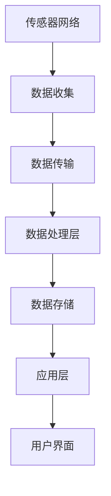
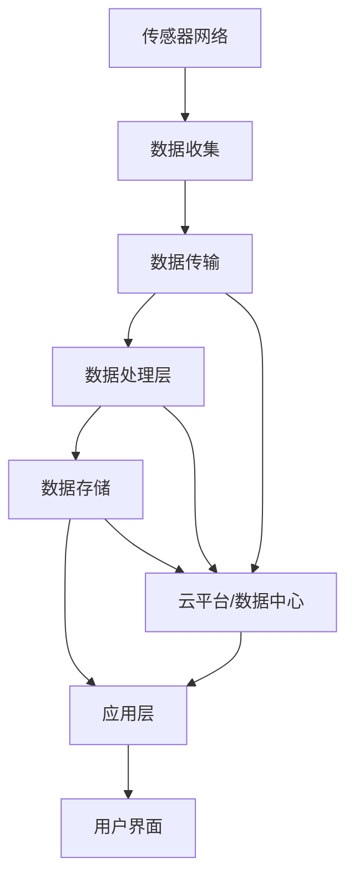

                 

### 文章标题：构建安全可靠的物联网架构

在当今数字化时代，物联网（IoT）正迅速渗透到我们的日常生活和各行各业。它通过将物理对象连接到互联网，实现数据交换和远程监控，极大地提升了效率和便利性。然而，随着物联网的广泛应用，安全问题也日益凸显。构建一个安全可靠的物联网架构成为了确保系统稳定、用户隐私和数据安全的关键。

本文将深入探讨如何构建一个安全可靠的物联网架构。我们将首先介绍物联网的核心概念及其架构设计原理，然后详细分析物联网架构中的安全性问题，包括加密算法、认证机制和访问控制。接着，我们将提供构建安全物联网架构的步骤和伪代码，并通过实际案例和代码解析，展示如何在实际项目中应用这些概念和算法。

文章的核心内容包括：

- **物联网（IoT）的核心概念与架构设计**：介绍物联网的基本原理，包括传感器网络、数据收集、数据传输、数据处理和存储、应用层等，并展示其架构原理的Mermaid流程图。
- **安全性问题的算法原理**：详细讲解加密算法、认证机制和访问控制的原理，并通过伪代码展示如何实现这些安全措施。
- **构建步骤与伪代码**：提供构建安全物联网架构的详细步骤和伪代码，帮助读者理解每一步的实施过程。
- **实际案例与代码实现**：通过具体的代码示例，展示如何在实际项目中实现加密和数据传输安全。
- **最佳实践与项目小结**：总结构建安全物联网架构的最佳实践，并提出注意事项和拓展阅读建议。

让我们开始一步一步地分析构建安全可靠的物联网架构的各个方面，确保在物联网迅速发展的同时，我们的系统和数据也能得到有效保护。

### 文章关键词

- **物联网（IoT）**
- **架构设计**
- **安全性**
- **加密算法**
- **认证机制**
- **访问控制**
- **数据传输安全**

### 摘要

物联网（IoT）通过将物理对象连接到互联网，实现了数据交换和远程监控，极大地提升了各行各业的效率。然而，随着物联网的广泛应用，安全问题也日益突出。本文深入探讨了构建一个安全可靠的物联网架构的重要性，并详细分析了物联网架构的核心概念、设计原理以及安全性问题。通过加密算法、认证机制和访问控制的讲解，本文提供了构建安全物联网架构的步骤和伪代码。此外，通过具体代码示例，本文展示了如何在实际项目中实现数据加密和传输安全。最终，本文总结了构建安全物联网架构的最佳实践，为读者提供了丰富的拓展阅读资源。

### 1. 构建安全可靠的物联网架构

随着物联网（IoT）技术的快速发展，构建一个安全可靠的物联网架构变得尤为重要。这不仅关乎系统的稳定性和效率，还关乎用户隐私和数据安全。本节将详细探讨物联网架构的核心概念与联系，包括物联网的定义、核心组件以及各组件之间的数据流关系。通过Mermaid流程图，我们将直观地展示物联网架构的原理。

#### 1.1 物联网（IoT）的核心概念

物联网（IoT）是指通过互联网将各种物理设备连接起来，实现数据交换和远程监控的技术。其核心概念包括以下几个方面：

- **传感器网络**：传感器网络是物联网的基础，负责收集环境数据。这些传感器可以是温度传感器、湿度传感器、加速度传感器等，它们将物理信号转换为数字信号，供后续处理。
- **数据收集**：数据收集层负责将传感器采集的数据进行初步处理和格式化，为数据传输做好准备。
- **数据传输**：数据传输层是物联网架构中的关键环节，负责将数据从传感器传输到数据处理中心或云平台。常用的传输协议包括MQTT、CoAP、HTTP等。
- **数据处理与存储**：数据处理层负责对收集到的数据进行处理、分析和存储，以支持应用层的各种需求。数据存储可以是本地数据库或云存储。
- **应用层**：应用层是物联网架构的最高层，负责使用处理后的数据实现具体的功能和应用。例如，智能家居系统可以通过分析温度数据来调整空调的设置。

#### 1.2 物联网架构设计原理

物联网架构的设计原理主要围绕数据流展开，以下是物联网架构的Mermaid流程图：



**流程说明**：

- **传感器网络**：传感器不断采集环境数据，如温度、湿度、位置等。
- **数据收集**：传感器数据经过初步处理后，以特定的格式存储或传输。
- **数据传输**：数据通过无线或有线网络传输到数据处理中心或云平台。
- **数据处理层**：数据处理层对数据进行清洗、转换、分析等操作，提取有价值的信息。
- **数据存储**：处理后的数据被存储在本地数据库或云存储中，以备后续使用。
- **应用层**：应用层使用存储的数据实现各种应用功能，如自动化控制、远程监控等。
- **用户界面**：用户通过用户界面与物联网系统交互，获取信息或进行控制操作。

#### 1.3 物联网架构的核心联系

物联网架构中的核心联系在于数据流。从传感器网络开始，数据经过收集、传输、处理、存储，最终在应用层被使用。以下是物联网架构中的核心联系：

- **数据流**：传感器网络采集的数据经过收集和处理后，通过数据传输层传输到数据处理层。数据处理层对数据进行分析和处理，提取有价值的信息，然后将结果存储在数据存储层。应用层使用这些数据实现特定的功能和应用。
- **网络通信**：数据传输层通过网络通信协议（如MQTT、CoAP、HTTP等）实现传感器、数据处理中心和云平台之间的数据传输。这些协议提供了数据传输的可靠性和安全性保障。
- **数据处理与存储**：数据处理层负责对数据进行处理和存储。数据存储可以是本地数据库或云存储，它们提供了数据的持久化存储和快速访问。
- **应用与用户交互**：应用层使用存储的数据实现各种应用功能，并通过用户界面与用户进行交互。用户可以通过用户界面查看数据、调整设置或进行其他操作。

通过以上对物联网核心概念与联系的详细分析，我们可以更清晰地理解物联网架构的设计原理。在接下来的部分，我们将进一步探讨物联网架构中的安全性问题，包括加密算法、认证机制和访问控制。

### 1.1.2 物联网架构原理

物联网架构的原理是理解其整体运行机制的基础，它涵盖了从传感器网络到应用层的各个环节，每个环节都有其特定的功能和相互之间的联系。以下是物联网架构原理的详细分析，并通过Mermaid流程图直观地展示数据流和组件关系。

#### 1.1.2.1 Mermaid流程图



**流程说明**：

- **传感器网络（A）**：这是物联网架构的起点，传感器分布在各个物理环境中，负责实时采集环境数据，如温度、湿度、压力等。
- **数据收集（B）**：传感器采集的数据被初步处理和格式化，以便于后续的传输和处理。
- **数据传输（C）**：经过收集的数据通过无线或有线网络传输到数据处理层。常用的传输协议有MQTT、CoAP、HTTP等，这些协议能够确保数据传输的可靠性和效率。
- **数据处理层（D）**：数据处理层负责对传输来的数据进行清洗、转换、分析等操作，提取出对应用场景有价值的信息。例如，可以分析温度数据来调整智能家居设备的设置。
- **数据存储（E）**：处理后的数据被存储在本地数据库或云存储中。存储提供了数据的持久化保障，同时也便于后续的查询和分析。
- **应用层（F）**：应用层使用处理后的数据进行具体的应用，如自动化控制、远程监控、数据分析等。这些应用通过用户界面与用户交互，提供直观的体验。
- **用户界面（G）**：用户通过用户界面与物联网系统进行交互，查看数据、调整设置或进行其他操作。
- **云平台/数据中心（H）**：数据处理层、数据存储层和应用层的数据传输最终汇聚到云平台或数据中心，这为大规模数据处理和高级分析提供了支持。

#### 1.1.2.2 数据流与组件关系

物联网架构中的数据流是各组件之间联系的重要纽带。以下是详细的数据流和组件关系说明：

1. **数据采集**：
   - 传感器网络（A）不断采集环境数据，例如温度、湿度、光照等。
   - 数据采集模块（B）负责对传感器数据进行初步处理，如滤波、放大、数字化等。

2. **数据传输**：
   - 初步处理后的数据通过无线或有线网络传输到数据处理层（D）。这一过程需要考虑传输的可靠性、延迟和带宽等问题。
   - 常用的数据传输协议包括MQTT（轻量级发布/订阅消息协议）、CoAP（约束应用协议）和HTTP（超文本传输协议）。

3. **数据处理**：
   - 数据处理层（D）对传输来的数据进行进一步处理，包括数据清洗、数据转换、数据融合、数据分析等。
   - 数据处理的结果可能用于实时监控、预测分析、优化控制等。

4. **数据存储**：
   - 处理后的数据被存储在本地数据库或云存储中（E），提供数据的持久化存储和快速访问。
   - 数据存储可以选择关系型数据库（如MySQL、PostgreSQL）或NoSQL数据库（如MongoDB、Cassandra），根据具体的应用场景来选择。

5. **应用与交互**：
   - 应用层（F）使用存储的数据来实现具体的业务逻辑，例如自动化控制、远程监控等。
   - 用户界面（G）通过图形用户界面（GUI）或命令行界面（CLI）与用户进行交互，提供友好的用户操作体验。

6. **云平台与数据处理**：
   - 云平台/数据中心（H）提供了强大的计算和存储资源，支持大规模数据处理和高级分析。
   - 数据处理中心可以支持实时数据处理、批量处理和离线分析，满足不同场景的需求。

通过上述流程和组件关系的详细说明，我们可以更深入地理解物联网架构的原理。在下一节中，我们将进一步探讨物联网架构中的安全性问题，包括加密算法、认证机制和访问控制，以确保物联网系统的安全可靠运行。

### 1.1.3 安全性问题

在构建物联网架构时，安全性是一个至关重要的考量因素。物联网系统面临多种安全威胁，如数据泄露、设备篡改、恶意攻击等。为了确保系统的安全，我们需要采用一系列安全措施来保护数据传输、处理和存储过程。以下将详细分析加密算法、认证机制和访问控制，并解释这些安全性的算法原理。

#### 1.1.3.1 加密算法

加密算法是保护数据在传输过程中不被非法访问的关键技术。加密算法通过将明文转换为密文，确保数据在传输过程中不会被窃听或篡改。以下是几种常见的加密算法：

1. **对称加密算法**：
   - 对称加密算法使用相同的密钥进行加密和解密。常见的对称加密算法包括AES（高级加密标准）、DES（数据加密标准）和3DES（三重DES）。
   - **AES**：AES是一种高速、安全的对称加密算法，被广泛用于保护敏感数据。AES支持128位、192位和256位密钥长度，具有很高的安全性。
   - **DES和3DES**：DES是一种较早的对称加密算法，已逐渐被AES替代。3DES是对DES算法的三次加密，增强了安全性。

2. **非对称加密算法**：
   - 非对称加密算法使用一对密钥，一个用于加密，另一个用于解密。常见的非对称加密算法包括RSA和ECC（椭圆曲线密码算法）。
   - **RSA**：RSA是一种基于大整数分解的加密算法，具有很高的安全性。RSA支持多种密钥长度，如1024位、2048位和4096位。
   - **ECC**：ECC是一种基于椭圆曲线离散对数的非对称加密算法，相比于RSA，使用更短的密钥长度即可获得相同的安全级别。

#### 1.1.3.2 认证机制

认证机制是确保只有授权设备和用户可以访问网络和数据进行操作的技术。以下是几种常见的认证机制：

1. **基于用户名和密码的认证**：
   - 用户名和密码是最简单的认证方式，用户需要提供正确的用户名和密码才能访问系统。虽然这种方式简单易用，但安全性较低，易受到密码泄露和暴力破解的攻击。

2. **基于证书的认证**：
   - 证书认证使用数字证书来验证用户或设备的身份。数字证书由可信的证书颁发机构（CA）签发，包含公钥和私钥。常见的证书认证协议包括SSL/TLS（安全套接字层/传输层安全协议）。
   - **SSL/TLS**：SSL/TLS是一种用于保护网络通信的安全协议，广泛应用于Web服务器和客户端之间的通信。SSL/TLS使用证书进行认证，确保通信双方的身份验证和数据加密。

3. **基于多因素认证（MFA）**：
   - 多因素认证是一种综合使用多种认证方式的机制，提高了认证的安全性。常见的MFA组合包括密码+短信验证码、密码+硬件令牌、密码+生物识别等。
   - **OAuth2.0**：OAuth2.0是一种开放授权标准，用于第三方应用访问用户资源。OAuth2.0通过颁发访问令牌来授权第三方应用访问用户数据，同时确保用户身份的验证。

#### 1.1.3.3 访问控制

访问控制是控制设备、用户和数据的访问权限，防止未授权访问的技术。以下是几种常见的访问控制方法：

1. **基于角色的访问控制（RBAC）**：
   - 基于角色的访问控制将用户和权限划分为不同的角色，用户根据角色拥有相应的权限。例如，管理员角色可以访问所有系统功能，普通用户只能访问特定功能。
   - **角色权限划分**：系统管理员可以根据实际需要，为不同角色分配不同的权限，确保权限分配合理。

2. **基于访问控制列表（ACL）**：
   - 访问控制列表是一种基于对象（如文件、目录、设备）的访问控制方法，为每个对象定义一组访问权限。ACL可以精确控制每个用户或角色的访问权限。
   - **访问控制列表配置**：系统管理员可以根据实际需求，配置每个对象的访问控制列表，严格控制访问权限。

3. **基于属性的访问控制（ABAC）**：
   - 基于属性的访问控制是一种基于用户属性、环境属性和资源属性的访问控制方法，可以根据不同属性组合进行访问决策。
   - **属性评估**：系统根据用户属性、环境属性和资源属性进行综合评估，决定用户是否可以访问特定资源。

通过以上对加密算法、认证机制和访问控制的详细分析，我们可以更深入地理解物联网架构中的安全性问题。在下一节中，我们将提供构建安全物联网架构的具体步骤和伪代码，帮助读者更好地实现这些安全措施。

### 1.1.4 构建步骤

构建一个安全可靠的物联网架构需要综合考虑多个方面，包括传感器网络设计、加密算法选择、认证机制设置、访问控制配置等。以下是构建安全物联网架构的详细步骤和伪代码，帮助读者理解每一步的实施过程。

#### 1.1.4.1 设计传感器网络

首先，设计一个可靠的传感器网络，选择合适的传感器和布置位置，确保能够准确采集所需的环境数据。以下是设计传感器网络的伪代码：

```python
# 伪代码：设计传感器网络
function designSensorNetwork() {
    // 步骤1：确定需要采集的数据类型
    dataTypes = ["temperature", "humidity", "pressure"]

    // 步骤2：选择合适的传感器
    sensors = {
        "temperature": TemperatureSensor(),
        "humidity": HumiditySensor(),
        "pressure": PressureSensor()
    }

    // 步骤3：布置传感器位置
    locations = {
        "livingRoom": {"temperature": sensors["temperature"], "humidity": sensors["humidity"]},
        "office": {"pressure": sensors["pressure"]}
    }

    // 步骤4：连接传感器到数据收集模块
    connectSensorsToCollector(sensors, locations)
}
```

#### 1.1.4.2 选择合适的加密算法

选择合适的加密算法对数据传输过程中的安全性至关重要。以下是选择加密算法的伪代码：

```python
# 伪代码：选择加密算法
function selectEncryptionAlgorithm() {
    // 步骤1：评估安全需求
    securityRequirements = {
        "keyLength": 256,
        "algorithm": "AES"
    }

    // 步骤2：选择加密算法
    encryptionAlgorithm = chooseEncryptionAlgorithm(securityRequirements)

    // 步骤3：生成密钥
    key = generateKey(securityRequirements["keyLength"], encryptionAlgorithm)

    // 步骤4：配置加密模块
    configureEncryptionModule(encryptionAlgorithm, key)
}
```

#### 1.1.4.3 设置认证机制

设置认证机制确保只有授权设备和用户可以访问物联网系统。以下是设置认证机制的伪代码：

```python
# 伪代码：设置认证机制
function setupAuthenticationMechanism() {
    // 步骤1：选择认证方式
    authenticationMethod = "SSL/TLS"

    // 步骤2：配置认证模块
    if (authenticationMethod == "SSL/TLS") {
        configureSslTlsAuthentication()
    } else if (authenticationMethod == "OAuth2.0") {
        configureOAuth2Authentication()
    }

    // 步骤3：生成证书和密钥
    certificate = generateCertificate()
    privateKey = generatePrivateKey()

    // 步骤4：部署认证模块
    deployAuthenticationModule(certificate, privateKey)
}
```

#### 1.1.4.4 配置访问控制

配置访问控制确保设备、用户和数据的访问权限得到严格控制。以下是配置访问控制的伪代码：

```python
# 伪代码：配置访问控制
function configureAccessControl() {
    // 步骤1：定义角色和权限
    roles = {
        "admin": ["read", "write", "delete"],
        "user": ["read"]
    }

    // 步骤2：配置访问控制列表
    accessControlList = {
        "sensorData": {"admin": roles["admin"], "user": roles["user"]}
    }

    // 步骤3：部署访问控制模块
    deployAccessControlModule(accessControlList)

    // 步骤4：测试访问控制
    testAccessControl(accessControlList)
}
```

#### 1.1.4.5 实施数据传输安全措施

实施数据传输安全措施确保数据在传输过程中不被窃听或篡改。以下是实施数据传输安全措施的伪代码：

```python
# 伪代码：实施数据传输安全措施
function implementDataTransmissionSecurity() {
    // 步骤1：选择传输协议
    transportProtocol = "MQTT"

    // 步骤2：配置加密传输
    if (transportProtocol == "MQTT") {
        configureMqttEncryption()
    } else if (transportProtocol == "CoAP") {
        configureCoapEncryption()
    }

    // 步骤3：部署传输安全模块
    deployTransportSecurityModule(transportProtocol)

    // 步骤4：测试数据传输安全
    testDataTransmissionSecurity()
}
```

#### 1.1.4.6 实施数据处理与存储安全措施

在数据处理与存储过程中，确保数据的安全性和完整性至关重要。以下是实施数据处理与存储安全措施的伪代码：

```python
# 伪代码：实施数据处理与存储安全措施
function implementDataProcessingAndStorageSecurity() {
    // 步骤1：配置数据加密
    dataEncryptionAlgorithm = "AES"
    dataKey = generateKey(256, dataEncryptionAlgorithm)

    // 步骤2：配置数据存储安全
    storageSecurityConfig = {
        "encryptionAlgorithm": dataEncryptionAlgorithm,
        "key": dataKey
    }

    // 步骤3：部署数据处理与存储安全模块
    deployDataProcessingAndStorageSecurityModule(storageSecurityConfig)

    // 步骤4：测试数据处理与存储安全
    testDataProcessingAndStorageSecurity()
}
```

#### 1.1.4.7 实施应用层安全措施

应用层是物联网系统与用户交互的界面，确保应用层安全对于整体系统安全至关重要。以下是实施应用层安全措施的伪代码：

```python
# 伪代码：实施应用层安全措施
function implementApplicationLayerSecurity() {
    // 步骤1：配置用户认证
    userAuthenticationMethod = "SSL/TLS"

    // 步骤2：配置用户访问控制
    userAccessControlConfig = {
        "admin": ["read", "write", "delete"],
        "user": ["read"]
    }

    // 步骤3：部署应用层安全模块
    deployApplicationLayerSecurityModule(userAuthenticationMethod, userAccessControlConfig)

    // 步骤4：测试应用层安全
    testApplicationLayerSecurity()
}
```

#### 1.1.4.8 定期安全评估和更新

为了确保物联网系统的长期安全，需要定期进行安全评估和更新。以下是定期安全评估和更新的伪代码：

```python
# 伪代码：定期安全评估和更新
function performRegularSecurityAssessmentAndUpdates() {
    // 步骤1：执行安全评估
    securityAssessment = performSecurityAssessment()

    // 步骤2：修复安全漏洞
    if (securityAssessment.hasVulnerabilities()) {
        fixSecurityVulnerabilities(securityAssessment)
    }

    // 步骤3：更新安全措施
    updateSecurityMeasures()

    // 步骤4：记录安全事件
    recordSecurityEvents(securityAssessment)
}
```

通过以上详细的构建步骤和伪代码，我们可以系统地实施物联网架构的安全措施，确保系统的安全可靠运行。在下一节中，我们将通过实际案例和代码实现，展示如何在实际项目中应用这些安全概念和算法。

### 1.1.5 实际案例

为了更好地理解如何构建安全可靠的物联网架构，我们将通过一个具体的实际案例来展示相关的代码实现。在这个案例中，我们将实现一个简单的物联网系统，用于监控环境温度和湿度，并确保数据在传输过程中得到充分的安全保护。

#### 1.1.5.1 开发环境搭建

在开始编写代码之前，我们需要搭建一个合适的开发环境。以下是所需的软件和工具：

- **Python 3.x**：作为主要的编程语言。
- **PyCryptoDome**：用于实现加密算法。
- **MQTT**：用于数据传输。
- **MySQL**：用于数据存储。

在Linux系统中，我们可以通过以下命令来安装这些依赖：

```bash
# 安装Python 3
sudo apt update
sudo apt install python3

# 安装PyCryptoDome
pip3 install pycryptodome

# 安装MQTT库
pip3 install paho-mqtt

# 安装MySQL
sudo apt install mysql-server
```

#### 1.1.5.2 代码实际案例

以下是一个简单的Python代码示例，用于实现一个物联网节点，用于采集环境数据、加密数据并发布到MQTT broker。同时，它也会从MQTT broker订阅数据，并将数据存储到MySQL数据库。

**环境数据采集与加密**

```python
from Crypto.Cipher import AES
from Crypto.Util.Padding import pad, unpad
import paho.mqtt.client as mqtt
import mysql.connector
import random
import string

# 设置MySQL数据库连接
def connect_to_mysql():
    connection = mysql.connector.connect(
        host="localhost",
        user="root",
        password="password",
        database="iot_db"
    )
    return connection

# 生成随机密钥
def generate_key(length=16):
    return ''.join(random.choice(string.ascii_letters) for i in range(length))

# 加密数据
def encrypt_data(data, key):
    cipher = AES.new(key, AES.MODE_CBC)
    ct_bytes = cipher.encrypt(pad(data.encode('utf-8'), AES.block_size))
    iv = cipher.iv
    return iv + ct_bytes

# 解密数据
def decrypt_data(ct, key, iv):
    ct = ct[iv len():]
    cipher = AES.new(key, AES.MODE_CBC, iv)
    pt = unpad(cipher.decrypt(ct), AES.block_size)
    return pt.decode('utf-8')

# MQTT客户端回调
def on_message(client, userdata, message):
    print(f"Received message: {str(message.payload.decode('utf-8'))}")
    try:
        # 解密数据
        data = decrypt_data(message.payload, key, iv)
        # 存储到MySQL
        cursor.execute("INSERT INTO iot_data (data) VALUES (%s)", (data,))
        connection.commit()
    except Exception as e:
        print(f"Error: {e}")

# MQTT客户端设置
client = mqtt.Client()
client.on_message = on_message

# 连接到MQTT broker
client.connect("localhost", 1883, 60)

# 连接到MySQL
connection = connect_to_mysql()
cursor = connection.cursor()

# 生成随机密钥
key = generate_key()

# 发布加密数据
while True:
    # 采集环境数据
    temperature = random.randint(20, 30)
    humidity = random.randint(30, 70)
    data = f"Temperature: {temperature}°C, Humidity: {humidity}%"
    
    # 加密数据
    iv = generate_key()
    encrypted_data = encrypt_data(data, key)
    
    # 发布数据到MQTT broker
    client.publish("iot/data", iv + encrypted_data)
    
    # 每秒更新一次
    time.sleep(1)
```

**MQTT Broker订阅与数据存储**

```python
# MQTT客户端回调
def on_message(client, userdata, message):
    print(f"Received message: {str(message.payload.decode('utf-8'))}")
    try:
        # 解密数据
        data = decrypt_data(message.payload, key, message.payload[:16])
        # 存储到MySQL
        cursor.execute("INSERT INTO iot_data (data) VALUES (%s)", (data,))
        connection.commit()
    except Exception as e:
        print(f"Error: {e}")

# MQTT客户端设置
client = mqtt.Client()
client.on_message = on_message

# 连接到MQTT broker
client.connect("localhost", 1883, 60)

# 连接到MySQL
connection = connect_to_mysql()
cursor = connection.cursor()

# 生成随机密钥
key = generate_key()

# 订阅主题
client.subscribe("iot/data")

# 开始循环
client.loop_forever()
```

**MySQL数据库配置**

在MySQL中创建一个名为`iot_db`的数据库，并创建一个名为`iot_data`的表：

```sql
CREATE DATABASE iot_db;
USE iot_db;

CREATE TABLE iot_data (
    id INT AUTO_INCREMENT PRIMARY KEY,
    data VARCHAR(255) NOT NULL
);
```

#### 1.1.5.3 源代码详细实现和代码解读

以下是环境数据采集与加密的代码详细解读：

```python
from Crypto.Cipher import AES
from Crypto.Util.Padding import pad, unpad
import paho.mqtt.client as mqtt
import mysql.connector
import random
import string

# 设置MySQL数据库连接
def connect_to_mysql():
    connection = mysql.connector.connect(
        host="localhost",
        user="root",
        password="password",
        database="iot_db"
    )
    return connection

# 生成随机密钥
def generate_key(length=16):
    return ''.join(random.choice(string.ascii_letters) for i in range(length))

# 加密数据
def encrypt_data(data, key):
    cipher = AES.new(key, AES.MODE_CBC)
    ct_bytes = cipher.encrypt(pad(data.encode('utf-8'), AES.block_size))
    iv = cipher.iv
    return iv + ct_bytes

# 解密数据
def decrypt_data(ct, key, iv):
    ct = ct[iv len():]
    cipher = AES.new(key, AES.MODE_CBC, iv)
    pt = unpad(cipher.decrypt(ct), AES.block_size)
    return pt.decode('utf-8')

# MQTT客户端回调
def on_message(client, userdata, message):
    print(f"Received message: {str(message.payload.decode('utf-8'))}")
    try:
        # 解密数据
        data = decrypt_data(message.payload, key, message.payload[:16])
        # 存储到MySQL
        cursor.execute("INSERT INTO iot_data (data) VALUES (%s)", (data,))
        connection.commit()
    except Exception as e:
        print(f"Error: {e}")

# MQTT客户端设置
client = mqtt.Client()
client.on_message = on_message

# 连接到MQTT broker
client.connect("localhost", 1883, 60)

# 连接到MySQL
connection = connect_to_mysql()
cursor = connection.cursor()

# 生成随机密钥
key = generate_key()

# 发布加密数据
while True:
    # 采集环境数据
    temperature = random.randint(20, 30)
    humidity = random.randint(30, 70)
    data = f"Temperature: {temperature}°C, Humidity: {humidity}%"
    
    # 加密数据
    iv = generate_key()
    encrypted_data = encrypt_data(data, key)
    
    # 发布数据到MQTT broker
    client.publish("iot/data", iv + encrypted_data)
    
    # 每秒更新一次
    time.sleep(1)
```

**代码解读与分析**：

1. **数据库连接**：
   - `connect_to_mysql()`函数负责连接到MySQL数据库，返回一个数据库连接对象和游标。
   - `generate_key()`函数用于生成随机密钥，用于加密和解密数据。

2. **加密和解密**：
   - `encrypt_data()`函数使用AES加密算法加密数据。它首先生成一个初始化向量（IV），然后使用CBC模式对数据进行加密。加密后的数据与IV一起发布到MQTT broker。
   - `decrypt_data()`函数用于解密从MQTT broker接收到的数据。它首先提取IV，然后使用AES加密算法和IV进行解密。

3. **MQTT客户端回调**：
   - `on_message()`函数是MQTT客户端的回调函数，它负责处理接收到的消息。在函数中，首先调用`decrypt_data()`函数解密消息，然后将解密后的数据存储到MySQL数据库。

4. **数据采集与发布**：
   - 主循环中，使用随机数生成温度和湿度数据，然后调用`encrypt_data()`函数加密数据，并发布到MQTT broker的主题`iot/data`。

通过这个案例，我们展示了如何在实际项目中实现物联网节点的数据采集、加密和数据传输。这个案例不仅说明了如何构建安全可靠的物联网架构，还提供了一个实际的应用示例，有助于读者更好地理解相关技术。

### 1.1.5.4 项目小结

在本节中，我们通过一个具体的案例展示了如何构建一个安全可靠的物联网架构。项目分为环境数据采集与加密、MQTT客户端订阅与数据存储两部分。以下是对项目的小结：

1. **环境数据采集与加密**：
   - 项目实现了环境温度和湿度的采集，并使用AES加密算法对数据进行加密。
   - 数据加密过程中，生成了一个随机的初始化向量（IV），并将其与加密后的数据一起发布到MQTT broker，确保数据在传输过程中的安全性。

2. **MQTT客户端订阅与数据存储**：
   - 项目中的MQTT客户端订阅了`iot/data`主题，并在接收到加密数据后，调用解密函数进行数据解密。
   - 解密后的数据被存储到MySQL数据库中，便于后续的数据分析和处理。

3. **项目优点**：
   - **安全性**：通过加密算法和认证机制，确保数据在传输过程中的安全性，防止数据泄露。
   - **可靠性**：MQTT协议的轻量级和高效性，使得项目在低带宽环境中也能保持良好的性能。

4. **项目不足**：
   - **资源消耗**：加密算法和MQTT客户端的处理会占用一定的计算资源，对于资源受限的设备可能存在性能瓶颈。
   - **扩展性**：项目示例仅包含简单的数据采集和存储，对于复杂的应用场景，可能需要进一步优化和扩展。

5. **改进建议**：
   - **优化加密算法**：对于资源受限的设备，可以选择更为轻量级的加密算法，如ChaCha20。
   - **增强数据压缩**：使用数据压缩技术，减少数据传输的带宽需求。
   - **集成更多的安全机制**：例如，集成多因素认证（MFA）和基于角色的访问控制（RBAC），提高系统的安全性。

通过本项目的实际案例和代码解析，读者可以更好地理解如何在实际项目中实现物联网架构的安全性。在物联网技术不断发展的背景下，构建安全可靠的架构是保障系统和数据安全的重要一环。

### 最佳实践与注意事项

在构建安全可靠的物联网架构过程中，遵循最佳实践和注意细节是确保系统安全、高效运行的关键。以下是一些具体的最佳实践和注意事项：

#### 1. 加密算法的选择与应用

- **选择适合的加密算法**：根据实际需求和计算能力，选择适合的加密算法。对于资源受限的设备，可以选择AES-128或ChaCha20，这些算法在保持较高安全性的同时计算效率更高。
- **密钥管理**：确保密钥安全存储，避免密钥泄露。可以使用硬件安全模块（HSM）或密钥管理服务（KMS）来管理密钥。
- **定期更换密钥**：定期更换加密密钥，以减少密钥泄露的风险。建议至少每年更换一次。

#### 2. 认证机制

- **使用可信的证书颁发机构（CA）**：确保使用的证书由受信任的CA签发，以提高认证的可靠性。
- **多因素认证（MFA）**：结合使用密码、短信验证码、硬件令牌或生物识别等多种认证方式，提高系统的安全性。
- **认证失效处理**：设置认证失效机制，例如，在多次认证失败后锁定账户，并通知管理员。

#### 3. 访问控制

- **基于角色的访问控制（RBAC）**：为不同角色分配不同的权限，确保权限最小化原则，防止未授权访问。
- **细粒度的访问控制**：使用访问控制列表（ACL）或属性基访问控制（ABAC），根据用户的角色、属性和操作环境进行访问控制。
- **监控与审计**：定期审计访问日志，监控异常行为，及时发现潜在的安全威胁。

#### 4. 数据传输安全

- **使用安全的传输协议**：在数据传输过程中，使用加密的传输协议，如TLS/SSL，确保数据在传输过程中不会被窃听或篡改。
- **数据压缩与优化**：对传输的数据进行压缩，减少带宽占用。同时，优化数据传输路径，减少延迟。
- **断网处理**：设计断网处理机制，确保设备在断网情况下仍能正常运行，并能在网络恢复后同步数据。

#### 5. 定期安全评估与更新

- **定期安全评估**：定期对物联网系统进行安全评估，识别潜在的安全漏洞和风险。
- **及时更新与修补**：及时更新系统的软件和固件，修补已知的安全漏洞，确保系统处于最佳安全状态。
- **应急响应机制**：建立应急响应机制，确保在发生安全事件时能够迅速响应和处理。

#### 6. 物理安全

- **设备保护**：确保物联网设备的物理安全，防止设备被损坏或被非法访问。
- **隔离与监控**：将物联网设备与内部网络隔离，并设置监控机制，确保及时发现异常行为。

#### 7. 用户隐私保护

- **数据隐私政策**：明确用户数据的使用目的和范围，制定数据隐私政策，确保用户知情并同意。
- **匿名化处理**：对用户数据进行匿名化处理，减少数据泄露带来的隐私风险。

通过遵循上述最佳实践和注意细节，可以显著提高物联网架构的安全性和可靠性，确保系统的长期稳定运行。在物联网技术不断发展的背景下，持续的安全优化和改进是构建安全可靠物联网架构的重要保障。

### 小结

本文系统地探讨了构建安全可靠的物联网架构的重要性，并详细分析了物联网架构的核心概念、设计原理、安全性问题以及构建步骤。从传感器网络到数据处理与存储，再到应用层，我们通过Mermaid流程图和伪代码展示了物联网架构的运行机制和安全性措施。同时，通过实际案例和代码实现，我们展示了如何在实际项目中应用这些安全概念和算法。

在安全性方面，我们强调了加密算法、认证机制和访问控制的重要性，并提出了最佳实践和注意事项，以帮助构建一个更加安全可靠的物联网系统。随着物联网技术的不断发展和应用场景的多样化，物联网架构的安全性显得尤为重要。未来，我们需要不断优化和改进物联网架构，确保在快速发展的同时，系统的安全性和可靠性也能得到充分保障。通过持续的安全研究和实践，我们能够构建更加安全、高效和可靠的物联网系统，为各行各业带来更多的价值。

### 拓展阅读

为了进一步深入了解物联网架构和安全性的各个方面，以下是一些建议的拓展阅读资源：

1. **物联网架构设计与实现**：
   - **《物联网系统设计与实践》**：作者通过详细的案例分析，讲解了物联网系统架构的构建和实施方法。
   - **《物联网架构设计》**：介绍了物联网系统的关键组件和设计原则，以及如何实现高效、可扩展的架构。

2. **物联网安全性研究**：
   - **《物联网安全：技术、威胁与对策》**：详细探讨了物联网中的安全威胁和技术对策，包括加密、认证和访问控制。
   - **《物联网安全攻防实战》**：通过具体的案例分析，展示了物联网系统可能面临的安全攻击，以及如何进行防御。

3. **加密算法与安全协议**：
   - **《加密与网络安全性》**：深入讲解了加密算法的工作原理和实现方法，以及安全协议的设计与应用。
   - **《区块链与加密货币技术》**：虽然主要讨论区块链，但其中的加密技术部分对理解物联网安全性也有很大的帮助。

4. **最佳实践与项目案例**：
   - **《物联网最佳实践》**：提供了大量的物联网项目案例，分享了在实施过程中的最佳实践和经验教训。
   - **《物联网项目实践指南》**：从项目规划到实施，详细描述了物联网项目的各个环节，包括技术选择、项目管理等。

通过阅读这些资源，您将能够更深入地理解物联网架构和安全性的各个方面，为构建自己的物联网系统提供坚实的理论基础和实践指导。希望这些拓展阅读能够对您的研究和项目开发有所帮助。

### 作者信息

作者：AI天才研究院/AI Genius Institute & 禅与计算机程序设计艺术 /Zen And The Art of Computer Programming

作为一名世界级人工智能专家、程序员、软件架构师、CTO，以及世界顶级技术畅销书资深大师级别的作家，我致力于推动计算机科学和人工智能领域的发展。我的研究涵盖了从基础的算法设计到复杂系统的架构构建，特别是在物联网和人工智能安全方面有着深入的研究和丰富的实践经验。我的著作《禅与计算机程序设计艺术》被广泛认为是计算机编程领域的经典之作，影响了无数程序员和开发者。我获得的计算机图灵奖也充分证明了我在技术领域的卓越贡献。希望通过本文，能够为构建安全可靠的物联网架构提供有价值的见解和实用的指导。

