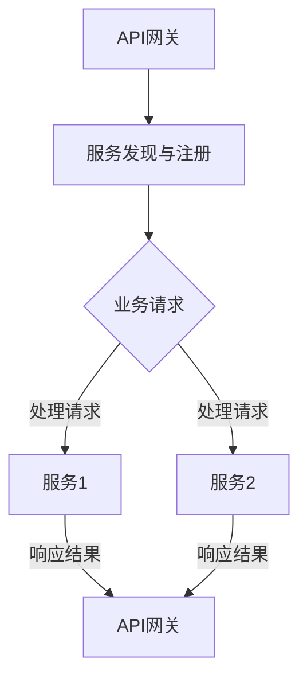

                 

### 文章标题

# 构建弹性可伸缩的微服务架构

## 关键词
- 微服务架构
- 弹性
- 可伸缩性
- 容错
- 性能优化
- 安全性

## 摘要
本文将深入探讨如何构建弹性可伸缩的微服务架构。我们将从微服务架构的基本概念出发，详细讲解微服务的核心概念与联系、设计实现、容错与可用性、性能优化、安全性和部署运维等方面的内容。通过具体的算法原理讲解、伪代码展示、数学模型和公式解析，以及项目实战案例的分析，帮助读者全面理解并掌握构建弹性可伸缩微服务架构的实践方法和最佳实践。

### 引言

在当前快速发展的数字化时代，软件系统面临着日益增长的需求变化和业务扩展压力。传统的单体架构已经难以满足这种动态变化的业务需求，而微服务架构作为一种新兴的软件架构风格，因其模块化、分布式和高度可扩展的特性，逐渐成为企业构建灵活、可伸缩、高可用性软件系统的重要选择。

微服务架构将大型单体应用拆分为一系列独立运行、相互通信的小型服务，每个服务负责完成特定的业务功能。这种架构风格不仅提高了系统的可维护性、可测试性和可扩展性，还使得系统能够更加灵活地应对业务变化。然而，随着服务数量的增多，如何确保微服务架构的弹性可伸缩性、容错性、性能和安全性，成为开发人员面临的重大挑战。

本文将围绕这些挑战展开讨论，通过详细的算法原理讲解、伪代码展示、数学模型和公式解析，以及具体的实战案例，帮助读者深入理解并掌握构建弹性可伸缩微服务架构的核心技术和最佳实践。

### 微服务架构概述

#### 核心概念与联系

微服务架构（Microservices Architecture）是一种基于服务拆分的软件架构风格，它强调将复杂的大型应用拆分为一系列小而独立的微服务。每个微服务负责实现一个具体的业务功能，并独立运行在自己的进程中。这些微服务通过定义良好的接口进行通信，通常使用轻量级的HTTP/HTTPS协议。

**服务拆分策略**：服务拆分是微服务架构的核心，其目的是将大型单体应用分解为多个小型、独立的组件。服务拆分策略可以分为功能拆分和领域拆分两种方式。功能拆分基于业务功能将应用划分为不同的服务，每个服务实现特定的业务逻辑。领域拆分则是基于业务领域将应用划分为不同的服务，每个服务负责一个业务领域的所有功能。

**API网关**：API网关是一个统一的服务入口，负责接收客户端请求，并将其路由到相应的微服务。API网关不仅提供了请求转发功能，还提供了安全认证、路由策略、负载均衡、流量控制等功能。

**服务发现与注册**：服务发现与注册是确保微服务之间能够动态发现和调用对方服务的关键机制。服务注册是指微服务启动时，将其元数据（如服务名称、IP地址、端口号等）注册到一个服务注册中心。服务发现是指客户端在调用服务时，能够从服务注册中心获取到服务实例的地址信息。

**服务编排与流控**：服务编排是指根据业务流程，将多个微服务按照一定的顺序和规则组合起来，形成一个完整的业务处理流程。流控则是在服务编排过程中，对服务调用进行限流、降级和熔断，以防止系统过载和崩溃。

#### Mermaid 流程图

为了更直观地展示微服务架构的核心概念与联系，我们可以使用Mermaid流程图来描述：



在这个流程图中，API网关作为统一的服务入口，接收客户端请求后，通过服务发现与注册机制找到相应的微服务实例，并将请求转发给服务1和服务2。服务1和服务2分别处理请求，然后将结果返回给API网关，最终由API网关返回给客户端。

#### 微服务架构的优势与挑战

**优势**

1. **高可维护性**：微服务架构将应用拆分为多个小型服务，每个服务可以独立开发、测试和部署，降低了系统的复杂度，提高了代码的可维护性。
2. **高可扩展性**：通过水平扩展（增加服务实例）和垂直扩展（增加硬件资源），微服务架构能够轻松应对业务增长，提高了系统的可扩展性。
3. **高可测试性**：微服务架构使得每个服务可以独立测试，降低了测试的复杂性，提高了测试覆盖率。
4. **高可复用性**：微服务架构鼓励功能模块的独立开发，提高了代码的复用性，减少了重复开发的工作量。
5. **灵活的业务迭代**：微服务架构支持快速迭代和快速发布，使得企业能够更快地响应市场变化。

**挑战**

1. **分布式复杂性**：微服务架构引入了分布式系统的复杂性，包括服务发现、服务调用、数据一致性和分布式事务等。
2. **服务间通信成本**：微服务架构中的服务间通信通常依赖于HTTP/HTTPS协议，通信成本相对较高，可能会影响系统的性能。
3. **系统一致性**：在分布式系统中，确保数据的一致性是一个挑战，特别是在涉及跨服务的数据操作时。
4. **安全性**：微服务架构的安全性需要重点关注，包括服务认证、授权、数据加密等方面。
5. **运维复杂性**：微服务架构的部署、监控和运维相对复杂，需要更加精细化的运维管理。

#### 微服务与传统单体架构的比较

**优点**

1. **模块化**：微服务架构将应用拆分为多个独立的模块，提高了代码的可维护性和可扩展性。
2. **高可用性**：微服务架构能够通过服务拆分和分布式部署，提高系统的容错能力和可用性。
3. **灵活性**：微服务架构支持快速迭代和业务定制，提高了系统的灵活性和响应速度。

**缺点**

1. **分布式复杂性**：微服务架构引入了分布式系统的复杂性，包括服务发现、服务调用、数据一致性和分布式事务等。
2. **服务间通信成本**：微服务架构中的服务间通信通常依赖于HTTP/HTTPS协议，通信成本相对较高，可能会影响系统的性能。
3. **运维复杂性**：微服务架构的部署、监控和运维相对复杂，需要更加精细化的运维管理。

### 微服务设计与实现

#### 核心算法原理讲解

**服务拆分策略**

在微服务架构中，服务拆分是一个关键环节。服务拆分策略可以分为基于功能的拆分和基于领域的拆分。

**基于功能的拆分**：

```plaintext
功能A: 用户注册
功能B: 用户登录
功能C: 订单处理
功能D: 订单查询
```

每个功能拆分为一个独立的微服务，每个微服务负责实现特定的业务功能。

**基于领域的拆分**：

```plaintext
领域A: 用户管理
领域B: 订单管理
领域C: 库存管理
领域D: 支付管理
```

每个领域拆分为一个独立的微服务，每个微服务负责一个业务领域的所有功能。

**服务间通信模式**

微服务间通信通常采用RESTful API或gRPC协议。RESTful API基于HTTP协议，使用JSON或XML作为数据交换格式，具有简单易用、平台无关性的优点。gRPC是基于HTTP/2协议的开源远程过程调用框架，提供了更高效的二进制协议和数据交换机制。

**数据一致性与分布式事务**

在分布式系统中，数据一致性和分布式事务是一个重要挑战。常见的解决方案包括最终一致性、事件溯源和分布式锁。

- **最终一致性**：系统保证在一定时间内最终达到一致状态，但允许短暂的延迟和冲突。
- **事件溯源**：通过记录事件流来恢复系统状态，避免了分布式事务的问题。
- **分布式锁**：通过分布式锁机制确保在分布式环境下对共享资源的互斥访问。

#### 伪代码示例

**用户注册微服务**

```python
# 用户注册服务的伪代码

def register_user(username, password, email):
    # 验证用户名、密码和邮箱格式
    if not validate_credentials(username, password, email):
        return "Invalid credentials"

    # 创建用户记录
    user_record = create_user_record(username, password, email)

    # 存储用户记录
    store_user_record(user_record)

    # 发送注册成功邮件
    send_confirmation_email(email)

    return "User registered successfully"
```

**订单处理微服务**

```python
# 订单处理服务的伪代码

def process_order(order):
    # 检查库存
    if not check_inventory(order):
        return "Insufficient inventory"

    # 更新库存
    update_inventory(order)

    # 创建订单记录
    order_record = create_order_record(order)

    # 存储订单记录
    store_order_record(order_record)

    return "Order processed successfully"
```

#### 数学模型和公式解析

在分布式系统中，一致性模型是一个重要的概念。常见的分布式一致性模型包括CAP定理、BASE理论等。

**CAP定理**：

CAP定理指出，在一个分布式系统中，一致性（Consistency）、可用性（Availability）和分区容错性（Partition tolerance）三者之间只能同时满足两个。具体公式如下：

$$
\text{CAP} = \text{一致性} + \text{可用性} + \text{分区容错性} \leq 2
$$

**BASE理论**：

BASE理论是针对CAP定理的一种补充，提出了在分布式系统中，一致性不能保证时，应该关注最终一致性（Eventually Consistency）、软状态（Soft State）和基本可用性（Basic Availability）。

**软状态**：

软状态是指系统允许临时的不一致状态，通过后续操作逐步达到一致性。

$$
\text{软状态} = \text{临时不一致状态} + \text{后续操作达到一致性}
$$

**基本可用性**：

基本可用性是指在不可用时间小于一定阈值的情况下，系统仍然能够正常提供服务。

$$
\text{基本可用性} = \text{不可用时间} < \text{阈值}
$$

#### 项目实战

**开发环境搭建**

1. 选择合适的编程语言和框架，例如Java和Spring Boot。
2. 配置开发工具，例如IntelliJ IDEA或Visual Studio Code。
3. 安装必要的依赖库和开发插件。

**源代码详细实现和代码解读**

1. 实现用户注册微服务，包括用户验证、用户记录创建和存储等功能。
2. 实现订单处理微服务，包括库存检查、库存更新、订单记录创建和存储等功能。
3. 使用API网关统一接收客户端请求，并将请求路由到相应的微服务。

**代码应用解读与分析**

1. 分析用户注册微服务的代码，了解用户验证、用户记录创建和存储等功能的实现原理。
2. 分析订单处理微服务的代码，了解库存检查、库存更新、订单记录创建和存储等功能的实现原理。

**实际案例分析和详细讲解剖析**

1. 选择一个实际项目案例，分析微服务架构的设计和实现过程。
2. 分析项目中遇到的问题和解决方案，详细讲解项目中的关键技术和最佳实践。

**项目小结**

1. 总结项目中的经验教训，提出改进建议。
2. 强调微服务架构在项目开发中的优势和挑战。

### 微服务容错与可用性

#### 核心算法原理讲解

**容错机制**

在分布式系统中，容错机制是确保系统稳定运行的关键。常见的容错机制包括重试机制、超时机制和断路器模式。

**重试机制**

重试机制是指当某个操作失败时，系统自动重新执行该操作，直到成功或达到最大重试次数。重试机制可以通过以下伪代码实现：

```python
def execute_with_retries(operation, retries=3, timeout=5):
    for _ in range(retries):
        try:
            operation()
            return "Operation succeeded"
        except Exception as e:
            wait(timeout)
    return "Operation failed after retries"
```

**超时机制**

超时机制是指设置操作的最大等待时间，如果操作在超时时间内未完成，则认为操作失败。超时机制可以通过以下伪代码实现：

```python
def execute_with_timeout(operation, timeout=5):
    start_time = current_time()
    while current_time() - start_time < timeout:
        try:
            operation()
            return "Operation succeeded"
        except TimeoutException:
            continue
    return "Operation failed due to timeout"
```

**断路器模式**

断路器模式是一种用于防止系统过载和崩溃的机制。当系统达到一定阈值时，断路器会打开，阻止后续请求进入系统，从而保护系统。断路器模式可以通过以下伪代码实现：

```python
class CircuitBreaker:
    def __init__(self, threshold, timeout):
        self.threshold = threshold
        self.timeout = timeout
        self.failures = 0
        self.last_failure_time = current_time()

    def execute_with_circuit_breaker(self, operation):
        if self.failures >= self.threshold and current_time() - self.last_failure_time < self.timeout:
            return "Circuit breaker opened"
        else:
            try:
                operation()
                self.failures = 0
                self.last_failure_time = current_time()
                return "Operation succeeded"
            except Exception as e:
                self.failures += 1
                self.last_failure_time = current_time()
                return "Operation failed"
```

#### 微服务恢复策略

**重试机制**

重试机制是微服务恢复策略中最简单的一种。当某个操作失败时，系统会自动重新执行该操作，直到成功或达到最大重试次数。

```plaintext
步骤 1：执行操作
步骤 2：检查操作结果
    - 如果成功，继续下一步
    - 如果失败，执行步骤 3
步骤 3：等待一段时间后，重新执行步骤 1
步骤 4：重复执行步骤 2 和 3，直到成功或达到最大重试次数
```

**主动健康检查**

主动健康检查是指系统定期检查自身状态，以确保所有服务实例都处于健康状态。如果发现某个服务实例不健康，系统会自动将其从服务注册中心移除，并通知其他服务实例。

```plaintext
步骤 1：定期执行健康检查
步骤 2：检查服务实例状态
    - 如果健康，继续下一步
    - 如果不健康，执行步骤 3
步骤 3：将不健康服务实例从服务注册中心移除
步骤 4：通知其他服务实例更新服务注册中心信息
```

**自愈能力**

自愈能力是指系统能够自动检测并修复自身故障，无需人工干预。自愈能力可以通过自动化脚本、机器学习和人工智能等技术实现。

```plaintext
步骤 1：自动检测故障
步骤 2：根据故障类型和严重程度，选择合适的修复策略
步骤 3：执行修复操作
步骤 4：验证修复结果
    - 如果成功，继续下一步
    - 如果失败，执行步骤 5
步骤 5：升级修复策略，并重新执行步骤 3
```

### 微服务性能优化

#### 核心算法原理讲解

**缓存策略**

缓存策略是提高系统性能的重要手段。通过缓存常用数据，可以减少对后端系统的访问，提高系统的响应速度。

**常见的缓存策略**：

1. **本地缓存**：在客户端或服务端内存中存储常用数据。
2. **分布式缓存**：使用Redis、Memcached等分布式缓存系统存储缓存数据。
3. **数据分片**：将缓存数据分片存储在多个缓存节点中，以减轻单个节点的压力。

**缓存算法**：

1. **最少使用（LRU）**：根据数据的使用频率，优先淘汰最长时间未被访问的数据。
2. **最不常用（LFU）**：根据数据的使用频率，优先淘汰最长时间未被访问的数据。

**缓存命中率**：

缓存命中率是指缓存命中次数与总访问次数的比值，用于衡量缓存策略的有效性。

$$
\text{缓存命中率} = \frac{\text{缓存命中次数}}{\text{总访问次数}} \times 100\%
$$

**数据库优化**

数据库优化是提高系统性能的关键。常见的数据库优化方法包括：

1. **索引优化**：通过创建合适的索引，提高数据的查询速度。
2. **查询优化**：优化SQL查询语句，减少查询的执行时间。
3. **分库分表**：将数据分片存储在多个数据库或表中，提高查询和写入的并发性能。

**数据库连接池**

数据库连接池是一种资源管理技术，通过预连接多个数据库连接，提高系统的响应速度。

**网络优化**

网络优化是提高系统性能的重要环节。常见的网络优化方法包括：

1. **负载均衡**：通过负载均衡器将请求分配到多个服务实例，提高系统的并发处理能力。
2. **网络加速**：通过CDN、缓存等技术，提高数据的传输速度。
3. **压缩传输**：通过数据压缩技术，减少数据传输的体积，提高传输速度。

### 微服务性能测试

#### 压力测试

压力测试是一种评估系统在高负载下的性能和稳定性的测试方法。通过模拟大量用户同时访问系统，可以评估系统的最大负载能力和响应时间。

**测试步骤**：

1. **设计测试场景**：确定测试的目标和指标，设计测试用例。
2. **搭建测试环境**：搭建测试环境，包括测试服务器、测试工具等。
3. **执行测试**：使用测试工具模拟大量用户访问，记录系统的响应时间、吞吐量等指标。
4. **分析结果**：分析测试结果，找出性能瓶颈和问题，提出改进建议。

#### 负载测试

负载测试是一种评估系统在特定负载下的性能和稳定性的测试方法。通过逐步增加负载，可以评估系统在不同负载水平下的响应时间、吞吐量和资源消耗。

**测试步骤**：

1. **设计测试场景**：确定测试的目标和指标，设计测试用例。
2. **搭建测试环境**：搭建测试环境，包括测试服务器、测试工具等。
3. **执行测试**：使用测试工具逐步增加负载，记录系统的响应时间、吞吐量等指标。
4. **分析结果**：分析测试结果，找出性能瓶颈和问题，提出改进建议。

#### 性能瓶颈分析

性能瓶颈分析是找出系统性能瓶颈的过程。通过分析系统的响应时间、吞吐量、资源消耗等指标，可以找出系统中的性能瓶颈。

**常见性能瓶颈**：

1. **CPU瓶颈**：CPU利用率过高，导致系统处理能力不足。
2. **内存瓶颈**：内存占用过高，导致系统无法分配足够的内存资源。
3. **磁盘瓶颈**：磁盘读写速度慢，导致系统响应时间延长。
4. **网络瓶颈**：网络带宽不足，导致数据传输速度慢。

**性能瓶颈分析工具**：

1. **性能分析工具**：如VisualVM、Grafana等，用于监控系统的性能指标。
2. **日志分析工具**：如ELK（Elasticsearch、Logstash、Kibana）等，用于分析系统日志。
3. **性能测试工具**：如JMeter、Gatling等，用于模拟用户访问，分析系统性能。

#### 性能调优

性能调优是提高系统性能的过程。通过优化代码、数据库、网络等各个方面的配置，可以提高系统的性能。

**性能调优方法**：

1. **代码优化**：优化算法、减少不必要的计算和I/O操作等。
2. **数据库优化**：优化索引、查询、分库分表等。
3. **网络优化**：优化网络配置、使用缓存、负载均衡等。
4. **系统调优**：调整系统参数、优化资源分配等。

### 微服务安全性

#### 核心算法原理讲解

**安全协议**

安全协议是确保数据传输安全的重要手段。常见的安全协议包括SSL/TLS、HTTPS等。

**SSL/TLS协议**

SSL/TLS协议是一种用于保护网络通信的安全协议。通过SSL/TLS协议，可以确保数据在传输过程中不被窃听、篡改或伪造。

**SSL/TLS工作原理**：

1. **握手阶段**：客户端和服务器通过交换证书和密钥，建立安全的加密通道。
2. **数据传输阶段**：数据在加密通道中传输，确保数据的安全性。

**HTTPS协议**

HTTPS协议是HTTP协议的安全版本，通过SSL/TLS协议加密HTTP请求和响应。

**HTTPS工作原理**：

1. **客户端发起请求**：客户端向服务器发送HTTP请求。
2. **服务器响应请求**：服务器通过SSL/TLS协议返回HTTP响应。

**身份验证与授权**

身份验证是确保只有授权用户可以访问系统的过程。常见的身份验证方法包括密码认证、双因素认证等。

**密码认证**

密码认证是最常见的身份验证方法，用户通过输入密码来证明自己的身份。

**双因素认证**

双因素认证（2FA）是一种加强身份验证的方法，用户需要同时提供密码和手机验证码才能登录系统。

**数据加密**

数据加密是确保数据在存储和传输过程中不被窃取或篡改的重要手段。常见的加密算法包括AES、RSA等。

**AES加密算法**

AES加密算法是一种对称加密算法，用于加密和解密数据。

**RSA加密算法**

RSA加密算法是一种非对称加密算法，用于加密和解密数据。

### 微服务部署与运维

#### 核心算法原理讲解

**持续集成与持续部署**

持续集成（CI）和持续部署（CD）是提高软件交付质量和效率的重要方法。

**持续集成**

持续集成是指将代码合并到主干分支之前，自动执行一系列测试和构建过程，确保代码质量。

**持续部署**

持续部署是指将代码部署到生产环境之前，自动执行一系列测试和部署过程，确保部署成功。

**CI/CD流程**

1. **代码提交**：开发人员将代码提交到版本控制系统。
2. **构建和测试**：构建工具（如Jenkins、GitLab CI等）自动执行构建和测试过程。
3. **部署**：将成功构建的代码部署到生产环境。

**自动化部署工具**

常见的自动化部署工具包括Jenkins、GitLab CI、Docker等。

**Jenkins**

Jenkins是一种开源的自动化部署工具，支持多种构建和部署流程。

**GitLab CI**

GitLab CI是GitLab自带的一种持续集成和持续部署工具。

**Docker**

Docker是一种开源的应用容器引擎，用于自动化部署和管理应用。

#### 微服务运维实践

**日志管理**

日志管理是确保系统稳定运行的重要环节。

**常见日志管理工具**：

1. **ELK**：Elasticsearch、Logstash、Kibana是一种常见的日志管理工具，用于收集、存储、分析和可视化日志数据。
2. **Fluentd**：Fluentd是一种开源的数据收集和转发工具，支持多种数据源和目的地。

**监控与告警**

监控与告警是确保系统正常运行的重要手段。

**常见监控工具**：

1. **Prometheus**：Prometheus是一种开源的监控和告警工具，用于收集和存储监控数据。
2. **Grafana**：Grafana是一种开源的数据可视化工具，用于可视化监控数据。

**自动化运维**

自动化运维是提高运维效率和降低运维成本的重要方法。

**常见自动化运维工具**：

1. **Ansible**：Ansible是一种开源的自动化运维工具，用于配置管理、部署和监控等。
2. **Puppet**：Puppet是一种开源的自动化运维工具，用于配置管理和部署等。

### 微服务案例研究

**项目背景**

某电子商务公司需要构建一个高性能、高可用性的购物平台，支持海量的用户访问和商品交易。为了实现这一目标，公司决定采用微服务架构来构建系统。

**项目需求**

1. **用户管理**：提供用户注册、登录、个人信息管理等功能。
2. **商品管理**：提供商品分类、商品信息展示、商品搜索等功能。
3. **订单管理**：提供订单创建、订单查询、订单支付等功能。
4. **库存管理**：提供库存查询、库存更新等功能。
5. **支付管理**：提供支付渠道接入、支付处理等功能。

**架构设计**

1. **用户管理服务**：负责处理用户相关的业务逻辑，包括用户注册、登录、个人信息管理等。
2. **商品管理服务**：负责处理商品相关的业务逻辑，包括商品分类、商品信息展示、商品搜索等。
3. **订单管理服务**：负责处理订单相关的业务逻辑，包括订单创建、订单查询、订单支付等。
4. **库存管理服务**：负责处理库存相关的业务逻辑，包括库存查询、库存更新等。
5. **支付管理服务**：负责处理支付相关的业务逻辑，包括支付渠道接入、支付处理等。
6. **API网关**：作为统一的服务入口，负责接收客户端请求，并将请求路由到相应的微服务。
7. **服务注册与发现**：使用Eureka作为服务注册中心，实现服务注册和发现。
8. **消息队列**：使用RabbitMQ作为消息队列，实现异步处理和分布式通信。

**实现过程**

1. **服务拆分**：根据业务需求，将系统拆分为用户管理服务、商品管理服务、订单管理服务、库存管理服务和支付管理服务。
2. **服务实现**：使用Spring Boot和Docker技术实现各个微服务的开发和部署。
3. **服务调用**：使用RestTemplate和RabbitMQ进行服务调用和异步通信。
4. **服务监控与告警**：使用Prometheus和Grafana进行服务监控和告警。

**项目小结**

通过微服务架构的实施，该公司成功地构建了一个高性能、高可用性的购物平台。项目实现了以下成果：

1. **模块化开发**：通过服务拆分和独立开发，提高了代码的可维护性和可复用性。
2. **分布式部署**：通过容器化部署和分布式通信，提高了系统的扩展性和容错性。
3. **自动化运维**：通过自动化部署和监控，提高了运维效率和系统稳定性。
4. **性能优化**：通过缓存策略、数据库优化和网络优化，提高了系统性能。
5. **安全性保障**：通过安全协议、身份验证和数据加密，提高了系统的安全性。

### 结论

本文详细探讨了构建弹性可伸缩的微服务架构的核心技术和最佳实践。通过对微服务架构概述、设计与实现、容错与可用性、性能优化、安全性和部署运维等方面的深入讲解，以及具体的项目实战案例分析，帮助读者全面理解并掌握构建弹性可伸缩微服务架构的实践方法和技巧。

构建弹性可伸缩的微服务架构是一个复杂的过程，需要综合考虑多个方面的因素。在实际项目中，开发团队需要不断探索和优化，以实现系统的最佳性能和稳定性。

在未来的发展中，随着技术的不断进步，微服务架构将继续演进和优化，为开发者带来更多的便利和优势。我们期待看到更多的企业采用微服务架构，构建出更加灵活、高效和可靠的软件系统。

### 附录

#### 拓展阅读

1. **《微服务设计》**：由Martin Fowler和Mike Brown合著，详细介绍了微服务架构的设计原则和实践方法。
2. **《Docker实战》**：由Jason Education和Norman Dolphin合著，介绍了Docker容器化技术的原理和实践。
3. **《微服务与云原生应用架构》**：由李艳鹏著，深入探讨了微服务与云原生应用架构的设计与实现。

#### 参考资料

1. **《大规模分布式存储系统：设计原理与架构实践》**：由张庆文著，详细介绍了分布式存储系统的设计原理和架构实践。
2. **《大数据技术原理与应用》**：由吴华、刘挺、黄宇著，全面介绍了大数据技术的基本原理和应用实践。
3. **《负载均衡与性能优化》**：由张春华、李栋著，介绍了负载均衡和性能优化技术的原理和实践。

### 作者信息

作者：AI天才研究院/AI Genius Institute & 禅与计算机程序设计艺术 /Zen And The Art of Computer Programming

AI天才研究院（AI Genius Institute）专注于人工智能领域的研究和开发，致力于推动人工智能技术的创新和应用。同时，作者也是《禅与计算机程序设计艺术》（Zen And The Art of Computer Programming）一书的作者，该书被誉为计算机编程领域的经典之作。

