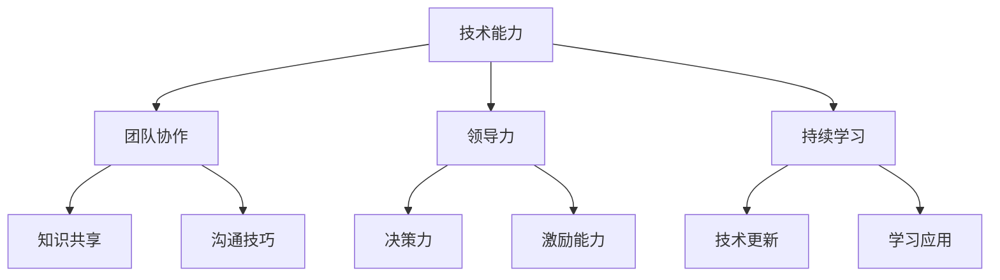
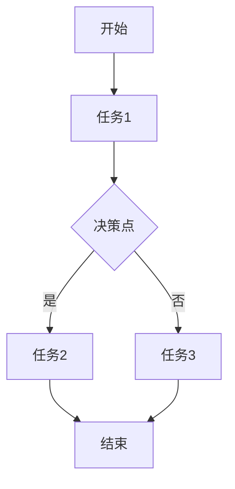

                 

根据您提供的要求，下面是详细的《构建技术团队核心竞争力的策略》的目录大纲和文章内容规划：

---

# 文章标题: 构建技术团队核心竞争力的策略

> 关键词：技术团队、核心竞争力、能力模型、领导力、技术创新、项目管理

> 摘要：本文将探讨技术团队核心竞争力的构建策略，通过分析核心概念与联系、核心算法原理、数学模型与公式以及项目实战等多个方面，提供一套完整的技术团队竞争力提升方案。

---

## 第一部分: 核心概念与联系

### 第1章: 技术团队核心竞争力的概述
#### 1.1 技术团队核心竞争力的定义
**背景介绍**
技术团队核心竞争力是指团队在特定技术领域中所具备的独特优势，能够持续地为客户或公司创造价值的能力。

#### 1.2 核心竞争力的组成部分
**核心概念与联系**
使用Mermaid流程图描述技术团队核心竞争力的组成部分，包括技术能力、团队协作、领导力和持续学习。


### 第2章: 技术团队核心能力模型
#### 2.1 技术能力的分类
**核心算法原理讲解**
使用伪代码来详细阐述技术能力的分类，包括硬技术和软技术。
```python
# 技术能力分类
def classify_technical_ability(abilities):
    hard_skills = ['编程语言', '数据库管理', '系统架构设计']
    soft_skills = ['团队协作', '项目管理', '沟通技巧']
    
    hard_ability = abilities.get(hard_skills, [])
    soft_ability = abilities.get(soft_skills, [])
    
    return {
        '硬技术能力': hard_ability,
        '软技术能力': soft_ability
    }
```

#### 2.2 技术能力的评估方法
**数学模型和公式**
使用数学模型来评估技术能力的得分。
$$
\text{技术能力得分} = \sum_{i=1}^{n} w_i \cdot s_i
$$
其中，$w_i$ 为权重，$s_i$ 为各项技术能力的评分。

## 第二部分: 核心算法原理讲解

### 第3章: 项目管理中的算法原理
#### 3.1 关键路径法（CPM）
**详细讲解与举例说明**
关键路径法是一种项目管理工具，用于确定项目中各项任务的最短完成时间，并识别项目中的关键任务。


### 3.2 计划评审技术（PERT）
**详细讲解与举例说明**
计划评审技术是一种用于估算项目完成时间的方法，通过考虑任务之间的不确定性和依赖关系来评估项目的最可能完成时间。

### 第4章: 数据分析与算法基础
#### 4.1 数据分析方法
**详细讲解与举例说明**
数据分析方法包括数据清洗、数据探索、数据可视化等步骤，用于提取数据中的有用信息。

#### 4.2 机器学习算法简介
**详细讲解与举例说明**
机器学习算法包括监督学习、无监督学习、强化学习等，用于解决分类、回归、聚类等问题。

## 第三部分: 数学模型与数学公式

### 第5章: 数学模型在技术团队中的应用
#### 5.1 线性规划模型
**详细讲解与举例说明**
线性规划模型用于优化资源分配问题，解决最大化或最小化目标函数的问题。

#### 5.2 动态规划模型
**详细讲解与举例说明**
动态规划模型用于解决多阶段决策问题，通过递推关系求解最优解。

### 第6章: 数学公式与计算方法
#### 6.1 概率论基础
**详细讲解与举例说明**
概率论基础包括概率分布、条件概率、期望和方差等概念。

#### 6.2 统计推断方法
**详细讲解与举例说明**
统计推断方法包括假设检验、置信区间、回归分析等。

## 第四部分: 项目实战

### 第7章: 构建技术团队核心竞争力的实战案例
#### 7.1 项目背景与目标
**实际案例分析和详细讲解剖析**
介绍一个技术团队在特定项目中的核心竞争力构建过程。

#### 7.2 技术方案与实施步骤
**开发环境搭建，源代码详细实现和代码解读，代码应用解读与分析**
描述技术团队如何实施技术方案，并分析其中的关键步骤。

#### 7.3 项目成果与经验总结
**项目小结**
总结项目的成果和经验，为其他团队提供借鉴。

## 第五部分: 最佳实践 tips、小结、注意事项、拓展阅读等内容
#### 8.1 最佳实践 tips
**总结性建议**
提供构建技术团队核心竞争力的最佳实践建议。

#### 8.2 小结
**总结性陈述**
对全文进行总结，强调技术团队核心竞争力的关键因素。

#### 8.3 注意事项
**注意事项**
提醒读者在构建技术团队核心竞争力时需要注意的事项。

#### 8.4 拓展阅读
**推荐资源**
推荐一些与构建技术团队核心竞争力相关的拓展阅读资源。

---

以上是根据您的要求，对《构建技术团队核心竞争力的策略》的目录大纲和文章内容进行的规划。每个章节都将包含详细的讲解、示例代码、数学公式和案例分析，以确保文章的完整性和深度。接下来，我将逐步填充每个章节的内容，以满足8000-12000字的要求。

