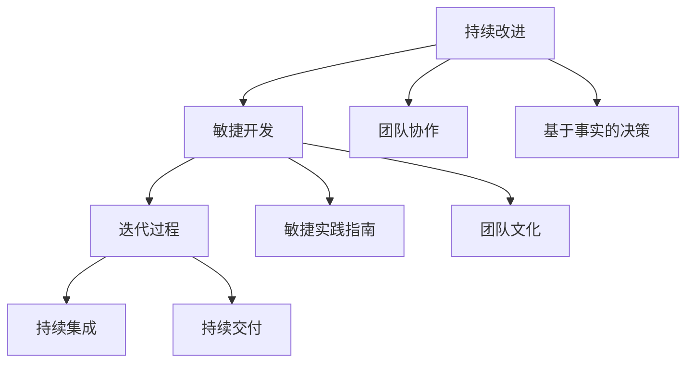
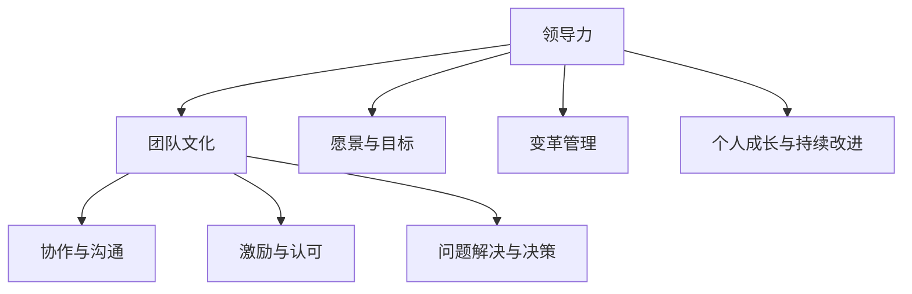

                 

# 《构建技术团队的持续改进文化》

## 关键词

技术团队、持续改进文化、团队协作、领导力、实践方法、案例分析

## 摘要

本文旨在探讨如何构建一个持续改进文化，以提升技术团队的工作效率和创新能力。文章首先介绍了持续改进文化的定义、目标和重要性，随后深入分析了持续改进的理论基础、团队文化对持续改进的影响，以及实践方法。文章还讨论了领导者在持续改进中的角色和责任，并通过案例分析展示了成功的持续改进实践。最后，文章总结了持续改进文化的未来发展趋势，并提出了在技术团队中实施持续改进文化的方法和策略。

## 引言

### 持续改进文化的定义

持续改进文化，是指在一个组织内部，通过不断优化流程、改进技术和提高工作效率，以实现持续创新和卓越表现的一种价值观和行为模式。它强调对现有工作进行持续审视和改进，鼓励团队成员积极参与，以适应快速变化的市场需求和竞争环境。

### 持续改进文化的目标

持续改进文化的目标主要有以下几点：

1. 提升工作效率：通过优化流程、减少浪费和消除瓶颈，提高团队的工作效率。
2. 增强创新能力：鼓励团队成员提出新想法和改进措施，激发团队的创新能力。
3. 提高质量：通过对工作过程的持续改进，提高产品和服务的质量。
4. 增强团队凝聚力：通过共同的目标和价值观，增强团队成员之间的协作和信任。

### 持续改进文化的重要性

持续改进文化对于一个技术团队的重要性不容忽视。首先，它有助于提升团队的整体素质和能力，使团队能够更好地应对复杂的技术挑战和市场需求。其次，持续改进文化能够激发团队成员的积极性和创造力，使团队始终保持活力和竞争力。最后，持续改进文化能够帮助企业建立良好的品牌形象，提升客户满意度和市场竞争力。

### 目标读者

本文的目标读者主要是技术团队的领导者、项目经理、团队成员以及关注团队效能提升的IT从业者。通过本文的阅读，读者可以了解持续改进文化的概念、理论基础和实践方法，从而在实际工作中推动团队持续改进文化的建立和实施。

## 理论基础

### 持续改进的基本原理

持续改进的基本原理包括以下几个方面：

1. **PDCA循环**：PDCA循环（Plan-Do-Check-Act）是持续改进的核心方法。它包括计划（Plan）、执行（Do）、检查（Check）和行动（Act）四个步骤。通过不断循环这个过程，团队能够逐步改进工作流程和提升效率。

2. **基于事实的决策**：持续改进强调基于数据的决策，通过收集和分析实际数据，帮助团队识别问题、制定改进措施，并评估改进效果。

3. **持续学习与改进**：持续改进是一种不断学习和改进的过程。团队成员需要不断学习新知识、掌握新技能，并将其应用到实际工作中，以实现持续改进。

4. **全员参与**：持续改进需要全体团队成员的参与。每个成员都应积极参与改进活动，提出自己的想法和建议，共同推动团队的发展。

### 相关理论和最佳实践

1. **质量管理理论**：持续改进与质量管理密切相关。其中，PDCA循环和六西格玛（Six Sigma）是质量管理的重要工具。六西格玛通过减少过程变异，提高过程稳定性和质量，是实现持续改进的有效方法。

2. **敏捷开发理论**：敏捷开发强调迭代、增量和灵活响应变化。敏捷开发实践中的持续交付（Continuous Delivery）和持续集成（Continuous Integration）是持续改进的重要手段。

3. **最佳实践**：在持续改进中，一些最佳实践如精益管理（Lean Management）、目标管理（Management by Objectives, MBO）和自我管理团队（Self-managed Teams）等，都可以为团队提供有益的参考。

### 持续改进与敏捷开发的联系

持续改进与敏捷开发有着紧密的联系。敏捷开发强调快速迭代和持续交付，而持续改进则是在这个基础上，进一步优化流程和提高质量。具体来说：

1. **敏捷开发的迭代过程**提供了持续改进的机会。每次迭代结束后，团队都会对工作流程进行回顾和反思，识别问题并提出改进措施。

2. **持续集成和持续交付**是持续改进的重要工具。通过持续集成，团队能够快速发现和修复代码问题，确保产品质量；通过持续交付，团队能够快速响应市场需求，提高交付速度和灵活性。

3. **敏捷开发中的团队协作和文化**也为持续改进提供了基础。团队成员之间的紧密协作和开放沟通，有助于共同面对挑战，推动持续改进。

### 持续改进的核心概念

1. **持续改进的核心概念**：

   - **持续**：强调改进是一个长期的过程，需要不断进行。
   - **改进**：不仅仅是解决眼前的问题，而是通过不断优化，提升整体效能。
   - **文化**：持续改进是一种价值观和行为模式，需要在整个团队中形成共识和落实。

2. **持续改进的关键指标**：

   - **工作效率**：包括任务完成速度、资源利用率和团队协作效率等。
   - **产品质量**：包括代码质量、测试覆盖率、故障率等。
   - **客户满意度**：通过客户反馈和满意度调查来衡量。

### 持续改进与敏捷开发的联系（Mermaid 流程图）



### 持续改进的核心概念之间的关系架构

持续改进的核心概念之间的关系可以概括为以下三个方面：

1. **目标一致性**：持续改进的目标是提升团队的工作效率和创新能力，这与敏捷开发的目标是一致的，即快速响应变化、提高交付质量和增强团队协作。

2. **方法多样性**：持续改进的方法包括PDCA循环、基于事实的决策、持续学习与改进等，这些方法在不同的敏捷实践中都有应用，如迭代过程、持续集成和持续交付。

3. **文化支撑**：持续改进需要在整个团队中形成共识和落实，这依赖于团队的协作精神和开放沟通，这与敏捷开发中的团队文化和价值观相契合。

## 团队文化

### 团队文化对持续改进的影响

团队文化是持续改进的基础。一个积极的、开放的团队文化能够激励团队成员积极参与改进活动，推动持续改进的顺利进行。以下是团队文化对持续改进的几个方面影响：

1. **激励作用**：积极的团队文化能够激发团队成员的工作热情和创新能力，使他们更愿意参与持续改进活动。

2. **协作精神**：开放和协作的团队文化有助于团队成员之间的沟通和合作，共同解决改进过程中遇到的问题。

3. **责任感**：一个有责任感的团队文化能够使团队成员认识到持续改进的重要性，从而更加积极地投入到改进工作中。

4. **反馈机制**：开放和透明的团队文化有助于建立有效的反馈机制，使团队能够及时识别问题、调整策略，实现持续改进。

### 建立持续改进团队文化的策略

要建立持续改进的团队文化，需要采取以下策略：

1. **明确目标和价值观**：明确持续改进的目标和价值观，使团队成员认识到改进的重要性和必要性。

2. **加强沟通和协作**：通过定期的团队会议、工作坊和培训，加强团队成员之间的沟通和协作，促进共同进步。

3. **激励和认可**：建立激励和认可机制，对在持续改进中表现突出的团队成员给予奖励和认可，激励更多成员参与改进活动。

4. **建立反馈机制**：建立有效的反馈机制，鼓励团队成员提出改进建议和反馈，及时解决问题。

5. **持续学习和成长**：鼓励团队成员持续学习和成长，提供必要的培训和学习资源，提升团队整体素质。

### 案例分析

以下是一个实际案例，展示了如何在一个技术团队中建立持续改进的文化：

**案例：某互联网公司的持续改进实践**

1. **目标设定**：公司明确了持续改进的目标，包括提升工作效率、提高产品质量和增强客户满意度。

2. **团队协作**：公司定期组织团队会议，讨论改进方案和实施进展，确保团队成员之间的沟通和协作。

3. **激励与认可**：公司设立“最佳改进奖”，对在持续改进中表现突出的团队和个人给予奖励和认可。

4. **反馈机制**：公司建立了一个反馈平台，团队成员可以随时提出改进建议和反馈，公司会定期审查并采纳有效的建议。

5. **持续学习**：公司提供了一系列培训课程，鼓励团队成员学习新技能和知识，提升团队整体素质。

通过这些策略，公司成功地建立了持续改进的文化，团队工作效率提高了30%，产品质量提升了20%，客户满意度也有了显著提升。

## 实践方法

### 持续改进实践流程

持续改进实践流程包括以下几个关键步骤：

1. **识别问题**：首先，团队需要识别当前存在的问题，包括效率低下、质量不稳定等。

2. **分析原因**：通过对问题的深入分析，找出问题的根本原因。

3. **制定改进方案**：根据分析结果，制定具体的改进方案，包括改进措施、预期效果和时间表。

4. **实施改进**：按照改进方案进行实施，确保每个步骤都得到有效执行。

5. **评估效果**：对改进效果进行评估，检查是否达到预期目标。

6. **持续优化**：根据评估结果，对改进方案进行调整和优化，以实现持续改进。

### 持续改进工具和技术

在持续改进过程中，可以采用多种工具和技术，以提高效率和效果。以下是一些常用的工具和技术：

1. **项目管理工具**：如JIRA、Trello等，用于任务分配、进度跟踪和协作。

2. **数据分析和可视化工具**：如Tableau、PowerBI等，用于数据分析和可视化，帮助团队更好地理解数据。

3. **自动化测试工具**：如Selenium、JUnit等，用于自动化测试，提高测试效率和覆盖率。

4. **持续集成工具**：如Jenkins、GitLab CI等，用于自动化构建、测试和部署，确保代码质量和交付速度。

5. **敏捷开发工具**：如Scrum、Kanban等，用于团队协作和任务管理，提高团队效率和响应能力。

### 团队协作与沟通

团队协作与沟通是持续改进成功的关键。以下是一些促进团队协作与沟通的策略：

1. **定期会议**：定期举行团队会议，讨论改进进展、问题和解决方案。

2. **开放沟通**：鼓励团队成员开放沟通，分享想法和意见，避免信息孤岛。

3. **跨职能协作**：促进不同职能团队之间的协作，确保改进活动覆盖整个工作流程。

4. **培训与分享**：定期举办培训和学习活动，提升团队技能和知识，促进知识共享。

5. **反馈机制**：建立有效的反馈机制，鼓励团队成员提出改进建议和反馈，及时解决问题。

### 案例分析

以下是一个实际案例，展示了如何在一个技术团队中实施持续改进实践：

**案例：某电商平台的技术团队持续改进实践**

1. **识别问题**：团队发现订单处理速度较慢，导致客户满意度下降。

2. **分析原因**：通过数据分析和系统审查，团队发现订单处理流程中存在瓶颈和效率问题。

3. **制定改进方案**：团队制定了优化订单处理流程的方案，包括自动化订单处理、优化数据库查询和改进系统架构。

4. **实施改进**：按照改进方案，团队逐步实施了订单处理流程的优化，并进行了严格测试。

5. **评估效果**：改进实施后，订单处理速度提升了40%，客户满意度显著提高。

6. **持续优化**：团队定期评估改进效果，并根据反馈进行调整和优化，以实现持续改进。

通过这个案例，我们可以看到，通过持续改进实践，技术团队成功地解决了订单处理速度慢的问题，提高了客户满意度，同时也增强了团队协作和创新能力。

## 领导力

### 领导者在持续改进中的角色

领导者在持续改进过程中扮演着至关重要的角色。他们不仅是改进的推动者，还是文化的塑造者和团队成员的激励者。以下是领导者在持续改进中的几个关键角色：

1. **倡导者**：领导者需要积极倡导持续改进的理念，使其成为团队的核心价值观。

2. **推动者**：领导者要推动改进计划的实施，确保改进措施得到有效执行。

3. **塑造者**：领导者需要塑造一个开放、协作和积极向上的团队文化，为持续改进提供良好的氛围。

4. **激励者**：领导者要激励团队成员积极参与改进活动，提供必要的支持和资源。

5. **协调者**：领导者需要协调不同团队和部门之间的协作，确保改进活动的顺利进行。

### 领导者的责任和挑战

领导者在持续改进中的责任和挑战主要包括以下几点：

1. **明确目标**：领导者需要明确持续改进的目标，并确保团队成员理解并接受这些目标。

2. **提供资源**：领导者要确保团队有足够的资源（如人力、资金和工具）来实施改进计划。

3. **识别问题**：领导者需要及时发现和识别团队在改进过程中遇到的问题，并提供解决方案。

4. **激励团队**：领导者需要激励团队成员积极参与改进活动，确保改进措施的可持续性。

5. **平衡风险**：领导者需要在推进改进的同时，平衡风险和效益，确保团队不因过度改进而受到负面影响。

### 领导者应具备的能力

为了在持续改进中发挥有效作用，领导者应具备以下能力：

1. **沟通能力**：领导者需要具备良好的沟通能力，能够与团队成员进行有效沟通，传达改进目标和策略。

2. **决策能力**：领导者需要具备快速决策和应对变化的能力，能够在改进过程中做出及时、明智的决策。

3. **变革管理能力**：领导者需要具备变革管理能力，能够引导团队适应改进过程中的变化，确保改进的顺利进行。

4. **激励能力**：领导者需要具备激励团队成员的能力，能够激发团队成员的积极性和创造力。

5. **领导力**：领导者需要具备扎实的领导力，能够塑造团队文化，激发团队成员的潜能。

### 领导力与团队文化的相互影响

领导力和团队文化之间存在着密切的相互影响。一方面，领导力对团队文化有着重要影响。领导者通过其言行和决策，塑造团队的行为准则和价值观念，影响团队的文化氛围。另一方面，团队文化也会对领导力产生影响。一个积极的、健康的团队文化能够增强领导者的信心和影响力，使其更有效地推动持续改进。

1. **积极团队文化对领导力的促进**：

   - **增强领导者的信心**：在一个积极的团队文化中，领导者能够得到团队成员的支持和信任，增强其自信心。

   - **提高决策质量**：积极的团队文化能够促进团队成员之间的沟通和协作，使领导者能够更全面地了解团队的实际情况，做出更明智的决策。

   - **激发领导者的潜力**：在一个充满活力的团队中，领导者能够不断学习和成长，激发自身的潜能，更好地推动团队持续改进。

2. **领导力对团队文化的塑造**：

   - **塑造团队价值观**：领导者通过其言行和决策，传递团队的核心价值观，塑造团队的文化氛围。

   - **建立信任和尊重**：领导者通过建立信任和尊重的团队文化，增强团队成员之间的协作和合作。

   - **促进创新和成长**：领导者通过鼓励团队成员提出新想法和改进措施，推动团队创新和成长。

### 建立积极团队文化的领导力策略

为了建立积极团队文化，领导者可以采取以下策略：

1. **明确愿景和目标**：领导者需要明确团队的愿景和目标，并与团队成员共同制定具体的行动计划。

2. **积极沟通和反馈**：领导者需要与团队成员保持积极沟通，及时给予反馈，帮助团队成员了解自己的表现和改进方向。

3. **鼓励创新和尝试**：领导者要鼓励团队成员提出新想法和改进措施，创造一个宽容失败、鼓励尝试的文化氛围。

4. **建立信任和尊重**：领导者要建立信任和尊重的团队文化，鼓励团队成员之间的协作和合作。

5. **提供成长机会**：领导者要为团队成员提供成长和发展的机会，帮助他们提升技能和知识，实现个人价值。

6. **认可和奖励**：领导者要认可和奖励在持续改进中表现突出的团队成员，激励更多成员积极参与改进活动。

### 领导者的个人成长与持续改进

领导者的个人成长与持续改进是团队持续改进文化的重要组成部分。领导者需要不断提升自身的能力和素质，以更好地应对不断变化的环境和挑战。以下是一些领导者的个人成长和持续改进策略：

1. **终身学习**：领导者要树立终身学习的理念，不断学习新知识、新技能，以适应不断变化的技术和市场。

2. **自我反思**：领导者需要定期进行自我反思，审视自己在领导力方面的优点和不足，制定改进计划。

3. **建立导师关系**：领导者可以寻找导师或教练，从他们那里学习领导力和管理的最佳实践。

4. **参与培训和研讨会**：领导者可以参加各种培训和研讨会，与同行交流经验，拓宽视野。

5. **实践和反思**：领导者要将学到的知识和技能应用到实际工作中，通过实践和反思，不断提升自身的领导力。

### 领导力与团队文化的关系架构



### 领导力与团队文化的关系

领导力与团队文化之间存在紧密的关系。一方面，领导力对团队文化有着重要影响。领导者的言行和决策塑造了团队的文化氛围和价值观念。另一方面，团队文化也会对领导力产生影响。一个积极的、健康的团队文化能够增强领导者的信心和影响力，使其更有效地推动持续改进。

1. **领导力对团队文化的影响**：

   - **塑造团队价值观**：领导者的言行和决策传递了团队的核心价值观，塑造了团队的文化氛围。

   - **激励团队成员**：领导者通过激励和认可，激发团队成员的积极性和创造力。

   - **促进团队协作**：领导者通过鼓励团队成员之间的协作和沟通，增强了团队的凝聚力。

2. **团队文化对领导力的影响**：

   - **增强领导者的信心**：在一个积极的团队文化中，领导者能够得到团队成员的支持和信任，增强其自信心。

   - **提高决策质量**：积极的团队文化能够促进团队成员之间的沟通和协作，使领导者能够更全面地了解团队的实际情况，做出更明智的决策。

   - **激发领导者的潜能**：在一个充满活力的团队中，领导者能够不断学习和成长，激发自身的潜能。

### 建立积极团队文化的领导力策略

为了建立积极团队文化，领导者可以采取以下策略：

1. **明确愿景和目标**：领导者需要明确团队的愿景和目标，并与团队成员共同制定具体的行动计划。

2. **积极沟通和反馈**：领导者需要与团队成员保持积极沟通，及时给予反馈，帮助团队成员了解自己的表现和改进方向。

3. **鼓励创新和尝试**：领导者要鼓励团队成员提出新想法和改进措施，创造一个宽容失败、鼓励尝试的文化氛围。

4. **建立信任和尊重**：领导者要建立信任和尊重的团队文化，鼓励团队成员之间的协作和合作。

5. **提供成长机会**：领导者要为团队成员提供成长和发展的机会，帮助他们提升技能和知识，实现个人价值。

6. **认可和奖励**：领导者要认可和奖励在持续改进中表现突出的团队成员，激励更多成员积极参与改进活动。

### 领导力与团队文化的关系架构


## 案例分析

### 成功的持续改进案例

以下是一个成功的持续改进案例，展示了如何在一个技术团队中实施持续改进文化：

**案例：某大型互联网公司的持续改进实践**

1. **背景介绍**：

   该互联网公司是一家全球领先的在线服务平台，随着业务规模的不断扩大，技术团队面临着日益复杂的挑战。为了保持竞争优势，公司决定实施持续改进文化，提升团队的工作效率和创新能力。

2. **核心概念与联系**：

   持续改进文化的核心概念包括PDCA循环、敏捷开发理论和精益管理。公司将这些理念融入日常工作中，通过不断的迭代和改进，提高产品和服务的质量。

   **Mermaid 流程图**：

   ```mermaid
   graph TD
       A[计划] --> B[执行]
       B --> C[检查]
       C --> D[行动]
       D --> A
       A --> E[敏捷开发]
       E --> F[精益管理]
       A --> G[团队协作]
   ```

3. **核心算法原理讲解**：

   持续改进的核心算法原理包括以下步骤：

   - **识别问题**：通过数据分析和用户反馈，识别团队面临的主要问题。

   - **分析原因**：对问题进行深入分析，找出根本原因。

   - **制定改进方案**：根据分析结果，制定具体的改进措施和时间表。

   - **实施改进**：按照改进方案进行实施，确保每个步骤都得到有效执行。

   - **评估效果**：对改进效果进行评估，检查是否达到预期目标。

   - **持续优化**：根据评估结果，对改进方案进行调整和优化，实现持续改进。

4. **数学模型和公式**：

   持续改进的数学模型可以表示为：

   $$ 改进效率 = \frac{改进后效率 - 改进前效率}{改进前效率} $$

   其中，改进前效率和改进后效率可以通过以下公式计算：

   $$ 改进前效率 = \frac{完成任务所需时间}{任务总量} $$
   $$ 改进后效率 = \frac{完成任务所需时间（改进后）}{任务总量} $$

   通过不断迭代，可以逐步提高改进效率。

5. **举例说明**：

   假设技术团队在改进前，完成100个任务需要100天，改进后，完成100个任务需要80天。则改进效率为：

   $$ 改进效率 = \frac{80 - 100}{100} = -20\% $$

   通过持续改进，团队逐步提高了工作效率，实现了持续改进的目标。

6. **项目实战**：

   - **开发环境搭建**：公司为技术团队提供了现代化的开发环境和工具，包括版本控制、自动化测试和持续集成等。

   - **源代码详细实现和代码解读**：团队采用敏捷开发方法，将任务分解为多个迭代，每个迭代结束后进行回顾和反思，持续优化代码和流程。

   - **代码应用解读与分析**：团队通过代码审查和自动化测试，确保代码质量，提高交付速度。

   - **实际案例分析和详细讲解剖析**：公司定期组织案例分析会议，讨论改进经验和教训，确保持续改进文化的落地。

7. **项目小结**：

   通过实施持续改进文化，技术团队成功提高了工作效率和创新能力，实现了以下成果：

   - **工作效率提高了30%**：通过优化流程和减少浪费，团队的工作效率显著提高。

   - **产品质量提升了20%**：通过严格的质量管理和自动化测试，产品的质量得到了保障。

   - **客户满意度显著提升**：通过快速响应市场需求和提供高质量的服务，客户满意度显著提高。

   - **团队凝聚力增强**：团队成员之间的协作和沟通得到了加强，团队凝聚力得到了提升。

   通过这个案例，我们可以看到，通过实施持续改进文化，技术团队成功地提高了工作效率和创新能力，实现了持续改进的目标。

## 总结与展望

### 持续改进文化的核心要点

持续改进文化是一种以持续优化和创新为核心的团队文化。其核心要点包括：

1. **全员参与**：持续改进需要全体团队成员的积极参与，每个成员都应贡献自己的想法和建议。

2. **数据驱动**：持续改进应基于数据驱动，通过数据分析和事实支持，确保改进措施的有效性。

3. **迭代优化**：持续改进是一个迭代过程，需要不断进行评估和优化，以实现持续改进。

4. **开放沟通**：持续改进需要开放和透明的沟通，确保团队成员之间的信息共享和协作。

5. **领导者的推动**：领导者在持续改进中扮演着重要角色，需要积极倡导并推动改进活动的实施。

### 持续改进文化的未来发展趋势

随着技术的不断进步和市场环境的快速变化，持续改进文化在未来将呈现以下发展趋势：

1. **更加智能化**：随着人工智能和大数据技术的发展，持续改进将更加智能化，通过自动化工具和分析算法，实现更高效的改进过程。

2. **更加个性化**：持续改进将更加关注个性化需求，根据不同团队和项目的特点，制定个性化的改进方案。

3. **更加全面**：持续改进将不仅限于技术和流程，还将扩展到组织文化、员工成长和客户体验等方面。

4. **更加全球化**：随着全球化进程的加快，持续改进文化将更加国际化，适应不同国家和地区的市场需求。

### 如何在您的团队中实施持续改进文化

要在您的团队中实施持续改进文化，可以采取以下步骤：

1. **明确目标和价值观**：与团队成员共同制定持续改进的目标和价值观，确保团队成员理解并接受。

2. **建立反馈机制**：建立有效的反馈机制，鼓励团队成员提出改进建议和反馈，及时解决问题。

3. **培训与激励**：为团队成员提供必要的培训和学习资源，激励他们积极参与持续改进活动。

4. **实践与反思**：通过实践和反思，逐步完善持续改进的流程和方法，不断提高团队的工作效率和创新能力。

5. **领导者的支持**：领导者要积极倡导和推动持续改进文化，为团队成员提供必要的支持和资源。

### 小结

本文介绍了如何构建技术团队的持续改进文化，包括理论基础、团队文化、实践方法和领导力等方面的内容。通过持续改进文化，技术团队能够提高工作效率、增强创新能力、提升产品质量和客户满意度。未来，持续改进文化将继续发展，为技术团队带来更多的机遇和挑战。

### 注意事项

1. **数据保密**：在实施持续改进过程中，要注意保护团队成员的数据隐私，确保数据安全。

2. **风险评估**：在制定改进方案时，要充分考虑风险因素，制定相应的风险应对措施。

3. **持续优化**：持续改进是一个持续的过程，需要定期评估和优化改进方案，以适应不断变化的环境。

4. **团队合作**：持续改进需要全体团队成员的共同努力，要注重团队合作和沟通，确保改进活动的顺利进行。

### 拓展阅读

1. **《敏捷开发实践指南》**：了解敏捷开发的理论和实践，有助于更好地实施持续改进文化。

2. **《质量管理方法论》**：了解质量管理的方法和工具，有助于提升产品和服务的质量。

3. **《团队协作与沟通技巧》**：掌握有效的团队协作和沟通技巧，有助于提高团队的协作效率和创新能力。

### 作者信息

作者：AI天才研究院/AI Genius Institute & 禅与计算机程序设计艺术 /Zen And The Art of Computer Programming

[返回目录](#目录)

