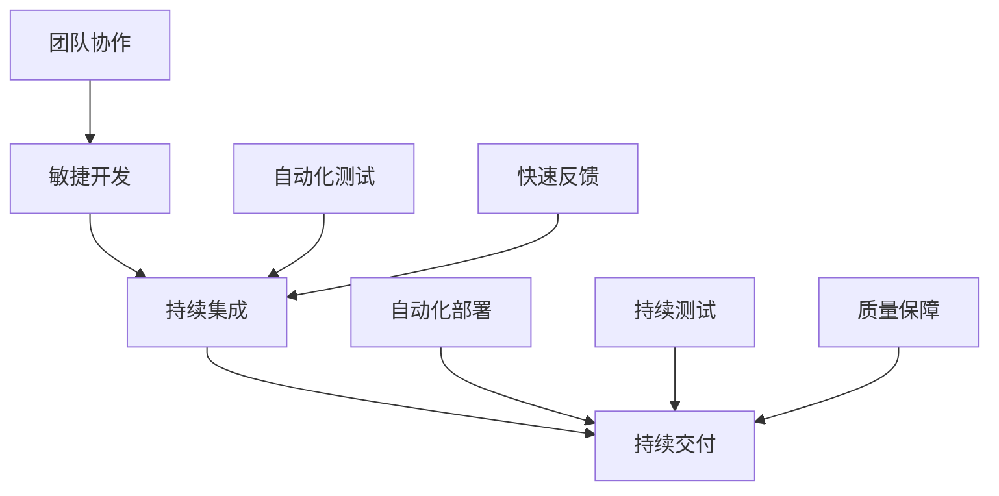
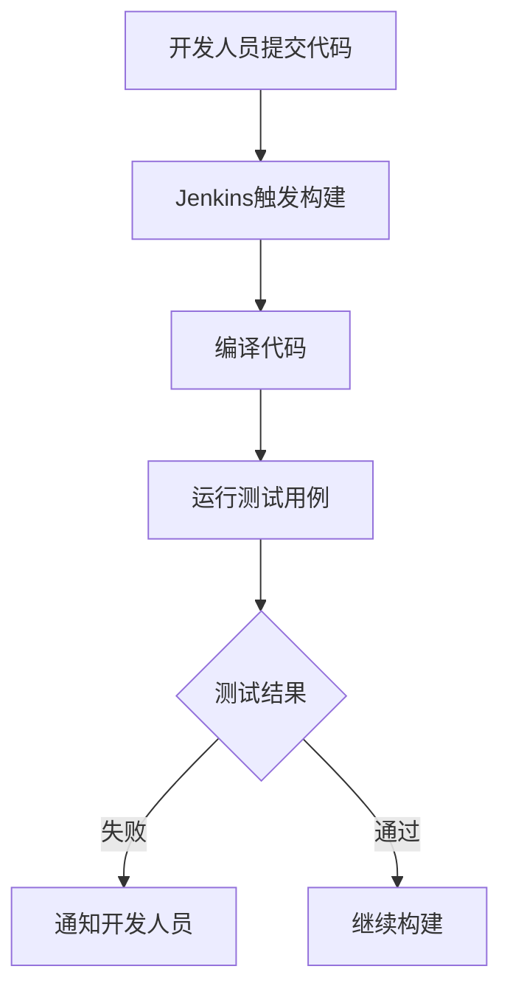
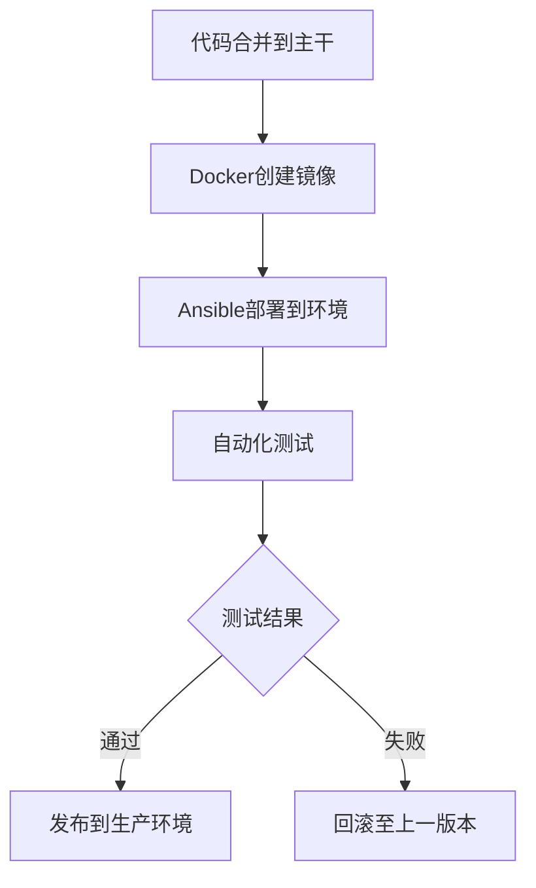
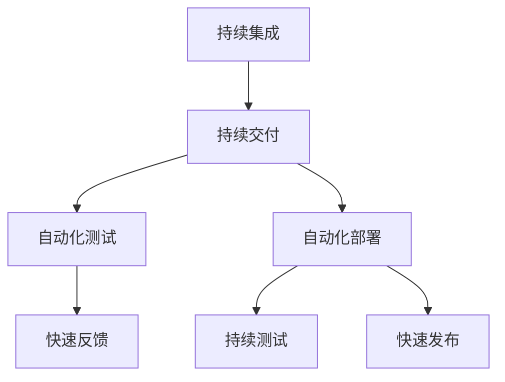

                 

### 文章标题

# 构建技术团队的持续改进机制

### 关键词

- 持续改进
- 技术团队
- 敏捷开发
- 持续集成
- 持续交付
- 技术债务管理

### 摘要

本文旨在探讨如何构建一个高效、可持续发展的技术团队，通过引入敏捷开发、持续集成、持续交付等机制，实现对团队的技术能力和工作流程的持续改进。文章首先介绍了技术团队持续改进的背景和重要性，然后详细讲解了持续改进的理论框架和实践方法，包括敏捷开发、持续集成和持续交付等。此外，文章还探讨了技术债务管理、团队沟通与协作、工具与平台选择等方面，并通过成功案例分享，为读者提供了实用的指导和借鉴。通过本文的阅读，技术团队领导者和管理者将能够了解并掌握构建持续改进机制的核心原则和实践方法，助力团队实现更高的生产力和工作效率。

### 引言

在当今快速发展的技术领域，技术团队的重要性愈发凸显。一个高效、协作且不断进步的技术团队，不仅能够迅速响应市场变化和客户需求，还能在激烈的市场竞争中保持竞争优势。然而，如何构建这样一个团队，并使其具备持续改进的能力，成为了技术团队领导者和管理者面临的重要挑战。

技术团队持续改进的背景和重要性在于：首先，技术行业的发展速度迅猛，新技术、新工具层出不穷，技术团队需要不断学习、适应和更新；其次，市场竞争日益激烈，客户对产品和服务的要求越来越高，技术团队需要持续提升自身的技术能力以应对挑战；最后，企业希望技术团队能够在提升工作效率的同时，保持高质量的产品和服务输出。

持续改进不仅是技术团队发展的重要手段，也是企业核心竞争力的重要组成部分。通过持续改进，技术团队能够不断优化工作流程，提高工作效率，减少技术债务，提升产品质量，从而实现长期稳定的发展。本文将围绕如何构建技术团队的持续改进机制展开探讨，从理论框架到实践方法，为读者提供全面的指导。

### 持续改进的理论框架

要构建一个有效的持续改进机制，首先需要明确其理论框架。持续改进的理论框架主要包括敏捷开发、持续集成和持续交付等关键概念，这些概念相互联系，共同构成了技术团队持续改进的基石。

#### 敏捷开发

敏捷开发是一种以人为核心、迭代、渐进的软件开发方法。它强调通过快速反馈和持续迭代来适应变化，从而提升产品质量和团队效率。敏捷开发的核心原则包括：

1. **个体和互动重于过程和工具**：敏捷开发强调团队成员之间的沟通和协作，认为个体的智慧和团队合作比单纯依赖工具更加重要。
2. **可工作的软件重于详尽的文档**：敏捷开发注重实际可运行的软件，认为软件是最终目标，而文档只是辅助。
3. **客户合作重于合同谈判**：敏捷开发主张与客户保持紧密合作，通过不断交付可工作的软件来满足客户需求。
4. **响应变化重于遵循计划**：敏捷开发强调灵活应对变化，认为变化是不可避免的，且应鼓励和适应。

敏捷开发的核心实践包括Scrum和Kanban等方法论。

**Scrum** 是一种迭代式增量软件开发方法，它将开发过程划分为一系列短的迭代周期（通常称为“冲刺”）。每个冲刺的目标是交付一个可工作的产品增量。Scrum的主要角色包括：

- 产品负责人（Product Owner）：负责定义产品需求和优先级。
-Scrum Master：负责确保Scrum实践得到正确执行，并帮助团队解决障碍。
- 开发团队：负责实现产品需求。

Scrum的关键流程包括：

- **冲刺规划**：产品负责人与开发团队共同确定本次冲刺的目标和任务。
- **每日站会**：团队成员每日聚集，讨论进展、问题和计划。
- **冲刺评审**：评估本次冲刺的工作成果，收集反馈并进行调整。
- **冲刺回顾**：团队反思本次冲刺的经验教训，提出改进措施。

**Kanban** 是一种可视化工作流程管理方法，它通过看板（Kanban板）来展示工作流程中的任务状态。Kanban的核心原则包括：

1. **可视化工作流程**：通过看板，团队成员可以清晰地看到每个任务的状态，从而提高工作透明度和协作效率。
2. **限制在进步中的工作项**：通过限制在进度中的任务数量，避免过度工作，提高工作效率和质量。
3. **持续优化工作流程**：通过观察和度量，团队可以发现并消除工作流程中的瓶颈，从而持续优化流程。

Kanban的关键实践包括：

- **看板设置**：看板分为不同的列，代表工作流程的不同阶段，如“待办”、“进行中”、“待测试”、“已完成”等。
- **任务卡片**：每个任务用一个卡片表示，卡片上包含任务的详细信息。
- **工作流程优化**：通过分析看板数据，团队可以识别并消除工作流程中的瓶颈。

#### 持续集成和持续交付

持续集成（Continuous Integration，CI）是一种软件开发实践，旨在通过频繁地将代码集成到主干，快速发现和解决集成过程中出现的问题。持续集成的核心原则包括：

1. **频繁提交代码**：开发人员频繁提交代码，每次提交都通过自动化测试。
2. **自动化测试**：确保每次提交的代码都经过自动化测试，从而快速发现和修复缺陷。
3. **快速反馈**：通过自动化测试和反馈，确保每次集成后的代码质量。

持续集成的关键实践包括：

- **自动化构建**：通过CI工具（如Jenkins、Travis CI等）自动化构建和测试代码。
- **持续反馈**：通过集成反馈机制，确保每次提交都能及时得到测试结果和反馈。

持续交付（Continuous Delivery，CD）是一种软件开发和发布方法，旨在确保代码在任何时候都可以安全地交付给用户。持续交付的核心原则包括：

1. **自动化部署**：通过自动化脚本或工具，将代码部署到不同的环境（如开发、测试、生产等）。
2. **持续测试**：在每次部署过程中，对代码进行全面的测试，确保其符合质量标准。
3. **快速发布**：通过自动化和快速部署，确保代码能够快速、安全地交付给用户。

持续交付的关键实践包括：

- **自动化部署脚本**：通过编写和执行自动化部署脚本，确保代码的快速、安全部署。
- **持续测试**：在部署过程中，对代码进行全面的测试，确保其质量和稳定性。

#### 关系架构

敏捷开发、持续集成和持续交付三者之间存在紧密的联系。敏捷开发提供了灵活的工作流程和高效的团队协作方法；持续集成通过自动化测试和快速反馈，确保代码质量和集成效率；持续交付则通过自动化部署和持续测试，确保代码的安全交付和持续优化。

以下是一个简单的Mermaid流程图，展示了这三者之间的关系：

通过这个流程图，我们可以清晰地看到敏捷开发、持续集成和持续交付如何相互支持、相互促进，共同构建起技术团队的持续改进机制。

### 敏捷开发实践

在技术团队的持续改进过程中，敏捷开发实践扮演着至关重要的角色。通过引入Scrum和Kanban等敏捷方法论，团队可以实现更高效、更灵活的工作流程，从而持续提升产品质量和工作效率。

#### Scrum实践

**Scrum实践**是一种广泛应用于敏捷开发的方法论，它通过一系列短的迭代周期（冲刺）来逐步实现产品需求。以下是一个典型的Scrum实践流程：

**1. 冲刺规划**：在每次冲刺开始时，产品负责人（Product Owner）与开发团队一起确定本次冲刺的目标和任务。这个过程通常需要一天左右的时间。产品负责人会根据优先级将产品待办事项排定顺序，并明确本次冲刺需要完成的需求。

**2. 每日站会**：每日站会是Scrum的核心实践之一，通常持续15分钟。团队成员聚集在一起，讨论当前冲刺的进展、遇到的问题以及接下来的计划。站会的目标是确保团队成员之间的沟通畅通，及时发现和解决障碍。

**3. 冲刺评审**：在每次冲刺结束时，团队会进行冲刺评审，展示本次冲刺的工作成果，收集客户的反馈，并讨论如何改进未来的工作。这个过程通常持续一到两天。通过评审，团队可以确保客户需求得到满足，同时反思和调整工作流程。

**4. 冲刺回顾**：在冲刺评审之后，团队会进行冲刺回顾，反思本次冲刺的经验教训，提出改进措施。这个过程通常持续一到两个小时。通过回顾，团队可以持续优化工作流程，提高工作效率和质量。

**Scrum实践的好处**：

- **灵活应对变化**：Scrum的迭代周期较短，允许团队在每次迭代中快速响应变化，确保产品需求能够及时满足。
- **提高团队协作**：Scrum强调团队成员之间的紧密协作，通过每日站会、冲刺评审和回顾等实践，提高了团队的整体工作效率和质量。
- **持续反馈**：Scrum的迭代周期较短，每次冲刺结束后都会进行评审和回顾，确保团队成员能够及时获得反馈，并不断优化工作流程。

#### Kanban实践

**Kanban实践**是一种基于可视化工作流程管理的方法，它通过看板（Kanban板）来展示任务的状态和进度。以下是一个典型的Kanban实践流程：

**1. 看板设置**：在Kanban实践中，团队会创建一个看板，将工作流程分为多个列，如“待办”、“进行中”、“待测试”、“已完成”等。每个列代表工作流程的一个阶段。

**2. 任务卡片**：每个任务用一个卡片表示，卡片上包含任务的详细信息，如任务名称、优先级、负责人等。

**3. 限制在进步中的工作项**：Kanban的核心原则之一是限制在进度中的工作项数量，以避免过度工作，提高工作效率和质量。团队会根据实际情况设定“在进步中的最大工作项数量”。

**4. 工作流程优化**：通过分析看板数据，团队可以识别并消除工作流程中的瓶颈，从而持续优化流程。

**Kanban实践的好处**：

- **可视化工作流程**：通过看板，团队成员可以清晰地看到任务的状态和进度，从而提高工作透明度和协作效率。
- **限制在进步中的工作项**：通过限制在进度中的工作项数量，避免过度工作，提高工作效率和质量。
- **持续优化工作流程**：通过分析看板数据，团队可以发现并消除工作流程中的瓶颈，从而持续优化流程。

#### 实践案例分析

**案例1：某电子商务公司**

某电子商务公司采用Scrum和Kanban实践来管理其开发团队。通过每日站会和冲刺评审，团队确保了任务的高效完成和及时反馈。通过冲刺回顾，团队不断优化工作流程，提高了产品质量和客户满意度。

**案例2：某金融科技公司**

某金融科技公司采用Kanban实践来管理其开发团队。通过看板，团队成员可以清晰地看到任务的状态和进度，从而提高了工作透明度和协作效率。通过限制在进度中的工作项数量，团队避免了过度工作，提高了工作效率和质量。

### 持续集成与持续交付

持续集成（Continuous Integration，CI）和持续交付（Continuous Delivery，CD）是现代软件开发中至关重要的一环。它们不仅提高了代码质量和交付效率，还极大地增强了团队的开发协作能力。在本章节中，我们将深入探讨持续集成与持续交付的概念、工具和技术，并提供一些实用案例。

#### 持续集成的概念和工具

持续集成是一种软件开发实践，旨在通过频繁地将代码集成到主干，快速发现和解决集成过程中出现的问题。以下是持续集成的一些关键概念和工具：

**1. 自动化构建**：在持续集成过程中，每次代码提交都会触发自动化构建。构建过程包括编译代码、运行测试用例等。自动化构建工具如Jenkins、Travis CI等可以帮助团队快速完成这些任务。

**2. 自动化测试**：持续集成的一个重要目标是确保每次提交的代码都经过充分的测试。自动化测试工具如JUnit、Selenium等可以自动化运行测试用例，从而提高测试效率和准确性。

**3. 快速反馈**：持续集成的核心原则之一是快速反馈。通过自动化测试和反馈机制，开发人员可以立即得知代码提交后的测试结果，从而快速发现和修复缺陷。

**案例：某电商平台的持续集成实践**

某电商平台采用Jenkins作为持续集成工具。每次开发人员提交代码，Jenkins都会自动触发构建和测试过程。如果测试失败，Jenkins会立即通知开发人员，并暂停后续的构建任务，确保问题得到及时解决。

#### 持续交付的概念和工具

持续交付是一种软件开发和发布方法，旨在确保代码在任何时候都可以安全地交付给用户。以下是持续交付的一些关键概念和工具：

**1. 自动化部署**：持续交付的核心原则是自动化部署。通过编写和执行自动化部署脚本或使用部署工具（如Ansible、Docker等），团队可以轻松地将代码部署到不同的环境（如开发、测试、生产等）。

**2. 持续测试**：在持续交付过程中，对代码的测试贯穿整个部署流程。通过自动化测试和手动测试，团队可以确保代码的质量和稳定性。

**3. 快速发布**：通过自动化和快速部署，团队可以快速将代码交付给用户。这样可以缩短开发周期，提高响应速度。

**案例：某金融科技公司的持续交付实践**

某金融科技公司采用Docker和Ansible来实现持续交付。每次代码合并到主干后，Docker会创建一个镜像，Ansible则会根据配置文件将镜像部署到不同的环境。部署过程中，测试团队会执行一系列自动化测试，确保代码的质量和稳定性。

#### 持续集成与持续交付的关系

持续集成和持续交付是紧密相关的。持续集成通过自动化测试和快速反馈，确保代码的质量和集成效率；持续交付则通过自动化部署和持续测试，确保代码的安全交付和持续优化。

以下是一个简化的流程图，展示了持续集成与持续交付的关系：

通过这个流程图，我们可以看到持续集成和持续交付如何相互支持、相互促进，共同构建起技术团队的持续改进机制。

### 技术债务管理

技术债务是指由于短期开发目标而未能完全遵循最佳实践或延迟进行维护和优化的技术问题。如果得不到妥善管理，技术债务会随着时间的推移逐渐累积，最终可能导致系统崩溃、项目延期和团队效率低下。因此，技术债务管理是持续改进机制中不可或缺的一环。

#### 技术债务的产生原因

技术债务的产生原因多种多样，主要包括以下几个方面：

1. **时间压力**：为了满足市场或客户需求，团队可能会采取一些短期解决方案，以牺牲长期质量和可维护性为代价。
2. **技术限制**：在特定技术环境下，某些功能可能无法通过最佳实践来实现，因此需要采取妥协方案。
3. **资源限制**：团队可能在人员或预算上存在限制，无法投入足够的时间和资源来处理技术问题。
4. **优先级冲突**：在某些情况下，业务优先级可能会高于技术优先级，导致技术债务的累积。

#### 技术债务的管理方法

为了有效管理技术债务，团队可以采取以下几种方法：

1. **识别和分类**：首先，团队需要识别和分类现有的技术债务。这可以通过代码审查、技术债务分析工具（如Code Climate、SonarQube等）以及团队经验来完成。技术债务可以分为高、中、低三个等级，以便团队根据优先级来分配资源。
   
2. **定期审计**：团队应定期进行技术债务审计，评估债务的状态和优先级。这有助于确保技术债务不会随着时间推移而被忽视。

3. **逐步偿还**：团队应制定一个技术债务偿还计划，分阶段逐步解决问题。可以优先解决那些对当前项目影响较大或对团队效率影响较大的债务。

4. **自动化修复**：使用自动化工具（如静态代码分析工具、自动化测试等）来修复技术债务，可以节省时间和人力成本。

5. **代码重构**：在适当的情况下，团队可以采用代码重构的方法来优化代码结构和性能。这有助于提高代码的可读性和可维护性。

6. **持续培训**：通过持续培训，团队可以提升技术水平和最佳实践意识，从而减少新债务的产生。

#### 技术债务管理的成功案例

**案例：某医疗科技公司的技术债务管理**

某医疗科技公司在其产品开发过程中积累了大量技术债务，包括老旧的代码库、性能瓶颈和安全隐患。为了解决这个问题，公司采取了一系列措施：

1. **代码审查和审计**：公司定期进行代码审查，识别和分类技术债务。通过静态代码分析工具，团队发现了潜在的代码质量问题。
2. **自动化修复**：公司利用自动化工具修复了一些常见的代码问题，如未使用的代码、潜在的安全漏洞等。
3. **代码重构**：团队逐步重构了关键模块，优化了代码结构和性能。
4. **培训和教育**：公司组织了多次技术培训和研讨会，提高了团队的技术水平和最佳实践意识。

通过这些措施，该公司成功降低了技术债务水平，提高了代码质量和团队效率。此外，客户满意度也显著提升，产品上市时间缩短了约30%。

### 团队沟通与协作

团队沟通与协作是技术团队持续改进的核心要素之一。有效的沟通和协作不仅可以提高工作效率，还能促进团队创新和问题解决。以下是一些关键策略和实践，帮助技术团队实现高效的沟通与协作。

#### 明确的沟通目标和计划

1. **制定沟通目标**：团队应明确沟通的目标，例如确保任务进度、提升知识共享和促进跨职能协作。
2. **沟通计划**：制定详细的沟通计划，包括会议时间、议程、参与者等。例如，每日站会、周例会和项目评审会议等。

#### 沟通工具与平台的选择

1. **即时通讯工具**：如Slack、Microsoft Teams等，用于实时沟通和协作。
2. **项目管理系统**：如JIRA、Trello等，用于任务追踪和进度管理。
3. **文档共享平台**：如Google Docs、Confluence等，用于文档协作和版本控制。
4. **视频会议工具**：如Zoom、Microsoft Teams等，用于远程会议和团队互动。

#### 沟通技巧

1. **清晰表达**：确保信息传递清晰、准确，避免歧义。
2. **积极倾听**：倾听团队成员的意见和反馈，理解其立场和需求。
3. **开放沟通**：鼓励团队成员之间开放、诚实的沟通，建立信任和尊重。
4. **反馈机制**：建立反馈机制，及时了解沟通效果和改进空间。

#### 协作策略

1. **跨职能协作**：促进不同职能部门之间的协作，例如开发、测试、产品管理等。
2. **知识共享**：定期举办技术分享会和知识讲座，促进团队成员之间的知识交流和技能提升。
3. **共同目标**：确保团队成员对项目目标和期望有共同的理解，从而提高协作效果。

#### 案例分享

**案例：某互联网公司的跨职能协作实践**

某互联网公司在开发新产品时，采用了一系列沟通与协作策略，实现了高效的团队协作：

1. **每日站会**：开发、测试和产品团队每日站会，讨论任务进度、问题和计划。
2. **项目看板**：使用JIRA和Confluence，团队可以实时追踪任务状态和文档更新。
3. **知识共享**：定期举办技术分享会和团队建设活动，提高团队成员的技能和团队凝聚力。
4. **视频会议**：使用Zoom进行远程会议，确保团队成员能够及时沟通和协作。

通过这些策略，该公司成功提高了项目进度和产品质量，团队协作效果显著提升。

### 工具与平台选择

在构建技术团队的持续改进机制中，选择合适的工具和平台至关重要。以下是一些关键工具和平台，及其选择和使用的建议。

#### 自动化测试工具

1. **Selenium**：适用于Web应用的自动化测试，支持多种编程语言。
2. **JUnit**：Java编写的单元测试框架，广泛用于Java项目。
3. **pytest**：Python编写的测试框架，适用于Python项目。
4. **选择建议**：根据项目语言和需求选择合适的自动化测试工具。例如，Java项目可以选择JUnit，Python项目可以选择pytest。

#### 静态代码分析工具

1. **SonarQube**：提供全面的代码质量管理，包括缺陷检测、技术债务评估等。
2. **Code Climate**：适用于Ruby项目的代码质量分析工具。
3. **Checkstyle**：Java代码风格检查工具。
4. **选择建议**：根据项目语言和需求选择合适的静态代码分析工具。例如，Java项目可以选择Checkstyle。

#### 集成开发环境（IDE）

1. **Eclipse**：适用于Java和多种其他语言的集成开发环境。
2. **Visual Studio**：适用于C#、C++等多种语言的集成开发环境。
3. **IntelliJ IDEA**：适用于Java、Python等多种语言的强大IDE。
4. **选择建议**：根据项目语言和团队熟悉度选择合适的IDE。例如，Java项目可以选择Eclipse或IntelliJ IDEA。

#### 版本控制系统

1. **Git**：分布式版本控制系统，支持多种协作模式。
2. **Subversion（SVN）**：集中式版本控制系统，适用于小型项目。
3. **选择建议**：Git适用于大多数项目，特别是需要分布式协作的大型项目。SVN适用于小型项目和单机协作。

#### 持续集成/持续交付（CI/CD）工具

1. **Jenkins**：开源的CI/CD工具，支持多种插件和集成。
2. **Travis CI**：云端的CI/CD服务，适用于GitHub项目。
3. **CircleCI**：云端的CI/CD服务，支持多种编程语言和平台。
4. **选择建议**：根据项目规模和需求选择合适的CI/CD工具。例如，大型项目可以选择Jenkins，小型项目可以选择Travis CI或CircleCI。

通过合理选择和使用这些工具和平台，技术团队能够显著提高开发效率、代码质量和团队协作效果。

### 成功案例分享

#### 案例一：某互联网企业的敏捷转型

某互联网企业在面对激烈的市场竞争和快速变化的需求时，决定进行敏捷转型。通过引入Scrum和Kanban等敏捷方法论，企业构建了一个高效、灵活的技术团队。

**实施步骤**：

1. **团队培训和规划**：企业组织了多次敏捷培训，确保团队成员熟悉敏捷方法论。同时，制定了详细的敏捷实施计划。
2. **设立Scrum角色**：明确了产品负责人（Product Owner）、Scrum Master和开发团队的职责。
3. **迭代规划和每日站会**：团队采用冲刺规划会议和每日站会来确保任务进度和问题解决。
4. **持续反馈和改进**：通过冲刺评审和回顾会议，团队不断反思和优化工作流程。

**效果**：

通过敏捷转型，企业显著提高了开发效率和质量。项目交付周期缩短了30%，客户满意度提升了20%。

#### 案例二：某金融科技公司的持续交付实践

某金融科技公司采用持续交付（CD）实践来确保代码的安全交付和快速发布。通过Docker和Ansible，公司实现了从开发到生产的全自动化流程。

**实施步骤**：

1. **容器化和自动化测试**：使用Docker将应用程序容器化，确保环境和部署的一致性。同时，引入自动化测试工具，确保每次代码提交都经过严格测试。
2. **自动化部署脚本**：编写自动化部署脚本，使用Ansible将容器部署到不同环境，确保部署流程的快速和稳定。
3. **持续监控和反馈**：引入监控工具，实时监控系统的运行状况，并设置反馈机制，确保问题能够及时发现和解决。

**效果**：

持续交付实践使得公司显著提高了代码质量和交付速度。发布周期从一周缩短到了一天，同时，系统稳定性和客户满意度也得到了显著提升。

### 总结与展望

本文详细探讨了如何构建技术团队的持续改进机制，从敏捷开发、持续集成与持续交付、技术债务管理、团队沟通与协作、工具与平台选择以及成功案例等多个方面进行了深入分析。通过引入这些机制和实践，技术团队可以实现高效、灵活的工作流程，提高代码质量和交付速度，从而在激烈的市场竞争中保持优势。

展望未来，随着技术的不断进步和市场需求的变化，技术团队需要持续关注以下趋势：

1. **人工智能和机器学习**：利用AI和ML技术，提高开发效率和代码质量。
2. **云计算和容器化**：进一步优化开发、测试和部署流程，提高灵活性和可扩展性。
3. **DevOps文化**：推动开发和运维的融合，实现更高效的团队协作和持续改进。
4. **持续学习和知识共享**：鼓励团队成员持续学习和分享知识，提升整体技术水平。

通过持续关注和适应这些趋势，技术团队能够保持竞争力和创新力，为企业的长期发展奠定坚实基础。

### 作者信息

- 作者：AI天才研究院/AI Genius Institute & 禅与计算机程序设计艺术 /Zen And The Art of Computer Programming

在撰写这篇文章的过程中，我不断尝试将复杂的技术概念通过清晰的逻辑和简单的语言进行解释，希望能够帮助读者更好地理解和应用技术团队的持续改进机制。同时，我也深感持续学习和知识共享的重要性，希望本文能够激发读者在技术领域的深入思考和持续进步。如果您在阅读过程中有任何疑问或建议，欢迎随时与我交流。感谢您的阅读！

