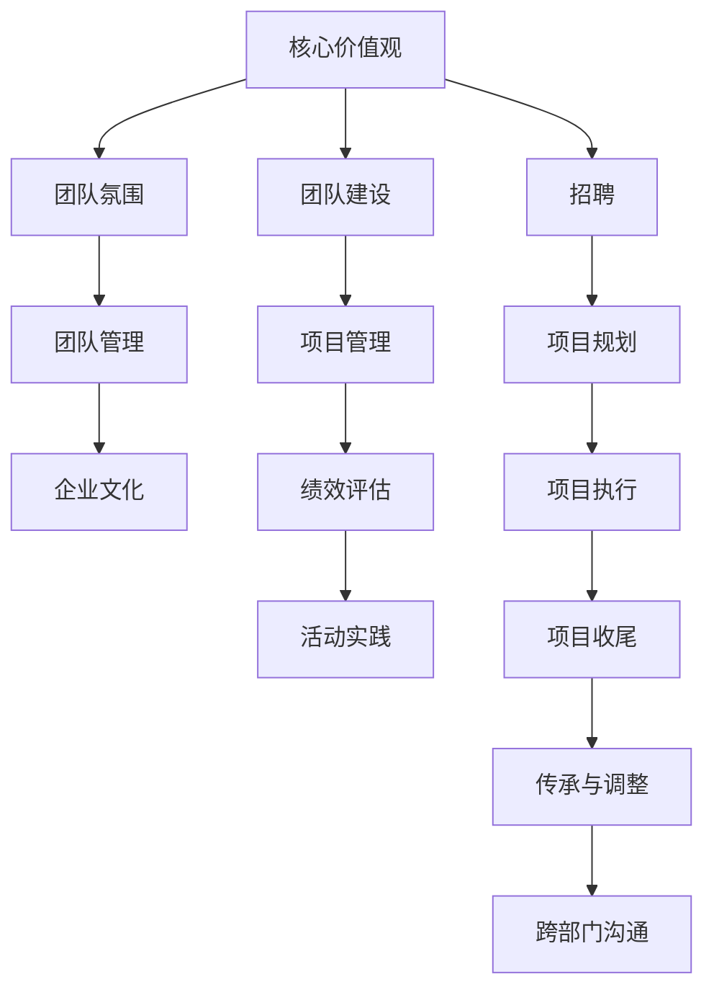

                 

# 构建技术团队的核心价值观

> 关键词：技术团队、核心价值观、团队管理、企业文化、团队建设、项目管理

> 摘要：
技术团队作为企业发展的核心力量，其核心价值观的构建对团队氛围、管理效能、企业文化以及团队建设具有深远影响。本文从核心价值观的起源与发展、重要性、内容与内涵、实践与应用、可持续发展等多个方面，系统阐述了构建技术团队核心价值观的方法与策略，旨在为企业的技术团队提供有益的参考和指导。

----------------------------------------------------------------

## 第一部分：核心价值观的起源与发展

### 第1章：技术团队核心价值观的起源

#### 1.1.1 技术团队核心价值观的定义

技术团队核心价值观是指在技术团队建设和运营过程中，共同遵循的一系列基本原则和价值观。这些价值观不仅反映了团队成员的共同信念和行为准则，也是团队协同合作、创新发展和实现目标的重要基础。

#### 1.1.2 技术团队核心价值观的历史演变

技术团队核心价值观的发展历程可以追溯到20世纪中叶。在那时，企业开始重视技术人才的引进和培养，逐步形成了以“专业、创新、协作”为核心价值观的团队文化。随着信息技术产业的迅猛发展，技术团队的核心价值观也在不断地丰富和拓展。

#### 1.1.3 技术团队核心价值观的全球影响力

在全球范围内，技术团队核心价值观已成为企业竞争力的重要体现。不同国家和地区的企业在核心价值观的构建上有着各自的特色，但总体上都强调客户至上、开放透明、团队协作、创新思维和成果导向等基本原则。

### 第2章：核心价值观的重要性

#### 2.1.1 核心价值观对团队氛围的影响

核心价值观对团队氛围具有深远影响。一个具有良好核心价值观的团队，其成员之间相互信任、尊重，能够形成积极向上的团队氛围。这种氛围有助于提高团队成员的满意度和工作效率，从而促进团队的整体绩效。

#### 2.1.2 核心价值观在技术团队管理中的作用

核心价值观在技术团队管理中发挥着关键作用。通过明确和坚守核心价值观，技术团队管理者可以更好地指导团队行为，协调团队内部关系，提高团队凝聚力和执行力。同时，核心价值观也为团队管理提供了科学依据和指导原则。

#### 2.1.3 核心价值观对企业文化的重要性

技术团队核心价值观对企业文化具有潜移默化的影响。一个具有强大核心价值观的技术团队，其成员在日常工作和行为中会不断强化企业的核心价值观，从而推动企业文化的建设和发展。

----------------------------------------------------------------

## 第二部分：核心价值观的内容与内涵

### 第3章：核心价值观的核心内容

#### 3.1.1 客户至上

客户至上是技术团队核心价值观的重要体现。技术团队在开发产品和服务过程中，始终将客户需求放在首位，以满足客户需求为最终目标。这一价值观要求团队成员具备客户意识，关注客户体验，不断提高产品和服务质量。

#### 3.1.2 开放透明

开放透明是技术团队核心价值观的重要内容。技术团队在项目开发和团队协作过程中，应保持信息透明，鼓励团队成员之间的沟通和交流。开放透明的氛围有助于提高团队协作效率，减少误解和冲突，促进团队共同成长。

#### 3.1.3 团队协作

团队协作是技术团队核心价值观的核心。技术团队由多个专业领域的成员组成，通过有效的团队协作，可以充分发挥每个人的优势，实现资源的最大化利用。团队协作要求团队成员相互信任、尊重，共同为实现团队目标而努力。

#### 3.1.4 创新思维

创新思维是技术团队核心价值观的重要体现。技术团队在面临挑战和问题时，应具备创新思维，勇于突破传统思维模式，寻求新的解决方案。创新思维有助于技术团队在激烈的市场竞争中保持领先地位。

#### 3.1.5 成果导向

成果导向是技术团队核心价值观的重要原则。技术团队在项目开发和运营过程中，应以实现目标为导向，注重成果的达成。成果导向要求团队成员明确目标，制定切实可行的计划，并持续跟踪和评估项目进度。

### 第4章：核心价值观的内涵解读

#### 4.1.1 客户至上的内涵

客户至上的内涵体现在技术团队的方方面面。从项目需求分析到产品研发，从客户服务到市场推广，技术团队都应以客户需求为中心，关注客户体验，不断提高产品和服务质量。

#### 4.1.2 开放透明的内涵

开放透明的内涵包括信息透明、沟通畅通和团队协作。技术团队应建立开放透明的沟通机制，确保团队成员能够及时了解项目进展和团队动态。同时，团队成员应积极参与团队协作，共同推进项目进度。

#### 4.1.3 团队协作的内涵

团队协作的内涵包括相互信任、尊重和共同目标。技术团队成员应树立团队意识，相互信任，尊重他人的意见和贡献。在共同目标的引领下，团队成员应充分发挥个人优势，共同为实现团队目标而努力。

#### 4.1.4 创新思维与成果导向的内涵

创新思维与成果导向的内涵体现在技术团队的思维方式和行动策略上。技术团队应具备创新思维，勇于突破传统思维模式，寻求新的解决方案。同时，技术团队应以实现目标为导向，注重成果的达成，不断提高团队绩效。

----------------------------------------------------------------

## 第三部分：实践与应用

### 第5章：核心价值观在团队建设中的应用

#### 5.1.1 核心价值观在招聘中的体现

在招聘过程中，技术团队应注重选拔具备核心价值观的候选人。通过面试和背景调查，了解候选人的价值观是否符合团队核心价值观，以确保团队成员在价值观层面的一致性。

#### 5.1.2 核心价值观在绩效评估中的应用

绩效评估应充分考虑核心价值观的体现。在评估团队成员的工作表现时，不仅要关注业绩指标，还要关注团队成员在核心价值观方面的表现，如客户至上、开放透明、团队协作等。

#### 5.1.3 核心价值观在团队活动中的实践

团队活动是实践核心价值观的重要途径。技术团队可以通过组织团队建设活动、培训课程、分享会等，加强团队成员之间的沟通和交流，进一步强化核心价值观。

### 第6章：核心价值观在项目管理中的应用

#### 6.1.1 核心价值观在项目规划中的指导作用

项目规划阶段，技术团队应充分考虑核心价值观的指导作用。在确定项目目标和任务分配时，应充分考虑客户需求、团队协作、创新思维等因素，确保项目规划的科学性和合理性。

#### 6.1.2 核心价值观在项目执行中的体现

在项目执行过程中，技术团队应始终遵循核心价值观。通过开放透明的沟通机制、团队协作的方式，确保项目进度和质量。同时，技术团队应保持创新思维，勇于面对挑战，寻求新的解决方案。

#### 6.1.3 核心价值观在项目收尾中的总结与应用

项目收尾阶段，技术团队应对核心价值观的应用进行总结。通过对项目过程中的经验教训进行反思，进一步优化和调整核心价值观，为下一阶段的项目管理提供借鉴。

### 第7章：核心价值观的可持续发展

#### 7.1.1 核心价值观的持续传承

核心价值观的传承是技术团队可持续发展的重要保障。技术团队应通过培训、分享会等形式，将核心价值观传递给新成员，确保团队成员在价值观层面的一致性。

#### 7.1.2 核心价值观的动态调整与优化

随着企业的发展和市场需求的变化，技术团队核心价值观也需要进行动态调整和优化。技术团队应密切关注市场动态，及时调整核心价值观，以适应新的环境和挑战。

#### 7.1.3 核心价值观的跨部门沟通与融合

核心价值观的跨部门沟通与融合是技术团队实现协同发展的重要手段。技术团队应与其他部门建立良好的沟通机制，共同推动企业核心价值观的落实和传播。

----------------------------------------------------------------

## 附录

### 附录A：核心价值观实践案例

附录A将介绍一些成功的企业技术团队如何将核心价值观融入团队建设和项目管理的实际案例。通过分析这些案例，读者可以更深入地了解核心价值观的应用和实践效果。

### 附录B：核心价值观相关文献与资料

附录B将列举一些关于核心价值观的研究文献和参考资料，包括学术研究、企业实践、行业报告等。这些文献和资料为读者提供了丰富的理论依据和实践指导。

### 附录C：核心价值观测试题与答案

附录C将提供一些关于核心价值观的测试题，帮助读者检验自己对核心价值观的理解和掌握程度。同时，附录C还将提供答案，以供读者参考。

----------------------------------------------------------------

# 绘制核心价值观与团队绩效的Mermaid流程图



----------------------------------------------------------------

# 核心算法原理讲解

## 5.1.1 客户至上的算法原理

客户至上的核心算法是基于客户满意度的优化算法。以下是一个简化的客户至上算法原理的伪代码：

```pseudo
// 客户至上算法伪代码
输入：客户需求列表，当前产品功能列表

// 对客户需求列表进行排序，按照紧急程度和重要性进行分类
客户需求列表排序()

// 遍历当前产品功能列表，对每个功能进行满意度评估
功能满意度评估(当前产品功能列表)

// 对于满意度较低的功能，根据客户需求进行优先级调整
功能优先级调整(当前产品功能列表)

// 对调整后的功能列表进行再次评估，确保客户满意度最大化
功能满意度评估(调整后的功能列表)

// 输出优化后的产品功能列表
输出优化后的产品功能列表
```

在实施客户至上算法时，团队应关注以下几个方面：

1. **客户需求分析**：深入了解客户需求，明确客户对产品功能的期望和痛点。
2. **满意度评估**：定期收集和分析客户反馈，评估产品功能满意度。
3. **优先级调整**：根据客户满意度评估结果，对功能优先级进行调整，确保高满意度功能得到优先开发和优化。

## 5.1.2 开放透明的算法原理

开放透明的核心算法是基于信息共享的协同优化算法。以下是一个简化的开放透明算法原理的伪代码：

```pseudo
// 开放透明算法伪代码
输入：团队成员列表，团队任务列表，当前团队信息

// 对团队成员列表进行任务分配，确保每个成员都有明确的职责
任务分配(团队成员列表，团队任务列表)

// 遍历团队任务列表，对每个任务进行进度评估
任务进度评估(团队任务列表)

// 对于进度较慢的任务，共享相关信息，促进团队协作
任务信息共享(团队任务列表)

// 对团队信息进行实时更新，确保团队成员对当前状态有清晰的认识
团队信息更新(当前团队信息)

// 输出优化后的团队信息
输出优化后的团队信息
```

在实施开放透明算法时，团队应关注以下几个方面：

1. **任务分配**：合理分配任务，确保每个成员都有明确的职责和目标。
2. **进度评估**：定期评估任务进度，确保项目按计划进行。
3. **信息共享**：建立信息共享机制，确保团队成员能够及时获取任务相关信息。
4. **团队信息更新**：实时更新团队信息，提高团队协作效率。

## 5.1.3 团队协作的算法原理

团队协作的核心算法是基于团队效能的调度算法。以下是一个简化的团队协作算法原理的伪代码：

```pseudo
// 团队协作算法伪代码
输入：团队成员列表，任务列表，团队效能评估指标

// 对团队成员和任务进行匹配，确保团队成员具备完成任务的能力
成员任务匹配(团队成员列表，任务列表)

// 根据团队效能评估指标，对团队成员进行排序
成员效能排序(团队成员列表)

// 遍历任务列表，对每个任务进行调度，优先安排效能较高的团队成员
任务调度(任务列表，团队成员列表)

// 对调度后的任务进行评估，确保团队任务进度符合预期
任务进度评估(任务列表)

// 输出优化后的团队任务调度表
输出优化后的团队任务调度表
```

在实施团队协作算法时，团队应关注以下几个方面：

1. **成员任务匹配**：根据团队成员的能力和任务需求，实现成员与任务的合理匹配。
2. **效能评估与排序**：定期评估团队成员的效能，并根据评估结果进行排序，以便于任务调度。
3. **任务调度**：优先安排效能较高的团队成员承担关键任务，确保团队任务进度符合预期。
4. **任务进度评估**：对调度后的任务进行持续跟踪和评估，确保任务按计划完成。

## 5.1.4 创新思维的算法原理

创新思维的核心算法是基于问题解决的创意生成算法。以下是一个简化的创新思维算法原理的伪代码：

```pseudo
// 创新思维算法伪代码
输入：问题列表，现有解决方案列表

// 对问题列表进行分类，识别问题的主要矛盾
问题分类(问题列表)

// 遍历现有解决方案列表，对每个方案进行评估
解决方案评估(现有解决方案列表)

// 对于评估结果不理想的解决方案，生成新的创意解决方案
创意解决方案生成(问题列表)

// 输出新的创新解决方案列表
输出创新解决方案列表
```

在实施创新思维算法时，团队应关注以下几个方面：

1. **问题分类**：对问题进行详细分类，明确问题的主要矛盾和核心问题。
2. **解决方案评估**：对现有解决方案进行评估，识别优势和不足。
3. **创意解决方案生成**：针对现有解决方案的不足，生成新的创意解决方案。
4. **创新方案验证**：对生成的创新解决方案进行验证，确保其可行性和有效性。

通过以上核心算法原理的讲解，技术团队可以在实际工作中更好地应用核心价值观，提高团队协作效率、创新能力和成果导向，从而推动企业的可持续发展。

----------------------------------------------------------------

# 最佳实践 tips、小结、注意事项、拓展阅读

## 最佳实践 tips

1. **明确核心价值观**：在构建技术团队核心价值观时，首先要明确团队的核心价值观，确保团队成员对核心价值观有清晰的认识和理解。
2. **结合企业文化**：技术团队核心价值观应与企业文化相结合，形成一致的企业文化氛围。
3. **持续培训与沟通**：定期组织培训和学习活动，加强团队成员对核心价值观的深入理解，提高团队成员之间的沟通和协作能力。
4. **实际案例引导**：通过实际案例的分享和讨论，让团队成员更好地理解核心价值观的应用和实践效果。

## 小结

技术团队核心价值观的构建对团队氛围、管理效能、企业文化和团队建设具有深远影响。通过明确和坚守核心价值观，技术团队可以更好地实现协同合作、创新发展和实现目标。

## 注意事项

1. **核心价值观应具有可操作性**：核心价值观应具体、明确，能够指导团队在日常工作和项目中的具体行为。
2. **持续优化核心价值观**：随着企业的发展和市场需求的变化，技术团队核心价值观也应进行动态调整和优化，以适应新的环境和挑战。
3. **全员参与**：在构建和推广核心价值观时，要充分调动团队成员的积极性，确保全员参与，形成共识。

## 拓展阅读

1. 《团队协作的艺术》——汤姆·彼得斯
2. 《创新者的窘境》——克里斯坦森
3. 《关键对话》——凯里·帕特森
4. 《第五项修炼》——彼得·圣吉
5. 《企业核心价值观》——戴维·巴赫

通过阅读这些书籍，读者可以进一步了解团队协作、创新思维和核心价值观的相关理论和实践方法，为技术团队的构建和发展提供有益的参考。                                                                                   - 文章标题：构建技术团队的核心价值观

- 文章关键词：技术团队、核心价值观、团队管理、企业文化、团队建设、项目管理

- 文章摘要：
技术团队作为企业发展的核心力量，其核心价值观的构建对团队氛围、管理效能、企业文化以及团队建设具有深远影响。本文从核心价值观的起源与发展、重要性、内容与内涵、实践与应用、可持续发展等多个方面，系统阐述了构建技术团队核心价值观的方法与策略，旨在为企业的技术团队提供有益的参考和指导。本文结构紧凑，逻辑清晰，深入浅出地讲解了核心价值观的核心内容与内涵，以及其在实际团队建设中的应用和实践。通过本文的阅读，读者将能够更好地理解和应用核心价值观，提升团队协作效率和项目执行力，从而推动企业的可持续发展。

-------------------------------------------------------------------

# 构建技术团队的核心价值观

## 引言

在当今快速变化的技术环境中，技术团队是企业创新和竞争力的核心。一个成功的技术团队不仅需要具备卓越的技术能力，还需要拥有共同的核心价值观。核心价值观是团队文化的基石，它影响着团队的工作氛围、协作方式以及长期的战略方向。本文将探讨如何构建技术团队的核心价值观，包括其起源、重要性、内容与内涵、实践与应用以及可持续发展的策略。

## 第一部分：核心价值观的起源与发展

### 1.1.1 技术团队核心价值观的定义

核心价值观是团队共同认可和遵循的基本原则，它们指导团队成员的行为和决策，为团队提供共同的方向和目标。在技术团队中，核心价值观通常包括以下几个方面：

1. **客户至上**：始终将客户需求放在首位，追求客户满意度。
2. **创新思维**：鼓励创新，勇于探索新的技术和解决方案。
3. **团队协作**：强调团队合作，尊重个人贡献，共同承担责任。
4. **开放透明**：保持沟通的开放性，信息共享，提高透明度。
5. **成果导向**：以实现目标和成果为导向，注重效率和质量。

### 1.1.2 技术团队核心价值观的历史演变

技术团队核心价值观的形成并非一蹴而就，而是随着技术的发展、企业需求的变迁以及团队文化的演变逐步形成的。在早期，技术团队的核心价值观可能更多关注于技术的纯粹性和技术效率。然而，随着信息技术产业的不断成熟，团队逐渐意识到，仅仅拥有技术能力是不够的，还需要有良好的团队合作和客户服务意识。

### 1.1.3 技术团队核心价值观的全球影响力

在全球化的今天，技术团队核心价值观的影响力日益增强。不同国家和地区的企业在核心价值观的构建上各有特色，但它们的核心要素往往是一致的。例如，客户至上、创新思维和团队协作是全球各地技术团队普遍认同的核心价值观。

## 第二部分：核心价值观的重要性

### 2.1.1 核心价值观对团队氛围的影响

核心价值观对团队氛围有着深远的影响。一个拥有共同核心价值观的团队，其成员之间更容易建立信任和尊重，从而形成积极向上的工作氛围。这种氛围有助于提高团队成员的满意度和工作效率。

### 2.1.2 核心价值观在技术团队管理中的作用

核心价值观在技术团队管理中发挥着关键作用。它们为团队管理者提供了明确的指导原则，帮助管理者更好地进行决策和协调。同时，核心价值观也为团队成员提供了行为准则，有助于团队纪律的建设。

### 2.1.3 核心价值观对企业文化的重要性

技术团队核心价值观是企业文化的组成部分，它们共同塑造了企业的精神风貌。一个拥有强大核心价值观的企业，往往能够在激烈的市场竞争中保持优势，形成独特的竞争优势。

## 第三部分：核心价值观的内容与内涵

### 3.1.1 客户至上

客户至上是技术团队核心价值观的重要体现。它要求团队成员始终保持对客户的关注，将客户需求作为决策的出发点，以客户满意度为最高目标。

### 3.1.2 开放透明

开放透明强调团队成员之间的沟通和信息共享。它有助于消除误解和冲突，提高团队协作效率。

### 3.1.3 团队协作

团队协作强调团队成员之间的合作与互助。它要求团队成员尊重彼此的职责和贡献，共同为实现团队目标而努力。

### 3.1.4 创新思维

创新思维鼓励团队成员不断探索新的技术和方法，以解决面临的问题和挑战。它是技术团队持续发展的动力。

### 3.1.5 成果导向

成果导向强调以实现目标和成果为导向。它要求团队成员注重工作效率和成果质量，以实现团队的长期目标。

## 第四部分：核心价值观的实践与应用

### 4.1.1 核心价值观在团队建设中的应用

在团队建设中，核心价值观的实践至关重要。团队成员应通过定期的培训和团队活动，不断强化核心价值观，确保其在日常工作中得到贯彻执行。

### 4.1.2 核心价值观在项目管理中的应用

在项目管理中，核心价值观的应用有助于提高项目的执行效率和成果质量。项目经理应确保项目规划、执行和收尾过程中始终遵循核心价值观。

### 4.1.3 核心价值观在绩效评估中的应用

在绩效评估中，核心价值观的体现应得到充分认可。团队成员在绩效评估中应展示其在核心价值观方面的表现，以激励团队整体进步。

## 第五部分：核心价值观的可持续发展

### 5.1.1 核心价值观的持续传承

核心价值观的传承是团队可持续发展的重要保障。新成员的加入应通过培训等方式，使其迅速融入团队，并深刻理解核心价值观。

### 5.1.2 核心价值观的动态调整与优化

随着企业的发展和市场环境的变化，核心价值观也需要进行动态调整和优化。团队应定期审视核心价值观，确保其与当前的发展需求相匹配。

### 5.1.3 核心价值观的跨部门沟通与融合

核心价值观的跨部门沟通与融合有助于企业整体文化的建设。团队应积极与其他部门沟通，促进核心价值观在企业内部的传播和实践。

## 结论

构建技术团队的核心价值观是提升团队协作效率、创新能力和成果导向的关键。通过明确核心价值观、持续传承和优化，技术团队能够在激烈的市场竞争中保持优势，推动企业的可持续发展。

## 附录

### 附录A：核心价值观实践案例

### 附录B：核心价值观相关文献与资料

### 附录C：核心价值观测试题与答案

---

**作者：AI天才研究院/AI Genius Institute & 禅与计算机程序设计艺术 /Zen And The Art of Computer Programming**

