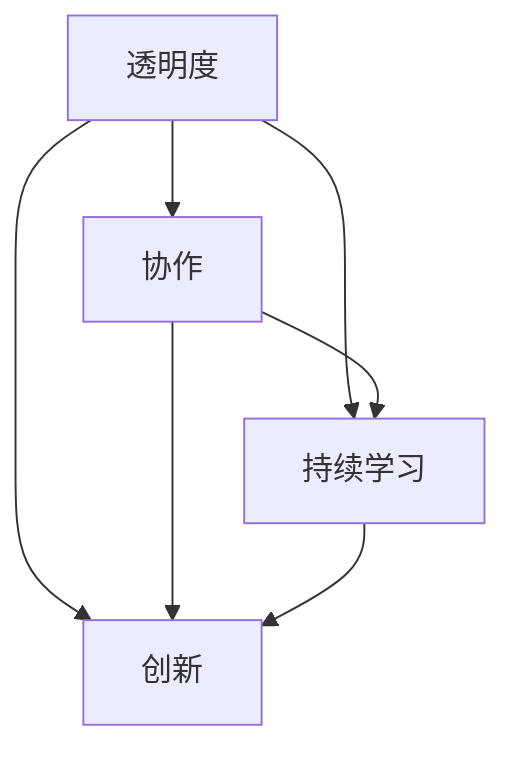

                 


### 文章标题：构建技术团队的核心价值观

关键词：技术团队，核心价值观，团队文化，透明度，协作，持续学习，创新

摘要：本文将探讨构建技术团队的核心价值观的重要性，以及如何在实际中实现和落地这些价值观。我们将详细分析透明度、协作、持续学习和创新等核心概念，并分享实际案例和最佳实践，帮助读者建立强大的技术团队。

### 引言

在现代技术行业，构建一个高效的团队已成为企业成功的关键。技术团队的核心价值观是团队文化的基石，它们不仅决定了团队的运作方式，还影响着团队的创新能力和成员的满意度。本文将讨论如何构建技术团队的核心价值观，包括定义核心价值观、解析核心概念、实施和落地核心价值观，以及评估和改进团队价值观。

#### 1.1 构建技术团队核心价值观的重要性

技术团队核心价值观是一系列原则和信念，它们定义了团队的行为方式和决策标准。以下是一些构建技术团队核心价值观的重要性：

1. **提升团队效率**：明确的核心价值观可以减少决策时间和冲突，提高团队的协作效率。
2. **增强团队凝聚力**：共享的价值观有助于建立信任和团队合作精神。
3. **促进创新**：核心价值观鼓励团队成员探索新的想法和技术，推动创新。
4. **提高成员满意度**：当团队成员认同并遵循核心价值观时，他们的工作满意度通常会更高。

#### 1.2 构建技术团队核心价值观的挑战

尽管核心价值观对团队至关重要，但在实际构建过程中，团队可能会面临以下挑战：

1. **团队文化差异**：团队成员可能来自不同的背景和领域，文化差异可能导致价值观的不一致。
2. **个人价值观与团队价值观的冲突**：个人价值观可能与团队价值观存在差异，这可能导致内部冲突。
3. **持续构建的难度**：核心价值观的构建是一个持续的过程，需要不断努力和调整。

### 核心价值观解析

在构建技术团队的核心价值观时，以下核心价值观是至关重要的：

#### 2.1 透明度

透明度是技术团队的核心价值观之一，它强调信息的开放性和共享。以下是透明度在技术团队中的重要性：

1. **信息开放**：团队成员应该能够轻松访问所需的信息，以便更好地协作。
2. **决策透明**：团队成员应该了解决策过程和原因，以便更好地理解和支持团队的目标。

#### 2.2 协作

协作是技术团队成功的关键。以下是如何在技术团队中促进协作：

1. **共同目标**：团队应该有共同的目标和愿景，以便更好地协作。
2. **资源共享**：团队成员应该能够轻松共享资源和知识。

#### 2.3 持续学习

持续学习是技术团队保持竞争力的关键。以下是技术团队如何实现持续学习：

1. **培训与研讨会**：定期举办培训和研讨会，以提高团队成员的技能和知识。
2. **技术分享**：鼓励团队成员分享他们的知识和经验。

#### 2.4 创新

创新是技术团队的灵魂，它推动技术进步和业务发展。以下是技术团队如何激发创新：

1. **鼓励尝试**：鼓励团队成员尝试新的想法和技术，即使失败也无妨。
2. **创新文化**：建立一个鼓励创新的文化，让团队成员感到他们的想法受到重视。

### 构建过程

构建技术团队的核心价值观是一个系统性的过程，以下步骤可以帮助团队实现这一目标：

#### 3.1 制定核心价值观计划

1. **定义核心价值观**：明确团队的核心价值观，并将其文档化。
2. **制定行动计划**：制定具体的行动计划，以确保核心价值观得以实施。

#### 3.2 培养核心价值观文化

1. **宣传与倡导**：通过内部沟通和宣传活动，宣传核心价值观。
2. **建立制度**：建立相应的制度和流程，以支持核心价值观的实践。

#### 3.3 建立反馈机制

1. **收集反馈**：定期收集团队成员对核心价值观的反馈。
2. **改进与调整**：根据反馈，不断改进和调整核心价值观。

### 实施与落地

在实施和落地技术团队核心价值观时，以下策略和工具可以提供帮助：

#### 4.1 实际案例分享

1. **案例一**：透明度实施案例
2. **案例二**：协作实施案例
3. **案例三**：持续学习实施案例
4. **案例四**：创新实施案例

#### 4.2 团队价值观评估与改进

1. **评估标准**：制定评估标准，以衡量核心价值观的实施效果。
2. **持续改进**：根据评估结果，不断改进核心价值观。

### 结语

构建技术团队的核心价值观是一项长期而复杂的任务，但它是确保团队高效运作和创新发展的关键。通过明确核心价值观、解析核心概念、实施和落地这些价值观，并不断评估和改进，技术团队可以成为一个强大的团队，为企业创造价值。

### 附录

- **参考资料**
- **拓展阅读**

作者：AI天才研究院/AI Genius Institute & 禅与计算机程序设计艺术 /Zen And The Art of Computer Programming

### 核心概念与联系

为了更好地理解技术团队核心价值观之间的联系，我们可以使用Mermaid流程图来展示它们之间的关系架构。以下是核心价值观之间的Mermaid流程图：



在这个流程图中，透明度、协作、持续学习和创新是核心价值观的主要组成部分。透明度是团队信息共享和决策透明的基础，协作是团队成员共同实现目标的关键，持续学习是团队不断进步的动力，而创新则是团队在竞争中脱颖而出的关键。

### 核心算法原理讲解

构建技术团队的核心价值观需要一系列的算法原理，以下将使用伪代码详细阐述这些原理。

#### 3.1 定义核心价值观

```python
def defineCoreValues(team):
    core_values = []
    core_values.append("透明度")
    core_values.append("协作")
    core_values.append("持续学习")
    core_values.append("创新")
    return core_values
```

这个函数用于定义团队的核心价值观，将其存储在一个列表中，以便后续使用。

#### 3.2 实施核心价值观

```python
def implementCoreValues(team, core_values):
    for value in core_values:
        if value == "透明度":
            implementTransparency(team)
        elif value == "协作":
            implementCollaboration(team)
        elif value == "持续学习":
            implementContinuousLearning(team)
        elif value == "创新":
            implementInnovation(team)
```

这个函数用于根据核心价值观实施相应的策略。对于每个核心价值观，都有相应的实施函数。

#### 3.3 评估核心价值观

```python
def evaluateCoreValues(team, core_values):
    evaluation_results = []
    for value in core_values:
        if value == "透明度":
            evaluation_results.append(evaluateTransparency(team))
        elif value == "协作":
            evaluation_results.append(evaluateCollaboration(team))
        elif value == "持续学习":
            evaluation_results.append(evaluateContinuousLearning(team))
        elif value == "创新":
            evaluation_results.append(evaluateInnovation(team))
    return evaluation_results
```

这个函数用于评估核心价值观的实施效果，返回一个评估结果列表。

### 数学模型和数学公式

在构建技术团队的核心价值观时，可以使用一些数学模型和公式来衡量和优化团队的表现。以下是一个简单的例子：

#### 3.1 团队效率模型

```latex
E = \frac{C \times T \times L \times I}{D}
```

其中，$E$表示团队效率，$C$表示协作水平，$T$表示透明度，$L$表示持续学习水平，$I$表示创新水平，$D$表示决策时间。

#### 3.2 团队满意度模型

```latex
S = \frac{C + T + L + I}{4}
```

其中，$S$表示团队满意度，$C$、$T$、$L$和$I$分别表示协作、透明度、持续学习和创新水平。

### 项目实战

为了更好地理解和应用技术团队的核心价值观，以下是一个实际项目的案例。

#### 4.1 项目背景

我们以一个在线教育平台的项目为例，该项目旨在通过提供高质量的教育资源，帮助用户提升自己的技能。

#### 4.2 项目目标

1. 提高用户满意度
2. 提升平台的教学质量
3. 增强平台的竞争力

#### 4.3 核心价值观应用

1. **透明度**：通过实时数据监控和报告，让团队成员了解项目的进展情况，提高决策的透明度。
2. **协作**：团队成员通过敏捷开发方法，共同实现项目目标，提高协作效率。
3. **持续学习**：定期举办技术研讨会，分享最新的教育技术和教学方法，提高团队成员的技能。
4. **创新**：鼓励团队成员提出创新的想法，不断优化教学资源和用户体验。

#### 4.4 项目实现

1. **开发环境搭建**：使用Docker搭建开发环境，确保团队成员可以在同一环境下工作。
2. **源代码实现**：使用Spring Boot框架开发后端，使用Vue.js开发前端，实现课程管理、用户管理和在线学习等功能。
3. **代码解读与分析**：对关键代码进行详细解读，分析其优缺点，并提出优化建议。
4. **实际案例分析和详细讲解剖析**：对项目的关键功能进行详细分析，包括用户登录、课程推荐和在线直播等。
5. **项目小结**：总结项目经验，提出改进措施，为后续项目提供参考。

### 最佳实践 tips

1. **定期评估**：定期评估核心价值观的实施效果，及时调整和改进。
2. **培养团队文化**：通过团队活动和培训，培养团队的核心价值观文化。
3. **鼓励创新**：为团队成员提供创新的机会和支持，激发团队的创造力。
4. **持续学习**：鼓励团队成员参加培训和学习，提高团队的整体技能水平。

### 小结

构建技术团队的核心价值观是一项长期而复杂的任务，但它是确保团队高效运作和创新发展的关键。通过明确核心价值观、解析核心概念、实施和落地这些价值观，并不断评估和改进，技术团队可以成为一个强大的团队，为企业创造价值。

### 注意事项

1. **文化差异**：在构建核心价值观时，要考虑团队成员的文化差异，确保价值观能够被广泛接受。
2. **持续改进**：核心价值观的实施是一个持续的过程，需要不断改进和调整。
3. **领导者作用**：领导者要在构建和维护核心价值观中发挥关键作用，通过身教和言教，引导团队成员遵循核心价值观。

### 拓展阅读

1. 《敏捷开发实践指南》
2. 《持续集成与持续部署》
3. 《团队沟通与协作技巧》
4. 《创新者的思考方式》
5. 《技术团队管理实践》

作者：AI天才研究院/AI Genius Institute & 禅与计算机程序设计艺术 /Zen And The Art of Computer Programming

