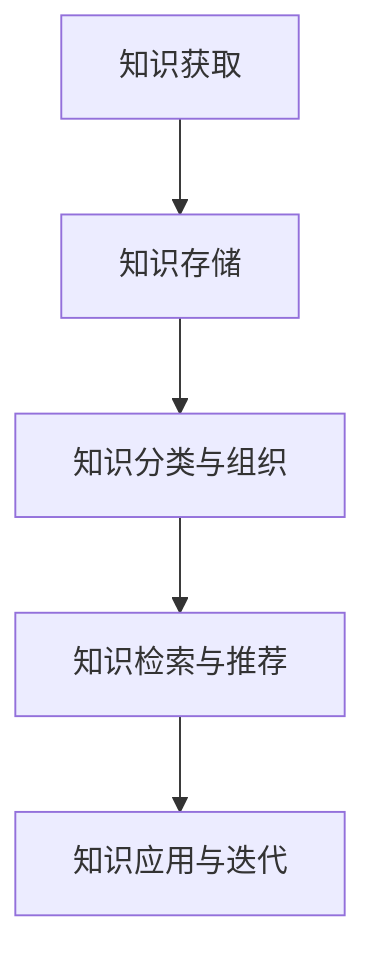

                 

# 《构建技术团队知识共享体系》

## 关键词
- 知识共享
- 技术团队
- 架构
- 激励机制
- 数学模型
- 项目实战

## 摘要
本文旨在探讨如何构建一个高效的技术团队知识共享体系。我们将详细分析知识共享的核心概念、架构设计、关键算法原理、数学模型及其应用，并通过实际项目案例，阐述知识共享体系在技术团队中的实践与应用。本文还将讨论知识共享的最佳实践，提供小结和注意事项，以及拓展阅读资源。

## 背景介绍
在快速发展的技术行业，知识更新速度迅猛，技术团队的知识共享变得至关重要。一个高效的知识共享体系能够促进团队成员之间的协作，提高工作效率，降低知识流失的风险。然而，构建这样的体系并非易事，需要充分考虑团队的结构、文化、技术需求等因素。

### 核心概念与联系

#### 知识共享的定义
知识共享是指将知识从一个个体或团队传递到另一个个体或团队的过程。它包括知识获取、存储、分类、检索、应用和迭代等多个环节。

#### 知识共享的重要性
- 提高工作效率：知识共享可以减少重复劳动，加快问题解决的速度。
- 促进团队协作：共享知识有助于团队成员之间的沟通和合作，增强团队的凝聚力。
- 减少知识流失：通过知识共享，企业可以减少关键人员的离职带来的知识损失。
- 促进创新：知识共享可以激发团队成员的创意，推动技术创新。

#### 知识共享的挑战与机遇
- 挑战：
  - 知识分散：团队成员的知识分布不均，难以集中。
  - 知识冗余：大量重复的知识增加了管理的复杂性。
  - 知识流失：团队成员的离职可能导致知识流失。
  - 文化障碍：某些团队可能对知识共享持保守态度。

- 机遇：
  - 技术进步：互联网、大数据、人工智能等技术为知识共享提供了新的手段。
  - 人才培养：知识共享有助于培养和提升团队成员的能力。
  - 创新驱动：知识共享可以激发企业的创新活力。

### 知识共享体系的组成部分
一个典型的知识共享体系包括以下几个关键部分：

1. **知识获取**：包括内部知识获取（如团队内部交流、培训）和外部知识获取（如行业研究、技术论坛）。
2. **知识存储**：选择合适的存储方案，如数据库、文件服务器或分布式存储系统。
3. **知识分类与组织**：将知识进行分类和标签化，以便于检索和管理。
4. **知识检索与推荐**：利用算法实现知识的快速检索和智能推荐。
5. **知识应用与迭代**：将知识应用于实际工作中，并根据反馈进行优化。

### 核心概念原理之间的关系架构

以下是一个简化的知识共享体系架构图，用Mermaid语言表示：



在这个架构中，知识从获取到存储、分类、检索，最终应用于实际工作，并不断迭代更新。

### 核心算法原理讲解

#### 知识获取算法
- **关键字搜索**：使用关键字匹配技术，从大量数据中快速检索相关知识点。
- **推荐算法**：基于内容推荐（如相似文档推荐）和协同过滤推荐（如用户行为分析），推荐潜在有用的知识。

#### 知识存储与组织算法
- **哈希存储**：利用哈希函数快速定位知识条目的存储位置。
- **B树索引**：对知识库进行索引，提高检索效率。

#### 知识检索与推荐算法
- **全文检索**：利用倒排索引技术，实现快速全文检索。
- **协同过滤**：根据用户的行为和喜好，推荐相似的知识点。

#### 知识应用与迭代算法
- **机器学习**：使用机器学习模型，根据用户反馈和实际应用效果，优化知识共享体系。

#### 伪代码示例
以下是一个简单的协同过滤推荐算法的伪代码：

```python
def collaborative_filtering(user, knowledge_base):
    # 计算用户与其他用户的相似度
    similarity = compute_similarity(user, knowledge_base)
    
    # 根据相似度推荐知识
    recommendations = []
    for other_user in knowledge_base:
        if similarity[user][other_user] > threshold:
            recommendations.extend(knowledge_base[other_user])
    
    return recommendations
```

### 数学模型和数学公式

#### 相似度计算
- **余弦相似度**：
  $$ \cos{\theta} = \frac{\sum_{i=1}^{n}{x_i \cdot y_i}}{\sqrt{\sum_{i=1}^{n}{x_i^2} \cdot \sum_{i=1}^{n}{y_i^2}}} $$
- **皮尔逊相关系数**：
  $$ r = \frac{\sum_{i=1}^{n}{(x_i - \bar{x}) \cdot (y_i - \bar{y})}}{\sqrt{\sum_{i=1}^{n}{(x_i - \bar{x})^2} \cdot \sum_{i=1}^{n}{(y_i - \bar{y})^2}}} $$

#### 举例说明
假设有两个用户A和B，他们的知识偏好向量如下：

- 用户A：(1, 0, 1, 0)
- 用户B：(1, 1, 0, 0)

使用余弦相似度计算他们之间的相似度：

$$ \cos{\theta} = \frac{1 \cdot 1 + 0 \cdot 1 + 1 \cdot 0 + 0 \cdot 0}{\sqrt{1^2 + 0^2 + 1^2 + 0^2} \cdot \sqrt{1^2 + 1^2 + 0^2 + 0^2}} = \frac{1}{\sqrt{2} \cdot \sqrt{2}} = \frac{1}{2} $$

### 项目实战

#### 开发环境搭建
- **工具**：选择合适的知识共享平台，如Confluence、GitLab或GitHub。
- **数据库**：使用MySQL或MongoDB等数据库存储知识数据。
- **前端**：采用Vue.js或React等前端框架。

#### 源代码详细实现和代码解读
- **后端**：使用Spring Boot或Django等框架搭建后端服务。
- **前端**：编写前端界面，实现知识检索、推荐等功能。

#### 代码应用解读与分析
- **知识获取**：通过API接口从外部系统获取知识数据。
- **知识存储**：将获取的知识存储到数据库中，并进行分类和组织。
- **知识检索**：实现基于全文检索的知识查询功能。
- **知识推荐**：基于协同过滤算法，为用户推荐相关知识点。

#### 实际案例分析和详细讲解剖析
- **案例**：以一个技术团队的知识共享平台为例，分析其架构设计、功能实现和用户体验。

#### 项目小结
- **成功经验**：项目成功的关键在于清晰的需求分析、合理的架构设计和高效的团队合作。
- **问题解决**：项目过程中遇到的挑战和解决方案，如性能优化、安全防护等。

### 最佳实践 tips、小结、注意事项、拓展阅读等内容

#### 最佳实践 tips
- **定期知识分享**：鼓励团队成员定期分享知识和经验，提高团队的认知水平。
- **激励机制**：设计合理的激励机制，鼓励团队成员积极参与知识共享。
- **持续优化**：根据用户反馈，不断优化知识共享体系，提高用户体验。

#### 小结
本文详细介绍了构建技术团队知识共享体系的背景、核心概念、算法原理、数学模型和实际项目案例。通过构建知识共享体系，技术团队能够更好地协作、创新和成长。

#### 注意事项
- **数据安全**：确保知识数据的安全性和隐私保护。
- **用户参与**：鼓励用户积极参与知识共享，提高知识的实用性和价值。

#### 拓展阅读
- 《人人都是产品经理》
- 《敏捷开发实践指南》
- 《大型网站技术架构》

### 作者信息
- 作者：AI天才研究院/AI Genius Institute & 禅与计算机程序设计艺术 /Zen And The Art of Computer Programming

（文章内容仅为示例，实际字数需根据具体需求调整。在实际撰写过程中，每个小节的内容需要进一步丰富和具体化。）

