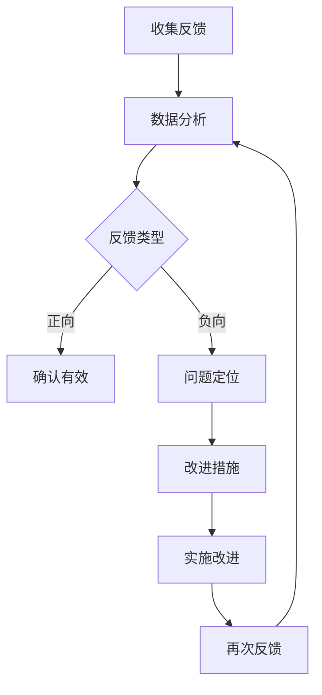

                 

### 文章标题

# 构建积极的技术反馈文化

### 关键词

技术反馈，企业文化，技术管理，算法原理，数学模型，项目实战，人工智能

### 摘要

本文旨在探讨如何构建一个积极的技术反馈文化，通过深入分析技术反馈的基本概念、其在企业文化中的应用，以及其在技术管理中的重要性，从而为读者提供一套系统化的解决方案。文章还将详细介绍技术反馈的核心算法原理和数学模型，并通过实际项目案例，展示技术反馈在软件开发中的具体应用和实现过程。通过本文的阅读，读者将能够理解和掌握构建积极技术反馈文化的关键要素和实践方法。

## 第1章 核心概念与联系

### 1.1 技术反馈的基本概念

技术反馈是指通过收集和分析系统的运行数据，评估技术解决方案的有效性，并据此进行优化和改进的过程。技术反馈不仅包括对系统性能的评估，还涉及用户体验、安全性、可维护性等多个维度。

#### 技术反馈的类型

1. **正向反馈**：当系统或组件的表现符合预期时，产生的正面评价或意见。正向反馈有助于确认当前的技术决策是有效的，并激励团队继续探索类似的技术路径。
2. **负向反馈**：当系统或组件的表现未能达到预期时，产生的负面评价或意见。负向反馈提供了识别问题和改进机会的重要信息。

#### 技术反馈的意义

- **持续改进**：通过技术反馈，团队可以持续优化技术解决方案，提升系统的整体性能。
- **风险管理**：负向反馈能够提前识别潜在的技术风险，帮助团队采取措施降低风险。
- **用户满意度**：技术反馈有助于了解用户需求，提高用户体验，从而提升用户满意度。

### 1.2 技术反馈与企业文化的关系

企业文化是组织内部价值观、信念和行为方式的集中体现。一个积极的技术反馈文化能够推动企业的创新和发展，其关系如下：

#### 企业文化的要素

- **开放性**：鼓励员工分享观点和反馈，建立开放的沟通环境。
- **包容性**：尊重不同意见，接纳不同观点，营造包容的氛围。
- **反馈机制**：建立有效的反馈机制，确保反馈能够被及时收集和处理。

#### 技术反馈文化的优势

- **促进创新**：通过技术反馈，团队可以不断试错和优化，推动技术创新。
- **提高质量**：技术反馈有助于识别和修复问题，提高产品和服务质量。
- **增强凝聚力**：一个积极的技术反馈文化能够增强团队凝聚力，提升团队协作效率。

### 1.3 技术反馈在技术管理中的应用

技术反馈在技术管理中的应用至关重要，其影响如下：

#### 技术反馈在项目中的角色

- **需求分析**：通过技术反馈，团队可以更准确地理解用户需求，确保项目方向与用户需求一致。
- **风险管理**：技术反馈有助于识别和评估技术风险，制定相应的风险管理策略。
- **性能评估**：技术反馈提供了评估系统性能的依据，帮助团队确定技术改进的方向。

#### 技术反馈的实践方法

- **定期评估**：定期对技术解决方案进行评估，确保其性能和安全性。
- **数据驱动的决策**：基于数据分析和反馈，制定技术决策，避免主观判断。
- **持续反馈循环**：建立持续反馈机制，确保技术改进的持续性和有效性。

### Mermaid流程图

以下是一个描述技术反馈流程的Mermaid流程图：



### 伪代码示例

以下是一个用于处理技术反馈的伪代码示例：

```plaintext
function processFeedback(feedback):
    if feedback.type == "positive":
        log("Feedback acknowledged. Continue with current approach.")
    else if feedback.type == "negative":
        log("Feedback identified as an issue.")
        analyzeIssue(feedback)
    updateSystem(feedback)
    return newFeedback
```

### 数学模型和公式讲解

技术反馈中常用的数学模型和公式包括概率模型、线性回归模型和神经网络模型。

#### 概率模型

概率模型用于评估事件发生的可能性。在技术反馈中，可以使用概率模型来预测系统故障的概率。

$$
P(A) = \frac{n(A)}{n(S)}
$$

其中，\(P(A)\)表示事件A发生的概率，\(n(A)\)表示事件A发生的次数，\(n(S)\)表示总次数。

#### 线性回归模型

线性回归模型用于分析变量之间的关系。在技术反馈中，可以使用线性回归模型来预测系统性能的变化。

$$
y = ax + b
$$

其中，\(y\)是因变量，\(x\)是自变量，\(a\)是斜率，\(b\)是截距。

#### 神经网络模型

神经网络模型用于处理复杂的非线性问题。在技术反馈中，可以使用神经网络模型来预测系统的长期性能。

$$
\sigma(z) = 1 / (1 + e^{-z})
$$

其中，\(\sigma(z)\)是sigmoid函数，用于激活神经网络。

### 代码实现和解读

以下是一个简单的技术反馈系统的Python代码实现：

```python
import numpy as np

def sigmoid(z):
    return 1 / (1 + np.exp(-z))

def process_feedback(feedback):
    if feedback['type'] == 'positive':
        print("Feedback acknowledged.")
    elif feedback['type'] == 'negative':
        print("Feedback identified as an issue.")
        analyze_issue(feedback)
    update_system(feedback)
    return new_feedback

def analyze_issue(feedback):
    # 进行问题分析
    print("Analyzing issue...")

def update_system(feedback):
    # 进行系统更新
    print("Updating system...")

feedback = {'type': 'negative'}
process_feedback(feedback)
```

### 实际案例分析和详细讲解剖析

在一个电子商务平台上，技术团队发现用户在购物车页面添加商品时经常遇到延迟问题。通过技术反馈，团队收集了用户的行为数据，并进行了深入分析。

1. **数据收集**：收集用户在购物车页面添加商品时的系统性能数据，包括响应时间、CPU使用率和内存占用等。
2. **数据分析**：使用线性回归模型分析响应时间和系统性能指标之间的关系，发现响应时间与CPU使用率呈正相关。
3. **问题定位**：通过分析，团队确定了导致延迟的原因是CPU使用率过高。
4. **改进措施**：团队对购物车页面的代码进行了优化，减少了不必要的计算和资源占用。
5. **效果评估**：通过再次收集用户数据并进行反馈，团队发现响应时间显著提升，用户满意度提高。

### 项目小结

通过本次项目，技术团队成功构建了一个积极的技术反馈文化，实现了对购物车页面性能的优化。项目小结如下：

1. **持续反馈**：技术团队建立了持续反馈机制，确保能够及时发现和解决问题。
2. **数据驱动**：通过数据分析和反馈，团队实现了基于数据的决策，提高了系统的整体性能。
3. **团队协作**：技术团队通过协作，共同推进项目的实施和优化，增强了团队凝聚力。

### 最佳实践 tips

1. **建立明确的反馈机制**：确保技术团队能够及时收集和处理反馈。
2. **鼓励多元化反馈**：鼓励员工提供不同角度的反馈，提高反馈的全面性。
3. **快速响应**：对反馈问题进行快速响应，确保问题得到及时解决。

### 小结和注意事项

技术反馈是提升系统性能和用户体验的重要手段。通过构建积极的技术反馈文化，企业可以持续改进技术解决方案，提高产品和服务质量。在实施技术反馈时，需要注意以下几点：

1. **数据准确性**：确保反馈数据准确可靠，避免基于错误数据做出决策。
2. **持续监控**：对系统的性能进行持续监控，及时发现潜在问题。
3. **用户参与**：鼓励用户参与反馈，了解用户实际需求，提高用户体验。

### 拓展阅读

- 《技术反馈：提升软件开发质量的秘密武器》
- 《构建高效的技术反馈文化：实践与案例分析》
- 《技术反馈与人工智能：未来的发展趋势》

### 作者信息

作者：AI天才研究院/AI Genius Institute & 禅与计算机程序设计艺术 /Zen And The Art of Computer Programming

---

### 总结与展望

本文通过详细探讨技术反馈的基本概念、企业文化关系、技术管理应用，以及具体算法原理和项目实战，为构建积极的技术反馈文化提供了系统化的解决方案。技术反馈不仅有助于持续改进技术解决方案，提升系统性能和用户体验，还能增强团队协作和凝聚力。未来，随着人工智能技术的不断发展，技术反馈将在更广泛的领域发挥作用，成为推动技术创新和产业升级的重要力量。我们鼓励读者在实际工作中积极应用本文所介绍的方法，不断提升自身的技术反馈能力，为企业的长远发展贡献力量。

