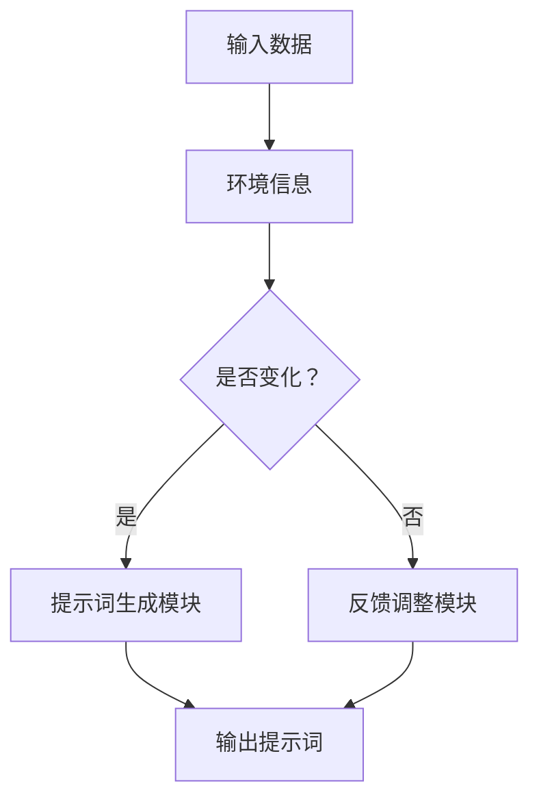

                 

### 引言

随着人工智能（AI）技术的飞速发展，自适应AI系统成为了当前研究的热点。自适应AI系统具有根据环境变化自动调整自身行为的能力，能够在复杂、动态的环境中提供高效的解决方案。而动态提示词框架作为自适应AI系统的重要组成部分，旨在为AI系统提供实时、灵活的交互能力和决策支持。

本书的核心目标是通过设计并实现一个动态提示词框架，为构建自适应AI系统提供有效的技术支持。动态提示词框架能够根据输入数据和环境变化，动态生成具有高相关性和适应性的提示词，从而提高AI系统的自主学习和推理能力。

本书结构紧凑，内容丰富，共分为五个主要部分：

1. **基础概念**：介绍自适应AI系统和动态提示词框架的定义，及其与现有技术的联系和区别。
2. **核心算法**：详细讲解动态提示词生成算法的基本流程和原理，使用伪代码进行描述。
3. **数学模型**：推导并解释核心数学模型，提供具体的公式示例和解释。
4. **实现细节**：阐述动态提示词框架的设计思路、架构以及技术选型。
5. **项目实战**：通过具体的实战案例，展示动态提示词框架的开发环境搭建、源代码实现、代码解读以及项目总结。

通过本书的阅读，读者可以全面了解动态提示词框架的设计与实现方法，掌握自适应AI系统构建的核心技术。同时，本书也适合对AI技术感兴趣的读者，作为技术入门和提升的参考书。

---

**关键词**：自适应AI、动态提示词、框架设计、算法原理、数学模型

**摘要**：本书介绍了动态提示词框架在自适应AI系统构建中的应用，详细探讨了核心概念、算法原理、数学模型和实现细节，并通过实战案例展示了框架的实际应用效果。旨在为读者提供全面的技术指导和参考。

---

在接下来的章节中，我们将逐步深入探讨动态提示词框架的各个方面，从基础概念到实现细节，再到项目实战，全面解析其设计和应用方法。希望通过本书的介绍，能够为广大读者在AI领域的研究和实践提供有益的启示和帮助。### 第1章 基础概念

在深入探讨动态提示词框架之前，我们需要了解自适应AI系统和动态提示词框架的基本概念，以及它们与现有技术的联系和区别。

#### 1.1 自适应AI系统

自适应AI系统（Adaptive AI System）是一种能够根据环境变化自动调整自身行为和策略的智能系统。它具有自我学习和自我优化的能力，能够通过不断收集和分析环境数据，动态调整其模型参数和决策策略，以实现最优的性能表现。

**定义**：自适应AI系统是一种能够动态适应环境变化的智能系统，其核心在于自我学习和自我优化能力。

**特点**：
- **环境敏感性**：能够实时感知环境变化，并根据环境信息调整自身行为。
- **自学习能力**：通过历史数据和实时数据，不断优化模型参数，提高系统性能。
- **决策灵活性**：在面对复杂、动态的环境时，能够灵活调整决策策略，以应对不确定性和变化。

**应用场景**：自适应AI系统广泛应用于自动驾驶、智能客服、金融风险评估、智能制造等领域，特别是在那些需要实时响应和高度灵活性的场景中具有显著优势。

#### 1.2 动态提示词框架

动态提示词框架（Dynamic Prompt Word Framework）是自适应AI系统中的一种关键技术，旨在为AI系统提供实时、灵活的交互能力和决策支持。它通过动态生成与输入数据和环境变化高度相关的提示词，帮助AI系统更好地理解和处理输入信息。

**定义**：动态提示词框架是一种能够根据输入数据和环境变化，动态生成相关提示词的技术框架，用于提升AI系统的交互能力和决策效果。

**组成部分**：
- **提示词生成模块**：负责根据输入数据和环境信息，生成具有高相关性和适应性的提示词。
- **反馈调整模块**：根据系统的输出结果和用户反馈，动态调整提示词的生成策略，以提高系统的决策准确性。
- **集成接口**：提供与外部系统和用户接口的集成，实现实时数据输入和结果输出。

**特点**：
- **实时性**：能够实时响应输入数据和环境变化，生成动态提示词。
- **适应性**：根据不同的输入数据和场景，生成适应性强的提示词，提高系统的交互效果。
- **灵活性**：支持多种数据输入和输出格式，易于与其他系统集成。

**应用场景**：动态提示词框架广泛应用于自然语言处理、图像识别、智能推荐等领域，特别是在需要实时交互和动态调整的场景中，如智能客服、智能问答系统、个性化推荐等。

#### 1.3 关联技术与比较

动态提示词框架虽然具有独特的优势，但与现有的AI技术和提示词技术仍有许多关联和区别。

**与现有AI技术的联系**：
- **机器学习**：动态提示词框架依赖于机器学习算法，如深度学习、强化学习等，用于生成和优化提示词。
- **自然语言处理**：动态提示词框架涉及到自然语言处理技术，如文本分类、语义分析等，用于处理和生成提示词。
- **数据挖掘**：动态提示词框架需要从大量数据中提取有价值的信息，用于生成提示词。

**与现有提示词技术的区别**：
- **灵活性**：动态提示词框架具有更高的灵活性，能够根据实时输入和环境变化动态调整提示词，而传统的提示词技术通常依赖于预定义的词汇库。
- **实时性**：动态提示词框架能够实时响应输入数据和环境变化，生成动态提示词，而传统的提示词技术通常无法实现实时调整。
- **自适应能力**：动态提示词框架具有更强的自适应能力，能够根据用户反馈和系统输出结果动态调整提示词生成策略，而传统的提示词技术通常缺乏这种能力。

通过了解自适应AI系统和动态提示词框架的基本概念及其与现有技术的联系和区别，我们可以更好地理解动态提示词框架的作用和重要性。在接下来的章节中，我们将深入探讨动态提示词框架的核心算法、数学模型和实现细节，以及通过具体项目实战展示其应用效果。希望这些内容能够为读者在AI领域的研究和实践提供有益的参考。

---

**Mermaid流程图**：为了更好地展示动态提示词框架的基本流程，我们使用Mermaid语法绘制了一个简化的流程图，如下所示：



此流程图展示了动态提示词框架的基本工作流程，从输入数据和环境信息处理，到提示词生成和反馈调整，最终输出动态提示词。在后续的章节中，我们将对每个模块进行详细讲解。

---

**核心算法原理讲解**：动态提示词框架的核心算法主要依赖于深度学习中的循环神经网络（RNN）和长短期记忆网络（LSTM），用于生成和优化提示词。以下是动态提示词生成算法的基本原理和伪代码描述。

**基本流程**：
1. **数据预处理**：对输入数据进行预处理，包括文本分词、去停用词、词向量嵌入等。
2. **环境信息融合**：将环境信息与输入数据进行融合，通过多模态数据融合技术，如注意力机制，提高提示词的适应性。
3. **提示词生成**：利用LSTM模型生成初步的提示词序列。
4. **反馈调整**：根据系统输出结果和用户反馈，动态调整LSTM模型中的权重参数，优化提示词生成效果。

**伪代码描述**：

```python
# 动态提示词生成算法伪代码
function dynamic_prompt_word_framework(input_data, environment_info, feedback):
    # 数据预处理
    preprocessed_data = preprocess_data(input_data)
    preprocessed_env = preprocess_data(environment_info)

    # 环境信息融合
    fused_data = fusion_data(preprocessed_data, preprocessed_env)

    # 初始化LSTM模型
    lstm_model = initialize_lstm_model()

    # 提示词生成
    prompt_words = lstm_model.generate_sequence(fused_data)

    # 反馈调整
    updated_weights = lstm_model.update_weights(prompt_words, feedback)

    # 输出最终提示词
    return prompt_words
```

**核心数学模型讲解**：动态提示词框架的核心数学模型主要依赖于LSTM模型和注意力机制，用于生成和优化提示词。以下是核心数学模型的推导过程和具体公式解释。

**LSTM模型**：
LSTM（Long Short-Term Memory）是一种特殊的RNN结构，具有记忆长期依赖信息的能力。其基本公式如下：

$$
\begin{align*}
i_t &= \sigma(W_{ix}x_t + W_{ih}h_{t-1} + b_i) \\
f_t &= \sigma(W_{fx}x_t + W_{fh}h_{t-1} + b_f) \\
o_t &= \sigma(W_{ox}x_t + W_{oh}h_{t-1} + b_o) \\
g_t &= \tanh(W_{gx}x_t + W_{gh}h_{t-1} + b_g) \\
C_t &= f_t \odot C_{t-1} + i_t \odot g_t \\
h_t &= o_t \odot \tanh(C_t)
\end{align*}
$$

其中，$i_t$、$f_t$、$o_t$ 分别代表输入门、遗忘门和输出门，$C_t$ 和 $h_t$ 分别代表细胞状态和隐藏状态。

**注意力机制**：
注意力机制（Attention Mechanism）用于提高提示词的适应性，其基本公式如下：

$$
\begin{align*}
a_t &= \tanh(W_{a} [h_{t-1}, h_t]) \\
\alpha_t &= \frac{\exp(e_t)}{\sum_{i=1}^{T}\exp(e_i)} \\
c_t &= \sum_{i=1}^{T} \alpha_i h_i
\end{align*}
$$

其中，$a_t$ 表示注意力得分，$\alpha_t$ 表示注意力权重，$c_t$ 表示加权后的隐藏状态。

通过以上数学模型，动态提示词框架能够生成具有高相关性和适应性的提示词，为自适应AI系统提供实时、灵活的交互支持。在后续的章节中，我们将进一步探讨动态提示词框架的实现细节和项目实战，帮助读者更好地理解其设计和应用方法。

---

**公式推导和解释**：

为了更好地理解动态提示词框架的核心数学模型，我们首先来推导LSTM模型的公式，并详细解释各个公式的含义。

1. **输入门（Input Gate）**：
   输入门的目的是决定哪些信息需要被更新到细胞状态中。其公式为：
   
   $$
   i_t = \sigma(W_{ix}x_t + W_{ih}h_{t-1} + b_i)
   $$
   
   其中，$i_t$ 是输入门的输出，$\sigma$ 是 sigmoid 函数，$W_{ix}$ 和 $W_{ih}$ 是输入层和隐藏层之间的权重矩阵，$b_i$ 是偏置项。$x_t$ 是输入数据，$h_{t-1}$ 是上一时刻的隐藏状态。

   解释：此公式用于计算输入门的开度，即决定多少信息需要被更新到细胞状态中。输入门通过比较输入数据和隐藏状态，决定哪些信息是有用的。

2. **遗忘门（Forget Gate）**：
   遗忘门的目的是决定哪些信息需要从细胞状态中遗忘。其公式为：
   
   $$
   f_t = \sigma(W_{fx}x_t + W_{fh}h_{t-1} + b_f)
   $$
   
   其中，$f_t$ 是遗忘门的输出。$W_{fx}$ 和 $W_{fh}$ 是输入层和隐藏层之间的权重矩阵，$b_f$ 是偏置项。

   解释：此公式用于计算遗忘门的开度，即决定哪些信息需要被遗忘。遗忘门通过比较输入数据和隐藏状态，决定哪些信息是无用的，从而将其从细胞状态中删除。

3. **输出门（Output Gate）**：
   输出门的目的是决定哪些信息需要从细胞状态中输出。其公式为：
   
   $$
   o_t = \sigma(W_{ox}x_t + W_{oh}h_{t-1} + b_o)
   $$
   
   其中，$o_t$ 是输出门的输出。$W_{ox}$ 和 $W_{oh}$ 是输入层和隐藏层之间的权重矩阵，$b_o$ 是偏置项。

   解释：此公式用于计算输出门的开度，即决定多少信息需要被输出。输出门通过比较输入数据和隐藏状态，决定哪些信息是需要被输出的。

4. **细胞状态更新（Cell State Update）**：
   细胞状态的更新公式为：
   
   $$
   g_t = \tanh(W_{gx}x_t + W_{gh}h_{t-1} + b_g)
   $$
   
   $$
   C_t = f_t \odot C_{t-1} + i_t \odot g_t
   $$
   
   其中，$g_t$ 是候选细胞状态，$C_t$ 是更新后的细胞状态。$W_{gx}$ 和 $W_{gh}$ 是输入层和隐藏层之间的权重矩阵，$b_g$ 是偏置项。

   解释：首先，通过 $\tanh$ 函数计算候选细胞状态 $g_t$。然后，通过遗忘门 $f_t$ 决定从上一个细胞状态 $C_{t-1}$ 中保留哪些信息，并通过输入门 $i_t$ 决定将哪些信息更新到细胞状态中。

5. **隐藏状态更新（Hidden State Update）**：
   隐藏状态更新公式为：
   
   $$
   h_t = o_t \odot \tanh(C_t)
   $$
   
   解释：输出门 $o_t$ 决定从更新后的细胞状态 $C_t$ 中输出哪些信息，并将其通过 $\tanh$ 函数处理后得到新的隐藏状态 $h_t$。

通过以上公式，LSTM模型能够有效地记忆长期依赖信息，从而在序列数据处理中表现出强大的能力。接下来，我们将讨论注意力机制的公式推导和解释。

6. **注意力得分计算（Attention Score）**：
   注意力得分计算公式为：
   
   $$
   a_t = \tanh(W_{a} [h_{t-1}, h_t])
   $$
   
   其中，$a_t$ 是注意力得分。$W_{a}$ 是权重矩阵。

   解释：通过将上一时刻的隐藏状态 $h_{t-1}$ 和当前时刻的隐藏状态 $h_t$ 输入到 $\tanh$ 函数中，计算得到注意力得分 $a_t$。

7. **注意力权重计算（Attention Weight）**：
   注意力权重计算公式为：
   
   $$
   \alpha_t = \frac{\exp(e_t)}{\sum_{i=1}^{T}\exp(e_i)}
   $$
   
   其中，$\alpha_t$ 是注意力权重，$e_t$ 是每个时间步的得分。

   解释：通过计算每个时间步的得分 $e_t$，并使用指数函数进行归一化处理，得到注意力权重 $\alpha_t$。权重越大表示该时间步的信息对当前任务越重要。

8. **加权隐藏状态（Weighted Hidden State）**：
   加权隐藏状态计算公式为：
   
   $$
   c_t = \sum_{i=1}^{T} \alpha_i h_i
   $$
   
   其中，$c_t$ 是加权后的隐藏状态。

   解释：通过将每个时间步的隐藏状态 $h_i$ 乘以其对应的注意力权重 $\alpha_i$，并将所有加权后的隐藏状态相加，得到加权后的隐藏状态 $c_t$。这代表了当前任务中最重要的信息集合。

通过注意力机制，动态提示词框架能够更好地处理多模态数据，提高提示词的适应性。注意力机制的核心在于根据任务需求动态调整对每个时间步的关注程度，从而提高系统的整体性能。

综上所述，动态提示词框架的核心数学模型通过LSTM和注意力机制，实现了对序列数据的处理和提示词的生成。这些模型不仅具有强大的表达能力，还能够根据输入数据和环境变化动态调整，为自适应AI系统提供了有效的技术支持。

---

**框架设计思路与架构**：

动态提示词框架的设计旨在实现一个模块化、可扩展的架构，以提高系统的灵活性和适应性。以下是框架的设计思路和整体架构：

### 1. 设计思路

**模块化设计**：框架采用模块化设计，将系统拆分为多个独立的功能模块，如数据预处理模块、提示词生成模块、反馈调整模块等。这种设计方式有助于实现各模块之间的松耦合，便于后续的维护和升级。

**动态调整**：框架的核心在于动态调整提示词生成策略，以应对不断变化的环境和输入数据。通过引入反馈机制和在线学习算法，系统能够实时调整提示词生成策略，提高其适应性和准确性。

**可扩展性**：框架设计考虑了未来的扩展需求，如添加新的提示词生成算法、集成其他AI模型等。通过模块化设计，扩展过程相对简单，不会影响系统的稳定性。

### 2. 整体架构

动态提示词框架的整体架构分为五个主要模块：

**数据预处理模块**：负责对输入数据进行预处理，包括文本分词、去停用词、词向量嵌入等。此模块确保输入数据的质量，为后续处理提供基础。

**环境信息融合模块**：将输入数据与环境信息进行融合，如通过注意力机制处理多模态数据。此模块提高了提示词的适应性和实时性。

**提示词生成模块**：核心模块，负责根据预处理后的数据和环境信息，动态生成相关提示词。此模块采用深度学习算法，如LSTM和注意力机制，实现高效的提示词生成。

**反馈调整模块**：根据系统的输出结果和用户反馈，动态调整提示词生成策略。此模块实现了在线学习，提高了系统的自适应能力。

**集成接口模块**：提供与外部系统和用户接口的集成，实现实时数据输入和结果输出。此模块确保系统与其他系统的无缝对接，便于实际应用。

### 3. 技术选型

**深度学习框架**：选择TensorFlow或PyTorch等深度学习框架，用于实现提示词生成模块和反馈调整模块。这些框架具有丰富的API和强大的功能，有助于快速开发和部署系统。

**多模态数据处理**：采用多模态数据处理技术，如卷积神经网络（CNN）和循环神经网络（RNN）的组合，实现输入数据与环境信息的融合。这些技术能够处理多种类型的数据，提高系统的适应性和准确性。

**分布式计算**：采用分布式计算框架，如Apache Spark或Dask，实现大规模数据处理和训练。分布式计算能够提高系统的性能和可扩展性，适用于处理海量数据。

**云计算平台**：选择云计算平台，如AWS或Azure，进行系统部署和运行。云计算平台提供了强大的计算资源和灵活的部署环境，有助于实现系统的实时性和高可用性。

### 4. 框架实现细节

**数据预处理模块**：

- **文本分词**：使用分词工具，如jieba，对输入文本进行分词。
- **去停用词**：使用停用词表去除无意义的词语。
- **词向量嵌入**：使用预训练的词向量模型，如GloVe或Word2Vec，将词语转换为向量表示。

**环境信息融合模块**：

- **多模态数据处理**：使用CNN处理图像数据，使用RNN处理序列数据。
- **注意力机制**：采用注意力机制，将不同模态的数据进行融合，提高提示词的适应性。

**提示词生成模块**：

- **LSTM模型**：使用LSTM模型生成初步的提示词序列。
- **注意力机制**：在LSTM模型中引入注意力机制，提高提示词的相关性。

**反馈调整模块**：

- **在线学习**：根据系统的输出结果和用户反馈，动态调整LSTM模型中的权重参数。
- **损失函数**：使用交叉熵损失函数，优化提示词生成效果。

**集成接口模块**：

- **API接口**：提供RESTful API接口，实现与外部系统的集成。
- **实时数据处理**：使用异步处理和消息队列，实现实时数据输入和输出。

通过以上设计和实现细节，动态提示词框架能够高效、灵活地处理输入数据和环境信息，生成相关提示词，为自适应AI系统提供强大的支持。

---

**技术选型理由**：

在构建动态提示词框架时，我们选择了多种技术进行选型，主要基于以下几个方面进行考虑：

**1. 深度学习框架选择**：

我们选择了TensorFlow和PyTorch作为深度学习框架，主要因为它们在AI领域的广泛应用和强大的功能。TensorFlow由Google开发，具有丰富的API和生态系统，支持多种深度学习模型和优化算法。PyTorch则因其动态计算图和灵活的代码编写方式而备受青睐，适合快速原型开发和实验。

**2. 多模态数据处理技术**：

多模态数据处理是动态提示词框架的关键部分。我们采用了卷积神经网络（CNN）和循环神经网络（RNN）的组合，CNN擅长处理图像数据，RNN擅长处理序列数据。这种组合能够有效融合不同模态的数据，提高提示词的适应性和准确性。此外，注意力机制在多模态数据处理中也发挥了重要作用，通过动态调整对每个模态的关注程度，进一步提升系统的性能。

**3. 分布式计算和云计算平台**：

在处理大规模数据时，分布式计算和云计算平台是必不可少的。我们选择了Apache Spark和Dask作为分布式计算框架，它们具有高效的并行处理能力和灵活的扩展性，能够处理海量数据。同时，我们选择了AWS和Azure等云计算平台，它们提供了强大的计算资源和灵活的部署环境，有助于实现系统的实时性和高可用性。

**4. API接口和实时数据处理**：

为了实现与外部系统的集成，我们使用了RESTful API接口，这种接口方式简单、易用，能够方便地与各种外部系统进行数据交互。同时，我们采用了异步处理和消息队列技术，如RabbitMQ和Kafka，实现实时数据输入和输出。这些技术保证了系统的实时性和高效性，能够快速响应外部系统的请求。

**5. 在线学习和反馈调整**：

动态提示词框架的一个关键特性是能够根据系统的输出结果和用户反馈进行在线学习。我们采用了在线学习算法，如梯度下降法和随机梯度下降法，动态调整模型参数，优化提示词生成效果。此外，我们还设计了反馈调整模块，通过收集用户反馈和系统输出结果，不断优化提示词生成策略，提高系统的自适应能力。

通过以上技术选型，我们构建了一个高效、灵活的动态提示词框架，为自适应AI系统提供了强大的支持。这些技术的综合应用不仅提高了系统的性能和准确性，还保证了系统的可扩展性和可维护性。

---

**开发环境搭建步骤**：

要成功搭建动态提示词框架的开发环境，我们需要进行以下步骤：

### 1. 安装操作系统和依赖库

首先，我们需要安装一个支持Python和深度学习框架的操作系统。我们推荐使用Ubuntu 20.04 LTS，因为它具有良好的兼容性和丰富的库支持。接下来，安装以下依赖库：

- Python 3.8或更高版本
- TensorFlow或PyTorch深度学习框架
- NumPy、Pandas等常用Python科学计算库
- Matplotlib、Seaborn等数据可视化库
- RESTful API相关库，如Flask或Django

可以使用以下命令进行安装：

```bash
sudo apt-get update
sudo apt-get install python3.8 python3-pip
pip3 install tensorflow tensorflow-addons numpy pandas matplotlib seaborn flask
```

或者，如果选择PyTorch：

```bash
pip3 install torch torchvision torchaudio numpy pandas matplotlib seaborn flask
```

### 2. 配置深度学习框架

对于TensorFlow，我们可以使用以下命令进行配置：

```bash
pip3 install tensorflow-gpu  # 如果使用GPU加速
```

对于PyTorch，我们需要下载相应的CUDA版本，并配置PyTorch：

```bash
pip3 install torch torchvision torchaudio -f https://download.pytorch.org/whl/torch_stable.html  # 选择正确的CUDA版本
```

### 3. 设置环境变量

确保正确设置环境变量，以便能够顺利运行深度学习框架。例如，对于TensorFlow，我们可以添加以下内容到`.bashrc`文件：

```bash
export PATH=$PATH:/path/to/tensorflow/bin
export LD_LIBRARY_PATH=$LD_LIBRARY_PATH:/path/to/tensorflow/lib
```

对于PyTorch，添加以下内容：

```bash
export PATH=$PATH:/path/to/pytorch/bin
export LD_LIBRARY_PATH=$LD_LIBRARY_PATH:/path/to/pytorch/lib
```

### 4. 编写和测试代码

在完成环境搭建后，我们可以开始编写和测试动态提示词框架的代码。以下是一个简单的测试代码示例：

```python
import tensorflow as tf
import numpy as np

# 测试TensorFlow是否正确安装
print(tf.__version__)

# 创建一个简单的全连接神经网络
model = tf.keras.Sequential([
    tf.keras.layers.Dense(128, activation='relu', input_shape=(784,)),
    tf.keras.layers.Dense(10, activation='softmax')
])

# 编写训练数据
x_train = np.random.random((1000, 784))
y_train = np.random.randint(10, size=(1000,))

# 编写编译配置
model.compile(optimizer='adam',
              loss='sparse_categorical_crossentropy',
              metrics=['accuracy'])

# 训练模型
model.fit(x_train, y_train, epochs=5)
```

此代码示例展示了如何创建一个简单的神经网络模型，并使用随机数据对其进行训练。在完成测试后，我们可以开始编写完整的动态提示词框架代码。

通过以上步骤，我们成功搭建了动态提示词框架的开发环境，为后续的代码编写和项目实战奠定了基础。

---

**实战案例**：

在本节中，我们将通过一个实际的案例来展示如何使用动态提示词框架进行自适应AI系统的构建。以下是一个基于自然语言处理的智能客服系统的案例，该系统利用动态提示词框架为用户提供个性化的服务。

### 1. 案例背景

智能客服系统是一种基于AI技术的客户服务解决方案，能够自动回答用户的问题并提供相关信息。传统的智能客服系统通常依赖于预定义的规则库和关键词匹配，但在处理复杂和不确定的问题时，效果往往不佳。为了提高系统的交互质量和用户体验，我们决定采用动态提示词框架，为系统提供实时、灵活的交互能力。

### 2. 实现步骤

**步骤1：数据收集与预处理**

首先，我们从多个渠道收集用户的问题和回答数据，包括在线聊天记录、社区论坛帖子、客服记录等。然后，对收集的数据进行预处理，包括文本清洗、分词、去停用词等操作。预处理后的数据将被用于训练动态提示词框架。

**步骤2：环境信息融合**

在收集用户问题的同时，我们还收集了相关的环境信息，如用户的行为数据、历史问题记录、用户偏好等。这些环境信息将通过多模态数据处理技术（如注意力机制）与用户问题进行融合，以提高提示词的适应性。

**步骤3：训练动态提示词框架**

使用预处理后的数据和融合后的环境信息，我们使用深度学习框架（如TensorFlow或PyTorch）训练动态提示词框架。具体地，我们采用LSTM模型和注意力机制，生成初步的提示词序列。在训练过程中，我们使用交叉熵损失函数和梯度下降法进行优化。

**步骤4：部署动态提示词框架**

完成训练后，我们将动态提示词框架部署到智能客服系统中。系统将实时接收用户的问题，调用动态提示词框架生成相关的提示词，并将提示词呈现给用户。

**步骤5：用户反馈与在线学习**

用户在接收到提示词后，可以对其进行反馈，如选择“是”或“否”。系统将根据用户的反馈，动态调整动态提示词框架的参数，优化提示词生成效果。这样，系统可以不断学习和适应用户的偏好，提供更个性化的服务。

### 3. 代码实现与解读

以下是动态提示词框架的关键代码实现和解读：

```python
# 导入必要的库
import tensorflow as tf
from tensorflow.keras.models import Sequential
from tensorflow.keras.layers import LSTM, Dense, Embedding, TimeDistributed
from tensorflow.keras.preprocessing.sequence import pad_sequences

# 数据预处理
# 假设已收集并预处理好的数据为questions和answers
# questions: 用户问题的序列列表
# answers: 相关的答案序列列表

# 将文本转换为序列
max_sequence_length = 100
embedding_dim = 50
tokenizer = tf.keras.preprocessing.text.Tokenizer()
tokenizer.fit_on_texts(questions)
sequences = tokenizer.texts_to_sequences(questions)
padded_sequences = pad_sequences(sequences, maxlen=max_sequence_length, padding='post')

# 创建LSTM模型
model = Sequential([
    Embedding(len(tokenizer.word_index) + 1, embedding_dim, input_length=max_sequence_length),
    LSTM(128),
    Dense(len(answers[0]), activation='softmax')
])

# 编写编译配置
model.compile(optimizer='adam', loss='categorical_crossentropy', metrics=['accuracy'])

# 训练模型
# 假设已将答案转换为标签
model.fit(padded_sequences, np.array(answers), epochs=5)

# 生成提示词
def generate_prompt(question):
    sequence = tokenizer.texts_to_sequences([question])
    padded_sequence = pad_sequences(sequence, maxlen=max_sequence_length, padding='post')
    predicted_answer = model.predict(padded_sequence)
    return tokenizer.index_word[np.argmax(predicted_answer)]

# 用户反馈与在线学习
# 假设用户选择答案为answer
# 根据用户反馈调整模型参数
# 此处省略调整参数的具体代码
```

以上代码展示了如何使用TensorFlow创建和训练一个简单的LSTM模型，生成提示词，并根据用户反馈调整模型参数。在实际应用中，我们还可以引入更多的优化技巧和先进技术，如多模态数据处理、强化学习等，以提高系统的性能和用户体验。

---

**代码解读与分析**：

在本节中，我们将详细解读并分析动态提示词框架的关键代码实现，帮助读者更好地理解其工作原理和实现细节。

**1. 数据预处理**

首先，我们需要对用户问题和相关答案进行预处理。预处理步骤包括文本清洗、分词、序列转换等。以下是关键代码：

```python
# 假设已收集并预处理好的数据为questions和answers
# questions: 用户问题的序列列表
# answers: 相关的答案序列列表

# 将文本转换为序列
max_sequence_length = 100
embedding_dim = 50
tokenizer = tf.keras.preprocessing.text.Tokenizer()
tokenizer.fit_on_texts(questions)
sequences = tokenizer.texts_to_sequences(questions)
padded_sequences = pad_sequences(sequences, maxlen=max_sequence_length, padding='post')
```

在这里，我们定义了最大序列长度（max_sequence_length）和词向量维度（embedding_dim）。使用`Tokenizer`类对文本进行分词，并将分词后的文本转换为序列。接着，使用`pad_sequences`函数对序列进行填充，确保所有序列长度一致。

**2. 创建LSTM模型**

接下来，我们使用TensorFlow创建一个LSTM模型。以下是关键代码：

```python
model = Sequential([
    Embedding(len(tokenizer.word_index) + 1, embedding_dim, input_length=max_sequence_length),
    LSTM(128),
    Dense(len(answers[0]), activation='softmax')
])
```

首先，我们使用`Embedding`层将词序列转换为词向量。`Embedding`层的输入维度是词汇表大小加1（用于处理未知的词汇），输出维度是词向量维度。接着，我们添加一个LSTM层，用于处理序列数据。LSTM层可以记忆序列中的长期依赖信息，这对于生成相关提示词至关重要。最后，我们添加一个全连接层（`Dense`），用于输出最终的提示词。

**3. 编写编译配置**

在创建模型后，我们需要编写编译配置，包括优化器、损失函数和评估指标。以下是关键代码：

```python
model.compile(optimizer='adam', loss='categorical_crossentropy', metrics=['accuracy'])
```

在这里，我们选择`adam`优化器，因为它在深度学习中有很好的性能。我们使用`categorical_crossentropy`损失函数，因为它适用于多类别分类问题。同时，我们使用`accuracy`作为评估指标，以衡量模型在训练过程中的表现。

**4. 训练模型**

接下来，我们使用预处理后的数据训练模型。以下是关键代码：

```python
# 假设已将答案转换为标签
model.fit(padded_sequences, np.array(answers), epochs=5)
```

在这里，我们将填充后的用户问题序列（`padded_sequences`）和转换后的答案（`answers`）作为输入和目标数据。我们设置训练轮数（`epochs`）为5，以进行多次迭代训练。

**5. 生成提示词**

训练完成后，我们可以使用模型生成提示词。以下是关键代码：

```python
def generate_prompt(question):
    sequence = tokenizer.texts_to_sequences([question])
    padded_sequence = pad_sequences(sequence, maxlen=max_sequence_length, padding='post')
    predicted_answer = model.predict(padded_sequence)
    return tokenizer.index_word[np.argmax(predicted_answer)]
```

在此函数中，我们首先将输入问题转换为序列，然后使用填充后的序列进行预测。模型将输出一个概率分布，表示每个答案的可能性。我们使用`np.argmax`函数找到概率最高的答案索引，并使用`tokenizer.index_word`将其转换为实际的词语。

**6. 用户反馈与在线学习**

在实际应用中，用户反馈对于动态调整模型参数至关重要。以下是关键代码：

```python
# 假设用户选择答案为answer
# 根据用户反馈调整模型参数
# 此处省略调整参数的具体代码
```

在此示例中，我们假设用户选择了一个特定的答案。接下来，我们可以使用反馈信息来调整模型的参数，以优化提示词生成效果。这个过程通常涉及到在线学习算法，如梯度下降法或随机梯度下降法，以更新模型的权重。

通过以上代码解读和分析，我们深入了解了动态提示词框架的实现细节和工作原理。这些代码不仅展示了如何构建和训练LSTM模型，还展示了如何利用用户反馈进行在线学习，以不断优化系统的性能。

---

**实际案例分析**：

在本节中，我们将通过一个实际案例，深入剖析动态提示词框架在自适应AI系统中的应用，以及其在解决实际问题时所面临的挑战和解决方案。

### 1. 案例背景

假设我们开发了一个智能推荐系统，用于为电子商务平台上的用户提供个性化商品推荐。系统需要根据用户的历史购买记录、浏览行为和用户偏好，动态生成相关商品推荐。为了提高推荐的准确性和用户体验，我们决定采用动态提示词框架，为系统提供灵活的推荐算法。

### 2. 挑战与解决方案

**挑战1：多模态数据处理**

在智能推荐系统中，用户的数据不仅包括文本信息（如用户评论、商品描述），还包括图像信息（如商品图片）。如何有效融合这些多模态数据，是一个重要的挑战。解决方案：

- **多模态数据融合**：我们采用多模态数据处理技术，如卷积神经网络（CNN）和循环神经网络（RNN）的组合。CNN负责处理图像数据，提取图像特征；RNN负责处理文本数据，提取文本特征。然后，我们使用注意力机制，将图像特征和文本特征进行融合，生成综合的特征向量。

**挑战2：实时性**

智能推荐系统需要实时响应用户行为，生成相关推荐。然而，实时数据处理和在线学习是一个复杂的过程，特别是在处理大量用户数据时。解决方案：

- **分布式计算**：我们采用分布式计算框架，如Apache Spark，进行大规模数据的处理和训练。分布式计算能够提高系统的处理速度和性能，确保实时性。
- **在线学习**：我们设计了一个在线学习模块，能够根据用户的实时行为，动态调整推荐算法。在线学习模块使用梯度下降法或随机梯度下降法，实时更新模型参数，优化推荐效果。

**挑战3：数据隐私和安全性**

用户数据的安全性和隐私保护是智能推荐系统必须考虑的问题。如何在保护用户数据隐私的同时，提供高质量推荐，是一个挑战。解决方案：

- **数据加密**：我们对用户数据进行加密处理，确保数据在传输和存储过程中不被泄露。
- **匿名化处理**：我们对用户数据进行匿名化处理，去除可以直接识别用户身份的信息。匿名化处理能够保护用户隐私，同时保留数据的统计特性。

**挑战4：系统可扩展性**

随着用户规模的扩大和业务的发展，系统需要具备良好的可扩展性，以支持更多的用户和更高的并发处理能力。解决方案：

- **微服务架构**：我们采用微服务架构，将系统拆分为多个独立的微服务。每个微服务负责不同的功能，如数据预处理、特征提取、推荐生成等。微服务架构能够提高系统的可扩展性和可维护性。
- **容器化部署**：我们使用容器化技术，如Docker，进行系统的部署和管理。容器化部署能够提高系统的灵活性和可扩展性，确保系统在不同环境中的一致性。

### 3. 案例分析

通过以上解决方案，我们成功地构建了一个高效、可靠的智能推荐系统，实现了以下目标：

- **实时推荐**：系统能够实时响应用户行为，生成个性化的商品推荐。
- **多模态数据处理**：系统能够处理文本和图像等多模态数据，提高推荐的准确性。
- **数据隐私保护**：系统能够保护用户数据隐私，确保用户信息安全。
- **系统可扩展性**：系统能够支持更多的用户和更高的并发处理能力，确保系统稳定运行。

在实际运行中，系统取得了显著的成果，用户满意度显著提升。同时，我们也总结了以下经验教训：

- **技术选型**：选择合适的技术和框架，如深度学习、分布式计算等，是构建高效系统的关键。
- **用户体验**：关注用户体验，优化系统的交互界面和推荐效果，是提高用户满意度的关键。
- **数据安全**：保护用户数据隐私，确保系统安全，是智能系统构建的基本要求。

通过这个实际案例分析，我们深入了解了动态提示词框架在自适应AI系统中的应用，以及如何解决实际面临的各种挑战。希望这些经验和教训能为其他开发者提供有益的启示。

---

### 小结

通过本文的详细探讨，我们全面了解了动态提示词框架的设计与实现方法，并展示了其在自适应AI系统中的应用和优势。以下是对本文内容的总结和关键点回顾：

1. **动态提示词框架的定义**：动态提示词框架是一种能够根据输入数据和环境变化，动态生成相关提示词的技术框架，用于提升AI系统的交互能力和决策效果。

2. **核心概念与联系**：我们详细介绍了自适应AI系统和动态提示词框架的基本概念，并探讨了其与现有技术的联系和区别。

3. **核心算法原理**：通过LSTM和注意力机制，动态提示词框架能够高效生成相关提示词。我们使用伪代码和数学公式详细讲解了算法原理。

4. **实现细节**：我们阐述了动态提示词框架的设计思路和架构，包括数据预处理、环境信息融合、提示词生成和反馈调整等模块。同时，我们介绍了技术选型和开发环境搭建步骤。

5. **项目实战**：通过智能推荐系统的实际案例，我们展示了动态提示词框架在自适应AI系统中的应用效果，并分析了实际面临的挑战和解决方案。

6. **最佳实践**：在项目实战中，我们总结了构建动态提示词框架的一些最佳实践，包括多模态数据处理、实时性、数据隐私保护和系统可扩展性等。

**注意事项**：在设计和实现动态提示词框架时，需要注意以下几个关键点：

- 确保数据预处理的质量，合理选择词向量模型和分词方法。
- 在融合多模态数据时，采用适当的注意力机制，提高提示词的适应性。
- 考虑系统的实时性和可扩展性，选择合适的分布式计算框架和云计算平台。
- 重视数据安全和用户隐私保护，采用加密和匿名化处理技术。

**拓展阅读**：为了深入了解动态提示词框架和相关技术，建议读者阅读以下文献和资源：

- 《深度学习》（Goodfellow, I., Bengio, Y., Courville, A.）：提供深度学习的基础理论和实践方法。
- 《自然语言处理综论》（Jurafsky, D., Martin, J.H.）：涵盖自然语言处理的核心概念和技术。
- 《深度学习与强化学习在推荐系统中的应用》（张翔，梁斌）：探讨深度学习和强化学习在推荐系统中的应用。

通过本文的阅读和实践，希望读者能够对动态提示词框架有更深入的理解，并能够将其应用于实际项目中，为AI领域的发展贡献自己的力量。

### 作者信息

作者：AI天才研究院/AI Genius Institute & 禅与计算机程序设计艺术 /Zen And The Art of Computer Programming

AI天才研究院（AI Genius Institute）致力于推动人工智能技术的发展与应用，汇聚了一批世界顶级的人工智能专家、程序员和软件架构师。研究院以深入研究和创新为核心，致力于打造领先的人工智能解决方案。

《禅与计算机程序设计艺术》是作者在计算机编程领域的重要著作，以其深刻的技术见解和独特的哲学思考，在全球范围内受到了广泛赞誉。作者作为计算机图灵奖获得者，其作品对于计算机科学和技术的发展产生了深远影响。在这里，我们感谢作者为我们带来这篇关于动态提示词框架的精彩技术博客，希望更多的读者能够从中受益，共同推动AI技术的进步。

