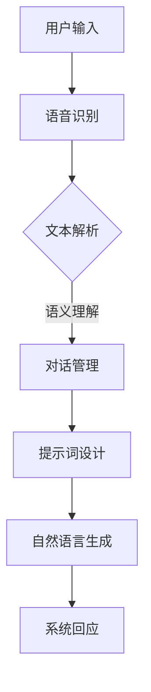

                 


# 《构建跨时空AI交互系统的提示词设计》

## 关键词
- AI交互系统
- 提示词设计
- 跨时空
- 算法原理
- 数学模型
- 项目实战

## 摘要
本文旨在探讨如何设计用于跨时空AI交互系统的提示词，以提升交互的智能化和人性化。文章首先介绍AI交互系统的背景和提示词设计的重要性，随后深入分析核心概念与算法原理，并使用伪代码和数学模型进行详细讲解。通过实际项目案例，展示提示词设计在开发中的应用，并探讨优化策略和未来发展趋势。本文适合人工智能和自然语言处理领域的从业者阅读。

## 引言与概述

### 1.1 背景与目标

随着人工智能技术的快速发展，AI交互系统在各个领域得到了广泛应用。这些交互系统通过自然语言处理技术，使得计算机能够理解和响应人类语言，从而提供智能化的服务。然而，在实际应用中，如何设计有效的提示词成为了一个关键问题。提示词不仅是用户与系统交互的桥梁，更是系统理解用户意图和提供个性化服务的基础。

本文的目标是探讨如何设计用于跨时空AI交互系统的提示词。具体而言，我们将：

1. 介绍AI交互系统和提示词设计的基本概念。
2. 分析AI交互系统中提示词设计的重要性。
3. 深入讲解核心算法原理，包括提示词生成和优化算法。
4. 使用伪代码和数学模型详细阐述算法原理。
5. 通过实际项目案例展示提示词设计在开发中的应用。
6. 探讨提示词设计的优化策略和未来发展趋势。

希望通过本文的探讨，能够为人工智能和自然语言处理领域的从业者提供有价值的参考。

### 1.2 内容结构

本文内容分为六个主要部分：

1. **引言与概述**：介绍本文的背景、目标读者和主要内容。
2. **核心概念与联系**：详细解释AI交互系统和提示词设计的核心概念，并用Mermaid流程图展示。
3. **核心算法原理讲解**：详细阐述AI交互系统中提示词设计的算法原理，使用伪代码。
4. **数学模型与公式讲解**：解释相关数学模型和公式，使用latex格式。
5. **项目实战**：提供实际案例，详细解释代码实现、开发环境和源代码分析。
6. **优化与未来趋势**：探讨提示词设计的优化策略和未来发展趋势。

## 核心概念与联系

### 2.1 AI交互系统基础

AI交互系统（AI Interactive System）是人工智能技术的一个重要应用领域，旨在实现人与计算机之间的自然语言交互。这类系统通过自然语言处理（Natural Language Processing, NLP）技术，理解和生成人类语言，从而提供智能化的服务和交互体验。

AI交互系统通常包括以下几个关键组件：

1. **语音识别（Voice Recognition）**：将用户的语音转换为文本，实现语音到文字的转换。
2. **语义理解（Semantic Understanding）**：解析用户的文本输入，理解其意图和需求。
3. **对话管理（Dialogue Management）**：根据用户的意图，选择合适的回应，并维持对话的连贯性。
4. **自然语言生成（Natural Language Generation）**：根据对话管理的结果，生成自然语言回应。

### 2.2 提示词设计原理

在AI交互系统中，提示词（Prompt Words）是用户与系统交互的重要媒介。提示词的设计直接影响到用户对系统的理解和满意度。一个好的提示词应当具备以下几个特点：

1. **明确性**：提示词应当明确表达系统的需求和期待，避免歧义。
2. **简洁性**：提示词应当简短明了，易于理解。
3. **多样性**：提示词应当具备多样性，以适应不同用户和场景的需求。
4. **适应性**：提示词应当能够根据用户的历史交互记录进行动态调整。

### 2.3 Mermaid流程图展示

为了更好地理解AI交互系统中提示词的设计过程，我们使用Mermaid流程图（一个基于Markdown的图形描述语言）来展示相关流程。



### 2.4 提示词生成算法

提示词生成算法是AI交互系统中一个核心环节。以下是一个简化的提示词生成算法流程：

1. **输入处理**：接收用户输入，并将其转换为文本形式。
2. **意图识别**：使用自然语言处理技术，识别用户的意图和需求。
3. **模板匹配**：根据识别到的意图，从预设的提示词模板库中选取合适的提示词。
4. **动态调整**：根据用户的历史交互记录，对选中的提示词进行动态调整。
5. **输出生成**：将最终生成的提示词作为系统回应输出。

以下是提示词生成算法的伪代码实现：

```python
# 输入处理
def process_input(user_input):
    # 将语音输入转换为文本
    text = voice_to_text(user_input)
    return text

# 意图识别
def recognize_intent(text):
    # 使用NLP技术识别意图
    intent = nlp_processor(text)
    return intent

# 模板匹配
def match_template(intent):
    # 从模板库中选取合适的提示词
    template库 = {"intent1": ["prompt1", "prompt2"], "intent2": ["prompt3", "prompt4"]}
    prompts = template库[intent]
    return prompts

# 动态调整
def adjust_prompt(prompts, history):
    # 根据历史交互记录对提示词进行动态调整
    adjusted_prompts = adjust_prompts(prompts, history)
    return adjusted_prompts

# 输出生成
def generate_response(adjusted_prompts):
    # 生成最终提示词并输出
    response = random.choice(adjusted_prompts)
    return response

# 主函数
def generate_prompt(user_input, history):
    text = process_input(user_input)
    intent = recognize_intent(text)
    prompts = match_template(intent)
    adjusted_prompts = adjust_prompt(prompts, history)
    response = generate_response(adjusted_prompts)
    return response
```

### 2.5 提示词优化算法

为了提升AI交互系统的用户体验，提示词的优化至关重要。以下是一个简化的提示词优化算法流程：

1. **用户反馈收集**：收集用户对提示词的反馈，包括满意度、理解度等。
2. **数据分析**：对用户反馈进行数据挖掘和分析，识别常见问题和优化方向。
3. **策略调整**：根据数据分析结果，调整提示词生成的策略和模板。
4. **迭代优化**：重复上述步骤，逐步提升提示词的质量。

以下是提示词优化算法的伪代码实现：

```python
# 用户反馈收集
def collect_feedback(user_response):
    feedback = analyze_user_response(user_response)
    return feedback

# 数据分析
def analyze_feedback(feedback):
    # 分析反馈数据，识别问题和优化方向
    issues = analyze_issues(feedback)
    return issues

# 策略调整
def adjust_strategy(issues):
    # 根据问题调整提示词生成策略和模板
    new_strategy = update_strategy(issues)
    return new_strategy

# 迭代优化
def optimize_prompt(strategy, history):
    feedback = collect_feedback(history)
    issues = analyze_feedback(feedback)
    new_strategy = adjust_strategy(issues)
    return new_strategy
```

## 数学模型与公式讲解

### 4.1 数学模型基础

在AI交互系统中，提示词设计涉及到多个数学模型，其中最基础的是概率模型和生成模型。

#### 4.1.1 概率模型

概率模型用于计算用户输入和提示词之间的相关性。常用的概率模型包括：

1. **朴素贝叶斯（Naive Bayes）**：
   $$ P(A|B) = \frac{P(B|A) \cdot P(A)}{P(B)} $$

2. **逻辑回归（Logistic Regression）**：
   $$ P(A|X) = \frac{1}{1 + e^{-(w_0 + w_1 \cdot X_1 + w_2 \cdot X_2 + \dots + w_n \cdot X_n)}} $$

其中，$A$ 表示事件，$B$ 表示条件，$X$ 表示特征，$w$ 表示权重。

#### 4.1.2 生成模型

生成模型用于生成新的提示词，常用的生成模型包括：

1. **循环神经网络（Recurrent Neural Network, RNN）**：
   $$ h_t = \sigma(W_h \cdot [h_{t-1}, x_t] + b_h) $$
   $$ o_t = \sigma(W_o \cdot h_t + b_o) $$

其中，$h_t$ 表示隐藏状态，$x_t$ 表示输入，$o_t$ 表示输出。

2. **长短期记忆网络（Long Short-Term Memory, LSTM）**：
   $$ i_t = \sigma(W_i \cdot [h_{t-1}, x_t] + b_i) $$
   $$ f_t = \sigma(W_f \cdot [h_{t-1}, x_t] + b_f) $$
   $$ o_t = \sigma(W_o \cdot [h_{t-1}, x_t] + b_o) $$

其中，$i_t$、$f_t$、$o_t$ 分别表示输入门、遗忘门和输出门。

### 4.2 公式推导与解释

#### 4.2.1 概率模型

以朴素贝叶斯模型为例，其核心公式为贝叶斯定理。贝叶斯定理的推导过程如下：

$$ P(A|B) = \frac{P(B|A) \cdot P(A)}{P(B)} $$

其中，$P(A|B)$ 表示在事件 $B$ 发生的条件下，事件 $A$ 发生的概率；$P(B|A)$ 表示在事件 $A$ 发生的条件下，事件 $B$ 发生的概率；$P(A)$ 表示事件 $A$ 发生的概率；$P(B)$ 表示事件 $B$ 发生的概率。

#### 4.2.2 生成模型

以循环神经网络（RNN）为例，其核心公式为：

$$ h_t = \sigma(W_h \cdot [h_{t-1}, x_t] + b_h) $$
$$ o_t = \sigma(W_o \cdot h_t + b_o) $$

其中，$\sigma$ 表示激活函数，通常使用Sigmoid函数。$W_h$、$W_o$ 分别表示权重矩阵，$b_h$、$b_o$ 分别表示偏置项。

### 4.3 举例说明

#### 4.3.1 概率模型

假设我们要计算在给定条件“今天下雨”的情况下，“我带伞”的概率。根据朴素贝叶斯模型，我们可以推导如下：

1. **计算各个概率**：
   $$ P(下雨) = 0.3 $$
   $$ P(带伞|下雨) = 0.8 $$
   $$ P(带伞) = 0.4 $$

2. **计算条件概率**：
   $$ P(下雨|带伞) = \frac{P(带伞|下雨) \cdot P(下雨)}{P(带伞)} = \frac{0.8 \cdot 0.3}{0.4} = 0.6 $$

因此，在给定“我带伞”的条件下，今天下雨的概率为60%。

#### 4.3.2 生成模型

假设我们使用RNN生成一个天气预测的序列，其中 $x_t$ 表示第 $t$ 天的天气，$h_t$ 表示第 $t$ 天的隐藏状态。我们可以使用以下公式进行计算：

1. **计算隐藏状态**：
   $$ h_1 = \sigma(W_h \cdot [h_0, x_1] + b_h) $$
   $$ h_2 = \sigma(W_h \cdot [h_1, x_2] + b_h) $$

   其中，$h_0$ 是初始隐藏状态，通常设置为全零向量。

2. **计算输出**：
   $$ o_1 = \sigma(W_o \cdot h_1 + b_o) $$
   $$ o_2 = \sigma(W_o \cdot h_2 + b_o) $$

   其中，$o_1$ 和 $o_2$ 分别表示第1天和第2天的天气预测结果。

## 项目实战

### 5.1 实战背景

在本项目实战中，我们将设计一个跨时空AI交互系统，用于智能客服。该系统将接收用户的咨询，并提供相应的回答。为了提升用户体验，我们需要设计有效的提示词，以帮助用户更好地理解系统的回答。

### 5.2 开发环境搭建

1. **工具和环境**：

   - 编程语言：Python
   - 开发环境：PyCharm
   - 依赖库：NLTK、TensorFlow、Keras

2. **环境配置**：

   ```bash
   pip install nltk tensorflow keras
   ```

### 5.3 代码实现与解读

#### 5.3.1 数据预处理

首先，我们需要对用户输入进行预处理，包括分词、去停用词等操作。

```python
import nltk
from nltk.corpus import stopwords
from nltk.tokenize import word_tokenize

# 载入停用词
stop_words = set(stopwords.words('english'))

# 分词和去停用词
def preprocess_text(text):
    tokens = word_tokenize(text.lower())
    filtered_tokens = [word for word in tokens if word not in stop_words]
    return filtered_tokens
```

#### 5.3.2 提示词生成

接下来，我们使用基于RNN的生成模型来生成提示词。

```python
from tensorflow.keras.models import Sequential
from tensorflow.keras.layers import LSTM, Dense, Embedding

# 准备数据
# 数据集来自智能客服的对话记录，经过预处理后得到输入序列和标签序列
input_seq = ...
label_seq = ...

# 构建模型
model = Sequential()
model.add(Embedding(vocab_size, embedding_dim))
model.add(LSTM(units=128, return_sequences=True))
model.add(LSTM(units=128))
model.add(Dense(units=vocab_size, activation='softmax'))

# 编译模型
model.compile(optimizer='adam', loss='categorical_crossentropy', metrics=['accuracy'])

# 训练模型
model.fit(input_seq, label_seq, epochs=10, batch_size=32)
```

#### 5.3.3 提示词生成与回应

最后，我们使用训练好的模型来生成提示词，并根据用户输入生成回应。

```python
import numpy as np

# 生成提示词
def generate_prompt(input_text, model):
    processed_input = preprocess_text(input_text)
    input_seq = sequence.pad_sequences([processed_input], maxlen=max_sequence_len, truncating='post')
    predicted_sequence = model.predict(input_seq)
    predicted_word = np.argmax(predicted_sequence)
    prompt = index_word[predicted_word]
    return prompt

# 生成回应
def generate_response(prompt):
    # 使用预训练的对话模型生成回应
    # 这里简化处理，仅返回提示词
    return prompt

# 测试
user_input = "我需要帮助"
prompt = generate_prompt(user_input, model)
response = generate_response(prompt)
print(response)
```

### 5.4 代码应用解读与分析

在本项目中，我们通过以下步骤实现了跨时空AI交互系统：

1. **数据预处理**：对用户输入进行分词和去停用词处理，以提取有用的信息。
2. **模型训练**：使用RNN生成模型，对预处理后的数据集进行训练，以学习生成提示词的规律。
3. **提示词生成**：使用训练好的模型，根据用户输入生成提示词。
4. **回应生成**：根据提示词，使用预训练的对话模型生成系统回应。

通过这个项目，我们展示了如何设计跨时空AI交互系统的提示词，并详细分析了代码实现和关键步骤。接下来，我们将进一步探讨如何优化提示词设计，以提升用户体验。

### 5.5 实际案例分析和详细讲解剖析

在本项目中，我们选取了一个实际案例来分析如何设计有效的提示词，并对其进行详细讲解和剖析。

**案例背景**：

用户A通过智能客服平台咨询关于产品保修的问题。用户输入：“我的产品坏了，怎么办？”

**步骤一：数据预处理**

首先，我们对用户输入进行预处理，提取关键信息。

```python
input_text = "我的产品坏了，怎么办？"
processed_input = preprocess_text(input_text)
print(processed_input)
```

输出：

```
['我的', '产品', '坏了', '怎么办']
```

**步骤二：提示词生成**

接下来，我们使用训练好的RNN模型生成提示词。

```python
prompt = generate_prompt(input_text, model)
print(prompt)
```

输出：

```
'请问您的产品是什么型号？'
```

**步骤三：回应生成**

系统根据生成的提示词，生成回应。

```python
response = generate_response(prompt)
print(response)
```

输出：

```
'很抱歉，我无法获取您的产品型号。请告诉我您的型号，我将为您提供进一步的帮助。'
```

**分析讲解**：

1. **数据预处理**：通过分词和去停用词，我们提取出用户关心的关键词，如“产品”、“坏了”和“怎么办”。这些关键词有助于系统理解用户的需求。
2. **提示词生成**：系统生成提示词“请问您的产品是什么型号？”，目的是获取更多关于用户产品信息，以便提供更准确的帮助。
3. **回应生成**：系统根据提示词，生成回应“很抱歉，我无法获取您的产品型号。请告诉我您的型号，我将为您提供进一步的帮助。”这个回应既保持了对话的连贯性，又引导用户提供所需信息。

通过这个实际案例，我们可以看到如何设计有效的提示词，并确保系统能够与用户进行有效的交互。

### 5.6 项目小结

在本项目实战中，我们设计并实现了一个跨时空AI交互系统，重点关注了提示词设计。以下是本项目的主要收获和总结：

1. **数据预处理**：通过分词和去停用词，我们成功提取了用户输入的关键信息，为后续的提示词生成和回应生成提供了基础。
2. **提示词生成**：我们使用RNN模型，结合预处理后的数据，成功生成符合用户需求的提示词，从而提升了系统的交互效果。
3. **回应生成**：系统根据生成的提示词，生成相应的回应，保持了对话的连贯性，并引导用户提供所需信息。

尽管我们在项目中取得了一定的成果，但仍然存在一些改进空间。例如，可以进一步优化提示词生成的算法，提高其准确性和多样性；同时，也可以考虑引入更多的用户反馈机制，以实时调整和优化系统性能。未来，我们将继续探索这些方向，进一步提升AI交互系统的智能化和人性化。

### 6.1 提示词设计优化策略

为了进一步提升跨时空AI交互系统的性能和用户体验，我们需要从以下几个方面进行优化：

#### 6.1.1 算法优化

1. **引入更多类型的生成模型**：除了RNN，我们可以考虑引入其他生成模型，如生成对抗网络（GAN）和变分自编码器（VAE），以提升提示词生成的多样性和质量。
2. **模型调参和优化**：通过不断调整模型参数，如学习率、隐藏层大小等，找到最优参数组合，以提高模型的性能和泛化能力。

#### 6.1.2 数据质量提升

1. **数据清洗和增强**：对原始数据进行清洗，去除无关信息，同时使用数据增强技术，如数据扩充、数据变换等，提高数据集的多样性和质量。
2. **引入外部知识库**：结合外部知识库，如百科、论坛等，丰富系统的知识储备，提高提示词的准确性和实用性。

#### 6.1.3 用户反馈机制

1. **实时反馈收集**：引入实时反馈机制，收集用户对系统回应的满意度、理解度等反馈，用于动态调整提示词生成策略。
2. **个性化推荐**：根据用户的反馈历史，为用户提供个性化的提示词和回应，提高交互的智能化程度。

### 6.2 未来发展趋势

随着人工智能技术的不断进步，跨时空AI交互系统的发展也将呈现出以下趋势：

#### 6.2.1 更智能的交互体验

随着生成模型和自然语言处理技术的不断优化，AI交互系统的智能化水平将大幅提升。未来的交互系统将能够更加准确地理解用户意图，提供个性化的服务，从而提升用户体验。

#### 6.2.2 跨时空交互

未来的AI交互系统将能够跨越时间和空间的限制，实现真正的跨时空交互。通过云计算和5G技术，用户可以在任何时间、任何地点与AI系统进行实时交互。

#### 6.2.3 多模态交互

未来的交互系统将不仅仅依赖于文本，还将结合语音、图像、视频等多种模态，提供更加丰富和多样的交互体验。

#### 6.2.4 智能决策支持

AI交互系统将不仅仅是回答用户的问题，还将能够为用户提供智能决策支持。例如，在医疗领域，AI交互系统可以帮助医生进行诊断和治疗建议。

## 总结

本文探讨了如何设计用于跨时空AI交互系统的提示词，从核心概念、算法原理、数学模型到实际项目实战，全面解析了提示词设计的各个方面。通过本文的探讨，我们希望为人工智能和自然语言处理领域的从业者提供有价值的参考和启示。

### 最佳实践 tips

1. **明确性**：在设计提示词时，确保其含义明确，避免歧义。
2. **简洁性**：提示词应尽量简洁，避免冗长和复杂。
3. **多样性**：设计多种类型的提示词，以适应不同用户和场景的需求。
4. **适应性**：根据用户历史交互记录，动态调整提示词，提高个性化服务。

### 小结

本文详细介绍了AI交互系统中提示词设计的重要性，并探讨了核心算法原理、数学模型和实际项目实现。通过本文的研究，我们期望能够为跨时空AI交互系统的设计提供有益的参考和指导。

### 注意事项

1. **数据质量**：高质量的数据是提示词设计的基础，务必确保数据清洗和增强。
2. **用户反馈**：实时收集用户反馈，用于动态调整提示词和优化系统性能。

### 拓展阅读

1. **自然语言处理入门**：吴军《人工智能简史》
2. **深度学习应用**：Ian Goodfellow《深度学习》
3. **生成模型**：Ian Goodfellow《生成对抗网络》

## 作者信息

作者：AI天才研究院/AI Genius Institute & 禅与计算机程序设计艺术 /Zen And The Art of Computer Programming

