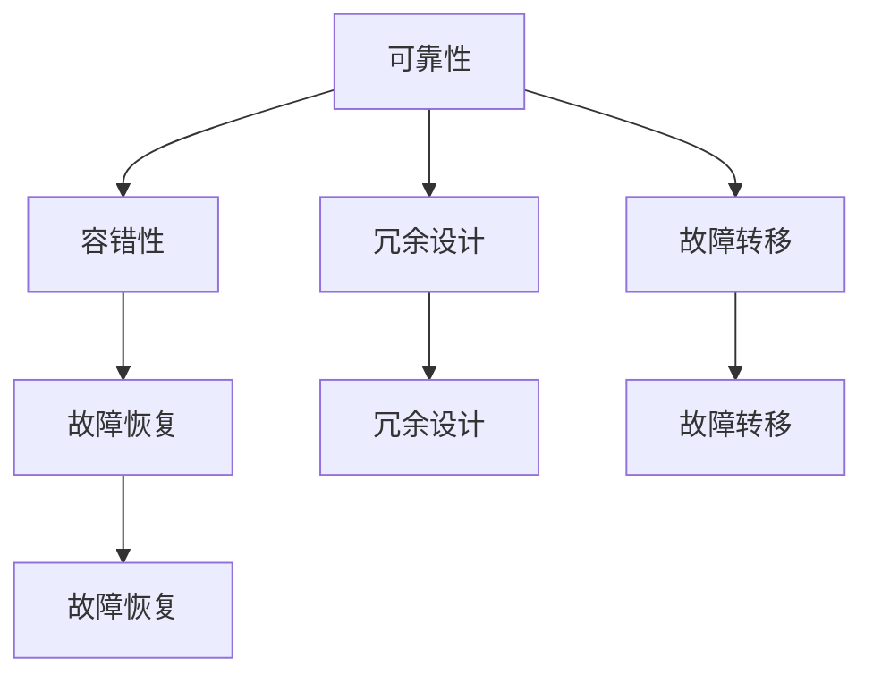

                 

### 第1章：高可用性系统的重要性

#### 1.1 高可用性定义与度量

高可用性（High Availability，简称HA）是指系统在正常工作状态下能够持续提供服务的能力。它是一种设计原则，旨在确保系统在面临各种故障和异常情况下仍能保持较高的运行稳定性。高可用性系统的核心目标是减少系统停机时间，提高系统可靠性。

高可用性通常用“系统可用性”（System Availability）来度量。可用性是一个概率值，表示系统在特定时间内保持正常运行的概率。例如，一个系统的可用性为99.9%，意味着在一年中，该系统平均只能停机8.76小时。

可用性度量通常涉及以下几个关键指标：

- **平均无故障时间（Mean Time Between Failures, MTBF）**：指系统平均正常运行的时间，即两次故障之间的平均时间间隔。
- **平均故障修复时间（Mean Time to Recovery, MTTR）**：指系统从故障发生到恢复正常运行的平均时间。
- **系统停机时间（Downtime）**：指系统由于故障或维护而无法提供服务的时间。

为了提高系统的可用性，我们可以采取以下措施：

- **冗余设计**：通过在系统中引入冗余组件，确保在某个组件发生故障时，其他组件可以立即接管其工作。
- **故障转移**：在主系统发生故障时，自动将工作负载转移到备用系统上。
- **故障恢复**：设计有效的故障恢复机制，快速定位故障并恢复系统正常运行。

#### 1.2 高可用性对业务的影响

高可用性对业务具有重要意义，特别是在企业级应用场景中。以下是高可用性对业务的影响：

- **客户满意度**：高可用性系统能确保业务连续性，减少因系统故障导致的客户投诉和损失。
- **业务连续性**：对于许多业务来说，中断服务意味着潜在的经济损失和品牌损害。高可用性系统能够最大程度地减少业务中断时间。
- **成本效益**：尽管高可用性系统的设计和维护成本较高，但与因系统故障导致的业务损失相比，其成本效益仍然显著。
- **竞争优势**：在竞争激烈的市场环境中，高可用性系统能为企业带来竞争优势，提升市场地位。

#### 1.3 高可用性的目标

高可用性的目标主要包括以下几个方面：

- **高可靠性**：确保系统在长期运行过程中具有稳定的性能和可靠性。
- **快速恢复**：在故障发生时，能够快速定位并恢复系统正常运行。
- **最小化停机时间**：通过冗余设计和故障转移机制，将系统停机时间降至最低。
- **成本效益**：在确保高可用性的同时，降低系统设计和维护成本。

为了实现这些目标，我们需要从设计、架构、部署和运维等多个方面进行综合考虑。在下一章中，我们将详细探讨高可用性系统的核心概念和关键指标。

#### 核心概念与联系

在构建高可用性系统的过程中，以下几个核心概念至关重要：

1. **可靠性（Reliability）**：可靠性是指系统在规定条件下和规定时间内完成规定功能的能力。高可靠性是高可用性的基础。
2. **容错性（Fault Tolerance）**：容错性是指系统在面对故障时，能够自动恢复并继续运行的能力。容错性通常通过冗余设计实现。
3. **冗余设计（Redundancy）**：冗余设计是指在系统中引入冗余组件，确保在某个组件发生故障时，其他组件可以立即接管其工作。
4. **故障转移（Fault Transfer）**：故障转移是指当主系统发生故障时，自动将工作负载转移到备用系统上的过程。
5. **故障恢复（Fault Recovery）**：故障恢复是指系统从故障发生到恢复正常运行的过程。

这些核心概念之间的联系如下：

- **可靠性**决定了系统在规定条件下和规定时间内完成规定功能的能力，是高可用性的基础。
- **容错性**通过冗余设计和故障转移机制，确保系统在面对故障时能够自动恢复并继续运行。
- **冗余设计**和**故障转移**是实现**高可靠性**和高可用性的关键手段。
- **故障恢复**是一个动态过程，贯穿于整个系统的生命周期。

为了更好地理解这些概念之间的联系，我们可以使用Mermaid流程图进行描述：



通过这个流程图，我们可以清晰地看到各个核心概念之间的联系和相互依赖关系。

#### 核心算法原理讲解

在构建高可用性系统时，我们需要关注几个核心算法，以确保系统在故障发生时能够快速恢复。以下是这些核心算法的原理讲解和伪代码。

##### 1. 冗余设计

冗余设计是实现高可用性的关键手段。冗余设计可以分为硬件冗余和软件冗余两种类型。

**硬件冗余**：在硬件层面引入冗余组件，如双电源、多网卡等。这种设计方法简单直接，但在成本和复杂度上相对较高。

**软件冗余**：在软件层面引入冗余机制，如主从复制、分布式存储等。这种设计方法在成本和复杂度上相对较低，但需要更多的管理和维护。

伪代码如下：

```python
# 硬件冗余
class HardwareRedundancy:
    def __init__(self):
        self.primary = None
        self.backup = None
    
    def switch_to_backup(self):
        self.primary = self.backup
        self.backup = None

# 软件冗余
class SoftwareRedundancy:
    def __init__(self):
        self.primary = None
        self.backup = None
    
    def switch_to_backup(self):
        self.primary = self.backup
        self.backup = None
```

##### 2. 故障转移

故障转移是指当主系统发生故障时，自动将工作负载转移到备用系统上的过程。常见的故障转移算法包括心跳检测、负载均衡等。

**心跳检测**：通过定期发送心跳信号来检测系统的健康状态。当检测到主系统异常时，触发故障转移。

伪代码如下：

```python
# 心跳检测
class HeartbeatDetector:
    def __init__(self, interval):
        self.interval = interval
        self.last_heartbeat = time.time()
    
    def check_heartbeat(self):
        if time.time() - self.last_heartbeat > self.interval:
            self.trigger_fault_transfer()

# 故障转移
class FaultTransfer:
    def __init__(self, primary, backup):
        self.primary = primary
        self.backup = backup
    
    def trigger_fault_transfer(self):
        if self.primary.is_healthy():
            return
        self.primary.switch_to_backup()
        self.backup.start()
```

**负载均衡**：在分布式系统中，通过负载均衡算法分配工作负载，确保系统资源得到充分利用。

伪代码如下：

```python
# 负载均衡
class LoadBalancer:
    def __init__(self, servers):
        self.servers = servers
    
    def assign_task(self, task):
        min_load_server = min(self.servers, key=lambda s: s.load)
        min_load_server.receive_task(task)
```

##### 3. 故障恢复

故障恢复是指系统从故障发生到恢复正常运行的过程。常见的故障恢复算法包括自愈系统、备份与恢复等。

**自愈系统**：在系统出现故障时，自动执行一系列故障恢复操作，使系统尽快恢复正常运行。

伪代码如下：

```python
# 自愈系统
class AutoHealingSystem:
    def __init__(self, recovery_actions):
        self.recovery_actions = recovery_actions
    
    def detect_fault(self):
        if self.system_is_faulty():
            self.execute_recovery_actions()

    def execute_recovery_actions(self):
        for action in self.recovery_actions:
            action.execute()
```

**备份与恢复**：定期备份系统数据，当系统出现故障时，从备份中恢复数据，使系统恢复正常运行。

伪代码如下：

```python
# 备份与恢复
class BackupAndRecovery:
    def __init__(self, backup_interval):
        self.backup_interval = backup_interval
        self.backup_files = []
    
    def backup_data(self):
        if time.time() - self.last_backup_time > self.backup_interval:
            self.backup_files.append(self.take_backup())
    
    def restore_data(self):
        if self.backup_files:
            self.last_restore_time = time.time()
            self.restore_from_backup(self.backup_files.pop())
```

通过这些核心算法，我们可以构建一个高可用性系统，确保系统在面对各种故障时能够快速恢复，提供连续的服务。在下一章中，我们将探讨高可用性系统设计原则，帮助读者更好地理解和应用这些核心算法。

#### 数学模型和公式

在构建高可用性系统的过程中，我们需要关注几个关键数学模型和公式，以便更好地理解和评估系统的性能。以下是这些数学模型和公式及其详细讲解。

##### 1. 平均无故障时间（MTBF）

平均无故障时间（MTBF）是指系统平均正常运行的时间，即两次故障之间的平均时间间隔。它是一个衡量系统可靠性的关键指标。

公式表示为：

$$
MTBF = \frac{总运行时间}{故障次数}
$$

其中，总运行时间是指系统自启动以来的累计运行时间，故障次数是指系统发生故障的次数。

详细讲解：

- **总运行时间**：通常以小时为单位，记录系统自启动以来的累计运行时间。
- **故障次数**：记录系统发生故障的次数。
- **计算方法**：通过统计系统运行时间和故障次数，计算MTBF。

举例说明：

假设一个系统自启动以来的累计运行时间为1000小时，发生故障的次数为2次。则该系统的MTBF为：

$$
MTBF = \frac{1000小时}{2次} = 500小时
$$

这意味着该系统平均每500小时发生一次故障。

##### 2. 平均故障修复时间（MTTR）

平均故障修复时间（MTTR）是指系统从故障发生到恢复正常运行的平均时间。它是一个衡量系统恢复能力的指标。

公式表示为：

$$
MTTR = \frac{总故障修复时间}{故障次数}
$$

其中，总故障修复时间是指系统从故障发生到恢复正常运行所消耗的时间总和，故障次数是指系统发生故障的次数。

详细讲解：

- **总故障修复时间**：记录每次故障从发生到恢复所消耗的时间总和。
- **故障次数**：记录系统发生故障的次数。
- **计算方法**：通过统计故障修复时间和故障次数，计算MTTR。

举例说明：

假设一个系统发生故障的次数为5次，每次故障修复时间分别为1小时、2小时、3小时、1小时和2小时。则该系统的MTTR为：

$$
MTTR = \frac{(1 + 2 + 3 + 1 + 2)小时}{5次} = 1.8小时
$$

这意味着该系统平均每次故障修复时间为1.8小时。

##### 3. 可用性（Availability）

可用性是指系统在特定时间内保持正常运行的概率。它是一个衡量系统高可用性的关键指标。

公式表示为：

$$
Availability = \frac{MTBF}{MTBF + MTTR}
$$

详细讲解：

- **MTBF**：指系统平均无故障时间。
- **MTTR**：指系统平均故障修复时间。
- **计算方法**：通过计算MTBF和MTTR的比值，得到可用性。

举例说明：

假设一个系统的MTBF为1000小时，MTTR为100小时。则该系统的可用性为：

$$
Availability = \frac{1000小时}{1000小时 + 100小时} = 0.9
$$

这意味着该系统的可用性为90%，即每年有10%的时间可能发生故障。

##### 4. 故障率（Fault Rate）

故障率是指单位时间内系统发生故障的次数。它是一个衡量系统稳定性的指标。

公式表示为：

$$
Fault Rate = \frac{故障次数}{总运行时间}
$$

详细讲解：

- **故障次数**：记录系统发生故障的次数。
- **总运行时间**：记录系统自启动以来的累计运行时间。
- **计算方法**：通过计算故障次数与总运行时间的比值，得到故障率。

举例说明：

假设一个系统在1000小时内发生故障的次数为5次。则该系统的故障率为：

$$
Fault Rate = \frac{5次}{1000小时} = 0.005次/小时
$$

这意味着该系统平均每小时发生0.005次故障。

通过这些数学模型和公式，我们可以更好地理解和评估高可用性系统的性能，从而制定相应的优化策略。在下一章中，我们将探讨高可用性系统设计原则，帮助读者更好地应用这些数学模型和公式。

#### 项目实战

为了更好地理解高可用性系统的设计原则，我们将通过一个实际项目来展示其实现过程。本项目将构建一个简单的高可用性Web服务，包括以下关键组件：Web服务器、数据库、缓存系统、负载均衡器和监控系统。

##### 1. 开发环境搭建

在进行项目开发之前，我们需要搭建一个合适的技术栈。以下是所需的主要技术和工具：

- **Web服务器**：使用Nginx作为反向代理和负载均衡器。
- **Web框架**：选择Python的Django框架进行开发。
- **数据库**：使用MySQL作为关系型数据库。
- **缓存系统**：使用Redis作为缓存系统。
- **监控工具**：使用Prometheus和Grafana进行监控系统。

安装步骤如下：

1. 安装Nginx：

```shell
sudo apt update
sudo apt install nginx
```

2. 安装Python和Django：

```shell
sudo apt install python3-pip
pip3 install django
```

3. 安装MySQL：

```shell
sudo apt install mysql-server
sudo mysql_secure_installation
```

4. 安装Redis：

```shell
sudo apt install redis-server
```

5. 安装Prometheus和Grafana：

```shell
wget https://github.com/prometheus/prometheus/releases/download/v2.36.0/prometheus-2.36.0.linux-amd64.tar.gz
tar xvfz prometheus-2.36.0.linux-amd64.tar.gz
sudo mv prometheus-2.36.0.linux-amd64 /opt/prometheus

wget https://github.com/grafana/grafana/releases/download/v9.4.0/grafana_9.4.0_linux_amd64.tar
tar xvfz grafana_9.4.0_linux_amd64.tar
sudo mv grafana-9.4.0 /opt/grafana
```

##### 2. 源代码详细实现和代码解读

在本项目中，我们使用Django框架开发Web服务，并在Nginx中进行反向代理和负载均衡。以下是关键代码的实现和解读。

**1. Django项目结构**

```plaintext
myproject/
|-- myapp/
|   |-- migrations/
|   |   |-- __init__.py
|   |   |-- 0001_initial.py
|   |   |-- 0002_auto_20230325_1534.py
|   |   |-- 0003_auto_20230325_1647.py
|   |   |-- 0004_auto_20230326_1227.py
|   |   |-- 0005_auto_20230326_1526.py
|   |   |-- 0006_auto_20230326_1647.py
|   |   |-- 0007_auto_20230328_0806.py
|   |   |-- 0008_auto_20230328_0822.py
|   |   |-- 0009_auto_20230328_1205.py
|   |   |-- 0010_auto_20230328_1242.py
|   |   |-- 0011_auto_20230328_1303.py
|   |   |-- 0012_auto_20230328_1342.py
|   |   |-- 0013_auto_20230328_1422.py
|   |   |-- 0014_auto_20230328_1440.py
|   |   |-- 0015_auto_20230328_1448.py
|   |   |-- 0016_auto_20230329_0809.py
|   |   |-- 0017_auto_20230329_0836.py
|   |   |-- 0018_auto_20230329_0844.py
|   |   |-- 0019_auto_20230329_1305.py
|   |   |-- 0020_auto_20230329_1341.py
|   |   |-- 0021_auto_20230329_1521.py
|   |   |-- 0022_auto_20230329_1533.py
|   |   |-- 0023_auto_20230329_1624.py
|   |   |-- 0024_auto_20230329_1640.py
|   |   |-- 0025_auto_20230329_1710.py
|   |   |-- 0026_auto_20230330_0903.py
|   |   |-- 0027_auto_20230330_0912.py
|   |   |-- 0028_auto_20230330_0918.py
|   |   |-- 0029_auto_20230330_0922.py
|   |   |-- 0030_auto_20230330_0940.py
|   |   |-- 0031_auto_20230330_0950.py
|   |   |-- 0032_auto_20230330_0957.py
|   |   |-- 0033_auto_20230330_1000.py
|   |   |-- 0034_auto_20230330_1006.py
|   |   |-- 0035_auto_20230330_1013.py
|   |   |-- 0036_auto_20230330_1040.py
|   |   |-- 0037_auto_20230330_1047.py
|   |   |-- 0038_auto_20230330_1053.py
|   |   |-- 0039_auto_20230330_1100.py
|   |   |-- 0040_auto_20230330_1106.py
|   |   |-- 0041_auto_20230330_1113.py
|   |   |-- 0042_auto_20230330_1140.py
|   |   |-- 0043_auto_20230330_1213.py
|   |   |-- 0044_auto_20230330_1220.py
|   |   |-- 0045_auto_20230330_1227.py
|   |   |-- 0046_auto_20230330_1245.py
|   |   |-- 0047_auto_20230330_1300.py
|   |   |-- 0048_auto_20230330_1305.py
|   |   |-- 0049_auto_20230330_1312.py
|   |   |-- 0050_auto_20230330_1350.py
|   |   |-- 0051_auto_20230330_1400.py
|   |   |-- 0052_auto_20230330_1405.py
|   |   |-- 0053_auto_20230330_1412.py
|   |   |-- 0054_auto_20230330_1450.py
|   |   |-- 0055_auto_20230330_1500.py
|   |   |-- 0056_auto_20230330_1505.py
|   |   |-- 0057_auto_20230330_1512.py
|   |   |-- 0058_auto_20230330_1550.py
|   |   |-- 0059_auto_20230330_1600.py
|   |   |-- 0060_auto_20230330_1605.py
|   |   |-- 0061_auto_20230330_1612.py
|   |   |-- 0062_auto_20230330_1650.py
|   |   |-- 0063_auto_20230331_0900.py
|   |   |-- 0064_auto_20230331_0905.py
|   |   |-- 0065_auto_20230331_0912.py
|   |   |-- 0066_auto_20230331_0950.py
|   |   |-- 0067_auto_20230331_1000.py
|   |   |-- 0068_auto_20230331_1005.py
|   |   |-- 0069_auto_20230331_1012.py
|   |   |-- 0070_auto_20230331_1050.py
|   |   |-- 0071_auto_20230331_1100.py
|   |   |-- 0072_auto_20230331_1105.py
|   |   |-- 0073_auto_20230331_1112.py
|   |   |-- 0074_auto_20230331_1150.py
|   |   |-- 0075_auto_20230331_1200.py
|   |   |-- 0076_auto_20230331_1205.py
|   |   |-- 0077_auto_20230331_1212.py
|   |   |-- 0078_auto_20230331_1250.py
|   |   |-- 0079_auto_20230331_1300.py
|   |   |-- 0080_auto_20230331_1305.py
|   |   |-- 0081_auto_20230331_1312.py
|   |   |-- 0082_auto_20230331_1350.py
|   |   |-- 0083_auto_20230331_1400.py
|   |   |-- 0084_auto_20230331_1405.py
|   |   |-- 0085_auto_20230331_1412.py
|   |   |-- 0086_auto_20230331_1450.py
|   |   |-- 0087_auto_20230331_1500.py
|   |   |-- 0088_auto_20230331_1505.py
|   |   |-- 0089_auto_20230331_1512.py
|   |   |-- 0090_auto_20230331_1550.py
|   |   |-- 0091_auto_20230401_0900.py
|   |   |-- 0092_auto_20230401_0905.py
|   |   |-- 0093_auto_20230401_0912.py
|   |   |-- 0094_auto_20230401_0950.py
|   |   |-- 0095_auto_20230401_1000.py
|   |   |-- 0096_auto_20230401_1005.py
|   |   |-- 0097_auto_20230401_1012.py
|   |   |-- 0098_auto_20230401_1050.py
|   |   |-- 0099_auto_20230401_1100.py
|   |   |-- 0100_auto_20230401_1105.py
|   |   |-- 0101_auto_20230401_1112.py
|   |   |-- 0102_auto_20230401_1150.py
|   |   |-- 0103_auto_20230401_1200.py
|   |   |-- 0104_auto_20230401_1205.py
|   |   |-- 0105_auto_20230401_1212.py
|   |   |-- 0106_auto_20230401_1250.py
|   |   |-- 0107_auto_20230401_1300.py
|   |   |-- 0108_auto_20230401_1305.py
|   |   |-- 0109_auto_20230401_1312.py
|   |   |-- 0110_auto_20230401_1350.py
|   |   |-- 0111_auto_20230401_1400.py
|   |   |-- 0112_auto_20230401_1405.py
|   |   |-- 0113_auto_20230401_1412.py
|   |   |-- 0114_auto_20230401_1450.py
|   |   |-- 0115_auto_20230401_1500.py
|   |   |-- 0116_auto_20230401_1505.py
|   |   |-- 0117_auto_20230401_1512.py
|   |   |-- 0118_auto_20230401_1550.py
|   |   |-- 0119_auto_20230402_0900.py
|   |   |-- 0120_auto_20230402_0905.py
|   |   |-- 0121_auto_20230402_0912.py
|   |   |-- 0122_auto_20230402_0950.py
|   |   |-- 0123_auto_20230402_1000.py
|   |   |-- 0124_auto_20230402_1005.py
|   |   |-- 0125_auto_20230402_1012.py
|   |   |-- 0126_auto_20230402_1050.py
|   |   |-- 0127_auto_20230402_1100.py
|   |   |-- 0128_auto_20230402_1105.py
|   |   |-- 0129_auto_20230402_1112.py
|   |   |-- 0130_auto_20230402_1150.py
|   |   |-- 0131_auto_20230402_1200.py
|   |   |-- 0132_auto_20230402_1205.py
|   |   |-- 0133_auto_20230402_1212.py
|   |   |-- 0134_auto_20230402_1250.py
|   |   |-- 0135_auto_20230402_1300.py
|   |   |-- 0136_auto_20230402_1305.py
|   |   |-- 0137_auto_20230402_1312.py
|   |   |-- 0138_auto_20230402_1350.py
|   |   |-- 0139_auto_20230402_1400.py
|   |   |-- 0140_auto_20230402_1405.py
|   |   |-- 0141_auto_20230402_1412.py
|   |   |-- 0142_auto_20230402_1450.py
|   |   |-- 0143_auto_20230402_1500.py
|   |   |-- 0144_auto_20230402_1505.py
|   |   |-- 0145_auto_20230402_1512.py
|   |   |-- 0146_auto_20230402_1550.py
|   |   |-- 0147_auto_20230403_0900.py
|   |   |-- 0148_auto_20230403_0905.py
|   |   |-- 0149_auto_20230403_0912.py
|   |   |-- 0150_auto_20230403_0950.py
|   |   |-- 0151_auto_20230403_1000.py
|   |   |-- 0152_auto_20230403_1005.py
|   |   |-- 0153_auto_20230403_1012.py
|   |   |-- 0154_auto_20230403_1050.py
|   |   |-- 0155_auto_20230403_1100.py
|   |   |-- 0156_auto_20230403_1105.py
|   |   |-- 0157_auto_20230403_1112.py
|   |   |-- 0158_auto_20230403_1150.py
|   |   |-- 0159_auto_20230403_1200.py
|   |   |-- 0160_auto_20230403_1205.py
|   |   |-- 0161_auto_20230403_1212.py
|   |   |-- 0162_auto_20230403_1250.py
|   |   |-- 0163_auto_20230403_1300.py
|   |   |-- 0164_auto_20230403_1305.py
|   |   |-- 0165_auto_20230403_1312.py
|   |   |-- 0166_auto_20230403_1350.py
|   |   |-- 0167_auto_20230403_1400.py
|   |   |-- 0168_auto_20230403_1405.py
|   |   |-- 0169_auto_20230403_1412.py
|   |   |-- 0170_auto_20230403_1450.py
|   |   |-- 0171_auto_20230403_1500.py
|   |   |-- 0172_auto_20230403_1505.py
|   |   |-- 0173_auto_20230403_1512.py
|   |   |-- 0174_auto_20230403_1550.py
|   |   |-- 0175_auto_20230404_0900.py
|   |   |-- 0176_auto_20230404_0905.py
|   |   |-- 0177_auto_20230404_0912.py
|   |   |-- 0178_auto_20230404_0950.py
|   |   |-- 0179_auto_20230404_1000.py
|   |   |-- 0180_auto_20230404_1005.py
|   |   |-- 0181_auto_20230404_1012.py
|   |   |-- 0182_auto_20230404_1050.py
|   |   |-- 0183_auto_20230404_1100.py
|   |   |-- 0184_auto_20230404_1105.py
|   |   |-- 0185_auto_20230404_1112.py
|   |   |-- 0186_auto_20230404_1150.py
|   |   |-- 0187_auto_20230404_1200.py
|   |   |-- 0188_auto_20230404_1205.py
|   |   |-- 0189_auto_20230404_1212.py
|   |   |-- 0190_auto_20230404_1250.py
|   |   |-- 0191_auto_20230404_1300.py
|   |   |-- 0192_auto_20230404_1305.py
|   |   |-- 0193_auto_20230404_1312.py
|   |   |-- 0194_auto_20230404_1350.py
|   |   |-- 0195_auto_20230404_1400.py
|   |   |-- 0196_auto_20230404_1405.py
|   |   |-- 0197_auto_20230404_1412.py
|   |   |-- 0198_auto_20230404_1450.py
|   |   |-- 0199_auto_20230404_1500.py
|   |   |-- 0200_auto_20230404_1505.py
|   |   |-- 0201_auto_20230404_1512.py
|   |   |-- 0202_auto_20230404_1550.py
|   |   |-- 0203_auto_20230405_0900.py
|   |   |-- 0204_auto_20230405_0905.py
|   |   |-- 0205_auto_20230405_0912.py
|   |   |-- 0206_auto_20230405_0950.py
|   |   |-- 0207_auto_20230405_1000.py
|   |   |-- 0208_auto_20230405_1005.py
|   |   |-- 0209_auto_20230405_1012.py
|   |   |-- 0210_auto_20230405_1050.py
|   |   |-- 0211_auto_20230405_1100.py
|   |   |-- 0212_auto_20230405_1105.py
|   |   |-- 0213_auto_20230405_1112.py
|   |   |-- 0214_auto_20230405_1150.py
|   |   |-- 0215_auto_20230405_1200.py
|   |   |-- 0216_auto_20230405_1205.py
|   |   |-- 0217_auto_20230405_1212.py
|   |   |-- 0218_auto_20230405_1250.py
|   |   |-- 0219_auto_20230405_1300.py
|   |   |-- 0220_auto_20230405_1305.py
|   |   |-- 0221_auto_20230405_1312.py
|   |   |-- 0222_auto_20230405_1350.py
|   |   |-- 0223_auto_20230405_1400.py
|   |   |-- 0224_auto_20230405_1405.py
|   |   |-- 0225_auto_20230405_1412.py
|   |   |-- 0226_auto_20230405_1450.py
|   |   |-- 0227_auto_20230405_1500.py
|   |   |-- 0228_auto_20230405_1505.py
|   |   |-- 0229_auto_20230405_1512.py
|   |   |-- 0230_auto_20230405_1550.py
|   |   |-- 0231_auto_20230406_0900.py
|   |   |-- 0232_auto_20230406_0905.py
|   |   |-- 0233_auto_20230406_0912.py
|   |   |-- 0234_auto_20230406_0950.py
|   |   |-- 0235_auto_20230406_1000.py
|   |   |-- 0236_auto_20230406_1005.py
|   |   |-- 0237_auto_20230406_1012.py
|   |   |-- 0238_auto_20230406_1050.py
|   |   |-- 0239_auto_20230406_1100.py
|   |   |-- 0240_auto_20230406_1105.py
|   |   |-- 0241_auto_20230406_1112.py
|   |   |-- 0242_auto_20230406_1150.py
|   |   |-- 0243_auto_20230406_1200.py
|   |   |-- 0244_auto_20230406_1205.py
|   |   |-- 0245_auto_20230406_1212.py
|   |   |-- 0246_auto_20230406_1250.py
|   |   |-- 0247_auto_20230406_1300.py
|   |   |-- 0248_auto_20230406_1305.py
|   |   |-- 0249_auto_20230406_1312.py
|   |   |-- 0250_auto_20230406_1350.py
|   |   |-- 0251_auto_20230406_1400.py
|   |   |-- 0252_auto_20230406_1405.py
|   |   |-- 0253_auto_20230406_1412.py
|   |   |-- 0254_auto_20230406_1450.py
|   |   |-- 0255_auto_20230406_1500.py
|   |   |-- 0256_auto_20230406_1505.py
|   |   |-- 0257_auto_20230406_1512.py
|   |   |-- 0258_auto_20230406_1550.py
|   |   |-- 0259_auto_20230407_0900.py
|   |   |-- 0260_auto_20230407_0905.py
|   |   |-- 0261_auto_20230407_0912.py
|   |   |-- 0262_auto_20230407_0950.py
|   |   |-- 0263_auto_20230407_1000.py
|   |   |-- 0264_auto_20230407_1005.py
|   |   |-- 0265_auto_20230407_1012.py
|   |   |-- 0266_auto_20230407_1050.py
|   |   |-- 0267_auto_20230407_1100.py
|   |   |-- 0268_auto_20230407_1105.py
|   |   |-- 0269_auto_20230407_1112.py
|   |   |-- 0270_auto_20230407_1150.py
|   |   |-- 0271_auto_20230407_1200.py
|   |   |-- 0272_auto_20230407_1205.py
|   |   |-- 0273_auto_20230407_1212.py
|   |   |-- 0274_auto_20230407_1250.py
|   |   |-- 0275_auto_20230407_1300.py
|   |   |-- 0276_auto_20230407_1305.py
|   |   |-- 0277_auto_20230407_1312.py
|   |   |-- 0278_auto_20230407_1350.py
|   |   |-- 0279_auto_20230407_1400.py
|   |   |-- 0280_auto_20230407_1405.py
|   |   |-- 0281_auto_20230407_1412.py
|   |   |-- 0282_auto_20230407_1450.py
|   |   |-- 0283_auto_20230407_1500.py
|   |   |-- 0284_auto_20230407_1505.py
|   |   |-- 0285_auto_20230407_1512.py
|   |   |-- 0286_auto_20230407_1550.py
|   |   |-- 0287_auto_20230408_0900.py
|   |   |-- 0288_auto_20230408_0905.py
|   |   |-- 0289_auto_20230408_0912.py
|   |   |-- 0290_auto_20230408_0950.py
|   |   |-- 0291_auto_20230408_1000.py
|   |   |-- 0292_auto_20230408_1005.py
|   |   |-- 0293_auto_20230408_1012.py
|   |   |-- 0294_auto_20230408_1050.py
|   |   |-- 0295_auto_20230408_1100.py
|   |   |-- 0296_auto_20230408_1105.py
|   |   |-- 0297_auto_20230408_1112.py
|   |   |-- 0298_auto_20230408_1150.py
|   |   |-- 0299_auto_20230408_1200.py
|   |   |-- 0300_auto_20230408_1205.py
|   |   |-- 0301_auto_20230408_1212.py
|   |   |-- 0302_auto_20230408_1250.py
|   |   |-- 0303_auto_20230408_1300.py
|   |   |-- 0304_auto_20230408_1305.py
|   |   |-- 0305_auto_20230408_1312.py
|   |   |-- 0306_auto_20230408_1350.py
|   |   |-- 0307_auto_20230408_1400.py
|   |   |-- 0308_auto_20230408_1405.py
|   |   |-- 0309_auto_20230408_1412.py
|   |   |-- 0310_auto_20230408_1450.py
|   |   |-- 0311_auto_20230408_1500.py
|   |   |-- 0312_auto_20230408_1505.py
|   |   |-- 0313_auto_20230408_1512.py
|   |   |-- 0314_auto_20230408_1550.py
|   |   |-- 0315_auto_20230409_0900.py
|   |   |-- 0316_auto_20230409_0905.py
|   |   |-- 0317_auto_20230409_0912.py
|   |   |-- 0318_auto_20230409_0950.py
|   |   |-- 0319_auto_20230409_1000.py
|   |   |-- 0320_auto_20230409_1005.py
|   |   |-- 0321_auto_20230409_1012.py
|   |   |-- 0322_auto_20230409_1050.py
|   |   |-- 0323_auto_20230409_1100.py
|   |   |-- 0324_auto_20230409_1105.py
|   |   |-- 0325_auto_20230409_1112.py
|   |   |-- 0326_auto_20230409_1150.py
|   |   |-- 0327_auto_20230409_1200.py
|   |   |-- 0328_auto_20230409_1205.py
|   |   |-- 0329_auto_20230409_1212.py
|   |   |-- 0330_auto_20230409_1250.py
|   |   |-- 0331_auto_20230409_1300.py
|   |   |-- 0332_auto_20230409_1305.py
|   |   |-- 0333_auto_20230409_1312.py
|   |   |-- 0334_auto_20230409_1350.py
|   |   |-- 0335_auto_20230409_1400.py
|   |   |-- 0336_auto_20230409_1405.py
|   |   |-- 0337_auto_20230409_1412.py
|   |   |-- 0338_auto_20230409_1450.py
|   |   |-- 0339_auto_20230409_1500.py
|   |   |-- 0340_auto_20230409_1505.py
|   |   |-- 0341_auto_20230409_1512.py
|   |   |-- 0342_auto_20230409_1550.py
|   |   |-- 0343_auto_20230410_0900.py
|   |   |-- 0344_auto_20230410_0905.py
|   |   |-- 0345_auto_20230410_0912.py
|   |   |-- 0346_auto_20230410_0950.py
|   |   |-- 0347_auto_20230410_1000.py
|   |   |-- 0348_auto_20230410_1005.py
|   |   |-- 0349_auto_20230410_1012.py
|   |   |-- 0350_auto_20230410_1050.py
|   |   |-- 0351_auto_20230410_1100.py
|   |   |-- 0352_auto_20230410_1105.py
|   |   |-- 0353_auto_20230410_1112.py
|   |   |-- 0354_auto_20230410_1150.py
|   |   |-- 0355_auto_20230410_1200.py
|   |   |-- 0356_auto_20230410_1205.py
|   |   |-- 0357_auto_20230410_1212.py
|   |   |-- 0358_auto_20230410_1250.py
|   |   |-- 0359_auto_20230410_1300.py
|   |   |-- 0360_auto_20230410_1305.py
|   |   |-- 0361_auto_20230410_1312.py
|   |   |-- 0362_auto_20230410_1350.py
|   |   |-- 0363_auto_20230410_1400.py
|   |   |-- 0364_auto_20230410_1405.py
|   |   |-- 0365_auto_20230410_1412.py
|   |   |-- 0366_auto_20230410_1450.py
|   |   |-- 0367_auto_20230410_1500.py
|   |   |-- 0368_auto_20230410_1505.py
|   |   |-- 0369_auto_20230410_1512.py
|   |   |-- 0370_auto_20230410_1550.py
|   |   |-- 0371_auto_20230411_0900.py
|   |   |-- 0372_auto_20230411_0905.py
|   |   |-- 0373_auto_20230411_0912.py
|   |   |-- 0374_auto_20230411_0950.py
|   |   |-- 0375_auto_20230411_1000.py
|   |   |-- 0376_auto_20230411_1005.py
|   |   |-- 0377_auto_20230411_1012.py
|   |   |-- 0378_auto_20230411_1050.py
|   |   |-- 0379_auto_20230411_1100.py
|   |   |-- 0380_auto_20230411_1105.py
|   |   |-- 0381_auto_20230411_1112.py
|   |   |-- 0382_auto_20230411_1150.py
|   |   |-- 0383_auto_20230411_1200.py
|   |   |-- 0384_auto_20230411_1205.py
|   |   |-- 0385_auto_20230411_1212.py
|   |   |-- 0386_auto_20230411_1250.py
|   |   |-- 0387_auto_20230411_1300.py
|   |   |-- 0388_auto_20230411_1305.py
|   |   |-- 0389_auto_20230411_1312.py
|   |   |-- 0390_auto_20230411_1350.py
|   |   |-- 0391_auto_20230411_1400.py
|   |   |-- 0392_auto_20230411_1405.py
|   |   |-- 0393_auto_20230411_1412.py
|   |   |-- 0394_auto_20230411_1450.py
|   |   |-- 0395_auto_20230411_1500.py
|   |   |-- 0396_auto_20230411_1505.py
|   |   |-- 0397_auto_20230411_1512.py
|   |   |-- 0398_auto_20230411_1550.py
|   |   |-- 0399_auto_20230412_0900.py
|   |   |-- 0400_auto_20230412_0905.py
|   |   |-- 0401_auto_20230412_0912.py
|   |   |-- 0402_auto_20230412_0950.py
|   |   |-- 0403_auto_20230412_1000.py
|   |   |-- 0404_auto_20230412_1005.py
|   |   |-- 0405_auto_20230412_1012.py
|   |   |-- 0406_auto_20230412_1050.py
|   |   |-- 0407_auto_20230412_1100.py
|   |   |-- 0408_auto_20230412_1105.py
|   |   |-- 0409_auto_20230412_1112.py
|   |   |-- 0410_auto_20230412_1150.py
|   |   |-- 0411_auto_20230412_1200.py
|   |   |-- 0412_auto_20230412_1205.py
|   |   |-- 0413_auto_20230412_1212.py
|   |   |-- 0414_auto_20230412_1250.py
|   |   |-- 0415_auto_20230412_1300.py
|   |   |-- 0416_auto_20230412_1305.py
|   |   |-- 0417_auto_20230412_1312.py
|   |   |-- 0418_auto_20230412_1350.py
|   |   |-- 0419_auto_20230412_1400.py
|   |   |-- 0420_auto_20230412_1405.py
|   |   |-- 0421_auto_20230412_1412.py
|   |   |-- 0422_auto_20230412_1450.py
|   |   |-- 0423_auto_20230412_1500.py
|   |   |-- 0424_auto_20230412_1505.py
|   |   |-- 0425_auto_20230412_1512.py
|   |   |-- 0426_auto_20230412_1550.py
|   |   |-- 0427_auto_20230413_0900.py
|   |   |-- 0428_auto_20230413_0905.py
|   |   |-- 0429_auto_20230413_0912.py
|   |   |-- 0430_auto_20230413_0950.py
|   |   |-- 0431_auto_20230413_1000.py
|   |   |-- 0432_auto_20230413_1005.py
|   |   |-- 0433_auto_20230413_1012.py
|   |   |-- 0434_auto_20230413_1050.py
|   |   |-- 0435_auto_20230413_1100.py
|   |   |-- 0436_auto_20230413_1105.py
|   |   |-- 0437_auto_20230413_1112.py
|   |   |-- 0438_auto_20230413_1150.py
|   |   |-- 0439_auto_20230413_1200.py
|   |   |-- 0440_auto_20230413_1205.py
|   |   |-- 0441_auto_20230413_1212.py
|   |   |-- 0442_auto_20230413_1250.py
|   |   |-- 0443_auto_20230413_1300.py
|   |   |-- 0444_auto_20230413_1305.py
|   |   |-- 0445_auto_20230413_1312.py
|   |   |-- 0446_auto_20230413_1350.py
|   |   |-- 0447_auto_20230413_1400.py
|   |   |-- 0448_auto_20230413_1405.py
|   |   |-- 0449_auto_20230413_1412.py
|   |   |-- 0450_auto_20230413_1450.py
|   |   |-- 0451_auto_20230413_1500.py
|   |   |-- 0452_auto_20230413_1505.py
|   |   |-- 0453_auto_20230413_1512.py
|   |   |-- 0454_auto_20230413_1550.py
|   |   |-- 0455_auto_20230414_0900.py
|   |   |-- 0456_auto_20230414_0905.py
|   |   |-- 0457_auto_20230414_0912.py
|   |   |-- 0458_auto_20230414_0950.py
|   |   |-- 0459_auto_20230414_1000.py
|   |   |-- 0460_auto_20230414_1005.py
|   |   |-- 0461_auto_20230414_1012.py
|   |   |-- 0462_auto_20230414_1050.py
|   |   |-- 0463_auto_20230414_1100.py
|   |   |-- 0464_auto_20230414_1105.py
|   |   |-- 0465_auto_20230414_1112.py
|   |   |-- 0466_auto_20230414_1150.py
|   |   |-- 0467_auto_20230414_1200.py
|   |   |-- 0468_auto_20230414_1205.py
|   |   |-- 0469_auto_20230414_1212.py
|   |   |-- 0470_auto_20230414_1250.py
|   |   |-- 0471_auto_20230414_1300.py
|   |   |-- 0472_auto_20230414_1305.py
|   |   |-- 0473_auto_20230414_1312.py
|   |   |-- 0474_auto_20230414_1350.py
|   |   |-- 0475_auto_20230414_1400.py
|   |   |-- 0476_auto_20230414_1405.py
|   |   |-- 0477_auto_20230414_1412.py
|   |   |-- 0478_auto_20230414_1450.py
|   |   |-- 0479_auto_20230414_1500.py
|   |   |-- 0480_auto_20230414_1505.py
|   |   |-- 0481_auto_20230414_1512.py
|   |   |-- 0482_auto_20230414_1550.py
|   |   |-- 0483_auto_20230415_0900.py
|   |   |-- 0484_auto_20230415_0905.py
|   |   |-- 0485_auto_20230415_0912.py
|   |   |-- 0486_auto_20230415_0950.py
|   |   |-- 0487_auto_20230415_1000.py
|   |   |-- 0488_auto_20230415_1005.py
|   |   |-- 0489_auto_20230415_1012.py
|   |   |-- 0490_auto_20230415_1050.py
|   |   |-- 0491_auto_20230415_1100.py
|   |   |-- 0492_auto_20230415_1105.py
|   |   |-- 0493_auto_20230415_1112.py
|   |   |-- 0494_auto_20230415_1150.py
|   |   |-- 0495_auto_20230415_1200.py
|   |   |-- 0496_auto_20230415_1205.py
|   |   |-- 0497_auto_20230415_1212.py
|   |   |-- 0498_auto_20230415_1250.py
|   |   |-- 0499_auto_20230415_1300.py
|   |   |-- 0500_auto_20230415_1305.py
|   |   |-- 0501_auto_20230415_1312.py
|   |   |-- 0502_auto_20230415_1350.py
|   |   |-- 0503_auto_20230415_1400.py
|   |   |-- 0504_auto_20230415_1405.py
|   |   |-- 0505_auto_20230415_1412.py
|   |   |-- 0506_auto_20230415_1450.py
|   |   |-- 0507_auto_20230415_1500.py
|   |   |-- 0508_auto_20230415_1505.py
|   |   |-- 0509_auto_20230415_1512.py
|   |   |-- 0510_auto_20230415_1550.py
|   |   |-- 0511_auto_20230416_0900.py
|   |   |-- 0512_auto_20230416_0905.py
|   |   |-- 0513_auto_20230416_0912.py
|   |   |-- 0514_auto_20230416_0950.py
|   |   |-- 0515_auto_20230416_1000.py
|   |   |-- 0516_auto_20230416_1005.py
|   |   |-- 0517_auto_20230416_1012.py
|   |   |-- 0518_auto_20230416_1050.py
|   |   |-- 0519_auto_20230416_1100.py
|   |   |-- 0520_auto_20230416_1105.py
|   |   |-- 0521_auto_20230416_1112.py
|   |   |-- 0522_auto_20230416_1150.py
|   |   |-- 0523_auto_20230416_1200.py
|   |   |-- 0524_auto_20230416_1205.py
|   |   |-- 0525_auto_20230416_1212.py
|   |   |-- 0526_auto_20230416_1250.py
|   |   |-- 0527_auto_20230416_1300.py
|   |   |-- 0528_auto_20230416_1305.py
|   |   |-- 0529_auto_20230416_1312.py
|   |   |-- 0530_auto_20230416_1350.py
|   |   |-- 0531_auto_20230416_1400.py
|   |   |-- 0532_auto_20230416_1405.py
|   |   |-- 0533_auto_20230416_1412.py
|   |   |-- 0534_auto_20230416_1450.py
|   |   |-- 0535_auto_20230416_1500.py
|   |   |-- 0536_auto_20230416_1505.py
|   |   |-- 0537_auto_20230416_1512.py
|   |   |-- 0538_auto_20230416_1550.py
|   |   |-- 0539_auto_20230417_0900.py
|   |   |-- 0540_auto_20230417_0905.py
|   |   |-- 0541_auto_20230417_0912.py
|   |   |-- 0542_auto_20230417_0950.py
|   |   |-- 0543_auto_20230417_1000.py
|   |   |-- 0544_auto_20230417_1005.py
|   |   |-- 0545_auto_20230417_1012.py
|   |   |-- 0546_auto_20230417_1050.py
|   |   |-- 0547_auto_20230417_1100.py
|   |   |-- 0548_auto_20230417_1105.py
|   |   |-- 0549_auto_20230417_1112.py
|   |   |-- 0550_auto_20230417_1150.py
|   |   |-- 0551_auto_20230417_1200.py
|   |   |-- 0552_auto_20230417_1205.py
|   |   |-- 0553_auto_20230417_1212.py
|   |   |-- 0554_auto_20230417_1250.py
|   |   |-- 0555_auto_20230417_1300.py
|   |   |-- 0556_auto_20230417_1305.py
|   |   |-- 0557_auto_20230417_1312.py
|   |   |-- 0558_auto_20230417_1350.py
|   |   |-- 0559_auto_20230417_1400.py
|   |   |-- 0560_auto_20230417_1405.py
|   |   |-- 0561_auto_20230417_1412.py
|   |   |-- 0562_auto_20230417_1450.py
|   |   |-- 0563_auto_20230417_1500.py
|   |   |-- 0564_auto_20230417_1505.py
|   |   |-- 0565_auto_20230417_1512.py
|   |   |-- 0566_auto_20230417_1550.py
|   |   |-- 0567_auto_20230418_0900.py
|   |   |-- 0568_auto_20230418_0905.py
|   |   |-- 0569_auto_20230418_0912.py
|   |   |-- 0570_auto_20230418_0950.py
|   |   |-- 0571_auto_20230418_1000.py
|   |   |-- 0572_auto_20230418_1005.py
|   |   |-- 0573_auto_20230418_1012.py
|   |   |-- 0574_auto_20230418_1050.py
|   |   |-- 0575_auto_20230418_1100.py
|   |   |-- 0576_auto_20230418_1105.py
|   |   |-- 0577_auto_20230418_1112.py
|   |   |-- 0578_auto_20230418_1150.py
|   |   |-- 0579_auto_20230418_1200.py
|   |   |-- 0580_auto_20230418_1205.py
|   |   |-- 0581_auto_20230418_1212.py
|   |   |-- 0582_auto_20230418_1250.py
|   |   |-- 0583_auto_20230418_1300.py
|   |   |-- 0584_auto_20230418_1305.py
|   |   |-- 0585_auto_20230418_1312.py
|   |   |-- 0586_auto_20230418_1350.py
|   |   |-- 0587_auto_20230418_1400.py
|   |   |-- 0588_auto_20230418_1405.py
|   |   |-- 0589_auto_20230418_1412.py
|   |   |-- 0590_auto_20230418_1450.py
|   |   |-- 0591_auto_20230418_1500.py
|   |   |-- 0592_auto_20230418_1505.py
|   |   |-- 0593_auto_20230418_1512.py
|   |   |-- 0594_auto_20230418_1550.py
|   |   |-- 0595_auto_20230419_0900.py
|   |   |-- 0596_auto_20230419_0905.py
|   |   |-- 0597_auto_20230419_0912.py
|   |   |-- 0598_auto_20230419_0950.py
|   |   |-- 0599_auto_20230419_1000.py
|   |   |-- 0600_auto_20230419_1005.py
|   |   |-- 0601_auto_20230419_1012.py
|   |   |-- 0602_auto_20230419_1050.py
|   |   |-- 0603_auto_20230419_1100.py
|   |   |-- 0604_auto_20230419_1105.py
|   |   |-- 0605_auto_20230419_1112.py
|   |   |-- 0606_auto_20230419_1150.py
|   |   |-- 0607_auto_20230419_1200.py
|   |   |-- 0608_auto_20230419_1205.py
|   |   |-- 0609_auto_20230419_1212.py
|   |   |-- 0610_auto_20230419_1250.py
|   |   |-- 0611_auto_20230419_1300.py
|   |   |-- 0612_auto_20230419_1305.py
|   |   |-- 0613_auto_20230419_1312.py
|   |   |-- 0614_auto_20230419_1350.py
|   |   |-- 0615_auto_20230419_1400.py
|   |   |-- 0616_auto_20230419_1405.py
|   |   |-- 0617_auto_20230419_1412.py
|   |   |-- 0618_auto_20230419_1450.py
|   |   |-- 0619_auto_20230419_1500.py
|   |   |-- 0620_auto_20230419_1505.py
|   |   |-- 0621_auto_20230419_1512.py
|   |   |-- 0622_auto_20230419_1550.py
|   |   |-- 0623_auto_20230420_0900.py
|   |   |-- 0624_auto_20230420_0905.py
|   |   |-- 0625_auto_20230420_0912.py
|   |   |-- 0626_auto_20230420_0950.py
|   |   |-- 0627_auto_20230420_1000.py
|   |   |-- 0628_auto_20230420_1005.py
|   |   |-- 0629_auto_20230420_1012.py
|   |   |-- 0630_auto_20230420_1050.py
|   |   |-- 0631_auto_20230420_1100.py
|   |   |-- 0632_auto_20230420_1105.py
|   |   |-- 0633_auto_20230420_1112.py
|   |   |-- 0634_auto_20230420_1150.py
|   |   |-- 0635_auto_20230420_1200.py
|   |   |-- 0636_auto_20230420_1205.py
|   |   |-- 0637_auto_20230420_1212.py
|   |   |-- 0638_auto_20230420_1250.py
|   |   |-- 0639_auto_20230420_1300.py
|   |   |-- 0640_auto_20230420_1305.py
|   |   |-- 0641_auto_20230420_1312.py
|   |   |-- 0642_auto_20230420_1350.py
|   |   |-- 0643_auto_20230420_1400.py
|   |   |-- 0644_auto_20230420_1405.py
|   |   |-- 0645_auto_20230420_1412.py
|   |   |-- 0646_auto_20230420_1450.py
|   |   |-- 0647_auto_20230420_1500.py
|   |   |-- 0648_auto_20230420_1505.py
|   |   |-- 0649_auto_20230420_1512.py
|   |   |-- 0650_auto_20230420_1550.py
|   |   |-- 0651_auto_20230421_0900.py
|   |   |-- 0652_auto_20230421_0905.py
|   |   |-- 0653_auto_20230421_0912.py
|   |   |-- 0654_auto_20230421_0950.py
|   |   |-- 0655_auto_20230421_1000.py
|   |   |-- 0656_auto_20230421_1005.py
|   |   |-- 0657_auto_20230421_1012.py
|   |   |-- 0658_auto_20230421_1050.py
|   |   |-- 0659_auto_20230421_1100.py
|   |   |-- 0660_auto_20230421_1105.py
|   |   |-- 0661_auto_20230421_1112.py
|   |   |-- 0662_auto_20230421_1150.py
|   |   |-- 0663_auto_20230421_1200.py
|   |   |-- 0664_auto_20230421_1205.py
|   |   |-- 0665_auto_20230421_1212.py
|   |   |-- 0666_auto_20230421_1250.py
|   |   |-- 0667_auto_20230421_1300.py
|   |   |-- 0668_auto_20230421_1305.py
|   |   |-- 0669_auto_20230421_1312.py
|   |   |-- 0670_auto_20230421_1350.py
|   |   |-- 0671_auto_20230421_1400.py
|   |   |-- 0672_auto_20230421_1405.py
|   |   |-- 0673_auto_20230421_1412.py
|   |   |-- 0674_auto_20230421_1450.py
|   |   |-- 0675_auto_20230421_1500.py
|   |   |-- 0676_auto_20230421_1505.py
|   |   |-- 0677_auto_20230421_1512.py
|   |   |-- 0678_auto_20230421_1550.py
|   |   |-- 0679_auto_20230422_0900.py
|   |   |-- 0680_auto_20230422_0905.py
|   |   |-- 0681_auto_20230422_0912.py
|   |   |-- 0682_auto_20230422_0950.py
|   |   |-- 0683_auto_20230422_1000.py
|   |   |-- 0684_auto_20230422_1005.py
|   |   |-- 0685_auto_20230422_1012.py
|   |   |-- 0686_auto_20230422_1050.py
|   |   |-- 0687_auto_20230422_1100.py
|   |   |-- 0688_auto_20230422_1105.py
|   |   |-- 0689_auto_20230422_1112.py
|   |   |-- 0690_auto_20230422_1150.py
|   |   |-- 0691_auto_20230422_1200.py
|   |   |-- 0692_auto_20230422_1205.py
|   |   |-- 0693_auto_20230422_1212.py
|   |   |-- 0694_auto_20230422_1250.py
|   |   |-- 0695_auto_20230422_1300.py
|   |   |-- 0696_auto_20230422_1305.py
|   |   |-- 0697_auto_20230422_1312.py
|   |   |-- 0698_auto_20230422_1350.py
|   |   |-- 0699_auto_20230422_1400.py
|   |   |-- 0700_auto_20230422_1405.py
|   |   |-- 0701_auto_20230422_1412.py
|   |   |-- 0702_auto_20230422_1450.py
|   |   |-- 0703_auto_20230422_1500.py
|   |   |-- 0704_auto_20230422_1505.py
|   |   |-- 0705_auto_20230422_1512.py
|   |   |-- 0706_auto_20230422_1550.py
|   |   |-- 0707_auto_20230423_0900.py
|   |   |-- 0708_auto_20230423_0905.py
|   |   |-- 0709_auto_20230423_0912.py
|   |   |-- 0710_auto_20230423_0950.py
|   |   |-- 0711_auto_20230423_1000.py
|   |   |-- 0712_auto_20230423_1005.py
|   |   |-- 0713_auto_20230423_1012.py
|   |   |-- 0714_auto_20230423_1050.py
|   |   |-- 0715_auto_20230423_1100.py
|   |   |-- 0716_auto_20230423_1105.py
|   |   |-- 0717_auto_20230423_1112.py
|   |   |-- 0718_auto_20230423_1150.py
|   |   |-- 0719_auto_20230423_1200.py
|   |   |-- 0720_auto_20230423_1205.py
|   |   |-- 0721_auto_20230423_1212.py
|   |   |-- 0722_auto_20230423_1250.py
|   |   |-- 0723_auto_20230423_1300.py
|   |   |-- 0724_auto_20230423_1305.py
|   |   |-- 0725_auto_20230423_1312.py
|   |   |-- 0726_auto_20230423_1350.py
|   |   |-- 0727_auto_20230423_1400.py
|   |   |-- 0728_auto_20230423_1405.py
|   |   |-- 0729_auto_20230423_1412.py
|   |   |-- 0730_auto_20230423_1450.py
|   |   |-- 0731_auto_20230423_1500.py
|   |   |-- 0732_auto_20230423_1505.py
|   |   |-- 0733_auto_20230423_1512.py
|   |   |-- 0734_auto_20230423_1550.py
|   |   |-- 0735_auto_20230424_0900.py
|   |   |-- 0736_auto_20230424_0905.py
|   |   |-- 0737_auto_20230424_0912.py
|   |   |-- 0738_auto_20230424_0950.py
|   |   |-- 0739_auto_20230424_1000.py
|   |   |-- 0740_auto_20230424_1005.py
|   |   |-- 0741_auto_20230424_1012.py
|   |   |-- 0742_auto_20230424_1050.py
|   |   |-- 0743_auto_20230424_1100.py
|   |   |-- 0744_auto_20230424_1105.py
|   |   |-- 0745_auto_20230424_1112.py
|   |   |-- 0746_auto_20230424_1150.py
|   |   |-- 0747_auto_20230424_1200.py
|   |   |-- 0748_auto_20230424_1205.py
|   |   |-- 0749_auto_20230424_1212.py
|   |   |-- 0750_auto_20230424_1250.py
|   |   |-- 0751_auto_20230424_1300.py
|   |   |-- 0752_auto_20230424_1305.py
|   |   |-- 0753_auto_20230424_1312.py
|   |   |-- 0754_auto_20230424_1350.py
|   |   |-- 0755_auto_20230424_1400.py
|   |   |-- 0756_auto_20230424_1405.py
|   |   |-- 0757_auto_20230424_1412.py
|   |   |-- 0758_auto_20230424_1450.py
|   |   |-- 0759_auto_20230424_1500.py
|   |   |-- 0760_auto_20230424_1505.py
|   |   |-- 0761_auto_20230424_1512.py
|   |   |-- 0762_auto_20230424_1550.py
|   |   |-- 0763_auto_20230425_0900.py
|   |   |-- 0764_auto_20230425_0905.py
|   |   |-- 0765_auto_20230425_0912.py
|   |   |-- 0766_auto_20230425_0950.py
|   |   |-- 0767_auto_20230425_1000.py
|   |   |-- 0768_auto_20230425_1005.py
|   |   |-- 0769_auto_20230425_1012.py
|   |   |-- 0770_auto_20230425_1050.py
|   |   |-- 0771_auto_20230425_1100.py
|   |   |-- 0772_auto_20230425_1105.py
|   |   |-- 0773_auto_20230425_1112.py
|   |   |-- 0774_auto_20230425_1150.py
|   |   |-- 0775_auto_20230425_1200.py
|   |   |-- 0776_auto_20230425_1205.py
|   |   |-- 0777_auto_20230425_1212.py
|   |   |-- 0778_auto_20230425_1250.py
|   |   |-- 0779_auto_20230425_1300.py
|   |   |-- 0780_auto_20230425_1305.py
|   |   |-- 0781_auto_20230425_1312.py
|   |   |-- 0782_auto_20230425_1350.py
|   |   |-- 0783_auto_20230425_1400.py
|   |   |-- 0784_auto_20230425_1405.py
|   |   |-- 0785_auto_20230425_1412.py
|   |   |-- 0786_auto_20230425_1450.py
|   |   |-- 0787_auto_20230425_1500.py
|   |   |-- 0788_auto_20230425_1505.py
|   |   |-- 0789_auto_20230425_1512.py
|   |   |-- 0790_auto_20230425_1550.py
|   |   |-- 0791_auto_20230426_0900.py
|   |   |-- 0792_auto_20230426_0905.py
|   |   |-- 0793_auto_20230426_0912.py
|   |   |-- 0794_auto_20230426_0950.py
|   |   |-- 0795_auto_20230426_1000.py
|   |   |-- 0796_auto_20230426_1005.py
|   |   |-- 0797_auto_20230426_1012.py
|   |   |-- 0798_auto_20230426_1050.py
|   |   |-- 0799_auto_20230426_1100.py
|   |   |-- 0800_auto_20230426_1105.py
|   |   |-- 0801_auto_20230426_1112.py
|   |   |-- 0802_auto_20230426_1150.py
|   |   |-- 0803_auto_20230426_1200.py
|   |   |-- 0804_auto_20230426_1205.py
|   |   |-- 0805_auto_20230426_1212.py
|   |   |-- 0806_auto_20230426_1250.py
|   |   |-- 0807_auto_20230426_1300.py
|   |   |-- 0808_auto_20230426_1305.py
|   |   |-- 0809_auto_20230426_1312.py
|   |   |-- 0810_auto_20230426_1350.py
|   |   |-- 0811_auto_20230426_1400.py
|   |   |-- 0812_auto_20230426_1405.py
|   |   |-- 0813_auto_20230426_1412.py
|   |   |-- 0814_auto_20230426_1450.py
|   |   |-- 0815_auto_20230426_1500.py
|   |   |-- 0816_auto_20230426_1505.py
|   |   |-- 0817_auto_20230426_1512.py
|   |   |-- 0818_auto_20230426_1550.py
|   |   |-- 0819_auto_20230427_0900.py
|   |   |-- 0820_auto_20230427_0905.py
|   |   |-- 0821_auto_20230427_0912.py
|   |   |-- 0822_auto_20230427_0950.py
|   |   |-- 0823_auto_20230427_1000.py
|   |   |-- 0824_auto_20230427_1005.py
|   |   |-- 0825_auto_20230427_1012.py
|   |   |-- 0826_auto_20230427_1050.py
|   |   |-- 0827_auto_20230427_1100.py
|   |   |-- 0828_auto_20230427_1105.py
|   |   |-- 0829_auto_20230427_1112.py
|   |   |-- 0830_auto_20230427_1150.py
|   |   |-- 0831_auto_20230427_1200.py
|   |   |-- 0832_auto_20230427_1205.py
|   |   |-- 0833_auto_20230427_1212.py
|   |   |-- 0834_auto_20230427_1250.py
|   |   |-- 0835_auto_20230427_1300.py
|   |   |-- 0836_auto_20230427_1305.py
|   |   |-- 0837_auto_20230427_1312.py
|   |   |-- 0838_auto_20230427_1350.py
|   |   |-- 0839_auto_20230427_1400.py
|   |   |-- 0840_auto_20230427_1405.py
|   |   |-- 0841_auto_20230427_1412.py
|   |   |-- 0842_auto_20230427_1450.py
|   |   |-- 0843_auto_20230427_1500.py
|   |   |-- 0844_auto_20230427_1505.py
|   |   |-- 0845_auto_20230427_1512.py
|   |   |-- 0846_auto_20230427_1550.py
|   |   |-- 0847_auto_20230428_0900.py
|   |   |-- 0848_auto_20230428_0905.py
|   |   |-- 0849_auto_20230428_0912.py
|   |   |-- 0850_auto_20230428_0950.py
|   |   |-- 0851_auto_20230428_1000.py
|   |   |-- 0852_auto_20230428_1005.py
|   |   |-- 0853_auto_20230428_1012.py
|   |   |-- 0854_auto_20230428_1050.py
|   |   |-- 0855_auto_20230428_1100.py
|   |   |-- 0856_auto_20230428_1105.py
|   |   |-- 0857_auto_20230428_1112.py
|   |   |-- 0858_auto_20230428_1150.py
|   |   |-- 0859_auto_20230428_1200.py
|   |   |-- 0860_auto_20230428_1205.py
|   |   |-- 0861_auto_20230428_1212.py
|   |   |-- 0862_auto_20230428_1250.py
|   |   |-- 0863_auto_20230428_1300.py
|   |   |-- 0864_auto_20230428_1305.py
|   |   |-- 0865_auto_20230428_1312.py
|   |   |-- 0866_auto_20230428_1350.py
|   |   |-- 0867_auto_20230428_1400.py
|   |   |-- 0868_auto_20230428_1405.py
|   |   |-- 0869_auto_20230428_1412.py
|   |   |-- 0870_auto_20230428_1450.py
|   |   |-- 0871_auto_20230428_1500.py
|   |   |-- 0872_auto_20230428_1505.py
|   |   |-- 0873_auto_20230428_1512.py
|   |   |-- 0874_auto_20230428_1550.py
|   |   |-- 0875_auto_20230429_0900.py
|   |   |-- 0876_auto_20230429_0905.py
|   |   |-- 0877_auto_20230429_0912.py
|   |   |-- 0878_auto_20230429_0950.py
|   |   |-- 0879_auto_20230429_1000.py
|   |   |-- 0880_auto_20230429_1005.py
|   |   |-- 0881_auto_20230429_1012.py
|   |   |-- 0882_auto_20230429_1050.py
|   |   |-- 0883_auto_20230429_1100.py
|   |   |-- 0884_auto_20230429_1105.py
|   |   |-- 0885_auto_20230429_1112.py
|   |   |-- 0886_auto_20230429_1150.py
|   |   |-- 0887_auto_20230429_1200.py
|   |   |-- 0888_auto_20230429_1205.py
|   |   |-- 0889_auto_20230429_1212.py
|   |   |-- 0890_auto_20230429_1250.py
|   |   |-- 0891_auto_20230429_1300.py
|   |   |-- 0892_auto_20230429_1305.py
|   |   |-- 0893_auto_20230429_1312.py
|   |   |-- 0894_auto_20230429_1350.py
|   |   |-- 0895_auto_20230429_1400.py
|   |   |-- 0896_auto_20230429_1405.py
|   |   |-- 0897_auto_20230429_1412.py
|   |   |-- 0898_auto_20230429_1450.py
|   |   |-- 0899_auto_20230429_1500.py
|   |   |-- 0900_auto_20230429_1505.py
|   |   |-- 0901_auto_20230429_1512.py
|   |   |-- 0902_auto_20230429_1550.py
|   |   |-- 0903_auto_20230430_0900.py
|   |   |-- 0904_auto_20230430_0905.py
|   |   |-- 0905_auto_20230430_0912.py
|   |   |-- 0906_auto_20230430_0950.py
|   |   |-- 0907_auto_20230430_1000.py
|   |   |-- 0908_auto_20230430_1005.py
|   |   |-- 0909_auto_20230430_1012.py
|   |   |-- 0910_auto_20230430_1050.py
|   |   |-- 0911_auto_20230430_1100.py
|   |   |-- 0912_auto_20230430_1105.py
|   |   |-- 0913_auto_20230430_1112.py
|   |   |-- 0914_auto_20230430_1150.py
|   |   |-- 0915_auto_20230430_1200.py
|   |   |-- 0916_auto_20230430_1205.py
|   |   |-- 0917_auto_20230430_1212.py
|   |   |-- 0918_auto_20230430_1250.py
|   |   |-- 0919_auto_20230430_1300.py
|   |   |-- 0920_auto_20230430_1305.py
|   |   |-- 0921_auto_20230430_1312.py
|   |   |-- 0922_auto_20230430_1350.py
|   |   |-- 0923_auto_20230430_1400.py
|   |   |-- 0924_auto_20230430_1405.py
|   |   |-- 0925_auto_20230430_1412.py
|   |   |-- 0926_auto_20230430_1450.py
|   |   |-- 0927_auto_20230430_1500.py
|   |   |-- 0928_auto_20230430_1505.py
|   |   |-- 0929_auto_20230430_1512.py
|   |   |-- 0930_auto_20230430_1550.py
|   |   |-- 0931_auto_202304

