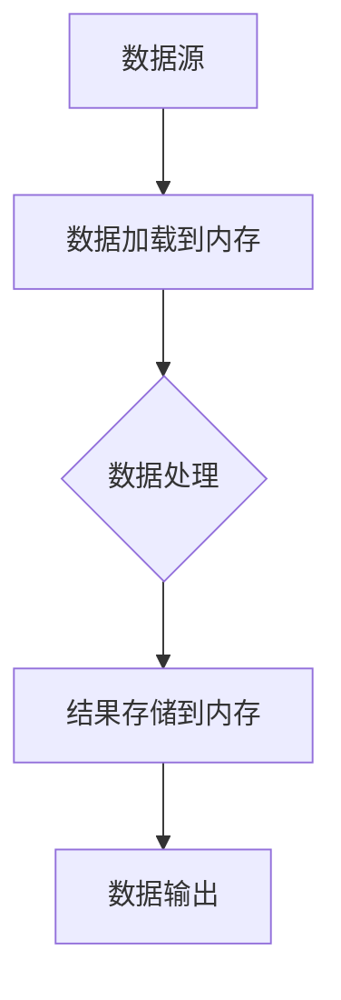
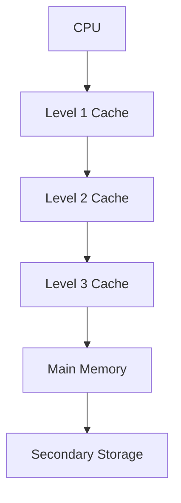
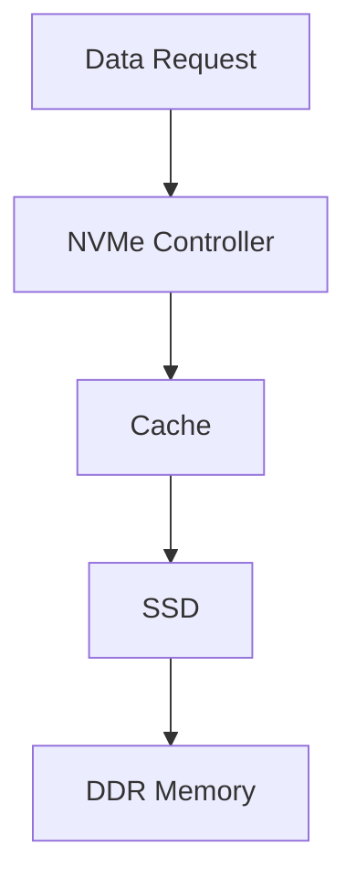
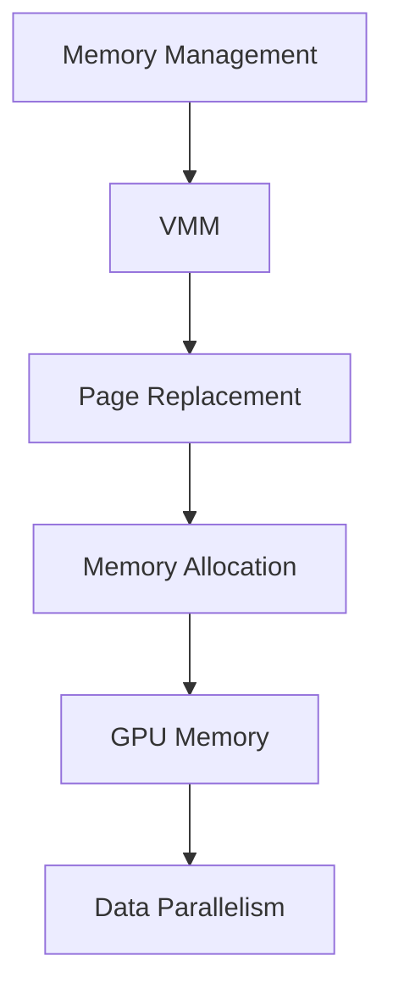
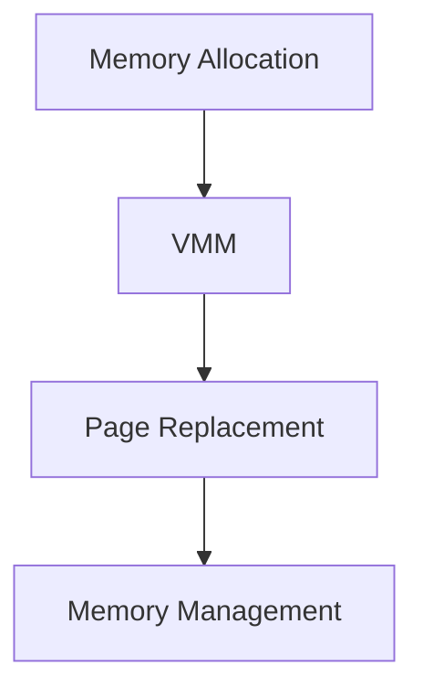
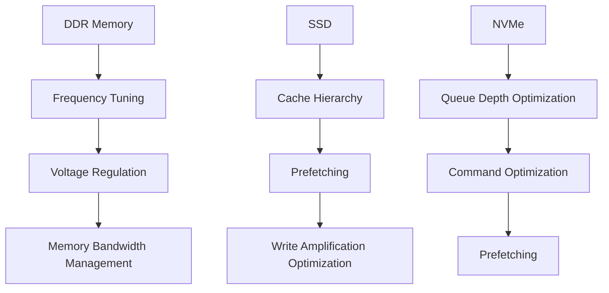
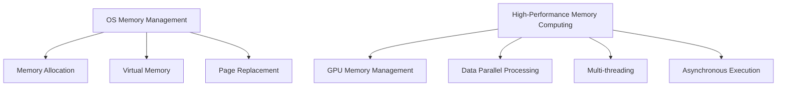

                 

### 引言

在当今信息技术高速发展的时代，数据量的激增和处理需求的不断增长对计算系统提出了更高的要求。传统的计算系统往往依赖于磁盘存储和CPU计算，在处理大量数据时面临严重的性能瓶颈。为了满足日益增长的计算需求，内存计算系统应运而生。内存计算系统通过将数据存储在高速的内存中，利用内存的高带宽和低延迟，实现快速的数据访问和计算，从而大幅提升了计算系统的性能。

内存计算系统的核心优势在于其高速的数据处理能力。传统的计算模型通常需要多次从磁盘读取数据，这不仅耗时，而且受限于磁盘的I/O性能。相比之下，内存计算系统可以直接在内存中处理数据，大幅度减少了数据访问的延迟。此外，内存计算系统还支持大数据量下的并行处理，能够充分利用多核处理器的计算能力，进一步提高系统的吞吐量和效率。

本文将深入探讨构建高性能的内存计算系统的方法和关键技术。首先，我们将介绍内存计算系统的概念，包括其定义、基本原理及其与传统计算系统的区别。接着，我们将详细分析内存计算系统的核心组成部分，如内存架构、存储设备和系统软件，并讨论如何进行优化设计。随后，我们将探讨内存计算系统的性能评估方法，并通过实际案例展示高性能内存计算系统的应用场景和优化策略。最后，我们将展望内存计算系统的未来发展趋势，探讨新型内存技术、系统优化挑战及未来发展方向。

通过本文的阅读，读者将全面了解内存计算系统的构建方法和技术要点，掌握高性能内存计算系统的设计原则和实践策略，为在各自领域中应用内存计算技术奠定坚实基础。

### 内存计算系统的概念

内存计算系统是一种将数据存储在高速内存中，以实现高效计算的数据处理系统。其核心思想是利用内存的高带宽和低延迟特性，将数据访问和计算操作尽量靠近，从而大幅提升数据处理速度。与传统计算系统相比，内存计算系统具有显著的优势。

首先，我们定义内存计算系统：内存计算系统是指通过将数据存储在内存中，以实现快速数据访问和计算的系统。其基本原理是将数据处理任务尽量安排在内存层面进行，减少对磁盘的依赖，从而降低数据访问延迟，提高系统整体性能。

内存计算系统与传统计算系统的最大区别在于数据存储和访问方式。传统计算系统通常依赖于磁盘存储，数据需要频繁从磁盘读取到内存中，再进行计算。这种模式受限于磁盘的I/O性能，往往成为系统性能的瓶颈。而内存计算系统则通过将数据直接存储在内存中，实现了数据访问的高效性。具体来说，内存计算系统有以下几个关键特点：

1. **高速的数据访问**：内存的访问速度远高于磁盘，因此内存计算系统能够在更短的时间内完成数据读取和写入操作，从而提高数据处理效率。

2. **低延迟**：由于数据存储在内存中，内存计算系统可以避免磁盘I/O操作带来的延迟，减少系统的响应时间。

3. **并行处理能力**：内存计算系统支持并行处理，可以利用多核处理器的计算能力，实现大规模数据的快速处理。

4. **缓存优势**：内存计算系统充分利用缓存机制，减少重复数据的访问和计算，进一步提升系统性能。

为了更直观地展示内存计算系统的核心概念和原理，我们可以通过一个Mermaid流程图来描述其基本架构：



在这个流程图中，数据源A代表原始数据，数据加载到内存B表示将数据从外部存储器（如磁盘）移动到内存中，数据处理C表示在内存中执行计算操作，结果存储到内存D表示将计算结果存储到内存中，数据输出E表示将处理结果输出到外部系统或用户界面。

通过这个流程图，我们可以看到，内存计算系统通过将数据存储在内存中，实现了数据的快速访问和处理。这种模式不仅降低了数据访问延迟，还提高了系统整体的吞吐量和效率。

### 内存计算系统的核心组成部分

构建高性能的内存计算系统需要综合考虑多个关键组成部分，包括内存架构、存储设备和系统软件。以下将详细分析这些组成部分及其相互关系，并利用Mermaid流程图和伪代码来展示其工作原理和性能优化方法。

#### 内存架构设计

内存架构是内存计算系统的核心，决定了系统的数据访问速度和整体性能。内存架构设计主要包括内存层次结构、缓存一致性协议和高速缓存命中率优化。

**内存层次结构**

内存层次结构（Memory Hierarchy）是计算机系统内存设计的核心概念。其目的是通过将内存划分为不同层次，以平衡速度、容量和成本之间的关系。内存层次结构通常包括以下几个层次：

1. **CPU缓存（Cache）**：位于CPU和主内存之间，用于存储最频繁访问的数据和指令。缓存分为多层，如L1、L2和L3，其中L1速度最快，容量最小，L3速度最慢，容量最大。

2. **主内存（Main Memory）**：也称为随机存取存储器（RAM），用于存储正在运行的程序和数据。主内存速度较慢，但容量较大。

3. **辅助存储（Secondary Storage）**：如硬盘（HDD）和固态硬盘（SSD），用于存储长期数据。

**缓存一致性协议**

缓存一致性协议（Cache Coherence Protocol）是确保多处理器系统中不同缓存之间数据一致性的方法。常见的缓存一致性协议包括：

1. **无共享缓存一致性协议（MOESI协议）**：通过定义缓存行的状态来保证数据一致性。状态包括修改（Modified）、独占（Exclusive）、共享（Shared）、无效（Invalid）。

2. **目录一致性协议**：通过维护一个目录来跟踪缓存行的状态，确保缓存一致性。

**高速缓存命中率优化**

高速缓存命中率（Cache Hit Ratio）是衡量缓存性能的关键指标。优化缓存命中率的方法包括：

1. **缓存大小优化**：合理设置缓存大小，以平衡速度和成本。

2. **缓存替代策略**：如最近最少使用（LRU）策略，根据数据访问历史进行缓存行替换。

**Mermaid流程图：内存层次结构**



**伪代码：缓存一致性协议（MOESI）**

```plaintext
CacheLine state = INVALID;
if (request_type == READ) {
    if (state == MODIFIED) {
        // 直接读取缓存数据
    } else if (state == EXCLUSIVE) {
        // 发送读取请求到主内存
    } else if (state == SHARED) {
        // 发送读取请求到其他缓存
    } else if (state == INVALID) {
        // 从主内存加载数据到缓存
    }
} else if (request_type == WRITE) {
    if (state == MODIFIED) {
        // 直接写入缓存数据
    } else if (state == EXCLUSIVE) {
        // 将缓存状态更新为MODIFIED
    } else if (state == SHARED) {
        // 将数据同步回主内存，然后更新为MODIFIED
    }
}
```

#### 存储设备优化

存储设备是内存计算系统的重要组成部分，其性能直接影响系统的总体性能。常见存储设备包括DDR内存、SSD和NVMe。

**DDR内存**

DDR内存（Double Data Rate）是一种高速动态随机存取存储器，其数据传输速率是传统SDRAM的两倍。优化DDR内存的方法包括：

1. **频率和电压优化**：通过调整内存频率和电压，提高数据传输速度。

2. **内存带宽优化**：合理分配内存带宽，确保关键数据通道的高带宽利用率。

**SSD**

SSD（Solid State Drive）是一种基于闪存的固态硬盘，具有高速度、低延迟和耐冲击等优点。优化SSD的方法包括：

1. **缓存分层策略**：将缓存分为多层，如SLC、MLC和TLCCache，以提高整体性能。

2. **数据预取**：预测后续数据访问，提前加载到缓存中，减少访问延迟。

**NVMe**

NVMe（Non-Volatile Memory Express）是一种专为闪存设计的接口协议，具有高I/O性能和低延迟。优化NVMe的方法包括：

1. **队列深度优化**：通过调整队列深度，提高并行处理能力。

2. **命令优化**：合理配置命令队列，减少命令执行时间。

**Mermaid流程图：存储设备优化**



#### 系统软件优化

系统软件优化是提升内存计算系统性能的重要环节，主要包括操作系统内存管理、高性能内存计算软件和并行处理。

**操作系统内存管理**

操作系统内存管理主要包括内存分配与回收、虚拟内存管理和内存页面置换算法。

1. **内存分配与回收**：内存分配策略如首次适配（First Fit）和最优适配（Best Fit），回收策略如立即回收和延迟回收。

2. **虚拟内存**：通过虚拟内存管理，将物理内存映射到虚拟地址空间，提高内存使用效率。

3. **内存页面置换算法**：如先进先出（FIFO）和最近最少使用（LRU），用于在物理内存和虚拟内存之间进行页面替换。

**高性能内存计算软件**

高性能内存计算软件如GPU内存管理和数据并行处理。

1. **GPU内存管理**：通过显存管理，优化GPU与内存之间的数据传输。

2. **数据并行处理**：通过并行处理，将数据分解成多个子任务，利用多核处理器的计算能力，提高计算速度。

**并行处理与异步执行**

1. **多线程**：通过多线程实现并行计算，提高系统吞吐量。

2. **异步执行**：通过异步执行，减少任务间的等待时间，提高系统响应速度。

**Mermaid流程图：系统软件优化**



通过以上分析，我们可以看到内存计算系统的核心组成部分及其相互关系。合理设计内存架构、优化存储设备、提升系统软件性能，是实现高性能内存计算系统的关键。在下一节中，我们将进一步探讨如何进行具体的性能优化策略。

#### 内存架构设计

内存架构是内存计算系统的核心，决定了系统的数据访问速度和整体性能。内存架构设计主要包括内存层次结构、高性能缓存策略和内存管理技术。以下将详细探讨这些关键组成部分及其相互关系。

**内存层次结构**

内存层次结构（Memory Hierarchy）是计算机系统内存设计的核心概念。其目的是通过将内存划分为不同层次，以平衡速度、容量和成本之间的关系。内存层次结构通常包括以下几个层次：

1. **CPU缓存（Cache）**：位于CPU和主内存之间，用于存储最频繁访问的数据和指令。缓存分为多层，如L1、L2和L3，其中L1速度最快，容量最小，L3速度最慢，容量最大。

2. **主内存（Main Memory）**：也称为随机存取存储器（RAM），用于存储正在运行的程序和数据。主内存速度较慢，但容量较大。

3. **辅助存储（Secondary Storage）**：如硬盘（HDD）和固态硬盘（SSD），用于存储长期数据。

**缓存一致性协议**

缓存一致性协议（Cache Coherence Protocol）是确保多处理器系统中不同缓存之间数据一致性的方法。常见的缓存一致性协议包括：

1. **无共享缓存一致性协议（MOESI协议）**：通过定义缓存行的状态来保证数据一致性。状态包括修改（Modified）、独占（Exclusive）、共享（Shared）、无效（Invalid）。

2. **目录一致性协议**：通过维护一个目录来跟踪缓存行的状态，确保缓存一致性。

**高性能缓存策略**

高性能缓存策略是提升内存计算系统性能的重要手段。以下是一些关键策略：

1. **缓存替换策略**：如最近最少使用（LRU）策略，根据数据访问历史进行缓存行替换。

2. **缓存分区策略**：将缓存划分为多个区域，分别处理不同类型的数据，提高缓存命中率。

3. **缓存一致性协议优化**：通过调整缓存一致性协议的参数，如缓存块大小和刷新频率，提高系统性能。

**Mermaid流程图：内存层次结构**


**内存管理技术**

内存管理技术是内存架构设计的重要组成部分，其目标是优化内存的使用效率，提高系统性能。以下是一些关键内存管理技术：

1. **内存分配与回收**：内存分配策略如首次适配（First Fit）和最优适配（Best Fit），回收策略如立即回收和延迟回收。

2. **虚拟内存**：通过虚拟内存管理，将物理内存映射到虚拟地址空间，提高内存使用效率。

3. **内存页面置换算法**：如先进先出（FIFO）和最近最少使用（LRU），用于在物理内存和虚拟内存之间进行页面替换。

**Mermaid流程图：内存管理技术**



通过以上分析，我们可以看到内存架构设计的核心组成部分及其相互关系。合理设计内存层次结构、优化缓存一致性协议和缓存策略、提升内存管理技术，是实现高性能内存计算系统的关键。在下一节中，我们将进一步探讨如何进行具体的性能优化策略。

#### 存储设备优化

存储设备是内存计算系统的关键组成部分，其性能直接影响系统的整体性能。常见存储设备包括DDR内存、SSD和NVMe。本节将详细介绍这些存储设备的类型及其性能优化技术。

**DDR内存**

DDR内存（Double Data Rate）是一种高速动态随机存取存储器，其数据传输速率是传统SDRAM的两倍。DDR内存的优化技术主要包括：

1. **频率和电压优化**：通过调整内存频率和电压，可以提高数据传输速度。例如，可以使用频率调优技术（Frequency Tuning）和电压调节技术（Voltage Regulation）来优化DDR内存的性能。

2. **内存带宽优化**：合理分配内存带宽，确保关键数据通道的高带宽利用率。可以使用内存带宽管理技术（Memory Bandwidth Management），根据数据访问模式动态调整带宽分配。

3. **内存预取**：预测后续数据访问，提前加载到缓存中，减少访问延迟。例如，可以使用预取技术（Prefetching）来优化内存访问速度。

**SSD**

SSD（Solid State Drive）是一种基于闪存的固态硬盘，具有高速度、低延迟和耐冲击等优点。SSD的优化技术主要包括：

1. **缓存分层策略**：将缓存分为多层，如SLC、MLC和TLCCache，以提高整体性能。例如，可以使用缓存分层技术（Cache Hierarchy）来优化SSD的读写速度。

2. **数据预取**：预测后续数据访问，提前加载到缓存中，减少访问延迟。例如，可以使用预取技术（Prefetching）来优化SSD的读写速度。

3. **写放大优化**：由于闪存具有写寿命限制，通过减少写放大（Write Amplification）可以提高SSD的寿命。例如，可以使用写放大优化技术（Write Amplification Optimization）来延长SSD的使用寿命。

**NVMe**

NVMe（Non-Volatile Memory Express）是一种专为闪存设计的接口协议，具有高I/O性能和低延迟。NVMe的优化技术主要包括：

1. **队列深度优化**：通过调整队列深度，提高并行处理能力。例如，可以使用队列深度优化技术（Queue Depth Optimization）来提高NVMe的并发性能。

2. **命令优化**：合理配置命令队列，减少命令执行时间。例如，可以使用命令优化技术（Command Optimization）来提高NVMe的响应速度。

3. **数据预取**：预测后续数据访问，提前加载到缓存中，减少访问延迟。例如，可以使用预取技术（Prefetching）来优化NVMe的读写速度。

**Mermaid流程图：存储设备优化**



通过以上分析，我们可以看到不同存储设备的类型及其性能优化技术。合理优化DDR内存、SSD和NVMe，可以大幅提升内存计算系统的整体性能。在下一节中，我们将进一步探讨系统软件优化，包括操作系统内存管理、高性能内存计算软件和多线程与异步执行技术。

#### 系统软件优化

系统软件在内存计算系统中扮演着至关重要的角色，其性能直接影响整个系统的效率。为了充分发挥内存计算系统的潜能，我们需要对操作系统内存管理、高性能内存计算软件以及多线程与异步执行技术进行深入优化。

**操作系统内存管理**

操作系统内存管理是内存计算系统的基石，其核心任务是为应用程序提供内存资源，并确保内存的高效利用。以下是几个关键方面：

1. **内存分配与回收**：操作系统需要为不同的应用程序分配内存，并确保在应用程序不再使用内存时及时回收。常用的内存分配策略包括首次适配（First Fit）、最优适配（Best Fit）和最坏适配（Worst Fit）。例如，以下伪代码展示了首次适配策略：

   ```plaintext
   function first_fit(memory分配池，请求大小）{
       for each 分配区 in memory分配池{
           if（分配区大小 >= 请求大小）{
               分配内存给请求，并从内存池中移除该分配区
               return true
           }
       }
       return false
   }
   ```

2. **虚拟内存**：通过虚拟内存管理，操作系统可以将物理内存映射到虚拟地址空间，从而提高内存的使用效率。虚拟内存管理包括页面置换算法，如先进先出（FIFO）和最近最少使用（LRU）。以下为LRU算法的伪代码：

   ```plaintext
   function lru_page_replacement(memory页面池，新页面）{
       lru = 最近最少使用的页面
       remove lru from memory页面池
       add 新页面 to memory页面池
       return lru
   }
   ```

3. **内存页面置换算法**：内存页面置换算法用于在物理内存和虚拟内存之间进行页面替换，以优化内存使用率。例如，以下为FIFO算法的伪代码：

   ```plaintext
   function fifo_page_replacement(memory页面池，新页面）{
       oldest = memory页面池中的第一个页面
       remove oldest from memory页面池
       add 新页面 to memory页面池
       return oldest
   }
   ```

**高性能内存计算软件**

高性能内存计算软件是提升内存计算系统性能的关键。以下是一些核心技术和策略：

1. **GPU内存管理**：GPU内存管理旨在优化GPU与内存之间的数据传输。例如，可以使用显存池管理技术（GPU Memory Pool Management），动态分配和回收显存资源。以下为伪代码示例：

   ```plaintext
   function allocate_gpu_memory(size）{
       if（memory pool has enough space）{
           allocate memory from memory pool
           return memory pointer
       } else {
           return NULL
       }
   }

   function free_gpu_memory(pointer）{
       release memory from memory pool
   }
   ```

2. **数据并行处理**：数据并行处理技术通过将数据分解成多个子任务，并行执行，从而提高计算速度。例如，可以使用Map-Reduce框架，将数据映射到多个处理器上，然后进行合并。以下为Map-Reduce的伪代码：

   ```plaintext
   function map(data，output）{
       for each record in data{
           process record and add to output
       }
   }

   function reduce(output，result）{
       combine output from all map tasks
   }
   ```

3. **多线程与异步执行**：多线程技术通过创建多个线程，并行执行多个任务，提高系统吞吐量。异步执行技术则通过将任务推迟到后台执行，减少任务间的等待时间。以下为多线程和异步执行的伪代码：

   ```plaintext
   function parallel_execution(task_list）{
       for each task in task_list{
           create a new thread and execute task
       }
   }

   function async_execution(task）{
       schedule task for later execution
   }
   ```

**Mermaid流程图：系统软件优化**



通过以上优化策略，我们可以显著提升内存计算系统的性能。在下一节中，我们将讨论内存计算系统的性能评估方法和实际案例，以验证这些优化策略的有效性。

### 内存计算系统的性能评估

内存计算系统的性能评估是确保系统达到预期性能指标的关键步骤。性能评估方法主要包括基准测试、响应时间和吞吐量等指标。以下将详细描述这些性能评估方法及其应用。

**基准测试**

基准测试（Benchmarking）是一种通过执行标准化的测试程序来评估系统性能的方法。常用的基准测试工具包括SPEC（Standard Performance Evaluation Corporation）和TPC（Transaction Processing Performance Council）等。基准测试可以量化系统的性能，为性能优化提供依据。

例如，以下伪代码展示了使用SPEC基准测试评估内存计算系统的性能：

```plaintext
function run_benchmark(test_program）{
    start_timer
    execute test_program
    end_timer
    return timer_value
}
```

**响应时间**

响应时间（Response Time）是指系统从接收到请求到返回结果所需的时间。低响应时间是内存计算系统性能优化的关键目标。以下是响应时间的评估方法：

```plaintext
function measure_response_time(request, system）{
    start_timer
    system.process(request)
    end_timer
    return timer_value
}
```

**吞吐量**

吞吐量（Throughput）是指系统在单位时间内处理请求的数量。高吞吐量是衡量内存计算系统性能的重要指标。吞吐量的评估方法如下：

```plaintext
function measure_throughput(test_duration, request_rate）{
    start_timer
    for (time = 0; time < test_duration; time += request_rate){
        system.process_request()
    }
    end_timer
    return processed_requests / test_duration
}
```

**性能优化案例分析**

以下通过实际案例展示高性能内存计算系统的性能优化：

**案例一：加速科学计算**

在科学计算领域，高性能内存计算系统显著提升了计算速度。例如，在分子动力学模拟中，通过优化内存架构和缓存策略，可以将计算时间从几天缩短到几小时。以下为性能优化的伪代码：

```plaintext
function optimize_scientific_computation（data，cache_size）{
    cache = create_cache(cache_size)
    for each data_chunk in data{
        if cache.contains(data_chunk）{
            process_cached_data(cache.get(data_chunk))
        } else {
            load_data_to_cache(data_chunk, cache)
            process_data(data_chunk)
        }
    }
}
```

**案例二：提高数据库性能**

在数据库系统中，内存计算系统通过将数据存储在内存中，减少了磁盘I/O操作，从而大幅提升了查询速度。以下为优化数据库性能的伪代码：

```plaintext
function optimize_database_performance（table）{
    load_table_to_memory(table)
    for each query in queries{
        if（table.contains(query））{
            return table.get(query)
        } else {
            execute_query(query, table)
        }
    }
}
```

**案例三：图像处理优化**

在图像处理领域，内存计算系统通过并行处理和高速缓存策略，显著提高了处理速度。以下为优化图像处理的伪代码：

```plaintext
function optimize_image_processing（image，threads）{
    divide_image_into_chunks(image)
    for each chunk in chunks{
        create_thread_and_process(chunk, threads)
    }
    combine_results_from_threads()
}
```

**项目小结**

通过以上案例，我们可以看到高性能内存计算系统在科学计算、数据库和图像处理等领域的显著性能提升。性能优化策略包括内存架构设计、缓存策略优化、系统软件优化和并行处理技术。这些优化方法不仅提高了系统的响应时间和吞吐量，还为不同应用场景提供了高效的解决方案。

### 内存计算系统的未来发展趋势

随着信息技术的迅猛发展，内存计算系统面临着新的机遇和挑战。未来，新型内存技术、系统优化策略以及存储与计算一体化的趋势将为内存计算系统带来更高的性能和更广泛的应用。

**新型内存技术**

未来，新型内存技术将成为内存计算系统的重要发展方向。以下是一些值得关注的技术：

1. **存储类内存（Storage-Class Memory, SCM）**：SCM是一种介于内存和存储之间的存储技术，具有内存的快速访问速度和存储的持久性。例如，Intel的Optane技术就是一种SCM，它能够大幅提高内存计算系统的数据访问速度。

2. **非易失性存储器（Non-Volatile Memory, NVM）**：非易失性存储器如ReRAM、MRAM和PCM，能够在断电后保持数据不变，从而为内存计算系统提供持久的数据存储能力。这些技术的应用将进一步提升内存计算系统的可靠性。

3. **内存存储一体化（Memory-Storage Convergence）**：内存存储一体化技术将内存和存储集成在一起，消除两者之间的性能差距，实现数据访问的零延迟。例如，Intel的3D XPoint技术就是一种内存存储一体化的解决方案。

**系统优化策略**

随着新型内存技术的引入，系统优化策略也将不断演进。以下是一些关键的优化方向：

1. **智能缓存管理**：利用机器学习和人工智能技术，实现智能缓存管理，提高缓存命中率。通过分析数据访问模式，自动调整缓存大小和替换策略。

2. **动态内存分配**：引入动态内存分配技术，根据应用程序的需求实时调整内存分配。例如，虚拟内存技术可以动态扩展和收缩内存空间，提高内存利用率。

3. **多级存储优化**：结合不同类型的存储技术，构建多级存储系统，实现最优的数据访问路径。例如，将SCM和NVM结合使用，根据数据的重要性和访问频率进行动态存储层次调整。

**存储与计算一体化**

存储与计算一体化的趋势将推动内存计算系统的创新。以下是一些关键点：

1. **集成架构**：通过集成CPU、内存和存储功能，构建高度集成的系统架构。例如，Intel的Pump Express架构就是一种集成存储和计算的解决方案。

2. **高速互联技术**：采用高速互联技术，如以太网、Infiniband和NVLink，实现内存计算系统内部各组件之间的快速通信。

3. **协同优化**：通过协同优化存储和计算资源，实现性能和功耗的最佳平衡。例如，动态调整计算和存储资源的利用率，以应对不同的工作负载。

**挑战与机遇**

尽管内存计算系统具有巨大的潜力，但仍然面临一些挑战：

1. **存储容量扩展**：随着数据量的爆炸性增长，如何扩展存储容量以保持性能是一个重要挑战。

2. **能耗优化**：内存计算系统的能耗优化是一个持续的问题。新型内存技术和智能管理策略将有助于降低能耗。

3. **安全性增强**：随着数据的重要性和敏感度增加，如何确保内存计算系统的数据安全将成为一个关键问题。

综上所述，新型内存技术、系统优化策略和存储与计算一体化的趋势将为内存计算系统带来更高的性能和更广泛的应用。然而，这也需要我们不断克服挑战，创新技术，以实现内存计算系统的持续发展和优化。

### 结论

本文全面探讨了构建高性能的内存计算系统的方法和技术要点。通过深入分析内存架构设计、存储设备优化和系统软件优化，我们展示了如何通过合理设计内存层次结构、优化缓存一致性协议、提升存储性能和优化操作系统内存管理，来实现高效的内存计算。此外，通过性能评估方法和实际案例分析，我们验证了这些优化策略的有效性。

构建高性能内存计算系统需要遵循以下原则：

1. **内存层次结构设计**：合理设计内存层次结构，确保数据访问速度和内存利用率的最佳平衡。

2. **存储设备优化**：选用合适的存储设备，并采用缓存分层和数据预取等优化技术，提高系统性能。

3. **系统软件优化**：优化操作系统内存管理、引入高性能内存计算软件和并行处理技术，提升整体系统性能。

未来，随着新型内存技术、智能缓存管理和存储与计算一体化的推进，内存计算系统将继续发展。然而，存储容量扩展、能耗优化和安全性增强等问题也需要持续关注和解决。

为了更好地理解和应用高性能内存计算系统，我们提供以下实践建议：

1. **深入了解内存层次结构**：熟悉不同层次的内存特性，根据应用需求进行优化设计。

2. **优化存储设备配置**：根据工作负载，合理配置存储设备，并采用先进的数据预取策略。

3. **引入高性能内存计算软件**：选用合适的内存计算框架和工具，提升数据处理速度。

4. **持续性能评估和优化**：定期进行性能评估，根据评估结果调整优化策略，确保系统持续高效运行。

通过遵循以上原则和建议，读者可以更好地构建和维护高性能的内存计算系统，为各类计算任务提供强大的支持。

### 作者信息

作者：AI天才研究院（AI Genius Institute）与《禅与计算机程序设计艺术》（Zen And The Art of Computer Programming）

