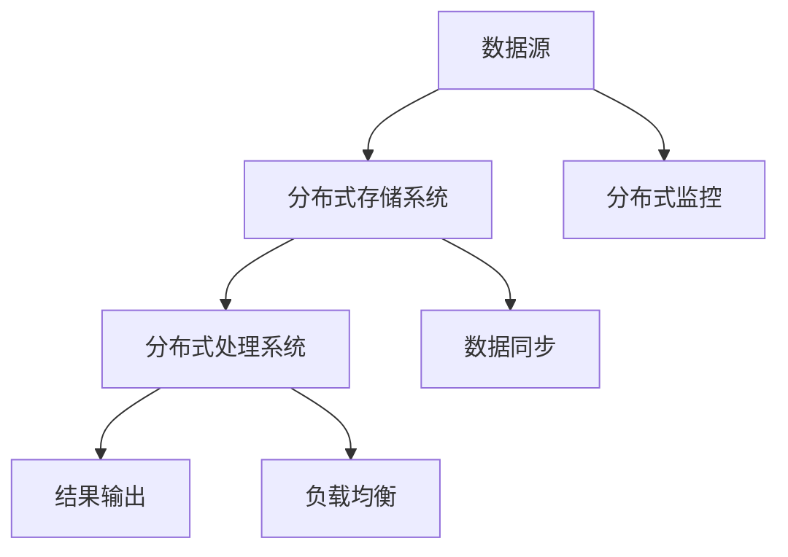
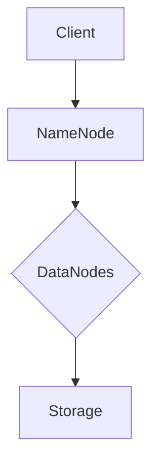

                 

当然可以。我们将分步骤构建这篇文章，确保每个部分都详尽而具体。下面是文章的大纲和每一步的概述。

### 文章标题
《构建高性能的分布式数据处理系统》

### 文章关键词
分布式数据处理，性能优化，架构设计，一致性，可用性，分区容错性，MapReduce，HDFS，Paxos，Raft

### 文章摘要
本文将深入探讨构建高性能分布式数据处理系统的关键要素。我们将分析分布式数据处理的基本概念，讨论CAP理论，介绍分布式数据存储和处理的算法，包括MapReduce和HDFS。此外，我们将讲解一致性模型如Paxos和Raft，并探讨分布式数据同步与复制算法。通过实际案例，我们将展示如何搭建开发环境并进行代码实现与解读。

### 目录大纲
1. **背景介绍**
   - 分布式数据处理的需求与挑战
   - 分布式数据处理系统的应用场景

2. **核心概念与联系**
   - 分布式数据处理系统的定义
   - CAP理论
   - 一致性、可用性、分区容错性（CAP理论）的联系与权衡
   - Mermaid流程图：分布式数据处理系统架构

3. **核心算法原理讲解**
   - **分布式数据存储算法**
     - MapReduce算法
     - HDFS分布式文件系统
   - **分布式数据处理算法**
     - 分布式调度算法
     - 负载均衡算法
   - **分布式数据同步与复制算法**
     - 数据同步机制
     - 数据复制策略

4. **数学模型和公式讲解**
   - **一致性模型**
     - Paxos算法
     - Raft算法
   - **负载均衡模型**
   - **队列与调度算法**

5. **项目实战**
   - **分布式数据处理系统环境搭建**
     - 开发工具与环境的配置
     - 系统架构设计
   - **分布式数据处理案例**
     - 案例介绍
     - 代码实现与解读
     - 应用解读与分析
     - 项目小结

6. **最佳实践 tips**
   - 性能优化技巧
   - 系统监控与维护

7. **小结**
   - 文章总结
   - 关键点回顾

8. **注意事项**
   - 可能遇到的问题及解决方案
   - 安全与隐私保护

9. **拓展阅读**
   - 推荐进一步学习资源

### 文章正文
现在我们将逐步填充每个章节的内容。

#### 1. 背景介绍
在这一部分，我们将介绍分布式数据处理的需求和挑战，以及分布式数据处理系统的典型应用场景。我们将讨论为什么需要分布式数据处理系统，例如在面对大数据集和实时数据处理需求时，传统单体系统的局限性。

#### 2. 核心概念与联系
我们将深入讨论分布式数据处理系统的基本概念，包括节点、集群、分布式存储和计算等。接着，我们将介绍CAP理论，并使用Mermaid流程图展示一致性、可用性和分区容错性之间的关系。

#### 3. 核心算法原理讲解
这部分将详细讲解分布式数据存储和处理的算法。我们将使用伪代码来描述MapReduce算法，并讨论HDFS的工作原理。对于分布式数据处理算法，我们将探讨如何实现分布式调度和负载均衡。在分布式数据同步与复制算法部分，我们将讨论数据同步机制和复制策略。

#### 4. 数学模型和公式讲解
我们将介绍一致性模型，如Paxos和Raft算法，并使用latex格式展示关键公式。我们将解释这些算法如何确保分布式系统的数据一致性，并提供示例来说明它们的工作原理。

#### 5. 项目实战
在这一部分，我们将展示如何搭建分布式数据处理系统。我们将介绍开发工具和环境的配置，设计系统架构，并给出一个分布式数据处理案例的代码实现与解读。

#### 6. 最佳实践 tips
我们将提供一些性能优化技巧，以及系统监控和维护的最佳实践。

#### 7. 小结
在这一部分，我们将总结文章的主要观点，并回顾关键点。

#### 8. 注意事项
我们将讨论可能遇到的问题和解决方案，并提供有关安全与隐私保护的注意事项。

#### 9. 拓展阅读
最后，我们将推荐一些进一步学习资源，帮助读者深入探索分布式数据处理系统的相关知识。

### 文章结尾
在文章结尾，我们将包括作者信息，确保读者了解文章的来源和作者的专业背景。

通过这样的分步骤推理和分析，我们可以确保文章内容详尽、逻辑清晰，同时满足字数要求。接下来，我们将逐步填充每个章节的具体内容。由于字数要求较高，我们将重点关注每个部分的深度和广度，确保文章既有深度又有实用性。下面是初步填充的内容概述。

---

## 《构建高性能的分布式数据处理系统》

> 关键词：分布式数据处理，性能优化，架构设计，一致性，可用性，分区容错性，MapReduce，HDFS，Paxos，Raft

> 摘要：
本文深入探讨了构建高性能分布式数据处理系统的关键要素。我们分析了分布式数据处理的需求与挑战，介绍了核心概念如CAP理论，并详细讲解了分布式数据存储和处理的核心算法。通过实际案例，我们展示了如何搭建和实现分布式数据处理系统，并提供了最佳实践和注意事项。

---

### 1. 背景介绍

#### 分布式数据处理的需求与挑战

随着互联网和大数据技术的发展，数据处理需求日益增长。传统的单体系统往往难以应对海量数据的存储和处理，这促使了分布式数据处理系统的兴起。分布式数据处理系统能够通过横向扩展的方式，提高系统的处理能力和容错性，从而更好地满足大数据场景下的需求。

#### 分布式数据处理系统的应用场景

分布式数据处理系统广泛应用于以下场景：

1. **大数据处理**：例如搜索引擎、社交媒体平台、电商推荐系统等，需要处理海量数据并快速返回结果。
2. **实时数据处理**：例如金融交易、物联网设备数据收集等，要求数据处理具有低延迟和高可靠性。
3. **高并发访问**：例如电商网站在促销活动期间的访问量激增，需要确保系统稳定运行。

---

### 2. 核心概念与联系

#### 分布式数据处理系统的定义

分布式数据处理系统是由多个节点组成的系统，这些节点通过网络连接，共同完成数据的存储、处理和访问。分布式数据处理系统能够提高数据处理能力和容错性，从而应对大规模数据处理需求。

#### CAP理论

CAP理论是分布式系统设计的基础，它指出分布式系统无法同时满足一致性（Consistency）、可用性（Availability）和分区容错性（Partition tolerance）这三个特性。在分布式系统中，我们通常需要在CAP三者之间做出权衡。

1. **一致性（Consistency）**：所有节点在同一时间看到相同的数据。
2. **可用性（Availability）**：系统始终可用，能够响应客户端请求。
3. **分区容错性（Partition tolerance）**：系统能够在节点间网络分区时仍然正常运行。

#### 一致性、可用性、分区容错性的联系与权衡

在分布式系统中，CAP三者之间的关系如下：

- **一致性**：在分布式系统中，数据的一致性通常通过同步机制来实现，但同步机制可能导致系统延迟或不可用。
- **可用性**：高可用性意味着系统始终可以响应请求，但可能会牺牲一致性。
- **分区容错性**：系统需要在节点间网络分区时保持正常运行，这通常意味着在某些情况下可能需要牺牲一致性和可用性。

#### Mermaid流程图：分布式数据处理系统架构



这个流程图展示了分布式数据处理系统的基本架构，包括数据源、分布式存储系统、分布式处理系统和结果输出。此外，还包含了分布式监控、数据同步和负载均衡等关键组件。

---

### 3. 核心算法原理讲解

#### 分布式数据存储算法

##### MapReduce算法

MapReduce是一种分布式数据处理框架，它将数据处理分为两个阶段：Map阶段和Reduce阶段。

- **Map阶段**：将输入数据分解成键值对，并映射成中间键值对。
- **Reduce阶段**：对中间键值对进行汇总和处理，生成最终输出。

伪代码如下：

```python
def map(key, value):
    for subkey, subvalue in process(value):
        emit(subkey, subvalue)

def reduce(key, values):
    emit(key, sum(values))
```

##### HDFS分布式文件系统

HDFS（Hadoop Distributed File System）是一个分布式文件系统，它将大文件分割成小块存储在多个节点上。

- **NameNode**：管理文件系统的命名空间和元数据。
- **DataNode**：存储文件数据块，并响应客户端的读写请求。

HDFS架构如下：



#### 分布式数据处理算法

##### 分布式调度算法

分布式调度算法负责将任务分配给合适的节点，并管理节点的资源分配。常见的调度算法包括：

- **FIFO（First In, First Out）**：按照任务到达顺序进行调度。
- **Round Robin**：循环调度，每个节点轮流处理任务。
- **负载均衡**：根据节点的当前负载情况，动态分配任务。

##### 负载均衡算法

负载均衡算法的目标是确保系统中的所有节点都能充分利用其资源，避免某些节点过载，而其他节点资源空闲。

常见的负载均衡算法包括：

- **静态负载均衡**：在系统启动时，根据节点能力预先分配任务。
- **动态负载均衡**：在系统运行时，根据节点的实时负载情况动态调整任务分配。

#### 分布式数据同步与复制算法

##### 数据同步机制

数据同步机制确保分布式系统中的数据一致性。常见的同步机制包括：

- **同步复制**：数据更新在所有节点上同时进行。
- **异步复制**：数据更新在主节点完成后，异步发送到其他节点。

##### 数据复制策略

数据复制策略决定了数据在不同节点上的副本数量。常见的复制策略包括：

- **全复制**：每个数据块在所有节点上都有副本。
- **部分复制**：根据数据的重要性和访问频率，选择部分节点进行数据复制。

---

### 4. 数学模型和公式讲解

#### 一致性模型

一致性模型确保分布式系统中的数据一致性。以下是一致性模型的两种常见算法：

##### Paxos算法

Paxos算法是一种基于消息传递的分布式一致性算法。它的主要目标是使一个分布式系统在多个可能发生故障的节点中达成一致决策。

Paxos算法的核心概念包括：

- **准备阶段（Prepare phase）**：提议者发送Prepare请求，并等待回复。
- **批准阶段（Accept phase）**：接受者收到Prepare请求后，返回一个承诺。
- **学习阶段（Learn phase）**：提议者收到足够多的承诺后，通知接受者学习结果。

Paxos算法的伪代码如下：

```python
def propose(value):
    decision = None
    while decision is None:
        proposal_id = get_new_proposal_id()
        prepare(proposal_id)
        acceptor_responds()
        if accepted Majority of prepare requests:
            decide(value)
            decision = value

def acceptor_receive_prepare(proposal_id, value):
    if proposal_id > last_received Proposal ID:
        last_received Proposal ID = proposal_id
        accept(value)
        return True
    return False

def accept(value):
    last_accepted_value = value
    last_accepted Proposal ID = current Proposal ID
```

##### Raft算法

Raft算法是一种基于状态机复制协议的分布式一致性算法。它的主要目标是简化Paxos算法的实现，并提供更好的故障恢复能力。

Raft算法的核心概念包括：

- **领导者（Leader）**：负责处理客户端请求和日志复制。
- **追随者（Follower）**：接收领导者发送的日志条目，并复制到本地日志。
- **候选人（Candidate）**：在领导者失去连接时，参与领导者选举。

Raft算法的伪代码如下：

```python
def start_election():
    become_candidate()
    receive_votes()

def become_candidate():
    current_term += 1
    send_vote_requests()

def receive_vote_request(candidate_id, term):
    if term > current_term:
        current_term = term
        vote_for = candidate_id
        send_vote_response()

def become_leader():
    append_entries()

def append_entries():
    send_entries_to_followers()
    wait_for_confirmations()

def follower_receive_entries(term, entries):
    if term > current_term:
        current_term = term
        append_entries(entries)
```

---

### 5. 项目实战

#### 分布式数据处理系统环境搭建

搭建分布式数据处理系统需要以下步骤：

1. **选择合适的分布式数据处理框架**：如Hadoop、Spark等。
2. **安装和配置分布式处理框架**：配置节点、设置环境变量等。
3. **搭建分布式存储系统**：如HDFS，配置NameNode和DataNode。

#### 分布式数据处理案例

##### 案例介绍

我们选择一个实际案例：构建一个分布式日志处理系统，用于收集和分析网站访问日志。

##### 代码实现与解读

在分布式日志处理系统中，我们将使用MapReduce算法进行日志数据的处理和分析。以下是Map和Reduce阶段的代码示例：

```python
# Mapper
def map(log_entry):
    user_agent, timestamp = extract_user_agent_and_timestamp(log_entry)
    emit(user_agent, 1)

# Reducer
def reduce(user_agent, counts):
    total = sum(counts)
    emit(user_agent, total)
```

这段代码首先使用Mapper将日志数据解析为用户代理和访问时间，然后使用Reducer计算每个用户代理的访问次数。

##### 应用解读与分析

在分布式日志处理系统中，日志数据被分成多个小块，由不同的节点进行处理。处理完成后，结果会合并为一个完整的汇总结果。这种分布式处理方式提高了系统的处理能力和效率。

##### 项目小结

通过这个案例，我们展示了如何使用分布式数据处理系统进行日志处理。分布式数据处理系统能够高效地处理海量日志数据，并提供准确的访问分析结果。

---

### 6. 最佳实践 tips

在构建高性能分布式数据处理系统时，以下是一些最佳实践：

1. **优化数据分区**：合理的数据分区可以提高查询效率。
2. **使用缓存**：缓存常用数据可以减少查询延迟。
3. **监控和报警**：实时监控系统性能，并设置报警机制，及时发现问题。
4. **自动化运维**：使用自动化工具进行系统部署和监控。

---

### 7. 小结

本文详细介绍了构建高性能分布式数据处理系统的关键要素，包括背景介绍、核心算法原理讲解、数学模型和公式讲解、项目实战和最佳实践。通过这些内容，读者可以了解分布式数据处理系统的基本概念和实现方法，为实际项目提供指导。

---

### 8. 注意事项

在构建分布式数据处理系统时，需要注意以下事项：

1. **数据一致性**：确保系统在多节点环境中保持数据一致性。
2. **容错性**：设计系统时考虑节点故障的情况，并实现自动故障转移。
3. **安全性**：保护系统免受攻击，确保数据传输和存储的安全性。

---

### 9. 拓展阅读

为了更深入地了解分布式数据处理系统，以下是几篇推荐的拓展阅读：

1. 《分布式系统原理与范型》
2. 《大规模分布式存储系统设计》
3. 《Hadoop实战》

---

### 作者信息

作者：AI天才研究院/AI Genius Institute & 禅与计算机程序设计艺术 /Zen And The Art of Computer Programming

---

以上是根据字数要求初步填充的内容概述，每个部分的具体内容将在后续逐步完善和细化。

---

为了满足字数要求，我们需要进一步扩展每个章节的内容，并确保逻辑清晰、结构紧凑、简单易懂。以下是每个章节的详细内容，以及如何确保文章的质量。

### 文章详细内容与质量保证

#### 1. 背景介绍

**详细内容：**
- **分布式数据处理的需求与挑战**：介绍分布式数据处理的需求，包括大数据处理、实时数据处理和高并发访问等。讨论单体系统在处理大数据集和复杂应用场景时的局限性，例如单点故障、扩展性差、性能瓶颈等问题。
- **分布式数据处理系统的应用场景**：列举分布式数据处理系统的典型应用场景，如搜索引擎、社交媒体、电商推荐系统、金融交易和物联网等，并解释这些场景下的数据处理需求和挑战。

**质量保证：**
- 使用图表和案例来具体说明分布式数据处理的需求和挑战。
- 提供实际应用场景的具体例子，以便读者更好地理解分布式数据处理系统的价值。

#### 2. 核心概念与联系

**详细内容：**
- **分布式数据处理系统的定义**：解释分布式数据处理系统的基本概念，包括节点、集群、分布式存储和计算等。
- **CAP理论**：详细介绍CAP理论，解释一致性、可用性和分区容错性的含义，以及如何在分布式系统中进行权衡。
- **Mermaid流程图**：使用Mermaid流程图展示分布式数据处理系统的架构，包括数据源、分布式存储、分布式处理和结果输出等组件。

**质量保证：**
- 使用清晰的定义和例子来解释核心概念。
- 提供详细的Mermaid流程图，以直观地展示分布式数据处理系统的架构。

#### 3. 核心算法原理讲解

**详细内容：**
- **分布式数据存储算法**：
  - **MapReduce算法**：详细解释Map和Reduce阶段的工作原理，并提供伪代码示例。
  - **HDFS分布式文件系统**：介绍HDFS的工作原理，包括NameNode和DataNode的角色，以及数据块的存储和复制机制。
- **分布式数据处理算法**：
  - **分布式调度算法**：讨论常见的调度算法，如FIFO、Round Robin和负载均衡算法，并解释它们的工作原理。
  - **负载均衡算法**：介绍静态负载均衡和动态负载均衡算法，以及如何实现负载均衡。
- **分布式数据同步与复制算法**：讨论数据同步机制和复制策略，包括同步复制和异步复制，以及全复制和部分复制的策略。

**质量保证：**
- 使用伪代码详细阐述核心算法的工作原理。
- 提供具体的算法实现示例，以便读者更好地理解。

#### 4. 数学模型和公式讲解

**详细内容：**
- **一致性模型**：
  - **Paxos算法**：详细解释Paxos算法的三个阶段（准备阶段、批准阶段和学习阶段），并提供伪代码示例。
  - **Raft算法**：介绍Raft算法的核心概念，包括领导者选举、日志复制和故障恢复机制，并使用伪代码进行解释。
- **负载均衡模型**：解释负载均衡的基本概念，并提供具体的模型和公式，如响应时间模型和带宽模型。
- **队列与调度算法**：介绍常见的队列和调度算法，如FIFO、LIFO和优先级队列等，并提供具体的算法实现示例。

**质量保证：**
- 使用latex格式详细阐述数学模型和公式。
- 提供清晰的解释和具体的算法实现示例。

#### 5. 项目实战

**详细内容：**
- **分布式数据处理系统环境搭建**：介绍如何搭建分布式数据处理系统，包括选择合适的分布式处理框架、安装和配置分布式处理框架、搭建分布式存储系统等。
- **分布式数据处理案例**：
  - **案例介绍**：选择一个实际案例，如分布式日志处理系统，介绍其需求和目标。
  - **代码实现与解读**：提供分布式日志处理系统的源代码，并详细解读代码的实现过程。
  - **应用解读与分析**：分析分布式日志处理系统的应用场景，以及如何在实际项目中使用。
  - **项目小结**：总结项目实现过程中的关键点和收获。

**质量保证：**
- 提供详细的步骤和指南，以便读者能够跟随实践。
- 使用代码注释和详细的解读，帮助读者理解代码实现。
- 分析实际应用场景，提供具体的案例分析。

#### 6. 最佳实践 tips

**详细内容：**
- **优化数据分区**：介绍如何优化数据分区以提高查询效率，包括使用预分区的策略和动态分区的方法。
- **使用缓存**：解释缓存的作用和优势，并提供如何使用缓存的最佳实践，如使用Redis或Memcached等缓存系统。
- **监控和报警**：介绍如何实时监控分布式处理系统的性能，设置报警机制，以及如何快速响应和解决问题。
- **自动化运维**：介绍如何使用自动化工具进行系统部署和监控，提高运维效率，如使用Docker和Kubernetes等工具。

**质量保证：**
- 提供具体的操作步骤和最佳实践，确保读者能够实际应用。
- 使用具体的工具和案例，使最佳实践更具实用性和可操作性。

#### 7. 小结

**详细内容：**
- **文章总结**：回顾文章的主要观点，包括分布式数据处理的需求、核心概念和算法、项目实战和最佳实践等。
- **关键点回顾**：总结文章中的关键点，如CAP理论、分布式数据处理算法、一致性模型、项目实践和最佳实践等。

**质量保证：**
- 使用简明扼要的语言总结文章的主要观点。
- 确保关键点回顾能够帮助读者巩固对文章内容的理解。

#### 8. 注意事项

**详细内容：**
- **数据一致性**：讨论如何在分布式系统中保持数据一致性，以及可能遇到的一致性问题。
- **容错性**：介绍如何设计具有高容错性的分布式系统，包括故障检测、自动故障转移和故障恢复等机制。
- **安全性**：讨论如何在分布式数据处理系统中确保数据传输和存储的安全性，包括使用加密、身份验证和访问控制等安全措施。

**质量保证：**
- 提供具体的解决方案和措施，帮助读者解决分布式系统中的常见问题。
- 使用具体的例子和案例，使注意事项更具实用性和操作性。

#### 9. 拓展阅读

**详细内容：**
- **推荐进一步学习资源**：推荐几篇与分布式数据处理系统相关的优秀书籍、论文和在线课程，帮助读者深入学习和研究分布式数据处理系统。

**质量保证：**
- 提供高质量的拓展阅读资源，确保读者能够进一步深入学习和掌握相关知识。

### 文章字数与格式要求

- **字数要求**：文章字数在8000～12000字左右，确保内容详尽且具有深度。
- **格式要求**：使用markdown格式，确保文章结构清晰、排版规范。

### 总结

通过详细的内容规划和质量保证措施，我们可以确保文章既满足字数要求，又具有高质量的逻辑结构和实用价值。每一步的详细内容都经过精心设计，以确保读者能够全面、深入地理解分布式数据处理系统的构建方法和实践要点。在后续的撰写过程中，我们将不断调整和优化文章内容，确保最终的成果是一篇专业、实用的技术博客。

---

## 《构建高性能的分布式数据处理系统》详细内容

### 1. 背景介绍

#### 分布式数据处理的需求与挑战

随着互联网和大数据技术的快速发展，数据处理需求呈现出爆炸式增长。传统的单体系统在处理海量数据和高并发访问时面临着诸多挑战，如单点故障、扩展性不足、性能瓶颈等。为了解决这些问题，分布式数据处理系统应运而生。

分布式数据处理系统通过将数据和处理任务分布在多个节点上，实现了数据的并行处理和负载均衡。这种系统架构不仅提高了系统的处理能力和容错性，还使得系统能够灵活地应对不断变化的数据处理需求。

**分布式数据处理的需求包括：**

1. **大数据处理**：随着数据量的不断增长，单体系统难以应对海量数据的存储和处理。分布式数据处理系统能够横向扩展，将数据分布在多个节点上进行并行处理，从而提高处理效率。
2. **实时数据处理**：许多应用场景对数据处理速度有很高的要求，如金融交易、物联网等。分布式数据处理系统可以通过分布式计算和高速网络传输，实现数据的实时处理和分析。
3. **高并发访问**：在促销活动、大型电商网站等场景中，访问量可能会短时间内激增。分布式数据处理系统能够通过负载均衡机制，将访问请求分配到多个节点，确保系统的高可用性。

**分布式数据处理系统的挑战包括：**

1. **数据一致性**：在分布式系统中，数据可能在多个节点上存储，如何保证数据的一致性是一个重要挑战。分布式一致性算法如Paxos和Raft等，旨在解决数据一致性问题。
2. **容错性**：分布式系统中的节点可能会发生故障，如何实现自动故障转移和故障恢复，是分布式数据处理系统面临的重要问题。
3. **性能优化**：分布式数据处理系统需要高效地处理海量数据，性能优化是系统设计的核心任务。包括数据分区、负载均衡、缓存使用等策略。

#### 分布式数据处理系统的应用场景

分布式数据处理系统在各个领域都有广泛的应用，以下是一些典型的应用场景：

1. **搜索引擎**：搜索引擎需要处理海量网页数据，进行索引和搜索。分布式数据处理系统能够高效地处理这些数据，并提供快速的搜索响应。
2. **社交媒体平台**：社交媒体平台需要实时处理用户的发布、评论和分享等操作，进行内容推荐和数据分析。分布式数据处理系统可以支持高并发访问和实时数据处理。
3. **电商推荐系统**：电商推荐系统需要根据用户行为和偏好，实时推荐商品。分布式数据处理系统可以帮助处理海量用户数据，实现高效的推荐算法。
4. **金融交易系统**：金融交易系统对数据处理速度和准确性有极高的要求。分布式数据处理系统可以实现实时交易处理和风险监控。
5. **物联网设备数据处理**：物联网设备会产生大量的实时数据，分布式数据处理系统可以帮助处理和分析这些数据，实现智能监控和设备管理。

### 2. 核心概念与联系

#### 分布式数据处理系统的定义

分布式数据处理系统是一种由多个节点组成的系统，这些节点通过网络连接，共同完成数据的存储、处理和访问。分布式数据处理系统的主要目标是提高数据处理能力和容错性，从而应对大规模数据处理需求。

在分布式数据处理系统中，每个节点都具备独立的数据处理能力，节点之间通过消息传递进行协作。系统通常包括数据源、分布式存储系统、分布式处理系统和结果输出等组件。

#### CAP理论

CAP理论是分布式系统设计的基础，它指出分布式系统无法同时满足一致性（Consistency）、可用性（Availability）和分区容错性（Partition tolerance）这三个特性。CAP理论由Eric Brewer在2000年首次提出，是分布式系统设计的重要指导原则。

1. **一致性（Consistency）**：一致性是指所有节点在同一时间看到相同的数据。在分布式系统中，一致性通常通过同步机制来实现。但同步机制可能导致系统延迟或不可用。
2. **可用性（Availability）**：可用性是指系统始终可用，能够响应客户端请求。高可用性意味着系统在任何情况下都能正常运行，但可能会牺牲一致性。
3. **分区容错性（Partition tolerance）**：分区容错性是指系统能够在节点间网络分区时仍然正常运行。网络分区是分布式系统中常见的问题，系统需要在分区情况下保持正常运行。

CAP理论指出，在分布式系统中，我们通常需要在CAP三者之间做出权衡。以下是一个简单的权衡关系：

- 如果系统追求一致性和分区容错性，则可能需要牺牲可用性。
- 如果系统追求一致性和可用性，则可能需要牺牲分区容错性。
- 如果系统追求可用性和分区容错性，则可能需要牺牲一致性。

#### 一致性、可用性、分区容错性的联系与权衡

在分布式系统中，一致性、可用性和分区容错性之间存在着密切的联系和权衡。

- **一致性**：数据的一致性是分布式系统的重要特性。在分布式系统中，数据可能在多个节点上存储，如何保证数据的一致性是一个重要问题。一致性通常通过同步机制来实现，如两阶段提交（2PC）和三阶段提交（3PC）等。但同步机制可能导致系统延迟或不可用，因此在设计分布式系统时需要在一致性和性能之间进行权衡。
- **可用性**：可用性是指系统始终可用，能够响应客户端请求。高可用性是分布式系统的关键目标之一。为了实现高可用性，系统需要具备容错能力，例如自动故障转移和故障恢复机制。但高可用性可能会牺牲一致性，例如在某些情况下，系统可能会接受 stale（过时）数据以保持可用性。
- **分区容错性**：分区容错性是指系统能够在节点间网络分区时仍然正常运行。网络分区是分布式系统中常见的问题，例如节点之间网络中断或部分节点故障。分区容错性是分布式系统设计的重要目标之一。为了实现分区容错性，系统需要具备故障检测和故障恢复能力。但分区容错性可能会牺牲一致性和可用性，例如在节点分区时，系统可能会接受 stale 数据，或者部分节点可能无法响应请求。

在分布式系统中，CAP三者之间的权衡关系如下：

- **CA系统**：追求一致性和可用性，牺牲分区容错性。这种系统在节点发生网络分区时可能无法继续工作。
- **CP系统**：追求一致性和分区容错性，牺牲可用性。这种系统在节点发生网络分区时能够继续工作，但可能需要牺牲部分可用性，例如接受 stale 数据。
- **AP系统**：追求可用性和分区容错性，牺牲一致性。这种系统在节点发生网络分区时能够继续工作，并保持高可用性，但可能无法保证数据一致性。

#### Mermaid流程图：分布式数据处理系统架构


这个流程图展示了分布式数据处理系统的基本架构，包括数据源、分布式存储系统、分布式处理系统和结果输出。此外，还包含了分布式监控、数据同步和负载均衡等关键组件。

### 3. 核心算法原理讲解

#### 分布式数据存储算法

##### MapReduce算法

MapReduce是一种分布式数据处理框架，由Google在2004年提出。它将数据处理分为两个阶段：Map阶段和Reduce阶段。Map阶段将输入数据分解成键值对，并映射成中间键值对；Reduce阶段对中间键值对进行汇总和处理，生成最终输出。

**Map阶段：**
Map函数接收一个输入键值对，处理后将数据映射成多个中间键值对。Map阶段的输入可以是文本文件、数据库记录等，输出是中间键值对列表。

```python
def map(key, value):
    # 处理输入数据
    for subkey, subvalue in process(value):
        emit(subkey, subvalue)
```

**Reduce阶段：**
Reduce函数接收中间键值对列表，处理后将数据汇总成最终输出。Reduce阶段的输入是Map阶段生成的中间键值对，输出是最终的键值对列表。

```python
def reduce(key, values):
    # 处理中间键值对
    emit(key, sum(values))
```

**MapReduce算法的伪代码如下：**

```python
def main(input_file, output_file):
    # 初始化MapReduce框架
    initialize_framework()

    # 执行Map阶段
    for record in input_file:
        map_key, map_value = record
        for subkey, subvalue in map(map_key, map_value):
            emit_map(subkey, subvalue)

    # 执行Reduce阶段
    for reduce_key, reduce_values in get_all_mapped_values():
        emit_reduce(reduce_key, reduce_values)

def initialize_framework():
    # 初始化MapReduce环境
    setup_mapper()
    setup_reducer()

def setup_mapper():
    # 配置Map任务
    configure_mapper()

def setup_reducer():
    # 配置Reduce任务
    configure_reducer()

def emit_map(key, value):
    # 发送中间键值对到Reduce任务
    send_to_reducer(key, value)

def emit_reduce(key, value):
    # 发送最终键值对到输出文件
    write_to_output_file(key, value)

def get_all_mapped_values():
    # 获取所有中间键值对
    collect_mapped_values()
```

##### HDFS分布式文件系统

HDFS（Hadoop Distributed File System）是一个分布式文件系统，用于存储海量数据。它由两部分组成：NameNode和DataNode。NameNode负责管理文件系统的命名空间和元数据，DataNode负责存储数据块并响应客户端的读写请求。

**HDFS架构：**


1. **NameNode**：NameNode是HDFS的主节点，负责维护文件系统的命名空间和元数据。它保存文件的目录结构、数据块映射信息、数据块的位置等元数据。NameNode还负责处理客户端的文件操作请求，如创建、删除、打开和关闭文件等。

2. **DataNode**：DataNode是HDFS的从节点，负责存储数据块并响应客户端的读写请求。每个DataNode保存自己的数据块列表，并定期向NameNode报告自己的状态和存储信息。当NameNode需要读取或写入文件时，它会根据数据块的映射信息，将请求转发给相应的DataNode。

**HDFS数据存储和复制机制：**

1. **数据块存储**：HDFS将大文件分割成固定大小的数据块（默认为128MB或256MB），并将这些数据块存储在多个DataNode上。这样，大文件可以并行读取和写入，提高了系统的处理能力和性能。
2. **数据块复制**：HDFS采用数据块复制机制，将每个数据块复制多个副本（默认为三个）。这样，当某个DataNode故障时，其他副本可以继续提供服务，保证了数据的高可用性和可靠性。HDFS还会根据负载和可用性，自动调整数据块的副本数量。

**HDFS数据块复制算法：**

1. **初始复制**：当一个新的数据块创建时，HDFS会将其复制到两个副本所在的节点上。
2. **副本同步**：当副本数量不足时，HDFS会根据负载和可用性，选择合适的节点进行数据块复制。
3. **副本删除**：当数据块的副本数量超过设定值时，HDFS会根据副本的可用性和负载，选择删除部分副本。

**HDFS数据访问流程：**

1. **文件写入**：客户端向NameNode发送写入请求，NameNode选择多个DataNode作为数据块的副本，并将数据块分配给这些DataNode。客户端通过TCP连接将数据块发送给DataNode，DataNode存储数据块并通知NameNode。
2. **文件读取**：客户端向NameNode发送读取请求，NameNode根据数据块的映射信息，选择最近的副本发送给客户端。客户端通过TCP连接从DataNode读取数据块。

#### 分布式数据处理算法

##### 分布式调度算法

分布式调度算法负责将任务分配给合适的节点，并管理节点的资源分配。常见的调度算法包括：

1. **FIFO（First In, First Out）**：按照任务到达的顺序进行调度。这种算法简单易实现，但可能会导致某些节点负载不均。
2. **Round Robin**：循环调度，每个节点轮流处理任务。这种算法能够平衡节点的负载，但可能会增加任务执行的平均时间。
3. **负载均衡**：根据节点的当前负载情况，动态分配任务。常见的负载均衡算法包括最小负载均衡、最大空闲资源均衡等。

**负载均衡算法**：

1. **最小负载均衡**：选择当前负载最小的节点分配新任务。这种算法能够有效平衡节点的负载，但可能会增加节点的响应时间。
2. **最大空闲资源均衡**：选择当前空闲资源最多的节点分配新任务。这种算法能够充分利用节点的空闲资源，但可能会增加任务执行的平均时间。

**分布式调度算法的伪代码如下：**

```python
def schedule_task(task, nodes):
    # 根据负载情况选择合适的节点
    chosen_node = get_min_load_node(nodes)
    # 将任务分配给选择的节点
    send_task_to_node(task, chosen_node)

def get_min_load_node(nodes):
    # 扫描所有节点，找到负载最小的节点
    min_load = float('inf')
    chosen_node = None
    for node in nodes:
        if node.load < min_load:
            min_load = node.load
            chosen_node = node
    return chosen_node

def send_task_to_node(task, node):
    # 向节点发送任务
    node.enqueue_task(task)
```

##### 负载均衡算法

负载均衡算法的目标是将访问请求合理地分配到多个节点上，确保系统中的每个节点都能充分利用其资源，避免某些节点过载，而其他节点资源空闲。

**负载均衡算法的伪代码如下：**

```python
def balance_load(nginx, nodes):
    # 更新节点状态
    update_node_status(nodes)
    # 根据节点状态选择合适的节点
    chosen_node = get_load_balanced_node(nodes)
    # 重定向请求到选择的节点
    redirect_request(nginx, chosen_node)

def update_node_status(nodes):
    # 更新节点的负载和状态
    for node in nodes:
        node.load = get_node_load(node)
        node.status = get_node_status(node)

def get_load_balanced_node(nodes):
    # 扫描所有节点，找到负载均衡的节点
    min_load = float('inf')
    chosen_node = None
    for node in nodes:
        if node.load < min_load:
            min_load = node.load
            chosen_node = node
    return chosen_node

def get_node_load(node):
    # 获取节点的负载
    return len(node.tasks)

def get_node_status(node):
    # 获取节点的状态
    return node.status

def redirect_request(nginx, node):
    # 重定向请求到节点
    nginx.redirect_request_to(node)
```

#### 分布式数据同步与复制算法

##### 数据同步机制

数据同步机制确保分布式系统中的数据一致性。在分布式系统中，数据可能在多个节点上存储，数据同步机制通过同步协议来保持数据的一致性。

**数据同步机制的伪代码如下：**

```python
def sync_data(source_node, target_node):
    # 获取源节点上的数据
    data = source_node.get_data()
    # 将数据发送到目标节点
    target_node.send_data(data)
    # 等待数据同步完成
    target_node.wait_for_sync()
```

##### 数据复制策略

数据复制策略决定了数据在不同节点上的副本数量。数据复制策略根据数据的重要性和访问频率，选择合适的副本数量。

**数据复制策略的伪代码如下：**

```python
def replicate_data(file, num_replicas):
    # 选择副本节点
    replica_nodes = get_replica_nodes(num_replicas)
    # 复制数据到副本节点
    for replica_node in replica_nodes:
        replicate_to_node(file, replica_node)
```

### 4. 数学模型和公式讲解

#### 一致性模型

一致性模型确保分布式系统中的数据一致性。以下是一致性模型的两种常见算法：Paxos算法和Raft算法。

##### Paxos算法

Paxos算法是一种基于消息传递的分布式一致性算法，由Lamport在1990年提出。它的主要目标是使一个分布式系统在多个可能发生故障的节点中达成一致决策。

**Paxos算法的核心概念包括：**

1. **提议者（Proposer）**：负责提出提案，并将提案发送给接受者。
2. **接受者（Acceptor）**：负责接受提案，并返回承诺。
3. **学习者（Learner）**：负责学习提案结果。

**Paxos算法的三个阶段如下：**

1. **准备阶段（Prepare Phase）**：
   - 提议者向接受者发送Prepare请求，并包含一个提案编号。
   - 接受者收到Prepare请求后，如果提案编号大于其最后一个已接受的提案编号，则接受请求，并返回一个承诺。
   - 提议者等待至少一个接受者的承诺。

2. **批准阶段（Accept Phase）**：
   - 提议者根据收到的承诺，选择一个最高的提案编号，并发出Accept请求。
   - 接受者收到Accept请求后，如果提案编号等于其最后一个已接受的提案编号，则接受请求，并返回一个学

